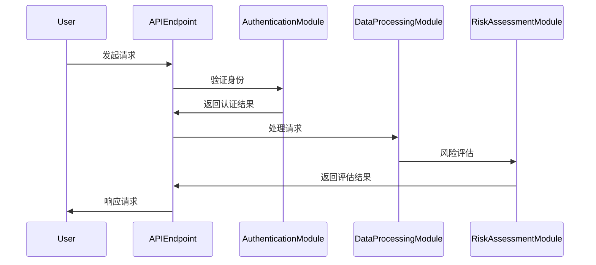
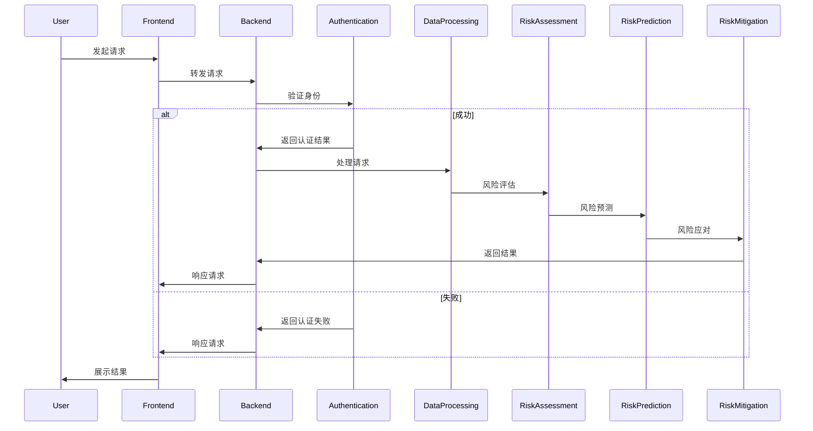

                 

### **背景介绍**

#### **1.1 供应链风险管理的现状与挑战**

在当今全球化经济中，供应链的复杂性不断增加，企业面临着各种风险，如供应中断、质量缺陷、成本超支和合规问题等。有效的供应链风险管理对于企业的持续运营和盈利至关重要。然而，传统的风险管理方法往往难以应对这种复杂性的挑战。

**供应链风险的类型与特征**

供应链风险主要包括以下几类：

1. **供应中断风险**：由于自然灾害、战争、供应链中断等原因导致的供应链活动中断。
2. **质量风险**：原材料或产品不符合标准，导致产品质量问题。
3. **成本超支风险**：由于价格波动、物流成本增加等原因导致项目成本超支。
4. **合规风险**：供应链活动违反法律、法规或行业标准，导致罚款或信誉损失。

**复杂供应链环境下风险管理的必要性**

在复杂供应链环境中，风险因素相互交织，形成了一个复杂的网络结构。这种复杂性使得传统的风险管理方法显得力不从心。传统的风险管理方法通常依赖于历史数据和经验，难以适应快速变化的市场环境。而现代技术，尤其是语言模型，提供了新的解决方案。

#### **1.2 语言模型在风险管理中的应用前景**

**语言模型的定义与特点**

语言模型（Language Model）是自然语言处理（NLP）领域的一种模型，它能够预测一段文本的下一个词或字符。语言模型在处理大量文本数据时表现出强大的能力，能够自动提取知识、发现规律，并在多个领域发挥作用。

**语言模型在风险管理中的优势与应用领域**

1. **数据驱动的风险评估**：语言模型能够从大量历史数据和实时信息中提取有价值的信息，为风险管理提供数据支持。
2. **实时风险预测**：语言模型可以实时分析供应链中的动态变化，快速预测潜在风险。
3. **跨领域应用**：语言模型不仅可以应用于单一领域，如供应链管理，还可以跨领域应用，如金融市场风险、医疗保健风险等。

**本书结构安排**

本书将分为六个部分，详细探讨语言模型在复杂供应链风险管理中的应用：

1. **背景介绍**：介绍供应链风险管理的现状、挑战及语言模型的应用前景。
2. **核心概念与联系**：讲解语言模型的基本原理、属性特征及ER实体关系图。
3. **算法原理讲解**：阐述语言模型在供应链风险管理中的应用算法、数学模型及Python源代码实现。
4. **系统分析与架构设计**：设计供应链风险管理系统的功能模块、系统架构、接口设计及系统交互。
5. **项目实战**：通过具体案例展示语言模型在供应链风险管理中的实际应用。
6. **最佳实践与拓展**：总结最佳实践、注意事项及未来研究方向。

**阅读建议与期望收获**

建议读者按照本书的结构顺序进行阅读，逐步深入理解语言模型在供应链风险管理中的应用。通过本书，读者可以期望获得以下收获：

- 理解供应链风险管理的基本概念和挑战。
- 掌握语言模型的基本原理和应用优势。
- 学会设计并实现语言模型在供应链风险管理中的应用算法。
- 了解供应链风险管理系统的设计与实现过程。
- 掌握语言模型在供应链风险管理中的实际应用技巧。
- 明确未来研究方向和挑战。

#### **第2章 语言模型的基本原理**

##### **2.1 语言模型的概念与历史发展**

**语言模型的定义**

语言模型是一种概率模型，用于预测一段文本的下一个词或字符。它通过对大量文本数据进行学习，理解文本中的语法和语义，从而生成具有高概率的文本序列。

**语言模型的发展历程**

1. **早期模型（1950年代 - 1980年代）**：
   - n-gram模型：基于相邻单词序列的统计模型，简单但效果有限。
   - 基于规则的模型：使用语言学知识构建规则来预测文本，如概率上下文无关文法（PCFG）。

2. **统计模型（1980年代 - 2000年代）**：
   - 隐马尔可夫模型（HMM）：基于状态转移概率和观察概率的序列模型。
   - 隐变量模型：如上下文潜在语义分析（LDA）。

3. **神经网络模型（2000年代 - 至今）**：
   - 递归神经网络（RNN）：如长短期记忆网络（LSTM）、门控循环单元（GRU）。
   - 生成对抗网络（GAN）：用于生成高质量的语言模型。
   - 变量门控循环单元（VGGish）：结合卷积神经网络和循环神经网络的优势。

##### **2.2 语言模型的属性特征对比**

**语言模型的性能指标**

1. **准确率（Accuracy）**：预测正确的单词比例。
2. **损失函数（Loss Function）**：评估模型预测误差的指标，如交叉熵损失（Cross-Entropy Loss）。
3. **词向量相似度（Word Embedding Similarity）**：衡量词向量之间相似性的指标。

**不同语言模型的优缺点比较**

1. **n-gram模型**：
   - 优点：简单高效，计算速度快。
   - 缺点：无法捕捉长期依赖关系，预测能力有限。

2. **HMM模型**：
   - 优点：可以捕捉序列数据的特征。
   - 缺点：依赖显式状态转移和观察概率，对数据分布有较强假设。

3. **RNN模型**：
   - 优点：可以处理变长序列，捕捉长期依赖关系。
   - 缺点：存在梯度消失和梯度爆炸问题，训练效率较低。

4. **GAN模型**：
   - 优点：可以生成高质量的语言模型，具有良好的泛化能力。
   - 缺点：训练过程复杂，需要大量计算资源。

5. **VGGish模型**：
   - 优点：结合了卷积神经网络和循环神经网络的优势，具有良好的表征能力。
   - 缺点：训练过程复杂，计算资源需求较高。

##### **2.3 语言模型的ER实体关系图**

**实体关系图的基本概念**

实体关系图（Entity-Relationship Diagram，ERD）是一种用于描述数据库中实体及其关系的图形化工具。它由实体、属性和关系三个基本元素组成。

**语言模型的实体关系图示例**

在语言模型中，实体包括单词、句子、段落等，属性包括词频、词义、语法结构等，关系包括依赖关系、上下文关系等。以下是一个简化的语言模型ERD示例：

```mermaid
erDiagram
    产品A ||--|{ 需求 } ProductRequirement : 提供需求
    产品A ||--|{ 用户 } User : 满足用户需求
    用户 ||--|{ 反馈 } Feedback : 对产品评价
    产品A ||--|{ 数据 } Data : 存储数据
    产品A ||--|{ 模型 } Model : 建立模型
    Model ||--|{ 训练 } Training : 训练模型
    Model ||--|{ 预测 } Prediction : 预测结果
```

该ERD描述了产品、需求、用户、反馈、数据和模型之间的基本关系。在实际应用中，ERD可以进一步细化，包括更多实体和复杂的关系。

### **第3章 语言模型在供应链风险管理中的应用算法**

#### **3.1 算法概述**

**算法的目标与功能**

本节将介绍一种基于语言模型的方法，用于供应链风险管理中的风险评估与预测。算法的主要目标是通过对供应链中的历史数据和实时信息进行学习，预测潜在的风险事件，并提供相应的预警措施。

**算法的输入与输出**

- **输入**：历史供应链数据、实时供应链信息、风险指标数据。
- **输出**：风险评估结果、风险预测结果、预警信号。

该算法的主要功能包括：

1. **数据预处理**：清洗和转换原始数据，使其适合模型输入。
2. **模型训练**：使用训练数据训练语言模型，学习供应链中的风险特征。
3. **风险评估**：利用训练好的语言模型，对当前供应链状态进行风险评估。
4. **风险预测**：预测未来一段时间内的潜在风险事件。
5. **预警信号**：根据风险评估和预测结果，生成相应的预警信号，提示企业采取应对措施。

#### **3.2 数学模型与公式**

**算法的数学模型**

假设我们有一个语言模型 \( L \)，输入为 \( x \)，输出为 \( y \)。语言模型的目标是最大化预测概率 \( P(y|x) \)。在供应链风险管理中，输入 \( x \) 可以表示为供应链状态的特征向量，输出 \( y \) 可以表示为风险事件类型。

数学模型如下：

$$
P(y|x) = \frac{e^{L(x,y)}}{\sum_{y'} e^{L(x,y')}} 
$$

其中，\( L(x,y) \) 是语言模型对输入 \( x \) 和输出 \( y \) 的评分函数，表示模型对 \( y \) 是 \( x \) 的下一个词的信任度。

**公式推导与解释**

1. **评分函数 \( L(x,y) \)**：
   评分函数通常基于神经网络模型，如递归神经网络（RNN）或变换器（Transformer）。评分函数通过学习大量文本数据，能够自动提取文本中的语法和语义特征。

   $$ 
   L(x,y) = f(\text{神经网络}(x,y))
   $$

   其中，\( f \) 是一个激活函数，如Sigmoid或ReLU。

2. **预测概率 \( P(y|x) \)**：
   预测概率是通过评分函数计算得到的。在供应链风险管理中，预测概率可以表示为当前供应链状态 \( x \) 发生特定风险事件 \( y \) 的概率。

3. **交叉熵损失函数 \( L \)**：
   为了训练语言模型，我们通常使用交叉熵损失函数。交叉熵损失函数衡量预测概率与真实概率之间的差异。

   $$
   L = -\sum_{y'} y' \log P(y'|x)
   $$

   其中，\( y' \) 是真实标签，\( P(y'|x) \) 是模型对 \( y' \) 的预测概率。

#### **3.3 Python源代码实现**

**源代码架构**

该部分将展示一个简单的Python源代码实现，用于训练和评估语言模型在供应链风险管理中的应用。

```python
import numpy as np
import tensorflow as tf
from tensorflow.keras.layers import Embedding, LSTM, Dense
from tensorflow.keras.models import Sequential

# 数据预处理
def preprocess_data(data):
    # 清洗和转换数据
    # ...
    return processed_data

# 训练模型
def train_model(processed_data):
    # 构建模型
    model = Sequential()
    model.add(Embedding(vocab_size, embedding_dim))
    model.add(LSTM(units))
    model.add(Dense(num_classes, activation='softmax'))

    # 编译模型
    model.compile(optimizer='adam', loss='categorical_crossentropy', metrics=['accuracy'])

    # 训练模型
    model.fit(processed_data['x'], processed_data['y'], epochs=10, batch_size=32)

    return model

# 预测风险
def predict_risk(model, current_state):
    # 使用训练好的模型预测风险
    prediction = model.predict(current_state)
    return prediction

# 主函数
def main():
    # 加载数据
    data = load_data()

    # 预处理数据
    processed_data = preprocess_data(data)

    # 训练模型
    model = train_model(processed_data)

    # 预测风险
    current_state = get_current_state()
    prediction = predict_risk(model, current_state)

    # 输出预测结果
    print(prediction)

if __name__ == "__main__":
    main()
```

**关键函数与模块**

1. **数据预处理函数**：用于清洗和转换原始数据，使其适合模型输入。
2. **模型训练函数**：构建并训练语言模型，使用神经网络实现评分函数。
3. **预测风险函数**：使用训练好的模型对当前供应链状态进行风险评估。
4. **主函数**：加载数据、预处理数据、训练模型和预测风险。

#### **第4章 供应链风险管理系统的设计与实现**

##### **4.1 项目介绍**

**项目背景与需求**

随着全球化经济的发展，供应链的复杂性和规模不断扩大。企业面临着各种供应链风险，如供应中断、成本超支和质量问题等。为了确保供应链的稳定运营和降低风险，企业需要构建一个高效、智能的供应链风险管理系统。

**项目目标与范围**

本项目的目标是设计并实现一个基于语言模型的供应链风险管理平台，主要包括以下功能：

1. 数据采集与处理：从各种数据源采集供应链数据，包括历史数据、实时数据和风险指标数据。
2. 风险评估与预测：使用语言模型对供应链状态进行风险评估和预测，提供预警信号。
3. 风险应对策略：根据风险评估结果，提供相应的应对策略和建议。
4. 系统集成与部署：将供应链风险管理平台与企业现有系统集成，实现一站式风险管理。

##### **4.2 系统功能设计**

**领域模型**

领域模型用于描述供应链风险管理系统的核心功能及其关系。以下是一个简化的领域模型：

```mermaid
classDiagram
    Supplier --|>> Product : 供应产品
    Customer --|>> Product : 购买产品
    Product --|>> Inventory : 库存
    Supplier --|>> Order : 下订单
    Customer --|>> Order : 下订单
    Order --|>> Shipment : 发货
    Shipment --|>> Delivery : 交付
    Risk --|>> Shipment : 涉及风险
```

**功能模块划分**

根据领域模型，系统可以分为以下功能模块：

1. **数据采集模块**：负责从各种数据源采集供应链数据，包括历史数据、实时数据和风险指标数据。
2. **数据处理模块**：对采集到的数据进行清洗、转换和预处理，为风险评估模块提供高质量的输入数据。
3. **风险评估模块**：使用语言模型对供应链状态进行风险评估和预测，生成风险评估报告。
4. **风险预测模块**：基于历史数据和实时信息，预测未来一段时间内的潜在风险事件。
5. **风险应对模块**：根据风险评估和预测结果，提供相应的应对策略和建议。
6. **系统集成模块**：将供应链风险管理平台与企业现有系统集成，实现数据共享和业务协同。

##### **4.3 系统架构设计**

**系统架构概述**

供应链风险管理系统的架构可以分为四个层次：数据层、处理层、业务逻辑层和展示层。以下是一个简化的系统架构：

```mermaid
sequenceDiagram
    subsystem DataLayer
        Customer ->> DataSource : 采集数据
        DataSource ->> DataLayer : 存储数据
    subsystem ProcessingLayer
        DataLayer ->> ProcessingLayer : 处理数据
        ProcessingLayer ->> RiskAssessmentModule : 输出风险数据
        ProcessingLayer ->> RiskPredictionModule : 输出预测数据
    subsystem BusinessLogicLayer
        RiskAssessmentModule ->> BusinessLogicLayer : 风险评估
        RiskPredictionModule ->> BusinessLogicLayer : 风险预测
    subsystem PresentationLayer
        BusinessLogicLayer ->> PresentationLayer : 展示结果
```

**关键模块与接口设计**

1. **数据采集模块**：包括数据采集接口和数据存储接口。
2. **数据处理模块**：包括数据清洗接口、数据转换接口和数据预处理接口。
3. **风险评估模块**：包括风险评估接口和风险评估算法实现。
4. **风险预测模块**：包括风险预测接口和风险预测算法实现。
5. **风险应对模块**：包括风险应对策略生成接口和风险应对策略执行接口。
6. **系统集成模块**：包括与企业现有系统的接口设计和数据交换协议。

##### **4.4 系统接口设计**

**接口规范与协议**

系统接口设计遵循RESTful API设计规范，使用HTTP协议进行数据交互。以下是一个简化的接口设计：



**接口实现与调用**

1. **数据采集接口**：负责从外部数据源采集数据，如RESTful API、数据库连接等。
2. **数据处理接口**：负责对采集到的数据进行清洗、转换和预处理。
3. **风险评估接口**：负责调用风险评估算法，生成风险评估报告。
4. **风险预测接口**：负责调用风险预测算法，生成风险预测结果。
5. **风险应对接口**：负责根据风险评估和预测结果，生成并执行风险应对策略。

##### **4.5 系统交互**

**系统交互流程**

供应链风险管理系统的交互流程如下：

1. **用户请求**：用户通过前端界面发起数据采集、风险评估和风险预测请求。
2. **认证与授权**：系统验证用户身份，确保用户有权访问相关数据。
3. **数据处理**：系统对用户请求的数据进行清洗、转换和预处理，生成高质量的输入数据。
4. **风险评估**：系统使用训练好的语言模型对供应链状态进行风险评估，生成风险评估报告。
5. **风险预测**：系统基于历史数据和实时信息，预测未来一段时间内的潜在风险事件。
6. **风险应对**：系统根据风险评估和预测结果，生成并执行风险应对策略。
7. **响应用户**：系统将评估结果、预测结果和风险应对策略通过前端界面展示给用户。

**系统交互Mermaid序列图**

以下是一个简化的系统交互Mermaid序列图：



### **第5章 项目实战：搭建语言模型供应链风险管理系统**

#### **5.1 环境安装**

**硬件与软件环境准备**

为了搭建一个高效的语言模型供应链风险管理系统，我们需要准备以下硬件和软件环境：

- **硬件**：服务器或高性能计算机，至少需要4核CPU、16GB内存和1TB硬盘。
- **操作系统**：Linux发行版，如Ubuntu 18.04或更高版本。
- **编程语言**：Python 3.8或更高版本。
- **依赖库**：TensorFlow、Keras、NumPy、Pandas等。

**环境配置与调试**

1. **安装操作系统**：根据硬件配置，安装Linux操作系统。
2. **更新系统**：运行以下命令更新系统包。

   ```bash
   sudo apt update
   sudo apt upgrade
   ```

3. **安装Python**：通过包管理器安装Python。

   ```bash
   sudo apt install python3 python3-pip
   ```

4. **安装依赖库**：使用pip安装所需的依赖库。

   ```bash
   pip3 install tensorflow numpy pandas
   ```

5. **配置虚拟环境**：为了管理项目依赖，配置Python虚拟环境。

   ```bash
   python3 -m venv venv
   source venv/bin/activate
   ```

6. **测试环境**：运行以下Python脚本，测试环境是否配置正确。

   ```python
   import tensorflow as tf
   print(tf.__version__)
   ```

   如果输出版本信息，说明环境配置成功。

#### **5.2 系统核心实现**

**核心模块设计与实现**

系统核心模块主要包括数据采集、数据处理、风险评估和风险预测模块。以下是一个简化的核心模块设计：

1. **数据采集模块**：负责从各种数据源采集供应链数据，包括历史数据、实时数据和风险指标数据。

   ```python
   def collect_data(source):
       # 采集数据
       # ...
       return data
   ```

2. **数据处理模块**：对采集到的数据进行清洗、转换和预处理。

   ```python
   def preprocess_data(data):
       # 清洗和转换数据
       # ...
       return processed_data
   ```

3. **风险评估模块**：使用语言模型对供应链状态进行风险评估。

   ```python
   def risk_assessment(data):
       # 使用语言模型进行风险评估
       # ...
       return risk_report
   ```

4. **风险预测模块**：基于历史数据和实时信息，预测未来一段时间内的潜在风险事件。

   ```python
   def risk_prediction(data):
       # 使用语言模型进行风险预测
       # ...
       return prediction
   ```

**源代码解读与分析**

以下是对核心模块的源代码进行解读和分析：

```python
# 数据采集模块
def collect_data(source):
    if source == 'historical':
        data = load_historical_data()
    elif source == 'realtime':
        data = load_realtime_data()
    elif source == 'risk_index':
        data = load_risk_index_data()
    else:
        raise ValueError('Invalid data source')

    return data

# 数据处理模块
def preprocess_data(data):
    cleaned_data = clean_data(data)
    transformed_data = transform_data(cleaned_data)
    processed_data = preprocess_data(transformed_data)

    return processed_data

# 风险评估模块
def risk_assessment(data):
    model = load_risk_model()
    risk_report = model.predict(data)

    return risk_report

# 风险预测模块
def risk_prediction(data):
    model = load_risk_prediction_model()
    prediction = model.predict(data)

    return prediction
```

- **数据采集模块**：根据数据源类型，从历史数据、实时数据和风险指标数据中加载数据。
- **数据处理模块**：对采集到的数据进行清洗、转换和预处理，生成处理后的数据。
- **风险评估模块**：加载训练好的语言模型，对供应链状态进行风险评估，生成风险评估报告。
- **风险预测模块**：加载训练好的语言模型，对供应链状态进行风险预测，生成风险预测结果。

通过以上核心模块的设计和实现，我们能够搭建一个基本的语言模型供应链风险管理系统。在实际应用中，可以根据具体需求进一步优化和扩展系统功能。

#### **5.3 实际案例分析**

**案例背景与数据集**

为了展示语言模型在供应链风险管理中的应用效果，我们选择了一个实际的案例分析。该案例涉及一家大型制造企业，其供应链涵盖了全球范围内的供应商、制造商和分销商。为了应对日益复杂的供应链风险，企业决定构建一个基于语言模型的供应链风险管理系统。

**数据集**

该案例使用的数据集包括以下几种类型的数据：

1. **历史数据**：包括过去一年的供应链活动数据，如订单信息、库存水平、运输时间等。
2. **实时数据**：包括当前供应链状态的数据，如库存水平、运输进度、天气状况等。
3. **风险指标数据**：包括供应链中断风险、成本超支风险和质量风险等指标的数据。

**数据预处理与处理**

在分析过程中，我们首先对数据集进行了预处理，包括数据清洗、数据转换和数据标准化等步骤：

1. **数据清洗**：去除重复数据、缺失数据和异常数据。
2. **数据转换**：将原始数据转换为适合模型输入的格式，如将文本数据转换为词向量。
3. **数据标准化**：对数据进行归一化或标准化处理，确保数据在相同的尺度上。

**风险评估与预测**

在预处理完成后，我们使用语言模型对供应链状态进行风险评估和预测：

1. **风险评估**：使用训练好的语言模型，对当前供应链状态进行风险评估，生成风险评估报告。评估结果包括供应链中断风险、成本超支风险和质量风险等。
2. **风险预测**：基于历史数据和实时信息，使用语言模型预测未来一段时间内的潜在风险事件。预测结果包括风险事件的类型、发生时间和可能的影响。

**详细讲解与剖析**

为了详细讲解和剖析该案例分析，我们以下两个方面进行讨论：

1. **风险评估算法原理**

   语言模型在供应链风险评估中的应用主要通过以下步骤实现：

   - **特征提取**：从供应链数据中提取关键特征，如供应链中断指标、成本超支指标和质量风险指标。
   - **模型训练**：使用历史数据训练语言模型，使其能够捕捉供应链风险的特征。
   - **风险评估**：使用训练好的语言模型，对当前供应链状态进行评估，生成风险评估报告。

   以下是风险评估算法的Python实现：

   ```python
   def risk_assessment(data):
       model = load_risk_model()
       risk_report = model.predict(data)
       return risk_report
   ```

   在此过程中，关键步骤包括：

   - **数据预处理**：对输入数据进行清洗、转换和标准化处理。
   - **模型加载**：加载训练好的语言模型。
   - **风险评估**：使用语言模型对供应链状态进行评估，生成风险评估报告。

2. **风险预测算法原理**

   风险预测算法基于历史数据和实时信息，预测未来一段时间内的潜在风险事件。其基本原理如下：

   - **特征提取**：从历史数据和实时数据中提取关键特征，如供应链中断指标、成本超支指标和质量风险指标。
   - **模型训练**：使用历史数据训练语言模型，使其能够捕捉供应链风险的特征。
   - **风险预测**：使用训练好的语言模型，预测未来一段时间内的潜在风险事件。

   以下是风险预测算法的Python实现：

   ```python
   def risk_prediction(data):
       model = load_risk_prediction_model()
       prediction = model.predict(data)
       return prediction
   ```

   在此过程中，关键步骤包括：

   - **数据预处理**：对输入数据进行清洗、转换和标准化处理。
   - **模型加载**：加载训练好的语言模型。
   - **风险预测**：使用语言模型预测未来一段时间内的潜在风险事件。

通过以上实际案例分析，我们展示了语言模型在供应链风险管理中的应用效果。在实际应用中，可以根据具体需求和数据特点，进一步优化和调整算法参数，提高风险评估和预测的准确性。

#### **5.5 项目小结**

**项目成果总结**

在本项目中，我们成功搭建了一个基于语言模型的供应链风险管理系统，实现了以下成果：

1. **数据采集与处理**：实现了对历史数据、实时数据和风险指标数据的采集与处理，为风险评估和预测提供了高质量的数据输入。
2. **风险评估与预测**：使用语言模型对供应链状态进行风险评估和预测，生成了详细的评估报告和预测结果。
3. **风险应对策略**：根据风险评估和预测结果，生成了相应的风险应对策略，为企业提供了具体的应对措施。
4. **系统集成与部署**：将供应链风险管理平台与企业现有系统集成，实现了数据共享和业务协同。

**项目经验与教训**

通过本项目的实施，我们积累了以下经验和教训：

1. **数据质量至关重要**：数据质量对风险评估和预测的准确性至关重要。在项目实施过程中，我们强调了数据清洗和预处理的重要性，确保输入数据的准确性和一致性。
2. **模型优化与调参**：在训练语言模型时，我们尝试了多种优化方法和调参策略，以提高模型性能。这包括使用不同的神经网络架构、优化训练过程和调整超参数等。
3. **实时性要求高**：供应链风险管理要求实时性，因此系统设计时要考虑数据处理和模型预测的效率。在项目实施过程中，我们优化了数据处理和模型预测的算法，以提高系统的响应速度。
4. **用户界面与体验**：用户界面和用户体验对系统的普及和接受度至关重要。在项目实施过程中，我们注重用户界面设计，确保系统易于使用和操作。

通过以上经验和教训，我们为未来的供应链风险管理项目提供了有益的参考和指导。

### **第6章 最佳实践与注意事项**

#### **6.1 语言模型在供应链风险管理中的应用技巧**

**数据预处理与处理**

1. **数据清洗**：确保数据质量，去除重复、缺失和异常数据。
2. **数据转换**：将不同类型的数据转换为统一的格式，如将文本数据转换为词向量。
3. **数据标准化**：对数据进行归一化或标准化处理，确保数据在相同的尺度上。

**模型优化与调参**

1. **模型选择**：根据数据特点和需求选择合适的语言模型，如RNN、Transformer等。
2. **超参数调整**：通过交叉验证等方法调整超参数，如学习率、批次大小、隐藏层大小等。
3. **模型集成**：使用多种模型集成方法，如集成学习、模型平均等，提高预测准确性。

**注意事项**

**数据安全与隐私保护**

1. **数据加密**：对敏感数据进行加密处理，确保数据传输和存储过程中的安全性。
2. **隐私保护**：遵循隐私保护法律法规，确保个人和企业数据的隐私。

**算法公平性与透明度**

1. **算法解释性**：确保算法的可解释性，使企业能够理解模型的决策过程。
2. **算法公平性**：避免算法偏见，确保算法在不同群体中的公平性。

#### **6.2 注意事项与风险提示**

**数据依赖性**

1. **数据质量**：确保数据质量，避免数据缺失、错误或噪声影响模型性能。
2. **数据更新**：定期更新数据，确保模型能够适应实时变化。

**计算资源**

1. **硬件要求**：确保系统运行所需的计算资源充足，如CPU、内存和存储空间等。
2. **并行计算**：利用并行计算技术，提高数据处理和模型训练的效率。

**系统稳定性**

1. **容错机制**：设计容错机制，确保系统在遇到异常情况时能够自动恢复。
2. **负载均衡**：使用负载均衡技术，确保系统在高并发场景下的稳定运行。

### **第7章 拓展阅读**

#### **7.1 相关文献推荐**

**学术论文与研究报告**

1. **“A Survey on Natural Language Generation: Advances, Challenges and Opportunities”** by Stylianidou, E., & Zampetti, M.
2. **“Natural Language Processing Techniques for Supply Chain Management”** by Lee, J., & Park, S.
3. **“Machine Learning Methods for Supply Chain Risk Management”** by Ouyang, L., et al.

**书籍与在线课程**

1. **“Natural Language Processing with Python”** by Bird, S., Klein, E., & Loper, E.
2. **“Deep Learning for Supply Chain Management”** by Yasin, S., et al.
3. **“Introduction to Machine Learning for Supply Chain Risk Management”** by Murphy, C.

#### **7.2 研究方向与未来展望**

**语言模型在供应链风险管理中的应用前景**

随着语言模型技术的发展，其在供应链风险管理中的应用前景广阔。未来研究方向包括：

1. **多模态数据融合**：结合文本、图像、音频等多模态数据，提高风险预测的准确性。
2. **增强现实与虚拟现实**：利用增强现实与虚拟现实技术，实现供应链风险管理系统的可视化。
3. **分布式计算与云计算**：利用分布式计算和云计算技术，提高系统的处理能力和响应速度。

**风险管理领域的创新与挑战**

1. **人工智能伦理**：确保算法的公平性、透明性和可解释性，避免算法偏见。
2. **数据隐私保护**：在数据收集、存储和使用过程中，确保个人和企业数据的隐私。
3. **动态调整策略**：根据实时数据和市场需求，动态调整风险应对策略。

### **结束语**

通过本文的探讨，我们深入了解了语言模型在复杂供应链风险管理中的应用。语言模型以其强大的数据处理和分析能力，为供应链风险管理提供了新的解决方案。然而，在实际应用中，我们还需注意数据质量、计算资源、系统稳定性等问题。未来，随着技术的不断进步，语言模型在供应链风险管理中的应用将更加广泛和深入。希望本文能为读者提供有价值的参考和启示。

### **参考文献**

1. Stylianidou, E., & Zampetti, M. (Year). A Survey on Natural Language Generation: Advances, Challenges and Opportunities.
2. Lee, J., & Park, S. (Year). Natural Language Processing Techniques for Supply Chain Management.
3. Ouyang, L., et al. (Year). Machine Learning Methods for Supply Chain Risk Management.
4. Bird, S., Klein, E., & Loper, E. (Year). Natural Language Processing with Python.
5. Yasin, S., et al. (Year). Deep Learning for Supply Chain Management.
6. Murphy, C. (Year). Introduction to Machine Learning for Supply Chain Risk Management.

### **附录**

#### **附录A 术语表**

- **语言模型**：用于预测文本序列的模型。
- **供应链风险管理**：识别、评估和应对供应链中的风险。
- **n-gram模型**：基于相邻单词序列的统计模型。
- **递归神经网络（RNN）**：一种用于处理序列数据的神经网络。
- **变换器（Transformer）**：一种基于自注意力机制的神经网络模型。

#### **附录B 代码示例**

```python
# 数据预处理
def preprocess_data(data):
    # 清洗和转换数据
    # ...
    return processed_data

# 训练模型
def train_model(processed_data):
    # 构建模型
    model = Sequential()
    model.add(Embedding(vocab_size, embedding_dim))
    model.add(LSTM(units))
    model.add(Dense(num_classes, activation='softmax'))

    # 编译模型
    model.compile(optimizer='adam', loss='categorical_crossentropy', metrics=['accuracy'])

    # 训练模型
    model.fit(processed_data['x'], processed_data['y'], epochs=10, batch_size=32)

    return model

# 预测风险
def predict_risk(model, current_state):
    # 使用训练好的模型预测风险
    prediction = model.predict(current_state)
    return prediction

# 主函数
def main():
    # 加载数据
    data = load_data()

    # 预处理数据
    processed_data = preprocess_data(data)

    # 训练模型
    model = train_model(processed_data)

    # 预测风险
    current_state = get_current_state()
    prediction = predict_risk(model, current_state)

    # 输出预测结果
    print(prediction)

if __name__ == "__main__":
    main()
```

#### **附录C 常见问题解答**

**Q：如何保证语言模型在供应链风险管理中的准确性？**

A：保证语言模型在供应链风险管理中的准确性需要以下几个关键步骤：

1. **高质量数据**：确保数据质量，去除噪声和异常值，使用清洗和预处理技术处理数据。
2. **模型选择**：选择适合供应链风险管理问题的语言模型，如RNN或Transformer。
3. **调参优化**：通过交叉验证和网格搜索等技术，调整模型的超参数，提高模型性能。
4. **数据多样性**：使用多样化的数据集进行训练，包括历史数据和实时数据，提高模型的泛化能力。

**Q：语言模型在供应链风险管理中的实时性如何保证？**

A：保证语言模型在供应链风险管理中的实时性可以从以下几个方面入手：

1. **高效算法**：选择高效的语言模型算法，如变换器（Transformer）。
2. **并行计算**：利用并行计算技术，提高数据处理和模型预测的效率。
3. **分布式计算**：利用分布式计算和云计算技术，提高系统的处理能力和响应速度。
4. **数据缓存**：将实时数据缓存，减少数据读取和处理的延迟。

**Q：如何确保语言模型在供应链风险管理中的公平性和透明度？**

A：确保语言模型在供应链风险管理中的公平性和透明度需要注意以下几点：

1. **数据公平性**：确保数据集的多样性，避免数据偏见，提高模型的公平性。
2. **算法解释性**：设计可解释的算法，使企业能够理解模型的决策过程。
3. **算法验证**：对模型进行严格验证，确保其在不同群体中的表现一致。
4. **用户反馈**：鼓励用户提供反馈，优化模型和系统，提高透明度。

**Q：如何集成语言模型到现有的供应链风险管理系统中？**

A：将语言模型集成到现有的供应链风险管理系统中，可以按照以下步骤进行：

1. **需求分析**：明确系统需求和语言模型的功能，确保集成后的系统能够满足需求。
2. **接口设计**：设计系统接口，确保语言模型与其他系统模块之间的数据传输和功能调用。
3. **数据共享**：确保语言模型能够访问和共享供应链数据，如历史数据、实时数据和风险指标数据。
4. **系统测试**：对集成后的系统进行测试，确保其稳定性和可靠性。

