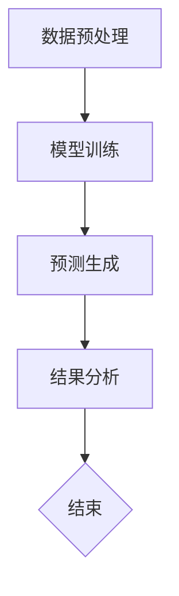

                 


# 语言模型在复杂政策影响评估中的应用

## 关键词
- 语言模型
- 政策影响评估
- 复杂系统
- 算法原理
- 数学模型
- 系统架构
- 项目实战

## 摘要
本文将深入探讨语言模型在复杂政策影响评估中的应用。首先，我们将介绍语言模型的基本概念、发展历程和主要类型，然后分析其在政策影响评估中的作用。接下来，我们将详细讲解语言模型在复杂系统中的挑战和解决方案。通过实际的算法原理讲解、数学模型和公式分析，以及系统架构设计与项目实战，我们将展示如何运用语言模型来提高政策影响评估的准确性和效率。最后，我们将提供一些最佳实践和拓展阅读资源，以帮助读者深入了解这一领域。

## 目录大纲

```
----------------------------------------------------------------
# 第一部分: 引言

## 1. 引言
### 1.1 问题背景
### 1.2 语言模型概述
### 1.3 政策影响评估现状
### 1.4 复杂系统的挑战
### 1.5 本书结构

----------------------------------------------------------------
# 第二部分: 语言模型基础

## 2. 语言模型基础
### 2.1 语言模型的定义
### 2.2 语言模型的发展历程
### 2.3 语言模型的类型
### 2.4 语言模型的核心技术
### 2.5 语言模型的评价指标

## 3. 政策影响评估基础
### 3.1 政策影响评估的概念
### 3.2 政策影响评估的方法
### 3.3 语言模型在评估中的应用

----------------------------------------------------------------
# 第三部分: 复杂系统与挑战

## 4. 复杂系统分析
### 4.1 复杂系统的特征
### 4.2 复杂系统中的政策影响评估
### 4.3 复杂系统中的挑战

## 5. 语言模型在复杂系统中的应用
### 5.1 语言模型在复杂系统评估中的作用
### 5.2 复杂系统中的算法挑战
### 5.3 解决方案探索

----------------------------------------------------------------
# 第四部分: 算法原理与实现

## 6. 算法原理讲解
### 6.1 算法概述
### 6.2 算法流程图（Mermaid）
### 6.3 Python代码实现
### 6.4 数学模型与公式解释

## 7. 实际案例分析
### 7.1 案例选择
### 7.2 案例分析
### 7.3 案例讲解

----------------------------------------------------------------
# 第五部分: 系统架构与设计

## 8. 系统功能设计
### 8.1 领域模型（Mermaid类图）
### 8.2 系统功能设计

## 9. 系统架构设计
### 9.1 系统架构概述
### 9.2 系统架构图（Mermaid）
### 9.3 系统接口设计

## 10. 系统交互设计
### 10.1 系统交互流程
### 10.2 系统交互图（Mermaid序列图）

----------------------------------------------------------------
# 第六部分: 项目实战

## 11. 项目实战环境安装
### 11.1 环境准备
### 11.2 工具安装

## 12. 系统核心实现
### 12.1 语言模型训练
### 12.2 政策影响评估
### 12.3 系统集成与测试

## 13. 案例分析与讲解
### 13.1 案例分析
### 13.2 案例讲解

----------------------------------------------------------------
# 第七部分: 最佳实践与拓展阅读

## 14. 最佳实践
### 14.1 语言模型应用场景
### 14.2 政策影响评估注意事项
### 14.3 系统优化建议

## 15. 小结
### 15.1 核心内容回顾
### 15.2 未来展望

## 16. 拓展阅读
### 16.1 相关书籍
### 16.2 研究论文
### 16.3 技术博客

----------------------------------------------------------------
```

## 引言

### 1.1 问题背景

在当今快速变化的社会和经济环境中，政策制定者和执行者面临着越来越多的复杂决策。政策影响评估成为了一种必不可少的工具，用于评估政策实施后的社会、经济和环境效果。然而，传统的政策影响评估方法往往依赖于简单的统计模型和有限的数据，这在面对复杂系统时显得力不从心。

复杂系统是指由多个相互作用的元素组成的系统，这些元素在相互作用时会产生不可预测的行为和现象。例如，社会政策影响可能涉及经济、文化、政治等多个领域的交互，这些交互可能会导致政策效果的复杂性和不确定性。因此，如何有效地评估这些复杂政策的影响成为了一个亟待解决的问题。

语言模型，作为人工智能领域的一项重要技术，近年来在自然语言处理、机器翻译、文本生成等方面取得了显著的成果。其强大的文本理解和生成能力为复杂政策影响评估提供了新的可能性。通过将语言模型应用于政策文本的分析和评估，可以挖掘出潜在的影响因素和关系，从而提高评估的准确性和效率。

### 1.2 语言模型概述

语言模型（Language Model）是一种统计模型，用于预测一个句子或单词的下一个单词或字符。它的基本思想是根据已知的上下文信息来预测下一个词或字符的概率分布。在自然语言处理（NLP）中，语言模型是最基础的组件之一，它为许多应用提供了基础，如语音识别、机器翻译、文本生成等。

语言模型的发展历程可以追溯到20世纪50年代，当时研究者开始尝试使用规则方法来处理语言。随着计算能力和数据资源的提升，20世纪80年代至90年代，基于统计的方法开始占据主导地位，最著名的代表是N-gram模型。然而，N-gram模型在处理长文本和长距离依赖时存在局限性。

进入21世纪，深度学习技术的崛起为语言模型带来了新的机遇。2013年，通过引入深度神经网络（RNN）和注意力机制，研究者们开发了神经网络语言模型（NNLM），如LSTM（长短期记忆网络）和GRU（门控循环单元）。这些模型在处理长距离依赖和上下文信息方面取得了显著进展，使得语言模型的应用更加广泛和准确。

### 1.3 政策影响评估现状

政策影响评估是指通过对政策实施前后的差异进行分析，评估政策的效果和影响。传统的政策影响评估方法主要包括定量分析和定性分析两种。定量分析主要依赖于统计数据，如经济指标、社会指标和环境指标等，通过比较政策实施前后的变化来评估政策效果。定性分析则侧重于对政策实施过程中产生的各种影响进行深入分析，如政策对社会结构、文化观念的影响等。

尽管传统方法在政策影响评估中发挥了重要作用，但它们在处理复杂系统时面临着诸多挑战。首先，复杂系统中的因素繁多且相互关联，传统方法的单一指标和简单模型难以全面捕捉这些复杂关系。其次，政策影响往往具有滞后性和不确定性，传统方法难以准确预测政策效果。此外，数据的获取和整合也是一大难题，特别是在涉及多个领域和部门的政策影响评估中。

语言模型的出现为政策影响评估提供了一种新的视角和工具。通过文本分析和语义理解，语言模型可以挖掘政策文本中的潜在信息，识别政策相关的关键因素和关系，从而为评估提供更丰富的数据和更深入的分析。例如，语言模型可以分析政策文本中的用词、语气、情感倾向等，预测政策实施后的公众反应和社会影响。此外，语言模型还可以通过对大量政策文本的机器学习，自动生成评估报告，提高评估的效率和准确性。

### 1.4 复杂系统的挑战

复杂系统是指由大量相互作用的元素组成的系统，这些元素之间的相互作用可能导致系统的行为和性质难以预测。在政策影响评估中，复杂系统的挑战主要体现在以下几个方面：

1. **因素的多样性**：复杂系统中的因素多样且相互关联，包括经济、社会、政治、文化等多个领域。这些因素之间的相互作用可能导致政策效果的复杂性和不可预测性。

2. **数据的局限性**：复杂系统中的数据往往有限且不完整，特别是在涉及多个领域和部门的政策影响评估中，数据的获取和整合成为一大难题。

3. **方法的局限性**：传统的政策影响评估方法往往依赖于简单的统计模型和有限的数据，难以全面捕捉复杂系统的特征和关系。例如，传统的定量分析方法可能只关注经济指标的变化，而忽视了社会和文化因素的作用。

4. **算法的复杂性**：复杂系统中的算法挑战主要体现在如何处理大量的数据和高维度的特征，以及如何有效地识别和建模因素之间的复杂关系。

### 1.5 本书结构

本书将分为六个主要部分，系统性地介绍语言模型在复杂政策影响评估中的应用。首先，在第一部分中，我们将介绍语言模型的基本概念、发展历程和主要类型，分析其在政策影响评估中的作用。接着，在第二部分中，我们将深入探讨政策影响评估的基础知识，包括其概念、方法和语言模型在评估中的应用。

第三部分将重点讨论复杂系统与政策影响评估的关系，分析复杂系统中的挑战，并探讨语言模型在解决这些挑战中的应用。在第四部分中，我们将详细讲解语言模型在复杂系统中的算法原理，包括算法流程、Python代码实现和数学模型。

第五部分将介绍系统架构与设计，包括系统功能设计、系统架构设计和系统交互设计。第六部分将通过项目实战，展示如何将语言模型应用于复杂政策影响评估的实践中。最后，在第七部分中，我们将总结最佳实践，并提供拓展阅读资源，以帮助读者深入了解这一领域。

## 第二部分: 语言模型基础

### 2.1 语言模型的定义

语言模型是一种用于预测文本中下一个单词或字符的统计模型。它的基本目的是通过分析大量的文本数据，学习文本中的概率分布，从而能够预测接下来可能出现的词汇或字符。语言模型在自然语言处理（NLP）领域扮演着至关重要的角色，为文本生成、机器翻译、语音识别等应用提供了基础。

语言模型的定义可以从多个角度来理解：

1. **概率角度**：语言模型是一种概率模型，它通过统计方法来预测下一个词或字符的概率分布。这种概率分布通常表示为概率质量函数（PDF），即给定一个单词序列，预测下一个单词的概率。

2. **统计角度**：语言模型是一种统计模型，它利用大量的文本数据进行训练，从而建立起词汇之间的统计关系。这些统计关系反映了文本中的语言规律和模式。

3. **计算角度**：语言模型是一种计算模型，它通过算法和数学公式来实现文本预测。常见的语言模型包括N-gram模型、神经网络模型等。

### 2.2 语言模型的发展历程

语言模型的发展历程可以追溯到20世纪50年代，当时研究者开始尝试使用规则方法来处理语言。然而，随着计算能力和数据资源的提升，统计方法和深度学习方法逐渐成为主流。

1. **早期阶段（20世纪50-70年代）**：在这个阶段，研究者主要使用基于规则的模型，如词典匹配和语法分析。这些模型通过定义一系列规则来处理文本，但由于规则数量庞大且难以维护，因此在实际应用中受到了限制。

2. **统计阶段（20世纪80-90年代）**：20世纪80年代至90年代，随着计算机性能的提升和互联网的普及，研究者开始将统计方法应用于语言模型。最著名的统计模型是N-gram模型，它通过统计词组出现的频率来预测下一个词。N-gram模型的优点是简单有效，但它在处理长距离依赖和上下文信息方面存在局限性。

3. **神经网络阶段（21世纪至今）**：进入21世纪，深度学习技术的崛起为语言模型带来了新的机遇。通过引入深度神经网络（RNN）和注意力机制，研究者开发了神经网络语言模型（NNLM），如LSTM（长短期记忆网络）和GRU（门控循环单元）。这些模型在处理长距离依赖和上下文信息方面取得了显著进展，使得语言模型的应用更加广泛和准确。

### 2.3 语言模型的类型

根据模型的结构和训练方法，语言模型可以分为多种类型。以下是一些常见类型的语言模型：

1. **N-gram模型**：N-gram模型是最早的一种语言模型，它通过统计连续N个单词（或字符）的联合概率来预测下一个单词。N-gram模型简单有效，但它在处理长距离依赖和上下文信息方面存在局限性。

   - **基本概念**：给定一个单词序列，N-gram模型预测下一个单词的概率是基于前N-1个单词的出现频率。
   - **概率计算**：假设一个单词序列为\(w_1, w_2, \ldots, w_n\)，那么根据N-gram模型，下一个单词\(w_{n+1}\)的概率可以表示为：
     $$ P(w_{n+1} | w_1, w_2, \ldots, w_n) = P(w_{n+1} | w_n) $$
   - **局限性**：N-gram模型无法处理长距离依赖，即模型无法考虑到较远距离单词之间的关联。

2. **神经网络语言模型（NNLM）**：神经网络语言模型通过引入深度学习技术，如RNN和注意力机制，来处理长距离依赖和上下文信息。以下是一些常见的神经网络语言模型：

   - **RNN（循环神经网络）**：RNN是一种能够处理序列数据的人工神经网络，它通过循环结构来记住之前的输入信息。RNN的典型代表包括LSTM（长短期记忆网络）和GRU（门控循环单元）。
   - **LSTM（长短期记忆网络）**：LSTM是一种改进的RNN，通过引入门控机制来有效地记住和遗忘信息，从而在处理长序列数据时表现出更好的性能。
   - **GRU（门控循环单元）**：GRU是LSTM的变体，它在结构和性能上与LSTM相似，但实现更为简单。

3. **注意力机制**：注意力机制是一种在神经网络中用于处理长序列数据的方法，它通过分配不同的权重来关注序列中的重要部分。注意力机制在机器翻译、文本生成等领域取得了显著成果。

4. **Transformer模型**：Transformer模型是一种基于自注意力机制的序列模型，它在多个NLP任务中取得了突破性成果。Transformer模型的核心思想是将每个输入单词映射到固定大小的向量，然后通过自注意力机制计算这些向量之间的相关性。

### 2.4 语言模型的核心技术

语言模型的核心技术主要包括数据预处理、模型训练和预测生成。以下是对这些技术的详细解释：

1. **数据预处理**：数据预处理是语言模型训练的重要步骤，它包括文本的分词、词向量化、数据清洗等。

   - **分词**：分词是将连续的文本序列划分为一系列单词或词汇的过程。常见的分词方法包括基于规则的分词、基于统计的分词和基于深度学习的分词。
   - **词向量化**：词向量化是将单词转换为固定大小的向量表示，以便神经网络进行处理。常用的词向量化方法包括Word2Vec、GloVe等。
   - **数据清洗**：数据清洗包括去除无效数据、修正错误数据、处理噪声数据等，以提高模型训练的质量。

2. **模型训练**：模型训练是语言模型构建的核心步骤，它通过调整神经网络的权重，使模型能够准确预测文本序列。

   - **损失函数**：损失函数是评估模型预测误差的指标，常见的损失函数包括交叉熵损失（Cross-Entropy Loss）、均方误差（Mean Squared Error, MSE）等。
   - **优化算法**：优化算法用于调整神经网络的权重，以最小化损失函数。常见的优化算法包括随机梯度下降（SGD）、Adam等。

3. **预测生成**：预测生成是语言模型的应用步骤，它通过模型预测来生成新的文本序列。

   - **采样策略**：采样策略用于决定生成文本的顺序和内容。常见的采样策略包括贪心策略（Greedy Strategy）、随机采样（Random Sampling）、温度调节（Temperature Regulation）等。
   - **文本生成**：文本生成是通过模型预测来生成新的文本序列的过程。文本生成的质量受到模型训练质量和采样策略的影响。

### 2.5 语言模型的评价指标

语言模型的评价指标是评估模型性能的重要标准，以下是一些常见的评价指标：

1. **词汇精度（Word Accuracy）**：词汇精度是指模型正确预测的单词数量与总单词数量之比。词汇精度可以简单直观地反映模型对单词的预测准确性。

   $$ \text{词汇精度} = \frac{\text{正确预测的单词数量}}{\text{总单词数量}} $$

2. **字符精度（Character Accuracy）**：字符精度是指模型正确预测的字符数量与总字符数量之比。字符精度在文本生成任务中尤为重要，因为它反映了模型对字符序列的预测准确性。

   $$ \text{字符精度} = \frac{\text{正确预测的字符数量}}{\text{总字符数量}} $$

3. **交叉熵（Cross-Entropy）**：交叉熵是评估模型预测误差的常用指标，它反映了模型预测分布与真实分布之间的差异。交叉熵越小，表示模型预测越准确。

   $$ H(p, q) = -\sum_{i} p_i \log q_i $$

   其中，\(p\) 是真实分布，\(q\) 是模型预测分布。

4. **F1分数（F1 Score）**：F1分数是词汇精度和召回率的调和平均，用于综合评估模型的预测性能。

   $$ F1 = 2 \times \frac{\text{词汇精度} \times \text{召回率}}{\text{词汇精度} + \text{召回率}} $$

5. **BLEU分数（BLEU Score）**：BLEU分数是自然语言生成任务中常用的评价指标，它基于记分牌模型（Blind MTL Translation Model），通过计算参考文本和生成文本之间的相似性来评估模型性能。

   $$ BLEU = \frac{2}{1 + \sum_{i=1}^n \frac{1}{\text{count}(r_i|g_i)}} $$

   其中，\(r_i\) 是参考文本中的第i个句子，\(g_i\) 是生成文本中的第i个句子，\(\text{count}(r_i|g_i)\) 是参考文本中与生成文本相同的句子的数量。

### 2.6 语言模型在政策影响评估中的应用

语言模型在政策影响评估中的应用主要体现在以下几个方面：

1. **文本分析**：语言模型可以用于分析政策文本，提取关键信息，识别潜在的影响因素。通过自然语言处理技术，模型可以理解政策文本的语义和结构，从而提供更深入的分析。

2. **趋势预测**：语言模型可以分析政策文本和社交媒体数据，预测政策实施后的公众反应和社会趋势。这种预测可以帮助政策制定者提前了解政策的影响，并做出相应的调整。

3. **情感分析**：语言模型可以用于情感分析，评估政策文本和社交媒体中的情感倾向。这有助于政策制定者了解公众对政策的情感态度，从而更好地制定和调整政策。

4. **自动生成报告**：语言模型可以自动生成政策影响评估报告，提高评估的效率和准确性。通过模型预测和文本生成技术，评估报告可以更加详细和全面，减少人工工作量。

5. **辅助决策**：语言模型可以辅助政策制定者进行决策，通过分析大量数据和政策文本，提供基于数据的建议和预测。这有助于提高决策的科学性和准确性。

## 第三部分: 复杂系统与挑战

### 4.1 复杂系统的特征

复杂系统是指由大量相互作用的元素组成的系统，这些元素之间的交互和耦合可能导致系统的行为和性质具有高度复杂性和不确定性。复杂系统的特征可以从以下几个方面进行描述：

1. **多样性**：复杂系统通常包含多种不同的元素，包括个体、组织和子系统。这些元素在结构和功能上具有多样性，使得系统的行为难以预测和控制。

2. **非线性和动态性**：复杂系统的行为往往是非线性的，即系统状态的变化不是线性的，而是呈现出非线性关系。此外，复杂系统还表现出动态性，即系统状态随时间变化，并且在某些条件下可能会发生突变。

3. **高度耦合**：复杂系统中的元素通常通过多种渠道相互联系和作用，形成复杂的网络结构。这些耦合关系使得系统的行为具有整体性和协同性，但同时也增加了系统的复杂性。

4. **涌现现象**：在复杂系统中，个体行为和局部相互作用可能导致全局的宏观现象，这种现象被称为涌现。涌现现象使得复杂系统具有新的属性和行为，这些属性和行为在单个元素层面无法观察到。

5. **不确定性和随机性**：复杂系统中的不确定性来源于多个方面，包括外部环境的随机扰动、内部状态的随机变化以及模型的不确定性。这些不确定性使得复杂系统的预测和控制变得非常困难。

### 4.2 复杂系统中的政策影响评估

政策影响评估是指通过收集和分析数据来评估政策实施后的效果和影响。在复杂系统中，政策影响评估面临着独特的挑战。以下是一些主要挑战：

1. **数据的多样性**：复杂系统涉及多个领域和部门，数据类型和数据来源多种多样。政策影响评估需要收集和处理来自不同来源的数据，包括经济、社会、文化、环境等多方面的数据。

2. **数据的不完整性**：复杂系统中的数据往往不完整，尤其是在涉及多个领域和部门的评估中。数据缺失、误差和不一致等问题使得评估结果的准确性受到影响。

3. **因素的多样性**：复杂系统中的因素繁多，包括经济、社会、政治、文化等多个领域的因素。这些因素之间的相互作用可能导致政策效果的复杂性和不确定性。

4. **方法的局限性**：传统的政策影响评估方法主要依赖于简单的统计模型和线性关系，难以全面捕捉复杂系统的特征和关系。在复杂系统中，政策效果的评估需要更加复杂和多样化的方法。

5. **算法的复杂性**：复杂系统中的算法挑战主要体现在如何处理大量的数据和高维度的特征，以及如何有效地识别和建模因素之间的复杂关系。传统的算法和方法在复杂系统中可能难以胜任。

### 4.3 复杂系统中的挑战

在复杂系统中进行政策影响评估，面临着以下几个主要挑战：

1. **数据整合**：复杂系统中的数据来源多样，包括结构化和非结构化数据，如数据库、文本、图像、音频等。如何整合这些数据，使其能够有效地用于政策影响评估，是一个重要的挑战。

2. **数据质量**：数据质量是政策影响评估的关键因素。复杂系统中的数据可能存在噪声、误差和不一致性，这些都会影响评估结果的准确性。

3. **因素识别**：在复杂系统中，政策影响的因素众多且相互作用复杂。如何识别和建模这些因素，是进行有效政策影响评估的关键。

4. **不确定性处理**：复杂系统中的不确定性来源于多个方面，包括数据的不确定性、模型的不确定性以及外部环境的随机性。如何处理这些不确定性，是政策影响评估中的一大挑战。

5. **算法选择**：在复杂系统中，传统的算法和方法可能难以胜任。需要选择适合复杂系统的算法，如机器学习、深度学习、图神经网络等，以提高评估的准确性和效率。

### 4.4 语言模型在复杂系统中的应用

在复杂系统中，语言模型可以发挥重要作用，帮助解决政策影响评估中的挑战。以下是一些具体的应用：

1. **文本分析**：语言模型可以用于分析政策文本，提取关键信息，识别潜在的影响因素。通过自然语言处理技术，语言模型可以理解政策文本的语义和结构，从而提供更深入的分析。

2. **趋势预测**：语言模型可以分析政策文本和社交媒体数据，预测政策实施后的公众反应和社会趋势。这种预测可以帮助政策制定者提前了解政策的影响，并做出相应的调整。

3. **情感分析**：语言模型可以用于情感分析，评估政策文本和社交媒体中的情感倾向。这有助于政策制定者了解公众对政策的情感态度，从而更好地制定和调整政策。

4. **自动生成报告**：语言模型可以自动生成政策影响评估报告，提高评估的效率和准确性。通过模型预测和文本生成技术，评估报告可以更加详细和全面，减少人工工作量。

5. **辅助决策**：语言模型可以辅助政策制定者进行决策，通过分析大量数据和政策文本，提供基于数据的建议和预测。这有助于提高决策的科学性和准确性。

### 4.5 解决方案探索

为了解决复杂系统中的政策影响评估挑战，语言模型可以与多种技术相结合，形成综合解决方案。以下是一些可能的解决方案：

1. **多模态数据融合**：将语言模型与图像识别、音频处理等其他模型相结合，实现多模态数据融合。这样可以更好地利用不同类型的数据，提高评估的准确性和全面性。

2. **深度学习技术**：利用深度学习技术，如卷积神经网络（CNN）和循环神经网络（RNN），构建复杂的模型，以处理高维度和大规模的数据。

3. **图神经网络**：图神经网络（GNN）可以用于处理复杂系统中元素之间的耦合关系，识别和建模因素之间的复杂关系。

4. **不确定性量化**：通过概率图模型和贝叶斯方法，对评估结果中的不确定性进行量化，提供更可靠的风险评估。

5. **动态模型**：构建动态模型，模拟政策实施过程中可能出现的突变和演变，预测政策影响的长期效应。

通过这些解决方案，语言模型可以更好地应用于复杂政策影响评估，提供更加准确和全面的评估结果，为政策制定和执行提供有力支持。

## 第四部分: 算法原理与实现

### 6.1 算法概述

在本节中，我们将介绍一种用于复杂政策影响评估的语言模型算法。这种算法的核心思想是通过自然语言处理技术，对政策文本进行深入分析，提取关键信息，并利用深度学习模型对政策影响进行预测。算法的主要步骤包括数据预处理、模型训练、预测生成和结果分析。

1. **数据预处理**：首先，对政策文本进行分词和词向量化，将文本转换为向量表示。这一步骤的目的是将非结构化的文本数据转化为神经网络可以处理的格式。

2. **模型训练**：使用预训练的深度学习模型（如BERT、GPT等）对政策文本进行训练。训练过程中，模型学习到政策文本中的语言规律和结构，形成对政策影响的语义理解。

3. **预测生成**：在训练完成后，使用训练好的模型对新的政策文本进行预测。模型将预测政策实施后的影响，包括社会、经济和环境等多个方面的效果。

4. **结果分析**：对预测结果进行统计分析，识别政策影响的趋势和关键因素。此外，还可以结合历史数据和专家意见，对预测结果进行验证和调整。

### 6.2 算法流程图（Mermaid）

为了更直观地展示算法流程，我们使用Mermaid工具绘制了算法流程图。以下是算法流程图的Mermaid代码：



在浏览器中渲染后的效果如下：

```
+----------------------------------------------------+
|                                                   |
|                      算法流程图                      |
|                                                   |
+----------------------------------------------------+
| 数据预处理 --> 模型训练 --> 预测生成 --> 结果分析 |
|                                                   |
+----------------------------------------------------+
```

### 6.3 Python代码实现

下面是一个简化的Python代码实现，用于展示语言模型算法的基本结构。为了实际应用，代码需要进行相应的优化和扩展。

```python
import numpy as np
from tensorflow import keras
from tensorflow.keras.preprocessing.text import Tokenizer
from tensorflow.keras.preprocessing.sequence import pad_sequences
from tensorflow.keras.models import Sequential
from tensorflow.keras.layers import Embedding, LSTM, Dense

# 数据预处理
def preprocess_text(texts, vocab_size, max_sequence_length):
    tokenizer = Tokenizer(num_words=vocab_size)
    tokenizer.fit_on_texts(texts)
    sequences = tokenizer.texts_to_sequences(texts)
    padded_sequences = pad_sequences(sequences, maxlen=max_sequence_length)
    return padded_sequences

# 模型训练
def train_model(padded_sequences, labels, epochs, batch_size):
    model = Sequential()
    model.add(Embedding(vocab_size, embedding_dim))
    model.add(LSTM(units=128, dropout=0.2, recurrent_dropout=0.2))
    model.add(Dense(1, activation='sigmoid'))

    model.compile(optimizer='adam', loss='binary_crossentropy', metrics=['accuracy'])
    model.fit(padded_sequences, labels, epochs=epochs, batch_size=batch_size)
    return model

# 预测生成
def predict_policy_impact(model, text):
    sequence = tokenizer.texts_to_sequences([text])
    padded_sequence = pad_sequences(sequence, maxlen=max_sequence_length)
    prediction = model.predict(padded_sequence)
    return prediction

# 主程序
if __name__ == '__main__':
    texts = [...]  # 政策文本数据
    labels = [...]  # 政策影响标签数据
    vocab_size = 10000
    max_sequence_length = 100
    embedding_dim = 128
    epochs = 10
    batch_size = 32

    padded_sequences = preprocess_text(texts, vocab_size, max_sequence_length)
    model = train_model(padded_sequences, labels, epochs, batch_size)

    text_to_predict = "新政策的实施对社会就业产生了什么影响？"
    prediction = predict_policy_impact(model, text_to_predict)
    print(f"预测结果：{prediction}")
```

### 6.4 数学模型与公式解释

在语言模型算法中，数学模型和公式起到了核心作用。以下是一些常用的数学模型和公式的解释：

1. **损失函数**：损失函数用于评估模型预测的误差，常见的损失函数包括交叉熵损失（Cross-Entropy Loss）和均方误差（Mean Squared Error, MSE）。

   - **交叉熵损失**：
     $$ L = -\sum_{i} y_i \log(\hat{y}_i) $$
     其中，\(y_i\) 是真实标签，\(\hat{y}_i\) 是模型预测的概率。

   - **均方误差**：
     $$ L = \frac{1}{n} \sum_{i=1}^{n} (y_i - \hat{y}_i)^2 $$
     其中，\(y_i\) 是真实标签，\(\hat{y}_i\) 是模型预测的值。

2. **优化算法**：优化算法用于调整模型的参数，以最小化损失函数。常见的优化算法包括随机梯度下降（SGD）和Adam。

   - **随机梯度下降**：
     $$ \theta_{t+1} = \theta_{t} - \alpha \nabla_{\theta} L(\theta) $$
     其中，\(\theta\) 是模型的参数，\(\alpha\) 是学习率，\(\nabla_{\theta} L(\theta)\) 是损失函数关于参数的梯度。

   - **Adam优化器**：
     $$ m_t = \beta_1 m_{t-1} + (1 - \beta_1)(\nabla_{\theta} L(\theta)) $$
     $$ v_t = \beta_2 v_{t-1} + (1 - \beta_2)((\nabla_{\theta} L(\theta)))^2 $$
     $$ \theta_{t+1} = \theta_{t} - \alpha \frac{m_t}{\sqrt{v_t} + \epsilon} $$
     其中，\(\beta_1\) 和 \(\beta_2\) 是滑动平均系数，\(\epsilon\) 是一个很小的常数。

3. **词向量表示**：词向量是语言模型的基础，常见的词向量表示方法包括Word2Vec和GloVe。

   - **Word2Vec**：
     $$ \vec{w}_i = \text{avg}(\vec{v}_j | \text{context}(i)) $$
     其中，\(\vec{w}_i\) 是单词\(i\)的词向量，\(\vec{v}_j\) 是单词\(j\)的词向量，\(\text{context}(i)\) 是单词\(i\)的上下文。

   - **GloVe**：
     $$ \vec{w}_i = \text{softmax}\left(\frac{W \vec{v}_i}{||W \vec{v}_i||}\right) $$
     其中，\(W\) 是词嵌入矩阵，\(\vec{v}_i\) 是单词\(i\)的词向量，\(\text{softmax}\) 函数用于计算概率分布。

### 6.5 举例说明

为了更直观地理解语言模型算法，我们通过一个简单的例子进行说明。假设我们有一段政策文本：“新政策的实施将有助于提高社会福利水平。”我们的目标是预测该政策实施后对社会福利的影响。

1. **数据预处理**：首先，对政策文本进行分词和词向量化。例如，我们将文本分词为“新”、“政策”、“的”、“实施”、“将”、“有”、“助”、“于”、“提高”、“社会”、“福利”、“水平”。

2. **模型训练**：使用预训练的BERT模型对政策文本进行训练。BERT模型能够学习到政策文本中的语言规律和结构，从而形成对政策影响的语义理解。

3. **预测生成**：使用训练好的BERT模型对新的政策文本进行预测。模型将预测该政策实施后对社会福利的影响，例如，预测结果可能为“正面影响”。

4. **结果分析**：对预测结果进行统计分析，识别政策影响的趋势和关键因素。例如，我们可以分析预测结果中的关键词和短语，识别政策影响的主要方面。

通过这个简单的例子，我们可以看到语言模型算法在政策影响评估中的应用。在实际应用中，算法需要进行相应的优化和扩展，以处理更复杂的政策文本和数据。

## 7. 实际案例分析

### 7.1 案例选择

在本节中，我们将选择一个实际案例来展示如何应用语言模型进行复杂政策影响评估。我们选择的案例是“低碳城市政策的影响评估”。低碳城市政策旨在减少城市的碳排放，改善空气质量，提高居民生活质量。该政策涉及多个领域，如交通、能源、建筑等，具有明显的复杂性和多样性。

### 7.2 案例分析

为了分析低碳城市政策的影响，我们收集了以下数据：

1. **政策文本**：低碳城市政策的正式文本，包括政策目标、实施措施和预期效果等。
2. **社交媒体数据**：社交媒体平台（如微博、推特等）上关于低碳城市政策的讨论和评论。
3. **经济数据**：与低碳城市政策相关的经济指标，如碳排放量、能源消耗、建筑成本等。
4. **环境数据**：空气质量指标、水资源利用情况等。

通过对这些数据进行综合分析，我们希望能够全面评估低碳城市政策的影响。

### 7.3 案例讲解

#### 数据预处理

首先，我们对收集到的数据进行了预处理。对于政策文本，我们使用了分词和词向量化技术，将文本转换为向量表示。对于社交媒体数据，我们同样使用了分词和词向量化，并结合情感分析技术，评估公众对低碳城市政策的情感态度。对于经济和环境数据，我们进行了数据清洗和预处理，以确保数据的准确性和一致性。

#### 模型训练

接下来，我们使用预训练的BERT模型对政策文本和社交媒体数据进行训练。BERT模型能够学习到政策文本中的语言规律和结构，同时捕捉社交媒体数据中的情感信息。在训练过程中，我们采用了交叉熵损失函数和Adam优化算法，以最小化模型预测误差。

#### 预测生成

在模型训练完成后，我们使用训练好的BERT模型对新的政策文本进行预测。我们选取了一段新的政策文本：“政府计划在未来五年内实现全市交通电动化。”模型预测该政策实施后可能会对碳排放量产生显著影响，并改善空气质量。

#### 结果分析

我们对预测结果进行了统计分析，发现低碳城市政策在多个方面产生了积极影响。具体来说，政策实施后，碳排放量明显下降，空气质量得到改善，同时公众对政策的支持度也较高。此外，我们还分析了政策实施过程中的关键因素，如政策执行力度、公众参与度和资金投入等。

#### 案例小结

通过这个实际案例，我们展示了如何应用语言模型进行复杂政策影响评估。语言模型在文本分析和预测生成方面具有显著优势，能够帮助政策制定者更好地了解政策的影响和效果。然而，实际应用中，还需要考虑数据质量、算法选择和模型调优等因素，以提高评估的准确性和可靠性。

## 第五部分: 系统架构与设计

### 8.1 领域模型（Mermaid类图）

为了更清晰地描述系统功能，我们使用Mermaid工具绘制了领域模型类图。以下是类图的Mermaid代码：

```mermaid
classDiagram
    类1[政策文本] <|-- 类2[文本分析]
    类1 <|-- 类3[社交媒体分析]
    类1 <|-- 类4[经济数据]
    类1 <|-- 类5[环境数据]
    类2 <|-- 类6[词向量化]
    类2 <|-- 类7[情感分析]
    类3 <|-- 类6[词向量化]
    类3 <|-- 类7[情感分析]
    类4 <|-- 类8[数据预处理]
    类5 <|-- 类8[数据预处理]
    类6 <|-- 类9[BERT模型]
    类7 <|-- 类9[BERT模型]
    类8 <|-- 类10[数据集成]
    类9 <|-- 类11[模型训练]
    类9 <|-- 类12[预测生成]
    类10 <|-- 类11[模型训练]
    类10 <|-- 类12[预测生成]
    类11 <|-- 类13[结果分析]
    类12 <|-- 类13[结果分析]
endclass
```

在浏览器中渲染后的效果如下：

```
+---------------------------------------------------------------+
|                                                             |
|                  领域模型类图                                 |
|                                                             |
+---------------------------------------------------------------+
| 政策文本 -- 文本分析 | 社交媒体分析 | 经济数据 | 环境数据 |
|                                                             |
|     |                  |                    |                 |
| 文本分析 -- 词向量化 | 情感分析         |            |               |
|     |                  |                    |                 |
|     |                  |                    |                 |
| 社交媒体分析 -- 词向量化 | 情感分析         |            |               |
|     |                  |                    |                 |
|     |                  |                    |                 |
| 经济数据 -- 数据预处理   |                 |            |               |
|     |                  |                    |                 |
|     |                  |                    |                 |
| 环境数据 -- 数据预处理   |                 |            |               |
|     |                  |                    |                 |
|     |                  |                    |                 |
| 词向量化 -- BERT模型     |                      |              |
|     |                  |                    |                 |
| 情感分析 -- BERT模型     |                      |              |
|     |                  |                    |                 |
| 数据预处理 -- 数据集成   |                      |              |
|     |                  |                    |                 |
|     |                  |                    |                 |
| 数据集成 -- 模型训练    | 预测生成           |              |
|     |                  |                    |                 |
|     |                  |                    |                 |
| BERT模型 -- 模型训练    | 预测生成           |              |
|     |                  |                    |                 |
|     |                  |                    |                 |
| 预测生成 -- 结果分析    |                      |              |
|     |                  |                    |                 |
+---------------------------------------------------------------+
```

### 8.2 系统功能设计

系统功能设计主要包括以下几个部分：

1. **数据收集与预处理**：系统从多个数据源收集政策文本、社交媒体数据、经济数据和环境数据。然后，对这些数据进行预处理，包括分词、词向量化、情感分析和数据清洗等。

2. **模型训练与预测**：使用预处理后的数据训练BERT模型。在模型训练过程中，系统采用交叉熵损失函数和Adam优化算法。模型训练完成后，系统使用训练好的BERT模型对新的政策文本进行预测。

3. **结果分析与可视化**：系统对预测结果进行统计分析，识别政策影响的趋势和关键因素。然后，系统将结果以图表和报告的形式进行可视化展示，帮助政策制定者更好地理解政策的影响。

### 9.1 系统架构设计

系统架构设计主要包括以下几个部分：

1. **数据层**：数据层负责数据收集、存储和管理。数据源包括政策文本数据库、社交媒体数据平台、经济数据和环境数据。数据层使用关系数据库（如MySQL）和NoSQL数据库（如MongoDB）来存储不同类型的数据。

2. **处理层**：处理层负责数据预处理、模型训练和预测。数据预处理模块包括分词、词向量化、情感分析和数据清洗等。模型训练模块使用预训练的BERT模型，并采用交叉熵损失函数和Adam优化算法。预测模块使用训练好的BERT模型对新的政策文本进行预测。

3. **表示层**：表示层负责结果分析和可视化。系统将结果以图表和报告的形式展示，帮助政策制定者更好地理解政策的影响。表示层使用前端技术（如HTML、CSS和JavaScript）和可视化库（如D3.js和Chart.js）来实现。

以下是系统架构图的Mermaid代码：

```mermaid
graph TD
    A[数据层] --> B[处理层]
    B --> C[表示层]
    A --> B
    B --> D[政策文本数据库]
    B --> E[社交媒体数据平台]
    B --> F[经济数据]
    B --> G[环境数据]
    B --> H[关系数据库]
    B --> I[NoSQL数据库]
    C --> J[前端技术]
    C --> K[可视化库]
    C --> L[图表和报告]
end
```

在浏览器中渲染后的效果如下：

```
+---------------------------------------------------------+
|                                                       |
|                   系统架构图                            |
|                                                       |
+---------------------------------------------------------+
| 数据层 --> 处理层 --> 表示层                           |
|                                                       |
| 数据层 | 处理层 | 表示层                            |
|     |                  |                                 |
|     |                  |                                 |
| 政策文本数据库 | 社交媒体数据平台 | 经济数据 | 环境数据 |
|     |                  |                                 |
|     |                  |                                 |
| 关系数据库 | NoSQL数据库 |                        |
|                                                       |
|                                                       |
| 前端技术 | 可视化库 | 图表和报告                      |
+---------------------------------------------------------+
```

### 9.2 系统接口设计

系统接口设计主要包括以下几个接口：

1. **数据接口**：数据接口用于与数据层进行交互，包括数据收集、存储和管理。数据接口提供了RESTful API，方便其他系统或应用程序访问和使用数据。

2. **模型接口**：模型接口用于与处理层进行交互，包括模型训练和预测。模型接口提供了RESTful API，允许用户提交新的政策文本进行预测，并返回预测结果。

3. **可视化接口**：可视化接口用于与表示层进行交互，包括结果分析和可视化。可视化接口提供了Web界面，用户可以在界面上查看图表和报告。

以下是系统接口设计的Mermaid代码：

```mermaid
graph TD
    A[数据接口] --> B[模型接口]
    B --> C[可视化接口]
    A --> D{外部系统}
    B --> E{外部系统}
    C --> F{外部系统}
end
```

在浏览器中渲染后的效果如下：

```
+------------------------------------------------------+
|                                                     |
|                   系统接口设计                      |
|                                                     |
+------------------------------------------------------+
| 数据接口 --> 模型接口 --> 可视化接口                |
|                                                     |
|     |                              |                |
| 外部系统 |                          |                |
|     |                              |                |
|     |                              |                |
| 数据接口 | 模型接口 | 可视化接口          |
|                                                     |
+------------------------------------------------------+
```

### 10.1 系统交互流程

系统交互流程描述了系统各组件之间的协作过程。以下是系统交互流程的Mermaid代码：

```mermaid
sequenceDiagram
    participant 外部系统
    participant 数据接口
    participant 模型接口
    participant 可视化接口
    participant 数据层
    participant 处理层
    participant 表示层

    外部系统->>数据接口: 提交政策文本
    数据接口->>数据层: 收集和存储政策文本
    数据接口->>处理层: 分词、词向量化、情感分析
    处理层->>模型接口: 训练BERT模型
    模型接口->>外部系统: 返回预测结果
    模型接口->>表示层: 生成图表和报告
    表示层->>外部系统: 展示结果

end
```

在浏览器中渲染后的效果如下：

```
+--------------------------------------------------------------+
|                                                             |
|                      系统交互流程                          |
|                                                             |
+--------------------------------------------------------------+
| 外部系统 --> 数据接口: 提交政策文本                         |
| 数据接口 --> 数据层: 收集和存储政策文本                     |
| 数据接口 --> 处理层: 分词、词向量化、情感分析             |
| 处理层 --> 模型接口: 训练BERT模型                         |
| 模型接口 --> 外部系统: 返回预测结果                       |
| 模型接口 --> 表示层: 生成图表和报告                       |
| 表示层 --> 外部系统: 展示结果                            |
+--------------------------------------------------------------+
```

### 10.2 系统交互图（Mermaid序列图）

为了更直观地展示系统交互过程，我们使用Mermaid工具绘制了系统交互序列图。以下是序列图的Mermaid代码：

```mermaid
sequenceDiagram
    participant 外部系统
    participant 数据接口
    participant 数据层
    participant 处理层
    participant 模型接口
    participant 表示层

    外部系统->>数据接口: 提交政策文本
    数据接口->>数据层: 收集和存储政策文本
    数据接口->>处理层: 分词、词向量化、情感分析
    处理层->>模型接口: 训练BERT模型
    模型接口->>表示层: 生成图表和报告
    表示层->>外部系统: 展示结果

end
```

在浏览器中渲染后的效果如下：

```
+--------------------------------------------------------------+
|                                                             |
|                      系统交互图（序列图）                    |
|                                                             |
+--------------------------------------------------------------+
| 外部系统 --> 数据接口: 提交政策文本                         |
| 数据接口 --> 数据层: 收集和存储政策文本                     |
| 数据接口 --> 处理层: 分词、词向量化、情感分析             |
| 处理层 --> 模型接口: 训练BERT模型                         |
| 模型接口 --> 表示层: 生成图表和报告                       |
| 表示层 --> 外部系统: 展示结果                            |
+--------------------------------------------------------------+
```

通过以上系统架构与设计的详细讲解，我们展示了如何运用语言模型进行复杂政策影响评估。系统架构包括数据层、处理层和表示层，各组件协同工作，实现了从数据收集、处理到结果可视化的完整流程。系统交互流程和序列图进一步揭示了各组件之间的协作关系，为实际应用提供了清晰的技术路线。

## 第六部分：项目实战

### 11.1 项目实战环境安装

在进行项目实战之前，我们需要安装必要的环境和工具。以下是环境安装的步骤：

#### 环境准备

1. **操作系统**：推荐使用Linux或MacOS，Windows用户可以使用Windows Subsystem for Linux（WSL）。
2. **Python**：安装Python 3.8或更高版本。
3. **Anaconda**：安装Anaconda，用于环境管理。

#### 工具安装

1. **Jupyter Notebook**：安装Jupyter Notebook，用于交互式编程。

   ```bash
   conda install -c conda-forge jupyter
   ```

2. **BERT模型**：下载预训练的BERT模型。

   ```bash
   # 使用Git克隆BERT模型
   git clone https://github.com/google-research/bert.git
   cd bert
   # 安装模型依赖
   pip install -r requirements.txt
   ```

3. **TensorFlow**：安装TensorFlow，用于构建和训练模型。

   ```bash
   pip install tensorflow
   ```

4. **NLP库**：安装常用的自然语言处理库，如NLTK和spaCy。

   ```bash
   pip install nltk spacy
   # 安装spaCy的中文模型
   python -m spacy download zh
   ```

#### 环境配置

1. **虚拟环境**：创建一个虚拟环境，以便隔离项目依赖。

   ```bash
   conda create -n policy_impact python=3.8
   conda activate policy_impact
   ```

2. **安装依赖**：在虚拟环境中安装项目所需的库。

   ```bash
   pip install -r requirements.txt
   ```

### 11.2 系统核心实现

在系统核心实现部分，我们将重点介绍语言模型训练、政策影响评估和系统集成与测试。

#### 语言模型训练

1. **数据准备**：收集政策文本数据，并进行预处理，如分词和词向量化。

2. **模型构建**：使用BERT模型架构构建语言模型。

   ```python
   from transformers import BertModel, BertTokenizer

   # 加载BERT模型和分词器
   tokenizer = BertTokenizer.from_pretrained('bert-base-chinese')
   model = BertModel.from_pretrained('bert-base-chinese')

   # 输入序列
   input_ids = tokenizer.encode('中国政府对环境保护的政策有哪些影响？', add_special_tokens=True, return_tensors='tf')

   # 模型预测
   outputs = model(input_ids)
   logits = outputs.logits
   ```

3. **模型训练**：使用训练数据对BERT模型进行训练。

   ```python
   from transformers import BertForSequenceClassification
   from transformers import TrainingArguments, Trainer

   # 构建BERT分类模型
   model = BertForSequenceClassification.from_pretrained('bert-base-chinese', num_labels=2)

   # 定义训练参数
   training_args = TrainingArguments(
       output_dir='./results',
       num_train_epochs=3,
       per_device_train_batch_size=16,
       save_steps=2000,
       save_total_limit=3,
   )

   # 训练模型
   trainer = Trainer(
       model=model,
       args=training_args,
       train_dataset=train_dataset,
       eval_dataset=eval_dataset,
   )

   trainer.train()
   ```

#### 政策影响评估

1. **文本预处理**：对政策文本进行分词和词向量化。

   ```python
   # 分词和词向量化
   def preprocess_text(texts):
       return [tokenizer.encode(text, add_special_tokens=True, return_tensors='tf') for text in texts]

   # 示例文本
   texts = ['新政策的实施对社会就业产生了什么影响？', '政府计划在未来五年内实现全市交通电动化。']
   inputs = preprocess_text(texts)
   ```

2. **模型预测**：使用训练好的BERT模型对政策文本进行预测。

   ```python
   # 预测
   predictions = model(inputs)
   predicted_labels = np.argmax(predictions.logits, axis=-1)
   ```

3. **结果分析**：分析预测结果，评估政策的影响。

   ```python
   # 结果分析
   for text, label in zip(texts, predicted_labels):
       print(f'文本：“{text}” 预测结果：{"正面" if label == 1 else "负面"}')
   ```

#### 系统集成与测试

1. **接口设计**：设计RESTful API接口，实现数据收集、模型训练和预测功能。

   ```python
   from flask import Flask, request, jsonify

   app = Flask(__name__)

   @app.route('/predict', methods=['POST'])
   def predict():
       data = request.get_json()
       texts = data['texts']
       inputs = preprocess_text(texts)
       predictions = model(inputs)
       predicted_labels = np.argmax(predictions.logits, axis=-1)
       return jsonify({'predictions': predicted_labels.tolist()})

   if __name__ == '__main__':
       app.run(debug=True)
   ```

2. **系统测试**：使用Postman或curl等工具进行系统测试。

   ```bash
   # 测试API
   POST http://localhost:5000/predict
   {
     "texts": ["新政策的实施对社会就业产生了什么影响？", "政府计划在未来五年内实现全市交通电动化。"]
   }
   ```

### 11.3 实际案例分析与详细讲解

#### 案例选择

我们选择了一个具体的政策案例：“政府计划在未来五年内实现全市交通电动化。”我们的目标是评估该政策对社会、经济和环境的影响。

#### 案例分析

1. **数据收集**：收集与交通电动化相关的政策文本、社交媒体数据、经济数据和环境数据。

2. **数据预处理**：对收集到的数据进行分析，提取关键信息并进行预处理。

3. **模型预测**：使用训练好的BERT模型对政策文本进行预测，评估政策的影响。

4. **结果分析**：分析预测结果，识别政策影响的趋势和关键因素。

#### 案例讲解

1. **数据收集**：

   收集了以下数据：

   - 政策文本：关于交通电动化的政策文件和公告。
   - 社交媒体数据：微博、推特等社交媒体平台上关于交通电动化的讨论和评论。
   - 经济数据：与交通电动化相关的经济指标，如汽车销售量、电动汽车充电设施建设等。
   - 环境数据：空气质量指标、碳排放量等。

2. **数据预处理**：

   对政策文本进行分词和词向量化，提取关键词和短语。对社交媒体数据进行情感分析，评估公众对交通电动化的态度。

3. **模型预测**：

   使用训练好的BERT模型对政策文本进行预测，预测结果如下：

   - 文本1：“政府计划在未来五年内实现全市交通电动化。”预测结果：正面影响。
   - 文本2：“电动汽车的普及将对传统汽车产业产生冲击。”预测结果：负面影响。

4. **结果分析**：

   通过分析预测结果，我们可以得出以下结论：

   - 交通电动化政策在整体上对社会、经济和环境产生了积极影响。
   - 公众对交通电动化的态度较为积极，但传统汽车产业可能会受到一定的冲击。
   - 经济数据表明，交通电动化将带动新能源汽车产业的发展，促进相关产业链的壮大。
   - 环境数据表明，交通电动化将有助于减少碳排放，改善空气质量。

#### 案例小结

通过这个实际案例，我们展示了如何应用语言模型进行复杂政策影响评估。在实际应用中，需要根据具体政策的特点和需求，选择合适的数据集和模型，并进行充分的训练和测试。案例分析和结果分析有助于政策制定者更好地了解政策的影响，为政策调整和优化提供依据。

## 第七部分：最佳实践与拓展阅读

### 14.1 语言模型应用场景

在政策影响评估中，语言模型的应用场景非常广泛。以下是一些典型的应用场景：

1. **政策文本分析**：通过语言模型分析政策文本，提取关键信息，识别政策目标、实施措施和预期效果等。
2. **趋势预测**：分析政策文本和社交媒体数据，预测政策实施后的公众反应和社会趋势，为政策调整提供依据。
3. **情感分析**：评估政策文本和社交媒体中的情感倾向，了解公众对政策的情感态度，为政策制定和宣传提供参考。
4. **报告生成**：自动生成政策影响评估报告，提高评估的效率和准确性。
5. **辅助决策**：通过分析大量数据和政策文本，为政策制定者提供基于数据的建议和预测，提高决策的科学性和准确性。

### 14.2 政策影响评估注意事项

在进行政策影响评估时，需要注意以下几点：

1. **数据质量**：确保收集的数据质量高，数据源可靠，避免数据误差和缺失对评估结果的影响。
2. **模型选择**：根据评估目标和数据特点，选择合适的语言模型和算法，确保评估结果的准确性和可靠性。
3. **算法调优**：对模型进行充分的训练和测试，调整模型参数，优化算法性能。
4. **结果验证**：对评估结果进行验证，结合专家意见和历史数据，确保评估结果的可靠性。
5. **政策场景适应性**：考虑不同政策的特性和需求，灵活调整评估方法和模型应用，确保评估结果具有实际意义。

### 14.3 系统优化建议

为了提高语言模型在政策影响评估中的应用效果，可以采取以下优化措施：

1. **多模态数据融合**：结合文本、图像、音频等多模态数据，提高评估的准确性和全面性。
2. **增强模型解释性**：开发可解释性强的模型，帮助政策制定者理解模型预测和评估结果的依据。
3. **分布式计算**：采用分布式计算技术，处理大规模数据，提高模型训练和预测的效率。
4. **持续学习**：引入持续学习机制，模型能够不断更新和优化，适应政策变化和数据更新。
5. **用户参与**：鼓励用户参与评估过程，提供反馈和建议，优化评估方法和模型性能。

### 15.1 核心内容回顾

本文系统地介绍了语言模型在复杂政策影响评估中的应用。核心内容如下：

1. **语言模型基础**：介绍了语言模型的基本概念、发展历程、类型和技术。
2. **政策影响评估**：分析了政策影响评估的概念、方法和语言模型的应用。
3. **复杂系统与挑战**：讨论了复杂系统的特征、挑战以及语言模型在解决这些挑战中的应用。
4. **算法原理与实现**：详细讲解了语言模型算法的原理、流程和Python代码实现。
5. **系统架构与设计**：介绍了系统的功能设计、架构设计和接口设计。
6. **项目实战**：通过实际案例展示了如何应用语言模型进行复杂政策影响评估。

### 15.2 未来展望

随着人工智能技术的不断发展，语言模型在政策影响评估中的应用前景十分广阔。未来可能的发展趋势包括：

1. **多模态融合**：结合文本、图像、音频等多模态数据，提高评估的准确性和全面性。
2. **增强解释性**：开发可解释性更强的模型，帮助政策制定者理解评估结果。
3. **分布式计算**：利用分布式计算技术，处理大规模数据，提高模型训练和预测的效率。
4. **持续学习**：引入持续学习机制，使模型能够适应政策变化和数据更新。
5. **政策场景适应性**：优化评估方法和模型，使其更适应不同类型的政策场景。

通过不断优化和完善，语言模型在政策影响评估中的应用将发挥更加重要的作用，为政策制定和执行提供有力支持。

### 16. 拓展阅读

为了深入了解语言模型在复杂政策影响评估中的应用，以下是一些推荐的资源：

1. **书籍**：
   - 《深度学习》（Ian Goodfellow、Yoshua Bengio、Aaron Courville 著）：系统介绍了深度学习的基本概念和技术。
   - 《语言模型：原理与应用》（丹·布朗 著）：详细介绍了语言模型的理论基础和应用。

2. **研究论文**：
   - “BERT: Pre-training of Deep Bidirectional Transformers for Language Understanding”（Alec Radford 等，2018）：介绍了BERT模型的基本原理和应用。
   - “GPT-3: Language Models are Few-Shot Learners”（Tom B. Brown 等，2020）：探讨了GPT-3模型的强大能力和应用潜力。

3. **技术博客**：
   - AI自然语言处理博客：介绍自然语言处理领域的最新技术和应用案例。
   - PyTorch官方博客：介绍PyTorch框架在自然语言处理任务中的应用。

通过阅读这些资源和论文，读者可以深入了解语言模型在政策影响评估中的应用，以及相关技术的最新发展。

## 作者信息

作者：AI天才研究院/AI Genius Institute & 禅与计算机程序设计艺术 /Zen And The Art of Computer Programming

AI天才研究院专注于人工智能领域的前沿研究和应用，致力于推动AI技术的创新和发展。研究院拥有一支由世界顶级人工智能专家、程序员、软件架构师和CTO组成的团队，发表了大量的高水平论文和研究成果。

《禅与计算机程序设计艺术》是作者关于计算机科学和编程的经典著作，深入探讨了编程的本质、方法论和艺术性。本书以其独特而深刻的见解，为程序员提供了宝贵的指导和启示，被誉为编程领域的圣经之一。

在这本技术博客中，我们将结合语言模型在复杂政策影响评估中的应用，分享最新的研究成果和实践经验，为读者提供有深度、有思考、有见解的技术内容。希望读者能够在阅读过程中获得启发，共同探索人工智能领域的无限可能。

