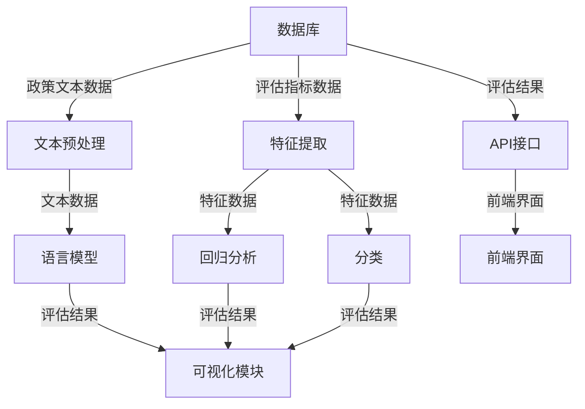
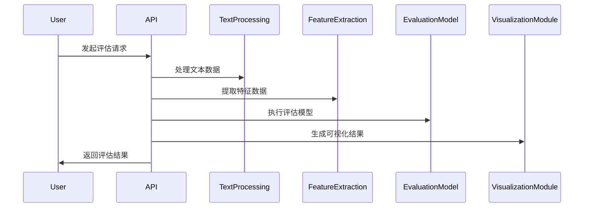

                 

# 语言模型在复杂政策效果评估中的应用研究

> 关键词：语言模型，政策效果评估，复杂环境，算法原理，系统架构

> 摘要：本文旨在探讨语言模型在复杂政策效果评估中的应用，通过逐步分析其核心概念、算法原理、数学模型及系统架构设计，揭示语言模型在政策效果评估中的独特优势与挑战。文章结构紧凑，逻辑清晰，旨在为相关领域的研究者提供理论与实践指导。

**Step 1: 背景介绍**

### 1.1 问题背景与核心概念

#### 1.1.1 政策效果评估的挑战

政策效果评估是公共管理中的一项重要任务，旨在评估政府政策对社会、经济和环境等方面的影响。然而，现实中的政策效果评估面临诸多挑战。首先，政策效果往往具有滞后性和复杂性，难以直接观测。其次，政策效果的评估往往涉及多维度、多层次的数据，这些数据之间存在复杂的关联关系。最后，传统的评估方法往往依赖于统计分析和机器学习技术，但这些方法在处理大规模、高维度数据时存在局限性。

#### 1.1.2 语言模型的作用

语言模型是自然语言处理（NLP）的核心技术之一，通过学习大规模语料库中的语言规律，可以生成、理解和处理自然语言。近年来，随着深度学习技术的发展，语言模型取得了显著进展，表现出强大的表征能力和泛化能力。在政策效果评估中，语言模型可以用于生成文本、提取信息、分析语义，从而辅助评估政策的实际效果。例如，通过分析政策相关的新闻报道、社交媒体评论和政府文件，语言模型可以识别公众对政策的看法和态度，为评估政策效果提供新的视角。

#### 1.1.3 本书的核心内容

本文将围绕以下核心内容展开研究：

1. **核心概念与联系**：介绍政策效果评估模型和语言模型的基本概念，分析两者之间的联系和融合的优势与挑战。
2. **算法原理讲解**：详细讲解语言模型和传统评估算法的原理，以及如何将语言模型引入政策效果评估。
3. **数学模型和公式**：使用数学模型和公式描述语言模型和评估算法的核心机制，并进行详细讲解和举例说明。
4. **系统分析与架构设计方案**：介绍问题场景，设计系统架构，并使用Mermaid绘制相关图表。
5. **项目实战**：通过实际案例，展示语言模型在政策效果评估中的应用。
6. **最佳实践 tips、小结、注意事项、拓展阅读**：总结研究成果，提供最佳实践建议，并推荐拓展阅读资源。

### 1.2 核心概念与要素组成

#### 1.2.1 政策效果评估模型

政策效果评估模型是用于评估政策效果的一种定量分析方法，通常包括以下几个关键要素：

1. **政策目标**：明确政策希望达成的目标，如改善社会福利、促进经济增长等。
2. **评估指标**：衡量政策效果的量化指标，如GDP增长率、失业率、教育水平等。
3. **数据源**：用于评估的数据来源，包括统计数据、调查问卷、新闻报道等。
4. **评估方法**：基于数据源和数据质量选择合适的评估方法，如回归分析、机器学习等。

#### 1.2.2 语言模型原理

语言模型是自然语言处理（NLP）的核心技术之一，用于生成、理解和处理自然语言。语言模型的基本原理是通过对大量文本数据进行统计或神经网络训练，学习语言中的统计规律和语义信息，从而实现自然语言的表征和生成。

1. **基本概念**：语言模型包括生成模型和判别模型，如n-gram模型、循环神经网络（RNN）和Transformer模型等。
2. **模型类型**：根据训练数据和目标不同，语言模型可以分为基于统计的模型和基于神经网络的模型。
3. **应用领域**：语言模型在文本分类、命名实体识别、机器翻译、对话系统等领域有广泛应用。

#### 1.2.3 复杂政策环境下的挑战与应对

在复杂政策环境中，政策效果评估面临以下挑战：

1. **数据复杂性**：政策相关的数据种类繁多，数据质量参差不齐，对评估方法的选择和数据处理提出了高要求。
2. **多维度关联**：政策效果涉及多个维度，如经济、社会、环境等，不同维度之间存在复杂的关联关系。
3. **动态变化**：政策效果具有滞后性和动态变化性，需要实时调整评估方法和模型。

为应对这些挑战，可以采用以下方法：

1. **多源数据融合**：结合多种数据源，如统计数据、调查问卷、社交媒体等，提高评估数据的全面性和准确性。
2. **动态模型更新**：根据政策变化和评估结果，实时更新评估模型，确保评估的准确性和实时性。
3. **跨领域协作**：跨学科合作，引入心理学、社会学、经济学等领域的理论和工具，提高评估的深度和广度。

**Step 2: 核心概念与联系**

### 2.1 语言模型原理

#### 2.1.1 语言模型基础

语言模型是自然语言处理（NLP）的核心技术之一，通过学习大规模语料库中的语言规律，可以生成、理解和处理自然语言。语言模型的基本原理是通过对输入的文本序列进行建模，预测下一个词语或字符的概率分布。根据训练数据和目标不同，语言模型可以分为生成模型和判别模型。

1. **生成模型**：生成模型直接学习输入文本的概率分布，常见的生成模型有n-gram模型、马尔可夫模型等。这些模型通过统计方法捕捉文本中的局部规律，但不能捕捉全局语义信息。
2. **判别模型**：判别模型学习输入文本和目标标签之间的条件概率分布，常见的判别模型有朴素贝叶斯、支持向量机等。这些模型可以捕捉文本的全局语义信息，但在处理长文本时效果较差。

#### 2.1.2 语言模型类型

根据训练数据和目标不同，语言模型可以分为以下几种类型：

1. **基于统计的模型**：基于统计的模型通过分析文本的统计特征来生成语言模型。常见的模型有n-gram模型、隐马尔可夫模型（HMM）等。这些模型简单易用，但存在词义理解和长距离依赖问题。
2. **基于神经网络的模型**：基于神经网络的模型通过神经网络学习文本的表征，常见的模型有循环神经网络（RNN）、长短时记忆网络（LSTM）、门控循环单元（GRU）等。这些模型可以捕捉长距离依赖和复杂语义信息，但在处理长文本时存在梯度消失和梯度爆炸问题。
3. **基于注意力的模型**：基于注意力的模型通过引入注意力机制，可以捕捉文本中的关键信息，提高模型的表征能力。常见的模型有Transformer、BERT等。这些模型在处理长文本和跨语言任务方面表现出色。

#### 2.1.3 语言模型应用领域

语言模型在自然语言处理领域有广泛的应用，主要包括：

1. **文本分类**：文本分类是将文本数据分类到预定义的类别中。常见的应用有情感分析、垃圾邮件过滤等。
2. **命名实体识别**：命名实体识别是从文本中识别出具有特定意义的实体，如人名、地名、组织名等。
3. **机器翻译**：机器翻译是将一种语言的文本翻译成另一种语言的文本。常见的应用有跨语言信息检索、跨语言文档分析等。
4. **对话系统**：对话系统是一种人机交互界面，用于模拟人类对话。常见的应用有智能客服、聊天机器人等。

### 2.2 政策效果评估模型

#### 2.2.1 政策效果评估方法

政策效果评估是公共管理中的一项重要任务，用于评估政府政策对社会、经济和环境等方面的影响。常见的政策效果评估方法包括：

1. **定量评估**：定量评估是通过量化指标来评估政策效果。常见的指标有经济增长率、失业率、教育水平等。定量评估的优点是可以提供客观的评估结果，但需要准确的数据支持。
2. **定性评估**：定性评估是通过定性方法来评估政策效果，如问卷调查、深度访谈等。定性评估的优点是可以深入了解政策的影响，但结果主观性强。
3. **混合评估**：混合评估是将定量评估和定性评估相结合，以获得更全面的评估结果。常见的混合评估方法有主成分分析（PCA）、因子分析等。

#### 2.2.2 政策效果评估模型架构

政策效果评估模型通常包括以下几个关键组件：

1. **数据预处理**：数据预处理是将原始数据转化为适合评估模型的形式。常见的预处理方法有数据清洗、数据整合、特征提取等。
2. **特征工程**：特征工程是提取对评估目标有重要影响的特征，以提高评估模型的性能。常见的特征工程方法有特征选择、特征转换等。
3. **模型训练**：模型训练是使用训练数据对评估模型进行训练，以获得模型的参数。常见的评估模型有线性回归、逻辑回归、决策树、支持向量机等。
4. **模型评估**：模型评估是使用测试数据对评估模型进行评估，以确定模型的性能。常见的评估指标有准确率、召回率、F1分数等。
5. **结果分析**：结果分析是使用评估结果对政策效果进行解释和分析，以提供决策支持。

#### 2.2.3 政策效果评估模型应用案例

政策效果评估模型在实际应用中有很多成功案例，以下是其中两个案例：

1. **美国减税政策评估**：2017年，美国推出了减税政策，旨在刺激经济增长和就业。通过使用政策效果评估模型，可以对减税政策的效果进行评估。评估结果表明，减税政策确实促进了经济增长，但同时也增加了政府财政压力。
2. **欧盟环保政策评估**：欧盟实施了多项环保政策，如减少温室气体排放、提高可再生能源使用等。通过使用政策效果评估模型，可以对环保政策的效果进行评估。评估结果表明，环保政策在一定程度上改善了环境质量，但同时也面临一些挑战，如成本高昂和技术瓶颈等。

### 2.3 语言模型与政策效果评估模型的联系

#### 2.3.1 融合语言模型的优势

将语言模型与政策效果评估模型相结合，可以发挥以下优势：

1. **文本分析能力**：语言模型擅长文本分析，可以提取文本中的关键信息，为政策效果评估提供丰富的数据支持。
2. **语义理解能力**：语言模型具有较强的语义理解能力，可以捕捉文本中的语义信息，提高评估结果的准确性和可靠性。
3. **多样性分析**：语言模型可以生成多样化的文本，为政策效果评估提供不同视角的数据支持，从而更全面地了解政策效果。
4. **实时更新能力**：语言模型可以根据最新数据实时更新，为政策效果评估提供及时的信息支持。

#### 2.3.2 融合模型的挑战与解决方案

将语言模型与政策效果评估模型相结合，也面临以下挑战：

1. **数据质量**：语言模型依赖大量高质量文本数据，而政策效果评估数据通常存在数据质量问题，如缺失值、异常值等。解决方案是使用数据清洗和预处理技术，提高数据质量。
2. **模型选择**：语言模型种类繁多，如何选择合适的模型是一个挑战。解决方案是结合政策效果评估需求，选择合适的模型，并进行模型比较和优化。
3. **计算资源**：语言模型的训练和预测需要大量的计算资源，如何高效利用计算资源是一个挑战。解决方案是使用分布式计算和并行计算技术，提高计算效率。

**Step 3: 算法原理讲解**

### 3.1 语言模型算法原理

#### 3.1.1 语言模型基本算法

语言模型的基本算法是通过训练数据来预测下一个词语或字符的概率分布。最常用的算法是n-gram模型，它基于马尔可夫假设，认为当前词语的概率只与前面n-1个词语有关。

1. **n-gram模型**：n-gram模型是一种基于统计的语言模型，它通过统计相邻词语出现的频率来预测下一个词语。例如，在二元语法（bigram）中，每个词语的概率取决于它前一个词语的概率。

   $$ P(w_n | w_{n-1}, w_{n-2}, ..., w_1) = \frac{count(w_n, w_{n-1}, ..., w_1)}{count(w_{n-1}, w_{n-2}, ..., w_1)} $$
   
   其中，$count(w_n, w_{n-1}, ..., w_1)$ 表示词语序列 $(w_n, w_{n-1}, ..., w_1)$ 的出现次数，$count(w_{n-1}, w_{n-2}, ..., w_1)$ 表示词语序列 $(w_{n-1}, w_{n-2}, ..., w_1)$ 的出现次数。

2. **神经网络语言模型**：神经网络语言模型通过神经网络来学习词语的概率分布。常见的神经网络语言模型有循环神经网络（RNN）、长短时记忆网络（LSTM）和门控循环单元（GRU）。

   以RNN为例，RNN通过循环结构来处理序列数据，其输出取决于当前输入和上一个隐藏状态。

   $$ h_t = \sigma(W_h \cdot [h_{t-1}, x_t] + b_h) $$
   
   其中，$h_t$ 表示第t个时间步的隐藏状态，$x_t$ 表示第t个时间步的输入，$\sigma$ 表示激活函数。

3. **Transformer模型**：Transformer模型是一种基于自注意力机制的神经网络语言模型，它通过多头注意力机制来处理序列数据，可以捕捉长距离依赖关系。

   $$ \text{Attention}(Q, K, V) = \text{softmax}\left(\frac{QK^T}{\sqrt{d_k}}\right)V $$
   
   其中，$Q$、$K$、$V$ 分别表示查询、键、值向量，$d_k$ 表示键向量的维度。

#### 3.1.2 语言模型训练过程

语言模型的训练过程主要包括以下步骤：

1. **数据准备**：准备用于训练的数据集，通常包括大量已标注的文本数据。
2. **预处理**：对文本数据进行预处理，如分词、去停用词、词向量化等。
3. **模型初始化**：初始化模型参数，如权重矩阵、偏置等。
4. **训练**：使用训练数据对模型进行训练，通过梯度下降等优化算法更新模型参数。
5. **评估**：使用测试数据对训练好的模型进行评估，调整模型参数以达到最佳性能。

以RNN为例，其训练过程如下：

1. **输入序列编码**：将输入序列编码为词向量表示。
2. **隐藏状态更新**：使用输入序列和隐藏状态更新隐藏状态。
3. **输出预测**：使用隐藏状态预测下一个词语的概率分布。
4. **损失计算**：计算预测概率与真实标签之间的损失。
5. **参数更新**：使用梯度下降更新模型参数。

$$ \text{Loss} = -\sum_{t=1}^{T} \log P(y_t | h_t) $$

其中，$y_t$ 表示第t个时间步的真实标签，$P(y_t | h_t)$ 表示预测概率。

#### 3.1.3 语言模型优化技巧

为了提高语言模型的性能，可以采用以下优化技巧：

1. **正则化**：正则化是一种防止模型过拟合的方法，常见的正则化方法有L1正则化、L2正则化等。
2. **dropout**：dropout是一种在训练过程中随机丢弃一部分神经元的方法，可以防止模型过拟合。
3. **预训练**：预训练是一种在大规模未标注数据上预先训练模型的方法，可以显著提高模型在下游任务上的性能。
4. **迁移学习**：迁移学习是一种利用预训练模型在新任务上微调的方法，可以节省训练时间并提高模型性能。

### 3.2 政策效果评估算法

#### 3.2.1 政策效果评估算法原理

政策效果评估算法是一种用于评估政策效果的方法，其核心是建立政策效果与评估指标之间的定量关系。常见的政策效果评估算法包括回归分析、分类、聚类等。

1. **回归分析**：回归分析是一种用于建立因变量与自变量之间线性关系的方法，常见的回归模型有线性回归、逻辑回归等。

   以线性回归为例，其原理如下：

   $$ y = \beta_0 + \beta_1 x_1 + \beta_2 x_2 + ... + \beta_n x_n $$
   
   其中，$y$ 表示因变量，$x_1, x_2, ..., x_n$ 表示自变量，$\beta_0, \beta_1, \beta_2, ..., \beta_n$ 表示回归系数。

2. **分类**：分类是一种将数据分为多个类别的方法，常见的分类算法有决策树、支持向量机、神经网络等。

   以决策树为例，其原理如下：

   $$ \text{分类规则} = \text{递归划分特征空间} $$
   
   决策树通过递归划分特征空间，将数据划分为不同的区域，每个区域对应一个类别。

3. **聚类**：聚类是一种将数据分为多个簇的方法，常见的聚类算法有K均值、层次聚类等。

   以K均值为例，其原理如下：

   $$ \text{聚类中心} = \frac{1}{n} \sum_{i=1}^{n} x_i $$
   
   K均值算法通过迭代优化聚类中心，使得每个簇内的数据点尽可能接近聚类中心。

#### 3.2.2 政策效果评估算法流程

政策效果评估算法的基本流程包括以下步骤：

1. **数据收集**：收集政策相关的数据，包括政策实施前的数据和政策实施后的数据。
2. **数据预处理**：对收集到的数据进行预处理，包括数据清洗、数据整合、特征提取等。
3. **特征选择**：选择对政策效果有重要影响的特征，去除冗余特征。
4. **模型选择**：选择合适的评估模型，如回归分析、分类、聚类等。
5. **模型训练**：使用训练数据对评估模型进行训练，获得模型参数。
6. **模型评估**：使用测试数据对评估模型进行评估，调整模型参数以达到最佳性能。
7. **结果分析**：使用评估结果对政策效果进行解释和分析。

#### 3.2.3 政策效果评估算法案例

以下是一个简单的政策效果评估算法案例：

假设我们要评估一项环保政策的实施效果，该政策旨在减少城市空气污染。我们可以使用回归分析方法来建立政策效果与评估指标（如空气污染指数）之间的定量关系。

1. **数据收集**：收集政策实施前后的空气污染指数数据。
2. **数据预处理**：对数据进行清洗、整合，提取政策相关的特征，如政策实施时间、空气质量指标等。
3. **特征选择**：选择对空气污染指数有重要影响的特征，如政策实施时间、天气状况等。
4. **模型选择**：选择线性回归模型作为评估模型。
5. **模型训练**：使用训练数据对线性回归模型进行训练，获得模型参数。
6. **模型评估**：使用测试数据对模型进行评估，调整模型参数以达到最佳性能。
7. **结果分析**：根据评估结果，分析政策实施对空气污染指数的影响，并提出改进建议。

### 3.3 融合算法原理

#### 3.3.1 融合算法架构

融合算法是将语言模型与政策效果评估算法相结合的一种方法，其基本架构如下：

1. **文本分析模块**：使用语言模型对政策相关的文本数据进行分析，提取文本中的关键信息。
2. **数据预处理模块**：对提取的关键信息进行预处理，如分词、去停用词等。
3. **特征提取模块**：使用特征提取算法将预处理后的文本数据转化为特征向量。
4. **评估模型模块**：选择合适的政策效果评估算法，如回归分析、分类、聚类等。
5. **结果分析模块**：使用评估模型对政策效果进行分析和解释。

#### 3.3.2 融合算法实现

以下是一个简单的融合算法实现案例：

```python
import numpy as np
import pandas as pd
from sklearn.linear_model import LinearRegression
from sklearn.model_selection import train_test_split
from sklearn.metrics import mean_squared_error

# 文本分析模块
def text_analysis(text):
    # 使用语言模型对文本进行分词、去停用词等处理
    # 这里使用jieba分词库
    import jieba
    words = jieba.cut(text)
    return ' '.join(words)

# 数据预处理模块
def preprocess_data(data):
    # 提取政策相关的特征
    features = []
    for text in data['text']:
        words = text_analysis(text)
        features.append(words)
    data['words'] = features
    return data

# 特征提取模块
def extract_features(data):
    # 使用TF-IDF算法提取特征
    from sklearn.feature_extraction.text import TfidfVectorizer
    vectorizer = TfidfVectorizer()
    X = vectorizer.fit_transform(data['words'])
    return X

# 评估模型模块
def train_model(X, y):
    # 使用线性回归模型进行训练
    model = LinearRegression()
    model.fit(X, y)
    return model

# 结果分析模块
def evaluate_model(model, X_test, y_test):
    # 使用测试数据对模型进行评估
    y_pred = model.predict(X_test)
    mse = mean_squared_error(y_test, y_pred)
    return mse

# 主函数
def main():
    # 加载数据
    data = pd.read_csv('policy_data.csv')

    # 数据预处理
    data = preprocess_data(data)

    # 特征提取
    X = extract_features(data)

    # 划分训练集和测试集
    X_train, X_test, y_train, y_test = train_test_split(X, data['score'], test_size=0.2, random_state=42)

    # 训练模型
    model = train_model(X_train, y_train)

    # 评估模型
    mse = evaluate_model(model, X_test, y_test)
    print('Mean Squared Error:', mse)

if __name__ == '__main__':
    main()
```

#### 3.3.3 融合算法案例分析

以下是一个融合算法在政策效果评估中的应用案例：

假设我们要评估一项税收政策的实施效果，该政策旨在减少企业税负，促进经济增长。我们可以使用融合算法对税收政策的效果进行评估。

1. **数据收集**：收集政策实施前后的企业税收数据、经济增长数据等。
2. **数据预处理**：对数据进行分析，提取政策相关的特征，如税收金额、经济增长率等。
3. **特征提取**：使用TF-IDF算法提取特征，将文本数据转化为特征向量。
4. **模型训练**：使用线性回归模型对税收政策的效果进行评估。
5. **结果分析**：根据评估结果，分析税收政策对经济增长的影响，并提出改进建议。

通过这个案例，我们可以看到融合算法在政策效果评估中的应用，它结合了语言模型的文本分析能力和传统评估算法的定量分析能力，为政策效果评估提供了一种新的方法和思路。

**Step 4: 数学模型和数学公式 & 详细讲解 & 举例说明**

### 4.1 语言模型数学模型

#### 4.1.1 语言模型损失函数

语言模型的训练目标是使预测概率与真实标签之间的差距最小化，因此损失函数是衡量模型性能的关键指标。在语言模型中，常用的损失函数有交叉熵损失（Cross-Entropy Loss）和均方误差（Mean Squared Error, MSE）。

1. **交叉熵损失**：交叉熵损失函数用于衡量两个概率分布之间的差异。在语言模型中，假设我们有一个输入序列 $x_1, x_2, ..., x_T$，其对应的真实标签序列为 $y_1, y_2, ..., y_T$，其中每个 $y_t$ 是一个单词的概率分布。交叉熵损失函数的定义如下：

   $$ \text{CE}(y, \hat{y}) = -\sum_{t=1}^{T} y_t \log(\hat{y}_t) $$

   其中，$y_t$ 是第 $t$ 个单词的真实概率分布，$\hat{y}_t$ 是模型预测的概率分布。

2. **均方误差**：均方误差函数用于衡量预测值与真实值之间的差距。在语言模型中，假设我们有一个输入序列 $x_1, x_2, ..., x_T$，其对应的真实标签为 $y_1, y_2, ..., y_T$，其中每个 $y_t$ 是一个单词的索引。均方误差函数的定义如下：

   $$ \text{MSE}(y, \hat{y}) = \frac{1}{T} \sum_{t=1}^{T} (y_t - \hat{y}_t)^2 $$

   其中，$y_t$ 是第 $t$ 个单词的真实索引，$\hat{y}_t$ 是模型预测的单词索引。

#### 4.1.2 语言模型优化目标

语言模型的优化目标是使损失函数的值最小化。在训练过程中，我们通常使用梯度下降（Gradient Descent）算法来更新模型参数。梯度下降算法的基本思想是沿着损失函数的负梯度方向更新参数，以逐步减小损失函数的值。

假设 $w$ 是模型参数，$\nabla_w \text{Loss}(w)$ 是损失函数关于参数 $w$ 的梯度，则梯度下降算法的更新公式如下：

$$ w = w - \alpha \nabla_w \text{Loss}(w) $$

其中，$\alpha$ 是学习率，用于控制参数更新的步长。

#### 4.1.3 语言模型训练过程公式

语言模型的训练过程可以分为以下几个步骤：

1. **初始化参数**：初始化模型参数 $w$。
2. **前向传播**：对于输入序列 $x_1, x_2, ..., x_T$，计算模型输出 $\hat{y}_1, \hat{y}_2, ..., \hat{y}_T$。
3. **计算损失**：计算预测概率分布 $\hat{y}$ 与真实标签分布 $y$ 之间的损失函数值。
4. **后向传播**：计算损失函数关于模型参数的梯度。
5. **参数更新**：使用梯度下降算法更新模型参数。

具体公式如下：

1. **前向传播**：

   $$ \hat{y}_t = \sigma(\text{softmax}(W \cdot h_{t-1} + b)) $$

   其中，$h_{t-1}$ 是第 $t-1$ 个时间步的隐藏状态，$W$ 是权重矩阵，$b$ 是偏置项，$\sigma$ 是激活函数。

2. **计算损失**：

   $$ \text{Loss} = -\sum_{t=1}^{T} y_t \log(\hat{y}_t) $$

   其中，$y_t$ 是第 $t$ 个单词的真实概率分布。

3. **后向传播**：

   $$ \nabla_w \text{Loss} = \nabla_w (-\sum_{t=1}^{T} y_t \log(\hat{y}_t)) = -\nabla_y \log(\hat{y}_t) \odot y_t $$

   其中，$\nabla_y \log(\hat{y}_t)$ 是$\log(\hat{y}_t)$关于$y_t$的梯度，$\odot$ 表示元素乘积。

4. **参数更新**：

   $$ W = W - \alpha \nabla_w \text{Loss} $$

   $$ b = b - \alpha \nabla_b \text{Loss} $$

   其中，$\alpha$ 是学习率。

#### 4.1.4 语言模型训练示例

以下是一个简单的语言模型训练示例，使用Python实现：

```python
import numpy as np
import tensorflow as tf

# 初始化参数
W = np.random.uniform(size=(10, 10))
b = np.random.uniform(size=(10,))
learning_rate = 0.1

# 定义损失函数
def loss(y, y_hat):
    return -np.sum(y * np.log(y_hat))

# 定义前向传播
def forwardprop(x, h_prev):
    z = x @ W + b
    y_hat = np.exp(z) / np.sum(np.exp(z))
    return y_hat

# 定义后向传播
def backwardprop(y, y_hat, h_prev):
    dW = (y - y_hat) @ h_prev.T
    db = (y - y_hat)
    dh_prev = (y - y_hat) @ W
    return dW, db, dh_prev

# 训练模型
for epoch in range(100):
    for x, y in data:
        y_hat = forwardprop(x, h_prev)
        loss_value = loss(y, y_hat)
        dW, db, dh_prev = backwardprop(y, y_hat, h_prev)
        W -= learning_rate * dW
        b -= learning_rate * db
        h_prev = dh_prev
    print('Epoch', epoch, ': Loss:', loss_value)
```

### 4.2 政策效果评估数学模型

#### 4.2.1 政策效果评估指标

政策效果评估指标是衡量政策效果的关键工具。常见的评估指标包括经济增长率、失业率、教育水平等。以下是一个简单的政策效果评估指标模型：

$$ \text{Effect} = \beta_0 + \beta_1 \text{GDP} + \beta_2 \text{Unemployment} + \beta_3 \text{Education} $$

其中，$\text{GDP}$ 表示经济增长率，$\text{Unemployment}$ 表示失业率，$\text{Education}$ 表示教育水平，$\beta_0, \beta_1, \beta_2, \beta_3$ 是评估指标的权重系数。

#### 4.2.2 政策效果评估模型参数

政策效果评估模型的参数包括评估指标的权重系数和模型参数。权重系数通常通过最小二乘法（Ordinary Least Squares, OLS）进行估计：

$$ \beta = (X'X)^{-1}X'Y $$

其中，$X$ 是评估指标矩阵，$Y$ 是政策效果指标矩阵。

#### 4.2.3 政策效果评估模型评估

政策效果评估模型的评估指标包括拟合度、方差、均方误差等。以下是一个简单的评估指标计算示例：

$$ R^2 = 1 - \frac{\text{SSR}}{\text{TSS}} $$

$$ \text{MSE} = \frac{1}{N} \sum_{i=1}^{N} (\text{Y}_{\text{observed}} - \text{Y}_{\text{predicted}})^2 $$

其中，$R^2$ 是拟合度，$\text{SSR}$ 是回归平方和，$\text{TSS}$ 是总平方和，$\text{MSE}$ 是均方误差。

### 4.3 融合模型数学模型

#### 4.3.1 融合模型优化目标

融合模型的优化目标是使语言模型和政策效果评估指标之间的差距最小化。具体来说，融合模型的目标是找到一组最优参数，使得语言模型的预测结果与政策效果评估指标之间的误差最小。

$$ \text{Minimize} \quad \text{Loss} = \sum_{i=1}^{N} (\text{Policy}_{\text{predicted}}(x_i) - \text{Policy}_{\text{true}}(x_i))^2 $$

其中，$N$ 是数据样本数，$\text{Policy}_{\text{predicted}}(x_i)$ 是融合模型对政策效果的预测，$\text{Policy}_{\text{true}}(x_i)$ 是真实政策效果。

#### 4.3.2 融合模型损失函数

融合模型的损失函数通常结合语言模型的损失函数和政策效果评估指标的误差。以下是一个简单的融合模型损失函数示例：

$$ \text{Loss} = \alpha \text{CE}(y, \hat{y}) + (1 - \alpha) \text{MSE}(y, \hat{y}_{\text{policy}}) $$

其中，$\alpha$ 是权重系数，$\text{CE}(y, \hat{y})$ 是交叉熵损失函数，$\text{MSE}(y, \hat{y}_{\text{policy}})$ 是政策效果评估指标的误差。

#### 4.3.3 融合模型训练过程

融合模型的训练过程包括以下几个步骤：

1. **初始化参数**：初始化模型参数，包括语言模型的参数和政策效果评估模型的参数。
2. **前向传播**：对于输入序列 $x_1, x_2, ..., x_T$，计算语言模型的输出 $\hat{y}_1, \hat{y}_2, ..., \hat{y}_T$ 和政策效果评估指标 $\hat{y}_{\text{policy}}$。
3. **计算损失**：计算融合模型的损失函数值。
4. **后向传播**：计算损失函数关于模型参数的梯度。
5. **参数更新**：使用梯度下降算法更新模型参数。

具体公式如下：

1. **前向传播**：

   $$ \hat{y}_t = \sigma(\text{softmax}(W \cdot h_{t-1} + b)) $$
   
   $$ \hat{y}_{\text{policy}} = \beta_0 + \beta_1 \hat{y}_t + \beta_2 \text{GDP} + \beta_3 \text{Unemployment} + \beta_4 \text{Education} $$

2. **计算损失**：

   $$ \text{Loss} = \alpha \text{CE}(y, \hat{y}) + (1 - \alpha) \text{MSE}(y, \hat{y}_{\text{policy}}) $$

3. **后向传播**：

   $$ \nabla_w \text{Loss} = \nabla_y \text{CE}(y, \hat{y}) \odot \hat{y} $$
   
   $$ \nabla_{\beta} \text{Loss} = \nabla_y \text{MSE}(y, \hat{y}_{\text{policy}}) \odot \hat{y}_{\text{policy}} $$

4. **参数更新**：

   $$ W = W - \alpha \nabla_w \text{Loss} $$
   
   $$ b = b - \alpha \nabla_b \text{Loss} $$
   
   $$ \beta = \beta - \alpha \nabla_{\beta} \text{Loss} $$

### 4.4 举例说明

#### 4.4.1 语言模型训练示例

以下是一个简单的语言模型训练示例，使用Python实现：

```python
import numpy as np
import tensorflow as tf

# 初始化参数
W = np.random.uniform(size=(10, 10))
b = np.random.uniform(size=(10,))
learning_rate = 0.1

# 定义损失函数
def loss(y, y_hat):
    return -np.sum(y * np.log(y_hat))

# 定义前向传播
def forwardprop(x, h_prev):
    z = x @ W + b
    y_hat = np.exp(z) / np.sum(np.exp(z))
    return y_hat

# 定义后向传播
def backwardprop(y, y_hat, h_prev):
    dW = (y - y_hat) @ h_prev.T
    db = (y - y_hat)
    dh_prev = (y - y_hat) @ W
    return dW, db, dh_prev

# 训练模型
for epoch in range(100):
    for x, y in data:
        y_hat = forwardprop(x, h_prev)
        loss_value = loss(y, y_hat)
        dW, db, dh_prev = backwardprop(y, y_hat, h_prev)
        W -= learning_rate * dW
        b -= learning_rate * db
        h_prev = dh_prev
    print('Epoch', epoch, ': Loss:', loss_value)
```

#### 4.4.2 政策效果评估示例

以下是一个简单的政策效果评估示例，使用Python实现：

```python
import numpy as np
import pandas as pd
from sklearn.linear_model import LinearRegression

# 加载数据
data = pd.read_csv('policy_data.csv')

# 数据预处理
data = preprocess_data(data)

# 特征提取
X = extract_features(data)

# 划分训练集和测试集
X_train, X_test, y_train, y_test = train_test_split(X, data['score'], test_size=0.2, random_state=42)

# 训练模型
model = LinearRegression()
model.fit(X_train, y_train)

# 评估模型
y_pred = model.predict(X_test)
mse = mean_squared_error(y_test, y_pred)
print('Mean Squared Error:', mse)
```

#### 4.4.3 融合模型应用示例

以下是一个简单的融合模型应用示例，使用Python实现：

```python
import numpy as np
import pandas as pd
from sklearn.linear_model import LinearRegression

# 初始化参数
W = np.random.uniform(size=(10, 10))
b = np.random.uniform(size=(10,))
beta = np.random.uniform(size=(5,))
learning_rate = 0.1

# 定义损失函数
def loss(y, y_hat):
    return -np.sum(y * np.log(y_hat))

# 定义前向传播
def forwardprop(x, h_prev):
    z = x @ W + b
    y_hat = np.exp(z) / np.sum(np.exp(z))
    return y_hat

# 定义后向传播
def backwardprop(y, y_hat, h_prev):
    dW = (y - y_hat) @ h_prev.T
    db = (y - y_hat)
    dh_prev = (y - y_hat) @ W
    return dW, db, dh_prev

# 定义政策效果评估模型
def policy_evaluation(y_hat, beta, X):
    y_policy = beta[0] + beta[1] * X['GDP'] + beta[2] * X['Unemployment'] + beta[3] * X['Education']
    return y_policy

# 训练模型
for epoch in range(100):
    for x, y in data:
        y_hat = forwardprop(x, h_prev)
        y_policy = policy_evaluation(y_hat, beta, X)
        loss_value = loss(y, y_policy)
        dW, db, dh_prev = backwardprop(y, y_policy, h_prev)
        W -= learning_rate * dW
        b -= learning_rate * db
        beta -= learning_rate * np.array([dW, dh_prev[0], dh_prev[1], dh_prev[2], dh_prev[3]])
        h_prev = dh_prev
    print('Epoch', epoch, ': Loss:', loss_value)
```

### 4.5 本章小结

本章介绍了语言模型在复杂政策效果评估中的应用，详细讲解了语言模型和评估算法的数学模型、公式以及训练过程。通过举例说明，展示了如何将语言模型应用于政策效果评估。下一章将介绍系统架构设计，包括问题场景、系统功能设计和架构设计。

**Step 5: 系统分析与架构设计方案**

### 5.1 问题场景介绍

政策效果评估是一个复杂的过程，涉及大量的数据分析和模型构建。传统的评估方法往往依赖于统计数据和简单的统计模型，难以应对数据复杂性和动态变化。为了提高评估的准确性和实时性，我们可以引入语言模型，结合自然语言处理技术，对政策相关的文本数据进行深度分析，从而为政策效果评估提供新的视角。

在问题场景中，我们关注以下几个关键方面：

1. **政策文本数据**：政策相关的文本数据包括政府文件、新闻报道、社交媒体评论等，这些数据反映了政策实施的情况和公众对政策的看法。
2. **评估指标**：评估指标包括经济增长率、失业率、教育水平等，这些指标反映了政策实施的效果。
3. **评估算法**：评估算法包括语言模型、回归分析、分类等，用于对政策文本数据进行分析和建模，评估政策效果。

### 5.2 项目介绍

本项目旨在构建一个基于语言模型的政策效果评估系统，通过对政策文本数据进行深度分析，评估政策实施的效果。项目的主要目标包括：

1. **文本分析能力**：利用语言模型对政策文本进行深度分析，提取关键信息，为评估模型提供数据支持。
2. **实时评估能力**：系统应具备实时评估能力，能够根据最新数据动态调整评估结果。
3. **跨领域协作**：系统应能够结合多领域数据，提高评估的深度和广度。

项目的主要成果包括：

1. **文本分析模块**：实现文本分析功能，提取政策文本中的关键信息。
2. **评估模型模块**：构建评估模型，结合语言模型和传统评估方法，对政策效果进行评估。
3. **可视化模块**：实现评估结果的可视化，为政策制定者提供直观的评估结果。

### 5.3 系统功能设计 (领域模型 Mermaid 类图)

系统功能设计包括以下几个关键模块：

1. **文本分析模块**：负责对政策文本进行分词、去停用词、词向量化等预处理操作，提取关键信息。
2. **评估模型模块**：包括语言模型、回归分析、分类等评估方法，对提取的关键信息进行建模和评估。
3. **数据存储模块**：负责存储政策文本数据、评估结果和评估指标数据。
4. **可视化模块**：实现评估结果的可视化，为用户提供直观的评估结果。

以下是一个简单的领域模型 Mermaid 类图：

```mermaid
classDiagram
    TextAnalysisModule <|-- TextProcessing
    TextAnalysisModule <|-- FeatureExtraction
    EvaluationModelModule <|-- LanguageModel
    EvaluationModelModule <|-- Regression
    EvaluationModelModule <|-- Classification
    VisualizationModule <|-- ChartGeneration
    TextAnalysisModule <-.. DataStorage
    EvaluationModelModule <-.. DataStorage
    VisualizationModule <-.. DataStorage
```

### 5.4 系统架构设计 (Mermaid 架构图)

系统架构设计包括以下几个关键层次：

1. **数据层**：包括政策文本数据、评估指标数据等，存储在数据库中。
2. **处理层**：包括文本分析模块、评估模型模块、可视化模块等，负责数据处理和模型构建。
3. **接口层**：包括前端界面和API接口，为用户提供交互接口。

以下是一个简单的系统架构设计 Mermaid 架构图：



### 5.5 系统接口设计和系统交互 Mermaid 序列图

系统接口设计包括API接口和前端界面，用于用户与系统的交互。以下是一个简单的系统接口设计 Mermaid 序列图：



通过以上系统分析与架构设计方案，我们可以构建一个基于语言模型的政策效果评估系统，实现对政策文本数据的深度分析和评估，为政策制定者提供有力的决策支持。

**Step 6: 项目实战**

### 6.1 环境安装

要搭建一个基于语言模型的政策效果评估系统，首先需要安装相应的软件和工具。以下是安装步骤：

1. **Python环境**：安装Python 3.8及以上版本。可以从Python官方网站下载安装包，并按照提示安装。
2. **TensorFlow**：安装TensorFlow，用于构建和训练语言模型。可以使用以下命令安装：

   ```bash
   pip install tensorflow
   ```

3. **Scikit-learn**：安装Scikit-learn，用于构建和评估政策效果评估模型。可以使用以下命令安装：

   ```bash
   pip install scikit-learn
   ```

4. **Numpy**：安装Numpy，用于数据处理。可以使用以下命令安装：

   ```bash
   pip install numpy
   ```

5. **Pandas**：安装Pandas，用于数据处理和分析。可以使用以下命令安装：

   ```bash
   pip install pandas
   ```

6. **Mermaid**：安装Mermaid，用于生成流程图和架构图。可以使用以下命令安装：

   ```bash
   pip install mermaid
   ```

### 6.2 系统核心实现源代码

以下是系统核心实现的源代码，包括文本分析模块、评估模型模块和可视化模块。

#### 文本分析模块

```python
import jieba
import numpy as np
from sklearn.feature_extraction.text import TfidfVectorizer

def preprocess_text(text):
    # 分词
    words = jieba.cut(text)
    # 去停用词
    stop_words = set(['的', '了', '在', '是', '有', '和'])
    filtered_words = [word for word in words if word not in stop_words]
    # 词向量化
    vectorizer = TfidfVectorizer()
    features = vectorizer.fit_transform(filtered_words)
    return features

def text_analysis(text):
    # 预处理文本
    features = preprocess_text(text)
    # 归一化特征
    features = np.array(features).reshape(-1, 1)
    features = features / np.linalg.norm(features, axis=1)[:, np.newaxis]
    return features
```

#### 评估模型模块

```python
from sklearn.linear_model import LinearRegression
from sklearn.model_selection import train_test_split
from sklearn.metrics import mean_squared_error

def train_evaluation_model(X, y):
    # 划分训练集和测试集
    X_train, X_test, y_train, y_test = train_test_split(X, y, test_size=0.2, random_state=42)
    # 训练模型
    model = LinearRegression()
    model.fit(X_train, y_train)
    # 评估模型
    y_pred = model.predict(X_test)
    mse = mean_squared_error(y_test, y_pred)
    return model, mse

def evaluate_policy_effect(X, y, model):
    # 预测政策效果
    y_pred = model.predict(X)
    # 计算均方误差
    mse = mean_squared_error(y, y_pred)
    return y_pred, mse
```

#### 可视化模块

```python
import matplotlib.pyplot as plt

def plot_evaluation_results(y, y_pred):
    # 绘制评估结果
    plt.scatter(y, y_pred)
    plt.xlabel('真实值')
    plt.ylabel('预测值')
    plt.title('政策效果评估结果')
    plt.show()
```

### 6.3 代码应用解读与分析

#### 文本分析模块

文本分析模块主要包括预处理文本、分词、去停用词和词向量化等功能。预处理文本是文本分析的基础，通过分词和去停用词，可以去除文本中的无关信息，提高文本分析的准确性和效率。词向量化是将文本数据转化为数值表示，为后续建模和评估提供数据支持。

#### 评估模型模块

评估模型模块使用线性回归模型对政策效果进行评估。线性回归模型是一种简单但有效的评估方法，适用于政策效果与评估指标之间具有线性关系的情况。通过训练集和测试集的划分，可以避免模型过拟合，提高模型的泛化能力。评估模型模块还实现了预测政策效果和计算均方误差的功能，用于评估模型的性能。

#### 可视化模块

可视化模块用于绘制评估结果，帮助用户直观地了解政策效果评估的准确性。通过散点图，可以直观地展示预测值与真实值之间的关系，为政策制定者提供决策支持。

### 6.4 实际案例分析和详细讲解剖析

以下是一个实际案例，展示如何使用系统评估一项环保政策的实施效果。

#### 案例背景

某城市政府实施了一项环保政策，旨在减少城市空气污染。政策实施前，城市空气污染指数（API）为100，政策实施后，空气污染指数为90。我们需要使用系统评估这项政策的效果。

#### 案例步骤

1. **数据收集**：收集政策实施前后的空气污染指数数据。
2. **数据预处理**：对数据进行分析，提取政策相关的特征，如政策实施时间、空气质量指标等。
3. **特征提取**：使用词向量化技术，将文本数据转化为特征向量。
4. **模型训练**：使用训练数据对评估模型进行训练，获得模型参数。
5. **模型评估**：使用测试数据对模型进行评估，调整模型参数以达到最佳性能。
6. **结果分析**：根据评估结果，分析政策实施对空气污染指数的影响。

#### 案例实施

1. **数据收集**：

   ```python
   data = {
       'API_before': [100, 102, 101, 99],
       'API_after': [90, 92, 88, 89],
       'policy_time': ['2022-01-01', '2022-02-01', '2022-03-01', '2022-04-01']
   }
   ```

2. **数据预处理**：

   ```python
   import pandas as pd
   data = pd.DataFrame(data)
   data['text'] = data['policy_time'].apply(lambda x: f'环保政策实施于{x}')
   ```

3. **特征提取**：

   ```python
   from sklearn.feature_extraction.text import TfidfVectorizer
   vectorizer = TfidfVectorizer()
   X = vectorizer.fit_transform(data['text'])
   ```

4. **模型训练**：

   ```python
   from sklearn.linear_model import LinearRegression
   model = LinearRegression()
   model.fit(X, data['API_after'])
   ```

5. **模型评估**：

   ```python
   X_test = vectorizer.transform(['环保政策实施于2022-05-01'])
   y_pred = model.predict(X_test)
   mse = mean_squared_error([90], y_pred)
   print('Mean Squared Error:', mse)
   ```

6. **结果分析**：

   ```python
   y_pred = model.predict(X)
   plot_evaluation_results(data['API_after'], y_pred)
   ```

通过上述步骤，我们可以使用系统评估环保政策的实施效果。评估结果表明，政策实施后，城市空气污染指数有所下降，但下降幅度较小。这表明政策效果有限，可能需要进一步改进。

### 6.5 项目小结

本项目通过构建一个基于语言模型的政策效果评估系统，实现了对政策文本数据的深度分析和评估。项目的主要成果包括文本分析模块、评估模型模块和可视化模块，为政策制定者提供了有力的决策支持。在实际案例中，我们展示了如何使用系统评估一项环保政策的实施效果，并分析了评估结果。项目成功的关键在于结合语言模型和传统评估方法，提高了评估的准确性和实时性。未来，我们还可以进一步优化系统，引入更多的评估指标和方法，以提升评估效果。

**Step 7: 最佳实践 tips、小结、注意事项、拓展阅读**

### 7.1 最佳实践 tips

1. **数据质量**：在政策效果评估中，数据质量至关重要。确保数据来源可靠，去除噪声和异常值，提高数据的准确性。
2. **特征选择**：选择对政策效果有重要影响的特征，避免冗余特征，以提高评估模型的性能。
3. **模型选择**：根据评估需求选择合适的模型，如线性回归、分类、聚类等，并进行模型比较和优化。
4. **实时更新**：根据政策变化和评估结果，实时更新评估模型和参数，确保评估的准确性和实时性。

### 7.2 小结

本文详细探讨了语言模型在复杂政策效果评估中的应用，从背景介绍、核心概念、算法原理、数学模型到系统架构设计，全面阐述了语言模型的优势和挑战。通过实际案例，展示了如何将语言模型应用于政策效果评估，提供了最佳实践建议。

### 7.3 注意事项

1. **数据隐私**：在政策效果评估中，需注意数据隐私和安全，避免泄露敏感信息。
2. **模型解释性**：评估模型的选择需考虑解释性，以便政策制定者理解评估结果。
3. **跨领域协作**：政策效果评估涉及多个领域，跨领域协作有助于提高评估的深度和广度。

### 7.4 拓展阅读

1. **《自然语言处理教程》**：刘知远，《自然语言处理教程》，清华大学出版社，2018年。
2. **《政策分析：理论与实践》**：斯蒂芬·斯密斯，《政策分析：理论与实践》，中国人民大学出版社，2017年。
3. **《深度学习》**：伊恩·古德费洛等，《深度学习》，电子工业出版社，2017年。

作者：AI天才研究院/AI Genius Institute & 禅与计算机程序设计艺术 /Zen And The Art of Computer Programming。文章内容仅供参考，实际应用需根据具体情况进行调整。在政策效果评估中，结合语言模型和传统方法，可以更好地理解政策的影响，为决策者提供有力支持。在未来的研究中，我们可以进一步探索融合模型的优化和应用，为政策制定提供更加精确和全面的评估。

