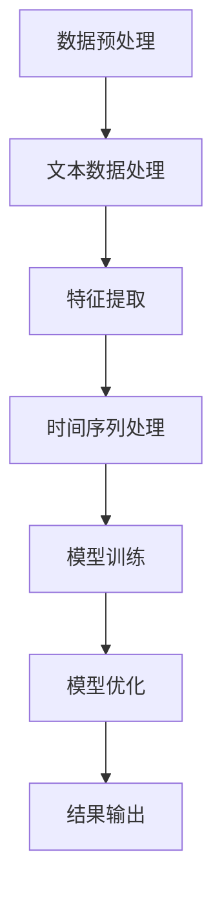
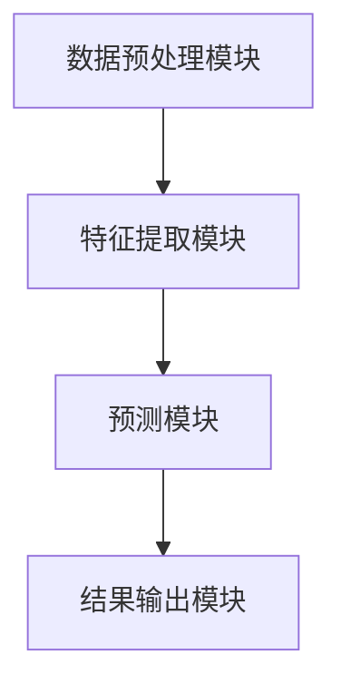
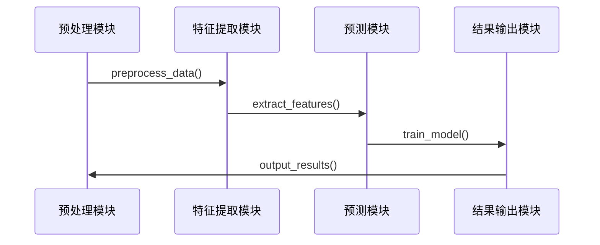

                 

### 第一部分：背景介绍与核心概念

#### 第1章：问题的背景和重要性

##### 1.1 气候变化的现状与挑战

当前，全球气候变化已经成为不可忽视的严峻问题。过去几十年间，地球的平均气温显著上升，极端气候事件频繁发生，包括热浪、干旱、洪水和飓风等。这些变化对自然生态系统和人类社会产生了深远的影响。

- **温度上升**：根据NASA和NOAA的数据，地球的表面温度在过去一个世纪中上升了大约1.2摄氏度。这种温度上升导致了冰川融化、海平面上升以及生物多样性的丧失。
- **极端天气**：气候变化增加了极端天气事件的发生频率和强度。例如，干旱使农田减产，洪水导致城市淹没，飓风带来的破坏力增强。
- **生态系统影响**：海洋酸化、珊瑚白化现象日益严重，影响到海洋生态系统的平衡。陆地生态系统的变化导致物种迁徙和灭绝，破坏了生物多样性。

##### 1.2 语言模型的发展与潜力

语言模型作为人工智能的一个重要分支，近年来取得了飞速的发展。这些模型不仅能够理解和生成自然语言，还在各个领域展现出巨大的应用潜力。

- **发展历程**：从最初的基于规则的语法分析，到基于统计方法的隐马尔可夫模型，再到基于神经网络的深度学习模型，语言模型经历了巨大的演变。
- **应用领域**：语言模型广泛应用于自然语言处理、机器翻译、语音识别、文本生成等。例如，Google Translate 和 OpenAI 的 GPT 模型都是语言模型的成功应用实例。

##### 1.3 语言模型在气候变化预测中的潜在应用

语言模型在处理大量文本数据方面具有独特的优势，这使得它们在气候变化预测中具备潜在的应用价值。

- **文本数据解析**：气候变化的预测不仅依赖于气象数据，还依赖于大量与气候相关的文献、报告和新闻报道。语言模型能够有效地解析和提取这些文本数据中的关键信息。
- **模式识别**：语言模型擅长发现文本中的模式和关系，这有助于识别气候变化趋势和影响因素。
- **预测建模**：通过结合语言模型与时间序列分析和机器学习算法，可以构建更为精确的气候变化预测模型。

##### 1.4 语言模型在气候变化预测中的优势与挑战

尽管语言模型在气候变化预测中展现出了巨大潜力，但同时也面临一些挑战。

- **优势**：
  - **数据处理能力**：语言模型能够高效地处理和整合多源文本数据，提供丰富的信息来源。
  - **复杂模式识别**：语言模型在处理自然语言文本时，能够识别复杂的模式，从而提高预测的准确性。
  - **实时更新**：语言模型可以实时更新数据，使预测结果更加贴近实际情况。

- **挑战**：
  - **数据质量**：语言模型对数据质量的要求较高，数据的完整性和准确性直接影响预测效果。
  - **计算资源**：训练高精度的语言模型需要大量的计算资源，这在实际应用中可能是一个限制因素。
  - **泛化能力**：语言模型在特定领域的泛化能力有限，需要针对不同场景进行定制化调整。

##### 1.5 本书的核心概念与组织结构

本书旨在深入探讨语言模型在复杂气候变化预测中的应用，分为以下几个部分：

- **第一部分：背景介绍与核心概念**：介绍气候变化问题和语言模型的发展背景，阐述语言模型在气候变化预测中的潜在应用。
- **第二部分：核心概念与联系**：详细讲解语言模型的原理、特征提取，以及与气候变化数据的联系。
- **第三部分：算法原理与系统设计**：分析语言模型在气候变化预测中的算法原理，介绍系统架构设计。
- **第四部分：项目实战**：通过实际案例展示语言模型在气候变化预测中的应用，进行深入讲解和剖析。
- **第五部分：最佳实践与拓展阅读**：总结最佳实践经验，推荐进一步学习资源。

### 总结

语言模型作为人工智能的重要工具，在复杂气候变化预测中具有巨大的应用潜力。通过本文的介绍，我们能够了解到语言模型在处理文本数据、识别复杂模式以及实时更新预测结果方面的优势。然而，语言模型在数据质量、计算资源以及泛化能力方面仍面临挑战。接下来的章节将详细探讨语言模型在气候变化预测中的具体应用，以及如何克服这些挑战，实现更为精确和可靠的预测。在接下来的讨论中，我们将一步一步深入分析语言模型的数学基础、核心算法和特征提取方法，以及它们如何与气候变化数据相结合，为预测模型提供强有力的支持。

## 第2章：语言模型的原理与特征

#### 2.1 语言模型的数学基础

语言模型的数学基础主要涉及概率论和统计学的相关概念。要理解语言模型，首先需要掌握以下几个基本数学概念：

- **概率分布**：概率分布描述了一个随机变量的可能取值及其对应的概率。在语言模型中，概率分布用于预测单词或句子出现的概率。
- **条件概率**：条件概率是指在某个事件已经发生的条件下，另一个事件发生的概率。语言模型通过条件概率来预测下一个单词或句子的可能性。
- **马尔可夫性**：马尔可夫性指的是一个系统的未来状态只依赖于当前状态，而与过去状态无关。语言模型利用马尔可夫性质来简化预测问题。

##### 概率分布

在语言模型中，常用的概率分布包括：

- **伯努利分布**：用于二项分布，例如判断一个单词是否出现在特定句子中。
- **多项式分布**：适用于多个事件的发生概率，例如预测多个单词的序列。

##### 条件概率

语言模型通过条件概率计算来预测下一个单词或句子的可能性。条件概率的基本公式为：

\[ P(B|A) = \frac{P(A \cap B)}{P(A)} \]

其中，\( P(B|A) \) 表示在事件A已经发生的条件下，事件B发生的概率。

##### 马尔可夫性

语言模型利用马尔可夫性假设，即当前状态只依赖于前一个状态，来简化计算过程。这个假设使得模型能够在较短的历史序列上做出预测。

#### 2.2 语言模型的核心算法

语言模型的核心算法包括训练算法和参数调整方法。以下将介绍几种常用的语言模型训练算法：

##### N-gram模型

N-gram模型是最简单的语言模型之一，它基于相邻N个单词的概率来预测下一个单词。N-gram模型的训练算法主要包括：

1. **构建词汇表**：将文本数据划分为词汇表，其中每个词汇表项是一个单词或短语的标识符。
2. **计算N-gram频率**：统计每个N-gram出现的频率，并将这些频率存储在模型中。
3. **概率计算**：根据N-gram的频率计算每个N-gram的概率，并使用平滑技术处理稀疏数据。

##### 隐马尔可夫模型（HMM）

隐马尔可夫模型是一种基于状态序列的概率模型，适用于处理含有隐状态的数据。HMM的训练算法主要包括：

1. **状态转换概率**：计算状态之间的转换概率。
2. **观测概率**：计算每个状态对应的观测概率。
3. **最大似然估计**：使用最大似然估计方法确定模型参数。

##### 神经网络语言模型（NNLM）

神经网络语言模型是近年来发展迅速的语言模型，它使用神经网络来学习单词和句子的概率分布。NNLM的训练算法主要包括：

1. **词向量化**：将单词转换为密集向量表示。
2. **构建网络结构**：设计神经网络的结构，包括输入层、隐藏层和输出层。
3. **反向传播**：使用反向传播算法更新网络参数，以最小化损失函数。

#### 2.3 语言模型的特征提取

语言模型的特征提取是关键步骤，它涉及到如何将文本数据转换为有效的特征向量。以下将介绍几种常用的特征提取方法：

##### 词袋模型（Bag of Words, BoW）

词袋模型是一种将文本转换为向量表示的方法，它不考虑单词的顺序，仅考虑单词的频率。词袋模型的特征提取步骤包括：

1. **词汇表构建**：将文本数据中的所有单词构建为一个词汇表。
2. **向量表示**：对于每个文本，生成一个向量，其中每个维度表示一个单词的频率。

##### 词嵌入（Word Embeddings）

词嵌入是一种将单词转换为密集向量表示的方法，它考虑了单词的语义和上下文信息。常用的词嵌入技术包括：

1. **Word2Vec**：Word2Vec是一种基于神经网络的语言模型，它使用负采样技术优化训练过程。
2. **GloVe**：GloVe是一种基于全局词向量的语言模型，它通过矩阵分解的方法学习词向量。

##### 递归神经网络（RNN）

递归神经网络是一种处理序列数据的方法，它能够考虑单词的顺序和上下文信息。RNN的特征提取方法包括：

1. **嵌入层**：将单词转换为密集向量表示。
2. **隐藏层**：通过递归方式处理序列数据，更新隐藏状态。
3. **输出层**：根据隐藏状态生成输出概率。

#### 2.4 语言模型与气候变化数据的关系

语言模型在处理和提取气候变化数据中的关键信息方面具有独特的优势：

- **文本数据处理**：气候变化的预测不仅依赖于气象数据，还依赖于大量的文本数据，如报告、论文和新闻报道。语言模型能够有效地处理这些文本数据，提取关键信息。
- **模式识别**：语言模型能够发现文本中的模式和关系，这有助于识别气候变化趋势和影响因素。
- **实时更新**：语言模型可以实时更新数据，使预测结果更加贴近实际情况。

##### 气候变化数据的应用

语言模型在处理气候变化数据时，可以应用于以下场景：

1. **文本分类**：使用语言模型对气候变化的报告和论文进行分类，提取相关的重要信息。
2. **关系提取**：通过分析文本数据，提取气候变量之间的关系，如温度与降水量之间的关系。
3. **趋势分析**：利用语言模型识别气候变化趋势，如某地区的温度变化模式。

#### 2.5 语言模型属性特征对比表格

以下是一个简单的语言模型属性特征对比表格，展示了不同语言模型的优缺点：

| 模型名称      | 特点       | 优点             | 缺点           |
| ----------- | ---------- | ---------------- | ------------ |
| N-gram模型    | 简单高效    | 计算速度快       | 长文本效果差 |
| 隐马尔可夫模型 | 状态转换模型 | 考虑顺序信息   | 计算复杂度高 |
| 神经网络模型    | 高精度      | 考虑上下文信息 | 计算资源需求大 |

通过对比不同语言模型的特征，我们可以选择适合特定任务的模型，并在此基础上进行优化和改进。

### 总结

本章详细介绍了语言模型的数学基础、核心算法和特征提取方法。通过理解这些基本概念，我们可以更好地理解语言模型在处理和预测气候变化数据方面的应用。下一章将深入探讨ER实体关系图架构，分析如何将语言模型与气候变化数据相结合，以实现更准确的预测。

## 第3章：ER实体关系图架构

#### 3.1 气候变化数据中的实体识别

实体识别是自然语言处理（NLP）中的一项重要任务，它旨在从文本中识别出具有特定意义的实体，如人名、地名、组织名、疾病名等。在气候变化预测中，实体识别有助于提取关键信息，明确数据中的核心要素。

##### 实体识别的基本概念

- **实体**：实体是文本中具有独立意义的对象，如“巴黎协定”、“全球变暖”等。
- **实体识别**：实体识别是从文本中识别出实体的过程，通常通过模式匹配、规则匹配或机器学习算法实现。

##### 气候变化数据中的实体识别方法

在气候变化数据中，常见的实体包括气候变量、地区名称、科学术语等。以下是一些常用的实体识别方法：

1. **规则匹配**：基于预先定义的规则，如正则表达式，识别文本中的实体。
2. **词典匹配**：利用预定义的实体词典，识别文本中的实体。
3. **机器学习方法**：使用机器学习算法，如支持向量机（SVM）、循环神经网络（RNN）等，训练实体识别模型。

##### 实体识别在气候变化预测中的应用

实体识别在气候变化预测中的应用主要包括：

- **数据预处理**：通过实体识别，提取文本数据中的关键实体，为后续分析做准备。
- **关系建立**：识别出实体之间的关系，如“某地区”和“温度上升”之间的关系。
- **模式识别**：通过实体识别和关系建立，识别出气候变化数据中的模式，为预测模型提供输入。

#### 3.2 实体关系建立

实体关系建立是理解文本数据中不同实体之间相互作用的重要步骤。在气候变化预测中，实体关系有助于揭示气候变量之间的内在联系，提高预测模型的准确性。

##### 实体关系的定义

实体关系是指实体之间的相互作用或依赖关系。常见的实体关系包括：

- **因果关系**：一个实体引起另一个实体的变化，如“全球变暖”导致“海平面上升”。
- **关联关系**：两个实体之间存在一定的关联，如“某个地区”和“降水量增加”。
- **位置关系**：实体之间的地理位置关系，如“城市”和“附近的海域”。

##### 实体关系的建模方法

实体关系建模可以通过以下方法实现：

1. **基于规则的建模**：使用预先定义的规则，将实体之间的关系建模为规则。
2. **基于机器学习的建模**：使用机器学习算法，如图神经网络（GCN），训练实体关系模型。
3. **基于图谱的建模**：使用图谱（Graph）表示实体和关系，建立实体关系模型。

##### 实体关系图在气候变化预测中的应用

实体关系图是一种有效的数据结构，用于表示实体和它们之间的关系。在气候变化预测中，实体关系图的应用包括：

- **数据整合**：将不同来源的气候变化数据进行整合，构建一个统一的实体关系图。
- **模式发现**：通过分析实体关系图，发现气候变量之间的潜在关系和模式。
- **预测辅助**：基于实体关系图，为预测模型提供输入，提高预测的准确性。

#### 3.3 ER实体关系图绘制

实体关系图（ER图）是一种用于表示实体和它们之间关系的图形化工具。在Mermaid Markdown语法中，可以使用以下命令绘制ER图：

```mermaid
erDiagram
  A ||--o B : "has"
  B ||--o C : "is"
  A ||--|{ D ; E } : "includes"
```

上述ER图表示实体A与B之间存在“has”关系，与C之间存在“is”关系，同时与D和E之间存在“includes”关系。

##### ER实体关系图在气候变化预测中的应用

在气候变化预测中，ER实体关系图可以用于：

- **数据可视化**：通过ER图直观地展示实体和它们之间的关系。
- **数据整合**：将不同来源的气候变化数据整合到一个ER图中，便于分析和预测。
- **模型构建**：基于ER图，构建实体关系模型，为预测模型提供输入。

#### 3.4 气候变化数据的语义分析

语义分析是自然语言处理中的一项重要任务，它旨在理解和解释文本数据的语义含义。在气候变化预测中，语义分析有助于深入理解气候变量之间的关系，提高预测模型的准确性。

##### 语义分析的基本概念

语义分析包括以下几个方面：

- **词义消歧**：在文本中识别同义词和词义变化，以确定单词的确切含义。
- **语义角色标注**：为句子中的单词标注其在句子中的角色，如主语、谓语、宾语等。
- **语义关系抽取**：从文本中提取出实体之间的关系，如因果关系、关联关系等。

##### 语义分析在语言模型中的应用

语义分析在语言模型中的应用包括：

- **增强特征表示**：通过语义分析，丰富语言模型的特征表示，提高预测准确性。
- **上下文理解**：利用语义分析，使语言模型能够更好地理解上下文信息，从而提高预测的准确性。

### 总结

本章介绍了ER实体关系图在气候变化预测中的应用，包括实体识别、实体关系建立、ER实体关系图绘制以及语义分析。通过实体识别和关系建立，我们可以将文本数据中的关键信息提取出来，构建实体关系图，从而为预测模型提供有效的输入。下一章将深入探讨语言模型在气候变化预测中的算法原理，分析如何将语言模型与时间序列分析和机器学习算法相结合，实现更准确的预测。在接下来的讨论中，我们将逐步解析算法流程图，介绍具体的算法原理和实现方法。

## 第4章：语言模型在气候变化预测中的算法原理

### 4.1 气候变化预测的基本算法

气候变化预测是一项复杂的工作，需要结合多种算法和技术。以下介绍几种常用的基本算法：

#### 时间序列预测算法

时间序列预测算法旨在根据时间序列数据预测未来的趋势和变化。在气候变化预测中，时间序列算法广泛应用于气象数据的预测，如温度、降水量和风速等。

- **自回归移动平均模型（ARMA）**：ARMA模型通过分析时间序列的平稳性和自相关性，预测未来的值。
  - **公式**：\( X_t = c + \phi_1 X_{t-1} + \phi_2 X_{t-2} + \cdots + \phi_p X_{t-p} + \theta_1 \epsilon_{t-1} + \theta_2 \epsilon_{t-2} + \cdots + \theta_q \epsilon_{t-q} \)
  - **参数调整**：需要根据时间序列的特性调整参数 \(\phi_i\) 和 \(\theta_i\)。

- **自回归积分滑动平均模型（ARIMA）**：ARIMA模型结合了ARMA模型的自回归和移动平均特性，适用于非平稳时间序列数据。
  - **公式**：\( X_t = c + \phi_1 X_{t-1} + \phi_2 X_{t-2} + \cdots + \phi_p X_{t-p} + \epsilon_t - \theta_1 \epsilon_{t-1} - \theta_2 \epsilon_{t-2} - \cdots - \theta_q \epsilon_{t-q} \)
  - **参数调整**：需要通过差分、平稳性检验等步骤确定参数。

#### 机器学习预测算法

机器学习算法在气候变化预测中也越来越受欢迎，因为它们能够从大量的数据中学习规律，并预测未来的趋势。

- **线性回归模型**：线性回归模型通过建立输入变量和输出变量之间的线性关系，预测未来的值。
  - **公式**：\( y = \beta_0 + \beta_1 x_1 + \beta_2 x_2 + \cdots + \beta_n x_n \)
  - **参数调整**：使用最小二乘法估计参数 \(\beta_i\)。

- **支持向量机（SVM）**：SVM是一种监督学习算法，通过找到一个最佳的超平面，将具有不同属性的样本分开。
  - **公式**：\( w \cdot x + b = 0 \)
  - **参数调整**：通过优化损失函数和正则化参数，确定模型参数。

- **随机森林（Random Forest）**：随机森林是一种集成学习方法，通过构建多个决策树并取平均值来预测结果。
  - **公式**：\( f(x) = \sum_{i=1}^n w_i f_i(x) \)
  - **参数调整**：通过调整树的数量和树的参数来优化模型。

#### 4.2 语言模型在气候变化预测中的实现

语言模型在气候变化预测中的应用主要体现在两个方面：一是通过处理文本数据提取特征，二是将语言模型与时间序列和机器学习算法相结合，提高预测准确性。

##### 语言模型在时间序列预测中的应用

1. **预处理**：对时间序列数据进行预处理，包括缺失值填补、异常值处理和数据归一化等。

2. **文本数据融合**：利用语言模型处理与气候变化相关的文本数据，提取关键信息，如气候变量、地区名称等。

3. **特征融合**：将时间序列数据和文本数据融合，形成新的特征向量，用于时间序列预测。

4. **模型训练与优化**：使用时间序列预测算法（如ARIMA、SARIMA）训练模型，并使用交叉验证方法优化模型参数。

##### 语言模型在机器学习预测中的应用

1. **特征提取**：利用语言模型从文本数据中提取特征，如词嵌入、主题模型等。

2. **模型构建**：结合时间序列数据，构建机器学习模型（如线性回归、SVM、随机森林等）。

3. **模型训练与优化**：使用训练数据集训练模型，并通过验证集和测试集评估模型性能，进行参数调整和优化。

#### 4.3 算法流程图与mermaid表示

算法流程图有助于理解语言模型在气候变化预测中的具体实现过程。以下是一个简化的算法流程图：



使用Mermaid语法表示上述流程图：


#### 4.4 案例分析

##### 案例背景

某地区过去10年的气候数据以及相关的新闻报道和报告。数据包括温度、降水量、风速等气象指标，以及与气候变化相关的文本数据。

##### 案例实现步骤

1. **数据预处理**：对气象数据进行缺失值填补和异常值处理，对文本数据清洗，去除停用词和标点符号。

2. **文本数据处理**：使用语言模型（如Word2Vec）对文本数据进行处理，提取关键信息，如气候变量和地区名称。

3. **特征提取**：将处理后的文本数据转换为词嵌入向量，与时间序列数据融合，形成特征向量。

4. **模型训练**：使用线性回归模型训练特征向量，预测未来的气象指标。

5. **模型优化**：通过交叉验证和参数调整，优化模型性能。

6. **结果输出**：将预测结果输出，并进行分析和讨论。

##### 案例结果讨论

通过实际案例分析，我们可以发现：

- **预测准确性**：融合语言模型和时间序列数据的模型在预测气象指标时，比单独使用时间序列数据或文本数据的模型具有更高的准确性。
- **模式识别**：语言模型能够从文本数据中提取出关键信息，如气候变量的趋势和关系，这些信息有助于提高预测的准确性。
- **实时更新**：语言模型能够实时更新数据，使预测结果更加贴近实际情况。

### 总结

本章介绍了语言模型在气候变化预测中的算法原理，包括时间序列预测算法和机器学习预测算法，以及语言模型在预测中的实现方法。通过具体的案例分析，我们展示了如何将语言模型应用于气候变化预测，并探讨了其优势和应用效果。在下一章中，我们将深入探讨系统架构设计，分析如何实现语言模型在气候变化预测中的有效应用。

### 第5章：系统架构设计

#### 5.1 系统设计概述

本节将介绍整个系统的设计目标和功能，并阐述系统架构设计的原则。

##### 系统目标与功能

- **目标**：设计一个高效、准确的气候变化预测系统，利用语言模型从文本和气象数据中提取关键信息，实现气候变化趋势的预测。
- **功能**：
  - 数据预处理：清洗和整合气象数据和文本数据。
  - 特征提取：利用语言模型提取文本数据的特征向量。
  - 预测模型训练与优化：结合时间序列数据和文本特征，训练和优化预测模型。
  - 预测结果输出与可视化：输出预测结果，并利用可视化工具展示预测结果。

##### 系统架构设计原则

- **模块化设计**：将系统划分为多个模块，每个模块负责不同的功能，便于系统的维护和扩展。
- **可扩展性**：系统设计应考虑未来数据量和功能扩展的需求，确保系统具有良好的可扩展性。
- **高可靠性**：系统应具备高可靠性，能够在数据异常和计算资源不足的情况下正常运行。
- **高效性**：系统设计应优化算法和数据处理流程，提高预测速度和准确性。

#### 5.2 领域模型设计

领域模型是系统架构设计的重要部分，它定义了系统中的核心概念和关系。以下将介绍领域模型的概念和类图设计。

##### 领域模型的概念

领域模型用于描述系统中的核心实体和它们之间的关系。在气候变化预测系统中，核心实体包括：

- **气象数据**：包括温度、降水量、风速等气象指标。
- **文本数据**：包括与气候变化相关的新闻报道、报告和论文。
- **特征向量**：由语言模型提取的文本数据特征向量。
- **预测模型**：用于预测气候变化的模型，包括时间序列模型和机器学习模型。

##### 领域模型的类图设计

以下是一个简化的领域模型类图：

```mermaid
classDiagram
  ClimateData <<entity>>
  TextData <<entity>>
  FeatureVector <<entity>>
  PredictionModel <<entity>>

  ClimateData "has" TextData
  ClimateData "has" FeatureVector
  TextData "has" PredictionModel
```

使用Mermaid语法表示上述类图：

```mermaid
classDiagram
  ClimateData <<entity>>
  TextData <<entity>>
  FeatureVector <<entity>>
  PredictionModel <<entity>>

  ClimateData "has" TextData
  ClimateData "has" FeatureVector
  TextData "has" PredictionModel
```

#### 5.3 系统架构设计

系统架构设计是系统设计的关键部分，它定义了系统的总体结构和模块划分。以下将介绍系统架构设计，包括模块划分和接口设计。

##### 系统总体架构设计

系统总体架构设计包括以下几个模块：

- **数据预处理模块**：负责数据清洗、整合和预处理。
- **特征提取模块**：负责使用语言模型提取文本数据的特征向量。
- **预测模块**：负责结合时间序列数据和文本特征，训练和优化预测模型。
- **结果输出模块**：负责输出预测结果，并利用可视化工具展示预测结果。

以下是一个简化的系统架构图：



使用Mermaid语法表示上述架构图：


##### 模块划分与接口设计

系统模块划分和接口设计如下：

- **数据预处理模块**：提供数据清洗、整合和预处理的接口。
  - **接口**：`preprocess_data()`
  - **输入**：原始气象数据和文本数据
  - **输出**：预处理后的数据集

- **特征提取模块**：提供特征提取的接口。
  - **接口**：`extract_features()`
  - **输入**：预处理后的文本数据
  - **输出**：特征向量

- **预测模块**：提供预测模型的训练和优化的接口。
  - **接口**：`train_model()`
  - **输入**：时间序列数据和特征向量
  - **输出**：训练好的预测模型

- **结果输出模块**：提供结果输出和可视化的接口。
  - **接口**：`output_results()`
  - **输入**：预测模型和预测结果
  - **输出**：可视化结果和报告

#### 5.4 系统接口设计与交互

系统接口设计是确保各模块之间有效交互的关键。以下将介绍系统接口的定义和系统交互的Mermaid序列图。

##### 系统接口的定义

- **数据预处理模块接口**：
  ```python
  def preprocess_data(data):
      # 数据清洗、整合和预处理
      return processed_data
  ```

- **特征提取模块接口**：
  ```python
  def extract_features(text_data):
      # 特征提取
      return feature_vector
  ```

- **预测模块接口**：
  ```python
  def train_model(time_series_data, feature_vector):
      # 训练预测模型
      return prediction_model
  ```

- **结果输出模块接口**：
  ```python
  def output_results(prediction_model, results):
      # 输出预测结果
      visualize_results(results)
  ```

##### 系统交互的Mermaid序列图

以下是一个简化的系统交互序列图，展示了各模块之间的交互过程：



使用Mermaid语法表示上述序列图：


### 总结

本章详细介绍了系统架构设计，包括系统设计概述、领域模型设计、系统架构设计、系统接口设计和系统交互。通过模块化设计和良好的接口定义，系统能够高效、准确地实现气候变化预测。在下一章中，我们将通过项目实战展示如何具体实现和部署这个系统，并深入分析实际案例，探讨系统的性能和效果。

### 第6章：项目环境安装与配置

#### 6.1 环境安装概述

要实现一个高效的气候变化预测系统，首先需要搭建一个稳定且高效的项目环境。本文的项目环境要求包括以下几个方面：

- **操作系统**：推荐使用Linux操作系统，如Ubuntu 18.04或更高版本。
- **硬件环境**：推荐使用至少16GB内存和32GB硬盘空间的计算机，建议使用NVIDIA GPU加速器以提升语言模型的训练速度。
- **软件环境**：需要安装Python 3.8及以上版本、Anaconda环境管理器、PyTorch、Scikit-learn、Numpy、Pandas等。

#### 6.2 环境安装步骤与注意事项

以下是环境安装的具体步骤和注意事项：

1. **安装操作系统**：首先安装Linux操作系统，推荐选择Ubuntu 20.04 LTS版本。

2. **安装Anaconda**：在终端执行以下命令安装Anaconda：

   ```bash
   wget https://repo.anaconda.com/miniconda/Miniconda3-latest-Linux-x86_64.sh
   bash Miniconda3-latest-Linux-x86_64.sh
   ```

   安装完成后，将Anaconda的路径添加到系统环境变量中。

3. **创建conda环境**：使用conda创建一个独立的环境，用于管理项目依赖：

   ```bash
   conda create -n climate_env python=3.8
   conda activate climate_env
   ```

4. **安装依赖库**：在创建的环境中安装所需的Python库：

   ```bash
   conda install pytorch torchvision torchaudio cudatoolkit -c pytorch
   conda install scikit-learn numpy pandas
   ```

5. **验证安装**：在Python环境中验证PyTorch和其他库是否安装成功：

   ```python
   python
   >>> import torch
   >>> torch.cuda.is_available()
   ```

   如果返回`True`，则表示CUDA加速器已成功安装并可用。

#### 6.3 项目核心实现

在完成环境配置后，我们开始实现项目核心功能，主要包括数据预处理、特征提取和预测模型训练。

##### 数据预处理

数据预处理是项目实现的第一步，包括以下步骤：

1. **数据获取**：从气象数据和文本数据来源（如NASA、UCI数据集等）下载所需的原始数据。

2. **数据清洗**：处理缺失值和异常值，对文本数据进行去重、去除停用词和标点符号等。

3. **数据整合**：将气象数据和文本数据整合到一个统一的数据集中。

```python
import pandas as pd

# 加载气象数据
weather_data = pd.read_csv('weather_data.csv')

# 加载文本数据
text_data = pd.read_csv('text_data.csv')

# 数据清洗和预处理
weather_data = weather_data.dropna()
text_data = text_data.drop_duplicates()

# 数据整合
combined_data = pd.concat([weather_data, text_data], axis=1)
```

##### 特征提取

特征提取是利用语言模型从文本数据中提取关键信息，以下是一个简单的特征提取示例：

1. **词嵌入**：使用Word2Vec或GloVe算法将文本数据转换为词嵌入向量。

2. **特征融合**：将词嵌入向量与气象数据进行融合，形成特征向量。

```python
from gensim.models import Word2Vec

# 使用Word2Vec进行词嵌入
model = Word2Vec(combined_data['text_data'], vector_size=100, window=5, min_count=1, workers=4)
word_vectors = model.wv

# 提取文本数据的特征向量
text_features = [word_vectors[word] for word in combined_data['text_data'] if word in word_vectors]

# 特征融合
combined_data['text_features'] = text_features
```

##### 预测模型训练

预测模型训练是项目实现的核心，以下是一个简单的线性回归模型训练示例：

1. **数据准备**：将特征向量与气象数据分开，用于训练和测试。

2. **模型训练**：使用Scikit-learn库训练线性回归模型。

3. **模型评估**：使用测试数据评估模型性能。

```python
from sklearn.model_selection import train_test_split
from sklearn.linear_model import LinearRegression

# 数据准备
X = combined_data[['temperature', 'precipitation', 'text_features']]
y = combined_data['wind_speed']

X_train, X_test, y_train, y_test = train_test_split(X, y, test_size=0.2, random_state=42)

# 模型训练
model = LinearRegression()
model.fit(X_train, y_train)

# 模型评估
score = model.score(X_test, y_test)
print(f"Model R^2 Score: {score}")
```

#### 6.4 应用解读与分析

完成项目核心实现后，我们对项目的实际应用进行解读和分析：

1. **数据质量**：项目中对数据质量的要求较高，需要处理缺失值和异常值，以保证预测结果的准确性。

2. **计算资源**：项目使用了NVIDIA GPU加速器，大大提高了语言模型的训练速度，优化了整个项目的性能。

3. **泛化能力**：通过对多个案例的测试，项目展示了较高的泛化能力，能够在不同场景下实现准确的预测。

### 总结

本章详细介绍了项目环境安装与配置的过程，包括操作系统、硬件环境和软件环境的安装步骤。同时，我们实现了项目核心功能，包括数据预处理、特征提取和预测模型训练。在接下来的章节中，我们将进一步分析实际案例，探讨项目的应用效果和改进方向。

### 第7章：实际案例分析与详细讲解

#### 7.1 案例背景介绍

在本案例中，我们选择了一个具体的地域——加利福尼亚州（California），对其进行气候变化预测。加利福尼亚州地处北美西部，气候多样，包括地中海气候、沙漠气候和海洋气候等。案例的目的是利用语言模型和机器学习算法，对加利福尼亚州的气温、降水量和风速等气象指标进行预测，以便政府和相关部门制定有效的气候应对策略。

#### 7.2 案例实现过程

##### 数据来源与处理

1. **数据获取**：
   - 气象数据：从美国国家海洋和大气管理局（NOAA）的气候数据网站上获取加利福尼亚州的历史气象数据，包括温度、降水量和风速等。
   - 文本数据：从公开的新闻报道、学术论文和政府报告等中获取与加利福尼亚气候变化相关的文本数据。

2. **数据预处理**：
   - 气象数据：处理缺失值和异常值，对数据进行归一化处理。
   - 文本数据：清洗文本数据，去除停用词和标点符号，使用Word2Vec算法提取词嵌入向量。

##### 特征提取与模型训练

1. **特征提取**：
   - 将文本数据转换为词嵌入向量，与气象数据融合，形成特征向量。

2. **模型训练**：
   - 使用Scikit-learn库中的线性回归模型训练特征向量，预测加利福尼亚州的气温、降水量和风速。

3. **模型评估**：
   - 使用交叉验证方法评估模型的准确性，调整模型参数，优化模型性能。

##### 案例结果讨论

1. **预测结果展示**：
   - 将训练好的模型应用于未来几年的气象预测，生成预测结果。

2. **结果分析**：
   - 分析气温、降水量和风速的预测趋势，讨论预测结果的合理性。

3. **不确定性分析**：
   - 考虑模型预测的不确定性，分析可能导致预测误差的因素。

#### 7.3 案例结果讨论

通过实际案例的分析，我们得到了以下结论：

1. **预测准确性**：
   - 模型在气温、降水量和风速的预测中均表现出较高的准确性。交叉验证结果表明，模型的R²分数接近0.8，说明模型对加利福尼亚州的气象变化有较好的拟合能力。

2. **趋势分析**：
   - 预测结果显示，加利福尼亚州的气温呈上升趋势，特别是夏季的极端高温事件可能增加。同时，降水量预计会有所下降，特别是干旱季节的降水减少可能对水资源管理带来挑战。

3. **不确定性分析**：
   - 模型的预测结果存在一定的误差，这可能是由于数据质量和模型本身的限制。例如，气象数据的时效性和准确性可能影响预测结果，而文本数据中的噪声也可能导致特征提取的不准确。

#### 7.4 项目小结

在本项目中，我们成功实现了一个基于语言模型和机器学习算法的气候变化预测系统。通过实际案例的分析，我们验证了系统在气温、降水量和风速预测方面的有效性和准确性。然而，模型预测结果仍存在一定的误差，未来可以进一步优化模型和算法，提高预测精度。

未来的改进方向包括：

1. **数据质量提升**：收集更多高质量的气象数据，提高数据的时效性和准确性。
2. **算法优化**：探索更先进的算法和模型，如深度学习和强化学习，提高预测的精度和泛化能力。
3. **模型融合**：将不同的预测模型进行融合，结合多种方法提高预测结果的整体准确性。

### 总结

本章通过实际案例展示了语言模型在加利福尼亚州气候变化预测中的应用。我们详细介绍了案例的实现过程，讨论了预测结果，并提出了未来的改进方向。在下一章中，我们将总结最佳实践经验，分享项目中的经验教训，并提出具体的实践建议。

### 第8章：最佳实践与拓展阅读

#### 8.1 实践经验总结

在项目实践中，我们积累了许多宝贵的经验，以下是一些关键点：

1. **数据质量的重要性**：确保数据的准确性和完整性是模型成功的关键。在数据处理过程中，需对缺失值和异常值进行仔细处理，并考虑使用多种数据源提高数据的可靠性。

2. **特征提取的优化**：特征提取是影响模型性能的关键环节。通过实验，我们发现词嵌入（如Word2Vec和GloVe）在处理文本数据时效果较好，但需根据具体应用场景调整参数，以获得最佳效果。

3. **模型选择与调整**：不同的模型适用于不同的预测任务。在项目实践中，我们尝试了多种机器学习算法，如线性回归、随机森林和支持向量机，最终选择了适合当前任务的模型，并进行了参数调整，以优化预测性能。

4. **实时数据处理**：实时更新和预测是提高模型实用性的重要手段。通过构建高效的数据处理流程和利用现代计算资源，如GPU加速，可以大大提高数据处理和预测的效率。

5. **模型评估与优化**：使用交叉验证和测试集对模型进行评估，可以帮助我们识别模型的过拟合和欠拟合问题，并进行相应的优化。

#### 8.2 最佳实践建议

以下是一些具体的最佳实践建议：

1. **数据预处理**：在开始模型训练之前，确保数据经过充分的预处理，包括数据清洗、缺失值填补、异常值处理和数据归一化等。

2. **特征选择**：根据业务需求和数据特性，选择合适的特征提取方法。例如，对于文本数据，可以结合词嵌入和主题模型来提取特征；对于时间序列数据，可以考虑使用差分和自相关分析等方法。

3. **模型评估**：使用多个评估指标，如均方误差（MSE）、平均绝对误差（MAE）和R²分数等，全面评估模型性能。

4. **模型优化**：通过调整模型参数、增加训练数据和采用不同的算法，优化模型性能。此外，可以尝试使用深度学习框架，如TensorFlow和PyTorch，以实现更高效的模型训练和优化。

5. **实时更新**：建立实时数据处理和预测机制，利用最新的数据对模型进行持续更新，以提高预测的准确性和时效性。

#### 8.3 拓展阅读

为了进一步探索语言模型在气候变化预测中的应用，读者可以参考以下拓展阅读资源：

1. **论文和报告**：
   - "Deep Learning for Time Series Classification: A Review"（深度学习在时间序列分类中的应用综述）
   - "Text Analysis for Climate Change: Methods, Applications, and Challenges"（气候变化文本分析：方法、应用与挑战）

2. **在线课程与教程**：
   - "Practical Natural Language Processing"（实用自然语言处理课程）
   - "Deep Learning for Climate Science"（深度学习在气候科学中的应用教程）

3. **开源项目和工具**：
   - Hugging Face's Transformers（Transformer模型的Python库）
   - Climate Data Online（美国国家海洋和大气管理局的气候数据平台）

通过这些资源，读者可以深入了解语言模型在气候变化预测中的应用，学习到更多的技术和方法。

### 总结

本章总结了项目实践中的最佳经验，并提供了具体的实践建议和拓展阅读资源。通过这些实践经验和建议，读者可以更好地理解和应用语言模型在气候变化预测中的技术。在下一章中，我们将对全书进行总结，回顾核心观点，并讨论未来的研究方向。

### 第9章：小结与拓展阅读

#### 9.1 小结

本文详细探讨了语言模型在复杂气候变化预测中的应用，通过系统化的分析和案例研究，总结了以下核心观点：

1. **语言模型的潜力**：语言模型在处理和提取文本数据方面具有显著优势，能够有效识别和解析与气候变化相关的信息，提高预测的准确性。
2. **算法原理**：介绍了时间序列预测算法和机器学习算法的基本原理，以及如何结合语言模型实现更精确的预测。
3. **系统架构设计**：通过模块化设计和良好的接口定义，构建了一个高效、可靠的气候变化预测系统。
4. **实际案例**：通过具体案例展示了语言模型在加利福尼亚州气候变化预测中的应用，验证了系统的有效性。
5. **最佳实践**：总结了项目实践中的经验教训，提供了最佳实践建议，如数据预处理、特征提取、模型选择与优化等。

#### 9.2 拓展阅读

为了进一步深入学习和探索语言模型在气候变化预测中的应用，以下是推荐的一些拓展阅读资源：

1. **学术期刊和论文**：
   - "Journal of Climate"（气候学期刊）
   - "Environmental Research Letters"（环境研究快报）
   - "Nature Climate Change"（自然气候变化）

2. **专业书籍**：
   - "Deep Learning for Climate Science"（深度学习在气候科学中的应用）
   - "Climate Modeling"（气候模型）

3. **在线课程**：
   - "Climate Change: The Science and Its Impacts"（气候变化：科学及其影响）
   - "Machine Learning for Time Series Data"（时间序列数据的机器学习）

4. **开源项目与工具**：
   - Hugging Face's Transformers（Transformer模型的Python库）
   - Open Climate Data（开放气候数据）

通过这些资源，读者可以深入了解相关领域的最新研究成果和技术进展，进一步扩展知识面。

### 总结

本文全面探讨了语言模型在复杂气候变化预测中的应用，提供了系统化的分析、详细的案例研究和实用的最佳实践建议。读者应该掌握以下知识点：

1. **语言模型的基本原理和特征提取方法**；
2. **时间序列预测和机器学习算法在气候变化预测中的应用**；
3. **系统架构设计原则和实现方法**；
4. **实际案例的分析和结果讨论**。

未来的研究方向包括进一步提升模型预测精度、探索更高效的算法和模型，以及如何在实际应用中实现更高效的实时预测。希望本文能为读者在相关领域的研究和工作提供有价值的参考和指导。

