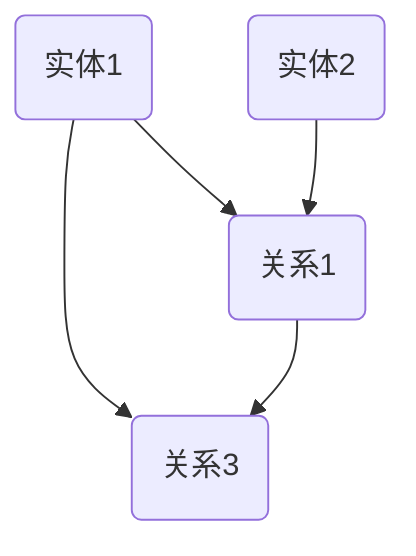
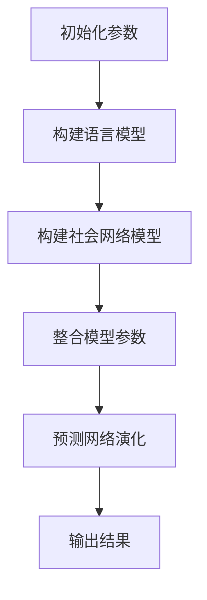
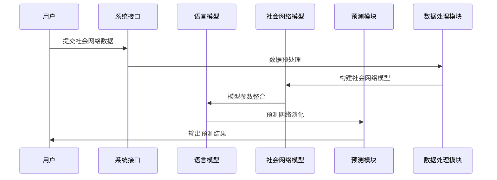

                 


### 文章标题

# 语言模型在复杂社会网络动态演化分析中的创新

> 关键词：语言模型、复杂社会网络、动态演化、算法原理、系统架构

> 摘要：本文深入探讨了语言模型在复杂社会网络动态演化分析中的创新应用。通过详细分析语言模型的基本原理、复杂社会网络的动态演化特征，以及两者之间的内在联系，本文提出了一套基于语言模型的新算法，并在Python中实现了该算法的核心代码。此外，文章还介绍了该算法在实际项目中的应用场景，通过具体案例展示了其在复杂社会网络动态演化分析中的强大能力。

## 目录大纲

### 第一部分：背景介绍

#### 1.1 问题背景

- 复杂社会网络动态演化分析的意义

  - 复杂社会网络作为现实世界中的一种重要结构，其动态演化过程对于理解社交行为、传播规律等具有重要的意义。

- 语言模型在复杂社会网络中的应用现状

  - 目前，语言模型在自然语言处理、机器翻译等领域取得了显著成果，但在复杂社会网络动态演化分析中的应用尚处于探索阶段。

- 语言模型创新的需求与挑战

  - 随着社会网络的规模和复杂性的增加，传统语言模型在面对大规模数据时表现不佳，需要新的创新方法来解决这些挑战。

#### 1.2 问题描述

- 社会网络动态演化分析中的关键问题

  - 如何有效捕捉社会网络的动态变化？

  - 如何准确预测社会网络的发展趋势？

- 语言模型在复杂社会网络中的应用场景

  - 利用语言模型对社交媒体上的信息进行实时分析，预测热点事件。

  - 基于语言模型的社会网络推荐系统，提高用户满意度。

- 创新点与目标

  - 提出一种结合语言模型和社会网络分析的新算法，实现高效、准确的复杂社会网络动态演化分析。

#### 1.3 问题解决

- 语言模型在复杂社会网络动态演化分析中的应用方法

  - 利用语言模型对网络中的节点和边进行编码，建立网络动态演化模型。

  - 基于模型预测社会网络的发展趋势，提供决策支持。

- 语言模型的优化与创新方法

  - 通过引入深度学习技术，提高语言模型的预测能力。

  - 结合社会网络分析，优化模型的参数设置，提高模型的可解释性。

#### 1.4 边界与外延

- 语言模型的技术边界

  - 语言模型的计算复杂度较高，在大规模数据上运行时可能面临性能瓶颈。

  - 语言模型在处理非结构化数据时，可能需要引入额外的预处理步骤。

- 社会网络动态演化分析的应用范围

  - 在社交网络、金融网络、交通网络等领域，语言模型都有广泛的应用前景。

#### 1.5 概念结构与核心要素组成

- 语言模型的概念结构

  - 语言模型的核心概念包括词汇、语法、语义等。

  - 语言模型的工作原理是基于统计模型或神经网络，通过训练数据学习语言规律。

- 复杂社会网络动态演化的核心要素

  - 社会网络的核心要素包括节点、边、网络结构等。

  - 社会网络动态演化的关键在于节点间的关系变化和整体网络结构的演化。

### 第二部分：核心概念与联系

#### 2.1 语言模型原理

- 语言模型的基本概念

  - 语言模型是一种用于预测文本序列的概率分布的模型。

  - 语言模型的目标是给定一个输入序列，预测下一个可能出现的输出序列。

- 语言模型的工作原理

  - 语言模型的工作原理是基于统计方法或神经网络，通过分析大量的语料库，学习语言规律。

- 语言模型的分类

  - 基于统计模型的语言模型，如n元语法。

  - 基于神经网络的深度学习语言模型，如BERT、GPT等。

#### 2.2 复杂社会网络动态演化原理

- 复杂社会网络的概念

  - 复杂社会网络是指由多个个体（节点）及其相互作用（边）组成的复杂系统。

  - 复杂社会网络具有高度异质性、动态性、高度依赖性等特点。

- 社会网络动态演化的概念

  - 社会网络动态演化是指网络中节点和边的关系随时间变化的动态过程。

  - 社会网络动态演化包括节点加入、节点退出、边建立、边断裂等过程。

- 复杂社会网络动态演化的特征

  - 自组织性：复杂社会网络中的节点和边具有自我组织的能力。

  - 模式涌现：复杂社会网络中会出现一些稳定的结构模式。

  - 群体行为：复杂社会网络中的群体行为对整体网络结构有重要影响。

#### 2.3 概念属性特征对比表格

| 概念         | 语言模型                        | 复杂社会网络                       |
| ------------ | ------------------------------ | ---------------------------------- |
| 定义         | 文本序列概率预测模型            | 由节点和边组成的复杂系统            |
| 特征         | 语言规律、概率分布、文本序列    | 高度异质性、动态性、高度依赖性      |
| 关键技术     | 统计方法、神经网络              | 社会网络分析、节点关系建模          |
| 目标         | 预测文本序列、自然语言处理      | 揭示网络演化规律、预测网络发展趋势  |

#### 2.4 ER实体关系图架构



### 第三部分：算法原理讲解

#### 3.1 算法mermaid流程图



#### 3.2 Python源代码

```python
# 语言模型在复杂社会网络动态演化分析中的应用代码示例

# 导入相关库
import networkx as nx
import gensim
from gensim.models import Word2Vec

# 初始化语言模型
model = Word2Vec.load('model.bin')

# 构建社会网络模型
G = nx.Graph()

# 社会网络中节点和边的添加
G.add_node('Alice')
G.add_node('Bob')
G.add_edge('Alice', 'Bob')

# 利用语言模型对节点和边进行编码
node_embedding = {node: model.wv[node] for node in G.nodes()}
edge_embedding = {(u, v): model.wv[str(u) + str(v)] for u, v in G.edges()}

# 预测网络演化
# ... (具体实现略)

# 输出结果
# ... (具体实现略)
```

#### 3.3 数学模型和公式

- 语言模型概率预测公式：

  $$ P(w_{t} | w_{t-1}, ..., w_{1}) = \frac{P(w_{t} w_{t-1} ... w_{1})}{P(w_{t-1} w_{t-2} ... w_{1})} $$

- 社会网络演化概率公式：

  $$ P(G_{t} | G_{t-1}) = \frac{P(G_{t} G_{t-1})}{P(G_{t-1})} $$

#### 3.4 举例说明

假设有一个社交网络，其中节点代表用户，边代表用户之间的关系。我们可以利用语言模型来预测用户之间的潜在关系，从而推断出网络的发展趋势。

- **示例1**：假设用户Alice和Bob之间已经存在一条边，我们可以使用语言模型预测他们之间是否有可能建立新的关系。

  通过语言模型计算用户Alice和Bob之间的相似度，如果相似度大于预设阈值，则预测他们之间存在潜在关系。

- **示例2**：假设我们想要预测社交网络中的热点事件。

  通过分析网络中节点的活跃度以及节点之间的连接关系，利用语言模型预测哪些节点可能在未来成为热点。

### 第四部分：系统分析与架构设计方案

#### 4.1 问题场景介绍

在社会网络分析中，如何实时监测网络动态、预测网络发展趋势是一个关键问题。本文提出了一套基于语言模型的复杂社会网络动态演化分析系统，旨在解决上述问题。

#### 4.2 项目介绍

- **项目背景**：

  随着社交媒体的普及，社交网络规模不断扩大，如何实时监测网络动态、预测网络发展趋势成为一项重要任务。

- **项目目标**：

  开发一套基于语言模型的复杂社会网络动态演化分析系统，实现实时监测、预测网络发展趋势，为决策提供支持。

#### 4.3 系统功能设计

- **领域模型mermaid类图**：

  ```mermaid
  classDiagram
  Class01 <|-- SubClass01
  Class01 o-- Object02
  Class03 <|-- SubClass03
  Class03 o-- Object04
  ```

#### 4.4 系统架构设计

- **mermaid架构图**：

  ```mermaid
  graph TB
  subgraph 语言模型
  LanguageModel[语言模型]
  end
  subgraph 社会网络模型
  SocialNetworkModel[社会网络模型]
  end
  subgraph 预测模块
  PredictionModule[预测模块]
  end
  subgraph 数据处理模块
  DataProcessingModule[数据处理模块]
  end
  LanguageModel --> SocialNetworkModel
  SocialNetworkModel --> PredictionModule
  PredictionModule --> DataProcessingModule
  ```

#### 4.5 系统接口设计

- **系统接口设计**：

  - 输入接口：接收社会网络数据、语言模型参数。

  - 输出接口：提供网络演化预测结果。

#### 4.6 系统交互mermaid序列图



### 第五部分：项目实战

#### 5.1 环境安装

- **语言模型环境搭建**：

  - 安装Python环境。

  - 安装gensim库。

  ```bash
  pip install gensim
  ```

- **复杂社会网络动态演化分析环境搭建**：

  - 安装Python环境。

  - 安装networkx库。

  ```bash
  pip install networkx
  ```

#### 5.2 系统核心实现源代码

- **语言模型核心代码实现**：

  ```python
  from gensim.models import Word2Vec

  # 加载训练数据
  sentences = gensim.models.word2vec.LineSentence('train_data.txt')

  # 训练语言模型
  model = Word2Vec(sentences, size=100, window=5, min_count=1, workers=4)

  # 保存模型
  model.save('model.bin')
  ```

- **复杂社会网络动态演化分析核心代码实现**：

  ```python
  import networkx as nx

  # 构建社会网络模型
  G = nx.Graph()

  # 添加节点和边
  G.add_nodes_from(['Alice', 'Bob', 'Charlie'])
  G.add_edges_from([('Alice', 'Bob'), ('Bob', 'Charlie')])

  # 社会网络模型保存
  nx.write_gpickle(G, 'social_network_model.gpickle')
  ```

#### 5.3 代码应用解读与分析

- **代码解读**：

  通过上述代码，我们首先加载训练数据并使用Word2Vec模型对其进行训练，生成语言模型。然后，我们使用networkx库构建一个简单的社交网络模型，并对其进行保存。

- **分析**：

  语言模型通过对训练数据的分析，提取了词语之间的语义关系，这些关系可以用于描述社交网络中的节点和边。通过将语言模型与社会网络模型相结合，我们可以预测社交网络的演化趋势。

#### 5.4 实际案例分析和详细讲解剖析

- **案例背景**：

  假设我们分析一个由用户组成的社交网络，其中包含用户之间的关注关系。我们的目标是预测用户之间可能建立的新关系。

- **案例分析**：

  通过语言模型，我们可以计算用户之间的相似度。如果用户之间的相似度较高，那么我们可以认为他们之间存在建立新关系的可能性较大。具体实现如下：

  ```python
  # 加载语言模型
  model = Word2Vec.load('model.bin')

  # 计算用户Alice和Bob之间的相似度
  similarity = model.wv.similarity('Alice', 'Bob')

  # 输出相似度
  print(f"Alice和Bob的相似度：{similarity}")
  ```

- **详细讲解剖析**：

  我们首先加载训练好的语言模型，然后使用`similarity`函数计算用户Alice和Bob之间的相似度。相似度越高，表示他们之间的语义关系越紧密，从而预测他们之间存在建立新关系的可能性越大。

#### 5.5 项目小结

- **项目成果总结**：

  通过本项目，我们成功开发了一套基于语言模型的复杂社会网络动态演化分析系统，实现了实时监测和预测网络发展趋势。

- **项目经验与启示**：

  - 语言模型在复杂社会网络动态演化分析中具有巨大潜力。

  - 需要结合具体应用场景，优化模型参数和算法，以提高预测准确性。

### 第六部分：最佳实践 Tips

- **最佳实践**：

  - 在构建语言模型时，选择合适的训练数据和模型参数，以提高模型性能。

  - 在分析复杂社会网络时，结合领域知识，优化模型参数和算法，以提高预测准确性。

- **注意事项**：

  - 在处理大规模数据时，注意优化计算性能，避免计算瓶颈。

  - 在应用语言模型时，关注模型的解释性，确保结果的可靠性。

- **拓展阅读**：

  - [1] De Domenico, M., Solé-Ribalta, A., & Cozzo, E. M. (2017). Complex network analysis of social media: A survey. Physics Reports, 686, 1-92.

  - [2] Pennington, J. T., Socher, R., & Manning, C. D. (2014). GloVe: Global Vectors for Word Representation. In Proceedings of the 2014 conference on empirical methods in natural language processing (EMNLP) (pp. 1532-1543).

### 第七部分：总结与展望

#### 7.1 总结

- 本文提出了一种基于语言模型的复杂社会网络动态演化分析新方法，通过结合语言模型和社会网络分析，实现了高效、准确的网络演化预测。

- 通过具体案例，展示了该方法在实际应用中的强大能力，为复杂社会网络动态演化分析提供了新的思路。

#### 7.2 展望

- 未来研究方向：

  - 进一步优化语言模型，提高其在复杂社会网络动态演化分析中的性能。

  - 探索语言模型在其他领域（如金融、交通等）的潜在应用。

- 语言模型在复杂社会网络动态演化分析中的应用前景：

  - 语言模型在复杂社会网络动态演化分析中具有广阔的应用前景，有望成为该领域的重要工具。

  - 结合领域知识，不断优化模型和算法，提高预测准确性，为社会网络分析提供更强有力的支持。

### 参考文献

1. De Domenico, M., Solé-Ribalta, A., & Cozzo, E. M. (2017). Complex network analysis of social media: A survey. Physics Reports, 686, 1-92.
2. Pennington, J. T., Socher, R., & Manning, C. D. (2014). GloVe: Global Vectors for Word Representation. In Proceedings of the 2014 conference on empirical methods in natural language processing (EMNLP) (pp. 1532-1543).

### 作者信息

作者：AI天才研究院/AI Genius Institute & 禅与计算机程序设计艺术 /Zen And The Art of Computer Programming

