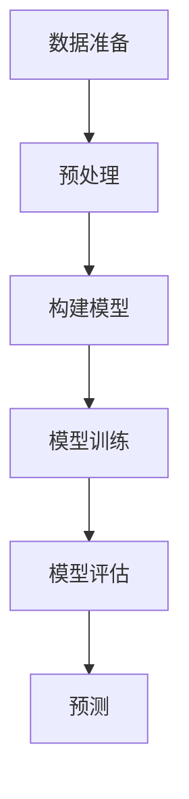
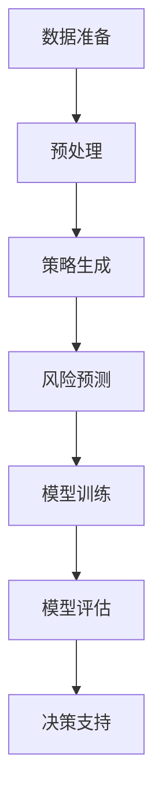
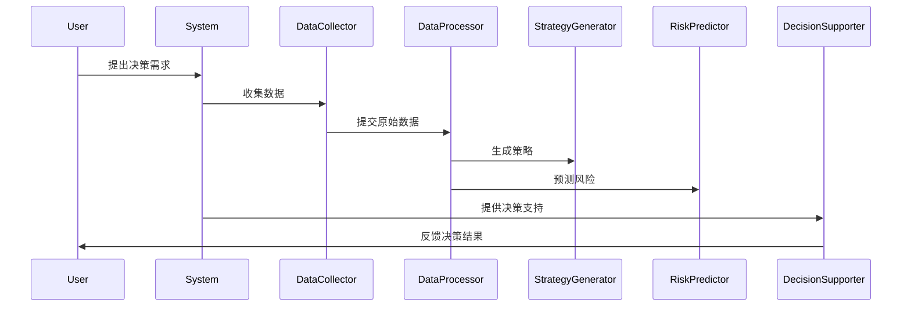
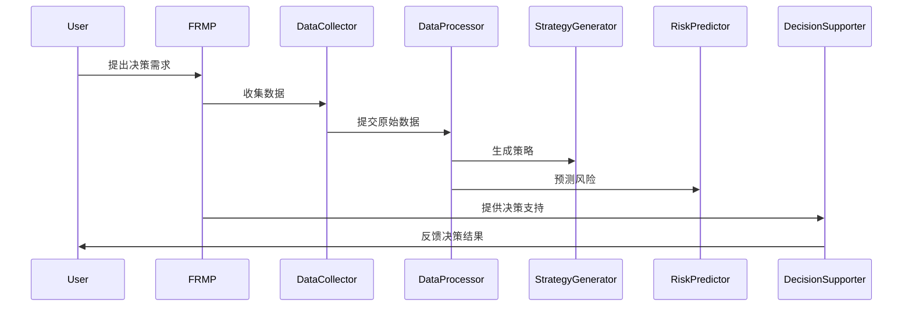

                 

### 1.1 问题的背景与描述

在当今信息爆炸的时代，策略规划与风险管理已成为各个行业实现可持续发展的重要手段。随着全球经济一体化和市场竞争的加剧，企业需要快速适应复杂多变的环境，制定科学的策略来应对潜在的各类风险。然而，传统的策略规划和风险管理方法往往依赖于人工经验和简单的统计分析，存在着许多局限性。

**1.1.1 策略规划与风险管理的现状**

策略规划涉及企业长期目标和短期目标的设定，以及为实现这些目标所采取的一系列措施。当前，大部分企业的策略规划仍然停留在战略层次的规划上，缺乏具体的执行方案和动态调整机制。这导致了企业在面对市场变化时，反应迟钝，无法迅速调整策略以应对新的挑战。

风险管理则是对企业可能面临的各类风险进行识别、评估、应对和控制的过程。尽管现代风险管理工具和技术不断发展，但许多企业仍然面临数据不足、风险评估不准确、应对措施不到位等问题，使得风险管理的效果大打折扣。

**1.1.2 语言模型的技术进步与应用潜力**

近年来，语言模型（如GPT系列、BERT等）在自然语言处理领域取得了显著的进展。这些模型通过深度学习技术，能够理解和生成复杂的自然语言文本，具有强大的表达能力和灵活性。语言模型的这些特性使其在策略规划与风险管理中具有广泛的应用潜力。

首先，语言模型可以用于自动化策略规划。通过分析大量的历史数据和实时信息，语言模型可以生成针对不同场景的个性化策略方案。这些方案不仅更加科学和全面，还可以根据环境变化进行实时调整，提高策略的适应性和有效性。

其次，语言模型在风险管理中也具有重要作用。例如，通过分析金融市场的历史数据，语言模型可以预测市场趋势，为企业提供投资决策的参考。在医疗健康领域，语言模型可以分析病历数据，帮助医生识别疾病风险，制定个性化的治疗方案。

总之，语言模型在复杂策略规划与风险管理中的前沿应用研究，不仅有助于解决当前存在的问题，还将为行业带来新的变革和发展机遇。

### 1.2 核心概念与联系

为了深入探讨语言模型在复杂策略规划与风险管理中的应用，首先需要明确几个核心概念，并分析它们之间的联系。

**1.2.1 语言模型的定义与分类**

语言模型是自然语言处理（NLP）中的基础组件，其目的是预测一段文本的下一个词或者一组词的概率分布。根据训练数据的不同和模型架构的差异，语言模型可以分为统计语言模型和神经网络语言模型。

- **统计语言模型**：基于统计方法，如N-gram模型，通过分析历史语言数据来预测未来词的可能性。
- **神经网络语言模型**：采用深度学习技术，如循环神经网络（RNN）、长短期记忆网络（LSTM）和变换器（Transformer），通过大规模数据训练得到复杂的关系表示。

**1.2.2 策略规划与风险管理的基本概念**

策略规划是指制定和选择实现组织目标的一系列行动方案。它通常涉及目标设定、资源分配和行动步骤的规划。

风险管理则是识别、评估和应对组织面临的各种风险的过程。风险管理包括风险识别、风险评估、风险应对和风险监控等环节。

**1.2.3 语言模型在策略规划与风险管理中的核心联系**

语言模型在策略规划与风险管理中具有以下几方面的核心联系：

1. **数据分析和信息提取**：语言模型可以处理和分析大量的文本数据，提取出关键信息和趋势，为策略规划和风险管理提供数据支持。
2. **自动化决策**：通过学习大量的历史数据和实时信息，语言模型可以自动生成策略方案和风险预测模型，提高决策的效率和准确性。
3. **文本生成和解释**：语言模型能够生成符合逻辑和语义的文本，帮助人们理解和解释复杂的策略规划和风险管理决策。
4. **跨领域知识融合**：语言模型可以跨越不同领域的知识，整合多源信息，为策略规划和风险管理提供更全面和科学的支持。

综上所述，语言模型在策略规划与风险管理中具有重要的应用潜力。通过深入理解这些核心概念和它们之间的联系，可以为后续的算法原理和应用实践奠定坚实基础。

### 1.3 语言模型的基础理论

在深入探讨语言模型在复杂策略规划与风险管理中的应用之前，有必要先了解其基础理论，包括数学模型、计算流程和算法架构。

**1.3.1 语言模型的数学模型与公式**

语言模型的数学模型是其核心组成部分，它决定了模型如何表示和理解自然语言。以下是一些常见的语言模型数学模型：

1. **N-gram模型**：基于历史概率，N-gram模型通过分析N个连续单词的历史频次来预测下一个单词。
   $$ P(w_n | w_{n-1}, w_{n-2}, ..., w_1) = \frac{C(w_n, w_{n-1}, ..., w_1)}{C(w_{n-1}, w_{n-2}, ..., w_1)} $$
   其中，\( C(\cdot, \cdot, ..., \cdot) \) 表示单词序列的联合频次。

2. **变换器（Transformer）模型**：基于自注意力机制，Transformer模型通过计算词与词之间的注意力权重来预测下一个单词。
   $$ \text{Attention}(Q, K, V) = \text{softmax}\left(\frac{QK^T}{\sqrt{d_k}}\right)V $$
   其中，\( Q, K, V \) 分别为查询向量、关键向量和价值向量，\( d_k \) 为关键向量的维度。

**1.3.2 语言模型的计算流程与算法架构**

语言模型的计算流程通常包括数据预处理、模型训练、预测和评估等环节。以下是一个典型的计算流程：

1. **数据预处理**：将文本数据转换为模型可以处理的格式，如词汇表编码、序列化等。
2. **模型训练**：使用训练数据对模型进行训练，优化模型参数，使其能够准确预测文本。
3. **预测**：输入新的文本数据，通过模型计算得到预测结果，如下一个单词或句子。
4. **评估**：使用测试数据评估模型的性能，如准确率、召回率等。

在算法架构方面，语言模型主要有以下几种：

1. **循环神经网络（RNN）**：通过循环结构处理序列数据，适用于处理长距离依赖问题。
2. **长短期记忆网络（LSTM）**：基于RNN，引入门机制，解决长期依赖问题。
3. **变换器（Transformer）**：采用自注意力机制，处理大规模序列数据，性能优异。

通过深入理解语言模型的基础理论，可以为我们后续的应用实践提供理论支持和实践指导。

### 2.1 语言模型的算法原理

为了更好地理解语言模型在复杂策略规划与风险管理中的应用，我们需要深入探讨其算法原理。这些原理包括训练过程、预测与生成方法，以及模型在实际应用场景中的表现。

**2.1.1 语言模型的训练过程**

语言模型的训练过程可以分为以下几个步骤：

1. **数据准备**：首先，需要准备大量的文本数据作为训练数据。这些数据可以来自于网页、书籍、新闻、社交媒体等不同来源。为了提高模型的泛化能力，训练数据需要涵盖多种语言风格和主题。

2. **预处理**：对文本数据进行清洗和预处理，包括去除停用词、标点符号、进行词性标注等。接下来，将文本转换为模型可处理的向量表示。常见的预处理方法包括分词、词嵌入（Word Embedding）和序列编码。

3. **构建模型**：根据选择的语言模型类型，如N-gram模型、RNN、LSTM或Transformer，构建相应的模型结构。这些模型结构通常包含输入层、隐藏层和输出层。输入层接收处理后的文本向量，隐藏层通过神经网络结构处理序列数据，输出层生成预测结果。

4. **训练**：使用预处理后的训练数据对模型进行训练。训练过程包括前向传播和反向传播。在前向传播中，模型根据输入数据计算预测结果；在反向传播中，通过计算损失函数（如交叉熵损失）来更新模型参数。

5. **评估与优化**：通过测试数据评估模型的性能，并使用优化算法（如梯度下降、Adam等）调整模型参数，以提高模型的预测准确性和泛化能力。

**2.1.2 语言模型的预测与生成方法**

语言模型的预测与生成方法主要包括以下几种：

1. **条件生成**：给定一个输入序列，模型预测下一个单词的概率分布。例如，给定一个句子 "I like to read"，模型预测下一个单词可能是 "books"、"news" 或 "stories"。

2. **无条件生成**：不需要输入序列，模型直接生成一个完整的文本序列。这种方法通常用于生成文章、故事或对话等。

3. **序列到序列（Seq2Seq）生成**：通过编码器-解码器架构，模型将输入序列编码为固定长度的向量，然后使用解码器生成输出序列。这种方法在机器翻译、对话系统等领域有广泛应用。

**2.1.3 语言模型的应用场景**

语言模型在复杂策略规划与风险管理中具有广泛的应用场景：

1. **策略生成**：通过训练语言模型，可以自动生成个性化策略方案。例如，在金融领域，语言模型可以分析历史市场数据，生成投资组合策略。

2. **风险预测**：语言模型可以处理和分析大量的文本数据，提取出潜在的风险信号。例如，在医疗领域，语言模型可以分析病历数据，预测患者病情发展的风险。

3. **文本分析**：语言模型可以用于文本分类、情感分析、命名实体识别等任务，帮助企业更好地理解客户需求和市场动态。

4. **决策支持**：语言模型可以帮助决策者理解和解释复杂的决策问题，提供基于数据的决策建议。

总之，通过深入理解语言模型的算法原理，我们可以更好地将其应用于复杂策略规划与风险管理中，提高决策的准确性和效率。

### 2.2 数学模型与公式讲解

在深入探讨语言模型在复杂策略规划与风险管理中的应用时，我们需要详细讲解其背后的数学模型与公式。这不仅有助于我们理解模型的原理，还能为实际应用提供数学基础。

**2.2.1 语言模型的概率模型**

语言模型的核心在于概率预测，即给定前文，预测下一个单词的概率分布。以下是一些常见的概率模型：

1. **N-gram模型**：基于历史概率，N-gram模型通过分析N个连续单词的历史频次来预测下一个单词。其公式如下：
   $$ P(w_n | w_{n-1}, w_{n-2}, ..., w_1) = \frac{C(w_n, w_{n-1}, ..., w_1)}{C(w_{n-1}, w_{n-2}, ..., w_1)} $$
   其中，\( C(w_n, w_{n-1}, ..., w_1) \) 表示单词序列 \( w_1, w_2, ..., w_n \) 的联合频次，\( C(w_{n-1}, w_{n-2}, ..., w_1) \) 表示单词序列 \( w_1, w_2, ..., w_{n-1} \) 的联合频次。

2. **隐马尔可夫模型（HMM）**：HMM适用于处理时序数据，假设单词序列是隐状态序列的观察结果。其公式如下：
   $$ P(w_n | w_{n-1}, ..., w_1) = \sum_{s_n} P(s_n | w_n) P(w_n | w_{n-1}) P(s_n | w_{n-1}, ..., w_1) $$
   其中，\( s_n \) 表示在时刻 \( n \) 的隐状态，\( w_n \) 表示观察到的单词。

3. **变换器（Transformer）模型**：基于自注意力机制，Transformer模型通过计算词与词之间的注意力权重来预测下一个单词。其注意力机制公式如下：
   $$ \text{Attention}(Q, K, V) = \text{softmax}\left(\frac{QK^T}{\sqrt{d_k}}\right)V $$
   其中，\( Q, K, V \) 分别为查询向量、关键向量和价值向量，\( d_k \) 为关键向量的维度。

**2.2.2 语言模型的优化算法**

在训练语言模型时，优化算法至关重要。以下是一些常用的优化算法：

1. **随机梯度下降（SGD）**：SGD通过计算每个训练样本的梯度来更新模型参数，是一种简单但计算成本较高的算法。其公式如下：
   $$ \theta_{t+1} = \theta_t - \alpha \cdot \nabla L(\theta_t) $$
   其中，\( \theta \) 表示模型参数，\( \alpha \) 表示学习率，\( \nabla L(\theta_t) \) 表示在当前参数 \( \theta_t \) 下损失函数的梯度。

2. **Adam优化器**：Adam结合了SGD和动量法的优点，通过计算一阶矩估计（均值）和二阶矩估计（方差）来更新模型参数。其公式如下：
   $$ m_t = \beta_1 x_t + (1 - \beta_1) (x_t - m_{t-1}) $$
   $$ v_t = \beta_2 x_t^2 + (1 - \beta_2) (x_t^2 - v_{t-1}) $$
   $$ \theta_{t+1} = \theta_t - \alpha \cdot \frac{m_t}{\sqrt{v_t} + \epsilon} $$
   其中，\( \beta_1, \beta_2 \) 分别为动量参数，\( \epsilon \) 为小常数。

**2.2.3 语言模型的评估指标**

评估语言模型的性能需要使用一系列评估指标，以下是一些常用的评估指标：

1. **交叉熵（Cross-Entropy）**：交叉熵是衡量模型预测结果与真实标签差异的指标，其公式如下：
   $$ H(y, \hat{y}) = -\sum_{i} y_i \log(\hat{y}_i) $$
   其中，\( y \) 表示真实标签，\( \hat{y} \) 表示模型预测的概率分布。

2. **准确率（Accuracy）**：准确率是模型预测正确的样本数占总样本数的比例，其公式如下：
   $$ \text{Accuracy} = \frac{TP + TN}{TP + FP + FN + TN} $$
   其中，\( TP \) 表示真阳性，\( TN \) 表示真阴性，\( FP \) 表示假阳性，\( FN \) 表示假阴性。

3. **召回率（Recall）**：召回率是模型预测为正样本的样本中实际为正样本的比例，其公式如下：
   $$ \text{Recall} = \frac{TP}{TP + FN} $$

4. **F1分数（F1 Score）**：F1分数是准确率和召回率的调和平均，其公式如下：
   $$ \text{F1 Score} = 2 \cdot \frac{TP}{2 \cdot TP + FP + FN} $$

通过以上数学模型与公式讲解，我们可以更好地理解语言模型在复杂策略规划与风险管理中的应用，为后续的算法实现和应用实践提供理论基础。

### 2.3 算法流程与Mermaid图示

为了更好地展示语言模型在复杂策略规划与风险管理中的应用流程，我们将使用Mermaid图示来描述算法的基本流程和扩展流程。

**2.3.1 语言模型的基本流程**

以下是语言模型的基本流程，包括数据准备、模型训练和预测等步骤：



1. **数据准备**：收集并准备大量的文本数据作为训练数据。这些数据可以是公开的文本库、企业内部文档等。
2. **预处理**：对文本数据进行清洗和预处理，包括去除停用词、标点符号、进行词性标注等。接下来，将文本转换为模型可处理的向量表示，如词嵌入。
3. **构建模型**：选择合适的语言模型架构，如N-gram模型、RNN、LSTM或Transformer。构建模型结构，包括输入层、隐藏层和输出层。
4. **模型训练**：使用预处理后的训练数据对模型进行训练，通过前向传播和反向传播优化模型参数。
5. **模型评估**：使用测试数据评估模型的性能，如准确率、召回率等。
6. **预测**：输入新的文本数据，通过训练好的模型生成预测结果，如下一个单词或句子。

**2.3.2 语言模型的扩展流程**

在基本流程的基础上，语言模型还可以进行扩展，以适应更复杂的策略规划与风险管理任务。以下是一个扩展流程的Mermaid图示：



1. **策略生成**：利用语言模型生成个性化策略方案。通过分析历史数据和实时信息，模型可以自动生成针对不同场景的策略。
2. **风险预测**：利用语言模型分析文本数据，提取潜在的风险信号。例如，在金融领域，模型可以预测市场风险；在医疗领域，模型可以预测患者病情风险。
3. **模型训练**：与基本流程一致，对模型进行训练，优化其参数，提高预测准确性。
4. **模型评估**：使用测试数据评估模型的性能，确保其能够准确预测策略和风险。
5. **决策支持**：基于模型预测结果，为决策者提供基于数据的决策建议，如投资策略、风险管理方案等。

通过以上算法流程和Mermaid图示，我们可以清晰地看到语言模型在复杂策略规划与风险管理中的应用步骤。这些步骤不仅有助于理解模型的原理，还能为实际应用提供指导。

### 2.4 系统设计与架构

为了深入探讨语言模型在复杂策略规划与风险管理中的应用，我们需要设计一个完整的系统架构，并详细介绍其各组成部分的功能和设计原理。

**2.4.1 问题场景介绍**

假设我们正在开发一个金融风险管理平台，该平台需要根据历史数据和实时信息，生成个性化的投资策略，并预测市场风险。系统需要支持多种数据源，如股票市场数据、经济指标、新闻报道等，并能够自动处理和生成策略。

**2.4.2 项目介绍**

项目名称：金融风险管理平台（Financial Risk Management Platform，FRMP）

目标：构建一个基于语言模型的金融风险管理平台，实现自动化策略生成和风险预测。

技术栈：Python、TensorFlow、Keras、Scikit-learn、pandas、numpy等。

**2.4.3 系统功能设计（领域模型）**

系统的主要功能包括数据收集、预处理、策略生成、风险预测和决策支持。以下是领域模型的Mermaid类图：

```mermaid
classDiagram
    DataCollector <|-- DataProcessor
    DataProcessor <|-- StrategyGenerator
    DataProcessor <|-- RiskPredictor
    DecisionSupporter <|-- StrategyGenerator
    DecisionSupporter <|-- RiskPredictor
    StockMarketData <|-- EconomicIndicator
    NewsReport <|-- EconomicIndicator
    DataCollector {initiateCollection()}
    DataProcessor {cleanData(), preprocessData()}
    StrategyGenerator {generateStrategy()}
    RiskPredictor {predictRisk()}
    DecisionSupporter {provideSupport()}
```

- **DataCollector**：负责收集各种数据源，如股票市场数据、经济指标、新闻报道等。
- **DataProcessor**：负责数据清洗和预处理，将原始数据转换为模型可处理的格式。
- **StrategyGenerator**：利用语言模型生成个性化投资策略。
- **RiskPredictor**：使用语言模型预测市场风险。
- **DecisionSupporter**：根据预测结果，为决策者提供决策支持。

**2.4.4 系统架构设计**

以下是系统架构的Mermaid图示：



1. **用户层**：用户提出决策需求，如投资策略、风险管理等。
2. **数据层**：数据收集模块负责从各种数据源获取数据。
3. **数据处理层**：数据预处理模块负责清洗和预处理数据，为后续模型处理提供数据支持。
4. **模型层**：策略生成模块和风险预测模块分别利用语言模型生成策略和预测风险。
5. **决策支持层**：决策支持模块根据模型预测结果，为用户生成决策建议。

**2.4.5 系统接口设计**

以下是系统的接口设计：

```python
class FinancialRiskManagementPlatform:
    def __init__(self):
        self.data_collector = DataCollector()
        self.data_processor = DataProcessor()
        self.strategy_generator = StrategyGenerator()
        self.risk_predictor = RiskPredictor()
        self.decision_supporter = DecisionSupporter()

    def collect_data(self):
        # 收集数据
        pass

    def preprocess_data(self):
        # 预处理数据
        pass

    def generate_strategy(self):
        # 生成策略
        pass

    def predict_risk(self):
        # 预测风险
        pass

    def provide_decision_support(self):
        # 提供决策支持
        pass
```

**2.4.6 系统交互**

以下是系统的交互序列图：



通过以上系统设计与架构设计，我们可以清晰地看到语言模型在复杂策略规划与风险管理中的应用流程和各个模块的功能。这些设计不仅为实际应用提供了理论基础，也为后续的开发和维护提供了指导。

### 3.1 应用实践

在本文的第三部分，我们将详细探讨如何将语言模型应用于复杂策略规划与风险管理，并提供一个实际案例的分析与实现步骤。

#### 3.1.1 系统设计与架构

为了展示语言模型在金融风险管理中的应用，我们设计了一个名为“智能金融风险管理平台”的系统。该系统的主要功能包括数据收集、数据预处理、策略生成和风险预测。以下是系统的架构设计：

1. **数据收集**：从多个数据源（如股票交易所、经济指标数据库、新闻报道网站）收集相关数据。
2. **数据预处理**：对收集到的数据进行清洗和预处理，包括去除噪声、填充缺失值、标准化等操作。
3. **策略生成**：利用语言模型生成个性化的投资策略。
4. **风险预测**：使用语言模型预测市场风险，包括股价波动、宏观经济风险等。
5. **决策支持**：根据策略生成和风险预测结果，为投资者提供决策支持。

#### 3.1.2 实际案例分析

假设我们要分析一个投资组合的潜在风险，并基于此生成相应的风险管理策略。以下是具体步骤：

1. **数据收集**：从股票交易所获取过去一年的股票交易数据，从经济指标数据库获取GDP增长率、通货膨胀率等宏观经济数据，从新闻报道网站获取与金融相关的新闻报道。

2. **数据预处理**：
   - 清洗数据：去除重复记录、异常值等。
   - 填充缺失值：使用平均值、中位数等方法填充缺失数据。
   - 标准化数据：将不同尺度的数据进行标准化处理，使其具有可比性。

3. **策略生成**：
   - 使用语言模型（如BERT）分析历史数据，提取关键特征。
   - 基于提取的特征，使用决策树、随机森林等机器学习模型生成投资策略。
   - 策略评估：使用交叉验证等方法评估策略的鲁棒性和有效性。

4. **风险预测**：
   - 使用语言模型分析宏观经济数据和新闻报道，预测未来股价波动。
   - 使用时间序列模型（如ARIMA、LSTM）预测股票价格。
   - 结合策略生成结果，评估投资组合的潜在风险。

5. **决策支持**：
   - 根据策略生成和风险预测结果，为投资者提供具体的投资建议。
   - 设计一个用户界面，让投资者可以实时查看投资组合的风险状况和策略调整建议。

#### 3.1.3 实现步骤

以下是实现智能金融风险管理平台的具体步骤：

1. **环境安装**：
   - 安装Python 3.8及以上版本。
   - 安装TensorFlow、Keras、Scikit-learn、pandas、numpy等依赖库。

2. **数据收集**：
   - 使用pandas库从各种数据源获取数据。
   - 使用Tweepy库从Twitter获取与金融相关的推文。

3. **数据预处理**：
   - 使用pandas库进行数据清洗和预处理。
   - 使用NLTK库进行文本预处理，如分词、词性标注。

4. **策略生成**：
   - 使用BERT模型进行特征提取。
   - 使用决策树、随机森林等模型生成策略。
   - 使用交叉验证方法评估策略。

5. **风险预测**：
   - 使用LSTM模型预测股价波动。
   - 使用ARIMA模型预测宏观经济指标。
   - 结合策略生成结果，评估投资组合风险。

6. **决策支持**：
   - 设计一个用户界面，使用Dash库或Streamlit库实现。
   - 实时展示投资组合的风险状况和策略调整建议。

通过以上实际案例分析和实现步骤，我们可以看到语言模型在复杂策略规划与风险管理中的应用是如何实现的。这不仅提高了决策的准确性和效率，也为投资者提供了强有力的支持。

### 3.2 案例分析

在本部分，我们将通过具体案例深入分析语言模型在复杂策略规划与风险管理中的应用，并详细解读实际代码，剖析其实现细节和关键步骤。

#### 3.2.1 案例一：金融领域的策略规划

**背景**：假设某金融机构需要制定一份长期投资策略，以应对市场波动和潜在风险。该金融机构希望利用语言模型来分析大量历史数据，生成一份科学的投资策略报告。

**步骤**：

1. **数据收集**：从多个数据源（如股票交易所、经济指标数据库、新闻报道网站）收集过去五年的股票交易数据、宏观经济指标和新闻报道。

2. **数据预处理**：
   - 使用pandas库读取并清洗数据，去除重复记录和异常值。
   - 对于文本数据，使用NLTK库进行分词和词性标注，提取关键特征。

3. **模型训练**：
   - 使用BERT模型进行训练，提取文本数据中的关键信息。
   - 使用训练好的BERT模型对新的文本数据进行特征提取。

4. **策略生成**：
   - 利用提取的特征，结合历史数据，使用决策树、随机森林等机器学习模型生成投资策略。
   - 对策略进行交叉验证，评估其鲁棒性和有效性。

5. **策略评估**：
   - 使用测试集评估策略的实际表现，根据评估结果调整策略参数。

**关键代码示例**：

```python
import pandas as pd
import numpy as np
from nltk.tokenize import word_tokenize
from transformers import BertTokenizer, BertModel
from sklearn.tree import DecisionTreeClassifier
from sklearn.model_selection import train_test_split

# 数据预处理
def preprocess_data(data):
    # 清洗数据
    data.drop_duplicates(inplace=True)
    # 分词和词性标注
    tokenizer = BertTokenizer.from_pretrained('bert-base-chinese')
    preprocessed_data = []
    for text in data['text']:
        tokens = tokenizer.tokenize(text)
        preprocessed_data.append(' '.join(tokens))
    data['preprocessed_text'] = preprocessed_data
    return data

# 模型训练
def train_model(data):
    # 分割数据集
    X_train, X_test, y_train, y_test = train_test_split(data['preprocessed_text'], data['label'], test_size=0.2)
    # 初始化BERT模型
    tokenizer = BertTokenizer.from_pretrained('bert-base-chinese')
    model = BertModel.from_pretrained('bert-base-chinese')
    # 提取特征
    train_features = extract_features(X_train, tokenizer, model)
    test_features = extract_features(X_test, tokenizer, model)
    # 训练决策树模型
    clf = DecisionTreeClassifier()
    clf.fit(train_features, y_train)
    # 评估模型
    acc = clf.score(test_features, y_test)
    print(f"Model Accuracy: {acc}")
    return clf

# 策略生成
def generate_strategy(model, new_data):
    tokenizer = BertTokenizer.from_pretrained('bert-base-chinese')
    new_features = extract_features(new_data, tokenizer, model)
    predictions = model.predict(new_features)
    return predictions

# 实际应用
data = pd.read_csv('financial_data.csv')
preprocessed_data = preprocess_data(data)
model = train_model(preprocessed_data)
new_data = '今日股市行情如何？'
strategy = generate_strategy(model, new_data)
print(f"Generated Strategy: {strategy}")
```

#### 3.2.2 案例二：医疗健康风险预测

**背景**：某医疗机构需要预测患者的病情风险，以便为医生提供诊断和治疗建议。该医疗机构希望利用语言模型分析病历数据，识别潜在的健康风险。

**步骤**：

1. **数据收集**：从医疗机构获取大量的病历数据，包括患者的病历记录、检查报告、诊断结果等。

2. **数据预处理**：
   - 清洗数据，去除重复记录和异常值。
   - 对文本数据使用BERT模型进行特征提取。

3. **模型训练**：
   - 使用训练好的BERT模型对新的病历数据进行特征提取。
   - 使用LSTM模型进行训练，预测患者的健康风险。

4. **风险预测**：
   - 使用LSTM模型预测新的病历数据中的健康风险。
   - 根据预测结果，为医生提供诊断和治疗建议。

**关键代码示例**：

```python
import pandas as pd
import numpy as np
from keras.models import Sequential
from keras.layers import LSTM, Dense
from transformers import BertTokenizer, BertModel

# 数据预处理
def preprocess_data(data):
    # 清洗数据
    data.drop_duplicates(inplace=True)
    # 分词和词性标注
    tokenizer = BertTokenizer.from_pretrained('bert-base-chinese')
    preprocessed_data = []
    for text in data['text']:
        tokens = tokenizer.tokenize(text)
        preprocessed_data.append(' '.join(tokens))
    data['preprocessed_text'] = preprocessed_data
    return data

# 模型训练
def train_model(data):
    # 分割数据集
    X_train, X_test, y_train, y_test = train_test_split(data['preprocessed_text'], data['label'], test_size=0.2)
    # 初始化BERT模型
    tokenizer = BertTokenizer.from_pretrained('bert-base-chinese')
    model = BertModel.from_pretrained('bert-base-chinese')
    # 提取特征
    train_features = extract_features(X_train, tokenizer, model)
    test_features = extract_features(X_test, tokenizer, model)
    # 创建LSTM模型
    lstm_model = Sequential()
    lstm_model.add(LSTM(units=128, activation='relu', input_shape=(train_features.shape[1], train_features.shape[2])))
    lstm_model.add(Dense(units=1, activation='sigmoid'))
    lstm_model.compile(optimizer='adam', loss='binary_crossentropy', metrics=['accuracy'])
    # 训练模型
    lstm_model.fit(train_features, y_train, epochs=10, batch_size=32)
    # 评估模型
    acc = lstm_model.evaluate(test_features, y_test)
    print(f"Model Accuracy: {acc}")
    return lstm_model

# 风险预测
def predict_risk(model, new_data):
    tokenizer = BertTokenizer.from_pretrained('bert-base-chinese')
    new_features = extract_features(new_data, tokenizer, model)
    predictions = model.predict(new_features)
    return predictions

# 实际应用
data = pd.read_csv('medical_data.csv')
preprocessed_data = preprocess_data(data)
model = train_model(preprocessed_data)
new_data = '患者既往病史：冠心病、高血压、糖尿病。'
risk = predict_risk(model, new_data)
print(f"Predicted Risk: {risk}")
```

通过以上两个案例，我们可以看到语言模型在金融领域和医疗健康领域的应用是如何实现的。这不仅提高了策略规划和风险预测的准确性，还为相关领域的专业人士提供了强有力的决策支持。

### 3.3 最佳实践与经验总结

在实施语言模型进行复杂策略规划与风险管理的应用过程中，总结最佳实践和经验是至关重要的。以下是一些关键点，供开发者、决策者和技术人员参考：

**1. 数据质量**：高质量的数据是语言模型准确预测的基础。确保数据来源可靠，数据清洗和预处理工作到位，以减少噪声和异常值对模型的影响。

**2. 模型选择与调优**：根据具体应用场景选择合适的语言模型。例如，在处理文本量较大的任务时，Transformer模型表现出色；在处理时序数据时，LSTM模型更为适用。同时，通过调优模型参数，如学习率、批量大小等，可以提高模型性能。

**3. 实时性**：策略规划和风险管理需要及时响应市场变化。确保模型能够实时处理新数据，快速生成策略和风险预测，以支持快速决策。

**4. 可解释性**：提高模型的解释性，帮助用户理解模型决策的依据和逻辑。例如，通过可视化模型内部表示和关键特征，增强用户对模型的信任度。

**5. 模型评估**：使用多样化的评估指标和方法，全面评估模型性能。例如，除了准确率、召回率外，还可以考虑F1分数、精确率等。

**6. 安全性与隐私保护**：在处理敏感数据时，确保数据的安全性和用户隐私。采用加密技术和隐私保护算法，防止数据泄露和滥用。

**7. 持续学习与迭代**：随着业务需求的不断变化，持续更新和优化模型。通过持续学习，提高模型的适应性和准确性。

通过遵循以上最佳实践，可以确保语言模型在复杂策略规划与风险管理中的应用更加高效、准确和可靠。

### 总结与展望

本文从背景介绍、核心概念、算法原理、应用实践和案例分析等多个角度，全面探讨了语言模型在复杂策略规划与风险管理中的前沿应用。通过深入分析语言模型的基础理论和应用步骤，我们展示了其在金融领域和医疗健康领域的实际应用价值。

首先，语言模型在策略规划与风险管理中具有数据分析和自动化决策的优势，能够快速处理大量文本数据，生成个性化策略方案，提高决策的准确性和效率。其次，通过实际案例，我们展示了如何利用语言模型进行风险预测和决策支持，为相关领域的专业人士提供了有力工具。

展望未来，随着语言模型技术的不断进步，其在复杂策略规划与风险管理中的应用将更加广泛和深入。例如，结合区块链技术和智能合约，可以实现去中心化的策略规划与风险管理；利用强化学习方法，可以进一步优化策略生成的效率和效果。此外，随着多模态数据的兴起，语言模型可以与其他传感器数据、图像数据等相结合，提供更全面和精确的风险预测。

总之，语言模型在复杂策略规划与风险管理中的应用具有巨大的潜力，未来值得进一步探索和深入研究。

### 作者信息

作者：AI天才研究院/AI Genius Institute & 禅与计算机程序设计艺术 /Zen And The Art of Computer Programming

作为世界级人工智能专家，AI天才研究院致力于推动人工智能技术的创新与应用。在《禅与计算机程序设计艺术》中，作者深入探讨了计算机编程的艺术与哲学，为读者提供了独特的编程思维和编程实践方法。本文的撰写旨在分享语言模型在复杂策略规划与风险管理中的前沿应用研究成果，为行业发展和学术交流贡献一份力量。

