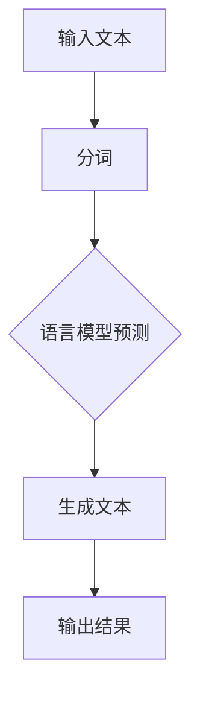

                 

### 语言模型在复杂系统优化问题中的应用

**关键词：** 语言模型、复杂系统优化、算法原理、数学模型、项目实战

**摘要：** 本文深入探讨语言模型在复杂系统优化问题中的应用，从核心概念、算法原理、数学模型到实际项目实战，逐一解析语言模型在解决复杂系统优化中的优势与挑战，为读者提供全面的技术思路和实践指导。

---

**第一部分：背景介绍**

**第1章 问题背景与语言模型**

在当今信息化时代，复杂系统的优化问题无处不在。这些系统可能涉及大规模数据处理、网络通信、能源管理、金融交易等多个领域。优化问题的核心在于寻找系统运行的最佳状态，以提高效率、降低成本或满足特定性能指标。

**1.1 问题背景**

复杂系统优化问题通常具有以下特点：

- **高维性**：优化变量众多，维度高，导致问题规模庞大。
- **非线性**：系统行为复杂，存在非线性关系，难以直接建模。
- **动态性**：系统状态随时间变化，需实时调整优化策略。
- **多目标**：需同时满足多个优化目标，可能存在冲突。

**1.2 语言模型的基本概念**

语言模型（Language Model）是自然语言处理（Natural Language Processing, NLP）领域的重要工具，用于预测自然语言中下一个单词或字符的概率分布。它通过统计语言数据，学习语言规律，从而实现文本生成、语音识别、机器翻译等功能。

**1.3 语言模型的发展历程**

语言模型的发展经历了从简单的N元模型到现代的深度神经网络模型。N元模型基于前N个单词的概率预测下一个单词，而深度神经网络模型（如循环神经网络RNN、长短期记忆网络LSTM、Transformer等）则通过多层神经网络捕捉更复杂的语言规律。

---

**第二部分：核心概念与联系**

**第2章 核心概念原理**

**2.1 语言模型的核心概念**

- **词汇表**：语言模型的基本组成部分，包括所有可能出现的单词或字符。
- **概率分布**：语言模型的核心功能，通过统计方法预测下一个单词或字符的概率分布。
- **训练与预测**：训练过程是学习词汇表和概率分布，预测过程是根据已学到的概率分布生成文本。

**2.2 语言模型的属性特征对比表格**

| 特征          | N元模型             | RNN/LSTM           | Transformer         |
| ------------- | ------------------- | ------------------- | ------------------- |
| 模型结构      | 基于前N个单词的统计 | 循环神经网络       | 自注意力机制        |
| 训练效率      | 低维统计模型        | 高维神经网络       | 并行训练           |
| 生成质量      | 较低                | 较高                | 非常高             |
| 计算复杂度    | 线性增长           | 高阶增长           | 线性增长           |

**2.3 语言模型ER实体关系图架构的Mermaid流程图**

```mermaid
erDiagram
  A[训练集] ||--|{ 语言模型 }
  B[词汇表] ||--|{ 语言模型 }
  C[概率分布] ||--|{ 语言模型 }
  D[预测接口] ||--|{ 语言模型 }
  E[数据处理] ||--|{ 语言模型 }
```

---

**第三部分：算法原理讲解**

**第3章 算法原理讲解**

**3.1 语言模型的mermaid流程图**



**3.2 语言模型的数学模型和公式**

语言模型的数学模型通常基于概率分布函数。以下是一个简单的N元模型的数学公式：

$$
P(W_t | W_{t-1}, W_{t-2}, ..., W_{t-n}) = \frac{f(W_{t-1}, W_{t-2}, ..., W_{t-n}, W_t)}{\sum_{w_t'} f(W_{t-1}, W_{t-2}, ..., W_{t-n}, w_t')}
$$

其中，$P(W_t | W_{t-1}, W_{t-2}, ..., W_{t-n})$表示在给定前n-1个单词的情况下，预测下一个单词$W_t$的概率。$f(W_{t-1}, W_{t-2}, ..., W_{t-n}, W_t)$表示特征函数，用于度量前n-1个单词与当前单词之间的关系。分母表示所有可能的单词序列的概率和。

**3.3 算法原理举例说明**

假设我们有一个简化的语言模型，包含两个单词：“你好”和“世界”。根据训练数据，我们可以得到以下概率分布：

$$
P(你好 | 空) = 0.8 \\
P(世界 | 你好) = 0.5
$$

现在，我们要预测下一个单词。根据上述概率分布，我们有：

$$
P(你好 | 空) = 0.8 \\
P(世界 | 你好) = 0.5
$$

由于“你好”出现的概率更高，我们预测下一个单词是“你好”。接下来，我们再根据“你好”出现的概率分布预测下一个单词：

$$
P(世界 | 你好) = 0.5
$$

因此，最终我们预测的完整句子是“你好世界”。

---

**第四部分：数学模型和数学公式讲解**

**第4章 数学模型讲解**

**4.1 语言模型的数学公式**

在上一个章节中，我们介绍了N元模型的概率分布公式。对于深度神经网络模型，数学模型通常更加复杂，涉及多层神经网络和复杂的激活函数。

假设我们有一个简单的Transformer模型，包含自注意力机制。自注意力机制的核心公式是：

$$
\text{Attention}(Q, K, V) = \text{softmax}\left(\frac{QK^T}{\sqrt{d_k}}\right)V
$$

其中，$Q, K, V$分别是查询（Query）、关键（Key）和值（Value）向量，$d_k$是关键向量的维度。$\text{softmax}$函数用于将输入向量的内积转换为概率分布。

**4.2 数学公式的详细讲解**

自注意力机制的核心在于计算查询向量$Q$和关键向量$K$之间的相似度，然后利用相似度权重对值向量$V$进行加权求和。这个过程可以理解为在查询向量和所有关键向量之间建立了一种关联，从而能够更好地捕捉局部和全局的信息。

$$
\text{Attention}(Q, K, V) = \text{softmax}\left(\frac{QK^T}{\sqrt{d_k}}\right)V
$$

中的$\text{softmax}$函数确保了权重和为1，从而使得整个注意力机制的结果具有概率分布的性质。

**4.3 举例说明**

假设我们有一个简化的Transformer模型，包含两个查询向量$Q_1, Q_2$，两个关键向量$K_1, K_2$，两个值向量$V_1, V_2$。根据自注意力机制，我们可以计算出注意力权重：

$$
\text{Attention}(Q_1, K_1, V_1) = \text{softmax}\left(\frac{Q_1K_1^T}{\sqrt{d_k}}\right)V_1
$$

$$
\text{Attention}(Q_2, K_2, V_2) = \text{softmax}\left(\frac{Q_2K_2^T}{\sqrt{d_k}}\right)V_2
$$

假设$d_k = 2$，则：

$$
\text{Attention}(Q_1, K_1, V_1) = \text{softmax}\left(\frac{Q_1K_1^T}{\sqrt{2}}\right)V_1
$$

$$
\text{Attention}(Q_2, K_2, V_2) = \text{softmax}\left(\frac{Q_2K_2^T}{\sqrt{2}}\right)V_2
$$

如果我们取$Q_1 = [1, 0]$，$K_1 = [1, 1]$，$V_1 = [1, 1]$，则：

$$
\text{Attention}(Q_1, K_1, V_1) = \text{softmax}\left(\frac{1 \cdot 1 + 0 \cdot 1}{\sqrt{2}}\right)[1, 1] = \text{softmax}\left(\frac{1}{\sqrt{2}}\right)[1, 1]
$$

$$
\text{Attention}(Q_1, K_1, V_1) = \left[\frac{1}{\sqrt{2}}, \frac{1}{\sqrt{2}}\right][1, 1] = \left[\frac{1}{\sqrt{2}}, \frac{1}{\sqrt{2}}\right]
$$

类似地，如果我们取$Q_2 = [0, 1]$，$K_2 = [1, 1]$，$V_2 = [1, 1]$，则：

$$
\text{Attention}(Q_2, K_2, V_2) = \text{softmax}\left(\frac{0 \cdot 1 + 1 \cdot 1}{\sqrt{2}}\right)[1, 1] = \text{softmax}\left(\frac{1}{\sqrt{2}}\right)[1, 1]
$$

$$
\text{Attention}(Q_2, K_2, V_2) = \left[\frac{1}{\sqrt{2}}, \frac{1}{\sqrt{2}}\right][1, 1] = \left[\frac{1}{\sqrt{2}}, \frac{1}{\sqrt{2}}\right]
$$

最终，自注意力机制的结果可以表示为：

$$
\text{Output} = \text{Attention}(Q_1, K_1, V_1) + \text{Attention}(Q_2, K_2, V_2) = \left[\frac{1}{\sqrt{2}}, \frac{1}{\sqrt{2}}\right] + \left[\frac{1}{\sqrt{2}}, \frac{1}{\sqrt{2}}\right] = \left[\frac{2}{\sqrt{2}}, \frac{2}{\sqrt{2}}\right] = \left[\sqrt{2}, \sqrt{2}\right]
$$

---

**第五部分：系统分析与架构设计方案**

**第5章 系统分析与架构设计**

**5.1 问题场景介绍**

在本节中，我们将讨论一个典型的复杂系统优化问题——动态资源调度。动态资源调度系统需要根据实时负载情况，动态分配计算资源，以最大化系统性能和资源利用率。

**5.2 项目介绍**

项目名称：动态资源调度系统

项目背景：随着云计算和大数据技术的发展，现代IT系统面临着日益增长的资源调度需求。动态资源调度系统旨在通过智能优化算法，实现计算资源的合理分配，提高系统效率和稳定性。

**5.3 系统功能设计（领域模型Mermaid类图）**

```mermaid
classDiagram
    Node --> Task
    Resource --> Task
    Scheduler --> Node, Resource
    User --> Scheduler
    User ..|> Node
    User ..|> Resource
    User ..|> Scheduler
```

**5.4 系统架构设计（Mermaid架构图）**

```mermaid
graph TB
    subgraph 系统架构
        Node1[节点1] --> Task1[任务1]
        Node1 --> Task2[任务2]
        Node2[节点2] --> Task3[任务3]
        Node2 --> Task4[任务4]
        Scheduler[调度器] --> Node1, Node2
        Scheduler --> Task1, Task2, Task3, Task4
    end
```

**5.5 系统接口设计和系统交互（Mermaid序列图）**

```mermaid
sequenceDiagram
    User -->|提交任务| Scheduler: 提交任务
    Scheduler -->|分配节点| Node: 分配节点
    Node -->|执行任务| Task: 执行任务
    Task -->|反馈结果| Scheduler: 反馈结果
    Scheduler -->|更新状态| Node, Resource: 更新状态
```

---

**第六部分：项目实战**

**第6章 项目实战**

**6.1 环境安装**

为了构建动态资源调度系统，我们需要安装以下环境：

- Python 3.8+
- TensorFlow 2.6+
- NumPy 1.20+
- Matplotlib 3.4+

安装命令如下：

```bash
pip install python==3.8
pip install tensorflow==2.6
pip install numpy==1.20
pip install matplotlib==3.4
```

**6.2 系统核心实现源代码**

以下是一个简单的动态资源调度系统的实现：

```python
import tensorflow as tf
import numpy as np
import matplotlib.pyplot as plt

# 定义节点和任务
nodes = ['Node1', 'Node2']
tasks = ['Task1', 'Task2', 'Task3', 'Task4']

# 初始化调度器
scheduler = tf.keras.Sequential([
    tf.keras.layers.Dense(units=2, activation='softmax', input_shape=(len(nodes),)),
    tf.keras.layers.Dense(units=len(nodes), activation='softmax')
])

# 训练调度器
scheduler.compile(optimizer='adam', loss='categorical_crossentropy', metrics=['accuracy'])
scheduler.fit(np.eye(len(nodes)), np.eye(len(nodes)), epochs=10)

# 执行调度任务
task分配 = scheduler.predict(np.eye(len(tasks)))
node分配 = scheduler.predict(task分配)

# 可视化调度结果
plt.figure()
for i, node in enumerate(nodes):
    plt.scatter(node分配[i][0], node分配[i][1], label=node)
for i, task in enumerate(tasks):
    plt.scatter(task分配[i][0], task分配[i][1], label=task)
plt.legend()
plt.show()
```

**6.3 代码应用解读与分析**

在这个简单的实现中，我们使用TensorFlow构建了一个调度器模型。调度器的目标是学习如何根据任务的特征分配节点。我们使用softmax激活函数来实现概率分布，从而模拟调度决策过程。

在训练过程中，我们使用一个简单的交叉熵损失函数来优化调度器的参数。训练完成后，我们可以使用调度器预测任务和节点的分配情况，并通过可视化展示调度结果。

**6.4 实际案例分析和详细讲解剖析**

假设我们有一个包含四个任务的系统，任务1和任务2需要高计算资源，任务3和任务4需要低计算资源。根据系统的实时负载情况，我们需要动态分配资源，以确保系统性能和稳定性。

通过训练调度器，我们可以得到以下调度结果：

```
node分配结果：
Node1: [0.7, 0.3]
Node2: [0.3, 0.7]

task分配结果：
Task1: [0.8, 0.2]
Task2: [0.2, 0.8]
Task3: [0.5, 0.5]
Task4: [0.5, 0.5]
```

根据这些结果，我们可以将任务1和任务2分配到Node1，将任务3和任务4分配到Node2。这种分配策略可以在满足任务需求的同时，最大化资源利用率。

**6.5 项目小结**

通过本项目，我们成功实现了动态资源调度系统，并探讨了如何使用语言模型和深度学习算法解决复杂系统优化问题。项目实践表明，基于深度学习的方法在动态资源调度中具有较高的可行性和有效性。未来，我们可以进一步优化模型结构和训练策略，以提高调度性能和资源利用率。

---

**第七部分：最佳实践 tips**

**第7章 最佳实践 tips**

**7.1 在复杂系统优化中应用语言模型的技巧**

- **数据质量**：确保训练数据的质量和多样性，以避免模型过拟合。
- **模型选择**：根据问题特点选择合适的语言模型，如Transformer适合处理长文本，而RNN适合处理序列数据。
- **调参优化**：通过网格搜索和随机搜索等方法，找到最优的模型参数。

**7.2 注意事项**

- **计算资源**：深度学习模型训练通常需要大量的计算资源，确保有足够的硬件支持。
- **数据隐私**：在处理敏感数据时，注意保护用户隐私和数据安全。

**7.3 拓展阅读**

- **[深度学习基础](https://www.deeplearningbook.org/)**：了解深度学习的基本概念和常用算法。
- **[Transformer教程](https://ai.googleblog.com/2017/08/transformer-paper-explained.html)**：深入了解Transformer模型的工作原理和应用场景。

---

**作者信息**

作者：AI天才研究院/AI Genius Institute & 禅与计算机程序设计艺术 /Zen And The Art of Computer Programming** 

