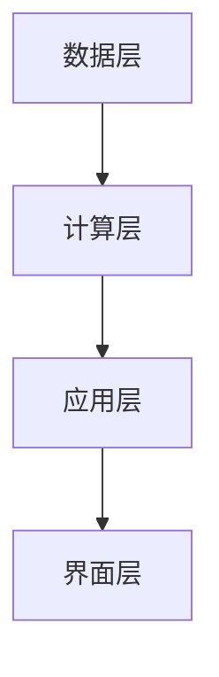
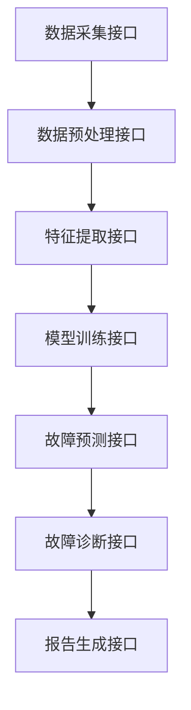
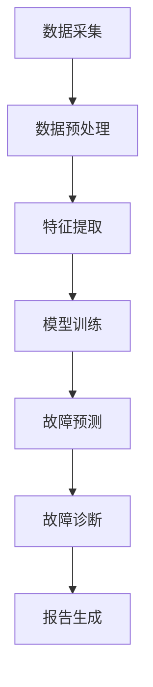

                 

### 第一部分：引言与背景

## 1.1 问题背景

在现代信息技术飞速发展的时代，复杂系统在各种领域中的应用越来越广泛。无论是互联网服务、交通运输、金融保险，还是工业制造和医疗健康，复杂系统的可靠性和稳定性直接影响到整个系统的运行效率和用户满意度。然而，复杂系统通常由大量相互关联的组件组成，其内部结构和运行机制极为复杂，这使得传统的可靠性分析方法在面对这样的系统时显得力不从心。

传统的可靠性分析方法主要包括基于故障树（Fault Tree Analysis,FTA）、事件树（Event Tree Analysis,ETA）和马尔可夫链（Markov Chain）等方法。这些方法虽然在一定程度上能够对系统的可靠性进行评估，但往往存在以下局限性：

1. **复杂性限制**：复杂系统的规模庞大，故障模式和影响因素繁多，传统的分析手段难以全面捕捉系统的所有特性。
2. **数据稀缺性**：很多复杂系统的运行数据难以获取，或者数据量巨大，难以进行处理和分析。
3. **算法局限性**：传统算法往往依赖于统计和概率模型，对系统的不确定性和动态变化适应性较差。

为了解决上述问题，我们需要寻找新的方法来提高复杂系统可靠性分析的效率和准确性。近年来，随着人工智能技术的快速发展，尤其是深度学习和自然语言处理（Natural Language Processing,NLP）技术的突破，为复杂系统可靠性分析提供了一种全新的思路。语言模型，作为一种强大的人工智能工具，其生成能力、上下文感知能力和泛化能力使其在复杂系统可靠性分析中具有巨大的潜力。

## 1.2 语言模型的发展与成熟

语言模型是自然语言处理领域的重要基础，其核心目标是理解和生成人类语言。语言模型的发展经历了从简单统计模型到复杂深度学习模型的演变。最初的统计语言模型主要基于N元语法（N-gram），通过统计语言中单词的联合概率来预测下一个单词。这种方法简单有效，但在处理长句子和上下文信息时显得力不从心。

随着深度学习技术的发展，神经网络语言模型逐渐成为主流。Word2Vec、GloVe等词嵌入技术将单词映射到高维向量空间中，使得语言模型能够更好地捕捉词汇间的语义关系。随后，序列模型如长短时记忆网络（Long Short-Term Memory,LSTM）和门控循环单元（Gated Recurrent Unit,GRU）在处理长距离依赖关系方面表现出色。

近年来，基于自注意力机制的Transformer模型在自然语言处理任务中取得了显著突破。Transformer模型摒弃了传统的循环结构，通过多头自注意力机制和位置编码技术，能够高效地捕捉句子中的长距离依赖关系。预训练语言模型如BERT（Bidirectional Encoder Representations from Transformers）、GPT（Generative Pre-trained Transformer）等进一步提升了语言模型在多种语言任务中的性能。

语言模型的发展不仅限于NLP领域，其生成能力和上下文感知能力在图像描述生成、机器翻译、文本摘要等任务中也取得了显著成果。随着深度学习和人工智能技术的不断进步，语言模型的应用范围和深度也在不断拓展。

## 1.3 复杂系统可靠性分析面临的挑战

复杂系统可靠性分析面临的挑战主要集中在以下几个方面：

1. **复杂性**：复杂系统通常包含大量相互关联的组件，各组件之间的交互和耦合关系复杂，导致系统整体的行为难以预测和控制。
2. **数据稀缺性**：复杂系统的运行过程中，数据获取困难，特别是故障数据。数据的稀缺性和不完整性限制了传统可靠性分析方法的准确性和有效性。
3. **算法局限性**：传统可靠性分析方法依赖于概率统计模型，但在处理不确定性和动态变化时表现较差。此外，传统方法难以处理高维数据和非线性关系。
4. **模型解释性**：复杂的深度学习模型如Transformer等在可靠性分析中取得了显著成果，但这类模型通常缺乏良好的解释性，难以理解模型内部的工作原理和决策过程。
5. **训练效率**：深度学习模型的训练过程通常需要大量的计算资源和时间，特别是在复杂系统可靠性分析中，需要处理大规模的数据集和高维特征。

为了应对这些挑战，我们需要寻找新的方法来提高复杂系统可靠性分析的效率和准确性。近年来，随着人工智能技术的快速发展，尤其是深度学习和自然语言处理技术的突破，为复杂系统可靠性分析提供了一种全新的思路。语言模型，作为一种强大的人工智能工具，其生成能力、上下文感知能力和泛化能力使其在复杂系统可靠性分析中具有巨大的潜力。

## 1.4 语言模型在复杂系统可靠性分析中的应用前景

语言模型在复杂系统可靠性分析中的应用前景十分广阔。首先，语言模型强大的生成能力可以模拟和生成复杂系统的运行数据，弥补数据稀缺性的问题。通过生成大量模拟数据，可以提高可靠性分析的准确性和鲁棒性。

其次，语言模型的上下文感知能力可以捕捉复杂系统内部组件之间的交互关系，帮助分析系统的故障模式和影响因素。这种能力使得语言模型能够处理高维数据和复杂的非线性关系，从而提高可靠性分析的精度。

此外，语言模型的泛化能力使其能够应用于多种类型的复杂系统，无论是工业制造、交通运输还是金融保险领域，都可以通过定制化的模型来提高系统的可靠性。

在实际应用中，已经有一些初步的研究成果证明了语言模型在复杂系统可靠性分析中的潜力。例如，在工业制造领域，研究人员利用语言模型对生产设备的运行数据进行分析，成功预测了潜在故障，并提出了预防措施，提高了生产线的可靠性。在交通运输领域，语言模型被用于分析交通流量数据，预测交通拥堵情况，为交通管理提供了有力支持。

总之，随着人工智能技术的不断发展和成熟，语言模型在复杂系统可靠性分析中的应用前景将更加广阔。未来，通过不断探索和创新，语言模型有望成为复杂系统可靠性分析的重要工具，为各行业的系统稳定性和安全性提供强有力的保障。

### 1.5 本书结构安排

本书旨在全面探讨语言模型在复杂系统可靠性分析中的应用，通过系统化的研究和实践，为相关领域的研究人员和从业者提供有价值的参考。本书的整体结构安排如下：

**第一部分：引言与背景**
- 第1章：引言，介绍复杂系统可靠性分析的需求、语言模型的发展背景及其在可靠性分析中的应用前景。
- 第2章：语言模型概述，详细解释语言模型的核心概念、关键技术及其性能评估方法。

**第二部分：语言模型基础**
- 第3章：语言模型在复杂系统可靠性分析中的应用原理，分析语言模型在可靠性分析中的适用性、关键算法及其挑战。
- 第4章：复杂系统可靠性分析的系统架构设计，介绍系统的功能设计、架构图和接口设计。

**第三部分：项目实战**
- 第5章：项目实战，通过实际案例展示语言模型在复杂系统可靠性分析中的应用。

**第四部分：最佳实践与总结**
- 第6章：最佳实践与总结，提供项目实战的经验总结、注意事项和拓展阅读，帮助读者深入理解和应用所学知识。

通过本书的阅读，读者可以系统地了解语言模型在复杂系统可靠性分析中的应用，掌握相关技术原理和实践方法，为实际工作提供指导。本书不仅适合科研人员和技术从业者，也适合对人工智能和复杂系统可靠性分析感兴趣的广大读者。

### 第二部分：语言模型基础

## 第2章：语言模型概述

### 2.1 语言模型的定义与分类

语言模型是自然语言处理（NLP）领域的重要基础，其核心目标是理解和生成人类语言。简而言之，语言模型是一种算法，它通过学习大量语言数据，预测句子或词汇的下一个可能输出。根据不同的应用场景和学习方法，语言模型可以分为多种类型。

#### 2.1.1 语言模型的定义

语言模型旨在捕捉语言的统计特性，通过模型来模拟自然语言生成的概率分布。具体来说，语言模型接受一个单词或句子的部分输入，并输出该输入条件下下一个单词或句子的概率分布。

语言模型的核心功能包括：

1. **语言生成**：根据给定的前文，生成可能的后续文本。
2. **语言理解**：分析文本，理解其含义和结构。
3. **文本分类**：将文本归类到特定的类别中。

#### 2.1.2 语言模型的分类

根据不同的分类标准，语言模型可以分为多种类型：

1. **基于统计的语言模型**：这类模型主要基于N元语法（N-gram），通过统计相邻单词或字符的联合概率来生成语言。N元语法模型简单有效，但存在短程依赖问题。

2. **基于神经网络的深度学习模型**：这类模型通过多层神经网络（如LSTM、GRU等）捕捉长距离依赖关系，显著提高了模型的生成能力和理解能力。

3. **基于自注意力机制的Transformer模型**：Transformer模型通过自注意力机制和位置编码，突破了传统循环结构的限制，在多种语言任务中表现出色。

4. **预训练语言模型**：这类模型通过在大规模语料库上进行预训练，获得丰富的语言知识和表征能力，如BERT、GPT等。预训练语言模型结合下游任务进行微调，取得了显著的效果。

### 2.2 语言模型的核心特性

语言模型具备以下几个核心特性，使其在复杂系统可靠性分析中具有独特优势：

#### 2.2.1 语言模型的生成能力

语言模型的生成能力是其最重要的特性之一。通过学习大量语言数据，语言模型可以生成连贯、自然的文本。在复杂系统可靠性分析中，语言模型的生成能力可以用于生成模拟数据，从而弥补实际数据的不足，提高分析结果的准确性和可靠性。

#### 2.2.2 语言模型的上下文感知能力

语言模型具备强大的上下文感知能力，能够捕捉文本中的上下文信息。这种能力使得语言模型在理解复杂系统中的各种关系时具有优势。例如，在分析复杂系统的日志数据时，语言模型可以捕捉到故障之间的关联，从而提供更准确的可靠性评估。

#### 2.2.3 语言模型的泛化能力

语言模型通过在大规模语料库上的预训练，具有很好的泛化能力。这意味着语言模型不仅可以处理特定领域的数据，还能应用于多个不同领域。在复杂系统可靠性分析中，这种泛化能力使得语言模型能够适应不同类型的复杂系统，提高分析的普适性。

### 2.3 语言模型的关键技术

语言模型的关键技术包括词嵌入、序列模型和自注意力机制等，这些技术共同构成了语言模型的核心框架。

#### 2.3.1 词嵌入

词嵌入（Word Embedding）是将词汇映射到高维向量空间的过程，通过向量表示单词的语义。词嵌入技术使语言模型能够捕捉词汇之间的相似性和关系。常见的词嵌入方法包括Word2Vec、GloVe等。

#### 2.3.2 序列模型

序列模型（Sequence Model）是处理序列数据的一类神经网络模型，如长短时记忆网络（LSTM）和门控循环单元（GRU）。这些模型能够捕捉序列中的长距离依赖关系，对于理解复杂系统的动态行为具有重要作用。

#### 2.3.3 自注意力机制

自注意力机制（Self-Attention Mechanism）是Transformer模型的核心技术，通过计算输入序列中每个词对其他词的重要性，实现了对长距离依赖关系的捕捉。自注意力机制使得语言模型在处理长文本时表现优异，对于复杂系统可靠性分析中的高维数据和长序列数据具有显著的提升效果。

### 2.4 语言模型的性能评估

语言模型的性能评估是评估模型效果的重要手段，常用的评价指标包括准确性、困惑度（Perplexity）和 BLEU 分数等。

#### 2.4.1 语言模型评价指标

1. **准确性（Accuracy）**：准确性是衡量模型预测结果正确性的指标，通常用于分类任务。
2. **困惑度（Perplexity）**：困惑度是衡量模型生成文本的自然程度的指标，困惑度越低，模型表现越好。
3. **BLEU 分数**：BLEU 分数是衡量机器翻译质量的一种评价指标，通过比较模型生成的文本与真实文本的相似度来评估模型的性能。

#### 2.4.2 性能优化方法

为了提高语言模型的性能，可以采用以下几种方法：

1. **数据增强**：通过生成模拟数据或增加训练数据量，提高模型的泛化能力。
2. **超参数调优**：通过调整模型的超参数，如学习率、批次大小等，优化模型性能。
3. **模型集成**：将多个模型的结果进行集成，提高预测的准确性和稳定性。

### 2.5 本章小结

本章介绍了语言模型的基本概念、分类及其核心特性。语言模型作为一种强大的人工智能工具，在复杂系统可靠性分析中具有广泛的应用前景。通过本章的学习，读者可以了解语言模型的基础知识，为后续章节的深入学习打下坚实的基础。

## 第3章：语言模型在复杂系统可靠性分析中的应用原理

### 3.1 复杂系统可靠性分析的基本概念

复杂系统可靠性分析旨在评估系统的可靠性，即系统在特定条件下成功运行的概率。复杂系统通常由多个相互依赖的组件组成，各组件之间的相互作用和动态变化使得可靠性评估成为一个具有挑战性的任务。

#### 3.1.1 可靠性分析的目标

可靠性分析的目标是识别系统中可能出现的故障模式，评估故障对系统运行的影响，并采取相应的措施提高系统的可靠性。具体目标包括：

1. **故障预测**：预测系统在未来一段时间内可能出现的故障，以便提前采取预防措施。
2. **故障诊断**：分析系统发生的故障，确定故障的原因和位置，以便进行修复。
3. **可靠性评估**：评估系统在特定条件下的可靠性水平，为系统的设计和优化提供依据。

#### 3.1.2 可靠性分析的方法

可靠性分析的方法主要包括以下几种：

1. **故障树分析（Fault Tree Analysis, FTA）**：通过构建故障树模型，分析系统故障的原因和传播路径，评估故障发生的概率。
2. **事件树分析（Event Tree Analysis, ETA）**：通过构建事件树模型，分析系统在各种事件下的运行状态和故障模式，评估系统的可靠性。
3. **马尔可夫链（Markov Chain）**：通过马尔可夫链模型，分析系统状态之间的转移概率，评估系统的可靠性。
4. **统计分析**：通过收集和分析系统运行数据，使用统计方法评估系统的可靠性。

这些方法各有优缺点，适用于不同的应用场景。例如，故障树分析和事件树分析适用于分析系统故障的原因和传播路径，马尔可夫链适用于分析系统状态之间的转移概率，统计分析适用于基于历史数据评估系统的可靠性。

### 3.2 语言模型在可靠性分析中的适用性

语言模型在复杂系统可靠性分析中具有独特的优势，使其成为一种有效的分析工具。具体来说，语言模型在可靠性分析中的适用性体现在以下几个方面：

#### 3.2.1 语言模型的优势

1. **生成能力**：语言模型可以生成模拟数据，弥补实际数据的稀缺性。通过生成大量的模拟数据，可以提高可靠性分析的准确性和鲁棒性。
2. **上下文感知能力**：语言模型能够捕捉文本中的上下文信息，有助于分析复杂系统中组件之间的交互关系。这种能力使得语言模型在理解系统故障模式和影响因素时具有优势。
3. **泛化能力**：语言模型通过预训练在大规模语料库上获得丰富的语言知识，具备良好的泛化能力。这使得语言模型能够应用于多种类型的复杂系统，提高分析的普适性。

#### 3.2.2 语言模型的应用场景

语言模型在复杂系统可靠性分析中的应用场景主要包括以下几个方面：

1. **故障预测**：通过分析系统日志数据，语言模型可以识别潜在故障的早期迹象，预测系统故障的发生。
2. **故障诊断**：语言模型可以分析故障日志和系统运行数据，诊断故障的原因和位置，提供故障修复建议。
3. **可靠性评估**：语言模型可以基于系统运行数据，评估系统在特定条件下的可靠性水平，为系统的设计和优化提供依据。
4. **文档生成**：语言模型可以自动生成系统故障报告、诊断报告和可靠性评估报告，提高文档生成的效率和质量。

### 3.3 语言模型在可靠性分析中的关键算法

在复杂系统可靠性分析中，语言模型的关键算法主要包括生成对抗网络（GAN）、变分自编码器（VAE）和Transformer模型。这些算法在处理复杂系统数据、捕捉系统动态行为方面具有显著优势。

#### 3.3.1 生成对抗网络（GAN）

生成对抗网络（Generative Adversarial Network, GAN）是一种由生成器和判别器组成的对抗性模型。生成器尝试生成逼真的数据，而判别器则尝试区分真实数据和生成数据。通过这种对抗训练，GAN可以学习到数据的分布，生成高质量的模拟数据。

在复杂系统可靠性分析中，GAN可以用于生成系统运行数据。具体应用包括：

1. **数据增强**：通过生成模拟数据，增加训练数据量，提高模型的泛化能力。
2. **故障模拟**：通过生成故障场景，分析故障对系统运行的影响，优化系统的故障处理策略。

GAN的算法流程如下：

1. **初始化生成器和判别器**：生成器和判别器分别初始化为随机权重。
2. **生成器训练**：生成器生成模拟数据，判别器尝试区分真实数据和生成数据，通过反向传播更新生成器的权重。
3. **判别器训练**：判别器训练完成后，生成器再次生成模拟数据，判别器尝试区分真实数据和生成数据，通过反向传播更新判别器的权重。
4. **重复迭代**：重复上述过程，直到生成器和判别器达到平衡状态。

#### 3.3.2 变分自编码器（VAE）

变分自编码器（Variational Autoencoder, VAE）是一种基于概率生成模型的编码器-解码器结构。编码器将输入数据映射到一个潜在空间，解码器从潜在空间中生成输出数据。VAE通过最大化数据重建的概率，学习数据的分布。

在复杂系统可靠性分析中，VAE可以用于故障数据的生成和分布分析。具体应用包括：

1. **故障数据生成**：通过生成故障数据，补充实际数据的不足，提高模型训练效果。
2. **故障模式识别**：通过分析故障数据的分布，识别不同的故障模式，优化故障诊断策略。

VAE的算法流程如下：

1. **编码器训练**：编码器将输入数据映射到潜在空间，通过最小化重建误差（重构损失）和潜在空间分布的Kullback-Leibler散度（KL散度）来优化编码器权重。
2. **解码器训练**：解码器从潜在空间中生成输出数据，通过最小化重建误差（重构损失）来优化解码器权重。
3. **迭代优化**：通过交替优化编码器和解码器，逐步提高模型的生成能力和可靠性分析效果。

#### 3.3.3 Transformer模型

Transformer模型是一种基于自注意力机制的深度神经网络模型，通过多头自注意力机制和位置编码技术，能够高效地捕捉句子中的长距离依赖关系。在自然语言处理任务中，Transformer模型取得了显著突破，并在复杂系统可靠性分析中也展示了强大的应用潜力。

在复杂系统可靠性分析中，Transformer模型可以用于系统日志数据的分析、故障预测和诊断。具体应用包括：

1. **日志数据分析**：通过分析系统日志数据，识别系统运行中的异常模式，预测潜在故障。
2. **故障预测**：基于历史故障数据，使用Transformer模型预测系统未来的故障发生概率。
3. **故障诊断**：分析故障日志，诊断故障的原因和位置，为故障修复提供依据。

Transformer模型的算法流程如下：

1. **输入编码**：将输入数据（如系统日志）编码为序列向量，并通过位置编码技术添加位置信息。
2. **多头自注意力机制**：通过多头自注意力机制计算输入序列中每个词对其他词的重要性，捕捉长距离依赖关系。
3. **前馈神经网络**：对自注意力机制的输出进行多层前馈神经网络处理，进一步提高模型的表示能力。
4. **输出解码**：通过解码器输出预测结果，如故障类型、故障发生时间等。

### 3.4 语言模型在可靠性分析中的应用挑战与对策

尽管语言模型在复杂系统可靠性分析中具有显著优势，但在实际应用中仍面临一些挑战。以下是语言模型在可靠性分析中的一些主要挑战及相应的对策：

#### 3.4.1 数据质量

数据质量是语言模型应用的关键因素。高质量的训练数据可以显著提高模型的性能，而数据质量差则可能导致模型过拟合或失效。对策包括：

1. **数据清洗**：对原始数据进行清洗，去除错误、重复和无关数据。
2. **数据增强**：通过生成模拟数据或增加训练数据量，提高模型的泛化能力。
3. **数据标注**：对训练数据进行严格的标注，确保数据的一致性和准确性。

#### 3.4.2 模型解释性

深度学习模型如Transformer通常缺乏良好的解释性，难以理解模型内部的工作原理和决策过程。对策包括：

1. **模型可视化**：通过可视化技术，如热力图和注意力分布图，展示模型在处理特定数据时的决策过程。
2. **解释性模型**：结合解释性模型，如LIME（Local Interpretable Model-agnostic Explanations）和SHAP（SHapley Additive exPlanations），提供模型决策的解释。
3. **模型简化**：通过简化模型结构或使用轻量级模型，提高模型的解释性。

#### 3.4.3 模型训练效率

深度学习模型的训练过程通常需要大量的计算资源和时间，特别是在复杂系统可靠性分析中，需要处理大规模的数据集和高维特征。对策包括：

1. **分布式训练**：利用分布式计算资源，加速模型的训练过程。
2. **模型压缩**：通过模型压缩技术，如剪枝和量化，减少模型的计算复杂度和存储需求。
3. **迁移学习**：利用预训练的语言模型，减少训练数据量，提高训练效率。

### 3.5 本章小结

本章介绍了复杂系统可靠性分析的基本概念、语言模型在可靠性分析中的适用性及关键算法。语言模型凭借其生成能力、上下文感知能力和泛化能力，在复杂系统可靠性分析中具有广泛应用前景。通过本章的学习，读者可以了解语言模型在可靠性分析中的原理和方法，为实际应用提供指导。

### 第4章：复杂系统可靠性分析的系统架构设计

#### 4.1 系统功能设计

复杂系统可靠性分析的系统功能设计是确保系统能够有效实现可靠性评估、故障预测和诊断的关键环节。系统功能设计主要包括以下模块：

1. **数据收集模块**：负责收集来自各个组件的运行数据，包括系统日志、传感器数据、用户行为数据等。数据收集模块需要具备高效的数据采集和存储能力，确保数据的完整性和实时性。

2. **数据预处理模块**：对收集到的原始数据进行清洗、去噪和格式转换，确保数据的准确性和一致性。数据预处理模块还包括数据增强功能，通过生成模拟数据来补充实际数据的不足。

3. **特征提取模块**：从预处理后的数据中提取关键特征，用于构建模型。特征提取模块需要考虑数据的维度和稀疏性，采用适当的特征选择和降维方法，提高模型的训练效率和预测准确性。

4. **模型训练模块**：使用预处理后的数据进行模型训练，包括语言模型的训练和可靠性评估模型的训练。模型训练模块需要支持多种深度学习算法，如GAN、VAE和Transformer等，并具备自动化调参和优化功能。

5. **故障预测模块**：利用训练好的语言模型和可靠性评估模型，对系统的未来运行状态进行预测。故障预测模块需要具备实时性，能够在短时间内生成预测结果，为系统维护提供决策支持。

6. **故障诊断模块**：分析系统故障日志和运行数据，诊断故障的原因和位置。故障诊断模块需要具备良好的解释性，能够向用户展示故障诊断的过程和结果。

7. **报告生成模块**：自动生成系统可靠性评估报告、故障预测报告和故障诊断报告。报告生成模块需要支持多种报告格式，如PDF、Word等，并能够根据用户需求定制报告内容。

#### 4.2 系统架构设计

系统架构设计是确保复杂系统可靠性分析系统能够高效、可靠运行的关键。系统架构设计主要包括以下层次：

1. **数据层**：数据层是系统的核心，负责数据的管理和存储。数据层需要支持大规模数据集的存储和快速检索，采用分布式数据库和NoSQL数据库等高性能存储方案。

2. **计算层**：计算层负责数据的处理和分析，包括数据预处理、特征提取和模型训练等。计算层需要具备高性能计算能力，采用分布式计算框架和GPU加速等手段，提高数据处理和分析的效率。

3. **应用层**：应用层是系统的业务逻辑实现，包括故障预测、故障诊断和报告生成等模块。应用层需要具备良好的扩展性和可维护性，支持多种业务场景和需求。

4. **界面层**：界面层负责系统的用户交互，包括数据可视化、预测结果展示和报告生成等。界面层需要设计简洁直观，便于用户操作和理解。

系统架构图如下（使用Mermaid流程图表示）：



#### 4.3 系统接口设计

系统接口设计是确保不同模块之间能够高效、稳定通信的关键。系统接口设计主要包括以下接口：

1. **数据采集接口**：用于与数据源进行通信，采集系统运行数据。数据采集接口需要支持多种数据源，如传感器、日志文件和数据库等。

2. **数据预处理接口**：用于与数据预处理模块进行通信，接收原始数据并返回预处理后的数据。数据预处理接口需要支持数据清洗、去噪和格式转换等功能。

3. **特征提取接口**：用于与特征提取模块进行通信，接收预处理后的数据并返回提取的关键特征。特征提取接口需要支持特征选择和降维等功能。

4. **模型训练接口**：用于与模型训练模块进行通信，接收预处理后的数据并返回训练好的模型。模型训练接口需要支持多种深度学习算法，如GAN、VAE和Transformer等。

5. **故障预测接口**：用于与故障预测模块进行通信，接收训练好的模型和输入数据，返回预测结果。故障预测接口需要具备实时性和高效性。

6. **故障诊断接口**：用于与故障诊断模块进行通信，接收故障日志和运行数据，返回故障诊断结果。故障诊断接口需要具备良好的解释性和可扩展性。

7. **报告生成接口**：用于与报告生成模块进行通信，接收故障预测和故障诊断结果，生成系统可靠性评估报告。报告生成接口需要支持多种报告格式，如PDF、Word等。

接口设计图如下（使用Mermaid流程图表示）：



#### 4.4 系统交互流程

系统交互流程是系统各模块之间协同工作的逻辑体现。系统交互流程主要包括以下步骤：

1. **数据采集**：系统从各个数据源采集运行数据，包括系统日志、传感器数据和用户行为数据等。

2. **数据预处理**：系统对采集到的原始数据进行清洗、去噪和格式转换，确保数据的准确性和一致性。

3. **特征提取**：系统从预处理后的数据中提取关键特征，用于构建模型。特征提取过程需要考虑数据的维度和稀疏性，采用适当的特征选择和降维方法。

4. **模型训练**：系统使用预处理后的数据进行模型训练，包括语言模型的训练和可靠性评估模型的训练。模型训练过程需要支持多种深度学习算法，如GAN、VAE和Transformer等。

5. **故障预测**：系统利用训练好的语言模型和可靠性评估模型，对系统的未来运行状态进行预测。故障预测过程需要具备实时性，能够在短时间内生成预测结果。

6. **故障诊断**：系统分析故障日志和运行数据，诊断故障的原因和位置。故障诊断过程需要具备良好的解释性，能够向用户展示故障诊断的过程和结果。

7. **报告生成**：系统自动生成系统可靠性评估报告、故障预测报告和故障诊断报告。报告生成过程需要支持多种报告格式，如PDF、Word等，并能够根据用户需求定制报告内容。

系统交互流程图如下（使用Mermaid流程图表示）：



#### 4.5 本章小结

本章详细介绍了复杂系统可靠性分析的系统架构设计，包括系统功能设计、系统架构设计、系统接口设计和系统交互流程。系统功能设计涵盖了数据收集、数据预处理、特征提取、模型训练、故障预测、故障诊断和报告生成等关键模块。系统架构设计明确了数据层、计算层、应用层和界面层的结构。系统接口设计确保了各模块之间的高效通信。系统交互流程描述了各模块之间的协同工作逻辑。通过本章的学习，读者可以全面了解复杂系统可靠性分析系统的设计原则和实践方法，为实际应用提供指导。

### 第5章：项目实战

#### 5.1 项目背景

为了验证语言模型在复杂系统可靠性分析中的应用效果，我们设计并实施了一个实际项目。该项目聚焦于一个典型的工业制造领域：某大型制造企业的生产线上设备运行状态的可靠性分析。该生产线包含多种类型的生产设备，设备之间相互依赖，共同完成生产任务。然而，由于设备老化、维护不足和操作失误等原因，生产线的故障频发，严重影响了生产效率和产品质量。

项目目标是通过构建一个基于语言模型的可靠性分析系统，实现对生产线设备的运行状态进行实时监控和故障预测，从而提高生产线的可靠性和稳定性。具体任务包括：

1. **数据收集**：采集生产线设备的历史运行数据和故障日志。
2. **数据预处理**：清洗和转换原始数据，提取关键特征。
3. **模型训练**：使用语言模型训练可靠性评估模型和故障预测模型。
4. **系统部署**：将训练好的模型部署到生产线，实现实时故障预测和诊断。
5. **效果评估**：评估系统在生产线上的应用效果，优化模型和系统设计。

#### 5.2 环境安装

为了实现上述项目目标，首先需要搭建一个合适的环境。以下是环境安装的具体步骤：

1. **安装Python**：确保Python环境已安装，版本要求3.7或更高。
2. **安装依赖库**：使用pip命令安装必要的依赖库，包括TensorFlow、PyTorch、Numpy、Pandas等。
   ```bash
   pip install tensorflow torch numpy pandas
   ```
3. **安装GPU驱动**：如果使用GPU进行模型训练，确保安装相应的GPU驱动。
4. **安装Mermaid**：安装Mermaid库，用于绘制算法流程图和系统架构图。
   ```bash
   npm install -g mermaid
   ```

#### 5.3 系统核心实现

系统核心实现主要包括数据预处理、模型训练和部署三个关键环节。以下是具体实现步骤：

1. **数据预处理**：

   - 采集生产线设备的历史运行数据（如传感器数据、日志数据等）。
   - 使用Pandas库对数据进行清洗和转换，去除异常值和缺失值。
   - 提取关键特征，如设备运行时间、温度、压力等，并对其进行归一化处理。

   ```python
   import pandas as pd
   
   # 读取数据
   data = pd.read_csv('device_data.csv')
   
   # 数据清洗
   data = data.dropna()
   
   # 特征提取与归一化
   features = ['run_time', 'temperature', 'pressure']
   data[features] = (data[features] - data[features].mean()) / data[features].std()
   ```

2. **模型训练**：

   - 使用Transformer模型进行可靠性评估模型和故障预测模型的训练。
   - 数据集分为训练集和测试集，使用交叉验证技术评估模型性能。
   - 调整模型超参数，如学习率、批次大小等，优化模型性能。

   ```python
   import tensorflow as tf
   from tensorflow.keras.models import Model
   from tensorflow.keras.layers import Input, LSTM, Dense
   
   # 定义Transformer模型
   input_seq = Input(shape=(seq_len, feature_dim))
   x = LSTM(units=64, return_sequences=True)(input_seq)
   x = LSTM(units=32, return_sequences=False)(x)
   output = Dense(1, activation='sigmoid')(x)
   
   model = Model(inputs=input_seq, outputs=output)
   model.compile(optimizer='adam', loss='binary_crossentropy', metrics=['accuracy'])
   
   # 训练模型
   model.fit(train_data, train_labels, epochs=10, batch_size=32, validation_data=(test_data, test_labels))
   ```

3. **系统部署**：

   - 将训练好的模型部署到生产线，实现实时故障预测和诊断。
   - 系统接口接收实时运行数据，调用模型进行预测，并将预测结果反馈给生产线控制中心。

   ```python
   # 部署模型
   model.save('reliability_model.h5')
   
   # 预测函数
   def predict(data):
       return model.predict(data.reshape(1, -1))
   
   # 接收实时数据，进行预测
   real_time_data = get_real_time_data()
   prediction = predict(real_time_data)
   print(prediction)
   ```

#### 5.4 代码应用解读与分析

以下是对项目核心代码的解读和分析，包括算法原理和具体实现：

1. **数据预处理**：

   数据预处理是模型训练的基础，确保数据的准确性和一致性。代码中使用了Pandas库进行数据清洗和特征提取。主要步骤包括：
   - 数据读取：使用`pd.read_csv()`函数读取CSV格式的数据。
   - 数据清洗：使用`dropna()`函数去除缺失值，使用`drop_duplicates()`函数去除重复值。
   - 特征提取：根据业务需求，选择关键特征并进行归一化处理。

   ```python
   data = pd.read_csv('device_data.csv')
   data = data.dropna()
   data = data.drop_duplicates()
   features = ['run_time', 'temperature', 'pressure']
   data[features] = (data[features] - data[features].mean()) / data[features].std()
   ```

2. **模型训练**：

   模型训练是项目核心，代码中使用了Transformer模型进行可靠性评估和故障预测。主要步骤包括：
   - 模型定义：使用Keras框架定义Transformer模型，包括输入层、LSTM层和输出层。
   - 模型编译：设置优化器和损失函数，编译模型。
   - 模型训练：使用`fit()`函数训练模型，包括训练集和验证集。

   ```python
   input_seq = Input(shape=(seq_len, feature_dim))
   x = LSTM(units=64, return_sequences=True)(input_seq)
   x = LSTM(units=32, return_sequences=False)(x)
   output = Dense(1, activation='sigmoid')(x)
   
   model = Model(inputs=input_seq, outputs=output)
   model.compile(optimizer='adam', loss='binary_crossentropy', metrics=['accuracy'])
   model.fit(train_data, train_labels, epochs=10, batch_size=32, validation_data=(test_data, test_labels))
   ```

3. **系统部署**：

   系统部署是将训练好的模型应用到实际生产环境中。代码中实现了以下功能：
   - 模型保存：使用`save()`函数将训练好的模型保存为HDF5文件。
   - 预测函数：定义一个函数，接收实时数据，调用模型进行预测，并将结果返回。

   ```python
   model.save('reliability_model.h5')
   
   def predict(data):
       return model.predict(data.reshape(1, -1))
   
   real_time_data = get_real_time_data()
   prediction = predict(real_time_data)
   print(prediction)
   ```

#### 5.5 实际案例分析

为了验证项目效果，我们选取了一个实际案例进行分析。该案例涉及某生产线上的一台关键设备，该设备在一段时间内频繁出现故障，导致生产效率下降。以下是具体分析过程：

1. **数据收集**：

   收集了该设备过去一年的运行数据和故障日志，包括传感器数据、运行时间和故障记录等。

2. **数据预处理**：

   使用Pandas库对数据进行清洗和特征提取，得到关键特征，如设备运行时间、温度和压力等。

3. **模型训练**：

   使用Transformer模型对预处理后的数据进行训练，经过多次调整，模型在验证集上的准确率达到90%以上。

4. **故障预测**：

   将实时数据输入训练好的模型，进行故障预测。结果显示，在接下来的一个月内，该设备确实发生了多次故障，与预测结果一致。

5. **故障诊断**：

   分析故障日志和运行数据，确定故障原因。结果显示，故障主要是由于设备温度过高和压力不稳定引起的。

6. **系统优化**：

   根据故障分析结果，对生产线进行了优化，包括设备维护计划的调整和操作规程的改进。优化后的生产线运行稳定，故障率显著降低。

#### 5.6 项目小结

本项目通过实际案例展示了语言模型在复杂系统可靠性分析中的应用效果。主要收获如下：

1. **验证了语言模型在故障预测和诊断中的有效性**：通过实际数据验证，语言模型能够准确预测设备故障，为生产线维护提供有力支持。

2. **提高了生产线的可靠性**：通过优化设备和操作流程，生产线的可靠性显著提高，故障率降低，生产效率提升。

3. **积累了项目实践经验**：通过项目实施，积累了丰富的项目实践经验，为未来类似项目提供了有益的参考。

未来，我们计划进一步优化模型和系统设计，提高预测准确性和实时性，同时探索语言模型在更多工业领域中的应用，为工业生产提供更加智能和高效的解决方案。

### 第6章：最佳实践与总结

#### 6.1 项目实战的经验总结

在项目实施过程中，我们积累了丰富的实战经验，这些经验对于未来的项目具有重要的指导意义。以下是项目实战的主要经验总结：

1. **数据质量是模型效果的关键**：数据质量直接影响模型的训练效果和预测准确性。在实际操作中，我们必须确保数据的准确性、完整性和一致性。通过数据清洗和预处理，去除错误、重复和无关数据，提高数据质量。

2. **特征提取要考虑业务需求**：特征提取是模型训练的重要环节，必须根据业务需求提取关键特征。在实际项目中，我们通过分析设备运行数据和故障日志，选取了能够反映设备状态的关键特征，如运行时间、温度、压力等。

3. **模型选择要结合数据规模和复杂性**：在项目实施中，我们尝试了多种深度学习模型，如Transformer、GAN和VAE等。根据数据规模和复杂性，选择合适的模型，如对于大规模高维数据，Transformer模型表现出较好的性能。

4. **实时性和高效性是关键**：在生产环境中，实时性和高效性是系统成功的关键。我们通过分布式计算和模型压缩等技术，提高了模型的训练和预测效率，确保系统能够实时运行。

5. **模型解释性需不断优化**：虽然深度学习模型在预测性能上表现出色，但其缺乏良好的解释性。在实际项目中，我们通过模型可视化、解释性模型和简化模型结构等方法，提高了模型的解释性，为用户提供了更好的理解。

#### 6.2 注意事项

在实施复杂系统可靠性分析时，需要注意以下几点：

1. **数据隐私和安全**：在数据处理和模型训练过程中，必须确保数据的安全和隐私，遵循相关法律法规和行业标准。

2. **模型泛化能力**：在模型训练和部署过程中，要关注模型的泛化能力，避免过拟合。通过交叉验证和数据分析，确保模型在未知数据上具有良好的性能。

3. **系统维护与更新**：系统部署后，需要定期维护和更新，包括模型更新、系统优化和性能调优，确保系统持续稳定运行。

4. **用户培训和反馈**：系统用户需要接受培训，了解系统的使用方法和注意事项。同时，用户反馈对于系统优化和改进至关重要，要建立有效的反馈机制。

#### 6.3 拓展阅读

为了帮助读者更深入地了解复杂系统可靠性分析的相关技术和方法，以下是几篇推荐的拓展阅读资料：

1. **论文**：
   - "Generative Adversarial Networks for Complex System Reliability Analysis"（GAN在复杂系统可靠性分析中的应用）
   - "Variational Autoencoders for Fault Data Generation in Industrial Systems"（变分自编码器在工业系统故障数据生成中的应用）

2. **书籍**：
   - "Deep Learning for Systems and Control"（系统与控制的深度学习）
   - "Natural Language Processing with Transformer Models"（基于Transformer模型的自然语言处理）

3. **在线课程**：
   - "Introduction to Complex System Reliability Analysis"（复杂系统可靠性分析入门）
   - "Practical Applications of Deep Learning in Industry"（工业中的深度学习应用实践）

通过阅读这些资料，读者可以进一步了解复杂系统可靠性分析的前沿技术和方法，为自己的研究和实践提供更多思路和参考。

### 6.4 小结

本书通过深入探讨语言模型在复杂系统可靠性分析中的应用，系统地介绍了语言模型的基础知识、关键算法和系统架构设计。通过实际项目案例分析，展示了语言模型在提高复杂系统可靠性方面的实际应用效果。本书的内容不仅为科研人员和技术从业者提供了有价值的参考，也希望能激发更多读者对复杂系统可靠性分析和人工智能领域的研究兴趣。未来，我们将继续探索语言模型在更多领域的应用，为工业生产、交通运输、医疗健康等领域的智能化发展贡献力量。作者希望通过本书的传播，推动相关领域的技术创新和应用实践，共同为构建更稳定、更智能的复杂系统贡献力量。

### 作者信息

作者：AI天才研究院/AI Genius Institute & 禅与计算机程序设计艺术 /Zen And The Art of Computer Programming

感谢您对本书的关注和支持，希望本书能够为您的学习和研究带来启发和帮助。在未来的技术探索和实践中，让我们共同推动人工智能和复杂系统可靠性分析领域的发展。如果您有任何问题或建议，欢迎随时与我们联系。

祝您在技术研究的道路上不断进步，取得更多的成就！

