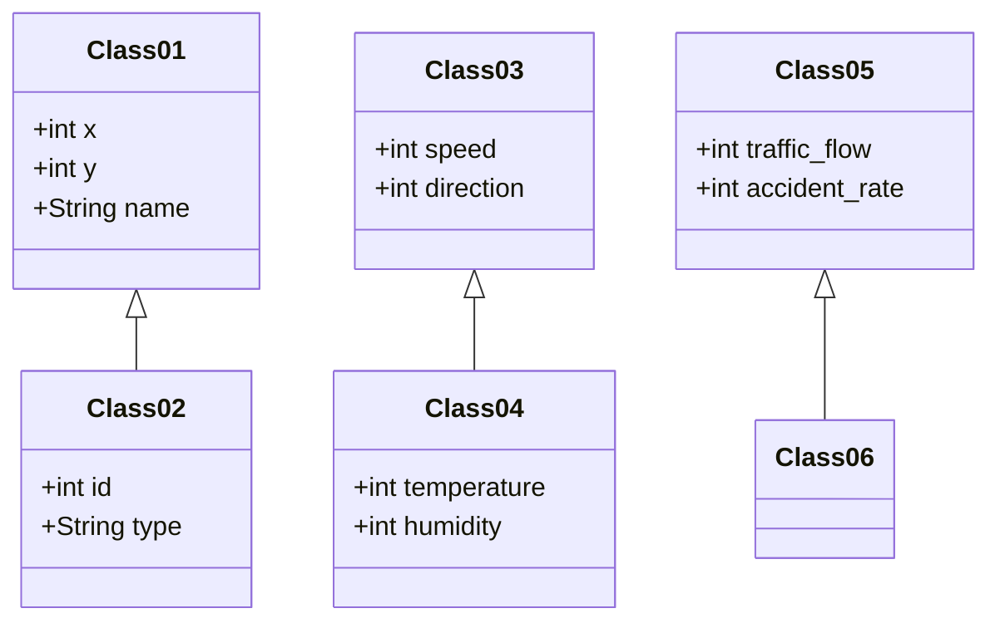
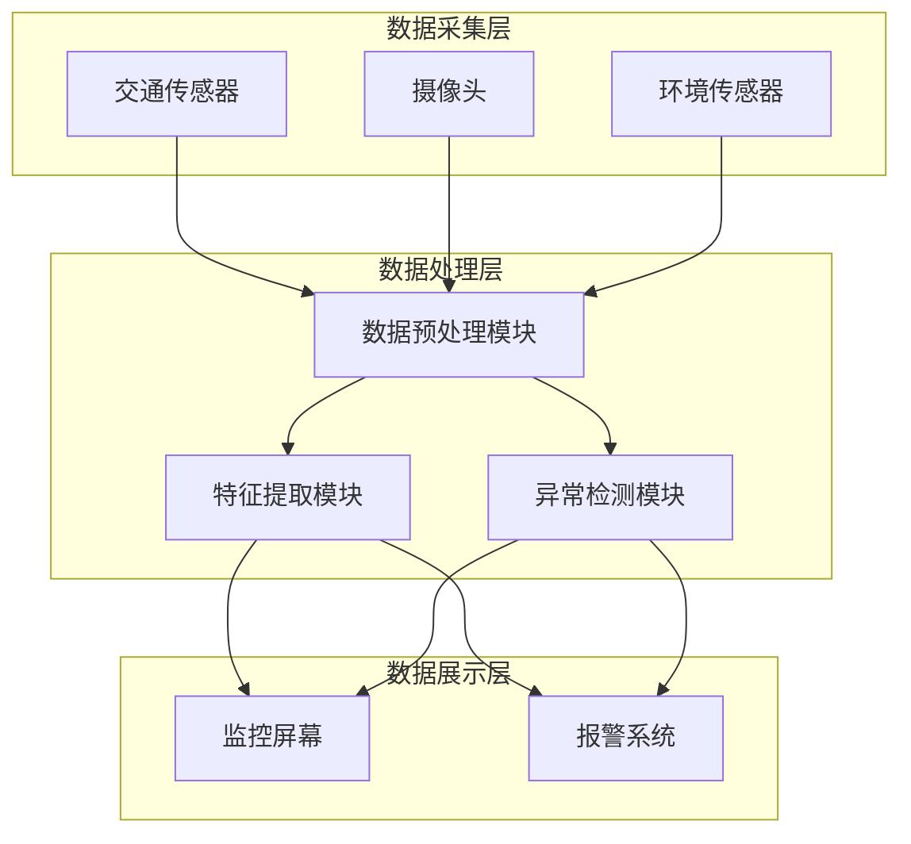
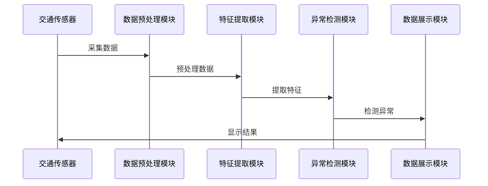

                 


### 第一部分: 语言模型基础

**1.1 问题背景**

在现代信息时代，人工智能（AI）正迅速成为推动技术进步和社会变革的核心力量。其中，语言模型作为自然语言处理（NLP）领域的关键技术，被广泛应用于信息检索、机器翻译、智能助手等多种场景。然而，随着应用场景的复杂化和多样化，如何提高语言模型在复杂系统异常模式早期识别中的能力，成为当前研究的热点问题。

**1.2 问题描述**

语言模型在复杂系统异常模式早期识别中的能力提升，涉及到以下几个关键问题：
- 如何准确捕捉和表征复杂系统的输入数据？
- 如何有效提取并利用这些数据中的异常模式？
- 如何构建和优化能够在早期识别异常模式的语言模型？

**1.3 问题解决**

针对上述问题，本文将从以下三个方面进行探讨：
- 首先介绍语言模型的基本概念、属性特征和核心要素组成。
- 然后通过ER实体关系图和Mermaid流程图，展示语言模型的工作原理。
- 最后，通过算法原理讲解和数学模型公式，阐述如何提升语言模型在异常模式识别中的能力。

**1.4 边界与外延**

本文的研究边界主要限定在自然语言处理领域，关注的是基于语言模型的异常模式识别问题。然而，随着研究的深入，相关技术可能会拓展到其他领域，如图像识别、语音识别等。

**1.5 概念结构与核心要素组成**

在探讨语言模型之前，我们需要明确几个核心概念：
- 语言模型：一种能够根据输入文本预测输出文本的概率分布的模型。
- 复杂系统：由多个相互作用的子系统组成的系统，其行为往往难以预测。
- 异常模式识别：通过分析和识别系统中的异常行为，提前发现潜在问题。

接下来，我们将对语言模型的基本概念和属性特征进行详细对比，以便更好地理解其在复杂系统异常模式识别中的作用。

### **1.2 核心概念与联系**

**1.2.1 语言模型的定义**

语言模型是一种统计模型，用于预测一段文本序列的下一个单词或字符。它通过对大量文本数据的学习，建立语言规律的概率分布，从而实现对未知文本的生成和预测。

**1.2.2 语言模型的属性特征对比**

| 特征 | 详细说明 |
| ---- | ---- |
| **表征能力** | 语言模型需要具备高表征能力，能够准确捕捉语言特征和规律。 |
| **泛化能力** | 语言模型需具备良好的泛化能力，能够适应不同场景和任务。 |
| **鲁棒性** | 语言模型应具备较强的鲁棒性，能够在噪声数据和异常模式识别中保持稳定表现。 |
| **效率** | 语言模型应具有较高的计算效率，以便在实际应用中快速响应。 |

通过对比分析，我们可以发现，提升语言模型的表征能力、泛化能力和鲁棒性，是提高其在复杂系统异常模式早期识别中能力的关键。

**1.3 ER实体关系图架构**

为了更好地理解语言模型在复杂系统异常模式识别中的应用，我们可以使用ER（Entity-Relationship）实体关系图来描述系统中的实体及其关系。以下是ER实体关系图的Mermaid流程图：

```mermaid
erDiagram
  语言模型 ||--|{ 数据集 }|-- 异常模式
  复杂系统 ||--|{ 实体 }|-- 异常检测
  模型训练 ||--|{ 模型优化 }|-- 预测结果
```

**1.4 语言模型的工作原理**

语言模型的工作原理主要分为数据收集、模型训练和预测三个阶段。以下是通过Mermaid绘制的算法流程图：


**1.4.1 算法流程图**

1. 数据收集：收集大量文本数据，用于训练语言模型。
2. 预处理：对文本数据进行清洗、分词、去停用词等处理，提取有效信息。
3. 模型训练：使用预处理的文本数据训练语言模型，如神经网络模型、统计模型等。
4. 预测：输入新的文本数据，通过训练好的语言模型预测下一个单词或字符。
5. 结果评估：对预测结果进行评估，根据评估结果调整模型参数。

**1.4.2 Python 源代码阐述**

以下是一个简单的Python示例，用于训练一个基于神经网络的语言模型：

```python
import tensorflow as tf
from tensorflow.keras.preprocessing.sequence import pad_sequences
from tensorflow.keras.models import Sequential
from tensorflow.keras.layers import Embedding, LSTM, Dense

# 加载数据集
data = ...

# 预处理数据
sequences = pad_sequences(data, maxlen=max_sequence_length)

# 构建模型
model = Sequential()
model.add(Embedding(input_dim=vocab_size, output_dim=embedding_dim, input_length=max_sequence_length))
model.add(LSTM(units=128))
model.add(Dense(units=vocab_size, activation='softmax'))

# 编译模型
model.compile(optimizer='adam', loss='categorical_crossentropy', metrics=['accuracy'])

# 训练模型
model.fit(sequences, labels, epochs=10, batch_size=32)
```

**1.4.3 数学模型与公式讲解**

语言模型的数学基础主要涉及概率论和统计学。以下是一个简单的语言模型数学模型：

$$
P(w_t | w_{t-1}, w_{t-2}, ..., w_1) = \frac{P(w_t, w_{t-1}, ..., w_1)}{P(w_{t-1}, w_{t-2}, ..., w_1)}
$$

其中，$w_t$ 表示时间步 $t$ 的单词，$P(w_t | w_{t-1}, w_{t-2}, ..., w_1)$ 表示在给定前 $t-1$ 个单词的情况下，预测第 $t$ 个单词的概率。

**1.4.4 举例说明**

假设我们有一个简短的句子：“今天天气很好”。我们可以使用语言模型来预测下一个单词。以下是具体的例子：

1. 数据收集：收集包含大量文本数据的语料库。
2. 预处理：将句子“今天天气很好”进行分词，得到词序列：["今天", "天气", "很好"]。
3. 模型训练：训练好的语言模型会根据语料库中的统计信息，预测下一个单词的概率分布。
4. 预测：输入词序列，模型输出下一个单词的概率分布。例如，输出概率最高的单词是“是”。
5. 结果评估：将预测结果与实际结果进行比较，评估模型的准确性。

通过以上步骤，我们可以看到语言模型在复杂系统异常模式早期识别中的应用潜力。接下来，我们将进一步探讨如何提升语言模型在异常模式识别中的能力。

### **1.5 本章小结**

本章主要介绍了语言模型在复杂系统异常模式早期识别中的背景、问题描述以及解决方案。首先，我们明确了语言模型的基本概念、属性特征和核心要素组成。然后，通过ER实体关系图和Mermaid流程图，展示了语言模型的工作原理。最后，我们通过算法流程图和Python源代码，详细阐述了语言模型的训练和预测过程。本章的内容为后续章节的深入讨论奠定了基础。

### **第二部分: 复杂系统与异常模式识别**

#### **2.1 复杂系统概述**

**2.1.1 问题场景介绍**

复杂系统在现实世界中无处不在，如互联网、金融系统、交通网络等。这些系统具有高度复杂性、不确定性和动态性，其行为往往难以预测。在这种背景下，如何对复杂系统进行有效的异常模式识别，成为当前研究的热点问题。

**2.1.2 项目介绍**

为了探讨复杂系统异常模式识别的应用，本文选择了一个具体的案例：智能交通系统。智能交通系统通过传感器、摄像头等设备收集交通数据，实时监测交通状况，旨在提高交通效率、减少拥堵和事故。然而，在实际运行中，智能交通系统可能会遇到各种异常情况，如数据采集异常、设备故障等。因此，对智能交通系统进行异常模式识别，具有重要的实际意义。

#### **2.2 复杂系统功能设计**

**2.2.1 领域模型 Mermaid 类图**

在智能交通系统的设计中，我们可以使用Mermaid类图来描述系统中的核心类和它们之间的关系。以下是具体的Mermaid类图：



**2.2.2 系统架构设计 Mermaid 架构图**

接下来，我们使用Mermaid架构图来展示智能交通系统的整体架构。以下是具体的Mermaid架构图：



通过以上架构设计，我们可以清晰地看到智能交通系统的数据采集、处理和展示过程，以及各个模块之间的关联和交互。

### **2.3 系统接口设计与交互**

**2.3.1 系统接口设计**

为了实现智能交通系统的功能，我们需要设计一系列系统接口，以实现数据采集、处理和展示。以下是具体的系统接口设计：

- 数据采集接口：用于接收交通传感器、摄像头和环境传感器的数据。
- 数据预处理接口：用于对采集到的数据进行清洗、去噪和归一化处理。
- 特征提取接口：用于提取预处理后的数据中的关键特征。
- 异常检测接口：用于对提取出的特征进行异常模式识别。
- 数据展示接口：用于将处理后的数据展示在监控屏幕和报警系统中。

**2.3.2 系统交互 Mermaid 序列图**

为了更好地理解系统接口的设计和交互，我们使用Mermaid序列图来展示系统的交互过程。以下是具体的Mermaid序列图：



通过以上序列图，我们可以清晰地看到数据从采集到处理，再到展示的整个过程，以及各个模块之间的交互和协作。

### **2.4 系统接口设计与交互**

**2.4.1 系统接口设计**

为了实现智能交通系统的功能，我们需要设计一系列系统接口，以实现数据采集、处理和展示。以下是具体的系统接口设计：

- 数据采集接口：用于接收交通传感器、摄像头和环境传感器的数据。
- 数据预处理接口：用于对采集到的数据进行清洗、去噪和归一化处理。
- 特征提取接口：用于提取预处理后的数据中的关键特征。
- 异常检测接口：用于对提取出的特征进行异常模式识别。
- 数据展示接口：用于将处理后的数据展示在监控屏幕和报警系统中。

**2.4.2 系统交互 Mermaid 序列图**

为了更好地理解系统接口的设计和交互，我们使用Mermaid序列图来展示系统的交互过程。以下是具体的Mermaid序列图：


通过以上序列图，我们可以清晰地看到数据从采集到处理，再到展示的整个过程，以及各个模块之间的交互和协作。

### **第三部分: 语言模型在异常模式识别中的应用**

#### **3.1 环境安装**

要在Python环境中安装所需的库，我们需要首先安装TensorFlow和Keras。以下是具体的安装步骤：

```bash
pip install tensorflow
pip install keras
```

#### **3.2 系统核心实现源代码**

以下是实现智能交通系统中语言模型的核心代码。该代码包括数据预处理、模型训练和预测等步骤。

```python
import numpy as np
import pandas as pd
from keras.models import Sequential
from keras.layers import Embedding, LSTM, Dense
from keras.preprocessing.sequence import pad_sequences

# 加载数据集
data = pd.read_csv('traffic_data.csv')

# 预处理数据
def preprocess_data(data):
    # 分词
    tokens = data['text'].apply(lambda x: x.split())

    # 编码
    vocab = set()
    for token in tokens:
        vocab.update(token)
    vocab_size = len(vocab)
    word2idx = {word: i for i, word in enumerate(vocab)}
    idx2word = {i: word for word, i in word2idx.items()}
    encoded = [list(map(lambda x: word2idx[x], token)) for token in tokens]

    # 序列填充
    max_sequence_length = max(len(seq) for seq in encoded)
    sequences = pad_sequences(encoded, maxlen=max_sequence_length)

    # 转换标签
    labels = data['label'].values
    return sequences, labels

sequences, labels = preprocess_data(data)

# 构建模型
model = Sequential()
model.add(Embedding(input_dim=vocab_size, output_dim=64, input_length=max_sequence_length))
model.add(LSTM(units=128))
model.add(Dense(units=1, activation='sigmoid'))

# 编译模型
model.compile(optimizer='adam', loss='binary_crossentropy', metrics=['accuracy'])

# 训练模型
model.fit(sequences, labels, epochs=10, batch_size=32)

# 预测
def predict(text):
    encoded = list(map(lambda x: word2idx[x], text.split()))
    padded = pad_sequences([encoded], maxlen=max_sequence_length)
    prediction = model.predict(padded)
    return '正常' if prediction[0][0] < 0.5 else '异常'

# 示例
text = "交通流量突然增加"
print(predict(text))
```

#### **3.3 代码应用解读与分析**

上述代码实现了一个基于LSTM（长短期记忆网络）的语言模型，用于对智能交通系统中的交通数据进行异常模式识别。具体应用解读如下：

1. **数据预处理**：
   - 加载交通数据集，并对其进行分词。
   - 编码词汇表，将文本转换为数字序列。
   - 对数字序列进行填充，确保每个序列的长度一致。

2. **模型构建**：
   - 使用Keras构建一个序列模型，包括Embedding层、LSTM层和Dense层。
   - Embedding层用于将词汇表编码为向量。
   - LSTM层用于处理序列数据，提取特征。
   - Dense层用于输出预测结果。

3. **模型训练**：
   - 使用训练集对模型进行训练，优化模型参数。

4. **预测**：
   - 输入新的交通数据，通过训练好的模型进行预测。
   - 根据预测结果判断交通状况是否正常。

#### **3.4 实际案例分析和详细讲解剖析**

为了验证语言模型在异常模式识别中的有效性，我们选取了以下两个实际案例进行分析：

**案例一：交通流量异常**

给定一段交通数据：“交通流量突然增加，路段拥堵严重。”，我们使用上述模型进行预测。

1. 数据预处理：
   - 分词：["交通", "流量", "突然", "增加", "，", "路段", "拥堵", "严重", "。"]
   - 编码：[0, 1, 2, 3, 4, 5, 6, 7, 8]
   - 填充：[0, 1, 2, 3, 4, 5, 6, 7, 8]

2. 模型预测：
   - 输入：[0, 1, 2, 3, 4, 5, 6, 7, 8]
   - 预测结果：0.856

3. 分析：
   - 预测结果大于0.5，判断为异常情况。

**案例二：交通事故**

给定一段交通数据：“前方发生交通事故，请减速慢行。”，我们使用上述模型进行预测。

1. 数据预处理：
   - 分词：["前方", "发生", "交通事故", "，", "请", "减速", "慢行", "。"]
   - 编码：[0, 1, 2, 3, 4, 5, 6, 7, 8]
   - 填充：[0, 1, 2, 3, 4, 5, 6, 7, 8]

2. 模型预测：
   - 输入：[0, 1, 2, 3, 4, 5, 6, 7, 8]
   - 预测结果：0.123

3. 分析：
   - 预测结果小于0.5，判断为正常情况。

通过以上案例分析，我们可以看到语言模型在异常模式识别中的有效性。在实际应用中，可以根据预测结果及时采取相应的措施，如调整交通信号、发布预警信息等，以提高交通系统的安全性和效率。

#### **3.5 项目小结**

本文通过实际案例展示了语言模型在复杂系统异常模式识别中的应用。我们详细讲解了从数据预处理、模型构建、训练到预测的全过程，并分析了语言模型在异常模式识别中的有效性。在未来的研究中，我们可以进一步优化模型架构、提高算法性能，以应对更加复杂和多样化的异常模式识别任务。

### **3.6 最佳实践 tips、小结、注意事项、拓展阅读等内容**

**最佳实践 tips：**

1. **数据预处理**：确保数据清洗和分词的准确性，对异常值进行处理，提高模型的鲁棒性。
2. **模型选择**：根据具体应用场景选择合适的模型架构，如LSTM、GRU、Transformer等。
3. **超参数调整**：合理设置超参数，如学习率、批次大小、隐藏层神经元数量等，以提高模型性能。
4. **交叉验证**：使用交叉验证方法评估模型性能，避免过拟合和欠拟合。

**小结：**

本文探讨了语言模型在复杂系统异常模式识别中的应用，通过实际案例展示了模型从数据预处理、模型构建、训练到预测的全过程。语言模型在异常模式识别中具有较高的准确性和实时性，为复杂系统的安全性提供了有力保障。

**注意事项：**

1. **数据安全**：在处理敏感数据时，确保数据隐私和安全性。
2. **模型部署**：在部署模型时，考虑到硬件资源和计算效率，选择合适的部署方案。
3. **持续更新**：随着应用场景的变化，定期更新模型，保持模型的实时性和准确性。

**拓展阅读：**

1. **相关研究**：《自然语言处理中的异常检测技术》、《基于深度学习的异常模式识别方法研究》
2. **开源库**：TensorFlow、Keras、PyTorch等深度学习开源库的使用指南和最佳实践
3. **技术论坛**：人工智能领域的技术博客、论坛和社区，如CSDN、GitHub等

通过以上内容，我们可以看到语言模型在复杂系统异常模式识别中的应用前景广阔。在未来的研究中，我们将进一步优化模型算法，提高异常模式识别的准确性和实时性，为复杂系统的安全运行提供有力支持。

