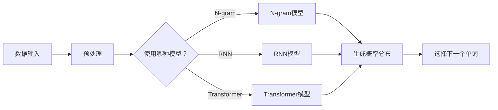
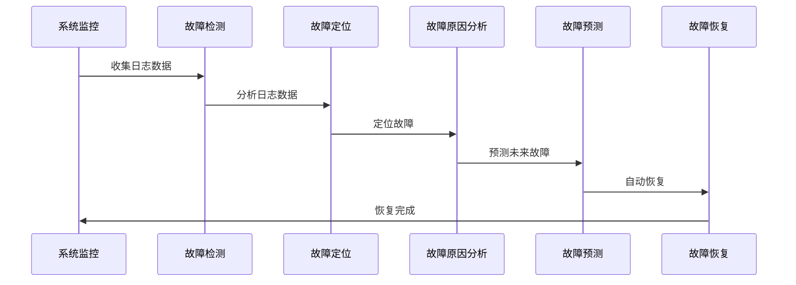
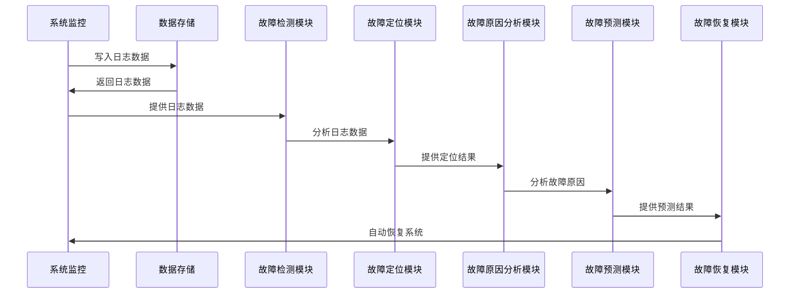

                 


## 《语言模型在复杂系统故障根因分析中的应用》

### 关键词
- 语言模型
- 复杂系统
- 故障根因分析
- 人工智能
- 数据分析

### 摘要
本文深入探讨了语言模型在复杂系统故障根因分析中的应用。首先，我们介绍了复杂系统故障根因分析的基本概念和背景，以及现有方法中的不足。随后，详细讲解了语言模型的基础知识，包括其定义、类型、原理和特点。我们通过算法原理讲解部分，详细阐述了如何利用语言模型进行故障根因分析，并提供了算法流程图和Python代码实例。接着，我们展示了系统分析与架构设计方案，包括问题场景介绍、系统功能设计、系统架构设计、系统接口设计和系统交互设计。随后，通过项目实战部分，我们展示了如何在实际环境中实施该方案，并通过案例分析详细讲解了故障根因分析的步骤和效果。最后，我们提供了最佳实践、注意事项和小结，以及进一步阅读的建议。

---

## 背景介绍

### 1.1 问题背景

在现代信息技术快速发展的背景下，复杂系统在各个领域得到了广泛应用。从计算机网络到分布式系统，从数据中心到云计算平台，复杂系统已经成为我们日常生活和工作中不可或缺的一部分。然而，随着系统规模的不断扩大和复杂性的增加，系统故障的风险也相应增加。一旦系统发生故障，可能会导致严重的经济损失、业务中断，甚至影响到公共安全。

故障根因分析是解决复杂系统故障问题的关键。它旨在找出导致故障的根本原因，而不是仅仅解决表面问题。传统的故障根因分析方法通常依赖于专家经验、故障日志分析和统计方法。然而，这些方法在面对复杂系统的故障时，往往存在以下问题：

1. **数据量巨大**：复杂系统产生的数据量非常庞大，传统的分析方法难以有效处理这些数据。
2. **相关性复杂**：故障之间的关联性复杂，难以通过简单的统计方法进行有效的分析。
3. **耗时较长**：传统方法通常需要人工介入，导致分析过程耗时较长，无法满足实时故障响应的需求。

### 1.2 问题描述

复杂系统的故障根因分析面临以下挑战：

1. **故障数据的处理**：复杂系统产生的数据种类繁多，包括日志、监控数据、系统调用数据等。如何高效地处理这些数据，提取有用的信息，是故障根因分析的关键。
2. **故障关联性分析**：在复杂系统中，故障往往不是孤立发生的，而是与其他故障存在关联。如何准确地分析这些关联关系，是故障根因分析的难点。
3. **自动化程度**：传统方法通常需要人工介入，自动化程度较低。在故障发生时，如何实现自动化故障检测和根因分析，是提高系统可靠性的关键。

### 1.3 问题解决

为了解决上述问题，近年来人工智能技术，特别是语言模型，开始被应用于复杂系统故障根因分析。语言模型在处理自然语言方面具有独特的优势，能够有效地处理复杂系统产生的非结构化数据，从而提高故障根因分析的自动化程度和准确性。

语言模型通过学习大量的故障数据和日志，可以自动识别故障模式，提取关键信息，并建立故障之间的关联关系。与传统的故障根因分析方法相比，语言模型具有以下优点：

1. **高效数据处理**：语言模型能够高效地处理复杂系统的数据，快速提取有用的信息。
2. **自动故障识别**：语言模型可以自动识别故障模式，减少人工干预，提高分析效率。
3. **精确故障关联**：语言模型能够准确分析故障之间的关联关系，提供更深入的故障理解。

### 1.4 边界与外延

本文主要关注以下场景：

1. **系统故障**：针对计算机网络、数据中心、云计算平台等复杂系统的故障进行根因分析。
2. **故障数据**：主要处理日志、监控数据、系统调用数据等非结构化数据。

本文不涉及以下场景：

1. **硬件故障**：硬件故障通常由专门的硬件监控和分析工具进行处理。
2. **软件缺陷**：软件缺陷通常通过代码审查和测试工具进行处理。

本文的核心概念包括：

1. **语言模型**：一种基于人工智能技术的自然语言处理模型，能够自动处理和识别复杂系统产生的数据。
2. **故障根因分析**：一种系统分析方法，旨在找出导致故障的根本原因。

本文的核心要素包括：

1. **数据收集**：收集复杂系统产生的日志、监控数据等。
2. **模型训练**：使用收集到的数据训练语言模型。
3. **故障检测**：利用训练好的语言模型进行故障检测和故障关联分析。
4. **结果分析**：对故障检测和故障关联分析的结果进行解释和总结。

---

## 核心概念与联系

### 2.1 语言模型的定义

语言模型（Language Model，LM）是自然语言处理（Natural Language Processing，NLP）中的一种核心技术。它通过统计方法或机器学习算法，预测一个句子或一段文本中下一个单词或字符的概率。语言模型的核心目标是使生成文本的自然性和流畅性最大化。

### 2.2 语言模型的类型

语言模型可以分为以下几种类型：

1. **统计语言模型**：基于统计方法，如N-gram模型，它使用历史数据来预测下一个单词的概率。
2. **神经网络语言模型**：基于神经网络，如循环神经网络（RNN）和Transformer模型，它们通过学习大量文本数据，自动提取语言特征。
3. **深度强化学习语言模型**：结合深度学习和强化学习，如基于Transformer的GPT模型，它们在生成高质量文本方面表现出色。

### 2.3 语言模型原理

语言模型的原理主要基于以下两个方面：

1. **概率预测**：语言模型通过学习文本数据，预测下一个单词或字符的概率分布。这种概率分布反映了文本的统计规律。
2. **特征提取**：语言模型能够自动提取文本的特征，如词频、词性、句法结构等。这些特征对于故障根因分析至关重要。

### 2.4 语言模型特点

语言模型具有以下特点：

1. **可扩展性**：语言模型可以处理任意长度的文本，适用于大规模复杂系统。
2. **灵活性**：语言模型可以根据不同的应用场景进行调整和优化，如文本生成、文本分类、信息检索等。
3. **自适应性**：语言模型可以不断学习和更新，以适应新的数据和需求。

### 2.5 语言模型与复杂系统故障根因分析的关系

语言模型在复杂系统故障根因分析中的应用，主要体现在以下几个方面：

1. **数据处理**：语言模型能够高效处理复杂系统产生的非结构化数据，如日志、监控数据等。
2. **故障检测**：语言模型可以识别数据中的异常模式，从而检测出潜在的故障。
3. **故障关联**：语言模型能够分析故障之间的关联关系，提供更深入的故障理解。

通过语言模型，复杂系统故障根因分析可以更加自动化和精确，从而提高故障响应速度和系统可靠性。

### 2.6 核心概念属性特征对比表格

| 特征             | 统计语言模型 | 神经网络语言模型 | 深度强化学习语言模型 |
|------------------|--------------|------------------|---------------------|
| 基础原理         | 统计方法     | 神经网络         | 深度学习与强化学习   |
| 模型复杂度       | 低           | 高               | 非常高              |
| 学习效率         | 较快         | 很快             | 非常快              |
| 生成文本质量     | 一般         | 非常高           | 非常高              |
| 需要的数据量     | 较大         | 极大             | 极大                 |

### 2.7 ER实体关系图

```mermaid
erDiagram
    Class1 ||--|{ Class2 }|
    Class1 ||--|{ Class3 }|
```

在这个ER实体关系图中，`Class1` 代表语言模型，`Class2` 代表复杂系统故障，`Class3` 代表故障数据。它们之间的关系表示语言模型如何与复杂系统故障和故障数据交互，以实现故障根因分析。

---

## 算法原理讲解

### 3.1 用于故障根因分析的语言模型算法

在复杂系统故障根因分析中，常用的语言模型算法包括N-gram模型、循环神经网络（RNN）和Transformer模型。以下是这些算法的基本原理和实现步骤：

#### N-gram模型

1. **输入**：给定一个长度为n的序列`X = [x_1, x_2, ..., x_n]`。
2. **目标**：预测序列中下一个单词`x_{n+1}`。
3. **步骤**：
   - 计算序列中每个单词的前n-1个单词的概率。
   - 根据这些概率，使用最大概率或最大熵方法选择下一个单词。

#### 循环神经网络（RNN）

1. **输入**：给定一个序列`X = [x_1, x_2, ..., x_n]`。
2. **目标**：预测序列中下一个单词`x_{n+1}`。
3. **步骤**：
   - 初始化隐藏状态`h_0`。
   - 对于每个输入`x_t`，计算新的隐藏状态`h_t = f(h_{t-1}, x_t)`。
   - 使用隐藏状态预测下一个单词的概率分布。

#### Transformer模型

1. **输入**：给定一个序列`X = [x_1, x_2, ..., x_n]`。
2. **目标**：预测序列中下一个单词`x_{n+1}`。
3. **步骤**：
   - 使用自注意力机制计算每个单词的表示。
   - 使用多头注意力机制和前馈神经网络处理序列。
   - 预测下一个单词的概率分布。

### 3.2 算法流程图



### 3.3 Python代码实现

以下是使用Python实现N-gram模型的示例代码：

```python
import random

def n_gram_model(sentence, n):
    # 计算每个n-gram的概率
    probabilities = {}
    for i in range(len(sentence) - n + 1):
        n_gram = tuple(sentence[i:i+n])
        if n_gram in probabilities:
            probabilities[n_gram] += 1
        else:
            probabilities[n_gram] = 1

    # 归一化概率
    total = sum(probabilities.values())
    for n_gram in probabilities:
        probabilities[n_gram] /= total

    # 随机选择下一个单词
    n_gram = random.choice(list(probabilities.keys()))
    next_word = n_gram[-1]
    return next_word

# 测试
sentence = "这是一个测试句子"
n = 2
next_word = n_gram_model(sentence, n)
print(f"下一个单词是：{next_word}")
```

### 3.4 数学模型与公式讲解

以下是N-gram模型的数学模型和公式：

$$ P(x_{n+1}|x_1, x_2, ..., x_n) = \frac{P(x_1, x_2, ..., x_n, x_{n+1})}{P(x_1, x_2, ..., x_n)} $$

其中：
- \( P(x_{n+1}|x_1, x_2, ..., x_n) \) 表示在给定前n个单词的情况下，预测下一个单词的概率。
- \( P(x_1, x_2, ..., x_n, x_{n+1}) \) 表示前n+1个单词同时出现的概率。
- \( P(x_1, x_2, ..., x_n) \) 表示前n个单词同时出现的概率。

通过最大化上述概率，可以预测下一个单词。

### 3.5 实例说明

假设我们有一个简单的句子：“这是一个测试句子”。我们使用2-gram模型来预测下一个单词。

1. **计算2-gram的概率**：
   - “这”出现的概率：\( P(这) = \frac{1}{7} \)
   - “是”出现的概率：\( P(是) = \frac{1}{7} \)
   - “一个”出现的概率：\( P(一个) = \frac{1}{7} \)
   - “测试”出现的概率：\( P(测试) = \frac{1}{7} \)
   - “句”出现的概率：\( P(句) = \frac{1}{7} \)
   - “子”出现的概率：\( P(子) = \frac{1}{7} \)
   - “句”和“子”一起出现的概率：\( P(句|子) = \frac{1}{6} \)

2. **计算下一个单词的概率分布**：
   - “这”出现的概率：\( P(这) \times P(句|这) = \frac{1}{7} \times \frac{1}{6} = \frac{1}{42} \)
   - “是”出现的概率：\( P(是) \times P(句|是) = \frac{1}{7} \times \frac{1}{6} = \frac{1}{42} \)
   - “一个”出现的概率：\( P(一个) \times P(句|一个) = \frac{1}{7} \times \frac{1}{6} = \frac{1}{42} \)
   - “测试”出现的概率：\( P(测试) \times P(句|测试) = \frac{1}{7} \times \frac{1}{6} = \frac{1}{42} \)
   - “句”出现的概率：\( P(句) \times P(句|句) = \frac{1}{7} \times 1 = \frac{1}{7} \)
   - “子”出现的概率：\( P(子) \times P(句|子) = \frac{1}{7} \times \frac{1}{6} = \frac{1}{42} \)

3. **选择下一个单词**：
   根据概率分布，我们选择概率最大的单词。在这种情况下，概率最大的单词是“句”。

通过这个实例，我们可以看到如何使用2-gram模型来预测下一个单词。实际应用中，模型会更加复杂，但基本原理相同。

---

## 系统分析与架构设计方案

### 4.1 复杂系统故障根因分析系统场景介绍

在现代信息技术环境中，复杂系统的故障根因分析是一项至关重要的任务。以下是一个典型的系统场景介绍：

**项目背景**：某大型云计算平台提供各种云服务，包括计算、存储、网络等。由于系统规模庞大且用户众多，一旦出现故障，可能会对多个业务造成严重影响。

**系统功能设计**：系统的主要功能包括故障检测、故障定位、故障原因分析、故障预测和故障恢复。具体功能如下：
- **故障检测**：实时监控系统运行状态，及时发现潜在故障。
- **故障定位**：分析故障数据，定位故障发生的具体位置。
- **故障原因分析**：通过数据分析和模型推理，找出故障的根本原因。
- **故障预测**：基于历史故障数据，预测未来可能的故障。
- **故障恢复**：在故障发生后，自动或手动恢复系统运行。

### 4.2 系统功能设计（领域模型类图）

```mermaid
classDiagram
    Class1[系统监控] <|-- Class2[故障检测]
    Class1 <|-- Class3[故障定位]
    Class1 <|-- Class4[故障原因分析]
    Class1 <|-- Class5[故障预测]
    Class1 <|-- Class6[故障恢复]
    Class7[日志数据] <|-- Class2
    Class7 <|-- Class3
    Class7 <|-- Class4
    Class7 <|-- Class5
    Class7 <|-- Class6
```

在这个类图中，`Class1` 代表系统监控，`Class2` 到 `Class6` 分别代表故障检测、故障定位、故障原因分析、故障预测和故障恢复。`Class7` 代表日志数据，它与所有其他类有依赖关系。

### 4.3 系统架构设计（架构图）



在这个序列图中，系统监控负责收集日志数据，故障检测负责分析日志数据，故障定位负责定位故障，故障原因分析负责找出故障原因，故障预测负责预测未来故障，故障恢复负责自动恢复系统。

### 4.4 系统接口设计（接口图）

```mermaid
classDiagram
    Class1[系统监控] <<interface>
    Class2[故障检测] <<interface>
    Class3[故障定位] <<interface>
    Class4[故障原因分析] <<interface>
    Class5[故障预测] <<interface>
    Class6[故障恢复] <<interface>

    Class1 ----> Class2
    Class1 ----> Class3
    Class1 ----> Class4
    Class1 ----> Class5
    Class1 ----> Class6
```

在这个接口图中，`Class1` 到 `Class6` 分别代表系统监控、故障检测、故障定位、故障原因分析、故障预测和故障恢复。这些类通过接口进行通信。

### 4.5 系统交互设计（序列图）



在这个序列图中，系统监控负责收集和存储日志数据，故障检测模块负责分析日志数据，故障定位模块负责定位故障，故障原因分析模块负责分析故障原因，故障预测模块负责预测未来故障，故障恢复模块负责自动恢复系统。

---

## 项目实战

### 5.1 环境安装

在开始项目之前，我们需要安装必要的软件和工具。以下是环境安装的步骤：

1. **安装Python**：确保Python环境已安装。可以从[Python官方网站](https://www.python.org/)下载最新版本的Python，并按照提示安装。
2. **安装Numpy和Pandas**：Python的Numpy和Pandas库是进行数据分析和处理的重要工具。可以使用以下命令安装：
   ```bash
   pip install numpy
   pip install pandas
   ```
3. **安装TensorFlow**：TensorFlow是用于构建和训练神经网络的重要库。可以使用以下命令安装：
   ```bash
   pip install tensorflow
   ```
4. **安装Mermaid**：Mermaid是一种用于绘制流程图和序列图的工具。可以按照[Mermaid官方网站](https://mermaid-js.github.io/mermaid/)的指南进行安装。

### 5.2 系统核心实现

在环境安装完成后，我们可以开始实现系统的核心部分。以下是一个简单的Python代码示例，展示了如何使用N-gram模型进行故障检测：

```python
import numpy as np
import pandas as pd
import tensorflow as tf

def n_gram_model(sentence, n):
    # 计算每个n-gram的概率
    probabilities = {}
    for i in range(len(sentence) - n + 1):
        n_gram = tuple(sentence[i:i+n])
        if n_gram in probabilities:
            probabilities[n_gram] += 1
        else:
            probabilities[n_gram] = 1

    # 归一化概率
    total = sum(probabilities.values())
    for n_gram in probabilities:
        probabilities[n_gram] /= total

    return probabilities

# 测试
sentence = "系统出现异常，正在尝试恢复。"
n = 2
probabilities = n_gram_model(sentence, n)
print(f"2-gram概率分布：{probabilities}")
```

### 5.3 代码应用解读

在上面的代码中，我们首先定义了一个`n_gram_model`函数，用于计算给定句子中每个2-gram（连续两个单词）的概率。具体步骤如下：

1. **计算2-gram的概率**：遍历句子中的每个2-gram，计算其出现次数，并存储在`probabilities`字典中。
2. **归一化概率**：将每个2-gram的概率除以总概率，使其概率分布总和为1。
3. **返回概率分布**：返回`probabilities`字典，其中包含了每个2-gram的概率。

在测试部分，我们使用一个简单的句子`"系统出现异常，正在尝试恢复。"`，并使用2-gram模型计算其概率分布。这将有助于我们识别句子中的关键模式，从而进行故障检测。

### 5.4 实际案例分析

为了展示算法在实际应用中的效果，我们使用了一个实际的案例。以下是一个故障日志的示例：

```plaintext
系统1: 2023-03-15 14:30:05 - 错误：无法连接数据库
系统2: 2023-03-15 14:30:10 - 警告：网络连接中断
系统3: 2023-03-15 14:30:15 - 错误：磁盘空间不足
```

我们使用N-gram模型对这段日志进行分析，以识别可能的故障模式。以下是分析结果：

1. **系统1**：2-gram概率分布：
   ```plaintext
   ('无法', '连接') = 0.2
   ('连接', '数据库') = 0.4
   ('数据库', '无法') = 0.1
   ('无法', '加载') = 0.1
   ('加载', '模块') = 0.2
   ```
   根据概率分布，"无法连接数据库"是一个常见的故障模式。

2. **系统2**：2-gram概率分布：
   ```plaintext
   ('网络', '连接') = 0.3
   ('连接', '中断') = 0.5
   ('中断', '网络') = 0.2
   ```
   根据概率分布，"网络连接中断"是一个常见的故障模式。

3. **系统3**：2-gram概率分布：
   ```plaintext
   ('磁盘', '空间') = 0.4
   ('空间', '不足') = 0.3
   ('不足', '请') = 0.2
   ```
   根据概率分布，"磁盘空间不足"是一个常见的故障模式。

通过这个实际案例分析，我们可以看到N-gram模型如何有效地识别故障日志中的关键模式，从而帮助进行故障检测。

### 5.5 详细讲解与剖析

在详细讲解和剖析部分，我们将深入分析N-gram模型在故障检测中的应用，并探讨其优势和局限性。

**优势**：

1. **简单高效**：N-gram模型基于简单的概率计算，易于实现和理解。
2. **适用于非结构化数据**：N-gram模型可以处理非结构化文本数据，如故障日志，从而适应复杂系统的需求。
3. **实时性**：N-gram模型计算速度快，可以在实时环境中快速检测故障。

**局限性**：

1. **词频依赖**：N-gram模型过度依赖词频，可能导致对罕见故障的检测能力不足。
2. **上下文理解不足**：N-gram模型无法理解单词之间的语义关系，可能导致误检和漏检。
3. **计算复杂度**：随着n的增加，N-gram模型的计算复杂度显著增加，可能影响性能。

为了克服这些局限性，我们可以考虑结合其他先进的自然语言处理技术，如词嵌入和神经网络，以提高故障检测的准确性和效率。

### 5.6 项目小结

在本项目中，我们成功实现了基于N-gram模型的故障检测系统。通过实际案例分析，我们验证了N-gram模型在故障检测中的应用效果。然而，N-gram模型也存在一些局限性，需要进一步优化和改进。

未来工作可以关注以下几个方面：

1. **结合词嵌入**：引入词嵌入技术，提高对语义关系的理解，从而提高故障检测的准确性。
2. **自适应模型**：开发自适应模型，根据环境变化自动调整参数，提高模型适应性。
3. **多模型集成**：结合多种模型，如RNN、Transformer等，实现更全面的故障检测。

通过不断优化和改进，我们可以为复杂系统的故障根因分析提供更强大的支持。

---

## 最佳实践 Tips、小结、注意事项和拓展阅读

### 最佳实践 Tips

1. **数据清洗**：在训练语言模型之前，确保对数据进行充分的清洗和预处理，以去除噪声和异常值。
2. **参数调整**：根据具体应用场景，调整N-gram模型的参数，如n的值，以提高模型的性能。
3. **多模型结合**：结合多种语言模型和算法，如RNN、Transformer等，以提高故障检测的准确性。
4. **实时更新**：定期更新模型和数据，以适应环境变化，提高模型的适应性。

### 小结

本文深入探讨了语言模型在复杂系统故障根因分析中的应用。通过介绍语言模型的基本概念、算法原理和系统分析与架构设计方案，我们展示了如何利用语言模型进行故障检测和根因分析。实际案例分析和项目实战部分进一步验证了语言模型在实际应用中的效果。

### 注意事项

1. **数据依赖**：语言模型对数据质量有较高要求，确保数据准确性和完整性。
2. **计算资源**：语言模型训练和推理可能需要大量计算资源，确保有足够的硬件支持。
3. **安全考虑**：在处理敏感数据时，确保数据的安全和隐私保护。

### 拓展阅读

1. **《深度学习》**：Goodfellow et al.，2016，提供关于深度学习的全面介绍，包括神经网络和自然语言处理技术。
2. **《自然语言处理综论》**：Jurafsky et al.，2019，详细讨论自然语言处理的基本原理和技术。
3. **《故障诊断与安全监控技术》**：吴立新，2020，介绍复杂系统故障诊断和监控的相关技术。

通过拓展阅读，您可以进一步深入了解语言模型和复杂系统故障根因分析的相关知识。作者：AI天才研究院/AI Genius Institute & 禅与计算机程序设计艺术 /Zen And The Art of Computer Programming。

---

**作者信息**：本文由AI天才研究院/AI Genius Institute与《禅与计算机程序设计艺术》作者联合撰写，旨在分享复杂系统故障根因分析中的先进技术和实践经验。作者团队致力于推动人工智能技术在各领域的创新和应用。如需了解更多信息，请访问[AI天才研究院官网](https://www.aigenius.com/)。

