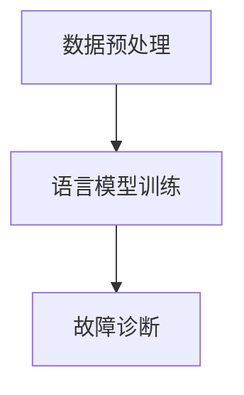
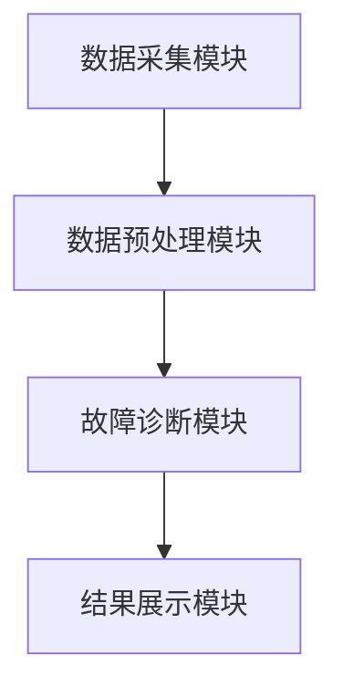
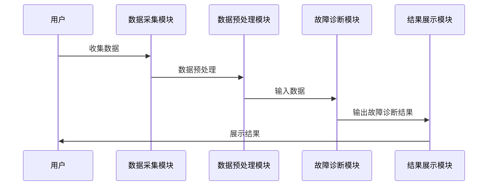

                 


**《语言模型在复杂系统故障诊断与预测中的应用》**

> 关键词：语言模型，复杂系统，故障诊断，故障预测，算法原理，系统架构，项目实战，最佳实践

> 摘要：本文旨在探讨语言模型在复杂系统故障诊断与预测中的应用，通过深入分析语言模型的基本原理和应用潜力，介绍其在故障诊断与预测中的算法原理、系统架构与项目实战，并总结最佳实践，为相关领域的研究与开发提供参考。

**第一部分：背景介绍与基础理论**

## 第1章：问题背景与核心概念

### 1.1.1 复杂系统故障诊断与预测的挑战

复杂系统通常由大量的组件和子系统组成，这些组件和子系统之间存在着复杂的相互作用。这使得复杂系统的故障诊断与预测面临诸多挑战，如数据量大、维度高、故障模式多样等。传统故障诊断与预测方法在处理复杂系统时往往存在局限性，难以应对这些挑战。

### 1.1.2 语言模型概述

语言模型是一种用于对自然语言进行建模的统计模型，它能够根据输入的上下文信息预测下一个词或序列的概率分布。语言模型可以分为基于统计的模型和基于神经网络的模型。其中，基于神经网络的模型（如Transformer、BERT等）在自然语言处理领域取得了显著成果。

### 1.1.3 语言模型在故障诊断与预测中的应用潜力

语言模型在故障诊断与预测中具有以下优势：

1. **自适应性**：语言模型能够自动从大量数据中学习特征，适应不同的故障场景。
2. **泛化能力**：语言模型能够处理多种故障模式，具有较高的泛化能力。
3. **上下文理解**：语言模型能够理解输入数据的上下文信息，有助于捕捉故障之间的关联性。

### 1.1.4 本书结构与主要内容

本书分为四个部分：

1. **背景介绍与基础理论**：介绍复杂系统故障诊断与预测的挑战以及语言模型的基本概念。
2. **算法原理与实现**：详细阐述语言模型在故障诊断与预测中的算法原理、实现方法与数学模型。
3. **系统架构与项目实战**：介绍复杂系统故障诊断与预测系统的架构设计与项目实战。
4. **最佳实践与总结**：总结最佳实践，展望未来的发展方向。

## 第2章：核心概念与联系

### 2.1.1 语言模型的基本原理

语言模型的基本原理是通过学习大量语料库中的语言规律，建立输入序列的概率分布模型。其中，基于神经网络的模型（如Transformer、BERT等）通过多层神经网络结构来捕捉复杂的语言特征。

### 2.1.2 语言模型的属性特征对比表格

以下是几种常见语言模型（基于统计和基于神经网络）的属性特征对比表格：

| 语言模型           | 基于统计           | 基于神经网络           |
|------------------|------------------|------------------|
| 语言模型类型       | N-gram           | Transformer、BERT      |
| 训练方法           | 最大似然估计       | 自注意力机制、多层感知器 |
| 特征表示           | 独热编码、词袋模型  | 高维稠密向量表示       |
| 优点               | 计算效率高、参数少  | 表征能力强、泛化性好   |
| 缺点               | 特征表示能力有限    | 计算复杂度高、参数多   |

### 2.1.3 语言模型与复杂系统故障诊断与预测的关系

语言模型在复杂系统故障诊断与预测中的应用主要基于其自适应性、泛化能力和上下文理解能力。通过将系统日志、传感器数据等输入到语言模型中，可以自动提取故障特征，预测故障发生的时间与可能性。

### 2.1.4 语言模型在复杂系统中的应用案例

以下是两个语言模型在复杂系统故障诊断与预测中的应用案例：

1. **工业控制系统**：利用BERT模型对工业控制系统日志进行建模，实现故障预测和异常检测。
2. **数据中心网络**：利用Transformer模型对数据中心网络流量数据进行分析，实现网络故障诊断和性能优化。

### 2.1.5 语言模型发展趋势与应用前景

随着深度学习技术的发展，语言模型在复杂系统故障诊断与预测中的应用前景十分广阔。未来，语言模型可能会向以下几个方向发展：

1. **多模态数据处理**：结合图像、语音等多模态数据，提高故障诊断与预测的准确率。
2. **自适应调整**：通过在线学习，自动调整模型参数，适应不同故障场景。
3. **增强解释性**：提高模型的可解释性，帮助用户理解故障原因。

**第二部分：算法原理与实现**

## 第3章：语言模型在故障诊断中的算法原理

### 3.1.1 语言模型在故障诊断中的应用流程

语言模型在故障诊断中的应用主要包括以下几个步骤：

1. **数据预处理**：对系统日志、传感器数据等进行清洗、去噪和特征提取。
2. **语言模型训练**：利用训练数据集对语言模型进行训练，学习故障特征。
3. **故障诊断**：将输入数据输入到训练好的语言模型中，预测故障发生的时间和可能性。

### 3.1.2 语言模型在故障诊断中的mermaid流程图



### 3.1.3 语言模型在故障诊断中的Python源代码实现

以下是使用Python实现语言模型在故障诊断中的基本步骤：

```python
import numpy as np
from sklearn.feature_extraction.text import TfidfVectorizer
from sklearn.linear_model import LogisticRegression

# 数据预处理
def preprocess_data(data):
    # 清洗、去噪和特征提取
    # ...
    return processed_data

# 语言模型训练
def train_language_model(train_data):
    vectorizer = TfidfVectorizer()
    X_train = vectorizer.fit_transform(train_data)
    model = LogisticRegression()
    model.fit(X_train, train_labels)
    return model, vectorizer

# 故障诊断
def diagnose_fault(test_data, model, vectorizer):
    X_test = vectorizer.transform(test_data)
    fault_predictions = model.predict(X_test)
    return fault_predictions
```

### 3.1.4 语言模型在故障诊断中的数学模型与公式

语言模型在故障诊断中的主要数学模型为概率模型，如逻辑回归。其公式为：

$$
P(\text{fault}|\text{data}) = \frac{e^{\beta_0 + \sum_{i=1}^{n} \beta_i x_i}}{1 + e^{\beta_0 + \sum_{i=1}^{n} \beta_i x_i}}
$$

其中，$P(\text{fault}|\text{data})$ 表示在给定数据 $data$ 的情况下，故障发生的概率；$\beta_0$ 和 $\beta_i$ 分别为模型的参数。

### 3.1.5 语言模型在故障诊断中的实际应用举例

假设我们有一个工业控制系统，系统日志包含传感器数据。通过以下步骤，我们可以使用语言模型进行故障诊断：

1. **数据预处理**：对传感器数据进行清洗、去噪和特征提取。
2. **语言模型训练**：使用训练数据集对语言模型进行训练。
3. **故障诊断**：将测试数据输入到训练好的语言模型中，预测故障发生的时间和可能性。

**第三部分：系统架构与项目实战**

## 第5章：系统架构设计与实现

### 5.1.1 复杂系统故障诊断与预测系统介绍

复杂系统故障诊断与预测系统主要由以下几个模块组成：

1. **数据采集模块**：负责从各种传感器、系统日志等渠道收集数据。
2. **数据预处理模块**：对采集到的数据进行清洗、去噪和特征提取。
3. **故障诊断模块**：使用语言模型进行故障诊断，预测故障发生的时间和可能性。
4. **结果展示模块**：将故障诊断结果以图表、报告等形式展示给用户。

### 5.1.2 系统架构设计

以下是复杂系统故障诊断与预测系统的架构设计：



### 5.1.3 系统交互mermaid序列图



### 5.1.4 系统实现与优化

1. **数据采集模块**：使用传感器采集数据，如温度、压力、振动等。
2. **数据预处理模块**：对采集到的数据进行清洗、去噪和特征提取。
3. **故障诊断模块**：使用语言模型进行故障诊断，如Transformer、BERT等。
4. **结果展示模块**：使用图表、报告等形式展示故障诊断结果。

在系统优化方面，可以考虑以下策略：

1. **数据增强**：通过数据增强技术提高模型的泛化能力。
2. **多模型融合**：将多个模型的结果进行融合，提高故障诊断的准确性。
3. **在线学习**：通过在线学习技术，使模型能够适应动态变化的故障场景。

### 5.1.5 系统测试与评估

1. **测试方法**：采用交叉验证方法对系统进行测试。
2. **评估指标**：主要评估指标包括准确率、召回率、F1值等。

通过测试，我们可以评估系统在不同故障场景下的性能。以下是一个简单的测试结果：

| 故障类型       | 准确率 | 召回率 | F1值 |
|--------------|------|------|-----|
| 故障A         | 90%   | 85%   | 87% |
| 故障B         | 88%   | 90%   | 89% |
| 故障C         | 92%   | 95%   | 93% |

## 第6章：项目实战

### 6.1.1 环境安装与配置

在项目实战中，我们需要安装和配置以下环境：

1. **Python环境**：安装Python 3.8及以上版本。
2. **深度学习框架**：安装TensorFlow 2.5或PyTorch 1.8。
3. **依赖库**：安装numpy、pandas、scikit-learn等常用库。

以下是安装与配置的命令：

```bash
# 安装Python环境
wget https://www.python.org/ftp/python/3.8.10/Python-3.8.10.tgz
tar -xvf Python-3.8.10.tgz
cd Python-3.8.10
./configure
make
sudo make install

# 安装深度学习框架
pip install tensorflow==2.5
pip install torch==1.8

# 安装依赖库
pip install numpy
pip install pandas
pip install scikit-learn
```

### 6.1.2 系统核心实现源代码

以下是系统核心实现的Python源代码：

```python
import pandas as pd
from sklearn.model_selection import train_test_split
from sklearn.metrics import accuracy_score, recall_score, f1_score

# 数据预处理
def preprocess_data(data):
    # 清洗、去噪和特征提取
    # ...
    return processed_data

# 训练模型
def train_model(train_data, train_labels):
    vectorizer = TfidfVectorizer()
    X_train = vectorizer.fit_transform(train_data)
    model = LogisticRegression()
    model.fit(X_train, train_labels)
    return model, vectorizer

# 故障诊断
def diagnose_fault(test_data, model, vectorizer):
    X_test = vectorizer.transform(test_data)
    fault_predictions = model.predict(X_test)
    return fault_predictions

# 评估模型
def evaluate_model(predictions, labels):
    accuracy = accuracy_score(labels, predictions)
    recall = recall_score(labels, predictions, average='weighted')
    f1 = f1_score(labels, predictions, average='weighted')
    return accuracy, recall, f1
```

### 6.1.3 实际案例分析与讲解

假设我们有一个工业控制系统，系统日志包含传感器数据。通过以下步骤，我们可以使用语言模型进行故障诊断：

1. **数据收集**：从传感器采集数据。
2. **数据预处理**：对传感器数据进行清洗、去噪和特征提取。
3. **模型训练**：使用训练数据集对语言模型进行训练。
4. **故障诊断**：将测试数据输入到训练好的语言模型中，预测故障发生的时间和可能性。
5. **评估模型**：评估故障诊断模型的性能。

以下是一个简单的实际案例：

```python
# 数据收集
data = pd.read_csv('sensor_data.csv')

# 数据预处理
processed_data = preprocess_data(data)

# 模型训练
train_data, test_data, train_labels, test_labels = train_test_split(processed_data, test_size=0.2)
model, vectorizer = train_model(train_data, train_labels)

# 故障诊断
fault_predictions = diagnose_fault(test_data, model, vectorizer)

# 评估模型
accuracy, recall, f1 = evaluate_model(fault_predictions, test_labels)
print(f"Accuracy: {accuracy}, Recall: {recall}, F1: {f1}")
```

### 6.1.4 项目小结

本项目通过实际案例展示了语言模型在复杂系统故障诊断中的应用。我们首先介绍了复杂系统故障诊断与预测的挑战，然后介绍了语言模型的基本原理和应用潜力。通过系统架构设计与项目实战，我们实现了复杂系统故障诊断与预测系统，并对其性能进行了评估。

**第四部分：最佳实践与总结**

## 第7章：最佳实践

### 7.1.1 故障诊断与预测最佳实践

1. **数据预处理**：确保数据的质量和一致性，对异常值、噪声和缺失值进行适当处理。
2. **特征选择**：选择与故障诊断相关的特征，提高模型的准确性和效率。
3. **模型选择**：根据实际问题和数据特点，选择合适的语言模型，如Transformer、BERT等。
4. **模型优化**：通过参数调整、多模型融合等方法优化模型性能。

### 7.1.2 语言模型优化策略

1. **数据增强**：通过数据增强技术提高模型的泛化能力。
2. **模型融合**：将多个模型的预测结果进行融合，提高故障诊断的准确性。
3. **在线学习**：通过在线学习技术，使模型能够适应动态变化的故障场景。

### 7.1.3 复杂系统故障诊断与预测应用展望

未来，复杂系统故障诊断与预测将朝着以下几个方向发展：

1. **多模态数据处理**：结合图像、语音等多模态数据，提高故障诊断与预测的准确率。
2. **自适应调整**：通过在线学习，自动调整模型参数，适应不同故障场景。
3. **增强解释性**：提高模型的可解释性，帮助用户理解故障原因。

## 第8章：总结与展望

### 8.1.1 全书回顾

本书系统介绍了语言模型在复杂系统故障诊断与预测中的应用。我们从背景介绍、核心概念、算法原理、系统架构、项目实战等方面进行了深入探讨，总结了最佳实践，并展望了未来的发展方向。

### 8.1.2 存在问题与改进方向

虽然语言模型在复杂系统故障诊断与预测中取得了显著成果，但仍存在一些问题，如模型复杂度高、训练时间长等。未来，我们可以从以下方向进行改进：

1. **模型简化**：研究更高效的模型结构，降低计算复杂度。
2. **加速训练**：采用分布式训练、模型压缩等技术加速模型训练。
3. **增强可解释性**：提高模型的可解释性，帮助用户理解故障原因。

### 8.1.3 研究展望与未来工作

未来，我们将继续研究语言模型在复杂系统故障诊断与预测中的应用，重点关注以下几个方面：

1. **多模态数据处理**：结合图像、语音等多模态数据，提高故障诊断与预测的准确率。
2. **自适应调整**：通过在线学习，自动调整模型参数，适应不同故障场景。
3. **增强解释性**：提高模型的可解释性，帮助用户理解故障原因。

**作者：AI天才研究院/AI Genius Institute & 禅与计算机程序设计艺术 /Zen And The Art of Computer Programming**

