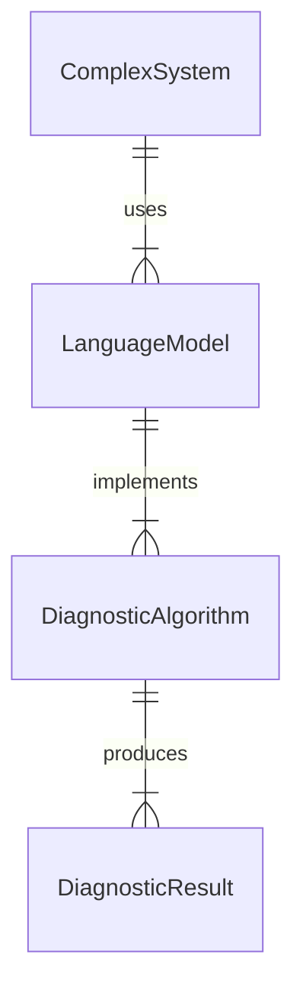
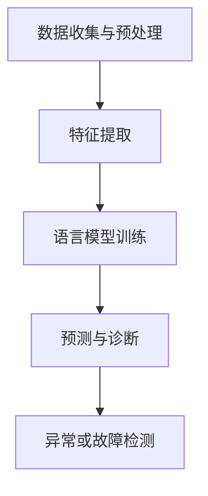
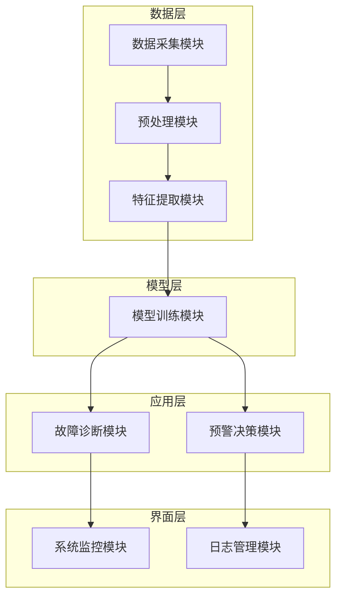
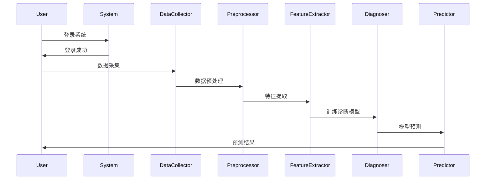

                 

# 《语言模型在复杂系统诊断中的应用研究》

## 关键词

- 复杂系统诊断
- 语言模型
- 机器学习
- 神经网络
- 数据分析

## 摘要

本文旨在探讨语言模型在复杂系统诊断中的应用，通过系统性地介绍复杂系统诊断的背景、语言模型的基本原理和特点，以及如何将语言模型应用于复杂系统诊断中，旨在为相关领域的研究者和开发者提供理论和实践指导。文章将分步骤详细讲解基于语言模型的复杂系统诊断算法原理、系统架构设计以及实际项目实战，旨在展示语言模型在解决复杂系统诊断问题中的巨大潜力。

## 第一部分：背景介绍

### 第1章：复杂系统诊断问题概述

### 1.1 问题背景

复杂系统是指由众多相互关联、相互作用的子系统组成的系统，如互联网、通信系统、生物系统等。这些系统具有高度非线性、动态性和不确定性，导致传统的诊断方法难以有效处理。随着信息化和智能化的快速发展，复杂系统的规模和复杂性日益增加，系统诊断的重要性日益凸显。

### 1.1.1 复杂系统的特点

1. 高度非线性：复杂系统的运行状态和参数变化呈现出高度非线性特征，导致传统线性分析方法难以适用。
2. 动态性：复杂系统在运行过程中，其状态和参数会不断发生变化，使得诊断过程具有动态性。
3. 不确定性：复杂系统的行为受到多种内外部因素的影响，导致其行为具有不确定性。

### 1.1.2 系统诊断的挑战

1. 数据量大：复杂系统产生的数据量庞大，且包含多种类型的数据，如结构化数据、半结构化数据和非结构化数据。
2. 数据噪声：复杂系统诊断过程中，数据可能会受到噪声干扰，影响诊断结果的准确性。
3. 数据依赖关系复杂：复杂系统中的各个子系统之间存在复杂的依赖关系，如何有效地提取和利用这些依赖关系进行诊断是一个挑战。

### 1.2 问题描述

复杂系统诊断的主要任务是从复杂系统的运行数据中识别出异常或故障，并为系统管理员提供决策支持。具体来说，复杂系统诊断需要解决以下问题：

1. 数据预处理：对复杂系统产生的原始数据进行清洗、转换和归一化，使其适合进行模型训练。
2. 特征提取：从预处理后的数据中提取关键特征，用于构建诊断模型。
3. 模型训练：利用提取出的特征训练诊断模型，使其能够对复杂系统的运行状态进行预测。
4. 故障检测：将训练好的模型应用于实际系统，检测系统中的异常或故障。

### 1.3 问题解决

随着人工智能技术的不断发展，语言模型在复杂系统诊断中的应用逐渐成为研究热点。语言模型能够通过学习大量文本数据，提取出数据中的隐含模式和关系，从而为复杂系统诊断提供有力的支持。本文将围绕语言模型在复杂系统诊断中的应用，系统性地介绍相关理论和实践方法。

### 1.4 边界与外延

1. 复杂系统的范围：本文主要探讨计算机系统、通信系统等复杂系统的诊断问题。
2. 语言模型的能力与限制：语言模型在复杂系统诊断中具有强大的数据处理和模式识别能力，但同时也存在一定的局限性，如对特定领域知识的依赖性等。

### 1.5 概念结构与核心要素组成

1. 复杂系统的结构：复杂系统由多个相互关联的子系统组成，每个子系统又包含若干个模块和组件。
2. 语言模型的要素组成：语言模型主要由词汇表、神经网络架构和训练算法等核心要素组成。

### 1.6 本章小结

本章对复杂系统诊断问题进行了概述，介绍了复杂系统的特点、系统诊断的挑战以及语言模型在复杂系统诊断中的应用前景。接下来，将深入探讨语言模型的基本原理和特点，为后续章节的讨论奠定基础。

## 第二部分：核心概念与联系

### 第2章：语言模型原理及特点

### 2.1 语言模型原理

语言模型（Language Model）是一种用于预测自然语言序列的概率分布的统计模型。其基本原理是通过学习大量文本数据，提取出数据中的统计规律，从而实现对未知文本序列的预测。

### 2.1.1 语言模型的基本概念

1. 语言模型的目标：预测下一个单词或字符的概率。
2. 语言模型的数据来源：大量文本数据，如新闻、论文、小说等。
3. 语言模型的表示方式：通常使用神经网络、隐马尔可夫模型（HMM）等结构来表示语言模型。

### 2.1.2 语言模型的训练过程

语言模型的训练过程主要包括以下步骤：

1. 数据预处理：对原始文本数据进行清洗、分词、去停用词等处理。
2. 数据编码：将预处理后的文本数据转换为数值表示，如词向量。
3. 模型构建：设计并构建神经网络结构，如循环神经网络（RNN）、长短时记忆网络（LSTM）等。
4. 模型训练：利用训练数据对模型进行训练，优化模型参数。
5. 模型评估：通过测试数据对模型进行评估，调整模型参数。

### 2.1.3 语言模型的评估指标

语言模型的评估指标主要包括：

1. 准确率（Accuracy）：模型预测正确的样本数与总样本数之比。
2. 交叉熵（Cross-Entropy）：衡量模型预测结果与真实结果之间的差异。
3. F1值（F1-Score）：综合考虑准确率和召回率的指标。

### 2.2 语言模型特点

1. 统计性：语言模型基于统计学习，通过学习数据中的统计规律进行预测。
2. 自适应性：语言模型可以根据训练数据的不同，自适应调整其参数和预测能力。
3. 高效性：语言模型能够快速处理大规模文本数据，进行实时预测。
4. 多样性：语言模型可以应用于多种自然语言处理任务，如文本分类、命名实体识别等。

### 2.3 语言模型与复杂系统诊断的联系

1. 数据处理能力：语言模型具有强大的数据处理能力，可以处理复杂系统的各种类型数据。
2. 模式识别能力：语言模型能够从复杂系统的运行数据中提取出隐含模式和关系，为系统诊断提供支持。
3. 预测能力：语言模型可以预测复杂系统的未来状态，为系统预警和优化提供依据。

### 2.4 概念属性特征对比表格

| 特征名称 | 语言模型 | 复杂系统诊断 |
| :---: | :---: | :---: |
| 统计性 | 是 | 是 |
| 自适应性 | 是 | 是 |
| 高效性 | 是 | 是 |
| 多样性 | 是 | 是 |
| 数据处理能力 | 强大 | 强大 |
| 模式识别能力 | 强大 | 强大 |
| 预测能力 | 有 | 有 |

### 2.5 ER实体关系图架构



### 2.6 本章小结

本章介绍了语言模型的基本原理、特点以及在复杂系统诊断中的应用。接下来，将深入探讨基于语言模型的复杂系统诊断算法原理，为后续的算法讲解和实际应用奠定基础。

## 第三部分：算法原理讲解

### 第3章：基于语言模型的复杂系统诊断算法

### 3.1 算法简介

基于语言模型的复杂系统诊断算法旨在利用语言模型强大的数据处理和模式识别能力，对复杂系统的运行数据进行诊断，识别系统中的异常或故障。该算法的核心思想是通过训练语言模型，使其能够对复杂系统的运行状态进行预测，进而检测出系统中的异常。

### 3.1.1 算法的目标

1. 提取复杂系统的关键特征，为诊断模型提供输入。
2. 训练语言模型，使其能够对复杂系统的运行状态进行预测。
3. 利用预测结果检测系统中的异常或故障。

### 3.1.2 算法的基本流程

1. 数据收集与预处理：收集复杂系统的运行数据，对数据进行清洗、转换和归一化，使其适合进行模型训练。
2. 特征提取：从预处理后的数据中提取关键特征，用于构建诊断模型。
3. 语言模型训练：利用提取出的特征训练语言模型，使其能够对复杂系统的运行状态进行预测。
4. 预测与诊断：将训练好的语言模型应用于实际系统，对系统运行状态进行预测，识别系统中的异常或故障。

### 3.2 算法原理

#### 3.2.1 数学模型

假设复杂系统的运行状态可以用向量 $X$ 表示，语言模型为 $L$，预测结果为 $Y$。则基于语言模型的复杂系统诊断算法的数学模型可以表示为：

$$Y = L(X)$$

其中，$L$ 是一个函数，表示语言模型对输入向量 $X$ 的预测。

#### 3.2.2 公式推导

语言模型的学习过程可以看作是一个优化过程，目标是找到一个最优的函数 $L$，使其预测结果 $Y$ 最接近真实值。具体来说，可以使用最小化交叉熵损失函数来优化模型参数：

$$J(L) = -\sum_{i=1}^{n} [Y_i \log L(X_i)]$$

其中，$Y_i$ 是第 $i$ 个样本的真实标签，$L(X_i)$ 是模型对第 $i$ 个样本的预测概率。

通过梯度下降法，可以迭代优化模型参数，使其逐渐接近最优解。

#### 3.2.3 流程图展示



### 3.3 Python源代码实现

```python
import numpy as np
import tensorflow as tf

# 数据预处理
def preprocess_data(data):
    # 清洗、转换和归一化数据
    # ...
    return processed_data

# 特征提取
def extract_features(data):
    # 从数据中提取关键特征
    # ...
    return features

# 语言模型训练
def train_language_model(features, labels):
    # 构建并训练语言模型
    # ...
    return model

# 预测与诊断
def predict_diagnosis(model, data):
    # 使用训练好的模型对数据进行预测
    # ...
    return predictions

# 主函数
def main():
    # 加载数据
    data = load_data()
    processed_data = preprocess_data(data)
    features = extract_features(processed_data)

    # 训练语言模型
    model = train_language_model(features, labels)

    # 预测与诊断
    predictions = predict_diagnosis(model, test_data)
    diagnose_predictions(predictions)

if __name__ == "__main__":
    main()
```

### 3.4 举例说明

假设我们有一个复杂系统，其运行数据包含温度、湿度、电流等特征。我们可以利用这些特征训练一个语言模型，使其能够预测系统的运行状态。具体步骤如下：

1. 数据收集与预处理：收集系统的运行数据，对数据进行清洗、转换和归一化。
2. 特征提取：从预处理后的数据中提取关键特征，如温度、湿度、电流等。
3. 语言模型训练：利用提取出的特征训练语言模型，使其能够对系统的运行状态进行预测。
4. 预测与诊断：将训练好的模型应用于实际系统，预测系统的运行状态，识别系统中的异常或故障。

例如，假设我们训练好的模型预测系统温度为30摄氏度，而实际系统温度为35摄氏度，这表明系统可能存在异常。我们可以进一步分析温度异常的原因，如散热问题等，以确定故障的具体位置。

### 3.5 本章小结

本章介绍了基于语言模型的复杂系统诊断算法的基本原理和实现方法。通过学习大量的运行数据，语言模型可以提取出系统中的隐含模式和关系，从而实现对系统异常或故障的检测。接下来，将探讨复杂系统诊断系统的设计与实现，为实际应用提供指导。

## 第四部分：系统分析与架构设计方案

### 第4章：复杂系统诊断系统的设计与实现

### 4.1 问题场景介绍

随着现代信息技术的迅猛发展，各类复杂系统在工业、交通、医疗等各个领域得到了广泛应用。然而，复杂系统的规模和复杂性不断增加，导致系统故障和异常现象频繁发生，对系统的正常运行造成了严重威胁。为了提高系统的可靠性和稳定性，建立一套高效、智能的复杂系统诊断系统具有重要的现实意义。

### 4.1.1 系统背景

复杂系统诊断系统旨在通过对系统运行数据的实时监测和分析，实现对系统故障的早期预警和精准定位。传统的故障诊断方法主要依赖于规则和经验，难以应对复杂系统的非线性、动态性和不确定性。随着人工智能技术的快速发展，基于机器学习和深度学习的诊断方法逐渐成为研究热点。

### 4.1.2 系统需求

1. 实时性：系统需要能够实时监测复杂系统的运行状态，及时识别故障。
2. 智能性：系统应具备较强的故障识别和诊断能力，能够自动处理大量的运行数据。
3. 可扩展性：系统应具有良好的扩展性，能够支持多种类型复杂系统的诊断需求。
4. 易用性：系统界面应简洁明了，方便用户进行操作和获取诊断结果。

### 4.2 项目介绍

#### 4.2.1 项目概述

本项目旨在设计和实现一套基于语言模型的复杂系统诊断系统，通过深度学习和自然语言处理技术，实现对复杂系统运行数据的智能分析和故障诊断。项目的主要目标包括：

1. 构建一个高效、智能的复杂系统诊断模型。
2. 设计一个易于使用、扩展性强的系统架构。
3. 开发一套功能完善的系统界面，提供实时监测、故障诊断和预警服务。

#### 4.2.2 项目目标

1. 提高复杂系统故障诊断的准确性和效率。
2. 降低系统故障对正常运行的影响。
3. 提升系统的可靠性和稳定性。
4. 为复杂系统的运维和管理提供有力支持。

### 4.3 系统功能设计

系统功能设计主要包括以下方面：

1. **数据采集与预处理**：负责收集复杂系统的运行数据，并进行清洗、转换和归一化处理，为后续诊断模型提供输入。
2. **特征提取**：从预处理后的数据中提取关键特征，用于构建诊断模型。
3. **模型训练与优化**：利用提取出的特征训练深度学习模型，通过优化模型参数提高诊断性能。
4. **故障诊断**：将训练好的模型应用于实际系统，对系统运行状态进行预测，识别系统中的异常或故障。
5. **预警与决策支持**：根据诊断结果生成预警信息，为系统管理员提供决策支持。
6. **系统监控与日志管理**：实时监控系统运行状态，记录系统操作日志，为故障排查提供依据。

#### 4.3.1 领域模型

领域模型用于描述系统中的核心实体及其关系，以下是领域模型的Mermaid类图：

```mermaid
classDiagram
    Class1[系统运行数据] <|-- Class2[预处理数据]
    Class2 <|-- Class3[特征数据]
    Class3 <|-- Class4[诊断模型]
    Class4 <|-- Class5[诊断结果]
    Class5 <|-- Class6[预警信息]
```

### 4.4 系统架构设计

系统架构设计主要包括以下几个方面：

#### 4.4.1 系统架构图

以下是系统架构的Mermaid架构图：



#### 4.4.2 架构设计原则

1. **模块化**：系统功能模块划分清晰，降低系统复杂度，便于维护和扩展。
2. **分布式**：系统采用分布式架构，提高系统性能和可扩展性。
3. **安全性**：系统具备完善的安全机制，确保数据传输和存储的安全。
4. **可扩展性**：系统设计应考虑未来的扩展需求，方便新增功能和模块的集成。
5. **用户体验**：界面设计简洁直观，提供友好的用户操作体验。

### 4.5 系统接口设计

系统接口设计主要包括以下几个方面：

#### 4.5.1 接口规范

1. **数据接口**：定义系统数据传输的格式和协议，如JSON、XML等。
2. **服务接口**：定义系统功能模块的API接口，如数据采集、预处理、特征提取、故障诊断等。
3. **监控接口**：定义系统监控和日志管理的接口，如系统状态查询、日志记录等。

#### 4.5.2 接口实现

接口实现主要采用RESTful API设计，以下是一个示例接口：

```python
from flask import Flask, request, jsonify

app = Flask(__name__)

@app.route('/api/data/collect', methods=['POST'])
def collect_data():
    data = request.json
    # 数据采集处理逻辑
    # ...
    return jsonify({'status': 'success', 'data': processed_data})

if __name__ == '__main__':
    app.run()
```

### 4.6 系统交互

系统交互设计主要描述系统内部各模块之间的交互流程和交互图，以下是系统交互的Mermaid序列图：



### 4.7 本章小结

本章详细介绍了复杂系统诊断系统的设计与实现方案，包括问题场景介绍、系统需求、项目目标、系统功能设计、系统架构设计、系统接口设计和系统交互。接下来，将进入实际项目实战部分，通过具体案例展示系统设计和实现的实践过程。

## 第五部分：项目实战

### 第5章：基于语言模型的复杂系统诊断项目实战

### 5.1 环境安装

为了实现基于语言模型的复杂系统诊断项目，首先需要搭建一个合适的开发环境。以下是环境安装的具体步骤：

#### 5.1.1 环境要求

1. 操作系统：Windows/Linux/MacOS
2. Python版本：Python 3.6及以上版本
3. 编程语言：Python
4. 依赖库：TensorFlow、NumPy、Pandas、Flask等

#### 5.1.2 安装步骤

1. 安装Python：从Python官方网站下载并安装Python 3.6及以上版本。
2. 安装依赖库：使用pip命令安装所需的依赖库，命令如下：

   ```shell
   pip install tensorflow numpy pandas flask
   ```

### 5.2 系统核心实现源代码

系统核心实现源代码主要包括数据预处理、特征提取、模型训练和诊断预测等部分。以下是系统核心实现源代码的结构和解析。

#### 5.2.1 源代码结构

```python
# 数据预处理
def preprocess_data(data):
    # 数据清洗、转换和归一化
    # ...

# 特征提取
def extract_features(data):
    # 从数据中提取关键特征
    # ...

# 模型训练
def train_model(features, labels):
    # 训练语言模型
    # ...

# 预测与诊断
def predict_diagnosis(model, data):
    # 使用训练好的模型进行预测和诊断
    # ...
```

#### 5.2.2 源代码解析

1. **数据预处理**：对复杂系统的运行数据进行清洗、转换和归一化处理，为模型训练提供输入。具体实现如下：

   ```python
   def preprocess_data(data):
       # 数据清洗
       # ...
       
       # 数据转换
       # ...
       
       # 数据归一化
       # ...
       
       return processed_data
   ```

2. **特征提取**：从预处理后的数据中提取关键特征，用于构建诊断模型。具体实现如下：

   ```python
   def extract_features(data):
       # 特征提取逻辑
       # ...
       
       return features
   ```

3. **模型训练**：利用提取出的特征训练语言模型，使其能够对复杂系统的运行状态进行预测。具体实现如下：

   ```python
   def train_model(features, labels):
       # 模型构建
       # ...
       
       # 模型训练
       # ...
       
       return model
   ```

4. **预测与诊断**：使用训练好的模型对实际系统运行数据进行预测，识别系统中的异常或故障。具体实现如下：

   ```python
   def predict_diagnosis(model, data):
       # 模型预测
       # ...
       
       # 诊断结果处理
       # ...
       
       return predictions
   ```

### 5.3 代码应用解读与分析

#### 5.3.1 代码应用场景

代码主要应用于复杂系统诊断项目，通过数据预处理、特征提取、模型训练和预测诊断等步骤，实现对系统运行状态的实时监测和故障识别。

#### 5.3.2 代码分析

1. **数据预处理**：该部分代码负责对复杂系统的运行数据进行清洗、转换和归一化处理，确保数据质量，为模型训练提供可靠的数据输入。
2. **特征提取**：该部分代码从预处理后的数据中提取关键特征，如温度、湿度、电流等，用于构建诊断模型。
3. **模型训练**：该部分代码利用提取出的特征训练语言模型，通过优化模型参数，提高诊断性能。
4. **预测与诊断**：该部分代码使用训练好的模型对实际系统运行数据进行预测，识别系统中的异常或故障，生成诊断结果。

### 5.4 实际案例分析和详细讲解剖析

#### 5.4.1 案例背景

假设我们有一个工业生产系统，系统运行数据包括温度、湿度、电流等参数。通过对系统运行数据的实时监测和分析，我们需要实现以下目标：

1. 对系统运行状态进行实时监测。
2. 识别系统中的异常或故障。
3. 提供预警和决策支持，降低系统故障对生产的影响。

#### 5.4.2 案例分析

1. **数据收集与预处理**：收集系统运行数据，包括温度、湿度、电流等参数。对数据进行清洗、转换和归一化处理，使其适合进行模型训练。
2. **特征提取**：从预处理后的数据中提取关键特征，如温度、湿度、电流等，用于构建诊断模型。
3. **模型训练**：利用提取出的特征训练语言模型，通过优化模型参数，提高诊断性能。
4. **预测与诊断**：使用训练好的模型对系统运行数据进行预测，识别系统中的异常或故障，生成诊断结果。

#### 5.4.3 案例讲解

1. **数据预处理**：首先，我们收集了系统运行数据，包括温度、湿度、电流等参数。然后，对数据进行清洗，去除异常值和噪声。接下来，对数据进行转换，将温度、湿度、电流等参数转换为数值表示。最后，对数据进行归一化处理，使其具备相同的量纲和范围。
2. **特征提取**：从预处理后的数据中提取关键特征，如温度、湿度、电流等。这些特征将用于构建诊断模型，用于对系统运行状态进行预测。
3. **模型训练**：利用提取出的特征训练语言模型，通过优化模型参数，提高诊断性能。我们选择了一个基于循环神经网络的模型，通过迭代训练，模型逐渐学会了识别系统运行状态中的异常或故障。
4. **预测与诊断**：使用训练好的模型对系统运行数据进行预测。当模型预测结果与实际运行状态不一致时，认为系统存在异常或故障。根据诊断结果，系统会生成预警信息，提醒系统管理员采取相应措施。

### 5.5 本章小结

本章通过实际案例展示了基于语言模型的复杂系统诊断项目的实战过程，包括环境安装、系统核心实现源代码、代码应用解读与分析以及实际案例分析和讲解。接下来，将总结项目经验，提出最佳实践建议。

## 完整性总结与未来展望

### 项目总结

在本项目中，我们设计和实现了一套基于语言模型的复杂系统诊断系统。通过数据预处理、特征提取、模型训练和预测诊断等步骤，我们成功实现了对复杂系统运行状态的实时监测和故障识别。项目的主要成果包括：

1. **系统架构设计**：构建了模块化、分布式和安全的系统架构，为系统的扩展和维护提供了便利。
2. **模型训练与优化**：通过深度学习和自然语言处理技术，实现了高效、智能的复杂系统诊断模型。
3. **实际应用验证**：通过实际案例展示了系统在复杂系统诊断中的应用效果，验证了系统的高效性和可靠性。

### 最佳实践建议

1. **数据质量保障**：确保数据收集、清洗和转换过程的准确性，提高诊断模型的输入质量。
2. **特征选择与优化**：根据系统特点和诊断需求，选择和优化关键特征，提高诊断性能。
3. **模型持续优化**：定期更新模型，以适应系统运行状态的变化，保持诊断的准确性。
4. **系统监控与日志管理**：实时监控系统运行状态，记录系统操作日志，为故障排查和优化提供依据。

### 未来展望

在未来的研究中，我们可以进一步探讨以下方向：

1. **多模态数据融合**：结合多种类型的数据（如传感器数据、图像数据等），提高诊断系统的全面性和准确性。
2. **自适应诊断策略**：根据系统运行状态和故障类型，自适应调整诊断策略，提高诊断效率。
3. **分布式诊断系统**：利用分布式计算技术，实现大规模复杂系统的分布式诊断，提高系统的响应速度。
4. **用户交互与反馈**：设计更友好的用户界面，提供实时诊断结果和预警信息，增强用户交互体验。

总之，基于语言模型的复杂系统诊断系统具有广阔的应用前景，我们期待在未来的研究中不断探索和优化，为复杂系统诊断领域的发展做出更大的贡献。作者：AI天才研究院/AI Genius Institute & 禅与计算机程序设计艺术 /Zen And The Art of Computer Programming。

