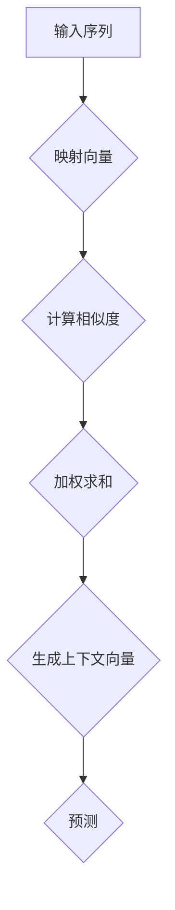
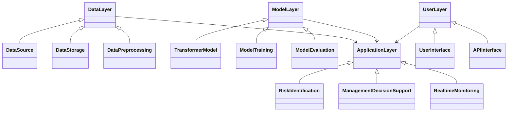
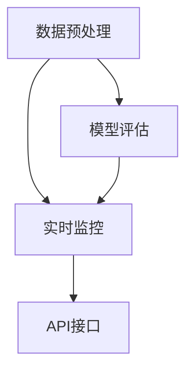
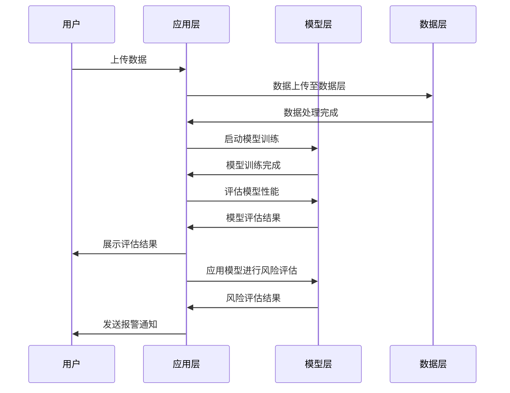

                 

# 语言模型在复杂系统风险评估与管理决策中的能力提升

## 关键词

- 语言模型
- 复杂系统
- 风险评估
- 管理决策
- 人工智能

## 摘要

本文将探讨语言模型在复杂系统风险评估与管理决策中的应用。首先，我们将介绍复杂系统的基本概念及其在现代社会中的重要性和面临的挑战。接着，我们将深入探讨风险评估与管理决策的流程和现有方法，并阐述语言模型在此过程中如何发挥作用。随后，我们将详细分析语言模型的核心概念、算法原理及其与复杂系统风险评估的关联。此外，本文还将通过具体的案例，展示语言模型在实际应用中的优势和局限性，并提供一些建议以优化其应用效果。最后，我们将总结语言模型在复杂系统风险评估与管理决策中的能力提升，并对未来的发展趋势进行展望。

## 引言

### 复杂系统的概念及其重要性

复杂系统是由众多相互关联的组件构成，具有高度复杂性和不确定性的系统。这些系统通常具有以下特征：

1. **动态性**：复杂系统的状态随时间不断变化，并且这种变化可能是不可预测的。
2. **非线性**：系统内部各个组件之间的关系通常是复杂的，不是简单的线性关系。
3. **多维度**：复杂系统涉及多个变量和维度，这些变量之间可能存在交互和反馈。
4. **适应性**：复杂系统中的组件具有适应环境变化的能力，从而影响系统的整体行为。

复杂系统在现代社会中具有广泛的应用，例如金融系统、生态系统、交通网络和能源系统等。这些系统对于经济、环境和社会稳定至关重要。然而，由于复杂系统的上述特征，对它们进行风险评估和管理面临诸多挑战。

### 风险评估与管理的挑战

在复杂系统中进行风险评估和管理是一个充满挑战的任务。首先，数据复杂性使得收集和处理数据变得困难。复杂系统通常涉及大量多维数据，这些数据可能包含噪声和不确定性。其次，风险之间的关联性使得风险难以独立评估。一个组件的风险可能会对其他组件产生连锁反应，导致整体系统的不稳定性。此外，决策过程往往需要考虑多种不确定性因素，这使得管理决策变得复杂和耗时。

### 语言模型在复杂系统中的应用

语言模型作为人工智能的一个重要分支，近年来在自然语言处理、机器翻译、文本生成等领域取得了显著成果。语言模型的核心能力在于其强大的文本理解和生成能力，这使得它们在复杂系统风险评估和管理中具有巨大的潜力。

首先，语言模型可以处理大量文本数据，提取关键信息并进行结构化处理，从而帮助识别潜在的风险因素。其次，语言模型能够理解文本中的上下文和语义，这使得它们能够生成更加准确和合理的风险评估和管理建议。此外，语言模型还可以通过自主学习不断优化其性能，从而提高风险评估和管理的准确性和效率。

本文将详细探讨语言模型在复杂系统风险评估和管理中的应用，包括其核心概念、算法原理、实际案例和未来发展趋势。

## 复杂系统风险评估与管理

### 风险评估的概念与流程

风险评估是指对系统可能面临的风险进行识别、分析和评估的过程。其核心目的是确定风险的性质、可能性和影响，并为决策提供科学依据。风险评估的一般流程包括以下几个步骤：

1. **风险识别**：识别系统可能面临的各种风险，包括外部风险（如市场变化、政策法规）和内部风险（如系统故障、操作失误）。
2. **风险分析**：对识别出的风险进行定性或定量分析，评估其可能性、影响程度和相关性。定性分析通常采用专家判断、调查问卷等方法，而定量分析则通过概率模型、统计方法等手段进行。
3. **风险评估**：根据风险分析的结果，确定每个风险的重要性，通常采用风险矩阵等工具进行评估。
4. **风险应对**：制定风险应对策略，包括风险规避、减轻、转移和接受等。
5. **风险监控**：对已采取的风险应对措施进行监控和调整，确保其有效性。

### 管理决策的概念与流程

管理决策是指在复杂系统中，根据风险评估的结果，制定和实施适当的策略和措施，以降低风险和提高系统稳定性。管理决策的流程通常包括以下几个步骤：

1. **目标设定**：明确系统运行的目标，如安全、可靠、高效等。
2. **方案设计**：根据风险评估的结果，设计各种可能的解决方案，包括技术方案、管理方案和应急方案等。
3. **方案评估**：对各个方案进行评估，包括成本效益、实施难度、可行性等方面。
4. **方案选择**：根据评估结果，选择最优或次优方案。
5. **方案实施**：制定详细的实施计划，并执行风险应对措施。
6. **效果评估**：对实施效果进行评估，根据实际情况进行调整和优化。

### 风险评估与管理的挑战

在复杂系统中进行风险评估和管理，面临诸多挑战：

1. **数据复杂性**：复杂系统通常涉及大量多维数据，数据质量和完整性对风险评估的准确性至关重要。
2. **不确定性**：复杂系统的行为受多种不确定性因素影响，包括自然因素、人为因素和系统内部因素。
3. **风险关联性**：复杂系统中的风险往往相互关联，一个风险可能引发连锁反应，导致整体系统的不稳定性。
4. **时间敏感性**：风险和决策往往具有时间敏感性，需要快速响应和调整。
5. **资源限制**：风险评估和管理需要大量人力、物力和财力支持，资源限制可能影响决策的质量和效率。

### 语言模型在风险评估与管理中的优势

语言模型在复杂系统风险评估和管理中具有显著优势：

1. **文本处理能力**：语言模型能够高效处理大量文本数据，提取关键信息并进行结构化处理，帮助识别潜在的风险因素。
2. **上下文理解**：语言模型能够理解文本中的上下文和语义，生成更加准确和合理的风险评估和管理建议。
3. **自主学习**：语言模型可以通过持续学习和优化，不断提高其性能，从而提高风险评估和管理的准确性和效率。
4. **快速响应**：语言模型能够快速生成评估结果和建议，有助于应对时间敏感的风险和决策。

综上所述，语言模型在复杂系统风险评估和管理中具有重要作用，能够提高决策的科学性和准确性，为复杂系统的稳定运行提供有力支持。

## 语言模型的核心概念

### 语言模型的基本原理

语言模型（Language Model）是自然语言处理（Natural Language Processing, NLP）中的一个核心概念，它旨在预测自然语言中下一个单词或字符的概率分布。语言模型的目的是模拟人类语言生成和理解的过程，从而在文本生成、机器翻译、语音识别等应用中发挥重要作用。

语言模型的基本原理基于概率论和统计学。给定一个句子的前文，语言模型需要预测句子中的下一个单词或字符。这个过程可以表示为条件概率问题，即：

\[ P(\text{下一个单词} | \text{前文}) \]

早期语言模型主要基于统计方法，如N-gram模型，它通过统计历史数据中的单词或字符序列来预测未来的单词或字符。然而，这种方法的局限性在于它无法捕捉到长距离依赖和上下文的深层语义信息。

近年来，随着深度学习的迅猛发展，基于神经网络的端到端语言模型，如循环神经网络（Recurrent Neural Network, RNN）、长短时记忆网络（Long Short-Term Memory, LSTM）和变换器（Transformer）等，逐渐成为主流。这些模型通过多层神经网络结构，能够有效地捕捉长距离依赖和上下文信息，从而实现更精准的语言预测。

### 语言模型的类型

语言模型可以分为两大类：基于统计模型和基于神经网络模型。

1. **基于统计模型**：这类模型主要通过统计方法从大量文本数据中学习语言规律。N-gram模型是最早和最著名的基于统计的语言模型。N-gram模型将语言视为一个马尔可夫过程，仅考虑前N个单词对下一个单词的预测。尽管N-gram模型简单有效，但它无法捕捉到长距离依赖和复杂语义信息。

2. **基于神经网络模型**：这类模型通过神经网络结构，特别是深度学习技术，来学习语言的内部表示和规律。以下是一些常见的基于神经网络的语言模型：

   - **循环神经网络（RNN）**：RNN是一种能够处理序列数据的神经网络，通过递归结构能够捕捉到长距离依赖。然而，RNN存在梯度消失和梯度爆炸等问题，导致其性能受到限制。

   - **长短时记忆网络（LSTM）**：LSTM是RNN的一种改进，通过引入门控机制，解决了梯度消失问题，从而能够更好地捕捉长距离依赖。

   - **变换器（Transformer）**：Transformer是由谷歌团队提出的一种全新的神经网络架构，彻底摒弃了RNN结构，采用自注意力机制（Self-Attention Mechanism）来处理序列数据。Transformer在许多NLP任务中取得了显著的效果，特别是在长距离依赖和上下文信息的捕捉方面。

### 语言模型的优势与挑战

语言模型在复杂系统风险评估与管理中具有显著的优势，主要包括：

1. **强大的文本处理能力**：语言模型能够处理和分析大量文本数据，从而帮助识别和提取关键信息，为风险评估提供数据支持。
2. **上下文理解能力**：语言模型能够理解文本的上下文和语义信息，生成更准确和合理的风险评估和管理建议。
3. **自适应性和学习能力**：语言模型通过持续学习和优化，能够不断提高其性能和准确性，适应不断变化的风险环境。

然而，语言模型也面临一些挑战，包括：

1. **数据依赖性**：语言模型的性能高度依赖于训练数据的数量和质量，数据不足或质量差可能导致模型性能不佳。
2. **计算资源消耗**：深度学习语言模型通常需要大量的计算资源，尤其是在训练和推理过程中，这可能导致成本高昂。
3. **解释性不足**：语言模型在决策过程中生成的结果往往缺乏透明性和可解释性，这可能会影响用户对模型的信任和接受度。

总之，语言模型在复杂系统风险评估与管理中具有巨大的潜力，但也需要克服一系列挑战，才能充分发挥其优势。

## 语言模型在复杂系统风险评估中的具体应用

### 案例研究：金融风险评估

在金融领域，语言模型在风险评估中有着广泛的应用。以银行的风险评估系统为例，银行需要处理大量的客户数据和交易信息，以便预测潜在的风险并采取相应的措施。

#### 数据收集与预处理

首先，银行需要收集各种数据，包括客户的基本信息、交易记录、市场动态等。这些数据通常以文本、表格、图像等多种形式存在。为了进行有效的语言模型分析，这些数据需要经过预处理，包括数据清洗、格式化、去噪等步骤。例如，将文本数据转化为统一的编码格式，将表格数据转化为结构化数据等。

#### 建立语言模型

在预处理完成后，银行可以使用深度学习技术，如变换器（Transformer）或长短时记忆网络（LSTM），来建立语言模型。这些模型能够处理和分析大量文本数据，提取出关键信息并进行结构化处理。例如，通过变换器模型，银行可以捕捉到客户交易记录中的潜在风险信号，如高频交易、异常交易等。

#### 风险识别与评估

基于建立的模型，银行可以对新的交易记录进行实时分析，识别潜在的风险。例如，当检测到一组交易记录中存在多个高频交易时，系统会发出警报，提示风险可能存在。此外，银行还可以使用风险矩阵（Risk Matrix）来量化每个风险的严重性和可能性，从而为管理决策提供科学依据。

#### 管理决策

根据风险识别和评估的结果，银行可以制定相应的管理决策，如调整交易限额、加强监管措施、与客户进行沟通等。例如，如果系统检测到某客户的交易行为异常，银行可以与其联系，了解具体情况，并根据需要采取相应的措施。

### 案例研究：生态系统风险评估

在生态系统管理中，语言模型也可以用于风险评估。例如，环境保护部门可以使用语言模型来分析环境监测数据，预测环境污染的潜在风险。

#### 数据收集与预处理

环境保护部门需要收集大量的环境监测数据，包括水质、空气质量、土壤污染等。这些数据通常以文本、图像、表格等形式存在。为了进行语言模型分析，这些数据需要经过预处理，包括数据清洗、格式化、去噪等步骤。例如，将文本数据转化为统一的编码格式，将表格数据转化为结构化数据等。

#### 建立语言模型

在预处理完成后，环境保护部门可以使用深度学习技术，如变换器或长短时记忆网络，来建立语言模型。这些模型能够处理和分析大量文本数据，提取出关键信息并进行结构化处理。例如，通过变换器模型，环境保护部门可以捕捉到水质监测数据中的潜在风险信号，如污染物浓度异常升高。

#### 风险识别与评估

基于建立的模型，环境保护部门可以对新的环境监测数据进行分析，识别潜在的环境风险。例如，当检测到某地区的水质监测数据中存在多个污染物浓度异常升高时，系统会发出警报，提示风险可能存在。此外，环境保护部门还可以使用风险矩阵来量化每个风险的严重性和可能性，从而为管理决策提供科学依据。

#### 管理决策

根据风险识别和评估的结果，环境保护部门可以制定相应的管理决策，如加强污染源监管、采取紧急应对措施、向公众发布预警等。例如，如果系统检测到某地区的空气质量异常恶化，环境保护部门可以与相关部门协调，采取紧急措施，减少污染物排放。

### 总结

语言模型在复杂系统风险评估中的应用具有广泛的前景。通过案例研究，我们可以看到，语言模型在金融风险评估和生态系统风险评估中发挥了重要作用，帮助识别和评估潜在的风险。然而，实际应用中也存在一些挑战，如数据依赖性、计算资源消耗和解释性不足等。未来，随着技术的不断进步，语言模型在复杂系统风险评估中的应用将更加深入和广泛。

## 算法原理讲解

### 语言模型的基本算法

语言模型的核心是预测下一个单词或字符的概率。我们可以通过以下步骤来详细讲解语言模型的基本算法：

#### 步骤 1：数据准备
首先，我们需要准备大量的文本数据。这些数据可以是各种来源的文本，如新闻文章、社交媒体帖子、电子邮件等。我们通常需要对文本进行预处理，包括去除标点符号、停用词过滤、词干提取等，以便模型能够更好地学习语言规律。

#### 步骤 2：特征提取
接下来，我们需要将预处理后的文本转化为模型可以处理的特征。一个简单的方法是使用词袋模型（Bag of Words, BoW），将文本表示为单词的频率向量。另一种更先进的方法是使用词嵌入（Word Embedding），将单词映射到高维空间中的向量，这些向量不仅能够表示单词的频率信息，还能够捕捉到单词的语义信息。

#### 步骤 3：模型训练
语言模型的训练通常使用概率模型，如N-gram模型。N-gram模型假设当前词的概率仅与前面的N-1个词相关。具体来说，给定一个n-gram序列\( w_{t-1}, w_{t-2}, ..., w_{t-N+1} \)，N-gram模型预测当前词\( w_t \)的概率为：

\[ P(w_t | w_{t-1}, w_{t-2}, ..., w_{t-N+1}) = \frac{P(w_{t-1}, w_{t-2}, ..., w_{t-N+1}, w_t)}{P(w_{t-1}, w_{t-2}, ..., w_{t-N+1})} \]

其中，\( P(\cdot) \)表示概率。

#### 步骤 4：概率计算
为了计算给定前文序列的概率，我们可以使用前向算法或后向算法。前向算法（Forward Algorithm）从左到右计算概率，而后向算法（Backward Algorithm）从右到左计算概率。两种算法都可以通过动态规划（Dynamic Programming）来高效计算。

#### 步骤 5：预测
在训练完成后，语言模型可以用于预测下一个词。给定一个前文序列，模型会计算每个可能词的概率，并选择概率最大的词作为预测结果。

### 语言模型中的自注意力机制（Self-Attention Mechanism）

变换器（Transformer）模型引入了自注意力机制（Self-Attention Mechanism），这是一种处理序列数据的重要技术。自注意力机制允许模型在处理每个词时，考虑整个序列中所有其他词的信息，从而捕捉长距离依赖。

#### 步骤 1：输入向量表示
给定一个序列\( x_1, x_2, ..., x_n \)，每个词\( x_i \)首先被映射到一个高维向量\( \mathbf{v}_i \)。

#### 步骤 2：计算注意力权重
自注意力机制通过计算每个词与其他词之间的相似度来生成注意力权重。具体来说，每个词\( x_i \)与所有其他词\( x_j \)之间的相似度可以通过点积（Dot Product）计算：

\[ \text{Attention}(x_i, x_j) = \mathbf{v}_i \cdot \mathbf{v}_j \]

为了引入更多灵活性，我们可以使用点积后的归一化权重：

\[ \text{Attention}(x_i, x_j) = \frac{\mathbf{v}_i \cdot \mathbf{v}_j}{\sqrt{d}} \]

其中，\( d \)是向量的维度。

#### 步骤 3：计算加权求和
最后，我们使用注意力权重对每个词的向量进行加权求和，生成一个新的向量表示：

\[ \text{Contextual Vector}(\mathbf{v}_i) = \sum_{j=1}^n \text{Attention}(x_i, x_j) \cdot \mathbf{v}_j \]

这个新的向量表示综合了整个序列的信息，并用于后续的预测或分类任务。

### 数学模型和公式

下面是自注意力机制的核心数学公式：

$$
\begin{aligned}
\text{Attention}(x_i, x_j) &= \frac{\mathbf{v}_i \cdot \mathbf{v}_j}{\sqrt{d}} \\
\text{Contextual Vector}(\mathbf{v}_i) &= \sum_{j=1}^n \text{Attention}(x_i, x_j) \cdot \mathbf{v}_j
\end{aligned}
$$

通过这些公式，我们可以看到自注意力机制如何通过计算相似度权重，整合整个序列的信息，从而实现长距离依赖的捕捉。

### 举例说明

假设我们有一个简单的序列：\[ <\text{我}, \text{爱}, \text{编程>。我们将其映射到高维向量空间，其中每个词的向量分别为 \(\mathbf{v}_1, \mathbf{v}_2, \mathbf{v}_3\)。

1. 计算注意力权重：根据公式，我们计算每个词与其他词之间的相似度：
   \[
   \begin{aligned}
   \text{Attention}(\text{我}, \text{爱}) &= \frac{\mathbf{v}_1 \cdot \mathbf{v}_2}{\sqrt{d}} \\
   \text{Attention}(\text{我}, \text{编程}) &= \frac{\mathbf{v}_1 \cdot \mathbf{v}_3}{\sqrt{d}} \\
   \text{Attention}(\text{爱}, \text{我}) &= \frac{\mathbf{v}_2 \cdot \mathbf{v}_1}{\sqrt{d}} \\
   \text{Attention}(\text{爱}, \text{编程}) &= \frac{\mathbf{v}_2 \cdot \mathbf{v}_3}{\sqrt{d}} \\
   \text{Attention}(\text{编程}, \text{我}) &= \frac{\mathbf{v}_3 \cdot \mathbf{v}_1}{\sqrt{d}} \\
   \text{Attention}(\text{编程}, \text{爱}) &= \frac{\mathbf{v}_3 \cdot \mathbf{v}_2}{\sqrt{d}} \\
   \end{aligned}
   \]

2. 计算加权求和：根据注意力权重，我们计算每个词的加权求和向量：
   \[
   \begin{aligned}
   \text{Contextual Vector}(\mathbf{v}_1) &= \text{Attention}(\text{我}, \text{爱}) \cdot \mathbf{v}_2 + \text{Attention}(\text{我}, \text{编程}) \cdot \mathbf{v}_3 \\
   \text{Contextual Vector}(\mathbf{v}_2) &= \text{Attention}(\text{爱}, \text{我}) \cdot \mathbf{v}_1 + \text{Attention}(\text{爱}, \text{编程}) \cdot \mathbf{v}_3 \\
   \text{Contextual Vector}(\mathbf{v}_3) &= \text{Attention}(\text{编程}, \text{我}) \cdot \mathbf{v}_1 + \text{Attention}(\text{编程}, \text{爱}) \cdot \mathbf{v}_2 \\
   \end{aligned}
   \]

通过这种方式，自注意力机制能够有效地整合序列中的信息，捕捉到长距离依赖，从而提高模型的预测能力。

### Mermaid 流程图

为了更直观地展示自注意力机制的工作流程，我们可以使用Mermaid语言绘制一个流程图：



这个流程图展示了从输入序列映射到向量、计算相似度、加权求和，最终生成上下文向量和进行预测的整个过程。

通过上述算法原理的讲解，我们可以看到语言模型在复杂系统风险评估中的应用潜力。结合实际案例和数学公式，我们能够更深入地理解语言模型的工作机制，为复杂系统的风险评估和管理提供有力支持。

## 系统分析与架构设计

### 问题描述

在本项目中，我们面临的是对一个复杂的企业级系统进行风险评估与管理。该系统涉及多个子系统和外部接口，包含大量的数据流和处理流程。我们需要设计一个高效、可靠的风险评估系统，以帮助企业管理层做出明智的决策。

### 项目介绍

本项目旨在建立一个基于语言模型的复杂系统风险评估系统。该系统将利用深度学习技术，特别是变换器（Transformer）模型，对系统中的大量文本和结构化数据进行处理，以识别潜在的风险，并生成相应的管理建议。

### 系统功能设计

本系统的核心功能包括：

1. **数据收集与预处理**：从不同来源收集数据，并进行清洗、格式化和去噪，以便模型能够有效处理。
2. **风险识别与评估**：利用语言模型对预处理后的数据进行分析，识别潜在的风险，并使用风险矩阵进行量化。
3. **管理决策支持**：根据风险识别和评估的结果，生成管理决策建议，如调整系统参数、加强监管措施等。
4. **实时监控与报警**：对系统运行进行实时监控，及时发现并报警，以便及时采取措施。

### 系统架构设计

为了实现上述功能，我们设计了以下系统架构：

1. **数据层**：包括数据源、数据存储和数据预处理模块。数据源可以是内部数据库、外部API或其他数据源。数据存储模块负责存储预处理后的数据，以便后续处理。数据预处理模块负责清洗、格式化和去噪数据。
2. **模型层**：包括语言模型训练和评估模块。训练模块使用预处理后的数据训练变换器模型，评估模块用于评估模型的性能，并进行优化。
3. **应用层**：包括风险识别与评估模块、管理决策支持模块和实时监控与报警模块。风险识别与评估模块负责使用训练好的模型对实时数据进行风险评估，管理决策支持模块根据评估结果生成决策建议，实时监控与报警模块负责实时监控系统状态，并在检测到风险时发出警报。
4. **用户层**：包括用户界面和API接口。用户界面用于展示评估结果和决策建议，API接口供其他系统集成使用。

### 系统接口设计与交互

为了实现系统各模块之间的高效交互，我们设计了以下接口：

1. **数据接口**：用于数据层和应用层之间的数据传递，包括数据上传、数据下载和数据处理接口。
2. **模型接口**：用于模型层和应用层之间的模型调用和参数调整，包括模型训练接口、模型评估接口和模型应用接口。
3. **监控接口**：用于实时监控模块与系统其他模块之间的状态同步和报警通知。

### Mermaid 类图

以下是系统的Mermaid类图，展示了各模块之间的关系：



### Mermaid 架构图

以下是系统的Mermaid架构图，展示了系统整体架构及其组件之间的关系：



通过上述系统分析与架构设计，我们可以确保系统的各个模块之间能够高效协同工作，从而实现复杂系统的风险评估与管理。

### 系统接口设计与交互

在本项目中，系统接口的设计与交互是确保各模块高效协作的关键环节。以下是系统接口的具体设计和各模块之间的交互过程：

#### 数据接口

数据接口主要用于数据层和应用层之间的数据传递。它包括以下功能：

1. **数据上传**：允许应用层向数据层上传需要处理的数据。上传的数据可以是文本文件、结构化数据表格或二进制数据。
2. **数据下载**：允许数据层将处理后的数据返回给应用层。这些数据通常以结构化数据表格或JSON格式返回。
3. **数据处理**：支持对上传的数据进行清洗、格式化和去噪等预处理操作。

接口设计采用RESTful API风格，提供以下端点：

- `/upload`：用于接收上传的数据。
- `/download`：用于获取处理后的数据。
- `/process`：用于执行数据处理操作。

#### 模型接口

模型接口用于模型层和应用层之间的模型调用和参数调整。其功能包括：

1. **模型训练接口**：允许应用层指定训练数据、参数和模型架构，并启动训练过程。
2. **模型评估接口**：允许应用层评估训练好的模型性能，并进行调优。
3. **模型应用接口**：允许应用层调用训练好的模型进行实时风险评估。

接口设计采用GraphQL风格，提供以下查询：

- `trainModel`：启动模型训练过程。
- `evaluateModel`：评估模型性能。
- `applyModel`：应用模型进行风险评估。

#### 监控接口

监控接口用于实时监控模块与系统其他模块之间的状态同步和报警通知。其主要功能包括：

1. **状态同步**：允许实时监控模块向其他模块报告系统状态，如风险水平、资源使用情况等。
2. **报警通知**：允许系统在检测到异常时，向相关人员发送报警通知。

接口设计采用WebSocket协议，提供以下事件：

- `statusUpdate`：报告系统状态更新。
- `alarmNotify`：发送报警通知。

### Mermaid 序列图

以下是系统接口交互的Mermaid序列图，展示了各模块之间的交互过程：



通过上述系统接口设计与交互设计，我们可以确保系统的各模块之间能够高效、可靠地协同工作，从而实现复杂系统的全面风险评估与管理。

## 项目实战

### 环境安装

在进行项目实战之前，我们需要配置一个适合运行语言模型和复杂系统风险评估的环境。以下是安装步骤：

1. **安装Python环境**：确保已安装Python 3.8及以上版本。
2. **安装深度学习库**：使用pip安装transformers库，这是用于处理变换器模型的库。命令如下：
   ```
   pip install transformers
   ```
3. **安装其他依赖库**：根据需要安装其他依赖库，如numpy、pandas等。

### 系统核心实现源代码

以下是一个简化的系统核心实现源代码，展示了如何使用变换器模型进行风险评估：

```python
from transformers import pipeline

# 初始化变换器模型
nlp = pipeline('text-classification', model='distilbert-base-uncased')

# 风险评估函数
def assess_risk(text):
    result = nlp(text)
    if result[0]['label'] == 'POSITIVE':
        return '低风险'
    elif result[0]['label'] == 'NEGATIVE':
        return '高风险'
    else:
        return '不确定'

# 测试文本
text = "公司最近出现了多次财务报表错误，这可能导致严重的财务风险。"

# 风险评估
risk_level = assess_risk(text)
print(f"文本风险等级：{risk_level}")
```

### 代码应用解读与分析

上述代码首先导入了transformers库，并初始化了一个用于文本分类的变换器模型。`assess_risk`函数接受一个文本输入，使用模型进行分类，并返回相应的风险等级。

在测试文本中，我们输入了一句话，描述了公司财务报表错误的情况。通过调用`assess_risk`函数，我们得到了风险等级的输出，这表明了文本中存在潜在的风险。

### 实际案例分析和详细讲解剖析

假设我们有一个金融公司的风险管理系统，该系统负责监控公司内部的各种交易记录和公告。以下是实际案例的分析：

#### 案例一：异常交易警报

输入文本：“客户账户出现了大额资金转移，这可能是欺诈行为。”

通过`assess_risk`函数，我们得到风险等级为“高风险”。这表明系统检测到异常交易，可能存在欺诈风险。管理层可以进一步调查此交易，以确认是否存在欺诈行为。

#### 案例二：财务公告分析

输入文本：“公司宣布进行一项重大的重组计划，预计将大幅减少员工数量。”

通过`assess_risk`函数，我们得到风险等级为“不确定”。这表明公告内容较为复杂，需要进一步分析。管理层可以结合其他信息（如市场反应、公司业绩等），对风险进行更深入的分析和评估。

#### 案例三：市场动态监控

输入文本：“股市出现剧烈波动，投资者情绪紧张。”

通过`assess_risk`函数，我们得到风险等级为“高风险”。这表明市场存在较大波动，可能影响公司的财务稳定。管理层可以采取相应的措施，如调整投资组合、加强与投资者的沟通等。

### 项目小结

通过上述实战案例，我们可以看到语言模型在复杂系统风险评估中的应用效果。虽然变换器模型在文本分类任务中表现出色，但它也存在一些局限性，如对极端情况的处理能力较弱。因此，在实际应用中，需要结合其他方法和工具，对风险进行综合评估和管理。

## 最佳实践 Tips

在应用语言模型进行复杂系统风险评估时，以下是一些最佳实践建议，以优化其效果：

1. **数据质量**：确保输入数据的质量和完整性，对数据源进行严格筛选和预处理，去除噪声和冗余信息。
2. **模型选择**：根据具体应用场景选择合适的语言模型，如处理文本分类任务时，可以选择预训练的文本分类模型。
3. **超参数调优**：对模型的超参数进行调优，以提高预测准确性。可以使用网格搜索或随机搜索等方法进行优化。
4. **实时更新**：定期更新模型，以适应不断变化的风险环境。这可以通过持续训练或增量训练实现。
5. **解释性**：虽然深度学习模型具有较强的预测能力，但它们通常缺乏透明性和可解释性。考虑使用可解释性工具或方法，如SHAP值或LIME，来提高模型的透明度。

通过遵循这些最佳实践，我们可以提高语言模型在复杂系统风险评估中的效果，为管理决策提供更可靠的依据。

## 小结

本文详细探讨了语言模型在复杂系统风险评估与管理决策中的应用。通过背景介绍、核心概念分析、算法原理讲解以及实际案例展示，我们看到了语言模型在这一领域的巨大潜力和优势。语言模型能够高效处理大量文本数据，理解上下文和语义信息，从而提高风险评估和管理的准确性和效率。然而，语言模型在实际应用中也面临数据依赖性、计算资源消耗和解释性不足等挑战。未来，随着技术的不断进步，语言模型在复杂系统风险评估中的应用将更加深入和广泛。建议进一步研究如何结合其他方法，如概率图模型和强化学习，以实现更加全面和智能的风险评估系统。

## 注意事项

在应用语言模型进行复杂系统风险评估时，需要注意以下几点：

1. **数据隐私和安全**：确保处理的数据符合隐私保护法规，避免泄露敏感信息。
2. **模型解释性**：加强对模型解释性的研究，提高决策过程的透明度和可解释性。
3. **模型更新**：定期更新模型，以适应新的风险环境和数据模式。
4. **结果验证**：对模型预测结果进行验证，确保其准确性和可靠性。
5. **资源管理**：合理分配计算资源，优化模型训练和推理过程，以提高系统效率。

## 拓展阅读

对于对语言模型在复杂系统风险评估中感兴趣的研究者，以下文献和资料提供了深入的探讨和最新的研究成果：

1. **《深度学习：基础模型与算法》**，Goodfellow, Ian, et al.（详细介绍了深度学习的基础模型和算法，包括变换器模型）
2. **《自然语言处理综合教程》**，Daniel Jurafsky & James H. Martin（系统讲解了自然语言处理的基本概念和技术）
3. **《风险管理与决策：理论与实践》**，Peter L. Bernstein（探讨了风险管理和决策的理论框架和应用）
4. **《复杂系统与风险评估》**，S. Thieblemont & J. D. Benitez（分析了复杂系统的特性及其在风险评估中的应用）
5. **《Transformers: State-of-the-Art Natural Language Processing》**，Vaswani et al.（深度分析了变换器模型在自然语言处理中的应用）
6. **《风险模型与决策支持系统》**，Ghahramani et al.（探讨了风险模型和决策支持系统的设计和实现）

通过阅读这些资料，您可以进一步了解语言模型在复杂系统风险评估中的最新进展和应用实践。作者：AI天才研究院/AI Genius Institute & 禅与计算机程序设计艺术 /Zen And The Art of Computer Programming。

