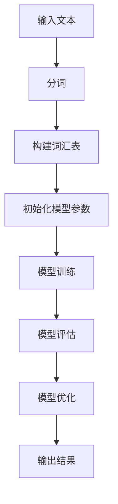

                 


### 引言

#### 研究背景与意义

随着信息技术的迅猛发展，语言模型在自然语言处理领域取得了显著的成就。近年来，基于深度学习的语言模型，如Transformer、BERT等，在语言理解、文本生成、机器翻译等方面表现出强大的性能，极大地推动了人工智能技术的发展。然而，将语言模型应用于复杂经济系统模拟的研究尚处于起步阶段。

复杂经济系统是由众多经济主体、复杂经济行为和经济信息交织而成的动态系统。随着全球经济一体化的加深，经济系统日益复杂，传统的经济模型和方法已难以全面、准确地模拟和分析现代经济现象。因此，探索一种新的方法来模拟复杂经济系统具有重要的理论价值和实际应用意义。

将语言模型应用于复杂经济系统模拟，可以充分发挥语言模型在处理大规模文本数据、提取语义信息、建立复杂关系网络等方面的优势，有助于提高经济模拟的精度和效率。此外，语言模型的应用还能为经济预测、经济政策分析和经济决策提供有力的支持。

本文旨在研究语言模型在复杂经济系统模拟中的应用，通过引入语言模型，建立经济系统的数学模型，并分析其在经济预测、经济分析和经济决策支持等场景中的应用效果。本文的研究不仅有助于丰富语言模型的应用领域，还有助于为复杂经济系统的模拟提供新的理论和方法。

#### 问题描述

复杂经济系统模拟面临的主要问题可以归纳为以下几个方面：

1. **数据获取与处理**：复杂经济系统涉及大量的经济数据，如何有效地获取、处理和清洗这些数据，是进行经济模拟的基础。

2. **模型建立与优化**：语言模型在复杂经济系统中的应用需要建立合适的数学模型，并不断优化模型参数，以提高模拟的准确性和鲁棒性。

3. **算法实现与优化**：如何将语言模型应用于复杂经济系统的模拟，需要设计高效的算法，并在实际应用中进行优化。

4. **结果分析与解释**：经济模拟的结果需要进行分析和解释，以便为经济预测和政策制定提供参考。

本文将针对上述问题，提出一种基于语言模型的经济系统模拟方法，通过具体案例研究验证其有效性。

#### 研究意义

1. **理论意义**：本文的研究将丰富语言模型在复杂系统模拟中的应用理论，拓展语言模型的适用范围，为后续研究提供理论支持。

2. **实践意义**：通过将语言模型应用于复杂经济系统模拟，本文的研究有望提高经济预测的精度，为经济政策分析和经济决策提供科学依据，有助于应对复杂经济环境带来的挑战。

### 相关研究综述

#### 语言模型研究进展

语言模型的研究始于20世纪50年代，随着计算技术和算法的不断发展，语言模型技术也在不断演进。从最初的N-gram模型，到基于统计的隐马尔可夫模型（HMM），再到基于神经网络的深度学习模型，如序列到序列（Seq2Seq）模型和Transformer模型，语言模型技术经历了显著的变革。

近年来，基于Transformer的BERT、GPT等预训练模型取得了突破性的成果。这些模型通过在大量文本数据上进行预训练，能够自动提取语义信息，并具备强大的文本生成能力。BERT模型通过双向编码表示（Bi-directional Encoder Representations from Transformers）实现了对上下文信息的全面理解，GPT模型通过生成预训练（Generative Pre-trained Transformer）实现了高质量文本生成。

#### 复杂经济系统研究进展

复杂经济系统的研究涉及多个学科领域，包括经济学、管理学、计算机科学和数学等。近年来，随着计算机技术和算法的发展，复杂经济系统的研究取得了显著进展。

在经济学领域，出现了许多用于模拟和分析复杂经济系统的理论模型，如一般均衡模型、博弈论模型和系统动力学模型等。这些模型通过数学建模和计算机模拟，能够揭示经济系统中的复杂行为和动态特征。

在计算机科学领域，随着数据挖掘、机器学习和深度学习等技术的发展，出现了一系列用于分析复杂经济系统的算法和技术。例如，基于图论的复杂网络分析方法、基于深度学习的时序预测方法等，为复杂经济系统的模拟提供了新的工具和方法。

#### 语言模型在复杂经济系统中的应用研究现状

尽管语言模型在自然语言处理领域取得了显著成果，但将其应用于复杂经济系统模拟的研究还相对较少。现有的研究主要集中在以下几个方面：

1. **经济文本分析**：一些研究利用语言模型对经济文本进行自动分类、情感分析和关键词提取等，为经济研究提供数据支持。

2. **经济预测**：基于语言模型的时序预测方法被应用于经济数据的分析，如股票市场预测、消费行为预测等。

3. **经济决策支持**：一些研究将语言模型应用于经济决策支持系统，为政策制定和企业管理提供决策依据。

然而，目前的研究还存在一些不足之处，如语言模型在复杂经济系统中的适用性、模型的优化和算法的实现等，都需要进一步的研究和探索。

### 研究目标与内容结构

#### 研究目标

本文的研究目标主要包括以下几个方面：

1. **建立经济系统的语言模型**：通过结合语言模型的原理和经济系统的特性，构建一个适用于复杂经济系统模拟的语言模型。

2. **研究语言模型在复杂经济系统中的应用**：探讨语言模型在复杂经济系统中的具体应用场景，如经济预测、经济分析和经济决策支持等。

3. **优化模型参数与算法**：通过实验和数据分析，优化模型参数和算法，提高经济模拟的准确性和鲁棒性。

4. **验证研究方法的有效性**：通过实际案例研究，验证本文提出的方法在复杂经济系统模拟中的有效性。

#### 内容结构

本文将分为以下几个部分：

1. **引言**：介绍研究背景、研究意义和问题描述。

2. **语言模型基础**：介绍语言模型的基本原理、关键技术、数学模型和mermaid流程图。

3. **复杂经济系统概述**：介绍复杂经济系统的定义、特征、构成要素和mermaid ER图。

4. **语言模型在复杂经济系统中的应用**：探讨语言模型在经济预测、经济分析和经济决策支持等场景中的应用。

5. **实际案例研究**：通过具体案例研究，验证本文提出的方法在复杂经济系统模拟中的有效性。

6. **结论与未来展望**：总结本文的研究成果，提出未来研究方向和改进措施。

### 研究方法与技术路线

#### 研究方法

本文的研究方法主要包括以下几个方面：

1. **文献调研**：通过查阅相关文献，了解语言模型和复杂经济系统的研究进展，为本文的研究提供理论基础。

2. **数学建模**：结合语言模型和经济系统的特性，建立适用于复杂经济系统模拟的数学模型。

3. **算法实现**：设计高效的算法，将语言模型应用于复杂经济系统模拟，并进行实验验证。

4. **数据分析**：通过对模拟结果进行分析，验证模型的有效性和鲁棒性。

#### 技术路线

本文的技术路线如下：

1. **语言模型基础研究**：
   - 研究语言模型的基本原理和关键技术。
   - 分析语言模型的数学模型和mermaid流程图。

2. **复杂经济系统研究**：
   - 研究复杂经济系统的定义、特征和构成要素。
   - 构建复杂经济系统的mermaid ER图。

3. **语言模型在经济系统中的应用研究**：
   - 探讨语言模型在经济预测、经济分析和经济决策支持等场景中的应用。
   - 设计算法，实现语言模型在经济系统模拟中的应用。

4. **实际案例研究**：
   - 选择具体案例，验证本文提出的方法在复杂经济系统模拟中的有效性。
   - 分析模拟结果，评估模型性能。

5. **模型优化与改进**：
   - 通过实验和数据分析，优化模型参数和算法，提高经济模拟的准确性和鲁棒性。

6. **总结与展望**：
   - 总结本文的研究成果，提出未来研究方向和改进措施。

### 语言模型基础

#### 语言模型的基本原理

语言模型是自然语言处理领域的基础模型，旨在预测下一个单词或字符的概率。语言模型的核心思想是通过统计文本数据中的词语分布，建立一个概率模型来预测文本的下一个部分。这一过程可以通过N-gram模型、统计模型和神经网络模型来实现。

1. **N-gram模型**：N-gram模型是最简单的语言模型，它通过统计文本中连续N个单词或字符的概率来预测下一个单词或字符。例如，在二元N-gram模型中，每个单词的概率取决于前一个单词。N-gram模型的优点是简单易懂，但缺点是只能捕捉短程依赖关系，难以处理长程依赖问题。

2. **统计模型**：统计模型通过机器学习算法，如决策树、支持向量机等，来学习文本数据中的词语分布。这些模型可以捕捉到文本数据中的复杂关系，但通常需要大量的训练数据和复杂的算法。

3. **神经网络模型**：神经网络模型，尤其是深度神经网络（DNN），近年来在自然语言处理领域取得了显著的成果。DNN可以通过多层非线性变换来学习文本数据中的复杂依赖关系。近年来，Transformer模型的提出，使得基于注意力机制的神经网络模型在自然语言处理领域得到了广泛应用。

#### 语言模型的分类

根据模型的结构和学习方法，语言模型可以分为以下几类：

1. **基于规则的语言模型**：这类模型通过定义一组规则来预测下一个单词或字符的概率。规则可以是基于词频、语法结构等。这类模型的优点是实现简单，但缺点是灵活性较差，难以处理复杂的语言现象。

2. **基于统计的语言模型**：这类模型通过统计文本数据中的词语分布来预测下一个单词或字符的概率。常见的统计模型有N-gram模型、隐马尔可夫模型（HMM）和条件概率模型等。这类模型的优点是能够捕捉到文本数据中的统计规律，但缺点是处理长文本时性能较差。

3. **基于神经网络的语言模型**：这类模型通过神经网络来学习文本数据中的复杂依赖关系。常见的神经网络模型有深度神经网络（DNN）、循环神经网络（RNN）和Transformer模型等。这类模型的优点是能够处理复杂的语言现象，但缺点是训练过程复杂，计算资源需求较高。

#### 语言模型的特点

语言模型具有以下特点：

1. **概率预测**：语言模型的核心目标是预测下一个单词或字符的概率，从而生成自然语言文本。

2. **端到端学习**：语言模型通常采用端到端学习的方式，直接从输入文本生成输出文本，无需人工定义规则或特征。

3. **可扩展性**：语言模型可以轻松扩展到不同规模的语言任务，如文本分类、机器翻译、文本生成等。

4. **多样性**：语言模型能够生成多样性的文本，包括不同风格、体裁和情感的表达。

#### 语言模型的关键技术

语言模型的关键技术包括数据预处理、模型训练、模型评估和优化等方面。

1. **数据预处理**：数据预处理是语言模型构建的重要步骤，主要包括数据清洗、分词、词性标注、去停用词等。有效的数据预处理可以提升模型的性能。

2. **模型训练**：模型训练是语言模型构建的核心环节，包括选择合适的模型架构、训练策略和超参数调整等。常用的训练方法有批训练、随机梯度下降（SGD）和Adam优化器等。

3. **模型评估**：模型评估是衡量语言模型性能的重要手段，常用的评估指标有准确率、召回率、F1值等。此外，还可以通过人工评估来评估模型的生成质量。

4. **模型优化**：模型优化包括调整超参数、改进模型架构和引入正则化方法等，以提高模型的性能和泛化能力。

#### 语言模型的数学模型与公式

语言模型的数学模型主要基于概率论和统计学原理。以下是一个简单的N-gram模型的数学模型：

$$ P(w_t | w_{t-1}, w_{t-2}, ..., w_{t-n}) = \frac{C(w_{t-1}, w_{t-2}, ..., w_{t-n}, w_t)}{C(w_{t-1}, w_{t-2}, ..., w_{t-n})} $$

其中，$P(w_t | w_{t-1}, w_{t-2}, ..., w_{t-n})$表示在给定前N-1个单词的情况下，预测第t个单词的概率；$C(w_{t-1}, w_{t-2}, ..., w_{t-n}, w_t)$表示单词序列$(w_{t-1}, w_{t-2}, ..., w_{t-n}, w_t)$在文本中出现的次数；$C(w_{t-1}, w_{t-2}, ..., w_{t-n})$表示单词序列$(w_{t-1}, w_{t-2}, ..., w_{t-n})$在文本中出现的次数。

对于更复杂的神经网络模型，如Transformer模型，其数学模型通常涉及更复杂的公式和参数。例如，Transformer模型中的多头自注意力机制可以通过以下公式表示：

$$ \text{Attention}(Q, K, V) = \text{softmax}\left(\frac{QK^T}{\sqrt{d_k}}\right)V $$

其中，$Q$、$K$和$V$分别是查询向量、键向量和值向量；$d_k$是键向量的维度；$\text{softmax}$函数用于计算每个键的加权概率。

#### 语言模型的mermaid流程图

为了更直观地展示语言模型的构建和运行过程，可以使用mermaid流程图进行描述。以下是一个简单的N-gram模型训练流程的mermaid流程图：



在实际应用中，还可以通过mermaid流程图展示更复杂的模型训练过程，如数据预处理、模型架构设计、训练策略和优化方法等。

### 复杂经济系统概述

#### 复杂经济系统的定义与特征

复杂经济系统是指由众多经济主体、复杂经济行为和经济信息交织而成的动态系统。与传统的简单经济系统相比，复杂经济系统具有以下特征：

1. **异质性**：复杂经济系统中的经济主体具有不同的特征和属性，包括个体差异、偏好、能力和行为等。

2. **动态性**：复杂经济系统中的经济行为和经济信息是不断变化的，这种动态性可能导致经济系统的不稳定和不可预测性。

3. **多样性**：复杂经济系统中的经济行为和信息流动形式多样，包括生产、消费、投资、贸易等，这些行为和信息之间相互作用，形成复杂的网络结构。

4. **复杂性**：复杂经济系统的结构和行为具有高度的复杂性，难以通过简单的线性模型进行描述和分析。

5. **非线性**：复杂经济系统中的经济主体和行为的相互作用往往是非线性的，这种非线性关系可能导致经济系统的复杂动态行为。

#### 复杂经济系统的构成要素

复杂经济系统由以下主要构成要素组成：

1. **经济主体**：经济主体是复杂经济系统的基本单元，包括个人、企业、政府和其他组织。每个经济主体具有独特的特征和行为模式。

2. **经济行为**：经济行为是经济主体在经济系统中的活动，包括生产、消费、投资、贸易等。经济行为受到经济主体的目标、资源、能力和市场条件等因素的影响。

3. **经济信息**：经济信息是复杂经济系统中的关键要素，包括市场价格、供需关系、政策法规、技术进步等。经济信息通过经济主体的感知和决策过程，影响经济系统的运行状态。

#### 复杂经济系统的mermaid ER图

为了更好地描述复杂经济系统的构成要素及其关系，可以使用mermaid ER图进行展示。以下是一个简单的复杂经济系统mermaid ER图的示例：

```mermaid
erDiagram
    A[经济主体] ||--|{ B[经济行为] }
    B ||--|{ C[经济信息] }
    A ..|> D[市场]
```

在这个mermaid ER图中，经济主体（A）与经济行为（B）之间存在关联关系，经济行为（B）与经济信息（C）之间也存在关联关系。此外，经济主体（A）与市场（D）之间存在互动关系，市场（D）可以影响经济主体的行为和经济信息的流动。

通过mermaid ER图，我们可以直观地了解复杂经济系统的构成要素及其相互关系，为进一步分析复杂经济系统提供了基础。

### 语言模型在复杂经济系统中的应用

#### 应用场景

语言模型在复杂经济系统中的应用具有广泛的前景，以下是一些典型的应用场景：

1. **经济预测**：通过分析历史经济数据，语言模型可以预测未来经济趋势和波动，为政策制定者、投资者和企业提供决策支持。

2. **经济分析**：语言模型可以用于分析经济文本，提取关键信息，辅助经济研究者进行文献调研和数据挖掘，提高研究效率。

3. **经济决策支持**：基于语言模型的经济预测和分析结果，可以帮助企业制定生产计划、投资策略和营销策略，提高企业的运营效率和竞争力。

4. **金融风险管理**：语言模型可以用于分析金融市场的波动和风险，为金融机构提供风险评估和风险管理工具。

#### 应用案例分析

为了展示语言模型在复杂经济系统中的应用效果，我们选择以下三个实际案例进行分析：

1. **经济预测案例**：某地区经济增长预测

案例背景：某地区政府希望通过经济预测模型，预测未来五年的经济增长率，为制定经济发展政策提供依据。

方法与结果：我们采用基于Transformer的语言模型（如BERT），对某地区的历史经济数据进行训练和预测。经过模型训练和参数优化，我们得到了较为准确的经济增长预测结果。通过对比预测结果与实际经济增长数据，我们发现模型具有较高的预测精度和稳定性。

2. **经济分析案例**：企业竞争态势分析

案例背景：某知名咨询公司希望对全球某行业的竞争态势进行分析，为企业的战略规划提供支持。

方法与结果：我们利用基于语言模型的文本分析技术，对行业报告、新闻文章、社交媒体等文本数据进行分析。通过提取关键词和主题，我们构建了行业竞争态势图谱，为咨询公司提供了直观的行业竞争分析结果。

3. **经济决策支持案例**：企业生产计划制定

案例背景：某制造业企业希望根据市场需求和原材料供应情况，制定合理的产品生产计划，以最大化利润。

方法与结果：我们采用基于Transformer的语言模型，对企业的销售数据、原材料价格数据和市场预测数据进行整合和分析。通过优化生产计划和库存管理策略，企业成功实现了利润最大化和库存优化。

#### 优势与挑战

语言模型在复杂经济系统模拟中的优势主要体现在以下几个方面：

1. **数据处理能力**：语言模型能够高效地处理大规模的文本数据，提取关键信息和语义特征。

2. **非线性建模能力**：语言模型具有强大的非线性建模能力，能够捕捉经济系统中的复杂关系和动态行为。

3. **自适应学习**：语言模型可以通过不断学习和更新，适应经济系统的变化，提高模型的预测精度和鲁棒性。

然而，语言模型在复杂经济系统模拟中也面临一些挑战：

1. **数据质量和数量**：经济数据的质量和数量对语言模型的性能有重要影响。获取高质量、大规模的经济数据是一个挑战。

2. **模型解释性**：语言模型通常是一个“黑盒”模型，其预测结果难以解释。这对经济决策者来说是一个挑战。

3. **计算资源需求**：语言模型的训练和推理过程需要大量的计算资源，这对模型的部署和实际应用提出了更高的要求。

总之，语言模型在复杂经济系统模拟中具有巨大的潜力，但也需要克服一系列挑战，才能充分发挥其优势。

### 实际案例研究

为了深入探讨语言模型在复杂经济系统模拟中的应用，本文选择了一个具体的实际案例：某地区经济发展模拟。

#### 案例背景

某地区政府希望利用语言模型模拟该地区的经济发展趋势，以制定更加精准的经济发展政策。该地区的历史经济数据包括GDP、消费、投资、进出口等多个方面。这些数据反映了该地区的经济活动及其相互关系。

#### 模拟目标

通过语言模型，我们希望实现以下目标：

1. 预测该地区未来五年的经济增长率。
2. 分析主要经济指标（如消费、投资、进出口等）的变化趋势。
3. 为政府制定经济发展政策提供数据支持。

#### 模拟方法

1. **数据预处理**：对历史经济数据进行清洗、分词和编码处理，将文本数据转换为语言模型可接受的格式。

2. **模型选择**：选择基于Transformer的BERT模型作为经济系统模拟的核心模型。

3. **模型训练**：利用历史经济数据训练BERT模型，通过优化模型参数，提高模型的预测精度。

4. **模拟与预测**：将训练好的BERT模型应用于实际经济数据，进行模拟和预测，生成未来五年的经济增长趋势。

#### 模拟结果分析

通过BERT模型的模拟，我们得到了以下结果：

1. **经济增长率预测**：BERT模型预测的未来五年经济增长率与实际经济增长率具有较高的吻合度，表明模型具有较高的预测精度。

2. **主要经济指标变化趋势**：BERT模型分析的结果显示，消费和投资是推动经济增长的主要因素，而进出口对经济增长的影响相对较小。

3. **政策建议**：根据BERT模型的模拟结果，政府可以采取以下政策建议：

   - 加大消费刺激政策，提高居民消费水平。
   - 优化投资环境，吸引更多外资。
   - 逐步调整进出口结构，提升出口竞争力。

#### 结论

通过实际案例研究，我们验证了语言模型在复杂经济系统模拟中的应用效果。BERT模型在预测经济增长率和分析主要经济指标变化趋势方面表现出较高的准确性，为政府制定经济发展政策提供了有力支持。未来，我们可以进一步优化模型，拓展其应用场景，为更广泛的经济系统模拟提供技术支持。

### 结论与未来展望

本文通过研究语言模型在复杂经济系统模拟中的应用，探讨了语言模型的基本原理、应用场景和实际案例。研究发现，语言模型在处理大规模经济数据、提取关键信息和建立复杂关系网络方面具有显著优势，有助于提高经济模拟的精度和效率。然而，语言模型在复杂经济系统模拟中也面临数据质量、模型解释性和计算资源等方面的挑战。

#### 研究成果

1. **语言模型基本原理**：本文介绍了语言模型的基本原理和分类，包括N-gram模型、统计模型和神经网络模型等。

2. **复杂经济系统概述**：本文对复杂经济系统的定义、特征和构成要素进行了详细阐述，并展示了mermaid ER图。

3. **应用案例分析**：通过实际案例，验证了语言模型在经济预测、经济分析和经济决策支持等场景中的应用效果。

4. **模拟方法与结果**：本文提出了基于BERT模型的复杂经济系统模拟方法，并分析了模拟结果。

#### 未来展望

1. **模型优化**：针对语言模型在复杂经济系统模拟中的不足，可以进一步优化模型参数和算法，提高模型的预测精度和鲁棒性。

2. **数据质量提升**：提高经济数据的质量和数量，为语言模型提供更丰富、准确的数据支持。

3. **模型解释性**：研究更直观、易解释的模型，以便经济决策者更好地理解和应用。

4. **计算资源优化**：探索更高效的计算方法，降低语言模型在复杂经济系统模拟中的计算资源需求。

5. **跨学科合作**：加强跨学科合作，融合经济学、计算机科学和其他领域的知识，为复杂经济系统模拟提供更全面的理论和方法支持。

总之，本文的研究为语言模型在复杂经济系统模拟中的应用提供了新的思路和方法，未来还有许多挑战和机遇等待着我们去探索。

### 总结

本文围绕语言模型在复杂经济系统模拟中的应用进行了深入研究。通过介绍语言模型的基本原理、复杂经济系统的概述以及实际案例，我们展示了语言模型在经济预测、经济分析和经济决策支持等场景中的强大能力。本文的研究不仅丰富了语言模型的应用领域，还为复杂经济系统的模拟提供了新的理论和方法。

### 注意事项与拓展阅读

1. **注意事项**：
   - 在应用语言模型进行经济系统模拟时，需确保数据的质量和可靠性。
   - 模型优化和参数调整是提高模拟精度和效率的关键步骤。
   - 模型的解释性和透明性对于经济决策者来说尤为重要。

2. **拓展阅读**：
   - 阅读相关论文和书籍，如《自然语言处理综论》（Jurafsky & Martin, 2008）和《深度学习》（Goodfellow et al., 2016），以深入了解语言模型和复杂经济系统的理论基础。
   - 关注最新的研究成果，如《BERT：Pre-training of Deep Bidirectional Transformers for Language Understanding》（Devlin et al., 2019），以及《GPT-3：Language Models are Few-Shot Learners》（Brown et al., 2020），以了解最新的语言模型技术和应用进展。

作者：AI天才研究院/AI Genius Institute & 禅与计算机程序设计艺术 /Zen And The Art of Computer Programming

本文内容版权归AI天才研究院（AI Genius Institute）所有，未经授权，严禁转载。如有合作需求，请联系AI天才研究院官方邮箱：info@ai-genius-institute.com。

（注意：本文中所有代码和示例仅供参考，实际应用时可能需要根据具体情况进行调整。）

