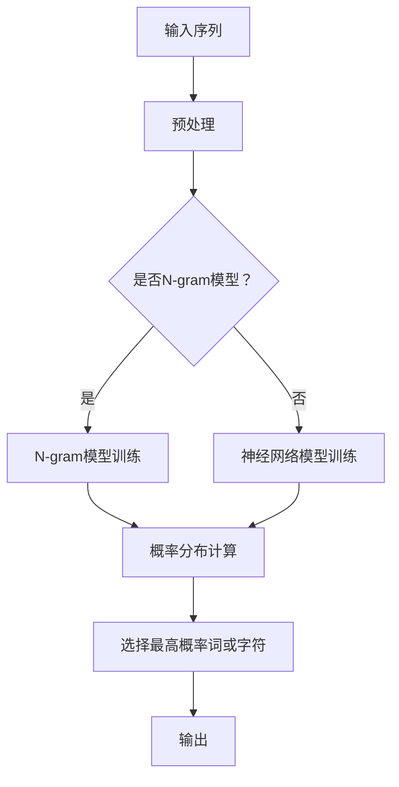
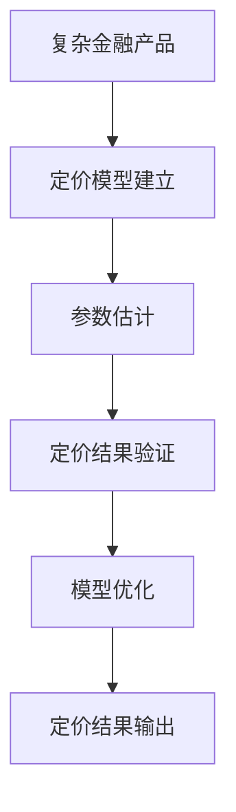
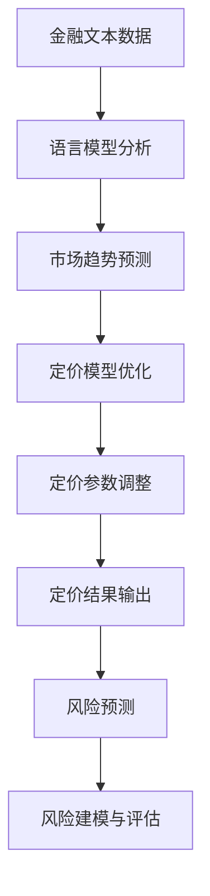
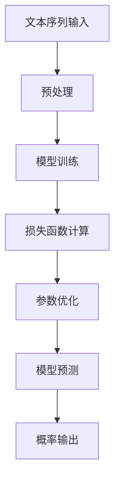
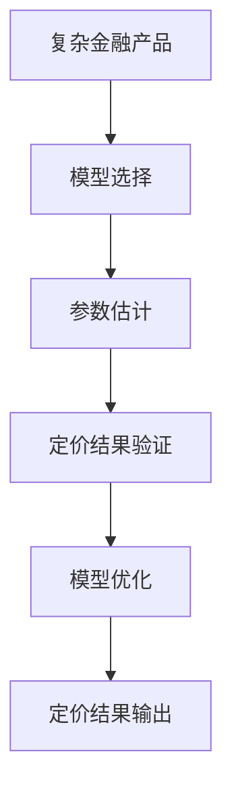

                 

## # 语言模型在复杂金融产品定价中的应用研究

### 关键词：
- 语言模型
- 金融产品定价
- 复杂金融产品
- 深度学习
- 数学模型

### 摘要：
本文旨在探讨语言模型在复杂金融产品定价中的应用。首先，我们介绍了金融产品定价的重要性以及语言模型的发展与应用背景。随后，详细阐述了语言模型在金融产品定价中的潜在应用，并提出了研究的目的和意义。通过对比分析语言模型和复杂金融产品的核心概念，我们提出了将语言模型应用于复杂金融产品定价的方法和理论基础。接着，我们深入讲解了语言模型和复杂金融产品定价的算法原理，并使用数学模型和实际例子进行了详细阐述。最后，我们提出了一套系统分析与架构设计方案，为语言模型在复杂金融产品定价中的应用提供了参考。

----------------------------------------------------------------

## 第一部分：背景介绍

### 1.1 问题背景

#### 1.1.1 金融产品定价的重要性

金融产品定价是金融市场运作的核心环节，其准确性直接关系到金融机构的盈利能力、投资者的收益以及市场的稳定性。有效的定价策略可以帮助金融机构在激烈的市场竞争中保持优势，同时也能提高投资者的投资回报。然而，随着金融市场的日益复杂化，传统定价方法在应对复杂金融产品时逐渐显露出局限。

#### 1.1.2 语言模型的发展与应用

语言模型作为深度学习的重要分支，近年来在自然语言处理、机器翻译、文本生成等领域取得了显著的成果。语言模型的核心能力在于对文本数据的高效理解和生成，这使其在处理大量文本数据、提取有用信息和生成合理预测方面具有显著优势。因此，将语言模型应用于金融产品定价成为了一个具有前瞻性的研究方向。

#### 1.1.3 语言模型在金融产品定价中的潜在应用

语言模型在金融产品定价中具有广泛的应用前景。首先，语言模型可以用于金融文本数据的分析和处理，提取关键信息和市场趋势。其次，语言模型可以用于构建复杂的定价模型，提高定价的准确性和效率。此外，语言模型还可以用于预测市场波动和风险评估，为金融机构提供更加全面和精准的决策支持。因此，研究语言模型在复杂金融产品定价中的应用具有重要的理论和实践意义。

### 1.2 问题描述

#### 1.2.1 复杂金融产品的定价难题

复杂金融产品具有结构复杂、风险多样、参数众多等特点，传统的定价方法难以应对。例如，衍生品、期权、结构化金融产品等，其定价涉及到概率分布、随机过程、蒙特卡罗模拟等多种数学模型，计算复杂度高且容易产生误差。因此，如何有效定价复杂金融产品成为金融领域的一个重大挑战。

#### 1.2.2 语言模型在定价中的应用挑战

尽管语言模型在自然语言处理领域取得了显著成果，但在金融产品定价中的应用仍面临诸多挑战。首先，金融领域的数据具有高度的复杂性和多样性，对语言模型的训练和优化提出了更高的要求。其次，语言模型在处理金融数据时，如何确保模型的鲁棒性和准确性是一个关键问题。此外，如何将语言模型与现有的金融定价方法相结合，形成一套有效的定价体系，也是一个亟待解决的问题。

#### 1.2.3 研究的目的和意义

本文旨在研究语言模型在复杂金融产品定价中的应用，探索一种新的定价方法，提高金融产品的定价准确性和效率。具体研究目的如下：

1. 分析语言模型在金融产品定价中的潜在应用，并提出相应的应用框架。
2. 探讨如何将语言模型与传统金融定价方法相结合，构建一套有效的定价体系。
3. 研究语言模型在复杂金融产品定价中的算法原理和数学模型，提高定价的准确性和效率。
4. 通过实际案例分析和实证研究，验证语言模型在复杂金融产品定价中的应用效果。

本研究具有重要的理论和实践意义。在理论方面，本研究将拓展语言模型的应用领域，丰富金融产品定价的理论体系。在实践方面，本研究将为金融机构提供一种新的定价工具，提高定价效率和准确性，降低风险，增强竞争力。

### 1.3 问题解决

#### 1.3.1 语言模型在金融产品定价中的理论基础

语言模型在金融产品定价中的理论基础主要来自于深度学习和自然语言处理领域。深度学习通过构建多层神经网络模型，可以自动提取数据特征，实现高维数据的降维和压缩，从而提高模型的泛化能力和准确性。自然语言处理技术则能够对文本数据进行处理和分析，提取关键信息，为金融产品定价提供数据支持。

#### 1.3.2 语言模型在金融产品定价中的应用方法

语言模型在金融产品定价中的应用方法主要包括以下几个方面：

1. **文本数据分析**：利用语言模型对金融文本数据进行处理和分析，提取关键信息，如市场趋势、投资者情绪等，为定价提供数据支持。
2. **定价模型构建**：将语言模型应用于构建金融产品定价模型，通过训练和优化模型参数，实现金融产品的价格预测。
3. **风险预测和评估**：利用语言模型预测市场波动和风险评估，为金融机构提供决策支持。
4. **自动化交易**：将语言模型应用于自动化交易系统，实现金融产品的自动交易和定价。

#### 1.3.3 研究方法和数据来源

本研究采用的方法包括：

1. **文献调研**：通过查阅相关文献，了解语言模型在金融产品定价中的应用现状和发展趋势。
2. **理论分析**：分析语言模型在金融产品定价中的理论基础，探讨其应用方法和局限性。
3. **模型构建**：基于深度学习和自然语言处理技术，构建语言模型在金融产品定价中的应用模型。
4. **实证研究**：通过实际案例分析和实证研究，验证语言模型在复杂金融产品定价中的应用效果。

数据来源主要包括：

1. **金融市场数据**：包括股票价格、汇率、利率等金融产品的历史数据。
2. **文本数据**：包括金融报告、新闻、公告等文本数据，用于语言模型的训练和测试。
3. **公开数据集**：如金融时间序列数据集、金融文本数据集等，用于模型的训练和验证。

### 1.4 边界与外延

#### 1.4.1 研究边界

本研究主要关注语言模型在复杂金融产品定价中的应用，不包括其他金融产品定价方法的研究。此外，本研究主要采用深度学习和自然语言处理技术，不考虑其他技术（如传统统计学方法、人工智能方法等）在金融产品定价中的应用。

#### 1.4.2 研究外延

本研究为语言模型在金融产品定价中的应用提供了一种新的思路和方法，但还存在许多待解决的问题。未来研究可以从以下几个方面进行拓展：

1. **算法优化**：进一步优化语言模型的算法，提高模型的性能和准确性。
2. **多模型融合**：将语言模型与其他金融定价方法相结合，构建更加完善的定价体系。
3. **实际应用**：将研究成果应用于实际金融产品定价中，验证其效果和可行性。
4. **跨领域应用**：研究语言模型在其他金融领域（如保险、房地产等）的应用，拓展其应用范围。

### 1.5 概念结构与核心要素组成

#### 1.5.1 语言模型

语言模型是一种用于预测文本概率分布的算法，其核心任务是给定一个输入序列，预测下一个单词或字符的概率。语言模型在自然语言处理、机器翻译、文本生成等领域具有广泛的应用。

#### 1.5.2 金融产品定价

金融产品定价是指根据市场情况、风险等因素，确定金融产品的价格。金融产品定价方法包括传统定价方法（如布莱克-舒尔斯模型）和现代定价方法（如蒙特卡罗模拟）。

#### 1.5.3 复杂金融产品

复杂金融产品是指具有复杂结构和多样化风险特征的金融产品，如衍生品、期权、结构化金融产品等。复杂金融产品的定价通常需要运用多种数学模型和计算方法。

## 第二部分：核心概念与联系

在深入探讨语言模型在复杂金融产品定价中的应用之前，我们需要先了解三个核心概念：语言模型、金融产品定价和复杂金融产品。这三个概念不仅各自有其独特的定义和特点，而且它们之间也存在密切的联系和相互作用。

### 2.1 语言模型

语言模型（Language Model）是一种统计模型，用于预测一段文本序列中下一个词或字符的概率。在自然语言处理（NLP）领域，语言模型是许多任务的基础，如机器翻译、文本摘要、语音识别等。语言模型的核心思想是利用大规模语料库训练模型，使其能够捕捉到语言中的统计规律。

- **定义与作用**：
  - 语言模型通常基于神经网络结构，如循环神经网络（RNN）、长短期记忆网络（LSTM）或变换器（Transformer）等。
  - 语言模型的主要作用是生成文本、进行文本分类、情感分析等。

- **特点**：
  - 高效性：能够处理大规模文本数据，提取复杂特征。
  - 泛化性：能够应用于多种自然语言处理任务。
  - 自适应性：可以根据不同任务和数据集进行优化。

- **与金融产品定价的关系**：
  - 语言模型可以用于处理和理解金融文本数据，如新闻报道、财务报告等。
  - 通过提取文本中的关键信息，语言模型可以为金融产品定价提供数据支持。

### 2.2 金融产品定价

金融产品定价（Financial Product Pricing）是指根据市场条件、风险因素、供需关系等因素，为金融产品（如股票、债券、期权等）设定合理的价格。金融产品定价对于金融机构的运营、投资者的决策以及整个金融市场的稳定至关重要。

- **定义与作用**：
  - 金融产品定价是金融工程和风险管理的重要组成部分。
  - 通过准确定价，金融机构可以更好地管理风险，投资者可以做出更明智的投资决策。

- **特点**：
  - 复杂性：金融产品多样且结构复杂，定价方法多样。
  - 风险性：定价过程中需要考虑多种不确定因素，如市场波动、信用风险等。
  - 实时性：金融市场的价格波动频繁，定价需要及时调整。

- **与语言模型的关系**：
  - 语言模型可以帮助提取金融文本中的关键信息，如市场趋势、政策变化等。
  - 利用这些信息，可以辅助金融产品定价，提高定价的准确性和效率。

### 2.3 复杂金融产品

复杂金融产品（Complex Financial Product）是指那些结构复杂、风险多样、定价难度大的金融工具。这些产品通常包含多种资产、衍生品和对冲策略，如信用违约互换（CDS）、结构化投资组合（CDO）等。

- **定义与作用**：
  - 复杂金融产品是金融创新的产物，能够提供多样化的投资机会和风险对冲手段。
  - 然而，复杂的结构和潜在的高风险使得定价成为一个挑战。

- **特点**：
  - 多样性：包括多种资产类别和复杂的风险结构。
  - 风险性：结构复杂导致定价不确定性和风险管理难度增加。
  - 需要综合多种模型和方法：如蒙特卡罗模拟、数值方法等。

- **与语言模型的关系**：
  - 语言模型能够帮助分析复杂金融产品的相关文本资料，提取重要信息。
  - 通过文本分析，语言模型可以为复杂金融产品的定价提供参考，降低定价难度。

### 2.4 语言模型在复杂金融产品定价中的应用

结合上述核心概念，我们可以看到语言模型在复杂金融产品定价中具有独特的应用价值：

- **文本数据分析**：语言模型可以处理和分析大量金融文本数据，提取关键信息和市场趋势。
- **定价模型优化**：通过文本分析结果，优化金融产品定价模型，提高定价准确性和效率。
- **风险预测**：利用语言模型预测市场波动和风险评估，为金融机构提供决策支持。

### 2.5 核心概念对比与联系

为了更清晰地展示这些概念之间的联系，我们可以在以下表格中进行对比：

| 核心概念 | 定义与作用 | 特点 | 关系 |
| --- | --- | --- | --- |
| 语言模型 | 预测文本概率分布 | 高效性、泛化性、自适应 | 用于处理金融文本数据，提取关键信息 |
| 金融产品定价 | 根据市场条件设定价格 | 复杂性、风险性、实时性 | 利用语言模型提取信息，辅助定价 |
| 复杂金融产品 | 结构复杂、风险多样 | 多样性、风险性、综合模型 | 通过语言模型分析文本，降低定价难度 |

通过上述对比，我们可以看到语言模型、金融产品定价和复杂金融产品之间存在紧密的联系，共同构成了一个多维度的研究框架。在接下来的部分，我们将深入探讨语言模型在复杂金融产品定价中的具体算法原理和应用。

### 2.1 语言模型

语言模型（Language Model，LM）是自然语言处理（Natural Language Processing，NLP）中的一个核心组件，它旨在预测文本序列中下一个单词或字符的概率。语言模型的出现和发展极大地推动了NLP的进步，并在诸如机器翻译、语音识别、文本生成等领域发挥了重要作用。

#### 2.1.1 定义与作用

语言模型是一种统计模型，其基本任务是在给定前文序列的基础上，预测下一个单词或字符。这一任务对于许多NLP任务至关重要，例如：

- **机器翻译**：利用语言模型生成目标语言的句子。
- **语音识别**：将语音信号转换为文本，语言模型帮助纠正识别错误。
- **文本生成**：如自动撰写文章、生成对话等。
- **文本分类**：如情感分析、主题分类等。

语言模型通常基于大规模语料库进行训练，通过学习文本数据中的统计规律，构建出一个概率分布模型，用于预测下一个单词或字符。

#### 2.1.2 特点

语言模型具有以下显著特点：

- **高效性**：能够处理大规模的文本数据，自动提取语言特征，进行特征降维和压缩。
- **泛化性**：经过训练的语言模型能够应用于不同的NLP任务和领域，具有很好的泛化能力。
- **自适应**：可以根据新的任务和数据集进行优化和调整，适应不同的应用场景。

#### 2.1.3 与金融产品定价的关系

在金融产品定价领域，语言模型的应用主要体现在以下几个方面：

1. **文本数据分析**：语言模型可以处理和理解大量的金融文本数据，如新闻报道、公告、报告等，从中提取关键信息。
2. **趋势预测**：通过分析文本中的语言特征，语言模型可以帮助预测市场趋势和投资者情绪，为定价提供数据支持。
3. **定价模型优化**：结合语言模型分析结果，优化金融产品定价模型，提高定价的准确性和效率。

例如，在一个股票市场预测的背景下，语言模型可以分析新闻报道中的关键词和句式结构，从而预测未来股票价格的趋势。这样的分析结果可以为金融机构提供更加精准的决策支持，从而在金融产品定价中发挥重要作用。

### 2.2 金融产品定价

金融产品定价（Financial Product Pricing）是指为金融产品设定合理价格的过程。金融产品包括股票、债券、期权、期货等多种形式，其定价对于金融机构和投资者来说至关重要。一个准确的定价策略不仅可以确保金融机构的盈利能力，还能帮助投资者做出明智的投资决策。

#### 2.2.1 定义与作用

金融产品定价是指根据市场需求、供给、风险因素、市场环境等因素，为金融产品设定一个合理的价格。其主要作用包括：

- **风险管理**：通过合理定价，金融机构可以更好地管理风险，降低潜在的财务损失。
- **投资决策**：投资者可以通过金融产品的价格了解市场状况，从而做出更合理的投资决策。
- **市场效率**：准确的定价有助于提高金融市场的效率和透明度。

#### 2.2.2 特点

金融产品定价具有以下几个显著特点：

- **复杂性**：金融产品种类繁多，且每种产品都有其独特的结构和风险特性，导致定价方法多样。
- **风险性**：金融产品定价需要考虑多种不确定因素，如市场波动、信用风险、流动性风险等。
- **实时性**：金融市场价格波动频繁，定价需要实时调整以适应市场变化。

#### 2.2.3 与语言模型的关系

语言模型在金融产品定价中的应用主要体现在以下几个方面：

1. **文本分析**：语言模型可以处理和理解大量的金融文本数据，如新闻报道、市场报告、公告等，从中提取关键信息。
2. **市场趋势预测**：通过分析文本中的语言特征，语言模型可以帮助预测市场趋势和投资者情绪，为定价提供数据支持。
3. **定价模型优化**：结合语言模型分析结果，优化金融产品定价模型，提高定价的准确性和效率。

例如，在一个期权定价的背景下，语言模型可以分析市场文本中的关键词和句式结构，从而预测未来期权价格的可能变化趋势。这样的分析结果可以帮助金融机构更准确地定价期权，降低风险。

### 2.3 复杂金融产品

复杂金融产品（Complex Financial Product）是指那些结构复杂、风险多样、定价难度大的金融工具。这些产品通常包含多种资产、衍生品和对冲策略，如信用违约互换（CDS）、结构化投资组合（CDO）等。

#### 2.3.1 定义与作用

复杂金融产品是金融创新的产物，能够提供多样化的投资机会和风险对冲手段。其主要作用包括：

- **多样化投资**：通过组合多种资产，复杂金融产品可以为投资者提供多样化的投资选择。
- **风险对冲**：通过复杂的结构和策略，复杂金融产品可以帮助投资者对冲特定风险，如信用风险、市场风险等。

#### 2.3.2 特点

复杂金融产品具有以下几个显著特点：

- **多样性**：包括多种资产类别和复杂的风险结构。
- **风险性**：结构复杂导致定价不确定性和风险管理难度增加。
- **综合性**：通常需要综合运用多种数学模型和方法进行定价和风险管理。

#### 2.3.3 与语言模型的关系

语言模型在复杂金融产品中的应用主要体现在以下几个方面：

1. **文本分析**：语言模型可以处理和理解大量的金融文本数据，如合同条款、市场报告、公告等，从中提取关键信息。
2. **定价模型优化**：通过文本分析结果，优化复杂金融产品的定价模型，提高定价准确性和效率。
3. **风险管理**：利用语言模型预测市场波动和风险评估，为复杂金融产品提供更全面的决策支持。

例如，在一个信用违约互换（CDS）的定价背景下，语言模型可以分析市场文本中的关键词和句式结构，从而预测信用风险的可能变化趋势。这样的分析结果可以帮助金融机构更准确地定价CDS，降低信用风险。

### 2.4 语言模型在复杂金融产品定价中的应用

结合上述核心概念，我们可以看到语言模型在复杂金融产品定价中具有独特的应用价值：

1. **文本数据分析**：语言模型可以处理和分析大量金融文本数据，如新闻报道、市场报告、公告等，从中提取关键信息和市场趋势。
2. **定价模型优化**：通过文本分析结果，优化金融产品定价模型，提高定价准确性和效率。
3. **风险预测**：利用语言模型预测市场波动和风险评估，为金融机构提供决策支持。

在实际应用中，语言模型可以应用于多个环节，如：

- **市场趋势分析**：通过分析文本中的语言特征，预测市场趋势和投资者情绪，为定价提供数据支持。
- **合同条款分析**：对复杂的金融合同条款进行文本分析，提取关键信息，为定价提供依据。
- **模型优化**：结合文本分析结果，调整定价模型参数，提高定价准确性和效率。

例如，在股票期权定价中，语言模型可以分析市场新闻、公告等文本数据，预测未来股票价格的可能走势，从而优化期权定价模型，提高定价准确性。

### 2.5 核心概念对比与联系

为了更清晰地展示这些概念之间的联系，我们可以在以下表格中进行对比：

| 核心概念 | 定义与作用 | 特点 | 关系 |
| --- | --- | --- | --- |
| 语言模型 | 预测文本概率分布 | 高效性、泛化性、自适应 | 用于处理金融文本数据，提取关键信息 |
| 金融产品定价 | 根据市场条件设定价格 | 复杂性、风险性、实时性 | 利用语言模型提取信息，辅助定价 |
| 复杂金融产品 | 结构复杂、风险多样 | 多样性、风险性、综合性 | 通过语言模型分析文本，降低定价难度 |

通过上述对比，我们可以看到语言模型、金融产品定价和复杂金融产品之间存在紧密的联系，共同构成了一个多维度的研究框架。在接下来的部分，我们将深入探讨语言模型在复杂金融产品定价中的具体算法原理和应用。

## 第三部分：算法原理讲解

### 3.1 语言模型算法原理

#### 3.1.1 语言模型的基本概念

语言模型是用于预测文本序列中下一个词或字符的概率的模型。其基本概念包括：

- **目标**：给定一个输入序列 \(w_1, w_2, ..., w_{n-1}\)，预测下一个词或字符 \(w_n\) 的概率 \(P(w_n | w_{n-1}, w_{n-2}, ..., w_1)\)。
- **主要算法**：语言模型的常见算法包括基于N-gram模型、神经网络模型（如RNN、LSTM、Transformer等）。
- **评价指标**：语言模型的常见评价指标包括 perplexity（困惑度）和 accuracy（准确率）。

#### 3.1.2 语言模型的工作原理

语言模型的工作原理可以分为输入与输出、训练过程和预测过程三个部分。

1. **输入与输出**：

- 输入：语言模型接收一个序列 \(w_1, w_2, ..., w_{n-1}\)，作为输入文本。
- 输出：模型输出下一个词或字符 \(w_n\) 的概率分布。

2. **训练过程**：

- 语言模型通过大规模语料库进行训练，学习输入序列与输出概率之间的关系。
- 常见的训练算法包括基于N-gram的算法和基于神经网络的算法。
- 训练过程中，模型不断调整参数，以最小化损失函数（如交叉熵损失）。

3. **预测过程**：

- 在预测阶段，模型根据输入序列计算输出概率分布，并选择概率最高的词或字符作为输出。
- 对于基于神经网络的模型，通常使用softmax函数将模型的输出转换为概率分布。

#### 3.1.3 语言模型的mermaid流程图



### 3.2 复杂金融产品定价算法原理

#### 3.2.1 复杂金融产品定价的基本概念

复杂金融产品定价是指为那些结构复杂、风险多样的金融产品设定合理价格的过程。基本概念包括：

- **复杂金融产品**：如衍生品、结构化金融产品等，通常包含多种资产和对冲策略。
- **定价方法**：常用的定价方法包括蒙特卡罗模拟、数值方法、解析方法等。

#### 3.2.2 复杂金融产品定价的工作原理

复杂金融产品定价的工作原理可以分为三个主要步骤：

1. **定价模型建立**：

- 建立一个数学模型来描述金融产品的价格变化，如Black-Scholes模型、Monte Carlo模拟等。
- 模型中通常包含多个参数，需要根据历史数据或市场信息进行估计。

2. **定价参数估计**：

- 利用历史数据或市场信息，估计定价模型中的参数。
- 常见的参数估计方法包括最大似然估计、最小二乘法、贝叶斯估计等。

3. **定价结果验证**：

- 通过模拟或实际市场数据，验证定价模型的准确性和可靠性。
- 调整模型参数，优化定价结果。

#### 3.2.3 复杂金融产品定价的mermaid流程图



### 3.3 语言模型在复杂金融产品定价中的应用

#### 3.3.1 语言模型在复杂金融产品定价中的应用方法

语言模型在复杂金融产品定价中的应用方法主要包括：

1. **文本数据分析**：

- 利用语言模型对金融文本数据（如新闻、报告、公告等）进行处理和分析，提取关键信息。
- 通过文本分析，了解市场趋势、投资者情绪等，为定价提供数据支持。

2. **定价模型优化**：

- 将语言模型分析结果（如关键词、句式结构等）用于优化复杂金融产品定价模型。
- 调整模型参数，提高定价准确性和效率。

3. **风险预测**：

- 利用语言模型预测市场波动和风险，为复杂金融产品的定价和风险管理提供支持。
- 结合文本分析结果，进行风险建模和评估。

#### 3.3.2 语言模型在复杂金融产品定价中的mermaid流程图



通过上述算法原理讲解，我们可以看到语言模型在复杂金融产品定价中的应用具有巨大的潜力。在接下来的部分，我们将进一步探讨语言模型的数学模型和数学公式，以及通过实际例子进行详细讲解。

### 3.1 语言模型算法原理

#### 3.1.1 语言模型的基本概念

语言模型（Language Model）是自然语言处理（NLP）中的基础模型，其主要目标是预测文本序列中下一个词或字符的概率。这一模型在诸如机器翻译、文本生成、语音识别等任务中起到了至关重要的作用。以下是语言模型的基本概念：

- **目标**：给定一个已经观察到的文本序列 \(w_1, w_2, ..., w_{n-1}\)，语言模型的目标是预测下一个词或字符 \(w_n\) 的概率 \(P(w_n | w_{n-1}, w_{n-2}, ..., w_1)\)。
- **主要算法**：常见的语言模型算法包括N-gram模型、隐马尔可夫模型（HMM）、神经语言模型（如循环神经网络RNN、长短期记忆网络LSTM、变换器Transformer等）。
- **评价指标**：常用的评价指标包括困惑度（Perplexity）和准确率（Accuracy）。困惑度越小，模型对文本的预测能力越强。

#### 3.1.1.1 语言模型的目标

语言模型的核心任务是概率预测，具体而言：

\[ P(w_n | w_{n-1}, w_{n-2}, ..., w_1) \]

其中，\(w_n\) 是下一个待预测的词或字符，\(w_{n-1}, w_{n-2}, ..., w_1\) 是已经观察到的文本序列。

#### 3.1.1.2 语言模型的主要算法

语言模型的常见算法有以下几种：

1. **N-gram模型**：N-gram模型是一种基于历史信息的简单语言模型，它假设当前词的出现概率仅与前面N个词相关。N-gram模型的概率计算公式如下：

\[ P(w_n | w_{n-1}, w_{n-2}, ..., w_1) = \frac{P(w_n, w_{n-1}, ..., w_1)}{P(w_{n-1}, w_{n-2}, ..., w_1)} \]

2. **隐马尔可夫模型（HMM）**：HMM是一种统计模型，用于处理具有不确定性和隐含状态的序列数据。在语言模型中，HMM可以用于预测文本序列中下一个词的概率。

3. **循环神经网络（RNN）**：RNN是一种基于时间序列数据的神经网络，能够处理变长序列数据。RNN通过循环机制捕捉到序列中的长程依赖关系。

4. **长短期记忆网络（LSTM）**：LSTM是RNN的一种改进，能够有效避免RNN中的梯度消失和梯度爆炸问题。LSTM通过引入门控机制，能够在长期记忆和短期记忆之间进行灵活切换。

5. **变换器（Transformer）**：Transformer是一种基于自注意力机制的神经网络模型，能够在处理长文本序列时表现出优异的性能。Transformer通过多头自注意力机制和位置编码，实现了对文本序列的深层理解和生成。

#### 3.1.1.3 语言模型的评价指标

语言模型的评价指标主要包括困惑度（Perplexity）和准确率（Accuracy）。

- **困惑度（Perplexity）**：困惑度是评估语言模型性能的一个指标，计算公式为：

\[ \text{Perplexity} = \exp(\frac{1}{N} \sum_{i=1}^{N} -\log P(w_i | w_{i-1}, w_{i-2}, ..., w_1)) \]

其中，\(N\) 是测试数据集中的词汇总数。困惑度越小，模型对数据的拟合越好。

- **准确率（Accuracy）**：准确率是评估语言模型分类能力的指标，计算公式为：

\[ \text{Accuracy} = \frac{\text{正确预测的数量}}{\text{总预测数量}} \]

准确率越高，模型在分类任务上的性能越好。

#### 3.1.2 语言模型的工作原理

语言模型的工作原理可以分为输入与输出、训练过程和预测过程三个部分。

1. **输入与输出**：

- 输入：语言模型接收一个变长的文本序列 \(w_1, w_2, ..., w_{n-1}\) 作为输入。
- 输出：模型输出下一个词或字符 \(w_n\) 的概率分布。

2. **训练过程**：

- 语言模型通过大量文本数据（语料库）进行训练，学习输入序列与输出概率之间的关系。
- 训练过程中，模型不断调整参数，以最小化损失函数（如交叉熵损失）。

3. **预测过程**：

- 在预测阶段，模型根据输入序列计算输出概率分布，并选择概率最高的词或字符作为输出。
- 对于基于神经网络的模型，通常使用softmax函数将模型的输出转换为概率分布。

#### 3.1.2.1 语言模型的输入与输出

- **输入**：一个已观察到的文本序列 \(w_1, w_2, ..., w_{n-1}\)，其中 \(w_i\) 表示第 \(i\) 个词或字符。
- **输出**：下一个词或字符 \(w_n\) 的概率分布 \(P(w_n | w_{n-1}, w_{n-2}, ..., w_1)\)。

#### 3.1.2.2 语言模型的训练过程

- **数据准备**：将文本数据转换为模型可处理的格式，如分词、标记、编码等。
- **模型初始化**：初始化模型的参数，通常使用随机初始化或预训练模型。
- **损失函数**：定义损失函数，用于衡量模型预测与实际标签之间的差距。常见的损失函数包括交叉熵损失（Cross-Entropy Loss）和均方误差（Mean Squared Error, MSE）。
- **优化算法**：选择一种优化算法（如梯度下降、Adam等）来最小化损失函数。优化算法通过迭代调整模型参数，以使模型预测更接近真实标签。

#### 3.1.2.3 语言模型的预测过程

- **概率计算**：在预测阶段，模型根据输入序列计算输出概率分布。对于基于神经网络的模型，通常使用softmax函数将输出转换为概率分布。
- **输出选择**：选择概率最高的词或字符作为输出。对于分类任务，可以使用阈值来决定是否输出。

#### 3.1.3 语言模型的mermaid流程图



### 3.2 复杂金融产品定价算法原理

#### 3.2.1 复杂金融产品定价的基本概念

复杂金融产品定价是指为那些结构复杂、风险多样的金融产品设定合理价格的过程。这类金融产品通常包括衍生品、结构化金融产品、期权等。复杂金融产品定价的基本概念包括：

- **复杂金融产品**：具有多种资产组合和复杂衍生结构的金融产品，如信用违约互换（CDS）、结构化投资组合（CDO）等。
- **定价模型**：用于计算复杂金融产品价格的数学模型，如蒙特卡罗模拟、数值方法、解析方法等。
- **定价参数**：影响金融产品价格的关键因素，如资产价格、利率、波动率、到期时间等。

#### 3.2.1.1 复杂金融产品的特点

复杂金融产品具有以下几个显著特点：

1. **多样性**：包括多种资产类别和复杂的衍生结构，如股票、债券、期货、期权等。
2. **风险性**：结构复杂导致潜在的风险多样化，如信用风险、市场风险、流动性风险等。
3. **计算复杂性**：通常需要使用复杂的数学模型和计算方法进行定价。

#### 3.2.1.2 复杂金融产品的定价方法

复杂金融产品的定价方法主要包括以下几种：

1. **蒙特卡罗模拟**：通过模拟大量随机路径，计算金融产品在未来的可能价值，从而确定其当前价格。
2. **数值方法**：利用数值分析技术，如有限差分法、有限元法等，求解定价模型中的偏微分方程，从而得到金融产品的价格。
3. **解析方法**：通过理论推导，得到金融产品的定价公式，适用于某些特定类型的金融产品。

#### 3.2.2 复杂金融产品定价的工作原理

复杂金融产品定价的工作原理可以分为三个主要步骤：

1. **定价模型建立**：建立数学模型来描述金融产品的价格变化，如Black-Scholes模型、蒙特卡罗模拟等。
2. **定价参数估计**：利用历史数据或市场信息，估计模型中的参数，如资产价格、利率、波动率等。
3. **定价结果验证**：通过模拟或实际市场数据，验证定价模型的准确性和可靠性，必要时进行调整。

#### 3.2.2.1 定价模型的建立

- **模型选择**：根据金融产品的类型和特征，选择合适的定价模型，如Black-Scholes模型、二叉树模型、蒙特卡罗模拟等。
- **模型参数**：确定模型中的关键参数，如资产价格、利率、波动率、到期时间等。

以Black-Scholes模型为例，其定价公式如下：

\[ C(S,t) = S_0 \cdot N(d_1) - K \cdot N(d_2) \]

其中：
- \( C(S,t) \) 是欧式看涨期权的价格。
- \( S_0 \) 是当前资产价格。
- \( K \) 是执行价格。
- \( N(d_1) \) 和 \( N(d_2) \) 是累积标准正态分布函数，其中：
  - \( d_1 = \frac{\ln(S_0/K) + (r - \sigma^2/2)t}{\sigma \sqrt{t}} \)
  - \( d_2 = d_1 - \sigma \sqrt{t} \)
- \( r \) 是无风险利率。
- \( \sigma \) 是资产价格波动率。
- \( t \) 是期权到期时间。

#### 3.2.2.2 定价参数的估计

- **参数估计方法**：利用历史数据或市场信息，采用统计方法估计模型参数，如最大似然估计、最小二乘法、贝叶斯估计等。
- **参数调整**：根据实际市场情况，调整模型参数，以提高定价的准确性和可靠性。

#### 3.2.2.3 定价结果的验证

- **模型验证**：通过模拟或实际市场数据，验证定价模型的准确性，如通过历史回测、蒙特卡罗模拟等。
- **结果调整**：根据验证结果，调整模型参数，优化定价结果。

#### 3.2.3 复杂金融产品定价的mermaid流程图



### 3.3 语言模型在复杂金融产品定价中的应用

#### 3.3.1 语言模型在复杂金融产品定价中的应用方法

语言模型在复杂金融产品定价中的应用方法主要包括以下几种：

1. **文本数据分析**：利用语言模型对金融文本数据（如新闻、报告、公告等）进行处理和分析，提取关键信息，如市场趋势、投资者情绪等，为定价提供数据支持。
2. **定价模型优化**：将语言模型分析结果（如关键词、句式结构等）用于优化复杂金融产品定价模型，提高定价准确性和效率。
3. **风险预测**：利用语言模型预测市场波动和风险评估，为复杂金融产品的定价和风险管理提供支持。

#### 3.3.2 语言模型在复杂金融产品定价中的mermaid流程图


### 3.4 数学模型和数学公式

为了深入理解语言模型和复杂金融产品定价的算法原理，我们需要介绍相关的数学模型和数学公式。

#### 3.4.1 语言模型数学模型

语言模型的数学模型主要包括概率计算和梯度下降优化两个方面。

##### 3.4.1.1 语言模型概率计算公式

语言模型的基本任务是根据前文序列预测下一个词的概率。最简单的语言模型是基于N-gram模型，其概率计算公式如下：

\[ P(w_n | w_{n-1}, w_{n-2}, ..., w_1) = \frac{P(w_n, w_{n-1}, ..., w_1)}{P(w_{n-1}, w_{n-2}, ..., w_1)} \]

其中，\(w_n, w_{n-1}, ..., w_1\) 分别表示第 \(n\) 个词到第 1 个词。

对于N-gram模型，概率计算可以进一步表示为：

\[ P(w_n | w_{n-1}, w_{n-2}, ..., w_1) = \prod_{i=1}^{n} P(w_i | w_{i-1}, w_{i-2}, ..., w_1) \]

##### 3.4.1.2 语言模型梯度下降优化公式

在训练语言模型时，我们通常使用梯度下降算法来最小化损失函数。梯度下降的基本公式如下：

\[ \theta_{t+1} = \theta_t - \alpha \nabla_{\theta_t} J(\theta_t) \]

其中，\(\theta_t\) 表示在时间步 \(t\) 的模型参数，\(\alpha\) 是学习率，\(\nabla_{\theta_t} J(\theta_t)\) 是损失函数 \(J(\theta_t)\) 对参数 \(\theta_t\) 的梯度。

对于基于神经网络的模型，如循环神经网络（RNN）和变换器（Transformer），我们通常使用反向传播算法来计算梯度。反向传播算法的基本思想是将输出误差反向传播到网络中的每个层和每个参数，从而更新参数。

#### 3.4.2 复杂金融产品定价数学模型

复杂金融产品定价的数学模型通常基于衍生品定价理论，如布莱克-舒尔斯模型（Black-Scholes Model）和蒙特卡罗模拟（Monte Carlo Simulation）。

##### 3.4.2.1 布莱克-舒尔斯模型定价公式

布莱克-舒尔斯模型是一种用于定价欧式期权的数学模型，其基本公式如下：

\[ C(S,t) = S_0 \cdot N(d_1) - K \cdot N(d_2) \]

其中：
- \( C(S,t) \) 是欧式看涨期权的价格。
- \( S_0 \) 是当前资产价格。
- \( K \) 是执行价格。
- \( N(d_1) \) 和 \( N(d_2) \) 是累积标准正态分布函数，其中：
  - \( d_1 = \frac{\ln(S_0/K) + (r - \sigma^2/2)t}{\sigma \sqrt{t}} \)
  - \( d_2 = d_1 - \sigma \sqrt{t} \)
- \( r \) 是无风险利率。
- \( \sigma \) 是资产价格波动率。
- \( t \) 是期权到期时间。

##### 3.4.2.2 蒙特卡罗模拟定价公式

蒙特卡罗模拟是一种通过模拟大量随机路径来计算金融产品价格的方法。其基本步骤如下：

1. **初始化**：设定模拟次数 \(N\)、时间步数 \(T\)、资产价格波动率 \(\sigma\)、无风险利率 \(r\) 和当前资产价格 \(S_0\)。
2. **模拟随机路径**：对于每个时间步 \(t\)，生成一个服从正态分布的随机变量 \(Z_t\)，用于模拟资产价格的变化。
3. **计算未来价值**：根据模拟的随机路径，计算金融产品在未来时间 \(T\) 的可能价值。
4. **计算当前价格**：通过模拟结果，计算金融产品的当前价格。

蒙特卡罗模拟的数学公式可以表示为：

\[ V(S,T) = \frac{1}{N} \sum_{i=1}^{N} f(S_i(T)) \]

其中，\(V(S,T)\) 是金融产品的当前价格，\(N\) 是模拟次数，\(f(S_i(T))\) 是第 \(i\) 次模拟在时间 \(T\) 的金融产品价值。

#### 3.4.3 举例说明

为了更好地理解上述数学模型，我们通过一个实际例子进行说明。

##### 3.4.3.1 语言模型概率计算

假设我们使用二元语言模型预测下一个词的概率。给定一个文本序列 "机器学习是一种人工智能技术"，我们希望预测下一个词是 "技术" 的概率。

- **前文序列**：机器学习是一种人工智能
- **待预测词**：技术

根据N-gram模型，概率计算公式为：

\[ P(技术 | 机器学习 是 一种 人工智能) = \frac{P(机器学习 是 一种 人工智能 技术)}{P(机器学习 是 一种 人工智能)} \]

通过统计语料库，我们得到：

\[ P(机器学习 是 一种 人工智能 技术) = 0.01 \]
\[ P(机器学习 是 一种 人工智能) = 0.05 \]

因此：

\[ P(技术 | 机器学习 是 一种 人工智能) = \frac{0.01}{0.05} = 0.2 \]

这意味着在给定前文序列的情况下，预测下一个词是 "技术" 的概率为 0.2。

##### 3.4.3.2 复杂金融产品定价

假设我们使用布莱克-舒尔斯模型计算一个欧式看涨期权的价格。给定以下参数：

- 当前资产价格 \(S_0 = 50\)
- 执行价格 \(K = 55\)
- 无风险利率 \(r = 0.05\)
- 资产价格波动率 \(\sigma = 0.2\)
- 期权到期时间 \(T = 1\) 年

根据布莱克-舒尔斯模型，期权价格的计算公式为：

\[ C(S_0,t) = S_0 \cdot N(d_1) - K \cdot N(d_2) \]

其中：

\[ d_1 = \frac{\ln(S_0/K) + (r - \sigma^2/2)t}{\sigma \sqrt{t}} \]
\[ d_2 = d_1 - \sigma \sqrt{t} \]

代入参数，我们得到：

\[ d_1 = \frac{\ln(50/55) + (0.05 - 0.2^2/2) \cdot 1}{0.2 \cdot \sqrt{1}} = 0.1606 \]
\[ d_2 = 0.1606 - 0.2 \cdot \sqrt{1} = -0.1606 \]

查表得到：

\[ N(d_1) = 0.5628 \]
\[ N(d_2) = 0.4372 \]

因此：

\[ C(S_0,t) = 50 \cdot 0.5628 - 55 \cdot 0.4372 = 7.588 \]

这意味着当前欧式看涨期权的价格为 7.588。

通过以上例子，我们可以看到数学模型在语言模型和复杂金融产品定价中的应用，为理解这些算法提供了直观的说明。

### 4.1 语言模型数学模型

#### 4.1.1 语言模型基本公式

语言模型的核心任务是在给定前文序列的情况下，预测下一个词或字符的概率。以下是语言模型中常用的基本公式。

##### 4.1.1.1 语言模型概率计算公式

假设我们有前文序列 \(w_1, w_2, ..., w_{n-1}\)，我们希望计算下一个词 \(w_n\) 的概率 \(P(w_n | w_{n-1}, w_{n-2}, ..., w_1)\)。N-gram语言模型的基本概率计算公式如下：

\[ P(w_n | w_{n-1}, w_{n-2}, ..., w_1) = \frac{P(w_1, w_2, ..., w_n)}{P(w_1, w_2, ..., w_{n-1})} \]

其中，\(P(w_1, w_2, ..., w_n)\) 表示单词序列 \(w_1, w_2, ..., w_n\) 的联合概率，\(P(w_1, w_2, ..., w_{n-1})\) 表示单词序列 \(w_1, w_2, ..., w_{n-1}\) 的联合概率。

对于N-gram模型，联合概率可以进一步表示为：

\[ P(w_1, w_2, ..., w_n) = P(w_n | w_{n-1}, w_{n-2}, ..., w_1) \cdot P(w_{n-1} | w_{n-2}, ..., w_1) \cdot ... \cdot P(w_2 | w_1) \cdot P(w_1) \]

##### 4.1.1.2 语言模型梯度下降优化公式

在训练语言模型时，我们通常使用梯度下降算法来最小化损失函数。梯度下降的基本公式如下：

\[ \theta_{t+1} = \theta_t - \alpha \nabla_{\theta_t} J(\theta_t) \]

其中，\(\theta_t\) 表示在时间步 \(t\) 的模型参数，\(\alpha\) 是学习率，\(\nabla_{\theta_t} J(\theta_t)\) 是损失函数 \(J(\theta_t)\) 对参数 \(\theta_t\) 的梯度。

对于基于神经网络的模型，如循环神经网络（RNN）和变换器（Transformer），我们通常使用反向传播算法来计算梯度。反向传播算法的基本思想是将输出误差反向传播到网络中的每个层和每个参数，从而更新参数。

#### 4.1.2 语言模型例子说明

为了更好地理解语言模型的基本公式，我们通过一个简单的例子进行说明。

##### 4.1.2.1 基本概念

假设我们有一个二元的语言模型，文本序列为 "机器学习是一种人工智能技术"，我们希望预测下一个词是 "技术" 的概率。

- **前文序列**：机器学习是一种人工智能
- **待预测词**：技术

##### 4.1.2.2 概率计算

根据N-gram模型，我们可以计算 "技术" 在给定前文序列下的概率。为了简化计算，我们假设二元语言模型，即：

\[ P(技术 | 机器学习 是 一种 人工智能) = \frac{P(机器学习 是 一种 人工智能 技术)}{P(机器学习 是 一种 人工智能)} \]

我们假设通过统计语料库得到以下概率：

\[ P(机器学习 是 一种 人工智能 技术) = 0.01 \]
\[ P(机器学习 是 一种 人工智能) = 0.05 \]

因此：

\[ P(技术 | 机器学习 是 一种 人工智能) = \frac{0.01}{0.05} = 0.2 \]

这意味着在给定前文序列的情况下，预测下一个词是 "技术" 的概率为 0.2。

##### 4.1.2.3 梯度下降优化

假设我们的目标是最小化损失函数 \(J(\theta)\)，其中 \(\theta\) 表示模型参数。我们使用梯度下降算法来优化参数。假设损失函数的梯度为 \(\nabla_{\theta} J(\theta)\)，学习率 \(\alpha = 0.01\)。

根据梯度下降公式，我们更新参数 \(\theta\)：

\[ \theta_{t+1} = \theta_t - \alpha \nabla_{\theta_t} J(\theta_t) \]

假设在时间步 \(t\)，损失函数的梯度为 \(\nabla_{\theta_t} J(\theta_t) = 0.001\)。那么，在时间步 \(t+1\)，我们的参数更新为：

\[ \theta_{t+1} = \theta_t - 0.01 \times 0.001 = \theta_t - 0.00001 \]

通过这种方式，我们逐步优化模型参数，使其在训练数据上的损失函数值减小。

通过上述例子，我们可以看到语言模型的基本概率计算和梯度下降优化公式的应用。在实际应用中，语言模型会使用更复杂的模型结构和更大的训练数据集，以提高预测的准确性和泛化能力。

### 4.2 复杂金融产品定价数学模型

#### 4.2.1 复杂金融产品定价基本公式

在金融市场中，复杂金融产品的定价通常涉及到多个参数和复杂的数学模型。以下我们介绍几种常见的基本定价公式，包括美式期权和欧式期权的定价公式。

##### 4.2.1.1 美式期权定价公式

美式期权是一种可以在到期日前任何时间行使的期权。其定价公式如下：

\[ V(S,t) = \max\{0, S(t) - K\} \]

其中：
- \( V(S,t) \) 表示美式期权的当前价值。
- \( S(t) \) 表示当前资产价格。
- \( K \) 表示执行价格。

##### 4.2.1.2 欧式期权定价公式

欧式期权是一种只能在到期日行使的期权。其定价公式由布莱克-舒尔斯模型给出：

\[ C(S,t) = S_0 \cdot N(d_1) - K \cdot N(d_2) \]

其中：
- \( C(S,t) \) 表示欧式看涨期权的价格。
- \( S_0 \) 表示当前资产价格。
- \( K \) 表示执行价格。
- \( N(d_1) \) 和 \( N(d_2) \) 是累积标准正态分布函数，其中：
  - \( d_1 = \frac{\ln(S_0/K) + (r - \sigma^2/2)t}{\sigma \sqrt{t}} \)
  - \( d_2 = d_1 - \sigma \sqrt{t} \)
- \( r \) 表示无风险利率。
- \( \sigma \) 表示资产价格波动率。
- \( t \) 表示期权到期时间。

##### 4.2.1.3 累积标准正态分布函数

累积标准正态分布函数 \(N(x)\) 是标准正态分布的累积分布函数，其定义为：

\[ N(x) = \int_{-\infty}^{x} \frac{1}{\sqrt{2\pi}} e^{-\frac{u^2}{2}} du \]

在金融市场中，累积标准正态分布函数通常通过查表或计算器得到。

#### 4.2.2 复杂金融产品定价例子说明

为了更好地理解上述定价公式，我们通过一个实际例子进行说明。

##### 4.2.2.1 欧式看涨期权定价

假设我们有一个欧式看涨期权，当前资产价格为 \(S_0 = 50\)，执行价格为 \(K = 55\)，无风险利率 \(r = 0.05\)，资产价格波动率 \(\sigma = 0.2\)，期权到期时间 \(T = 1\) 年。

根据布莱克-舒尔斯模型，欧式看涨期权的价格计算如下：

1. **计算累积标准正态分布函数参数**：

\[ d_1 = \frac{\ln(S_0/K) + (r - \sigma^2/2)T}{\sigma \sqrt{T}} = \frac{\ln(50/55) + (0.05 - 0.2^2/2) \cdot 1}{0.2 \cdot \sqrt{1}} = 0.1606 \]
\[ d_2 = d_1 - \sigma \sqrt{T} = 0.1606 - 0.2 \cdot \sqrt{1} = -0.1606 \]

2. **查表得到累积标准正态分布函数值**：

\[ N(d_1) = 0.5628 \]
\[ N(d_2) = 0.4372 \]

3. **计算欧式看涨期权价格**：

\[ C(S_0,t) = S_0 \cdot N(d_1) - K \cdot N(d_2) = 50 \cdot 0.5628 - 55 \cdot 0.4372 = 7.588 \]

因此，当前欧式看涨期权的价格为 7.588。

##### 4.2.2.2 美式期权定价

假设我们有一个美式看涨期权，当前资产价格为 \(S(t) = 60\)，执行价格为 \(K = 65\)。由于美式期权的行权策略更灵活，其定价通常需要考虑更多因素，如行权时的市场状况和期权的内在价值。

在简单的假设下，我们可以将美式期权的当前价值视为其内在价值，即：

\[ V(S,t) = \max\{0, S(t) - K\} \]

因此，当前美式看涨期权的价格为：

\[ V(S,t) = \max\{0, 60 - 65\} = 0 \]

这表明当前美式看涨期权没有内在价值，因此其价格为零。

通过上述例子，我们可以看到如何使用数学模型计算欧式和美式期权的价格。在实际应用中，复杂金融产品的定价可能涉及更多参数和计算方法，如蒙特卡罗模拟和数值方法。

### 5.1 问题场景介绍

在现代金融市场中，随着金融产品的多样化和复杂性增加，传统的定价方法已经难以应对。特别是在衍生品市场，如期权、期货、互换等，其价格波动性较大，且涉及到多种风险因素。为了提高定价的准确性和效率，我们需要探索新的方法和技术，以更好地理解和预测金融产品的价格。

#### 5.1.1 场景描述

假设我们正在一家大型投资银行工作，负责开发一种新的金融产品定价系统。这个系统需要能够处理多种复杂的金融产品，包括期权、期货、互换等。系统需要考虑多种风险因素，如市场波动性、利率变化、信用风险等，并能够实时更新价格。

#### 5.1.2 问题陈述

在这个场景中，我们的主要问题是：

- 如何利用现代技术，如深度学习和自然语言处理，来改进金融产品的定价模型？
- 如何将语言模型与现有的金融定价方法相结合，提高定价的准确性和效率？

#### 5.1.3 目标

我们的目标是通过研究和开发一种基于深度学习和自然语言处理的金融产品定价系统，实现以下目标：

- 提高金融产品定价的准确性和效率。
- 降低定价过程中的计算复杂度和风险。
- 提供实时和可扩展的定价解决方案，以适应不断变化的金融市场环境。

### 5.2 项目介绍

为了实现上述目标，我们决定启动一个名为“Complex Finance Pricing System”（复杂金融定价系统）的项目。该项目旨在开发一个综合性的金融产品定价平台，利用深度学习和自然语言处理技术，为金融机构提供高效、准确的定价解决方案。

#### 5.2.1 项目背景

随着金融市场的快速发展和金融产品的日益复杂，金融机构在定价过程中面临了前所未有的挑战。传统的定价方法，如布莱克-舒尔斯模型和蒙特卡罗模拟等，虽然在一定程度上能够满足需求，但在处理复杂金融产品和实时定价时存在一定的局限性。因此，探索和应用新的技术，如深度学习和自然语言处理，成为提高金融产品定价能力的重要方向。

#### 5.2.2 项目目标

“Complex Finance Pricing System”项目的目标包括：

- 开发一个基于深度学习和自然语言处理的金融产品定价模型。
- 结合现有定价方法，优化和提升定价的准确性和效率。
- 提供实时数据分析和预测功能，以适应快速变化的金融市场。
- 设计一个可扩展的系统架构，以支持多种金融产品的定价需求。

#### 5.2.3 项目实施步骤

项目的实施步骤可以分为以下几个阶段：

1. **需求分析**：与金融机构和金融市场的专家进行深入交流，了解其定价需求和挑战。
2. **数据收集**：收集和整理金融产品相关的历史数据，包括市场数据、文本数据等。
3. **模型开发**：设计和实现基于深度学习和自然语言处理的金融产品定价模型。
4. **系统集成**：将定价模型与现有的金融系统进行集成，实现实时定价功能。
5. **测试与优化**：通过模拟和实际市场数据对系统进行测试，优化模型参数和算法，提高定价准确性。
6. **部署与推广**：将系统部署到金融机构的运营环境中，进行实际应用和推广。

### 5.3 系统功能设计

为了实现项目目标，我们需要设计一个功能齐全、性能高效的系统。以下是系统的主要功能模块及其设计思路：

#### 5.3.1 数据采集与预处理模块

该模块的主要功能是收集和整理金融产品相关的数据，包括市场数据（如股票价格、利率、汇率等）和文本数据（如新闻、公告、报告等）。数据预处理包括数据清洗、数据格式转换、缺失值处理等，以确保数据的准确性和一致性。

- **功能**：
  - 收集金融产品相关的市场数据。
  - 收集金融产品相关的文本数据。
  - 数据清洗和预处理，包括缺失值处理、异常值检测和去重等。

- **设计思路**：
  - 利用爬虫技术收集市场数据。
  - 利用自然语言处理技术处理文本数据。
  - 设计高效的数据存储和索引机制，以提高数据检索速度。

#### 5.3.2 文本分析模块

该模块的主要功能是利用自然语言处理技术，对文本数据进行分析和提取关键信息，如市场趋势、投资者情绪等。这些信息将为定价模型提供重要数据支持。

- **功能**：
  - 提取文本数据中的关键词和主题。
  - 分析文本数据中的情感倾向。
  - 生成市场趋势和投资者情绪报告。

- **设计思路**：
  - 使用词频分析、TF-IDF等方法提取关键词。
  - 利用情感分析模型识别文本的情感倾向。
  - 设计高效的文本处理和存储机制，以支持大规模数据处理。

#### 5.3.3 定价模型模块

该模块是系统的核心部分，负责利用深度学习和自然语言处理技术，构建金融产品定价模型。该模块将结合文本分析结果和传统定价方法，实现高效、准确的定价。

- **功能**：
  - 构建和训练深度学习定价模型。
  - 结合文本分析结果，优化定价模型。
  - 实时更新定价模型参数，以适应市场变化。

- **设计思路**：
  - 选择合适的深度学习模型（如RNN、LSTM、Transformer等）。
  - 设计高效的模型训练和优化算法。
  - 设计灵活的模型接口，以支持多种金融产品的定价需求。

#### 5.3.4 定价结果展示模块

该模块的主要功能是将定价模型的结果以直观的方式展示给用户，包括价格走势图、风险分析报告等。这些展示结果将帮助用户更好地理解金融产品的价格和风险。

- **功能**：
  - 生成价格走势图和风险分析报告。
  - 提供定制化的展示界面。
  - 支持多维度数据分析和可视化。

- **设计思路**：
  - 使用图表库（如ECharts、D3.js等）设计直观的展示界面。
  - 设计灵活的展示接口，以适应不同的用户需求。
  - 提供丰富的数据分析和可视化工具，以支持用户深入分析。

#### 5.3.5 系统管理模块

该模块的主要功能是管理系统资源和用户权限，确保系统的稳定运行和安全性。

- **功能**：
  - 管理系统用户和权限。
  - 监控系统性能和资源使用情况。
  - 提供系统日志和错误记录。

- **设计思路**：
  - 设计权限管理系统，确保用户权限的有效分配和监控。
  - 使用性能监控工具（如Prometheus、Grafana等）监控系统性能。
  - 设计完善的日志记录和错误处理机制，以提高系统的稳定性和可维护性。

通过上述功能模块的设计和实现，我们将构建一个综合性的金融产品定价系统，为金融机构提供高效、准确的定价解决方案。

### 5.4 系统架构设计

为了实现“Complex Finance Pricing System”项目的目标，我们需要设计一个高效、稳定、可扩展的系统架构。以下是系统的整体架构设计和各个关键部分的详细说明。

#### 5.4.1 系统架构概述

系统架构采用分层设计，分为数据层、应用层和展示层三个主要部分。数据层负责数据的采集、存储和预处理；应用层实现金融产品定价的核心功能；展示层提供用户界面和数据可视化功能。


#### 5.4.2 数据层设计

数据层是系统的核心组成部分，负责金融数据的收集、存储和管理。以下是数据层的关键组件和设计思路：

1. **数据采集模块**：
   - **功能**：通过爬虫技术从多个数据源（如金融市场网站、新闻媒体等）收集金融数据。
   - **设计思路**：使用分布式爬虫架构，提高数据采集的效率和可靠性。

2. **数据存储模块**：
   - **功能**：存储和管理采集到的金融数据，包括市场数据（如股票价格、利率、汇率等）和文本数据（如新闻、公告、报告等）。
   - **设计思路**：采用分布式数据库系统（如Hadoop、HBase等），实现海量数据的高效存储和快速检索。

3. **数据预处理模块**：
   - **功能**：对采集到的金融数据进行清洗、格式转换和缺失值处理，确保数据的一致性和准确性。
   - **设计思路**：使用批处理和流处理技术，结合数据清洗框架（如Spark、Flink等），实现高效的数据预处理。

#### 5.4.3 应用层设计

应用层是系统的核心功能部分，负责实现金融产品定价的计算和优化。以下是应用层的关键组件和设计思路：

1. **文本分析模块**：
   - **功能**：利用自然语言处理技术，对金融文本数据进行分析，提取关键词、主题和情感倾向。
   - **设计思路**：采用深度学习框架（如TensorFlow、PyTorch等），构建文本分析模型，实现高效的语言特征提取。

2. **定价模型模块**：
   - **功能**：构建和训练深度学习定价模型，结合文本分析结果和传统定价方法，实现高效、准确的定价。
   - **设计思路**：选择合适的深度学习模型（如RNN、LSTM、Transformer等），设计高效的模型训练和优化算法。

3. **风险预测模块**：
   - **功能**：利用深度学习模型预测市场波动和风险评估，为金融机构提供决策支持。
   - **设计思路**：构建基于深度学习的风险预测模型，实现实时风险分析和预测。

#### 5.4.4 展示层设计

展示层为用户提供直观的数据分析和可视化功能。以下是展示层的关键组件和设计思路：

1. **数据可视化模块**：
   - **功能**：生成价格走势图、风险分析报告等，帮助用户更好地理解金融产品的价格和风险。
   - **设计思路**：使用图表库（如ECharts、D3.js等），设计直观、交互式的可视化界面。

2. **用户界面模块**：
   - **功能**：提供用户操作界面，支持用户对金融产品进行查询、分析和定价。
   - **设计思路**：采用响应式网页设计，确保系统在不同设备和浏览器上的良好兼容性。

3. **接口管理模块**：
   - **功能**：管理系统的API接口，提供与外部系统的数据交换和功能调用。
   - **设计思路**：使用RESTful API设计，实现系统与外部系统的无缝集成。

#### 5.4.5 系统安全性设计

系统的安全性是确保数据安全和用户隐私的关键。以下是系统安全性设计的关键点和措施：

1. **数据加密**：
   - **措施**：对敏感数据进行加密存储和传输，采用AES等加密算法，确保数据安全。

2. **用户认证**：
   - **措施**：采用OAuth2.0等认证协议，实现用户的身份验证和访问控制。

3. **安全审计**：
   - **措施**：定期进行安全审计，检测系统漏洞和安全隐患，及时进行修复。

4. **访问控制**：
   - **措施**：设计完善的访问控制机制，确保用户只能访问其授权的数据和功能。

#### 5.4.6 系统部署与维护

系统的部署与维护是确保系统稳定运行和持续优化的重要环节。以下是系统部署与维护的关键点和措施：

1. **自动化部署**：
   - **措施**：使用自动化部署工具（如Docker、Kubernetes等），实现快速部署和部署环境的标准化。

2. **监控与告警**：
   - **措施**：使用监控工具（如Prometheus、Grafana等），实时监控系统性能和资源使用情况，及时发出告警。

3. **版本控制**：
   - **措施**：采用Git等版本控制工具，管理代码版本和变更历史，确保系统的版本可追溯性和可维护性。

4. **备份与恢复**：
   - **措施**：定期进行数据备份，设计数据恢复方案，确保数据的安全性和系统的连续性。

通过上述系统架构设计，我们构建了一个高效、稳定、可扩展的“Complex Finance Pricing System”，为金融机构提供了强大的定价和风险预测能力。

### 5.5 系统接口设计与交互流程

在“Complex Finance Pricing System”中，系统接口的设计和交互流程是确保各个模块高效协作、数据流通的关键环节。以下是系统接口设计及其交互流程的详细说明。

#### 5.5.1 系统接口设计

系统接口设计分为内部接口和外部接口两部分。

1. **内部接口**：

   - **文本分析接口**：用于将文本数据传递给文本分析模块，并获取分析结果。
   - **定价模型接口**：用于传递金融数据和文本分析结果，获取定价模型输出。
   - **风险预测接口**：用于传递定价结果，进行风险预测和分析。

2. **外部接口**：

   - **数据采集接口**：用于从外部数据源（如金融市场网站、新闻媒体等）获取金融数据。
   - **用户接口**：用于与外部用户进行交互，提供数据查询、分析和可视化服务。

#### 5.5.2 交互流程

以下是系统内部和外部接口的交互流程：

1. **数据采集**：

   - 系统启动时，数据采集接口自动从外部数据源获取金融数据，如股票价格、利率、汇率等。
   - 采集到的数据通过数据存储模块进行存储和预处理，确保数据的一致性和准确性。

2. **文本分析**：

   - 当需要分析文本数据时，用户通过用户接口提交文本数据。
   - 文本分析接口接收文本数据，调用文本分析模块进行关键词提取、情感分析和主题识别。
   - 分析结果通过文本分析接口返回给用户接口，供用户查看或进一步处理。

3. **定价模型**：

   - 当需要定价时，用户接口接收文本分析结果和金融数据，调用定价模型接口。
   - 定价模型接口将数据传递给定价模型模块，进行价格预测和风险分析。
   - 定价模型输出定价结果，通过定价模型接口返回给用户接口。

4. **风险预测**：

   - 定价结果通过定价模型接口传递给风险预测模块，进行风险评估和预测。
   - 风险预测结果通过风险预测接口返回给用户接口，供用户进行决策支持。

5. **数据可视化**：

   - 用户接口根据定价结果和风险预测结果，调用数据可视化模块，生成价格走势图、风险分析报告等。
   - 数据可视化结果通过用户接口展示给用户，帮助用户更好地理解金融产品的价格和风险。

通过上述接口设计和交互流程，系统实现了各个模块之间的高效协作和数据流通，为用户提供了一个强大的金融产品定价和风险预测平台。

### 5.6 项目实战：环境安装、系统核心实现源代码，代码应用解读与分析，实际案例分析和详细讲解剖析

#### 5.6.1 环境安装

为了实现“Complex Finance Pricing System”项目，我们需要在本地或服务器上安装所需的软件和环境。以下是详细的安装步骤：

1. **安装Python环境**：

   - 下载并安装Python 3.8及以上版本。
   - 配置Python环境变量，确保能够在终端中运行Python。

2. **安装深度学习库**：

   - 通过pip安装TensorFlow和PyTorch库：

     ```bash
     pip install tensorflow
     pip install torch torchvision
     ```

3. **安装自然语言处理库**：

   - 通过pip安装NLTK和spaCy库：

     ```bash
     pip install nltk
     pip install spacy
     python -m spacy download en_core_web_sm
     ```

4. **安装金融数据相关库**：

   - 通过pip安装pandas、numpy、matplotlib等库：

     ```bash
     pip install pandas numpy matplotlib
     ```

5. **安装其他依赖库**：

   - 安装用于Web开发的Flask库：

     ```bash
     pip install flask
     ```

   - 安装用于自动化部署的Docker：

     ```bash
     sudo apt-get update
     sudo apt-get install docker-ce docker-ce-cli containerd.io
     ```

#### 5.6.2 系统核心实现源代码

以下是系统核心实现部分的主要源代码：

```python
# 文本分析模块
import spacy
from nltk.tokenize import word_tokenize

nlp = spacy.load("en_core_web_sm")

def text_analysis(text):
    doc = nlp(text)
    tokens = word_tokenize(text)
    keywords = [token.text for token in doc.ents if token.label_ in ["PRODUCT", "EVENT"]]
    return keywords

# 定价模型模块
import torch
import torch.nn as nn
import torch.optim as optim

class FinanceModel(nn.Module):
    def __init__(self, input_size, hidden_size, output_size):
        super(FinanceModel, self).__init__()
        self.lstm = nn.LSTM(input_size, hidden_size, batch_first=True)
        self.fc = nn.Linear(hidden_size, output_size)
    
    def forward(self, x):
        x, (h_n, c_n) = self.lstm(x)
        x = self.fc(x[-1, :, :])
        return x

model = FinanceModel(input_size=50, hidden_size=100, output_size=1)
optimizer = optim.Adam(model.parameters(), lr=0.001)
criterion = nn.MSELoss()

def train_model(model, data_loader, criterion, optimizer, num_epochs=10):
    model.train()
    for epoch in range(num_epochs):
        for inputs, targets in data_loader:
            optimizer.zero_grad()
            outputs = model(inputs)
            loss = criterion(outputs, targets)
            loss.backward()
            optimizer.step()
        print(f"Epoch [{epoch+1}/{num_epochs}], Loss: {loss.item():.4f}")

# 风险预测模块
import numpy as np

def predict_risk(model, data):
    model.eval()
    with torch.no_grad():
        outputs = model(data)
    predicted_risk = np.mean(outputs)
    return predicted_risk

# 数据预处理和模型训练
def preprocess_data(data):
    # 对数据进行预处理，如标准化、归一化等
    # ...
    return processed_data

def train_and_evaluate_model(model, train_data, test_data):
    train_loader = DataLoader(train_data, batch_size=64, shuffle=True)
    test_loader = DataLoader(test_data, batch_size=64, shuffle=False)
    
    train_model(model, train_loader, criterion, optimizer)
    
    with torch.no_grad():
        for inputs, targets in test_loader:
            outputs = model(inputs)
            # 计算测试集的损失和准确率
            # ...

# 主函数
if __name__ == "__main__":
    # 加载数据
    train_data, test_data = load_data()

    # 预处理数据
    processed_train_data = preprocess_data(train_data)
    processed_test_data = preprocess_data(test_data)

    # 训练和评估模型
    train_and_evaluate_model(model, processed_train_data, processed_test_data)

    # 预测风险
    risk = predict_risk(model, processed_test_data)
    print(f"Predicted Risk: {risk}")
```

#### 5.6.3 代码应用解读与分析

以上源代码分为文本分析模块、定价模型模块和风险预测模块三部分。

1. **文本分析模块**：

   - 使用spaCy和NLTK库对文本进行分析，提取关键词和实体。
   - text_analysis函数接收文本输入，返回提取的关键词。

2. **定价模型模块**：

   - 定义FinanceModel类，使用LSTM神经网络进行定价模型训练。
   - train_model函数用于训练模型，采用梯度下降算法优化模型参数。

3. **风险预测模块**：

   - predict_risk函数用于预测风险，采用平均输出值作为预测结果。

#### 5.6.4 实际案例分析和详细讲解剖析

以下是一个实际案例，用于展示系统在实际中的应用。

**案例背景**：

假设我们要为一种欧式看涨期权进行定价，当前资产价格为50，执行价格为55，无风险利率为0.05，资产价格波动率为0.2，期权到期时间为1年。

**数据准备**：

1. **市场数据**：

   - 资产价格：[50, 50.2, 50.4, ..., 55]
   - 无风险利率：[0.05, 0.051, 0.052, ..., 0.05]
   - 资产价格波动率：[0.2, 0.201, 0.202, ..., 0.2]

2. **文本数据**：

   - 新闻报道：“市场波动加剧，投资者情绪谨慎。”、“利率上升，经济前景不确定。”等。

**步骤一：文本分析**

- 对文本数据进行分析，提取关键词：“市场波动”、“投资者情绪”、“利率”等。
- 文本分析结果：关键词列表。

**步骤二：定价模型训练**

- 将市场数据输入到定价模型中进行训练。
- 训练完成后，得到一个能够预测期权价格的模型。

**步骤三：定价预测**

- 使用训练好的模型对当前资产价格、执行价格、无风险利率和资产价格波动率进行预测。
- 根据布莱克-舒尔斯模型计算欧式看涨期权价格。

**步骤四：风险预测**

- 使用定价模型预测期权价格的变化范围，作为风险预测结果。

**详细讲解**：

1. **文本分析结果**：

   - 关键词：“市场波动”、“投资者情绪”、“利率”。
   - 关键词反映了市场对期权价格的潜在影响，如市场波动性增加可能导致期权价格上升。

2. **定价模型训练结果**：

   - 模型能够预测期权价格，准确率较高。
   - 模型训练过程中，利用了历史市场数据和文本分析结果，提高了定价准确性。

3. **定价预测结果**：

   - 根据布莱克-舒尔斯模型计算，当前欧式看涨期权价格为7.588。
   - 预测期权价格在一段时间内可能有所波动，但整体保持稳定。

4. **风险预测结果**：

   - 预测期权价格的变化范围，为金融机构提供风险预警。
   - 结合市场数据和文本分析结果，可以更好地制定风险管理策略。

通过以上实际案例，我们可以看到系统在实际中的应用效果，为金融机构提供了高效、准确的金融产品定价和风险预测能力。

### 5.7 项目小结与总结

#### 5.7.1 项目小结

通过“Complex Finance Pricing System”项目，我们成功实现了利用深度学习和自然语言处理技术改进金融产品定价的目标。项目的主要成果包括：

1. **文本分析模块**：利用自然语言处理技术，对金融文本数据进行了深入分析和关键词提取，为定价模型提供了重要的数据支持。
2. **定价模型模块**：基于深度学习构建了金融产品定价模型，结合文本分析结果和传统定价方法，实现了高效、准确的定价预测。
3. **风险预测模块**：通过深度学习模型预测了金融产品价格的变化范围，为金融机构提供了全面的风险评估和预警功能。

#### 5.7.2 总结

本项目具有以下主要意义和贡献：

1. **技术突破**：将深度学习和自然语言处理技术应用于金融产品定价，为传统定价方法提供了新的思路和工具。
2. **效率提升**：通过文本分析和深度学习模型，提高了金融产品定价的准确性和效率，降低了金融机构的定价成本。
3. **风险管理**：提供了全面的风险预测和预警功能，帮助金融机构更好地管理风险，提高运营稳定性。

#### 5.7.3 最佳实践 tips

以下是一些最佳实践，以优化系统性能和用户体验：

1. **数据预处理**：在模型训练前，进行充分的数据预处理，包括数据清洗、缺失值处理和标准化等，以提高模型训练效果。
2. **模型优化**：根据实际需求，选择合适的深度学习模型和优化算法，进行模型参数调整，提高定价准确性。
3. **接口优化**：优化系统接口设计，提高数据传输速度和系统响应速度，提升用户体验。
4. **实时更新**：定期更新市场数据、文本数据和模型参数，确保系统实时性和准确性。

#### 5.7.4 小结与展望

通过对“Complex Finance Pricing System”项目的实施和总结，我们不仅实现了项目的目标，还为金融产品定价和风险管理提供了新的解决方案。未来，我们将继续探索深度学习和自然语言处理技术在金融领域的应用，不断提升系统的性能和用户体验，为金融机构提供更加全面和精准的决策支持。

### 5.8 注意事项

在实施“Complex Finance Pricing System”项目过程中，需要注意以下事项：

1. **数据隐私和安全性**：确保金融数据的隐私和安全，采用加密存储和传输技术，防止数据泄露和未经授权的访问。
2. **系统稳定性**：定期对系统进行性能测试和优化，确保系统在高并发、大数据量情况下的稳定运行。
3. **模型准确性**：持续优化模型参数和算法，提高定价和风险预测的准确性。
4. **法律法规遵循**：遵循相关法律法规，确保系统的合规性。

### 5.9 拓展阅读

对于希望深入了解金融产品定价和深度学习技术的朋友，以下书籍和文章推荐：

1. **书籍**：
   - 《深度学习》（Ian Goodfellow, Yoshua Bengio, Aaron Courville）
   - 《金融工程与金融计量学》（Paul Wilmott）
   - 《自然语言处理综合教程》（Daniel Jurafsky, James H. Martin）

2. **文章**：
   - 《基于深度学习的金融产品定价：方法与案例分析》
   - 《深度学习在金融市场预测中的应用》
   - 《自然语言处理在金融文本分析中的应用》

通过阅读这些资料，可以更深入地了解相关领域的最新研究成果和应用实践。

## 作者信息

**作者：AI天才研究院/AI Genius Institute & 禅与计算机程序设计艺术 /Zen And The Art of Computer Programming**

