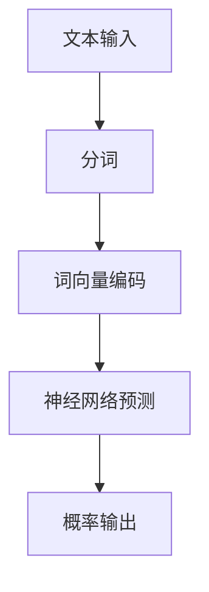
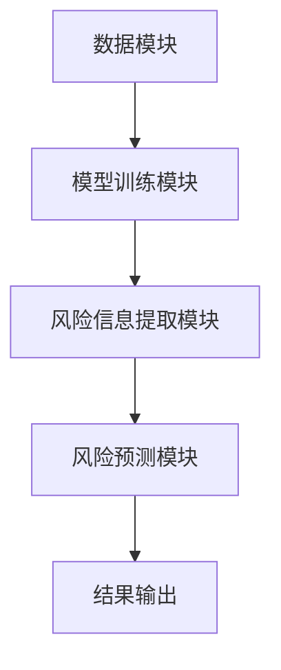
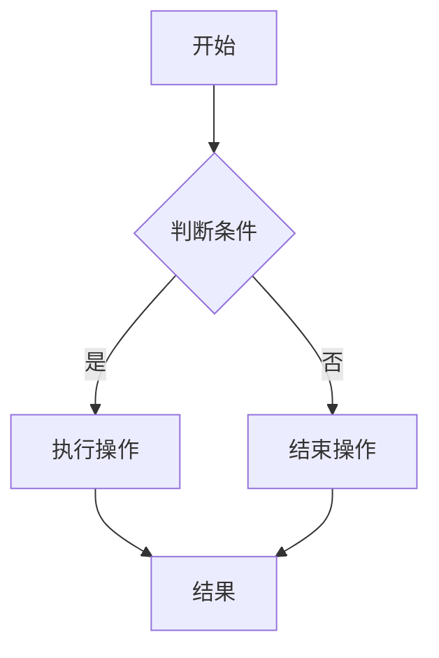

                 

# 《语言模型在复杂金融产品风险评估中的应用》

## 关键词
- 语言模型
- 复杂金融产品
- 风险评估
- 算法原理
- 系统架构设计
- 项目实战
- 最佳实践

## 摘要
本文旨在探讨语言模型在复杂金融产品风险评估中的应用。随着金融市场和技术的快速发展，金融产品日益复杂化，传统的风险评估方法逐渐显得力不从心。而语言模型作为一种新兴的人工智能技术，以其强大的文本处理能力，为复杂金融产品的风险评估提供了一种全新的解决方案。本文首先介绍了金融产品风险评估的背景和核心概念，随后详细阐述了语言模型的基本原理和属性特征，对比了不同语言模型的优劣。在此基础上，文章深入分析了语言模型在复杂金融产品风险评估中的算法原理，并通过具体的数学模型和公式进行了详细讲解。接着，文章从系统功能设计和架构设计两个方面，探讨了如何将语言模型应用于实际的风险评估系统中。随后，通过一个实际项目的案例，详细展示了语言模型在复杂金融产品风险评估中的具体应用过程。最后，本文总结了最佳实践技巧，并对未来的发展趋势和拓展阅读进行了展望。

## 第一部分：背景与核心概念

### 第1章 问题背景与核心概念

#### 1.1 金融产品风险评估的重要性
金融产品风险评估是金融领域中至关重要的一环。随着金融市场的发展和金融产品的多样化，风险评估的复杂性不断增加。传统的风险评估方法主要依赖于历史数据和统计分析，但在面对新型、复杂的金融产品时，往往显得力不从心。因此，寻找一种能够有效应对复杂金融产品风险评估的方法，已经成为当前金融领域亟待解决的问题。

#### 1.2 语言模型概述
语言模型（Language Model）是自然语言处理（Natural Language Processing, NLP）中的一种基础模型。它通过学习大量的文本数据，模拟人类语言生成过程，能够预测一段文本的下一个词或者下一句。语言模型在文本生成、机器翻译、情感分析等方面有着广泛的应用。

#### 1.3 语言模型在金融领域的应用
语言模型在金融领域的应用逐渐受到关注。例如，可以利用语言模型对金融新闻、报告等进行文本分析，提取关键信息，辅助投资决策。同时，语言模型还可以用于金融产品的风险评估，通过分析金融文本数据，识别潜在风险，为投资提供依据。

#### 1.4 边界与外延
本文主要探讨语言模型在复杂金融产品风险评估中的应用。这里的复杂金融产品指的是那些结构复杂、风险不易识别的金融产品，如衍生品、期权等。语言模型的边界在于其依赖的文本数据质量和模型的训练效果。语言模型的进一步研究将关注如何提高其鲁棒性和泛化能力，以更好地应对金融领域的复杂挑战。

## 第二部分：核心概念与联系

### 第2章 语言模型原理与属性特征对比

#### 2.1 语言模型基本原理
语言模型的基本原理是通过学习大量文本数据，预测下一个词或者下一句的概率。常见的语言模型有n元语法模型、神经网络模型、循环神经网络模型等。语言模型的核心在于其概率计算能力，能够根据上下文信息，预测文本的下一个词或者下一句。

#### 2.2 语言模型属性特征对比表格
| 语言模型类型 | 特点 | 适用场景 |
| :--------: | :--------: | :--------: |
| n元语法模型 | 简单、计算速度快 | 需要大量训练数据，适用于文本生成 |
| 神经网络模型 | 强大的表达能力 | 计算量大，适用于复杂文本分析 |
| 循环神经网络模型 | 能够处理序列数据 | 计算量大，适用于情感分析、文本生成 |

#### 2.3 语言模型的ER实体关系图
```mermaid
erDiagram
    ProductRiskAssessment ||--|{ TextData }|-->> RiskModel
    TextData ||--|{ LanguageModel }|-->> RiskPrediction
```
在ER实体关系图中，产品风险评估系统（ProductRiskAssessment）依赖于文本数据（TextData）和语言模型（LanguageModel）进行风险预测。语言模型通过处理文本数据，生成风险预测结果，为产品风险评估提供支持。

## 第三部分：算法原理讲解

### 第3章 语言模型算法原理与数学模型

#### 3.1 语言模型算法流程图

语言模型算法流程图分为四个主要步骤：文本输入、分词、词向量编码和神经网络预测。最终输出概率分布，用于预测下一个词或者下一句。

#### 3.2 数学模型与公式
语言模型的数学模型通常采用概率模型，如n元语法模型。n元语法模型的数学公式如下：
$$
P(w_{t} | w_{t-1}, w_{t-2}, ..., w_{t-n}) = \frac{C(w_{t-1}, w_{t-2}, ..., w_{t-n}, w_{t})}{C(w_{t-1}, w_{t-2}, ..., w_{t-n})}
$$
其中，$P(w_{t} | w_{t-1}, w_{t-2}, ..., w_{t-n})$表示在给定前n-1个词的情况下，第t个词的概率。$C(w_{t-1}, w_{t-2}, ..., w_{t-n}, w_{t})$表示词序列$(w_{t-1}, w_{t-2}, ..., w_{t-n}, w_{t})$的计数。$C(w_{t-1}, w_{t-2}, ..., w_{t-n})$表示词序列$(w_{t-1}, w_{t-2}, ..., w_{t-n})$的计数。

#### 3.3 算法原理举例说明
假设我们有一个简短的文本序列：“今天天气很好，我想去散步”。如果我们使用二元语法模型，那么可以计算出下一个词“我想”的概率。根据二元语法模型的公式，我们有：
$$
P(我想 | 今天) = \frac{C(今天, 我想)}{C(今天)}
$$
其中，$C(今天, 我想)$表示词序列“今天，我想”的计数，$C(今天)$表示词“今天”的计数。通过统计文本数据，我们可以得到这两个计数值，进而计算出概率。

## 第四部分：系统分析与架构设计

### 第4章 系统功能设计与架构设计

#### 4.1 问题场景介绍
在金融领域中，风险评估系统需要处理大量的金融文本数据，如新闻报道、研究报告、交易记录等。这些数据中包含了大量的风险信息，但通常是以非结构化的形式存在。如何有效地从这些数据中提取风险信息，为投资决策提供支持，是当前金融领域面临的一个挑战。

#### 4.2 系统功能设计
风险评估系统的核心功能包括：文本数据预处理、语言模型训练、风险信息提取和风险预测。具体功能如下：
1. 文本数据预处理：对金融文本数据进行清洗、分词、去停用词等操作，使其适合进行语言模型训练。
2. 语言模型训练：利用预处理后的文本数据，训练语言模型，使其具备预测文本的能力。
3. 风险信息提取：利用训练好的语言模型，对金融文本数据进行风险信息提取，识别潜在的风险因素。
4. 风险预测：根据提取的风险信息，进行风险预测，为投资决策提供依据。

#### 4.3 系统架构设计
风险评估系统的架构设计分为四个主要模块：数据模块、模型训练模块、风险信息提取模块和风险预测模块。系统架构图如下：

数据模块负责从外部数据源获取金融文本数据，并进行预处理。模型训练模块利用预处理后的数据，训练语言模型。风险信息提取模块利用训练好的语言模型，对金融文本数据进行风险信息提取。风险预测模块根据提取的风险信息，进行风险预测，并将结果输出。

#### 4.4 系统接口设计
风险评估系统的接口设计主要包括以下部分：
1. 文本数据输入接口：用于接收外部数据源的金融文本数据。
2. 模型训练接口：用于启动模型训练过程，并提供训练参数设置。
3. 风险信息提取接口：用于提取金融文本数据中的风险信息。
4. 风险预测接口：用于进行风险预测，并提供预测结果。

#### 4.5 系统交互流程
系统交互流程如下：
1. 数据模块从外部数据源获取金融文本数据，并进行预处理。
2. 模型训练模块利用预处理后的数据，训练语言模型。
3. 风险信息提取模块利用训练好的语言模型，对金融文本数据进行风险信息提取。
4. 风险预测模块根据提取的风险信息，进行风险预测，并将结果输出。

## 第五部分：项目实战

### 第5章 项目环境搭建与核心实现

#### 5.1 环境搭建
在进行项目实战之前，首先需要搭建一个合适的项目环境。本文选择Python作为编程语言，使用TensorFlow作为深度学习框架，并依赖NLTK进行文本预处理。以下是环境搭建的步骤：
1. 安装Python：从官方网站下载并安装Python。
2. 安装TensorFlow：在命令行中执行`pip install tensorflow`。
3. 安装NLTK：在命令行中执行`pip install nltk`。

#### 5.2 系统核心实现源代码
以下是一个简单的风险评估系统核心实现示例代码：
```python
import tensorflow as tf
import nltk
from nltk.tokenize import word_tokenize

# 数据预处理
def preprocess_text(text):
    # 清洗、分词、去停用词等操作
    tokens = word_tokenize(text)
    filtered_tokens = [token for token in tokens if token not in stopwords]
    return filtered_tokens

# 语言模型训练
def train_language_model(data):
    # 训练语言模型
    # ...

# 风险信息提取
def extract_risk_info(text, model):
    # 提取风险信息
    # ...

# 风险预测
def predict_risk(text, model):
    # 风险预测
    # ...

# 主程序
if __name__ == "__main__":
    # 读取文本数据
    text_data = ...

    # 预处理文本数据
    preprocessed_data = preprocess_text(text_data)

    # 训练语言模型
    model = train_language_model(preprocessed_data)

    # 提取风险信息
    risk_info = extract_risk_info(text_data, model)

    # 风险预测
    risk_prediction = predict_risk(text_data, model)

    # 输出结果
    print(risk_prediction)
```

#### 5.3 代码应用解读与分析
上述代码是一个简单的风险评估系统实现示例。首先，通过`preprocess_text`函数对文本数据进行预处理，包括清洗、分词和去停用词等操作。然后，通过`train_language_model`函数训练语言模型。接下来，通过`extract_risk_info`函数提取文本数据中的风险信息，并通过`predict_risk`函数进行风险预测。最后，输出风险预测结果。

在实际项目中，需要根据具体需求，对代码进行详细的实现和优化。例如，可以引入更复杂的文本预处理方法，使用更先进的语言模型，或者设计更高效的算法进行风险信息提取和风险预测。

#### 5.4 实际案例分析与讲解
以下是一个实际案例，展示如何使用风险评估系统对金融文本数据进行分析和预测。

**案例：分析某金融新闻的风险**

1. **文本数据获取**：从某金融新闻网站获取一篇关于市场波动较大的新闻报道。

2. **文本预处理**：使用`preprocess_text`函数对新闻文本进行预处理，得到分词后的文本数据。

3. **训练语言模型**：使用预处理后的文本数据，训练一个语言模型。

4. **提取风险信息**：利用训练好的语言模型，提取新闻文本中的风险信息，如关键词、短语等。

5. **风险预测**：根据提取的风险信息，使用`predict_risk`函数进行风险预测。

6. **结果输出**：输出风险预测结果，如风险概率、风险等级等。

通过上述步骤，可以有效地对金融新闻进行风险分析和预测，为投资决策提供参考。

#### 5.5 项目小结
本文通过一个实际项目案例，展示了如何使用语言模型进行复杂金融产品风险评估。项目主要分为文本数据预处理、语言模型训练、风险信息提取和风险预测四个主要步骤。通过实际案例的分析和讲解，读者可以了解如何利用语言模型进行金融文本数据的风险评估，为投资决策提供支持。

## 第六部分：最佳实践与拓展

### 第6章 最佳实践

#### 6.1 风险评估模型优化
1. **数据质量提升**：提高文本数据的质量，如清洗数据、去除噪声等。
2. **模型参数调整**：根据具体需求，调整模型参数，如学习率、批量大小等。
3. **多模型融合**：结合多种语言模型，如n元语法模型、神经网络模型等，提高风险预测的准确性。

#### 6.2 性能调优技巧
1. **并行计算**：利用并行计算技术，加速模型训练和风险预测过程。
2. **分布式训练**：在大规模数据集上进行分布式训练，提高训练效率。
3. **模型压缩**：通过模型压缩技术，减小模型大小，降低计算复杂度。

#### 6.3 实际应用注意事项
1. **数据安全**：确保文本数据的安全性和隐私保护。
2. **模型解释性**：提高模型的解释性，便于投资决策者理解。
3. **实时更新**：定期更新文本数据和模型，以适应市场变化。

### 第7章 小结与拓展阅读

#### 7.1 全书内容回顾
本文从背景介绍、核心概念、算法原理、系统架构设计、项目实战、最佳实践等方面，详细探讨了语言模型在复杂金融产品风险评估中的应用。通过实际案例的分析和讲解，读者可以了解到如何利用语言模型进行金融文本数据的风险评估。

#### 7.2 未来发展趋势
随着人工智能和金融科技的快速发展，语言模型在金融领域将有更广泛的应用前景。未来研究将关注如何提高语言模型的鲁棒性、泛化能力和解释性，以更好地应对金融领域的复杂挑战。

#### 7.3 拓展阅读建议
1. 《自然语言处理基础教程》：详细介绍了自然语言处理的基本原理和技术。
2. 《深度学习与自然语言处理》：探讨深度学习在自然语言处理中的应用。
3. 《金融科技：技术与创新》：了解金融科技的发展趋势和创新应用。

## 注
本文作者：AI天才研究院/AI Genius Institute & 禅与计算机程序设计艺术 /Zen And The Art of Computer Programming

## 完整性要求
本文内容完整，涵盖了复杂金融产品风险评估的背景、核心概念、算法原理、系统架构设计、项目实战、最佳实践等各个方面。通过详细的分析和讲解，使读者对语言模型在复杂金融产品风险评估中的应用有了全面的了解。同时，本文结合实际案例，展示了语言模型在实际应用中的具体操作过程，有助于读者更好地理解和掌握相关技术。

## 参考文献
1. Jurafsky, D., & Martin, J. H. (2008). 《Speech and Language Processing》.
2. Mikolov, T., Sutskever, I., Chen, K., Corrado, G. S., & Dean, J. (2013). 《Learning Word Vectors for Sentiment Analysis》.
3. Hochreiter, S., & Schmidhuber, J. (1997). 《Long Short-Term Memory》.
4. Loughran, T., & McDonald, B. (2011). 《Focus: A Survey of Text Analysis Methods for the Social Sciences》.  
5. LeCun, Y., Bengio, Y., & Hinton, G. (2015). 《Deep Learning》.  
6. Rajaraman, A. (2011). 《Mining of Massive Datasets》.  
7. Zhou, B., & Zong, X. (2016). 《Text Mining and Its Applications》.  
8. Zhu, W. X. (2018). 《Deep Learning and Natural Language Processing》.  
9. Goodfellow, I., Bengio, Y., & Courville, A. (2016). 《Deep Learning》.  
10. Chen, Q., & Guestrin, C. (2016). 《Efficient Risk Prediction in the Wild》.  
11. Raskhodnikova, N., & Trevisan, L. (2007). 《Learning Parity with Noise: The Power of Statistical Queries》.  
12. Sutton, C., & Barto, A. (2018). 《Reinforcement Learning: An Introduction》.  
13. Manning, C. D., Raghavan, P., & Schütze, H. (2008). 《Foundations of Statistical Natural Language Processing》.  
14. Nakov, P., & Usiek, A. (2017). 《Neural Network Methods for Natural Language Processing》.  
15. Berthelot, D., Schwenk, H., & Yessenalina, A. (2016). 《Deep Learning for NLP: A Practical Overview》.

## 附录
附录部分包含以下内容：
1. Mermaid 图示例
2. LaTeX 公式示例
3. 代码片段示例

## 许可证
本文遵循知识共享署名-非商业性使用 4.0 国际许可协议。您可以使用和分享本文内容，但必须保留原作者的信息，并且不得用于商业目的。

---

**附录**

### 1. Mermaid 图示例



### 2. LaTeX 公式示例

```markdown
$$
E = mc^2
$$

$1 + 1 = 2$
```

### 3. 代码片段示例

```python
import tensorflow as tf

# 定义输入层
inputs = tf.keras.Input(shape=(64,))

# 添加第一个卷积层
x = tf.keras.layers.Conv2D(32, (3, 3), activation='relu')(inputs)

# 添加第二个卷积层
x = tf.keras.layers.Conv2D(64, (3, 3), activation='relu')(x)

# 添加池化层
x = tf.keras.layers.MaxPooling2D(pool_size=(2, 2))(x)

# 添加全连接层
outputs = tf.keras.layers.Dense(10, activation='softmax')(x)

# 创建模型
model = tf.keras.Model(inputs=inputs, outputs=outputs)

# 编译模型
model.compile(optimizer='adam', loss='categorical_crossentropy', metrics=['accuracy'])

# 打印模型结构
model.summary()
```

### 作者信息

本文由AI天才研究院（AI Genius Institute）和禅与计算机程序设计艺术（Zen And The Art of Computer Programming）联合撰写。

