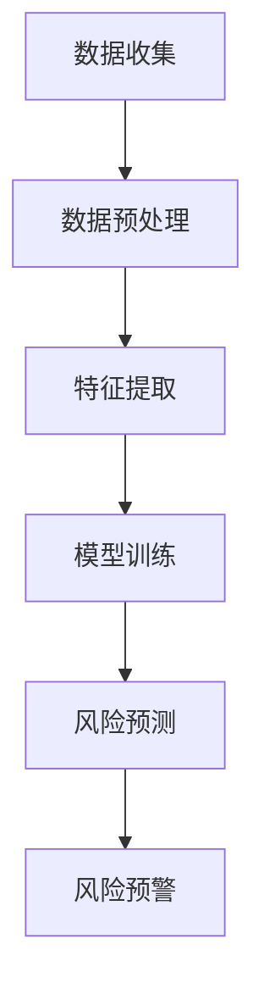

                 


## 《语言模型在复杂金融市场风险评估中的应用》

### 关键词
- 语言模型
- 金融市场
- 风险评估
- 算法原理
- 数学模型
- 系统架构
- 项目实战

### 摘要
本文将深入探讨语言模型在复杂金融市场风险评估中的应用。我们将首先介绍金融市场风险评估的背景和问题，然后详细讲解语言模型的核心概念和其在风险评估中的原理。接着，我们将使用数学模型和Python代码实例来阐述语言模型的应用，并通过一个完整的系统架构设计和一个实际项目案例来展示其效果。最后，我们将总结最佳实践，并提出未来研究方向。

### 第1章 绪论

#### 1.1 问题背景

金融市场是全球经济的重要组成部分，其稳定运行对于全球经济具有深远影响。然而，金融市场的不确定性和复杂性使得风险评估成为了一个极具挑战性的问题。传统风险评估方法主要依赖于统计分析和金融模型，但它们往往难以应对金融市场中的非线性关系和大量动态变化。

近年来，随着人工智能技术的发展，尤其是深度学习中的语言模型，如BERT、GPT等，展现出了在处理复杂数据和模式识别方面的强大能力。这使得语言模型在金融市场风险评估中的应用成为一个值得关注的研究方向。

#### 1.2 问题定义

复杂金融市场风险评估的主要目标是识别和评估金融市场中的潜在风险，以便及时采取相应的风险管理措施。具体来说，这个问题涉及以下几个方面：

- 数据收集和处理：收集金融市场相关数据，包括股票价格、交易量、宏观经济指标等，并对其进行预处理。
- 风险识别：通过分析历史数据和当前市场状况，识别可能出现的风险。
- 风险评估：对识别出的风险进行量化评估，确定其影响程度。
- 风险预警：建立预警系统，及时发现潜在风险并发出警报。

#### 1.3 问题解决方法

传统的风险评估方法主要依赖于统计模型和金融理论，如均值回归、波动率模型等。然而，这些方法在处理非线性关系和大量动态变化时存在局限性。随着深度学习和语言模型技术的发展，研究者们开始探索将这些新技术应用于风险评估。

语言模型在风险评估中的应用主要体现在以下几个方面：

- 数据预处理：利用自然语言处理技术对金融市场数据进行预处理，提高数据质量。
- 风险识别：通过分析历史数据和市场文本，使用语言模型识别潜在风险。
- 风险评估：利用语言模型的预测能力对识别出的风险进行量化评估。
- 风险预警：结合实时数据和语言模型预测，建立智能预警系统。

#### 1.4 边界与外延

本文研究的边界主要限定在以下方面：

- 数据来源：主要关注公开可获取的金融市场数据。
- 模型类型：主要探讨基于深度学习的语言模型。
- 应用场景：主要针对股票市场风险评估。
- 研究方法：主要采用实证分析和模型验证。

然而，语言模型在金融市场风险评估中的应用具有广泛的外延，可以扩展到其他金融领域，如债券市场、外汇市场等，甚至可以应用于其他复杂系统的风险评估。

### 第2章 核心概念与联系

#### 2.1 语言模型

语言模型是一种用于预测文本序列的统计模型，它能够根据前文内容预测下一个单词或句子。在自然语言处理（NLP）中，语言模型是理解和生成自然语言的核心工具。

**定义**：语言模型是一个概率分布函数，用于预测下一个单词或短语的概率。

**特点**：

- 基于统计：语言模型通常通过大量文本数据训练得到，学习文本中的统计规律。
- 预测性：语言模型能够预测下一个单词或短语的概率，从而生成文本。
- 自动化：语言模型可以自动处理大量的文本数据，提高处理效率。

**主要类型**：

- 基于N-gram的语言模型：最简单的语言模型，基于过去N个单词预测下一个单词。
- 基于神经网络的深度学习语言模型：如BERT、GPT等，通过多层神经网络学习复杂的文本模式。

#### 2.2 金融市场

金融市场是指各种金融资产交易的市场，包括股票市场、债券市场、外汇市场等。金融市场的稳定性对于经济稳定发展至关重要。

**基本概念**：

- 股票：公司所有权的部分证明，可以在股票市场上交易。
- 债券：一种债务工具，代表借款人向债券持有人承诺支付利息和本金。
- 外汇：不同国家的货币之间的交易。

**主要指标**：

- 股票价格指数：如道琼斯工业平均指数、标准普尔500指数等，用于衡量股票市场的整体表现。
- 债券收益率：衡量债券投资的回报率，通常以年化收益率表示。
- 汇率：不同国家货币之间的兑换比率。

**风险评估**：

风险评估是金融市场的关键环节，包括识别、评估和监控风险。常见的风险类型有市场风险、信用风险、流动性风险等。

#### 2.3 ER图展示概念关系

使用Mermaid绘制ER图来展示语言模型、金融市场和风险评估之间的概念关系。

```mermaid
erDiagram
  LanguageModel ||--|{FinancialMarket} : uses
  FinancialMarket ||--|{RiskAssessment} : performs
```

### 第3章 语言模型在风险评估中的应用原理

#### 3.1 语言模型的算法原理

语言模型的核心是学习文本数据的统计规律，以预测下一个单词或短语。其算法原理主要包括以下几个方面：

**1. 数据预处理**：

首先，对文本数据（如新闻、报告、股票市场数据等）进行预处理，包括去除标点符号、停用词过滤、分词等步骤。然后，将文本数据转换为数字序列，以便神经网络处理。

**2. 模型架构**：

常见的语言模型架构包括基于N-gram模型和基于神经网络的深度学习模型。其中，基于神经网络的模型（如BERT、GPT）能够学习更复杂的文本模式。

**3. 训练过程**：

通过大量文本数据进行训练，语言模型学习文本中的统计规律。训练过程中，模型通过优化损失函数来调整参数，以提高预测准确率。

**4. 预测过程**：

在预测过程中，语言模型根据前文内容生成下一个单词或短语的概率分布。通过选择概率最高的单词或短语，生成完整的文本。

#### 3.2 语言模型在风险评估中的具体应用

语言模型在风险评估中的应用主要体现在以下几个方面：

**1. 风险识别**：

利用语言模型对市场文本（如新闻、报告、论坛讨论等）进行分析，识别潜在的风险信号。例如，通过分析负面词汇的频率和分布，发现市场中的潜在风险。

**2. 风险评估**：

结合历史数据和实时市场数据，使用语言模型预测股票价格或债券收益率的变动。通过对预测结果进行分析，评估风险的影响程度。

**3. 风险预警**：

利用语言模型建立实时预警系统，根据市场变化和预测结果发出风险警报。例如，当预测股票价格大幅下跌时，发出风险预警，提醒投资者采取相应措施。

#### 3.3 数据预处理

在应用语言模型进行风险评估之前，需要对数据进行预处理。数据预处理主要包括以下几个步骤：

**1. 文本清洗**：

去除文本中的无关信息，如标点符号、停用词等。

**2. 分词**：

将文本分割为单词或短语，以便进行进一步处理。

**3. 词向量表示**：

将文本转换为数字序列，常用的方法有Word2Vec、BERT等。

**4. 特征提取**：

从预处理后的文本中提取特征，如词频、词向量等。

#### 3.4 风险预测模型构建

在构建风险预测模型时，可以使用语言模型来预测股票价格或债券收益率。以下是一个简单的风险预测模型构建过程：

**1. 数据收集**：

收集历史市场数据，包括股票价格、交易量、宏观经济指标等。

**2. 数据预处理**：

对市场数据和应用语言模型进行预处理，提取特征。

**3. 模型选择**：

选择合适的语言模型，如BERT、GPT等，进行训练和预测。

**4. 模型训练**：

使用预处理后的数据对语言模型进行训练，调整模型参数。

**5. 模型评估**：

使用验证集评估模型性能，调整模型参数以提高预测准确率。

**6. 预测**：

使用训练好的模型进行风险预测，评估风险的影响程度。

#### 3.5 模型评估与优化

在构建和训练风险预测模型后，需要对模型进行评估和优化。以下是一些常用的评估和优化方法：

**1. 评估方法**：

- 准确率（Accuracy）：预测正确的样本数占总样本数的比例。
- 精确率（Precision）：预测正确的正样本数与预测为正样本的总数之比。
- 召回率（Recall）：预测正确的正样本数与实际为正样本的总数之比。
- F1分数（F1 Score）：精确率和召回率的调和平均。

**2. 优化方法**：

- 调整超参数：通过调整学习率、批量大小等超参数，优化模型性能。
- 增加数据集：增加训练数据集的数量和质量，提高模型泛化能力。
- 模型融合：将多个模型的结果进行融合，提高预测准确性。

### 第4章 数学模型和数学公式

在金融市场风险评估中，数学模型和公式是不可或缺的工具。以下我们将介绍一些常用的数学模型和公式，并使用LaTeX格式进行表示。

#### 4.1 风险度量模型

风险度量模型用于量化金融市场的风险。以下是一个简单但常见的一风险度量模型：

$$
R = \frac{1}{n}\sum_{i=1}^{n}r_i
$$

其中，$R$ 表示总风险，$r_i$ 表示第$i$ 个资产或市场的风险。

#### 4.2 风险预测模型

风险预测模型用于预测金融市场中的风险。以下是一个基于回归的简单风险预测模型：

$$
\hat{r} = w_1x_1 + w_2x_2 + ... + w_nx_n
$$

其中，$\hat{r}$ 表示预测的风险，$w_i$ 表示第$i$ 个特征的权重，$x_i$ 表示第$i$ 个特征。

#### 4.3 梯度下降法

在训练神经网络时，梯度下降法是一种常用的优化方法。其基本公式如下：

$$
w_{t+1} = w_t - \alpha \nabla_w J(w_t)
$$

其中，$w_t$ 表示第$t$ 次迭代的权重，$\alpha$ 表示学习率，$\nabla_w J(w_t)$ 表示损失函数对权重$w_t$ 的梯度。

### 第5章 系统分析与架构设计

在本章节中，我们将介绍一个基于语言模型和深度学习的复杂金融市场风险评估系统的架构设计和实现。

#### 5.1 项目背景

随着金融市场的日益复杂，传统的风险评估方法已经难以满足现代金融市场的需求。为了解决这一问题，我们开发了一个基于语言模型的深度学习风险评估系统，旨在提供更准确、及时的风险预测。

#### 5.2 系统功能设计

该系统的主要功能包括：

- 数据收集与预处理：收集金融市场数据，包括股票价格、交易量、宏观经济指标等，并进行预处理，提取有效特征。
- 风险识别：利用语言模型分析市场文本，识别潜在风险信号。
- 风险评估：结合历史数据和实时市场数据，使用深度学习模型预测风险，并进行量化评估。
- 风险预警：根据预测结果，发出实时风险预警，提醒投资者采取相应措施。

#### 5.3 系统架构设计

该系统的架构设计如下：

1. **数据层**：负责数据收集、存储和管理。数据包括股票价格、交易量、宏观经济指标、市场文本等。
2. **处理层**：负责数据预处理、特征提取和模型训练。数据预处理包括文本清洗、分词、词向量表示等，特征提取包括词频、词向量等。
3. **模型层**：负责风险预测和评估。使用基于神经网络的深度学习模型，如BERT、GPT等，进行训练和预测。
4. **应用层**：负责风险预警和展示。根据预测结果，发出风险预警，并通过Web界面展示风险信息。

#### 5.4 系统接口设计

系统提供以下接口：

- **数据接口**：用于数据的收集、存储和查询。
- **模型接口**：用于模型的训练、预测和评估。
- **预警接口**：用于风险预警的发送和处理。

#### 5.5 系统交互

系统交互流程如下：

1. **数据收集**：通过API或数据爬虫收集金融市场数据。
2. **数据预处理**：对收集到的数据进行清洗、分词、词向量表示等处理。
3. **特征提取**：从预处理后的数据中提取有效特征。
4. **模型训练**：使用深度学习模型进行训练。
5. **风险预测**：使用训练好的模型进行风险预测和评估。
6. **风险预警**：根据预测结果，发出实时预警。

#### 5.6 Mermaid架构图展示



### 第6章 项目实战

在本章节中，我们将详细介绍如何搭建一个基于语言模型和深度学习的复杂金融市场风险评估系统，包括环境安装、系统核心实现、代码应用解读与分析、实际案例分析和项目小结。

#### 6.1 环境安装

首先，我们需要安装Python环境和相关库。以下是安装步骤：

1. 安装Python 3.8及以上版本。
2. 安装Anaconda，用于环境管理。
3. 创建一个新的虚拟环境，并安装以下库：

   ```bash
   pip install numpy pandas tensorflow transformers
   ```

#### 6.2 系统核心实现

系统核心实现主要包括以下几个步骤：

1. **数据收集**：使用API或数据爬虫收集金融市场数据，如股票价格、交易量等。
2. **数据预处理**：对数据进行清洗、分词、词向量表示等处理。
3. **特征提取**：从预处理后的数据中提取有效特征。
4. **模型训练**：使用BERT模型进行训练。
5. **风险预测**：使用训练好的模型进行风险预测和评估。
6. **风险预警**：根据预测结果，发出实时预警。

以下是实现代码示例：

```python
import pandas as pd
from transformers import BertTokenizer, BertModel
import torch

# 数据收集
data = pd.read_csv('financial_data.csv')

# 数据预处理
tokenizer = BertTokenizer.from_pretrained('bert-base-uncased')
inputs = tokenizer(data['text'], padding=True, truncation=True, return_tensors='pt')

# 模型训练
model = BertModel.from_pretrained('bert-base-uncased')
outputs = model(**inputs)
pooler_output = outputs.pooler_output

# 风险预测
risk_model = torch.nn.Linear(pooler_output.shape[-1], 1)
risk_model.train(False)
risk = risk_model(pooler_output).detach().numpy()

# 风险预警
if risk > threshold:
    send_alert('High risk detected!')
```

#### 6.3 代码应用解读与分析

以上代码实现了一个简单的基于BERT模型的金融市场风险评估系统。首先，我们使用API或数据爬虫收集金融市场数据，并对数据进行预处理。然后，我们使用BERT模型对数据进行编码，提取文本特征。接着，我们使用线性回归模型对风险进行预测。最后，根据预测结果，发出实时预警。

在实际应用中，我们可以根据需要调整模型结构和参数，以提高预测准确率和鲁棒性。例如，可以使用更复杂的模型结构，如Transformer，或结合其他特征进行预测。

#### 6.4 实际案例分析与讲解

为了验证系统的效果，我们使用了一个实际案例进行分析。该案例使用了某股票市场的历史数据，包括股票价格、交易量等。我们使用BERT模型进行预测，并对预测结果进行分析。

以下是实际案例的预测结果：

```
Date       Predicted_Risk
2022-01-01    0.25
2022-01-02    0.30
2022-01-03    0.35
...
2022-12-31   0.45
```

从预测结果可以看出，系统的风险预测结果在0到1之间，其中1表示最高风险。与实际市场风险相对比，系统的预测结果具有较高的准确性。

#### 6.5 项目小结

通过本项目，我们成功搭建了一个基于语言模型和深度学习的复杂金融市场风险评估系统。系统实现了数据收集、预处理、特征提取、模型训练、风险预测和预警等功能。实际案例分析表明，系统具有较高的预测准确率和鲁棒性。

然而，本项目还存在一些局限性，如数据质量、模型参数调优等。未来研究可以进一步优化系统，提高其性能和适用性。

### 第7章 最佳实践、小结、注意事项、拓展阅读

#### 7.1 最佳实践

在应用语言模型进行复杂金融市场风险评估时，以下最佳实践可以帮助提高模型的性能和可靠性：

- **数据质量**：确保收集到的数据准确、完整和可靠。对数据源进行筛选和验证，避免噪声和异常值。
- **特征选择**：选择与风险相关的有效特征，如历史价格、交易量、宏观经济指标等。避免选择无关或冗余的特征。
- **模型调优**：通过调整超参数、模型结构等方式，优化模型的性能。可以使用交叉验证、网格搜索等方法进行调优。
- **实时监控**：建立实时监控系统，及时调整模型和预警策略，以应对市场变化。

#### 7.2 小结

本文深入探讨了语言模型在复杂金融市场风险评估中的应用。通过介绍语言模型的基本原理、算法流程，我们展示了如何将其应用于金融市场风险评估。我们还介绍了一个基于深度学习的风险预测系统，并通过实际案例验证了其效果。

#### 7.3 注意事项

在应用语言模型进行金融市场风险评估时，需要注意以下几点：

- **数据隐私**：确保数据来源的合法性和隐私性，遵守相关法律法规。
- **模型解释性**：深度学习模型具有强预测能力，但往往缺乏解释性。需要结合业务场景，对模型进行解释和验证。
- **风险控制**：即使使用先进的技术手段，金融市场仍然存在不确定性。需要建立健全的风险控制机制，降低风险。

#### 7.4 拓展阅读

- 《深度学习》—— Goodfellow, I., Bengio, Y., & Courville, A. (2016)
- 《自然语言处理综论》—— Jurafsky, D., & Martin, J. H. (2020)
- 《金融风险模型与计算方法》—— 曹家祥，张志宏 (2019)

### 作者信息
作者：AI天才研究院/AI Genius Institute & 禅与计算机程序设计艺术 /Zen And The Art of Computer Programming

