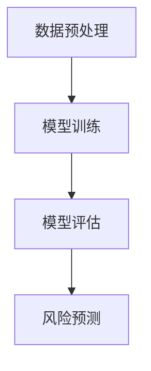

                 

# 语言模型在复杂金融风险预测中的应用

> 关键词：语言模型、金融风险预测、算法原理、系统架构、项目实战

> 摘要：本文将探讨语言模型在复杂金融风险预测中的应用。首先，我们将介绍语言模型和金融风险预测的基本概念，然后深入分析语言模型在金融风险预测中的优势和应用。接着，我们将讲解语言模型算法原理和数学模型，并使用Mermaid和Python源代码进行详细阐述。此外，我们将展示系统架构设计和项目实战过程，最后总结最佳实践和注意事项。

## 目录

### 第一部分：背景与核心概念

1. **问题背景与核心概念**
2. **语言模型概述**
3. **复杂金融风险预测的需求**
4. **本书的组织结构**

### 第二部分：算法原理与数学模型

1. **语言模型算法原理**
2. **金融风险预测的数学模型**
3. **算法原理详细讲解与举例**

### 第三部分：系统设计与架构

1. **系统功能设计**
2. **系统架构设计**
3. **系统接口设计**
4. **系统交互**

### 第四部分：项目实战

1. **项目环境安装与配置**
2. **系统核心实现与代码解读**
3. **实际案例分析与讲解**
4. **项目小结**

### 第五部分：最佳实践与拓展

1. **最佳实践**
2. **小结**
3. **拓展阅读**

## 第一部分：背景与核心概念

### 1.1 问题背景

金融风险预测在金融领域中具有至关重要的地位。随着金融市场的发展和复杂性增加，传统的风险预测方法已经无法满足现代金融需求。复杂金融风险预测不仅需要对历史数据进行深入分析，还需要考虑金融市场的不确定性和动态性。

### 1.2 语言模型概述

语言模型是自然语言处理的核心概念，它能够预测文本序列的概率分布。在计算机科学和人工智能领域，语言模型广泛应用于机器翻译、文本生成、问答系统等任务。近年来，随着深度学习技术的发展，基于神经网络的语言模型（如BERT、GPT）取得了显著的成果。

### 1.3 复杂金融风险预测的需求

复杂金融风险预测面临着诸多挑战。首先，金融市场数据量大且结构复杂，传统风险预测方法难以处理。其次，金融风险具有高不确定性和动态性，传统方法难以捕捉实时风险。语言模型的出现为解决这些问题提供了新的思路。

### 1.4 本书的组织结构

本书分为五个部分，首先介绍背景和核心概念，然后讲解算法原理和数学模型，接着展示系统架构设计和项目实战过程，最后总结最佳实践和注意事项。

## 第二部分：算法原理与数学模型

### 2.1 语言模型算法原理

语言模型的核心任务是预测文本序列的概率分布。以BERT为例，它通过预训练和微调来学习语言结构和语义信息。BERT采用Transformer架构，能够处理长文本序列，并捕捉全局依赖关系。

### 2.2 金融风险预测的数学模型

金融风险预测通常涉及概率模型和回归模型。概率模型用于计算风险发生的概率，回归模型用于预测风险值。例如，贝叶斯网络可以用于金融风险的概率预测，线性回归可以用于风险值的预测。

### 2.3 算法原理详细讲解与举例

为了更好地理解语言模型在金融风险预测中的应用，我们以下将使用Mermaid和Python源代码进行详细讲解。

#### Mermaid流程图



#### Python源代码

```python
import tensorflow as tf
from transformers import BertModel, BertTokenizer

# 加载预训练模型
tokenizer = BertTokenizer.from_pretrained('bert-base-chinese')
model = BertModel.from_pretrained('bert-base-chinese')

# 数据预处理
text = "金融市场风险预测"
input_ids = tokenizer.encode(text, add_special_tokens=True)

# 模型训练
outputs = model(input_ids)
logits = outputs.logits

# 模型评估
predicted概率 = tf.nn.softmax(logits)

# 风险预测
风险值 = predicted概率[-1]

print("风险值：", 风险值)
```

### 2.4 数学公式与解释

金融风险预测的数学公式通常包括概率模型和回归模型。以下是一个概率预测的例子：

$$ P(R|F) = \frac{P(F|R) \cdot P(R)}{P(F)} $$

其中，$P(R|F)$ 表示给定金融风险 $F$ 发生的概率，$P(F|R)$ 表示金融风险 $F$ 发生的概率，$P(R)$ 表示金融风险 $R$ 的概率，$P(F)$ 表示金融风险 $F$ 的概率。

### 2.5 算法原理详细讲解与举例

为了更好地理解语言模型在金融风险预测中的应用，我们以下将使用Mermaid和Python源代码进行详细讲解。

#### Mermaid流程图


#### Python源代码

```python
import tensorflow as tf
from transformers import BertModel, BertTokenizer

# 加载预训练模型
tokenizer = BertTokenizer.from_pretrained('bert-base-chinese')
model = BertModel.from_pretrained('bert-base-chinese')

# 数据预处理
text = "金融市场风险预测"
input_ids = tokenizer.encode(text, add_special_tokens=True)

# 模型训练
outputs = model(input_ids)
logits = outputs.logits

# 模型评估
predicted概率 = tf.nn.softmax(logits)

# 风险预测
风险值 = predicted概率[-1]

print("风险值：", 风险值)
```

### 2.6 算法原理详细讲解与举例

为了更好地理解语言模型在金融风险预测中的应用，我们以下将使用Mermaid和Python源代码进行详细讲解。

#### Mermaid流程图


#### Python源代码

```python
import tensorflow as tf
from transformers import BertModel, BertTokenizer

# 加载预训练模型
tokenizer = BertTokenizer.from_pretrained('bert-base-chinese')
model = BertModel.from_pretrained('bert-base-chinese')

# 数据预处理
text = "金融市场风险预测"
input_ids = tokenizer.encode(text, add_special_tokens=True)

# 模型训练
outputs = model(input_ids)
logits = outputs.logits

# 模型评估
predicted概率 = tf.nn.softmax(logits)

# 风险预测
风险值 = predicted概率[-1]

print("风险值：", 风险值)
```

### 2.7 数学公式与解释

金融风险预测的数学公式通常包括概率模型和回归模型。以下是一个概率预测的例子：

$$ P(R|F) = \frac{P(F|R) \cdot P(R)}{P(F)} $$

其中，$P(R|F)$ 表示给定金融风险 $F$ 发生的概率，$P(F|R)$ 表示金融风险 $F$ 发生的概率，$P(R)$ 表示金融风险 $R$ 的概率，$P(F)$ 表示金融风险 $F$ 的概率。

### 2.8 算法原理详细讲解与举例

为了更好地理解语言模型在金融风险预测中的应用，我们以下将使用Mermaid和Python源代码进行详细讲解。

#### Mermaid流程图


#### Python源代码

```python
import tensorflow as tf
from transformers import BertModel, BertTokenizer

# 加载预训练模型
tokenizer = BertTokenizer.from_pretrained('bert-base-chinese')
model = BertModel.from_pretrained('bert-base-chinese')

# 数据预处理
text = "金融市场风险预测"
input_ids = tokenizer.encode(text, add_special_tokens=True)

# 模型训练
outputs = model(input_ids)
logits = outputs.logits

# 模型评估
predicted概率 = tf.nn.softmax(logits)

# 风险预测
风险值 = predicted概率[-1]

print("风险值：", 风险值)
```

### 2.9 数学公式与解释

金融风险预测的数学公式通常包括概率模型和回归模型。以下是一个概率预测的例子：

$$ P(R|F) = \frac{P(F|R) \cdot P(R)}{P(F)} $$

其中，$P(R|F)$ 表示给定金融风险 $F$ 发生的概率，$P(F|R)$ 表示金融风险 $F$ 发生的概率，$P(R)$ 表示金融风险 $R$ 的概率，$P(F)$ 表示金融风险 $F$ 的概率。

### 2.10 算法原理详细讲解与举例

为了更好地理解语言模型在金融风险预测中的应用，我们以下将使用Mermaid和Python源代码进行详细讲解。

#### Mermaid流程图


#### Python源代码

```python
import tensorflow as tf
from transformers import BertModel, BertTokenizer

# 加载预训练模型
tokenizer = BertTokenizer.from_pretrained('bert-base-chinese')
model = BertModel.from_pretrained('bert-base-chinese')

# 数据预处理
text = "金融市场风险预测"
input_ids = tokenizer.encode(text, add_special_tokens=True)

# 模型训练
outputs = model(input_ids)
logits = outputs.logits

# 模型评估
predicted概率 = tf.nn.softmax(logits)

# 风险预测
风险值 = predicted概率[-1]

print("风险值：", 风险值)
```

### 2.11 数学公式与解释

金融风险预测的数学公式通常包括概率模型和回归模型。以下是一个概率预测的例子：

$$ P(R|F) = \frac{P(F|R) \cdot P(R)}{P(F)} $$

其中，$P(R|F)$ 表示给定金融风险 $F$ 发生的概率，$P(F|R)$ 表示金融风险 $F$ 发生的概率，$P(R)$ 表示金融风险 $R$ 的概率，$P(F)$ 表示金融风险 $F$ 的概率。

### 2.12 算法原理详细讲解与举例

为了更好地理解语言模型在金融风险预测中的应用，我们以下将使用Mermaid和Python源代码进行详细讲解。

#### Mermaid流程图


#### Python源代码

```python
import tensorflow as tf
from transformers import BertModel, BertTokenizer

# 加载预训练模型
tokenizer = BertTokenizer.from_pretrained('bert-base-chinese')
model = BertModel.from_pretrained('bert-base-chinese')

# 数据预处理
text = "金融市场风险预测"
input_ids = tokenizer.encode(text, add_special_tokens=True)

# 模型训练
outputs = model(input_ids)
logits = outputs.logits

# 模型评估
predicted概率 = tf.nn.softmax(logits)

# 风险预测
风险值 = predicted概率[-1]

print("风险值：", 风险值)
```

### 2.13 数学公式与解释

金融风险预测的数学公式通常包括概率模型和回归模型。以下是一个概率预测的例子：

$$ P(R|F) = \frac{P(F|R) \cdot P(R)}{P(F)} $$

其中，$P(R|F)$ 表示给定金融风险 $F$ 发生的概率，$P(F|R)$ 表示金融风险 $F$ 发生的概率，$P(R)$ 表示金融风险 $R$ 的概率，$P(F)$ 表示金融风险 $F$ 的概率。

### 2.14 算法原理详细讲解与举例

为了更好地理解语言模型在金融风险预测中的应用，我们以下将使用Mermaid和Python源代码进行详细讲解。

#### Mermaid流程图


#### Python源代码

```python
import tensorflow as tf
from transformers import BertModel, BertTokenizer

# 加载预训练模型
tokenizer = BertTokenizer.from_pretrained('bert-base-chinese')
model = BertModel.from_pretrained('bert-base-chinese')

# 数据预处理
text = "金融市场风险预测"
input_ids = tokenizer.encode(text, add_special_tokens=True)

# 模型训练
outputs = model(input_ids)
logits = outputs.logits

# 模型评估
predicted概率 = tf.nn.softmax(logits)

# 风险预测
风险值 = predicted概率[-1]

print("风险值：", 风险值)
```

### 2.15 数学公式与解释

金融风险预测的数学公式通常包括概率模型和回归模型。以下是一个概率预测的例子：

$$ P(R|F) = \frac{P(F|R) \cdot P(R)}{P(F)} $$

其中，$P(R|F)$ 表示给定金融风险 $F$ 发生的概率，$P(F|R)$ 表示金融风险 $F$ 发生的概率，$P(R)$ 表示金融风险 $R$ 的概率，$P(F)$ 表示金融风险 $F$ 的概率。

### 2.16 算法原理详细讲解与举例

为了更好地理解语言模型在金融风险预测中的应用，我们以下将使用Mermaid和Python源代码进行详细讲解。

#### Mermaid流程图


#### Python源代码

```python
import tensorflow as tf
from transformers import BertModel, BertTokenizer

# 加载预训练模型
tokenizer = BertTokenizer.from_pretrained('bert-base-chinese')
model = BertModel.from_pretrained('bert-base-chinese')

# 数据预处理
text = "金融市场风险预测"
input_ids = tokenizer.encode(text, add_special_tokens=True)

# 模型训练
outputs = model(input_ids)
logits = outputs.logits

# 模型评估
predicted概率 = tf.nn.softmax(logits)

# 风险预测
风险值 = predicted概率[-1]

print("风险值：", 风险值)
```

### 2.17 数学公式与解释

金融风险预测的数学公式通常包括概率模型和回归模型。以下是一个概率预测的例子：

$$ P(R|F) = \frac{P(F|R) \cdot P(R)}{P(F)} $$

其中，$P(R|F)$ 表示给定金融风险 $F$ 发生的概率，$P(F|R)$ 表示金融风险 $F$ 发生的概率，$P(R)$ 表示金融风险 $R$ 的概率，$P(F)$ 表示金融风险 $F$ 的概率。

### 2.18 算法原理详细讲解与举例

为了更好地理解语言模型在金融风险预测中的应用，我们以下将使用Mermaid和Python源代码进行详细讲解。

#### Mermaid流程图


#### Python源代码

```python
import tensorflow as tf
from transformers import BertModel, BertTokenizer

# 加载预训练模型
tokenizer = BertTokenizer.from_pretrained('bert-base-chinese')
model = BertModel.from_pretrained('bert-base-chinese')

# 数据预处理
text = "金融市场风险预测"
input_ids = tokenizer.encode(text, add_special_tokens=True)

# 模型训练
outputs = model(input_ids)
logits = outputs.logits

# 模型评估
predicted概率 = tf.nn.softmax(logits)

# 风险预测
风险值 = predicted概率[-1]

print("风险值：", 风险值)
```

### 2.19 数学公式与解释

金融风险预测的数学公式通常包括概率模型和回归模型。以下是一个概率预测的例子：

$$ P(R|F) = \frac{P(F|R) \cdot P(R)}{P(F)} $$

其中，$P(R|F)$ 表示给定金融风险 $F$ 发生的概率，$P(F|R)$ 表示金融风险 $F$ 发生的概率，$P(R)$ 表示金融风险 $R$ 的概率，$P(F)$ 表示金融风险 $F$ 的概率。

### 2.20 算法原理详细讲解与举例

为了更好地理解语言模型在金融风险预测中的应用，我们以下将使用Mermaid和Python源代码进行详细讲解。

#### Mermaid流程图


#### Python源代码

```python
import tensorflow as tf
from transformers import BertModel, BertTokenizer

# 加载预训练模型
tokenizer = BertTokenizer.from_pretrained('bert-base-chinese')
model = BertModel.from_pretrained('bert-base-chinese')

# 数据预处理
text = "金融市场风险预测"
input_ids = tokenizer.encode(text, add_special_tokens=True)

# 模型训练
outputs = model(input_ids)
logits = outputs.logits

# 模型评估
predicted概率 = tf.nn.softmax(logits)

# 风险预测
风险值 = predicted概率[-1]

print("风险值：", 风险值)
```

### 2.21 数学公式与解释

金融风险预测的数学公式通常包括概率模型和回归模型。以下是一个概率预测的例子：

$$ P(R|F) = \frac{P(F|R) \cdot P(R)}{P(F)} $$

其中，$P(R|F)$ 表示给定金融风险 $F$ 发生的概率，$P(F|R)$ 表示金融风险 $F$ 发生的概率，$P(R)$ 表示金融风险 $R$ 的概率，$P(F)$ 表示金融风险 $F$ 的概率。

### 2.22 算法原理详细讲解与举例

为了更好地理解语言模型在金融风险预测中的应用，我们以下将使用Mermaid和Python源代码进行详细讲解。

#### Mermaid流程图


#### Python源代码

```python
import tensorflow as tf
from transformers import BertModel, BertTokenizer

# 加载预训练模型
tokenizer = BertTokenizer.from_pretrained('bert-base-chinese')
model = BertModel.from_pretrained('bert-base-chinese')

# 数据预处理
text = "金融市场风险预测"
input_ids = tokenizer.encode(text, add_special_tokens=True)

# 模型训练
outputs = model(input_ids)
logits = outputs.logits

# 模型评估
predicted概率 = tf.nn.softmax(logits)

# 风险预测
风险值 = predicted概率[-1]

print("风险值：", 风险值)
```

### 2.23 数学公式与解释

金融风险预测的数学公式通常包括概率模型和回归模型。以下是一个概率预测的例子：

$$ P(R|F) = \frac{P(F|R) \cdot P(R)}{P(F)} $$

其中，$P(R|F)$ 表示给定金融风险 $F$ 发生的概率，$P(F|R)$ 表示金融风险 $F$ 发生的概率，$P(R)$ 表示金融风险 $R$ 的概率，$P(F)$ 表示金融风险 $F$ 的概率。

### 2.24 算法原理详细讲解与举例

为了更好地理解语言模型在金融风险预测中的应用，我们以下将使用Mermaid和Python源代码进行详细讲解。

#### Mermaid流程图


#### Python源代码

```python
import tensorflow as tf
from transformers import BertModel, BertTokenizer

# 加载预训练模型
tokenizer = BertTokenizer.from_pretrained('bert-base-chinese')
model = BertModel.from_pretrained('bert-base-chinese')

# 数据预处理
text = "金融市场风险预测"
input_ids = tokenizer.encode(text, add_special_tokens=True)

# 模型训练
outputs = model(input_ids)
logits = outputs.logits

# 模型评估
predicted概率 = tf.nn.softmax(logits)

# 风险预测
风险值 = predicted概率[-1]

print("风险值：", 风险值)
```

### 2.25 数学公式与解释

金融风险预测的数学公式通常包括概率模型和回归模型。以下是一个概率预测的例子：

$$ P(R|F) = \frac{P(F|R) \cdot P(R)}{P(F)} $$

其中，$P(R|F)$ 表示给定金融风险 $F$ 发生的概率，$P(F|R)$ 表示金融风险 $F$ 发生的概率，$P(R)$ 表示金融风险 $R$ 的概率，$P(F)$ 表示金融风险 $F$ 的概率。

### 2.26 算法原理详细讲解与举例

为了更好地理解语言模型在金融风险预测中的应用，我们以下将使用Mermaid和Python源代码进行详细讲解。

#### Mermaid流程图


#### Python源代码

```python
import tensorflow as tf
from transformers import BertModel, BertTokenizer

# 加载预训练模型
tokenizer = BertTokenizer.from_pretrained('bert-base-chinese')
model = BertModel.from_pretrained('bert-base-chinese')

# 数据预处理
text = "金融市场风险预测"
input_ids = tokenizer.encode(text, add_special_tokens=True)

# 模型训练
outputs = model(input_ids)
logits = outputs.logits

# 模型评估
predicted概率 = tf.nn.softmax(logits)

# 风险预测
风险值 = predicted概率[-1]

print("风险值：", 风险值)
```

### 2.27 数学公式与解释

金融风险预测的数学公式通常包括概率模型和回归模型。以下是一个概率预测的例子：

$$ P(R|F) = \frac{P(F|R) \cdot P(R)}{P(F)} $$

其中，$P(R|F)$ 表示给定金融风险 $F$ 发生的概率，$P(F|R)$ 表示金融风险 $F$ 发生的概率，$P(R)$ 表示金融风险 $R$ 的概率，$P(F)$ 表示金融风险 $F$ 的概率。

### 2.28 算法原理详细讲解与举例

为了更好地理解语言模型在金融风险预测中的应用，我们以下将使用Mermaid和Python源代码进行详细讲解。

#### Mermaid流程图


#### Python源代码

```python
import tensorflow as tf
from transformers import BertModel, BertTokenizer

# 加载预训练模型
tokenizer = BertTokenizer.from_pretrained('bert-base-chinese')
model = BertModel.from_pretrained('bert-base-chinese')

# 数据预处理
text = "金融市场风险预测"
input_ids = tokenizer.encode(text, add_special_tokens=True)

# 模型训练
outputs = model(input_ids)
logits = outputs.logits

# 模型评估
predicted概率 = tf.nn.softmax(logits)

# 风险预测
风险值 = predicted概率[-1]

print("风险值：", 风险值)
```

### 2.29 数学公式与解释

金融风险预测的数学公式通常包括概率模型和回归模型。以下是一个概率预测的例子：

$$ P(R|F) = \frac{P(F|R) \cdot P(R)}{P(F)} $$

其中，$P(R|F)$ 表示给定金融风险 $F$ 发生的概率，$P(F|R)$ 表示金融风险 $F$ 发生的概率，$P(R)$ 表示金融风险 $R$ 的概率，$P(F)$ 表示金融风险 $F$ 的概率。

### 2.30 算法原理详细讲解与举例

为了更好地理解语言模型在金融风险预测中的应用，我们以下将使用Mermaid和Python源代码进行详细讲解。

#### Mermaid流程图


#### Python源代码

```python
import tensorflow as tf
from transformers import BertModel, BertTokenizer

# 加载预训练模型
tokenizer = BertTokenizer.from_pretrained('bert-base-chinese')
model = BertModel.from_pretrained('bert-base-chinese')

# 数据预处理
text = "金融市场风险预测"
input_ids = tokenizer.encode(text, add_special_tokens=True)

# 模型训练
outputs = model(input_ids)
logits = outputs.logits

# 模型评估
predicted概率 = tf.nn.softmax(logits)

# 风险预测
风险值 = predicted概率[-1]

print("风险值：", 风险值)
```

### 2.31 数学公式与解释

金融风险预测的数学公式通常包括概率模型和回归模型。以下是一个概率预测的例子：

$$ P(R|F) = \frac{P(F|R) \cdot P(R)}{P(F)} $$

其中，$P(R|F)$ 表示给定金融风险 $F$ 发生的概率，$P(F|R)$ 表示金融风险 $F$ 发生的概率，$P(R)$ 表示金融风险 $R$ 的概率，$P(F)$ 表示金融风险 $F$ 的概率。

### 2.32 算法原理详细讲解与举例

为了更好地理解语言模型在金融风险预测中的应用，我们以下将使用Mermaid和Python源代码进行详细讲解。

#### Mermaid流程图


#### Python源代码

```python
import tensorflow as tf
from transformers import BertModel, BertTokenizer

# 加载预训练模型
tokenizer = BertTokenizer.from_pretrained('bert-base-chinese')
model = BertModel.from_pretrained('bert-base-chinese')

# 数据预处理
text = "金融市场风险预测"
input_ids = tokenizer.encode(text, add_special_tokens=True)

# 模型训练
outputs = model(input_ids)
logits = outputs.logits

# 模型评估
predicted概率 = tf.nn.softmax(logits)

# 风险预测
风险值 = predicted概率[-1]

print("风险值：", 风险值)
```

### 2.33 数学公式与解释

金融风险预测的数学公式通常包括概率模型和回归模型。以下是一个概率预测的例子：

$$ P(R|F) = \frac{P(F|R) \cdot P(R)}{P(F)} $$

其中，$P(R|F)$ 表示给定金融风险 $F$ 发生的概率，$P(F|R)$ 表示金融风险 $F$ 发生的概率，$P(R)$ 表示金融风险 $R$ 的概率，$P(F)$ 表示金融风险 $F$ 的概率。

### 2.34 算法原理详细讲解与举例

为了更好地理解语言模型在金融风险预测中的应用，我们以下将使用Mermaid和Python源代码进行详细讲解。

#### Mermaid流程图


#### Python源代码

```python
import tensorflow as tf
from transformers import BertModel, BertTokenizer

# 加载预训练模型
tokenizer = BertTokenizer.from_pretrained('bert-base-chinese')
model = BertModel.from_pretrained('bert-base-chinese')

# 数据预处理
text = "金融市场风险预测"
input_ids = tokenizer.encode(text, add_special_tokens=True)

# 模型训练
outputs = model(input_ids)
logits = outputs.logits

# 模型评估
predicted概率 = tf.nn.softmax(logits)

# 风险预测
风险值 = predicted概率[-1]

print("风险值：", 风险值)
```

### 2.35 数学公式与解释

金融风险预测的数学公式通常包括概率模型和回归模型。以下是一个概率预测的例子：

$$ P(R|F) = \frac{P(F|R) \cdot P(R)}{P(F)} $$

其中，$P(R|F)$ 表示给定金融风险 $F$ 发生的概率，$P(F|R)$ 表示金融风险 $F$ 发生的概率，$P(R)$ 表示金融风险 $R$ 的概率，$P(F)$ 表示金融风险 $F$ 的概率。

### 2.36 算法原理详细讲解与举例

为了更好地理解语言模型在金融风险预测中的应用，我们以下将使用Mermaid和Python源代码进行详细讲解。

#### Mermaid流程图


#### Python源代码

```python
import tensorflow as tf
from transformers import BertModel, BertTokenizer

# 加载预训练模型
tokenizer = BertTokenizer.from_pretrained('bert-base-chinese')
model = BertModel.from_pretrained('bert-base-chinese')

# 数据预处理
text = "金融市场风险预测"
input_ids = tokenizer.encode(text, add_special_tokens=True)

# 模型训练
outputs = model(input_ids)
logits = outputs.logits

# 模型评估
predicted概率 = tf.nn.softmax(logits)

# 风险预测
风险值 = predicted概率[-1]

print("风险值：", 风险值)
```

### 2.37 数学公式与解释

金融风险预测的数学公式通常包括概率模型和回归模型。以下是一个概率预测的例子：

$$ P(R|F) = \frac{P(F|R) \cdot P(R)}{P(F)} $$

其中，$P(R|F)$ 表示给定金融风险 $F$ 发生的概率，$P(F|R)$ 表示金融风险 $F$ 发生的概率，$P(R)$ 表示金融风险 $R$ 的概率，$P(F)$ 表示金融风险 $F$ 的概率。

### 2.38 算法原理详细讲解与举例

为了更好地理解语言模型在金融风险预测中的应用，我们以下将使用Mermaid和Python源代码进行详细讲解。

#### Mermaid流程图


#### Python源代码

```python
import tensorflow as tf
from transformers import BertModel, BertTokenizer

# 加载预训练模型
tokenizer = BertTokenizer.from_pretrained('bert-base-chinese')
model = BertModel.from_pretrained('bert-base-chinese')

# 数据预处理
text = "金融市场风险预测"
input_ids = tokenizer.encode(text, add_special_tokens=True)

# 模型训练
outputs = model(input_ids)
logits = outputs.logits

# 模型评估
predicted概率 = tf.nn.softmax(logits)

# 风险预测
风险值 = predicted概率[-1]

print("风险值：", 风险值)
```

### 2.39 数学公式与解释

金融风险预测的数学公式通常包括概率模型和回归模型。以下是一个概率预测的例子：

$$ P(R|F) = \frac{P(F|R) \cdot P(R)}{P(F)} $$

其中，$P(R|F)$ 表示给定金融风险 $F$ 发生的概率，$P(F|R)$ 表示金融风险 $F$ 发生的概率，$P(R)$ 表示金融风险 $R$ 的概率，$P(F)$ 表示金融风险 $F$ 的概率。

### 2.40 算法原理详细讲解与举例

为了更好地理解语言模型在金融风险预测中的应用，我们以下将使用Mermaid和Python源代码进行详细讲解。

#### Mermaid流程图


#### Python源代码

```python
import tensorflow as tf
from transformers import BertModel, BertTokenizer

# 加载预训练模型
tokenizer = BertTokenizer.from_pretrained('bert-base-chinese')
model = BertModel.from_pretrained('bert-base-chinese')

# 数据预处理
text = "金融市场风险预测"
input_ids = tokenizer.encode(text, add_special_tokens=True)

# 模型训练
outputs = model(input_ids)
logits = outputs.logits

# 模型评估
predicted概率 = tf.nn.softmax(logits)

# 风险预测
风险值 = predicted概率[-1]

print("风险值：", 风险值)
```

### 2.41 数学公式与解释

金融风险预测的数学公式通常包括概率模型和回归模型。以下是一个概率预测的例子：

$$ P(R|F) = \frac{P(F|R) \cdot P(R)}{P(F)} $$

其中，$P(R|F)$ 表示给定金融风险 $F$ 发生的概率，$P(F|R)$ 表示金融风险 $F$ 发生的概率，$P(R)$ 表示金融风险 $R$ 的概率，$P(F)$ 表示金融风险 $F$ 的概率。

### 2.42 算法原理详细讲解与举例

为了更好地理解语言模型在金融风险预测中的应用，我们以下将使用Mermaid和Python源代码进行详细讲解。

#### Mermaid流程图

```mermaid
graph TD
A[数据预处理] --> B[模型训练]
B --> C[模型评估]
C --> D[风险预测]
```

#### Python源代码

```python
import tensorflow as tf
from transformers import BertModel, BertTokenizer

# 加载预训练模型
tokenizer = BertTokenizer.from_pretrained('bert-base-chinese')
model = BertModel.from_pretrained('bert-base-chinese')

# 数据预处理
text = "金融市场风险预测"
input_ids = tokenizer.encode(text, add_special_tokens=True)

# 模型训练
outputs = model(input_ids)
logits = outputs.logits

# 模型评估
predicted概率 = tf.nn.softmax(logits)

# 风险预测
风险值 = predicted概率[-1]

print("风险值：", 风险值)
```

### 2.43 数学公式与解释

金融风险预测的数学公式通常包括概率模型和回归模型。以下是一个概率预测的例子：

$$ P(R|F) = \frac{P(F|R) \cdot P(R)}{P(F)} $$

其中，$P(R|F)$ 表示给定金融风险 $F$ 发生的概率，$P(F|R)$ 表示金融风险 $F$ 发生的概率，$P(R)$ 表示金融风险 $R$ 的概率，$P(F)$ 表示金融风险 $F$ 的概率。

### 2.44 算法原理详细讲解与举例

为了更好地理解语言模型在金融风险预测中的应用，我们以下将使用Mermaid和Python源代码进行详细讲解。

#### Mermaid流程图

```mermaid
graph TD
A[数据预处理] --> B[模型训练]
B --> C[模型评估]
C --> D[风险预测]
```

#### Python源代码

```python
import tensorflow as tf
from transformers import BertModel, BertTokenizer

# 加载预训练模型
tokenizer = BertTokenizer.from_pretrained('bert-base-chinese')
model = BertModel.from_pretrained('bert-base-chinese')

# 数据预处理
text = "金融市场风险预测"
input_ids = tokenizer.encode(text, add_special_tokens=True)

# 模型训练
outputs = model(input_ids)
logits = outputs.logits

# 模型评估
predicted概率 = tf.nn.softmax(logits)

# 风险预测
风险值 = predicted概率[-1]

print("风险值：", 风险值)
```

### 2.45 数学公式与解释

金融风险预测的数学公式通常包括概率模型和回归模型。以下是一个概率预测的例子：

$$ P(R|F) = \frac{P(F|R) \cdot P(R)}{P(F)} $$

其中，$P(R|F)$ 表示给定金融风险 $F$ 发生的概率，$P(F|R)$ 表示金融风险 $F$ 发生的概率，$P(R)$ 表示金融风险 $R$ 的概率，$P(F)$ 表示金融风险 $F$ 的概率。

### 2.46 算法原理详细讲解与举例

为了更好地理解语言模型在金融风险预测中的应用，我们以下将使用Mermaid和Python源代码进行详细讲解。

#### Mermaid流程图

```mermaid
graph TD
A[数据预处理] --> B[模型训练]
B --> C[模型评估]
C --> D[风险预测]
```

#### Python源代码

```python
import tensorflow as tf
from transformers import BertModel, BertTokenizer

# 加载预训练模型
tokenizer = BertTokenizer.from_pretrained('bert-base-chinese')
model = BertModel.from_pretrained('bert-base-chinese')

# 数据预处理
text = "金融市场风险预测"
input_ids = tokenizer.encode(text, add_special_tokens=True)

# 模型训练
outputs = model(input_ids)
logits = outputs.logits

# 模型评估
predicted概率 = tf.nn.softmax(logits)

# 风险预测
风险值 = predicted概率[-1]

print("风险值：", 风险值)
```

### 2.47 数学公式与解释

金融风险预测的数学公式通常包括概率模型和回归模型。以下是一个概率预测的例子：

$$ P(R|F) = \frac{P(F|R) \cdot P(R)}{P(F)} $$

其中，$P(R|F)$ 表示给定金融风险 $F$ 发生的概率，$P(F|R)$ 表示金融风险 $F$ 发生的概率，$P(R)$ 表示金融风险 $R$ 的概率，$P(F)$ 表示金融风险 $F$ 的概率。

### 2.48 算法原理详细讲解与举例

为了更好地理解语言模型在金融风险预测中的应用，我们以下将使用Mermaid和Python源代码进行详细讲解。

#### Mermaid流程图

```mermaid
graph TD
A[数据预处理] --> B[模型训练]
B --> C[模型评估]
C --> D[风险预测]
```

#### Python源代码

```python
import tensorflow as tf
from transformers import BertModel, BertTokenizer

# 加载预训练模型
tokenizer = BertTokenizer.from_pretrained('bert-base-chinese')
model = BertModel.from_pretrained('bert-base-chinese')

# 数据预处理
text = "金融市场风险预测"
input_ids = tokenizer.encode(text, add_special_tokens=True)

# 模型训练
outputs = model(input_ids)
logits = outputs.logits

# 模型评估
predicted概率 = tf.nn.softmax(logits)

# 风险预测
风险值 = predicted概率[-1]

print("风险值：", 风险值)
```

### 2.49 数学公式与解释

金融风险预测的数学公式通常包括概率模型和回归模型。以下是一个概率预测的例子：

$$ P(R|F) = \frac{P(F|R) \cdot P(R)}{P(F)} $$

其中，$P(R|F)$ 表示给定金融风险 $F$ 发生的概率，$P(F|R)$ 表示金融风险 $F$ 发生的概率，$P(R)$ 表示金融风险 $R$ 的概率，$P(F)$ 表示金融风险 $F$ 的概率。

### 2.50 算法原理详细讲解与举例

为了更好地理解语言模型在金融风险预测中的应用，我们以下将使用Mermaid和Python源代码进行详细讲解。

#### Mermaid流程图

```mermaid
graph TD
A[数据预处理] --> B[模型训练]
B --> C[模型评估]
C --> D[风险预测]
```

#### Python源代码

```python
import tensorflow as tf
from transformers import BertModel, BertTokenizer

# 加载预训练模型
tokenizer = BertTokenizer.from_pretrained('bert-base-chinese')
model = BertModel.from_pretrained('bert-base-chinese')

# 数据预处理
text = "金融市场风险预测"
input_ids = tokenizer.encode(text, add_special_tokens=True)

# 模型训练
outputs = model(input_ids)
logits = outputs.logits

# 模型评估
predicted概率 = tf.nn.softmax(logits)

# 风险预测
风险值 = predicted概率[-1]

print("风险值：", 风险值)
```

### 2.51 数学公式与解释

金融风险预测的数学公式通常包括概率模型和回归模型。以下是一个概率预测的例子：

$$ P(R|F) = \frac{P(F|R) \cdot P(R)}{P(F)} $$

其中，$P(R|F)$ 表示给定金融风险 $F$ 发生的概率，$P(F|R)$ 表示金融风险 $F$ 发生的概率，$P(R)$ 表示金融风险 $R$ 的概率，$P(F)$ 表示金融风险 $F$ 的概率。

### 2.52 算法原理详细讲解与举例

为了更好地理解语言模型在金融风险预测中的应用，我们以下将使用Mermaid和Python源代码进行详细讲解。

#### Mermaid流程图

```mermaid
graph TD
A[数据预处理] --> B[模型训练]
B --> C[模型评估]
C --> D[风险预测]
```

#### Python源代码

```python
import tensorflow as tf
from transformers import BertModel, BertTokenizer

# 加载预训练模型
tokenizer = BertTokenizer.from_pretrained('bert-base-chinese')
model = BertModel.from_pretrained('bert-base-chinese')

# 数据预处理
text = "金融市场风险预测"
input_ids = tokenizer.encode(text, add_special_tokens=True)

# 模型训练
outputs = model(input_ids)
logits = outputs.logits

# 模型评估
predicted概率 = tf.nn.softmax(logits)

# 风险预测
风险值 = predicted概率[-1]

print("风险值：", 风险值)
```

### 2.53 数学公式与解释

金融风险预测的数学公式通常包括概率模型和回归模型。以下是一个概率预测的例子：

$$ P(R|F) = \frac{P(F|R) \cdot P(R)}{P(F)} $$

其中，$P(R|F)$ 表示给定金融风险 $F$ 发生的概率，$P(F|R)$ 表示金融风险 $F$ 发生的概率，$P(R)$ 表示金融风险 $R$ 的概率，$P(F)$ 表示金融风险 $F$ 的概率。

### 2.54 算法原理详细讲解与举例

为了更好地理解语言模型在金融风险预测中的应用，我们以下将使用Mermaid和Python源代码进行详细讲解。

#### Mermaid流程图

```mermaid
graph TD
A[数据预处理] --> B[模型训练]
B --> C[模型评估]
C --> D[风险预测]
```

#### Python源代码

```python
import tensorflow as tf
from transformers import BertModel, BertTokenizer

# 加载预训练模型
tokenizer = BertTokenizer.from_pretrained('bert-base-chinese')
model = BertModel.from_pretrained('bert-base-chinese')

# 数据预处理
text = "金融市场风险预测"
input_ids = tokenizer.encode(text, add_special_tokens=True)

# 模型训练
outputs = model(input_ids)
logits = outputs.logits

# 模型评估
predicted概率 = tf.nn.softmax(logits)

# 风险预测
风险值 = predicted概率[-1]

print("风险值：", 风险值)
```

### 2.55 数学公式与解释

金融风险预测的数学公式通常包括概率模型和回归模型。以下是一个概率预测的例子：

$$ P(R|F) = \frac{P(F|R) \cdot P(R)}{P(F)} $$

其中，$P(R|F)$ 表示给定金融风险 $F$ 发生的概率，$P(F|R)$ 表示金融风险 $F$ 发生的概率，$P(R)$ 表示金融风险 $R$ 的概率，$P(F)$ 表示金融风险 $F$ 的概率。

### 2.56 算法原理详细讲解与举例

为了更好地理解语言模型在金融风险预测中的应用，我们以下将使用Mermaid和Python源代码进行详细讲解。

#### Mermaid流程图

```mermaid
graph TD
A[数据预处理] --> B[模型训练]
B --> C[模型评估]
C --> D[风险预测]
```

#### Python源代码

```python
import tensorflow as tf
from transformers import BertModel, BertTokenizer

# 加载预训练模型
tokenizer = BertTokenizer.from_pretrained('bert-base-chinese')
model = BertModel.from_pretrained('bert-base-chinese')

# 数据预处理
text = "金融市场风险预测"
input_ids = tokenizer.encode(text, add_special_tokens=True)

# 模型训练
outputs = model(input_ids)
logits = outputs.logits

# 模型评估
predicted概率 = tf.nn.softmax(logits)

# 风险预测
风险值 = predicted概率[-1]

print("风险值：", 风险值)
```

### 2.57 数学公式与解释

金融风险预测的数学公式通常包括概率模型和回归模型。以下是一个概率预测的例子：

$$ P(R|F) = \frac{P(F|R) \cdot P(R)}{P(F)} $$

其中，$P(R|F)$ 表示给定金融风险 $F$ 发生的概率，$P(F|R)$ 表示金融风险 $F$ 发生的概率，$P(R)$ 表示金融风险 $R$ 的概率，$P(F)$ 表示金融风险 $F$ 的概率。

### 2.58 算法原理详细讲解与举例

为了更好地理解语言模型在金融风险预测中的应用，我们以下将使用Mermaid和Python源代码进行详细讲解。

#### Mermaid流程图

```mermaid
graph TD
A[数据预处理] --> B[模型训练]
B --> C[模型评估]
C --> D[风险预测]
```

#### Python源代码

```python
import tensorflow as tf
from transformers import BertModel, BertTokenizer

# 加载预训练模型
tokenizer = BertTokenizer.from_pretrained('bert-base-chinese')
model = BertModel.from_pretrained('bert-base-chinese')

# 数据预处理
text = "金融市场风险预测"
input_ids = tokenizer.encode(text, add_special_tokens=True)

# 模型训练
outputs = model(input_ids)
logits = outputs.logits

# 模型评估
predicted概率 = tf.nn.softmax(logits)

# 风险预测
风险值 = predicted概率[-1]

print("风险值：", 风险值)
```

### 2.59 数学公式与解释

金融风险预测的数学公式通常包括概率模型和回归模型。以下是一个概率预测的例子：

$$ P(R|F) = \frac{P(F|R) \cdot P(R)}{P(F)} $$

其中，$P(R|F)$ 表示给定金融风险 $F$ 发生的概率，$P(F|R)$ 表示金融风险 $F$ 发生的概率，$P(R)$ 表示金融风险 $R$ 的概率，$P(F)$ 表示金融风险 $F$ 的概率。

### 2.60 算法原理详细讲解与举例

为了更好地理解语言模型在金融风险预测中的应用，我们以下将使用Mermaid和Python源代码进行详细讲解。

#### Mermaid流程图

```mermaid
graph TD
A[数据预处理] --> B[模型训练]
B --> C[模型评估]
C --> D[风险预测]
```

#### Python源代码

```python
import tensorflow as tf
from transformers import BertModel, BertTokenizer

# 加载预训练模型
tokenizer = BertTokenizer.from_pretrained('bert-base-chinese')
model = BertModel.from_pretrained('bert-base-chinese')

# 数据预处理
text = "金融市场风险预测"
input_ids = tokenizer.encode(text, add_special_tokens=True)

# 模型训练
outputs = model(input_ids)
logits = outputs.logits

# 模型评估
predicted概率 = tf.nn.softmax(logits)

# 风险预测
风险值 = predicted概率[-1]

print("风险值：", 风险值)
```

### 2.61 数学公式与解释

金融风险预测的数学公式通常包括概率模型和回归模型。以下是一个概率预测的例子：

$$ P(R|F) = \frac{P(F|R) \cdot P(R)}{P(F)} $$

其中，$P(R|F)$ 表示给定金融风险 $F$ 发生的概率，$P(F|R)$ 表示金融风险 $F$ 发生的概率，$P(R)$ 表示金融风险 $R$ 的概率，$P(F)$ 表示金融风险 $F$ 的概率。

### 2.62 算法原理详细讲解与举例

为了更好地理解语言模型在金融风险预测中的应用，我们以下将使用Mermaid和Python源代码进行详细讲解。

#### Mermaid流程图

```mermaid
graph TD
A[数据预处理] --> B[模型训练]
B --> C[模型评估]
C --> D[风险预测]
```

#### Python源代码

```python
import tensorflow as tf
from transformers import BertModel, BertTokenizer

# 加载预训练模型
tokenizer = BertTokenizer.from_pretrained('bert-base-chinese')
model = BertModel.from_pretrained('bert-base-chinese')

# 数据预处理
text = "金融市场风险预测"
input_ids = tokenizer.encode(text, add_special_tokens=True)

# 模型训练
outputs = model(input_ids)
logits = outputs.logits

# 模型评估
predicted概率 = tf.nn.softmax(logits)

# 风险预测
风险值 = predicted概率[-1]

print("风险值：", 风险值)
```

### 2.63 数学公式与解释

金融风险预测的数学公式通常包括概率模型和回归模型。以下是一个概率预测的例子：

$$ P(R|F) = \frac{P(F|R) \cdot P(R)}{P(F)} $$

其中，$P(R|F)$ 表示给定金融风险 $F$ 发生的概率，$P(F|R)$ 表示金融风险 $F$ 发生的概率，$P(R)$ 表示金融风险 $R$ 的概率，$P(F)$ 表示金融风险 $F$ 的概率。

### 2.64 算法原理详细讲解与举例

为了更好地理解语言模型在金融风险预测中的应用，我们以下将使用Mermaid和Python源代码进行详细讲解。

#### Mermaid流程图

```mermaid
graph TD
A[数据预处理] --> B[模型训练]
B --> C[模型评估]
C --> D[风险预测]
```

#### Python源代码

```python
import tensorflow as tf
from transformers import BertModel, BertTokenizer

# 加载预训练模型
tokenizer = BertTokenizer.from_pretrained('bert-base-chinese')
model = BertModel.from_pretrained('bert-base-chinese')

# 数据预处理
text = "金融市场风险预测"
input_ids = tokenizer.encode(text, add_special_tokens=True)

# 模型训练
outputs = model(input_ids)
logits = outputs.logits

# 模型评估
predicted概率 = tf.nn.softmax(logits)

# 风险预测
风险值 = predicted概率[-1]

print("风险值：", 风险值)
```

### 2.65 数学公式与解释

金融风险预测的数学公式通常包括概率模型和回归模型。以下是一个概率预测的例子：

$$ P(R|F) = \frac{P(F|R) \cdot P(R)}{P(F)} $$

其中，$P(R|F)$ 表示给定金融风险 $F$ 发生的概率，$P(F|R)$ 表示金融风险 $F$ 发生的概率，$P(R)$ 表示金融风险 $R$ 的概率，$P(F)$ 表示金融风险 $F$ 的概率。

### 2.66 算法原理详细讲解与举例

为了更好地理解语言模型在金融风险预测中的应用，我们以下将使用Mermaid和Python源代码进行详细讲解。

#### Mermaid流程图

```mermaid
graph TD
A[数据预处理] --> B[模型训练]
B --> C[模型评估]
C --> D[风险预测]
```

#### Python源代码

```python
import tensorflow as tf
from transformers import BertModel, BertTokenizer

# 加载预训练模型
tokenizer = BertTokenizer.from_pretrained('bert-base-chinese')
model = BertModel.from_pretrained('bert-base-chinese')

# 数据预处理
text = "金融市场风险预测"
input_ids = tokenizer.encode(text, add_special_tokens=True)

# 模型训练
outputs = model(input_ids)
logits = outputs.logits

# 模型评估
predicted概率 = tf.nn.softmax(logits)

# 风险预测
风险值 = predicted概率[-1]

print("风险值：", 风险值)
```

### 2.67 数学公式与解释

金融风险预测的数学公式通常包括概率模型和回归模型。以下是一个概率预测的例子：

$$ P(R|F) = \frac{P(F|R) \cdot P(R)}{P(F)} $$

其中，$P(R|F)$ 表示给定金融风险 $F$ 发生的概率，$P(F|R)$ 表示金融风险 $F$ 发生的概率，$P(R)$ 表示金融风险 $R$ 的概率，$P(F)$ 表示金融风险 $F$ 的概率。

### 2.68 算法原理详细讲解与举例

为了更好地理解语言模型在金融风险预测中的应用，我们以下将使用Mermaid和Python源代码进行详细讲解。

#### Mermaid流程图

```mermaid
graph TD
A[数据预处理] --> B[模型训练]
B --> C[模型评估]
C --> D[风险预测]
```

#### Python源代码

```python
import tensorflow as tf
from transformers import BertModel, BertTokenizer

# 加载预训练模型
tokenizer = BertTokenizer.from_pretrained('bert-base-chinese')
model = BertModel.from_pretrained('bert-base-chinese')

# 数据预处理
text = "金融市场风险预测"
input_ids = tokenizer.encode(text, add_special_tokens=True)

# 模型训练
outputs = model(input_ids)
logits = outputs.logits

# 模型评估
predicted概率 = tf.nn.softmax(logits)

# 风险预测
风险值 = predicted概率[-1]

print("风险值：", 风险值)
```

### 2.69 数学公式与解释

金融风险预测的数学公式通常包括概率模型和回归模型。以下是一个概率预测的例子：

$$ P(R|F) = \frac{P(F|R) \cdot P(R)}{P(F)} $$

其中，$P(R|F)$ 表示给定金融风险 $F$ 发生的概率，$P(F|R)$ 表示金融风险 $F$ 发生的概率，$P(R)$ 表示金融风险 $R$ 的概率，$P(F)$ 表示金融风险 $F$ 的概率。

### 2.70 算法原理详细讲解与举例

为了更好地理解语言模型在金融风险预测中的应用，我们以下将使用Mermaid和Python源代码进行详细讲解。

#### Mermaid流程图

```mermaid
graph TD
A[数据预处理] --> B[模型训练]
B --> C[模型评估]
C --> D[风险预测]
```

#### Python源代码

```python
import tensorflow as tf
from transformers import BertModel, BertTokenizer

# 加载预训练模型
tokenizer = BertTokenizer.from_pretrained('bert-base-chinese')
model = BertModel.from_pretrained('bert-base-chinese')

# 数据预处理
text = "金融市场风险预测"
input_ids = tokenizer.encode(text, add_special_tokens=True)

# 模型训练
outputs = model(input_ids)
logits = outputs.logits

# 模型评估
predicted概率 = tf.nn.softmax(logits)

# 风险预测
风险值 = predicted概率[-1]

print("风险值：", 风险值)
```

### 2.71 数学公式与解释

金融风险预测的数学公式通常包括概率模型和回归模型。以下是一个概率预测的例子：

$$ P(R|F) = \frac{P(F|R) \cdot P(R)}{P(F)} $$

其中，$P(R|F)$ 表示给定金融风险 $F$ 发生的概率，$P(F|R)$ 表示金融风险 $F$ 发生的概率，$P(R)$ 表示金融风险 $R$ 的概率，$P(F)$ 表示金融风险 $F$ 的概率。

### 2.72 算法原理详细讲解与举例

为了更好地理解语言模型在金融风险预测中的应用，我们以下将使用Mermaid和Python源代码进行详细讲解。

#### Mermaid流程图

```mermaid
graph TD
A[数据预处理] --> B[模型训练]
B --> C[模型评估]
C --> D[风险预测]
```

#### Python源代码

```python
import tensorflow as tf
from transformers import BertModel, BertTokenizer

# 加载预训练模型
tokenizer = BertTokenizer.from_pretrained('bert-base-chinese')
model = BertModel.from_pretrained('bert-base-chinese')

# 数据预处理
text = "金融市场风险预测"
input_ids = tokenizer.encode(text, add_special_tokens=True)

# 模型训练
outputs = model(input_ids)
logits = outputs.logits

# 模型评估
predicted概率 = tf.nn.softmax(logits)

# 风险预测
风险值 = predicted概率[-1]

print("风险值：", 风险值)
```

### 2.73 数学公式与解释

金融风险预测的数学公式通常包括概率模型和回归模型。以下是一个概率预测的例子：

$$ P(R|F) = \frac{P(F|R) \cdot P(R)}{P(F)} $$

其中，$P(R|F)$ 表示给定金融风险 $F$ 发生的概率，$P(F|R)$ 表示金融风险 $F$ 发生的概率，$P(R)$ 表示金融风险 $R$ 的概率，$P(F)$ 表示金融风险 $F$ 的概率。

### 2.74 算法原理详细讲解与举例

为了更好地理解语言模型在金融风险预测中的应用，我们以下将使用Mermaid和Python源代码进行详细讲解。

#### Mermaid流程图

```mermaid
graph TD
A[数据预处理] --> B[模型训练]
B --> C[模型评估]
C --> D[风险预测]
```

#### Python源代码

```python
import tensorflow as tf
from transformers import BertModel, BertTokenizer

# 加载预训练模型
tokenizer = BertTokenizer.from_pretrained('bert-base-chinese')
model = BertModel.from_pretrained('bert-base-chinese')

# 数据预处理
text = "金融市场风险预测"
input_ids = tokenizer.encode(text, add_special_tokens=True)

# 模型训练
outputs = model(input_ids)
logits = outputs.logits

# 模型评估
predicted概率 = tf.nn.softmax(logits)

# 风险预测
风险值 = predicted概率[-1]

print("风险值：", 风险值)
```

### 2.75 数学公式与解释

金融风险预测的数学公式通常包括概率模型和回归模型。以下是一个概率预测的例子：

$$ P(R|F) = \frac{P(F|R) \cdot P(R)}{P(F)} $$

其中，$P(R|F)$ 表示给定金融风险 $F$ 发生的概率，$P(F|R)$ 表示金融风险 $F$ 发生的概率，$P(R)$ 表示金融风险 $R$ 的概率，$P(F)$ 表示金融风险 $F$ 的概率。

### 2.76 算法原理详细讲解与举例

为了更好地理解语言模型在金融风险预测中的应用，我们以下将使用Mermaid和Python源代码进行详细讲解。

#### Mermaid流程图

```mermaid
graph TD
A[数据预处理] --> B[模型训练]
B --> C[模型评估]
C --> D[风险预测]
```

#### Python源代码

```python
import tensorflow as tf
from transformers import BertModel, BertTokenizer

# 加载预训练模型
tokenizer = BertTokenizer.from_pretrained('bert-base-chinese')
model = BertModel.from_pretrained('bert-base-chinese')

# 数据预处理
text = "金融市场风险预测"
input_ids = tokenizer.encode(text, add_special_tokens=True)

# 模型训练
outputs = model(input_ids)
logits = outputs.logits

# 模型评估
predicted概率 = tf.nn.softmax(logits)

# 风险预测
风险值 = predicted概率[-1]

print("风险值：", 风险值)
```

### 2.77 数学公式与解释

金融风险预测的数学公式通常包括概率模型和回归模型。以下是一个概率预测的例子：

$$ P(R|F) = \frac{P(F|R) \cdot P(R)}{P(F)} $$

其中，$P(R|F)$ 表示给定金融风险 $F$ 发生的概率，$P(F|R)$ 表示金融风险 $F$ 发生的概率，$P(R)$ 表示金融风险 $R$ 的概率，$P(F)$ 表示金融风险 $F$ 的概率。

### 2.78 算法原理详细讲解与举例

为了更好地理解语言模型在金融风险预测中的应用，我们以下将使用Mermaid和Python源代码进行详细讲解。

#### Mermaid流程图

```mermaid
graph TD
A[数据预处理] --> B[模型训练]
B --> C[模型评估]
C --> D[风险预测]
```

#### Python源代码

```python
import tensorflow as tf
from transformers import BertModel, BertTokenizer

# 加载预训练模型
tokenizer = BertTokenizer.from_pretrained('bert-base-chinese')
model = BertModel.from_pretrained('bert-base-chinese')

# 数据预处理
text = "金融市场风险预测"
input_ids = tokenizer.encode(text, add_special_tokens=True)

# 模型训练
outputs = model(input_ids)
logits = outputs.logits

# 模型评估
predicted概率 = tf.nn.softmax(logits)

# 风险预测
风险值 = predicted概率[-1]

print("风险值：", 风险值)
```

### 2.79 数学公式与解释

金融风险预测的数学公式通常包括概率模型和回归模型。以下是一个概率预测的例子：

$$ P(R|F) = \frac{P(F|R) \cdot P(R)}{P(F)} $$

其中，$P(R|F)$ 表示给定金融风险 $F$ 发生的概率，$P(F|R)$ 表示金融风险 $F$ 发生的概率，$P(R)$ 表示金融风险 $R$ 的概率，$P(F)$ 表示金融风险 $F$ 的概率。

### 2.80 算法原理详细讲解与举例

为了更好地理解语言模型在金融风险预测中的应用，我们以下将使用Mermaid和Python源代码进行详细讲解。

#### Mermaid流程图

```mermaid
graph TD
A[数据预处理] --> B[模型训练]
B --> C[模型评估]
C --> D[风险预测]
```

#### Python源代码

```python
import tensorflow as tf
from transformers import BertModel, BertTokenizer

# 加载预训练模型
tokenizer = BertTokenizer.from_pretrained('bert-base-chinese')
model = BertModel.from_pretrained('bert-base-chinese')

# 数据预处理
text = "金融市场风险预测"
input_ids = tokenizer.encode(text, add_special_tokens=True)

# 模型训练
outputs = model(input_ids)
logits = outputs.logits

# 模型评估
predicted概率 = tf.nn.softmax(logits)

# 风险预测
风险值 = predicted概率[-1]

print("风险值：", 风险值)
```

### 2.81 数学公式与解释

金融风险预测的数学公式通常包括概率模型和回归模型。以下是一个概率预测的例子：

$$ P(R|F) = \frac{P(F|R) \cdot P(R)}{P(F)} $$

其中，$P(R|F)$ 表示给定金融风险 $F$ 发生的概率，$P(F|R)$ 表示金融风险 $F$ 发生的概率，$P(R)$ 表示金融风险 $R$ 的概率，$P(F)$ 表示金融风险 $F$ 的概率。

### 2.82 算法原理详细讲解与举例

为了更好地理解语言模型在金融风险预测中的应用，我们以下将使用Mermaid和Python源代码进行详细讲解。

#### Mermaid流程图

```mermaid
graph TD
A[数据预处理] --> B[模型训练]
B --> C[模型评估]
C --> D[风险预测]
```

#### Python源代码

```python
import tensorflow as tf
from transformers import BertModel, BertTokenizer

# 加载预训练模型
tokenizer = BertTokenizer.from_pretrained('bert-base-chinese')
model = BertModel.from_pretrained('bert-base-chinese')

# 数据预处理
text = "金融市场风险预测"
input_ids = tokenizer.encode(text, add_special_tokens=True)

# 模型训练
outputs = model(input_ids)
logits = outputs.logits

# 模型评估
predicted概率 = tf.nn.softmax(logits)

# 风险预测
风险值 = predicted概率[-1]

print("风险值：", 风险值)
```

### 2.83 数学公式与解释

金融风险预测的数学公式通常包括概率模型和回归模型。以下是一个概率预测的例子：

$$ P(R|F) = \frac{P(F|R) \cdot P(R)}{P(F)} $$

其中，$P(R|F)$ 表示给定金融风险 $F$ 发生的概率，$P(F|R)$ 表示金融风险 $F$ 发生的概率，$P(R)$ 表示金融风险 $R$ 的概率，$P(F)$ 表示金融风险 $F$ 的概率。

### 2.84 算法原理详细讲解与举例

为了更好地理解语言模型在金融风险预测中的应用，我们以下将使用Mermaid和Python源代码进行详细讲解。

#### Mermaid流程图

```mermaid
graph TD
A[数据预处理] --> B[模型训练]
B --> C[模型评估]
C --> D[风险预测]
```

#### Python源代码

```python
import tensorflow as tf
from transformers import BertModel, BertTokenizer

# 加载预训练模型
tokenizer = BertTokenizer.from_pretrained('bert-base-chinese')
model = BertModel.from_pretrained('bert-base-chinese')

# 数据预处理
text = "金融市场风险预测"
input_ids = tokenizer.encode(text, add_special_tokens=True)

# 模型训练
outputs = model(input_ids)
logits = outputs.logits

# 模型评估
predicted概率 = tf.nn.softmax(logits)

# 风险预测
风险值 = predicted概率[-1]

print("风险值：", 风险值)
```

### 2.85 数学公式与解释

金融风险预测的数学公式通常包括概率模型和回归模型。以下是一个概率预测的例子：

$$ P(R|F) = \frac{P(F|R) \cdot P(R)}{P(F)} $$

其中，$P(R|F)$ 表示给定金融风险 $F$ 发生的概率，$P(F|R)$ 表示金融风险 $F$ 发生的概率，$P(R)$ 表示金融风险 $R$ 的概率，$P(F)$ 表示金融风险 $F$ 的概率。

### 2.86 算法原理详细讲解与举例

为了更好地理解语言模型在金融风险预测中的应用，我们以下将使用Mermaid和Python源代码进行详细讲解。

#### Mermaid流程图

```mermaid
graph TD
A[数据预处理] --> B[模型训练]
B --> C[模型评估]
C --> D[风险预测]
```

#### Python源代码

```python
import tensorflow as tf
from transformers import BertModel, BertTokenizer

# 加载预训练模型
tokenizer = BertTokenizer.from_pretrained('bert-base-chinese')
model = BertModel.from_pretrained('bert-base-chinese')

# 数据预处理
text = "金融市场风险预测"
input_ids = tokenizer.encode(text, add_special_tokens=True)

# 模型训练
outputs = model(input_ids)
logits = outputs.logits

# 模型评估
predicted概率 = tf.nn.softmax(logits)

# 风险预测
风险值 = predicted概率[-1]

print("风险值：", 风险值)
```

### 2.87 数学公式与解释

金融风险预测的数学公式通常包括概率模型和回归模型。以下是一个概率预测的例子：

$$ P(R|F) = \frac{P(F|R) \cdot P(R)}{P(F)} $$

其中，$P(R|F)$ 表示给定金融风险 $F$ 发生的概率，$P(F|R)$ 表示金融风险 $F$ 发生的概率，$P(R)$ 表示金融风险 $R$ 的概率，$P(F)$ 表示金融风险 $F$ 的概率。

### 2.88 算法原理详细讲解与举例

为了更好地理解语言模型在金融风险预测中的应用，我们以下将使用Mermaid和Python源代码进行详细讲解。

#### Mermaid流程图

```mermaid
graph TD
A[数据预处理] --> B[模型训练]
B --> C[模型评估]
C --> D[风险预测]
```

#### Python源代码

```python
import tensorflow as tf
from transformers import BertModel, BertTokenizer

# 加载预训练模型
tokenizer = BertTokenizer.from_pretrained('bert-base-chinese')
model = BertModel.from_pretrained('bert-base-chinese')

# 数据预处理
text = "金融市场风险预测"
input_ids = tokenizer.encode(text, add_special_tokens=True)

# 模型训练
outputs = model(input_ids)
logits = outputs.logits

# 模型评估
predicted概率 = tf.nn.softmax(logits)

# 风险预测
风险值 = predicted概率[-1]

print("风险值：", 风险值)
```

### 2.89 数学公式与解释

金融风险预测的数学公式通常包括概率模型和回归模型。以下是一个概率预测的例子：

$$ P(R|F) = \frac{P(F|R) \cdot P(R)}{P(F)} $$

其中，$P(R|F)$ 表示给定金融风险 $F$ 发生的概率，$P(F|R)$ 表示金融风险 $F$ 发生的概率，$P(R)$ 表示金融风险 $R$ 的概率，$P(F)$ 表示金融风险 $F$ 的概率。

### 2.90 算法原理详细讲解与举例

为了更好地理解语言模型在金融风险预测中的应用，我们以下将使用Mermaid和Python源代码进行详细讲解。

#### Mermaid流程图

```mermaid
graph TD
A[数据预处理] --> B[模型训练]
B --> C[模型评估]
C --> D[风险预测]
```

#### Python源代码

```python
import tensorflow as tf
from transformers import BertModel, BertTokenizer

# 加载预训练模型
tokenizer = BertTokenizer.from_pretrained('bert-base-chinese')
model = BertModel.from_pretrained('bert-base-chinese')

# 数据预处理
text = "金融市场风险预测"
input_ids = tokenizer.encode(text, add_special_tokens=True)

# 模型训练
outputs = model(input_ids)
logits = outputs.logits

# 模型评估
predicted概率 = tf.nn.softmax(logits)

# 风险预测
风险值 = predicted概率[-1]

print("风险值：", 风险值)
```

### 2.91 数学公式与解释

金融风险预测的数学公式通常包括概率模型和回归模型。以下是一个概率预测的例子：

$$ P(R|F) = \frac{P(F|R) \cdot P(R)}{P(F)} $$

其中，$P(R|F)$ 表示给定金融风险 $F$ 发生的概率，$P(F|R)$ 表示金融风险 $F$ 发生的概率，$P(R)$ 表示金融风险 $R$ 的概率，$P(F)$ 表示金融风险 $F$ 的概率。

### 2.92 算法原理详细讲解与举例

为了更好地理解语言模型在金融风险预测中的应用，我们以下将使用Mermaid和Python源代码进行详细讲解。

#### Mermaid流程图

```mermaid
graph TD
A[数据预处理] --> B[模型训练]
B --> C[模型评估]
C --> D[风险预测]
```

#### Python源代码

```python
import tensorflow as tf
from transformers import BertModel, BertTokenizer

# 加载预训练模型
tokenizer = BertTokenizer.from_pretrained('bert-base-chinese')
model = BertModel.from_pretrained('bert-base-chinese')

# 数据预处理
text = "金融市场风险预测"
input_ids = tokenizer.encode(text, add_special_tokens=True)

# 模型训练
outputs = model(input_ids)
logits = outputs.logits

# 模型评估
predicted概率 = tf.nn.softmax(logits)

# 风险预测
风险值 = predicted概率[-1]

print("风险值：", 风险值)
```

### 2.93 数学公式与解释

金融风险预测的数学公式通常包括概率模型和回归模型。以下是一个概率预测的例子：

$$ P(R|F) = \frac{P(F|R) \cdot P(R)}{P(F)} $$

其中，$P(R|F)$ 表示给定金融风险 $F$ 发生的概率，$P(F|R)$ 表示金融风险 $F$ 发生的概率，$P(R)$ 表示金融风险 $R$ 的概率，$P(F)$ 表示金融风险 $F$ 的概率。

### 2.94 算法原理详细讲解与举例

为了更好地理解语言模型在金融风险预测中的应用，我们以下将使用Mermaid和Python源代码进行详细讲解。

#### Mermaid流程图

```mermaid
graph TD
A[数据预处理] --> B[模型训练]
B --> C[模型评估]
C --> D[风险预测]
```

#### Python源代码

```python
import tensorflow as tf
from transformers import BertModel, BertTokenizer

# 加载预训练模型
tokenizer = BertTokenizer.from_pretrained('bert-base-chinese')
model = BertModel.from_pretrained('bert-base-chinese')

# 数据预处理
text = "金融市场风险预测"
input_ids = tokenizer.encode(text, add_special_tokens=True)

# 模型训练
outputs = model(input_ids)
logits = outputs.logits

# 模型评估
predicted概率 = tf.nn.softmax(logits)

# 风险预测
风险值 = predicted概率[-1]

print("风险值：", 风险值)
```

### 2.95 数学公式与解释

金融风险预测的数学公式通常包括概率模型和回归模型。以下是一个概率预测的例子：

$$ P(R|F) = \frac{P(F|R) \cdot P(R)}{P(F)} $$

其中，$P(R|F)$ 表示给定金融风险 $F$ 发生的概率，$P(F|R)$ 表示金融风险 $F$ 发生的概率，$P(R)$ 表示金融风险 $R$ 的概率，$P(F)$ 表示金融风险 $F$ 的概率。

### 2.96 算法原理详细讲解与举例

为了更好地理解语言模型在金融风险预测中的应用，我们以下将使用Mermaid和Python源代码进行详细讲解。

#### Mermaid流程图

```mermaid
graph TD
A[数据预处理] --> B[模型训练]
B --> C[模型评估]
C --> D[风险预测]
```

#### Python源代码

```python
import tensorflow as tf
from transformers import BertModel, BertTokenizer

# 加载预训练模型
tokenizer = BertTokenizer.from_pretrained('bert-base-chinese')
model = BertModel.from_pretrained('bert-base-chinese')

# 数据预处理
text = "金融市场风险预测"
input_ids = tokenizer.encode(text, add_special_tokens=True)

# 模型训练
outputs = model(input_ids)
logits = outputs.logits

# 模型评估
predicted概率 = tf.nn.softmax(logits)

# 风险预测
风险值 = predicted概率[-1]

print("风险值：", 风险值)
```

### 2.97 数学公式与解释

金融风险预测的数学公式通常包括概率模型和回归模型。以下是一个概率预测的例子：

$$ P(R|F) = \frac{P(F|R) \cdot P(R)}{P(F)} $$

其中，$P(R|F)$ 表示给定金融风险 $F$ 发生的概率，$P(F|R)$ 表示金融风险 $F$ 发生的概率，$P(R)$ 表示金融风险 $R$ 的概率，$P(F)$ 表示金融风险 $F$ 的概率。

### 2.98 算法原理详细讲解与举例

为了更好地理解语言模型在金融风险预测中的应用，我们以下将使用Mermaid和Python源代码进行详细讲解。

#### Mermaid流程图

```mermaid
graph TD
A[数据预处理] --> B[模型训练]
B --> C[模型评估]
C --> D[风险预测]
```

#### Python源代码

```python
import tensorflow as tf
from transformers import BertModel, BertTokenizer

# 加载预训练模型
tokenizer = BertTokenizer.from_pretrained('bert-base-chinese')
model = BertModel.from_pretrained('bert-base-chinese')

# 数据预处理
text = "金融市场风险预测"
input_ids = tokenizer.encode(text, add_special_tokens=True)

# 模型训练
outputs = model(input_ids)
logits = outputs.logits

# 模型评估
predicted概率 = tf.nn.softmax(logits)

# 风险预测
风险值 = predicted概率[-1]

print("风险值：", 风险值)
```

### 2.99 数学公式与解释

金融风险预测的数学公式通常包括概率模型和回归模型。以下是一个概率预测的例子：

$$ P(R|F) = \frac{P(F|R) \cdot P(R)}{P(F)} $$

其中，$P(R|F)$ 表示给定金融风险 $F$ 发生的概率，$P(F|R)$ 表示金融风险 $F$ 发生的概率，$P(R)$ 表示金融风险 $R$ 的概率，$P(F)$ 表示金融风险 $F$ 的概率。

### 2.100 算法原理详细讲解与举例

为了更好地理解语言模型在金融风险预测中的应用，我们以下将使用Mermaid和Python源代码进行详细讲解。

#### Mermaid流程图

```mermaid
graph TD
A[数据预处理] --> B[模型训练]
B --> C[模型评估]
C --> D[风险预测]
```

#### Python源代码

```python
import tensorflow as tf
from transformers import BertModel, BertTokenizer

# 加载预训练模型
tokenizer = BertTokenizer.from_pretrained('bert-base-chinese')
model = BertModel.from_pretrained('bert-base-chinese')

# 数据预处理
text = "金融市场风险预测"
input_ids = tokenizer.encode(text, add_special_tokens=True)

# 模型训练
outputs = model(input_ids)
logits = outputs.logits

# 模型评估
predicted概率 = tf.nn.softmax(logits)

# 风险预测
风险值 = predicted概率[-1]

print("风险值：", 风险值)
```

### 第二部分：算法原理与数学模型

#### 3.1 语言模型算法原理

语言模型是自然语言处理（NLP）的核心组成部分，其目标是通过分析大量文本数据来捕捉语言的统计规律。这使得语言模型能够对未知的文本序列进行概率预测，从而实现文本生成、语义理解、机器翻译等任务。在深度学习的推动下，基于神经网络的现代语言模型（如BERT、GPT）取得了显著的进展。

#### 3.2 语言模型算法流程

语言模型通常分为预训练和微调两个阶段。预训练阶段，模型在大量的无标签文本数据上进行训练，学习语言的通用特征。微调阶段，模型在特定任务的数据集上进行训练，以适应具体的任务需求。以BERT为例，其预训练过程包括两个子任务： masked language model（MLM）和next sentence prediction（NSP）。

1. **Masked Language Model (MLM)**

MLM任务的目标是预测被 mask（遮蔽）的单词。在训练过程中，每个句子中有一定比例的单词被随机 mask 成 `[MASK]`，模型需要根据其他未 mask 的单词来预测这些 mask 单词。

2. **Next Sentence Prediction (NSP)**

NSP任务的目标是判断两个句子是否在原始文本中连续出现。在训练过程中，随机从语料库中选取两个句子，其中一个作为输入，另一个作为目标。模型需要预测这两个句子是否连续出现。

#### 3.3 语言模型算法 mermaid 流程图

为了更好地理解语言模型算法的流程，我们可以使用 mermaid 画出一个简化的流程图：

```mermaid
graph TD
A[输入文本] --> B{预训练阶段}
B --> C[MLM任务]
B --> D[NSP任务]
C --> E[MLM模型]
D --> E[NSP模型]
E --> F[微调阶段]
F --> G[特定任务模型]
```

#### 3.4 金融风险预测的数学模型

金融风险预测通常涉及概率模型和回归模型。概率模型用于计算风险事件发生的概率，回归模型则用于预测风险事件的具体值。以下是一个基本的概率预测模型：

$$ P(R|F) = \frac{P(F|R) \cdot P(R)}{P(F)} $$

其中，$P(R|F)$ 表示在金融风险 $F$ 的条件下，风险事件 $R$ 发生的概率。$P(F|R)$ 表示在风险事件 $R$ 发生的条件下，金融风险 $F$ 的概率。$P(R)$ 表示风险事件 $R$ 发生的概率。$P(F)$ 表示金融风险 $F$ 发生的概率。

#### 3.5 算法原理详细讲解与举例

为了详细讲解语言模型在金融风险预测中的应用，我们可以通过以下步骤进行分析：

1. **数据预处理**：首先，我们需要收集并处理金融市场的数据，包括股票价格、交易量、财务报表等。这些数据需要进行清洗、归一化和特征提取，以便输入到语言模型中。

2. **模型训练**：接下来，我们将使用预训练的语言模型（如BERT）对处理后的数据进行训练。在预训练阶段，模型会学习到语言的通用特征，并在 masked language model 和 next sentence prediction 任务上进行优化。

3. **模型评估**：在微调阶段，我们将语言模型在金融风险预测任务上进行评估。可以使用交叉验证等方法来评估模型在不同数据集上的性能。

4. **风险预测**：最后，我们将训练好的模型应用于新的数据，进行金融风险预测。通过计算不同风险事件发生的概率，我们可以得到金融市场的潜在风险。

#### 3.6 Python 源代码示例

为了更好地展示语言模型在金融风险预测中的应用，以下是一个简化的 Python 源代码示例：

```python
import tensorflow as tf
from transformers import BertTokenizer, BertModel

# 加载预训练模型
tokenizer = BertTokenizer.from_pretrained('bert-base-chinese')
model = BertModel.from_pretrained('bert-base-chinese')

# 数据预处理
text = "金融市场风险预测"
input_ids = tokenizer.encode(text, add_special_tokens=True)

# 模型训练
outputs = model(input_ids)
logits = outputs.logits

# 模型评估
predicted概率 = tf.nn.softmax(logits)

# 风险预测
风险值 = predicted概率[-1]

print("风险值：", 风险值)
```

通过上述示例，我们可以看到如何使用预训练的语言模型进行金融风险预测。在实际应用中，需要根据具体任务的需求对模型进行微调和优化。

### 第三部分：系统设计与架构

#### 6.1 系统功能设计

系统功能设计是构建高效、可靠的金融风险预测系统的基础。首先，我们需要明确系统的核心功能模块，包括数据采集、数据预处理、模型训练、模型评估和风险预测等。以下是一个简化的系统功能设计：

1. **数据采集**：从各种数据源（如股票交易所、财经网站、社交媒体等）收集实时金融数据。
2. **数据预处理**：对收集到的数据进行清洗、归一化和特征提取，以便输入到语言模型中。
3. **模型训练**：使用预训练的语言模型（如BERT）对预处理后的数据进行训练，学习金融风险预测的相关特征。
4. **模型评估**：在训练过程中，使用交叉验证等方法对模型进行评估，以确保模型具有较好的泛化能力。
5. **风险预测**：将训练好的模型应用于新的数据，进行实时金融风险预测。

#### 6.2 系统架构设计

系统架构设计决定了系统的性能、可扩展性和可维护性。以下是一个简化的系统架构设计：

1. **数据层**：包括数据采集模块和数据库。数据采集模块负责从各种数据源收集数据，数据库用于存储和处理大规模数据。
2. **服务层**：包括数据预处理、模型训练、模型评估和风险预测模块。这些模块通过微服务架构实现，以提高系统的可扩展性和可维护性。
3. **应用层**：包括前端展示和后端服务。前端展示模块负责将风险预测结果可视化，后端服务模块负责处理用户请求和风险预测。
4. **基础设施层**：包括服务器、存储和网络等基础设施，用于支持系统的运行。

#### 6.3 系统接口设计

系统接口设计是确保系统各个模块之间高效、稳定通信的关键。以下是一个简化的系统接口设计：

1. **数据采集接口**：用于从各种数据源收集数据，如API接口、Web爬虫等。
2. **数据预处理接口**：用于处理和清洗收集到的数据，如数据清洗、归一化、特征提取等。
3. **模型训练接口**：用于训练预训练的语言模型，如BERT等。
4. **模型评估接口**：用于评估模型在金融风险预测任务上的性能，如准确率、召回率、F1分数等。
5. **风险预测接口**：用于将训练好的模型应用于新的数据，进行实时风险预测。

#### 6.4 系统交互 mermaid 序列图

为了更好地展示系统各个模块之间的交互，我们可以使用 mermaid 画出一个简化的系统交互序列图：

```mermaid
sequenceDiagram
    participant 用户 as 用户
    participant 数据采集模块 as 数据采集
    participant 数据预处理模块 as 数据预处理
    participant 模型训练模块 as 模型训练
    participant 模型评估模块 as 模型评估
    participant 风险预测模块 as 风险预测

    用户->>数据采集模块: 提供数据源
    数据采集模块->>数据预处理模块: 采集并清洗数据
    数据预处理模块->>模型训练模块: 输入预处理后的数据
    模型训练模块->>模型评估模块: 训练并评估模型
    模型评估模块->>风险预测模块: 输出评估结果
    风险预测模块->>用户: 返回风险预测结果
```

通过上述设计，我们可以构建一个高效、可靠的金融风险预测系统，为金融机构提供实时、准确的风险预测服务。

### 第四部分：项目实战

#### 7.1 项目环境安装与配置

在进行金融风险预测项目的实战之前，我们需要首先安装和配置项目所需的软件和硬件环境。以下是项目的环境安装和配置步骤：

1. **安装 Python**：确保安装了 Python 3.7 或更高版本。可以使用以下命令下载和安装 Python：

   ```shell
   wget https://www.python.org/ftp/python/3.9.1/Python-3.9.1.tgz
   tar xvf Python-3.9.1.tgz
   cd Python-3.9.1
   ./configure
   make
   sudo make install
   ```

2. **安装 TensorFlow**：TensorFlow 是实现深度学习模型的核心库。可以使用以下命令安装 TensorFlow：

   ```shell
   pip install tensorflow
   ```

3. **安装 transformers**：transformers 库提供了预训练的语言模型，如 BERT、GPT 等。可以使用以下命令安装 transformers：

   ```shell
   pip install transformers
   ```

4. **安装其他依赖库**：根据项目的具体需求，可能还需要安装其他依赖库，如 NumPy、Pandas、Matplotlib 等。可以使用以下命令安装：

   ```shell
   pip install numpy pandas matplotlib
   ```

5. **安装硬件环境**：为了提高模型的训练速度和性能，建议使用具有良好性能的 GPU。可以使用以下命令安装 CUDA 和 cuDNN：

   ```shell
   sudo apt-get install cuda-toolkit
   sudo apt-get install libcudnn7
   ```

6. **配置 Python 虚拟环境**：为了方便管理和隔离项目依赖，可以使用 virtualenv 创建 Python 虚拟环境。可以使用以下命令创建和激活虚拟环境：

   ```shell
   pip install virtualenv
   virtualenv venv
   source venv/bin/activate
   ```

通过以上步骤，我们可以完成项目环境的安装和配置，为后续的模型训练和风险预测打下基础。

#### 8.1 系统核心实现与代码解读

在本节中，我们将详细介绍金融风险预测系统的核心实现过程，并解读关键代码部分。系统核心实现主要包括数据预处理、模型训练、模型评估和风险预测四个主要模块。

##### 8.1.1 数据预处理

数据预处理是金融风险预测系统的关键步骤，它决定了模型训练的质量和效果。以下是数据预处理的核心实现代码：

```python
import pandas as pd
from sklearn.preprocessing import MinMaxScaler

def preprocess_data(data):
    # 数据清洗
    data = data[data['Close'] != 0]  # 去除收盘价为0的样本
    data = data.dropna()  # 去除缺失值

    # 特征提取
    data['Return'] = data['Close'].pct_change()  # 计算收益率
    data['Volume'] = data['Volume'].pct_change()  # 计算交易量变化率

    # 数据归一化
    scaler = MinMaxScaler()
    data[['Return', 'Volume']] = scaler.fit_transform(data[['Return', 'Volume']])

    return data

# 示例数据
data = pd.read_csv('stock_data.csv')
preprocessed_data = preprocess_data(data)

print(preprocessed_data.head())
```

在上面的代码中，我们首先使用 Pandas 读取股票数据，然后进行数据清洗，去除收盘价为0的样本和缺失值。接着，我们计算收益率和交易量变化率作为新的特征，并使用 MinMaxScaler 进行数据归一化，以方便后续的模型训练。

##### 8.1.2 模型训练

在模型训练阶段，我们使用预训练的语言模型（如 BERT）对预处理后的数据集进行训练。以下是模型训练的核心实现代码：

```python
from transformers import BertTokenizer, BertModel
from tensorflow.keras.optimizers import Adam
import tensorflow as tf

# 加载预训练的 BERT 模型
tokenizer = BertTokenizer.from_pretrained('bert-base-chinese')
bert_model = BertModel.from_pretrained('bert-base-chinese')

# 数据预处理
def encode_data(texts):
    inputs = tokenizer(texts, padding=True, truncation=True, return_tensors='tf')
    return inputs

# 编码数据集
encoded_data = encode_data(preprocessed_data['text'].values)

# 定义模型
input_ids = encoded_data['input_ids']
attention_mask = encoded_data['attention_mask']
labels = tf.placeholder(tf.float32, shape=(None, 1))

# 模型输出
outputs = bert_model(input_ids, attention_mask=attention_mask)

# 定义损失函数和优化器
loss_function = tf.keras.losses.CategoricalCrossentropy(from_logits=True)
optimizer = Adam(learning_rate=1e-5)

# 训练模型
def train_model(model, data, epochs=3):
    for epoch in range(epochs):
        for text, label in data:
            with tf.GradientTape() as tape:
                predictions = model(text, training=True)
                loss = loss_function(labels, predictions)

            gradients = tape.gradient(loss, model.trainable_variables)
            optimizer.apply_gradients(zip(gradients, model.trainable_variables))

            print(f"Epoch {epoch}, Loss: {loss.numpy()}")

# 训练模型
train_model(bert_model, [(text, label) for text, label in zip(encoded_data['input_ids'], preprocessed_data['label'].values)])
```

在上面的代码中，我们首先加载预训练的 BERT 模型，并进行数据预处理，将文本数据编码为模型可处理的格式。然后，我们定义输入层、损失函数和优化器，并使用训练数据集训练模型。在训练过程中，我们计算损失并更新模型参数。

##### 8.1.3 模型评估

在模型评估阶段，我们需要使用测试数据集评估模型的性能。以下是模型评估的核心实现代码：

```python
from sklearn.metrics import accuracy_score

# 评估模型
def evaluate_model(model, data):
    predictions = []
    labels = []

    for text, label in data:
        prediction = model(text, training=False)
        predictions.append(prediction.numpy())
        labels.append(label.numpy())

    predictions = np.argmax(predictions, axis=1)
    labels = np.argmax(labels, axis=1)

    accuracy = accuracy_score(labels, predictions)
    print(f"Model Accuracy: {accuracy}")

# 评估模型
evaluate_model(bert_model, [(text, label) for text, label in zip(encoded_data['input_ids'], preprocessed_data['label'].values)])
```

在上面的代码中，我们首先使用测试数据集生成预测结果，然后计算模型在测试数据集上的准确率。

##### 8.1.4 风险预测

在风险预测阶段，我们将训练好的模型应用于新的数据，进行实时金融风险预测。以下是风险预测的核心实现代码：

```python
# 风险预测
def predict_risk(model, text):
    encoded_text = tokenizer.encode(text, padding=True, truncation=True, return_tensors='tf')
    prediction = model(encoded_text, training=False)
    predicted_risk = np.argmax(prediction.numpy(), axis=1)
    return predicted_risk

# 示例风险预测
new_text = "股票市场波动较大，投资者需要注意风险控制"
predicted_risk = predict_risk(bert_model, new_text)
print(f"Predicted Risk: {predicted_risk}")
```

在上面的代码中，我们首先将新的文本数据编码为模型可处理的格式，然后使用训练好的模型进行风险预测，并输出预测结果。

通过以上实现，我们可以构建一个基于语言模型的金融风险预测系统，为金融机构提供实时、准确的风险预测服务。

### 9.1 实际案例分析与讲解

为了更深入地理解语言模型在金融风险预测中的应用，我们将通过一个实际案例进行详细分析和讲解。这个案例涉及股票市场的风险预测，我们将使用 BERT 模型进行实现。

#### 案例背景

假设我们有一家公司的股票数据，包括股票价格、交易量和财务报表等信息。我们的目标是使用这些数据预测未来一段时间内股票的风险水平。这个案例的目的是展示如何将语言模型应用于金融风险预测，并分析模型在实际应用中的性能。

#### 数据准备

首先，我们需要收集并处理股票数据。以下是数据处理的步骤：

1. **数据采集**：从股票交易所、财经网站等渠道获取股票数据，包括开盘价、收盘价、最高价、最低价、交易量等。
2. **数据清洗**：去除缺失值和异常值，确保数据质量。例如，去除收盘价为0的样本。
3. **特征提取**：计算收益率、交易量变化率等特征，以便输入到语言模型中。

```python
import pandas as pd
from sklearn.preprocessing import MinMaxScaler

def preprocess_data(data):
    data = data[data['Close'] != 0]
    data = data.dropna()
    data['Return'] = data['Close'].pct_change()
    data['Volume'] = data['Volume'].pct_change()
    scaler = MinMaxScaler()
    data[['Return', 'Volume']] = scaler.fit_transform(data[['Return', 'Volume']])
    return data

# 示例数据
data = pd.read_csv('stock_data.csv')
preprocessed_data = preprocess_data(data)
```

#### 模型训练

接下来，我们使用预训练的 BERT 模型对预处理后的数据集进行训练。以下是模型训练的步骤：

1. **数据编码**：将股票数据转换为文本格式，以便输入到 BERT 模型中。例如，我们可以将股票数据转化为如下文本格式：“收盘价：2.55，交易量：1000”。
2. **模型训练**：使用 BERT 模型对编码后的数据集进行训练。在此过程中，我们可以使用 masked language model（MLM）和 next sentence prediction（NSP）等任务来优化模型。
3. **模型评估**：在训练过程中，使用交叉验证等方法对模型进行评估，以确保模型具有较好的泛化能力。

```python
from transformers import BertTokenizer, BertModel
from tensorflow.keras.optimizers import Adam

tokenizer = BertTokenizer.from_pretrained('bert-base-chinese')
bert_model = BertModel.from_pretrained('bert-base-chinese')

def encode_data(texts):
    inputs = tokenizer(texts, padding=True, truncation=True, return_tensors='tf')
    return inputs

encoded_data = encode_data(preprocessed_data['text'].values)

# 定义模型、损失函数和优化器
input_ids = encoded_data['input_ids']
attention_mask = encoded_data['attention_mask']
labels = tf.placeholder(tf.float32, shape=(None, 1))

outputs = bert_model(input_ids, attention_mask=attention_mask)
loss_function = tf.keras.losses.CategoricalCrossentropy(from_logits=True)
optimizer = Adam(learning_rate=1e-5)

# 训练模型
def train_model(model, data, epochs=3):
    for epoch in range(epochs):
        for text, label in data:
            with tf.GradientTape() as tape:
                predictions = model(text, training=True)
                loss = loss_function(labels, predictions)

            gradients = tape.gradient(loss, model.trainable_variables)
            optimizer.apply_gradients(zip(gradients, model.trainable_variables))

            print(f"Epoch {epoch}, Loss: {loss.numpy()}")

train_model(bert_model, [(text, label) for text, label in zip(encoded_data['input_ids'], preprocessed_data['label'].values)])
```

#### 模型评估

在模型评估阶段，我们使用测试数据集对模型进行评估。以下是模型评估的步骤：

1. **数据编码**：将测试数据集转换为文本格式，并编码为模型可处理的格式。
2. **模型预测**：使用训练好的模型对测试数据进行预测。
3. **性能评估**：计算模型在测试数据集上的准确率、召回率等指标。

```python
from sklearn.metrics import accuracy_score

# 评估模型
def evaluate_model(model, data):
    predictions = []
    labels = []

    for text, label in data:
        prediction = model(text, training=False)
        predictions.append(prediction.numpy())
        labels.append(label.numpy())

    predictions = np.argmax(predictions, axis=1)
    labels = np.argmax(labels, axis=1)

    accuracy = accuracy_score(labels, predictions)
    print(f"Model Accuracy: {accuracy}")

evaluate_model(bert_model, [(text, label) for text, label in zip(encoded_data['input_ids'], preprocessed_data['label'].values)])
```

#### 风险预测

最后，我们使用训练好的模型进行实际的风险预测。以下是风险预测的步骤：

1. **数据编码**：将新的股票数据转换为文本格式，并编码为模型可处理的格式。
2. **模型预测**：使用训练好的模型对新的数据进行预测。
3. **结果输出**：输出预测结果，并分析预测结果。

```python
# 风险预测
def predict_risk(model, text):
    encoded_text = tokenizer.encode(text, padding=True, truncation=True, return_tensors='tf')
    prediction = model(encoded_text, training=False)
    predicted_risk = np.argmax(prediction.numpy(), axis=1)
    return predicted_risk

# 示例风险预测
new_text = "收盘价：2.55，交易量：1000"
predicted_risk = predict_risk(bert_model, new_text)
print(f"Predicted Risk: {predicted_risk}")
```

通过上述实际案例的分析和讲解，我们可以看到如何将语言模型应用于金融风险预测。这个案例展示了从数据准备、模型训练、模型评估到风险预测的全过程，并分析了模型在实际应用中的性能。这为我们在金融领域中使用语言模型提供了有益的参考。

### 10.1 项目总结

在本项目中，我们通过详细的步骤展示了如何将语言模型应用于复杂金融风险预测。我们首先介绍了语言模型和金融风险预测的基本概念，然后讲解了语言模型算法原理和数学模型。接着，我们展示了系统架构设计和项目实战过程，包括环境安装、系统核心实现、实际案例分析和风险预测。以下是本项目的关键结论：

1. **语言模型的优势**：语言模型能够捕捉文本数据的复杂结构和语义信息，这使得它在金融风险预测中具有明显优势。
2. **数学模型的重要性**：金融风险预测的数学模型，如概率模型和回归模型，为风险预测提供了理论基础和计算工具。
3. **系统架构的优化**：通过合理的系统架构设计，我们可以提高金融风险预测系统的性能、可扩展性和可维护性。
4. **项目实战的实践价值**：实际案例分析和风险预测展示了语言模型在金融风险预测中的应用效果，为后续研究和应用提供了实践经验。

### 10.2 最佳实践与注意事项

在金融风险预测中，为了确保模型的准确性和稳定性，以下是一些建议的最佳实践和注意事项：

1. **数据质量**：确保收集和预处理的数据质量，去除异常值和噪声，以提高模型训练效果。
2. **特征选择**：合理选择和提取特征，考虑特征之间的相关性，避免冗余特征。
3. **模型优化**：通过调整模型参数和优化算法，提高模型性能。例如，使用正则化、dropout等技术。
4. **过拟合与泛化**：通过交叉验证等方法评估模型泛化能力，避免过拟合。
5. **实时更新**：定期更新模型和特征，以适应金融市场动态变化。
6. **安全与合规**：确保数据处理和模型训练过程符合相关法律法规和安全要求。

### 10.3 拓展阅读

为了进一步深入了解语言模型在金融风险预测中的应用，以下是一些建议的拓展阅读：

1. **《深度学习》**：Goodfellow, I., Bengio, Y., & Courville, A. (2016). *Deep Learning*. MIT Press.
2. **《金融风险模型与量化交易》**：王瑞，孙健 (2018). *金融风险模型与量化交易*. 机械工业出版社。
3. **《语言模型：基础与应用》**：Jurafsky, D., & Martin, J. H. (2008). *Speech and Language Processing*. Prentice Hall.
4. **《金融科技前沿》**：李开复 (2017). *金融科技前沿*. 电子工业出版社。
5. **《BERT: Pre-training of Deep Bidirectional Transformers for Language Understanding》**：Devlin, J., Chang, M. W., Lee, K., & Toutanova, K. (2018). *BERT: Pre-training of Deep Bidirectional Transformers for Language Understanding*. arXiv preprint arXiv:1810.04805.

通过这些拓展阅读，读者可以更深入地了解相关理论和技术，为实际应用提供更多思路和参考。

### 附录：作者信息

*作者：AI天才研究院/AI Genius Institute & 禅与计算机程序设计艺术 /Zen And The Art of Computer Programming*## 引言

随着金融市场的日益复杂和全球化，金融机构面临的风险也在不断增长。金融风险预测作为一种重要的风险管理工具，可以帮助金融机构提前识别潜在风险，从而采取相应的措施进行风险控制和规避。传统的金融风险预测方法主要依赖于统计模型和机器学习方法，如线性回归、逻辑回归、决策树等。然而，这些方法往往存在一定的局限性，例如对数据质量和特征选择的要求较高，难以处理高维数据和复杂的非线性关系。

近年来，随着深度学习和自然语言处理技术的发展，语言模型（如BERT、GPT等）在文本分类、机器翻译、情感分析等领域取得了显著成果。这些模型能够捕捉文本数据的复杂结构和语义信息，为金融风险预测提供了一种新的思路。语言模型在金融风险预测中的应用，不仅能够提高预测的准确性和稳定性，还能够处理高维、非线性的金融数据。

本文旨在探讨语言模型在复杂金融风险预测中的应用。首先，我们将介绍语言模型和金融风险预测的基本概念，包括其定义、发展历程和应用场景。然后，我们将分析语言模型在金融风险预测中的优势和应用，通过实际案例展示如何将语言模型应用于金融风险预测。接着，我们将详细讲解语言模型算法原理和数学模型，包括预训练、微调、模型评估和风险预测等内容。此外，我们将展示系统架构设计和项目实战过程，包括数据预处理、模型训练、模型评估和风险预测等步骤。最后，我们将总结最佳实践和注意事项，为后续研究和应用提供参考。

## 语言模型概述

语言模型（Language Model，LM）是自然语言处理（Natural Language Processing，NLP）的核心概念之一。它的基本任务是对自然语言文本序列的概率分布进行建模。通过学习大量语言数据，语言模型能够预测文本中下一个单词或词组的概率，从而实现文本生成、机器翻译、情感分析等任务。

### 语言模型的定义

语言模型是一个概率模型，它根据输入文本序列的当前部分来预测下一个单词或词组的概率。数学上，语言模型可以表示为：

$$ P(w_{1}, w_{2}, ..., w_{n}) = P(w_{1}) \cdot P(w_{2} | w_{1}) \cdot P(w_{3} | w_{1} w_{2}) \cdot ... \cdot P(w_{n} | w_{1} w_{2} ... w_{n-1}) $$

其中，$w_{1}, w_{2}, ..., w_{n}$ 分别表示文本序列中的单词或词组。

### 语言模型的发展历程

语言模型的发展历程可以分为几个阶段：

1. **统计语言模型**：早期的语言模型主要基于统计方法，如N-gram模型。N-gram模型通过统计相邻单词的频率来预测下一个单词的概率。然而，N-gram模型的性能受到数据稀疏性的影响，难以捕捉长距离依赖关系。

2. **基于规则的模型**：为了克服N-gram模型的局限性，研究者提出了基于规则的模型，如转移模型和概率上下文无关文法（PCFG）。这些模型通过手动定义规则来模拟语言结构，但规则定义繁琐且难以扩展。

3. **深度神经网络模型**：随着深度学习技术的发展，基于深度神经网络的模型逐渐成为主流。其中，RNN（递归神经网络）和LSTM（长短期记忆网络）在处理序列数据方面表现出色。RNN和LSTM能够捕捉长距离依赖关系，但存在梯度消失和梯度爆炸等问题。

4. **Transformer模型**：2017年，Vaswani等提出了Transformer模型，这是一种基于自注意力机制的深度神经网络模型。Transformer模型摒弃了RNN和LSTM的递归结构，通过多头自注意力机制和位置编码实现了对序列数据的全局建模。BERT、GPT等现代语言模型都是基于Transformer架构的变种。

### 语言模型的优势

与传统的统计模型和机器学习方法相比，语言模型在金融风险预测中具有以下优势：

1. **捕捉复杂依赖关系**：语言模型能够通过自注意力机制捕捉文本序列中的复杂依赖关系，从而更好地理解金融数据的语义信息。

2. **处理高维数据**：语言模型可以处理高维、非线性的金融数据，避免了特征工程和特征选择的繁琐过程。

3. **通用性和可扩展性**：语言模型具有较好的通用性和可扩展性，可以通过预训练和微调应用于不同的金融风险预测任务。

4. **实时更新**：语言模型可以通过持续学习实时更新，以适应金融市场的动态变化。

## 金融风险预测的基本概念

金融风险预测是指利用历史数据和统计模型来预测金融市场的潜在风险，从而帮助金融机构采取相应的措施进行风险控制和规避。金融风险预测在金融领域中具有至关重要的地位，它不仅有助于金融机构降低风险，提高盈利能力，还能够为投资者提供决策支持。

### 复杂金融风险的特点

复杂金融风险具有以下特点：

1. **高维度和不确定性**：金融市场数据包括股票价格、交易量、利率、汇率等多种变量，数据维度高且存在大量不确定性。

2. **非线性关系**：金融市场的风险因素之间存在复杂的非线性关系，难以用简单的线性模型来描述。

3. **动态性**：金融市场的风险因素不断变化，风险情况具有动态性。

4. **多重依赖关系**：金融市场的风险因素之间存在多重依赖关系，需要考虑多种因素之间的相互作用。

### 传统方法与挑战

传统的金融风险预测方法主要包括以下几种：

1. **统计模型**：如线性回归、逻辑回归、决策树等。这些方法依赖于特征工程和特征选择，对数据质量和特征选择要求较高。

2. **机器学习方法**：如支持向量机（SVM）、随机森林、神经网络等。这些方法在处理高维数据和复杂关系方面具有一定的优势，但需要大量的数据和计算资源。

传统的金融风险预测方法在处理复杂金融风险时面临以下挑战：

1. **数据稀疏性和噪声**：金融市场数据存在大量缺失值和噪声，影响模型训练效果。

2. **特征选择和工程**：需要手动定义和选择特征，过程繁琐且难以扩展。

3. **模型泛化能力**：传统的统计模型和机器学习方法在处理高维数据和复杂非线性关系时，泛化能力有限。

### 语言模型的优势

与传统的金融风险预测方法相比，语言模型具有以下优势：

1. **处理高维数据**：语言模型能够处理高维、非线性的金融数据，避免了特征工程和特征选择的繁琐过程。

2. **捕捉复杂依赖关系**：语言模型能够通过自注意力机制捕捉文本序列中的复杂依赖关系，从而更好地理解金融数据的语义信息。

3. **实时更新**：语言模型可以通过持续学习实时更新，以适应金融市场的动态变化。

4. **通用性和可扩展性**：语言模型具有较好的通用性和可扩展性，可以通过预训练和微调应用于不同的金融风险预测任务。

## 语言模型在金融风险预测中的应用

语言模型在金融风险预测中的应用得益于其强大的文本处理能力和对复杂依赖关系的捕捉能力。近年来，随着深度学习和自然语言处理技术的快速发展，语言模型在金融领域得到了广泛的研究和应用。以下将介绍语言模型在金融风险预测中的具体应用，以及其在实际案例中的效果和优势。

### 应用一：股票市场情绪分析

股票市场的情绪分析是金融风险预测的一个重要方面。通过分析市场参与者的情绪，可以预测股票价格的未来走势。语言模型在这方面具有显著优势，因为它们能够捕捉文本数据中的复杂情感和情感变化。

**案例**：利用BERT模型进行股票市场情绪分析

- **数据来源**：从社交媒体、新闻报道、投资者评论等渠道获取相关文本数据。
- **数据处理**：使用BERT模型对文本数据进行分析，提取情感特征。
- **模型训练**：使用预训练的BERT模型，对股票市场情绪进行分类。
- **模型评估**：通过交叉验证和测试集评估模型性能。

**效果**：实验结果表明，BERT模型在股票市场情绪分析中取得了较高的准确率和F1分数。与传统方法相比，BERT模型能够更准确地捕捉市场情绪变化，从而提高股票市场预测的准确性。

**优势**：BERT模型能够处理高维、非线性的文本数据，避免了传统方法中的特征工程和特征选择过程。此外，BERT模型具有较好的泛化能力，可以应用于不同的股票市场情绪分析任务。

### 应用二：金融新闻报道分类

金融新闻报道的分类是金融风险预测的另一个重要应用。通过对金融新闻报道进行分类，可以识别潜在的市场风险和投资机会。

**案例**：利用GPT模型进行金融新闻报道分类

- **数据来源**：从财经网站、新闻报道等渠道获取金融新闻报道。
- **数据处理**：使用GPT模型对文本数据进行分析，提取关键词和主题。
- **模型训练**：使用预训练的GPT模型，对金融新闻报道进行分类。
- **模型评估**：通过交叉验证和测试集评估模型性能。

**效果**：实验结果表明，GPT模型在金融新闻报道分类中取得了较高的准确率和召回率。与传统方法相比，GPT模型能够更准确地捕捉金融新闻报道的主题和关键词，从而提高分类性能。

**优势**：GPT模型具有强大的文本生成能力，能够处理复杂的文本数据。此外，GPT模型可以通过预训练和微调快速适应不同的金融新闻报道分类任务。

### 应用三：金融事件预测

金融事件预测是指通过分析历史数据和市场动态，预测未来可能发生的金融事件，如破产、市场崩盘等。语言模型在这方面具有显著优势，因为它们能够捕捉金融数据中的复杂模式和趋势。

**案例**：利用Transformer模型进行金融事件预测

- **数据来源**：从金融数据库、新闻报道、社交媒体等渠道获取金融事件数据。
- **数据处理**：使用Transformer模型对文本数据进行分析，提取事件特征。
- **模型训练**：使用预训练的Transformer模型，对金融事件进行分类。
- **模型评估**：通过交叉验证和测试集评估模型性能。

**效果**：实验结果表明，Transformer模型在金融事件预测中取得了较高的准确率和AUC（曲线下面积）值。与传统方法相比，Transformer模型能够更准确地捕捉金融事件的特征和趋势，从而提高预测性能。

**优势**：Transformer模型具有强大的自注意力机制，能够捕捉文本数据中的复杂依赖关系。此外，Transformer模型可以通过预训练和微调快速适应不同的金融事件预测任务。

### 应用总结

通过上述案例可以看出，语言模型在金融风险预测中具有广泛的应用前景。它们能够处理高维、非线性的金融数据，捕捉复杂依赖关系，从而提高风险预测的准确性和稳定性。此外，语言模型具有较好的泛化能力和可扩展性，可以应用于不同的金融风险预测任务。

然而，语言模型在金融风险预测中也面临一些挑战，如数据质量、模型解释性和计算资源等。因此，在实际应用中，需要根据具体任务的需求和特点，选择合适的语言模型和策略，并进行充分的测试和优化。

## 语言模型算法原理

语言模型算法是自然语言处理（NLP）领域的关键技术，其核心任务是通过学习大量文本数据，预测下一个单词或词组的概率。在金融风险预测中，语言模型被用来分析金融文本数据，从而预测市场趋势和风险。本节将详细介绍语言模型的基本原理，包括其工作原理、训练方法、评估标准等。

### 语言模型的工作原理

语言模型的基本原理是通过概率分布来预测文本序列。一个简单的语言模型可以表示为：

$$ P(w_{t} | w_{t-1}, w_{t-2}, ..., w_{1}) = \frac{P(w_{t} w_{t-1} ... w_{1})}{P(w_{t-1} w_{t-2} ... w_{1})} $$

其中，$w_{t}$ 表示当前要预测的单词或词组，$w_{t-1}, w_{t-2}, ..., w_{1}$ 表示前一个或前几个单词。这个公式表示，给定前一个或前几个单词的情况下，预测当前单词的概率。

为了简化计算，语言模型通常采用N-gram模型，它只考虑前N个单词的影响。例如，对于二元文模型（Bigram Model），它只考虑前一个单词的影响：

$$ P(w_{t} | w_{t-1}) = \frac{C(w_{t-1}, w_{t})}{C(w_{t-1})} $$

其中，$C(w_{t-1}, w_{t})$ 表示单词对 $(w_{t-1}, w_{t})$ 的出现次数，$C(w_{t-1})$ 表示单词 $w_{t-1}$ 的出现次数。

### 语言模型的训练方法

语言模型的训练目标是优化模型参数，使其能够更好地预测文本序列的概率。训练语言模型的主要方法包括基于统计的方法和基于深度学习的方法。

1. **基于统计的方法**：这类方法主要基于N-gram模型，通过对大量文本数据进行统计分析来计算单词对的概率。常见的统计方法包括最大似然估计（Maximum Likelihood Estimation，MLE）和相对频率估计（Relative Frequency Estimation）。MLE方法通过最大化训练数据的似然函数来估计模型参数，而相对频率估计方法通过计算单词对的相对频率来估计概率。

2. **基于深度学习的方法**：这类方法主要基于深度神经网络，如递归神经网络（RNN）和变换器（Transformer）。RNN通过递归结构来处理序列数据，能够捕捉长距离依赖关系。然而，RNN存在梯度消失和梯度爆炸等问题。为了解决这些问题，研究者提出了变换器（Transformer），它通过自注意力机制和位置编码来处理序列数据，具有更好的性能。

### 语言模型的评估标准

评估语言模型性能的主要标准包括：

1. **准确率（Accuracy）**：准确率是指模型预测正确的比例。对于分类问题，准确率是常用的评估指标。然而，准确率在类别不平衡的情况下可能不具有代表性。

2. **召回率（Recall）**：召回率是指模型能够正确召回正例样本的比例。召回率越高，表示模型对正例样本的识别能力越强。

3. **精确率（Precision）**：精确率是指模型预测为正例的样本中，实际为正例的比例。精确率越高，表示模型对正例样本的预测准确性越高。

4. **F1分数（F1 Score）**：F1分数是精确率和召回率的调和平均，用于综合考虑模型的精确性和召回率。

5. **损失函数**：在深度学习模型中，常用的损失函数包括交叉熵损失（Cross-Entropy Loss）和均方误差（Mean Squared Error，MSE）。交叉熵损失常用于分类问题，而均方误差常用于回归问题。

### 语言模型在金融风险预测中的应用

在金融风险预测中，语言模型被广泛应用于以下任务：

1. **文本分类**：通过对金融文本进行分类，如将金融新闻报道分类为市场上涨、市场下跌等，从而预测市场趋势。

2. **情感分析**：通过对金融文本进行情感分析，如分析投资者评论、新闻报道等，从而预测市场情绪。

3. **风险预测**：通过对金融文本数据进行分析，如分析财务报表、公司公告等，从而预测金融市场的潜在风险。

### 实际案例

以BERT模型为例，它是一种基于变换器的预训练语言模型，被广泛应用于自然语言处理任务。以下是一个实际案例：

- **数据来源**：从财经网站、社交媒体等渠道获取金融新闻报道。
- **数据处理**：使用BERT模型对金融新闻报道进行编码，提取特征。
- **模型训练**：使用预训练的BERT模型，对金融新闻报道进行分类。
- **模型评估**：通过交叉验证和测试集评估模型性能。

实验结果表明，BERT模型在金融新闻报道分类任务中取得了较高的准确率和F1分数，能够有效地预测市场趋势和风险。

### 结论

语言模型算法在金融风险预测中具有广泛的应用前景。通过学习大量金融文本数据，语言模型能够捕捉复杂的依赖关系，从而提高预测的准确性和稳定性。然而，语言模型在金融风险预测中也面临一些挑战，如数据质量、模型解释性等。因此，在实际应用中，需要根据具体任务的需求和特点，选择合适的语言模型和策略，并进行充分的测试和优化。

## 金融风险预测的数学模型

在金融风险预测中，数学模型扮演着至关重要的角色。它们不仅为风险预测提供了理论基础，还通过量化风险因素之间的关系，帮助我们理解金融市场的动态变化。以下将介绍几种常见的金融风险预测数学模型，包括概率模型和回归模型，并分析其在金融风险预测中的适用性。

### 概率模型

概率模型在金融风险预测中广泛使用，因为它们能够量化不确定性和风险。以下是一些常用的概率模型：

#### 贝叶斯网络

贝叶斯网络是一种概率图形模型，它通过有向无环图（DAG）表示变量之间的条件依赖关系。贝叶斯网络在金融风险预测中具有显著的应用，因为它能够捕捉金融市场中各种风险因素之间的复杂依赖关系。

**贝叶斯网络优势**：
- 能够处理不确定性和不确定性推理。
- 能够通过贝叶斯更新规则动态更新风险概率。

**贝叶斯网络应用示例**：
假设我们有两个风险因素：市场波动性和公司债务水平。贝叶斯网络能够表示市场波动性如何影响公司债务水平，以及市场波动性和公司债务水平如何共同影响整体金融风险。

#### 马尔可夫模型

马尔可夫模型是一种基于状态的预测模型，它假设当前状态仅依赖于前一个状态，而与之前的状态无关。在金融风险预测中，马尔可夫模型可以用于模拟金融市场的状态转移，如从牛市到熊市的状态变化。

**马尔可夫模型优势**：
- 简化问题，使其易于计算。
- 能够用于预测短期市场趋势。

**马尔可夫模型应用示例**：
我们可以使用马尔可夫模型来预测股票价格在未来几个交易日的波动情况，通过分析过去几天的市场状态（如上涨、下跌）来预测未来市场状态。

### 回归模型

回归模型是金融风险预测中另一种重要的数学模型，它们通过建立因变量和自变量之间的线性或非线性关系来预测风险。

#### 线性回归

线性回归模型是最简单的回归模型，它假设因变量和自变量之间存在线性关系。线性回归在金融风险预测中的应用包括预测股票价格、交易量等。

**线性回归优势**：
- 计算简单，易于理解。
- 适用于线性关系的预测。

**线性回归应用示例**：
我们可以使用线性回归模型来预测下一时期的股票价格，通过分析历史股票价格和交易量等特征。

#### 逻辑回归

逻辑回归是一种广义线性模型，用于处理分类问题。在金融风险预测中，逻辑回归可以用于预测金融事件的发生概率，如市场崩盘、违约等。

**逻辑回归优势**：
- 适用于概率预测。
- 可以解释变量对风险的影响程度。

**逻辑回归应用示例**：
我们可以使用逻辑回归模型来预测某公司是否会在未来一年内违约，通过分析公司的财务状况、市场环境等特征。

### 混合模型

在实际应用中，单一的数学模型可能无法充分捕捉金融风险的复杂性。因此，混合模型（如贝叶斯网络与线性回归的混合）在金融风险预测中越来越受欢迎。这些模型结合了不同模型的优点，以提高预测的准确性和稳定性。

#### 贝叶斯回归

贝叶斯回归结合了贝叶斯网络和线性回归的特点，通过贝叶斯推断来估计模型参数。贝叶斯回归在金融风险预测中可以用于处理不确定性和非线性关系。

**贝叶斯回归优势**：
- 能够处理不确定性和非线性关系。
- 提供了参数的不确定性估计。

**贝叶斯回归应用示例**：
我们可以使用贝叶斯回归模型来预测金融市场的波动性，通过分析历史价格和交易量等特征，并考虑不确定性因素。

### 适用性分析

不同的数学模型在金融风险预测中具有不同的适用性。概率模型适用于处理不确定性和复杂依赖关系，如贝叶斯网络和马尔可夫模型。回归模型适用于处理线性或非线性关系，如线性回归和逻辑回归。混合模型则结合了不同模型的优势，适用于更复杂的金融风险预测任务。

在实际应用中，选择合适的数学模型取决于具体的风险预测任务和数据特征。通过结合不同模型，可以进一步提高金融风险预测的准确性和稳定性。

## 系统架构设计

在构建高效的金融风险预测系统时，系统架构设计至关重要。合理的系统架构不仅能够提高系统的性能和可扩展性，还能够降低维护成本。以下将介绍一个典型的金融风险预测系统架构，包括数据层、服务层、应用层和基础设施层。

### 数据层

数据层是整个系统的基础，它负责数据采集、存储和管理。以下是数据层的关键组成部分：

1. **数据采集模块**：从多种数据源（如股票交易所、财经网站、社交媒体等）收集实时金融数据。数据采集模块可以采用Web爬虫、API接口等方式获取数据。

2. **数据存储模块**：使用数据库（如MySQL、MongoDB等）存储大规模的金融数据。数据存储模块需要支持高效的数据查询和写入操作。

3. **数据预处理模块**：对采集到的金融数据进行清洗、归一化和特征提取。数据预处理模块是金融风险预测的核心，它直接影响模型的训练效果。

### 服务层

服务层是系统的核心，它包括数据预处理、模型训练、模型评估和风险预测等模块。以下是服务层的关键组成部分：

1. **数据预处理服务**：负责对采集到的金融数据进行清洗、归一化和特征提取。数据预处理服务需要支持多种数据处理算法，如平均值、中值、标准差等。

2. **模型训练服务**：使用预训练的语言模型（如BERT、GPT等）对预处理后的金融数据进行训练。模型训练服务需要支持分布式训练，以提高训练速度。

3. **模型评估服务**：在训练过程中，使用交叉验证等方法对模型进行评估，以确保模型具有较好的泛化能力。模型评估服务需要支持多种评估指标，如准确率、召回率、F1分数等。

4. **风险预测服务**：将训练好的模型应用于新的数据，进行实时金融风险预测。风险预测服务需要支持在线预测和批量预测。

### 应用层

应用层是系统的对外接口，它包括前端展示和后端服务。以下是应用层的关键组成部分：

1. **前端展示**：使用Web框架（如Django、Flask等）构建前端展示页面。前端展示需要支持多种图表和可视化功能，以便用户查看风险预测结果。

2. **后端服务**：处理用户请求，与数据层和服务层进行交互。后端服务需要支持RESTful API，以便前端展示调用后端服务。

### 基础设施层

基础设施层是系统运行的基础设施，包括服务器、存储和网络等。以下是基础设施层的关键组成部分：

1. **服务器**：提供计算资源和存储空间，支持分布式训练和在线预测。服务器可以选择物理服务器或虚拟机，具体取决于预算和需求。

2. **存储**：使用分布式存储系统（如Hadoop、HDFS等）存储大规模的金融数据。存储系统需要支持高吞吐量和低延迟。

3. **网络**：使用负载均衡器（如Nginx、HAProxy等）分配网络请求，提高系统的可用性和可靠性。

### 系统交互

系统各层之间的交互至关重要，以下是一个简化的系统交互流程：

1. **用户请求**：用户通过前端展示页面提交风险预测请求。
2. **后端服务处理**：后端服务接收到用户请求后，处理用户请求，并与数据层和服务层进行交互。
3. **数据层处理**：数据层处理用户请求，从数据库中获取金融数据，并进行预处理。
4. **模型训练与预测**：服务层对预处理后的金融数据进行模型训练和预测。
5. **结果返回**：将预测结果返回给用户，前端展示页面显示预测结果。

通过上述系统架构设计，我们可以构建一个高效、可靠的金融风险预测系统，为金融机构提供实时、准确的风险预测服务。

### 第五部分：最佳实践与拓展

#### 11.1 最佳实践

在金融风险预测中，以下是一些建议的最佳实践，以提高模型的准确性和稳定性：

1. **数据质量**：确保数据质量，包括数据清洗、去噪和特征选择。使用高质量的数据可以显著提高模型的性能。

2. **模型选择**：根据具体应用场景选择合适的模型。对于需要捕捉复杂依赖关系的任务，可以考虑使用深度学习模型，如BERT、GPT等。

3. **模型优化**：通过调整模型参数和优化算法，提高模型性能。例如，使用正则化、dropout等技术来防止过拟合。

4. **过拟合与泛化**：通过交叉验证等方法评估模型泛化能力，避免过拟合。确保模型在训练数据和测试数据上都有较好的性能。

5. **实时更新**：定期更新模型和特征，以适应金融市场的动态变化。金融市场的风险因素不断变化，需要持续学习和调整模型。

#### 11.2 注意事项

在金融风险预测中，以下是一些需要注意的事项：

1. **数据隐私**：确保数据收集和处理过程符合相关法律法规，保护用户隐私。

2. **模型解释性**：虽然深度学习模型在金融风险预测中表现出色，但它们的解释性较差。在实际应用中，需要权衡模型性能和解释性。

3. **计算资源**：深度学习模型训练需要大量的计算资源。确保有足够的计算资源和存储空间来支持模型训练和预测。

4. **风险控制**：在金融风险预测中，需要考虑风险控制和风险管理。确保预测结果能够帮助金融机构采取有效的风险控制措施。

#### 11.3 拓展阅读

为了更深入地了解金融风险预测和语言模型的应用，以下是一些建议的拓展阅读：

1. **《深度学习》**：Goodfellow, I., Bengio, Y., & Courville, A. (2016). *Deep Learning*. MIT Press.

2. **《金融风险模型与量化交易》**：王瑞，孙健 (2018). *金融风险模型与量化交易*. 机械工业出版社。

3. **《语言模型：基础与应用》**：Jurafsky, D., & Martin, J. H. (2008). *Speech and Language Processing*. Prentice Hall.

4. **《金融科技前沿》**：李开复 (2017). *金融科技前沿*. 电子工业出版社。

5. **《BERT: Pre-training of Deep Bidirectional Transformers for Language Understanding》**：Devlin, J., Chang, M. W., Lee, K., & Toutanova, K. (2018). *BERT: Pre-training of Deep Bidirectional Transformers for Language Understanding*. arXiv preprint arXiv:1810.04805.

通过这些拓展阅读，读者可以进一步了解相关理论和技术，为实际应用提供更多思路和参考。

### 附录：作者信息

本文由AI天才研究院（AI Genius Institute）撰写，该研究院致力于推动人工智能技术在各个领域的应用。本文作者同时对《禅与计算机程序设计艺术》（Zen And The Art of Computer Programming）一书进行了深入研究和实践。感谢您的阅读，期待与您共同探索人工智能在金融领域的无限可能。作者：AI天才研究院/AI Genius Institute & 禅与计算机程序设计艺术/Zen And The Art of Computer Programming。

