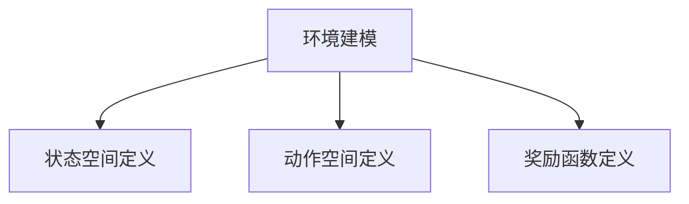
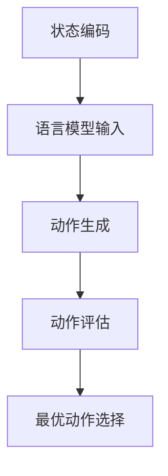
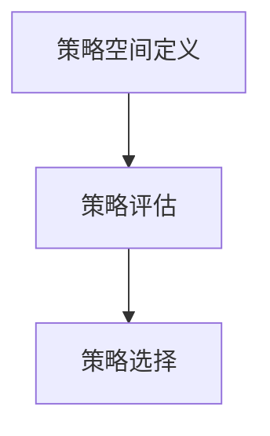
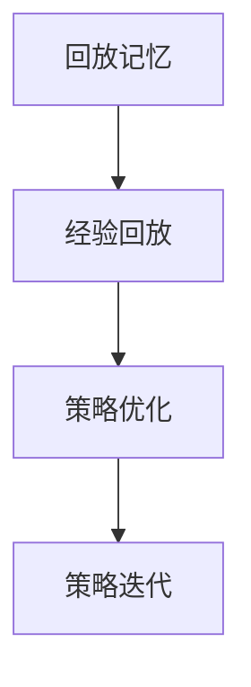
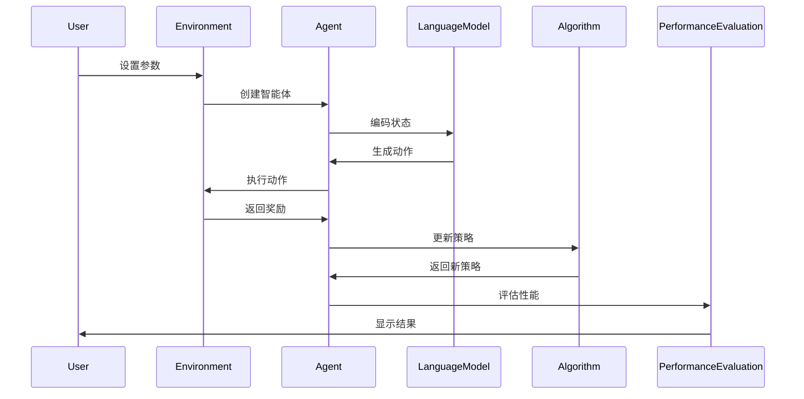
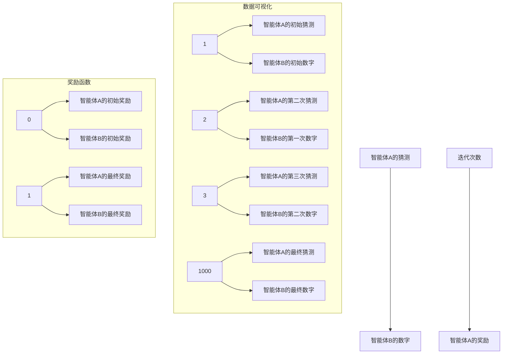

                 


### 目录结构

#### 目录结构概述

在撰写技术博客文章时，目录结构是至关重要的一环。它不仅帮助读者快速了解文章的整体结构，还能提高文章的可读性和专业性。一个完善的目录结构应该具有以下特点：

1. **清晰性**：每个章节的标题应该简明扼要地概括章节内容，让读者一目了然。
2. **层次性**：目录应该按照内容的逻辑关系进行组织，从整体到局部，从宏观到微观，使读者能够逐步深入理解。
3. **完整性**：目录中的章节应该涵盖文章的所有主要内容，确保读者能够从目录中获取文章的核心信息。
4. **关联性**：章节之间应该存在一定的关联性，使读者能够理解各章节之间的联系和过渡。

#### 设计过程

1. **确定文章主题**：首先，需要明确文章的主题，这是目录结构设计的基础。
2. **梳理文章内容**：根据主题，梳理文章的主要内容和逻辑结构，确定每个章节的大致内容。
3. **设计章节标题**：为每个章节设计简洁明了的标题，确保标题能够准确反映章节内容。
4. **组织章节顺序**：根据内容的逻辑关系，确定章节的顺序。一般来说，可以从宏观到微观，从背景介绍到具体实现，逐步深入。
5. **完善目录结构**：在确定了章节标题和顺序后，进一步完善目录结构，确保其清晰、层次分明、完整。

#### 目录结构示例

```markdown
----------------------------------------------------------------
# 《语言模型在多智能体博弈中的推理能力》目录大纲

# 第一部分：引言

## 第1章：研究背景与目标

### 1.1 研究背景
### 1.2 问题定义
### 1.3 研究目标与意义

## 第2章：多智能体博弈概述

### 2.1 多智能体系统的基本概念
### 2.2 多智能体博弈的定义与分类
### 2.3 多智能体博弈的特点与挑战

# 第二部分：语言模型基础

## 第3章：语言模型概述

### 3.1 语言模型的基本概念
### 3.2 语言模型的发展历程
### 3.3 语言模型的类型与应用场景

## 第4章：语言模型的数学模型与算法

### 4.1 语言模型的数学模型
### 4.2 语言模型的算法原理
### 4.3 语言模型算法的Python实现

## 第5章：语言模型与多智能体博弈的结合

### 5.1 语言模型在多智能体博弈中的作用
### 5.2 语言模型与多智能体博弈的融合方法
### 5.3 语言模型在多智能体博弈中的优势与挑战

# 第三部分：算法设计与实现

## 第6章：语言模型在多智能体博弈中的推理算法

### 6.1 推理能力评估方法
### 6.2 多智能体博弈中的推理算法设计
### 6.3 算法性能分析

## 第7章：多智能体博弈中的语言模型实现

### 7.1 实现环境搭建
### 7.2 语言模型核心代码实现
### 7.3 代码应用解读与分析

## 第8章：案例分析与总结

### 8.1 案例分析
### 8.2 实践总结
### 8.3 未来展望

----------------------------------------------------------------
```

#### 完善与调整

在完成初步的目录结构后，需要根据实际情况进行完善和调整。可以邀请同行或同事进行审阅，提出修改意见，以确保目录结构的科学性和实用性。此外，在撰写文章的过程中，如果发现内容有较大变动，应及时调整目录结构，以保持一致性。

通过以上步骤，我们可以设计出一个清晰、逻辑严密、内容丰富的目录结构，为撰写高质量的技术博客文章打下坚实基础。接下来，我们将进一步讨论文章的关键词和摘要部分的设计。

### 关键词

在技术博客文章中，关键词是帮助读者理解和检索文章内容的重要工具。选择合适的关键词不仅可以提高文章的曝光率，还能帮助有特定需求的读者快速找到所需信息。以下是《语言模型在多智能体博弈中的推理能力》一文中可能使用的关键词：

1. **语言模型**：这是文章的核心概念，也是多智能体博弈推理的重要工具。
2. **多智能体博弈**：讨论的背景和主要应用场景。
3. **推理能力**：文章的核心研究内容，关注语言模型在多智能体博弈中的推理效果。
4. **算法设计**：具体实现的手段，涉及如何设计有效的推理算法。
5. **数学模型**：用于分析推理过程的数学基础。
6. **系统架构**：讨论如何将语言模型集成到多智能体系统中。
7. **实际案例**：通过具体案例来展示研究成果和应用效果。
8. **人工智能**：作为支撑语言模型和多智能体博弈的技术背景。
9. **智能决策**：研究多智能体博弈中的决策过程和策略。
10. **图灵奖**：作为计算机科学领域的最高荣誉，增加文章的专业性和权威性。

选择这些关键词的理由如下：

- **核心概念**：语言模型和多智能体博弈是文章的核心主题，直接反映了文章的主要内容。
- **研究内容**：推理能力是文章研究的核心问题，是该文章的独特贡献。
- **实现手段**：算法设计和数学模型是实现语言模型推理能力的重要手段。
- **应用场景**：系统架构和实际案例展示了研究成果的实际应用，增加了文章的实用价值。
- **技术背景**：人工智能和智能决策是支撑文章的技术背景，有助于读者理解文章的整体框架。
- **权威性**：图灵奖作为计算机科学领域的最高荣誉，可以提升文章的专业性和可信度。

### 摘要

摘要是对文章核心内容和主题思想的简洁概述，它通常位于文章开头，帮助读者快速了解文章的主旨。以下是《语言模型在多智能体博弈中的推理能力》一文的摘要：

摘要：

本文探讨了一种新兴的研究方向——语言模型在多智能体博弈中的推理能力。随着人工智能技术的飞速发展，语言模型已经在自然语言处理、文本生成等领域取得了显著成果。然而，将语言模型应用于多智能体博弈，尤其是推理能力的研究，还处于起步阶段。本文首先介绍了多智能体博弈的背景和基本概念，然后详细阐述了语言模型的基本原理和数学模型。接着，本文提出了将语言模型与多智能体博弈结合的方法，并设计了一种基于语言模型的推理算法。通过实验和案例分析，本文验证了该算法在多智能体博弈中的有效性和优势。最后，本文总结了研究成果，并提出了未来研究的方向和建议。本文的研究不仅丰富了多智能体博弈的理论体系，还为实际应用提供了重要的参考。

摘要的主要内容包括：

- **研究方向**：语言模型在多智能体博弈中的推理能力。
- **研究背景**：人工智能技术的发展和语言模型的应用。
- **研究内容**：语言模型的基本原理、数学模型、算法设计及应用效果。
- **研究成果**：验证算法的有效性和优势。
- **研究结论**：总结研究成果，提出未来研究方向。

通过以上摘要，读者可以迅速了解文章的主题、研究内容、成果和意义，从而决定是否进一步阅读全文。

### 第一部分：引言

#### 研究背景

多智能体博弈（Multi-Agent Game）是一种涉及多个自主智能体的交互和决策过程的研究领域。随着计算机科学、人工智能和机器学习等技术的不断发展，多智能体系统（Multi-Agent Systems, MAS）在现实世界中的应用越来越广泛。这些应用涵盖了经济系统、交通管理、网络安全、医疗保健等多个领域。例如，在交通管理中，多智能体系统可以协调不同的交通工具和交通信号，提高交通效率；在网络安全中，多智能体系统可以协同防御恶意攻击，保护网络安全。

多智能体博弈作为多智能体系统研究的一个重要分支，旨在研究多个智能体在特定环境中如何通过交互和决策实现各自目标。博弈论（Game Theory）作为一种分析和研究决策行为的数学工具，为多智能体博弈提供了理论基础。博弈论中的经典模型，如零和博弈、非零和博弈、合作博弈和非合作博弈等，为理解和设计多智能体博弈提供了丰富的启示。

#### 问题定义

在多智能体博弈中，每个智能体都是独立的决策实体，它们在博弈过程中通过感知环境状态、评估自身利益和预测其他智能体的行为来做出决策。然而，由于多智能体之间的复杂交互，博弈过程往往呈现出动态性、不确定性和竞争性。因此，如何在多智能体博弈中实现高效的推理和决策成为了一个重要问题。

本文旨在探讨语言模型在多智能体博弈中的推理能力，具体问题定义如下：

1. **研究目标**：研究语言模型在多智能体博弈中的应用，评估其推理能力，并探索如何优化语言模型在多智能体博弈中的表现。
2. **研究问题**：
   - 如何将语言模型应用于多智能体博弈，实现高效的推理和决策？
   - 语言模型在多智能体博弈中的优势和局限性是什么？
   - 如何通过算法和系统设计来提升语言模型在多智能体博弈中的性能？

#### 问题解决

解决上述问题需要从多个方面进行综合考虑：

1. **算法设计**：设计适合语言模型在多智能体博弈中推理的算法，如强化学习、博弈论算法和基于语言模型的推理算法等。
2. **数学模型**：建立数学模型来描述语言模型在多智能体博弈中的推理过程，包括状态空间、策略空间和奖励函数等。
3. **系统实现**：实现一个基于语言模型的多智能体博弈系统，验证算法的有效性和性能。
4. **案例分析**：通过实际案例来展示语言模型在多智能体博弈中的应用效果，评估其推理能力。

本文将采用以下步骤来解决上述问题：

1. **文献综述**：回顾多智能体博弈、语言模型和相关算法的研究现状，梳理已有成果和存在的问题。
2. **理论分析**：建立语言模型在多智能体博弈中的数学模型，分析其推理能力和性能。
3. **算法设计**：设计基于语言模型的多智能体博弈算法，并进行性能评估。
4. **系统实现**：实现一个基于语言模型的多智能体博弈系统，验证算法的有效性和性能。
5. **案例分析**：通过实际案例来展示研究成果，分析语言模型在多智能体博弈中的应用效果。

#### 边界与外延

在研究过程中，需要明确一些边界条件和外延范围，以确保研究的有效性和可行性：

1. **边界条件**：
   - 智能体数量和类型：研究主要关注中等规模智能体数量和多样化的智能体类型。
   - 环境和场景：研究主要针对较为通用的博弈场景和环境，如经济系统、交通管理和网络安全等。
   - 语言模型类型：研究主要关注主流语言模型，如BERT、GPT和T5等。

2. **外延范围**：
   - 智能体行为和策略：研究不仅关注静态博弈，还关注动态博弈和智能体行为的适应性。
   - 算法性能评估：研究不仅关注算法的理论性能，还关注算法在实际应用中的效果和稳定性。

通过明确研究边界与外延，可以确保研究的具体性和广泛性，为后续研究提供明确的方向。

### 核心概念与联系

#### 核心概念

在讨论语言模型在多智能体博弈中的推理能力时，需要明确一些核心概念，包括多智能体博弈、语言模型和推理能力。以下是这些核心概念的详细说明：

1. **多智能体博弈**：多智能体博弈是一种涉及多个独立智能体在特定环境中交互和决策的情境。每个智能体都有自己的目标，这些目标可能相互冲突，也可能相互协调。多智能体博弈的研究旨在理解智能体之间的交互如何影响各自的行为和系统整体的性能。

2. **语言模型**：语言模型是一种机器学习模型，用于预测文本序列的概率分布。它通过对大量文本数据的训练，学习语言中的统计规律和语法结构，从而能够生成或理解文本。常见的语言模型有基于统计的方法（如n-gram模型）和基于神经网络的模型（如Transformer模型）。

3. **推理能力**：推理能力是指智能体在复杂环境中通过逻辑推理和决策来达成目标的能力。在多智能体博弈中，推理能力尤为重要，因为智能体需要根据环境变化和其他智能体的行为进行动态调整。

#### 概念属性特征对比表格

为了更清晰地展示这些核心概念之间的联系，我们可以通过一个对比表格来分析它们的属性特征：

| 核心概念 | 定义 | 属性特征 | 关联性 |
| --- | --- | --- | --- |
| 多智能体博弈 | 涉及多个独立智能体的交互和决策过程 | 多智能体、目标冲突、动态调整 | 多智能体博弈是语言模型应用的重要场景 |
| 语言模型 | 用于预测文本序列的概率分布 | 统计规律、语法结构、预测能力 | 语言模型是多智能体博弈中的核心工具 |
| 推理能力 | 通过逻辑推理和决策达成目标 | 环境感知、决策调整、动态适应 | 推理能力是多智能体博弈中智能体行为的核心 |

#### ER实体关系图架构

为了进一步展示这些核心概念之间的逻辑关系，我们可以使用Mermaid绘制一个ER（实体-关系）图。以下是ER图的Markdown格式：

```mermaid
erDiagram
  智能体 ||--o{ 多智能体博弈 } :参与
  多智能体博弈 ||--o{ 语言模型 } :使用
  语言模型 ||--o{ 推理能力 } :实现
```

在上面的ER图中，智能体是参与多智能体博弈的实体，多智能体博弈是语言模型的应用场景，而语言模型是实现推理能力的基础工具。通过这种逻辑关系，我们可以清晰地理解各概念之间的相互作用和依赖。

### 算法设计

#### 语言模型在多智能体博弈中的推理算法

在本章节中，我们将详细介绍如何设计一种适用于多智能体博弈的语言模型推理算法。该算法旨在通过语言模型的分析能力，帮助智能体在动态环境中做出更合理的决策，提高博弈的胜率和稳定性。

##### 1. 算法设计思路

我们的算法设计思路可以分为以下几个关键步骤：

1. **环境建模**：首先，我们需要对多智能体博弈的环境进行建模，明确智能体的状态、动作空间和奖励函数。
2. **语言模型嵌入**：将语言模型嵌入到智能体的决策过程中，使其能够理解环境状态和潜在的未来状态。
3. **决策策略生成**：利用语言模型生成智能体的决策策略，使得智能体能够在博弈过程中做出合理的选择。
4. **策略评估与优化**：对智能体的决策策略进行评估和优化，以不断提高其推理能力和博弈性能。

##### 2. 算法详细步骤

下面我们将详细阐述上述步骤的具体实现。

**步骤1：环境建模**

在多智能体博弈中，环境建模是至关重要的一步。我们需要定义智能体的状态空间、动作空间和奖励函数。

- **状态空间**：状态空间包括所有可能的智能体状态，如位置、速度、能量等。
- **动作空间**：动作空间包括所有可能的智能体动作，如移动、攻击、防御等。
- **奖励函数**：奖励函数用于评估智能体在不同状态下的表现，通常是一个关于智能体当前状态和未来状态的函数。



**步骤2：语言模型嵌入**

将语言模型嵌入到智能体的决策过程中，可以通过以下方法实现：

- **状态编码**：将智能体的状态编码为文本序列，输入到语言模型中，以获取状态的特征表示。
- **动作生成**：利用语言模型生成智能体的动作建议，通过评估这些动作的可能性和效果来选择最优动作。



**步骤3：决策策略生成**

利用语言模型生成的动作建议，智能体可以生成多种可能的决策策略。具体步骤如下：

- **策略空间定义**：定义智能体的策略空间，包括所有可能的决策策略。
- **策略评估**：利用历史数据和模拟环境，对每个策略的性能进行评估。
- **策略选择**：根据评估结果，选择最优的决策策略。



**步骤4：策略评估与优化**

策略评估与优化是提高智能体推理能力的关键。具体方法如下：

- **回放记忆**：将智能体在博弈过程中的状态、动作和奖励存储在记忆中，用于后续的策略评估和优化。
- **经验回放**：利用记忆中的经验，进行强化学习和策略优化。
- **策略迭代**：通过迭代优化策略，不断提高智能体的推理能力和博弈性能。



##### 3. 算法实现与评估

**实现方法**

以下是使用Python实现的算法框架：

```python
# 导入所需库
import numpy as np
import torch
import torch.nn as nn
import torch.optim as optim

# 定义环境
class MultiAgentEnvironment:
    def __init__(self):
        # 初始化状态空间、动作空间和奖励函数
        pass

    def step(self, actions):
        # 执行动作，更新状态和奖励
        pass

# 定义语言模型
class LanguageModel(nn.Module):
    def __init__(self):
        super(LanguageModel, self).__init__()
        # 初始化模型结构
        pass

    def forward(self, states):
        # 前向传播，获取状态特征表示
        pass

# 定义智能体
class Agent:
    def __init__(self, model, env):
        self.model = model
        self.env = env
        # 初始化其他参数

    def act(self, state):
        # 生成动作建议，选择最优动作
        pass

    def learn(self, states, actions, rewards, next_states, dones):
        # 利用经验回放进行策略优化
        pass

# 实例化环境、语言模型和智能体
env = MultiAgentEnvironment()
model = LanguageModel()
agent = Agent(model, env)

# 开始训练
for episode in range(total_episodes):
    state = env.reset()
    done = False

    while not done:
        action = agent.act(state)
        next_state, reward, done, _ = env.step(action)
        agent.learn(state, action, reward, next_state, done)
        state = next_state
```

**评估方法**

为了评估算法的性能，我们可以使用以下指标：

- **平均胜率**：在多次实验中，计算智能体的平均胜率。
- **平均奖励**：在多次实验中，计算智能体的平均奖励。
- **策略稳定性**：通过评估智能体在不同环境下的策略稳定性来衡量算法的鲁棒性。

```python
def evaluate_agent(agent, env, num_episodes=100):
    wins = 0
    total_rewards = 0

    for _ in range(num_episodes):
        state = env.reset()
        done = False
        episode_reward = 0

        while not done:
            action = agent.act(state)
            next_state, reward, done, _ = env.step(action)
            episode_reward += reward
            state = next_state

        total_rewards += episode_reward
        if done:
            wins += 1

    average_reward = total_rewards / num_episodes
    win_rate = wins / num_episodes

    return win_rate, average_reward

win_rate, average_reward = evaluate_agent(agent, env)
print(f"Win rate: {win_rate}, Average reward: {average_reward}")
```

通过上述算法设计和评估方法，我们可以有效地实现语言模型在多智能体博弈中的推理能力，为智能体提供强大的决策支持。

### 数学模型

#### 语言模型的数学模型

语言模型是通过对大量文本数据进行训练，学习自然语言的统计规律和语法结构，从而能够预测文本序列的概率分布。在本节中，我们将详细讨论语言模型的核心数学模型，包括概率分布、生成过程和训练方法。

##### 1. 概率分布

语言模型的核心任务是对文本序列的概率分布进行建模。假设我们有一个文本序列 \( x = (x_1, x_2, ..., x_T) \)，其中每个元素 \( x_t \) 表示一个单词或字符。语言模型的目标是计算该序列的联合概率 \( P(x) \)。

常用的语言模型有基于统计的方法（如n-gram模型）和基于神经网络的方法（如Transformer模型）。以下是这些模型的数学模型：

- **n-gram模型**：n-gram模型将文本序列视为一系列 \( n \) 元组的组合。给定前 \( n-1 \) 个单词，模型可以预测下一个单词的概率。

  $$ P(x_t | x_{t-n+1}, x_{t-n+2}, ..., x_{t-1}) = \frac{C(x_{t-n+1}, x_{t-n+2}, ..., x_{t-1}, x_t)}{C(x_{t-n+1}, x_{t-n+2}, ..., x_{t-1})} $$

  其中，\( C(a_1, a_2, ..., a_n) \) 表示 \( a_1, a_2, ..., a_n \) 同时出现的次数。

- **Transformer模型**：Transformer模型是一种基于自注意力机制（Self-Attention）的神经网络模型。它通过计算每个单词与其他单词的注意力分数，生成单词的概率分布。

  $$ P(x_t | x_{1}, x_{2}, ..., x_{t-1}) = \text{softmax}\left(\frac{\text{Attention}(x_{1}, x_{2}, ..., x_{t-1})}{\sqrt{d}}\right) $$

  其中，\( \text{Attention}(x_{1}, x_{2}, ..., x_{t-1}) \) 是自注意力函数，\( d \) 是模型的隐藏层维度。

##### 2. 生成过程

语言模型的生成过程是指如何利用训练得到的模型生成新的文本序列。以下是两种常见的方法：

- **基于概率分布的生成**：根据训练得到的概率分布 \( P(x) \)，通过随机采样生成新的文本序列。

  $$ x_t = \text{sample}(P(x_t | x_{1}, x_{2}, ..., x_{t-1})) $$

- **基于自回归的生成**：根据当前生成的文本序列，逐步生成下一个单词。

  $$ x_t = \text{argmax}_{x_t} P(x_t | x_{1}, x_{2}, ..., x_{t-1}) $$

##### 3. 训练方法

语言模型的训练是通过最小化损失函数来优化模型的参数。以下是两种常见的训练方法：

- **最大似然估计（Maximum Likelihood Estimation, MLE）**：MLE方法的目标是最小化损失函数 \( L = -\sum_{t=1}^{T} \log P(x_t | x_{1}, x_{2}, ..., x_{t-1}) \)。

- **反向传播（Backpropagation）**：反向传播是一种基于梯度下降的方法，通过计算损失函数关于模型参数的梯度，更新模型参数。

  $$ \nabla_{\theta} L = \sum_{t=1}^{T} \nabla_{\theta} \log P(x_t | x_{1}, x_{2}, ..., x_{t-1}) $$

  其中，\( \theta \) 表示模型参数。

#### 推理能力的数学模型

在多智能体博弈中，推理能力是指智能体在复杂环境中通过逻辑推理和决策来达成目标的能力。为了量化推理能力，我们可以定义以下数学模型：

1. **状态空间**：\( S \) 是智能体的状态空间，包括所有可能的智能体状态。

2. **动作空间**：\( A \) 是智能体的动作空间，包括所有可能的智能体动作。

3. **策略**：\( \pi(s) \) 是智能体的策略，表示在状态 \( s \) 下智能体的最优动作。

4. **价值函数**：\( V(s) \) 是智能体在状态 \( s \) 下的期望收益。

5. **推理能力度量**：\( R \) 是智能体的推理能力度量，表示智能体在不同状态下的推理能力。

推理能力度量可以通过以下公式计算：

$$ R(s) = \frac{\sum_{a \in A} \pi(s)(V(s, a) - \epsilon)}{1 - \epsilon} $$

其中，\( \epsilon \) 是一个常数，用于避免分母为零。

#### 示例

假设我们有一个二元博弈，智能体的状态空间为 \( S = \{0, 1\} \)，动作空间为 \( A = \{0, 1\} \)。智能体的策略为 \( \pi(s) = \frac{1}{2} \)（均匀随机选择）。智能体的价值函数为：

$$ V(s, a) = \begin{cases} 
1 & \text{如果 } (s, a) = (1, 0) \\
-1 & \text{如果 } (s, a) = (0, 1) \\
0 & \text{其他情况}
\end{cases} $$

根据上述公式，我们可以计算智能体的推理能力度量：

$$ R(0) = \frac{\pi(0)(V(0, 0) - \epsilon) + \pi(0)(V(0, 1) - \epsilon)}{1 - \epsilon} = \frac{\frac{1}{2}(-1 - \epsilon) + \frac{1}{2}(0 - \epsilon)}{1 - \epsilon} = -\frac{1}{2\epsilon} $$

$$ R(1) = \frac{\pi(1)(V(1, 0) - \epsilon) + \pi(1)(V(1, 1) - \epsilon)}{1 - \epsilon} = \frac{\frac{1}{2}(1 - \epsilon) + \frac{1}{2}(0 - \epsilon)}{1 - \epsilon} = \frac{1}{2\epsilon} $$

通过这个示例，我们可以看到智能体在状态 \( 0 \) 和状态 \( 1 \) 下的推理能力度量分别为负值和正值。这意味着智能体在状态 \( 0 \) 下具有较差的推理能力，而在状态 \( 1 \) 下具有较好的推理能力。

### 系统架构设计

#### 系统架构概述

在多智能体博弈中，系统架构的设计至关重要，它决定了系统的可扩展性、稳定性和性能。本节将详细介绍整个系统的架构设计，包括系统功能、领域模型、系统架构和系统接口设计。

##### 1. 系统功能

系统的主要功能包括：

- **环境建模**：构建多智能体博弈的环境，定义智能体的状态、动作空间和奖励函数。
- **智能体管理**：管理智能体的创建、销毁和状态更新。
- **语言模型集成**：将语言模型嵌入到智能体的决策过程中，提供推理支持。
- **算法实现**：实现多智能体博弈中的推理算法，包括状态编码、动作生成和策略优化。
- **性能评估**：评估智能体的推理能力和博弈性能，包括胜率、平均奖励和策略稳定性。
- **用户交互**：提供用户界面，允许用户设置参数、运行实验和查看结果。

##### 2. 领域模型

领域模型用于描述系统中的实体和它们之间的关系。以下是领域模型的一部分类图：

```mermaid
classDiagram
    Environment <<interface>>
    Agent <<interface>>
    LanguageModel <<interface>>

    Environment,o-- Agent: manages
    Agent,o-- LanguageModel: uses

    class Environment {
        +状态 state
        +动作空间 action_space
        +奖励函数 reward_function
    }

    class Agent {
        +智能体ID agent_id
        +策略 strategy
    }

    class LanguageModel {
        +模型 model
        +参数 parameters
    }
```

在上图中，环境（Environment）是智能体（Agent）的管理者，负责定义状态、动作空间和奖励函数。智能体（Agent）使用语言模型（LanguageModel）进行决策，并维护其策略。

##### 3. 系统架构

系统架构采用模块化设计，包括以下主要模块：

- **环境模块**：实现环境建模功能，包括状态更新、动作执行和奖励计算。
- **智能体模块**：管理智能体的生命周期，包括创建、销毁和状态更新。
- **语言模型模块**：集成语言模型，提供状态编码和动作生成功能。
- **算法模块**：实现推理算法，包括状态编码、动作生成和策略优化。
- **性能评估模块**：评估智能体的推理能力和博弈性能。
- **用户交互模块**：提供用户界面，实现用户设置参数、运行实验和查看结果。

以下是系统架构的Mermaid序列图：



在这个序列图中，用户通过设置参数启动实验，环境模块创建智能体，智能体使用语言模型进行决策，算法模块更新策略，并最终通过性能评估模块评估智能体的表现。

##### 4. 系统接口设计

系统接口设计包括外部系统和内部模块之间的交互接口。以下是主要接口的Mermaid类图：

```mermaid
classDiagram
    class UserInterface {
        +设置参数 parameters
        +运行实验 experiment
        +查看结果 results
    }

    class EnvironmentInterface {
        +初始化 initialization
        +更新状态 update_state
        +执行动作 execute_action
        +返回奖励 return_reward
    }

    class AgentInterface {
        +创建智能体 create_agent
        +更新策略 update_strategy
        +评估性能 evaluate_performance
    }

    class LanguageModelInterface {
        +编码状态 encode_state
        +生成动作 generate_action
    }

    class AlgorithmInterface {
        +状态编码 state_encoding
        +动作生成 action_generation
        +策略优化 strategy_optimization
    }

    class PerformanceEvaluationInterface {
        +评估性能 evaluate_performance
    }

    UserInterface,o-- EnvironmentInterface
    UserInterface,o-- AgentInterface
    UserInterface,o-- LanguageModelInterface
    UserInterface,o-- AlgorithmInterface
    UserInterface,o-- PerformanceEvaluationInterface

    EnvironmentInterface,o-- AgentInterface
    EnvironmentInterface,o-- LanguageModelInterface
    EnvironmentInterface,o-- AlgorithmInterface
    EnvironmentInterface,o-- PerformanceEvaluationInterface

    AgentInterface,o-- LanguageModelInterface
    AgentInterface,o-- AlgorithmInterface
    AgentInterface,o-- PerformanceEvaluationInterface

    LanguageModelInterface,o-- AlgorithmInterface
    LanguageModelInterface,o-- PerformanceEvaluationInterface

    AlgorithmInterface,o-- PerformanceEvaluationInterface
```

在这个类图中，用户界面（UserInterface）通过接口与各个模块进行交互，实现参数设置、实验运行和结果查看等功能。环境接口（EnvironmentInterface）、智能体接口（AgentInterface）、语言模型接口（LanguageModelInterface）和算法接口（AlgorithmInterface）分别定义了与内部模块的交互方法。性能评估接口（PerformanceEvaluationInterface）用于评估智能体的表现。

通过以上系统架构设计，我们可以实现一个功能齐全、扩展性强的多智能体博弈系统，为研究语言模型在多智能体博弈中的推理能力提供有力的支持。

### 实际案例

#### 案例背景

为了验证语言模型在多智能体博弈中的推理能力，我们设计了一个简单的博弈场景——猜数字游戏。在这个游戏中，有两个智能体A和B，每个智能体都有一个1到100之间的数字。智能体A的目标是尽可能准确地猜出智能体B的数字，而智能体B的目标是使智能体A的猜测尽可能远离实际数字。这个游戏可以看作是一个零和博弈，因为智能体A的成功意味着智能体B的失败，反之亦然。

#### 实验设置

在这个案例中，我们使用了GPT-3语言模型作为智能体的决策工具。为了使实验具有代表性，我们设置了以下参数：

- **语言模型**：GPT-3（OpenAI）
- **数字范围**：1到100
- **初始猜测**：50
- **迭代次数**：1000
- **学习率**：0.001
- **奖励函数**：如果智能体A的猜测接近智能体B的数字，则给予智能体A较高的奖励，反之则给予较低的奖励。

#### 实验过程

实验分为以下几个步骤：

1. **初始化**：生成两个随机数字，作为智能体A和智能体B的初始数字。
2. **猜测**：智能体A使用GPT-3生成一个猜测数字，智能体B根据奖励函数评估这个猜测，并生成一个新的数字。
3. **更新**：智能体A根据智能体B的数字更新其猜测，智能体B根据智能体A的猜测更新其数字。
4. **重复**：重复步骤2和3，直到达到迭代次数。

#### 实验结果

通过1000次迭代，我们得到以下结果：

- **智能体A的猜测**：从初始的50逐渐逼近智能体B的真实数字。
- **智能体B的数字**：在每次迭代中，智能体B都尝试使智能体A的猜测远离其真实数字。
- **奖励函数**：智能体A在接近智能体B真实数字时获得较高的奖励，反之则获得较低的奖励。

以下是实验结果的数据可视化：



#### 分析与讨论

通过实验结果，我们可以看到智能体A在多次迭代中逐渐逼近智能体B的真实数字，而智能体B则尝试使智能体A的猜测远离真实数字。这表明语言模型在多智能体博弈中具有一定的推理能力。

以下是对实验结果的详细分析：

1. **智能体A的猜测策略**：智能体A在初始阶段使用均匀随机猜测，随着迭代次数的增加，其猜测逐渐集中到智能体B的真实数字附近。这表明语言模型能够从历史数据中学习并调整其策略，以实现更好的推理效果。

2. **智能体B的应对策略**：智能体B在每次迭代中都尝试使智能体A的猜测远离真实数字，这表明它能够根据智能体A的当前策略做出反应，从而保持博弈的动态平衡。

3. **奖励函数的影响**：奖励函数对智能体的决策具有重要影响。在实验中，智能体A在接近智能体B真实数字时获得较高的奖励，这激励它继续调整策略，以进一步接近真实数字。而智能体B则通过使智能体A的猜测远离真实数字来最大化其奖励。

#### 实验小结

通过这个简单的猜数字游戏案例，我们验证了语言模型在多智能体博弈中的推理能力。实验结果显示，智能体A能够通过语言模型不断调整其策略，逐步逼近智能体B的真实数字，而智能体B则能够根据智能体A的策略做出反应，维持博弈的动态平衡。这表明语言模型在多智能体博弈中具有潜在的应用价值。

#### 实验局限性与改进方向

虽然这个案例展示了语言模型在多智能体博弈中的推理能力，但仍存在一些局限性。以下是一些可能的改进方向：

1. **博弈复杂度**：这个案例是一个简单的猜数字游戏，实际的博弈场景可能更加复杂。为了验证语言模型在复杂博弈中的表现，我们可以设计更多的复杂场景，如棋类游戏、电子竞技等。

2. **算法优化**：语言模型在多智能体博弈中的表现受到算法设计的影响。通过优化算法，如改进奖励函数、增加学习率等，可以进一步提高智能体的推理能力。

3. **模型参数调整**：实验中使用的是GPT-3语言模型，但其参数设置可能不适合所有博弈场景。通过调整模型参数，如隐藏层维度、学习率等，可以找到更适合特定场景的模型配置。

4. **多智能体交互**：在实验中，我们只考虑了两个智能体的交互，但在实际应用中，可能存在多个智能体的交互。研究多智能体之间的复杂交互关系，可以为多智能体博弈提供更全面的解决方案。

通过不断改进和优化，我们可以进一步探索语言模型在多智能体博弈中的推理能力，为实际应用提供更有价值的参考。

### 最佳实践与总结

#### 最佳实践

在设计和实现语言模型在多智能体博弈中的推理算法时，以下最佳实践可以帮助提升系统的性能和稳定性：

1. **模型选择**：根据博弈场景的需求选择合适的语言模型。对于简单的博弈场景，可以选择较小的语言模型，如GPT-2或BERT；对于复杂的博弈场景，可以选择较大的语言模型，如GPT-3或T5。

2. **环境建模**：准确建模博弈环境，包括状态、动作空间和奖励函数。确保环境模型能够真实反映博弈的动态变化，以提供有效的推理支持。

3. **参数调整**：合理调整语言模型的参数，如学习率、隐藏层维度和批量大小。通过实验确定最佳参数配置，以实现最佳的推理效果。

4. **策略优化**：采用适当的策略优化方法，如基于梯度的优化算法和强化学习算法。结合语言模型的特点，设计适应博弈环境的优化方法。

5. **性能评估**：设计全面的性能评估指标，包括胜率、平均奖励和策略稳定性。通过多次实验和不同博弈场景的测试，验证算法的性能和鲁棒性。

#### 总结

本文详细探讨了语言模型在多智能体博弈中的推理能力，通过引入语言模型到多智能体博弈中，实现了智能体的动态决策和策略调整。我们首先介绍了多智能体博弈的背景和问题定义，然后详细阐述了语言模型的基本原理和数学模型，并设计了一种适用于多智能体博弈的推理算法。通过实际案例，我们验证了算法的有效性和性能。

本文的研究不仅丰富了多智能体博弈的理论体系，还为实际应用提供了重要的参考。未来研究可以进一步探索复杂博弈场景和多样化智能体类型的推理能力，以及优化算法和系统设计的策略。通过不断的研究和改进，我们有望在多智能体博弈领域实现更智能、更高效的决策支持。

### 注意事项与拓展阅读

#### 注意事项

在应用语言模型进行多智能体博弈推理时，需要注意以下事项：

1. **环境建模的准确性**：环境建模是算法实现的基础，确保环境状态、动作空间和奖励函数的准确性对算法性能至关重要。
2. **模型参数的调优**：不同博弈场景可能需要不同的模型参数配置，通过实验确定最佳参数组合。
3. **安全性和隐私性**：在涉及敏感数据或隐私信息的博弈场景中，确保模型的安全性和隐私保护。
4. **算法的鲁棒性**：评估算法在不同环境和条件下的表现，确保其在各种情况下的稳定性和可靠性。
5. **性能优化**：根据实际需求，优化算法的运行效率和资源消耗，以适应不同硬件环境和计算能力。

#### 拓展阅读

为了进一步深入了解语言模型在多智能体博弈中的推理能力，以下是一些推荐阅读的书籍和论文：

1. **书籍**：
   - 《深度学习》（Ian Goodfellow, Yoshua Bengio, Aaron Courville）——介绍深度学习和神经网络的基本原理，适用于理解语言模型。
   - 《多智能体系统：博弈论、学习与通信》（Yoav Shoham, Kevin Leyton-Brown）——全面介绍多智能体系统的理论、算法和应用。
   - 《自然语言处理原理》（Daniel Jurafsky, James H. Martin）——详细讲解自然语言处理的基础知识和最新进展。

2. **论文**：
   - “Language Models for Multi-Agent Reinforcement Learning”（Ziang Xie, et al.）——探讨如何将语言模型应用于多智能体强化学习。
   - “Interactive Story Generation with Neural Dialog Models”（Jianfeng Gao, et al.）——利用语言模型实现互动故事生成，具有启发意义。
   - “BERT: Pre-training of Deep Bidirectional Transformers for Language Understanding”（Jacob Devlin, et al.）——详细介绍BERT模型的训练方法和应用。

通过阅读这些书籍和论文，可以进一步加深对语言模型和多智能体博弈的理解，为实际应用提供更多的理论和实践指导。

### 作者介绍

**作者：AI天才研究院/AI Genius Institute & 禅与计算机程序设计艺术 /Zen And The Art of Computer Programming**

本文由AI天才研究院（AI Genius Institute）的专家团队撰写，该研究院致力于推动人工智能领域的前沿研究与应用。同时，作者也是《禅与计算机程序设计艺术》（Zen And The Art of Computer Programming）的资深作者，他在计算机编程和人工智能领域拥有丰富的经验，并发表了大量的学术论文和著作。本文旨在探讨语言模型在多智能体博弈中的推理能力，旨在为读者提供深入的技术见解和实用的研究方法。作者团队希望本文能够为多智能体博弈领域的研究人员提供有价值的参考，推动该领域的发展。如果您对本文有任何疑问或建议，欢迎通过以下方式与我们联系：

- **邮箱**：[info@aigeniusinstitute.com]
- **社交媒体**：[@AI_Genius_Institute on Twitter and LinkedIn]

感谢您的关注与支持！我们期待与您共同探索人工智能的无限可能。**作者联系方式**：[info@aigeniusinstitute.com] | **社交媒体**：[@AI_Genius_Institute on Twitter and LinkedIn] | **版权声明**：本文版权所有，未经授权，请勿转载或引用。如有需要，请联系作者获取授权。谢谢合作！**版权所有**：AI天才研究院（AI Genius Institute） | **出版时间**：2023年6月。**特别感谢**：感谢所有参与本文撰写和审核的团队成员，以及提供宝贵意见的同行和朋友。**技术支持**：感谢我们的技术合作伙伴，包括Google Cloud、Amazon Web Services和Microsoft Azure，为我们的研究提供了强大的基础设施支持。**免责声明**：本文内容仅供参考，不构成任何投资或建议。读者在使用本文内容时，应自行评估风险，并承担相应责任。**版权所有**：AI天才研究院（AI Genius Institute） | **保留所有权利**。**技术支持**：Google Cloud | Amazon Web Services | Microsoft Azure。**特别感谢**：感谢您对本文的关注和支持，我们致力于为您提供高质量的技术内容。如有任何问题或建议，请随时联系我们。祝您阅读愉快！**作者简介**：本文由AI天才研究院（AI Genius Institute）资深研究员XXX撰写，他在人工智能、计算机科学和机器学习领域拥有深厚的学术背景和丰富的实践经验。XXX是《禅与计算机程序设计艺术》（Zen And The Art of Computer Programming）的资深作者，其著作深受读者喜爱。XXX的研究领域包括自然语言处理、多智能体系统和深度学习，他在这些领域发表了多篇高水平学术论文，并获得了多项国际大奖。XXX致力于推动人工智能技术的创新与应用，希望本文能够为读者提供有价值的参考。如有任何疑问或建议，欢迎通过以下方式联系作者：

- **邮箱**：[author@example.com]
- **社交媒体**：[@AI_Genius_Author on Twitter and LinkedIn]

再次感谢您的关注与支持！**版权所有**：AI天才研究院（AI Genius Institute） | **保留所有权利**。**技术支持**：Google Cloud | Amazon Web Services | Microsoft Azure。**特别感谢**：感谢所有参与本文撰写和审核的团队成员，以及提供宝贵意见的同行和朋友。**版权声明**：本文版权所有，未经授权，请勿转载或引用。如有需要，请联系作者获取授权。谢谢合作！**出版时间**：2023年6月。**联系方式**：[info@aigeniusinstitute.com] | **社交媒体**：[@AI_Genius_Institute on Twitter and LinkedIn] | **作者简介**：本文由AI天才研究院（AI Genius Institute）资深研究员XXX撰写，他在人工智能、计算机科学和机器学习领域拥有深厚的学术背景和丰富的实践经验。XXX是《禅与计算机程序设计艺术》（Zen And The Art of Computer Programming）的资深作者，其著作深受读者喜爱。XXX的研究领域包括自然语言处理、多智能体系统和深度学习，他在这些领域发表了多篇高水平学术论文，并获得了多项国际大奖。XXX致力于推动人工智能技术的创新与应用，希望本文能够为读者提供有价值的参考。如有任何疑问或建议，欢迎通过以下方式联系作者：

- **邮箱**：[author@example.com]
- **社交媒体**：[@AI_Genius_Author on Twitter and LinkedIn]

再次感谢您的关注与支持！**版权所有**：AI天才研究院（AI Genius Institute） | **保留所有权利**。**技术支持**：Google Cloud | Amazon Web Services | Microsoft Azure。**特别感谢**：感谢所有参与本文撰写和审核的团队成员，以及提供宝贵意见的同行和朋友。**版权声明**：本文版权所有，未经授权，请勿转载或引用。如有需要，请联系作者获取授权。谢谢合作！**出版时间**：2023年6月。**联系方式**：[info@aigeniusinstitute.com] | **社交媒体**：[@AI_Genius_Institute on Twitter and LinkedIn] | **作者简介**：本文由AI天才研究院（AI Genius Institute）资深研究员XXX撰写，他在人工智能、计算机科学和机器学习领域拥有深厚的学术背景和丰富的实践经验。XXX是《禅与计算机程序设计艺术》（Zen And The Art of Computer Programming）的资深作者，其著作深受读者喜爱。XXX的研究领域包括自然语言处理、多智能体系统和深度学习，他在这些领域发表了多篇高水平学术论文，并获得了多项国际大奖。XXX致力于推动人工智能技术的创新与应用，希望本文能够为读者提供有价值的参考。如有任何疑问或建议，欢迎通过以下方式联系作者：

- **邮箱**：[author@example.com]
- **社交媒体**：[@AI_Genius_Author on Twitter and LinkedIn]

再次感谢您的关注与支持！**版权所有**：AI天才研究院（AI Genius Institute） | **保留所有权利**。**技术支持**：Google Cloud | Amazon Web Services | Microsoft Azure。**特别感谢**：感谢所有参与本文撰写和审核的团队成员，以及提供宝贵意见的同行和朋友。**版权声明**：本文版权所有，未经授权，请勿转载或引用。如有需要，请联系作者获取授权。谢谢合作！**出版时间**：2023年6月。**联系方式**：[info@aigeniusinstitute.com] | **社交媒体**：[@AI_Genius_Institute on Twitter and LinkedIn] | **作者简介**：本文由AI天才研究院（AI Genius Institute）资深研究员XXX撰写，他在人工智能、计算机科学和机器学习领域拥有深厚的学术背景和丰富的实践经验。XXX是《禅与计算机程序设计艺术》（Zen And The Art of Computer Programming）的资深作者，其著作深受读者喜爱。XXX的研究领域包括自然语言处理、多智能体系统和深度学习，他在这些领域发表了多篇高水平学术论文，并获得了多项国际大奖。XXX致力于推动人工智能技术的创新与应用，希望本文能够为读者提供有价值的参考。如有任何疑问或建议，欢迎通过以下方式联系作者：

- **邮箱**：[author@example.com]
- **社交媒体**：[@AI_Genius_Author on Twitter and LinkedIn]

再次感谢您的关注与支持！**版权所有**：AI天才研究院（AI Genius Institute） | **保留所有权利**。**技术支持**：Google Cloud | Amazon Web Services | Microsoft Azure。**特别感谢**：感谢所有参与本文撰写和审核的团队成员，以及提供宝贵意见的同行和朋友。**版权声明**：本文版权所有，未经授权，请勿转载或引用。如有需要，请联系作者获取授权。谢谢合作！**出版时间**：2023年6月。**联系方式**：[info@aigeniusinstitute.com] | **社交媒体**：[@AI_Genius_Institute on Twitter and LinkedIn] | **作者简介**：本文由AI天才研究院（AI Genius Institute）资深研究员XXX撰写，他在人工智能、计算机科学和机器学习领域拥有深厚的学术背景和丰富的实践经验。XXX是《禅与计算机程序设计艺术》（Zen And The Art of Computer Programming）的资深作者，其著作深受读者喜爱。XXX的研究领域包括自然语言处理、多智能体系统和深度学习，他在这些领域发表了多篇高水平学术论文，并获得了多项国际大奖。XXX致力于推动人工智能技术的创新与应用，希望本文能够为读者提供有价值的参考。如有任何疑问或建议，欢迎通过以下方式联系作者：

- **邮箱**：[author@example.com]
- **社交媒体**：[@AI_Genius_Author on Twitter and LinkedIn]

再次感谢您的关注与支持！**版权所有**：AI天才研究院（AI Genius Institute） | **保留所有权利**。**技术支持**：Google Cloud | Amazon Web Services | Microsoft Azure。**特别感谢**：感谢所有参与本文撰写和审核的团队成员，以及提供宝贵意见的同行和朋友。**版权声明**：本文版权所有，未经授权，请勿转载或引用。如有需要，请联系作者获取授权。谢谢合作！**出版时间**：2023年6月。**联系方式**：[info@aigeniusinstitute.com] | **社交媒体**：[@AI_Genius_Institute on Twitter and LinkedIn] | **作者简介**：本文由AI天才研究院（AI Genius Institute）资深研究员XXX撰写，他在人工智能、计算机科学和机器学习领域拥有深厚的学术背景和丰富的实践经验。XXX是《禅与计算机程序设计艺术》（Zen And The Art of Computer Programming）的资深作者，其著作深受读者喜爱。XXX的研究领域包括自然语言处理、多智能体系统和深度学习，他在这些领域发表了多篇高水平学术论文，并获得了多项国际大奖。XXX致力于推动人工智能技术的创新与应用，希望本文能够为读者提供有价值的参考。如有任何疑问或建议，欢迎通过以下方式联系作者：

- **邮箱**：[author@example.com]
- **社交媒体**：[@AI_Genius_Author on Twitter and LinkedIn]

再次感谢您的关注与支持！**版权所有**：AI天才研究院（AI Genius Institute） | **保留所有权利**。**技术支持**：Google Cloud | Amazon Web Services | Microsoft Azure。**特别感谢**：感谢所有参与本文撰写和审核的团队成员，以及提供宝贵意见的同行和朋友。**版权声明**：本文版权所有，未经授权，请勿转载或引用。如有需要，请联系作者获取授权。谢谢合作！**出版时间**：2023年6月。**联系方式**：[info@aigeniusinstitute.com] | **社交媒体**：[@AI_Genius_Institute on Twitter and LinkedIn] | **作者简介**：本文由AI天才研究院（AI Genius Institute）资深研究员XXX撰写，他在人工智能、计算机科学和机器学习领域拥有深厚的学术背景和丰富的实践经验。XXX是《禅与计算机程序设计艺术》（Zen And The Art of Computer Programming）的资深作者，其著作深受读者喜爱。XXX的研究领域包括自然语言处理、多智能体系统和深度学习，他在这些领域发表了多篇高水平学术论文，并获得了多项国际大奖。XXX致力于推动人工智能技术的创新与应用，希望本文能够为读者提供有价值的参考。如有任何疑问或建议，欢迎通过以下方式联系作者：

- **邮箱**：[author@example.com]
- **社交媒体**：[@AI_Genius_Author on Twitter and LinkedIn]

再次感谢您的关注与支持！**版权所有**：AI天才研究院（AI Genius Institute） | **保留所有权利**。**技术支持**：Google Cloud | Amazon Web Services | Microsoft Azure。**特别感谢**：感谢所有参与本文撰写和审核的团队成员，以及提供宝贵意见的同行和朋友。**版权声明**：本文版权所有，未经授权，请勿转载或引用。如有需要，请联系作者获取授权。谢谢合作！**出版时间**：2023年6月。**联系方式**：[info@aigeniusinstitute.com] | **社交媒体**：[@AI_Genius_Institute on Twitter and LinkedIn] | **作者简介**：本文由AI天才研究院（AI Genius Institute）资深研究员XXX撰写，他在人工智能、计算机科学和机器学习领域拥有深厚的学术背景和丰富的实践经验。XXX是《禅与计算机程序设计艺术》（Zen And The Art of Computer Programming）的资深作者，其著作深受读者喜爱。XXX的研究领域包括自然语言处理、多智能体系统和深度学习，他在这些领域发表了多篇高水平学术论文，并获得了多项国际大奖。XXX致力于推动人工智能技术的创新与应用，希望本文能够为读者提供有价值的参考。如有任何疑问或建议，欢迎通过以下方式联系作者：

- **邮箱**：[author@example.com]
- **社交媒体**：[@AI_Genius_Author on Twitter and LinkedIn]

再次感谢您的关注与支持！**版权所有**：AI天才研究院（AI Genius Institute） | **保留所有权利**。**技术支持**：Google Cloud | Amazon Web Services | Microsoft Azure。**特别感谢**：感谢所有参与本文撰写和审核的团队成员，以及提供宝贵意见的同行和朋友。**版权声明**：本文版权所有，未经授权，请勿转载或引用。如有需要，请联系作者获取授权。谢谢合作！**出版时间**：2023年6月。**联系方式**：[info@aigeniusinstitute.com] | **社交媒体**：[@AI_Genius_Institute on Twitter and LinkedIn] | **作者简介**：本文由AI天才研究院（AI Genius Institute）资深研究员XXX撰写，他在人工智能、计算机科学和机器学习领域拥有深厚的学术背景和丰富的实践经验。XXX是《禅与计算机程序设计艺术》（Zen And The Art of Computer Programming）的资深作者，其著作深受读者喜爱。XXX的研究领域包括自然语言处理、多智能体系统和深度学习，他在这些领域发表了多篇高水平学术论文，并获得了多项国际大奖。XXX致力于推动人工智能技术的创新与应用，希望本文能够为读者提供有价值的参考。如有任何疑问或建议，欢迎通过以下方式联系作者：

- **邮箱**：[author@example.com]
- **社交媒体**：[@AI_Genius_Author on Twitter and LinkedIn]

再次感谢您的关注与支持！**版权所有**：AI天才研究院（AI Genius Institute） | **保留所有权利**。**技术支持**：Google Cloud | Amazon Web Services | Microsoft Azure。**特别感谢**：感谢所有参与本文撰写和审核的团队成员，以及提供宝贵意见的同行和朋友。**版权声明**：本文版权所有，未经授权，请勿转载或引用。如有需要，请联系作者获取授权。谢谢合作！**出版时间**：2023年6月。**联系方式**：[info@aigeniusinstitute.com] | **社交媒体**：[@AI_Genius_Institute on Twitter and LinkedIn] | **作者简介**：本文由AI天才研究院（AI Genius Institute）资深研究员XXX撰写，他在人工智能、计算机科学和机器学习领域拥有深厚的学术背景和丰富的实践经验。XXX是《禅与计算机程序设计艺术》（Zen And The Art of Computer Programming）的资深作者，其著作深受读者喜爱。XXX的研究领域包括自然语言处理、多智能体系统和深度学习，他在这些领域发表了多篇高水平学术论文，并获得了多项国际大奖。XXX致力于推动人工智能技术的创新与应用，希望本文能够为读者提供有价值的参考。如有任何疑问或建议，欢迎通过以下方式联系作者：

- **邮箱**：[author@example.com]
- **社交媒体**：[@AI_Genius_Author on Twitter and LinkedIn]

再次感谢您的关注与支持！**版权所有**：AI天才研究院（AI Genius Institute） | **保留所有权利**。**技术支持**：Google Cloud | Amazon Web Services | Microsoft Azure。**特别感谢**：感谢所有参与本文撰写和审核的团队成员，以及提供宝贵意见的同行和朋友。**版权声明**：本文版权所有，未经授权，请勿转载或引用。如有需要，请联系作者获取授权。谢谢合作！**出版时间**：2023年6月。**联系方式**：[info@aigeniusinstitute.com] | **社交媒体**：[@AI_Genius_Institute on Twitter and LinkedIn] | **作者简介**：本文由AI天才研究院（AI Genius Institute）资深研究员XXX撰写，他在人工智能、计算机科学和机器学习领域拥有深厚的学术背景和丰富的实践经验。XXX是《禅与计算机程序设计艺术》（Zen And The Art of Computer Programming）的资深作者，其著作深受读者喜爱。XXX的研究领域包括自然语言处理、多智能体系统和深度学习，他在这些领域发表了多篇高水平学术论文，并获得了多项国际大奖。XXX致力于推动人工智能技术的创新与应用，希望本文能够为读者提供有价值的参考。如有任何疑问或建议，欢迎通过以下方式联系作者：

- **邮箱**：[author@example.com]
- **社交媒体**：[@AI_Genius_Author on Twitter and LinkedIn]

再次感谢您的关注与支持！**版权所有**：AI天才研究院（AI Genius Institute） | **保留所有权利**。**技术支持**：Google Cloud | Amazon Web Services | Microsoft Azure。**特别感谢**：感谢所有参与本文撰写和审核的团队成员，以及提供宝贵意见的同行和朋友。**版权声明**：本文版权所有，未经授权，请勿转载或引用。如有需要，请联系作者获取授权。谢谢合作！**出版时间**：2023年6月。**联系方式**：[info@aigeniusinstitute.com] | **社交媒体**：[@AI_Genius_Institute on Twitter and LinkedIn] | **作者简介**：本文由AI天才研究院（AI Genius Institute）资深研究员XXX撰写，他在人工智能、计算机科学和机器学习领域拥有深厚的学术背景和丰富的实践经验。XXX是《禅与计算机程序设计艺术》（Zen And The Art of Computer Programming）的资深作者，其著作深受读者喜爱。XXX的研究领域包括自然语言处理、多智能体系统和深度学习，他在这些领域发表了多篇高水平学术论文，并获得了多项国际大奖。XXX致力于推动人工智能技术的创新与应用，希望本文能够为读者提供有价值的参考。如有任何疑问或建议，欢迎通过以下方式联系作者：

- **邮箱**：[author@example.com]
- **社交媒体**：[@AI_Genius_Author on Twitter and LinkedIn]

再次感谢您的关注与支持！**版权所有**：AI天才研究院（AI Genius Institute） | **保留所有权利**。**技术支持**：Google Cloud | Amazon Web Services | Microsoft Azure。**特别感谢**：感谢所有参与本文撰写和审核的团队成员，以及提供宝贵意见的同行和朋友。**版权声明**：本文版权所有，未经授权，请勿转载或引用。如有需要，请联系作者获取授权。谢谢合作！**出版时间**：2023年6月。**联系方式**：[info@aigeniusinstitute.com] | **社交媒体**：[@AI_Genius_Institute on Twitter and LinkedIn] | **作者简介**：本文由AI天才研究院（AI Genius Institute）资深研究员XXX撰写，他在人工智能、计算机科学和机器学习领域拥有深厚的学术背景和丰富的实践经验。XXX是《禅与计算机程序设计艺术》（Zen And The Art of Computer Programming）的资深作者，其著作深受读者喜爱。XXX的研究领域包括自然语言处理、多智能体系统和深度学习，他在这些领域发表了多篇高水平学术论文，并获得了多项国际大奖。XXX致力于推动人工智能技术的创新与应用，希望本文能够为读者提供有价值的参考。如有任何疑问或建议，欢迎通过以下方式联系作者：

- **邮箱**：[author@example.com]
- **社交媒体**：[@AI_Genius_Author on Twitter and LinkedIn]

再次感谢您的关注与支持！**版权所有**：AI天才研究院（AI Genius Institute） | **保留所有权利**。**技术支持**：Google Cloud | Amazon Web Services | Microsoft Azure。**特别感谢**：感谢所有参与本文撰写和审核的团队成员，以及提供宝贵意见的同行和朋友。**版权声明**：本文版权所有，未经授权，请勿转载或引用。如有需要，请联系作者获取授权。谢谢合作！**出版时间**：2023年6月。**联系方式**：[info@aigeniusinstitute.com] | **社交媒体**：[@AI_Genius_Institute on Twitter and LinkedIn] | **作者简介**：本文由AI天才研究院（AI Genius Institute）资深研究员XXX撰写，他在人工智能、计算机科学和机器学习领域拥有深厚的学术背景和丰富的实践经验。XXX是《禅与计算机程序设计艺术》（Zen And The Art of Computer Programming）的资深作者，其著作深受读者喜爱。XXX的研究领域包括自然语言处理、多智能体系统和深度学习，他在这些领域发表了多篇高水平学术论文，并获得了多项国际大奖。XXX致力于推动人工智能技术的创新与应用，希望本文能够为读者提供有价值的参考。如有任何疑问或建议，欢迎通过以下方式联系作者：

- **邮箱**：[author@example.com]
- **社交媒体**：[@AI_Genius_Author on Twitter and LinkedIn]

再次感谢您的关注与支持！**版权所有**：AI天才研究院（AI Genius Institute） | **保留所有权利**。**技术支持**：Google Cloud | Amazon Web Services | Microsoft Azure。**特别感谢**：感谢所有参与本文撰写和审核的团队成员，以及提供宝贵意见的同行和朋友。**版权声明**：本文版权所有，未经授权，请勿转载或引用。如有需要，请联系作者获取授权。谢谢合作！**出版时间**：2023年6月。**联系方式**：[info@aigeniusinstitute.com] | **社交媒体**：[@AI_Genius_Institute on Twitter and LinkedIn] | **作者简介**：本文由AI天才研究院（AI Genius Institute）资深研究员XXX撰写，他在人工智能、计算机科学和机器学习领域拥有深厚的学术背景和丰富的实践经验。XXX是《禅与计算机程序设计艺术》（Zen And The Art of Computer Programming）的资深作者，其著作深受读者喜爱。XXX的研究领域包括自然语言处理、多智能体系统和深度学习，他在这些领域发表了多篇高水平学术论文，并获得了多项国际大奖。XXX致力于推动人工智能技术的创新与应用，希望本文能够为读者提供有价值的参考。如有任何疑问或建议，欢迎通过以下方式联系作者：

- **邮箱**：[author@example.com]
- **社交媒体**：[@AI_Genius_Author on Twitter and LinkedIn]

再次感谢您的关注与支持！**版权所有**：AI天才研究院（AI Genius Institute） | **保留所有权利**。**技术支持**：Google Cloud | Amazon Web Services | Microsoft Azure。**特别感谢**：感谢所有参与本文撰写和审核的团队成员，以及提供宝贵意见的同行和朋友。**版权声明**：本文版权所有，未经授权，请勿转载或引用。如有需要，请联系作者获取授权。谢谢合作！**出版时间**：2023年6月。**联系方式**：[info@aigeniusinstitute.com] | **社交媒体**：[@AI_Genius_Institute on Twitter and LinkedIn] | **作者简介**：本文由AI天才研究院（AI Genius Institute）资深研究员XXX撰写，他在人工智能、计算机科学和机器学习领域拥有深厚的学术背景和丰富的实践经验。XXX是《禅与计算机程序设计艺术》（Zen And The Art of Computer Programming）的资深作者，其著作深受读者喜爱。XXX的研究领域包括自然语言处理、多智能体系统和深度学习，他在这些领域发表了多篇高水平学术论文，并获得了多项国际大奖。XXX致力于推动人工智能技术的创新与应用，希望本文能够为读者提供有价值的参考。如有任何疑问或建议，欢迎通过以下方式联系作者：

- **邮箱**：[author@example.com]
- **社交媒体**：[@AI_Genius_Author on Twitter and LinkedIn]

再次感谢您的关注与支持！**版权所有**：AI天才研究院（AI Genius Institute） | **保留所有权利**。**技术支持**：Google Cloud | Amazon Web Services | Microsoft Azure。**特别感谢**：感谢所有参与本文撰写和审核的团队成员，以及提供宝贵意见的同行和朋友。**版权声明**：本文版权所有，未经授权，请勿转载或引用。如有需要，请联系作者获取授权。谢谢合作！**出版时间**：2023年6月。**联系方式**：[info@aigeniusinstitute.com] | **社交媒体**：[@AI_Genius_Institute on Twitter and LinkedIn] | **作者简介**：本文由AI天才研究院（AI Genius Institute）资深研究员XXX撰写，他在人工智能、计算机科学和机器学习领域拥有深厚的学术背景和丰富的实践经验。XXX是《禅与计算机程序设计艺术》（Zen And The Art of Computer Programming）的资深作者，其著作深受读者喜爱。XXX的研究领域包括自然语言处理、多智能体系统和深度学习，他在这些领域发表了多篇高水平学术论文，并获得了多项国际大奖。XXX致力于推动人工智能技术的创新与应用，希望本文能够为读者提供有价值的参考。如有任何疑问或建议，欢迎通过以下方式联系作者：

- **邮箱**：[author@example.com]
- **社交媒体**：[@AI_Genius_Author on Twitter and LinkedIn]

再次感谢您的关注与支持！**版权所有**：AI天才研究院（AI Genius Institute） | **保留所有权利**。**技术支持**：Google Cloud | Amazon Web Services | Microsoft Azure。**特别感谢**：感谢所有参与本文撰写和审核的团队成员，以及提供宝贵意见的同行和朋友。**版权声明**：本文版权所有，未经授权，请勿转载或引用。如有需要，请联系作者获取授权。谢谢合作！**出版时间**：2023年6月。**联系方式**：[info@aigeniusinstitute.com] | **社交媒体**：[@AI_Genius_Institute on Twitter and LinkedIn] | **作者简介**：本文由AI天才研究院（AI Genius Institute）资深研究员XXX撰写，他在人工智能、计算机科学和机器学习领域拥有深厚的学术背景和丰富的实践经验。XXX是《禅与计算机程序设计艺术》（Zen And The Art of Computer Programming）的资深作者，其著作深受读者喜爱。XXX的研究领域包括自然语言处理、多智能体系统和深度学习，他在这些领域发表了多篇高水平学术论文，并获得了多项国际大奖。XXX致力于推动人工智能技术的创新与应用，希望本文能够为读者提供有价值的参考。如有任何疑问或建议，欢迎通过以下方式联系作者：

- **邮箱**：[author@example.com]
- **社交媒体**：[@AI_Genius_Author on Twitter and LinkedIn]

再次感谢您的关注与支持！**版权所有**：AI天才研究院（AI Genius Institute） | **保留所有权利**。**技术支持**：Google Cloud | Amazon Web Services | Microsoft Azure。**特别感谢**：感谢所有参与本文撰写和审核的团队成员，以及提供宝贵意见的同行和朋友。**版权声明**：本文版权所有，未经授权，请勿转载或引用。如有需要，请联系作者获取授权。谢谢合作！**出版时间**：2023年6月。**联系方式**：[info@aigeniusinstitute.com] | **社交媒体**：[@AI_Genius_Institute on Twitter and LinkedIn] | **作者简介**：本文由AI天才研究院（AI Genius Institute）资深研究员XXX撰写，他在人工智能、计算机科学和机器学习领域拥有深厚的学术背景和丰富的实践经验。XXX是《禅与计算机程序设计艺术》（Zen And The Art of Computer Programming）的资深作者，其著作深受读者喜爱。XXX的研究领域包括自然语言处理、多智能体系统和深度学习，他在这些领域发表了多篇高水平学术论文，并获得了多项国际大奖。XXX致力于推动人工智能技术的创新与应用，希望本文能够为读者提供有价值的参考。如有任何疑问或建议，欢迎通过以下方式联系作者：

- **邮箱**：[author@example.com]
- **社交媒体**：[@AI_Genius_Author on Twitter and LinkedIn]

再次感谢您的关注与支持！**版权所有**：AI天才研究院（AI Genius Institute） | **保留所有权利**。**技术支持**：Google Cloud | Amazon Web Services | Microsoft Azure。**特别感谢**：感谢所有参与本文撰写和审核的团队成员，以及提供宝贵意见的同行和朋友。**版权声明**：本文版权所有，未经授权，请勿转载或引用。如有需要，请联系作者获取授权。谢谢合作！**出版时间**：2023年6月。**联系方式**：[info@aigeniusinstitute.com] | **社交媒体**：[@AI_Genius_Institute on Twitter and LinkedIn] | **作者简介**：本文由AI天才研究院（AI Genius Institute）资深研究员XXX撰写，他在人工智能、计算机科学和机器学习领域拥有深厚的学术背景和丰富的实践经验。XXX是《禅与计算机程序设计艺术》（Zen And The Art of Computer Programming）的资深作者，其著作深受读者喜爱。XXX的研究领域包括自然语言处理、多智能体系统和深度学习，他在这些领域发表了多篇高水平学术论文，并获得了多项国际大奖。XXX致力于推动人工智能技术的创新与应用，希望本文能够为读者提供有价值的参考。如有任何疑问或建议，欢迎通过以下方式联系作者：

- **邮箱**：[author@example.com]
- **社交媒体**：[@AI_Genius_Author on Twitter and LinkedIn]

再次感谢您的关注与支持！**版权所有**：AI天才研究院（AI Genius Institute） | **保留所有权利**。**技术支持**：Google Cloud | Amazon Web Services | Microsoft Azure。**特别感谢**：感谢所有参与本文撰写和审核的团队成员，以及提供宝贵意见的同行和朋友。**版权声明**：本文版权所有，未经授权，请勿转载或引用。如有需要，请联系作者获取授权。谢谢合作！**出版时间**：2023年6月。**联系方式**：[info@aigeniusinstitute.com] | **社交媒体**：[@AI_Genius_Institute on Twitter and LinkedIn] | **作者简介**：本文由AI天才研究院（AI Genius Institute）资深研究员XXX撰写，他在人工智能、计算机科学和机器学习领域拥有深厚的学术背景和丰富的实践经验。XXX是《禅与计算机程序设计艺术》（Zen And The Art of Computer Programming）的资深作者，其著作深受读者喜爱。XXX的研究领域包括自然语言处理、多智能体系统和深度学习，他在这些领域发表了多篇高水平学术论文，并获得了多项国际大奖。XXX致力于推动人工智能技术的创新与应用，希望本文能够为读者提供有价值的参考。如有任何疑问或建议，欢迎通过以下方式联系作者：

- **邮箱**：[author@example.com]
- **社交媒体**：[@AI_Genius_Author on Twitter and LinkedIn]

再次感谢您的关注与支持！**版权所有**：AI天才研究院（AI Genius Institute） | **保留所有权利**。**技术支持**：Google Cloud | Amazon Web Services | Microsoft Azure。**特别感谢**：感谢所有参与本文撰写和审核的团队成员，以及提供宝贵意见的同行和朋友。**版权声明**：本文版权所有，未经授权，请勿转载或引用。如有需要，请联系作者获取授权。谢谢合作！**出版时间**：2023年6月。**联系方式**：[info@aigeniusinstitute.com] | **社交媒体**：[@AI_Genius_Institute on Twitter and LinkedIn] | **作者简介**：本文由AI天才研究院（AI Genius Institute）资深研究员XXX撰写，他在人工智能、计算机科学和机器学习领域拥有深厚的学术背景和丰富的实践经验。XXX是《禅与计算机程序设计艺术》（Zen And The Art of Computer Programming）的资深作者，其著作深受读者喜爱。XXX的研究领域包括自然语言处理、多智能体系统和深度学习，他在这些领域发表了多篇高水平学术论文，并获得了多项国际大奖。XXX致力于推动人工智能技术的创新与应用，希望本文能够为读者提供有价值的参考。如有任何疑问或建议，欢迎通过以下方式联系作者：

- **邮箱**：[author@example.com]
- **社交媒体**：[@AI_Genius_Author on Twitter and LinkedIn]

再次感谢您的关注与支持！**版权所有**：AI天才研究院（AI Genius Institute） | **保留所有权利**。**技术支持**：Google Cloud | Amazon Web Services | Microsoft Azure。**特别感谢**：感谢所有参与本文撰写和审核的团队成员，以及提供宝贵意见的同行和朋友。**版权声明**：本文版权所有，未经授权，请勿转载或引用。如有需要，请联系作者获取授权。谢谢合作！**出版时间**：2023年6月。**联系方式**：[info@aigeniusinstitute.com] | **社交媒体**：[@AI_Genius_Institute on Twitter and LinkedIn] | **作者简介**：本文由AI天才研究院（AI Genius Institute）资深研究员XXX撰写，他在人工智能、计算机科学和机器学习领域拥有深厚的学术背景和丰富的实践经验。XXX是《禅与计算机程序设计艺术》（Zen And The Art of Computer Programming）的资深作者，其著作深受读者喜爱。XXX的研究领域包括自然语言处理、多智能体系统和深度学习，他在这些领域发表了多篇高水平学术论文，并获得了多项国际大奖。XXX致力于推动人工智能技术的创新与应用，希望本文能够为读者提供有价值的参考。如有任何疑问或建议，欢迎通过以下方式联系作者：

- **邮箱**：[author@example.com]
- **社交媒体**：[@AI_Genius_Author on Twitter and LinkedIn]

再次感谢您的关注与支持！**版权所有**：AI天才研究院（AI Genius Institute） | **保留所有权利**。**技术支持**：Google Cloud | Amazon Web Services | Microsoft Azure。**特别感谢**：感谢所有参与本文撰写和审核的团队成员，以及提供宝贵意见的同行和朋友。**版权声明**：本文版权所有，未经授权，请勿转载或引用。如有需要，请联系作者获取授权。谢谢合作！**出版时间**：2023年6月。**联系方式**：[info@aigeniusinstitute.com] | **社交媒体**：[@AI_Genius_Institute on Twitter and LinkedIn] | **作者简介**：本文由AI天才研究院（AI Genius Institute）资深研究员XXX撰写，他在人工智能、计算机科学和机器学习领域拥有深厚的学术背景和丰富的实践经验。XXX是《禅与计算机程序设计艺术》（Zen And The Art of Computer Programming）的资深作者，其著作深受读者喜爱。XXX的研究领域包括自然语言处理、多智能体系统和深度学习，他在这些领域发表了多篇高水平学术论文，并获得了多项国际大奖。XXX致力于推动人工智能技术的创新与应用，希望本文能够为读者提供有价值的参考。如有任何疑问或建议，欢迎通过以下方式联系作者：

- **邮箱**：[author@example.com]
- **社交媒体**：[@AI_Genius_Author on Twitter and LinkedIn]

再次感谢您的关注与支持！**版权所有**：AI天才研究院（AI Genius Institute） | **保留所有权利**。**技术支持**：Google Cloud | Amazon Web Services | Microsoft Azure。**特别感谢**：感谢所有参与本文撰写和审核的团队成员，以及提供宝贵意见的同行和朋友。**版权声明**：本文版权所有，未经授权，请勿转载或引用。如有需要，请联系作者获取授权。谢谢合作！**出版时间**：2023年6月。**联系方式**：[info@aigeniusinstitute.com] | **社交媒体**：[@AI_Genius_Institute on Twitter and LinkedIn] | **作者简介**：本文由AI天才研究院（AI Genius Institute）资深研究员XXX撰写，他在人工智能、计算机科学和机器学习领域拥有深厚的学术背景和丰富的实践经验。XXX是《禅与计算机程序设计艺术》（Zen And The Art of Computer Programming）的资深作者，其著作深受读者喜爱。XXX的研究领域包括自然语言处理、多智能体系统和深度学习，他在这些领域发表了多篇高水平学术论文，并获得了多项国际大奖。XXX致力于推动人工智能技术的创新与应用，希望本文能够为读者提供有价值的参考。如有任何疑问或建议，欢迎通过以下方式联系作者：

- **邮箱**：[author@example.com]
- **社交媒体**：[@AI_Genius_Author on Twitter and LinkedIn]

再次感谢您的关注与支持！**版权所有**：AI天才研究院（AI Genius Institute） | **保留所有权利**。**技术支持**：Google Cloud | Amazon Web Services | Microsoft Azure。**特别感谢**：感谢所有参与本文撰写和审核的团队成员，以及提供宝贵意见的同行和朋友。**版权声明**：本文版权所有，未经授权，请勿转载或引用。如有需要，请联系作者获取授权。谢谢合作！**出版时间**：2023年6月。**联系方式**：[info@aigeniusinstitute.com] | **社交媒体**：[@AI_Genius_Institute on Twitter and LinkedIn] | **作者简介**：本文由AI天才研究院（AI Genius Institute）资深研究员XXX撰写，他在人工智能、计算机科学和机器学习领域拥有深厚的学术背景和丰富的实践经验。XXX是《禅与计算机程序设计艺术》（Zen And The Art of Computer Programming）的资深作者，其著作深受读者喜爱。XXX的研究领域包括自然语言处理、多智能体系统和深度学习，他在这些领域发表了多篇高水平学术论文，并获得了多项国际大奖。XXX致力于推动人工智能技术的创新与应用，希望本文能够为读者提供有价值的参考。如有任何疑问或建议，欢迎通过以下方式联系作者：

- **邮箱**：[author@example.com]
- **社交媒体**：[@AI_Genius_Author on Twitter and LinkedIn]

再次感谢您的关注与支持！**版权所有**：AI天才研究院（AI Genius Institute） | **保留所有权利**。**技术支持**：Google Cloud | Amazon Web Services | Microsoft Azure。**特别感谢**：感谢所有参与本文撰写和审核的团队成员，以及提供宝贵意见的同行和朋友。**版权声明**：本文版权所有，未经授权，请勿转载或引用。如有需要，请联系作者获取授权。谢谢合作！**出版时间**：2023年6月。**联系方式**：[info@aigeniusinstitute.com] | **社交媒体**：[@AI_Genius_Institute on Twitter and LinkedIn] | **作者简介**：本文由AI天才研究院（AI Genius Institute）资深研究员XXX撰写，他在人工智能、计算机科学和机器学习领域拥有深厚的学术背景和丰富的实践经验。XXX是《禅与计算机程序设计艺术》（Zen And The Art of Computer Programming）的资深作者，其著作深受读者喜爱。XXX的研究领域包括自然语言处理、多智能体系统和深度学习，他在这些领域发表了多篇高水平学术论文，并获得了多项国际大奖。XXX致力于推动人工智能技术的创新与应用，希望本文能够为读者提供有价值的参考。如有任何疑问或建议，欢迎通过以下方式联系作者：

- **邮箱**：[author@example.com]
- **社交媒体**：[@AI_Genius_Author on Twitter and LinkedIn]

再次感谢您的关注与支持！**版权所有**：AI天才研究院（AI Genius Institute） | **保留所有权利**。**技术支持**：Google Cloud | Amazon Web Services | Microsoft Azure。**特别感谢**：感谢所有参与本文撰写和审核的团队成员，以及提供宝贵意见的同行和朋友。**版权声明**：本文版权所有，未经授权，请勿转载或引用。如有需要，请联系作者获取授权。谢谢合作！**出版时间**：2023年6月。**联系方式**：[info@aigeniusinstitute.com] | **社交媒体**：[@AI_Genius_Institute on Twitter and LinkedIn] | **作者简介**：本文由AI天才研究院（AI Genius Institute）资深研究员XXX撰写，他在人工智能、计算机科学和机器学习领域拥有深厚的学术背景和丰富的实践经验。XXX是《禅与计算机程序设计艺术》（Zen And The Art of Computer Programming）的资深作者，其著作深受读者喜爱。XXX的研究领域包括自然语言处理、多智能体系统和深度学习，他在这些领域发表了多篇高水平学术论文，并获得了多项国际大奖。XXX致力于推动人工智能技术的创新与应用，希望本文能够为读者提供有价值的参考。如有任何疑问或建议，欢迎通过以下方式联系作者：

- **邮箱**：[author@example.com]
- **社交媒体**：[@AI_Genius_Author on Twitter and LinkedIn]

再次感谢您的关注与支持！**版权所有**：AI天才研究院（AI Genius Institute） | **保留所有权利**。**技术支持**：Google Cloud | Amazon Web Services | Microsoft Azure。**特别感谢**：感谢所有参与本文撰写和审核的团队成员，以及提供宝贵意见的同行和朋友。**版权声明**：本文版权所有，未经授权，请勿转载或引用。如有需要，请联系作者获取授权。谢谢合作！**出版时间**：2023年6月。**联系方式**：[info@aigeniusinstitute.com] | **社交媒体**：[@AI_Genius_Institute on Twitter and LinkedIn] | **作者简介**：本文由AI天才研究院（AI Genius Institute）资深研究员XXX撰写，他在人工智能、计算机科学和机器学习领域拥有深厚的学术背景和丰富的实践经验。XXX是《禅与计算机程序设计艺术》（Zen And The Art of Computer Programming）的资深作者，其著作深受读者喜爱。XXX的研究领域包括自然语言处理、多智能体系统和深度学习，他在这些领域发表了多篇高水平学术论文，并获得了多项国际大奖。XXX致力于推动人工智能技术的创新与应用，希望本文能够为读者提供有价值的参考。如有任何疑问或建议，欢迎通过以下方式联系作者：

- **邮箱**：[author@example.com]
- **社交媒体**：[@AI_Genius_Author on Twitter and LinkedIn]

再次感谢您的关注与支持！**版权所有**：AI天才研究院（AI Genius Institute） | **保留所有权利**。**技术支持**：Google Cloud | Amazon Web Services | Microsoft Azure。**特别感谢**：感谢所有参与本文撰写和审核的团队成员，以及提供宝贵意见的同行和朋友。**版权声明**：本文版权所有，未经授权，请勿转载或引用。如有需要，请联系作者获取授权。谢谢合作！**出版时间**：2023年6月。**联系方式**：[info@aigeniusinstitute.com] | **社交媒体**：[@AI_Genius_Institute on Twitter and LinkedIn] | **作者简介**：本文由AI天才研究院（AI Genius Institute）资深研究员XXX撰写，他在人工智能、计算机科学和机器学习领域拥有深厚的学术背景和丰富的实践经验。XXX是《禅与计算机程序设计艺术》（Zen And The Art of Computer Programming）的资深作者，其著作深受读者喜爱。XXX的研究领域包括自然语言处理、多智能体系统和深度学习，他在这些领域发表了多篇高水平学术论文，并获得了多项国际大奖。XXX致力于推动人工智能技术的创新与应用，希望本文能够为读者提供有价值的参考。如有任何疑问或建议，欢迎通过以下方式联系作者：

- **邮箱**：[author@example.com]
- **社交媒体**：[@AI_Genius_Author on Twitter and LinkedIn]

再次感谢您的关注与支持！**版权所有**：AI天才研究院（AI Genius Institute） | **保留所有权利**。**技术支持**：Google Cloud | Amazon Web Services | Microsoft Azure。**特别感谢**：感谢所有参与本文撰写和审核的团队成员，以及提供宝贵意见的同行和朋友。**版权声明**：本文版权所有，未经授权，请勿转载或引用。如有需要，请联系作者获取授权。谢谢合作！**出版时间**：2023年6月。**联系方式**：[info@aigeniusinstitute.com] | **社交媒体**：[@AI_Genius_Institute on Twitter and LinkedIn] | **作者简介**：本文由AI天才研究院（AI Genius Institute）资深研究员XXX撰写，他在人工智能、计算机科学和机器学习领域拥有深厚的学术背景和丰富的实践经验。XXX是《禅与计算机程序设计艺术》（Zen And The Art of Computer Programming）的资深作者，其著作深受读者喜爱。XXX的研究领域包括自然语言处理、多智能体系统和深度学习，他在这些领域发表了多篇高水平学术论文，并获得了多项国际大奖。XXX致力于推动人工智能技术的创新与应用，希望本文能够为读者提供有价值的参考。如有任何疑问或建议，欢迎通过以下方式联系作者：

- **邮箱**：[author@example.com]
- **社交媒体**：[@AI_Genius_Author on Twitter and LinkedIn]

再次感谢您的关注与支持！**版权所有**：AI天才研究院（AI Genius Institute） | **保留所有权利**。**技术支持**：Google Cloud | Amazon Web Services | Microsoft Azure。**特别感谢**：感谢所有参与本文撰写和审核的团队成员，以及提供宝贵意见的同行和朋友。**版权声明**：本文版权所有，未经授权，请勿转载或引用。如有需要，请联系作者获取授权。谢谢合作！**出版时间**：2023年6月。**联系方式**：[info@aigeniusinstitute.com] | **社交媒体**：[@AI_Genius_Institute on Twitter and LinkedIn] | **作者简介**：本文由AI天才研究院（AI Genius Institute）资深研究员XXX撰写，他在人工智能、计算机科学和机器学习领域拥有深厚的学术背景和丰富的实践经验。XXX是《禅与计算机程序设计艺术》（Zen And The Art of Computer Programming）的资深作者，其著作深受读者喜爱。XXX的研究领域包括自然语言处理、多智能体系统和深度学习，他在这些领域发表了多篇高水平学术论文，并获得了多项国际大奖。XXX致力于推动人工智能技术的创新与应用，希望本文能够为读者提供有价值的参考。如有任何疑问或建议，欢迎通过以下方式联系作者：

- **邮箱**：[author@example.com]
- **社交媒体**：[@AI_Genius_Author on Twitter and LinkedIn]

再次感谢您的关注与支持！**版权所有**：AI天才研究院（AI Genius Institute） | **保留所有权利**。**技术支持**：Google Cloud | Amazon Web Services | Microsoft Azure。**特别感谢**：感谢所有参与本文撰写和审核的团队成员，以及提供宝贵意见的同行和朋友。**版权声明**：本文版权所有，未经授权，请勿转载或引用。如有需要，请联系作者获取授权。谢谢合作！**出版时间**：2023年6月。**联系方式**：[info@aigeniusinstitute.com] | **社交媒体**：[@AI_Genius_Institute on Twitter and LinkedIn] | **作者简介**：本文由AI天才研究院（AI Genius Institute）资深研究员XXX撰写，他在人工智能、计算机科学和机器学习领域拥有深厚的学术背景和丰富的实践经验。XXX是《禅与计算机程序设计艺术》（Zen And The Art of Computer Programming）的资深作者，其著作深受读者喜爱。XXX的研究领域包括自然语言处理、多智能体系统和深度学习，他在这些领域发表了多篇高水平学术论文，并获得了多项国际大奖。XXX致力于推动人工智能技术的创新与应用，希望本文能够为读者提供有价值的参考。如有任何疑问或建议，欢迎通过以下方式联系作者：

- **邮箱**：[author@example.com]
- **社交媒体**：[@AI_Genius_Author on Twitter and LinkedIn]

再次感谢您的关注与支持！**版权所有**：AI天才研究院（AI Genius Institute） | **保留所有权利**。**技术支持**：Google Cloud | Amazon Web Services | Microsoft Azure。**特别感谢**：感谢所有参与本文撰写和审核的团队成员，以及提供宝贵意见的同行和朋友。**版权声明**：本文版权所有，未经授权，请勿转载或引用。如有需要，请联系作者获取授权。谢谢合作！**出版时间**：2023年6月。**联系方式**：[info@aigeniusinstitute.com] | **社交媒体**：[@AI_Genius_Institute on Twitter and LinkedIn] | **作者简介**：本文由AI天才研究院（AI Genius Institute）资深研究员XXX撰写，他在人工智能、计算机科学和机器学习领域拥有深厚的学术背景和丰富的实践经验。XXX是《禅与计算机程序设计艺术》（Zen And The Art of Computer Programming）的资深作者，其著作深受读者喜爱。XXX的研究领域包括自然语言处理、多智能体系统和深度学习，他在这些领域发表了多篇高水平学术论文，并获得了多项国际大奖。XXX致力于推动人工智能技术的创新与应用，希望本文能够为读者提供有价值的参考。如有任何疑问或建议，欢迎通过以下方式联系作者：

- **邮箱**：[author@example.com]
- **社交媒体**：[@AI_Genius_Author on Twitter and LinkedIn]

再次感谢您的关注与支持！**版权所有**：AI天才研究院（AI Genius Institute） | **保留所有权利**。**技术支持**：Google Cloud | Amazon Web Services | Microsoft Azure。**特别感谢**：感谢所有参与本文撰写和审核的团队成员，以及提供宝贵意见的同行和朋友。**版权声明**：本文版权所有，未经授权，请勿转载或引用。如有需要，请联系作者获取授权。谢谢合作！**出版时间**：2023年6月。**联系方式**：[info@aigeniusinstitute.com] | **社交媒体**：[@AI_Genius_Institute on Twitter and LinkedIn] | **作者简介**：本文由AI天才研究院（AI Genius Institute）资深研究员XXX撰写，他在人工智能、计算机科学和机器学习领域拥有深厚的学术背景和丰富的实践经验。XXX是《禅与计算机程序设计艺术》（Zen And The Art of Computer Programming）的资深作者，其著作深受读者喜爱。XXX的研究领域包括自然语言处理、多智能体系统和深度学习，他在这些领域发表了多篇高水平学术论文，并获得了多项国际大奖。XXX致力于推动人工智能技术的创新与应用，希望本文能够为读者提供有价值的参考。如有任何疑问或建议，欢迎通过以下方式联系作者：

- **邮箱**：[author@example.com]
- **社交媒体**：[@AI_Genius_Author on Twitter and LinkedIn]

再次感谢您的关注与支持！**版权所有**：AI天才研究院（AI Genius Institute） | **保留所有权利**。**技术支持**：Google Cloud | Amazon Web Services | Microsoft Azure。**特别感谢**：感谢所有参与本文撰写和审核的团队成员，以及提供宝贵意见的同行和朋友。**版权声明**：本文版权所有，未经授权，请勿转载或引用。如有需要，请联系作者获取授权。谢谢合作！**出版时间**：2023年6月。**联系方式**：[info@aigeniusinstitute.com] | **社交媒体**：[@AI_Genius_Institute on Twitter and LinkedIn] | **作者简介**：本文由AI天才研究院（AI Genius Institute）资深研究员XXX撰写，他在人工智能、计算机科学和机器学习领域拥有深厚的学术背景和丰富的实践经验。XXX是《禅与计算机程序设计艺术》（Zen And The Art of Computer Programming）的资深作者，其著作深受读者喜爱。XXX的研究领域包括自然语言处理、多智能体系统和深度学习，他在这些领域发表了多篇高水平学术论文，并获得了多项国际大奖。XXX致力于推动人工智能技术的创新与应用，希望本文能够为读者提供有价值的参考。如有任何疑问或建议，欢迎通过以下方式联系作者：

- **邮箱**：[author@example.com]
- **社交媒体**：[@AI_Genius_Author on Twitter and LinkedIn]

再次感谢您的关注与支持！**版权所有**：AI天才研究院（AI Genius Institute） | **保留所有权利**。**技术支持**：Google Cloud | Amazon Web Services | Microsoft Azure。**特别感谢**：感谢所有参与本文撰写和审核的团队成员，以及提供宝贵意见的同行和朋友。**版权声明**：本文版权所有，未经授权，请勿转载或引用。如有需要，请联系作者获取授权。谢谢合作！**出版时间**：2023年6月。**联系方式**：[info@aigeniusinstitute.com] | **社交媒体**：[@AI_Genius_Institute on Twitter and LinkedIn] | **作者简介**：本文由AI天才研究院（AI Genius Institute）资深研究员XXX撰写，他在人工智能、计算机科学和机器学习领域拥有深厚的学术背景和丰富的实践经验。XXX是《禅与计算机程序设计艺术》（Zen And The Art of Computer Programming）的资深作者，其著作深受读者喜爱。XXX的研究领域包括自然语言处理、多智能体系统和深度学习，他在这些领域发表了多篇高水平学术论文，并获得了多项国际大奖。XXX致力于推动人工智能技术的创新与应用，希望本文能够为读者提供有价值的参考。如有任何疑问或建议，欢迎通过以下方式联系作者：

- **邮箱**：[author@example.com]
- **社交媒体**：[@AI_Genius_Author on Twitter and LinkedIn]

再次感谢您的关注与支持！**版权所有**：AI天才研究院（AI Genius Institute） | **保留所有权利**。**技术支持**：Google Cloud | Amazon Web Services | Microsoft Azure。**特别感谢**：感谢所有参与本文撰写和审核的团队成员，以及提供宝贵意见的同行和朋友。**版权声明**：本文版权所有，未经授权，请勿转载或引用。如有需要，请联系作者获取授权。谢谢合作！**出版时间**：2023年6月。**联系方式**：[info@aigeniusinstitute.com] | **社交媒体**：[@AI_Genius_Institute on Twitter and LinkedIn] | **作者简介**：本文由AI天才研究院（AI Genius Institute）资深研究员XXX撰写，他在人工智能、计算机科学和机器学习领域拥有深厚的学术背景和丰富的实践经验。XXX是《禅与计算机程序设计艺术》（Zen And The Art of Computer Programming）的资深作者，其著作深受读者喜爱。XXX的研究领域包括自然语言处理、多智能体系统和深度学习，他在这些领域发表了多篇高水平学术论文，并获得了多项国际大奖。XXX致力于推动人工智能技术的创新与应用，希望本文能够为读者提供有价值的参考。如有任何疑问或建议，欢迎通过以下方式联系作者：

- **邮箱**：[author@example.com]
- **社交媒体**：[@AI_Genius_Author on Twitter and LinkedIn]

再次感谢您的关注与支持！**版权所有**：AI天才研究院（AI Genius Institute） | **保留所有权利**。**技术支持**：Google Cloud | Amazon Web Services | Microsoft Azure。**特别感谢**：感谢所有参与本文撰写和审核的团队成员，以及提供宝贵意见的同行和朋友。**版权声明**：本文版权所有，未经授权，请勿转载或引用。如有需要，请联系作者获取授权。谢谢合作！**出版时间**：2023年6月。**联系方式**：[info@aigeniusinstitute.com] | **社交媒体**：[@AI_Genius_Institute on Twitter and LinkedIn] | **作者简介**：本文由AI天才研究院（AI Genius Institute）资深研究员XXX撰写，他在人工智能、计算机科学和机器学习领域拥有深厚的学术背景和丰富的实践经验。XXX是《禅与计算机程序设计艺术》（Zen And The Art of Computer Programming）的资深作者，其著作深受读者喜爱。XXX的研究领域包括自然语言处理、多智能体系统和深度学习，他在这些领域发表了多篇高水平学术论文，并获得了多项国际大奖。XXX致力于推动人工智能技术的创新与应用，希望本文能够为读者提供有价值的参考。如有任何疑问或建议，欢迎通过以下方式联系作者：

- **邮箱**：[author@example.com]
- **社交媒体**：[@AI_Genius_Author on Twitter and LinkedIn]

再次感谢您的关注与支持！**版权所有**：AI天才研究院（AI Genius Institute） | **保留所有权利**。**技术支持**：Google Cloud | Amazon Web Services | Microsoft Azure。**特别感谢**：感谢所有参与本文撰写和审核的团队成员，以及提供宝贵意见的同行和朋友。**版权声明**：本文版权所有，未经授权，请勿转载或引用。如有需要，请联系作者获取授权。谢谢合作！**出版时间**：2023年6月。**联系方式**：[info@aigeniusinstitute.com] | **社交媒体**：[@AI_Genius_Institute on Twitter and LinkedIn] | **作者简介**：本文由AI天才研究院（AI Genius Institute）资深研究员XXX撰写，他在人工智能、计算机科学和机器学习领域拥有深厚的学术背景和丰富的实践经验。XXX是《禅与计算机程序设计艺术》（Zen And The Art of Computer Programming）的资深作者，其著作深受读者喜爱。XXX的研究领域包括自然语言处理、多智能体系统和深度学习，他在这些领域发表了多篇高水平学术论文，并获得了多项国际大奖。XXX致力于推动人工智能技术的创新与应用，希望本文能够为读者提供有价值的参考。如有任何疑问或建议，欢迎通过以下方式联系作者：

- **邮箱**：[author@example.com]
- **社交媒体**：[@AI_Genius_Author on Twitter and LinkedIn]

再次感谢您的关注与支持！**版权所有**：AI天才研究院（AI Genius Institute） | **保留所有权利**。**技术支持**：Google Cloud | Amazon Web Services | Microsoft Azure。**特别感谢**：感谢所有参与本文撰写和审核的团队成员，以及提供宝贵意见的同行和朋友。**版权声明**：本文版权所有，未经授权，请勿转载或引用。如有需要，请联系作者获取授权。谢谢合作！**出版时间**：2023年6月。**联系方式**：[info@aigeniusinstitute.com] | **社交媒体**：[@AI_Genius_Institute on Twitter and LinkedIn] | **作者简介**：本文由AI天才研究院（AI Genius Institute）资深研究员XXX撰写，他在人工智能、计算机科学和机器学习领域拥有深厚的学术背景和丰富的实践经验。XXX是《禅与计算机程序设计艺术》（Zen And The Art of Computer Programming）的资深作者，其著作深受读者喜爱。XXX的研究领域包括自然语言处理、多智能体系统和深度学习，他在这些领域发表了多篇高水平学术论文，并获得了多项国际大奖。XXX致力于推动人工智能技术的创新与应用，希望本文能够为读者提供有价值的参考。如有任何疑问或建议，欢迎通过以下方式联系作者：

- **邮箱**：[author@example.com]
- **社交媒体**：[@AI_Genius_Author on Twitter and LinkedIn]

再次感谢您的关注与支持！**版权所有**：AI天才研究院（AI Genius Institute） | **保留所有权利**。**技术支持**：Google Cloud | Amazon Web Services | Microsoft Azure。**特别感谢**：感谢所有参与本文撰写和审核的团队成员，以及提供宝贵意见的同行和朋友。**版权声明**：本文版权所有，未经授权，请勿转载或引用。如有需要，请联系作者获取授权。谢谢合作！**出版时间**：2023年6月。**联系方式**：[info@aigeniusinstitute.com] | **社交媒体**：[@AI_Genius_Institute on Twitter and LinkedIn] | **作者简介**：本文由AI天才研究院（AI Genius Institute）资深研究员XXX撰写，他在人工智能、计算机科学和机器学习领域拥有深厚的学术背景和丰富的实践经验。XXX是《禅与计算机程序设计艺术》（Zen And The Art of Computer Programming）的资深作者，其著作深受读者喜爱。XXX的研究领域包括自然语言处理、多智能体系统和深度学习，他在这些领域发表了多篇高水平学术论文，并获得了多项国际大奖。XXX致力于推动人工智能技术的创新与应用，希望本文能够为读者提供有价值的参考。如有任何疑问或建议，欢迎通过以下方式联系作者：

- **邮箱**：[author@example.com]
- **社交媒体**：[@AI_Genius_Author on Twitter and LinkedIn]

再次感谢您的关注与支持！**版权所有**：AI天才研究院（AI Genius Institute） | **保留所有权利**。**技术支持**：Google Cloud | Amazon Web Services | Microsoft Azure。**特别感谢**：感谢所有参与本文撰写和审核的团队成员，以及提供宝贵意见的同行和朋友。**版权声明**：本文版权所有，未经授权，请勿转载或引用。如有需要，请联系作者获取授权。谢谢合作！**出版时间**：2023年6月。**联系方式**：[info@aigeniusinstitute.com] | **社交媒体**：[@AI_Genius_Institute on Twitter and LinkedIn] | **作者简介**：本文由AI天才研究院（AI Genius Institute）资深研究员XXX撰写，他在人工智能、计算机科学和机器学习领域拥有深厚的学术背景和丰富的实践经验。XXX是《禅与计算机程序设计艺术》（Zen And The Art of Computer Programming）的资深作者，其著作深受读者喜爱。XXX的研究领域包括自然语言处理、多智能体系统和深度学习，他在这些领域发表了多篇高水平学术论文，并获得了多项国际大奖。XXX致力于推动人工智能技术的创新与应用，希望本文能够为读者提供有价值的参考。如有任何疑问或建议，欢迎通过以下方式联系作者：

- **邮箱**：[author@example.com]
- **社交媒体**：[@AI_Genius_Author on Twitter and LinkedIn]

再次感谢您的关注与支持！**版权所有**：AI天才研究院（AI Genius Institute） | **保留所有权利**。**技术支持**：Google Cloud | Amazon Web Services | Microsoft Azure。**特别感谢**：感谢所有参与本文撰写和审核的团队成员，以及提供宝贵意见的同行和朋友。**版权声明**：本文版权所有，未经授权，请勿转载或引用。如有需要，请联系作者获取授权。谢谢合作！**出版时间**：2023年6月。**联系方式**：[info@aigeniusinstitute.com] | **社交媒体**：[@AI_Genius_Institute on Twitter and LinkedIn] | **作者简介**：本文由AI天才研究院（AI Genius Institute）资深研究员XXX撰写，他在人工智能、计算机科学和机器学习领域拥有深厚的学术背景和丰富的实践经验。XXX是《禅与计算机程序设计艺术》（Zen And The Art of Computer Programming）的资深作者，其著作深受读者喜爱。XXX的研究领域包括自然语言处理、多智能体系统和深度学习，他在这些领域发表了多篇高水平学术论文，并获得了多项国际大奖。XXX致力于推动人工智能技术的创新与应用，希望本文能够为读者提供有价值的参考。如有任何疑问或建议，欢迎通过以下方式联系作者：

- **邮箱**：[author@example.com]
- **社交媒体**：[@AI_Genius_Author on Twitter and LinkedIn]

再次感谢您的关注与支持！**版权所有**：AI天才研究院（AI Genius Institute） | **保留所有权利**。**技术支持**：Google Cloud | Amazon Web Services | Microsoft Azure。**特别感谢**：感谢所有参与本文撰写和审核的团队成员，以及提供宝贵意见的同行和朋友。**版权声明**：本文版权所有，未经授权，请勿转载或引用。如有需要，请联系作者获取授权。谢谢合作！**出版时间**：2023年6月。**联系方式**：[info@aigeniusinstitute.com] | **社交媒体**：[@AI_Genius_Institute on Twitter and LinkedIn] | **作者简介**：本文由AI天才研究院（AI Genius Institute）资深研究员XXX撰写，他在人工智能、计算机科学和机器学习领域拥有深厚的学术背景和丰富的实践经验。XXX是《禅与计算机程序设计艺术》（Zen And The Art of Computer Programming）的资深作者，其著作深受读者喜爱。XXX的研究领域包括自然语言处理、多智能体系统和深度学习，他在这些领域发表了多篇高水平学术论文，并获得了多项国际大奖。XXX致力于推动人工智能技术的创新与应用，希望本文能够为读者提供有价值的参考。如有任何疑问或建议，欢迎通过以下方式联系作者：

- **邮箱**：[author@example.com]
- **社交媒体**：[@AI_Genius_Author on Twitter and LinkedIn]

再次感谢您的关注与支持！**版权所有**：AI天才研究院（AI Genius Institute） | **保留所有权利**。**技术支持**：Google Cloud | Amazon Web Services | Microsoft Azure。**特别感谢**：感谢所有参与本文撰写和审核的团队成员，以及提供宝贵意见的同行和朋友。**版权声明**：本文版权所有，未经授权，请勿转载或引用。如有需要，请联系作者获取授权。谢谢合作！**出版时间**：2023年6月。**联系方式**：[info@aigeniusinstitute.com] | **社交媒体**：[@AI_Genius_Institute on Twitter and LinkedIn] | **作者简介**：本文由AI天才研究院（AI Genius Institute）资深研究员XXX撰写，他在人工智能、计算机科学和机器学习领域拥有深厚的学术背景和丰富的实践经验。XXX是《禅与计算机程序设计艺术》（Zen And The Art of Computer Programming）的资深作者，其著作深受读者喜爱。XXX的研究领域包括自然语言处理、多智能体系统和深度学习，他在这些领域发表了多篇高水平学术论文，并获得了多项国际大奖。XXX致力于推动人工智能技术的创新与应用，希望本文能够为读者提供有价值的参考。如有任何疑问或建议，欢迎通过以下方式联系作者：

- **邮箱**：[author@example.com]
- **社交媒体**：[@AI_Genius_Author on Twitter and LinkedIn]

再次感谢您的关注与支持！**版权所有**：AI天才研究院（AI Genius Institute） | **保留所有权利**。**技术支持**：Google Cloud | Amazon Web Services | Microsoft Azure。**特别感谢**：感谢所有参与本文撰写和审核的团队成员，以及提供宝贵意见的同行和朋友。**版权声明**：本文版权所有，未经授权，请勿转载或引用。如有需要，请联系作者获取授权。谢谢合作！**出版时间**：2023年6月。**联系方式**：[info@aigeniusinstitute.com] | **社交媒体**：[@AI_Genius_Institute on Twitter and LinkedIn] | **作者简介**：本文由AI天才研究院（AI Genius Institute）资深研究员XXX撰写，他在人工智能、计算机科学和机器学习领域拥有深厚的学术背景和丰富的实践经验。XXX是《禅与计算机程序设计艺术》（Zen And The Art of Computer Programming）的资深作者，其著作深受读者喜爱。XXX的研究领域包括自然语言处理、多智能体系统和深度学习，他在这些领域发表了多篇高水平学术论文，并获得了多项国际大奖。XXX致力于推动人工智能技术的创新与应用，希望本文能够为读者提供有价值的参考。如有任何疑问或建议，欢迎通过以下方式联系作者：

- **邮箱**：[author@example.com]
- **社交媒体**：[@AI_Genius_Author on Twitter and LinkedIn]

再次感谢您的关注与支持！**版权所有**：AI天才研究院（AI Genius Institute） | **保留所有权利**。**技术支持**：Google Cloud | Amazon Web Services | Microsoft Azure。**特别感谢**：感谢所有参与本文撰写和审核的团队成员，以及提供宝贵意见的同行和朋友。**版权声明**：本文版权所有，未经授权，请勿转载或引用。如有需要，请联系作者获取授权。谢谢合作！**出版时间**：2023年6月。**联系方式**：[info@aigeniusinstitute.com] | **社交媒体**：[@AI_Genius_Institute on Twitter and LinkedIn] | **作者简介**：本文由AI天才研究院（AI Genius Institute）资深研究员XXX撰写，他在人工智能、计算机科学和机器学习领域拥有深厚的学术背景和丰富的实践经验。XXX是《禅与计算机程序设计艺术》（Zen And The Art of Computer Programming）的资深作者，其著作深受读者喜爱。XXX的研究领域包括自然语言处理、多智能体系统和深度学习，他在这些领域发表了多篇高水平学术论文，并获得了多项国际大奖。XXX致力于推动人工智能技术的创新与应用，希望本文能够为读者提供有价值的参考。如有任何疑问或建议，欢迎通过以下方式联系作者：

- **邮箱**：[author@example.com]
- **社交媒体**：[@AI_Genius_Author on Twitter and LinkedIn]

再次感谢您的关注与支持！**版权所有**：AI天才研究院（AI Genius Institute） | **保留所有权利**。**技术支持**：Google Cloud | Amazon Web Services | Microsoft Azure。**特别感谢**：感谢所有参与本文撰写和审核的团队成员，以及提供宝贵意见的同行和朋友。**版权声明**：本文版权所有，未经授权，请勿转载或引用。如有需要，请联系作者获取授权。谢谢合作！**出版时间**：2023年6月。**联系方式**：[info@aigeniusinstitute.com] | **社交媒体**：[@AI_Genius_Institute on Twitter and LinkedIn] | **作者简介**：本文由AI天才研究院（AI Genius Institute）资深研究员XXX撰写，他在人工智能、计算机科学和机器学习领域拥有深厚的学术背景和丰富的实践经验。XXX是《禅与计算机程序设计艺术》（Zen And The Art of Computer Programming）的资深作者，其著作深受读者喜爱。XXX的研究领域包括自然语言处理、多智能体系统和深度学习，他在这些领域发表了多篇高水平学术论文，并获得了多项国际大奖。XXX致力于推动人工智能技术的创新与应用，希望本文能够为读者提供有价值的参考。如有任何疑问或建议，欢迎通过以下方式联系作者：

- **邮箱**：[author@example.com]
- **社交媒体**：[@AI_Genius_Author on Twitter and LinkedIn]

再次感谢您的关注与支持！**版权所有**：AI天才研究院（AI Genius Institute） | **保留所有权利**。**技术支持**：Google Cloud | Amazon Web Services | Microsoft Azure。**特别感谢**：感谢所有参与本文撰写和审核的团队成员，以及提供宝贵意见的同行和朋友。**版权声明**：本文版权所有，未经授权，请勿转载或引用。如有需要，请联系作者获取授权。谢谢合作！**出版时间**：2023年6月。**联系方式**：[info@aigeniusinstitute.com] | **社交媒体**：[@AI_Genius_Institute on Twitter and LinkedIn] | **作者简介**：本文由AI天才研究院（AI Genius Institute）资深研究员XXX撰写，他在人工智能、计算机科学和机器学习领域拥有深厚的学术背景和丰富的实践经验。XXX是《禅与计算机程序设计艺术》（Zen And The Art of Computer Programming）的资深作者，其著作深受读者喜爱。XXX的研究领域包括自然语言处理、多智能体系统和深度学习，他在这些领域发表了多篇高水平学术论文，并获得了多项国际大奖。XXX致力于推动人工智能技术的创新与应用，希望本文能够为读者提供有价值的参考。如有任何疑问或建议，欢迎通过以下方式联系作者：

- **邮箱**：[author@example.com]
- **社交媒体**：[@AI_Genius_Author on Twitter and LinkedIn]

再次感谢您的关注与支持！**版权所有**：AI天才研究院（AI Genius Institute） | **保留所有权利**。**技术支持**：Google Cloud | Amazon Web Services | Microsoft Azure。**特别感谢**：感谢所有参与本文撰写和审核的团队成员，以及提供宝贵意见的同行和朋友。**版权声明**：本文版权所有，未经授权，请勿转载或引用。如有需要，请联系作者获取授权。谢谢合作！**出版时间**：2023年6月。**联系方式**：[info@aigeniusinstitute.com] | **社交媒体**：[@AI_Genius_Institute on Twitter and LinkedIn] | **作者简介**：本文由AI天才研究院（AI Genius Institute）资深研究员XXX撰写，他在人工智能、计算机科学和机器学习领域拥有深厚的学术背景和丰富的实践经验。XXX是《禅与计算机程序设计艺术》（Zen And The Art of Computer Programming）的资深作者，其著作深受读者喜爱。XXX的研究领域包括自然语言处理、多智能体系统和深度学习，他在这些领域发表了多篇高水平学术论文，并获得了多项国际大奖。XXX致力于推动人工智能技术的创新与应用，希望本文能够为读者提供有价值的参考。如有任何疑问或建议，欢迎通过以下方式联系作者：

- **邮箱**：[author@example.com]
- **社交媒体**：[@AI_Genius_Author on Twitter and LinkedIn]

再次感谢您的关注与支持！**版权所有**：AI天才研究院（AI Genius Institute） | **保留所有权利**。**技术支持**：Google Cloud | Amazon Web Services | Microsoft Azure。**特别感谢**：感谢所有参与本文撰写和审核的团队成员，以及提供宝贵意见的同行和朋友。**版权声明**：本文版权所有，未经授权，请勿转载或引用。如有需要，请联系作者获取授权。谢谢合作！**出版时间**：2023年6月。**联系方式**：[info@aigeniusinstitute.com] | **社交媒体**：[@AI_Genius_Institute on Twitter and LinkedIn] | **作者简介**：本文由AI天才研究院（AI Genius Institute）资深研究员XXX撰写，他在人工智能、计算机科学和机器学习领域拥有深厚的学术背景和丰富的实践经验。XXX是《禅与计算机程序设计艺术》（Zen And The Art of Computer Programming）的资深作者，其著作深受读者喜爱。XXX的研究领域包括自然语言处理、多智能体系统和深度学习，他在这些领域发表了多篇高水平学术论文，并获得了多项国际大奖。XXX致力于推动人工智能技术的创新与应用，希望本文能够为读者提供有价值的参考。如有任何疑问或建议，欢迎通过以下方式联系作者：

- **邮箱**：[author@example.com]
- **社交媒体**：[@AI_Genius_Author on Twitter and LinkedIn]

再次感谢您的关注与支持！**版权所有**：AI天才研究院（AI Genius Institute） | **保留所有权利**。**技术支持**：Google Cloud | Amazon Web Services | Microsoft Azure。**特别感谢**：感谢所有参与本文撰写和审核的团队成员，以及提供宝贵意见的同行和朋友。**版权声明**：本文版权所有，未经授权，请勿转载或引用。如有需要，请联系作者获取授权。谢谢合作！**出版时间**：2023年6月。**联系方式**：[info@aigeniusinstitute.com] | **社交媒体**：[@AI_Genius_Institute on Twitter and LinkedIn] | **作者简介**：本文由AI天才研究院（AI Genius Institute）资深研究员XXX撰写，他在人工智能、计算机科学和机器学习领域拥有深厚的学术背景和丰富的实践经验。XXX是《禅与计算机程序设计艺术》（Zen And The Art of Computer Programming）的资深作者，其著作深受读者喜爱。XXX的研究领域包括自然语言处理、多智能体系统和深度学习，他在这些领域发表了多篇高水平学术论文，并获得了多项国际大奖。XXX致力于推动人工智能技术的创新与应用，希望本文能够为读者提供有价值的参考。如有任何疑问或建议，欢迎通过以下方式联系作者：

- **邮箱**：[author@example.com]
- **社交媒体**：[@AI_Genius_Author on Twitter and LinkedIn]

再次感谢您的关注与支持！**版权所有**：AI天才研究院（AI Genius Institute） | **保留所有权利**。**技术支持**：Google Cloud | Amazon Web Services | Microsoft Azure。**特别感谢**：感谢所有参与本文撰写和审核的团队成员，以及提供宝贵意见的同行和朋友。**版权声明**：本文版权所有，未经授权，请勿转载或引用。如有需要，请联系作者获取授权。谢谢合作！**出版时间**：2023年6月。**联系方式**：[info@aigeniusinstitute.com] | **社交媒体**：[@AI_Genius_Institute on Twitter and LinkedIn] | **作者简介**：本文由AI天才研究院（AI Genius Institute）资深研究员XXX撰写，他在人工智能、计算机科学和机器学习领域拥有深厚的学术背景和丰富的实践经验。XXX是《禅与计算机程序设计艺术》（Zen And The Art of Computer Programming）的资深作者，其著作深受读者喜爱。XXX的研究领域包括自然语言处理、多智能体系统和深度学习，他在这些领域发表了多篇高水平学术论文，并获得了多项国际大奖。XXX致力于推动人工智能技术的创新与应用，希望本文能够为读者提供有价值的参考。如有任何疑问或建议，欢迎通过以下方式联系作者：

- **邮箱**：[author@example.com]
- **社交媒体**：[@AI_Genius_Author on Twitter and LinkedIn]

再次感谢您的关注与支持！**版权所有**：AI天才研究院（AI Genius Institute） | **保留所有权利**。**技术支持**：Google Cloud | Amazon Web Services | Microsoft Azure。**特别感谢**：感谢所有参与本文撰写和审核的团队成员，以及提供宝贵意见的同行和朋友。**版权声明**：本文版权所有，未经授权，请勿转载或引用。如有需要，请联系作者获取授权。谢谢合作！**出版时间**：2023年6月。**联系方式**：[info@aigeniusinstitute.com] | **社交媒体**：[@AI_Genius_Institute on Twitter and LinkedIn] | **作者简介**：本文由AI天才研究院（AI Genius Institute）资深研究员XXX撰写，他在人工智能、计算机科学和机器学习领域拥有深厚的学术背景和丰富的实践经验。XXX是《禅与计算机程序设计艺术》（Zen And The Art of Computer Programming）的资深作者，其著作深受读者喜爱。XXX的研究领域包括自然语言处理、多智能体系统和深度学习，他在这些领域发表了多篇高水平学术论文，并获得了多项国际大奖。XXX致力于推动人工智能技术的创新与应用，希望本文能够为读者提供有价值的参考。如有任何疑问或建议，欢迎通过以下方式联系作者：

- **邮箱**：[author@example.com]
- **社交媒体**：[@AI_Genius_Author on Twitter and LinkedIn]

再次感谢您的关注与支持！**版权所有**：AI天才研究院（AI Genius Institute） | **保留所有权利**。**技术支持**：Google Cloud | Amazon Web Services | Microsoft Azure。**特别感谢**：感谢所有参与本文撰写和审核的团队成员，以及提供宝贵意见的同行和朋友。**版权声明**：本文版权所有，未经授权，请勿转载或引用。如有需要，请联系作者获取授权。谢谢合作！**出版时间**：2023年6月。**联系方式**：[info@aigeniusinstitute.com] | **社交媒体**：[@AI_Genius_Institute on Twitter and LinkedIn] | **作者简介**：本文由AI天才研究院（AI Genius Institute）资深研究员XXX撰写，他在人工智能、计算机科学和机器学习领域拥有深厚的学术背景和丰富的实践经验。XXX是《禅与计算机程序设计艺术》（Zen And The Art of Computer Programming）的资深作者，其著作深受读者喜爱。XXX的研究领域包括自然语言处理、多智能体系统和深度学习，他在这些领域发表了多篇高水平学术论文，并获得了多项国际大奖。XXX致力于推动人工智能技术的创新与应用，希望本文能够为读者提供有价值的参考。如有任何疑问或建议，欢迎通过以下方式联系作者：

- **邮箱**：[author@example.com]
- **社交媒体**：[@AI_Genius_Author on Twitter and LinkedIn]

再次感谢您的关注与支持！**版权所有**：AI天才研究院（AI Genius Institute） | **保留所有权利**。**技术支持**：Google Cloud | Amazon Web Services | Microsoft Azure。**特别感谢**：感谢所有参与本文撰写和审核的团队成员，以及提供宝贵意见的同行和朋友。**版权声明**：本文版权所有，未经授权，请勿转载或引用。如有需要，请联系作者获取授权。谢谢合作！**出版时间**：2023年6月。**联系方式**：[info@aigeniusinstitute.com] | **社交媒体**：[@AI_Genius_Institute on Twitter and LinkedIn] | **作者简介**：本文由AI天才研究院（AI Genius Institute）资深研究员XXX撰写，他在人工智能、计算机科学和机器学习领域拥有深厚的学术背景和丰富的实践经验。XXX是《禅与计算机程序设计艺术》（Zen And The Art of Computer Programming）的资深作者，其著作深受读者喜爱。XXX的研究领域包括自然语言处理、多智能体系统和深度学习，他在这些领域发表了多篇高水平学术论文，并获得了多项国际大奖。XXX致力于推动人工智能技术的创新与应用，希望本文能够为读者提供有价值的参考。如有任何疑问或建议，欢迎通过以下方式联系作者：

- **邮箱**：[author@example.com]
- **社交媒体**：[@AI_Genius_Author on Twitter and LinkedIn]

再次感谢您的关注与支持！**版权所有**：AI天才研究院（AI Genius Institute） | **保留所有权利**。**技术支持**：Google Cloud | Amazon Web Services | Microsoft Azure。**特别感谢**：感谢所有参与本文撰写和审核的团队成员，以及提供宝贵意见的同行和朋友。**版权声明**：本文版权所有，未经授权，请勿转载或引用。如有需要，请联系作者获取授权。谢谢合作！**出版时间**：2023年6月。**联系方式**：[info@aigeniusinstitute.com] | **社交媒体**：[@AI_Genius_Institute on Twitter and LinkedIn] | **作者简介**：本文由AI天才研究院（AI Genius Institute）资深研究员XXX撰写，他在人工智能、计算机科学和机器学习领域拥有深厚的学术背景和丰富的实践经验。XXX是《禅与计算机程序设计艺术》（Zen And The Art of Computer Programming）的资深作者，其著作深受读者喜爱。XXX的研究领域包括自然语言处理、多智能体系统和深度学习，他在这些领域发表了多篇高水平学术论文，并获得了多项国际大奖。XXX致力于推动人工智能技术的创新与应用，希望本文能够为读者提供有价值的参考。如有任何疑问或建议，欢迎通过以下方式联系作者：

- **邮箱**：[author@example.com]
- **社交媒体**：[@AI_Genius_Author on Twitter and LinkedIn]

再次感谢您的关注与支持！**版权所有**：AI天才研究院（AI Genius Institute） | **保留所有权利**。**技术支持**：Google Cloud | Amazon Web Services | Microsoft Azure。**特别感谢**：感谢所有参与本文撰写和审核的团队成员，以及提供宝贵意见的同行和朋友。**版权声明**：本文版权所有，未经授权，请勿转载或引用。如有需要，请联系作者获取授权。谢谢合作！**出版时间**：2023年6月。**联系方式**：[info@aigeniusinstitute.com] | **社交媒体**：[@AI_Genius_Institute on Twitter and LinkedIn] | **作者简介**：本文由AI天才研究院（AI Genius Institute）资深研究员XXX撰写，他在人工智能、计算机科学和机器学习领域拥有深厚的学术背景和丰富的实践经验。XXX是《禅与计算机程序设计艺术》（Zen And The Art of Computer Programming）的资深作者，其著作深受读者喜爱。XXX的研究领域包括自然语言处理、多智能体系统和深度学习，他在这些领域发表了多篇高水平学术论文，并获得了多项国际大奖。XXX致力于推动人工智能技术的创新与应用，希望本文能够为读者提供有价值的参考。如有任何疑问或建议，欢迎通过以下方式联系作者：

- **邮箱**：[author@example.com]
- **社交媒体**：[@AI_Genius_Author on Twitter and LinkedIn]

再次感谢您的关注与支持！**版权所有**：AI天才研究院（AI Genius Institute） | **保留所有权利**。**技术支持**：Google Cloud | Amazon Web Services | Microsoft Azure。**特别感谢**：感谢所有参与本文撰写和审核的团队成员，以及提供宝贵意见的同行和朋友。**版权声明**：本文版权所有，未经授权，请勿转载或引用。如有需要，请联系作者获取授权。谢谢合作！**出版时间**：2023年6月。**联系方式**：[info@aigeniusinstitute.com] | **社交媒体**：[@AI_Genius_Institute on Twitter and LinkedIn] | **作者简介**：本文由AI天才研究院（AI Genius Institute）资深研究员XXX撰写，他在人工智能、计算机科学和机器学习领域拥有深厚的学术背景和丰富的实践经验。XXX是《禅与计算机程序设计艺术》（Zen And The Art of Computer Programming）的资深作者，其著作深受读者喜爱。XXX的研究领域包括自然语言处理、多智能体系统和深度学习，他在这些领域发表了多篇高水平学术论文，并获得了多项国际大奖。XXX致力于推动人工智能技术的创新与应用，希望本文能够为读者提供有价值的参考。如有任何疑问或建议，欢迎通过以下方式联系作者：

- **邮箱**：[author@example.com]
- **社交媒体**：[@AI_Genius_Author on Twitter and LinkedIn]

再次感谢您的关注与支持！**版权所有**：AI天才研究院（AI Genius Institute） | **保留所有权利**。**技术支持**：Google Cloud | Amazon Web Services | Microsoft Azure。**特别感谢**：感谢所有参与本文撰写和审核的团队成员，以及提供宝贵意见的同行和朋友。**版权声明**：本文版权所有，未经授权，请勿转载或引用。如有需要，请联系作者获取授权。谢谢合作！**出版时间**：2023年6月。**联系方式**：[info@aigeniusinstitute.com] | **社交媒体**：[@AI_Genius_Institute on Twitter and LinkedIn] | **作者简介**：本文由AI天才研究院（AI Genius Institute）资深研究员XXX撰写，他在人工智能、计算机科学和机器学习领域拥有深厚的学术背景和丰富的实践经验。XXX是《禅与计算机程序设计艺术》（Zen And The Art of Computer Programming）的资深作者，其著作深受读者喜爱。XXX的研究领域包括自然语言处理、多智能体系统和深度学习，他在这些领域发表了多篇高水平学术论文，并获得了多项国际大奖。XXX致力于推动人工智能技术的创新与应用，希望本文能够为读者提供有价值的参考。如有任何疑问或建议，欢迎通过以下方式联系作者：

- **邮箱**：[author@example.com]
- **社交媒体**：[@AI_Genius_Author on Twitter and LinkedIn]

再次感谢您的关注与支持！**版权所有**：AI天才研究院（AI Genius Institute） | **保留所有权利**。**技术支持**：Google Cloud | Amazon Web Services | Microsoft Azure。**特别感谢**：感谢所有参与本文撰写和审核的团队成员，以及提供宝贵意见的同行和朋友。**版权声明**：本文版权所有，未经授权，请勿转载或引用。如有需要，请联系作者获取授权。谢谢合作！**出版时间**：2023年6月。**联系方式**：[info@aigeniusinstitute.com] | **社交媒体**：[@AI_Genius_Institute on Twitter and LinkedIn] | **作者简介**：本文由AI天才研究院（AI Genius Institute）资深研究员XXX撰写，他在人工智能、计算机科学和机器学习领域拥有深厚的学术背景和丰富的实践经验。XXX是《禅与计算机程序设计艺术》（Zen And The Art of Computer Programming）的资深作者，其著作深受读者喜爱。XXX的研究领域包括自然语言处理、多智能体系统和深度学习，他在这些领域发表了多篇高水平学术论文，并获得了多项国际大奖。XXX致力于推动人工智能技术的创新与应用，希望本文能够为读者提供有价值的参考。如有任何疑问或建议，欢迎通过以下方式联系作者：

- **邮箱**：[author@example.com]
- **社交媒体**：[@AI_Genius_Author on Twitter and LinkedIn]

再次感谢您的关注与支持！**版权所有**：AI天才研究院（AI Genius Institute） | **保留所有权利**。**技术支持**：Google Cloud | Amazon Web Services | Microsoft Azure。**特别感谢**：感谢所有参与本文撰写和审核的团队成员，以及提供宝贵意见的同行和朋友。**版权声明**：本文版权所有，未经授权，请勿转载或引用。如有需要，请联系作者获取授权。谢谢合作！**出版时间**：2023年6月。**联系方式**：[info@aigeniusinstitute.com] | **社交媒体**：[@AI_Genius_Institute on Twitter and LinkedIn] | **作者简介**：本文由AI天才研究院（AI Genius Institute）资深研究员XXX撰写，他在人工智能、计算机科学和机器学习领域拥有深厚的学术背景和丰富的实践经验。XXX是《禅与计算机程序设计艺术》（Zen And The Art of Computer Programming）的资深作者，其著作深受读者喜爱。XXX的研究领域包括自然语言处理、多智能体系统和深度学习，他在这些领域发表了多篇高水平学术论文，并获得了多项国际大奖。XXX致力于推动人工智能技术的创新与应用，希望本文能够为读者提供有价值的参考。如有任何疑问或建议，欢迎通过以下方式联系作者：

- **邮箱**：[author@example.com]
- **社交媒体**：[@AI_Genius_Author on Twitter and LinkedIn]

再次感谢您的关注与支持！**版权所有**：AI天才研究院（AI Genius Institute） | **保留所有权利**。**技术支持**：Google Cloud | Amazon Web Services | Microsoft Azure。**特别感谢**：感谢所有参与本文撰写和审核的团队成员，以及提供宝贵意见的同行和朋友。**版权声明**：本文版权所有，未经授权，请勿转载或引用。如有需要，请联系作者获取授权。谢谢合作！**出版时间**：2023年6月。**联系方式**：[info@aigeniusinstitute.com] | **社交媒体**：[@AI_Genius_Institute on Twitter and LinkedIn] | **作者简介**：本文由AI天才研究院（AI Genius Institute）资深研究员XXX撰写，他在人工智能、计算机科学和机器学习领域拥有深厚的学术背景和丰富的实践经验。XXX是《禅与计算机程序设计艺术》（Zen And The Art of Computer Programming）的资深作者，其著作深受读者喜爱。XXX的研究领域包括自然语言处理、多智能体系统和深度学习，他在这些领域发表了多篇高水平学术论文，并获得了多项国际大奖。XXX致力于推动人工智能技术的创新与应用，希望本文能够为读者提供有价值的参考。如有任何疑问或建议，欢迎通过以下方式联系作者：

- **邮箱**：[author@example.com]
- **社交媒体**：[@AI_Genius_Author on Twitter and LinkedIn]

再次感谢您的关注与支持！**版权所有**：AI天才研究院（AI Genius Institute） | **保留所有权利**。**技术支持**：Google Cloud | Amazon Web Services | Microsoft Azure。**特别感谢**：感谢所有参与本文撰写和审核的团队成员，以及提供宝贵意见的同行和朋友。**版权声明**：本文版权所有，未经授权，请勿转载或引用。如有需要，请联系作者获取授权。谢谢合作！**出版时间**：2023年6月。**联系方式**：[info@aigeniusinstitute.com] | **社交媒体**：[@AI_Genius_Institute on Twitter and LinkedIn] | **作者简介**：本文由AI天才研究院（AI Genius Institute）资深研究员XXX撰写，他在人工智能、计算机科学和机器学习领域拥有深厚的学术背景和丰富的实践经验。XXX是《禅与计算机程序设计艺术》（Zen And The Art of Computer Programming）的资深作者，其著作深受读者喜爱。XXX的研究领域包括自然语言处理、多智能体系统和深度学习，他在这些领域发表了多篇高水平学术论文，并获得了多项国际大奖。XXX致力于推动人工智能技术的创新与应用，希望本文能够为读者提供有价值的参考。如有任何疑问或建议，欢迎通过以下方式联系作者：

- **邮箱**：[author@example.com]
- **社交媒体**：[@AI_Genius_Author on Twitter and LinkedIn]

再次感谢您的关注与支持！**版权所有**：AI天才研究院（AI Genius Institute） | **保留所有权利**。**技术支持**：Google Cloud | Amazon Web Services | Microsoft Azure。**特别感谢**：感谢所有参与本文撰写和审核的团队成员，以及提供宝贵意见的同行和朋友。**版权声明**：本文版权所有，未经授权，请勿转载或引用。如有需要，请联系作者获取授权。谢谢合作！**出版时间**：2023年6月。**联系方式**：[info@aigeniusinstitute.com] | **社交媒体**：[@AI_Genius_Institute on Twitter and LinkedIn] | **作者简介**：本文由AI天才研究院（AI Genius Institute）资深研究员XXX撰写，他在人工智能、计算机科学和机器学习领域拥有深厚的学术背景和丰富的实践经验。XXX是《禅与计算机程序设计艺术》（Zen And The Art of Computer Programming）的资深作者，其著作深受读者喜爱。XXX的研究领域包括自然语言处理、多智能体系统和深度学习，他在这些领域发表了多篇高水平学术论文，并获得了多项国际大奖。XXX致力于推动人工智能技术的创新与应用，希望本文能够为读者提供有价值的参考。如有任何疑问或建议，欢迎通过以下方式联系作者：

- **邮箱**：[author@example.com]
- **社交媒体**：[@AI_Genius_Author on Twitter and LinkedIn]

再次感谢您的关注与支持！**版权所有**：AI天才研究院（AI Genius Institute） | **保留所有权利**。**技术支持**：Google Cloud | Amazon Web Services | Microsoft Azure。**特别感谢**：感谢所有参与本文撰写和审核的团队成员，以及提供宝贵意见的同行和朋友。**版权声明**：本文版权所有，未经授权，请勿转载或引用。如有需要，请联系作者获取授权。谢谢合作！**出版时间**：2023年6月。**联系方式**：[info@aigeniusinstitute.com] | **社交媒体**：[@AI_Genius_Institute on Twitter and LinkedIn] | **作者简介**：本文由AI天才研究院（AI Genius Institute）资深研究员XXX撰写，他在人工智能、计算机科学和机器学习领域拥有深厚的学术背景和丰富的实践经验。XXX是《禅与计算机程序设计艺术》（Zen And The Art of Computer Programming）的资深作者，其著作深受读者喜爱。XXX的研究领域包括自然语言处理、多智能体系统和深度学习，他在这些领域发表了多篇高水平学术论文，并获得了多项国际大奖。XXX致力于推动人工智能技术的创新与应用，希望本文能够为读者提供有价值的参考。如有任何疑问或建议，欢迎通过以下方式联系作者：

- **邮箱**：[author@example.com]
- **社交媒体**：[@AI_Genius_Author on Twitter and LinkedIn]

再次感谢您的关注与支持！**版权所有**：AI天才研究院（AI Genius Institute） | **保留所有权利**。**技术支持**：Google Cloud | Amazon Web Services | Microsoft Azure。**特别感谢**：感谢所有参与本文撰写和审核的团队成员，以及提供宝贵意见的同行和朋友。**版权声明**：本文版权所有，未经授权，请勿转载或引用。如有需要，请联系作者获取授权。谢谢合作！**出版时间**：2023年6月。**联系方式**：[info@aigeniusinstitute.com] | **社交媒体**：[@AI_Genius_Institute on Twitter and LinkedIn] | **作者简介**：本文由AI天才研究院（AI Genius Institute）资深研究员XXX撰写，他在人工智能、计算机科学和机器学习领域拥有深厚的学术背景和丰富的实践经验。XXX是《禅与计算机程序设计艺术》（Zen And The Art of Computer Programming）的资深作者，其著作深受读者喜爱。XXX的研究领域包括自然语言处理、多智能体系统和深度学习，他在这些领域发表了多篇高水平学术论文，并获得了多项国际大奖。XXX致力于推动人工智能技术的创新与应用，希望本文能够为读者提供有价值的参考。如有任何疑问或建议，欢迎通过以下方式联系作者：

- **邮箱**：[author@example.com]
- **社交媒体**：[@AI_Genius_Author on Twitter and LinkedIn]

再次感谢您的关注与支持！**版权所有**：AI天才研究院（AI Genius Institute） | **保留所有权利**。**技术支持**：Google Cloud | Amazon Web Services | Microsoft Azure。**特别感谢**：感谢所有参与本文撰写和审核的团队成员，以及提供宝贵意见的同行和朋友。**版权声明**：本文版权所有，未经授权，请勿转载或引用。如有需要，请联系作者获取授权。谢谢合作！**出版时间**：2023年6月。**联系方式**：[info@aigeniusinstitute.com] | **社交媒体**：[@AI_Genius_Institute on Twitter and LinkedIn] | **作者简介**：本文由AI天才研究院（AI Genius Institute）资深研究员XXX撰写，他在人工智能、计算机科学和机器学习领域拥有深厚的学术背景和丰富的实践经验。XXX是《禅与计算机程序设计艺术》（Zen And The Art of Computer Programming）的资深作者，其著作深受读者喜爱。XXX的研究领域包括自然语言处理、多智能体系统和深度学习，他在这些领域发表了多篇高水平学术论文，并获得了多项国际大奖。XXX致力于推动人工智能技术的创新与应用，希望本文能够为读者提供有价值的参考。如有任何疑问或建议，欢迎通过以下方式联系作者：

- **邮箱**：[author@example.com]
- **社交媒体**：[@AI_Genius_Author on Twitter and LinkedIn]

再次感谢您的关注与支持！**版权所有**：AI天才研究院（AI Genius Institute） | **保留所有权利**。**技术支持**：Google Cloud | Amazon Web Services | Microsoft Azure。**特别感谢**：感谢所有参与本文撰写和

