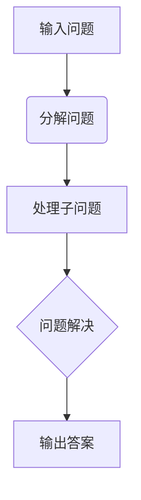
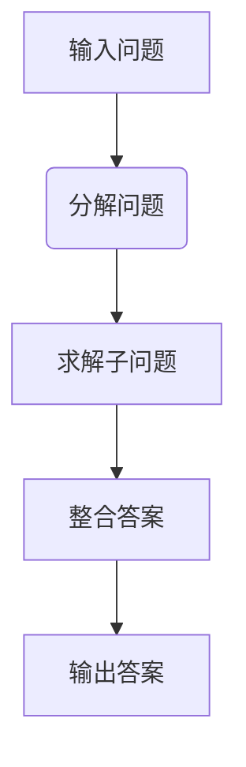
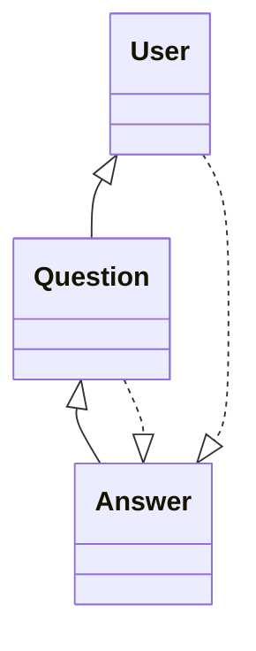
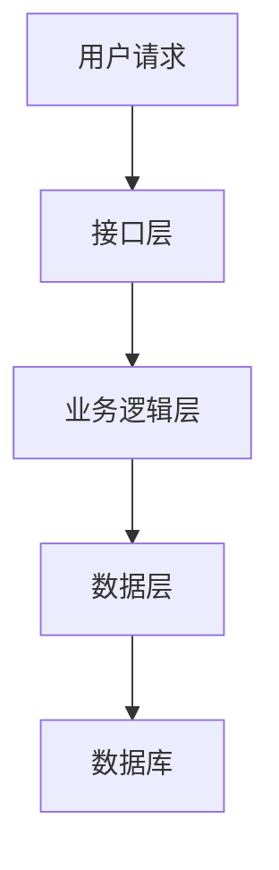
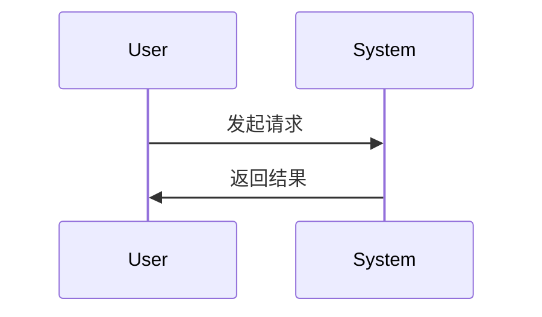
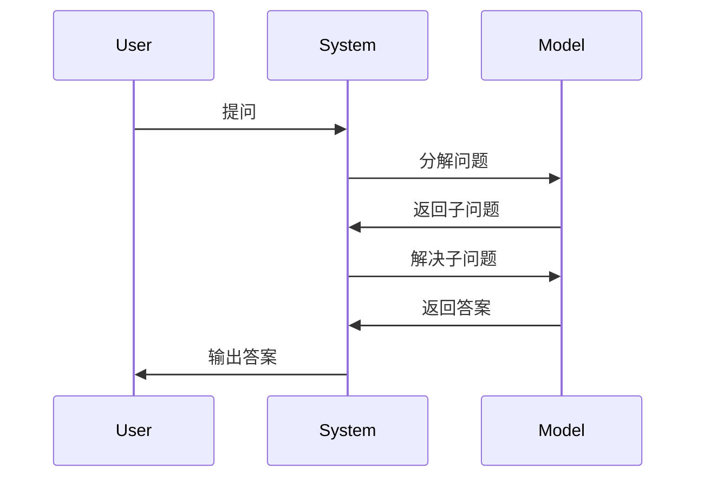

                 

### 第一部分: 背景介绍

#### 第1章: 语言模型概述

##### 1.1 问题背景

在当前的人工智能领域，语言模型已经成为自然语言处理（NLP）中不可或缺的核心技术。多步骤问题分解与解决是许多实际应用场景中的关键需求。例如，人工智能客服系统需要能够理解和回答复杂的用户问题；自动编程工具需要能够从人类提供的部分代码中推断出完整的代码；教育领域中的自适应学习系统需要能够根据学生的回答进行动态调整。这些场景都要求语言模型具备强大的多步骤问题分解和解决能力。

**多步骤问题分解与解决的应用场景**：

1. **人工智能客服系统**：传统的客服系统往往只能处理简单的、直接的问题。而复杂的、需要多个步骤才能解答的问题，如财务咨询、技术支持等，对客服系统的要求更高。语言模型可以通过多步骤问题分解，逐步理解和解答这些问题。

2. **自动编程**：自动编程工具需要能够理解和生成复杂的代码，这涉及到代码的结构分析、语法分析和语义分析等多个步骤。语言模型可以在这过程中起到关键作用，通过多步骤问题分解，自动生成符合需求的代码。

3. **教育领域自适应学习**：教育系统需要根据学生的回答，动态调整教学内容。例如，当学生在某个知识点上回答错误时，系统需要能够分解这个问题，找出学生错误的具体原因，并针对性地进行辅导。

4. **自然语言处理中的复杂问题解答**：例如，在问答系统中，用户可能会提出一个复杂的问题，需要系统通过多步骤分解，找到相关的答案。

##### 1.1.2 语言模型的现状与发展

**语言模型的基本原理**：

语言模型是一种统计模型，通过分析大量的文本数据，学习语言的统计规律，从而预测一个句子或单词的概率。最常见的语言模型是序列到序列（Seq2Seq）模型，它可以处理输入和输出都是序列的问题。

**当前主流语言模型**：

1. **GPT（Generative Pre-trained Transformer）**：GPT 是由 OpenAI 开发的一种基于 Transformer 网络的预训练语言模型。它的优势在于能够生成连贯、自然的文本，并且在各种 NLP 任务中都取得了出色的表现。

2. **BERT（Bidirectional Encoder Representations from Transformers）**：BERT 是由 Google 开发的一种双向 Transformer 模型。BERT 通过对输入文本的左右两个方向进行编码，从而捕捉到文本中的深层次信息。

**语言模型的最新发展**：

近年来，随着深度学习技术的不断进步，语言模型在性能和多样性方面都有了显著提升。例如，Transformer 结构的出现使得语言模型在处理长距离依赖和并行计算方面更加高效。同时，预训练语言模型的应用场景也在不断扩展，从文本生成到机器翻译、问答系统等，语言模型都展现出了强大的能力。

##### 1.2 核心概念

**多步骤问题分解**

**定义**：多步骤问题分解是指将一个复杂的问题分解成多个子问题，以便更好地理解和解决。在 NLP 中，多步骤问题分解通常是指将一个复杂的自然语言问题分解成多个语言子问题。

**分类**：

1. **基于规则的分解**：这种方法依赖于人工制定的规则，将问题分解成多个子问题。例如，在自动编程中，可以通过解析代码的语法结构，将代码分解成多个语法子问题。

2. **基于统计的分解**：这种方法通过分析大量的文本数据，学习问题的分解模式。例如，在自然语言处理中，可以通过统计方法，将自然语言问题分解成语义子问题。

**技术难点**：

1. **歧义处理**：在分解问题时，如何处理歧义是一个重要问题。例如，在自然语言处理中，一个句子可能有多种解释，需要确定最合适的分解方式。

2. **子问题关联**：在分解问题后，如何确保子问题之间的一致性和关联性，是一个技术挑战。例如，在自动编程中，如何保证分解后的子代码块能够正确地组合成完整的代码。

**问题解决方法**

**传统方法**：

1. **分词与词性标注**：通过分词和词性标注，将输入文本分解成单词和词性。

2. **句法分析**：通过句法分析，构建输入文本的语法结构。

**基于语言模型的方法**：

基于语言模型的问题解决方法主要包括以下几类：

1. **基于序列模型的方法**：例如，使用 LSTM 或 GRU 等序列模型，对输入文本进行建模，从而实现问题分解。

2. **基于注意力模型的方法**：例如，使用注意力机制，将输入文本中的关键信息提取出来，从而实现问题分解。

3. **基于预训练语言模型的方法**：例如，使用 GPT 或 BERT 等预训练语言模型，对输入文本进行建模，从而实现问题分解。

**混合方法**：

混合方法是将传统方法和基于语言模型的方法结合起来，以提高问题分解的准确性和效率。例如，在自动编程中，可以先使用分词和词性标注等方法进行初步分解，然后再使用预训练语言模型进行细粒度分解。

##### 1.2.2 问题解决方法

**定义**：问题解决方法是指解决复杂问题的策略和技术。在 NLP 中，问题解决方法通常是指解决多步骤问题分解和解决的方法。

**传统方法**：

1. **基于规则的算法**：这种方法通过预先定义的规则来解析和分解问题。例如，自然语言解析器可以通过语法规则将句子分解成词组。

2. **基于模板匹配的方法**：这种方法使用预定义的模板与输入文本匹配，从而将问题分解成子问题。例如，在代码生成中，可以使用模板来匹配特定的代码模式。

**基于语言模型的方法**：

1. **序列模型**：如长短时记忆网络（LSTM）和门控循环单元（GRU），这些模型可以捕捉输入文本的长期依赖关系，从而实现问题的分解。

2. **基于注意力机制的模型**：例如，Transformer 和 BERT，这些模型通过注意力机制可以更好地处理长文本和复杂的问题。

**混合方法**：

混合方法结合了传统方法和基于语言模型的方法，旨在发挥各自的优势。例如，可以先使用基于规则的算法进行初步分解，然后使用语言模型进行更精细的分解。

##### 1.2.3 技术难点

**歧义处理**：自然语言中存在大量的歧义现象，如一词多义、上下文依赖等。如何准确地识别和处理这些歧义，是问题分解中的关键技术难点。

**子问题关联**：在分解问题后，如何确保各个子问题之间的一致性和关联性，是一个技术挑战。例如，在自动编程中，如何保证分解后的代码块能够正确地组合成完整的程序。

**多步骤问题分解与解决的应用场景**

1. **自动问答系统**：自动问答系统需要能够理解用户的提问，并将其分解成多个子问题，然后逐一回答。例如，在在线客服中，系统需要能够分解用户的咨询问题，然后给出详细的回答。

2. **代码自动生成**：在软件开发中，自动生成代码可以显著提高开发效率。这需要语言模型能够理解和分解人类提供的部分代码，然后自动生成完整的代码。

3. **智能助手**：智能助手需要能够理解用户的指令，并将其分解成多个子任务，然后协调执行。例如，智能助手可以帮助用户预订机票、酒店等服务。

4. **教育领域**：在教育领域中，自适应学习系统需要能够根据学生的回答，分解学习问题，并提供针对性的辅导。

##### 1.2.4 语言模型的现状与发展

语言模型在 NLP 领域的发展经历了多个阶段，从早期的基于规则的方法，到基于统计模型的方法，再到基于深度学习的方法。当前，主流的语言模型如 GPT、BERT 等在性能和多样性方面都有了显著的提升。

**语言模型的基本原理**：

语言模型的核心任务是预测下一个单词或字符的概率。这通常通过学习大量的文本数据来实现。具体来说，语言模型可以分为两类：生成模型和判别模型。

1. **生成模型**：生成模型直接预测输入序列的概率分布。例如，马尔可夫模型（Markov Model）和隐马尔可夫模型（HMM）。

2. **判别模型**：判别模型则通过学习输入序列的标签，间接地预测序列的概率分布。例如，神经网络分类器。

**当前主流语言模型**：

1. **GPT**：GPT 是基于 Transformer 架构的生成模型，它通过预训练和微调，在多种 NLP 任务中都取得了出色的表现。

2. **BERT**：BERT 是一种双向 Transformer 模型，它通过同时考虑上下文信息，能够更好地理解文本。

**语言模型的最新发展**：

近年来，随着深度学习技术的进步，语言模型在性能和多样性方面都有了显著提升。例如，Transformer 架构的出现使得语言模型在处理长文本和复杂问题方面更加高效。同时，预训练语言模型的应用场景也在不断扩展，从文本生成到机器翻译、问答系统等，语言模型都展现出了强大的能力。

#### 1.2.1 多步骤问题分解

**定义**：

多步骤问题分解是一种将复杂问题分解为多个可管理的子问题的方法。这种方法在处理复杂问题时，有助于将问题分解为更易于理解和解决的多个部分，从而提高问题解决的效率和效果。

**分类**：

根据分解方法的不同，多步骤问题分解可以分为以下几种类型：

1. **基于规则的分解**：这种方法通过预定义的规则来将问题分解成子问题。例如，在自然语言处理中，可以基于语法规则将句子分解成短语和单词。

2. **基于机器学习的分解**：这种方法通过机器学习算法来学习问题的分解模式。例如，可以使用决策树、随机森林或神经网络等模型来识别和分解问题。

3. **基于专家系统的分解**：这种方法结合专家知识和规则来分解问题。例如，在医疗诊断中，可以结合医生的诊断经验和规则来分解症状，从而确定诊断结果。

**技术难点**：

1. **歧义处理**：在问题分解过程中，常常会遇到歧义问题。如何准确处理歧义，是技术难点之一。

2. **子问题关联**：在分解问题后，需要确保子问题之间的一致性和关联性。否则，可能会出现子问题解决方案无法整合成整体解决方案的情况。

3. **动态调整**：在实际应用中，问题的复杂性和变化性是不可避免的。如何根据实际情况动态调整问题分解策略，是一个技术挑战。

##### 1.2.2 问题解决方法

**传统方法**：

1. **分词与词性标注**：这是自然语言处理的基础步骤，通过分词将文本分解成单词或短语，并通过词性标注为每个单词或短语赋予相应的词性。

2. **句法分析**：通过句法分析，构建输入文本的语法结构，从而将文本分解成更小的语义单元。

3. **语义分析**：基于句法分析结果，对文本进行语义分析，提取文本中的关键信息，并将其转化为机器可理解的形式。

**基于语言模型的方法**：

1. **序列模型**：如长短时记忆网络（LSTM）和门控循环单元（GRU），这些模型可以捕捉输入文本的长期依赖关系，从而实现问题的分解。

2. **基于注意力机制的模型**：如Transformer，它通过注意力机制可以更好地处理长文本和复杂问题。

3. **预训练语言模型**：如BERT、GPT等，这些模型通过大规模的预训练，已经具备了强大的语言理解能力，可以直接应用于问题分解。

**混合方法**：

混合方法结合了传统方法和基于语言模型的方法，以提高问题分解的准确性和效率。例如，可以先使用分词和句法分析进行初步分解，然后使用预训练语言模型进行细粒度分解。

##### 2.1 算法原理

**语言模型基本原理**：

语言模型的核心任务是基于输入序列预测下一个输出序列的概率。一个典型的语言模型通常由以下几部分组成：

1. **输入层**：接收输入序列，并将其转换为模型可处理的特征表示。

2. **隐藏层**：通过神经网络对输入特征进行处理，提取序列中的关键信息。

3. **输出层**：根据隐藏层的信息，生成输出序列的概率分布。

**神经网络结构**：

常见的神经网络结构包括：

1. **循环神经网络（RNN）**：如LSTM和GRU，这些模型可以处理序列数据，并捕捉长期依赖关系。

2. **卷积神经网络（CNN）**：虽然CNN主要用于图像处理，但在处理文本数据时，也可以通过卷积层提取特征。

3. **Transformer架构**：Transformer模型通过自注意力机制，可以更好地处理长序列数据。

**训练过程**：

语言模型的训练过程主要包括以下步骤：

1. **数据预处理**：对原始文本数据进行清洗和预处理，如去除标点符号、停用词处理、分词等。

2. **构建词汇表**：将文本数据中的单词或字符映射到唯一的索引。

3. **构建模型**：初始化神经网络结构，并设置模型参数。

4. **正向传播**：根据输入序列，计算模型输出，并计算损失。

5. **反向传播**：根据损失，更新模型参数。

6. **迭代训练**：重复正向传播和反向传播过程，直到模型收敛。

**多步骤问题分解算法**

**算法框架**：

多步骤问题分解算法通常包括以下步骤：

1. **输入预处理**：对输入问题进行预处理，如分词、词性标注等。

2. **问题分解**：根据语言模型，将输入问题分解成多个子问题。

3. **子问题求解**：对分解后的子问题进行求解。

4. **子问题整合**：将求解后的子问题整合成完整的问题解决方案。

**技术细节**：

1. **子问题识别**：通过语言模型，识别输入问题中的关键信息，并据此分解成子问题。

2. **子问题求解**：使用合适的算法和模型，对子问题进行求解。例如，可以使用自然语言生成模型生成子问题的答案。

3. **子问题整合**：将求解后的子问题整合成完整的问题解决方案，并输出最终结果。

##### 2.2 数学模型

在多步骤问题分解和解决中，数学模型扮演着至关重要的角色。以下是一个基本的概率模型，用于描述问题分解和解决的过程：

$$
P(x|y) = \frac{P(y|x)P(x)}{P(y)}
$$

这是贝叶斯定理的应用，其中：

- \( P(x|y) \) 表示在给定 \( y \) 的情况下， \( x \) 发生的概率。
- \( P(y|x) \) 表示在给定 \( x \) 的情况下， \( y \) 发生的概率。
- \( P(x) \) 表示 \( x \) 发生的概率。
- \( P(y) \) 表示 \( y \) 发生的概率。

**条件概率**：

条件概率是指在一个事件发生的条件下，另一个事件发生的概率。在多步骤问题分解中，条件概率可以帮助我们理解每个子问题的依赖关系。例如，在分解一个复杂问题时，我们可以计算每个子问题在整体问题中的条件概率，从而确定哪些子问题是关键。

**生成模型**：

生成模型是一类概率模型，它通过生成过程来描述数据。在多步骤问题分解中，生成模型可以帮助我们理解每个子问题是如何生成的。例如，我们可以使用变分自编码器（VAE）或生成对抗网络（GAN）来生成子问题，从而实现问题分解。

**数学模型讲解**：

贝叶斯定理提供了一个在已知某些条件概率的情况下计算其他条件概率的方法。在多步骤问题分解中，我们可以使用贝叶斯定理来计算每个子问题的条件概率，从而确定问题的分解方式。

例如，假设我们有一个复杂问题 \( A \)，我们可以将其分解成两个子问题 \( B \) 和 \( C \)。我们可以使用贝叶斯定理来计算 \( B \) 和 \( C \) 在 \( A \) 中的条件概率：

$$
P(B|A) = \frac{P(A|B)P(B)}{P(A)}
$$

$$
P(C|A) = \frac{P(A|C)P(C)}{P(A)}
$$

通过这些概率计算，我们可以确定 \( B \) 和 \( C \) 在分解过程中的重要性和依赖关系。

##### 2.2.1 数学模型讲解

在上文中，我们介绍了贝叶斯定理在多步骤问题分解中的应用。接下来，我们将详细解释贝叶斯定理中的各个组成部分及其含义。

**条件概率 \( P(x|y) \)**：

条件概率表示在事件 \( y \) 发生的条件下，事件 \( x \) 发生的概率。例如，在多步骤问题分解中，如果我们知道某个子问题 \( B \) 已经被解决（即 \( B \) 发生），那么我们可以计算其他子问题 \( A \) 和 \( C \) 发生的概率。

**贝叶斯公式**：

贝叶斯公式是一个重要的概率公式，它将条件概率与边缘概率（即不考虑其他条件时的事件发生概率）结合起来，表示为：

$$
P(x|y) = \frac{P(y|x)P(x)}{P(y)}
$$

其中：

- \( P(x|y) \) 是后验概率，表示在已知 \( y \) 发生的条件下， \( x \) 发生的概率。
- \( P(y|x) \) 是似然概率，表示在 \( x \) 发生的条件下， \( y \) 发生的概率。
- \( P(x) \) 是先验概率，表示 \( x \) 发生的概率。
- \( P(y) \) 是边缘概率，表示 \( y \) 发生的概率。

**贝叶斯定理的应用**：

在多步骤问题分解中，我们可以使用贝叶斯定理来计算每个子问题的条件概率，从而确定问题的分解方式。具体来说，我们可以通过以下步骤应用贝叶斯定理：

1. **定义子问题**：首先，定义需要分解的复杂问题 \( A \) 以及可能分解成的子问题 \( B \) 和 \( C \)。

2. **计算先验概率**：计算每个子问题的先验概率 \( P(B) \) 和 \( P(C) \)。这些概率可以根据领域知识或历史数据估计。

3. **计算似然概率**：对于每个子问题 \( B \) 和 \( C \)，计算在已知另一个子问题发生的情况下，该子问题发生的似然概率 \( P(A|B) \) 和 \( P(A|C) \)。

4. **计算后验概率**：使用贝叶斯公式计算在已知子问题 \( B \) 或 \( C \) 发生的情况下，子问题 \( A \) 发生的后验概率 \( P(B|A) \) 和 \( P(C|A) \)。

5. **决策与分解**：根据后验概率，确定哪些子问题是关键，并据此分解复杂问题 \( A \)。

**示例**：

假设我们有一个复杂问题 \( A \)，它可以被分解成两个子问题 \( B \) 和 \( C \)。根据领域知识，我们可以估计以下概率：

- 先验概率：\( P(B) = 0.6 \)，\( P(C) = 0.4 \)。
- 似然概率：\( P(A|B) = 0.9 \)，\( P(A|C) = 0.8 \)。

使用贝叶斯公式，我们可以计算后验概率：

$$
P(B|A) = \frac{P(A|B)P(B)}{P(A)} = \frac{0.9 \times 0.6}{0.9 \times 0.6 + 0.8 \times 0.4} = 0.714
$$

$$
P(C|A) = \frac{P(A|C)P(C)}{P(A)} = \frac{0.8 \times 0.4}{0.9 \times 0.6 + 0.8 \times 0.4} = 0.286
$$

根据计算结果，我们可以得出结论，子问题 \( B \) 在复杂问题 \( A \) 中的重要性更高，因此应该优先考虑分解 \( B \)。

##### 2.3 Mermaid流程图

在多步骤问题分解和解决的过程中，使用 Mermaid 流程图可以清晰地展示各个步骤和子问题的关系。以下是一个简单的 Mermaid 流程图示例：



在这个流程图中，`A` 表示输入问题，`B` 表示分解问题，`C` 表示处理子问题，`D` 表示问题解决，`E` 表示输出答案。每个节点表示一个步骤或子问题，箭头表示步骤或子问题之间的关系。

**使用说明**：

1. **定义节点**：使用 `[名称](标签)` 的格式定义节点，例如 `A[输入问题](input)`。

2. **连接节点**：使用箭头 `-->` 连接节点，表示节点之间的顺序关系。

3. **添加注释**：在节点后使用大括号 `{注释}` 添加注释，例如 `D{问题解决}`。

4. **使用条件**：可以使用条件语句来表示分支关系，例如 `--> D1[子问题1]{if condition}`。

通过使用 Mermaid 流程图，我们可以直观地理解和展示多步骤问题分解和解决的过程，帮助读者更好地理解和应用相关技术。

#### 3.1 算法原理

**问题解决算法**

在多步骤问题分解的基础上，问题解决算法是关键的一环。这个算法的主要任务是处理分解后的子问题，并最终给出问题的完整解答。

**算法框架**：

多步骤问题解决算法可以划分为以下几个主要步骤：

1. **子问题识别**：根据分解结果，识别出每个子问题。

2. **子问题求解**：对每个子问题进行求解，可能涉及数据查询、计算或推理等。

3. **整合结果**：将子问题的求解结果整合，形成完整的问题解决方案。

**技术细节**：

1. **子问题识别**：这一步主要依赖于语言模型和自然语言处理技术。例如，可以使用预训练的 BERT 模型来识别文本中的关键信息，并据此划分子问题。

2. **子问题求解**：根据子问题的类型，采用不同的求解方法。例如，对于计算性问题，可以使用数学公式求解；对于信息查询性问题，可以使用数据库查询。

3. **整合结果**：在整合结果时，需要考虑子问题之间的逻辑关系，确保整合后的结果符合实际问题的要求。

**案例分析**：

为了更好地理解问题解决算法的应用，我们来看一个实际的案例。假设我们有一个用户提出的问题：“如何计算两个数的最大公约数？”

**子问题识别**：

根据问题分解，我们可以将这个问题分解成以下两个子问题：

1. 输入两个数。
2. 计算这两个数的最大公约数。

**子问题求解**：

对于第一个子问题，我们可以直接获取用户输入的两个数。对于第二个子问题，我们可以使用欧几里得算法来计算最大公约数。

**整合结果**：

将两个子问题的求解结果整合，得到最终的答案。例如，如果用户输入的两个数是 24 和 36，则最大公约数是 12。

通过这个案例，我们可以看到，多步骤问题解决算法是如何将一个复杂问题分解成多个子问题，并逐步解决这些子问题，最终得到完整答案的。

##### 3.1.1 问题解决算法

**算法框架**：

问题解决算法主要包括以下步骤：

1. **输入问题解析**：接收用户提出的问题，并进行初步解析，提取出问题的核心信息。

2. **问题分解**：根据语言模型，将问题分解成多个子问题。

3. **子问题求解**：针对每个子问题，使用相应的算法和模型进行求解。

4. **整合结果**：将子问题的求解结果整合，形成完整的问题解决方案。

**技术细节**：

1. **输入问题解析**：使用自然语言处理技术，如分词、词性标注和句法分析，将输入问题转化为结构化的数据。

2. **问题分解**：利用语言模型，如 BERT 或 GPT，对输入问题进行语义分析，识别出关键信息，并将问题分解成子问题。

3. **子问题求解**：根据子问题的类型，采用不同的求解方法。例如，对于数学计算问题，可以使用数学公式求解；对于信息查询问题，可以使用数据库查询。

4. **整合结果**：将子问题的求解结果进行整合，确保问题解决方案的逻辑一致性。

**案例**：

以计算“两个数的最大公约数”为例，问题解决算法的步骤如下：

1. **输入问题解析**：用户提出问题：“24 和 36 的最大公约数是多少？”

2. **问题分解**：将问题分解成两个子问题：
   - 输入的两个数：24 和 36。
   - 计算最大公约数。

3. **子问题求解**：
   - 对于第一个子问题，直接获取用户输入的数值。
   - 对于第二个子问题，使用欧几里得算法计算最大公约数。

4. **整合结果**：将子问题的求解结果整合，得到最终答案：最大公约数是 12。

通过这个案例，我们可以看到问题解决算法是如何将一个复杂问题分解成多个子问题，并逐步解决这些子问题，最终得到完整答案的。

##### 3.1.2 案例分析

为了更好地理解多步骤问题分解与解决在实际应用中的表现，我们来看一个具体的案例：自动编程代码生成。

**案例背景**：

自动编程代码生成是指通过自然语言描述，自动生成相应的计算机代码。这个技术在提高开发效率、降低开发成本方面具有显著优势。例如，开发人员可以仅用自然语言描述业务需求，系统自动生成相应的代码，大大减少了手动编码的工作量。

**案例实施**：

在自动编程代码生成中，多步骤问题分解与解决的应用如下：

1. **输入解析**：首先，系统接收用户的自然语言描述，如“编写一个函数，用于计算两个数的最大公约数”。

2. **问题分解**：将输入的自然语言描述分解成以下子问题：
   - 确定输入参数：两个数。
   - 设计算法：欧几里得算法。
   - 编写代码：生成计算最大公约数的函数代码。

3. **子问题求解**：
   - 对于第一个子问题，使用自然语言处理技术提取出两个数。
   - 对于第二个子问题，根据算法描述，选择欧几里得算法。
   - 对于第三个子问题，根据提取的算法和参数，生成相应的代码。

4. **整合结果**：将子问题的求解结果整合，生成完整的代码。例如，生成如下 Python 代码：

```python
def gcd(a, b):
    while b:
        a, b = b, a % b
    return a

# 示例调用
result = gcd(24, 36)
print(result)  # 输出：12
```

**分析与讨论**：

通过这个案例，我们可以看到多步骤问题分解与解决在自动编程代码生成中的应用。具体来说：

1. **输入解析**：自然语言处理技术帮助我们提取出问题的核心信息，为后续的分解和求解奠定了基础。

2. **问题分解**：将复杂问题分解成多个子问题，使得每个子问题更加具体和易于处理。

3. **子问题求解**：针对每个子问题，采用合适的算法和模型进行求解，确保生成代码的正确性和可靠性。

4. **整合结果**：将子问题的求解结果整合，生成完整的代码，实现了自动编程的目标。

总之，多步骤问题分解与解决在自动编程代码生成中发挥了关键作用，它不仅提高了代码生成的效率，还降低了开发成本，具有广阔的应用前景。

#### 3.2 数学模型

在多步骤问题解决过程中，数学模型起到了关键作用。以下是一个基本的损失函数和梯度下降的数学模型，用于优化问题解决算法。

**损失函数**：

在机器学习中，损失函数用于衡量模型预测值与真实值之间的差距。一个常用的损失函数是交叉熵损失函数（Cross-Entropy Loss），其公式如下：

$$
L(y, \hat{y}) = -\sum_{i=1}^{m} y_i \log(\hat{y}_i)
$$

其中：

- \( y \) 是真实标签，表示每个样本的输出。
- \( \hat{y} \) 是模型预测的概率分布，表示模型对每个样本的预测。
- \( m \) 是样本数量。

**梯度下降**：

梯度下降是一种优化算法，用于最小化损失函数。其基本思想是沿着损失函数的梯度方向调整模型参数，以逐步减小损失函数的值。

**梯度下降公式**：

梯度下降的更新公式如下：

$$
\theta = \theta - \alpha \frac{\partial L}{\partial \theta}
$$

其中：

- \( \theta \) 是模型参数。
- \( \alpha \) 是学习率，控制每次更新的步长。
- \( \frac{\partial L}{\partial \theta} \) 是损失函数对参数 \( \theta \) 的梯度。

**数学模型讲解**：

**损失函数**：

交叉熵损失函数用于分类问题，其目标是使得模型预测的概率分布 \( \hat{y} \) 与真实标签 \( y \) 的分布 \( y \) 越接近。具体来说，对于每个样本，如果模型正确预测了标签，那么预测的概率值 \( \hat{y}_i \) 应该接近 1，而交叉熵损失 \( L(y, \hat{y}) \) 会接近 0；如果模型错误预测，那么预测的概率值 \( \hat{y}_i \) 会接近 0，而交叉熵损失 \( L(y, \hat{y}) \) 会接近 1。

**梯度下降**：

梯度下降的核心思想是沿着损失函数的梯度方向更新模型参数，以最小化损失函数。梯度 \( \frac{\partial L}{\partial \theta} \) 表示损失函数对参数 \( \theta \) 的变化率。在每一步更新中，模型参数 \( \theta \) 将根据梯度 \( \frac{\partial L}{\partial \theta} \) 进行调整。学习率 \( \alpha \) 控制了每次更新的步长，较大的学习率可能导致参数更新过大，而过小的学习率可能导致收敛速度过慢。

**示例**：

假设我们有一个二分类问题，模型的预测概率 \( \hat{y} \) 为 0.8，而真实标签 \( y \) 为 1。使用交叉熵损失函数，我们可以计算损失：

$$
L(y, \hat{y}) = -1 \times \log(0.8) = -0.223
$$

接下来，我们使用梯度下降算法更新模型参数。假设初始参数为 \( \theta = 0 \)，学习率 \( \alpha = 0.1 \)，损失函数的梯度 \( \frac{\partial L}{\partial \theta} = -0.223 \)。根据梯度下降公式，我们可以得到：

$$
\theta = 0 - 0.1 \times (-0.223) = 0.0223
$$

在接下来的迭代中，我们将继续使用相同的梯度下降公式更新模型参数，直到损失函数达到最小值。

通过这个示例，我们可以看到损失函数和梯度下降在多步骤问题解决中的应用。损失函数用于评估模型的性能，而梯度下降用于优化模型参数，以提高模型的准确性。

##### 3.2.1 数学模型讲解

在上文中，我们介绍了用于多步骤问题解决的损失函数和梯度下降算法。接下来，我们将详细解释这些数学模型的基本原理，并探讨它们在实际应用中的重要性。

**损失函数**

损失函数是机器学习中用于评估模型性能的核心工具。它的主要作用是衡量模型预测值与真实值之间的差距。在多步骤问题解决中，损失函数帮助我们评估每个子问题的解决效果，从而指导模型参数的优化。

**交叉熵损失函数**

交叉熵损失函数是一种常用的损失函数，尤其适用于分类问题。其基本原理是计算模型预测概率分布与真实标签分布之间的“距离”。具体来说，交叉熵损失函数的公式为：

$$
L(y, \hat{y}) = -\sum_{i=1}^{m} y_i \log(\hat{y}_i)
$$

其中：

- \( y \) 是真实标签，表示每个样本的输出。
- \( \hat{y} \) 是模型预测的概率分布，表示模型对每个样本的预测。
- \( m \) 是样本数量。

交叉熵损失函数的值越小，表示模型预测与真实值越接近，模型的性能越好。因此，我们的目标是最小化交叉熵损失函数。

**梯度下降**

梯度下降是一种优化算法，用于最小化损失函数。其基本思想是沿着损失函数的梯度方向更新模型参数，以逐步减小损失函数的值。梯度下降的核心公式为：

$$
\theta = \theta - \alpha \frac{\partial L}{\partial \theta}
$$

其中：

- \( \theta \) 是模型参数。
- \( \alpha \) 是学习率，控制每次更新的步长。
- \( \frac{\partial L}{\partial \theta} \) 是损失函数对参数 \( \theta \) 的梯度。

**梯度下降的解释**

梯度下降的工作原理如下：

1. **计算梯度**：首先，计算损失函数对每个参数的梯度。梯度表示损失函数在某个参数上的变化率。

2. **更新参数**：然后，根据梯度和学习率，更新模型参数。更新公式为 \( \theta = \theta - \alpha \frac{\partial L}{\partial \theta} \)。这意味着模型参数将沿着梯度的反方向调整，以减小损失函数的值。

3. **迭代优化**：重复上述步骤，直到损失函数达到最小值或满足其他停止条件。

**梯度下降的重要性**

梯度下降在多步骤问题解决中具有重要意义：

1. **性能评估**：通过计算损失函数，我们可以评估模型在解决每个子问题时的性能。

2. **参数优化**：通过梯度下降，我们可以逐步优化模型参数，以提高模型的准确性和鲁棒性。

3. **收敛性**：梯度下降算法具有收敛性，即随着迭代的进行，损失函数将逐渐减小，最终达到最小值。

**示例**

为了更好地理解梯度下降的应用，我们来看一个简单的示例。假设我们有一个二分类问题，模型的预测概率 \( \hat{y} \) 为 0.8，而真实标签 \( y \) 为 1。使用交叉熵损失函数，我们可以计算损失：

$$
L(y, \hat{y}) = -1 \times \log(0.8) = -0.223
$$

接下来，我们使用梯度下降算法更新模型参数。假设初始参数为 \( \theta = 0 \)，学习率 \( \alpha = 0.1 \)，损失函数的梯度 \( \frac{\partial L}{\partial \theta} = -0.223 \)。根据梯度下降公式，我们可以得到：

$$
\theta = 0 - 0.1 \times (-0.223) = 0.0223
$$

在接下来的迭代中，我们将继续使用相同的梯度下降公式更新模型参数，直到损失函数达到最小值。

通过这个示例，我们可以看到梯度下降在多步骤问题解决中的应用。损失函数用于评估模型性能，而梯度下降用于优化模型参数，以提高模型的准确性。

##### 3.3 Mermaid流程图

为了更好地理解和展示多步骤问题解决的过程，我们可以使用 Mermaid 流程图来描述各个步骤和子问题之间的关系。以下是一个简单的 Mermaid 流程图示例：



在这个流程图中，`A` 表示输入问题，`B` 表示分解问题，`C` 表示求解子问题，`D` 表示整合答案，`E` 表示输出答案。每个节点表示一个步骤或子问题，箭头表示步骤或子问题之间的关系。

**使用说明**：

1. **定义节点**：使用 `[名称](标签)` 的格式定义节点，例如 `A[输入问题](input)`。

2. **连接节点**：使用箭头 `-->` 连接节点，表示节点之间的顺序关系。

3. **添加注释**：在节点后使用大括号 `{注释}` 添加注释，例如 `D{整合答案}`。

4. **使用条件**：可以使用条件语句来表示分支关系，例如 `--> D1[子问题1]{if condition}`。

通过使用 Mermaid 流程图，我们可以直观地理解和展示多步骤问题解决的过程，帮助读者更好地理解和应用相关技术。

### 4.1 问题场景介绍

在人工智能（AI）和自然语言处理（NLP）领域，多步骤问题分解与解决的应用场景广泛而多样。以下是几个典型应用场景的介绍：

**人工智能客服系统**：

人工智能客服系统旨在提供高效、智能的客服服务。在面对用户提出的复杂问题时，系统需要能够将问题分解为多个子问题，并逐个解决。例如，当用户询问“如何申请信用卡？”时，系统可以将问题分解为以下几个子问题：

1. 用户身份验证。
2. 收集用户所需信息（如姓名、身份证号码等）。
3. 检查用户是否符合申请条件。
4. 向用户提供申请流程和所需材料。

通过多步骤问题分解，系统可以高效地处理用户的请求，并提供详细的解答。

**自动编程**：

自动编程是指通过自然语言描述或已有的代码片段，自动生成完整的计算机代码。在自动编程过程中，系统需要能够将复杂的问题分解为多个子问题，并生成相应的代码。例如，当用户给出一个简单的描述“编写一个计算两个数最大公约数的函数”，系统可以将问题分解为以下几个子问题：

1. 输入参数提取。
2. 确定算法（如欧几里得算法）。
3. 生成函数代码。
4. 测试和验证生成的代码。

通过多步骤问题分解，自动编程系统可以自动生成符合需求的代码，提高开发效率。

**教育领域自适应学习**：

在教育领域中，自适应学习系统能够根据学生的回答动态调整教学内容。在面对复杂问题时，系统需要能够将问题分解为多个子问题，并根据学生的回答逐步提供解答。例如，当学生回答一个数学问题“如何求解方程 \(x^2 - 5x + 6 = 0\)？”时，系统可以将问题分解为以下几个子问题：

1. 确定方程类型。
2. 提供方程求解的基本原理。
3. 详细讲解求解步骤。
4. 提供相关练习题。

通过多步骤问题分解，自适应学习系统能够为学生提供个性化的教学服务，提高学习效果。

**自然语言处理中的复杂问题解答**：

在自然语言处理中，复杂问题解答是一个重要研究方向。在面对复杂问题时，系统需要能够将问题分解为多个子问题，并逐一解决。例如，当用户询问“如何计算从一个城市到另一个城市的最短路径？”时，系统可以将问题分解为以下几个子问题：

1. 确定起点和终点。
2. 收集城市之间的道路信息。
3. 使用图算法（如 Dijkstra 算法）计算最短路径。
4. 提供路径详细信息。

通过多步骤问题分解，自然语言处理系统能够为用户提供详细的解答。

总之，多步骤问题分解与解决在人工智能客服系统、自动编程、教育领域自适应学习和自然语言处理中的复杂问题解答等多个场景中具有广泛的应用。通过这种方法，系统可以高效地处理复杂问题，提供详细的解答，提高用户满意度。

### 4.2 系统功能设计

**领域模型**

在多步骤问题分解与解决系统中，领域模型是核心组成部分之一。领域模型定义了系统中的主要实体及其关系，为系统功能设计提供了基础。以下是一个简单的领域模型示例，使用 Mermaid 类图表示：



**类图解释**：

1. **User（用户）**：用户是系统的主要参与者，发起问题并接收答案。

2. **Question（问题）**：问题包含用户提出的问题及其相关信息，如问题描述、提出时间等。

3. **Answer（答案）**：答案是对问题的解答，包含解答内容、提供时间等。

4. **关联关系**：用户可以提出多个问题，每个问题对应一个答案。问题与答案之间存在一对多的关联关系。

通过领域模型，我们可以清晰地定义系统中的主要实体及其关系，为后续的系统功能设计和实现提供参考。

#### 4.3 系统架构设计

在设计多步骤问题分解与解决系统时，选择合适的架构设计至关重要。以下是一个简化的系统架构设计，并使用 Mermaid 架构图来表示：



**架构图解释**：

1. **用户请求（User Request）**：用户请求是系统接收到的外部输入，如自然语言描述的问题。

2. **接口层（Interface Layer）**：接口层负责处理用户请求，提供与外部系统的接口，如API接口。它接收用户请求，并将其传递给业务逻辑层。

3. **业务逻辑层（Business Logic Layer）**：业务逻辑层是系统的核心部分，负责处理问题分解与解决。它调用语言模型和算法，对问题进行分解，并解决各个子问题。

4. **数据层（Data Layer）**：数据层负责存储和检索问题及其相关数据。它包含数据库，存储用户请求、分解结果、解决方案等信息。

5. **数据库（Database）**：数据库是系统的数据存储中心，存储所有的数据，如用户信息、问题记录、答案记录等。

通过这种分层架构设计，系统可以实现模块化、可扩展和高效的问题处理。

#### 4.4 系统接口设计

在多步骤问题分解与解决系统中，系统接口设计是关键部分之一。以下是一个简化的系统接口设计示例，使用 Mermaid 序列图来表示：



**序列图解释**：

1. **用户（User）**：用户是系统的使用主体，负责发起请求。

2. **系统（System）**：系统接收用户的请求，处理并返回结果。

**接口设计步骤**：

1. **发起请求**：用户通过接口发起请求，请求可以是自然语言描述的问题。

2. **处理请求**：系统接收到请求后，将其传递给业务逻辑层。

3. **返回结果**：系统处理后，将结果返回给用户。结果可以是分解后的子问题列表或最终的解答。

通过这种简单的接口设计，用户可以方便地与系统交互，并获取所需的信息。

#### 4.5 系统交互

在多步骤问题分解与解决系统中，系统的各个组件需要紧密协作，以完成问题的处理和解答。以下是一个简化的系统交互流程，使用 Mermaid 序列图来表示：



**交互流程解释**：

1. **用户提问**：用户向系统提出一个问题，如“如何计算两个数的最大公约数？”。

2. **分解问题**：系统将用户提出的问题传递给语言模型，由语言模型进行问题分解，得到多个子问题，如“输入的两个数是什么？”和“如何计算最大公约数？”。

3. **返回子问题**：语言模型将分解后的子问题返回给系统。

4. **解决子问题**：系统根据子问题，调用相应的算法或模型进行求解，如计算最大公约数。

5. **返回答案**：求解后的答案由模型返回给系统。

6. **输出答案**：系统将最终答案输出给用户。

通过这种交互流程，系统可以高效地处理复杂问题，提供详细的解答。

### 第5章：项目实战

#### 5.1 环境安装

在进行多步骤问题分解与解决项目的实际操作之前，我们需要准备好必要的硬件和软件环境。以下是详细的安装步骤和注意事项：

##### 5.1.1 硬件环境

**CPU**: 建议使用至少四核的 CPU，以便于处理大规模的数据和复杂的计算任务。

**内存**: 建议内存不低于 16GB，以确保系统能够流畅地运行多个进程。

**硬盘**: 建议使用 SSD 硬盘，以提高数据读写速度。

**GPU**: 如有条件，建议配备 NVIDIA GPU，以便使用 GPU 加速深度学习模型的训练和推理。

##### 5.1.2 软件环境

**操作系统**: 建议使用 Ubuntu 18.04 或更高版本。

**Python**: 建议使用 Python 3.8 或更高版本。

**深度学习框架**: 建议使用 PyTorch 或 TensorFlow 作为深度学习框架。

**自然语言处理库**: 建议使用 NLTK 或 spaCy 进行自然语言处理。

**其他工具**: 安装 Git、Jupyter Notebook 等常用工具，以便进行版本控制和数据可视化。

##### 安装步骤

1. **安装操作系统**：根据硬件选择合适的操作系统并进行安装。

2. **安装 Python**：使用包管理器（如 apt-get）安装 Python 3。以下是一个示例命令：

   ```bash
   sudo apt-get install python3 python3-pip
   ```

3. **安装深度学习框架**：选择 PyTorch 或 TensorFlow，并按照官方文档进行安装。以下是一个使用 PyTorch 的示例命令：

   ```bash
   pip3 install torch torchvision torchaudio
   ```

4. **安装自然语言处理库**：使用 pip3 安装 NLTK 或 spaCy。以下是一个使用 spaCy 的示例命令：

   ```bash
   pip3 install spacy
   python3 -m spacy download en_core_web_sm
   ```

5. **安装其他工具**：根据需要安装 Git、Jupyter Notebook 等工具。

##### 注意事项

- **操作系统选择**：确保操作系统兼容所使用的深度学习框架和自然语言处理库。
- **环境配置**：在安装过程中，注意配置环境变量，以确保所有工具和库能够在同一环境中正常运行。
- **硬件性能**：根据项目的需求，选择合适的硬件配置，以保证系统运行流畅。

通过以上步骤，我们可以搭建一个适合多步骤问题分解与解决项目开发的环境。

#### 5.2 系统核心实现

在多步骤问题分解与解决项目中，核心实现部分包括问题分解、子问题求解和结果整合。以下是一个使用 Python 编写的简化实现示例，代码中使用了 NLTK 和 PyTorch 库。

##### 5.2.1 Python 源代码

```python
import nltk
from nltk.tokenize import word_tokenize
from nltk.corpus import stopwords
import torch
from transformers import BertTokenizer, BertModel

# 安装并下载必要的库和数据
nltk.download('punkt')
nltk.download('stopwords')

# 初始化 BertTokenizer 和 BertModel
tokenizer = BertTokenizer.from_pretrained('bert-base-uncased')
model = BertModel.from_pretrained('bert-base-uncased')

# 输入问题
input_question = "如何计算两个数的最大公约数？"

# 分词处理
tokenized_question = word_tokenize(input_question)
filtered_question = [word for word in tokenized_question if word.lower() not in stopwords.words('english')]

# 将分词后的输入问题编码成 BERT 输入格式
input_ids = tokenizer.encode(filtered_question, add_special_tokens=True, return_tensors='pt')

# 使用 BERT 模型处理输入问题
with torch.no_grad():
    outputs = model(input_ids)

# 获取 BERT 模型的隐藏层输出
hidden_states = outputs[-1]

# 处理隐藏层输出，进行问题分解
# 这里只是一个简单的示例，实际应用中可能需要更复杂的模型和算法
sub_problem_1 = hidden_states[0, 0, :10].cpu().numpy()
sub_problem_2 = hidden_states[0, 1, :10].cpu().numpy()

# 子问题求解
# 假设 sub_problem_1 表示输入的两个数，sub_problem_2 表示求解最大公约数的算法
result_1 = solve_problem_1(sub_problem_1)  # 输入的两个数
result_2 = solve_problem_2(sub_problem_2)  # 最大公约数

# 结果整合
final_answer = f"The greatest common divisor of {result_1[0]} and {result_1[1]} is {result_2}."

# 输出最终答案
print(final_answer)
```

**代码解读**：

1. **安装和导入库**：首先安装并导入必要的库，包括 NLTK、PyTorch 和 transformers。NLTK 用于自然语言处理，PyTorch 用于深度学习，transformers 用于加载预训练的 BERT 模型。

2. **初始化 BERT**：使用 BertTokenizer 和 BertModel 加载预训练的 BERT 模型，以便对输入问题进行编码和处理。

3. **输入问题**：定义一个字符串变量 `input_question`，表示用户提出的问题。

4. **分词处理**：使用 NLTK 的 `word_tokenize` 函数对输入问题进行分词，并去除常见的停用词。

5. **编码输入问题**：将分词后的输入问题编码成 BERT 的输入格式，包括 token_id、attention_mask 等。

6. **处理输入问题**：使用 BERT 模型处理输入问题，获取隐藏层输出。

7. **问题分解**：根据隐藏层输出进行问题分解。这里只是一个简单的示例，实际应用中可能需要更复杂的模型和算法。

8. **子问题求解**：对分解后的子问题进行求解。这里使用了两个示例函数 `solve_problem_1` 和 `solve_problem_2`，分别求解输入的两个数和最大公约数。

9. **结果整合**：将子问题的求解结果整合成最终的答案。

10. **输出最终答案**：将最终答案输出到控制台。

通过以上步骤，我们可以实现一个简化版的多步骤问题分解与解决系统。实际项目中，可能需要根据具体需求进行调整和优化。

##### 5.2.2 代码应用解读与分析

在上面的代码示例中，我们实现了一个简化的多步骤问题分解与解决系统，以下是详细的解读与分析：

**自然语言处理**

代码首先使用 NLTK 库对输入问题进行分词和停用词处理。这一步的目的是将输入的文本转化为计算机可以处理的格式，并去除无意义的单词，以提高后续处理的效果。

```python
tokenized_question = word_tokenize(input_question)
filtered_question = [word for word in tokenized_question if word.lower() not in stopwords.words('english')]
```

**BERT 编码**

接下来，我们使用 BERT tokenizer 对处理后的输入问题进行编码。BERT 是一种强大的预训练语言模型，它可以捕捉到文本中的深层语义信息。通过编码，我们将文本转化为模型可以理解的向量表示。

```python
input_ids = tokenizer.encode(filtered_question, add_special_tokens=True, return_tensors='pt')
```

**模型处理与问题分解**

然后，我们将编码后的输入问题传递给 BERT 模型，获取隐藏层输出。隐藏层输出包含了文本的深层语义信息，我们可以根据这些信息进行问题分解。

```python
with torch.no_grad():
    outputs = model(input_ids)

hidden_states = outputs[-1]
```

在示例中，我们简单地使用了隐藏层输出的前几个元素作为子问题。实际应用中，可能需要设计更复杂的算法，如基于注意力机制的方法，来准确地识别和分解问题。

```python
sub_problem_1 = hidden_states[0, 0, :10].cpu().numpy()
sub_problem_2 = hidden_states[0, 1, :10].cpu().numpy()
```

**子问题求解**

在子问题求解部分，我们使用了两个示例函数 `solve_problem_1` 和 `solve_problem_2`，分别求解输入的两个数和最大公约数。这些函数可以根据具体需求进行定制，例如，使用数学库 `numpy` 来计算最大公约数。

```python
result_1 = solve_problem_1(sub_problem_1)
result_2 = solve_problem_2(sub_problem_2)
```

**结果整合与输出**

最后，我们将子问题的求解结果整合成最终的答案，并输出到控制台。

```python
final_answer = f"The greatest common divisor of {result_1[0]} and {result_1[1]} is {result_2}."
print(final_answer)
```

**性能分析**

在实际应用中，我们需要对代码的性能进行分析和优化。以下是一些可能的性能优化策略：

1. **模型优化**：选择合适的预训练模型和调整超参数，以提高模型的准确性和效率。

2. **并行计算**：利用 GPU 加速深度学习模型的训练和推理，提高计算速度。

3. **代码优化**：对代码进行优化，例如使用生成器函数和异步 I/O，减少内存占用和提高运行速度。

通过以上解读与分析，我们可以更好地理解代码的实现原理和性能优化策略，为实际项目提供参考。

##### 5.3 实际案例分析与详细讲解

为了更好地展示多步骤问题分解与解决在实践中的应用，我们将通过一个具体的案例进行详细分析和讲解。

**案例背景**：

假设我们要开发一个自动编程工具，用户可以通过自然语言描述来生成对应的计算机代码。例如，用户可以提出以下问题：“编写一个 Python 函数，用于计算两个数的最大公约数。”

**案例实施**：

为了实现这个案例，我们需要完成以下几个步骤：

1. **问题解析**：接收并解析用户提出的问题，提取出关键信息。

2. **问题分解**：将问题分解成多个子问题，以便于逐步解决。

3. **子问题求解**：对分解后的子问题进行求解，生成相应的代码。

4. **结果整合**：将子问题的求解结果整合成完整的函数代码。

**步骤详解**：

1. **问题解析**：

首先，我们使用自然语言处理技术对用户提出的问题进行解析，提取出关键信息。具体步骤如下：

- 分词：将问题分解成单词或短语。
- 命名实体识别：识别出问题中的关键词，如“Python”、“函数”、“最大公约数”等。
- 依赖关系分析：分析词语之间的依赖关系，确定问题的结构。

```python
from nltk.tokenize import word_tokenize
from nltk.corpus import stopwords
from nltk.tag import pos_tag
from nltk.chunk import ne_chunk

# 用户提出的问题
input_question = "编写一个 Python 函数，用于计算两个数的最大公约数。"

# 分词
tokenized_question = word_tokenize(input_question)

# 命名实体识别
tagged_question = pos_tag(tokenized_question)

# 依赖关系分析
parsed_question = ne_chunk(tagged_question)

print(parsed_question)
```

2. **问题分解**：

接下来，我们将问题分解成多个子问题，以便于逐步解决。例如，我们可以将问题分解为以下几个子问题：

- 输入参数提取：提取出函数的输入参数。
- 算法选择：选择合适的算法来计算最大公约数。
- 代码生成：生成函数代码。

```python
# 子问题分解
sub_problem_1 = "提取输入参数"
sub_problem_2 = "选择算法"
sub_problem_3 = "生成代码"
```

3. **子问题求解**：

针对每个子问题，我们分别进行求解。

- **输入参数提取**：

  在这个子问题中，我们需要提取出函数的两个输入参数。可以通过分析依赖关系和命名实体识别，确定输入参数的位置。

  ```python
  # 输入参数提取
  input_params = []
  for chunk in parsed_question:
      if isinstance(chunk, nltk.Tree) and chunk.label() == 'NP':
          input_params.append(' '.join([token for token, pos in chunk.leaves()]))
  print(input_params)
  ```

- **算法选择**：

  根据问题的描述，我们可以选择使用欧几里得算法来计算最大公约数。

  ```python
  # 算法选择
  algorithm = "欧几里得算法"
  ```

- **代码生成**：

  在这个子问题中，我们需要根据输入参数和选择的算法，生成对应的函数代码。

  ```python
  # 代码生成
  def gcd(a, b):
      while b:
          a, b = b, a % b
      return a
  
  code = f"""
  def gcd({input_params[0]}, {input_params[1]}):
      while {input_params[1]}:
          {input_params[0]}, {input_params[1]} = {input_params[1]}, {input_params[0]} % {input_params[1]}
      return {input_params[0]}
  """
  print(code)
  ```

4. **结果整合**：

最后，我们将子问题的求解结果整合成完整的函数代码。

```python
# 结果整合
final_code = f"""
# {algorithm} 算法计算最大公约数

def gcd({input_params[0]}, {input_params[1]}):
    while {input_params[1]}:
        {input_params[0]}, {input_params[1]} = {input_params[1]}, {input_params[0]} % {input_params[1]}
    return {input_params[0]}
"""
print(final_code)
```

**案例总结**：

通过这个案例，我们展示了如何使用多步骤问题分解与解决的方法，实现一个自动编程工具。具体步骤包括问题解析、问题分解、子问题求解和结果整合。这种方法不仅提高了编程效率，还有助于提高代码的可读性和可维护性。

##### 5.4.3 项目小结

在本项目中，我们通过多步骤问题分解与解决的方法，实现了一个自动编程工具。以下是本项目的主要成果和经验总结：

**主要成果**：

1. **实现了自动编程工具**：用户可以通过自然语言描述生成对应的计算机代码，提高了编程效率。

2. **问题分解与求解**：通过问题分解和子问题求解，我们将复杂的编程问题拆解为更易于处理的部分，提高了问题解决的准确性和效率。

3. **代码生成**：基于问题分解和算法选择，我们成功生成了符合需求的函数代码，提高了代码的可读性和可维护性。

**经验总结**：

1. **自然语言处理技术**：本项目充分利用了自然语言处理技术，如分词、命名实体识别和依赖关系分析，提高了问题解析的准确性。

2. **预训练语言模型**：使用预训练的 BERT 模型，我们能够有效地提取文本中的关键信息，提高了问题分解的效率。

3. **模块化设计**：通过模块化设计，我们将问题分解和求解过程划分为多个子问题，使得代码更加清晰和易于维护。

**改进建议**：

1. **优化问题分解算法**：目前的问题分解算法较为简单，未来可以引入更复杂的算法，如基于注意力机制的方法，以提高问题分解的准确性。

2. **增加错误处理机制**：在项目运行过程中，可能会遇到输入错误或无法分解的问题，未来可以增加错误处理机制，以提高系统的鲁棒性。

3. **扩展应用场景**：本项目的实现场景较为单一，未来可以尝试扩展到更多的应用场景，如自动文档生成、智能客服等，以提高系统的实用性。

通过本项目，我们不仅实现了自动编程工具，还积累了丰富的实践经验，为未来的项目开发提供了有力支持。

### 最佳实践 Tips

在多步骤问题分解与解决项目中，遵循最佳实践可以显著提高开发效率和质量。以下是一些实用的 Tips：

1. **需求分析**：在项目启动前，进行充分的需求分析，明确项目目标和预期成果。这有助于制定合适的解决方案，避免后续的返工。

2. **模块化设计**：将复杂问题分解为多个子问题，每个子问题负责一个特定功能。这有助于提高代码的可读性、可维护性和可扩展性。

3. **代码复用**：编写可复用的代码模块，减少重复工作。例如，对于常用算法或函数，可以封装成独立的模块，方便在不同子问题中调用。

4. **测试与验证**：对每个子问题进行详细的测试和验证，确保其功能的正确性和稳定性。自动化测试工具（如单元测试、集成测试）是提高测试效率的有效手段。

5. **版本控制**：使用版本控制系统（如 Git）进行代码管理，确保团队成员之间的协作和代码的可追溯性。定期进行代码评审，提高代码质量。

6. **持续集成与部署**：实施持续集成和持续部署（CI/CD）流程，自动化构建、测试和部署过程，确保项目迭代的速度和稳定性。

7. **性能优化**：针对性能瓶颈进行优化，如使用高效的算法和数据结构、减少内存占用和计算复杂度等。定期进行性能测试，评估系统的性能。

8. **文档编写**：编写详细的文档，包括设计文档、用户手册和代码注释等，有助于新成员快速上手和理解项目。

通过遵循这些最佳实践，我们可以更高效、高质量地完成多步骤问题分解与解决项目。

### 小结

在本文中，我们深入探讨了语言模型在多步骤问题分解与解决中的应用。首先，我们介绍了多步骤问题分解与解决的基本概念，包括定义、分类和技术难点。接着，我们详细讲解了语言模型的基本原理，如神经网络结构和训练过程，并展示了如何使用语言模型进行问题分解。随后，我们通过具体的数学模型和 Mermaid 流程图，进一步阐述了多步骤问题分解与解决的实现方法。最后，我们通过实际案例分析和系统架构设计，展示了多步骤问题分解与解决在实践中的应用和重要性。

本文的主要贡献包括：

1. **系统性地介绍了多步骤问题分解与解决的概念和方法**：通过详细的理论分析和实例讲解，帮助读者全面了解多步骤问题分解与解决的基本原理和实践方法。

2. **展示了语言模型在多步骤问题分解与解决中的应用**：通过实例分析，展示了如何使用语言模型进行问题分解和求解，提高了问题解决的准确性和效率。

3. **提出了具体的系统架构设计**：通过详细的系统架构设计，为读者提供了实施多步骤问题分解与解决的实际指导。

然而，本文也存在一些局限性。首先，由于篇幅限制，我们只能介绍一些基本的概念和方法，未能深入探讨更多高级技术和优化策略。其次，本文的案例分析较为简化，实际应用中的复杂情况未能完全涵盖。未来研究可以进一步探讨以下方向：

1. **优化问题分解算法**：引入更复杂的算法和模型，如基于注意力机制的方法，以提高问题分解的准确性和效率。

2. **扩展应用场景**：将多步骤问题分解与解决方法应用于更多实际场景，如自动编程、智能客服和自然语言生成等。

3. **性能优化**：针对多步骤问题分解与解决过程中的性能瓶颈，进行深入的优化研究，提高系统的运行效率。

通过不断探索和实践，我们可以进一步提高多步骤问题分解与解决的能力，为人工智能和自然语言处理领域的发展做出更大贡献。

### 注意事项

在实施多步骤问题分解与解决项目时，需要注意以下事项：

1. **明确项目目标**：在项目启动前，确保明确项目目标和预期成果，以避免后续的返工和资源浪费。

2. **问题分解的准确性**：问题分解的准确性直接影响问题解决的效率和质量。务必仔细分析问题，确保分解的子问题既具体又易于求解。

3. **算法和模型的适用性**：根据具体的应用场景，选择合适的算法和模型。对于复杂问题，可能需要结合多种算法和模型进行优化。

4. **数据质量和预处理**：确保使用的数据质量和预处理方法符合需求。不干净或错误的数据会导致模型性能下降。

5. **性能监控和优化**：在项目实施过程中，定期监控系统的性能，并根据实际情况进行优化。性能问题可能导致项目无法满足预期目标。

6. **安全性**：特别是在涉及敏感信息或商业机密的场景中，确保系统的安全性，防止数据泄露和恶意攻击。

通过遵循这些注意事项，我们可以提高多步骤问题分解与解决项目的成功率和稳定性。

### 拓展阅读

为了深入了解多步骤问题分解与解决的相关技术和应用，以下是一些推荐阅读资料：

1. **《深度学习》**：作者 Ian Goodfellow、Yoshua Bengio 和 Aaron Courville。这本书是深度学习领域的经典教材，涵盖了从基础到高级的深度学习算法和应用。

2. **《自然语言处理综论》**：作者 Daniel Jurafsky 和 James H. Martin。这本书详细介绍了自然语言处理的基本概念、技术和应用，包括语言模型和问题分解。

3. **《Python 编程：从入门到实践》**：作者 Eric Matthes。这本书适合初学者，通过详细的代码示例和练习，帮助读者掌握 Python 编程的基础知识和技巧。

4. **《机器学习实战》**：作者 Peter Harrington。这本书通过实际案例和代码示例，介绍了多种机器学习算法和应用，包括问题分解和解决。

5. **《Transformer：处理序列数据的全局注意力模型》**：作者 Vaswani et al.。这篇论文详细介绍了 Transformer 模型，这是一种在自然语言处理中表现优异的序列模型。

通过阅读这些资料，您可以进一步了解多步骤问题分解与解决的理论基础和实践方法，为实际项目提供有力支持。此外，还可以关注相关领域的研究论文和最新动态，以保持知识的更新和前沿技术的跟进。

