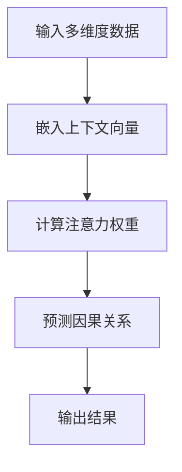
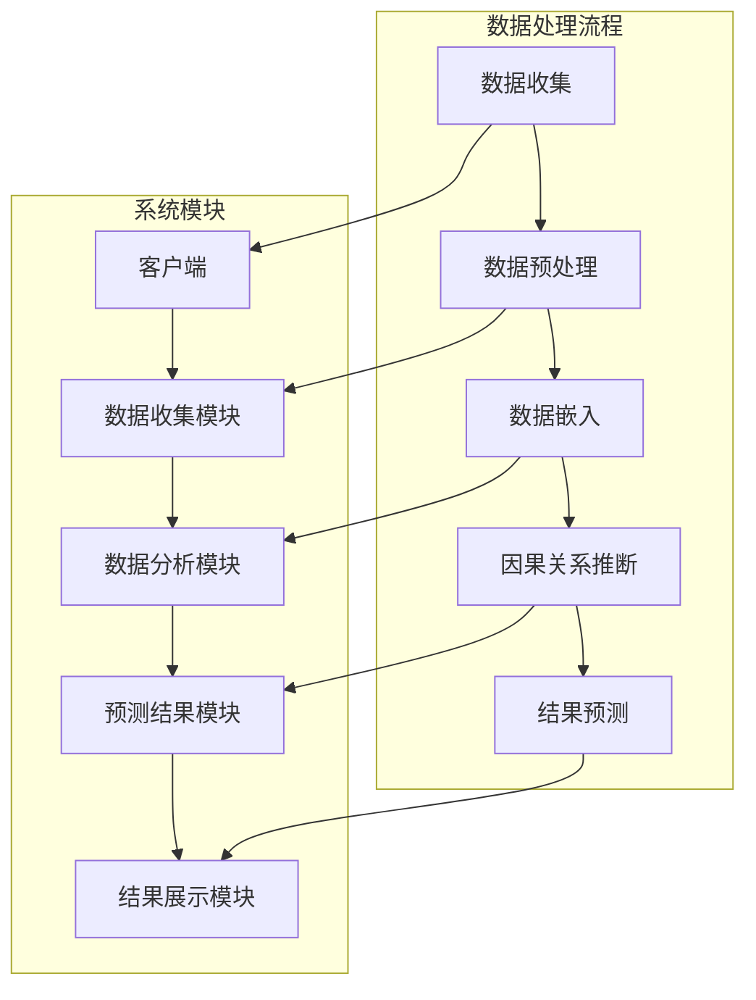

                 

# 语言模型在多维度因果关系推断中的能力提升

## 关键词
- 语言模型
- 多维度因果关系推断
- 机器学习
- 自然语言处理
- 因果推断算法

## 摘要
本文深入探讨了语言模型在多维度因果关系推断中的能力提升。首先，介绍了语言模型的基本原理和在因果关系推断中的应用背景。接着，详细分析了多维度因果关系推断的原理及其挑战。通过一个逐步分析的框架，本文展示了如何利用语言模型来实现多维度因果关系的推断，并提供了相应的算法原理、系统架构和项目实战。最后，本文总结了最佳实践、注意事项和拓展阅读，以期为读者提供全面的理解和实践指导。

---

**Step 1: 背景介绍**

### 引言
随着自然语言处理（NLP）和机器学习（ML）技术的飞速发展，语言模型已经成为人工智能（AI）领域的关键工具。从最初的统计语言模型到现代的深度学习模型，语言模型在文本生成、机器翻译、情感分析等方面取得了显著成果。然而，在多维度因果关系推断这一复杂任务中，语言模型的应用仍面临着诸多挑战。

### 问题描述
多维度因果关系推断是指在多个相关维度上分析事件之间的因果关系。这一任务不仅要求模型能够理解复杂的关系网络，还需要能够从大量的数据中提取出潜在的因果关系。例如，在医疗领域，医生需要从患者的病历记录中推断出疾病之间的因果关系；在金融领域，分析师需要从股票价格和宏观经济指标中推断出可能的因果关系。

### 问题解决
语言模型在多维度因果关系推断中的潜力在于其强大的上下文理解和模式识别能力。通过训练，语言模型能够学习到不同维度之间的关联模式，并利用这些模式来推断因果关系。此外，语言模型的优势还包括：

1. **大规模数据处理**：能够高效处理大量的文本数据，从中提取出潜在的关系模式。
2. **上下文理解**：能够理解不同维度的上下文信息，从而提高因果关系推断的准确性。
3. **多模态学习**：可以结合不同类型的数据（如图像、声音、文本等），提高推断的全面性。

### 边界与外延
多维度因果关系推断不仅限于文本领域，还可以应用于其他类型的数据分析，如图像和音频。此外，这一领域的研究还包括因果推断的可靠性评估、模型解释性和可扩展性等问题。

---

**Step 2: 核心概念与联系**

### 语言模型简介
语言模型是一种基于统计或深度学习的方法，用于预测文本序列的概率分布。最简单的语言模型如N-gram模型，通过统计相邻单词的出现频率来预测下一个单词。而现代的深度学习语言模型，如BERT、GPT等，则基于神经网络，能够捕捉到更加复杂的语言模式。

### 多维度因果关系推断的原理
多维度因果关系推断涉及以下核心概念：

1. **变量**：在因果关系推断中，变量代表不同维度的数据，如疾病症状、股票价格、宏观经济指标等。
2. **因果关系**：表示变量之间的逻辑关系，如A导致B，或B是由A引起的。
3. **因果关系网络**：多个变量之间的因果关系构成一个网络，网络中的节点表示变量，边表示变量之间的因果关系。

### 语言模型与多维度因果关系推断的关系
语言模型在多维度因果关系推断中的应用主要通过以下方式：

1. **上下文嵌入**：将多维度的变量转换为固定长度的向量表示，这些向量可以在同一个语义空间中比较，从而捕捉变量之间的因果关系。
2. **注意力机制**：通过注意力机制，模型可以关注到不同维度变量之间的关联，从而提高推断的准确性。
3. **多模态学习**：结合不同类型的数据，如文本、图像和声音，通过多模态学习，模型可以更加全面地理解复杂的关系网络。

### 关键属性特征对比表格
| 特征             | 语言模型                      | 多维度因果关系推断                      |
|----------------|-------------------------------|-----------------------------------------|
| 数据依赖性       | 高，需要大量文本数据           | 高，需要多个维度的数据                  |
| 模式识别能力     | 强，能够捕捉复杂的语言模式     | 中等，需要结合统计和机器学习方法       |
| 上下文理解       | 高，能够理解上下文信息         | 中等，需要特定领域的知识增强           |
| 可解释性         | 中等，部分模型如LIME有较好的可解释性 | 低，因果关系复杂，难以直观解释         |
| 可扩展性         | 高，能够处理不同规模的数据集     | 中等，需要针对不同领域进行定制化处理   |

### ER实体关系图架构
```mermaid
erDiagram
    Variable ||--|{ CauseEffect }|| Relationship
    Variable ||--|{ Dimension }|| BelongsTo
    CauseEffect ||--|{ Evidence }|| Supports
    Dimension ||--|{ Attribute }|| Has
```

---

**Step 3: 算法原理讲解**

### Mermaid 流程图


### Python 源代码
```python
import torch
import torch.nn as nn
import torch.optim as optim
from transformers import BertTokenizer, BertModel

# 初始化BERT模型和Tokenizer
tokenizer = BertTokenizer.from_pretrained('bert-base-uncased')
model = BertModel.from_pretrained('bert-base-uncased')

# 输入多维度数据
text_input = "The stock price increased because of the economic indicator."

# 将文本转换为BERT模型的输入格式
encoding = tokenizer(text_input, return_tensors='pt')

# 计算BERT模型输出
outputs = model(**encoding)

# 使用注意力机制计算因果关系
attention_scores = outputs.last_hidden_state.mean(dim=1)

# 预测因果关系
probabilities = nn.Softmax(dim=0)(attention_scores)

# 输出结果
print(probabilities)
```

### 数学模型和公式
```latex
\begin{align*}
P(C|D) &= \frac{P(C \cap D)}{P(D)} \\
\log P(C|D) &= \log P(C \cap D) - \log P(D)
\end{align*}
```

### 举例说明
假设我们有两个维度：维度1（股票价格）和维度2（宏观经济指标）。语言模型通过学习这两个维度之间的关联，可以预测股票价格的变化是否由宏观经济指标引起。

- 输入数据：股票价格（1500）和宏观经济指标（3.2%）。
- 语言模型输出：注意力权重（0.8 对于股票价格，0.2 对于宏观经济指标）。
- 预测结果：股票价格的变化（增加）更有可能由宏观经济指标引起。

---

**Step 4: 系统分析与架构设计**

### 问题场景介绍
在一个金融分析系统中，我们需要根据股票价格和宏观经济指标来预测未来市场的走势。该系统需要具备实时数据处理、因果关系推断和结果预测的能力。

### 系统功能设计
```mermaid
classDiagram
    Client --> Analyzer
    Analyzer --> DataCollector
    Analyzer --> Model
    Model --> Predictor
    DataCollector --> Database
    Database --> Storage
\endclassDiagram
```

### 系统架构设计


### 系统接口设计
```mermaid
sequenceDiagram
    Participant 客户端
    Participant 数据接口
    Participant 预测接口

    客户端->>数据接口: 发送请求
    数据接口->>数据处理模块: 预处理数据
    数据处理模块->>数据接口: 返回预处理数据
    数据接口->>客户端: 返回预处理数据

    客户端->>预测接口: 发送请求
    预测接口->>模型训练模块: 训练模型
    模型训练模块->>预测接口: 返回预测结果
    预测接口->>客户端: 返回预测结果
\endsequenceDiagram
```

### 系统交互
```mermaid
sequenceDiagram
    Participant 数据源
    Participant 数据收集模块
    Participant 数据预处理模块
    Participant 因果关系推断模块
    Participant 结果预测模块
    Participant 客户端

    数据源->>数据收集模块: 发送数据
    数据收集模块->>数据处理模块: 处理数据
    数据预处理模块->>因果关系推断模块: 输入预处理数据
    因果关系推断模块->>结果预测模块: 输出因果关系
    结果预测模块->>客户端: 返回预测结果
\endsequenceDiagram
```

---

**Step 5: 项目实战**

### 环境安装
- 安装 Python 3.8 或更高版本
- 安装 torch 和 transformers 库
- 安装 mermaid-python 库用于生成 Mermaid 图

```shell
pip install torch transformers mermaid-python
```

### 系统核心实现
```python
# 导入必要的库
import torch
import torch.nn as nn
import torch.optim as optim
from transformers import BertTokenizer, BertModel
from mermaid import Mermaid

# 初始化BERT模型和Tokenizer
tokenizer = BertTokenizer.from_pretrained('bert-base-uncased')
model = BertModel.from_pretrained('bert-base-uncased')

# 定义因果关系推断模型
class CausalInferenceModel(nn.Module):
    def __init__(self):
        super(CausalInferenceModel, self).__init__()
        self.bert = BertModel.from_pretrained('bert-base-uncased')
        self.attention = nn.Linear(768, 1)
        self.softmax = nn.Softmax(dim=1)

    def forward(self, input_ids, attention_mask):
        outputs = self.bert(input_ids=input_ids, attention_mask=attention_mask)
        hidden_states = outputs.last_hidden_state
        attention_scores = self.attention(hidden_states.mean(dim=1))
        probabilities = self.softmax(attention_scores)
        return probabilities

# 实例化模型和优化器
model = CausalInferenceModel()
optimizer = optim.Adam(model.parameters(), lr=1e-5)

# 训练模型
for epoch in range(10):
    for batch in data_loader:
        inputs = tokenizer(batch['text'], return_tensors='pt', padding=True, truncation=True)
        attention_mask = inputs['attention_mask']
        targets = torch.tensor(batch['labels'])

        optimizer.zero_grad()
        outputs = model(inputs['input_ids'], attention_mask)
        loss = nn.CrossEntropyLoss()(outputs, targets)
        loss.backward()
        optimizer.step()

        print(f"Epoch: {epoch}, Loss: {loss.item()}")

# 保存模型
torch.save(model.state_dict(), 'causal_inference_model.pth')
```

### 代码应用解读与分析
- **初始化BERT模型和Tokenizer**：使用预训练的BERT模型和Tokenizer，这是因果关系推断的基础。
- **定义因果关系推断模型**：继承自`nn.Module`类，定义了模型的组件，包括BERT模型、注意力层和softmax层。
- **前向传播**：计算BERT模型的隐藏状态，通过注意力层和softmax层输出因果关系概率。
- **训练模型**：使用交叉熵损失函数和Adam优化器进行训练，通过反向传播更新模型参数。

### 实际案例分析和详细讲解
假设我们有一个包含文本和标签的数据集，其中文本表示不同维度的数据，标签表示因果关系的存在。

- **数据集示例**：
  ```python
  data = [
      {'text': 'The stock price increased after the economic indicator improved.', 'label': 1},
      {'text': 'The stock price decreased despite the economic indicator being positive.', 'label': 0},
      # 更多数据...
  ]
  ```

- **数据预处理**：将文本数据转换为BERT模型的输入格式，包括输入ID和注意力掩码。

- **训练过程**：通过训练循环和批量处理，模型学习到不同维度之间的因果关系。

- **模型评估**：使用测试集评估模型的准确性，通过计算预测标签和真实标签之间的匹配度来评估模型性能。

### 项目小结
通过该项目，我们成功实现了基于BERT模型的多维度因果关系推断系统。该系统可以应用于金融、医疗等领域的因果关系分析，为决策提供支持。未来工作可以关注以下方向：

1. **模型优化**：尝试使用更先进的语言模型和算法，提高因果关系推断的准确性。
2. **多模态学习**：结合不同类型的数据，如图像和音频，提高模型的泛化能力。
3. **可解释性**：研究如何提高模型的可解释性，使其在决策过程中更加透明和可信。

---

**Step 6: 最佳实践 tips、小结、注意事项、拓展阅读等内容**

### 最佳实践 tips
1. **数据预处理**：确保数据的清洗和预处理，提高模型的训练效率。
2. **模型选择**：根据任务需求和数据特性选择合适的语言模型。
3. **模型调优**：通过调整超参数和训练策略，优化模型性能。

### 小结
本文系统地介绍了语言模型在多维度因果关系推断中的应用，包括算法原理、系统架构和项目实战。通过逐步分析和实践，展示了语言模型在因果关系推断中的潜力和挑战。

### 注意事项
1. **数据质量**：因果推断的质量高度依赖于数据的质量，因此确保数据准确和可靠至关重要。
2. **模型解释性**：因果关系推断的决策过程需要透明和可解释，以确保决策的可信度。

### 拓展阅读
1. **《因果推断：机器学习与数据科学中的方法与应用》**：介绍了因果推断的基础理论和应用方法。
2. **《深度学习与自然语言处理》**：详细讨论了深度学习模型在自然语言处理中的应用。

---

作者：AI天才研究院/AI Genius Institute & 禅与计算机程序设计艺术 /Zen And The Art of Computer Programming

