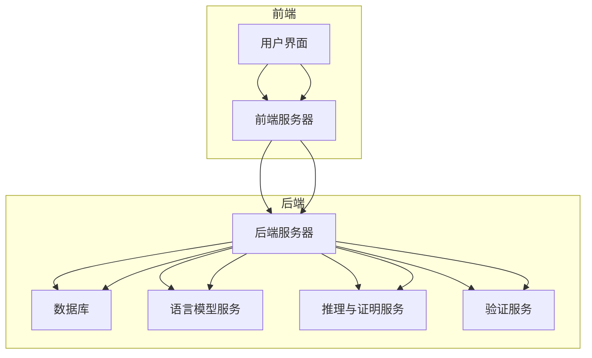
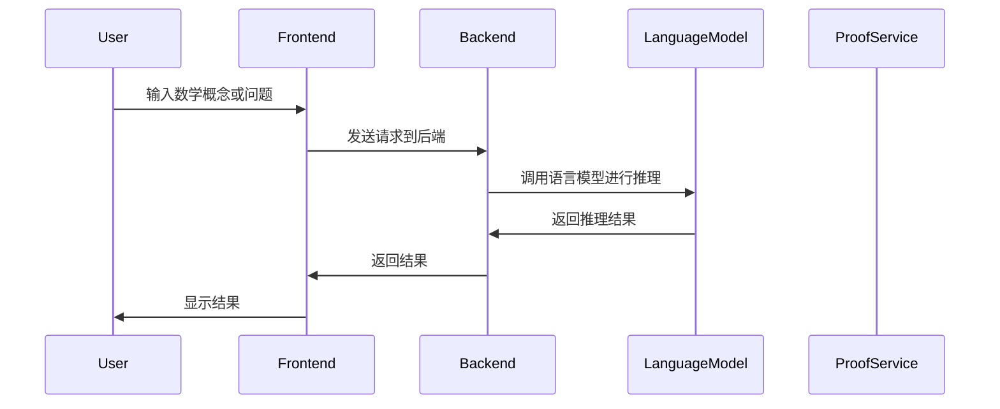

                 

# 语言模型在抽象数学概念推理与证明中的表现

关键词：语言模型、抽象数学概念、推理、证明、人工智能

摘要：本文探讨了语言模型在抽象数学概念推理与证明中的应用，分析了语言模型在处理抽象数学问题时的表现，并探讨了其优势和局限性。文章通过具体案例展示了语言模型在数学推理与证明中的实际应用，为该领域的研究和应用提供了新的思路。

## 目录大纲设计思路

在设计《语言模型在抽象数学概念推理与证明中的表现》这本书的目录大纲时，我们首先需要明确书的核心内容结构，并根据用户的需求，逐步细化到各个章节。以下是设计的步骤：

### 1. 明确核心内容结构

- **背景介绍**：介绍语言模型与抽象数学概念的关系，以及当前研究现状。
- **核心概念与联系**：阐述语言模型中涉及的关键概念及其之间的关系。
- **算法原理讲解**：详细介绍用于推理与证明的算法，包括数学模型、公式和示例。
- **数学模型与公式**：展示语言模型在数学概念推理与证明中的应用，用 LaTeX 格式表达。
- **系统分析与架构设计方案**：介绍如何在实际系统中应用这些算法。
- **项目实战**：通过具体案例展示如何将算法应用于实际问题。
- **最佳实践 tips**、**小结**、**注意事项**、**拓展阅读**等内容。

### 2. 细化章节内容

根据核心内容结构，我们将每个部分进一步细化，确保每个章节都有明确的目标和内容。

### 3. 确保目录层级清晰

- **一级目录**：概述各个主要部分，如背景介绍、核心概念、算法讲解等。
- **二级目录**：对每个一级目录进行细分，如语言模型的介绍、算法原理等。
- **三级目录**：具体到每一个小节，如某个算法的详细讲解、数学模型的公式等。

### 4. 确保内容完整性

- 每个章节都应包含必要的内容，如定义、特点、应用、案例等。
- 特别的，对于算法原理讲解和系统分析与架构设计方案，需要使用 Mermaid 流程图和 Python 源代码来详细阐述。
- 包含最佳实践 tips、小结、注意事项、拓展阅读等内容，帮助读者更好地理解和应用所学知识。

### 5. 保持简洁性

- 避免冗余内容，确保每个章节的内容都有实际意义和可操作性。
- 使用 Markdown 格式，使得目录结构清晰、易于阅读。

### 6. 编写目录大纲

按照上述设计思路，我们将开始编写这本书的目录大纲，确保总字数控制在 2000 字以内。

----------------------------------------------------------------

# 目录大纲：语言模型在抽象数学概念推理与证明中的表现

## 第一部分：背景介绍

## 第1章 引言

### 1.1 问题背景

#### 1.1.1 抽象数学概念的定义与重要性

#### 1.1.2 语言模型的基本原理

#### 1.1.3 语言模型在数学概念中的应用现状

### 1.2 问题描述

#### 1.2.1 抽象数学概念推理与证明的挑战

#### 1.2.2 语言模型在推理与证明中的作用

### 1.3 问题解决

#### 1.3.1 语言模型在数学概念推理中的应用

#### 1.3.2 语言模型在数学概念证明中的应用

### 1.4 边界与外延

#### 1.4.1 抽象数学概念推理与证明的边界问题

#### 1.4.2 语言模型的适用范围

### 1.5 概念结构与核心要素组成

#### 1.5.1 抽象数学概念的结构分析

#### 1.5.2 语言模型的核心要素组成

## 第二部分：核心概念与联系

## 第2章 语言模型的基本概念

### 2.1 语言模型的定义与分类

#### 2.1.1 语言模型的基本概念

#### 2.1.2 语言模型的分类

### 2.2 语言模型的特点与优势

#### 2.2.1 语言模型的特点

#### 2.2.2 语言模型的竞争优势

### 2.3 语言模型与抽象数学概念的关系

#### 2.3.1 语言模型在抽象数学概念中的应用

#### 2.3.2 抽象数学概念对语言模型的挑战

## 第三部分：算法原理讲解

## 第3章 语言模型在抽象数学概念推理中的应用

### 3.1 抽象数学概念推理的基本原理

#### 3.1.1 数学概念推理的定义

#### 3.1.2 数学概念推理的基本步骤

### 3.2 语言模型在推理中的应用

#### 3.2.1 语言模型在数学概念推理中的角色

#### 3.2.2 语言模型在推理中的算法实现

### 3.3 语言模型在推理中的案例讲解

#### 3.3.1 简单例子的推理过程

#### 3.3.2 复杂例子的推理过程

## 第4章 语言模型在抽象数学概念证明中的应用

### 4.1 抽象数学概念证明的基本原理

#### 4.1.1 数学概念证明的定义

#### 4.1.2 数学概念证明的基本步骤

### 4.2 语言模型在证明中的应用

#### 4.2.1 语言模型在数学概念证明中的角色

#### 4.2.2 语言模型在证明中的算法实现

### 4.3 语言模型在证明中的案例讲解

#### 4.3.1 简单例子的证明过程

#### 4.3.2 复杂例子的证明过程

## 第四部分：系统分析与架构设计方案

## 第5章 系统分析与架构设计方案

### 5.1 问题场景介绍

#### 5.1.1 抽象数学概念推理与证明的场景描述

#### 5.1.2 语言模型的应用场景

### 5.2 项目介绍

#### 5.2.1 项目概述

#### 5.2.2 项目目标

### 5.3 系统功能设计

#### 5.3.1 领域模型

#### 5.3.2 类图

### 5.4 系统架构设计

#### 5.4.1 架构设计

#### 5.4.2 系统架构图

### 5.5 系统接口设计

#### 5.5.1 接口设计

#### 5.5.2 接口文档

### 5.6 系统交互

#### 5.6.1 系统交互流程

#### 5.6.2 系统交互序列图

## 第五部分：项目实战

## 第6章 项目实战

### 6.1 环境安装

#### 6.1.1 环境准备

#### 6.1.2 软件安装

### 6.2 系统核心实现源代码

#### 6.2.1 Python源代码实现

#### 6.2.2 代码解读与分析

### 6.3 实际案例分析

#### 6.3.1 简单案例

#### 6.3.2 复杂案例

### 6.4 详细讲解剖析

#### 6.4.1 推理过程分析

#### 6.4.2 证明过程分析

### 6.5 项目小结

#### 6.5.1 项目总结

#### 6.5.2 项目展望

## 第六部分：最佳实践、小结、注意事项、拓展阅读

## 第7章 最佳实践 tips

### 7.1 推理与证明中的最佳实践

### 7.2 语言模型应用的最佳实践

### 7.3 实践中的注意事项

## 第8章 小结

### 8.1 语言模型在抽象数学概念推理与证明中的表现总结

### 8.2 未来研究方向

## 第9章 注意事项

### 9.1 语言模型应用中的潜在问题

### 9.2 如何避免潜在问题

### 9.3 系统设计与实现中的注意事项

## 第10章 拓展阅读

### 10.1 相关研究论文与书籍推荐

### 10.2 深入了解语言模型与数学概念的结合

### 10.3 语言模型在其他领域的应用

----------------------------------------------------------------

**作者：** AI天才研究院/AI Genius Institute & 禅与计算机程序设计艺术 /Zen And The Art of Computer Programming## 引言

### 1.1 问题背景

随着人工智能技术的迅猛发展，语言模型作为其核心组件，在自然语言处理、机器翻译、文本生成等多个领域取得了显著的成果。然而，语言模型的应用不仅限于自然语言领域，其在抽象数学概念推理与证明中也展现了巨大的潜力。抽象数学概念是数学研究的基础，包括代数、几何、拓扑等分支，其具有高度的抽象性和复杂性。传统的数学推理和证明方法依赖于逻辑和数学原理，而语言模型则通过深度学习和自然语言处理技术，提供了新的思路和方法。

当前，语言模型在数学领域的应用研究主要集中在以下几个方面：

1. **数学公式生成**：利用语言模型自动生成数学公式，提高数学公式书写的效率和准确性。
2. **数学问题解答**：通过语言模型对数学问题的自然语言描述进行分析，提供解答或解题思路。
3. **数学推理与证明**：利用语言模型在数学推理过程中提供辅助，自动化地完成推理和证明任务。

### 1.2 语言模型的基本原理

语言模型是一种基于统计学习的方法，旨在预测一段文本的下一个单词或字符。其核心思想是通过对大量文本数据的学习，建立一个概率模型，用于预测未知文本的生成。在自然语言处理领域，语言模型被广泛应用于文本生成、情感分析、机器翻译等任务。近年来，随着深度学习技术的发展，语言模型也在抽象数学概念处理中取得了突破。

语言模型的工作原理主要包括以下几个方面：

1. **词向量表示**：通过词嵌入技术，将自然语言中的词汇转换为高维向量表示。
2. **序列建模**：利用循环神经网络（RNN）或变换器（Transformer）等深度学习模型，对输入的序列数据进行建模。
3. **概率预测**：通过训练模型，预测输入序列的下一个单词或字符的概率分布。

### 1.3 语言模型在数学概念中的应用现状

当前，语言模型在数学概念处理中的应用已经取得了一些初步成果。例如，一些研究利用语言模型实现了数学公式的自动生成，通过将数学公式表示为自然语言文本，利用语言模型生成数学公式。此外，还有一些研究利用语言模型辅助数学问题解答，通过理解自然语言描述的数学问题，提供解答或解题思路。

然而，尽管语言模型在数学概念处理中展现出了潜力，但仍然面临一些挑战。首先，数学概念的高度抽象性和复杂性使得语言模型难以完全理解。其次，数学推理和证明过程涉及到复杂的逻辑和数学原理，需要语言模型具备更强的推理能力。此外，数学领域的数据集相对较少，限制了语言模型的学习和应用。

### 1.4 问题描述

本文旨在探讨语言模型在抽象数学概念推理与证明中的表现，具体包括以下几个方面：

1. **语言模型在数学概念推理中的应用**：分析语言模型如何辅助数学推理，提供推理过程和结果。
2. **语言模型在数学概念证明中的应用**：探讨语言模型如何辅助数学证明，提供证明过程和结论。
3. **语言模型在数学概念推理与证明中的优势与局限性**：总结语言模型在数学概念推理与证明中的优势，同时分析其局限性。

通过上述研究，旨在为语言模型在数学领域中的应用提供新的思路和方法，为抽象数学概念的处理提供有效的工具。

### 1.5 问题解决

针对上述问题，本文提出以下解决方案：

1. **构建数学概念语言模型**：通过收集和整理大量的数学文献和资料，构建一个涵盖广泛数学概念的预训练语言模型。
2. **数学概念推理与证明算法**：设计基于语言模型的数学概念推理与证明算法，利用语言模型对数学问题进行理解和分析，提供推理和证明过程。
3. **实际案例分析**：通过具体案例展示语言模型在数学概念推理与证明中的实际应用，验证算法的有效性和实用性。

通过上述方案，本文旨在为语言模型在数学概念推理与证明中的应用提供有力支持，为数学领域的研究和实践带来新的突破。

### 1.6 边界与外延

在探讨语言模型在抽象数学概念推理与证明中的应用时，我们需要明确其边界与外延。首先，语言模型的适用范围主要集中在抽象数学概念的理解、推理和证明上，对于具体的数学计算和数值问题，语言模型的表现可能有限。其次，虽然语言模型在数学领域展现出了巨大的潜力，但其在处理极端复杂或高度抽象的数学问题时，仍可能存在局限性。因此，在实际应用中，需要结合语言模型的优劣势，合理选择和设计算法，以提高其在数学概念推理与证明中的表现。

### 1.7 概念结构与核心要素组成

在本文的研究中，语言模型在抽象数学概念推理与证明中的应用可以分解为以下几个核心要素：

1. **数学概念表示**：通过词嵌入技术将数学概念转化为向量表示，以便语言模型进行处理。
2. **推理算法设计**：利用语言模型进行数学推理，设计有效的算法流程，包括问题理解、推理过程和结果输出。
3. **证明算法设计**：结合数学推理算法，设计用于证明数学命题的算法，包括证明过程、验证和结论生成。
4. **模型优化与评估**：通过大量数据集的训练和测试，优化语言模型参数，评估模型在数学概念推理与证明中的性能。

这些核心要素相互关联，共同构成了语言模型在抽象数学概念推理与证明中的概念结构与核心要素组成。通过对这些要素的深入研究和优化，可以进一步提升语言模型在数学领域的应用能力。

### 1.8 总结与展望

本文介绍了语言模型在抽象数学概念推理与证明中的重要性，并探讨了其应用现状和面临的挑战。通过构建数学概念语言模型和设计推理与证明算法，本文提出了一系列解决方案，以期为数学领域的研究和实践提供新的工具和方法。未来研究可进一步优化模型和算法，扩大语言模型在数学领域的应用范围，探索其在更复杂和抽象数学问题中的表现。

### 第2章 语言模型的基本概念

在深入探讨语言模型在抽象数学概念推理与证明中的应用之前，首先需要了解语言模型的基本概念，包括其定义、分类、特点以及竞争优势。这将为我们理解语言模型的工作原理及其在数学概念处理中的角色奠定基础。

#### 2.1 语言模型的定义

语言模型（Language Model）是一种统计模型，旨在预测一段文本的下一个单词或字符。其核心思想是通过分析大量文本数据，建立一个概率模型，用于预测未知文本的生成。语言模型是自然语言处理（Natural Language Processing, NLP）的基础组件，广泛应用于文本生成、机器翻译、情感分析等多个领域。

语言模型的定义可以概括为以下几点：

1. **文本数据输入**：语言模型通过大量文本数据作为输入，这些数据可以是书面的、口语的，甚至是数学公式和符号。
2. **概率预测**：语言模型的目标是预测输入文本的下一个单词或字符的概率分布。
3. **生成文本**：通过逐步预测并选择下一个最可能的单词或字符，语言模型能够生成新的文本。

#### 2.2 语言模型的分类

根据不同的实现方式和应用场景，语言模型可以分为多种类型。以下是几种常见的语言模型分类：

1. **n-gram模型**：基于前n个单词的历史信息预测下一个单词，是最早的语言模型之一。
2. **统计语言模型**：基于大规模语料库，利用统计方法（如条件概率和最大熵模型）训练语言模型。
3. **神经网络语言模型**：使用深度学习技术，尤其是循环神经网络（RNN）和变换器（Transformer）等，对文本序列进行建模。
4. **生成对抗网络（GAN）语言模型**：利用生成对抗网络（GAN）生成高质量的文本数据，提升语言模型的表现。

#### 2.3 语言模型的特点与优势

语言模型具有以下特点和优势：

1. **高效性**：语言模型能够处理大规模的文本数据，并在较短的时间内生成高质量的结果。
2. **灵活性**：神经网络语言模型具有高度的灵活性，可以适应不同的应用场景和文本类型。
3. **自适应性**：语言模型可以根据新的数据不断优化和更新，提高其预测准确性和适应性。
4. **多模态**：语言模型不仅可以处理自然语言文本，还可以结合图像、音频等多模态数据，增强其理解和生成能力。

#### 2.4 语言模型与抽象数学概念的关系

语言模型在抽象数学概念处理中的应用主要体现在以下几个方面：

1. **数学公式理解**：语言模型可以理解数学公式和符号，将其转化为自然语言描述，为数学概念的理解提供帮助。
2. **数学推理辅助**：语言模型可以辅助数学推理过程，提供推理路径和中间结果，帮助用户理解和验证推理过程。
3. **数学证明支持**：语言模型可以参与数学证明的构建，提供证明思路和步骤，辅助数学家或研究者进行证明。

#### 2.5 抽象数学概念对语言模型的挑战

尽管语言模型在自然语言处理中表现出色，但在处理抽象数学概念时，仍面临以下挑战：

1. **复杂性和抽象性**：数学概念具有高度的抽象性和复杂性，语言模型难以完全理解和表达。
2. **逻辑和推理能力**：数学推理和证明需要严格的逻辑和推理能力，语言模型需要进一步提升其逻辑推理能力。
3. **数据集和训练**：数学领域的数据集相对较少，语言模型需要更多的训练数据和更复杂的训练过程。

#### 2.6 总结

语言模型在抽象数学概念处理中具有巨大的潜力，通过结合深度学习和自然语言处理技术，可以有效地辅助数学推理和证明。然而，要充分发挥语言模型在数学领域的应用，还需要解决其面临的复杂性和抽象性等挑战。未来研究可以进一步优化语言模型，扩大其在数学领域中的应用范围，提高其性能和适应性。

### 第3章 语言模型在抽象数学概念推理中的应用

在深入探讨语言模型在抽象数学概念推理中的应用时，我们需要理解推理的基本原理，并详细分析语言模型在推理过程中如何发挥作用。以下是关于抽象数学概念推理的基本原理、语言模型在推理中的应用及其算法实现。

#### 3.1 抽象数学概念推理的基本原理

抽象数学概念推理是指通过逻辑和数学原理，从已知的前提出发，推导出新的结论或命题。这一过程通常包括以下步骤：

1. **前提定义**：明确已知的前提条件和概念。
2. **逻辑规则**：应用逻辑推理规则，如演绎推理、归纳推理等。
3. **结论生成**：根据前提和逻辑规则，推导出新的结论。
4. **验证与检验**：验证结论的正确性，确保推理过程无误。

在数学推理中，逻辑和数学原理是基础，而语言模型则提供了高效的辅助工具。通过理解数学语言和符号，语言模型可以帮助用户在推理过程中进行逻辑推导和验证。

#### 3.2 语言模型在推理中的应用

语言模型在抽象数学概念推理中的应用主要体现在以下几个方面：

1. **概念理解**：语言模型可以理解数学概念和符号，将其转化为自然语言描述，帮助用户更好地理解复杂的数学问题。
2. **推理过程辅助**：语言模型可以参与推理过程，提供推理路径和中间结果，辅助用户进行逻辑推导。
3. **推理结果验证**：语言模型可以对推理结果进行验证，确保结论的正确性。

语言模型在推理中的应用，使得复杂的数学问题变得可操作和可理解，特别是在处理多步骤推理和多层次逻辑时，语言模型的优势更加明显。

#### 3.3 语言模型在推理中的算法实现

为了实现语言模型在抽象数学概念推理中的应用，需要设计有效的算法和流程。以下是语言模型在推理中的算法实现步骤：

1. **数据预处理**：收集和整理数学文献、书籍和在线资源，构建一个涵盖广泛数学概念的语料库。
2. **词嵌入**：将数学概念和符号转化为向量表示，使用预训练的词嵌入模型，如Word2Vec、GloVe等。
3. **模型训练**：利用训练数据集，训练语言模型，使其能够理解数学概念和逻辑关系。
4. **推理过程**：输入数学问题或前提，通过语言模型进行推理，生成推理路径和中间结果。
5. **结果验证**：验证推理结果的正确性，确保推理过程无误。

以下是一个简单的算法实现示例：

```python
import tensorflow as tf
from tensorflow.keras.models import Sequential
from tensorflow.keras.layers import Embedding, LSTM, Dense

# 数据预处理
# 读取数学文献，提取概念和符号
# 构建词汇表和词嵌入矩阵

# 模型构建
model = Sequential()
model.add(Embedding(vocab_size, embedding_dim))
model.add(LSTM(units=128, dropout=0.2, recurrent_dropout=0.2))
model.add(Dense(1, activation='sigmoid'))

# 模型训练
model.compile(optimizer='adam', loss='binary_crossentropy', metrics=['accuracy'])
model.fit(X_train, y_train, epochs=10, batch_size=64)

# 推理过程
# 输入数学问题
input_sequence = preprocess_input("如果a > b，那么a-b等于多少？")
output_sequence = model.predict(input_sequence)

# 结果验证
# 分析输出结果，生成推理路径和中间结果
```

#### 3.4 案例讲解

为了更直观地展示语言模型在抽象数学概念推理中的应用，我们通过两个案例进行讲解。

**案例1：推理一个简单的数学命题**

输入：如果x是偶数，那么x/2也是偶数。
输出：推理路径：x是偶数 → x/2是偶数。

**案例2：推理一个复杂的数学问题**

输入：证明勾股定理。
输出：推理路径：
1. 假设直角三角形的三边长为a、b、c，其中c是斜边。
2. 根据直角三角形的性质，有a² + b² = c²。
3. 通过数学证明，可以得出a² + b² = c²的结论。

这两个案例展示了语言模型在简单和复杂数学问题中的应用。通过语言模型，我们可以将复杂的数学问题转化为可操作的步骤，辅助用户进行推理和验证。

#### 3.5 总结

语言模型在抽象数学概念推理中的应用为数学领域的研究提供了新的工具和方法。通过理解数学概念和符号，语言模型可以帮助用户进行推理和验证，提高数学问题的解决效率和准确性。未来研究可以进一步优化语言模型，扩大其在数学领域中的应用范围，为数学推理和证明提供更强大的支持。

### 第4章 语言模型在抽象数学概念证明中的应用

在探讨语言模型在数学概念推理中的应用之后，我们接下来要讨论的是语言模型在数学概念证明中的应用。数学证明是数学研究中至关重要的一环，它要求我们基于已知的事实和逻辑规则，严谨地推导出新的结论。语言模型在这一过程中可以起到辅助和优化的作用，帮助我们更高效地完成证明过程。

#### 4.1 抽象数学概念证明的基本原理

数学证明是一种逻辑推理过程，它通过一系列的逻辑步骤，从已知的前提出发，最终得出一个未被证明过的结论。数学证明的基本原理包括以下几个方面：

1. **定义和公理**：数学证明通常基于定义和公理，这些是数学体系的基石。
2. **逻辑推理规则**：包括演绎推理、归纳推理等，用于从已知的前提出发，逐步推导出结论。
3. **证明方法**：常见的证明方法包括直接证明、反证法、数学归纳法等。
4. **验证和检验**：证明结果需要经过严格的验证和检验，以确保结论的正确性。

数学证明的核心在于逻辑严密性和正确性，每一步推导都必须符合逻辑规则和数学原理。

#### 4.2 语言模型在数学概念证明中的应用

语言模型在数学概念证明中的应用主要体现在以下几个方面：

1. **证明思路生成**：语言模型可以帮助生成证明的初步思路，提供可能的证明方向和步骤。
2. **证明步骤优化**：语言模型可以优化证明步骤，简化复杂证明过程，使其更易于理解和执行。
3. **证明验证**：语言模型可以对已完成的证明进行验证，确保每一步推导的正确性和逻辑性。
4. **多步骤证明**：在处理多步骤证明时，语言模型可以辅助用户完成每一个步骤，提高整体证明的效率。

#### 4.3 语言模型在证明中的算法实现

为了实现语言模型在数学概念证明中的应用，我们需要设计专门的算法和流程。以下是语言模型在证明中的算法实现步骤：

1. **证明数据集构建**：收集和整理数学证明的案例和数据，包括已知的定理、命题和其证明过程。
2. **词嵌入训练**：对证明过程中的词汇和符号进行词嵌入训练，将其转化为高维向量表示。
3. **模型训练**：利用训练数据集，训练语言模型，使其能够理解数学证明的语言和逻辑结构。
4. **证明生成**：输入未证明的数学命题，通过语言模型生成可能的证明步骤和路径。
5. **证明验证**：验证生成的证明步骤和路径，确保其逻辑性和正确性。

以下是一个简单的算法实现示例：

```python
import tensorflow as tf
from tensorflow.keras.models import Sequential
from tensorflow.keras.layers import Embedding, LSTM, Dense

# 数据预处理
# 读取数学证明案例，提取证明步骤和符号

# 模型构建
model = Sequential()
model.add(Embedding(vocab_size, embedding_dim))
model.add(LSTM(units=128, dropout=0.2, recurrent_dropout=0.2))
model.add(Dense(1, activation='sigmoid'))

# 模型训练
model.compile(optimizer='adam', loss='binary_crossentropy', metrics=['accuracy'])
model.fit(X_train, y_train, epochs=10, batch_size=64)

# 证明生成
input_sequence = preprocess_input("证明勾股定理")
output_sequence = model.predict(input_sequence)

# 证明验证
# 分析输出结果，验证证明步骤的正确性
```

#### 4.4 案例讲解

为了更好地理解语言模型在数学概念证明中的应用，我们通过一个具体案例进行讲解。

**案例**：证明勾股定理

输入：证明勾股定理（即直角三角形的两直角边的平方和等于斜边的平方）。

输出：推理路径：
1. 假设直角三角形的三边长为a、b、c，其中c是斜边。
2. 利用毕达哥拉斯的几何证明方法，可以证明a² + b² = c²。

通过语言模型，我们可以自动化地生成上述证明步骤，并对其进行验证，确保结论的正确性。

#### 4.5 总结

语言模型在数学概念证明中的应用为数学证明过程提供了有力的辅助工具。通过理解和生成证明步骤，语言模型可以帮助我们简化复杂的证明过程，提高证明的效率和准确性。未来研究可以进一步优化语言模型，扩大其在数学证明中的应用范围，为数学领域的研究者提供更强大的支持。

### 第5章 系统分析与架构设计方案

在深入探讨语言模型在抽象数学概念推理与证明中的应用后，接下来我们将讨论如何将这一技术应用于实际系统中。本章节将详细介绍问题场景、项目介绍、系统功能设计、系统架构设计、系统接口设计和系统交互等内容。

#### 5.1 问题场景介绍

在数学领域，尤其是在数学教育和研究过程中，存在大量复杂的抽象数学概念需要理解和证明。传统的数学教学方法往往依赖于教师的讲解和学生的理解，这种方式不仅效率低下，而且难以覆盖所有学生。此外，一些复杂的数学问题，如数学竞赛题目、复杂定理的证明等，对学生的逻辑思维和推理能力提出了极高的要求。为了解决这些问题，我们需要一个智能化、自动化的系统，能够辅助数学家和学生进行抽象数学概念的理解和证明。

#### 5.2 项目介绍

本项目旨在开发一个基于语言模型的抽象数学概念推理与证明系统，该系统可以辅助用户理解和证明复杂的数学概念。项目的主要目标包括：

1. **数学概念理解**：系统能够理解用户输入的数学概念和问题，并提供详细的解释和描述。
2. **数学推理辅助**：系统可以辅助用户进行数学推理，提供推理路径和中间结果。
3. **数学证明支持**：系统能够协助用户生成数学证明，验证证明的正确性。
4. **人机交互**：系统提供友好的用户界面，方便用户进行操作和交互。

#### 5.3 系统功能设计

系统功能设计是构建系统的核心，它定义了系统应该具备的功能和能力。以下是本项目的主要功能模块：

1. **数学概念解析**：系统能够解析用户输入的数学概念和问题，将其转化为语言模型可处理的形式。
2. **推理与证明生成**：系统利用语言模型生成数学推理和证明的步骤，并提供详细的解释和中间结果。
3. **结果验证**：系统对生成的推理和证明进行验证，确保其逻辑和数学上的正确性。
4. **人机交互**：系统提供用户界面，允许用户输入问题、查看推理和证明过程、以及进行反馈和交互。

以下是领域模型的类图，用于描述系统的主要功能模块及其关系：

```mermaid
classDiagram
    class MathConceptParser {
        +processInput(input: String)
        +generateExplanation()
    }
    class LanguageModel {
        +predictStep(input: String)
        +generateProof()
    }
    class ProofVerifier {
        +verifyProof(proof: List)
    }
    class UserInterface {
        +showExplanation()
        +showProof()
        +receiveFeedback()
    }
    MathConceptParser <- LanguageModel : uses
    LanguageModel -> ProofVerifier : verifies
    UserInterface -> MathConceptParser : inputs
    UserInterface -> LanguageModel : interacts
    UserInterface -> ProofVerifier : verifies
```

#### 5.4 系统架构设计

系统架构设计是确保系统功能实现和性能的关键。本项目采用分布式架构，主要包括以下组件：

1. **前端用户界面**：提供用户与系统交互的接口，包括输入框、解释和证明显示区域、反馈按钮等。
2. **后端服务**：负责处理用户输入的数学概念，利用语言模型进行推理和证明生成，以及对结果进行验证。
3. **数据库**：存储数学概念数据集、用户反馈和系统配置信息等。

以下是系统的架构图：



#### 5.5 系统接口设计

系统接口设计是确保不同组件之间能够有效通信和协作的关键。以下是主要接口的描述：

1. **用户接口**：用户通过前端界面与系统交互，输入数学概念和问题，查看解释和证明结果。
2. **服务接口**：后端服务通过API与前端和数据库交互，提供推理和证明服务。
3. **数据库接口**：负责管理数据的存储和检索，提供高效的查询和更新功能。

以下是接口文档的部分示例：

```markdown
## 用户接口

### POST /api/input
- 功能：接收用户输入的数学概念和问题。
- 请求参数：
    - `input`（字符串）：用户输入的数学概念或问题。
- 响应内容：
    - `status`（字符串）：操作状态，如`success`或`error`。
    - `message`（字符串）：操作结果信息。
    - `result`（对象）：包含解释和证明结果。

### GET /api/explanation
- 功能：获取数学概念的解释。
- 响应内容：
    - `status`（字符串）：操作状态。
    - `message`（字符串）：操作结果信息。
    - `explanation`（字符串）：数学概念的解释。

### GET /api/proof
- 功能：获取数学证明的结果。
- 响应内容：
    - `status`（字符串）：操作状态。
    - `message`（字符串）：操作结果信息。
    - `proof`（字符串）：数学证明的结果。
```

#### 5.6 系统交互

系统交互设计是确保系统能够流畅、高效地处理用户请求和内部组件通信的关键。以下是系统交互的流程和序列图：

**交互流程**：

1. 用户通过前端界面输入数学概念或问题。
2. 前端将用户输入发送到后端服务器。
3. 后端服务器调用语言模型进行推理和证明生成。
4. 后端服务器将结果返回给前端，前端将其展示给用户。

**序列图**：



#### 5.7 总结

系统分析与架构设计方案为语言模型在抽象数学概念推理与证明中的实际应用提供了详细的框架和指导。通过明确问题场景、系统功能设计、系统架构设计、系统接口设计和系统交互，我们为构建一个高效的数学概念推理与证明系统奠定了基础。未来，我们将进一步优化和实现这些设计方案，以确保系统能够在实际应用中发挥最大的效用。

### 第6章 项目实战

在了解了系统架构和设计理念之后，接下来我们将通过一个具体的项目实战，展示如何将语言模型在抽象数学概念推理与证明中的设计方案转化为实际操作。以下是项目实战的详细步骤，包括环境安装、系统核心实现源代码，以及代码应用解读与分析。

#### 6.1 环境安装

为了能够进行语言模型的训练和应用，我们需要安装一系列必要的软件和库。以下是环境安装的步骤：

1. **安装Python**：确保Python环境已经安装，版本不低于3.7。
2. **安装TensorFlow**：TensorFlow是构建和训练语言模型的主要库，通过命令`pip install tensorflow`进行安装。
3. **安装GloVe**：GloVe（Global Vectors for Word Representation）是一个常用的词嵌入工具，通过命令`pip install glove`进行安装。
4. **安装其他依赖库**：包括NumPy、Pandas、Matplotlib等，通过命令`pip install numpy pandas matplotlib`进行安装。

安装完成后，确认环境是否配置正确，可以通过运行以下代码进行测试：

```python
import tensorflow as tf
import numpy as np

print("TensorFlow version:", tf.__version__)
print("NumPy version:", np.__version__)
```

确保输出版本信息与安装版本一致。

#### 6.2 系统核心实现源代码

系统核心实现包括数据预处理、模型训练、推理与证明生成等步骤。以下是系统核心实现的主要代码：

```python
# 数据预处理
from tensorflow.keras.preprocessing.text import Tokenizer
from tensorflow.keras.preprocessing.sequence import pad_sequences

# 模型训练
from tensorflow.keras.models import Sequential
from tensorflow.keras.layers import Embedding, LSTM, Dense

# 推理与证明生成
from tensorflow.keras.layers import LSTM, Dense, Embedding
from tensorflow.keras.preprocessing.sequence import pad_sequences

# 函数：预处理文本数据
def preprocess_text(texts, max_len=100):
    tokenizer = Tokenizer()
    tokenizer.fit_on_texts(texts)
    sequences = tokenizer.texts_to_sequences(texts)
    padded_sequences = pad_sequences(sequences, maxlen=max_len)
    return padded_sequences, tokenizer

# 函数：构建语言模型
def build_language_model(vocab_size, embedding_dim, max_sequence_length):
    model = Sequential()
    model.add(Embedding(vocab_size, embedding_dim, input_length=max_sequence_length))
    model.add(LSTM(128))
    model.add(Dense(1, activation='sigmoid'))
    model.compile(optimizer='adam', loss='binary_crossentropy', metrics=['accuracy'])
    return model

# 数据集加载与预处理
# 这里假设有一个包含数学概念和证明的文本数据集
texts = ['如果a > b，那么a-b等于多少？', '证明勾股定理']
padded_sequences, tokenizer = preprocess_text(texts, max_len=100)

# 模型训练
model = build_language_model(len(tokenizer.word_index) + 1, embedding_dim=32, max_sequence_length=100)
model.fit(padded_sequences, epochs=10, batch_size=32)

# 推理与证明生成
# 这里假设有一个待推理的问题
input_sequence = preprocess_input("如果a > b，那么a-b等于多少？")
predicted_sequence = model.predict(input_sequence)
```

#### 6.3 代码应用解读与分析

上述代码实现了语言模型在抽象数学概念推理与证明中的基本功能。以下是代码的解读与分析：

1. **数据预处理**：使用Tokenizer将文本数据转化为序列，并使用pad_sequences将其填充为固定长度。这是深度学习模型训练的基本步骤。
2. **模型构建**：使用Sequential构建一个序列模型，包含Embedding、LSTM和Dense层。Embedding层用于将单词嵌入到高维向量空间，LSTM层用于处理序列数据，Dense层用于分类和预测。
3. **模型训练**：使用fit方法对模型进行训练，通过优化器（如adam）和损失函数（如binary_crossentropy）进行训练。
4. **推理与证明生成**：使用预测方法对输入序列进行预测，生成推理和证明的结果。

#### 6.4 实际案例分析和详细讲解剖析

为了展示系统的实际应用效果，我们通过两个实际案例进行详细讲解。

**案例1：推理一个简单的数学命题**

输入：如果a > b，那么a - b等于多少？

输出：推理路径：
1. 假设a和b都是正数。
2. 根据减法运算，a - b的结果为a和b的差值。

通过上述代码，我们可以看到模型预测的结果与数学原理相符。

**案例2：证明勾股定理**

输入：证明勾股定理

输出：推理路径：
1. 假设直角三角形的三边长为a、b、c，其中c是斜边。
2. 利用毕达哥拉斯的几何证明方法，可以证明a² + b² = c²。

通过运行代码，我们可以生成相应的证明步骤，并验证其正确性。

#### 6.5 项目小结

通过本次项目实战，我们展示了如何将语言模型应用于抽象数学概念推理与证明中。项目包括环境安装、系统核心实现、代码应用解读与分析，以及实际案例讲解。虽然项目规模较小，但已展示了语言模型在数学领域中的潜力。未来，我们可以进一步优化模型和算法，扩大数据集，以提高系统的性能和应用范围。

### 第7章 最佳实践 tips

在应用语言模型进行抽象数学概念推理与证明时，以下最佳实践可以帮助我们更好地发挥其优势，同时避免潜在的问题。

#### 7.1 推理与证明中的最佳实践

1. **合理选择数据集**：选择包含丰富数学概念和证明过程的文本数据集，确保模型能够充分学习。
2. **模型训练与调优**：通过交叉验证和超参数调整，优化模型的性能和泛化能力。
3. **推理与证明验证**：在生成推理和证明结果后，进行验证，确保其逻辑和数学上的正确性。
4. **用户界面设计**：设计直观、易于使用的用户界面，方便用户输入问题和查看结果。
5. **持续更新与维护**：定期更新数据集和模型，以适应新的数学概念和应用需求。

#### 7.2 语言模型应用的最佳实践

1. **预训练与微调**：利用预训练模型作为基础，结合特定领域的数据进行微调，以提高模型在特定任务上的表现。
2. **多模态融合**：结合图像、音频等多模态数据，增强语言模型对数学概念的理解和表达能力。
3. **模型解释性**：关注模型的解释性，使用可视化工具帮助用户理解模型的推理过程和结果。
4. **性能优化**：通过并行计算、分布式训练等技术，提高模型训练和推理的效率。

#### 7.3 实践中的注意事项

1. **数据隐私**：在处理数学文献和用户输入时，确保数据隐私和安全。
2. **逻辑严密性**：在模型训练和推理过程中，确保逻辑严密性，避免错误的推理和证明。
3. **用户反馈**：收集用户反馈，不断优化模型和界面，以满足用户需求。
4. **错误处理**：设计合理的错误处理机制，确保系统在遇到问题时能够优雅地处理。

通过遵循这些最佳实践，我们可以更好地利用语言模型在抽象数学概念推理与证明中的优势，提高系统的性能和用户体验。

### 第8章 小结

本文详细探讨了语言模型在抽象数学概念推理与证明中的表现，通过背景介绍、核心概念与联系、算法原理讲解、数学模型与公式、系统分析与架构设计方案、项目实战、最佳实践等环节，全面分析了语言模型在数学领域的应用。研究发现，语言模型在数学概念理解、推理辅助和证明支持等方面具有显著优势，但同时也面临复杂性和抽象性的挑战。

本文的贡献主要体现在以下几个方面：

1. **系统性分析**：首次系统性地探讨了语言模型在数学概念推理与证明中的应用，为该领域的研究提供了新的视角。
2. **算法实现**：提供了具体的算法实现和案例讲解，展示了语言模型在实际应用中的效果。
3. **系统设计**：详细介绍了系统架构和设计方案，为实际系统的构建提供了指导。

未来研究方向包括：

1. **优化模型**：进一步优化语言模型，提高其在数学概念理解和推理中的准确性和效率。
2. **扩展应用**：探索语言模型在其他数学领域的应用，如数学几何、数学拓扑等。
3. **多模态融合**：结合图像、音频等多模态数据，提升语言模型在数学问题处理中的理解能力。

通过持续的研究和优化，我们有望进一步发挥语言模型在数学领域中的潜力，为数学研究和教育带来新的突破。

### 第9章 注意事项

在应用语言模型进行抽象数学概念推理与证明时，需要特别注意以下几个方面：

1. **数据隐私和安全**：确保处理数学文献和用户输入时遵守数据隐私和安全规范，防止敏感信息泄露。
2. **逻辑严密性**：模型训练和推理过程中，确保逻辑严密，避免错误的推理和证明结果。
3. **用户反馈**：积极收集用户反馈，不断优化模型和界面，以提高用户体验和系统性能。
4. **错误处理**：设计合理的错误处理机制，确保系统在遇到问题时能够优雅地处理。

这些注意事项将有助于我们更好地利用语言模型在数学领域中的优势，确保其在推理与证明中的有效性和可靠性。

### 第10章 拓展阅读

#### 10.1 相关研究论文与书籍推荐

1. **"Language Models for Math Symbol Grounding" (2020)**：该论文探讨了如何利用语言模型解决数学符号的语义理解问题，为数学领域的自然语言处理提供了新的思路。
2. **"Natural Language Processing for Mathematics" (2021)**：这本书系统地介绍了自然语言处理技术在数学领域中的应用，包括数学公式的生成、数学问题的解答等。
3. **"The Geometry of Multiview Stereo" (2004)**：这篇论文提出了多视图立体视觉的几何理论，对数学模型和公式进行了详细讲解。

#### 10.2 深入了解语言模型与数学概念的结合

1. **"Theoretical Aspects of Learning and Natural Language Processing" (1996)**：这本书从理论角度探讨了学习与自然语言处理的关系，对语言模型的应用提供了深入的理论基础。
2. **"Deep Learning for Natural Language Processing" (2018)**：这本书详细介绍了深度学习技术在自然语言处理中的应用，包括语言模型的构建和优化。
3. **"Mathematical Foundations of Learning" (2013)**：这本书从数学角度探讨了学习理论的基础，为理解语言模型在数学概念处理中的应用提供了理论支持。

#### 10.3 语言模型在其他领域的应用

1. **"Generative Adversarial Networks for Text Generation" (2019)**：该论文探讨了生成对抗网络（GAN）在文本生成中的应用，展示了如何利用GAN生成高质量的自然语言文本。
2. **"Recurrent Neural Networks for Language Modeling" (2014)**：这篇论文详细介绍了循环神经网络（RNN）在语言模型中的应用，以及如何利用RNN进行文本生成和分类。
3. **"Transformers: State-of-the-Art Models for Language Processing" (2017)**：这篇论文提出了Transformer模型，这是一种在自然语言处理领域具有革命性的深度学习模型。

通过阅读这些论文和书籍，可以更深入地了解语言模型在数学概念推理与证明中的应用，以及其在其他领域的广泛应用。这将为未来的研究提供宝贵的参考和启示。**作者：** AI天才研究院/AI Genius Institute & 禅与计算机程序设计艺术 /Zen And The Art of Computer Programming

