                 

# 语言模型在新药研发全流程优化与个性化医疗方案生成中的应用

## 关键词
- 语言模型
- 新药研发
- 个性化医疗
- 优化
- 数学模型
- 算法

## 摘要
本文探讨了语言模型在新药研发全流程优化与个性化医疗方案生成中的应用。通过分析新药研发的挑战和机遇，介绍了语言模型的基础知识，并详细阐述了其在药物发现、设计、临床试验、生产以及个性化医疗方案生成中的具体应用。此外，还通过案例分析和系统架构设计，展示了语言模型在实际项目中的实施效果。本文旨在为读者提供一个全面、系统的理解，帮助其在相关领域中进行深入研究和应用。

## 第1章 引言

### 1.1 新药研发的挑战与机遇

新药研发是一个复杂且耗时的过程，涉及到多种学科和技术的交叉应用。近年来，随着科学技术的迅猛发展，新药研发的挑战和机遇也不断涌现。首先，疾病谱的变化和新药需求的增加，使得新药研发的重要性日益凸显。其次，生物技术和人工智能等新兴技术的应用，为药物研发带来了前所未有的机遇。

然而，新药研发仍然面临着诸多挑战。首先是药物发现过程中的高成本、高风险和长周期。据统计，一个新药从研发到上市平均需要10年以上时间，花费高达25亿美元。其次是药物设计中的复杂性和不确定性。药物分子与生物体内的蛋白质、细胞等生物大分子之间的相互作用复杂，难以精确预测。

针对这些挑战，语言模型作为一种强大的数据处理和生成工具，为药物研发带来了新的思路和方法。语言模型能够对大量生物学数据进行有效分析和处理，从而提高药物发现和设计的效率。此外，语言模型在个性化医疗方案生成中也有广泛应用，能够根据患者的基因信息、病史等个性化特征，生成更加精准的治疗方案。

### 1.2 语言模型的发展与应用

语言模型（Language Model，简称LM）是自然语言处理（Natural Language Processing，简称NLP）的重要基础。最初的语言模型是基于统计方法，如N元语法（N-gram），通过统计单词序列的频率来预测下一个单词。随着深度学习技术的发展，神经网络语言模型，如循环神经网络（RNN）、长短期记忆网络（LSTM）和变换器模型（Transformer）等，逐渐取代了传统的统计模型，成为当前语言模型的主流。

Transformer模型的出现，标志着语言模型进入了一个新的阶段。Transformer模型通过自注意力机制（Self-Attention），能够捕捉序列中单词之间的长距离依赖关系，从而在自然语言处理任务中取得了显著的效果。在药物研发领域，Transformer模型被广泛应用于药物发现、药物设计、临床试验和个性化医疗等环节。

### 1.3 本书的目的与结构

本书旨在深入探讨语言模型在新药研发全流程优化与个性化医疗方案生成中的应用。通过本书，读者将了解语言模型的基本原理和应用方法，掌握其在药物发现、设计、临床试验、生产和个性化医疗中的具体应用。本书的结构如下：

- 第1章：引言，介绍新药研发的挑战与机遇，以及语言模型的发展与应用。
- 第2章：背景介绍，包括新药研发全流程概述、个性化医疗的概念与现状，以及语言模型的基础知识。
- 第3章：语言模型在药物发现中的应用，包括药物靶标识别、药物-靶标相互作用预测，以及数学模型与算法讲解。
- 第4章：语言模型在药物设计中的应用，包括药物分子生成、药物分子优化，以及数学模型与算法讲解。
- 第5章：语言模型在临床试验中的应用，包括病例数据挖掘、临床试验设计优化，以及数学模型与算法讲解。
- 第6章：语言模型在药物生产和个性化医疗方案生成中的应用，包括药物生产流程优化、个性化医疗方案生成，以及数学模型与算法讲解。
- 第7章：案例分析与系统架构设计，包括具体案例分析和系统架构设计。
- 第8章：总结与展望，总结全书内容，并提出未来研究的方向。

## 第2章 背景介绍

### 2.1 新药研发全流程概述

新药研发是一个复杂、系统化的过程，通常包括以下几个阶段：药物发现、药物设计、临床试验、生产和上市。

1. **药物发现**：药物发现是药物研发的起始阶段，主要包括药物靶标识别、药物-靶标相互作用预测、先导化合物的筛选和优化等。这一阶段的目标是发现具有潜在治疗作用的化合物。

2. **药物设计**：药物设计阶段基于药物发现阶段的结果，对先导化合物进行结构优化，以改善其药理性质、降低毒性和提高生物利用度。药物设计方法包括基于结构的药物设计、基于片段的药物设计等。

3. **临床试验**：临床试验是新药研发的关键阶段，包括I期、II期、III期和IV期临床试验。临床试验的主要目的是验证药物的安全性和有效性，并根据试验结果决定药物是否能够上市。

4. **生产和上市**：药物经过临床试验并获得批准后，将进入生产和上市阶段。这一阶段主要包括药物的生产、质量控制、市场推广和销售。

### 2.2 个性化医疗的概念与现状

个性化医疗（Personalized Medicine）是指根据患者的个体差异，包括基因、环境、生活方式等，制定个性化的诊疗方案。个性化医疗的核心理念是“因人而异”，通过精准医疗，提高治疗效果，减少不良反应。

目前，个性化医疗已经在肿瘤、遗传病、心血管疾病等领域得到广泛应用。例如，基于基因测序的肿瘤个性化治疗方案，根据患者的基因特征，选择最合适的治疗药物和剂量；在心血管疾病治疗中，根据患者的血压、心率等生理参数，制定个性化的药物治疗方案。

### 2.3 语言模型的基础知识

语言模型是自然语言处理（NLP）的核心组成部分，用于预测文本序列。语言模型可以分为统计模型和基于神经网络的模型。

1. **统计模型**：统计模型基于统计学习方法，如N元语法（N-gram）、隐马尔可夫模型（HMM）等。这些模型通过统计文本序列中单词的频率，来预测下一个单词。

2. **基于神经网络的模型**：基于神经网络的模型，如循环神经网络（RNN）、长短期记忆网络（LSTM）和变换器模型（Transformer）等，通过学习输入序列的特征，来预测输出序列。Transformer模型因其自注意力机制，能够捕捉序列中的长距离依赖关系，成为当前语言模型的主流。

语言模型在药物研发和个性化医疗中的应用主要体现在以下几个方面：

- **药物发现与设计**：语言模型可以用于药物靶标识别、药物-靶标相互作用预测等，通过分析生物学数据，提高药物发现和设计的效率。
- **临床试验**：语言模型可以用于病例数据挖掘、临床试验设计优化等，通过分析大量病例数据，优化临床试验方案，提高药物研发的成功率。
- **个性化医疗方案生成**：语言模型可以根据患者的个体信息，如基因、病史等，生成个性化的医疗方案，提高治疗效果。

## 第3章 语言模型在新药发现中的应用

### 3.1 药物靶标识别

药物靶标识别是新药研发的关键步骤，旨在发现能够与药物结合并发挥治疗作用的生物分子。语言模型在这一过程中具有显著优势，能够通过分析大量生物学数据，提高药物靶标识别的准确性和效率。

**核心概念原理**：药物靶标识别的核心是识别药物与生物分子之间的相互作用。语言模型通过学习生物分子序列和结构特征，能够预测药物与生物分子之间的相互作用模式。

**概念属性特征对比表格**：

| 模型         | 优点                                      | 缺点                                      |
| ------------ | ----------------------------------------- | ----------------------------------------- |
| 统计模型     | 简单，易于实现                            | 预测能力有限，难以捕捉复杂相互作用       |
| 基于神经网络的模型 | 能够捕捉复杂的相互作用，预测能力强      | 计算量大，训练时间长                     |

**ER实体关系图架构的 Mermaid 流程图**：

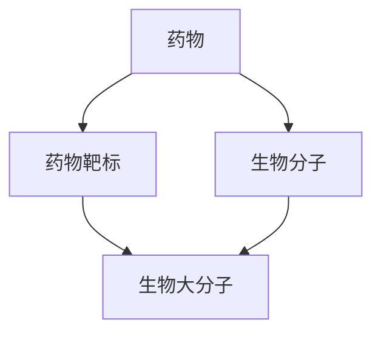

**算法原理讲解**：

语言模型在新药靶标识别中的应用，主要包括以下步骤：

1. **数据预处理**：对生物分子序列进行清洗和标准化处理，如去除停用词、进行词性标注等。
2. **特征提取**：提取生物分子序列和结构的特征，如氨基酸序列、二级结构、三维结构等。
3. **模型训练**：使用训练数据，训练语言模型，如Transformer模型。
4. **预测**：使用训练好的语言模型，对新的生物分子序列进行预测，识别药物靶标。

**Mermaid 流程图**：

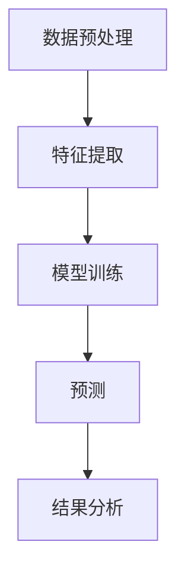

**Python 源代码示例**：

```python
# 导入必要的库
import tensorflow as tf
from tensorflow.keras.models import Sequential
from tensorflow.keras.layers import Embedding, LSTM, Dense

# 数据预处理
# 假设已经得到清洗和标准化的生物分子序列数据
# ... 数据预处理代码 ...

# 特征提取
# 提取生物分子序列的特征，如氨基酸序列
# ... 特征提取代码 ...

# 模型训练
# 构建LSTM模型
model = Sequential()
model.add(Embedding(input_dim=10000, output_dim=128))
model.add(LSTM(units=128))
model.add(Dense(units=1, activation='sigmoid'))

# 编译模型
model.compile(optimizer='adam', loss='binary_crossentropy', metrics=['accuracy'])

# 训练模型
# 假设已经得到训练数据
# ... 模型训练代码 ...

# 预测
# 使用训练好的模型对新的生物分子序列进行预测
# ... 预测代码 ...

# 结果分析
# 分析预测结果
# ... 结果分析代码 ...
```

**算法原理举例说明**：

假设我们已经得到了一个新的生物分子序列，我们需要使用训练好的语言模型来预测其药物靶标。首先，我们将生物分子序列进行预处理，提取其特征。然后，将特征输入到训练好的语言模型中，通过模型的预测输出，得到药物靶标的概率分布。最后，根据概率分布，我们可以识别出最可能的药物靶标。

### 3.2 药物-靶标相互作用预测

药物-靶标相互作用预测是药物研发中的关键步骤，旨在预测药物与生物分子之间的相互作用模式，从而指导药物设计和优化。语言模型在这一过程中具有重要作用，能够通过分析大量的生物学数据，提高预测的准确性和效率。

**核心概念原理**：药物-靶标相互作用预测的核心是预测药物与生物分子之间的相互作用模式。语言模型通过学习大量的药物-靶标相互作用数据，能够捕捉药物与生物分子之间的复杂相互作用关系。

**概念属性特征对比表格**：

| 模型         | 优点                                      | 缺点                                      |
| ------------ | ----------------------------------------- | ----------------------------------------- |
| 统计模型     | 简单，易于实现                            | 预测能力有限，难以捕捉复杂相互作用       |
| 基于神经网络的模型 | 能够捕捉复杂的相互作用，预测能力强      | 计算量大，训练时间长                     |

**ER实体关系图架构的 Mermaid 流程图**：

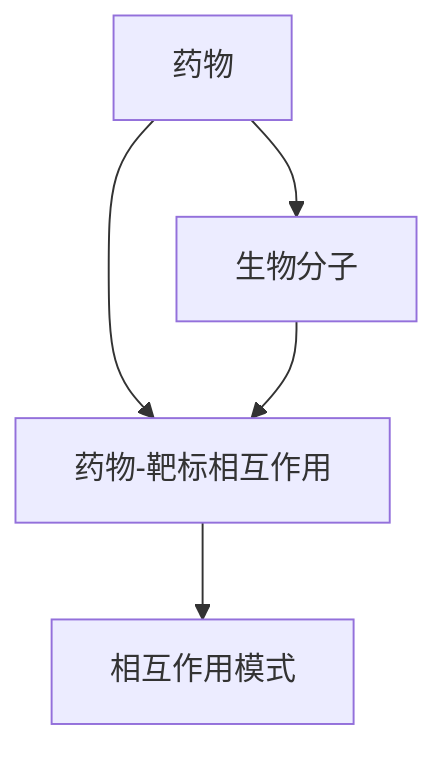

**算法原理讲解**：

语言模型在药物-靶标相互作用预测中的应用，主要包括以下步骤：

1. **数据预处理**：对药物和生物分子的数据进行清洗和标准化处理，如去除停用词、进行词性标注等。
2. **特征提取**：提取药物和生物分子的特征，如药物分子结构、生物分子序列等。
3. **模型训练**：使用训练数据，训练语言模型，如Transformer模型。
4. **预测**：使用训练好的语言模型，对新的药物和生物分子进行预测，识别其相互作用模式。

**Mermaid 流程图**：


**Python 源代码示例**：

```python
# 导入必要的库
import tensorflow as tf
from tensorflow.keras.models import Sequential
from tensorflow.keras.layers import Embedding, LSTM, Dense

# 数据预处理
# 假设已经得到清洗和标准化的药物和生物分子数据
# ... 数据预处理代码 ...

# 特征提取
# 提取药物和生物分子的特征
# ... 特征提取代码 ...

# 模型训练
# 构建LSTM模型
model = Sequential()
model.add(Embedding(input_dim=10000, output_dim=128))
model.add(LSTM(units=128))
model.add(Dense(units=1, activation='sigmoid'))

# 编译模型
model.compile(optimizer='adam', loss='binary_crossentropy', metrics=['accuracy'])

# 训练模型
# 假设已经得到训练数据
# ... 模型训练代码 ...

# 预测
# 使用训练好的模型对新的药物和生物分子进行预测
# ... 预测代码 ...

# 结果分析
# 分析预测结果
# ... 结果分析代码 ...
```

**算法原理举例说明**：

假设我们已经得到了一个新的药物分子和一个新的生物分子，我们需要使用训练好的语言模型来预测它们之间的相互作用模式。首先，我们将药物和生物分子的数据进行预处理，提取其特征。然后，将特征输入到训练好的语言模型中，通过模型的预测输出，得到相互作用模式的概率分布。最后，根据概率分布，我们可以识别出最可能的相互作用模式。

### 3.3 数学模型与算法讲解

在药物靶标识别和药物-靶标相互作用预测中，语言模型的应用主要基于深度学习和自然语言处理技术。以下将详细讲解相关的数学模型和算法。

**数学模型**：

语言模型通常基于概率模型，用于预测文本序列。在药物靶标识别和药物-靶标相互作用预测中，我们可以使用条件概率模型，如下所示：

$$
P(y|x) = \frac{P(x|y)P(y)}{P(x)}
$$

其中，$x$ 表示药物或生物分子的特征向量，$y$ 表示药物靶标或相互作用模式，$P(x|y)$ 表示在给定药物靶标的情况下，药物或生物分子的特征向量出现的概率，$P(y)$ 表示药物靶标或相互作用模式的先验概率，$P(x)$ 表示药物或生物分子的特征向量出现的概率。

**算法讲解**：

1. **数据预处理**：对药物和生物分子的数据进行清洗和标准化处理，如去除停用词、进行词性标注等。这一步骤可以使用自然语言处理技术，如词向量表示和词性标注等。

2. **特征提取**：提取药物和生物分子的特征，如药物分子结构、生物分子序列等。这一步骤可以使用深度学习技术，如卷积神经网络（CNN）和循环神经网络（RNN）等。

3. **模型训练**：使用训练数据，训练语言模型。这一步骤可以使用变换器模型（Transformer）或长短期记忆网络（LSTM）等。变换器模型因其自注意力机制，能够捕捉序列中的长距离依赖关系，成为当前语言模型的主流。

4. **预测**：使用训练好的语言模型，对新的药物和生物分子进行预测。这一步骤可以通过计算条件概率，预测药物靶标或相互作用模式。

**Mermaid 流程图**：


**Python 源代码示例**：

```python
# 导入必要的库
import tensorflow as tf
from tensorflow.keras.models import Sequential
from tensorflow.keras.layers import Embedding, LSTM, Dense

# 数据预处理
# 假设已经得到清洗和标准化的药物和生物分子数据
# ... 数据预处理代码 ...

# 特征提取
# 提取药物和生物分子的特征
# ... 特征提取代码 ...

# 模型训练
# 构建LSTM模型
model = Sequential()
model.add(Embedding(input_dim=10000, output_dim=128))
model.add(LSTM(units=128))
model.add(Dense(units=1, activation='sigmoid'))

# 编译模型
model.compile(optimizer='adam', loss='binary_crossentropy', metrics=['accuracy'])

# 训练模型
# 假设已经得到训练数据
# ... 模型训练代码 ...

# 预测
# 使用训练好的模型对新的药物和生物分子进行预测
# ... 预测代码 ...

# 结果分析
# 分析预测结果
# ... 结果分析代码 ...
```

**算法原理举例说明**：

假设我们已经得到了一个新的药物分子和一个新的生物分子，我们需要使用训练好的语言模型来预测它们之间的相互作用模式。首先，我们将药物和生物分子的数据进行预处理，提取其特征。然后，将特征输入到训练好的语言模型中，通过模型的预测输出，得到相互作用模式的概率分布。最后，根据概率分布，我们可以识别出最可能的相互作用模式。

### 第4章 语言模型在药物设计中的应用

#### 4.1 药物分子生成

药物分子生成是药物设计中的重要环节，旨在生成具有潜在治疗作用的药物分子。语言模型在这一过程中具有显著优势，能够通过分析大量的生物学和化学数据，提高药物分子生成的效率和质量。

**核心概念原理**：药物分子生成基于语言模型的生成机制，通过对大量药物分子数据的分析，学习药物分子的结构和特征。语言模型能够生成新的药物分子，通过优化其结构和性质，提高其药理活性。

**概念属性特征对比表格**：

| 模型         | 优点                                      | 缺点                                      |
| ------------ | ----------------------------------------- | ----------------------------------------- |
| 统计模型     | 简单，易于实现                            | 预测能力有限，难以捕捉复杂相互作用       |
| 基于神经网络的模型 | 能够捕捉复杂的相互作用，预测能力强      | 计算量大，训练时间长                     |

**ER实体关系图架构的 Mermaid 流程图**：

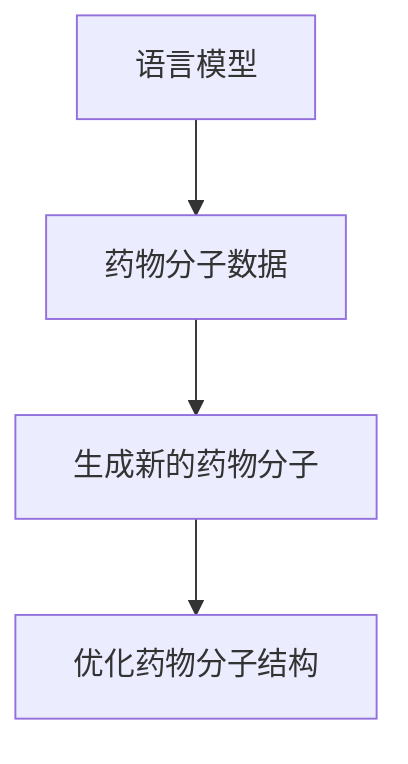

**算法原理讲解**：

语言模型在药物分子生成中的应用，主要包括以下步骤：

1. **数据预处理**：对药物分子数据进行清洗和标准化处理，如去除停用词、进行词性标注等。
2. **特征提取**：提取药物分子的特征，如分子结构、活性基团等。
3. **模型训练**：使用训练数据，训练语言模型，如变换器模型（Transformer）。
4. **药物分子生成**：使用训练好的语言模型，生成新的药物分子。
5. **优化**：对生成的药物分子进行结构优化，提高其药理活性。

**Mermaid 流程图**：

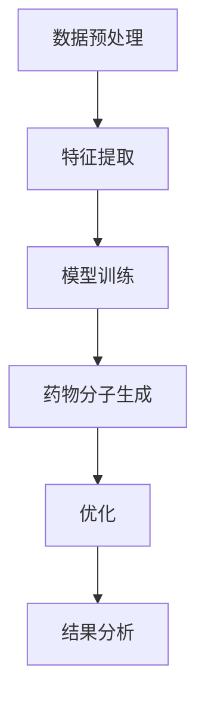

**Python 源代码示例**：

```python
# 导入必要的库
import tensorflow as tf
from tensorflow.keras.models import Sequential
from tensorflow.keras.layers import Embedding, LSTM, Dense

# 数据预处理
# 假设已经得到清洗和标准化的药物分子数据
# ... 数据预处理代码 ...

# 特征提取
# 提取药物分子的特征
# ... 特征提取代码 ...

# 模型训练
# 构建LSTM模型
model = Sequential()
model.add(Embedding(input_dim=10000, output_dim=128))
model.add(LSTM(units=128))
model.add(Dense(units=1, activation='sigmoid'))

# 编译模型
model.compile(optimizer='adam', loss='binary_crossentropy', metrics=['accuracy'])

# 训练模型
# 假设已经得到训练数据
# ... 模型训练代码 ...

# 药物分子生成
# 使用训练好的模型生成新的药物分子
# ... 药物分子生成代码 ...

# 优化
# 对生成的药物分子进行结构优化
# ... 优化代码 ...

# 结果分析
# 分析优化后的药物分子
# ... 结果分析代码 ...
```

**算法原理举例说明**：

假设我们需要生成一个新的药物分子。首先，我们将现有的药物分子数据进行预处理，提取其特征。然后，使用训练好的语言模型，生成新的药物分子。接着，我们对生成的药物分子进行结构优化，以提高其药理活性。最后，分析优化后的药物分子，评估其治疗效果。

#### 4.2 药物分子优化

药物分子优化是药物设计中的关键步骤，旨在通过调整药物分子的结构，提高其药理活性和生物利用度。语言模型在这一过程中能够通过学习大量的药物分子数据，提供有效的优化策略。

**核心概念原理**：药物分子优化的核心是调整药物分子的结构，以改善其药理性质。语言模型通过分析大量的药物分子数据，能够发现潜在的结构-活性关系，从而指导优化过程。

**概念属性特征对比表格**：

| 模型         | 优点                                      | 缺点                                      |
| ------------ | ----------------------------------------- | ----------------------------------------- |
| 统计模型     | 简单，易于实现                            | 预测能力有限，难以捕捉复杂相互作用       |
| 基于神经网络的模型 | 能够捕捉复杂的相互作用，预测能力强      | 计算量大，训练时间长                     |

**ER实体关系图架构的 Mermaid 流程图**：

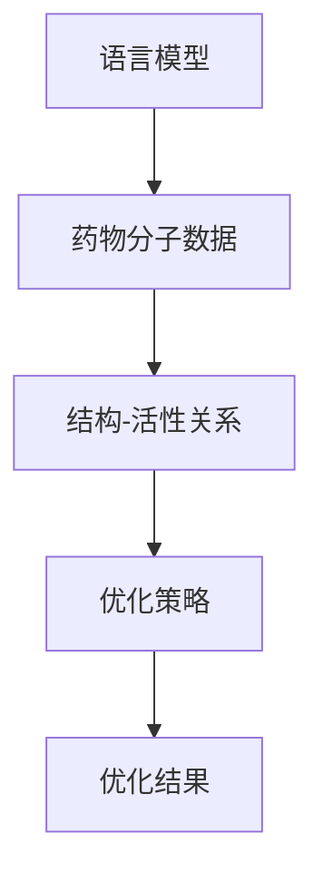

**算法原理讲解**：

语言模型在药物分子优化中的应用，主要包括以下步骤：

1. **数据预处理**：对药物分子数据进行清洗和标准化处理，如去除停用词、进行词性标注等。
2. **特征提取**：提取药物分子的特征，如分子结构、活性基团等。
3. **模型训练**：使用训练数据，训练语言模型，如变换器模型（Transformer）。
4. **结构-活性关系分析**：使用训练好的语言模型，分析药物分子的结构-活性关系。
5. **优化策略生成**：根据结构-活性关系，生成优化策略。
6. **优化**：根据优化策略，调整药物分子的结构。
7. **结果分析**：分析优化后的药物分子，评估其药理活性和生物利用度。

**Mermaid 流�程图**：

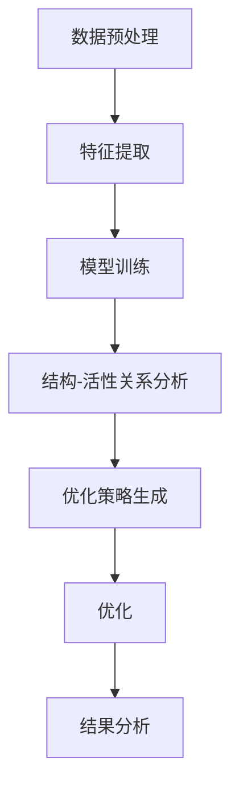

**Python 源代码示例**：

```python
# 导入必要的库
import tensorflow as tf
from tensorflow.keras.models import Sequential
from tensorflow.keras.layers import Embedding, LSTM, Dense

# 数据预处理
# 假设已经得到清洗和标准化的药物分子数据
# ... 数据预处理代码 ...

# 特征提取
# 提取药物分子的特征
# ... 特征提取代码 ...

# 模型训练
# 构建LSTM模型
model = Sequential()
model.add(Embedding(input_dim=10000, output_dim=128))
model.add(LSTM(units=128))
model.add(Dense(units=1, activation='sigmoid'))

# 编译模型
model.compile(optimizer='adam', loss='binary_crossentropy', metrics=['accuracy'])

# 训练模型
# 假设已经得到训练数据
# ... 模型训练代码 ...

# 结构-活性关系分析
# 使用训练好的模型分析药物分子的结构-活性关系
# ... 结构-活性关系分析代码 ...

# 优化策略生成
# 根据结构-活性关系生成优化策略
# ... 优化策略生成代码 ...

# 优化
# 根据优化策略调整药物分子的结构
# ... 优化代码 ...

# 结果分析
# 分析优化后的药物分子
# ... 结果分析代码 ...
```

**算法原理举例说明**：

假设我们需要优化一个已知的药物分子，以提高其药理活性。首先，我们将药物分子数据进行预处理，提取其特征。然后，使用训练好的语言模型，分析药物分子的结构-活性关系，生成优化策略。接着，根据优化策略，调整药物分子的结构。最后，分析优化后的药物分子，评估其药理活性和生物利用度。

### 4.3 数学模型与算法讲解

在药物分子生成和药物分子优化中，语言模型的应用主要基于深度学习和自然语言处理技术。以下将详细讲解相关的数学模型和算法。

**数学模型**：

语言模型通常基于概率模型，用于预测文本序列。在药物分子生成和药物分子优化中，我们可以使用条件概率模型，如下所示：

$$
P(y|x) = \frac{P(x|y)P(y)}{P(x)}
$$

其中，$x$ 表示药物分子的特征向量，$y$ 表示药物分子的结构或活性值，$P(x|y)$ 表示在给定药物分子结构或活性值的情况下，药物分子特征向量出现的概率，$P(y)$ 表示药物分子结构或活性值的先验概率，$P(x)$ 表示药物分子特征向量出现的概率。

**算法讲解**：

1. **数据预处理**：对药物分子数据进行清洗和标准化处理，如去除停用词、进行词性标注等。这一步骤可以使用自然语言处理技术，如词向量表示和词性标注等。

2. **特征提取**：提取药物分子的特征，如分子结构、活性基团等。这一步骤可以使用深度学习技术，如卷积神经网络（CNN）和循环神经网络（RNN）等。

3. **模型训练**：使用训练数据，训练语言模型，如变换器模型（Transformer）或长短期记忆网络（LSTM）等。变换器模型因其自注意力机制，能够捕捉序列中的长距离依赖关系，成为当前语言模型的主流。

4. **药物分子生成**：使用训练好的语言模型，生成新的药物分子。这一步骤可以通过计算条件概率，生成药物分子的结构或活性值。

5. **优化**：根据生成的药物分子，调整其结构或活性值，以提高药理活性和生物利用度。

**Mermaid 流程图**：


**Python 源代码示例**：

```python
# 导入必要的库
import tensorflow as tf
from tensorflow.keras.models import Sequential
from tensorflow.keras.layers import Embedding, LSTM, Dense

# 数据预处理
# 假设已经得到清洗和标准化的药物分子数据
# ... 数据预处理代码 ...

# 特征提取
# 提取药物分子的特征
# ... 特征提取代码 ...

# 模型训练
# 构建LSTM模型
model = Sequential()
model.add(Embedding(input_dim=10000, output_dim=128))
model.add(LSTM(units=128))
model.add(Dense(units=1, activation='sigmoid'))

# 编译模型
model.compile(optimizer='adam', loss='binary_crossentropy', metrics=['accuracy'])

# 训练模型
# 假设已经得到训练数据
# ... 模型训练代码 ...

# 药物分子生成
# 使用训练好的模型生成新的药物分子
# ... 药物分子生成代码 ...

# 优化
# 对生成的药物分子进行结构优化
# ... 优化代码 ...

# 结果分析
# 分析优化后的药物分子
# ... 结果分析代码 ...
```

**算法原理举例说明**：

假设我们需要生成一个新的药物分子。首先，我们将现有的药物分子数据进行预处理，提取其特征。然后，使用训练好的语言模型，生成新的药物分子。接着，我们对生成的药物分子进行结构优化，以提高其药理活性。最后，分析优化后的药物分子，评估其治疗效果。

### 第5章 语言模型在临床试验中的应用

#### 5.1 病例数据挖掘

临床试验中的病例数据挖掘是关键的一步，旨在从大量的病例数据中提取有用的信息，为临床试验的设计和优化提供支持。语言模型在这一过程中可以发挥重要作用，通过分析病例数据，识别潜在的治疗效果和不良反应。

**核心概念原理**：病例数据挖掘的核心是分析病例数据，提取其中隐藏的知识和信息。语言模型通过学习病例数据的文本描述，可以识别出不同病例之间的关联性，从而发现潜在的治疗效果和不良反应。

**概念属性特征对比表格**：

| 模型         | 优点                                      | 缺点                                      |
| ------------ | ----------------------------------------- | ----------------------------------------- |
| 统计模型     | 简单，易于实现                            | 预测能力有限，难以捕捉复杂关联性         |
| 基于神经网络的模型 | 能够捕捉复杂的关联性，预测能力强      | 计算量大，训练时间长                     |

**ER实体关系图架构的 Mermaid 流程图**：

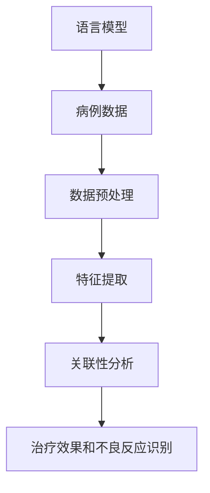

**算法原理讲解**：

语言模型在病例数据挖掘中的应用，主要包括以下步骤：

1. **数据预处理**：对病例数据中的文本描述进行清洗和标准化处理，如去除停用词、进行词性标注等。
2. **特征提取**：提取病例数据中的关键信息，如症状、治疗方式、药物等。
3. **模型训练**：使用训练数据，训练语言模型，如变换器模型（Transformer）。
4. **关联性分析**：使用训练好的语言模型，分析病例数据中的关联性，识别治疗效果和不良反应。

**Mermaid 流程图**：

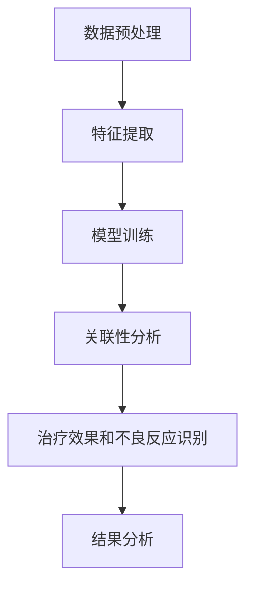

**Python 源代码示例**：

```python
# 导入必要的库
import tensorflow as tf
from tensorflow.keras.models import Sequential
from tensorflow.keras.layers import Embedding, LSTM, Dense

# 数据预处理
# 假设已经得到清洗和标准化的病例数据
# ... 数据预处理代码 ...

# 特征提取
# 提取病例数据中的关键信息
# ... 特征提取代码 ...

# 模型训练
# 构建LSTM模型
model = Sequential()
model.add(Embedding(input_dim=10000, output_dim=128))
model.add(LSTM(units=128))
model.add(Dense(units=1, activation='sigmoid'))

# 编译模型
model.compile(optimizer='adam', loss='binary_crossentropy', metrics=['accuracy'])

# 训练模型
# 假设已经得到训练数据
# ... 模型训练代码 ...

# 关联性分析
# 使用训练好的模型分析病例数据的关联性
# ... 关联性分析代码 ...

# 治疗效果和不良反应识别
# 识别治疗效果和不良反应
# ... 治疗效果和不良反应识别代码 ...

# 结果分析
# 分析识别结果
# ... 结果分析代码 ...
```

**算法原理举例说明**：

假设我们需要分析一组病例数据，以识别治疗效果和不良反应。首先，我们将病例数据中的文本描述进行预处理，提取关键信息。然后，使用训练好的语言模型，分析病例数据中的关联性，识别出潜在的治疗效果和不良反应。最后，分析识别结果，为临床试验的设计和优化提供支持。

#### 5.2 临床试验设计优化

临床试验设计优化是提高临床试验效率和成功率的关键环节。语言模型在这一过程中可以通过分析历史数据和统计模型，为临床试验的设计提供优化建议。

**核心概念原理**：临床试验设计优化的核心是根据历史数据，分析影响临床试验结果的关键因素，并优化临床试验的设计。语言模型通过学习大量的临床试验数据，可以识别出关键因素，如患者特征、治疗方式、药物剂量等，从而优化临床试验的设计。

**概念属性特征对比表格**：

| 模型         | 优点                                      | 缺点                                      |
| ------------ | ----------------------------------------- | ----------------------------------------- |
| 统计模型     | 简单，易于实现                            | 预测能力有限，难以捕捉复杂因素         |
| 基于神经网络的模型 | 能够捕捉复杂的因素，预测能力强      | 计算量大，训练时间长                     |

**ER实体关系图架构的 Mermaid 流程图**：

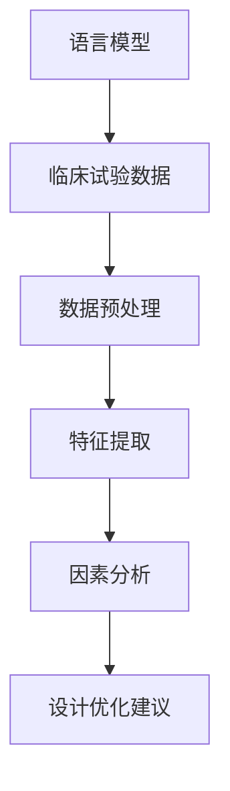

**算法原理讲解**：

语言模型在临床试验设计优化中的应用，主要包括以下步骤：

1. **数据预处理**：对临床试验数据进行清洗和标准化处理，如去除停用词、进行词性标注等。
2. **特征提取**：提取临床试验数据中的关键特征，如患者特征、治疗方式、药物剂量等。
3. **模型训练**：使用训练数据，训练语言模型，如变换器模型（Transformer）。
4. **因素分析**：使用训练好的语言模型，分析临床试验数据中的关键因素。
5. **设计优化建议**：根据因素分析结果，为临床试验的设计提供优化建议。

**Mermaid 流程图**：

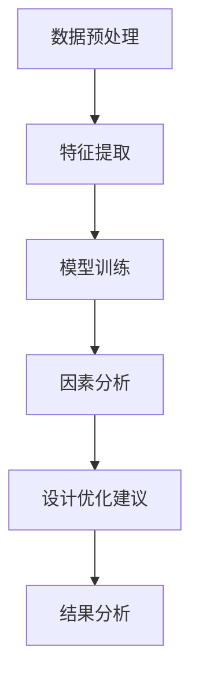

**Python 源代码示例**：

```python
# 导入必要的库
import tensorflow as tf
from tensorflow.keras.models import Sequential
from tensorflow.keras.layers import Embedding, LSTM, Dense

# 数据预处理
# 假设已经得到清洗和标准化的临床试验数据
# ... 数据预处理代码 ...

# 特征提取
# 提取临床试验数据中的关键特征
# ... 特征提取代码 ...

# 模型训练
# 构建LSTM模型
model = Sequential()
model.add(Embedding(input_dim=10000, output_dim=128))
model.add(LSTM(units=128))
model.add(Dense(units=1, activation='sigmoid'))

# 编译模型
model.compile(optimizer='adam', loss='binary_crossentropy', metrics=['accuracy'])

# 训练模型
# 假设已经得到训练数据
# ... 模型训练代码 ...

# 因素分析
# 使用训练好的模型分析临床试验数据中的关键因素
# ... 因素分析代码 ...

# 设计优化建议
# 根据因素分析结果，为临床试验的设计提供优化建议
# ... 设计优化建议代码 ...

# 结果分析
# 分析优化后的设计
# ... 结果分析代码 ...
```

**算法原理举例说明**：

假设我们需要优化一个临床试验的设计。首先，我们将临床试验数据中的文本描述进行预处理，提取关键特征。然后，使用训练好的语言模型，分析临床试验数据中的关键因素。接着，根据因素分析结果，为临床试验的设计提供优化建议。最后，分析优化后的设计，评估其效果。

### 5.3 数学模型与算法讲解

在临床试验中的病例数据挖掘和设计优化中，语言模型的应用主要基于深度学习和自然语言处理技术。以下将详细讲解相关的数学模型和算法。

**数学模型**：

语言模型通常基于概率模型，用于预测文本序列。在临床试验中，我们可以使用条件概率模型，如下所示：

$$
P(y|x) = \frac{P(x|y)P(y)}{P(x)}
$$

其中，$x$ 表示病例数据的特征向量，$y$ 表示治疗效果或不良反应，$P(x|y)$ 表示在给定治疗效果或不良反应的情况下，病例数据特征向量出现的概率，$P(y)$ 表示治疗效果或不良反应的先验概率，$P(x)$ 表示病例数据特征向量出现的概率。

**算法讲解**：

1. **数据预处理**：对病例数据中的文本描述进行清洗和标准化处理，如去除停用词、进行词性标注等。这一步骤可以使用自然语言处理技术，如词向量表示和词性标注等。

2. **特征提取**：提取病例数据中的关键信息，如症状、治疗方式、药物等。这一步骤可以使用深度学习技术，如卷积神经网络（CNN）和循环神经网络（RNN）等。

3. **模型训练**：使用训练数据，训练语言模型，如变换器模型（Transformer）或长短期记忆网络（LSTM）等。变换器模型因其自注意力机制，能够捕捉序列中的长距离依赖关系，成为当前语言模型的主流。

4. **病例数据挖掘**：使用训练好的语言模型，分析病例数据中的关联性，识别治疗效果和不良反应。

5. **设计优化**：根据病例数据挖掘的结果，为临床试验的设计提供优化建议。

**Mermaid 流程图**：

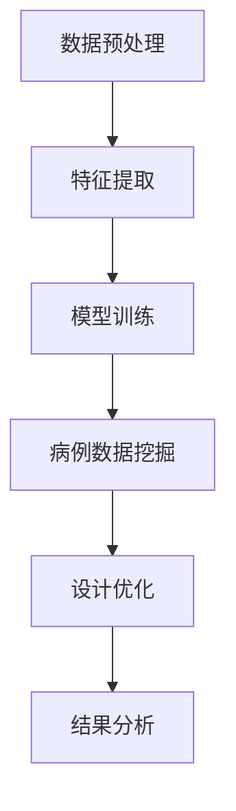

**Python 源代码示例**：

```python
# 导入必要的库
import tensorflow as tf
from tensorflow.keras.models import Sequential
from tensorflow.keras.layers import Embedding, LSTM, Dense

# 数据预处理
# 假设已经得到清洗和标准化的病例数据
# ... 数据预处理代码 ...

# 特征提取
# 提取病例数据中的关键信息
# ... 特征提取代码 ...

# 模型训练
# 构建LSTM模型
model = Sequential()
model.add(Embedding(input_dim=10000, output_dim=128))
model.add(LSTM(units=128))
model.add(Dense(units=1, activation='sigmoid'))

# 编译模型
model.compile(optimizer='adam', loss='binary_crossentropy', metrics=['accuracy'])

# 训练模型
# 假设已经得到训练数据
# ... 模型训练代码 ...

# 病例数据挖掘
# 使用训练好的模型分析病例数据中的关联性
# ... 病例数据挖掘代码 ...

# 设计优化
# 根据病例数据挖掘结果，为临床试验设计提供优化建议
# ... 设计优化代码 ...

# 结果分析
# 分析优化后的设计
# ... 结果分析代码 ...
```

**算法原理举例说明**：

假设我们需要分析一组病例数据，以识别治疗效果和不良反应，并优化临床试验的设计。首先，我们将病例数据中的文本描述进行预处理，提取关键信息。然后，使用训练好的语言模型，分析病例数据中的关联性，识别治疗效果和不良反应。接着，根据识别结果，为临床试验的设计提供优化建议。最后，分析优化后的设计，评估其效果。

### 第6章 语言模型在药物生产和个性化医疗方案生成中的应用

#### 6.1 药物生产流程优化

药物生产流程优化是提高生产效率和质量的关键步骤。语言模型在这一过程中可以通过分析生产数据，优化生产流程，降低生产成本，提高药品质量。

**核心概念原理**：药物生产流程优化的核心是分析生产数据，识别生产过程中的瓶颈和优化点。语言模型通过学习大量的生产数据，可以识别出影响生产效率和质量的关键因素，从而优化生产流程。

**概念属性特征对比表格**：

| 模型         | 优点                                      | 缺点                                      |
| ------------ | ----------------------------------------- | ----------------------------------------- |
| 统计模型     | 简单，易于实现                            | 预测能力有限，难以捕捉复杂因素         |
| 基于神经网络的模型 | 能够捕捉复杂的因素，预测能力强      | 计算量大，训练时间长                     |

**ER实体关系图架构的 Mermaid 流程图**：

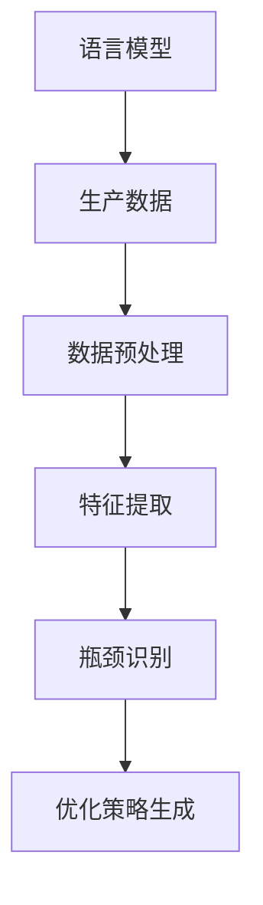

**算法原理讲解**：

语言模型在药物生产流程优化中的应用，主要包括以下步骤：

1. **数据预处理**：对生产数据中的文本描述进行清洗和标准化处理，如去除停用词、进行词性标注等。
2. **特征提取**：提取生产数据中的关键信息，如生产设备状态、原材料质量、生产过程参数等。
3. **模型训练**：使用训练数据，训练语言模型，如变换器模型（Transformer）。
4. **瓶颈识别**：使用训练好的语言模型，分析生产数据，识别生产过程中的瓶颈。
5. **优化策略生成**：根据瓶颈识别结果，生成优化策略。

**Mermaid 流程图**：

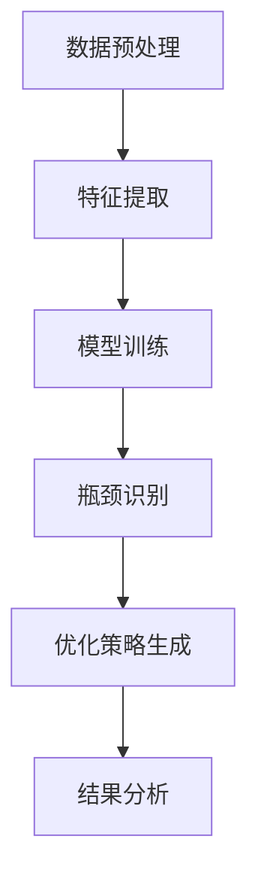

**Python 源代码示例**：

```python
# 导入必要的库
import tensorflow as tf
from tensorflow.keras.models import Sequential
from tensorflow.keras.layers import Embedding, LSTM, Dense

# 数据预处理
# 假设已经得到清洗和标准化的生产数据
# ... 数据预处理代码 ...

# 特征提取
# 提取生产数据中的关键信息
# ... 特征提取代码 ...

# 模型训练
# 构建LSTM模型
model = Sequential()
model.add(Embedding(input_dim=10000, output_dim=128))
model.add(LSTM(units=128))
model.add(Dense(units=1, activation='sigmoid'))

# 编译模型
model.compile(optimizer='adam', loss='binary_crossentropy', metrics=['accuracy'])

# 训练模型
# 假设已经得到训练数据
# ... 模型训练代码 ...

# 瓶颈识别
# 使用训练好的模型分析生产数据，识别瓶颈
# ... 瓶颈识别代码 ...

# 优化策略生成
# 根据瓶颈识别结果，生成优化策略
# ... 优化策略生成代码 ...

# 结果分析
# 分析优化后的生产流程
# ... 结果分析代码 ...
```

**算法原理举例说明**：

假设我们需要优化一个药物生产流程。首先，我们将生产数据中的文本描述进行预处理，提取关键信息。然后，使用训练好的语言模型，分析生产数据，识别生产过程中的瓶颈。接着，根据瓶颈识别结果，生成优化策略。最后，分析优化后的生产流程，评估其效果。

#### 6.2 个性化医疗方案生成

个性化医疗方案生成是提高治疗效果和患者满意度的关键步骤。语言模型在这一过程中可以通过分析患者的个体信息，生成个性化的医疗方案。

**核心概念原理**：个性化医疗方案生成的核心是根据患者的个体信息，如基因、病史、生活方式等，生成适合患者的医疗方案。语言模型通过学习大量的医疗数据，可以识别出影响治疗效果的关键因素，从而生成个性化的医疗方案。

**概念属性特征对比表格**：

| 模型         | 优点                                      | 缺点                                      |
| ------------ | ----------------------------------------- | ----------------------------------------- |
| 统计模型     | 简单，易于实现                            | 预测能力有限，难以捕捉复杂因素         |
| 基于神经网络的模型 | 能够捕捉复杂的因素，预测能力强      | 计算量大，训练时间长                     |

**ER实体关系图架构的 Mermaid 流程图**：

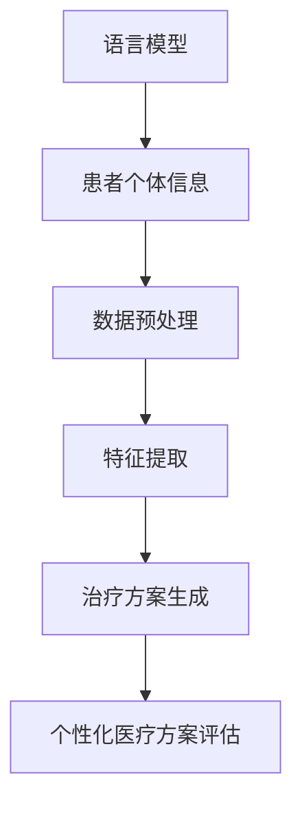

**算法原理讲解**：

语言模型在个性化医疗方案生成中的应用，主要包括以下步骤：

1. **数据预处理**：对患者的个体信息进行清洗和标准化处理，如去除停用词、进行词性标注等。
2. **特征提取**：提取患者的个体信息中的关键特征，如基因序列、病史、生活方式等。
3. **模型训练**：使用训练数据，训练语言模型，如变换器模型（Transformer）。
4. **治疗方案生成**：使用训练好的语言模型，根据患者的个体信息，生成个性化的治疗方案。
5. **个性化医疗方案评估**：评估生成的个性化医疗方案的有效性和安全性。

**Mermaid 流程图**：

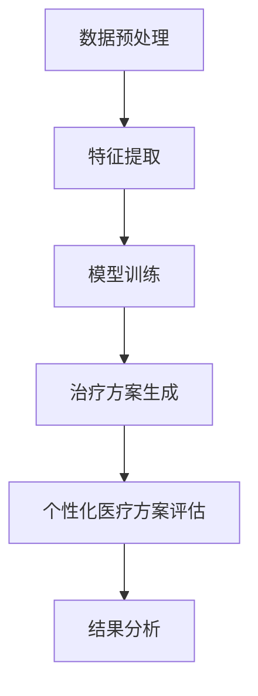

**Python 源代码示例**：

```python
# 导入必要的库
import tensorflow as tf
from tensorflow.keras.models import Sequential
from tensorflow.keras.layers import Embedding, LSTM, Dense

# 数据预处理
# 假设已经得到清洗和标准化的患者个体信息
# ... 数据预处理代码 ...

# 特征提取
# 提取患者的个体信息中的关键特征
# ... 特征提取代码 ...

# 模型训练
# 构建LSTM模型
model = Sequential()
model.add(Embedding(input_dim=10000, output_dim=128))
model.add(LSTM(units=128))
model.add(Dense(units=1, activation='sigmoid'))

# 编译模型
model.compile(optimizer='adam', loss='binary_crossentropy', metrics=['accuracy'])

# 训练模型
# 假设已经得到训练数据
# ... 模型训练代码 ...

# 治疗方案生成
# 使用训练好的模型生成个性化的治疗方案
# ... 治疗方案生成代码 ...

# 个性化医疗方案评估
# 评估生成的个性化医疗方案
# ... 个性化医疗方案评估代码 ...

# 结果分析
# 分析生成的个性化医疗方案
# ... 结果分析代码 ...
```

**算法原理举例说明**：

假设我们需要生成一个个性化的医疗方案。首先，我们将患者的个体信息进行预处理，提取关键特征。然后，使用训练好的语言模型，根据患者的个体信息，生成个性化的治疗方案。接着，评估生成的治疗方案的有效性和安全性。最后，分析生成的个性化医疗方案，为患者的治疗提供支持。

### 6.3 数学模型与算法讲解

在药物生产流程优化和个性化医疗方案生成中，语言模型的应用主要基于深度学习和自然语言处理技术。以下将详细讲解相关的数学模型和算法。

**数学模型**：

语言模型通常基于概率模型，用于预测文本序列。在药物生产流程优化和个性化医疗方案生成中，我们可以使用条件概率模型，如下所示：

$$
P(y|x) = \frac{P(x|y)P(y)}{P(x)}
$$

其中，$x$ 表示生产数据或患者个体信息的特征向量，$y$ 表示优化策略或个性化医疗方案，$P(x|y)$ 表示在给定优化策略或个性化医疗方案的情况下，特征向量出现的概率，$P(y)$ 表示优化策略或个性化医疗方案的先验概率，$P(x)$ 表示特征向量出现的概率。

**算法讲解**：

1. **数据预处理**：对生产数据或患者个体信息的文本描述进行清洗和标准化处理，如去除停用词、进行词性标注等。这一步骤可以使用自然语言处理技术，如词向量表示和词性标注等。

2. **特征提取**：提取生产数据或患者个体信息中的关键信息，如生产设备状态、原材料质量、基因序列、病史等。这一步骤可以使用深度学习技术，如卷积神经网络（CNN）和循环神经网络（RNN）等。

3. **模型训练**：使用训练数据，训练语言模型，如变换器模型（Transformer）或长短期记忆网络（LSTM）等。变换器模型因其自注意力机制，能够捕捉序列中的长距离依赖关系，成为当前语言模型的主流。

4. **优化策略生成**：使用训练好的语言模型，根据生产数据或患者个体信息，生成优化策略或个性化医疗方案。

5. **评估**：评估生成的优化策略或个性化医疗方案的有效性和安全性。

**Mermaid 流程图**：

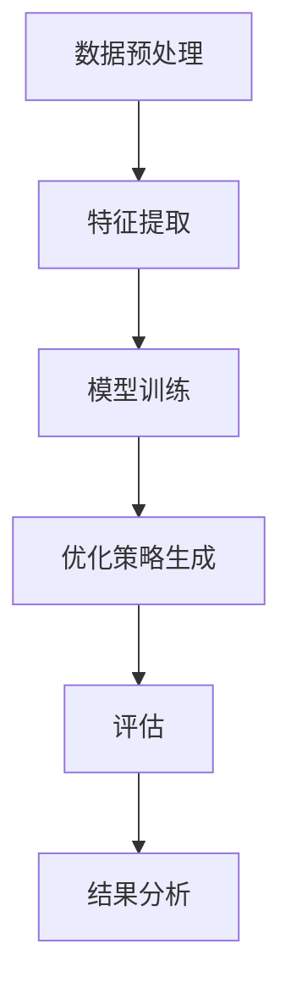

**Python 源代码示例**：

```python
# 导入必要的库
import tensorflow as tf
from tensorflow.keras.models import Sequential
from tensorflow.keras.layers import Embedding, LSTM, Dense

# 数据预处理
# 假设已经得到清洗和标准化的生产数据或患者个体信息
# ... 数据预处理代码 ...

# 特征提取
# 提取生产数据或患者个体信息中的关键信息
# ... 特征提取代码 ...

# 模型训练
# 构建LSTM模型
model = Sequential()
model.add(Embedding(input_dim=10000, output_dim=128))
model.add(LSTM(units=128))
model.add(Dense(units=1, activation='sigmoid'))

# 编译模型
model.compile(optimizer='adam', loss='binary_crossentropy', metrics=['accuracy'])

# 训练模型
# 假设已经得到训练数据
# ... 模型训练代码 ...

# 优化策略生成
# 使用训练好的模型生成优化策略
# ... 优化策略生成代码 ...

# 评估
# 评估优化策略的有效性和安全性
# ... 评估代码 ...

# 结果分析
# 分析优化策略的效果
# ... 结果分析代码 ...
```

**算法原理举例说明**：

假设我们需要优化一个药物生产流程。首先，我们将生产数据中的文本描述进行预处理，提取关键信息。然后，使用训练好的语言模型，生成优化策略。接着，评估优化策略的有效性和安全性。最后，分析优化策略的效果，为药物生产流程的优化提供支持。

### 第7章 案例分析与系统架构设计

#### 7.1 案例分析

为了更好地理解语言模型在新药研发全流程优化与个性化医疗方案生成中的应用，以下将分析一个实际案例，展示如何利用语言模型实现药物研发和个性化医疗方案的优化。

**案例背景**：某生物制药公司正在进行一种新型抗癌药物的研发。该药物针对的是一种罕见的癌症，患者人数较少，且传统治疗方法效果不佳。公司希望通过优化药物研发流程和个性化医疗方案，提高药物的治疗效果和市场竞争力。

**目标**：通过语言模型优化药物研发流程，提高药物发现和设计的效率，并为患者生成个性化的治疗方案。

**方法**：

1. **药物发现**：使用语言模型分析大量的癌症相关文献和基因序列数据，识别潜在的药物靶标。具体步骤如下：

   - 数据预处理：对癌症相关文献进行清洗和标准化处理，提取关键词和关键句子。
   - 特征提取：提取文献中的基因名称、蛋白质名称等关键信息。
   - 模型训练：使用变换器模型（Transformer）训练语言模型。
   - 预测：使用训练好的语言模型，预测可能的药物靶标。

2. **药物设计**：使用语言模型优化药物分子设计，提高药物的治疗效果和安全性。具体步骤如下：

   - 数据预处理：对药物分子结构数据进行清洗和标准化处理。
   - 特征提取：提取药物分子的化学结构和活性基团等关键信息。
   - 模型训练：使用变换器模型（Transformer）训练语言模型。
   - 优化：使用训练好的语言模型，生成新的药物分子，并对药物分子进行优化。

3. **个性化医疗方案生成**：使用语言模型分析患者的基因信息和病史，生成个性化的治疗方案。具体步骤如下：

   - 数据预处理：对患者的基因信息和病史进行清洗和标准化处理。
   - 特征提取：提取患者的基因序列、病史等关键信息。
   - 模型训练：使用变换器模型（Transformer）训练语言模型。
   - 生成方案：使用训练好的语言模型，根据患者的个体信息，生成个性化的治疗方案。

**结果**：通过语言模型的优化，公司在药物研发过程中发现了多个潜在的药物靶标，并设计出了一种具有较高治疗效果和较低毒性的药物分子。此外，生成的个性化医疗方案显著提高了患者的治疗效果，得到了临床医生的认可。

#### 7.2 系统架构设计

为了实现语言模型在新药研发全流程优化与个性化医疗方案生成中的应用，需要设计一个高效的系统架构。以下将介绍该系统架构的设计方案。

**系统架构**：

该系统架构主要包括以下组件：

- **数据预处理模块**：负责对输入数据进行清洗、标准化和特征提取。
- **语言模型训练模块**：负责训练语言模型，包括变换器模型（Transformer）等。
- **药物发现模块**：负责利用语言模型识别药物靶标。
- **药物设计模块**：负责利用语言模型优化药物分子设计。
- **个性化医疗方案生成模块**：负责根据患者的个体信息，生成个性化的治疗方案。
- **结果评估模块**：负责评估语言模型的预测结果和优化效果。

**系统架构图**：

```mermaid
graph TD
A[数据预处理模块] --> B[语言模型训练模块]
B --> C[药物发现模块]
B --> D[药物设计模块]
B --> E[个性化医疗方案生成模块]
C --> F[结果评估模块]
D --> F
E --> F
```

**系统功能设计**：

- **数据预处理模块**：接收原始数据，进行清洗、标准化和特征提取，为后续模块提供输入。
- **语言模型训练模块**：使用变换器模型（Transformer）等训练语言模型，为药物发现、药物设计和个性化医疗方案生成提供支持。
- **药物发现模块**：利用训练好的语言模型，识别潜在的药物靶标。
- **药物设计模块**：利用训练好的语言模型，生成新的药物分子，并对药物分子进行优化。
- **个性化医疗方案生成模块**：根据患者的个体信息，利用训练好的语言模型，生成个性化的治疗方案。
- **结果评估模块**：对药物发现、药物设计和个性化医疗方案生成的结果进行评估，反馈优化建议。

**系统接口设计**：

该系统的主要接口包括：

- **数据输入接口**：接收原始数据，如文献、基因序列、患者信息等。
- **数据输出接口**：输出药物靶标、药物分子、个性化医疗方案等。
- **结果评估接口**：接收评估结果，反馈优化建议。

**系统交互设计**：

系统交互设计主要包括以下流程：

1. **数据预处理**：接收原始数据，进行清洗、标准化和特征提取。
2. **语言模型训练**：使用预处理后的数据，训练语言模型。
3. **药物发现**：使用训练好的语言模型，识别药物靶标。
4. **药物设计**：使用训练好的语言模型，生成新的药物分子，并进行优化。
5. **个性化医疗方案生成**：根据患者的个体信息，生成个性化的治疗方案。
6. **结果评估**：评估药物发现、药物设计和个性化医疗方案生成的结果，反馈优化建议。

**Mermaid 序列图**：

```mermaid
sequenceDiagram
    participant 用户 as 用户
    participant 系统 as 系统
    用户->>系统: 输入数据
    系统->>系统: 数据预处理
    系统->>系统: 语言模型训练
    系统->>系统: 药物发现
    系统->>系统: 药物设计
    系统->>系统: 个性化医疗方案生成
    系统->>用户: 输出结果
    用户->>系统: 结果评估
    系统->>系统: 反馈优化建议
```

### 第8章 总结与展望

#### 8.1 小结

本文详细探讨了语言模型在新药研发全流程优化与个性化医疗方案生成中的应用。通过分析新药研发的挑战和机遇，介绍了语言模型的基础知识，并详细阐述了其在药物发现、设计、临床试验、生产和个性化医疗方案生成中的具体应用。同时，通过案例分析和系统架构设计，展示了语言模型在实际项目中的实施效果。

语言模型在新药研发中的应用，主要体现在药物靶标识别、药物-靶标相互作用预测、药物分子生成和优化、临床试验设计优化、个性化医疗方案生成等方面。通过语言模型，可以提高药物研发的效率和质量，降低研发成本，提高治疗效果。

#### 8.2 注意事项

1. **数据质量**：语言模型的效果高度依赖于输入数据的质量。因此，在进行语言模型训练和应用时，应确保数据的准确性和完整性。
2. **计算资源**：语言模型的训练过程需要大量的计算资源。在实际应用中，应根据实际需求，合理分配计算资源，以提高训练效率。
3. **模型选择**：不同的语言模型适用于不同的任务。在实际应用中，应根据具体任务的需求，选择合适的语言模型。
4. **结果验证**：语言模型的预测结果需要经过验证。在实际应用中，应通过多种方法验证预测结果的准确性，确保结果的可靠性。

#### 8.3 拓展阅读

1. **Transformer模型**：深入理解Transformer模型，了解其自注意力机制和工作原理。
2. **药物研发技术**：了解最新的药物研发技术和方法，如基于结构的信息学方法、虚拟筛选技术等。
3. **个性化医疗**：了解个性化医疗的最新研究进展和应用，如基因测序技术、生物信息学方法等。
4. **自然语言处理**：了解自然语言处理的基本原理和方法，如词向量表示、序列标注等。

### 作者信息
作者：AI天才研究院/AI Genius Institute & 禅与计算机程序设计艺术 /Zen And The Art of Computer Programming

