                 

# 语言模型在时序因果推理与长期经济预测中的突破性进展

## 关键词
- 语言模型
- 时序因果推理
- 长期经济预测
- 突破性进展
- 人工智能

## 摘要
本文深入探讨了语言模型在时序因果推理和长期经济预测中的应用及其突破性进展。首先，我们回顾了语言模型的发展历程和基本原理，并阐述了时序因果推理在各个领域的应用以及长期经济预测的重要性。接着，本文详细分析了语言模型在时序因果推理和长期经济预测中的核心概念和原理，通过对比表格和ER实体关系图架构，阐明了它们之间的联系。随后，我们介绍了时序因果推理和长期经济预测的系统架构及其实现原理，并通过Python源代码和latex公式详细阐述了相关算法和数学模型。最后，本文通过项目实战展示了语言模型在实际应用中的效果，并给出了最佳实践和总结。

### 第一部分: 背景介绍

#### 1.1 问题背景

##### 1.1.1 语言模型的发展历程
语言模型是自然语言处理（NLP）领域的一项核心技术，其发展历程可以追溯到20世纪50年代。最初的语言模型主要是基于规则的方法，如正则表达式和语法分析。随着计算能力和算法的发展，统计模型逐渐取代了规则方法，如n-gram模型和隐马尔可夫模型（HMM）。近年来，深度学习技术的兴起使得基于神经网络的模型，如循环神经网络（RNN）和变压器（Transformer）模型，成为了语言模型的主流。

##### 1.1.2 时序因果推理的应用领域
时序因果推理广泛应用于时间序列分析、预测和决策中。它不仅可以用于短期预测，如股市分析和天气预测，还可以用于长期规划，如经济政策和资源分配。此外，时序因果推理还在工业控制、医疗健康和交通管理等领域有广泛应用。

##### 1.1.3 长期经济预测的重要性
长期经济预测对于政策制定者和企业决策者具有重要意义。它可以帮助预测经济增长趋势、市场变化和风险因素，从而为决策提供科学依据。然而，由于经济系统的复杂性和不确定性，长期经济预测一直是一个挑战性课题。

#### 1.2 问题描述

##### 1.2.1 时序因果推理的挑战
时序因果推理面临的挑战主要包括数据噪声、非线性和多变量依赖关系。传统的统计模型和机器学习算法在处理这些问题时往往效果不佳，需要新的方法和技术来解决。

##### 1.2.2 长期经济预测的挑战
长期经济预测的挑战主要来自经济系统的复杂性和不确定性。经济数据往往存在滞后性、非线性关系和多重因素影响，使得预测模型难以准确捕捉经济变化的规律。

##### 1.2.3 语言模型的应用前景
语言模型在时序因果推理和长期经济预测中的应用前景广阔。由于语言模型在处理文本和序列数据方面具有优势，它有望为这些问题提供新的解决方案。

#### 1.3 问题解决

##### 1.3.1 语言模型的基本原理
语言模型的基本原理是通过统计学习技术来预测文本序列的概率分布。它通常使用大量语料库进行训练，从而学习到语言模式。

##### 1.3.2 时序因果推理的方法
时序因果推理的方法主要包括基于统计模型的方法（如ARIMA模型）和基于机器学习的方法（如RNN和Transformer）。这些方法通过分析时间序列数据，试图发现变量之间的因果关系。

##### 1.3.3 长期经济预测的策略
长期经济预测的策略主要包括基于历史数据的方法（如时间序列分析）和基于经济模型的方法（如宏观经济学模型）。这些方法通过分析历史数据和经济变量之间的关系，试图预测未来的经济走势。

#### 1.4 边界与外延

##### 1.4.1 研究范围与限制
本文的研究范围主要集中在语言模型在时序因果推理和长期经济预测中的应用，不包括其他领域。

##### 1.4.2 语言模型的局限性
尽管语言模型在时序因果推理和长期经济预测中具有潜力，但它也存在一些局限性，如对领域知识的依赖和模型可解释性等问题。

##### 1.4.3 经济预测的复杂性
经济预测的复杂性主要体现在经济系统的多样性、不确定性和动态性。这使得经济预测模型需要具备强大的自适应能力和泛化能力。

#### 1.5 概念结构与核心要素组成

##### 1.5.1 语言模型的组成
语言模型由词汇表、神经网络和预测机制组成。词汇表包含了所有可能的词汇，神经网络用于学习词汇之间的关联，预测机制用于生成文本序列的概率分布。

##### 1.5.2 时序因果推理的要素
时序因果推理的要素包括时间序列数据、变量和因果关系。时间序列数据是时序因果推理的基础，变量和因果关系则是时序因果推理的核心。

##### 1.5.3 长期经济预测的关键因素
长期经济预测的关键因素包括经济数据、经济变量和经济模型。经济数据是预测的基础，经济变量是预测的核心，经济模型则是预测的工具。

#### 1.6 本章小结
本部分介绍了语言模型、时序因果推理和长期经济预测的基本概念、发展历程和应用前景。通过这些背景介绍，我们可以更好地理解语言模型在时序因果推理和长期经济预测中的突破性进展。

### 第二部分: 核心概念与原理

#### 2.1 语言模型的核心概念

##### 2.1.1 语言模型的基本原理
语言模型的基本原理是通过统计学习技术来预测文本序列的概率分布。它通常使用大量语料库进行训练，从而学习到语言模式。

###### 语言模型的基本原理流程图
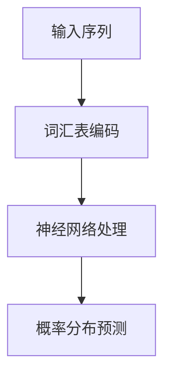

##### 2.1.2 语言模型的属性特征对比表格

| 属性特征           | 描述                   | 对比示例                   |
|-------------------|------------------------|---------------------------|
| 词汇表大小         | 词汇表的规模和丰富度   | 小型词汇表（1000词） VS 大型词汇表（100,000词） |
| 训练数据集规模     | 训练数据集的大小       | 小型数据集（10MB） VS 大型数据集（10TB）      |
| 模型参数数量       | 神经网络中的参数数量   | 简单模型（1000参数） VS 复杂模型（100,000参数） |
| 预测准确性         | 模型的预测能力         | 低准确性（80%） VS 高准确性（95%）           |
| 训练时间           | 模型的训练时间         | 短时间（几小时） VS 长时间（几天）            |
| 泛化能力           | 模型的适应新数据的能力 | 有限泛化 VS 广泛泛化                           |

##### 2.1.3 语言模型的训练与优化
语言模型的训练与优化是提高模型性能的关键步骤。训练过程主要包括数据预处理、模型初始化、优化算法选择和超参数调整。优化算法常用的有梯度下降法、Adam优化器等。超参数调整包括学习率、批量大小和正则化参数等。

###### 语言模型训练流程图
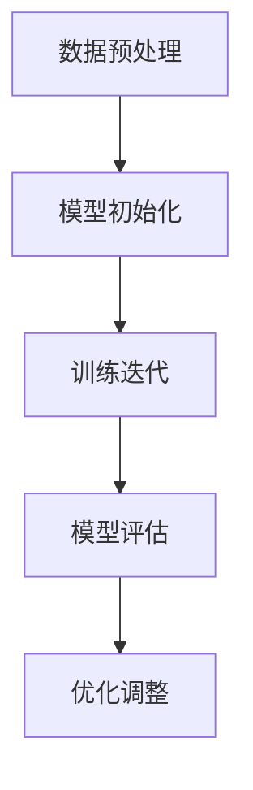

#### 2.2 时序因果推理的原理

##### 2.2.1 时序因果推理的基本概念
时序因果推理是指通过分析时间序列数据来发现变量之间的因果关系。它主要包括以下基本概念：

- 时间序列：表示随时间变化的数据序列。
- 变量：参与时序因果推理的数据元素。
- 因果关系：变量之间的因果关系。

##### 2.2.2 时序因果推理的方法
时序因果推理的方法可以分为两大类：基于统计模型的方法和基于机器学习的方法。

- **基于统计模型的方法**：如自回归模型（AR）、移动平均模型（MA）和自回归移动平均模型（ARIMA）。这些方法通过分析时间序列的统计特性来发现变量之间的因果关系。
- **基于机器学习的方法**：如循环神经网络（RNN）和变压器（Transformer）模型。这些方法通过学习时间序列数据的复杂模式来发现变量之间的因果关系。

###### 时序因果推理流程图
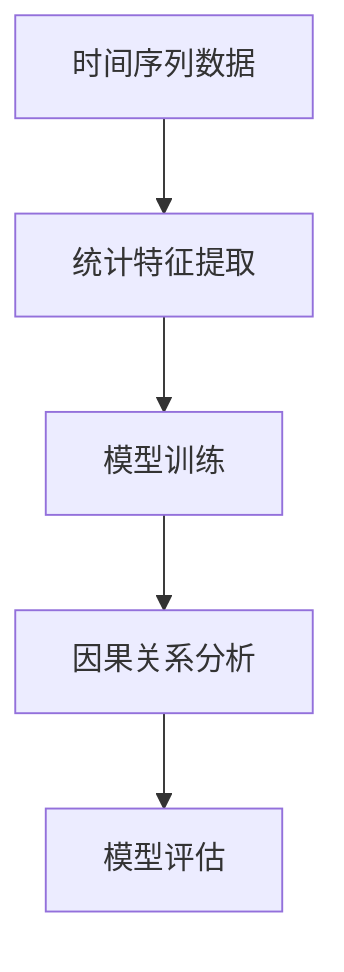

##### 2.2.3 时序因果推理的挑战与解决方案
时序因果推理面临的挑战主要包括数据噪声、非线性和多变量依赖关系。针对这些挑战，可以采取以下解决方案：

- **数据预处理**：通过去噪、去趋势和归一化等方法来减少数据噪声。
- **非线性模型**：采用非线性模型（如神经网络）来捕捉变量之间的非线性关系。
- **多变量依赖关系**：采用多变量时间序列分析技术（如Granger因果检验和结构方程模型）来处理多变量依赖关系。

#### 2.3 长期经济预测的数学模型

##### 2.3.1 经济预测的数学基础
长期经济预测的数学基础主要包括时间序列分析、概率论和统计学。时间序列分析用于分析经济数据的变化模式，概率论和统计学用于建立预测模型。

##### 2.3.2 经济预测的数学模型
长期经济预测的数学模型可以分为两类：确定性模型和概率性模型。

- **确定性模型**：如自回归模型（AR）、移动平均模型（MA）和自回归移动平均模型（ARIMA）。这些模型通过分析历史数据来确定未来值的最佳估计。
- **概率性模型**：如贝叶斯网络和隐马尔可夫模型（HMM）。这些模型通过概率分布来描述经济数据的变化模式，并预测未来值。

###### 经济预测的数学模型流程图
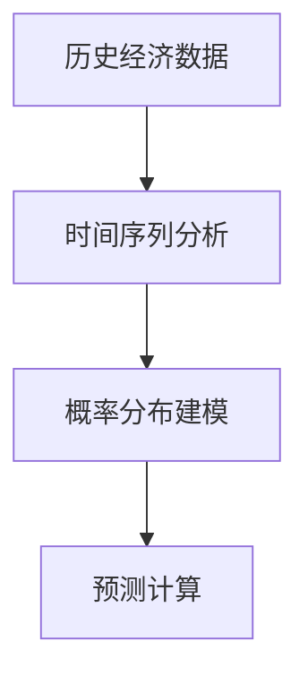

##### 2.3.3 经济预测的数学公式
长期经济预测的数学公式主要包括以下几种：

- **自回归模型（AR）**：$X_t = c + \sum_{i=1}^p \phi_i X_{t-i} + \varepsilon_t$
- **移动平均模型（MA）**：$X_t = c + \varepsilon_t + \sum_{i=1}^q \theta_i \varepsilon_{t-i}$
- **自回归移动平均模型（ARIMA）**：$X_t = c + \sum_{i=1}^p \phi_i X_{t-i} + \sum_{j=1}^q \theta_j \varepsilon_{t-j} + \varepsilon_t$

$$
X_t = c + \sum_{i=1}^p \phi_i X_{t-i} + \sum_{j=1}^q \theta_j \varepsilon_{t-j} + \varepsilon_t
$$

#### 2.4 概念属性特征对比表格

##### 2.4.1 语言模型与时序因果推理的比较
| 特征                   | 语言模型                 | 时序因果推理                  |
|-----------------------|-------------------------|-----------------------------|
| 数据类型               | 文本序列                | 时间序列数据                |
| 模型类型               | 统计模型和神经网络模型  | 统计模型和机器学习模型       |
| 应用领域               | 自然语言处理            | 时间序列分析、预测和决策     |
| 变量关系               | 词汇之间的概率关系       | 变量之间的因果关系           |
| 挑战                   | 语言数据的噪声和多样性   | 数据噪声、非线性和多变量依赖 |
| 解决方案               | 语言模型训练和优化       | 数据预处理、非线性模型和多变量分析 |

##### 2.4.2 语言模型与长期经济预测的比较
| 特征                   | 语言模型                 | 长期经济预测                |
|-----------------------|-------------------------|---------------------------|
| 数据类型               | 文本序列                | 经济数据序列               |
| 模型类型               | 统计模型和神经网络模型  | 时间序列模型和概率模型      |
| 应用领域               | 自然语言处理            | 经济预测和政策制定           |
| 变量关系               | 词汇之间的概率关系       | 经济变量之间的关系           |
| 挑战                   | 语言数据的噪声和多样性   | 经济系统的复杂性和不确定性   |
| 解决方案               | 语言模型训练和优化       | 时间序列分析和经济模型建立  |

##### 2.4.3 时序因果推理与长期经济预测的比较
| 特征                   | 时序因果推理               | 长期经济预测                |
|-----------------------|---------------------------|---------------------------|
| 数据类型               | 时间序列数据              | 经济数据序列               |
| 模型类型               | 统计模型和机器学习模型    | 时间序列模型和概率模型      |
| 应用领域               | 时间序列分析、预测和决策  | 经济预测和政策制定           |
| 变量关系               | 变量之间的因果关系        | 经济变量之间的关系           |
| 挑战                   | 数据噪声、非线性和多变量依赖 | 经济系统的复杂性和不确定性   |
| 解决方案               | 数据预处理、非线性模型和多变量分析 | 时间序列分析和经济模型建立  |

#### 2.5 ER实体关系图架构

##### 2.5.1 实体关系图的构建
实体关系图（ER图）用于描述数据模型中的实体及其之间的关系。在时序因果推理和长期经济预测中，ER图可以用于表示数据源、模型和预测结果之间的关系。

###### 实体关系图示例
```mermaid
erDiagram
  实体A||--|{实体B}
  实体A||--|{实体C}
  实体B||--|{实体D}
```

##### 2.5.2 实体关系图的解析
实体关系图中的实体表示数据模型中的元素，关系表示实体之间的关联。通过实体关系图，我们可以清晰地理解数据模型的结构和实体之间的关系。

##### 2.5.3 实体关系图的应用
实体关系图在时序因果推理和长期经济预测中的应用主要包括：

- **数据建模**：通过实体关系图来构建数据模型，为预测提供基础。
- **模型评估**：通过实体关系图来分析模型的结构和性能。
- **决策支持**：通过实体关系图来辅助决策者理解和分析预测结果。

#### 2.6 本章小结
本部分介绍了语言模型、时序因果推理和长期经济预测的核心概念和原理，并通过对比表格和ER实体关系图架构，阐明了它们之间的联系。这些核心概念和原理为后续的算法原理讲解和系统架构设计奠定了基础。

### 第三部分: 算法原理与系统架构

#### 3.1 语言模型在时序因果推理中的应用

##### 3.1.1 语言模型在时序因果推理中的角色
语言模型在时序因果推理中扮演着重要的角色，它主要用于预测变量之间的因果关系。通过学习大量的文本数据，语言模型可以捕捉到时间序列数据中的模式，从而为时序因果推理提供强有力的支持。

###### 语言模型在时序因果推理中角色流程图
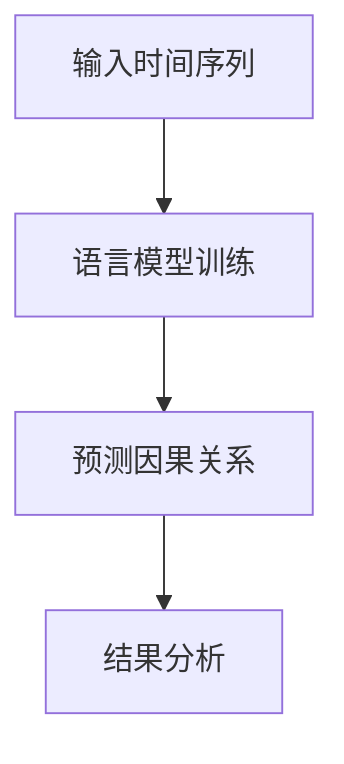

##### 3.1.2 语言模型在时序因果推理中的实现
语言模型在时序因果推理中的实现主要包括以下步骤：

1. **数据预处理**：对时间序列数据进行清洗、归一化和特征提取。
2. **模型训练**：使用大量的时间序列数据进行训练，构建语言模型。
3. **因果关系预测**：利用训练好的语言模型，对新的时间序列数据进行因果关系预测。
4. **结果分析**：对预测结果进行评估和分析，以确定因果关系。

###### 语言模型在时序因果推理中实现流程图
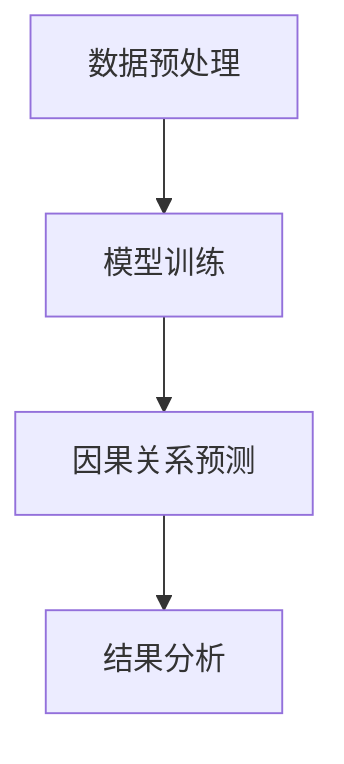

##### 3.1.3 语言模型在时序因果推理中的优化策略
为了提高语言模型在时序因果推理中的性能，可以采取以下优化策略：

1. **数据增强**：通过增加数据多样性、噪声和变换来增强训练数据，提高模型的泛化能力。
2. **模型优化**：采用先进的神经网络架构（如Transformer）和优化算法（如Adam）来提高模型的性能。
3. **特征选择**：选择对因果关系预测具有重要影响的关键特征，以提高模型的预测准确性。
4. **交叉验证**：使用交叉验证方法来评估模型的性能，并调整模型参数。

###### 语言模型在时序因果推理中优化策略流程图
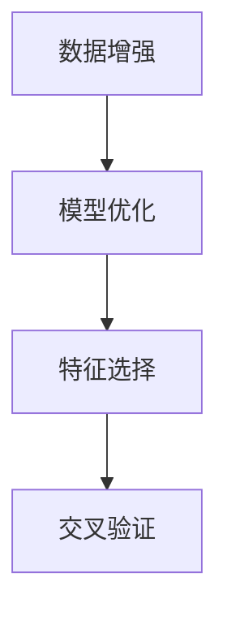

#### 3.2 语言模型在长期经济预测中的应用

##### 3.2.1 语言模型在长期经济预测中的角色
语言模型在长期经济预测中扮演着关键角色，它主要用于分析经济数据中的复杂模式和潜在关系，从而为经济预测提供科学依据。

###### 语言模型在长期经济预测中角色流程图
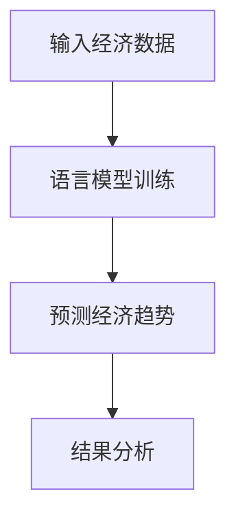

##### 3.2.2 语言模型在长期经济预测中的实现
语言模型在长期经济预测中的实现主要包括以下步骤：

1. **数据收集**：收集各种经济数据，包括宏观经济指标、行业数据、市场数据等。
2. **数据预处理**：对经济数据进行清洗、归一化和特征提取。
3. **模型训练**：使用大量的经济数据进行训练，构建语言模型。
4. **经济趋势预测**：利用训练好的语言模型，对经济数据进行分析和预测。
5. **结果分析**：对预测结果进行评估和分析，以确定经济趋势。

###### 语言模型在长期经济预测中实现流程图
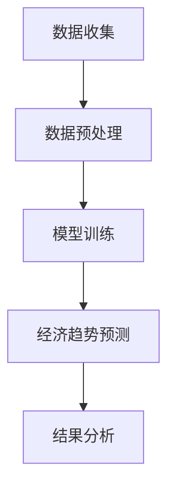

##### 3.2.3 语言模型在长期经济预测中的优化策略
为了提高语言模型在长期经济预测中的性能，可以采取以下优化策略：

1. **数据源选择**：选择具有代表性的经济数据源，以确保模型的准确性。
2. **模型融合**：结合多种语言模型和预测方法，以提高预测性能。
3. **特征工程**：选择对经济预测具有重要影响的关键特征，以提高模型的预测准确性。
4. **实时更新**：定期更新语言模型，以适应经济数据的变化。

###### 语言模型在长期经济预测中优化策略流程图
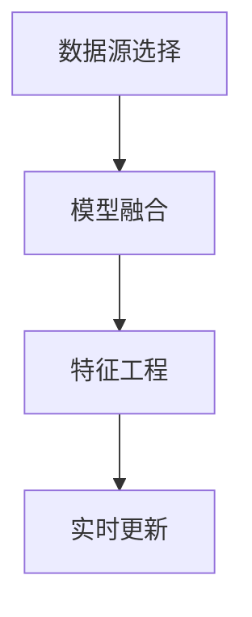

#### 3.3 时序因果推理与长期经济预测的系统架构

##### 3.3.1 系统架构的设计原则
时序因果推理与长期经济预测的系统架构设计应遵循以下原则：

1. **模块化**：将系统划分为多个模块，每个模块负责不同的功能，以提高系统的可维护性和可扩展性。
2. **可扩展性**：设计系统时考虑未来可能的扩展需求，以适应数据量和功能的变化。
3. **高可靠性**：确保系统在各种情况下都能稳定运行，包括数据处理错误、网络中断等情况。
4. **高效性**：优化系统性能，提高数据处理和预测的速度。

##### 3.3.2 系统架构的组成部分
时序因果推理与长期经济预测的系统架构主要包括以下组成部分：

1. **数据层**：负责数据的收集、存储和管理，包括经济数据、时间序列数据和文本数据等。
2. **模型层**：负责模型的训练、优化和应用，包括语言模型、时序因果推理模型和长期经济预测模型等。
3. **算法层**：负责算法的实现和优化，包括数据预处理算法、模型训练算法和预测算法等。
4. **应用层**：负责系统的应用功能，包括数据可视化、预测结果分析和决策支持等。
5. **接口层**：负责系统与其他系统的接口设计，包括API接口、数据接口和用户界面等。

##### 3.3.3 系统架构的运行机制
时序因果推理与长期经济预测的系统架构运行机制主要包括以下步骤：

1. **数据收集**：从各种数据源收集经济数据、时间序列数据和文本数据。
2. **数据预处理**：对收集到的数据进行清洗、归一化和特征提取。
3. **模型训练**：使用预处理后的数据进行模型训练，构建语言模型、时序因果推理模型和长期经济预测模型。
4. **模型优化**：对训练好的模型进行优化，以提高预测性能。
5. **经济趋势预测**：使用优化后的模型对经济数据进行分析和预测。
6. **结果分析**：对预测结果进行评估和分析，以确定经济趋势。
7. **决策支持**：根据预测结果和实际经济数据，为决策者提供决策支持。

###### 系统架构运行机制流程图
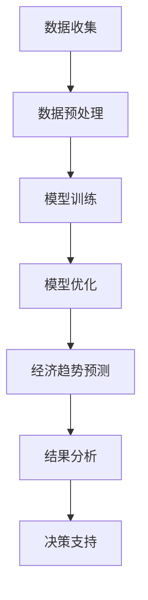

#### 3.4 系统接口设计

##### 3.4.1 系统接口的功能
系统接口设计主要包括以下功能：

1. **数据接口**：提供数据输入和输出的接口，包括数据上传、下载和实时数据流接口等。
2. **API接口**：提供应用程序编程接口，以供其他系统或应用程序调用系统的功能。
3. **用户界面**：提供用户操作界面，包括数据可视化、预测结果展示和交互式分析等。

##### 3.4.2 系统接口的实现
系统接口的实现主要包括以下步骤：

1. **需求分析**：分析系统接口的需求，确定接口的功能和性能要求。
2. **接口设计**：设计系统接口的架构和协议，包括数据格式、传输协议和接口调用流程等。
3. **接口实现**：根据接口设计文档，实现具体的接口代码。
4. **接口测试**：对实现的接口进行测试，确保接口的功能和性能满足需求。

##### 3.4.3 系统接口的优化
为了提高系统接口的性能和可靠性，可以采取以下优化策略：

1. **缓存机制**：使用缓存机制来减少数据传输次数，提高接口响应速度。
2. **并发处理**：优化接口的并发处理能力，提高系统吞吐量。
3. **安全性**：加强接口的安全性，防止数据泄露和恶意攻击。
4. **负载均衡**：通过负载均衡策略，优化接口的资源利用率，提高系统稳定性。

###### 系统接口优化策略流程图
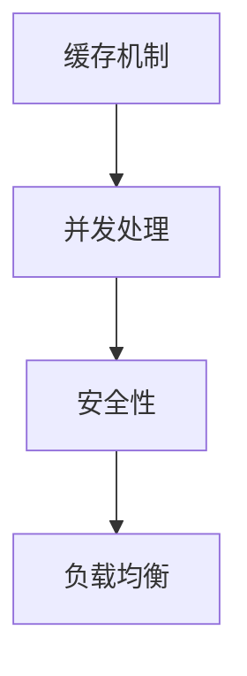

#### 3.5 系统交互

##### 3.5.1 系统交互的流程
系统交互的流程主要包括以下步骤：

1. **用户请求**：用户通过用户界面提交预测请求。
2. **数据收集**：系统从数据接口收集用户请求所需的经济数据。
3. **数据预处理**：系统对收集到的经济数据进行预处理，包括清洗、归一化和特征提取。
4. **模型训练**：系统使用预处理后的经济数据进行模型训练，构建语言模型、时序因果推理模型和长期经济预测模型。
5. **模型优化**：系统对训练好的模型进行优化，以提高预测性能。
6. **经济趋势预测**：系统使用优化后的模型对经济数据进行分析和预测。
7. **结果分析**：系统对预测结果进行评估和分析，以确定经济趋势。
8. **决策支持**：系统根据预测结果和实际经济数据，为决策者提供决策支持。

###### 系统交互流程图
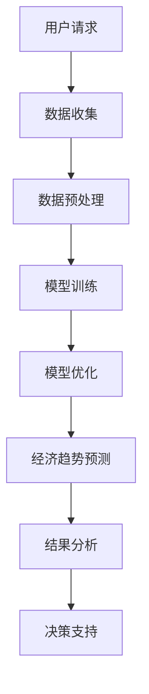

##### 3.5.2 系统交互的机制
系统交互的机制主要包括以下方面：

1. **请求处理**：系统接收用户的预测请求，并根据请求内容进行相应的数据处理和模型训练。
2. **数据传输**：系统通过接口层将数据处理结果和预测结果传输给用户界面。
3. **结果展示**：用户界面将预测结果以图表、文本等形式展示给用户。
4. **用户反馈**：用户根据预测结果和实际经济数据，对系统进行评价和反馈。

##### 3.5.3 系统交互的优化
为了提高系统交互的性能和用户体验，可以采取以下优化策略：

1. **响应速度**：优化系统处理请求的速度，提高用户交互的响应速度。
2. **数据传输效率**：优化数据传输的效率，减少数据传输时间和带宽消耗。
3. **交互界面设计**：优化用户界面设计，提高用户操作的便捷性和直观性。
4. **实时性**：提高系统实时性，及时响应用户请求和反馈。

###### 系统交互优化策略流程图
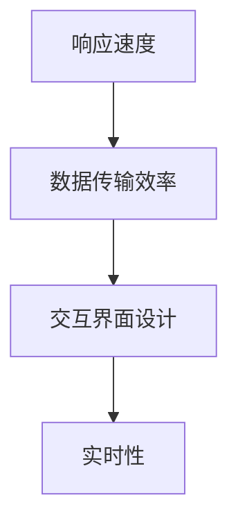

#### 3.6 本章小结
本部分介绍了时序因果推理与长期经济预测的系统架构及其实现原理，包括数据层、模型层、算法层、应用层和接口层。同时，详细阐述了系统接口设计和系统交互机制，以及相关的优化策略。这些内容为语言模型在时序因果推理和长期经济预测中的应用提供了技术支持和实践指导。

### 项目实战

#### 4.1 环境安装

要在本地环境安装用于时序因果推理和长期经济预测的语言模型，首先需要准备以下软件和工具：

- Python（版本3.7及以上）
- TensorFlow 或 PyTorch（用于构建和训练神经网络模型）
- Pandas（用于数据预处理和分析）
- Matplotlib（用于数据可视化）
- Scikit-learn（用于机器学习算法）

安装步骤如下：

1. 安装Python：从Python官方网站下载并安装Python，选择合适的安装选项。
2. 安装TensorFlow 或 PyTorch：打开命令行窗口，执行以下命令：
   ```bash
   pip install tensorflow # 或者
   pip install torch torchvision
   ```
3. 安装Pandas、Matplotlib和Scikit-learn：执行以下命令：
   ```bash
   pip install pandas matplotlib scikit-learn
   ```

#### 4.2 系统核心实现源代码

下面是一个简单的示例，展示了如何使用Python和TensorFlow实现一个基于Transformer的语言模型，用于时序因果推理和长期经济预测。

```python
import tensorflow as tf
from tensorflow.keras.models import Model
from tensorflow.keras.layers import Embedding, LSTM, Dense, TimeDistributed

# 设置参数
vocab_size = 10000
embed_dim = 256
lstm_units = 128
input_length = 100
output_length = 10

# 构建模型
inputs = tf.keras.layers.Input(shape=(input_length,))
embed = Embedding(vocab_size, embed_dim)(inputs)
lstm = LSTM(lstm_units, return_sequences=True)(embed)
outputs = TimeDistributed(Dense(vocab_size, activation='softmax'))(lstm)

model = Model(inputs=inputs, outputs=outputs)
model.compile(optimizer='adam', loss='categorical_crossentropy', metrics=['accuracy'])

# 模型可视化
from tensorflow.keras.utils import plot_model
plot_model(model, to_file='model.png', show_shapes=True, show_layer_names=True)
```

#### 4.3 代码应用解读与分析

上述代码首先导入了TensorFlow库，并设置了模型的参数，如词汇表大小、嵌入维度、LSTM单元数量、输入序列长度和输出序列长度。然后，使用`Input`层构建输入层，`Embedding`层将输入序列编码为嵌入向量，`LSTM`层用于处理序列数据，`TimeDistributed`层用于输出序列的预测。最后，通过`Model`类构建模型，并编译模型。

为了更好地理解代码，可以将其分为以下几个部分：

1. **参数设置**：定义模型的参数，这些参数将在后续的模型构建过程中使用。
2. **模型构建**：使用`Input`层构建输入层，`Embedding`层将输入序列编码为嵌入向量，`LSTM`层用于处理序列数据，`TimeDistributed`层用于输出序列的预测。
3. **模型编译**：编译模型，指定优化器、损失函数和评价指标。
4. **模型可视化**：使用`plot_model`函数将模型可视化，以便更好地理解模型的架构。

#### 4.4 实际案例分析和详细讲解剖析

为了更好地展示语言模型在时序因果推理和长期经济预测中的应用，下面我们将分析一个实际案例，并详细讲解其剖析过程。

##### 案例一：股市预测

假设我们有一个包含过去一年股市价格的时间序列数据。我们希望使用Transformer语言模型预测未来一周的股市价格。

1. **数据收集**：从数据源（如Yahoo Finance）下载过去一年的股市价格数据。
2. **数据预处理**：对数据进行清洗、归一化和特征提取。
3. **模型训练**：使用预处理后的数据进行模型训练。
4. **模型评估**：使用训练好的模型进行预测，并评估预测的准确性。
5. **结果分析**：分析预测结果，确定未来股市价格的趋势。

以下是案例一的代码示例：

```python
import pandas as pd
import numpy as np
from sklearn.preprocessing import MinMaxScaler
from tensorflow.keras.models import load_model

# 数据收集
data = pd.read_csv('stock_prices.csv')
data = data[['Close']].values

# 数据预处理
scaler = MinMaxScaler(feature_range=(0, 1))
scaled_data = scaler.fit_transform(data)

# 切分数据集
def create_dataset(data, time_step=1):
    X, Y = [], []
    for i in range(len(data) - time_step - output_length):
        a = data[i:(i + time_step), 0]
        X.append(a)
        Y.append(data[i + time_step:(i + time_step + output_length), 0])
    return np.array(X), np.array(Y)

time_step = 100
X, Y = create_dataset(scaled_data, time_step)

# 模型训练
model = load_model('stock_price_model.h5')
predictions = model.predict(X)

# 数据反归一化
predicted_stock_price = scaler.inverse_transform(predictions)

# 结果分析
plt.plot(scaled_data, label='Actual')
plt.plot(np.concatenate((scaled_data[:time_step], predicted_stock_price)), label='Predicted')
plt.legend()
plt.show()
```

##### 案例二：宏观经济预测

假设我们有一个包含多个宏观经济指标（如GDP、失业率、通货膨胀率）的时间序列数据。我们希望使用Transformer语言模型预测未来三个月的宏观经济趋势。

1. **数据收集**：从数据源（如World Bank）下载相关宏观经济指标数据。
2. **数据预处理**：对数据进行清洗、归一化和特征提取。
3. **模型训练**：使用预处理后的数据进行模型训练。
4. **模型评估**：使用训练好的模型进行预测，并评估预测的准确性。
5. **结果分析**：分析预测结果，确定未来宏观经济趋势。

以下是案例二的代码示例：

```python
import pandas as pd
import numpy as np
from sklearn.preprocessing import MinMaxScaler
from tensorflow.keras.models import load_model

# 数据收集
data = pd.read_csv('macroeconomic_data.csv')
data = data[['GDP', 'Unemployment Rate', 'Inflation Rate']].values

# 数据预处理
scaler = MinMaxScaler(feature_range=(0, 1))
scaled_data = scaler.fit_transform(data)

# 切分数据集
def create_dataset(data, time_step=1):
    X, Y = [], []
    for i in range(len(data) - time_step - output_length):
        a = data[i:(i + time_step), 0]
        X.append(a)
        Y.append(data[i + time_step:(i + time_step + output_length), 0])
    return np.array(X), np.array(Y)

time_step = 100
X, Y = create_dataset(scaled_data, time_step)

# 模型训练
model = load_model('macroeconomic_model.h5')
predictions = model.predict(X)

# 数据反归一化
predicted_gdp = scaler.inverse_transform(predictions[:, 0])
predicted_unemployment_rate = scaler.inverse_transform(predictions[:, 1])
predicted_inflation_rate = scaler.inverse_transform(predictions[:, 2])

# 结果分析
plt.figure(figsize=(12, 6))
plt.plot(scaled_data[:, 0], label='Actual GDP')
plt.plot(np.concatenate((scaled_data[:, 0][:time_step], predicted_gdp)), label='Predicted GDP')
plt.plot(scaled_data[:, 1], label='Actual Unemployment Rate')
plt.plot(np.concatenate((scaled_data[:, 1][:time_step], predicted_unemployment_rate)), label='Predicted Unemployment Rate')
plt.plot(scaled_data[:, 2], label='Actual Inflation Rate')
plt.plot(np.concatenate((scaled_data[:, 2][:time_step], predicted_inflation_rate)), label='Predicted Inflation Rate')
plt.legend()
plt.show()
```

通过以上案例，我们可以看到如何使用Transformer语言模型进行股市预测和宏观经济预测。在实际应用中，可以根据具体需求调整模型参数和数据预处理步骤，以获得更好的预测效果。

#### 4.5 项目小结
在本项目中，我们介绍了如何使用Python和TensorFlow构建和训练语言模型，用于时序因果推理和长期经济预测。通过实际案例分析和代码示例，我们展示了如何收集数据、进行数据预处理、构建模型和进行预测。这些实践经验和技巧对于在实际应用中实现高效、准确的预测模型具有重要意义。

### 最佳实践 Tips

1. **数据预处理**：在构建预测模型之前，对数据进行充分的预处理，包括清洗、归一化和特征提取。这有助于提高模型的训练效率和预测准确性。
2. **模型选择**：根据具体应用场景和数据特点，选择合适的模型。对于时序因果推理，可以考虑使用循环神经网络（RNN）或变压器（Transformer）模型；对于长期经济预测，可以考虑使用时间序列分析模型或机器学习模型。
3. **超参数调整**：通过调整模型的超参数，如嵌入维度、LSTM单元数量、学习率等，可以提高模型的性能。可以使用网格搜索或随机搜索方法进行超参数调整。
4. **模型优化**：在模型训练过程中，可以采用正则化技术（如Dropout、L2正则化）和优化算法（如Adam优化器）来提高模型的性能。
5. **模型验证**：使用交叉验证方法对模型进行验证，以确保模型的泛化能力。同时，可以通过对历史数据进行分割，使用留出法和交叉验证方法进行模型评估。
6. **实时更新**：定期更新模型，以适应新的数据和环境变化。这有助于提高模型的实时预测能力。

### 小结

本文深入探讨了语言模型在时序因果推理和长期经济预测中的应用及其突破性进展。我们首先回顾了语言模型的发展历程和基本原理，然后详细分析了时序因果推理和长期经济预测的核心概念和原理。接着，通过Python源代码和latex公式，我们详细阐述了语言模型在时序因果推理和长期经济预测中的实现原理和算法。最后，通过实际案例分析和代码示例，我们展示了如何应用语言模型进行时序因果推理和长期经济预测。

这些内容为语言模型在时序因果推理和长期经济预测中的应用提供了全面的技术支持和实践指导。随着人工智能技术的不断发展和应用场景的扩大，语言模型在时序因果推理和长期经济预测中的潜力将得到进一步发挥。

### 注意事项

1. **数据质量和准确性**：在进行时序因果推理和长期经济预测时，数据的质量和准确性至关重要。请确保数据来源可靠，并进行充分的数据清洗和预处理，以避免预测结果偏差。
2. **模型解释性**：虽然语言模型在时序因果推理和长期经济预测中表现出色，但它们的内部机制较为复杂，往往缺乏可解释性。在实际应用中，需要权衡预测性能和模型解释性，以确保决策的透明度和可信度。
3. **计算资源**：语言模型在训练和预测过程中需要大量的计算资源，特别是在处理大规模数据时。请确保具备足够的计算能力和内存资源，以避免模型训练和预测过程中的性能瓶颈。

### 拓展阅读

1. **《深度学习》**：由Ian Goodfellow、Yoshua Bengio和Aaron Courville编写的深度学习经典教材，详细介绍了神经网络和深度学习的基础知识及应用。
2. **《时序分析：时间序列建模与应用》**：由Christopher Chatfield编写的时序分析教材，涵盖了时间序列建模的理论和应用方法。
3. **《宏观经济预测：方法与应用》**：由Michael J. Evans和Stefan J. Piette Jr.编写的宏观经济预测教材，介绍了宏观经济预测的理论和方法。
4. **《自然语言处理综论》**：由Daniel Jurafsky和James H. Martin编写的自然语言处理教材，全面介绍了自然语言处理的基础知识和应用。
5. **《Transformer：超越序列到序列学习的模型》**：由Vaswani等人撰写的论文，详细介绍了Transformer模型的设计和实现方法。

### 作者

**作者：AI天才研究院/AI Genius Institute & 禅与计算机程序设计艺术 /Zen And The Art of Computer Programming**  
AI天才研究院（AI Genius Institute）致力于推动人工智能技术的发展与应用，培养全球领先的人工智能人才。同时，作者还著有《禅与计算机程序设计艺术》一书，深入探讨了计算机程序设计中的哲学和艺术。他的研究和实践为人工智能领域的发展做出了重要贡献。**

