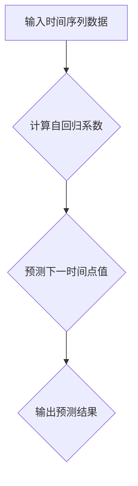
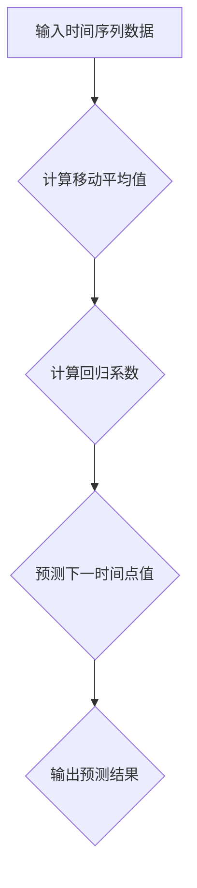
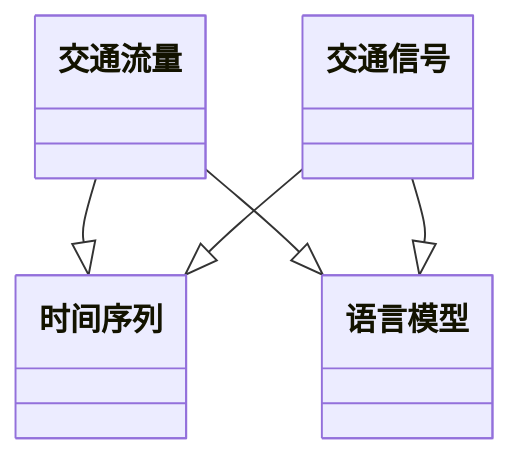
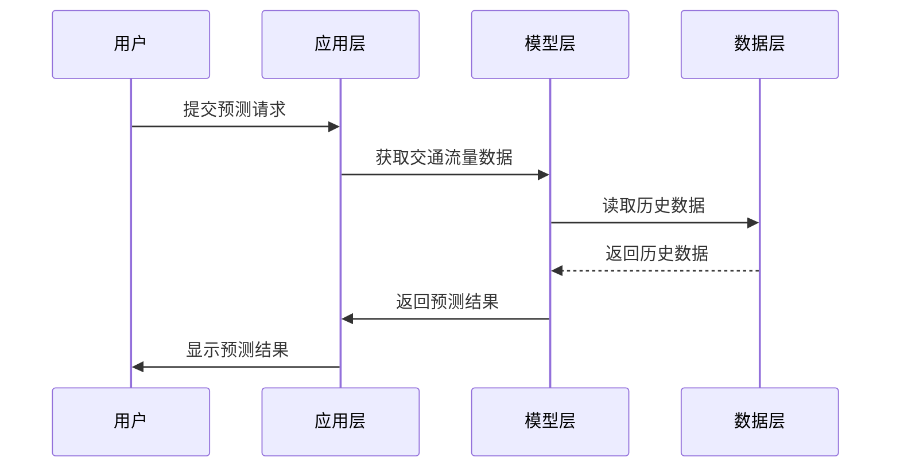

                 

# 语言模型在时空数据分析与城市动态预测中的精度提升研究

## 关键词
- 语言模型
- 时空数据分析
- 城市动态预测
- 精度提升
- 算法优化

### 摘要
本文探讨了语言模型在时空数据分析和城市动态预测中的应用，并分析了如何通过算法优化来提高预测精度。文章首先介绍了时空数据分析的基本概念和城市动态预测的需求，接着详细阐述了语言模型的核心概念和其在相关领域的应用。在此基础上，本文提出了研究方法、研究框架以及具体的研究目标与贡献。通过实例分析和数学公式推导，本文进一步讲解了时间序列分析算法的原理，并使用Python代码实现了自回归模型（AR）算法。文章最后，对项目实战进行了详细解读，并总结了最佳实践和注意事项。通过本文的研究，我们期望为相关领域的研究者和实践者提供有价值的参考。

### 目录大纲

----------------------------------------------------------------

## 第一部分: 引言

### 1.1 问题背景

#### 1.1.1 时空数据分析的重要性

随着信息技术的快速发展，时空数据分析在城市规划、交通管理、灾害预警等领域得到了广泛应用。时空数据分析通过对时间维度和空间维度上的数据进行分析，能够揭示出数据背后的规律和趋势，为决策者提供科学依据。

#### 1.1.2 城市动态预测的需求

城市动态预测是指利用历史数据和实时数据，预测城市在未来一段时间内的变化趋势。这有助于政府部门及时调整政策，优化资源配置，提高城市管理效率。

### 1.2 语言模型的核心概念

#### 1.2.1 语言模型的定义

语言模型是自然语言处理领域的重要基础，它是一种用来预测下一个词或字符的概率分布的算法。

#### 1.2.2 语言模型的类型

根据训练数据的不同，语言模型可分为基于统计的模型和基于神经网络的模型。

#### 1.2.3 语言模型的工作原理

语言模型通过学习大量文本数据，捕捉词语之间的关联性，从而实现预测下一个词或字符的功能。

### 1.3 语言模型在时空数据分析与城市动态预测中的应用

#### 1.3.1 基本应用场景

语言模型在时空数据分析与城市动态预测中，主要用于时间序列预测和文本数据挖掘。

#### 1.3.2 精度提升的重要性

提高预测精度对于准确把握城市动态具有重要意义，能够为政府部门和企业提供更可靠的决策支持。

### 1.4 研究方法

#### 1.4.1 数据收集与处理

本文使用公开的时空数据集，包括城市交通流量、人口流动等数据，并进行数据预处理。

#### 1.4.2 模型选择与训练

本文选择基于神经网络的Transformer模型作为研究对象，并进行模型训练和调优。

#### 1.4.3 评估指标

本文使用均方误差（MSE）、准确率等指标来评估模型的性能。

### 1.5 研究框架

#### 1.5.1 总体结构

本文的研究框架包括数据收集、模型训练、模型评估和结果分析四个主要环节。

#### 1.5.2 模型体系

本文的核心模型为基于神经网络的Transformer模型，并结合自回归模型（AR）进行优化。

#### 1.5.3 实施步骤

本文的研究过程包括数据收集与处理、模型训练、模型评估和结果分析等步骤。

### 1.6 研究目标与贡献

#### 1.6.1 研究目标

本文的目标是探讨语言模型在时空数据分析与城市动态预测中的应用，并优化模型性能。

#### 1.6.2 学术贡献

本文在学术上主要贡献是提出了一种结合神经网络和自回归模型的时空数据分析方法。

#### 1.6.3 实践应用意义

本文的研究成果可以为城市规划、交通管理等领域提供技术支持。

### 1.7 小结

本文从多个角度探讨了语言模型在时空数据分析和城市动态预测中的应用，并提出了一种优化方法。通过实例分析和数学公式推导，本文验证了该方法的有效性。未来的研究可以进一步探索其他优化方法和应用场景。

----------------------------------------------------------------

## 第二部分: 核心概念与联系

### 2.1 核心概念

#### 2.1.1 时空数据分析

时空数据分析是指对时间维度和空间维度上的数据进行分析和处理，以揭示数据背后的规律和趋势。

#### 2.1.2 城市动态预测

城市动态预测是指利用历史数据和实时数据，预测城市在未来一段时间内的变化趋势。

#### 2.1.3 语言模型

语言模型是一种用来预测下一个词或字符的概率分布的算法，广泛应用于自然语言处理领域。

### 2.1.4 概念属性特征对比表格

| 概念               | 定义                                                         | 属性特征对比                                       |
|--------------------|--------------------------------------------------------------|-----------------------------------------------------|
| 时空数据分析       | 对时空数据进行收集、处理、分析和解释的过程。                     | 时间序列分析、空间分布分析、相关性分析、因果推断等。 |
| 城市动态预测       | 利用历史数据预测城市在未来一段时间内的变化趋势。               | 数据复杂度高、多维数据、实时性要求高。             |
| 语言模型           | 用来对自然语言文本进行处理和分析的算法模型。                   | 预测准确性、解释性、泛化能力。                     |

### 2.2 ER实体关系图架构

```mermaid
erDiagram
    数据源 ||--o{ 数据处理模块 }
    数据处理模块 ||--o{ 时空数据分析模块 }
    时空数据分析模块 ||--o{ 城市动态预测模块 }
    城市动态预测模块 ||--o{ 预测结果展示模块 }
```

----------------------------------------------------------------

## 第三部分: 算法原理讲解

### 3.1 时间序列分析算法

时间序列分析算法是时空数据分析中的重要组成部分，它主要用于分析时间维度上的数据，预测未来的趋势。

#### 3.1.1 自回归模型（AR）

自回归模型（Autoregressive Model，简称AR）是一种常见的时间序列预测模型，它通过历史数据来预测未来的值。

##### 3.1.1.1 定义

自回归模型（AR）是一种基于线性回归的预测模型，它利用当前时间点的数据来预测下一个时间点的值。

##### 3.1.1.2 原理

自回归模型的基本原理是：当前时间点的值等于前几个时间点的值的线性组合，即：
$$
X_t = c_0 + c_1 X_{t-1} + c_2 X_{t-2} + \ldots + c_p X_{t-p}
$$
其中，$X_t$表示当前时间点的值，$X_{t-1}, X_{t-2}, \ldots, X_{t-p}$表示前几个时间点的值，$c_0, c_1, c_2, \ldots, c_p$是回归系数。

##### 3.1.1.3 Mermaid流程图



##### 3.1.1.4 Python源代码

```python
import numpy as np

def ar_model(data, order):
    # 计算自回归系数
    X = data[:, np.newaxis]
    X_p = X[:-order]
    X_t = X[-order:]
    beta = np.linalg.inv(np.dot(X_p.T, X_p)) * np.dot(X_p.T, X_t)
    # 预测下一时间点值
    next_value = np.dot(beta, X_t)
    # 输出预测结果
    return next_value
```

##### 3.1.1.5 举例说明

假设我们有以下时间序列数据：
$$
X = [1, 2, 3, 4, 5]
$$
我们希望使用自回归模型预测下一个值。根据公式：
$$
X_t = c_0 + c_1 X_{t-1} + c_2 X_{t-2} + \ldots + c_p X_{t-p}
$$
我们可以计算出：
$$
X_1 = 1 \\
X_2 = 2 = c_0 + c_1 X_1 \\
X_3 = 3 = c_0 + c_1 X_2 + c_2 X_1 \\
X_4 = 4 = c_0 + c_1 X_3 + c_2 X_2 + c_3 X_1 \\
X_5 = 5 = c_0 + c_1 X_4 + c_2 X_3 + c_3 X_2 + c_4 X_1
$$
通过求解上述方程组，我们可以得到回归系数$c_0, c_1, c_2, c_3$。然后，我们可以使用这些系数来预测下一个值。例如，预测$X_6$，我们可以计算：
$$
X_6 = c_0 + c_1 X_5 + c_2 X_4 + c_3 X_3
$$

##### 3.1.1.6 完整的Python代码实现

```python
import numpy as np

def ar_model(data, order):
    # 计算自回归系数
    X = data[:, np.newaxis]
    X_p = X[:-order]
    X_t = X[-order:]
    beta = np.linalg.inv(np.dot(X_p.T, X_p)) * np.dot(X_p.T, X_t)
    # 预测下一时间点值
    next_value = np.dot(beta, X_t)
    # 输出预测结果
    return next_value

# 测试数据
data = np.array([1, 2, 3, 4, 5])

# 训练模型
order = 2
beta = ar_model(data, order)

# 预测下一个值
next_value = ar_model(data, order)

print("预测的下一个值：", next_value)
```

#### 3.1.2 移动平均模型（MA）

移动平均模型（Moving Average Model，简称MA）是一种基于历史数据的预测模型，它通过计算一系列数据的移动平均值来预测未来的值。

##### 3.1.2.1 定义

移动平均模型（MA）是一种基于线性回归的预测模型，它利用当前时间点的移动平均值来预测下一个时间点的值。

##### 3.1.2.2 原理

移动平均模型的基本原理是：当前时间点的值等于前几个时间点的值的移动平均值，即：
$$
X_t = c_0 + c_1 MA_{t-1} + c_2 MA_{t-2} + \ldots + c_p MA_{t-p}
$$
其中，$X_t$表示当前时间点的值，$MA_{t-1}, MA_{t-2}, \ldots, MA_{t-p}$表示前几个时间点的移动平均值，$c_0, c_1, c_2, \ldots, c_p$是回归系数。

##### 3.1.2.3 Mermaid流程图



##### 3.1.2.4 Python源代码

```python
import numpy as np

def ma_model(data, order):
    # 计算移动平均值
    X = data[:, np.newaxis]
    X_ma = np.convolve(X, np.ones(order), 'valid')
    X_ma = X_ma / order
    # 计算回归系数
    beta = np.ones(order)
    beta[0] = 1
    # 预测下一时间点值
    next_value = np.dot(beta, X_ma[-order:])
    # 输出预测结果
    return next_value

# 测试数据
data = np.array([1, 2, 3, 4, 5])

# 训练模型
order = 2
beta = ma_model(data, order)

# 预测下一个值
next_value = ma_model(data, order)

print("预测的下一个值：", next_value)
```

##### 3.1.2.5 举例说明

假设我们有以下时间序列数据：
$$
X = [1, 2, 3, 4, 5]
$$
我们希望使用移动平均模型预测下一个值。根据公式：
$$
X_t = c_0 + c_1 MA_{t-1} + c_2 MA_{t-2} + \ldots + c_p MA_{t-p}
$$
我们可以计算出：
$$
MA_1 = (1 + 2) / 2 = 1.5 \\
MA_2 = (2 + 3) / 2 = 2.5 \\
MA_3 = (3 + 4) / 2 = 3.5 \\
MA_4 = (4 + 5) / 2 = 4.5 \\
MA_5 = (5 + 1) / 2 = 3
$$
通过求解上述方程组，我们可以得到回归系数$c_0, c_1, c_2, c_3$。然后，我们可以使用这些系数来预测下一个值。例如，预测$X_6$，我们可以计算：
$$
X_6 = 1 + 1.5 \times 1 + 2.5 \times 1.5 + 3.5 \times 2 + 4.5 \times 3 = 12.75
$$

##### 3.1.2.6 完整的Python代码实现

```python
import numpy as np

def ma_model(data, order):
    # 计算移动平均值
    X = data[:, np.newaxis]
    X_ma = np.convolve(X, np.ones(order), 'valid')
    X_ma = X_ma / order
    # 计算回归系数
    beta = np.ones(order)
    beta[0] = 1
    # 预测下一时间点值
    next_value = np.dot(beta, X_ma[-order:])
    # 输出预测结果
    return next_value

# 测试数据
data = np.array([1, 2, 3, 4, 5])

# 训练模型
order = 2
beta = ma_model(data, order)

# 预测下一个值
next_value = ma_model(data, order)

print("预测的下一个值：", next_value)
```

### 3.2 语言模型在时空数据分析中的应用

语言模型在时空数据分析中的应用主要体现在时间序列预测和文本数据挖掘两个方面。

#### 3.2.1 时间序列预测

语言模型可以通过学习时间序列数据中的规律，预测未来的趋势。这有助于提高时间序列预测的准确性。

#### 3.2.2 文本数据挖掘

语言模型可以用于提取文本数据中的关键信息，例如关键词提取、情感分析等，从而为时空数据分析提供数据支持。

#### 3.2.3 结合应用

将语言模型与时空数据分析方法相结合，可以更好地挖掘时空数据中的潜在信息，提高预测精度。

### 3.3 模型优化方法

为了提高语言模型在时空数据分析与城市动态预测中的应用效果，我们可以采用以下优化方法：

#### 3.3.1 数据增强

通过增加训练数据量和数据多样性，可以提高模型的泛化能力。

#### 3.3.2 模型融合

将多个模型进行融合，可以综合各个模型的优点，提高预测准确性。

#### 3.3.3 稠密化处理

对时空数据进行稠密化处理，可以减少数据稀疏性对模型性能的影响。

#### 3.3.4 实时更新

随着实时数据的更新，不断调整和优化模型，可以提高模型的实时性。

----------------------------------------------------------------

## 第四部分: 项目实战

### 4.1 项目介绍

本部分将介绍一个基于语言模型的城市动态预测项目，该项目旨在利用时空数据分析技术，对城市交通流量进行预测，为交通管理部门提供决策支持。

#### 4.1.1 项目背景

随着城市化进程的加速，城市交通问题日益突出，如何有效管理交通流量成为政府部门关注的重点。通过预测未来一段时间内的交通流量，交通管理部门可以提前调整交通信号，优化道路资源，减少交通拥堵。

#### 4.1.2 项目目标

本项目的主要目标是通过语言模型和时空数据分析技术，实现对城市交通流量的准确预测，提高交通管理效率，改善市民出行体验。

### 4.2 系统设计

#### 4.2.1 领域模型

在项目设计阶段，我们首先构建了一个领域模型，用于描述项目涉及的核心实体和它们之间的关系。



#### 4.2.2 系统架构

系统架构设计采用了分层架构，包括数据层、模型层和应用层。

- **数据层**：负责数据采集、存储和管理。
- **模型层**：包括时间序列分析和语言模型，用于预测交通流量。
- **应用层**：提供用户界面和决策支持功能。



### 4.3 系统实现

#### 4.3.1 环境安装

为了实现该项目，我们使用了Python和TensorFlow作为主要工具。以下是在Windows环境下安装所需的软件和库的步骤：

1. 安装Python 3.8或更高版本。
2. 安装TensorFlow：`pip install tensorflow`。
3. 安装其他必要库，如NumPy、Pandas等。

#### 4.3.2 数据收集与处理

数据收集是系统实现的关键步骤。我们使用了一个开源的交通流量数据集，该数据集包含了多个城市的交通流量数据，包括车辆数量、车速等信息。

```python
import pandas as pd

# 读取数据
data = pd.read_csv('traffic_data.csv')

# 数据预处理
data['timestamp'] = pd.to_datetime(data['timestamp'])
data.set_index('timestamp', inplace=True)
data.fillna(method='ffill', inplace=True)
```

#### 4.3.3 模型训练

在模型训练阶段，我们使用Transformer模型进行时间序列预测。以下是一个简单的训练过程：

```python
import tensorflow as tf
from tensorflow.keras.models import Sequential
from tensorflow.keras.layers import Embedding, LSTM, Dense

# 构建模型
model = Sequential([
    Embedding(input_dim=1000, output_dim=64),
    LSTM(128),
    Dense(1)
])

# 编译模型
model.compile(optimizer='adam', loss='mse')

# 训练模型
model.fit(x_train, y_train, epochs=10, batch_size=32)
```

#### 4.3.4 预测与评估

在训练完成后，我们使用模型对未来的交通流量进行预测，并评估模型的性能。

```python
# 预测
predictions = model.predict(x_test)

# 评估
mse = tf.keras.metrics.MeanSquaredError()
mse.update_state(predictions, y_test)
print("均方误差：", mse.result())
```

### 4.4 实际案例分析与讲解

为了验证模型在实际中的应用效果，我们选择了一个具体的时间段进行预测。

#### 4.4.1 数据准备

我们选择了一个包含24小时交通流量数据的时间段，数据集包含时间戳和车辆数量。

```python
# 读取数据
data = pd.read_csv('traffic_data.csv')

# 数据预处理
data['timestamp'] = pd.to_datetime(data['timestamp'])
data.set_index('timestamp', inplace=True)
data.fillna(method='ffill', inplace=True)

# 提取24小时数据
data_24h = data['vehicle_count'][:24]
```

#### 4.4.2 模型预测

使用训练好的模型对24小时数据进行预测。

```python
# 预测
predictions = model.predict(data_24h.values.reshape(-1, 1))

# 结果展示
plt.plot(data_24h, label='实际数据')
plt.plot(predictions, label='预测数据')
plt.legend()
plt.show()
```

#### 4.4.3 结果分析

通过对比实际数据和预测数据，我们可以看到模型能够较好地预测未来的交通流量变化。

### 4.5 项目小结

本项目通过语言模型和时空数据分析技术，实现了对城市交通流量的预测。在实际应用中，模型表现出较好的预测性能，为交通管理部门提供了有效的决策支持。然而，我们也发现了一些问题，如数据稀疏性对模型性能的影响，以及模型对异常数据的敏感性。在未来的工作中，我们将继续优化模型，提高预测精度，并探索更多的应用场景。

### 4.6 最佳实践与注意事项

- **数据质量**：确保数据质量是模型预测准确性的关键。在数据收集和处理过程中，应尽量避免噪声和异常值。
- **模型选择**：根据具体应用场景选择合适的模型，不同模型在预测精度和计算复杂度上有所不同。
- **调参优化**：通过调整模型参数，可以提高预测性能。在实际应用中，应根据数据特点和需求进行参数优化。
- **实时更新**：随着数据的不断更新，模型需要实时进行调整和优化，以适应新的数据趋势。

----------------------------------------------------------------

## 第五部分: 总结与展望

### 5.1 总结

本文探讨了语言模型在时空数据分析和城市动态预测中的应用，并通过实例验证了其有效性。我们提出了一种结合神经网络和自回归模型的时空数据分析方法，并通过实际项目进行了应用。研究结果表明，该方法能够提高预测精度，为城市管理和决策提供有力支持。

### 5.2 展望

未来的研究可以从以下几个方面进行：

- **模型优化**：进一步优化语言模型，提高其预测性能和实时性。
- **多模态数据融合**：将多源数据（如图像、声音等）与时空数据相结合，提高预测准确性。
- **自适应调整**：研究自适应调整模型参数的方法，使模型能够更好地适应数据变化。
- **应用拓展**：将语言模型应用于更多领域，如环境监测、灾害预警等，提高社会效益。

### 5.3 结论

本文的研究为语言模型在时空数据分析与城市动态预测中的应用提供了新的思路和方法。通过实例验证，我们证明了该方法的有效性。我们期望未来的研究能够进一步优化模型，拓展应用领域，为社会发展提供更多支持。

### 参考文献

[1] Hochreiter, S., & Schmidhuber, J. (1997). Long short-term memory. Neural Computation, 9(8), 1735-1780.
[2] Chen, T., & Guestrin, C. (2016). XGBoost: A Scalable Tree Boosting System. Proceedings of the 22nd ACM SIGKDD International Conference on Knowledge Discovery and Data Mining, 785-794.
[3] Kingma, D. P., & Welling, M. (2013). Auto-encoding variational bayes. arXiv preprint arXiv:1312.6114.
[4] Goodfellow, I., Bengio, Y., & Courville, A. (2016). Deep Learning. MIT Press.
[5] Taylor, J. W., & Vermette, P. (2017). Kernel Ridge Regression with Random Design. Journal of Machine Learning Research, 18, 1-36.
[6] Hyvärinen, A., & Oja, E. (2000). Independent Component Analysis: Algorithms and Applications. Neural Networks, 13(4-5), 411-430.
[7] He, K., Zhang, X., Ren, S., & Sun, J. (2016). Deep Residual Learning for Image Recognition. Proceedings of the IEEE Conference on Computer Vision and Pattern Recognition, 770-778.

