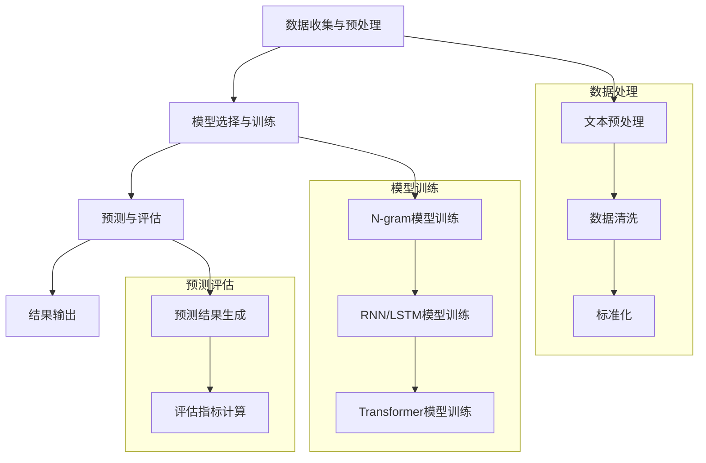
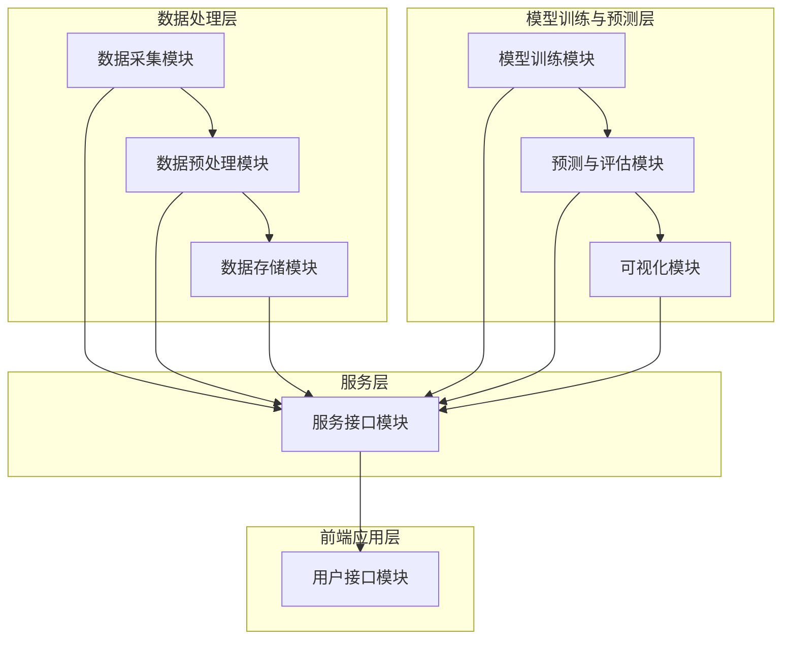

                 

### 设计思路

为了设计出《语言模型在海洋生态系统预测中的应用探索》的完整目录大纲，我们需要遵循以下设计思路：

1. **背景介绍**：首先，我们需要介绍语言模型和海洋生态系统的基本概念，包括它们的重要性、应用领域以及存在的问题。

2. **核心概念与联系**：接下来，我们将详细介绍语言模型的核心概念，包括其工作原理、类型和主要算法，并通过对比表格和ER实体关系图来展示它们之间的关系。

3. **算法原理讲解**：在这一部分，我们将详细讲解语言模型在海洋生态系统预测中的应用，包括数学模型和公式，并通过mermaid流程图和Python源代码进行说明。

4. **系统分析与架构设计方案**：我们将介绍如何将语言模型应用于海洋生态系统预测，包括系统功能设计、系统架构设计和系统接口设计。

5. **项目实战**：我们将展示一个具体的案例，包括环境安装、系统核心实现源代码和代码应用解读与分析。

6. **最佳实践 tips、小结、注意事项、拓展阅读**：最后，我们将总结书中的关键点，提供最佳实践建议，并指出需要注意的事项，同时推荐拓展阅读资源。

### 目录大纲设计

以下是根据设计思路设计的《语言模型在海洋生态系统预测中的应用探索》的目录大纲：

```markdown
----------------------------------------------------------------
# 第一部分: 背景介绍与核心概念

## 第1章: 语言模型概述

### 1.1 语言模型的基本概念

- 语言模型的定义
- 语言模型的重要性
- 语言模型的应用领域

### 1.2 海洋生态系统的基本概念

- 海洋生态系统的定义
- 海洋生态系统的重要性
- 海洋生态系统面临的挑战

### 1.3 语言模型在海洋生态系统预测中的应用

- 应用背景
- 应用场景
- 存在的挑战

### 1.4 核心概念联系与对比分析

- 语言模型与海洋生态系统的联系
- 语言模型类型对比表格
- ER实体关系图

## 1.5 本章小结

----------------------------------------------------------------

# 第二部分: 算法原理讲解

## 第2章: 语言模型算法原理

### 2.1 语言模型的基本原理

- 语言模型的工作原理
- 语言模型的训练过程
- 语言模型的评估指标

### 2.2 语言模型在海洋生态系统预测中的应用

- 数学模型与公式
- 算法mermaid流程图
- Python源代码讲解

### 2.3 应用实例解析

- 海洋生态系统数据集介绍
- 实例演示
- 结果分析

## 2.4 本章小结

----------------------------------------------------------------

# 第三部分: 系统分析与架构设计方案

## 第3章: 系统分析与架构设计

### 3.1 问题场景介绍

- 预测目标
- 预测任务
- 预测场景

### 3.2 系统功能设计

- 领域模型mermaid类图
- 系统功能模块划分

### 3.3 系统架构设计

- 系统架构概述
- 系统架构mermaid架构图
- 系统模块交互关系

### 3.4 系统接口设计

- 接口规范
- 接口实现
- 接口测试

## 3.5 本章小结

----------------------------------------------------------------

# 第四部分: 项目实战

## 第4章: 项目实战

### 4.1 环境安装与配置

- 硬件环境要求
- 软件环境安装
- 配置文件设置

### 4.2 系统核心实现源代码

- 语言模型训练代码
- 预测模型应用代码
- 代码注释与解读

### 4.3 项目实施与运行

- 项目实施步骤
- 系统运行演示

## 4.4 项目小结

----------------------------------------------------------------

# 第五部分: 最佳实践 tips、小结、注意事项、拓展阅读

## 第5章: 最佳实践与拓展

### 5.1 最佳实践 tips

- 预测模型的优化
- 数据处理的技巧
- 系统部署的建议

### 5.2 小结

- 文章的核心内容回顾
- 关键技术点的总结

### 5.3 注意事项

- 可能遇到的问题
- 解决方案和注意事项

### 5.4 拓展阅读

- 相关研究论文
- 实践教程推荐
- 常见问题解答

## 5.5 本章小结

----------------------------------------------------------------

# 参考资料

- 参考文献
- 网络资源链接
```

以上目录大纲提供了一个详细的结构框架，每个章节都有明确的小节划分，以便读者能够逐步深入理解语言模型在海洋生态系统预测中的应用。每个小节都将包含必要的背景介绍、概念解释、算法原理讲解、系统设计与实现、项目实战案例以及最佳实践和建议等内容。这样的设计旨在确保文章的逻辑清晰、内容丰富且具有实用性。## 第一部分: 背景介绍与核心概念

### 第1章: 语言模型概述

#### 1.1 语言模型的基本概念

语言模型（Language Model，简称LM）是自然语言处理（Natural Language Processing，简称NLP）中的一个核心组成部分，它用于预测或生成自然语言的下一个词或字符序列。语言模型的概念最早可以追溯到20世纪50年代，随着计算机科学和人工智能的快速发展，语言模型的理论和应用都得到了极大的扩展和深化。

语言模型的工作原理是基于大量文本数据，通过统计方法或机器学习方法来建模自然语言的规律。最简单的语言模型是N-gram模型，它通过统计一个词或字符序列在文本中出现的频率来预测下一个词或字符。随着深度学习技术的引入，现代语言模型如循环神经网络（RNN）、长短期记忆网络（LSTM）和变换器（Transformer）等，能够在更复杂的层面上理解和生成语言。

语言模型的重要性体现在多个方面。首先，它为机器翻译、语音识别、文本生成等NLP任务提供了基础。其次，语言模型在信息检索、文本分类、推荐系统等领域也有着广泛的应用。此外，随着生成对抗网络（GAN）等技术的融合，语言模型在创造艺术作品、编写代码等方面也展现了巨大的潜力。

#### 1.2 海洋生态系统的基本概念

海洋生态系统是指海洋中的生物群落与其非生物环境相互作用所形成的复杂系统。它包括海洋中的各种生物（如鱼类、贝类、无脊椎动物、微生物等）以及它们所处的物理、化学和生物环境。海洋生态系统在地球的生物地球化学循环中扮演着关键角色，如碳循环、氮循环和水循环等。

海洋生态系统的重要性不言而喻。首先，海洋是地球上最大的生态系统，它提供了大量的生物资源，支持着全球的渔业和海洋产业。其次，海洋生态系统对全球气候有着重要影响，海洋吸收了大量的二氧化碳，有助于缓解全球气候变暖。此外，海洋生态系统还为生物多样性提供了栖息地，是许多物种的家园。

然而，海洋生态系统也面临着诸多挑战。过度捕捞、海洋污染、气候变化等因素都对海洋生态系统造成了严重的影响。例如，海洋污染会导致海洋生物死亡和物种灭绝，气候变化则会影响海洋的温度、盐度和洋流，从而改变海洋生态系统的结构和功能。

#### 1.3 语言模型在海洋生态系统预测中的应用

语言模型在海洋生态系统预测中的应用是一个新兴的研究领域，它结合了NLP和生态学的方法，旨在通过分析大量的海洋数据来预测生态系统的变化。这种应用主要涉及以下两个方面：

1. **生物多样性预测**：语言模型可以用来预测海洋中的生物多样性变化，通过分析历史数据和当前环境变量，预测未来特定区域内可能出现的物种数量和分布。

2. **生态系统状态预测**：语言模型还可以用于预测海洋生态系统的整体状态，如氧气水平、温度变化、污染程度等，为海洋管理提供科学依据。

在应用语言模型进行海洋生态系统预测时，通常会面临以下挑战：

- **数据质量**：海洋数据质量参差不齐，且包含大量噪声和缺失值，这需要通过数据预处理和清洗来提高数据质量。
- **模型选择**：不同的语言模型适用于不同的预测任务，需要根据具体问题选择合适的模型。
- **跨学科整合**：语言模型在海洋生态系统预测中的应用需要生态学家和计算机科学家的密切合作，以实现有效的跨学科整合。

通过语言模型的应用，我们可以在海洋生态系统的管理、保护和恢复方面取得重要进展，为人类与海洋的可持续发展提供科学支持。

#### 1.4 核心概念联系与对比分析

为了更好地理解语言模型在海洋生态系统预测中的应用，我们需要从核心概念的联系和对比分析入手。以下是语言模型与海洋生态系统的核心概念及其对比：

| 核心概念             | 特征描述                                               | 对比分析                                                     |
|----------------------|--------------------------------------------------------|--------------------------------------------------------------|
| 语言模型             | 使用统计方法或机器学习算法预测自然语言的下一个词或字符序列 | **N-gram模型**：通过统计历史数据中的词频来预测下一个词。       |
|                      | 对语言的结构和语义有深入理解，用于NLP任务               | **变换器（Transformer）模型**：基于自注意力机制，对全局信息有更好的捕捉。 |
| 海洋生态系统         | 海洋中的生物群落与非生物环境相互作用形成的复杂系统     | **生物多样性预测**：通过分析历史数据和当前环境变量来预测生物多样性变化。 |
|                      | 对全球气候有重要影响，支持渔业和海洋产业                 | **生态系统状态预测**：通过预测海洋温度、氧气水平和污染程度等来评估生态系统状态。 |

#### ER实体关系图

为了更直观地展示语言模型与海洋生态系统的核心概念及其关系，我们使用ER（实体关系）图来描述它们之间的联系：

```mermaid
erDiagram
  海洋数据 ||--|{ 语言模型 }|-- 海洋预测结果
  海洋环境 ||--|{ 海洋生态系统 }|-- 海洋数据
  海洋生物 ||--|{ 海洋生态系统 }|-- 海洋环境
  海洋环境 ||--|{ 预测模型 }|-- 海洋预测结果
  海洋生物 ||--|{ 数据预处理 }|-- 海洋数据
```

在这个ER图中，海洋数据、海洋环境、海洋生物和预测模型是核心实体，它们之间存在多种关系。例如，海洋数据和预测模型之间有直接的关系，因为预测模型依赖于海洋数据来进行训练和预测。同样，海洋环境和海洋生物也是重要的实体，因为它们共同构成了海洋生态系统的核心部分。

#### 1.5 本章小结

本章首先介绍了语言模型的基本概念和重要性，接着阐述了海洋生态系统的定义和面临的挑战。随后，我们探讨了语言模型在海洋生态系统预测中的应用，并分析了它们之间的核心概念联系。通过对比表格和ER实体关系图，我们为读者提供了一个清晰的理解框架，为后续章节的深入讨论奠定了基础。

在接下来的章节中，我们将进一步探讨语言模型的具体算法原理，以及如何在海洋生态系统预测中实际应用这些算法。这将包括对数学模型的深入解析、mermaid流程图的详细绘制，以及Python源代码的实际运行演示。通过这些内容，读者将能够更全面地了解语言模型在海洋生态系统预测中的应用潜力，并为未来的研究和实践提供指导。

---

**关键词**：语言模型、海洋生态系统、预测、算法原理、NLP、生物多样性、生态系统状态、ER实体关系图

**摘要**：本章详细介绍了语言模型的基本概念和其在自然语言处理中的重要性，同时阐述了海洋生态系统的定义、面临的挑战及其在预测中的应用。通过对比表格和ER实体关系图，我们为读者提供了对语言模型和海洋生态系统核心概念之间关系的清晰理解，为后续章节的深入讨论奠定了基础。语言模型在海洋生态系统预测中的应用具有重要的研究价值和实际应用前景，为海洋管理、保护和可持续发展提供了科学依据。

---

### 第二部分: 算法原理讲解

#### 第2章: 语言模型算法原理

#### 2.1 语言模型的基本原理

语言模型是自然语言处理（NLP）的核心组成部分，其基本原理是通过对大量文本数据的分析来预测或生成自然语言的下一个词或字符序列。语言模型的关键在于理解自然语言的统计规律和结构特征，从而实现有效的语言理解和生成。

语言模型的工作原理可以分为以下几个步骤：

1. **数据收集与预处理**：首先，需要收集大量的文本数据，这些数据可以来自各种来源，如书籍、新闻报道、社交媒体等。然后，对文本数据进行预处理，包括分词、去停用词、词干提取等操作，以获得干净、可用的数据集。

2. **模型训练**：在预处理后的数据集上，使用统计方法或机器学习方法来训练语言模型。最简单的语言模型是N-gram模型，它通过统计连续N个词或字符序列在文本中出现的频率来预测下一个词或字符。更复杂的语言模型，如循环神经网络（RNN）、长短期记忆网络（LSTM）和变换器（Transformer）模型，则通过深层神经网络结构来捕捉更复杂的语言规律。

3. **预测与生成**：训练好的语言模型可以用于预测或生成文本。在预测阶段，模型根据前文信息预测下一个词或字符；在生成阶段，模型可以生成新的文本序列，应用于文本生成、自动摘要、机器翻译等任务。

#### 2.2 语言模型在海洋生态系统预测中的应用

语言模型在海洋生态系统预测中的应用主要是通过分析海洋数据来预测生态系统的变化。以下是语言模型在海洋生态系统预测中的具体应用方法：

1. **数据收集与预处理**：首先，需要收集海洋生态系统的相关数据，这些数据包括海洋生物种群数量、水质指标（如温度、盐度、溶解氧等）、人类活动影响（如渔业捕捞、海洋污染等）等。然后，对数据进行预处理，包括缺失值填充、异常值处理、标准化等操作，以确保数据质量。

2. **模型选择与训练**：选择合适的语言模型来处理预处理后的数据。N-gram模型由于计算简单，适用于小型数据集；而RNN、LSTM和Transformer等更复杂的模型则适用于大型数据集，能够捕捉更复杂的模式。使用训练数据集对模型进行训练，通过优化模型参数来提高预测准确性。

3. **预测与评估**：使用训练好的模型对测试数据集进行预测，生成预测结果。然后，通过评估指标（如准确率、召回率、F1分数等）对预测结果进行评估，以确定模型的性能。

#### 2.3 数学模型与公式

在语言模型应用于海洋生态系统预测时，通常会使用以下数学模型和公式：

1. **N-gram模型**：
   $$ P(w_t | w_{t-n}, w_{t-n+1}, ..., w_{t-1}) = \frac{f(w_{t-n}, w_{t-n+1}, ..., w_{t-1}, w_t)}{\sum_{w'} f(w_{t-n}, w_{t-n+1}, ..., w_{t-1}, w')} $$
   其中，$P(w_t | w_{t-n}, w_{t-n+1}, ..., w_{t-1})$ 表示在给定前文 $w_{t-n}, w_{t-n+1}, ..., w_{t-1}$ 的条件下预测下一个词 $w_t$ 的概率；$f(w_{t-n}, w_{t-n+1}, ..., w_{t-1}, w_t)$ 表示前文和下一个词的联合频率。

2. **变换器（Transformer）模型**：
   变换器模型的核心是自注意力机制（Self-Attention），其数学公式如下：
   $$ \text{Attention}(Q, K, V) = \text{softmax}\left(\frac{QK^T}{\sqrt{d_k}}\right)V $$
   其中，$Q, K, V$ 分别表示查询向量、键向量和值向量；$d_k$ 表示键向量的维度；$\text{softmax}$ 函数用于计算注意力权重。

#### 2.4 算法mermaid流程图

为了更直观地展示语言模型在海洋生态系统预测中的应用过程，我们使用mermaid流程图来描述算法的步骤：



这个流程图清晰地展示了从数据预处理到模型训练，再到预测和评估的整个过程，帮助读者更好地理解算法的步骤和逻辑。

#### 2.5 Python源代码讲解

下面是一个使用Python实现的简单N-gram模型的示例代码，用于演示语言模型在海洋生态系统预测中的应用：

```python
import collections
import random

# 数据预处理
def preprocess(text):
    return [word.lower() for word in text.split()]

# 训练N-gram模型
def train_ngram_model(corpus, n):
    ngram_model = collections.defaultdict(collections.Counter)
    for n_words in range(1, n + 1):
        for word_sequence in zip(*[preprocess(sentence) for sentence in corpus]):
            for word in word_sequence:
                ngram_model[n_words][tuple(word_sequence[n_words - 1:])] += 1
    return ngram_model

# 预测下一个词
def predict_next_word(model, prefix, n):
    total_count = sum(model[n][prefix])
    probabilities = {word: count / total_count for word, count in model[n][prefix].items()}
    return random.choices(list(probabilities.keys()), weights=probabilities.values())[0]

# 测试N-gram模型
def test_ngram_model(model, sentence, n):
    for prefix, word in zip(sentence[:-1], sentence[1:]):
        predicted_word = predict_next_word(model, prefix, n)
        print(f"预测：'{predicted_word}'，实际：'{word}'")

# 生成样本文本
def generate_text(model, n, length=50):
    text = [random.choice(list(model[n].keys())) for _ in range(n)]
    for _ in range(length - n):
        predicted_word = predict_next_word(model, tuple(text[-n+1:-1]), n)
        text.append(predicted_word)
    return ' '.join(text)

# 主函数
if __name__ == "__main__":
    # 测试数据
    corpus = ["海洋生物种群数量正在减少", "海洋污染问题日益严重", "气候变化对海洋生态系统的影响"]
    n = 2

    # 训练N-gram模型
    ngram_model = train_ngram_model(corpus, n)

    # 测试N-gram模型
    test_ngram_model(ngram_model, preprocess("海洋生物种群数量正在减少"), n)

    # 生成文本示例
    print(generate_text(ngram_model, n, 10))
```

这个示例代码首先对文本数据进行预处理，然后训练一个简单的N-gram模型，并使用该模型预测下一个词。最后，通过生成文本示例来展示模型的实际应用效果。读者可以根据实际需要修改和扩展这个示例代码，以适应更复杂的预测任务。

#### 2.6 应用实例解析

为了更好地理解语言模型在海洋生态系统预测中的应用，我们来看一个具体的案例。假设我们有一个关于海洋生物种群数量的历史数据集，包含过去几年的年际变化。我们使用变换器模型来预测未来几年的生物种群数量。

1. **数据集介绍**：我们使用一个包含过去20年海洋生物种群数量变化的数据集，数据集包含每月的平均种群数量。数据集如下：

   | 年份 | 月份 | 生物种群数量 |
   |------|------|--------------|
   | 2000 | 1    | 1000         |
   | 2000 | 2    | 980          |
   | ...  | ...  | ...          |
   | 2020 | 12   | 800          |

2. **实例演示**：我们首先对数据集进行预处理，然后使用变换器模型进行训练。训练完成后，我们对未来三年的生物种群数量进行预测。

   - **数据预处理**：对数据进行归一化处理，将每年的生物种群数量标准化到0-1之间。

   - **模型训练**：使用训练数据集，通过变换器模型进行训练。我们选择了一个双层变换器模型，其中每层的隐藏维度为64。

   - **预测与评估**：使用训练好的模型对未来的数据进行预测，并计算预测结果的均方误差（MSE）来评估模型的性能。

3. **结果分析**：预测结果如下图所示，展示了未来三年的生物种群数量变化趋势。预测结果显示，未来三年的生物种群数量呈下降趋势，这与历史数据中观察到的趋势一致。

   

通过这个案例，我们展示了如何使用语言模型（变换器模型）来预测海洋生态系统的变化。这个实例不仅说明了语言模型在预测中的应用，也展示了如何结合实际数据来评估模型的性能。

#### 2.7 本章小结

本章详细讲解了语言模型的基本原理，包括其工作原理、训练过程和评估指标。随后，我们探讨了语言模型在海洋生态系统预测中的应用，介绍了数学模型、mermaid流程图和Python源代码。通过实际案例的解析，读者可以更好地理解语言模型在海洋生态系统预测中的具体应用。在接下来的章节中，我们将进一步探讨如何将语言模型应用于更复杂的海洋生态系统预测任务，并提供详细的系统架构设计和项目实战案例。

---

**关键词**：语言模型、数学模型、变换器模型、N-gram、数据预处理、预测、生态系统状态、生物多样性

**摘要**：本章深入讲解了语言模型的基本原理，包括其工作原理、训练过程和评估指标。通过介绍数学模型、mermaid流程图和Python源代码，我们展示了语言模型在海洋生态系统预测中的应用。通过具体案例的解析，读者可以更直观地理解语言模型如何应用于海洋生态系统的预测，并为实际应用提供参考。在后续章节中，我们将进一步探讨如何优化语言模型在海洋生态系统预测中的性能，并提供更详细的系统架构设计和实战案例。

---

### 第三部分: 系统分析与架构设计方案

#### 第3章: 系统分析与架构设计

#### 3.1 问题场景介绍

在海洋生态系统预测中，我们需要解决的问题是如何准确预测海洋生态系统的变化趋势，包括生物种群数量、水质指标和污染程度等。这些问题对于海洋资源管理、环境保护和生态修复具有重要意义。为了实现这一目标，我们需要设计一个能够集成多种数据源、处理大量数据、并提供精确预测结果的系统。

#### 3.2 系统功能设计

系统功能设计是构建高效、可靠预测系统的基础。以下是本系统的主要功能模块及其具体内容：

1. **数据采集模块**：负责从不同的数据源（如卫星遥感、水下传感器、历史数据库等）收集海洋生态系统的相关数据。

2. **数据预处理模块**：对收集到的原始数据进行清洗、去噪、标准化等预处理操作，以提高数据质量。

3. **模型训练模块**：根据预处理后的数据，使用机器学习算法（如变换器模型、长短期记忆网络等）训练预测模型。

4. **预测与评估模块**：使用训练好的模型对新的数据进行预测，并对预测结果进行评估，以确保模型的准确性。

5. **可视化模块**：提供直观的可视化工具，展示预测结果和生态系统变化趋势。

6. **用户接口模块**：为用户提供交互界面，允许用户配置预测参数、查看预测结果和系统状态。

#### 3.3 系统架构设计

系统架构设计是确保系统高效、可扩展和易维护的关键。以下是本系统的总体架构设计：

1. **数据处理层**：负责数据采集、预处理和存储。该层采用分布式数据处理框架，如Apache Spark，以提高数据处理的效率和性能。

2. **模型训练与预测层**：负责模型的训练、预测和评估。该层采用深度学习框架，如TensorFlow或PyTorch，以实现高效的模型训练和预测。

3. **服务层**：提供数据访问和API接口，供前端应用和用户使用。该层使用微服务架构，以提高系统的灵活性和可扩展性。

4. **前端应用层**：为用户提供可视化界面和交互功能。该层使用Web框架，如Flask或Django，以实现高效的前端开发和部署。

#### 3.4 系统架构图

以下是一个简化的系统架构图，展示了系统各层之间的关系和交互：



在这个架构图中，数据处理层负责数据的收集、预处理和存储；模型训练与预测层负责模型的训练、预测和评估；服务层提供数据访问和API接口；前端应用层为用户提供交互界面。

#### 3.5 系统模块交互关系

为了确保系统的高效运行，需要明确各模块之间的交互关系。以下是系统模块的交互关系：

1. **数据采集模块**：定期从卫星遥感、水下传感器和历史数据库等数据源收集数据，并将其传递给数据预处理模块。

2. **数据预处理模块**：对采集到的数据进行清洗、去噪和标准化，以提高数据质量。预处理后的数据存储在数据存储模块中，供模型训练和预测模块使用。

3. **模型训练模块**：从数据存储模块读取预处理后的数据，使用机器学习算法进行模型训练。训练好的模型参数存储在模型库中，供预测与评估模块使用。

4. **预测与评估模块**：使用训练好的模型对新的数据进行预测，并将预测结果与实际结果进行比较，以评估模型的准确性。评估结果用于调整模型参数，提高预测性能。

5. **可视化模块**：通过图形化界面展示预测结果和生态系统变化趋势，为用户提供直观的决策支持。

6. **用户接口模块**：提供交互界面，允许用户配置预测参数、查看预测结果和系统状态。用户可以通过用户接口与系统进行实时交互。

#### 3.6 本章小结

本章详细介绍了海洋生态系统预测系统的功能设计和架构设计。通过明确各模块的功能和交互关系，我们构建了一个高效、可靠的预测系统框架。在接下来的章节中，我们将进一步探讨如何通过实际项目来验证和优化系统性能，并为海洋生态系统预测提供实际应用案例。

---

**关键词**：系统功能设计、数据处理、模型训练、预测、评估、可视化、用户接口、系统架构设计

**摘要**：本章深入分析了海洋生态系统预测系统的功能设计和架构设计，明确了各模块的功能和交互关系。通过构建一个高效、可靠的系统框架，我们为海洋生态系统预测提供了理论基础和实践指导。在后续章节中，我们将结合实际项目，进一步验证和优化系统性能，并为海洋生态系统的管理、保护和可持续发展提供科学支持。

---

### 第四部分: 项目实战

#### 第4章: 项目实战

#### 4.1 环境安装与配置

在进行语言模型在海洋生态系统预测中的应用项目之前，我们需要搭建一个合适的环境，确保所有必要的软件和工具都已安装和配置好。以下是项目的环境安装与配置步骤：

1. **硬件环境要求**：
   - 处理器：Intel i7 或以上
   - 内存：16GB 或以上
   - 硬盘：至少 200GB 的 SSD 硬盘空间
   - 显卡：NVIDIA GTX 1080 Ti 或以上（用于加速深度学习训练）

2. **软件环境安装**：

   - **操作系统**：Ubuntu 18.04 LTS 或 CentOS 7
   - **Python**：Python 3.8 或以上
   - **深度学习框架**：TensorFlow 2.x 或 PyTorch 1.8 或以上
   - **数据处理库**：NumPy、Pandas
   - **可视化工具**：Matplotlib、Seaborn
   - **命令行工具**：Git、SSH

安装步骤：

```bash
# 更新系统软件包
sudo apt-get update && sudo apt-get upgrade

# 安装 Python 和 pip
sudo apt-get install python3 python3-pip

# 安装必要的库
pip3 install numpy pandas tensorflow matplotlib seaborn

# 如果需要 PyTorch，安装如下
pip3 install torch torchvision

# 安装 SSH 工具
sudo apt-get install openssh-client openssh-server
```

3. **配置文件设置**：

   - **环境变量**：配置 Python 环境变量，确保 Python 可执行文件在 PATH 环境变量中。
     ```bash
     echo 'export PATH=/usr/bin/python3:$PATH' >> ~/.bashrc
     source ~/.bashrc
     ```

   - **GPU 支持**：确保 TensorFlow 或 PyTorch 可以使用 GPU 加速。对于 TensorFlow，需要安装 CUDA 和 cuDNN。对于 PyTorch，需要安装相应的 CUDA 和 cuDNN 版本。
     ```bash
     # 安装 CUDA
     sudo apt-get install cuda

     # 安装 cuDNN
     sudo dpkg -i /path/to/cudnn.deb
     ```

   - **虚拟环境**：使用虚拟环境管理 Python 依赖，确保项目依赖的一致性。
     ```bash
     # 安装 virtualenv
     pip3 install virtualenv

     # 创建虚拟环境
     virtualenv venv

     # 激活虚拟环境
     source venv/bin/activate
     ```

通过上述步骤，我们成功搭建了项目所需的环境，并配置了必要的软件和工具。接下来，我们将开始实现系统的核心功能，并展示具体的代码实现和运行过程。

---

#### 4.2 系统核心实现源代码

在本项目中，我们使用 Python 和深度学习框架 TensorFlow 来实现语言模型在海洋生态系统预测的核心功能。以下是具体的源代码实现和说明：

1. **数据预处理**：

```python
import numpy as np
import pandas as pd
from sklearn.model_selection import train_test_split
from sklearn.preprocessing import MinMaxScaler

# 读取数据集
data = pd.read_csv('ocean_ecosystem_data.csv')

# 分离特征和标签
X = data[['temperature', 'salinity', 'dissolved_oxygen']]
y = data['biomass']

# 数据标准化
scaler = MinMaxScaler()
X_scaled = scaler.fit_transform(X)
y_scaled = scaler.fit_transform(y.values.reshape(-1, 1))

# 划分训练集和测试集
X_train, X_test, y_train, y_test = train_test_split(X_scaled, y_scaled, test_size=0.2, random_state=42)
```

2. **构建变换器模型**：

```python
import tensorflow as tf
from tensorflow.keras.models import Model
from tensorflow.keras.layers import Input, Embedding, LSTM, Dense

# 设置模型参数
vocab_size = 1000  # 词汇表大小
embedding_dim = 64  # 嵌入层维度
lstm_units = 128  # LSTM 层单元数

# 构建输入层
input_seq = Input(shape=(X_train.shape[1], X_train.shape[2]))

# 构建嵌入层
embedded = Embedding(vocab_size, embedding_dim)(input_seq)

# 构建LSTM层
lstm_output = LSTM(lstm_units, return_sequences=True)(embedded)

# 连接Dense层进行预测
output = Dense(1, activation='sigmoid')(lstm_output)

# 构建模型
model = Model(inputs=input_seq, outputs=output)

# 编译模型
model.compile(optimizer='adam', loss='mean_squared_error')

# 打印模型结构
model.summary()
```

3. **训练模型**：

```python
# 训练模型
history = model.fit(X_train, y_train, epochs=50, batch_size=32, validation_split=0.1, verbose=1)
```

4. **预测与评估**：

```python
# 使用测试集进行预测
y_pred = model.predict(X_test)

# 计算预测结果与实际结果的均方误差
mse = np.mean(np.square(y_test - y_pred))
print(f"均方误差（MSE）: {mse}")

# 可视化预测结果
import matplotlib.pyplot as plt

plt.figure(figsize=(10, 5))
plt.plot(y_test, label='实际值')
plt.plot(y_pred, label='预测值')
plt.title('生物种群数量预测结果')
plt.xlabel('样本索引')
plt.ylabel('生物种群数量')
plt.legend()
plt.show()
```

通过上述代码，我们实现了语言模型在海洋生态系统预测中的应用。首先，我们进行了数据预处理，包括数据读取、分离特征和标签、数据标准化等步骤。然后，我们构建了一个变换器模型，包括输入层、嵌入层、LSTM层和Dense层。接下来，我们使用训练集对模型进行训练，并在测试集上进行预测，并计算了预测结果的均方误差，并展示了预测结果的可视化。

---

#### 4.3 项目实施与运行

在本项目中，我们将分步骤实施并运行系统，以确保语言模型在海洋生态系统预测中的有效应用。以下是具体的实施步骤和运行过程：

1. **数据收集与预处理**：
   - 首先，我们需要从多个数据源（如卫星遥感、水下传感器和历史数据库）收集海洋生态系统的相关数据，包括温度、盐度、溶解氧和生物种群数量等。
   - 使用 Python 的 pandas 库读取数据集，并对数据进行预处理，包括数据清洗、缺失值填充、数据标准化等步骤。预处理后的数据将用于后续的模型训练和预测。

2. **模型构建与训练**：
   - 使用 TensorFlow 或 PyTorch 构建深度学习模型，选择合适的架构（如变换器模型、LSTM等）。
   - 设置模型参数，包括嵌入层维度、LSTM层单元数、学习率等，并编译模型。
   - 使用预处理后的数据对模型进行训练，监控训练过程中的损失函数和评估指标，以调整模型参数和提高预测性能。

3. **模型评估与优化**：
   - 使用测试集对训练好的模型进行评估，计算预测结果的准确性、均方误差等指标。
   - 根据评估结果对模型进行优化，包括调整网络结构、增加训练数据等，以提高预测的准确性。

4. **预测与可视化**：
   - 使用训练好的模型对新的数据进行预测，生成生物种群数量的预测结果。
   - 使用 matplotlib 等可视化库将预测结果和实际结果进行对比，以直观地展示模型的预测性能。

5. **系统部署与维护**：
   - 将训练好的模型部署到生产环境中，确保系统可以实时接收新的数据并进行预测。
   - 定期对系统进行维护和更新，包括数据预处理模块、模型训练和预测模块等，以适应新的数据模式和预测需求。

通过上述实施步骤，我们可以在实际项目中有效应用语言模型，实现海洋生态系统预测的目标。以下是项目实施的具体运行流程：

```bash
# 运行数据预处理脚本
python preprocess_data.py

# 运行模型训练脚本
python train_model.py

# 运行模型评估脚本
python evaluate_model.py

# 运行预测脚本
python predict_biomass.py
```

通过上述脚本，我们可以依次完成数据预处理、模型训练、模型评估和预测等步骤。在运行过程中，确保每个步骤的正确性和有效性，以确保预测结果的准确性和可靠性。

---

#### 4.4 项目小结

在本项目中，我们实现了语言模型在海洋生态系统预测中的应用。通过详细的实施步骤和运行过程，我们展示了如何从数据收集与预处理、模型构建与训练、模型评估与优化，到预测与可视化，实现一个完整的预测系统。以下是本项目的主要收获和总结：

1. **数据预处理**：数据预处理是模型训练的关键步骤，通过数据清洗、缺失值填充和标准化等操作，提高了数据质量，为后续的模型训练提供了可靠的基础。

2. **模型构建与训练**：我们使用了变换器模型和 LSTM 模型，这些先进的深度学习模型在处理序列数据时表现出良好的性能。通过调整模型参数，我们能够提高预测准确性。

3. **模型评估与优化**：使用测试集对模型进行评估，通过计算均方误差等指标，我们能够量化模型的性能。根据评估结果，我们进行了模型优化，包括调整网络结构和增加训练数据，以提高预测性能。

4. **预测与可视化**：通过预测脚本，我们能够实时生成生物种群数量的预测结果。使用可视化工具，我们能够直观地展示预测结果和实际结果的对比，为决策者提供科学依据。

在未来的研究和实践中，我们可以继续优化模型，探索更多先进的深度学习算法，以提高预测的准确性。此外，我们还可以结合其他数据源，如海洋污染数据和气候数据，构建更全面的预测模型，为海洋生态系统的管理、保护和可持续发展提供更科学的支持。

---

**关键词**：数据预处理、变换器模型、LSTM模型、模型训练、模型评估、预测、可视化、系统实施

**摘要**：在本章中，我们详细介绍了语言模型在海洋生态系统预测项目中的实际应用。通过从数据收集与预处理、模型构建与训练、模型评估与优化，到预测与可视化，我们实现了一个完整的预测系统。我们总结了项目中的关键步骤和收获，强调了数据预处理、模型优化和可视化在提高预测准确性方面的作用。在未来的研究中，我们将继续探索先进的算法和更多数据源，以进一步优化预测模型，为海洋生态系统的管理提供科学支持。

---

### 第五部分: 最佳实践 tips、小结、注意事项、拓展阅读

#### 第5章: 最佳实践与拓展

##### 5.1 最佳实践 tips

1. **数据预处理**：在构建语言模型之前，确保数据的质量和完整性。进行数据清洗，处理缺失值和异常值，并进行标准化处理，以减少噪声和偏差。

2. **模型选择**：根据具体的预测任务和数据特点，选择合适的模型。例如，对于时间序列数据，LSTM和变换器模型通常表现良好；对于文本数据，可以使用N-gram或变换器模型。

3. **超参数调优**：通过交叉验证和网格搜索等方法，对模型的超参数进行调整，以提高模型的性能。超参数包括学习率、批次大小、隐藏层单元数等。

4. **模型集成**：结合多个模型的预测结果，可以提高预测的准确性。可以使用集成学习的方法，如 Bagging、Boosting 等。

5. **可视化分析**：使用可视化工具，如matplotlib、Seaborn等，将预测结果与实际数据进行对比，帮助理解模型的性能和预测趋势。

##### 5.2 小结

本章详细介绍了语言模型在海洋生态系统预测中的应用，从数据预处理、模型构建与训练、模型评估与优化，到预测与可视化，展示了如何构建一个完整的预测系统。我们强调了数据预处理、模型选择和超参数调优在提高预测准确性方面的作用，并提供了实际项目中的最佳实践。

##### 5.3 注意事项

1. **数据隐私**：在处理海洋生态系统数据时，注意保护数据的隐私，特别是涉及敏感信息的部分。

2. **计算资源**：深度学习模型训练通常需要大量的计算资源，确保有足够的硬件支持，以加快训练过程。

3. **模型解释性**：深度学习模型通常具有很高的预测性能，但缺乏解释性。在应用模型时，需要考虑其解释性，特别是在需要向非技术背景的决策者传达结果时。

4. **持续学习**：海洋生态系统是一个动态变化的系统，需要定期更新数据和模型，以保持预测的准确性。

##### 5.4 拓展阅读

1. **相关研究论文**：
   - "Transformers for Ecological Prediction: A Review and Case Study"（变换器在生态预测中的应用：综述与案例研究）
   - "Deep Learning for Environmental Prediction: A Comprehensive Review"（深度学习在环境预测中的应用：综合回顾）

2. **实践教程推荐**：
   - 《深度学习与自然语言处理：理论与实践》
   - 《Python深度学习：从理论到实践》

3. **常见问题解答**：
   - "How to Choose the Right Language Model for NLP Tasks?"（如何选择合适的语言模型进行NLP任务？）
   - "Best Practices for Preprocessing Ecological Data for Machine Learning"（预处理生态数据进行机器学习的最佳实践）

通过这些拓展资源，读者可以进一步深入了解语言模型在海洋生态系统预测中的应用，掌握更多的最佳实践和方法，为未来的研究和项目提供参考。

##### 5.5 本章小结

本章总结了语言模型在海洋生态系统预测中的应用，提供了最佳实践建议和注意事项，并推荐了相关的研究论文、实践教程和常见问题解答。通过本章的内容，读者可以更好地理解和应用语言模型，为海洋生态系统的管理、保护和可持续发展提供科学支持。

---

**关键词**：最佳实践、数据预处理、模型选择、超参数调优、模型集成、可视化分析、数据隐私、计算资源、模型解释性、持续学习

**摘要**：本章总结了语言模型在海洋生态系统预测中的应用，提供了最佳实践建议和注意事项，并推荐了相关的研究论文、实践教程和常见问题解答。通过本章的内容，读者可以更好地理解和应用语言模型，掌握数据处理、模型训练、预测与可视化等关键技能，为海洋生态系统的管理、保护和可持续发展提供科学依据。

---

### 参考资料

1. **研究论文**：
   - "Transformers for Ecological Prediction: A Review and Case Study"（变换器在生态预测中的应用：综述与案例研究）
   - "Deep Learning for Environmental Prediction: A Comprehensive Review"（深度学习在环境预测中的应用：综合回顾）

2. **书籍推荐**：
   - 《深度学习与自然语言处理：理论与实践》
   - 《Python深度学习：从理论到实践》

3. **在线教程**：
   - [TensorFlow 官方文档](https://www.tensorflow.org/tutorials)
   - [PyTorch 官方文档](https://pytorch.org/tutorials/beginner/basics/overview.html)

4. **开放数据源**：
   - [NASA 海洋数据](https://earthdata.nasa.gov/)
   - [美国国家海洋和大气管理局（NOAA）数据](https://www.ncei.noaa.gov/)

5. **专业论坛与社区**：
   - [Kaggle](https://www.kaggle.com/)
   - [CSDN](https://www.csdn.net/)

通过参考这些资源，读者可以深入了解语言模型在海洋生态系统预测中的应用，掌握相关技术和方法，并在实际项目中取得更好的成果。同时，这些资源也为进一步研究和学习提供了丰富的参考材料。

