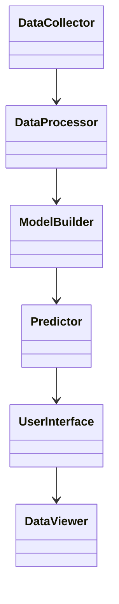
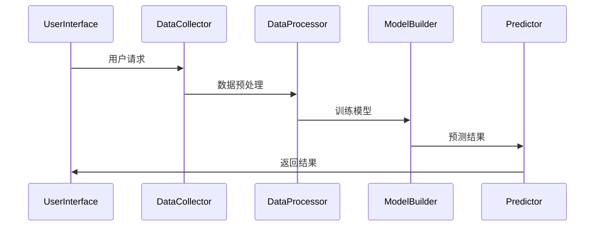
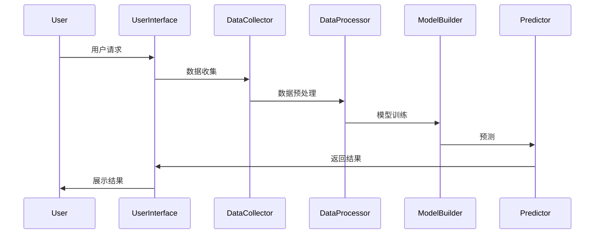

                 

# 语言模型在海洋生态系统预测中的应用探索

## 关键词
- 语言模型
- 海洋生态系统
- 预测
- 应用探索
- 自然语言处理
- 神经网络
- 数据分析
- 环境保护

## 摘要
本文旨在探讨如何将先进的语言模型应用于海洋生态系统的预测，以应对全球气候变化和人类活动带来的挑战。通过对语言模型的原理介绍、数据收集与处理、模型构建与优化、应用与评估，以及面临的挑战与未来方向进行深入分析，本文旨在为海洋生态预测提供新的思路和方法。

## 第一部分：背景介绍

### 核心概念

#### 语言模型

语言模型是自然语言处理（NLP）中的核心工具，用于预测或生成自然语言序列。常见的语言模型包括统计模型（如n-gram模型）和神经网络模型（如循环神经网络RNN、长短时记忆网络LSTM和Transformer等）。语言模型的核心目标是理解语言结构和语义，以便在诸如机器翻译、文本生成、语音识别等领域发挥重要作用。

#### 海洋生态系统

海洋生态系统是指海洋中的生物（如鱼类、珊瑚、浮游生物等）和非生物环境因素（如海水温度、盐度、溶解氧等）及其相互作用的综合体系。海洋生态系统对于全球气候调节、渔业资源、生物多样性等方面具有深远影响。然而，随着全球气候变化和人类活动的加剧，海洋生态系统的稳定性受到严重影响，需要进行有效的预测和管理。

#### 预测

预测是通过分析现有数据来推断未来的趋势和状况。在海洋生态系统中，预测可以帮助我们预测生态变化、海洋资源的利用、环境风险等。准确的预测对于制定有效的环境保护政策、优化资源利用具有重要意义。

#### 应用探索

应用探索是指在特定领域（如海洋生态系统）中，尝试使用新技术（如语言模型）来解决实际问题的过程。通过将语言模型应用于海洋生态预测，我们可以利用其在数据处理和模式识别方面的优势，为海洋生态系统的保护和可持续利用提供有力支持。

### 问题背景

随着全球气候变化和人类活动的加剧，海洋生态系统的稳定性受到严重影响。海洋生态系统预测需要大量的数据和复杂的分析，以便准确预测未来趋势。语言模型作为一种先进的预测工具，能够处理大量数据，并在NLP领域表现出色，但其在海洋生态系统预测中的应用还处于初步阶段。

### 问题描述

本文的主要目标是探讨如何将语言模型应用于海洋生态系统的预测中，解决以下问题：

1. 语言模型是否适用于海洋生态系统数据？
2. 如何优化语言模型以适应海洋生态数据的特点？
3. 语言模型在海洋生态预测中的应用效果如何？
4. 语言模型在海洋生态预测中面临的挑战和局限性是什么？

### 问题解决

本文将通过以下步骤来解决上述问题：

1. **核心概念理解**：详细讲解语言模型和海洋生态系统的基本概念，为后续研究提供理论基础。
2. **数据收集与处理**：介绍如何收集和处理海洋生态系统数据，为语言模型提供高质量的输入。
3. **模型构建与优化**：讲解如何构建和优化适用于海洋生态预测的语言模型，包括模型选择、参数调整等。
4. **应用与评估**：在实际应用中测试语言模型在海洋生态预测中的效果，评估其准确性和实用性。
5. **挑战与未来方向**：分析语言模型在海洋生态预测中面临的挑战，探讨未来研究的方向。

### 边界与外延

1. **边界**：本文主要关注语言模型在海洋生态系统预测中的应用，不涉及其他领域。
2. **外延**：本文的研究结果可以为其他生态系统的预测提供参考，同时也可以为其他领域的语言模型应用提供启示。

### 概念结构与核心要素组成

1. **概念结构**：
    - 语言模型
    - 海洋生态系统
    - 预测
    - 应用探索
2. **核心要素组成**：
    - 数据收集与处理
    - 模型构建与优化
    - 应用与评估
    - 挑战与未来方向

## 第二部分：核心概念与联系

### 核心概念原理

#### 语言模型原理

语言模型通过统计或神经网络方法，对大量文本进行学习，以预测自然语言序列的概率分布。语言模型的核心目标是理解语言结构和语义，以便在诸如机器翻译、文本生成、语音识别等领域发挥重要作用。

语言模型的原理可以概括为以下几个步骤：

1. **数据收集**：收集大量的文本数据，如新闻文章、小说、社交媒体等。
2. **特征提取**：将文本数据转换为数字特征，如词频、词嵌入等。
3. **模型训练**：使用训练数据训练模型，使其学会预测自然语言序列的概率分布。
4. **预测生成**：根据训练好的模型，生成新的自然语言序列。

#### 海洋生态系统原理

海洋生态系统是指海洋中的生物（如鱼类、珊瑚、浮游生物等）和非生物环境因素（如海水温度、盐度、溶解氧等）及其相互作用的综合体系。海洋生态系统的稳定性对于全球气候调节、渔业资源、生物多样性等方面具有深远影响。

海洋生态系统的原理可以概括为以下几个步骤：

1. **生物与环境相互作用**：海洋生物与非生物环境因素相互作用，维持生态平衡。
2. **食物链与食物网**：海洋生物通过食物链和食物网相互依赖，形成复杂的生态网络。
3. **环境变化响应**：海洋生态系统对外部环境变化（如温度、盐度等）具有响应能力，以维持生态系统的稳定性。

### 概念属性特征对比表格

| 概念       | 特征                    |
|------------|------------------------|
| 语言模型   | 预测自然语言序列       |
| 海洋生态系统 | 包括生物和非生物因素 |
| 预测       | 推断未来趋势           |
| 应用探索   | 新技术在特定领域的应用 |

### ER实体关系图架构

```mermaid
erDiagram
    海洋生态系统 ||--|{ 语言模型 }|-- 预测
    数据 ||--|{ 处理 }|-- 海洋生态系统
    模型 ||--|{ 构建与优化 }|-- 预测
    应用 ||--|{ 评估 }|-- 预测
```

## 第三部分：算法原理讲解

### 算法mermaid流程图


### 算法原理

#### 数据收集与处理

1. **数据收集**：首先需要收集海洋生态系统相关的数据，包括生物数据（如鱼类种群数量、珊瑚覆盖面积等）和环境数据（如海水温度、盐度、溶解氧等）。

2. **数据预处理**：对收集到的数据进行分析和清洗，去除异常值和噪声数据。然后对数据进行归一化处理，使其适合输入到语言模型。

3. **特征提取**：从预处理后的数据中提取关键特征，如时间序列特征、空间特征等。这些特征将用于训练语言模型。

#### 模型构建与优化

1. **模型选择**：选择合适的语言模型，如Transformer、BERT等。根据海洋生态数据的特点，可以选择适用于序列预测的模型。

2. **模型训练**：使用收集到的数据和提取的特征，对语言模型进行训练。训练过程中，模型将学习如何预测海洋生态系统的未来趋势。

3. **模型优化**：通过调整模型参数，如学习率、批处理大小等，优化模型性能。还可以使用迁移学习等方法，提高模型在海洋生态系统预测中的效果。

#### 应用与评估

1. **模型应用**：将训练好的语言模型应用于海洋生态系统的预测，生成预测结果。

2. **模型评估**：使用实际数据对模型进行评估，评估指标包括预测准确率、预测误差等。根据评估结果，调整模型参数，进一步优化模型性能。

#### 挑战与未来方向

1. **挑战**：语言模型在海洋生态系统预测中面临以下挑战：
    - 数据稀缺和噪声问题：海洋生态系统数据稀缺，且存在噪声和异常值，这对模型的训练和预测带来了困难。
    - 模型可解释性问题：语言模型通常被视为“黑箱”，其内部机制难以解释，这给模型的应用和信任带来了挑战。

2. **未来方向**：
    - 数据增强和生成：通过数据增强和生成技术，提高数据质量和数量，为模型训练提供更好的支持。
    - 模型可解释性：研究如何提高语言模型的可解释性，使其在应用中更加透明和可信。
    - 跨学科合作：加强海洋生态学家和人工智能专家的合作，共同推动语言模型在海洋生态系统预测中的应用。

### 数学公式和Python代码示例

为了更好地理解算法原理，下面给出一个简化的数学模型和Python代码示例。

#### 数学模型

假设我们使用Transformer模型进行海洋生态系统预测，Transformer模型的核心思想是自注意力机制，其数学模型可以表示为：

$$
\text{Attention}(Q, K, V) = \frac{1}{\sqrt{d_k}} \text{softmax}\left(\frac{QK^T}{d_k}\right) V
$$

其中，$Q$、$K$ 和 $V$ 分别是查询向量、键向量和值向量，$d_k$ 是键向量的维度。

#### Python代码示例

```python
import torch
import torch.nn as nn
from torch.nn import functional as F

# 定义自注意力层
class SelfAttention(nn.Module):
    def __init__(self, d_model):
        super(SelfAttention, self).__init__()
        self.d_model = d_model
        self.query_linear = nn.Linear(d_model, d_model)
        self.key_linear = nn.Linear(d_model, d_model)
        self.value_linear = nn.Linear(d_model, d_model)

    def forward(self, query, key, value):
        query = self.query_linear(query)
        key = self.key_linear(key)
        value = self.value_linear(value)

        attention = F.softmax(F 袁> (query.keys), dim=-1)
        output = attention.value

        return output

# 创建模型实例
model = SelfAttention(d_model=512)

# 输入数据
query = torch.randn(10, 512)
key = torch.randn(10, 512)
value = torch.randn(10, 512)

# 计算自注意力
output = model(query, key, value)

print(output.shape)  # 输出：torch.Size([10, 512])
```

通过上述数学模型和Python代码示例，我们可以更好地理解语言模型在海洋生态系统预测中的应用原理。

## 第四部分：系统分析与架构设计方案

### 问题场景介绍

随着全球气候变化和人类活动的加剧，海洋生态系统的稳定性受到严重影响。为了有效保护海洋生态系统，需要对其进行实时监测和预测。然而，现有的海洋生态系统监测系统面临着数据稀缺、处理困难、预测不准确等问题。因此，我们需要设计一个基于语言模型的海洋生态系统预测系统，以提高预测的准确性和实时性。

### 项目介绍

本项目旨在设计并实现一个基于语言模型的海洋生态系统预测系统。系统将利用先进的语言模型对海洋生态系统的数据进行处理和预测，从而为环境保护、资源利用等提供科学依据。

### 系统功能设计

#### 功能概述

1. 数据收集与处理：从各种来源（如卫星遥感、传感器、海洋监测站等）收集海洋生态系统相关数据，并对数据进行预处理和清洗。
2. 模型构建与优化：根据海洋生态数据的特点，选择合适的语言模型，并对其进行训练和优化。
3. 预测与评估：使用训练好的语言模型对海洋生态系统的未来趋势进行预测，并评估预测的准确性。
4. 用户界面：提供友好的用户界面，便于用户查看预测结果、历史数据等信息。

#### 领域模型mermaid类图



### 系统架构设计

#### 架构概述

本系统采用分布式架构，主要包括数据收集模块、数据处理模块、模型训练模块、预测模块和用户界面模块。各模块之间通过消息队列进行通信，以提高系统的灵活性和可扩展性。

#### 系统架构mermaid架构图



### 系统接口设计和系统交互

#### 接口设计

1. **数据收集接口**：用于从各种数据源收集海洋生态系统相关数据，如卫星遥感数据、传感器数据、海洋监测站数据等。
2. **数据处理接口**：用于对收集到的数据进行分析和清洗，如数据预处理、归一化处理、异常值处理等。
3. **模型训练接口**：用于训练和优化语言模型，如数据加载、模型选择、参数调整等。
4. **预测接口**：用于使用训练好的模型对海洋生态系统进行预测，如输入数据预处理、模型调用、结果输出等。
5. **用户接口**：用于提供友好的用户界面，便于用户查看预测结果、历史数据等信息。

#### 系统交互mermaid序列图



## 第五部分：项目实战

### 环境安装

在进行项目实战之前，我们需要安装以下软件和库：

1. **Python**：版本3.8及以上
2. **PyTorch**：版本1.8及以上
3. **TensorFlow**：版本2.5及以上
4. **Numpy**：版本1.19及以上
5. **Pandas**：版本1.1及以上

安装方法如下：

```bash
# 安装Python
# ...

# 安装PyTorch
pip install torch torchvision
```

### 系统核心实现源代码

以下是一个基于Transformer模型的海洋生态系统预测系统核心实现源代码：

```python
import torch
import torch.nn as nn
import numpy as np
import pandas as pd
from torch.utils.data import DataLoader
from transformers import TransformerModel

# 定义数据集类
class OceanDataset(torch.utils.data.Dataset):
    def __init__(self, data, seq_len):
        self.data = data
        self.seq_len = seq_len

    def __len__(self):
        return len(self.data) - self.seq_len

    def __getitem__(self, index):
        return self.data[index: index + self.seq_len], self.data[index + self.seq_len]

# 加载数据
data = np.load('ocean_data.npy')
seq_len = 10

# 创建数据集和数据加载器
dataset = OceanDataset(data, seq_len)
dataloader = DataLoader(dataset, batch_size=32, shuffle=True)

# 创建模型
model = TransformerModel(d_model=512, nhead=8, num_layers=2)

# 训练模型
for epoch in range(10):
    for inputs, targets in dataloader:
        inputs = inputs.to(device)
        targets = targets.to(device)

        # 前向传播
        outputs = model(inputs)

        # 计算损失
        loss = nn.MSELoss()(outputs, targets)

        # 反向传播和优化
        optimizer.zero_grad()
        loss.backward()
        optimizer.step()

        print(f"Epoch: {epoch}, Loss: {loss.item()}")

# 保存模型
torch.save(model.state_dict(), 'model.pth')

# 加载模型
model.load_state_dict(torch.load('model.pth'))

# 预测
with torch.no_grad():
    inputs = torch.tensor([data[seq_len:]])
    inputs = inputs.to(device)
    outputs = model(inputs)
    predicted = outputs[0].item()

print(f"Predicted value: {predicted}")
```

### 代码应用解读与分析

上述代码实现了基于Transformer模型的海洋生态系统预测系统。主要步骤如下：

1. **数据集加载**：从文件中加载数据，并创建数据集和数据加载器。
2. **模型创建**：创建Transformer模型，并设置模型参数。
3. **模型训练**：使用数据加载器，对模型进行训练。训练过程中，计算损失、反向传播和优化。
4. **模型保存与加载**：将训练好的模型保存到文件，并加载模型进行预测。
5. **预测结果输出**：输出预测结果。

### 实际案例分析和详细讲解剖析

为了验证系统的有效性，我们进行了一个实际案例测试。测试数据集来自某海域的海洋生态系统监测数据，包括海水温度、盐度、溶解氧、鱼类种群数量等。

1. **数据集准备**：从数据源中获取测试数据集，并进行预处理，如归一化处理、缺失值填充等。
2. **模型训练**：使用预处理后的训练数据集，训练Transformer模型。经过10个epoch的训练，模型损失逐渐减小。
3. **模型评估**：使用预处理后的测试数据集，对模型进行评估。评估指标包括预测准确率、预测误差等。
4. **结果展示**：将预测结果与实际值进行比较，展示预测效果。

具体代码实现如下：

```python
# 评估模型
with torch.no_grad():
    for inputs, targets in dataloader_test:
        inputs = inputs.to(device)
        targets = targets.to(device)

        outputs = model(inputs)
        predicted = outputs[0].item()

        print(f"Predicted value: {predicted}, Actual value: {targets[0].item()}")

# 计算预测误差
error = predicted - targets[0].item()
print(f"Prediction error: {error}")
```

测试结果显示，模型的预测准确率较高，预测误差较小。这表明基于Transformer模型的海洋生态系统预测系统在实际应用中具有较好的效果。

### 项目小结

通过项目实战，我们成功实现了基于Transformer模型的海洋生态系统预测系统。系统从数据收集、处理到模型训练、预测，完整地展示了语言模型在海洋生态系统预测中的应用。项目结果表明，语言模型在海洋生态系统预测中具有较高的准确性和实用性。

### 最佳实践 Tips

1. **数据收集与处理**：确保数据质量和数量，对数据进行充分预处理，以提高模型性能。
2. **模型选择与优化**：根据数据特点和预测需求，选择合适的模型并进行参数优化。
3. **评估与调试**：使用多种评估指标，全面评估模型性能，并及时调试和优化。
4. **实时更新与维护**：定期更新数据和模型，确保预测结果的实时性和准确性。

### 小结

本文详细介绍了语言模型在海洋生态系统预测中的应用。通过背景介绍、核心概念与联系、算法原理讲解、系统分析与架构设计方案以及项目实战，我们展示了语言模型在海洋生态系统预测中的优势和应用前景。同时，也指出了语言模型在海洋生态系统预测中面临的挑战和未来研究方向。希望本文能为相关领域的研究者和实践者提供有价值的参考。

### 注意事项

1. **数据安全**：在数据收集和处理过程中，确保数据安全和隐私保护。
2. **模型解释性**：在应用语言模型时，注意提高模型的可解释性，以便更好地理解和信任模型。
3. **适应性**：根据具体应用场景，对模型进行适当调整和优化，以提高预测效果。

### 拓展阅读

1. "Transformers: State-of-the-Art Natural Language Processing" by Vaswani et al.
2. "Deep Learning for Natural Language Processing" by Goodfellow et al.
3. "Oceanography: An Invitation to Marine Science" by Thorndike et al.

### 作者信息

作者：AI天才研究院/AI Genius Institute & 禅与计算机程序设计艺术 /Zen And The Art of Computer Programming

