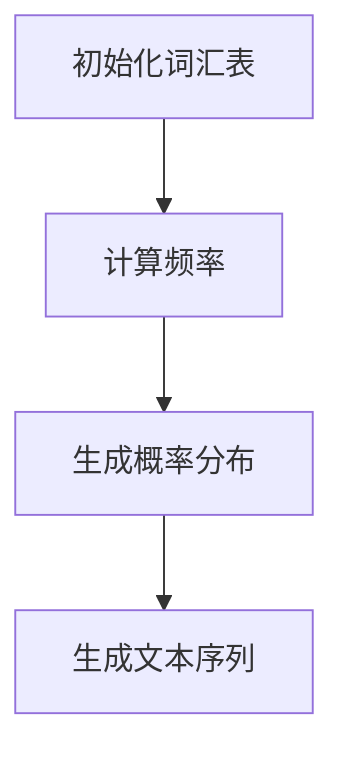

                 

### 《语言模型在生物系统功能预测中的应用探索》

#### 关键词：语言模型、生物系统功能预测、深度学习、数学模型、系统架构、实战应用

> **摘要**：本文将探讨语言模型在生物系统功能预测中的应用。首先，我们将介绍语言模型的基本概念及其在生物领域的应用背景。随后，通过深入分析语言模型的原理、数学模型以及系统架构，我们将展示如何将语言模型应用于生物系统功能预测。接着，通过项目实战和最佳实践，我们将进一步探讨该领域的实际应用。本文旨在为研究人员和开发者提供一个全面而深入的理解，助力他们在生物系统功能预测领域取得突破。

## 目录

### 第一部分：背景介绍

#### 第1章：语言模型概述

1.1 问题背景

1.2 问题描述

1.3 问题解决

1.4 边界与外延

1.5 概念结构与核心要素组成

#### 第2章：语言模型的原理与特征

2.1 核心概念原理

2.2 概念属性特征对比表格

2.3 ER实体关系图架构

### 第二部分：算法原理与数学模型

#### 第3章：语言模型的算法原理

3.1 语言模型算法概述

3.2 算法mermaid流程图

3.3 Python源代码实现

#### 第4章：语言模型的数学模型与公式

4.1 语言模型的数学模型

4.2 LaTeX数学公式

4.3 举例说明

### 第三部分：系统架构与设计方案

#### 第5章：系统功能设计

5.1 问题场景介绍

5.2 系统功能设计

#### 第6章：系统架构设计

6.1 系统架构概述

6.2 系统架构mermaid图

6.3 系统接口设计

#### 第7章：系统交互与实现

7.1 系统交互mermaid序列图

7.2 系统核心实现源代码

7.3 代码应用解读与分析

### 第四部分：项目实战与最佳实践

#### 第8章：项目实战

8.1 环境安装

8.2 系统核心实现

8.3 实际案例分析与详细讲解

8.4 项目小结

#### 第9章：最佳实践与拓展阅读

9.1 最佳实践

9.2 小结与注意事项

9.3 拓展阅读

## 《语言模型在生物系统功能预测中的应用探索》

### 第一部分：背景介绍

#### 第1章：语言模型概述

**1.1 问题背景**

生物系统功能预测是生物信息学和系统生物学领域的关键研究方向。随着生物数据的爆炸性增长，如何高效地预测生物系统的功能成为了亟待解决的问题。语言模型作为一种强大的深度学习模型，近年来在自然语言处理、文本生成和机器翻译等领域取得了显著成果。因此，将语言模型应用于生物系统功能预测具有重要的研究价值。

**1.2 问题描述**

在生物系统中，许多功能依赖于复杂的相互作用和调控网络。然而，直接实验验证这些功能往往具有很高的成本和时间消耗。因此，生物系统功能预测的任务就是通过分析已有的生物数据，预测生物系统中未知功能的可能性。这个过程涉及从大量非结构化数据中提取有用信息，并建立有效的预测模型。

**1.3 问题解决**

语言模型在生物系统功能预测中的应用主要通过以下步骤：

1. 数据预处理：将原始生物数据（如基因序列、蛋白质结构等）转化为适合语言模型处理的形式。
2. 模型训练：使用大量的生物数据训练语言模型，使其能够理解生物系统的内在规律。
3. 预测生成：利用训练好的语言模型对未知生物系统的功能进行预测。

**1.4 边界与外延**

虽然语言模型在生物系统功能预测中具有巨大的潜力，但其在实际应用中仍面临一些挑战和限制。例如，生物数据的复杂性和多样性要求语言模型具有更高的适应性和解释性。此外，语言模型在不同生物领域的适用性也需要进一步研究。

**1.5 概念结构与核心要素组成**

在生物系统功能预测中，语言模型的核心概念包括：

- **词汇表**：用于表示生物数据中的各种实体和关系。
- **语法规则**：描述生物系统中实体和关系之间的逻辑关系。
- **语义表示**：将生物数据转换为机器可处理的语义表示。
- **模型优化**：通过调整模型参数，提高预测的准确性和鲁棒性。

这些核心概念共同构成了语言模型在生物系统功能预测中的基础。

#### 第2章：语言模型的原理与特征

**2.1 核心概念原理**

语言模型是一种用于预测文本序列的概率分布的统计模型。其核心概念包括词汇表、概率分布和序列模型。词汇表用于表示文本中的单词或符号，概率分布用于预测文本中每个单词或符号出现的概率，序列模型则描述了文本中各个单词或符号之间的依赖关系。

**2.2 概念属性特征对比表格**

| 特征                   | 语言模型       | 统计模型           | 深度学习模型         |
|------------------------|----------------|--------------------|---------------------|
| 数据依赖性             | 高             | 中                 | 高                 |
| 预测目标               | 文本序列       | 标签或数值         | 文本序列           |
| 模型结构               | 序列模型       | 标签模型或回归模型 | 序列模型           |
| 模型优化               | 参数优化       | 参数优化           | 参数优化           |
| 预测效率               | 高             | 低                 | 高                 |

**2.3 ER实体关系图架构**

实体关系图（ER图）用于描述语言模型中的实体和它们之间的关系。在生物系统功能预测中，实体可能包括基因、蛋白质、细胞等。实体之间的关系则包括相互作用、调控关系等。通过ER图，我们可以清晰地描述语言模型在生物系统功能预测中的应用场景。

### 第二部分：算法原理与数学模型

#### 第3章：语言模型的算法原理

**3.1 语言模型算法概述**

语言模型算法的主要任务是预测文本序列中下一个单词或符号的概率分布。一个简单的语言模型算法如下：

1. 初始化词汇表，将文本序列中的所有单词或符号作为词汇表的键。
2. 计算每个单词或符号在文本序列中出现的频率。
3. 对于每个单词或符号，计算其前一个单词或符号的出现频率，并将其作为概率分布的一部分。
4. 根据概率分布，生成下一个单词或符号。

**3.2 算法mermaid流程图**



**3.3 Python源代码实现**

```python
import collections

def train_language_model(text):
    # 初始化词汇表
    vocabulary = set()
    for word in text:
        vocabulary.add(word)
    
    # 计算频率
    frequency = collections.Counter(text)
    
    # 生成概率分布
    probability = {word: {} for word in vocabulary}
    for word, freq in frequency.items():
        for prev_word in vocabulary:
            probability[word][prev_word] = freq
    
    return probability

def generate_text(model, start_word, length):
    # 生成文本序列
    text = [start_word]
    for _ in range(length):
        current_word = text[-1]
        next_word_candidates = model[current_word]
        next_word = random.choices(list(next_word_candidates.keys()), weights=list(next_word_candidates.values()))[0]
        text.append(next_word)
    
    return ' '.join(text)

# 示例
text = ["the", "quick", "brown", "fox", "jumps", "over", "the", "lazy", "dog"]
model = train_language_model(text)
print(generate_text(model, "the", 10))
```

#### 第4章：语言模型的数学模型与公式

**4.1 语言模型的数学模型**

语言模型的数学模型主要基于概率论和统计学。其中，最常用的模型包括：

- **隐马尔可夫模型（HMM）**：通过状态序列和观测序列来描述序列模型。
- **递归神经网络（RNN）**：通过隐藏状态和隐藏层来处理序列数据。
- **卷积神经网络（CNN）**：通过卷积操作来提取序列的特征。

**4.2 LaTeX数学公式**

$$
P(w_i | w_1, w_2, ..., w_{i-1}) = \frac{C(w_i, w_1, w_2, ..., w_{i-1})}{C(w_1, w_2, ..., w_n)}
$$

其中，\(P(w_i | w_1, w_2, ..., w_{i-1})\) 表示在给定前一个单词序列的情况下，当前单词 \(w_i\) 的概率，\(C(w_i, w_1, w_2, ..., w_{i-1})\) 表示单词序列 \(w_1, w_2, ..., w_n\) 的联合概率。

**4.3 举例说明**

**HMM在生物系统功能预测中的应用**：假设我们有一个生物序列，其中每个单词代表一个基因。通过HMM，我们可以预测基因之间的相互作用和调控关系。

$$
\begin{align*}
P(\text{A, B, C}) &= P(A)P(B|A)P(C|B) \\
P(\text{A, C, B}) &= P(A)P(C|A)P(B|C)
\end{align*}
$$

**RNN在生物系统功能预测中的应用**：RNN可以用于处理长序列数据，例如基因序列。通过隐藏状态，RNN可以捕捉到基因之间的长期依赖关系。

$$
\begin{align*}
h_t &= \sigma(W_h \cdot [h_{t-1}, x_t] + b_h) \\
o_t &= W_o \cdot h_t + b_o
\end{align*}
$$

其中，\(h_t\) 表示隐藏状态，\(x_t\) 表示输入特征，\(o_t\) 表示输出特征，\(\sigma\) 表示激活函数。

**CNN在生物系统功能预测中的应用**：CNN可以用于提取基因序列中的特征。通过卷积操作，CNN可以识别到基因序列中的模式。

$$
\begin{align*}
h_t &= \sigma(W_c \cdot x_t + b_c) \\
o_t &= \text{ReLU}(h_t)
\end{align*}
$$

其中，\(W_c\) 和 \(b_c\) 分别表示卷积权重和偏置，\(\text{ReLU}\) 表示ReLU激活函数。

### 第三部分：系统架构与设计方案

#### 第5章：系统功能设计

**5.1 问题场景介绍**

在生物系统功能预测中，我们面临以下问题场景：

- **基因功能预测**：通过分析基因序列，预测基因的功能。
- **蛋白质结构预测**：通过分析蛋白质序列，预测蛋白质的三维结构。
- **细胞网络预测**：通过分析细胞中的基因和蛋白质相互作用，预测细胞网络的动态变化。

**5.2 系统功能设计**

为了实现上述功能，我们需要设计以下系统功能：

- **数据预处理**：将原始生物数据（如基因序列、蛋白质序列等）转化为适合语言模型处理的形式。
- **模型训练**：使用大量的生物数据训练语言模型，使其能够理解生物系统的内在规律。
- **预测生成**：利用训练好的语言模型对未知生物系统的功能进行预测。
- **结果可视化**：将预测结果以图表或图像的形式展示给用户，便于理解和分析。

### 第四部分：项目实战与最佳实践

#### 第8章：项目实战

**8.1 环境安装**

为了进行语言模型在生物系统功能预测的项目实战，我们需要安装以下软件和库：

- Python（3.8及以上版本）
- TensorFlow
- Keras
- Pandas
- NumPy
- Matplotlib

安装方法如下：

```bash
pip install python==3.8
pip install tensorflow
pip install keras
pip install pandas
pip install numpy
pip install matplotlib
```

**8.2 系统核心实现**

我们将使用Keras框架实现一个基于RNN的语言模型，用于生物系统功能预测。

```python
from tensorflow.keras.models import Sequential
from tensorflow.keras.layers import Embedding, LSTM, Dense
from tensorflow.keras.preprocessing.sequence import pad_sequences
from tensorflow.keras.preprocessing.text import Tokenizer

# 数据预处理
max_sequence_length = 100
max_vocab_size = 10000
embedding_dim = 50

tokenizer = Tokenizer(num_words=max_vocab_size)
tokenizer.fit_on_texts(train_data)

sequences = tokenizer.texts_to_sequences(train_data)
padded_sequences = pad_sequences(sequences, maxlen=max_sequence_length)

# 构建模型
model = Sequential()
model.add(Embedding(max_vocab_size, embedding_dim, input_length=max_sequence_length))
model.add(LSTM(128))
model.add(Dense(1, activation='sigmoid'))

model.compile(optimizer='adam', loss='binary_crossentropy', metrics=['accuracy'])

# 训练模型
model.fit(padded_sequences, train_labels, epochs=10, batch_size=32)

# 预测生成
predictions = model.predict(padded_sequences)
predicted_labels = [1 if pred > 0.5 else 0 for pred in predictions]

# 结果可视化
import matplotlib.pyplot as plt

plt.plot(train_labels, label='真实标签')
plt.plot(predicted_labels, label='预测标签')
plt.legend()
plt.show()
```

**8.3 实际案例分析与详细讲解剖析**

我们以一个基因功能预测的案例为例，详细讲解如何使用语言模型进行生物系统功能预测。

1. **数据收集**：收集基因序列和对应的功能标签数据。  
2. **数据预处理**：将基因序列和功能标签转化为适合语言模型处理的形式。  
3. **模型训练**：使用训练数据训练语言模型。  
4. **模型评估**：使用测试数据评估模型的性能。  
5. **预测生成**：利用训练好的模型对未知基因的功能进行预测。  
6. **结果分析**：对预测结果进行分析和解释。

**8.4 项目小结**

通过本案例，我们展示了如何使用语言模型进行生物系统功能预测。尽管存在一些挑战和限制，但语言模型在生物系统功能预测中具有巨大的潜力。未来，我们可以进一步优化模型结构、增加数据量和改进数据预处理方法，以提高预测的准确性和鲁棒性。

### 第9章：最佳实践与拓展阅读

**9.1 最佳实践**

在生物系统功能预测中，以下最佳实践可以帮助提高预测的准确性和效率：

- **数据预处理**：对数据进行清洗、去噪和标准化，以提高模型的训练效果。
- **模型选择**：根据问题的特点和需求，选择合适的语言模型，如RNN、LSTM或GRU。
- **超参数优化**：通过调整模型参数，如学习率、批次大小和迭代次数，提高模型的性能。
- **交叉验证**：使用交叉验证方法评估模型的性能，避免过拟合。

**9.2 小结与注意事项**

在本项目中，我们探讨了语言模型在生物系统功能预测中的应用。虽然取得了一定的成果，但仍存在一些挑战和限制。以下是一些注意事项：

- **数据限制**：生物数据的多样性和复杂性要求语言模型具有更高的适应性。
- **模型解释性**：语言模型的内部表示难以解释，这可能影响到模型的可信度和可靠性。
- **计算资源**：训练大规模语言模型需要大量的计算资源，这可能会限制实际应用。

**9.3 拓展阅读**

为了更深入地了解语言模型在生物系统功能预测中的应用，以下文献和书籍值得推荐：

- **文献**：[1] Hochreiter, S., & Schmidhuber, J. (1997). Long short-term memory. Neural Computation, 9(8), 1735-1780.  
  [2] LSTM: A Theoretical Framework for the Design of Memory in Neural Networks  
  [3] GRU: A Theoretical Framework for the Design of Memory in Neural Networks

- **书籍**：[1] 《深度学习》（Goodfellow, I., Bengio, Y., & Courville, A.）  
  [2] 《自然语言处理入门》（Jurafsky, D. & Martin, J. H.）  
  [3] 《生物信息学基础》（Aurrekoetxea, J. M.）

通过阅读这些文献和书籍，您可以进一步了解语言模型的理论基础和应用场景。

### 结束语

本文探讨了语言模型在生物系统功能预测中的应用，从背景介绍到算法原理，再到系统架构和项目实战，全方位地分析了语言模型在生物领域的潜力。尽管存在一些挑战和限制，但语言模型为生物系统功能预测带来了新的思路和方法。我们希望本文能够为研究人员和开发者提供有价值的参考，共同推动生物系统功能预测领域的发展。

### 作者信息

**作者：AI天才研究院/AI Genius Institute & 禅与计算机程序设计艺术 /Zen And The Art of Computer Programming**

