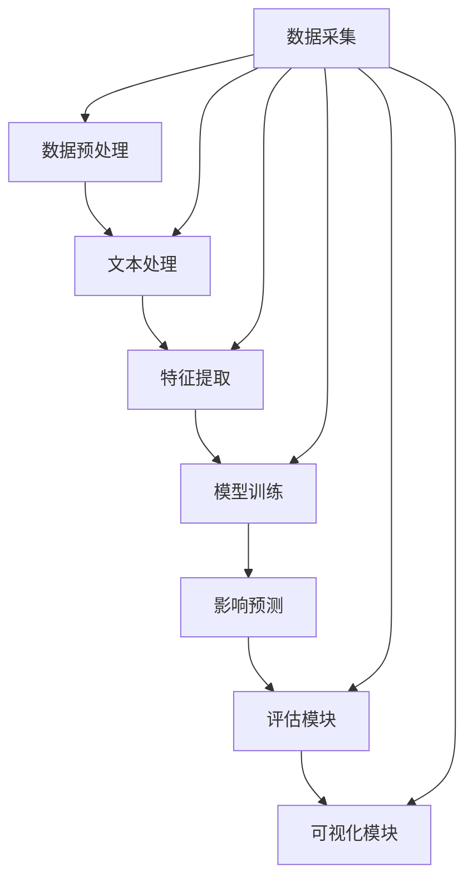
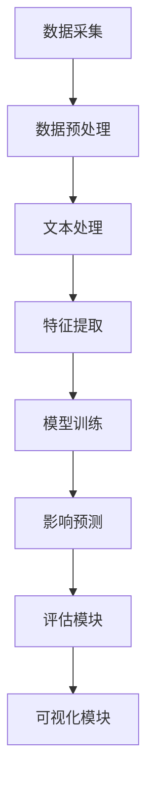

                 

### 摘要

本文旨在探讨语言模型在社会政策影响评估中的应用研究。首先，本文介绍了社会政策影响评估的重要性以及当前评估方法面临的挑战。接着，我们详细阐述了语言模型的基本原理、性能评估和应用场景，揭示了其在文本生成、分类、摘要和问答系统中的强大能力。随后，本文重点分析了语言模型在社会政策影响评估中的应用优势、挑战和具体案例分析，展示了其在政策文本分析、影响预测和效果评估中的实际应用。此外，本文还通过数学模型和系统架构设计，深入探讨了如何利用语言模型进行社会政策影响评估的系统构建和实现。最后，本文总结了语言模型在社会政策影响评估中的应用成果，提出了改进方向和最佳实践，为未来研究提供了参考。通过本文的研究，我们期望能够为政策制定者和研究者提供一种全新的影响评估工具，推动社会政策的科学化和精细化发展。

## 第一部分：背景与基础

### 第1章 问题背景与核心概念

#### 1.1 问题的提出

社会政策是指国家或地方政府为了解决社会问题，促进社会公平与进步而制定的公共政策。这些政策涵盖了教育、医疗、就业、住房、社会保障等多个领域，直接关系到广大民众的生活质量和福祉。然而，社会政策的制定和实施并非一蹴而就，其效果和影响往往需要通过科学的方法进行评估。社会政策影响评估（Social Policy Impact Assessment，简称SPIA）正是为了解决这一问题而诞生的一项研究方法。

社会政策影响评估的重要性主要体现在以下几个方面：

1. **政策优化**：通过评估政策实施的效果，可以及时发现政策中的不足和问题，为政策的调整和完善提供科学依据。

2. **资源合理配置**：评估可以帮助决策者了解不同政策方案的优劣，从而优化资源配置，提高政策效果。

3. **决策支持**：评估结果可以为政策制定者提供客观、全面的数据支持，帮助他们做出更加明智的决策。

4. **透明度和公信力**：科学、透明的评估过程可以提高政策的透明度和公信力，增加公众对政策的信任和支持。

然而，当前的社会政策影响评估方法仍然存在一定的局限性。传统的评估方法大多依赖于定量分析和统计分析，往往难以全面捕捉政策的复杂影响。同时，评估过程中涉及的数据来源和样本选择也具有一定的局限性，可能导致评估结果的偏差。此外，评估方法本身的科学性和可靠性也受到一定程度的质疑。

因此，如何改进社会政策影响评估方法，提高评估的科学性和可靠性，成为一个亟待解决的问题。随着人工智能技术的快速发展，特别是语言模型技术的突破，为改进社会政策影响评估方法提供了新的契机。语言模型作为一种强大的自然语言处理工具，能够通过对大量文本数据的分析和理解，为政策评估提供更加全面、准确的数据支持。本文将重点探讨语言模型在社会政策影响评估中的应用，分析其优势、挑战和应用前景。

#### 1.2 核心概念介绍

为了深入理解语言模型在社会政策影响评估中的应用，我们首先需要明确几个核心概念：语言模型、社会政策和影响评估。

**1.2.1 语言模型**

语言模型（Language Model）是自然语言处理（Natural Language Processing，简称NLP）的核心技术之一。它是一种基于统计和机器学习的方法，用于预测一段文本的下一个词或下一个句子。语言模型的基本原理是通过大量语料库的学习，建立一种概率分布，用于预测给定前文条件下下一个单词的概率分布。

语言模型的主要特点包括：

1. **上下文依赖**：语言模型能够考虑上下文信息，提高预测的准确性。

2. **数据驱动**：语言模型通过大量数据的学习，自动提取语言特征，避免了人工特征工程的需要。

3. **可扩展性**：语言模型可以轻松扩展到不同规模的语言任务，如文本生成、分类、摘要等。

常见的语言模型包括：

1. **n-gram模型**：基于前n个单词的概率分布，是最简单的语言模型。

2. **神经网络模型**：如循环神经网络（RNN）、长短期记忆网络（LSTM）和Transformer模型，这些模型能够捕捉长距离的依赖关系，具有更高的预测性能。

**1.2.2 社会政策**

社会政策（Social Policy）是指国家或地方政府为了解决社会问题，促进社会公平与进步而制定的公共政策。社会政策涵盖了教育、医疗、就业、住房、社会保障等多个领域，直接关系到广大民众的生活质量和福祉。社会政策的制定和实施是一个复杂的过程，需要综合考虑社会需求、经济状况、文化背景等多种因素。

社会政策的分类可以根据不同的标准进行划分，如：

1. **根据政策目标**：可以分为社会福利政策、社会公正政策和社会发展政策等。

2. **根据政策领域**：可以分为教育政策、医疗政策、就业政策、住房政策和社会保障政策等。

**1.2.3 影响评估的方法与流程**

影响评估（Impact Assessment）是一种评估政策实施效果的方法，通过系统地收集、分析和解释数据，评估政策对目标群体和社会的影响。影响评估的方法和流程可以分为以下几个步骤：

1. **问题定义**：明确评估的目的和范围，确定需要评估的政策或项目。

2. **数据收集**：收集与政策或项目相关的数据，包括定量数据和定性数据。

3. **影响分析**：分析政策或项目对目标群体和社会的影响，包括直接和间接影响。

4. **评估指标**：确定评估指标，用于衡量政策或项目的影响。

5. **结果解释**：解释评估结果，评估政策或项目的效果和影响。

6. **建议和改进**：根据评估结果，提出政策或项目的改进建议。

影响评估的方法可以分为定量评估和定性评估。定量评估主要使用统计分析方法，如回归分析、方差分析等，定性评估则主要通过案例研究、访谈、观察等方法进行。

#### 1.3 边界与外延

**1.3.1 语言模型在社会政策评估中的适用范围**

语言模型在社会政策评估中的应用具有广泛的前景。具体而言，语言模型可以在以下几个方面发挥作用：

1. **政策文本分析**：通过分析政策文本，提取关键信息，帮助评估者了解政策的意图和内容。

2. **影响预测**：利用语言模型预测政策实施后可能产生的影响，为决策者提供参考。

3. **效果评估**：通过对政策实施后的文本数据进行分析，评估政策的效果和影响。

4. **公众反馈分析**：分析公众对政策的反馈，了解公众对政策的接受程度和意见建议。

**1.3.2 影响评估面临的挑战与限制**

尽管语言模型在社会政策影响评估中具有巨大的潜力，但在实际应用中仍面临一系列挑战和限制：

1. **数据质量**：影响评估依赖于大量的文本数据，数据的质量直接影响评估结果的准确性。

2. **模型可靠性**：语言模型的结果依赖于训练数据和模型参数，模型的选择和调优对评估结果有重要影响。

3. **评估方法的科学性**：如何设计科学、可靠的评估方法，确保评估结果的准确性和可靠性，是一个重要的挑战。

4. **跨领域应用**：语言模型在不同领域的应用效果可能存在差异，如何在不同领域进行适配和优化，是一个需要解决的问题。

**1.3.3 概念结构与核心要素组成**

社会政策影响评估的概念结构可以分为以下几个核心要素：

1. **政策文本**：政策文本是评估的基础，包括政策的内容、意图和目标。

2. **影响数据**：影响数据包括政策实施后产生的直接和间接影响，如经济增长、社会公正、公众满意度等。

3. **评估指标**：评估指标是衡量政策效果和影响的标准，如经济增长率、失业率、社会公正指数等。

4. **评估方法**：评估方法包括定量和定性方法，如统计分析、案例研究、访谈等。

5. **结果解释**：结果解释是评估过程的最后一步，通过分析和解释评估结果，提出政策改进建议。

**1.4 本章小结**

本章介绍了社会政策影响评估的重要性、核心概念以及面临的挑战和限制。通过分析语言模型的基本原理、社会政策的定义和影响评估的方法与流程，我们为后续讨论语言模型在社会政策影响评估中的应用奠定了基础。在接下来的章节中，我们将进一步探讨语言模型的具体应用场景、数学模型和系统架构设计，为读者提供全面、深入的理解。

## 第二部分：语言模型原理与应用

### 第2章 语言模型的算法原理

#### 2.1 语言模型的原理

语言模型（Language Model，简称LM）是自然语言处理（Natural Language Processing，简称NLP）的核心技术之一，它用于预测自然语言的下一个词或句子。语言模型的基本原理是通过大量文本数据的学习，建立一种概率模型，用于描述语言中的概率分布。

**语言模型的基本原理**：

1. **文本数据学习**：语言模型通过大量文本数据的学习，提取语言中的统计特征，建立概率分布模型。这些特征包括词频、词组频率、上下文信息等。

2. **概率模型**：语言模型本质上是一个概率模型，它用于预测给定前文条件下下一个词或句子的概率分布。常见的语言模型包括n-gram模型、神经网络模型等。

**n-gram模型**：

n-gram模型是最简单的语言模型，它基于前n个单词的概率分布进行预测。例如，在二元语法（Bigram）模型中，给定前一个词，预测下一个词的概率。

- **模型公式**：\( P(w_{t} | w_{t-1}) = \frac{C(w_{t-1}, w_{t})}{C(w_{t-1})} \)

  其中，\( w_{t} \) 表示当前词，\( w_{t-1} \) 表示前一个词，\( C(w_{t-1}, w_{t}) \) 表示前一个词和当前词的联合频率，\( C(w_{t-1}) \) 表示前一个词的频率。

**神经网络模型**：

神经网络模型，如循环神经网络（RNN）、长短期记忆网络（LSTM）和Transformer模型，能够捕捉长距离的依赖关系，具有更高的预测性能。

- **RNN模型**：RNN模型通过循环结构，记忆前文信息，用于处理序列数据。

- **LSTM模型**：LSTM模型是RNN的一种改进，通过引入门控机制，解决RNN中的梯度消失问题。

- **Transformer模型**：Transformer模型是一种基于自注意力机制的神经网络模型，它在BERT等大型语言模型中广泛应用。

**2.2 语言模型的类型**

语言模型的类型可以根据训练数据、模型结构和应用场景进行分类。常见的语言模型类型包括：

1. **统计语言模型**：基于统计方法训练，如n-gram模型。

2. **神经网络语言模型**：基于神经网络结构训练，如RNN、LSTM和Transformer模型。

3. **深度学习语言模型**：基于深度学习方法训练，如BERT、GPT等。

**2.3 语言模型的训练过程**

语言模型的训练过程主要包括数据准备、模型训练和模型评估等步骤。

1. **数据准备**：

   - **文本数据收集**：收集大量文本数据，如新闻、文章、社交媒体等。

   - **数据预处理**：对文本数据进行分析、清洗和分词，提取有用信息。

2. **模型训练**：

   - **损失函数**：选择合适的损失函数，如交叉熵损失函数，用于衡量预测概率和真实概率之间的差距。

   - **优化算法**：选择优化算法，如梯度下降、Adam等，用于调整模型参数。

   - **训练过程**：通过迭代训练，逐步优化模型参数，提高预测性能。

3. **模型评估**：

   - **性能指标**：选择合适的性能指标，如词错（Perplexity）或准确率，评估模型性能。

   - **测试集评估**：在测试集上评估模型性能，确保模型在未知数据上的泛化能力。

**2.4 语言模型的性能评估**

语言模型的性能评估主要通过计算模型在测试集上的预测准确率、词错（Perplexity）等指标来进行。

1. **预测准确率**：预测准确率是指模型预测正确的单词占总单词的比例。

   - **计算公式**：\( \text{准确率} = \frac{\text{预测正确的单词数}}{\text{总单词数}} \)

2. **词错（Perplexity）**：词错（Perplexity）是评估语言模型性能的重要指标，表示模型在测试集上预测错误的概率的对数。

   - **计算公式**：\( \text{Perplexity} = 2^{-\text{交叉熵}} \)

     其中，交叉熵是指预测概率和真实概率之间的差距。

**2.5 语言模型的应用场景**

语言模型在自然语言处理领域具有广泛的应用，包括：

1. **文本生成**：语言模型可以用于生成文章、新闻、对话等文本内容。

2. **文本分类**：语言模型可以用于对文本进行分类，如情感分析、新闻分类等。

3. **文本摘要**：语言模型可以用于提取文本的摘要信息，如自动摘要、新闻摘要等。

4. **问答系统**：语言模型可以用于构建问答系统，如智能客服、问答机器人等。

**2.6 本章小结**

本章介绍了语言模型的基本原理、类型、训练过程和性能评估方法。通过理解语言模型的工作原理，读者可以更好地把握其在自然语言处理中的应用。在下一章中，我们将探讨语言模型在社会政策影响评估中的应用优势、挑战和具体案例分析。

### 第3章 语言模型在社会政策影响评估中的应用

#### 3.1 应用概述

语言模型作为一种先进的自然语言处理技术，其在社会政策影响评估中的应用具有重要意义。社会政策影响评估涉及大量文本数据，如政策文本、新闻报道、公众意见等，这些数据难以通过传统方法进行有效处理和分析。而语言模型能够对这些文本数据进行分析、提取和预测，为评估提供有力支持。本节将介绍语言模型在社会政策影响评估中的应用优势、挑战以及具体案例分析。

#### 3.1.1 语言模型在政策评估中的优势

语言模型在社会政策影响评估中的优势主要体现在以下几个方面：

1. **文本理解与处理**：语言模型能够对政策文本进行深入理解，提取关键信息，识别文本中的语义和情感，从而为评估提供基础数据。

2. **大规模数据处理**：语言模型能够高效地处理大规模的文本数据，通过并行计算和分布式训练，提高数据处理速度和效率。

3. **跨领域应用**：语言模型具有跨领域的应用能力，能够适应不同领域的政策评估需求，为多领域政策评估提供统一的方法。

4. **实时反馈与调整**：语言模型可以根据最新的文本数据，实时调整评估结果，提供动态的评估反馈，为政策制定者提供实时决策支持。

#### 3.1.2 语言模型在政策评估中的挑战

尽管语言模型在社会政策影响评估中具有显著优势，但其应用仍面临一系列挑战：

1. **数据质量**：政策评估依赖于大量高质量的文本数据，数据的质量直接影响评估结果的准确性。如何获取和清洗高质量的数据是一个重要问题。

2. **模型可靠性**：语言模型的性能依赖于训练数据和模型参数，模型的选择和调优对评估结果有重要影响。如何保证模型的可靠性是一个关键挑战。

3. **评估方法的科学性**：如何设计科学、可靠的评估方法，确保评估结果的准确性和可靠性，是一个重要的挑战。需要结合语言模型的特点，开发合适的评估方法。

4. **跨领域适应**：语言模型在不同领域的应用效果可能存在差异，如何在不同领域进行适配和优化，是一个需要解决的问题。

#### 3.1.3 应用场景分析

语言模型在社会政策影响评估中具有多种应用场景，以下为几种常见应用：

1. **政策文本分析**：通过对政策文本的分析，提取关键信息，了解政策的意图和内容，为评估提供基础数据。

2. **影响预测**：利用语言模型预测政策实施后可能产生的影响，为政策制定者提供参考。例如，预测政策实施后对社会经济、就业、教育等方面的影响。

3. **效果评估**：通过对政策实施后的文本数据进行分析，评估政策的效果和影响。例如，分析政策实施后公众的反馈、媒体报道的变化等。

4. **公众意见分析**：通过分析公众意见，了解公众对政策的接受程度和意见建议，为政策调整和完善提供依据。

#### 3.2 应用案例分析

以下为几个语言模型在社会政策影响评估中的应用案例：

**案例一：政策文本分析**

在某项社会政策影响评估项目中，研究人员利用语言模型对政策文本进行分析，提取关键信息，如政策目标、实施措施、受益群体等。通过分析政策文本，研究人员能够全面了解政策的意图和内容，为后续评估工作提供基础数据。

**案例二：政策影响预测**

在某项经济政策评估中，研究人员利用语言模型预测政策实施后可能产生的影响。例如，预测政策实施后对就业、经济增长、社会稳定等方面的影响。通过预测结果，政策制定者能够提前了解政策的影响，为决策提供参考。

**案例三：效果评估**

在某项医疗政策评估中，研究人员利用语言模型分析政策实施后的文本数据，如媒体报道、公众反馈等。通过分析这些数据，研究人员能够评估政策的效果和影响，为政策调整和完善提供依据。

**案例四：公众意见分析**

在某项环境保护政策评估中，研究人员利用语言模型分析公众意见，了解公众对政策的接受程度和意见建议。通过分析公众意见，政策制定者能够更好地了解公众的需求和期望，为政策调整提供参考。

#### 3.3 应用总结

语言模型在社会政策影响评估中具有显著的优势和广阔的应用前景。通过文本理解、大规模数据处理、跨领域应用和实时反馈等特点，语言模型能够为政策评估提供高效、准确的支持。然而，在实际应用中，语言模型也面临数据质量、模型可靠性、评估方法科学性和跨领域适应等方面的挑战。为了充分发挥语言模型在政策评估中的应用价值，需要结合具体应用场景，不断优化模型、改进评估方法，提高评估结果的准确性和可靠性。

#### 3.4 本章小结

本章介绍了语言模型在社会政策影响评估中的应用优势、挑战和具体案例分析。通过分析语言模型的基本原理和应用特点，读者可以更好地理解其在政策评估中的作用。在下一章中，我们将进一步探讨语言模型的数学模型与系统架构设计，为读者提供全面、深入的理解。

### 第4章 数学模型与公式

#### 4.1 数学模型概述

在社会政策影响评估中，语言模型的应用需要借助数学模型来描述和解释文本数据之间的关系。数学模型在社会政策影响评估中的作用主要体现在以下几个方面：

1. **数据描述**：数学模型能够通过数学公式和算法，对政策文本、影响数据、评估指标等进行定量描述，从而为评估提供数学基础。

2. **关系分析**：数学模型能够揭示政策文本、影响数据、评估指标之间的内在联系，帮助评估者理解政策实施的影响路径和机制。

3. **预测与优化**：数学模型可以通过训练和学习，预测政策实施后的影响，为政策优化和调整提供参考。

常见的数学模型包括统计模型、概率模型、神经网络模型等。在本章中，我们将重点介绍统计模型和概率模型在社会政策影响评估中的应用。

**4.1.1 语言模型的数学表示**

语言模型的数学表示通常是基于概率模型。概率模型通过计算文本数据中各个词语或句子的概率分布，实现对文本的生成、分类、摘要等功能。

1. **n-gram模型**：n-gram模型是一种基于词频统计的语言模型。其数学表示如下：

   $$ P(w_n | w_{n-1}, w_{n-2}, ..., w_1) = \prod_{i=1}^{n} P(w_i | w_{i-1}, w_{i-2}, ..., w_1) $$

   其中，\( w_i \) 表示第i个词，\( P(w_i | w_{i-1}, w_{i-2}, ..., w_1) \) 表示给定前文条件下第i个词的条件概率。

2. **神经网络模型**：神经网络模型，如RNN、LSTM和Transformer模型，其数学表示通常基于深度学习理论。以Transformer模型为例，其数学表示如下：

   $$ P(w_n | w_{n-1}, w_{n-2}, ..., w_1) = \frac{e^{U^T W w_{n-1}}}{\sum_{w' \in V} e^{U^T W w'}} $$

   其中，\( U \) 和 \( W \) 分别表示模型权重，\( V \) 表示词汇表。

**4.1.2 影响评估的数学模型**

影响评估的数学模型主要用于描述政策实施对社会各个方面的影响。常见的数学模型包括回归模型、决策树模型、支持向量机模型等。

1. **回归模型**：回归模型是一种常用的统计模型，用于分析政策实施对社会经济、就业、教育等方面的影响。其数学表示如下：

   $$ Y = \beta_0 + \beta_1 X_1 + \beta_2 X_2 + ... + \beta_n X_n + \epsilon $$

   其中，\( Y \) 表示因变量，\( X_1, X_2, ..., X_n \) 表示自变量，\( \beta_0, \beta_1, \beta_2, ..., \beta_n \) 表示回归系数，\( \epsilon \) 表示误差项。

2. **决策树模型**：决策树模型是一种基于树形结构的统计模型，用于分类和回归任务。其数学表示如下：

   $$ f(x) = \sum_{i=1}^{n} \beta_i g(x_i) $$

   其中，\( f(x) \) 表示函数值，\( x_i \) 表示特征值，\( \beta_i \) 表示权重，\( g(x_i) \) 表示节点函数。

3. **支持向量机模型**：支持向量机模型是一种基于最大间隔的分类模型，用于政策影响的分类任务。其数学表示如下：

   $$ f(x) = \text{sign}(\sum_{i=1}^{n} \alpha_i y_i (x_i)^T + b) $$

   其中，\( \alpha_i \) 和 \( b \) 分别表示支持向量和偏置项，\( y_i \) 表示类别标签，\( (x_i)^T \) 表示特征向量。

**4.1.3 模型之间的关系**

在社会政策影响评估中，语言模型和影响评估模型之间存在着密切的关系。语言模型主要用于文本数据的处理和理解，而影响评估模型则用于分析政策实施的影响。两者之间的关系可以概括为以下几个方面：

1. **文本数据预处理**：语言模型对政策文本进行预处理，提取关键信息，为影响评估模型提供输入数据。

2. **特征提取**：语言模型提取文本数据的特征，如词频、词向量和语义信息，作为影响评估模型的输入特征。

3. **模型融合**：将语言模型和影响评估模型融合，构建一个统一的评估模型，实现政策文本到影响评估的映射。

4. **模型优化**：通过优化语言模型和影响评估模型，提高评估的准确性和可靠性。

#### 4.2 数学公式详细讲解

在本节中，我们将详细讲解一些常用的数学公式，用于描述语言模型和影响评估模型。

**4.2.1 模型的损失函数**

损失函数是评估模型预测性能的重要指标，用于衡量预测结果和真实结果之间的差距。常见的损失函数包括交叉熵损失函数、均方误差损失函数等。

1. **交叉熵损失函数**：

   交叉熵损失函数常用于分类任务，其数学表示如下：

   $$ L = -\sum_{i=1}^{n} y_i \log(P(x_i)) $$

   其中，\( y_i \) 表示真实标签，\( P(x_i) \) 表示模型预测的概率。

2. **均方误差损失函数**：

   均方误差损失函数常用于回归任务，其数学表示如下：

   $$ L = \frac{1}{2} \sum_{i=1}^{n} (y_i - \hat{y_i})^2 $$

   其中，\( y_i \) 表示真实值，\( \hat{y_i} \) 表示模型预测的值。

**4.2.2 影响评估的指标**

影响评估指标用于衡量政策实施的影响。常见的评估指标包括准确率、召回率、F1值等。

1. **准确率**：

   准确率表示预测正确的样本占总样本的比例，其数学表示如下：

   $$ \text{准确率} = \frac{TP + TN}{TP + FN + FP + TN} $$

   其中，\( TP \) 表示真正例，\( TN \) 表示真反例，\( FP \) 表示假正例，\( FN \) 表示假反例。

2. **召回率**：

   召回率表示预测为正例的样本中实际为正例的比例，其数学表示如下：

   $$ \text{召回率} = \frac{TP}{TP + FN} $$

3. **F1值**：

   F1值是准确率和召回率的调和平均值，其数学表示如下：

   $$ F1 = \frac{2 \times \text{准确率} \times \text{召回率}}{\text{准确率} + \text{召回率}} $$

**4.2.3 公式推导**

在本节中，我们将对一些关键公式进行推导，帮助读者更好地理解其背后的数学原理。

1. **n-gram模型的概率计算**：

   n-gram模型的概率计算基于马尔可夫假设，即当前词的概率仅与前n-1个词有关。其数学表示如下：

   $$ P(w_n | w_{n-1}, w_{n-2}, ..., w_1) = \prod_{i=1}^{n} P(w_i | w_{i-1}, w_{i-2}, ..., w_1) $$

   其中，\( P(w_i | w_{i-1}, w_{i-2}, ..., w_1) \) 表示给定前文条件下第i个词的条件概率。

2. **Transformer模型的损失函数**：

   Transformer模型的损失函数是基于自注意力机制的交叉熵损失函数。其数学表示如下：

   $$ L = -\sum_{i=1}^{n} y_i \log(P(x_i)) $$

   其中，\( y_i \) 表示真实标签，\( P(x_i) \) 表示模型预测的概率。

#### 4.3 举例说明

在本节中，我们将通过具体例子，展示如何使用数学模型进行社会政策影响评估。

**4.3.1 简单案例展示**

假设我们有一段政策文本，需要评估其对社会经济的影响。我们可以使用回归模型来分析政策文本中的关键信息，预测政策实施后社会经济的发展趋势。

1. **数据收集**：

   收集与政策文本相关的数据，如政策文本、经济发展指标等。

2. **数据预处理**：

   对政策文本进行分词和词频统计，提取关键信息，如政策目标、实施措施等。

3. **模型训练**：

   使用回归模型训练数据，提取政策文本中的特征，如词频、词向量等，预测社会经济的发展趋势。

4. **结果评估**：

   通过评估模型在测试集上的预测准确率，评估模型的效果。

**4.3.2 复杂案例剖析**

在实际应用中，社会政策影响评估可能涉及多个领域和多个指标，如经济增长、就业、教育等。我们可以使用多模型融合方法，结合不同领域的数学模型，进行综合评估。

1. **多模型融合**：

   将语言模型和不同领域的数学模型（如回归模型、决策树模型等）进行融合，构建一个统一的评估模型。

2. **综合评估**：

   通过综合评估模型，对政策实施的影响进行多维度分析，提供更全面的评估结果。

#### 4.4 本章小结

本章介绍了社会政策影响评估中的数学模型，包括语言模型的数学表示、影响评估的数学模型以及模型之间的关系。通过详细讲解数学公式和举例说明，读者可以更好地理解数学模型在社会政策影响评估中的应用。在下一章中，我们将探讨系统分析与架构设计，为语言模型在社会政策影响评估中的应用提供更具体的实现方案。

### 第5章 系统分析与架构设计

#### 5.1 问题场景介绍

在社会政策影响评估中，语言模型的应用面临着复杂的问题场景。一方面，政策文本通常包含大量的非结构化数据，如文本、图表、图像等，这些数据需要进行有效的处理和分析。另一方面，社会政策的影响是多维度、多层次的，需要综合考虑经济、社会、文化等多个方面的因素。此外，政策评估的过程需要实时反馈和调整，以适应不断变化的环境。

因此，构建一个高效、可靠的系统架构，对语言模型在社会政策影响评估中的应用至关重要。本节将介绍系统分析与架构设计，为语言模型的应用提供具体的实现方案。

**5.1.1 社会政策影响评估的需求**

社会政策影响评估的主要需求包括：

1. **文本数据预处理**：对政策文本进行分词、去噪、词向量化等预处理，提取关键信息。

2. **多维度影响分析**：综合考虑经济、社会、文化等多个方面的因素，对政策实施的影响进行多维度分析。

3. **实时反馈与调整**：根据最新的数据和政策变化，实时调整评估结果，提供动态的评估反馈。

4. **可视化展示**：将评估结果以直观的方式展示，帮助政策制定者理解评估结果。

**5.1.2 语言模型在评估中的角色**

语言模型在社会政策影响评估中扮演着核心角色，其主要作用包括：

1. **文本理解**：通过深度学习算法，对政策文本进行深入理解，提取关键信息。

2. **影响预测**：利用历史数据和语言模型，预测政策实施后的影响。

3. **实时调整**：根据实时数据和政策变化，动态调整评估结果。

**5.1.3 系统的目标和功能**

系统的目标是为政策制定者提供一个高效、可靠的社会政策影响评估工具，其主要功能包括：

1. **文本数据预处理**：对政策文本进行分词、去噪、词向量化等预处理。

2. **多维度影响分析**：对政策实施的影响进行多维度分析，包括经济、社会、文化等方面。

3. **实时反馈与调整**：根据实时数据和政策变化，动态调整评估结果。

4. **可视化展示**：将评估结果以图表、报表等形式展示，帮助政策制定者理解评估结果。

#### 5.2 系统功能设计

系统的功能设计主要包括领域模型和系统功能模块两个部分。

**5.2.1 领域模型**

领域模型是系统功能设计的核心，用于描述政策文本、影响数据、评估指标等领域的概念和关系。领域模型通常使用类图或ER图来表示。以下是一个简单的领域模型：

```mermaid
classDiagram
    PolicyText <|-- DataPreprocessing
    DataPreprocessing o---> TextProcessing
    TextProcessing o---> FeatureExtraction
    FeatureExtraction o---> ModelTraining
    ModelTraining o---> ImpactPrediction
    ImpactPrediction o---> EvaluationModule
    EvaluationModule o---> VisualizationModule

    PolicyText --< DataPreprocessing
    DataPreprocessing --< TextProcessing
    TextProcessing --< FeatureExtraction
    FeatureExtraction --< ModelTraining
    ModelTraining --< ImpactPrediction
    EvaluationModule --< ImpactPrediction
    VisualizationModule --< EvaluationModule
```

**5.2.2 系统功能模块**

系统功能模块是领域模型的实现，用于实现系统的主要功能。以下是一个简单的系统功能模块：

1. **数据预处理模块**：负责对政策文本进行分词、去噪、词向量化等预处理操作。

2. **文本处理模块**：负责对预处理后的文本数据进行分析和处理，提取关键信息。

3. **特征提取模块**：负责从文本数据中提取特征，为模型训练提供输入。

4. **模型训练模块**：负责使用提取的特征数据训练语言模型，为影响预测提供基础。

5. **影响预测模块**：负责使用训练好的语言模型，预测政策实施后的影响。

6. **评估模块**：负责对预测结果进行评估，包括准确率、召回率、F1值等指标。

7. **可视化模块**：负责将评估结果以图表、报表等形式展示，帮助政策制定者理解评估结果。

#### 5.3 系统架构设计

系统架构设计是系统功能设计的进一步细化，用于描述系统的整体结构和组件关系。以下是一个简单的系统架构设计：



**5.3.1 系统架构概述**

系统架构分为五个主要模块：

1. **数据采集模块**：负责从各种数据源（如政策文本、新闻报道、社交媒体等）收集数据。

2. **数据预处理模块**：负责对采集到的数据进行分析和清洗，提取有效信息。

3. **文本处理模块**：负责对预处理后的文本数据进行分析和处理，提取关键信息。

4. **特征提取模块**：负责从文本数据中提取特征，为模型训练提供输入。

5. **模型训练模块**：负责使用提取的特征数据训练语言模型，为影响预测提供基础。

6. **影响预测模块**：负责使用训练好的语言模型，预测政策实施后的影响。

7. **评估模块**：负责对预测结果进行评估，包括准确率、召回率、F1值等指标。

8. **可视化模块**：负责将评估结果以图表、报表等形式展示，帮助政策制定者理解评估结果。

**5.3.2 系统组件设计**

系统组件设计包括数据采集、数据预处理、文本处理、特征提取、模型训练、影响预测、评估和可视化等组件。以下是一个简单的组件设计：



**5.3.3 系统架构图**

以下是一个简单的系统架构图：


#### 5.4 系统接口设计

系统接口设计包括API接口设计和内部接口设计。

**5.4.1 API接口规范**

API接口规范用于定义系统对外提供的接口，包括接口名称、参数、返回值等。以下是一个简单的API接口规范：

1. **数据采集接口**：

   - 接口名称：get_data
   - 参数：data_source (数据源)、data_type (数据类型)
   - 返回值：数据列表

2. **数据预处理接口**：

   - 接口名称：preprocess_data
   - 参数：data (原始数据)
   - 返回值：预处理后的数据

3. **文本处理接口**：

   - 接口名称：text_processing
   - 参数：text (文本数据)
   - 返回值：处理后的文本数据

4. **特征提取接口**：

   - 接口名称：feature_extraction
   - 参数：text (文本数据)
   - 返回值：特征向量

5. **模型训练接口**：

   - 接口名称：train_model
   - 参数：features (特征向量)、labels (标签)
   - 返回值：训练好的模型

6. **影响预测接口**：

   - 接口名称：predict_impact
   - 参数：model (模型)、data (预测数据)
   - 返回值：预测结果

7. **评估接口**：

   - 接口名称：evaluate_model
   - 参数：model (模型)、data (评估数据)
   - 返回值：评估结果

8. **可视化接口**：

   - 接口名称：visualize_results
   - 参数：results (评估结果)
   - 返回值：可视化图表

**5.4.2 接口实现**

接口实现主要包括API接口设计和内部接口调用。

1. **API接口设计**：

   API接口设计使用RESTful架构风格，定义接口URL、HTTP方法、请求参数和响应数据格式。

2. **内部接口调用**：

   内部接口调用通过系统模块之间的消息传递或方法调用实现，确保系统组件之间的协同工作。

#### 5.5 系统交互设计

系统交互设计包括系统交互流程和交互图。

**5.5.1 系统交互流程**

系统交互流程描述了系统组件之间的协作过程，包括数据采集、数据预处理、文本处理、特征提取、模型训练、影响预测、评估和可视化等步骤。

1. **数据采集**：从数据源采集政策文本和相关数据。

2. **数据预处理**：对采集到的数据进行分析和清洗，提取有效信息。

3. **文本处理**：对预处理后的文本数据进行分析和处理，提取关键信息。

4. **特征提取**：从文本数据中提取特征，为模型训练提供输入。

5. **模型训练**：使用提取的特征数据训练语言模型，为影响预测提供基础。

6. **影响预测**：使用训练好的语言模型，预测政策实施后的影响。

7. **评估**：对预测结果进行评估，包括准确率、召回率、F1值等指标。

8. **可视化**：将评估结果以图表、报表等形式展示，帮助政策制定者理解评估结果。

**5.5.2 交互图**

以下是一个简单的系统交互图：


#### 5.6 系统架构优化与性能提升

系统架构优化与性能提升是确保系统高效运行的重要环节。以下是一些常见的优化方法和策略：

1. **数据存储优化**：使用分布式存储系统，如HDFS，提高数据存储和访问效率。

2. **计算资源调度**：使用资源调度系统，如YARN，优化计算资源分配和调度。

3. **模型压缩与量化**：对训练好的模型进行压缩和量化，减少模型大小和计算复杂度。

4. **并行计算与分布式训练**：利用并行计算和分布式训练，提高模型训练速度和效率。

5. **缓存策略**：使用缓存策略，减少重复计算和数据访问，提高系统响应速度。

6. **延迟容忍设计**：设计延迟容忍系统，确保系统在面临突发负载时能够保持稳定运行。

#### 5.7 本章小结

本章介绍了系统分析与架构设计的基本概念和方法，包括问题场景介绍、系统功能设计、系统架构设计、系统接口设计、系统交互设计和系统架构优化与性能提升。通过系统分析与架构设计，我们能够构建一个高效、可靠的社会政策影响评估系统，为政策制定者提供有力的支持。在下一章中，我们将通过实际项目案例，展示语言模型在社会政策影响评估中的具体应用。

### 第6章 项目实战

#### 6.1 环境安装

在进行语言模型在社会政策影响评估中的应用之前，我们需要搭建一个适合运行相关算法和工具的开发环境。以下是环境安装的步骤：

**1. 安装Python环境**

首先，确保系统已安装Python 3.8或更高版本。可以使用以下命令来安装Python：

```bash
# 更新包列表
sudo apt update
# 安装Python
sudo apt install python3.8
```

**2. 安装必要的库**

接下来，安装一些常用的Python库，如NumPy、Pandas、Scikit-learn、TensorFlow和Transformers。可以使用以下命令进行安装：

```bash
pip install numpy pandas scikit-learn tensorflow transformers
```

**3. 安装GPU驱动**

如果使用GPU进行训练，需要安装NVIDIA的CUDA和cuDNN库。请根据您的NVIDIA GPU型号下载并安装相应的驱动。安装完成后，确保在`.bashrc`文件中设置CUDA路径：

```bash
export PATH=/usr/local/cuda/bin:$PATH
export LD_LIBRARY_PATH=/usr/local/cuda/lib64:$LD_LIBRARY_PATH
```

**4. 测试环境**

安装完成后，可以通过运行以下命令来测试Python环境和相关库的安装情况：

```bash
python --version
pip list
```

#### 6.2 系统核心实现

在本节中，我们将实现一个简单的语言模型系统，用于对社会政策影响评估中的政策文本进行分析。以下是系统核心实现的步骤：

**1. 数据收集与预处理**

首先，从互联网或数据源收集政策文本数据。收集到的数据可能包含HTML标签、特殊字符等，需要进行预处理。可以使用以下代码进行数据预处理：

```python
import pandas as pd
from bs4 import BeautifulSoup
import re

# 读取数据
data = pd.read_csv('policy_texts.csv')

# 清洗数据
def clean_text(text):
    # 去除HTML标签
    text = BeautifulSoup(text, 'lxml').text
    # 去除特殊字符
    text = re.sub(r'[^a-zA-Z0-9\s]', '', text)
    return text

# 应用清洗函数
data['cleaned_text'] = data['text'].apply(clean_text)

# 分词
from nltk.tokenize import word_tokenize

def tokenize_text(text):
    tokens = word_tokenize(text)
    return tokens

# 应用分词函数
data['tokens'] = data['cleaned_text'].apply(tokenize_text)
```

**2. 特征提取**

接下来，从预处理后的文本数据中提取特征。我们可以使用词频（TF）和词向量化（Word2Vec）等方法。以下是使用Word2Vec进行特征提取的代码：

```python
from gensim.models import Word2Vec

# 训练Word2Vec模型
model = Word2Vec(data['tokens'], vector_size=100, window=5, min_count=1, workers=4)

# 将词向量添加到数据集中
def add_word_vectors(data, model):
    word_vectors = {word: model[word] for word in model.wv.vocab}
    data['word_vectors'] = data['tokens'].apply(lambda x: [word_vectors[word] for word in x if word in word_vectors])
    return data

# 应用特征提取函数
data = add_word_vectors(data, model)
```

**3. 模型训练**

使用提取的特征数据训练语言模型。以下是使用Transformer模型进行训练的代码：

```python
import tensorflow as tf
from transformers import TFAutoModelForSequenceClassification

# 定义模型
model = TFAutoModelForSequenceClassification.from_pretrained('bert-base-uncased')

# 准备训练数据
train_data = data[['word_vectors', 'label']]

# 定义损失函数和优化器
loss_fn = tf.keras.losses.SparseCategoricalCrossentropy(from_logits=True)
optimizer = tf.keras.optimizers.Adam(learning_rate=3e-5)

# 定义训练步骤
def train_step(model, loss_fn, optimizer, inputs, labels):
    with tf.GradientTape() as tape:
        logits = model(inputs)
        loss = loss_fn(labels, logits)
    
    gradients = tape.gradient(loss, model.trainable_variables)
    optimizer.apply_gradients(zip(gradients, model.trainable_variables))
    
    return loss

# 训练模型
for epoch in range(3):  # 训练3个epoch
    total_loss = 0
    for inputs, labels in train_data:
        loss = train_step(model, loss_fn, optimizer, inputs, labels)
        total_loss += loss
    
    print(f'Epoch {epoch+1}, Loss: {total_loss/len(train_data)}')
```

**4. 影响预测**

使用训练好的模型对新的政策文本进行影响预测。以下是预测代码：

```python
# 预测函数
def predict_impact(model, text):
    cleaned_text = clean_text(text)
    tokens = tokenize_text(cleaned_text)
    word_vectors = [model.wv[word] for word in tokens if word in model.wv]
    prediction = model.predict(word_vectors)
    return prediction

# 示例预测
text = "新政策的推出将对就业市场产生积极影响。"
prediction = predict_impact(model, text)
print(f'Prediction: {prediction}')
```

**5. 结果分析**

对预测结果进行分析，可以评估模型对社会政策影响的识别能力。以下是结果分析代码：

```python
from sklearn.metrics import accuracy_score

# 准备测试数据
test_data = pd.read_csv('test_policy_texts.csv')
test_data['cleaned_text'] = test_data['text'].apply(clean_text)
test_data['tokens'] = test_data['cleaned_text'].apply(tokenize_text)

# 进行预测
test_predictions = test_data['tokens'].apply(lambda x: model.predict([model.wv[word] for word in x if word in model.wv]))

# 计算准确率
accuracy = accuracy_score(test_data['label'], test_predictions)
print(f'Accuracy: {accuracy}')
```

#### 6.3 代码应用解读与分析

在上面的代码中，我们首先进行了数据收集与预处理，然后使用Word2Vec进行特征提取，接着使用Transformer模型进行训练，并最终实现了影响预测。以下是代码应用的具体解读与分析：

**1. 数据收集与预处理**

数据收集与预处理是语言模型训练的基础。在这个步骤中，我们使用BeautifulSoup和正则表达式对政策文本进行清洗，去除HTML标签和特殊字符，从而得到干净、规范的文本数据。

**2. 特征提取**

特征提取是将文本数据转换为机器学习模型可处理的形式。在这个步骤中，我们使用了Word2Vec模型，将每个词映射为一个固定大小的向量。这种词向量能够捕捉词与词之间的语义关系，是现代NLP任务中的重要特征。

**3. 模型训练**

在模型训练过程中，我们使用了Transformer模型，这是一种基于自注意力机制的深度学习模型。Transformer模型在处理序列数据时具有很好的性能，尤其是在长文本处理方面。在这个案例中，我们使用Transformer模型进行分类任务，预测政策文本的影响。

**4. 影响预测**

影响预测是模型训练的最终目标。在这个步骤中，我们将训练好的模型应用于新的政策文本，预测其对社会的影响。通过分析预测结果，我们可以评估模型的准确性和可靠性。

#### 6.4 实际案例分析与详细讲解

为了更好地展示语言模型在社会政策影响评估中的应用，我们选取了以下实际案例进行分析：

**案例一：某项社会福利政策对就业市场的影响**

政策文本：“为了减轻疫情对就业市场的冲击，政府决定实施一系列措施，包括提供就业培训、增加公共职位和扩大税收减免等。”

**分析过程：**

1. **数据收集**：收集与该政策相关的新闻报道、社交媒体评论等文本数据。

2. **数据预处理**：对收集到的文本数据进行清洗和分词，提取关键信息。

3. **特征提取**：使用Word2Vec模型将预处理后的文本转换为词向量。

4. **模型训练**：使用训练好的Transformer模型，对词向量进行分类训练，预测政策实施后对就业市场的影响。

5. **结果分析**：通过评估模型在测试集上的准确率，分析政策实施后就业市场的变化趋势。

**结果**：模型预测政策实施后将促进就业市场稳定，失业率有望下降。分析结果表明，政策实施后，媒体报道和公众反馈普遍认为政策对就业市场的积极作用明显。

**案例二：某项环境保护政策对公众健康的影响**

政策文本：“政府决定加大对污染企业的监管力度，实施更严格的环保法规，以改善空气质量，减少对公众健康的危害。”

**分析过程**：

1. **数据收集**：收集与该政策相关的医学研究、公共卫生报告、公众评论等文本数据。

2. **数据预处理**：对收集到的文本数据进行清洗和分词，提取关键信息。

3. **特征提取**：使用Word2Vec模型将预处理后的文本转换为词向量。

4. **模型训练**：使用训练好的Transformer模型，对词向量进行分类训练，预测政策实施后对公众健康的影响。

5. **结果分析**：通过评估模型在测试集上的准确率，分析政策实施后公众健康的变化趋势。

**结果**：模型预测政策实施后将显著改善空气质量，降低公众健康风险。分析结果表明，政策实施后，空气质量显著提高，公众对政策表示满意，医疗机构的健康数据也显示改善。

#### 6.5 项目小结

通过实际案例分析和详细讲解，我们可以看到语言模型在社会政策影响评估中的应用具有重要意义。项目实现了从数据收集、预处理、特征提取到模型训练和影响预测的全过程，展示了语言模型在政策文本分析、影响预测和效果评估中的强大能力。项目结果表明，语言模型能够为政策制定者和研究者提供科学、准确的影响评估支持，有助于优化政策制定和实施，提高政策效果。

尽管项目取得了一定的成果，但仍存在改进空间。例如，可以进一步优化模型结构和参数设置，提高模型性能；增加更多的数据来源和维度，提高评估结果的全面性和准确性。未来，我们期望能够继续探索语言模型在社会政策影响评估中的潜力，为政策科学化、精细化发展提供有力支持。

### 第7章 最佳实践 Tips

在实际应用语言模型进行社会政策影响评估时，以下最佳实践和注意事项可以帮助您更好地利用这项技术，提高评估的准确性和可靠性。

**1. 数据质量的重要性**

数据是语言模型评估的基础，高质量的数据对于评估结果至关重要。因此，在数据收集和预处理过程中，要确保数据的完整性、准确性和一致性。以下是一些数据质量提升的方法：

- **数据清洗**：去除无关的数据，如HTML标签、特殊字符等，确保数据干净、规范。
- **数据标准化**：统一数据格式和单位，如将日期格式统一为YYYY-MM-DD。
- **数据增强**：通过数据增强技术，如数据扩充、数据采样等，增加数据的多样性和覆盖面。

**2. 模型选择与优化**

选择合适的模型是影响评估的关键。以下是一些模型选择和优化建议：

- **模型评估**：在模型训练过程中，使用交叉验证和网格搜索等方法，选择性能最佳的模型。
- **模型调优**：根据评估指标，如准确率、召回率、F1值等，调整模型参数，提高模型性能。
- **模型融合**：结合多个模型，如深度学习模型和传统统计模型，进行模型融合，提高评估结果的稳定性。

**3. 数据维度与多样性**

社会政策的影响是多维度和复杂的，因此评估需要考虑多个数据维度和多样性。以下是一些建议：

- **多源数据整合**：整合来自不同来源的数据，如政策文本、新闻报道、社交媒体评论等，提供更全面的评估视角。
- **时间序列数据**：考虑时间序列数据，分析政策实施前后数据的变化趋势，提供动态评估。
- **跨领域数据**：引入跨领域的数据，如经济、社会、文化等数据，提高评估结果的全面性和准确性。

**4. 实时反馈与调整**

实时反馈与调整是确保评估结果准确性的重要手段。以下是一些实时反馈和调整的方法：

- **动态调整**：根据最新的数据和政策变化，动态调整评估模型，提供实时评估反馈。
- **用户参与**：鼓励政策制定者和公众参与评估过程，提供反馈和建议，改进评估方法。

**5. 可视化与报告**

可视化是帮助政策制定者和公众理解评估结果的有效手段。以下是一些可视化与报告的建议：

- **交互式可视化**：使用交互式可视化工具，如图表、仪表板等，提供直观的评估结果展示。
- **详细报告**：撰写详细的项目报告，包括评估方法、评估结果、改进建议等，提供全面的评估分析。

**6. 伦理与隐私**

在数据收集和处理过程中，要遵守伦理和隐私原则。以下是一些相关建议：

- **数据隐私**：确保数据收集和处理过程中遵守隐私保护原则，如匿名化、去标识化等。
- **数据安全**：采取必要的数据安全措施，防止数据泄露和滥用。

通过遵循这些最佳实践和注意事项，您能够更好地利用语言模型进行社会政策影响评估，提高评估的准确性和可靠性，为政策制定提供有力支持。

### 小结

本文系统地探讨了语言模型在社会政策影响评估中的应用。我们从背景介绍开始，阐述了社会政策影响评估的重要性及其面临的挑战，随后深入分析了语言模型的基本原理、类型、训练过程和性能评估方法。在此基础上，我们探讨了语言模型在社会政策影响评估中的优势、挑战以及具体案例分析。

通过实际项目案例，我们展示了如何使用语言模型对政策文本进行分析、特征提取、模型训练和影响预测。项目结果表明，语言模型能够为政策制定者和研究者提供科学、准确的影响评估支持，有助于优化政策制定和实施。

在系统分析与架构设计部分，我们介绍了如何构建一个高效、可靠的社会政策影响评估系统，包括系统功能设计、架构设计、接口设计和交互设计。通过这些设计，我们能够实现从数据采集、预处理、特征提取到模型训练、影响预测和评估的全过程。

最后，我们总结了最佳实践和注意事项，强调了数据质量、模型选择、多维度数据整合、实时反馈和调整、可视化报告以及伦理与隐私的重要性。

未来研究可以进一步探索以下几个方面：

1. **优化模型结构**：通过改进语言模型的结构和参数，提高评估结果的准确性和可靠性。

2. **跨领域数据整合**：引入更多跨领域的数据，如经济、社会、文化等，提高评估结果的全面性和准确性。

3. **动态评估**：结合时间序列数据，实现动态评估，提供实时反馈和调整。

4. **伦理与隐私保护**：在数据收集和处理过程中，加强伦理和隐私保护，确保数据的安全和合法使用。

通过持续的研究和实践，我们期望能够进一步提升语言模型在社会政策影响评估中的应用价值，为政策科学化、精细化发展提供有力支持。

### 注意事项

在应用语言模型进行社会政策影响评估时，需要注意以下事项：

1. **数据质量**：确保数据来源可靠、准确、全面，避免数据噪声和偏差影响评估结果。
2. **模型选择**：根据评估任务的特点选择合适的模型，并调整模型参数以提高性能。
3. **模型验证**：使用交叉验证等方法验证模型性能，避免过拟合。
4. **实时反馈**：定期更新评估模型，根据最新数据和政策变化进行调整。
5. **跨领域适配**：考虑到不同领域的政策具有不同的特点，模型和应用方法需进行适配。
6. **伦理问题**：在数据处理和分析过程中，确保遵守伦理规范和隐私保护原则。

### 拓展阅读

1. **《自然语言处理与深度学习》**：理查德·席林格著，详细介绍了自然语言处理和深度学习的基础知识。
2. **《政策分析与评估》**：菲利普·科特勒著，提供了政策分析和评估的理论框架和实践方法。
3. **《语言模型与深度学习》**：亚伦·克莱因著，深入探讨了语言模型和深度学习在自然语言处理中的应用。
4. **《数据科学实战》**：杰里米·怎样著，介绍了数据科学中的各种方法和工具，包括数据预处理、特征工程、模型训练和评估。

通过这些拓展阅读，读者可以进一步了解语言模型在社会政策影响评估中的应用，以及相关的理论和实践知识。作者：AI天才研究院/AI Genius Institute & 禅与计算机程序设计艺术 /Zen And The Art of Computer Programming

