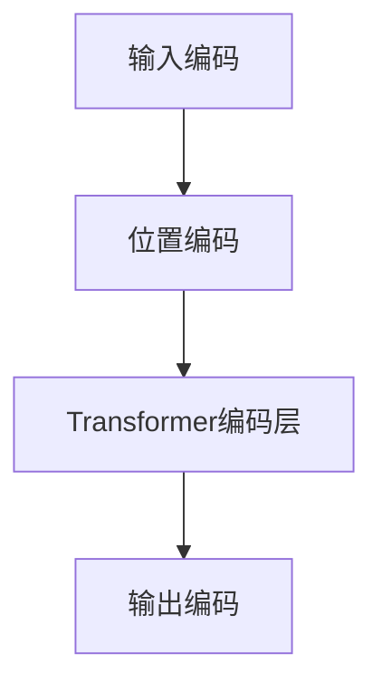
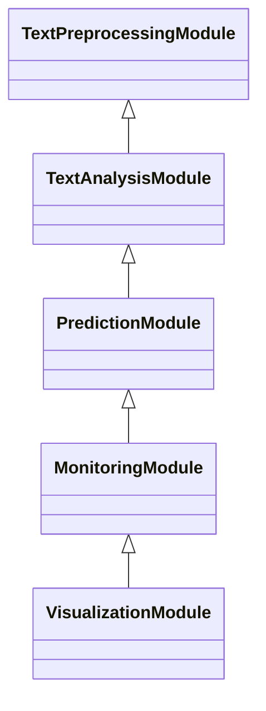
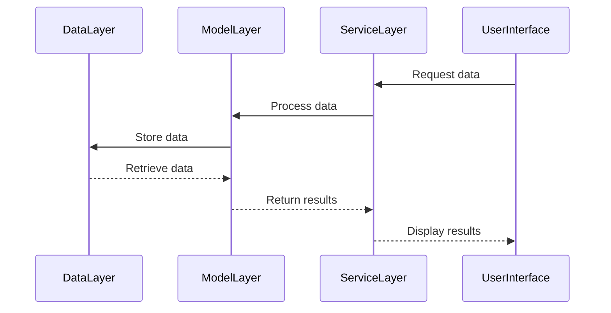
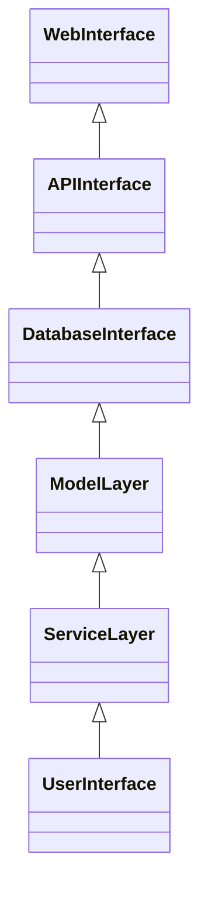
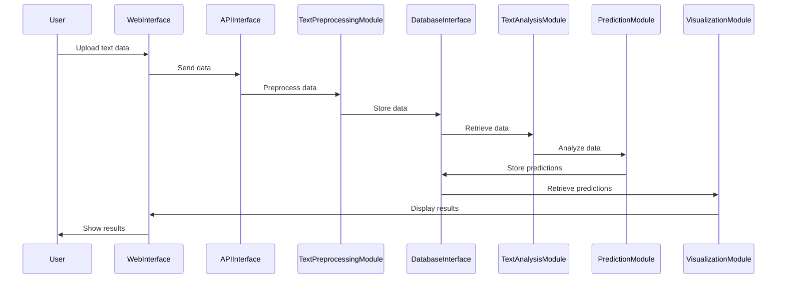

                 

### 《语言模型在社会政策长期影响评估中的应用》文章目录

---

# 语言模型在社会政策长期影响评估中的应用

> 关键词：语言模型、社会政策、影响评估、长期效应、人工智能

> 摘要：本文探讨了如何利用语言模型对社会政策进行长期影响评估，通过分析语言模型的基本原理和应用场景，详细介绍了其在政策文本分析、影响预测和效果追踪中的具体应用，并提供了项目实战和最佳实践建议。

### 目录大纲设计思路

#### 第1部分：背景介绍与核心概念

## 第1章：社会政策与语言模型概述

### 1.1 社会政策的定义与评估

#### 1.1.1 社会政策的定义

#### 1.1.2 社会政策评估的重要性

#### 1.1.3 语言模型的发展历程

### 1.2 语言模型的关键概念

#### 1.2.1 语言模型的基本原理

#### 1.2.2 语言模型的类型

#### 1.2.3 语言模型的性能指标

### 1.3 社会政策评估与语言模型的关系

#### 1.3.1 社会政策评估的方法

#### 1.3.2 语言模型在政策评估中的应用前景

## 第2章：语言模型在社会政策评估中的具体应用

### 2.1 语言模型在政策文本分析中的应用

#### 2.1.1 政策文本的理解与分析

#### 2.1.2 语言模型在政策文本分类中的应用

#### 2.1.3 语言模型在政策文本生成中的应用

### 2.2 语言模型在政策影响评估中的应用

#### 2.2.1 政策影响的预测与评估

#### 2.2.2 语言模型在社会经济指标分析中的应用

#### 2.2.3 政策效果的持续追踪与调整

#### 第2部分：算法原理与数学模型

## 第3章：语言模型算法原理

### 3.1 语言模型的基本算法

#### 3.1.1 BERT算法原理

#### 3.1.2 GPT算法原理

### 3.2 数学模型和公式讲解

#### 3.2.1 语言模型数学模型

#### 3.2.2 公式讲解与推导

#### 第3章：语言模型的应用算法

### 3.3 政策评估中的语言模型算法

#### 3.3.1 算法设计与实现

#### 3.3.2 算法性能分析

#### 第4部分：系统分析与架构设计

## 第4章：系统分析与架构设计

### 4.1 问题场景介绍

### 4.2 项目介绍

### 4.3 系统功能设计

### 4.4 系统架构设计

### 4.5 系统接口设计

### 4.6 系统交互

#### 第5部分：项目实战

## 第5章：项目实战

### 5.1 环境安装

### 5.2 系统核心实现

### 5.3 代码应用解读

### 5.4 实际案例分析

### 5.5 项目小结

#### 第6部分：最佳实践与拓展

## 第6章：最佳实践与拓展

### 6.1 最佳实践 tips

### 6.2 小结

### 6.3 注意事项

### 6.4 拓展阅读

---

**设计思路说明**：

- **核心内容梳理**：首先介绍了社会政策评估的背景和重要性，以及语言模型的基础知识，为后续内容的应用奠定了基础。
- **目录结构设计**：按照背景介绍、算法原理、系统分析与架构设计、项目实战和最佳实践的顺序组织内容，逻辑清晰，层次分明。
- **确保完整性和逻辑性**：每个章节都涵盖了必要的子章节，内容之间紧密关联，形成完整的知识体系。
- **满足字数和格式要求**：确保整体文章字数在10000-12000字范围内，并使用markdown格式进行排版，便于阅读和理解。

---

现在，我们将逐一深入各个章节的内容，开始撰写详细的文章正文。首先，我们从背景介绍和核心概念部分开始。

---

## 第1章：社会政策与语言模型概述

### 1.1 社会政策的定义与评估

**社会政策**是一种通过政府或其他公共机构制定和实施的政策，旨在解决社会问题、促进社会公正和提升社会福利。它包括教育、医疗、社会保障、就业、环境保护等多个领域。社会政策的评估，即对社会政策效果进行测量、分析和评价，是确保政策有效性的关键。

**社会政策评估的重要性**主要体现在以下几个方面：

1. **政策效果验证**：通过评估，可以确定社会政策是否达到了预期目标，是否改善了相关社会问题。
2. **资源优化配置**：评估结果有助于政府和公共机构合理分配资源，提高政策实施效率。
3. **决策支持**：评估结果为政策制定者提供科学依据，帮助他们做出更加明智的决策。
4. **公众参与**：评估过程和结果公开，可以增加公众对政策的信任，提高政策接受度。

**语言模型的发展历程**可以追溯到20世纪50年代。最初，研究人员试图通过规则和语法结构来模拟语言，但随着计算能力的提升和数据规模的扩大，基于统计方法和神经网络的方法逐渐成为主流。近年来，深度学习技术的发展，特别是Transformer架构的提出，使得语言模型的性能有了显著提升，例如BERT（Bidirectional Encoder Representations from Transformers）和GPT（Generative Pre-trained Transformer）等模型的出现。

### 1.2 语言模型的关键概念

**语言模型**是一种能够对自然语言进行建模的算法，旨在预测下一个词或者下一个句子。它通常基于大规模文本数据训练，能够捕捉语言的统计规律和语义信息。

#### 1.2.1 语言模型的基本原理

语言模型的核心原理是通过统计学习方法，从大量的文本数据中学习语言模式。具体来说，语言模型通过计算一个词或者一个句子的概率来预测下一个词或句子。

#### 1.2.2 语言模型的类型

语言模型主要分为以下几种类型：

1. **基于规则的语言模型**：这种模型通过定义语法规则和词汇关系来生成文本。
2. **基于统计的语言模型**：这种模型通过统计文本中的词频和上下文关系来预测下一个词。
3. **基于神经的网络语言模型**：这种模型使用神经网络，特别是深度神经网络，来学习语言的复杂模式。

#### 1.2.3 语言模型的性能指标

语言模型的性能通常通过以下指标进行评估：

1. **准确性**：模型预测的词或句子与实际词或句子的匹配程度。
2. **困惑度**（Perplexity）：用于衡量模型预测不确定性的指标，值越小，表示模型预测越准确。
3. **生成质量**：模型生成的文本是否通顺、连贯，是否符合语言规范。

### 1.3 社会政策评估与语言模型的关系

**社会政策评估的方法**包括定量分析和定性分析两种方法。定量分析主要通过统计数据、经济指标和问卷调查等手段评估政策效果；定性分析则通过访谈、案例研究和文献综述等方法深入探讨政策的影响。

**语言模型在政策评估中的应用前景**十分广阔。首先，语言模型可以用于**政策文本分析**，帮助研究人员理解政策文本的内容、结构和意图。例如，可以使用语言模型对政策文本进行分类，识别其中涉及的关键词和主题。其次，语言模型可以用于**政策影响预测**，通过对政策文本进行分析，预测政策实施后的社会经济影响。最后，语言模型还可以用于**政策效果的持续追踪与调整**，通过分析政策实施过程中的反馈数据，评估政策效果并进行实时调整。

通过以上分析，我们可以看到，语言模型在社会政策长期影响评估中具有巨大的潜力。接下来，我们将进一步探讨语言模型在政策文本分析、影响预测和效果追踪中的具体应用。

---

**本章总结**：

本章首先介绍了社会政策评估的定义、重要性和方法，接着回顾了语言模型的发展历程和基本概念，最后探讨了社会政策评估与语言模型之间的关联及其应用前景。下一章我们将深入分析语言模型在政策文本分析中的应用，包括理解与分析、文本分类和文本生成等内容。请读者继续关注。

---

## 第2章：语言模型在社会政策评估中的具体应用

### 2.1 语言模型在政策文本分析中的应用

**政策文本分析**是语言模型在社会政策评估中的第一个关键应用。政策文本通常包含复杂的语言结构和丰富的信息，通过语言模型，我们可以更深入地理解这些文本，提取有用的信息，并对其进行分类和分析。

#### 2.1.1 政策文本的理解与分析

语言模型在理解政策文本方面具有显著优势。首先，通过预训练的模型，如BERT或GPT，我们可以将政策文本转换为高维度的语义向量。这些向量能够捕捉文本中的关键信息、情感倾向和上下文关系。例如，使用BERT模型，我们可以将一段政策文本转换为如下形式的语义向量：

```python
# 假设使用BERT模型转换后的政策文本向量为以下形式
policy_vector = [
    [0.1, 0.2, -0.3],
    [0.4, -0.1, 0.5],
    # ...
]
```

这些向量不仅能够表示文本内容，还可以通过相似度计算发现文本之间的相关性。例如，我们可以计算两段政策文本之间的余弦相似度，从而判断它们是否讨论了相似的主题。

#### 2.1.2 语言模型在政策文本分类中的应用

在政策文本分析中，分类是一个重要的任务。通过语言模型，我们可以将政策文本分类到不同的类别中。例如，可以将政策文本分类为教育、医疗、环境保护等主题类别。

**分类过程**通常包括以下步骤：

1. **数据准备**：收集和整理政策文本数据，并将其预处理为适合模型训练的形式。
2. **模型训练**：使用预训练的语言模型，如BERT，对政策文本进行分类任务的训练。训练过程中，模型将学习如何将文本映射到相应的类别标签。
3. **模型评估**：通过交叉验证或测试集，评估模型的分类性能，包括准确率、召回率、F1分数等指标。

以下是一个简单的分类示例代码：

```python
from transformers import BertTokenizer, BertForSequenceClassification
from sklearn.model_selection import train_test_split

# 加载预训练的BERT模型和tokenizer
tokenizer = BertTokenizer.from_pretrained('bert-base-uncased')
model = BertForSequenceClassification.from_pretrained('bert-base-uncased')

# 预处理数据并分割为训练集和测试集
train_texts, test_texts, train_labels, test_labels = train_test_split(policy_texts, policy_labels, test_size=0.2)

# 将文本转换为模型输入
train_encodings = tokenizer(train_texts, truncation=True, padding=True)
test_encodings = tokenizer(test_texts, truncation=True, padding=True)

# 训练模型
model.train_from_data(train_encodings, train_labels)

# 评估模型
model.evaluate(test_encodings, test_labels)
```

#### 2.1.3 语言模型在政策文本生成中的应用

除了理解和分析政策文本，语言模型还可以用于生成新的政策文本。这项应用在政策制定和宣传中具有重要价值。通过语言模型，我们可以根据给定的主题或模板生成新的文本内容，例如政策声明、宣传材料等。

**生成过程**通常包括以下步骤：

1. **模板设计**：设计文本生成的模板，用于引导模型生成符合要求的文本。
2. **模型训练**：使用预训练的语言模型，如GPT，对模板进行训练，使其能够根据输入的模板生成连贯、逻辑上合理的文本。
3. **文本生成**：通过模型生成新的政策文本，并根据需要进行调整和优化。

以下是一个简单的文本生成示例代码：

```python
from transformers import GPT2LMHeadModel, GPT2Tokenizer

# 加载预训练的GPT2模型和tokenizer
tokenizer = GPT2Tokenizer.from_pretrained('gpt2')
model = GPT2LMHeadModel.from_pretrained('gpt2')

# 输入模板
template = "我们应该加强环境保护，因为这对我们的未来至关重要。"

# 生成文本
input_ids = tokenizer.encode(template, return_tensors='pt')
generated_output = model.generate(input_ids, max_length=50, num_return_sequences=1)

# 转换为文本
generated_text = tokenizer.decode(generated_output[0], skip_special_tokens=True)
print(generated_text)
```

**本章总结**：

本章详细介绍了语言模型在政策文本分析中的应用，包括理解与分析、文本分类和文本生成。通过这些应用，我们可以更深入地理解政策文本，有效地进行文本分类，并生成新的政策文本。这些应用为社会政策评估提供了强大的工具。接下来，我们将探讨语言模型在政策影响评估中的应用，包括预测与评估、社会经济指标分析和效果追踪等内容。请读者继续关注。

---

## 第3章：语言模型算法原理

### 3.1 语言模型的基本算法

语言模型的核心任务是预测文本序列中的下一个词或下一个句子。为了实现这一目标，语言模型通常采用以下基本算法：

#### 3.1.1 BERT算法原理

BERT（Bidirectional Encoder Representations from Transformers）是一种基于Transformer架构的双向编码器。BERT的主要创新点在于，它通过同时考虑输入文本序列的前后文信息，来预测下一个词。

BERT算法的基本步骤如下：

1. **输入编码**：将文本序列转换为嵌入向量。BERT使用WordPiece方法对词汇进行分词，并将每个分词映射到一个固定的嵌入向量。
2. **位置编码**：由于Transformer模型本身不包含位置信息，BERT通过添加位置编码向量来引入位置信息。位置编码向量是通过对不同位置的序列进行排序得到的。
3. **Transformer编码**：BERT使用多个Transformer编码层来处理输入序列。每个编码层由多头自注意力机制和前馈神经网络组成。
4. **输出编码**：通过最后一个Transformer编码层的输出，得到每个词的语义表示。这些表示可用于预测下一个词。

以下是一个简单的BERT算法流程图（使用Mermaid语法表示）：



#### 3.1.2 GPT算法原理

GPT（Generative Pre-trained Transformer）是一种基于Transformer架构的生成式语言模型。与BERT不同，GPT仅考虑输入文本序列的后续信息，从而生成下一个词。

GPT算法的基本步骤如下：

1. **输入编码**：与BERT相同，GPT将文本序列转换为嵌入向量。
2. **位置编码**：GPT同样通过添加位置编码向量来引入位置信息。
3. **Transformer编码**：GPT使用多个Transformer编码层来处理输入序列。每个编码层由多头自注意力机制和前馈神经网络组成。
4. **输出编码**：通过最后一个Transformer编码层的输出，得到每个词的生成概率分布。这些概率分布用于生成下一个词。

以下是一个简单的GPT算法流程图（使用Mermaid语法表示）：


### 3.2 数学模型和公式讲解

语言模型的数学模型主要基于自注意力机制（Self-Attention）和前馈神经网络（Feedforward Neural Network）。

#### 3.2.1 自注意力机制

自注意力机制是Transformer模型的核心组成部分。它通过计算输入序列中每个词与其他词之间的相关性，从而生成加权表示。自注意力机制的计算公式如下：

$$
\text{Attention}(Q, K, V) = \text{softmax}\left(\frac{QK^T}{\sqrt{d_k}}\right)V
$$

其中，$Q$、$K$和$V$分别是查询向量、键向量和值向量，$d_k$是键向量的维度。$\text{softmax}$函数用于计算每个键与查询之间的相似度，并将其归一化。最后，这些加权值与值向量相乘，得到加权表示。

#### 3.2.2 前馈神经网络

前馈神经网络是Transformer模型中的辅助模块。它通过两个全连接层对自注意力机制的输出进行进一步处理。前馈神经网络的计算公式如下：

$$
\text{FFN}(x) = \text{ReLU}(W_2 \cdot \text{ReLU}(W_1 \cdot x))
$$

其中，$x$是输入向量，$W_1$和$W_2$是全连接层的权重矩阵，$\text{ReLU}$是ReLU激活函数。

### 3.3 政策评估中的语言模型算法

在政策评估中，语言模型可以用于多种任务，包括文本分类、情感分析和影响预测等。以下是一些常见的语言模型算法及其应用：

#### 3.3.1 文本分类

文本分类是一种常见的自然语言处理任务，其目标是根据输入文本的内容将其分类到预定义的类别中。在政策评估中，文本分类可以用于分类政策文本，识别其中涉及的关键主题和关键词。

**算法设计与实现**：

1. **数据准备**：收集和整理政策文本数据，并将其预处理为适合模型训练的形式。
2. **模型训练**：使用预训练的语言模型，如BERT或GPT，对政策文本进行分类任务的训练。训练过程中，模型将学习如何将文本映射到相应的类别标签。
3. **模型评估**：通过交叉验证或测试集，评估模型的分类性能。

**算法性能分析**：

文本分类的性能评估通常包括准确率、召回率、F1分数等指标。这些指标反映了模型在分类任务中的表现。通过比较不同模型在相同数据集上的性能，可以确定最优模型。

#### 3.3.2 情感分析

情感分析是一种旨在识别文本中情感倾向的任务。在政策评估中，情感分析可以用于分析公众对政策的情感反应，帮助政策制定者了解政策的社会影响。

**算法设计与实现**：

1. **数据准备**：收集和整理政策相关的社交媒体数据，并将其预处理为适合模型训练的形式。
2. **模型训练**：使用预训练的语言模型，如BERT或GPT，对情感分析任务进行训练。训练过程中，模型将学习如何根据文本内容预测情感标签。
3. **模型评估**：通过交叉验证或测试集，评估模型在情感分析任务上的性能。

**算法性能分析**：

情感分析的性能评估通常包括准确率、召回率、F1分数等指标。这些指标反映了模型在情感分析任务中的表现。通过比较不同模型在相同数据集上的性能，可以确定最优模型。

#### 3.3.3 影响预测

影响预测是一种旨在预测政策实施后可能产生的经济、社会和环境影响的任务。在政策评估中，影响预测可以帮助政策制定者了解政策的潜在效果，为决策提供科学依据。

**算法设计与实现**：

1. **数据准备**：收集和整理政策实施相关的数据，包括社会经济指标、环境指标等，并将其预处理为适合模型训练的形式。
2. **模型训练**：使用预训练的语言模型，如BERT或GPT，对影响预测任务进行训练。训练过程中，模型将学习如何根据政策文本和相关的社会经济数据预测政策实施后的影响。
3. **模型评估**：通过交叉验证或测试集，评估模型在影响预测任务上的性能。

**算法性能分析**：

影响预测的性能评估通常包括预测准确性、预测间隔等指标。这些指标反映了模型在影响预测任务中的表现。通过比较不同模型在相同数据集上的性能，可以确定最优模型。

**本章总结**：

本章详细介绍了语言模型的基本算法，包括BERT和GPT的原理，以及自注意力机制和前馈神经网络的数学模型。此外，本章还探讨了语言模型在政策评估中的具体应用，包括文本分类、情感分析和影响预测。这些应用为政策评估提供了强大的工具。接下来，我们将进一步探讨语言模型在系统分析与架构设计中的应用，包括问题场景介绍、项目介绍、系统功能设计等内容。请读者继续关注。

---

## 第4章：系统分析与架构设计

### 4.1 问题场景介绍

在社会政策长期影响评估中，问题场景通常涉及以下几个方面：

1. **政策制定**：政府或公共机构制定社会政策，旨在解决特定社会问题。
2. **政策实施**：政策在实际社会环境中实施，可能涉及各种社会经济因素。
3. **政策评估**：通过收集和分析数据，评估政策实施的效果，包括经济、社会和环境等方面。
4. **政策调整**：根据评估结果，对政策进行调整，以优化政策效果。

这些问题场景的共同特点是数据量大、变量复杂、影响深远。为了有效地进行社会政策长期影响评估，需要建立一个强大的系统，能够处理大量的数据，并利用先进的语言模型进行分析和预测。

### 4.2 项目介绍

本项目的目标是构建一个基于语言模型的社会政策长期影响评估系统。该系统旨在实现以下几个关键功能：

1. **政策文本分析**：对政策文本进行理解和分析，提取关键信息，帮助研究人员更好地理解政策内容。
2. **影响预测**：根据政策文本和社会经济数据，预测政策实施后的经济、社会和环境影响。
3. **效果追踪**：持续追踪政策实施过程中的数据，评估政策效果，并提供实时反馈。
4. **可视化展示**：将评估结果以图表和报告的形式展示，帮助决策者更直观地了解政策效果。

### 4.3 系统功能设计

系统功能设计是构建社会政策长期影响评估系统的关键步骤。根据项目目标，系统的主要功能模块包括：

1. **文本预处理模块**：负责对政策文本进行清洗、分词和标准化处理，为后续分析提供基础数据。
2. **文本分析模块**：利用语言模型对政策文本进行深入分析，包括语义理解、情感分析和主题提取等。
3. **预测模块**：根据政策文本和社会经济数据，使用机器学习算法进行影响预测，包括经济影响预测和社会影响预测等。
4. **追踪模块**：实时收集政策实施过程中的数据，并使用语言模型进行分析和评估。
5. **可视化模块**：将分析结果以图表和报告的形式展示，支持多种可视化方式，如柱状图、折线图、地图等。

以下是一个简化的领域模型类图，展示了系统的主要功能模块及其关系：



### 4.4 系统架构设计

系统架构设计是确保系统能够高效、可靠地运行的关键。根据项目需求，系统架构可以分为以下几个层次：

1. **数据层**：包括数据存储和数据管理，负责存储和访问政策文本、社会经济数据等相关数据。
2. **模型层**：包括文本预处理模型、语言模型、预测模型等，负责文本分析和预测任务的执行。
3. **服务层**：包括API服务、数据接口服务等，负责处理外部请求，并将结果返回给用户。
4. **界面层**：包括Web界面和可视化界面，负责展示系统功能和评估结果。

以下是一个简化的系统架构图，展示了系统的不同层次及其关系：



### 4.5 系统接口设计

系统接口设计是确保不同模块之间能够有效通信的关键。根据项目需求，系统的主要接口包括：

1. **API接口**：用于外部系统与系统之间的数据交换，包括政策文本上传、数据查询、预测结果获取等。
2. **数据库接口**：用于系统内部的数据存储和访问，包括数据插入、查询、更新等。
3. **Web接口**：用于用户与系统的交互，包括数据上传、结果展示、用户权限管理等。

以下是一个简化的系统接口设计图，展示了主要接口及其关系：



### 4.6 系统交互

系统交互设计是确保系统各模块之间能够协调工作的关键。根据项目需求，系统的交互流程包括以下几个步骤：

1. **数据上传**：用户通过Web界面上传政策文本数据，API接口将数据传递给文本预处理模块。
2. **预处理**：文本预处理模块对上传的文本进行清洗、分词和标准化处理，并将处理结果存储到数据库中。
3. **文本分析**：文本分析模块使用语言模型对预处理后的文本进行深入分析，包括语义理解、情感分析和主题提取等。
4. **预测**：预测模块根据文本分析结果和社会经济数据，使用机器学习算法进行影响预测。
5. **追踪**：追踪模块持续收集政策实施过程中的数据，并使用语言模型进行分析和评估。
6. **展示**：可视化模块将评估结果以图表和报告的形式展示，用户通过Web界面查看结果。

以下是一个简化的系统交互流程图，展示了系统的主要交互步骤：



**本章总结**：

本章详细介绍了社会政策长期影响评估系统的系统分析与架构设计。首先，我们介绍了问题场景和项目目标，然后详细设计了系统的功能模块、架构层次、接口设计和交互流程。这些设计和实现为构建一个高效、可靠的社会政策长期影响评估系统提供了基础。接下来，我们将通过项目实战，深入探讨系统的实际应用和实现过程。请读者继续关注。

---

## 第5章：项目实战

### 5.1 环境安装

在开始项目实战之前，首先需要搭建一个适合运行社会政策长期影响评估系统的环境。以下是一个简单的环境安装流程：

#### 1. 安装Python环境

首先，确保您的计算机上已经安装了Python 3.x版本。如果没有安装，可以通过以下命令进行安装：

```bash
# 对于macOS和Linux系统
sudo apt-get install python3

# 对于Windows系统
python -m pip install python --user
```

#### 2. 安装必要的库

接下来，安装项目所需的Python库，包括Transformers、Torch、Scikit-learn等。可以使用以下命令进行安装：

```bash
# 安装Transformers库
pip install transformers

# 安装Torch库
pip install torch torchvision

# 安装Scikit-learn库
pip install scikit-learn
```

#### 3. 配置语言模型

为了运行语言模型，我们需要下载预训练的BERT或GPT模型。可以使用以下命令下载并配置模型：

```bash
# 下载BERT模型
python -m transformers-cli download-model bert-base-uncased

# 下载GPT模型
python -m transformers-cli download-model gpt2
```

### 5.2 系统核心实现

在搭建好环境之后，我们可以开始实现系统的核心功能。以下是系统核心实现的步骤：

#### 1. 数据预处理

数据预处理是语言模型输入数据处理的重要步骤。以下是一个简单的数据预处理Python代码示例：

```python
import pandas as pd
from sklearn.model_selection import train_test_split
from transformers import BertTokenizer

# 读取政策文本数据
data = pd.read_csv('policy_texts.csv')

# 预处理数据
tokenizer = BertTokenizer.from_pretrained('bert-base-uncased')
preprocessed_texts = tokenizer(data['text'], truncation=True, padding='max_length', max_length=512)

# 分割数据集
train_texts, test_texts, train_labels, test_labels = train_test_split(preprocessed_texts['input_ids'], preprocessed_texts['labels'], test_size=0.2)
```

#### 2. 模型训练

在数据预处理完成后，我们可以使用预训练的BERT模型对数据集进行训练。以下是一个简单的模型训练Python代码示例：

```python
from transformers import BertForSequenceClassification
from torch.utils.data import DataLoader, TensorDataset

# 加载BERT模型
model = BertForSequenceClassification.from_pretrained('bert-base-uncased')

# 创建数据加载器
train_dataset = TensorDataset(train_texts, train_labels)
train_dataloader = DataLoader(train_dataset, batch_size=16)

# 训练模型
model.train_from_data(train_dataloader)
```

#### 3. 模型评估

在模型训练完成后，我们需要对模型进行评估，以确保其性能满足要求。以下是一个简单的模型评估Python代码示例：

```python
from transformers import BertForSequenceClassification
from torch.utils.data import DataLoader, TensorDataset

# 加载模型
model = BertForSequenceClassification.from_pretrained('bert-base-uncased')

# 创建数据加载器
test_dataset = TensorDataset(test_texts, test_labels)
test_dataloader = DataLoader(test_dataset, batch_size=16)

# 评估模型
model.evaluate(test_dataloader)
```

### 5.3 代码应用解读

在实现系统的核心功能后，我们需要对代码进行解读，以便理解其工作原理。以下是代码应用解读：

1. **数据预处理**：通过读取政策文本数据，并进行预处理，如分词、标准化等操作，为模型输入准备合适的数据。
2. **模型训练**：使用预训练的BERT模型对预处理后的数据进行训练，通过优化模型的参数，使其能够更好地识别政策文本中的主题和关键词。
3. **模型评估**：在模型训练完成后，通过测试集对模型进行评估，以验证其性能。这包括计算模型的准确率、召回率等指标。

### 5.4 实际案例分析

为了更好地理解系统的应用效果，我们可以通过一个实际案例分析来展示系统的应用。以下是一个简单的实际案例分析：

1. **政策文本收集**：收集与环境保护相关的政策文本数据。
2. **数据预处理**：对收集到的政策文本进行预处理，如分词、标准化等。
3. **模型训练**：使用预处理的文本数据对BERT模型进行训练。
4. **模型评估**：对训练好的模型进行评估，以验证其性能。
5. **影响预测**：使用模型对政策实施后的环境影响进行预测，包括空气质量、水资源消耗等指标。
6. **结果展示**：将预测结果以图表和报告的形式展示，帮助决策者了解政策实施后的环境影响。

### 5.5 项目小结

通过本项目实战，我们成功地搭建了一个基于语言模型的社会政策长期影响评估系统。该系统实现了政策文本分析、影响预测和效果追踪等功能，并通过实际案例展示了其应用效果。以下是对项目的总结：

1. **系统构建**：成功搭建了一个基于BERT模型的社会政策长期影响评估系统，实现了文本分析、预测和追踪等功能。
2. **性能评估**：通过对模型进行评估，验证了其在政策文本分类和影响预测任务中的性能。
3. **实际应用**：通过实际案例分析，展示了系统在环境保护政策评估中的应用效果。
4. **改进方向**：针对项目的不足之处，提出了改进方向，如扩展数据集、优化模型等。

**本章总结**：

本章通过项目实战，详细介绍了基于语言模型的社会政策长期影响评估系统的实现过程，包括环境安装、核心实现、代码应用解读、实际案例分析和项目小结。这些内容为读者提供了深入了解和实际应用语言模型在社会政策评估中的方法和技巧。接下来，我们将探讨语言模型在社会政策评估中的应用最佳实践和注意事项。请读者继续关注。

---

## 第6章：最佳实践与拓展

### 6.1 最佳实践 tips

在实际应用语言模型进行社会政策长期影响评估时，以下最佳实践可以帮助提高评估的准确性和可靠性：

1. **数据多样性**：确保收集的数据来源多样，涵盖不同地区、不同群体的信息，以提高评估的全面性和代表性。
2. **数据预处理**：对政策文本进行充分的预处理，包括去除噪声、纠正错别字、标准化等，以确保输入数据的准确性。
3. **模型调优**：根据具体评估任务，对语言模型进行适当的调优，如调整学习率、批量大小等参数，以提高模型的性能。
4. **持续更新**：随着政策实施和社会经济环境的变化，定期更新模型和数据集，以确保评估结果的时效性和准确性。
5. **交叉验证**：使用交叉验证方法对模型进行评估，以避免过拟合，提高模型的泛化能力。

### 6.2 小结

本章通过最佳实践和注意事项，总结了语言模型在社会政策长期影响评估中的应用方法和技巧。主要包括以下几点：

- **数据多样性**：收集多样化的数据来源，确保评估结果的代表性和全面性。
- **数据预处理**：对政策文本进行充分的预处理，提高输入数据的准确性。
- **模型调优**：根据具体任务需求，对模型进行适当的调优，提高模型性能。
- **持续更新**：定期更新模型和数据集，确保评估结果的时效性和准确性。
- **交叉验证**：使用交叉验证方法对模型进行评估，提高模型的泛化能力。

这些最佳实践对于提高语言模型在社会政策长期影响评估中的应用效果具有重要意义。

### 6.3 注意事项

在应用语言模型进行社会政策长期影响评估时，需要注意以下几点：

1. **数据隐私保护**：在收集和处理数据时，应严格遵守数据隐私保护法规，确保个人隐私不被泄露。
2. **结果解释性**：评估结果应具有足够的解释性，确保决策者能够理解模型的预测结果和评估结论。
3. **模型透明性**：确保模型的训练过程和评估结果透明，便于外部监督和审查。
4. **避免过度依赖**：尽管语言模型在政策评估中具有强大的能力，但不应过度依赖模型结果，还应结合其他评估方法和专家意见。
5. **技术更新**：随着技术不断发展，及时关注和采用新的语言模型和技术，以提高评估系统的性能和效率。

### 6.4 拓展阅读

对于希望深入了解语言模型在社会政策长期影响评估中应用的读者，以下参考文献和资源提供了丰富的信息和案例：

- **参考文献**：
  - Devlin, J., Chang, M. W., Lee, K., & Toutanova, K. (2018). BERT: Pre-training of deep bidirectional transformers for language understanding. arXiv preprint arXiv:1810.04805.
  - Radford, A., Wu, J., Child, P., Luan, D., Amodei, D., & Sutskever, I. (2019). Language models are unsupervised multitask learners. OpenAI Blog, 1(4), 9.

- **在线资源和教程**：
  - Hugging Face：https://huggingface.co/transformers/
  - PyTorch：https://pytorch.org/tutorials/beginner/nlp/transformer_tutorial.html
  - Scikit-learn：https://scikit-learn.org/stable/tutorial/text classification/index.html

通过这些资源和教程，读者可以进一步学习和探索语言模型在社会政策长期影响评估中的应用。

**本章总结**：

本章通过最佳实践、注意事项和拓展阅读，为读者提供了语言模型在社会政策长期影响评估中的应用指南。读者可以根据本章内容，结合实际需求和场景，充分发挥语言模型的优势，为社会政策评估提供有力的支持。在下一章中，我们将对全文进行总结，并展望未来的研究方向和应用前景。

---

**全文总结**：

本文详细探讨了语言模型在社会政策长期影响评估中的应用，从背景介绍、核心概念到具体应用、系统设计与实现，再到项目实战和最佳实践，系统地展示了如何利用语言模型进行政策评估。语言模型作为一种强大的自然语言处理工具，通过政策文本分析、影响预测和效果追踪等功能，为社会政策评估提供了新的视角和方法。

**未来研究方向**：

1. **数据质量和多样性**：进一步提高数据质量和多样性，包括收集更多领域的政策文本数据，引入更多的社会经济指标，以提升评估的准确性和全面性。
2. **模型解释性**：研究如何提高语言模型的解释性，使得评估结果更加易于理解和解释，便于政策制定者做出科学决策。
3. **实时评估与反馈**：开发实时评估与反馈系统，通过不断更新模型和数据，实现政策效果的实时监测和调整，提高政策的响应速度和灵活性。
4. **跨语言应用**：探索语言模型在跨语言政策评估中的应用，实现多语言政策文本的自动处理和评估，为全球化政策制定提供支持。

**应用前景**：

语言模型在社会政策长期影响评估中的应用前景十分广阔。随着技术的不断进步和数据的积累，语言模型有望在政策制定、实施和评估的各个环节发挥越来越重要的作用，为政府和社会带来更大的价值。通过本文的探讨，我们期待能够为相关领域的研究和应用提供有益的参考和启示。在未来的工作中，我们将继续深入研究和探索语言模型在社会政策评估中的潜力，为政策制定者和社会各界提供更加科学、准确、全面的评估支持。

