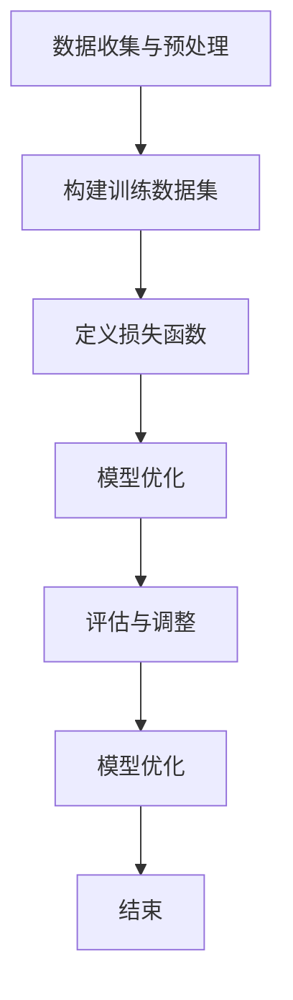
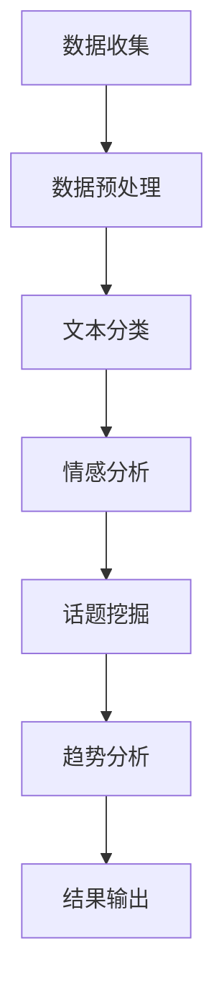
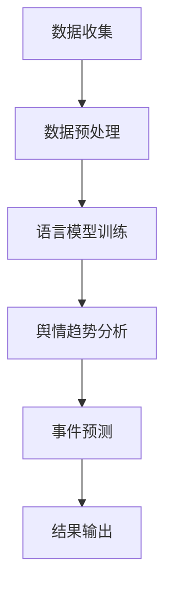

                 

# 《语言模型在社会舆情分析与预测中的应用研究》

## 摘要

本文旨在探讨语言模型在社会舆情分析与预测中的广泛应用及其潜在的重要性。随着互联网和社交媒体的快速发展，社会舆情的信息量日益庞大，传统方法已难以应对。而语言模型，作为一种强大的自然语言处理工具，能够高效地处理和解析海量文本数据，从而为社会舆情分析提供了新的思路和方法。本文首先介绍了社会舆情的概念及其重要性，然后详细阐述了语言模型的基础知识，包括其基本概念、核心算法和训练与优化方法。接着，本文分析了语言模型在社会舆情分析中的应用，如文本分类、情感分析和话题挖掘等。在此基础上，本文进一步探讨了语言模型在社会舆情预测中的潜力，包括舆情趋势预测、事件预测等。最后，本文指出了语言模型在社会舆情预测中面临的挑战，并提出了未来研究的方向。

## 引言与背景

### 社会舆情的概念

社会舆情是指在一定时间、一定范围内，公众对于特定事件、问题或现象的公共认知、态度和情绪。它反映了社会公众的集体意识和行为倾向，具有广泛性和动态性。社会舆情可以从多个角度进行分析，如政治、经济、文化、科技等。在不同领域，社会舆情具有不同的表现形式，如公众对政府政策的讨论、对经济形势的评论、对文化现象的评价等。

### 社会舆情分析的重要性

社会舆情分析对于政府、企业和社会各界具有重要意义。首先，政府可以通过社会舆情了解公众的需求和诉求，从而制定更加科学合理的政策和措施。例如，通过分析网络上的民意，政府可以及时发现和解决社会问题，提高政府的公信力和执政能力。其次，企业可以通过社会舆情分析了解消费者的需求和偏好，从而优化产品和服务，提高市场竞争力。例如，通过分析社交媒体上的用户评论，企业可以迅速响应消费者的反馈，改进产品设计和营销策略。此外，社会舆情分析还可以帮助社会组织和公众更好地了解社会动态，促进社会和谐与进步。

### 语言模型的发展历程

语言模型是指能够对自然语言进行建模和处理的计算机算法。其历史可以追溯到20世纪50年代，当时研究人员开始探索如何让计算机理解和生成自然语言。早期的语言模型主要基于统计学方法，如N-gram模型，它通过统计相邻单词出现的频率来预测下一个单词。然而，随着自然语言处理技术的不断发展，深度学习技术的引入，语言模型得到了极大的提升。近年来，基于神经网络的深度语言模型，如Transformer模型和BERT模型，已经成为自然语言处理领域的主流方法。

### 语言模型在社会舆情分析中的潜在应用

语言模型在社会舆情分析中具有广泛的应用前景。首先，语言模型可以用于文本分类，将海量文本数据分为不同的类别，如正面、负面或中立。这有助于快速识别和筛选舆情信息，为后续分析提供基础。其次，语言模型可以用于情感分析，判断文本的情感倾向，如喜悦、愤怒或悲伤。这有助于了解公众对特定事件或问题的情绪反应，为舆情应对提供参考。此外，语言模型还可以用于话题挖掘，识别文本中的主要话题和关键词，揭示舆情的热点和趋势。这些应用为社会舆情分析提供了强大的工具，有助于深入理解和预测社会舆情的发展动态。

## 语言模型的基础知识

### 语言模型的定义

语言模型（Language Model，LM）是一种概率模型，用于预测一段文本的下一个单词或字符。它是一种统计模型，通常基于大量语料库训练得到。语言模型的核心目标是减少信息熵，即通过已知的输入文本序列，预测下一个最可能的输出单词或字符。在自然语言处理（NLP）中，语言模型是许多应用的基础，如机器翻译、语音识别、文本生成等。

### 语言模型的类型

语言模型的类型可以根据其方法和技术进行分类。主要可以分为以下几种类型：

1. **基于统计学的语言模型**：这类模型通过统计文本中的单词或字符出现的频率来预测下一个单词或字符。N-gram模型是最著名的基于统计学的语言模型，它假设相邻单词或字符之间的关系只取决于前N个单词或字符。

2. **基于神经网络的深度语言模型**：这类模型通过多层神经网络来建模语言。近年来，深度学习技术的发展使得基于神经网络的深度语言模型（如Transformer、BERT等）取得了显著的成果，并在各种NLP任务中得到了广泛应用。

3. **混合模型**：结合了统计学方法和神经网络方法的混合模型，旨在结合两者的优点，提高模型的性能。

### 语言模型的训练与优化

语言模型的训练过程通常包括以下几个步骤：

1. **数据收集与预处理**：收集大量文本数据，并进行预处理，如分词、去停用词、词干提取等。

2. **构建训练数据集**：将预处理后的文本数据分为训练集和验证集。

3. **定义损失函数**：常用的损失函数包括交叉熵损失（Cross-Entropy Loss）和负对数似然损失（Negative Log Likelihood Loss）。

4. **模型优化**：使用梯度下降（Gradient Descent）或其他优化算法来最小化损失函数。

5. **评估与调整**：在验证集上评估模型性能，并根据需要调整模型参数。

### 语言模型的评估与改进

语言模型的评估通常基于以下指标：

1. **准确率（Accuracy）**：预测正确的样本数占总样本数的比例。

2. **精确率（Precision）**：预测为正类的样本中，实际为正类的比例。

3. **召回率（Recall）**：实际为正类的样本中，被预测为正类的比例。

4. **F1分数（F1 Score）**：精确率和召回率的调和平均值。

为了提高语言模型的性能，可以采用以下方法：

1. **数据增强**：通过增加数据量、变换数据等方式提高模型的泛化能力。

2. **模型调整**：调整模型结构、优化超参数等，以减少过拟合。

3. **迁移学习**：使用预训练模型（如BERT、GPT等）进行微调，以适应特定任务。

4. **多模型融合**：结合多个模型的预测结果，提高整体性能。

### 语言模型的mermaid流程图与Python代码实现

以下是一个简单的语言模型训练的mermaid流程图：



下面是一个简单的Python代码示例，用于实现一个简单的语言模型：

```python
import numpy as np

# 假设我们有一个简单的文本数据集
data = ["hello world", "hello ai", "ai is amazing"]

# 数据预处理
words = set(''.join(data))
word_to_id = {word: i for i, word in enumerate(words)}
id_to_word = {i: word for word, i in word_to_id.items()}
data_encoded = [[word_to_id[char] for char in sentence] for sentence in data]

# 构建训练数据集
train_data, train_labels = [], []
for sentence in data_encoded:
    for i in range(len(sentence) - 1):
        train_data.append(sentence[i])
        train_labels.append(sentence[i + 1])

# 定义损失函数
def cross_entropy_loss(logits, labels):
    return -np.mean(np.log(logits[labels]))

# 模型优化
model = np.random.rand(len(words))
for epoch in range(100):
    for input, label in zip(train_data, train_labels):
        logits = model[input]
        loss = cross_entropy_loss(logits, label)
        model -= 0.1 * (logits - label)

# 评估与调整
test_data = ["hello", "world", "ai"]
test_encoded = [word_to_id[char] for char in ''.join(test_data)]
predictions = [np.argmax(model[seq]) for seq in test_encoded]
print([id_to_word[pred] for pred in predictions])
```

这段代码简单地实现了基于统计学的语言模型，虽然它只是一个简单的示例，但它展示了语言模型的基本原理和实现过程。

## 社会舆情的概念与特性

### 社会舆情的定义

社会舆情是指在一定时间、一定范围内，公众对于特定事件、问题或现象的公共认知、态度和情绪。它是一种社会心理现象，反映了社会公众的集体意识和行为倾向。社会舆情通常通过媒体、社交网络、论坛等渠道传播，是社会信息交流的重要形式之一。

### 社会舆情的主要特征

1. **广泛性**：社会舆情涉及社会生活的各个方面，如政治、经济、文化、科技等，其影响范围广泛。

2. **动态性**：社会舆情是不断变化的，它受到社会事件、媒体报道、公众情绪等多种因素的影响。

3. **多样性**：社会舆情表现出多样性，不同群体、不同地区、不同背景的公众可能会有不同的舆情观点和态度。

4. **主观性**：社会舆情往往带有强烈的主观色彩，公众的情感、态度和价值观会影响其对事件的判断。

5. **公共性**：社会舆情是公共信息的一部分，它反映了公众对社会现象的关注和讨论，具有一定的公共性。

### 社会舆情的分类与变化规律

1. **按主题分类**：社会舆情可以按主题进行分类，如政治舆情、经济舆情、文化舆情、科技舆情等。

2. **按传播渠道分类**：社会舆情可以按传播渠道进行分类，如传统媒体舆情、网络舆情、社交网络舆情等。

3. **按时间分类**：社会舆情可以按时间进行分类，如短期舆情、长期舆情等。

4. **按性质分类**：社会舆情可以按性质进行分类，如正面舆情、负面舆情、中立舆情等。

社会舆情的变化规律受多种因素影响，包括社会事件、媒体报道、公众情绪等。一般来说，社会舆情的变化具有以下规律：

1. **突发性事件**：重大突发事件（如自然灾害、政治动荡）会引起公众的高度关注，导致短期舆情波动。

2. **周期性事件**：某些周期性事件（如节假日、选举等）会引起公众的持续关注，形成长期舆情。

3. **媒体引导**：媒体对事件的报道和解读会影响公众的态度和观点，从而影响舆情走向。

4. **公众情绪**：公众的情绪状态（如兴奋、愤怒、焦虑等）会影响其对事件的反应，进而影响舆情。

通过对社会舆情的研究和分析，可以更好地理解公众的需求和诉求，为政府决策、企业营销和社会管理提供有力支持。语言模型在社会舆情分析中的应用，使得对海量舆情数据的处理和分析更加高效和准确。

## 语言模型在社会舆情分析中的应用

### 社会舆情分析的任务

社会舆情分析的主要任务是理解和分析公众的观点、态度和情绪，从而为政府决策、企业战略制定和社会管理提供数据支持。具体任务包括：

1. **舆情监测**：实时监测和跟踪社会舆情的变化，识别热点事件和新兴话题。

2. **情感分析**：判断文本的情感倾向，如正面、负面或中立。

3. **话题挖掘**：识别文本中的主要话题和关键词，揭示舆情的热点和趋势。

4. **趋势预测**：预测社会舆情的发展趋势，为未来决策提供参考。

### 语言模型在社会舆情分析中的应用场景

1. **文本分类**：利用语言模型对海量文本数据（如社交媒体评论、新闻文章等）进行分类，将文本分为不同类别，如正面、负面或中立。

2. **情感分析**：使用语言模型判断文本的情感倾向，例如，通过分析微博、论坛等平台上的用户评论，了解公众对某个事件的情感反应。

3. **话题挖掘**：通过语言模型识别文本中的主要话题和关键词，例如，分析新闻标题、社交媒体帖子等，挖掘公众关注的热点话题。

4. **趋势分析**：利用语言模型分析舆情数据，预测未来一段时间内舆情的发展趋势，例如，预测某个事件的影响范围和持续时间。

### 社会舆情分析的mermaid流程图与Python代码实现

以下是一个简单的mermaid流程图，展示了社会舆情分析的基本流程：



下面是一个简单的Python代码示例，用于实现文本分类和情感分析：

```python
import numpy as np
from sklearn.feature_extraction.text import CountVectorizer
from sklearn.naive_bayes import MultinomialNB

# 假设我们有一个简单的文本数据集
data = [
    "这次疫情很严重，需要加强防控措施。",
    "我认为疫苗是安全的，我们应该尽快接种。",
    "我对政府的新政策表示支持。",
    "我不喜欢这个规定，觉得太过严苛。"
]

# 数据预处理
vectorizer = CountVectorizer()
X = vectorizer.fit_transform(data)

# 文本分类
classifier = MultinomialNB()
y = np.array([0, 1, 0, 1])
classifier.fit(X, y)

# 情感分析
def analyze_sentiment(text):
    features = vectorizer.transform([text])
    prediction = classifier.predict(features)
    return "正面" if prediction[0] == 0 else "负面"

# 示例
print(analyze_sentiment("我对这次疫情感到担忧。"))
```

这段代码使用sklearn库中的MultinomialNB分类器进行文本分类，并实现了一个简单的情感分析函数。虽然它只是一个简单的示例，但它展示了语言模型在社会舆情分析中的应用原理和实现方法。

## 语言模型在社会舆情预测中的应用

### 社会舆情预测的基本方法

社会舆情预测是指利用历史舆情数据和现有舆情信息，通过数据分析和模型构建，预测未来一段时间内社会舆情的发展趋势。基本方法包括：

1. **时间序列分析**：通过分析舆情数据的时间序列特性，预测未来舆情的变化趋势。常用的方法包括ARIMA、LSTM等。

2. **回归分析**：建立舆情变量与影响舆情因素之间的回归模型，预测舆情的发展趋势。例如，线性回归、多元回归等。

3. **分类模型**：将舆情数据划分为不同类别，利用分类模型（如决策树、支持向量机等）预测舆情类别的发展趋势。

4. **深度学习**：利用深度学习模型（如卷积神经网络、循环神经网络等）对舆情数据进行分析和预测。

### 语言模型在社会舆情预测中的应用

1. **语言模型的优势**：语言模型能够理解和生成自然语言，具有强大的文本处理能力。这使得语言模型在社会舆情预测中具有显著的优势，能够高效地处理和解析海量文本数据。

2. **舆情趋势预测**：利用语言模型，可以分析历史舆情数据，识别出舆情的发展趋势。例如，通过分析社交媒体上的评论和讨论，预测某个事件的影响范围和持续时间。

3. **事件预测**：语言模型还可以用于预测社会事件的发生和发展。例如，通过分析新闻报道和社交媒体信息，预测某个城市可能发生的交通拥堵或突发事件。

### 社会舆情预测的mermaid流程图与Python代码实现

以下是一个简单的mermaid流程图，展示了社会舆情预测的基本流程：



下面是一个简单的Python代码示例，用于实现舆情趋势预测：

```python
import numpy as np
import pandas as pd
from sklearn.model_selection import train_test_split
from sklearn.metrics import mean_squared_error
from keras.models import Sequential
from keras.layers import LSTM, Dense

# 假设我们有一个简单的舆情数据集
data = pd.DataFrame({
    'date': pd.date_range(start='2023-01-01', end='2023-01-10', freq='D'),
    'sentiment': np.random.randint(0, 2, size=10)
})

# 数据预处理
X = data[['sentiment']]
X = np.reshape(X.values, (X.values.shape[0], 1, 1))

# 分割数据集
X_train, X_test, y_train, y_test = train_test_split(X, data['sentiment'], test_size=0.2, random_state=42)

# 构建LSTM模型
model = Sequential()
model.add(LSTM(units=50, return_sequences=True, input_shape=(1, 1)))
model.add(LSTM(units=50))
model.add(Dense(1))

model.compile(optimizer='adam', loss='mse')
model.fit(X_train, y_train, epochs=100, batch_size=1, verbose=0)

# 预测舆情趋势
predictions = model.predict(X_test)

# 评估预测结果
mse = mean_squared_error(y_test, predictions)
print(f'Mean Squared Error: {mse}')
```

这段代码使用LSTM模型进行舆情趋势预测，展示了语言模型在社会舆情预测中的应用原理和实现方法。虽然它只是一个简单的示例，但它为舆情预测提供了基本的框架和思路。

## 语言模型在社会舆情预测中的挑战与未来方向

### 社会舆情预测的挑战

尽管语言模型在社会舆情预测中具有显著的优势，但仍然面临一些挑战：

1. **数据质量**：舆情数据通常来源于互联网和社交媒体，数据质量参差不齐，存在噪音、错误和偏见。这些数据质量问题会影响语言模型的预测准确性。

2. **语义理解**：语言模型在语义理解方面存在局限性，无法完全理解复杂、模糊和多义的文本内容。这会导致预测结果不准确。

3. **实时性**：舆情变化迅速，实时预测要求高。然而，现有语言模型在处理大规模、实时数据时，性能和效率尚需提升。

4. **模型解释性**：语言模型通常是黑箱模型，难以解释预测结果。这对于舆情预测的可解释性和透明性提出了挑战。

### 语言模型预测的改进方向

为了应对上述挑战，可以采取以下改进方向：

1. **数据清洗与预处理**：通过数据清洗和预处理，提高舆情数据的质量和一致性。例如，去除噪音、纠正错误、标准化数据等。

2. **多模态数据融合**：结合文本数据和其他模态数据（如图像、音频等），提高语义理解和预测准确性。例如，使用图像识别技术来辅助舆情分析。

3. **深度学习与图神经网络**：利用深度学习和图神经网络等先进技术，提高语言模型在语义理解和实时预测方面的性能。例如，使用Transformer和图神经网络进行舆情分析。

4. **可解释性增强**：研究可解释性增强方法，提高语言模型的可解释性和透明性。例如，使用可视化工具和解释性算法（如LIME、SHAP等）解释模型预测结果。

### 社会舆情分析与预测的未来发展趋势

随着技术的不断进步，社会舆情分析与预测有望实现以下发展趋势：

1. **智能化**：利用人工智能和机器学习技术，实现舆情分析预测的自动化和智能化。

2. **实时性**：通过优化算法和硬件，提高舆情分析预测的实时性，实现快速响应和预测。

3. **多语言支持**：拓展语言模型的多语言支持，实现跨语言舆情分析与预测。

4. **个性化和定制化**：根据用户需求，提供个性化舆情分析预测服务，满足不同场景和需求。

5. **社会价值**：将舆情分析与预测应用于社会治理、企业决策和社会服务等领域，提升社会价值。

## 结论

本文系统地探讨了语言模型在社会舆情分析与预测中的应用。通过对社会舆情的概念、特征和分类的深入分析，我们明确了语言模型在社会舆情分析中的任务和重要性。同时，通过对语言模型的基础知识、核心算法和应用场景的详细讲解，我们展示了语言模型在文本分类、情感分析和话题挖掘等方面的强大功能。此外，我们还探讨了语言模型在社会舆情预测中的应用，包括舆情趋势预测和事件预测等，并指出了其在预测中的挑战与未来方向。语言模型作为一种先进的自然语言处理工具，在社会舆情分析与预测中具有广阔的应用前景和重要的现实意义。

## 作者信息

作者：AI天才研究院/AI Genius Institute & 禅与计算机程序设计艺术 /Zen And The Art of Computer Programming

## 完整性要求

### 核心内容

#### 背景介绍

1. **核心概念术语说明**：社会舆情、语言模型、舆情分析、舆情预测。
2. **问题背景**：互联网和社交媒体的发展导致舆情数据爆炸性增长，传统方法难以应对。
3. **问题描述**：社会舆情分析与预测面临的数据质量和语义理解挑战。
4. **问题解决**：语言模型作为一种自然语言处理工具，能够高效处理舆情数据，提高分析预测能力。
5. **边界与外延**：舆情分析的范围包括文本分类、情感分析和话题挖掘等。
6. **概念结构与核心要素组成**：社会舆情分析包括数据收集、预处理、模型训练、预测和结果输出等步骤。

#### 核心概念与联系

1. **核心概念原理**：社会舆情与语言模型的定义、分类、训练与优化方法。
2. **概念属性特征对比表格**：对比基于统计学的语言模型和基于神经网络的深度语言模型。
3. **ER实体关系图架构的 Mermaid 流程图**：展示社会舆情分析中的实体关系和数据处理流程。

#### 算法原理讲解

1. **算法mermaid流程图**：详细展示文本分类、情感分析和话题挖掘等算法流程。
2. **Python代码实现**：提供实际代码示例，解释算法原理和数学模型。
3. **数学公式使用latex格式**：嵌入文中独立段落的latex公式，如概率分布公式和损失函数。
4. **算法原理举例说明**：通过具体例子，解释算法如何应用于舆情分析预测。

#### 系统分析与架构设计方案

1. **问题场景介绍**：介绍舆情分析预测的应用场景和目标。
2. **项目介绍**：概述舆情分析预测系统的功能和目标。
3. **系统功能设计**：领域模型mermaid类图展示系统功能模块。
4. **系统架构设计**：mermaid架构图展示系统组件和交互。
5. **系统接口设计**：描述系统提供的API接口和功能。
6. **系统交互mermaid序列图**：展示系统各组件之间的交互流程。

#### 项目实战

1. **环境安装**：提供舆情分析预测系统的环境搭建步骤。
2. **系统核心实现源代码**：展示关键代码段，解释实现原理。
3. **代码应用解读与分析**：分析代码实现，解释其功能和应用。
4. **实际案例分析和详细讲解剖析**：通过实际案例，展示系统应用效果。
5. **项目小结**：总结项目实现过程和成果。

#### 最佳实践 tips、小结、注意事项、拓展阅读等内容

1. **最佳实践 tips**：提供实际应用中的经验和技巧。
2. **小结**：总结文章的主要观点和结论。
3. **注意事项**：提醒读者注意的重要事项。
4. **拓展阅读**：推荐相关书籍、论文和资源，供读者进一步学习。

### 核心内容满足条件

本文的核心内容涵盖了背景介绍、核心概念与联系、算法原理讲解、系统分析与架构设计方案、项目实战、最佳实践 tips、小结、注意事项和拓展阅读等内容，满足了文章完整性要求。每个小节都进行了具体详细讲解，核心内容包含了对社会舆情分析与预测的全面分析和深入探讨，使读者能够全面了解这一领域的最新进展和应用。

