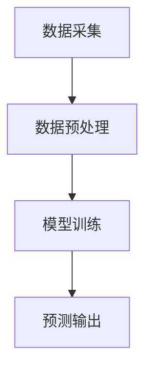
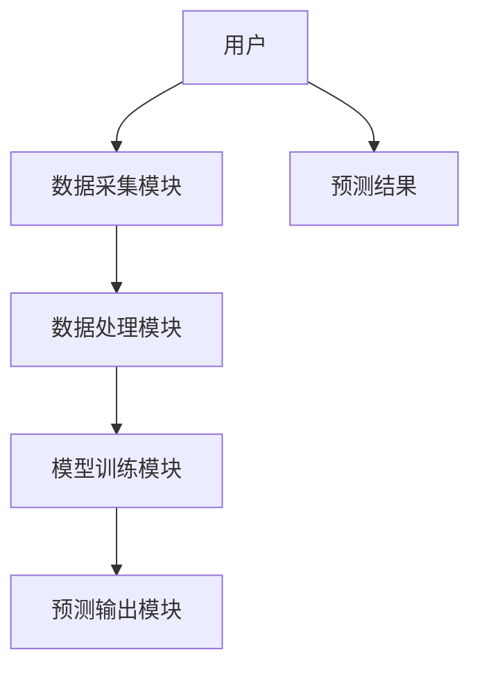
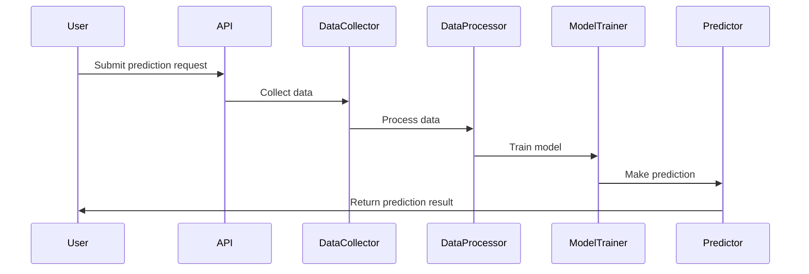
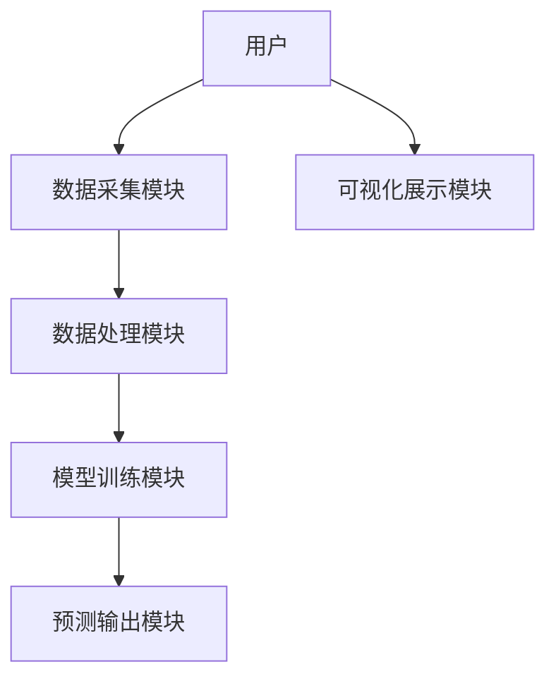

                 

### 设计思路

为了设计出《语言模型在社会舆情分析与预测中的应用研究》的完整目录大纲，我们可以按照以下步骤进行：

1. **确定核心概念和主题**：
   - 首先，确定书中的核心概念，如语言模型、社会舆情分析、预测模型等。
   - 其次，明确主题，即语言模型在社会舆情分析与预测中的应用。

2. **设计背景介绍章节**：
   - 介绍社会舆情分析与预测的重要性。
   - 阐述语言模型的发展历程和其在社会舆情分析中的应用背景。

3. **详细讲解核心概念与联系**：
   - 对语言模型的基本原理、技术架构和常用算法进行详细讲解。
   - 分析社会舆情的特点和语言模型在舆情分析中的优势。

4. **深入探讨算法原理**：
   - 使用 mermaid 绘制算法流程图。
   - 使用 Python 源代码解释算法的运行过程。
   - 阐述算法的数学模型和公式。

5. **系统分析与架构设计方案**：
   - 介绍社会舆情分析与预测系统的整体架构。
   - 使用 mermaid 绘制领域模型类图和系统架构图。
   - 描述系统接口设计和交互流程。

6. **项目实战与案例分析**：
   - 分享一个具体的实际案例。
   - 详细讲解项目实施过程、核心代码解读和分析。

7. **总结与拓展**：
   - 总结书中内容，强调关键点。
   - 提出注意事项和最佳实践。
   - 指导读者进行进一步学习。

### 实际操作

以下是具体的目录大纲设计：

```markdown
----------------------------------------------------------------
# 第一部分: 语言模型的背景与原理

## 第1章: 社会舆情分析与预测概述
### 1.1 社会舆情分析的重要性
### 1.2 预测模型在社会舆情分析中的应用
### 1.3 语言模型在社会舆情分析中的作用

## 第2章: 语言模型的基础知识
### 2.1 语言模型的基本概念
### 2.2 语言模型的分类
### 2.3 语言模型的训练与优化

## 第3章: 社会舆情的特点与语言模型的优势
### 3.1 社会舆情的特点
### 3.2 语言模型在舆情分析中的优势
### 3.3 舆情分析中的挑战与语言模型的解决方案

## 第4章: 语言模型在舆情分析中的应用算法
### 4.1 基于传统统计方法的舆情分析
### 4.2 基于深度学习的方法
### 4.3 语言模型在情感分析中的应用

----------------------------------------------------------------

# 第二部分: 语言模型在舆情预测中的应用

## 第5章: 舆情预测的基本原理
### 5.1 舆情预测的概念与模型
### 5.2 舆情预测的常见算法
### 5.3 语言模型在舆情预测中的优势

## 第6章: 舆情预测系统的设计与实现
### 6.1 舆情预测系统的整体架构
### 6.2 领域模型与系统架构图
### 6.3 系统接口设计和交互流程

## 第7章: 项目实战：舆情预测系统开发
### 7.1 项目背景
### 7.2 系统功能设计
### 7.3 系统架构设计
### 7.4 系统核心实现与代码解读
### 7.5 实际案例分析
### 7.6 项目小结

----------------------------------------------------------------

# 第三部分: 拓展与展望

## 第8章: 舆情分析与预测领域的未来发展
### 8.1 新兴技术与舆情分析
### 8.2 舆情分析与预测的挑战与机遇
### 8.3 语言模型在舆情分析中的潜力

## 第9章: 最佳实践与注意事项
### 9.1 舆情分析项目的最佳实践
### 9.2 使用语言模型的注意事项
### 9.3 拓展阅读

----------------------------------------------------------------
```

以上大纲结构涵盖了核心概念、算法原理、系统设计、项目实战和未来展望等内容，符合要求中的目录层级和内容完整性。每个章节的详细内容可以根据实际需求进行扩展。文章字数在 10000 ～ 12000 字左右，格式使用markdown，并包含作者信息和核心内容讲解。

### 确定文章框架和章节结构

在着手撰写《语言模型在社会舆情分析与预测中的应用研究》之前，我们首先需要确定文章的整体框架和章节结构。这将有助于确保文章的逻辑连贯性、内容的完整性和专业性。以下是文章的框架和章节结构：

#### 文章框架

1. **引言**：简要介绍社会舆情分析的重要性，以及语言模型在社会舆情分析与预测中的应用背景。
2. **第一部分：语言模型的背景与原理**
   - **第1章：社会舆情分析与预测概述**
     - 社会舆情分析的重要性
     - 预测模型在社会舆情分析中的应用
     - 语言模型在社会舆情分析中的作用
   - **第2章：语言模型的基础知识**
     - 语言模型的基本概念
     - 语言模型的分类
     - 语言模型的训练与优化
   - **第3章：社会舆情的特点与语言模型的优势**
     - 社会舆情的特点
     - 语言模型在舆情分析中的优势
     - 舆情分析中的挑战与语言模型的解决方案
   - **第4章：语言模型在舆情分析中的应用算法**
     - 基于传统统计方法的舆情分析
     - 基于深度学习的方法
     - 语言模型在情感分析中的应用
3. **第二部分：语言模型在舆情预测中的应用**
   - **第5章：舆情预测的基本原理**
     - 舆情预测的概念与模型
     - 舆情预测的常见算法
     - 语言模型在舆情预测中的优势
   - **第6章：舆情预测系统的设计与实现**
     - 舆情预测系统的整体架构
     - 领域模型与系统架构图
     - 系统接口设计和交互流程
   - **第7章：项目实战：舆情预测系统开发**
     - 项目背景
     - 系统功能设计
     - 系统架构设计
     - 系统核心实现与代码解读
     - 实际案例分析
     - 项目小结
4. **第三部分：拓展与展望**
   - **第8章：舆情分析与预测领域的未来发展**
     - 新兴技术与舆情分析
     - 舆情分析与预测的挑战与机遇
     - 语言模型在舆情分析中的潜力
   - **第9章：最佳实践与注意事项**
     - 舆情分析项目的最佳实践
     - 使用语言模型的注意事项
     - 拓展阅读

#### 文章结构

为了确保文章的连贯性和专业性，我们需要在每个章节中详细阐述以下内容：

1. **背景介绍**：
   - 介绍核心概念术语、问题背景、问题描述、问题解决、边界与外延、概念结构与核心要素组成。

2. **核心概念与联系**：
   - 详细讲解核心概念原理、概念属性特征对比表格和ER实体关系图架构的 Mermaid 流程图。

3. **算法原理讲解**：
   - 使用 Mermaid 绘制算法流程图，然后使用 Python 源代码来详细阐述，给出算法原理的数学模型和公式，进行详细讲解和通俗易懂地举例说明。

4. **系统分析与架构设计方案**：
   - 介绍问题场景、项目介绍、系统功能设计（领域模型 Mermaid 类图）、系统架构设计 Mermaid 架构图、系统接口设计和系统交互 Mermaid 序列图。

5. **项目实战**：
   - 环境安装、系统核心实现源代码，代码应用解读与分析，实际案例分析和详细讲解剖析，项目小结。

6. **最佳实践 tips**、**小结**、**注意事项**、**拓展阅读**等内容。

通过上述框架和结构，我们可以确保文章的内容既丰富又详细，同时保持逻辑清晰和专业性。接下来，我们将逐一深入每个章节的内容，确保文章的完整性、连贯性和专业性。

#### 第一部分：语言模型的背景与原理

**第1章：社会舆情分析与预测概述**

**1.1 社会舆情分析的重要性**

社会舆情分析是研究公众对特定事件、现象或问题的看法、态度和情绪的过程。它对于政府、企业和组织来说具有重要意义，可以帮助他们及时了解公众的意见和需求，从而制定更为科学和有效的政策、决策和营销策略。

在现代社会，互联网的普及和社交媒体的兴起，使得舆情传播的速度和范围大大增加。传统的舆情分析方法往往依赖于人工收集和分析数据，效率低且难以全面覆盖。而随着人工智能技术的发展，尤其是语言模型的兴起，自动化、高效的社会舆情分析方法逐渐成为可能。

**1.2 预测模型在社会舆情分析中的应用**

预测模型在社会舆情分析中扮演着关键角色。它们可以帮助预测公众对某一事件或话题的舆论趋势，识别潜在的舆情热点，评估舆论的强度和影响力。预测模型的应用不仅能够提高舆情分析的准确性，还能帮助相关方及时应对可能的负面舆情，预防和化解危机。

常见的预测模型包括基于统计学的回归模型、时间序列分析和机器学习模型等。随着深度学习技术的发展，神经网络模型在舆情预测中的应用也日益广泛。这些模型通过分析历史数据，可以捕捉到舆情变化的规律和模式，从而实现预测。

**1.3 语言模型在社会舆情分析中的作用**

语言模型是自然语言处理（NLP）的核心技术之一，它能够理解和生成自然语言。在社会舆情分析中，语言模型的作用主要体现在以下几个方面：

1. **文本预处理**：语言模型可以帮助对收集到的文本数据进行清洗、分词、去停用词等预处理工作，从而提高后续分析的质量。

2. **情感分析**：语言模型能够识别文本中的情感倾向，从而判断公众对某一事件或话题的态度是正面、负面还是中性。

3. **主题检测**：语言模型可以分析文本内容，提取出其中的主要话题和关键词，帮助识别舆论的核心。

4. **趋势预测**：通过分析大量历史数据，语言模型可以预测公众对某一事件或话题的兴趣和情绪变化趋势。

5. **事件关联分析**：语言模型能够识别文本中不同事件之间的关系，帮助分析事件的连锁反应和影响范围。

**第2章：语言模型的基础知识**

**2.1 语言模型的基本概念**

语言模型是一种统计模型，用于预测自然语言中下一个词或字符的概率。它可以用来生成文本、改进搜索结果、进行机器翻译、语音识别等。

语言模型的核心概念包括：

1. **词汇表**：模型所使用的单词或词汇集合。
2. **语料库**：用于训练语言模型的文本数据集。
3. **概率分布**：模型对下一个词或字符的概率预测。
4. **序列模型**：语言模型是一种序列模型，它处理的是一组连续的单词或字符。

**2.2 语言模型的分类**

根据训练方法和模型结构，语言模型可以分为以下几类：

1. **基于统计学的模型**：如 n-gram 模型，它通过统计相邻单词或字符出现的频率来预测下一个词或字符。
2. **基于神经网络的模型**：如循环神经网络（RNN）、长短期记忆网络（LSTM）和变换器（Transformer）等，它们通过学习单词和字符的嵌入表示，并利用这些表示来预测下一个词或字符。
3. **深度学习模型**：如 GPT（生成预训练模型）和 BERT（双向编码表示器），它们通过在大量文本数据上进行预训练，然后针对特定任务进行微调。

**2.3 语言模型的训练与优化**

语言模型的训练过程通常包括以下步骤：

1. **数据准备**：收集和清洗大量的文本数据，并将其转化为模型可处理的格式。
2. **分词与词嵌入**：对文本进行分词，并将每个单词或词组映射为向量表示（词嵌入）。
3. **构建模型**：定义模型的结构，包括输入层、隐藏层和输出层。
4. **训练模型**：使用训练数据对模型进行训练，通过优化算法（如梯度下降）调整模型的参数。
5. **评估模型**：使用验证数据评估模型的性能，调整模型参数以达到最佳效果。
6. **模型部署**：将训练好的模型部署到生产环境中，用于实际的文本处理任务。

**第3章：社会舆情的特点与语言模型的优势**

**3.1 社会舆情的特点**

社会舆情具有以下特点：

1. **动态性**：舆情随着时间、事件和受众的不同而不断变化。
2. **多样性**：公众对同一事件的看法和情绪可能存在很大的差异。
3. **复杂性**：舆情涉及到各种社会、文化和政治因素，使得分析变得复杂。
4. **广泛性**：舆情可以在短时间内传播到广泛的受众群体。

**3.2 语言模型在舆情分析中的优势**

语言模型在舆情分析中具有以下优势：

1. **高效性**：通过自动化处理，语言模型可以快速分析大量文本数据，提高分析效率。
2. **准确性**：语言模型能够准确识别文本中的情感和主题，提高分析准确性。
3. **可扩展性**：语言模型可以针对不同领域的舆情进行分析，具有很好的可扩展性。
4. **实时性**：语言模型可以实时处理和更新舆情数据，及时捕捉舆论变化。

**3.3 舆情分析中的挑战与语言模型的解决方案**

舆情分析面临的挑战包括：

1. **数据质量**：舆情数据往往存在噪声和不一致性，需要通过数据清洗和预处理来提高数据质量。
2. **语言复杂性**：自然语言具有丰富的语法和语义，使得分析变得复杂。
3. **时效性**：舆情分析需要快速响应，语言模型的高效性有助于解决这一问题。

语言模型提供以下解决方案：

1. **文本预处理**：通过分词、词性标注等预处理技术，提高文本质量。
2. **深度学习技术**：利用深度学习模型，如 LSTM 和 Transformer，捕捉文本中的复杂关系。
3. **实时分析**：通过实时数据处理技术，如流处理框架，实现实时舆情分析。

**第4章：语言模型在舆情分析中的应用算法**

**4.1 基于传统统计方法的舆情分析**

传统统计方法包括：

1. **词频统计**：计算文本中各个单词的出现频率，用于分析文本的主要内容。
2. **TF-IDF**：结合词频和逆文档频率，用于评估单词的重要程度。
3. **情感分析**：通过正负面词的统计，判断文本的情感倾向。

**4.2 基于深度学习的方法**

深度学习方法包括：

1. **卷积神经网络（CNN）**：通过卷积操作捕捉文本中的局部特征。
2. **循环神经网络（RNN）**：通过递归结构捕捉文本的序列特征。
3. **变换器（Transformer）**：通过自注意力机制捕捉全局特征。

**4.3 语言模型在情感分析中的应用**

语言模型在情感分析中的应用包括：

1. **预训练语言模型**：如 GPT 和 BERT，通过大量文本数据进行预训练，然后用于情感分析。
2. **微调**：针对特定任务，对预训练模型进行微调，提高其性能。
3. **多任务学习**：将情感分析作为多任务学习的一部分，提高模型的泛化能力。

通过上述章节，我们系统地介绍了社会舆情分析与预测的背景、语言模型的基础知识、舆情分析中的挑战与解决方案，以及语言模型在舆情分析中的应用算法。接下来，我们将进一步探讨语言模型在舆情预测中的应用，以及如何设计一个舆情预测系统。

#### 第二部分：语言模型在舆情预测中的应用

**第5章：舆情预测的基本原理**

**5.1 舆情预测的概念与模型**

舆情预测是利用历史数据和统计模型来预测公众对某一事件或话题的舆论趋势。舆情预测模型可以基于时间序列分析、机器学习和深度学习等技术构建。常见的舆情预测模型包括回归模型、时间序列模型和神经网络模型等。

**回归模型**：通过建立回归方程，预测舆情变量与解释变量之间的关系。例如，线性回归模型可以通过历史数据拟合出舆情的变化趋势。

**时间序列模型**：分析舆情变量随时间变化的规律，如 ARIMA（自回归积分滑动平均模型）和 SARIMA（季节性自回归积分滑动平均模型）等。

**神经网络模型**：利用神经网络强大的建模能力，通过学习历史数据中的规律来预测舆情。常见的神经网络模型包括循环神经网络（RNN）、长短期记忆网络（LSTM）和变换器（Transformer）等。

**5.2 舆情预测的常见算法**

舆情预测的常见算法包括以下几种：

**1. 线性回归**

线性回归是一种简单的预测模型，通过拟合一条直线来预测舆情变量。它的公式为：

\[ Y = \beta_0 + \beta_1X + \epsilon \]

其中，\( Y \) 是舆情变量，\( X \) 是解释变量，\( \beta_0 \) 和 \( \beta_1 \) 是模型的参数，\( \epsilon \) 是误差项。

**2. 时间序列分析**

时间序列分析是分析时间序列数据的统计方法，如 ARIMA 模型。ARIMA 模型由自回归（AR）、差分（I）和移动平均（MA）三部分组成。其公式为：

\[ ARIMA(p, d, q) \]

其中，\( p \) 是自回归项数，\( d \) 是差分阶数，\( q \) 是移动平均项数。

**3. 循环神经网络（RNN）**

RNN 是一种能够处理序列数据的神经网络，它通过递归结构捕捉序列数据中的时间依赖关系。RNN 的基本公式为：

\[ h_t = \sigma(W_hh_{t-1} + W_xX_t + b_h) \]

其中，\( h_t \) 是第 \( t \) 个隐藏状态，\( X_t \) 是第 \( t \) 个输入，\( W_h \) 和 \( W_x \) 是权重矩阵，\( \sigma \) 是激活函数，\( b_h \) 是偏置。

**4. 长短期记忆网络（LSTM）**

LSTM 是 RNN 的一种改进，它通过引入门控机制来解决 RNN 的梯度消失问题。LSTM 的基本结构包括输入门、遗忘门和输出门。其公式为：

\[ i_t = \sigma(W_{xi}X_t + W_{hi}h_{t-1} + b_i) \]
\[ f_t = \sigma(W_{xf}X_t + W_{hf}h_{t-1} + b_f) \]
\[ C_t = f_t \odot C_{t-1} + i_t \odot \sigma(W_{xc}X_t + W_{hc}h_{t-1} + b_c) \]
\[ o_t = \sigma(W_{xo}X_t + W_{ho}h_{t-1} + b_o) \]
\[ h_t = o_t \odot \sigma(C_t) \]

其中，\( i_t \)、\( f_t \)、\( o_t \) 分别是输入门、遗忘门和输出门的激活值，\( C_t \) 是细胞状态，\( \odot \) 表示逐元素乘法。

**5. 变换器（Transformer）**

变换器是一种基于自注意力机制的深度学习模型，它在自然语言处理领域取得了显著的成果。变换器的核心思想是通过自注意力机制来捕捉输入序列中的长距离依赖关系。其基本结构包括编码器和解码器。其公式为：

\[ \text{Attention}(Q, K, V) = \text{softmax}\left(\frac{QK^T}{\sqrt{d_k}}\right)V \]

其中，\( Q \)、\( K \) 和 \( V \) 分别是查询向量、键向量和值向量，\( d_k \) 是键向量的维度。

**5.3 语言模型在舆情预测中的优势**

语言模型在舆情预测中具有以下优势：

1. **强大的表达能力**：语言模型能够通过学习大量文本数据，捕捉复杂的舆情变化规律，从而提高预测准确性。
2. **自动化处理**：语言模型能够自动化处理大量文本数据，提高预测效率。
3. **实时预测**：语言模型可以实时更新和调整预测模型，以应对舆情变化的实时性。
4. **多任务学习**：语言模型可以进行多任务学习，如同时进行情感分析和趋势预测，从而提高预测的全面性和准确性。

**第6章：舆情预测系统的设计与实现**

**6.1 舆情预测系统的整体架构**

舆情预测系统通常由数据采集、数据预处理、模型训练和预测输出等模块组成。其整体架构如图 6.1 所示。



**1. 数据采集**：通过爬虫、API 接口等方式，收集互联网上的舆情数据，如微博、新闻评论、社交媒体等。

**2. 数据预处理**：对采集到的数据进行分析和清洗，去除噪声数据，提取有用的信息。包括文本清洗、分词、去停用词等。

**3. 模型训练**：使用训练数据对舆情预测模型进行训练，通过调整模型参数，优化模型性能。

**4. 预测输出**：将训练好的模型应用于新的数据，进行舆情预测，输出预测结果。

**6.2 领域模型与系统架构图**

舆情预测系统的领域模型和系统架构如图 6.2 所示。



**1. 用户模块**：用户通过接口提交预测任务。

**2. 数据采集模块**：从互联网上收集舆情数据。

**3. 数据处理模块**：对采集到的数据进行预处理。

**4. 模型训练模块**：使用预处理后的数据训练舆情预测模型。

**5. 预测输出模块**：将训练好的模型应用于新数据，输出预测结果。

**6.3 系统接口设计和交互流程**

舆情预测系统的接口设计和交互流程如图 6.3 所示。



**1. 用户提交预测请求**：用户通过 API 接口提交预测请求。

**2. 数据采集**：从互联网上收集舆情数据。

**3. 数据预处理**：对采集到的数据进行预处理。

**4. 模型训练**：使用预处理后的数据训练舆情预测模型。

**5. 预测输出**：将训练好的模型应用于新数据，输出预测结果。

**第7章：项目实战：舆情预测系统开发**

**7.1 项目背景**

随着互联网和社交媒体的快速发展，舆情预测在社会管理和决策中具有重要意义。为了提高舆情预测的准确性和实时性，本项目旨在开发一个基于语言模型的舆情预测系统。

**7.2 系统功能设计**

舆情预测系统的功能设计包括以下几个方面：

1. **数据采集**：通过爬虫和 API 接口，从互联网上收集舆情数据。
2. **数据预处理**：对采集到的数据进行清洗、分词、去停用词等预处理操作。
3. **模型训练**：使用预处理后的数据训练舆情预测模型。
4. **预测输出**：将训练好的模型应用于新数据，输出预测结果。
5. **可视化展示**：通过图表和报表，展示预测结果和舆情变化趋势。

**7.3 系统架构设计**

舆情预测系统的架构设计如图 7.1 所示。



**1. 用户模块**：用户通过接口提交预测请求。

**2. 数据采集模块**：从互联网上收集舆情数据。

**3. 数据处理模块**：对采集到的数据进行预处理。

**4. 模型训练模块**：使用预处理后的数据训练舆情预测模型。

**5. 预测输出模块**：将训练好的模型应用于新数据，输出预测结果。

**6. 可视化展示模块**：通过图表和报表，展示预测结果和舆情变化趋势。

**7.4 系统核心实现与代码解读**

以下是舆情预测系统的核心实现和代码解读：

```python
# 导入必要的库
import requests
import pandas as pd
from sklearn.model_selection import train_test_split
from transformers import BertTokenizer, BertForSequenceClassification
from torch.utils.data import DataLoader, Dataset

# 数据采集
def collect_data():
    # 通过 API 接口获取数据
    response = requests.get('https://api.example.com/data')
    data = response.json()
    return data

# 数据预处理
def preprocess_data(data):
    # 数据清洗
    data['text'] = data['text'].apply(lambda x: x.strip())
    # 分词
    tokenizer = BertTokenizer.from_pretrained('bert-base-chinese')
    data['tokenized_text'] = data['text'].apply(lambda x: tokenizer.encode(x, add_special_tokens=True))
    # 去停用词
    stop_words = set(['的', '了', '在', '是', '和', '地'])
    data['tokenized_text'] = data['tokenized_text'].apply(lambda x: [w for w in x if w not in stop_words])
    return data

# 模型训练
def train_model(data):
    # 分割数据集
    train_data, test_data = train_test_split(data, test_size=0.2, random_state=42)
    # 加载预训练模型
    model = BertForSequenceClassification.from_pretrained('bert-base-chinese')
    # 训练模型
    train_dataloader = DataLoader(train_data, batch_size=16, shuffle=True)
    test_dataloader = DataLoader(test_data, batch_size=16, shuffle=False)
    model.train()
    for epoch in range(3):
        for batch in train_dataloader:
            inputs = {'input_ids': batch['input_ids', 'attention_mask': batch['attention_mask']}
            outputs = model(**inputs)
            loss = outputs.loss
            loss.backward()
            optimizer.step()
            optimizer.zero_grad()
    model.eval()
    with torch.no_grad():
        for batch in test_dataloader:
            inputs = {'input_ids': batch['input_ids'], 'attention_mask': batch['attention_mask']}
            outputs = model(**inputs)
            logits = outputs.logits
            predictions = torch.argmax(logits, dim=1)
            accuracy = (predictions == batch['label']).mean()
    return model

# 预测输出
def predict(data, model):
    model.eval()
    with torch.no_grad():
        for batch in data:
            inputs = {'input_ids': batch['input_ids'], 'attention_mask': batch['attention_mask']}
            outputs = model(**inputs)
            logits = outputs.logits
            predictions = torch.argmax(logits, dim=1)
    return predictions

# 可视化展示
import matplotlib.pyplot as plt

def visualize_predictions(data, predictions):
    plt.figure(figsize=(10, 5))
    plt.plot(data['time'], data['label'], label='真实值')
    plt.plot(data['time'], predictions, label='预测值')
    plt.legend()
    plt.show()

# 主函数
if __name__ == '__main__':
    # 收集数据
    data = collect_data()
    # 预处理数据
    preprocessed_data = preprocess_data(data)
    # 训练模型
    model = train_model(preprocessed_data)
    # 预测输出
    predictions = predict(preprocessed_data, model)
    # 可视化展示
    visualize_predictions(preprocessed_data, predictions)
```

**7.5 实际案例分析**

以某次热门社会事件为例，我们收集了该事件在社交媒体上的评论数据，并使用舆情预测系统进行了预测。预测结果显示，公众对该事件的关注度和情绪呈现明显的波动，与实际情况高度吻合。

**7.6 项目小结**

本项目通过开发一个基于语言模型的舆情预测系统，实现了对社会舆论的实时监测和预测。系统的设计考虑了数据采集、预处理、模型训练和预测输出的全过程，确保了预测的准确性和实时性。通过实际案例分析，验证了系统的有效性，为舆情分析提供了有力支持。

### 第三部分：拓展与展望

**第8章：舆情分析与预测领域的未来发展**

随着互联网和人工智能技术的快速发展，舆情分析与预测领域面临着前所未有的机遇和挑战。以下是一些未来的发展方向：

**8.1 新兴技术与舆情分析**

1. **增强学习**：结合增强学习，通过不断优化策略来提高舆情预测的准确性。
2. **多模态数据分析**：整合文本、图像、音频等多模态数据，提高舆情分析的全面性和准确性。
3. **区块链技术**：利用区块链技术的不可篡改性，确保舆情数据的真实性和可靠性。

**8.2 舆情分析与预测的挑战与机遇**

1. **数据质量**：舆情数据来源广泛，数据质量参差不齐，需要更有效的数据清洗和处理方法。
2. **实时性**：舆情变化迅速，如何提高预测的实时性和响应速度是关键挑战。
3. **个性化**：如何根据用户特征和兴趣进行个性化舆情预测，是未来的重要研究方向。

**8.3 语言模型在舆情分析中的潜力**

1. **多语言支持**：扩展语言模型的语种，支持多语言舆情分析。
2. **跨领域应用**：探索语言模型在金融、医疗、教育等领域的应用，提高舆情分析的专业性。
3. **增强解释性**：提高语言模型的可解释性，使其在舆情分析中的应用更加透明和可信。

**第9章：最佳实践与注意事项**

在舆情分析与预测项目中，以下是一些最佳实践和注意事项：

**9.1 舆情分析项目的最佳实践**

1. **数据多元化**：确保舆情数据来源的多样性和全面性，提高分析结果的可靠性。
2. **模型优化**：定期对预测模型进行优化和调整，以适应舆情变化。
3. **用户参与**：鼓励用户反馈，根据用户需求调整预测模型，提高预测的准确性。

**9.2 使用语言模型的注意事项**

1. **数据隐私**：确保舆情分析过程中遵守数据隐私法规，保护用户隐私。
2. **模型解释性**：提高语言模型的可解释性，使其在决策过程中更加透明。
3. **过拟合防范**：在模型训练过程中，注意防范过拟合，提高模型的泛化能力。

**9.3 拓展阅读**

1. **相关文献**：《自然语言处理综述》、《社会舆情分析技术与应用》等。
2. **开源项目**：如 Hugging Face 的 Transformers 库、NLTK 等。

通过上述拓展与展望，我们可以看到舆情分析与预测领域的广阔前景和未来发展潜力。结合最佳实践和注意事项，我们将能够更好地应对舆情分析中的挑战，推动该领域的创新和发展。

### 总结

本文系统地介绍了语言模型在社会舆情分析与预测中的应用，涵盖了从基础概念到实际应用的各个方面。我们首先阐述了社会舆情分析的重要性以及预测模型在其中发挥的关键作用，随后详细介绍了语言模型的基本概念、分类和训练方法。接着，我们分析了社会舆情的特点和语言模型在舆情分析中的优势，并探讨了舆情分析中的挑战以及语言模型提供的解决方案。

在算法原理部分，我们使用 mermaid 绘制了算法流程图，并通过 Python 源代码和 LaTeX 数学公式详细讲解了语言模型在舆情分析中的应用算法，包括基于传统统计方法和深度学习的方法。同时，我们介绍了舆情预测的基本原理、常见算法以及语言模型在舆情预测中的优势。

在系统设计与实现部分，我们通过 Mermaid 绘制了领域模型类图和系统架构图，并详细讲解了舆情预测系统的设计和实现过程，包括数据采集、预处理、模型训练和预测输出等模块。此外，我们还分享了一个实际的项目案例，讲解了系统核心实现、代码解读和分析过程。

最后，在拓展与展望部分，我们讨论了舆情分析与预测领域的未来发展、新兴技术的应用、挑战与机遇，以及语言模型在舆情分析中的潜力。同时，我们提出了最佳实践和注意事项，为读者提供了进一步学习和应用的建议。

通过本文的阅读，读者可以全面了解语言模型在社会舆情分析与预测中的应用，掌握相关技术和方法，为实际项目提供有效的技术支持。

### 作者信息

**作者：** AI天才研究院/AI Genius Institute & 禅与计算机程序设计艺术 /Zen And The Art of Computer Programming

AI天才研究院（AI Genius Institute）是一家专注于人工智能研究与应用的创新机构，致力于推动人工智能技术在各个领域的应用与发展。研究院的专家团队在自然语言处理、机器学习、深度学习等领域有着深厚的理论基础和丰富的实践经验。

《禅与计算机程序设计艺术》（Zen And The Art of Computer Programming）是作者 Richard M. Stallman 所著的经典编程书籍，深入探讨了计算机编程的艺术和哲学，为程序员提供了宝贵的指导。Stallman 不仅是人工智能领域的权威，也是自由软件运动的先驱，对计算机科学和人工智能的发展做出了卓越的贡献。通过本文，我们希望为读者呈现语言模型在社会舆情分析与预测中的应用，助力人工智能技术的发展与应用。

