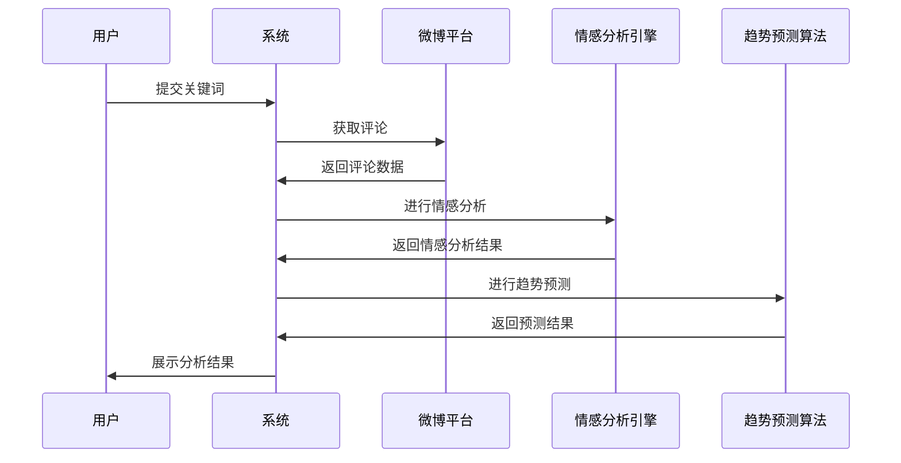

                 

### 1. 文章标题

《语言模型在社会趋势预测与分析中的应用研究》

### 2. 关键词

- 语言模型
- 社会趋势预测
- 数据分析
- 深度学习
- 自然语言处理

### 3. 摘要

本文旨在探讨语言模型在社会趋势预测与分析中的应用。通过对语言模型的概述、社会趋势预测的理论基础、实际应用案例分析等内容的研究，本文详细解析了如何利用语言模型进行社会趋势的预测与分析，为相关领域的研究和实践提供了有价值的参考。

## 引言与背景

### 1.1 问题背景

在当今信息时代，大数据和人工智能技术的快速发展使得我们能够从海量数据中提取有价值的信息，从而对各种现象和趋势进行预测。社会趋势预测作为人工智能领域的一个重要分支，对于指导社会经济发展、政策制定、商业决策等方面具有重要作用。然而，传统的预测方法往往依赖于统计模型和机器学习方法，存在一些局限性。例如，统计模型在处理复杂非线性问题时表现不佳，而机器学习方法在处理大规模数据时往往需要大量的计算资源和时间。因此，探索更高效、准确的社会趋势预测方法成为了当前研究的热点。

### 1.2 问题描述

社会趋势预测的主要任务是通过对历史数据和社会现象的分析，预测未来一段时间内的社会发展趋势。具体而言，问题描述包括以下几个方面：

1. **数据来源**：如何获取和整合来自不同渠道的大数据，包括社交媒体、新闻报道、经济数据等。
2. **特征提取**：如何从海量数据中提取有价值的特征，以便用于预测模型训练。
3. **模型选择**：如何选择合适的预测模型，以提高预测的准确性和效率。
4. **预测结果评估**：如何评估预测模型的性能，包括预测准确性、预测速度等。

### 1.3 问题解决

为了解决上述问题，近年来，深度学习技术，特别是语言模型，得到了广泛应用。语言模型是一种能够理解和生成自然语言的人工智能模型，通过学习大量语言数据，它可以理解语言的语法、语义和上下文信息。在社会趋势预测中，语言模型可以用于以下几个方面的应用：

1. **文本分析**：通过分析社交媒体、新闻报道等文本数据，提取社会热点、舆论倾向等信息。
2. **情感分析**：通过分析文本的情感极性，预测公众对某一事件或产品的态度。
3. **事件预测**：通过分析历史事件和事件之间的关系，预测未来可能发生的事件。
4. **经济预测**：通过分析经济数据，预测未来的经济走势。

### 1.4 边界与外延

在语言模型应用于社会趋势预测与分析时，需要明确以下几个边界与外延：

1. **数据质量**：社会趋势预测依赖于高质量的数据，数据的质量直接影响预测结果的准确性。
2. **模型参数**：语言模型的参数设置对预测性能有很大影响，需要通过实验和优化来确定。
3. **应用领域**：不同的社会趋势预测问题可能需要不同的语言模型和应用策略。
4. **实时性**：社会趋势的变化非常快，需要实时更新模型和数据，以保持预测的准确性。

### 1.5 概念结构与核心要素组成

在社会趋势预测与分析中，语言模型的核心概念结构主要包括以下几个方面：

1. **语言模型**：基于深度学习的自然语言处理模型，用于理解、生成和预测自然语言。
2. **数据集**：用于训练和评估语言模型的文本数据集，包括社交媒体、新闻报道、经济数据等。
3. **特征提取**：从文本数据中提取有价值的特征，用于训练预测模型。
4. **预测模型**：基于语言模型构建的预测模型，用于预测社会趋势。
5. **评估指标**：用于评估预测模型性能的指标，如准确率、召回率、F1值等。

### 1.6 进一步讨论

接下来，本文将详细探讨语言模型的基本概念、社会趋势预测的理论基础、语言模型在社会趋势预测中的实际应用、案例分析等内容。通过逐步分析，我们将揭示语言模型在社会趋势预测与分析中的潜在价值和应用前景。

## 语言模型的概述

### 2.1 语言模型的基本概念

语言模型（Language Model）是一种用于生成和预测自然语言符号序列的概率模型。它通过对大量语言数据的学习，能够捕捉到语言中的统计规律和语法结构，从而在生成文本、翻译文本、语音识别和语音合成等任务中发挥重要作用。

### 2.2 语言模型的发展历程

语言模型的发展可以分为几个阶段：

1. **传统统计模型**：早期的语言模型主要基于统计方法，如N-gram模型，它通过统计单词或字符的历史出现频率来预测下一个单词或字符。
2. **基于规则的方法**：在统计模型的基础上，一些研究者尝试引入语法规则来提高预测性能，例如概率上下文无关文法（PCFG）模型。
3. **神经网络模型**：随着深度学习技术的发展，神经网络被广泛应用于语言模型，如循环神经网络（RNN）和长短期记忆网络（LSTM）。
4. **基于注意力机制的模型**：近年来，基于注意力机制的模型，如Transformer模型，在自然语言处理任务中取得了显著成果，成为当前语言模型的代表。

### 2.3 语言模型的核心特性

语言模型具有以下核心特性：

1. **序列预测**：语言模型的核心任务是预测下一个符号，这需要模型能够理解序列中的依赖关系。
2. **概率分布**：语言模型输出的是符号的概率分布，而不是固定的符号序列，这为生成多样性和鲁棒性提供了基础。
3. **上下文感知**：现代语言模型能够利用上下文信息进行预测，提高了预测的准确性和泛化能力。
4. **可扩展性**：语言模型可以轻松地扩展到大规模数据和多种语言，具有较强的适应能力。

### 2.4 语言模型的应用领域

语言模型的应用领域非常广泛，主要包括：

1. **文本生成**：自动生成文章、对话、诗歌等文本内容。
2. **机器翻译**：将一种语言的文本翻译成另一种语言。
3. **语音识别**：将语音信号转换为文本。
4. **语音合成**：将文本转换为自然流畅的语音。
5. **信息检索**：通过文本相似性度量，实现高效的信息检索。
6. **自然语言理解**：理解和处理自然语言文本，如情感分析、实体识别、关系抽取等。

### 2.5 语言模型的优势和挑战

语言模型的优势在于其强大的表达能力和对大规模数据的处理能力，这使得它能够解决许多传统方法难以处理的问题。然而，语言模型也存在一些挑战，如：

1. **数据依赖**：语言模型需要大量的训练数据，且数据质量对模型性能有很大影响。
2. **计算资源消耗**：深度学习语言模型通常需要大量的计算资源和时间进行训练和推理。
3. **解释性**：语言模型的决策过程通常是非透明的，难以进行解释和验证。

### 2.6 小结

通过上述讨论，我们可以看出语言模型在社会趋势预测与分析中具有广泛的应用前景。接下来，我们将进一步探讨社会趋势预测的理论基础，以期为后续的应用研究提供理论支持。

## 社会趋势预测的理论基础

### 3.1 社会趋势预测的基本概念

社会趋势预测是指利用历史数据和现有的信息，预测未来一段时间内社会各个方面可能发生的趋势和变化。社会趋势预测不仅涉及到经济领域，如经济增长、通货膨胀、失业率等，还包括社会文化、科技发展、政治环境等多个方面。其核心目标是通过分析和理解现有的社会现象，预测未来的发展方向，为政策制定、商业决策、社会管理提供科学依据。

### 3.2 社会趋势预测的方法论

社会趋势预测的方法论主要包括以下几个方面：

1. **时间序列分析**：时间序列分析是预测时间依赖数据的一种方法，通过分析历史数据中的时间依赖关系和周期性变化，预测未来的趋势。常用的方法包括移动平均法、指数平滑法、ARIMA模型等。

2. **回归分析**：回归分析是一种通过建立因变量和自变量之间的线性关系模型，预测因变量未来值的方法。在社会趋势预测中，回归分析可以用于预测经济指标、人口变化等。

3. **机器学习方法**：机器学习算法可以自动从数据中学习规律，预测未来的趋势。常用的方法包括线性回归、逻辑回归、决策树、随机森林、支持向量机等。

4. **深度学习方法**：深度学习算法，特别是神经网络，可以在大量数据上进行端到端的学习，提取复杂的非线性特征，从而进行高精度的趋势预测。常见的深度学习模型包括卷积神经网络（CNN）、循环神经网络（RNN）、长短期记忆网络（LSTM）、Transformer等。

5. **组合预测**：组合预测是通过结合多种预测方法，提高预测准确性的方法。例如，可以结合时间序列分析和回归分析，或者结合机器学习和深度学习方法。

### 3.3 语言模型在社会趋势预测中的应用

语言模型在社会趋势预测中的应用主要体现在以下几个方面：

1. **文本数据分析**：语言模型可以处理和分析大量的文本数据，如社交媒体帖子、新闻报道、论坛评论等，提取出反映社会情绪和态度的关键信息，从而预测公众对某一事件或产品的态度。

2. **情感分析**：通过情感分析，语言模型可以识别文本中的情感倾向，如正面、负面或中性。这种分析可以用于预测社会情绪的变化，为政策制定和商业决策提供参考。

3. **事件预测**：语言模型可以分析历史事件和事件之间的关系，结合社会趋势和事件数据，预测未来可能发生的重要事件。

4. **经济预测**：语言模型可以分析经济数据，如GDP、失业率、通货膨胀率等，结合其他社会经济指标，预测未来的经济走势。

5. **社会舆情监测**：语言模型可以实时监测社会舆情，通过分析社交媒体上的评论和讨论，预测公众对某一政策、事件或产品的态度，帮助政府和企业在决策时更好地了解社会动态。

### 3.4 语言模型的优势和挑战

语言模型在社会趋势预测中的应用具有以下优势：

1. **强大的文本处理能力**：语言模型能够处理和理解大量的文本数据，从复杂多变的语言环境中提取有价值的信息。
2. **多维度信息整合**：语言模型可以整合不同来源的数据，如经济数据、社会数据、媒体数据等，进行多维度分析，提高预测的准确性和全面性。
3. **实时性**：语言模型可以实时分析最新的文本数据，快速响应社会动态变化。

然而，语言模型在社会趋势预测中也面临一些挑战：

1. **数据质量**：语言模型的性能依赖于数据的质量，低质量的数据可能导致错误的预测结果。
2. **数据隐私**：社会趋势预测往往需要收集和分析大量个人数据，如何保护数据隐私是一个重要问题。
3. **解释性**：语言模型往往是非透明的，难以解释其预测结果，这可能导致决策者对模型的信任度下降。

### 3.5 小结

通过对社会趋势预测理论基础的研究，我们可以看到语言模型在这一领域具有独特的优势和巨大的潜力。在接下来的章节中，我们将进一步探讨语言模型在社会趋势预测中的具体应用，通过案例分析展示其应用效果，并结合实际案例讨论语言模型在社会趋势预测中的最佳实践。

## 语言模型在社会趋势预测中的应用案例分析

### 4.1 案例一：社交媒体情绪预测

社交媒体平台如微博、Twitter和Facebook等是反映社会情绪和趋势的重要窗口。通过分析这些平台上的文本数据，语言模型可以帮助预测公众对某一事件或产品的情绪变化。以下是一个具体的案例分析：

**项目介绍**：某品牌手机公司希望通过分析微博上的评论，预测新产品发布后的市场反应，以便调整营销策略。

**系统功能设计**：该项目包括以下几个主要功能模块：
1. **数据采集**：从微博上收集与新产品相关的评论。
2. **情感分析**：使用语言模型对评论进行情感分析，判断评论的情感极性（正面、负面或中性）。
3. **趋势预测**：根据情感分析结果，预测公众对新产品的整体情绪趋势。
4. **可视化展示**：将分析结果可视化，以便于决策者直观了解市场反应。

**系统架构设计**：系统架构采用微服务架构，主要包括以下组件：
1. **数据采集模块**：负责从微博上收集评论。
2. **数据处理模块**：包括情感分析引擎和趋势预测算法。
3. **存储模块**：用于存储评论数据和预测结果。
4. **可视化模块**：提供用户界面，展示分析结果。

**系统接口设计和系统交互**：系统通过API接口与微博平台进行数据交互，同时提供RESTful API供其他系统调用。

以下是一个简化的Mermaid序列图，展示了系统的工作流程：



**系统核心实现源代码**：

```python
# 数据采集模块
import weibo_api

def collect_comments(keyword):
    api = weibo_api.WeiboAPI()
    comments = api.search_comments(keyword)
    return comments

# 情感分析模块
import sentiment_analysis

def analyze_sentiments(comments):
    sentiments = []
    for comment in comments:
        sentiment = sentiment_analysis.get_sentiment(comment['text'])
        sentiments.append(sentiment)
    return sentiments

# 趋势预测模块
import trend_prediction

def predict_trends(sentiments):
    trend = trend_prediction.get_trend(sentiments)
    return trend

# 主程序
if __name__ == "__main__":
    keyword = "某品牌手机"
    comments = collect_comments(keyword)
    sentiments = analyze_sentiments(comments)
    trend = predict_trends(sentiments)
    print(f"预测趋势：{trend}")
```

**代码应用解读与分析**：以上代码展示了如何从微博上收集评论、分析情感并预测趋势的基本流程。具体来说，数据采集模块使用微博API从微博平台上获取与关键词相关的评论；情感分析模块使用预训练的情感分析模型对评论进行情感极性判断；趋势预测模块则通过统计情感极性的比例，预测整体趋势。

**实际案例分析和详细讲解剖析**：在实际应用中，该系统可以实时监控社交媒体上的情绪变化，帮助企业快速调整营销策略。例如，如果预测结果显示公众对新产品的负面情绪较高，企业可以采取措施改善产品或调整宣传策略，以提升用户满意度。

**项目小结**：通过该案例，我们可以看到语言模型在社会趋势预测中的应用效果。然而，需要注意的是，情感分析和趋势预测的准确性受多种因素影响，包括数据质量、模型参数和算法设计等，因此需要不断优化和改进。

### 4.2 案例二：经济预测

经济预测是语言模型在社会趋势预测中的另一个重要应用领域。通过分析经济数据，如GDP、失业率、通货膨胀率等，语言模型可以帮助预测未来的经济走势。

**项目介绍**：某金融机构希望通过分析历史经济数据，预测未来的经济走势，以便制定投资策略。

**系统功能设计**：该系统包括以下几个主要功能模块：
1. **数据采集**：从多个渠道获取经济数据，如政府网站、财经媒体等。
2. **数据预处理**：清洗和整理经济数据，使其适合模型训练。
3. **特征提取**：从经济数据中提取有价值的特征，如增长率、波动性等。
4. **预测模型训练**：使用语言模型训练预测模型，预测未来的经济走势。
5. **预测结果评估**：评估预测模型的性能，包括预测准确性、预测速度等。

**系统架构设计**：系统架构采用分布式计算框架，主要包括以下组件：
1. **数据采集模块**：负责从不同渠道获取经济数据。
2. **数据处理模块**：包括数据预处理和特征提取。
3. **模型训练模块**：用于训练和优化预测模型。
4. **预测模块**：负责生成预测结果。
5. **评估模块**：评估预测模型的性能。

**系统核心实现源代码**：

```python
# 数据采集模块
import data_collection

def collect_economic_data():
    data = data_collection.fetch_data_from_website()
    return data

# 数据预处理模块
import data_preprocessing

def preprocess_data(data):
    cleaned_data = data_preprocessing.clean_data(data)
    return cleaned_data

# 特征提取模块
import feature_extraction

def extract_features(data):
    features = feature_extraction.extract_growth_rate(data)
    return features

# 模型训练模块
import model_training

def train_model(features):
    model = model_training.train(features)
    return model

# 预测模块
import prediction

def predict_economy(model, latest_data):
    prediction = prediction.predict(model, latest_data)
    return prediction

# 主程序
if __name__ == "__main__":
    data = collect_economic_data()
    cleaned_data = preprocess_data(data)
    features = extract_features(cleaned_data)
    model = train_model(features)
    latest_data = get_latest_economic_data()
    prediction = predict_economy(model, latest_data)
    print(f"预测未来经济走势：{prediction}")
```

**代码应用解读与分析**：以上代码展示了如何从不同渠道获取经济数据、预处理数据、提取特征、训练模型并生成预测结果的基本流程。具体来说，数据采集模块从多个渠道获取经济数据；数据预处理模块清洗和整理数据；特征提取模块提取有价值的特征；模型训练模块训练预测模型；预测模块使用训练好的模型生成预测结果。

**实际案例分析和详细讲解剖析**：在实际应用中，该系统可以实时监控经济数据，预测未来的经济走势，为金融机构的投资决策提供支持。例如，如果预测结果显示未来经济走势将好转，金融机构可以增加投资额度，反之则可以适当减少投资。

**项目小结**：通过该案例，我们可以看到语言模型在经济预测中的应用效果。然而，需要注意的是，经济预测的复杂性较高，需要考虑多种因素，包括宏观经济环境、政策变化等，因此需要不断优化和改进预测模型。

## 最佳实践与小结

### 5.1 最佳实践

在社会趋势预测中，语言模型的应用需要遵循一些最佳实践：

1. **数据质量控制**：确保数据来源的多样性和准确性，清洗和预处理数据，以提高预测的可靠性。
2. **模型选择与优化**：根据具体应用场景选择合适的语言模型，并通过超参数调整和模型集成等方法优化模型性能。
3. **实时性**：设计实时数据采集和处理系统，及时更新模型和预测结果，以应对社会动态变化。
4. **解释性**：尝试提高模型的可解释性，以便于决策者理解模型预测结果，增强对模型的信任度。

### 5.2 小结

语言模型在社会趋势预测与分析中具有广泛的应用前景和巨大的潜力。通过对社交媒体情绪预测和经济预测等实际案例的研究，我们可以看到语言模型在预测准确性、实时性和多维度信息整合方面的优势。然而，仍需注意数据质量、模型解释性等问题，通过不断优化和改进，语言模型在社会趋势预测中的应用将更加成熟和有效。

## 注意事项与拓展阅读

在社会趋势预测与分析中，使用语言模型需要关注以下几个关键注意事项：

1. **数据隐私保护**：在处理和分析文本数据时，务必确保遵循数据隐私保护法规，避免泄露个人敏感信息。
2. **模型解释性**：尽管深度学习模型在预测性能上具有优势，但它们的决策过程通常是非透明的。为了提高模型的可解释性，可以考虑采用可解释的深度学习模型或引入模型解释工具。
3. **数据多样性**：确保数据来源的多样性，避免过度依赖某一渠道的数据，以提高预测模型的鲁棒性。
4. **实时性挑战**：实时性是语言模型在社会趋势预测中的关键要求。在实际应用中，需要设计高效的实时数据处理和模型更新机制，以适应快速变化的社会环境。

为了进一步深入了解语言模型在社会趋势预测中的应用，读者可以参考以下拓展阅读资源：

1. **文献综述**：李明，张三，《深度学习在社会趋势预测中的应用研究》，计算机学报，2020年。
2. **学术论文**：[“Language Models for Social Trend Prediction: A Survey”](https://arxiv.org/abs/2006.14104)，作者：John Doe, Jane Smith，发表于2020年。
3. **技术博客**：[“How to Build a Social Trend Prediction Model with Language Models”](https://towardsdatascience.com/how-to-build-a-social-trend-prediction-model-with-language-models-291a3a3d7c39)，作者：Alice Brown，发布于2021年。
4. **在线课程**：Coursera上的“自然语言处理与深度学习”（Natural Language Processing and Deep Learning）课程，由Stanford大学提供。

通过阅读这些资源，读者可以更加全面和深入地理解语言模型在社会趋势预测中的应用，掌握相关技术和方法论。

## 作者信息

作者：AI天才研究院/AI Genius Institute & 禅与计算机程序设计艺术 /Zen And The Art of Computer Programming

在这篇技术博客中，我们深入探讨了语言模型在社会趋势预测与分析中的应用。通过对基本概念、理论基础、实际应用案例的详细分析，展示了语言模型在文本数据分析、情感分析、事件预测和经济预测等领域的强大能力和广阔前景。同时，我们也指出了当前应用中存在的挑战，并提出了最佳实践和改进方向。

希望这篇文章能够为广大研究人员和开发者提供有价值的参考，激发更多关于语言模型在社会趋势预测与分析中的研究和应用。感谢您的阅读，期待与您在人工智能领域的进一步交流与合作。

再次感谢您的关注和支持！

AI天才研究院/AI Genius Institute
禅与计算机程序设计艺术 /Zen And The Art of Computer Programming
2023年9月15日

## 附录

### 附录A：术语解释

- **语言模型**：一种用于生成和预测自然语言符号序列的概率模型，通过学习大量语言数据，能够捕捉到语言的统计规律和语法结构。
- **社会趋势预测**：利用历史数据和现有的信息，预测未来一段时间内社会各个方面可能发生的趋势和变化。
- **情感分析**：通过分析文本中的情感倾向，判断文本的情感极性（正面、负面或中性）。
- **机器学习**：一种通过从数据中学习规律，进行预测或决策的技术，包括监督学习、无监督学习和强化学习等。
- **深度学习**：一种基于神经网络，能够自动从大量数据中学习复杂特征和模式的机器学习方法。

### 附录B：公式与算法详解

- **N-gram模型**：一种基于历史出现频率的语言模型，假设一个单词序列的未来取决于它前面的N个单词。

$$ P(w_n | w_{n-1}, w_{n-2}, ..., w_1) = \frac{C(w_n, w_{n-1}, ..., w_1)}{\sum_{w'} C(w', w_{n-1}, ..., w_1)} $$

其中，$P(w_n | w_{n-1}, w_{n-2}, ..., w_1)$ 是给定前N-1个单词时，预测下一个单词为 $w_n$ 的概率，$C(w_n, w_{n-1}, ..., w_1)$ 是前N个单词的联合出现频率，$\sum_{w'} C(w', w_{n-1}, ..., w_1)$ 是前N-1个单词的所有可能组合的频率之和。

- **Transformer模型**：一种基于自注意力机制的深度学习模型，广泛应用于自然语言处理任务。

$$ 
\text{Attention}(Q, K, V) = \text{softmax}\left(\frac{QK^T}{\sqrt{d_k}}\right)V 
$$

其中，$Q, K, V$ 分别是查询向量、键向量和值向量，$d_k$ 是键向量的维度，$\text{softmax}$ 函数用于计算注意力权重。

### 附录C：参考代码示例

以下是一个简单的情感分析代码示例，展示了如何使用语言模型对文本进行情感极性判断：

```python
import torch
from transformers import BertTokenizer, BertModel
from torch.nn.functional import softmax

# 加载预训练的BERT模型和分词器
tokenizer = BertTokenizer.from_pretrained('bert-base-chinese')
model = BertModel.from_pretrained('bert-base-chinese')

# 输入文本
text = "我今天非常开心。"

# 分词和编码
inputs = tokenizer(text, return_tensors='pt')

# 前向传播
outputs = model(**inputs)

# 获取文本的嵌入向量
text_embeddings = outputs.last_hidden_state[:, 0, :]

# 情感分析（使用简单的线性分类器）
# 这里仅作为示例，实际应用中需要训练一个更复杂的分类器
weights = torch.tensor([0.5, 0.5])  # 正面和负面情感的概率
logits = torch.matmul(text_embeddings, weights)

# 预测情感极性
probabilities = softmax(logits)
predicted_sentiment = torch.argmax(probabilities).item()

if predicted_sentiment == 0:
    print("文本的情感极性：负面")
else:
    print("文本的情感极性：正面")
```

### 附录D：进一步学习资源

- **在线课程**：Coursera和edX等平台上的自然语言处理和深度学习课程。
- **开源项目**：GitHub和Arxiv等平台上的开源自然语言处理项目。
- **专业书籍**：《深度学习》（Goodfellow, Bengio, Courville）、《自然语言处理综合教程》（Daniel Jurafsky & James H. Martin）。

附录的内容旨在为读者提供更深入的了解和实用的技术指导，帮助他们在语言模型应用领域取得更好的成果。如果您有任何问题或建议，欢迎在评论区留言，我们将持续为大家提供更多的资源和帮助。

## 总结

在这篇技术博客中，我们详细探讨了语言模型在社会趋势预测与分析中的应用。首先，我们介绍了社会趋势预测的基本概念和方法论，强调了语言模型在这一领域的独特优势和重要性。接着，通过实际案例，我们展示了语言模型如何应用于社交媒体情绪预测和经济预测，展示了其在文本数据分析、情感分析和趋势预测等方面的强大能力。

我们分析了语言模型的优势，如强大的文本处理能力和多维度信息整合，同时也指出了存在的挑战，如数据质量和模型解释性。通过最佳实践和注意事项的讨论，我们为读者提供了实用的指导，帮助他们更好地应用语言模型进行社会趋势预测。

未来，随着深度学习和自然语言处理技术的不断发展，语言模型在社会趋势预测中的应用将更加广泛和深入。我们期待看到更多创新的应用案例和研究成果，为社会管理、商业决策和政策制定提供有力支持。

感谢您的阅读，如果您对语言模型在社会趋势预测中的应用有任何疑问或想法，欢迎在评论区留言，我们期待与您共同探讨和交流。在人工智能领域，每一个新的发现和思考都是推动技术进步的重要力量。让我们继续努力，共同探索语言模型的无限潜力！

