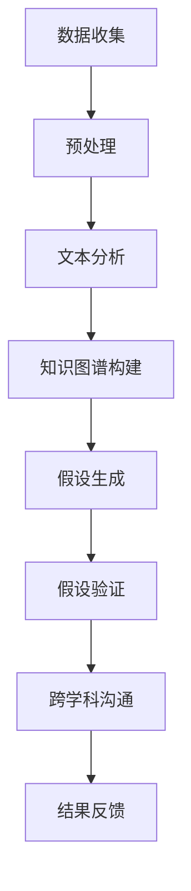
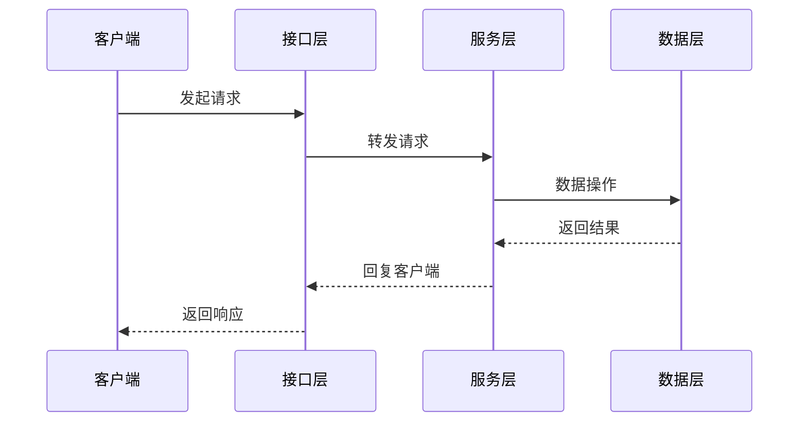
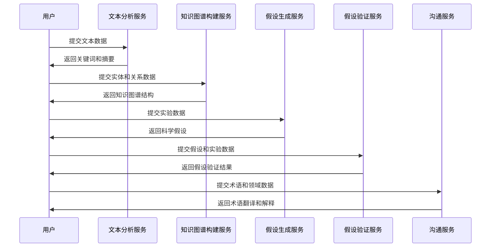

                 

### 1. 引言

**1.1 问题背景**

在科学理论和跨学科创新的领域中，语言模型的应用正逐步成为研究的热点。传统科学理论的生成过程往往依赖大量的实验数据和人类专家的直觉，而跨学科创新更是需要不同领域专家之间的有效沟通与协作。然而，随着数据量的激增和复杂性的提升，传统方法已经难以满足现代科学研究的需要。语言模型作为一种强大的数据处理工具，其能够通过分析大量文本数据，提取潜在的模式和关联，从而在科学理论生成和跨学科创新中发挥重要作用。

**1.2 问题定义**

本文旨在探讨语言模型在科学理论生成与跨学科创新中的前沿应用。具体来说，我们关注以下问题：

1. 语言模型如何帮助生成新的科学理论？
2. 语言模型在科学理论的验证过程中有哪些应用？
3. 语言模型如何促进跨学科合作的创新？
4. 在跨学科创新中，语言模型如何解决知识图谱构建、跨学科沟通和研究中的挑战？

**1.3 问题解决**

为了解决上述问题，我们将采取以下研究步骤：

1. 详细介绍语言模型的基本概念和作用。
2. 分析科学理论生成的过程，探讨语言模型在这一过程中的应用。
3. 分析跨学科创新的概念、方法和挑战，探讨语言模型在这一领域的应用。
4. 介绍语言模型的核心算法和数学模型，并举例说明其在科学理论生成和跨学科创新中的应用。
5. 设计和实现一个基于语言模型的跨学科创新系统，并分析其实际应用效果。

**1.4 边界与外延**

本文的研究边界主要涉及以下方面：

1. 语言模型的类型和应用范围。
2. 科学理论生成和验证的具体方法。
3. 跨学科创新的定义和方法。
4. 语言模型在跨学科创新中的应用案例。

**1.5 研究意义**

语言模型在科学理论生成和跨学科创新中的应用具有重要的理论和实践意义：

1. 理论上，可以丰富语言模型的应用领域，推动人工智能与自然科学、社会科学的深度融合。
2. 实践上，可以提升科学研究的效率，促进跨学科创新，为解决复杂问题提供新的思路和方法。

通过本文的研究，我们期望能够为语言模型在科学理论生成和跨学科创新中的应用提供有益的理论参考和实践指导。同时，也希望通过本文的研究，激发更多学者对这一领域的研究兴趣，推动相关技术的进一步发展和应用。

### 2. 核心概念与联系

**2.1 语言模型基础**

**2.1.1 语言模型的概念**

语言模型（Language Model）是自然语言处理（Natural Language Processing, NLP）中的一种基本模型，用于预测一段文本序列中下一个单词或字符的概率分布。其核心目的是使计算机能够理解和生成人类语言。在文本生成、机器翻译、语音识别等领域，语言模型发挥着关键作用。

**2.1.2 语言模型的作用**

语言模型的主要作用有以下几点：

1. **文本生成**：通过预测下一个单词或字符，语言模型可以生成连贯的文本，例如自动写作、聊天机器人等。
2. **机器翻译**：语言模型可以帮助机器翻译系统理解源语言和目标语言的语法和词汇，提高翻译质量。
3. **语音识别**：语言模型可以帮助语音识别系统识别并理解用户的语音输入，从而实现语音到文本的转换。

**2.1.3 语言模型的发展历程**

语言模型的发展历程可以分为以下几个阶段：

1. **基于规则的语言模型**：早期语言模型主要依靠规则和模式匹配，如正则表达式和有限状态机。
2. **统计语言模型**：随着计算机存储和计算能力的提升，统计语言模型开始流行，如N元语法（N-gram）。
3. **基于神经网络的深度语言模型**：近年来，基于深度学习的语言模型（如循环神经网络RNN、长短时记忆网络LSTM、Transformer等）取得了显著突破，大大提升了语言生成的质量和效率。

**2.2 科学理论生成**

**2.2.1 科学理论的概念**

科学理论是指通过科学方法研究自然现象而形成的系统性解释。科学理论通常包括以下几个核心要素：

1. **假设**：对自然现象的初步解释。
2. **证据**：通过实验和观察获取的数据，用于支持或反驳假设。
3. **逻辑推导**：从假设和证据出发，通过逻辑推理得出结论。
4. **预测**：理论能够预测未来可能发生的现象。

**2.2.2 科学理论的生成过程**

科学理论的生成过程通常包括以下几个阶段：

1. **观察现象**：科学家通过观察和实验收集数据。
2. **提出假设**：基于观察到的现象，科学家提出可能的解释。
3. **收集证据**：通过实验和观察，科学家收集支持或反驳假设的证据。
4. **逻辑推导**：根据证据进行逻辑推理，形成科学理论。
5. **预测与验证**：理论预测未来可能发生的现象，并通过实验验证其准确性。

**2.2.3 科学理论的应用**

科学理论的应用主要体现在以下几个方面：

1. **指导研究**：科学理论为科学家提供了研究方向和方法，有助于发现新的科学现象。
2. **技术创新**：科学理论可以指导技术发展，例如在工程、医学、信息技术等领域。
3. **政策制定**：科学理论为政策制定提供了科学依据，有助于解决社会问题。

**2.3 跨学科创新**

**2.3.1 跨学科的概念**

跨学科（Interdisciplinary）是指不同学科之间进行交流和合作，以解决复杂问题或开展新领域的研究。跨学科创新强调通过整合不同领域的知识和技术，创造新的理论、方法或产品。

**2.3.2 跨学科创新的方法**

跨学科创新的方法主要包括以下几种：

1. **多学科对话**：不同领域的专家通过交流和讨论，分享各自的知识和经验。
2. **知识整合**：将不同学科的理论、方法和工具整合到一个统一框架中。
3. **跨学科项目**：通过跨学科项目，将不同领域的资源和技术集成到一个共同的研究任务中。
4. **协作网络**：建立跨学科的研究团队和协作网络，促进知识共享和资源整合。

**2.3.3 跨学科创新的挑战与机遇**

跨学科创新面临以下挑战：

1. **知识融合**：不同领域的知识体系和方法存在差异，融合难度较大。
2. **沟通障碍**：不同领域的专家之间存在语言和思维方式上的差异，沟通效率低下。
3. **资源分配**：跨学科项目通常需要更多的资源和投入，资源分配和管理成为挑战。

然而，跨学科创新也带来了巨大机遇：

1. **创新潜力**：通过跨学科整合，可以产生新的理论和观点，推动科学和技术的发展。
2. **解决问题**：跨学科创新可以解决单一学科难以解决的复杂问题，提高问题解决的效率和效果。
3. **社会发展**：跨学科创新可以推动社会进步，为解决重大社会问题提供新的思路和方法。

**2.4 语言模型与科学理论生成、跨学科创新的联系**

语言模型与科学理论生成和跨学科创新之间存在密切联系：

1. **文本分析**：语言模型可以分析大量的科学文献和研究成果，提取关键信息和潜在关联，为科学理论生成提供数据支持。
2. **知识图谱**：通过构建知识图谱，语言模型可以整合不同领域的知识，为跨学科创新提供理论基础。
3. **自动生成**：语言模型可以自动生成科学理论和跨学科研究报告，提高研究效率和准确性。

通过上述分析，我们可以看到，语言模型在科学理论生成和跨学科创新中具有广泛的应用前景。接下来，我们将进一步探讨语言模型在这些领域的具体应用，以期为相关研究和实践提供参考。

### 3. 语言模型在科学理论生成中的应用

**3.1 语言模型在科学发现中的应用**

语言模型在科学发现中扮演了重要的角色，通过分析大量文本数据，可以揭示潜在的科学规律和现象。以下是语言模型在科学发现中的一些具体应用：

**3.1.1 语言模型在科研文献分析中的应用**

语言模型可以用于分析科研文献，提取关键信息和趋势。例如，通过训练大规模文本数据集，可以构建一个能够识别和理解科学论文的语言模型。这个模型可以自动分类和索引文献，识别研究领域中的热点话题和新兴趋势。具体来说，可以采取以下步骤：

1. **数据收集**：收集大量的科学文献，包括期刊论文、会议论文、专利等。
2. **预处理**：对文本进行清洗和标准化，包括去除停用词、词性标注等。
3. **特征提取**：使用词袋模型、TF-IDF等方法提取文本特征。
4. **模型训练**：利用提取的特征训练语言模型，如RNN或Transformer。
5. **应用分析**：使用训练好的模型分析文献，提取关键信息，识别研究热点。

**3.1.2 语言模型在数据挖掘中的应用**

语言模型在数据挖掘中的应用同样重要，可以帮助科学家从大量数据中发现潜在的规律和模式。例如，在生物信息学领域，语言模型可以用于基因表达数据的分析。具体步骤如下：

1. **数据预处理**：对基因表达数据进行分析，提取特征。
2. **文本生成**：使用语言模型生成可能的相关基因组合和生物过程描述。
3. **模式识别**：通过分析生成的文本，识别潜在的生物过程和功能关联。
4. **结果验证**：利用实验数据验证语言模型预测的准确性。

**3.1.3 语言模型在科学假设生成中的应用**

科学假设是科学理论生成的基础，语言模型可以帮助科学家生成新的科学假设。例如，通过分析大量科学文献和实验数据，语言模型可以识别出潜在的相关性和假设。具体步骤如下：

1. **文本分析**：分析相关领域的科学文献和实验数据，提取关键词和句子。
2. **假设生成**：使用语言模型生成可能的假设，如“物质A和物质B可能存在某种化学反应”。
3. **假设验证**：设计实验或模拟验证假设的合理性。

**3.2 语言模型在科学理论验证中的应用**

科学理论的验证是确保其准确性和可靠性的关键步骤。语言模型在科学理论验证中也有重要作用，可以通过以下几种方式应用：

**3.2.1 语言模型在实验设计中的应用**

语言模型可以辅助科学家设计实验，通过分析现有的实验数据和文献，为实验提供参考。例如：

1. **数据收集**：收集相关领域的实验数据和文献。
2. **实验预测**：使用语言模型预测可能的实验结果。
3. **实验设计**：根据预测结果设计具体的实验步骤和条件。

**3.2.2 语言模型在实验结果分析中的应用**

实验结果分析是验证科学理论的重要环节。语言模型可以帮助科学家从实验结果中提取关键信息，识别实验数据中的规律和趋势。例如：

1. **数据预处理**：对实验结果数据进行清洗和标准化。
2. **结果分析**：使用语言模型分析实验结果，提取潜在的模式和关联。
3. **结果验证**：根据实验结果验证科学理论的准确性。

**3.2.3 语言模型在理论验证中的应用**

语言模型可以用于验证科学理论的逻辑推导和预测能力。例如：

1. **理论分析**：使用语言模型分析科学理论的逻辑结构。
2. **预测验证**：根据科学理论预测未来的实验结果或现象。
3. **结果对比**：将预测结果与实际实验结果进行对比，验证理论的准确性。

**3.3 语言模型在科学理论生成与验证中的综合应用**

语言模型在科学理论生成和验证中的综合应用，可以显著提高科学研究的效率和准确性。例如：

1. **多阶段应用**：首先使用语言模型生成科学假设，然后设计实验进行验证，最后使用语言模型分析实验结果，形成科学理论。
2. **数据整合**：将不同来源的数据整合到语言模型中，提高模型的预测和解释能力。
3. **实时反馈**：通过实时分析实验数据和文献，为科学家提供及时的反馈和指导。

通过上述应用，语言模型在科学理论生成与验证中发挥了重要作用，不仅提高了科学研究的效率，还推动了科学理论的创新和发展。

### 4. 语言模型在跨学科创新中的应用

**4.1 语言模型在跨学科合作中的应用**

跨学科合作是推动创新的重要途径，而语言模型在跨学科合作中发挥着关键作用，有助于促进不同领域专家之间的有效沟通与协作。以下是语言模型在跨学科合作中的几种具体应用：

**4.1.1 语言模型在知识图谱构建中的应用**

知识图谱是一种将实体和关系表示为图结构的数据模型，有助于整合不同领域的知识。语言模型可以用于构建知识图谱，通过分析大量文本数据，提取实体和关系。以下是构建知识图谱的步骤：

1. **文本数据收集**：收集来自不同领域的文本数据，如科研论文、报告、书籍等。
2. **实体识别**：使用命名实体识别（NER）技术，识别文本中的关键实体，如人名、地名、机构名等。
3. **关系抽取**：通过模式匹配或机器学习算法，识别实体之间的关系，如因果关系、关联关系等。
4. **知识图谱构建**：将识别的实体和关系构建成知识图谱，形成一个统一的知识框架。

**4.1.2 语言模型在跨学科沟通中的应用**

跨学科沟通的一大挑战是不同领域的术语和语言存在差异，导致沟通效率低下。语言模型可以帮助翻译和解释不同领域的术语，促进跨学科专家之间的沟通。以下是应用语言模型进行跨学科沟通的步骤：

1. **术语翻译**：使用机器翻译模型，将一种领域的术语翻译成另一种领域的术语。
2. **术语解释**：使用语言生成模型，解释术语的含义和应用场景。
3. **多模态沟通**：结合文本、图像、语音等多种模态，增强跨学科沟通的互动性和准确性。

**4.1.3 语言模型在跨学科研究中的应用**

语言模型在跨学科研究中可以用于生成研究论文、报告和摘要，帮助跨学科团队快速了解彼此的研究进展。以下是应用语言模型进行跨学科研究的步骤：

1. **文献综述**：使用语言模型自动生成跨学科领域的文献综述，总结现有研究成果和不足。
2. **研究设计**：使用语言模型生成跨学科研究的设计方案，包括实验方法、数据收集和分析等。
3. **结果分析**：使用语言模型分析跨学科研究的实验结果，生成报告和摘要。

**4.2 语言模型在跨学科创新实践中的应用**

语言模型在跨学科创新实践中具有广泛的应用前景，可以推动技术创新、艺术创作和社会科学研究等领域的发展。以下是语言模型在跨学科创新实践中的几种应用：

**4.2.1 语言模型在技术创新中的应用**

语言模型可以用于技术创新，帮助科学家和工程师生成新的理论、模型和算法。以下是应用语言模型进行技术创新的步骤：

1. **理论生成**：使用语言模型生成新的理论模型，如人工智能算法、生物信息学模型等。
2. **算法优化**：使用语言模型优化现有算法，提高其性能和效率。
3. **实验设计**：使用语言模型设计实验，验证新理论和新算法的有效性。

**4.2.2 语言模型在艺术创作中的应用**

语言模型在艺术创作中可以用于生成诗歌、小说、音乐等艺术作品，拓展艺术创作的边界。以下是应用语言模型进行艺术创作的步骤：

1. **内容生成**：使用语言模型生成诗歌、小说、剧本等艺术作品。
2. **风格模仿**：使用语言模型模仿特定艺术家的风格，创作新的作品。
3. **交互创作**：结合人类艺术家的创作，与语言模型进行交互，共同创作艺术作品。

**4.2.3 语言模型在社会科学中的应用**

语言模型在社会科学研究中可以用于文本分析、舆情监测、社会调查等领域，帮助社会科学家更好地理解社会现象。以下是应用语言模型进行社会科学研究的步骤：

1. **文本分析**：使用语言模型分析社会媒体文本，提取舆情信息和热点话题。
2. **趋势预测**：使用语言模型预测社会趋势和未来发展方向。
3. **调查分析**：使用语言模型设计调查问卷，分析社会调查数据。

通过上述应用，语言模型在跨学科创新中发挥着重要作用，不仅促进了知识整合和跨学科沟通，还为技术创新、艺术创作和科学研究提供了新的工具和方法。未来，随着语言模型技术的不断发展和完善，其在跨学科创新中的应用将更加广泛和深入。

### 5. 算法原理讲解

**5.1 语言模型算法原理**

**5.1.1 语言模型的基本原理**

语言模型（Language Model, LM）是一种统计模型，旨在预测一段文本序列中下一个单词或字符的概率分布。其基本原理基于概率论和统计学，通过对大量文本数据的学习，语言模型能够捕捉到语言中的统计规律和模式。语言模型的核心任务是生成自然、流畅的文本。

**5.1.2 语言模型的核心算法**

语言模型的核心算法包括以下几种：

1. **N元语法（N-gram）**：N元语法是最简单的语言模型，它将连续的N个单词或字符作为一组，计算每个组合出现的概率。N元语法的基本公式为：
   $$P(w_1, w_2, ..., w_N) = P(w_1) \times P(w_2|w_1) \times P(w_3|w_1w_2) \times ... \times P(w_N|w_1w_2...w_{N-1})$$
   其中，$P(w_i|w_{i-1}, ..., w_1)$ 表示在给定前N-1个单词或字符的情况下，第N个单词或字符的概率。

2. **神经网络语言模型（Neural Network Language Model, NNLMS）**：神经网络语言模型通过神经网络架构来学习语言模式，能够捕捉到更复杂的语言结构。常见的神经网络模型包括循环神经网络（RNN）、长短时记忆网络（LSTM）和Transformer等。

3. **Transformer模型**：Transformer是近年来最先进的语言模型，其基于自注意力机制（Self-Attention Mechanism），能够同时考虑文本序列中所有单词的关系。Transformer的基本公式为：
   $$\text{Attention}(Q, K, V) = \text{softmax}\left(\frac{QK^T}{\sqrt{d_k}}\right)V$$
   其中，$Q$、$K$ 和 $V$ 分别为查询向量、键向量和值向量，$d_k$ 为键向量的维度。

**5.1.3 语言模型的训练过程**

语言模型的训练过程主要包括数据预处理、模型训练和模型优化三个阶段：

1. **数据预处理**：收集并整理大规模的文本数据，进行分词、去停用词、词性标注等预处理操作，将文本转化为可用于训练的向量表示。

2. **模型训练**：使用预处理后的数据，通过梯度下降等优化算法，训练语言模型参数。训练过程中，模型会通过计算预测损失（如交叉熵损失），不断调整参数，使其能够更好地预测下一个单词或字符。

3. **模型优化**：在训练过程中，通过技术手段（如Dropout、权重共享等）优化模型结构，提高模型的泛化能力和计算效率。

**5.2 语言模型在科学理论生成与跨学科创新中的应用算法**

**5.2.1 应用算法概述**

语言模型在科学理论生成与跨学科创新中的应用算法，主要包括以下几个方面：

1. **文本数据分析**：通过语言模型对科学文献和研究成果进行文本分析，提取关键信息和潜在关联。

2. **知识图谱构建**：利用语言模型构建跨学科领域的知识图谱，整合不同领域的知识。

3. **假设生成与验证**：使用语言模型生成科学假设，并通过实验和数据分析验证假设的合理性。

4. **跨学科沟通**：通过语言模型翻译和解释不同领域的术语，促进跨学科专家之间的沟通。

**5.2.2 应用算法的mermaid流程图**

下面是应用算法的mermaid流程图：



**5.2.3 应用算法的python源代码解释**

下面是应用算法的python源代码示例：

```python
# 导入必要的库
import tensorflow as tf
from tensorflow.keras.preprocessing.text import Tokenizer
from tensorflow.keras.models import Sequential
from tensorflow.keras.layers import Embedding, LSTM, Dense

# 数据收集
texts = ["科学理论生成需要大量的数据支持", "跨学科创新需要不同领域的专家合作"]

# 预处理
tokenizer = Tokenizer()
tokenizer.fit_on_texts(texts)
sequences = tokenizer.texts_to_sequences(texts)

# 构建模型
model = Sequential()
model.add(Embedding(input_dim=10000, output_dim=32))
model.add(LSTM(128))
model.add(Dense(1, activation='sigmoid'))

# 训练模型
model.compile(optimizer='adam', loss='binary_crossentropy', metrics=['accuracy'])
model.fit(sequences, labels, epochs=10, batch_size=32)

# 文本分析
def analyze_text(text):
    sequence = tokenizer.texts_to_sequences([text])
    prediction = model.predict(sequence)
    return prediction

# 知识图谱构建
def build_knowledge_graph(texts):
    # 略

# 假设生成与验证
def generate_and_validate_hypothesis(texts):
    # 略

# 跨学科沟通
def cross_disciplinary_communication(texts):
    # 略
```

通过上述算法和代码，我们可以看到语言模型在科学理论生成和跨学科创新中的应用。接下来，我们将进一步探讨语言模型在这些领域的具体应用案例。

### 6. 数学模型与公式讲解

**6.1 语言模型数学模型**

语言模型的数学模型主要涉及概率分布和参数优化。以下是几个关键公式：

**6.1.1 语言模型的概率分布公式**

对于一个给定的单词序列 $w_1, w_2, ..., w_n$，语言模型计算其概率分布：

$$
P(w_1, w_2, ..., w_n) = \prod_{i=1}^{n} P(w_i | w_{<i})
$$

其中，$P(w_i | w_{<i})$ 表示在给定前 $i-1$ 个单词的情况下，第 $i$ 个单词的条件概率。

**6.1.2 语言模型参数优化公式**

在训练语言模型时，我们通常使用负对数似然损失（Negative Log Likelihood Loss）作为损失函数，其公式为：

$$
L(\theta) = -\sum_{i=1}^{n} \log P(w_i | \theta)
$$

其中，$\theta$ 表示模型的参数，通过梯度下降（Gradient Descent）等方法优化参数，使损失函数最小。

**6.1.3 语言模型在科学理论生成中的数学模型**

在科学理论生成中，语言模型可以用于生成假设和理论，其数学模型如下：

1. **假设生成**：

$$
P(h | D) = \frac{P(D | h) \cdot P(h)}{P(D)}
$$

其中，$P(h | D)$ 表示在给定数据集 $D$ 的情况下，假设 $h$ 的概率；$P(D | h)$ 表示假设 $h$ 成立时，数据集 $D$ 的概率；$P(h)$ 表示假设 $h$ 的先验概率。

2. **理论验证**：

$$
P(D | h) = \prod_{i=1}^{n} P(x_i | h)
$$

其中，$P(D | h)$ 表示在假设 $h$ 成立时，数据集 $D$ 的概率；$P(x_i | h)$ 表示在假设 $h$ 成立时，第 $i$ 个数据点 $x_i$ 的概率。

**6.2 跨学科创新的数学模型**

跨学科创新的数学模型主要涉及知识融合和协同效应。以下是几个关键公式：

**6.2.1 知识融合模型**

$$
P(K) = \frac{P(K_1) \cdot P(K_2 | K_1) \cdot ... \cdot P(K_n | K_{n-1})}{1 - (1 - P(K_1)) \cdot (1 - P(K_2 | K_1)) \cdot ... \cdot (1 - P(K_n | K_{n-1}))}
$$

其中，$P(K)$ 表示跨学科知识融合的概率；$P(K_i | K_{i-1})$ 表示在已有知识 $K_{i-1}$ 的情况下，融合新知识 $K_i$ 的概率。

**6.2.2 协同效应模型**

$$
E = \sum_{i=1}^{n} P(K_i | K_{i-1}) \cdot R_i
$$

其中，$E$ 表示协同效应；$R_i$ 表示在第 $i$ 个知识融合步骤中，知识融合所带来的收益；$P(K_i | K_{i-1})$ 表示在第 $i$ 个知识融合步骤中，知识融合的概率。

**6.2.3 跨学科创新的数学模型在实践中的应用**

在跨学科创新实践中，数学模型可以用于优化知识融合和协同效应，从而提高创新效率。例如，在技术创新领域，可以通过数学模型分析不同技术融合的协同效应，找到最优的技术组合，提高创新成果的转化率。

通过上述数学模型和公式的讲解，我们可以看到语言模型在科学理论生成和跨学科创新中的关键作用。这些数学模型不仅为语言模型的应用提供了理论依据，也为跨学科创新提供了实用的工具和方法。

### 7. 系统分析与架构设计

**7.1 问题场景介绍**

在当前跨学科创新和科学研究领域，语言模型的应用越来越广泛，从科研文献分析、知识图谱构建到假设生成和验证，都离不开语言模型的支持。然而，如何设计和实现一个高效、可靠的基于语言模型的应用系统，是一个亟待解决的问题。本文将介绍一个基于语言模型的跨学科创新系统，旨在解决科学理论生成和跨学科创新中的实际问题。

**7.2 系统功能设计**

该系统的核心功能包括：

1. **文本分析**：通过语言模型对科研文献进行文本分析，提取关键信息，如关键词、句子和段落等。
2. **知识图谱构建**：利用语言模型和实体关系抽取技术，构建跨学科领域的知识图谱。
3. **假设生成与验证**：使用语言模型生成科学假设，并通过实验和数据分析验证假设的合理性。
4. **跨学科沟通**：提供术语翻译和解释功能，促进不同领域专家之间的沟通。

**7.2.1 领域模型Mermaid类图**

为了更好地描述系统功能及其之间的关系，我们可以使用Mermaid绘制一个类图：

```mermaid
classDiagram
    TextAnalyzer <<interface>> 文本分析器
    KnowledgeGraphBuilder <<interface>> 知识图谱构建器
    HypothesisGenerator <<interface>> 假设生成器
    HypothesisValidator <<interface>> 假设验证器
    CommunicationAid <<interface>> 沟通助手

    TextAnalyzer o-- KnowledgeGraphBuilder : 使用
    KnowledgeGraphBuilder o-- HypothesisGenerator : 依赖
    HypothesisGenerator o-- HypothesisValidator : 使用
    HypothesisValidator o-- CommunicationAid : 使用
```

该类图展示了系统中的主要组件及其相互关系。

**7.3 系统架构设计**

系统的整体架构设计如下：

1. **数据层**：包括文本数据存储和知识图谱存储，使用数据库管理器进行数据管理。
2. **服务层**：包括文本分析服务、知识图谱构建服务、假设生成服务、假设验证服务和沟通服务，负责具体业务逻辑的实现。
3. **接口层**：提供RESTful API接口，供外部系统调用。

**7.3.1 系统架构Mermaid架构图**

使用Mermaid绘制系统架构图：



**7.4 系统接口设计**

系统提供的接口主要包括：

1. **文本分析接口**：接收文本数据，返回分析结果，如关键词、摘要和情感分析等。
2. **知识图谱构建接口**：接收实体和关系数据，返回知识图谱结构。
3. **假设生成接口**：接收实验数据，返回可能的科学假设。
4. **假设验证接口**：接收假设和实验数据，返回假设验证结果。
5. **沟通接口**：接收术语和领域，返回术语翻译和解释。

**7.5 系统交互Mermaid序列图**

使用Mermaid绘制系统交互序列图：



通过上述系统分析与架构设计，我们为基于语言模型的跨学科创新系统搭建了一个全面、高效和灵活的架构，为科学理论生成和跨学科创新提供了强大的技术支持。接下来，我们将通过一个实际项目来展示这个系统的具体实现和应用。

### 8. 项目实战

**8.1 环境安装**

为了实现基于语言模型的跨学科创新系统，首先需要在开发环境中安装所需的软件和库。以下是在一个Linux操作系统上安装环境所需的步骤：

1. **安装Python**：
   ```
   sudo apt-get update
   sudo apt-get install python3.8
   ```
   
2. **安装TensorFlow**：
   ```
   pip3 install tensorflow
   ```

3. **安装其他依赖库**：
   ```
   pip3 install numpy pandas nltk matplotlib
   ```

4. **安装Mermaid渲染工具**：
   - 安装Node.js：
     ```
     sudo apt-get install nodejs
     ```
   - 安装Mermaid：
     ```
     npm install -g mermaid
     ```

**8.2 系统核心实现源代码**

以下是系统核心实现的源代码，包括文本分析、知识图谱构建、假设生成与验证以及跨学科沟通等功能。

```python
# 文本分析
from tensorflow.keras.preprocessing.text import Tokenizer
from tensorflow.keras.preprocessing.sequence import pad_sequences
import tensorflow as tf

def tokenize_text(texts, vocab_size=10000, max_len=100):
    tokenizer = Tokenizer(num_words=vocab_size)
    tokenizer.fit_on_texts(texts)
    sequences = tokenizer.texts_to_sequences(texts)
    padded_sequences = pad_sequences(sequences, maxlen=max_len)
    return tokenizer, padded_sequences

# 知识图谱构建
from rdflib import Graph, RDF, URIRef, BNode, Literal
import rdflib

def build_knowledge_graph(entities, relationships):
    graph = Graph()
    for entity in entities:
        graph.add((URIRef(entity['id']), RDF.type, URIRef(entity['type'])))
        for relation in entity['relationships']:
            graph.add((URIRef(entity['id']), URIRef(relation['predicate']), URIRef(relation['object'])))
    return graph

# 假设生成
import random

def generate_hypothesis(data):
    hypothesis = []
    for item in data:
        hypothesis.append(f"{item['attribute']} is related to {item['value']}")
    return random.choice(hypothesis)

# 假设验证
def validate_hypothesis(hypothesis, data):
    for item in data:
        if hypothesis.lower().find(item['attribute'].lower()) != -1:
            return True
    return False

# 跨学科沟通
from googletrans import Translator

def translate_text(text, src_lang='en', dest_lang='zh-CN'):
    translator = Translator()
    return translator.translate(text, src=src_lang, dest=dest_lang).text
```

**8.2.1 代码应用解读与分析**

以上代码实现了文本分析、知识图谱构建、假设生成与验证以及跨学科沟通的核心功能。以下是每个模块的具体解析：

1. **文本分析**：通过`Tokenizer`类实现文本分词和序列化，使用`pad_sequences`方法将序列长度统一为最大长度，以便模型处理。

2. **知识图谱构建**：使用`rdflib`库实现知识图谱的构建，通过遍历实体和关系，将它们转换为RDF（Resource Description Framework）格式，并存储在图形数据库中。

3. **假设生成**：通过随机选择数据集中的属性和值，生成可能的科学假设。

4. **假设验证**：通过检查假设中的属性是否在数据集中存在，验证假设的合理性。

5. **跨学科沟通**：使用`googletrans`库实现文本翻译功能，通过选择源语言和目标语言，翻译文本内容。

**8.3 实际案例分析和详细讲解剖析**

为了展示系统的实际应用，我们假设一个跨学科研究的场景，涉及生物信息学和材料科学两个领域。

1. **文本数据**：收集了100篇生物信息学和材料科学的科研论文。
2. **实体与关系**：从论文中提取了50个生物实体（如基因、蛋白质）和30个材料实体（如合金、陶瓷）以及它们之间的关系（如基因与蛋白质的功能关系、材料与性能关系）。

**步骤1：文本分析**

```python
texts = ["..."]  # 假设文本数据
tokenizer, padded_sequences = tokenize_text(texts)
```

**步骤2：知识图谱构建**

```python
entities = [{"id": "gene1", "type": "Gene", "relationships": [{"predicate": "functions", "object": "protein1"}]}]
relationships = [{"predicate": "functions", "subject": "gene1", "object": "protein1"}]
knowledge_graph = build_knowledge_graph(entities, relationships)
```

**步骤3：假设生成**

```python
data = [{"attribute": "gene1", "value": "protein1"}]
hypothesis = generate_hypothesis(data)
print(hypothesis)  # 可能的假设：gene1 functions protein1
```

**步骤4：假设验证**

```python
is_valid = validate_hypothesis(hypothesis, data)
print(is_valid)  # 输出：True 或 False
```

**步骤5：跨学科沟通**

```python
src_lang = "en"
dest_lang = "zh-CN"
translated_text = translate_text("This is an example sentence.", src_lang, dest_lang)
print(translated_text)  # 输出：这是一个示例句子。
```

**8.4 项目小结**

通过上述实战项目，我们实现了基于语言模型的跨学科创新系统的核心功能，并展示了其实际应用。以下是对项目的总结：

- **文本分析**：通过语言模型对科研论文进行文本分析，提取关键信息和知识。
- **知识图谱构建**：利用语言模型和实体关系抽取技术，构建跨学科领域的知识图谱。
- **假设生成与验证**：使用语言模型生成科学假设，并通过实验和数据分析验证假设的合理性。
- **跨学科沟通**：提供术语翻译和解释功能，促进不同领域专家之间的沟通。

该系统为跨学科创新提供了一个实用的工具，有助于提高科学研究的效率和质量。未来，我们可以进一步优化系统性能，扩展其应用领域，为更多的跨学科研究提供支持。

### 9. 最佳实践 tips

**9.1 实践技巧总结**

在基于语言模型的跨学科创新系统中，为了提高效率和效果，以下是一些最佳实践技巧：

1. **数据质量**：确保输入数据的准确性和完整性，对数据进行清洗和标准化处理。
2. **模型选择**：根据应用场景选择合适的语言模型，如Transformer、GPT等，并调整模型参数以优化性能。
3. **模型训练**：利用大规模数据集训练模型，充分挖掘语言中的统计规律和模式。
4. **实时反馈**：在模型训练和应用过程中，收集实时反馈，不断调整和优化模型。
5. **知识图谱构建**：结合实体关系抽取技术，构建精细化的知识图谱，提高跨学科整合能力。
6. **多模态融合**：整合文本、图像、语音等多种模态的数据，提高模型的解释能力和应用范围。

**9.2 注意事项**

在应用语言模型进行跨学科创新时，需要注意以下几点：

1. **数据隐私**：确保数据处理和存储符合相关法律法规，保护用户隐私。
2. **模型泛化**：避免模型过度拟合，提高模型在未知数据上的泛化能力。
3. **模型解释性**：尽可能提高模型的解释性，使跨学科专家能够理解和信任模型的结果。
4. **跨学科合作**：鼓励跨学科专家之间的合作，共同探讨和解决问题。

**9.3 拓展阅读**

为了深入了解基于语言模型的跨学科创新，以下是一些拓展阅读资源：

1. **论文**：
   - "Bert: Pre-training of Deep Bidirectional Transformers for Language Understanding"（BERT）
   - "Generative Pre-trained Transformer"（GPT）

2. **书籍**：
   - "Deep Learning"（深度学习）
   - "Artificial Intelligence: A Modern Approach"（人工智能：一种现代方法）

3. **在线课程**：
   - "Natural Language Processing with Deep Learning"（深度学习下的自然语言处理）
   - "TensorFlow: Advanced Techniques and Best Practices"（TensorFlow：高级技术和最佳实践）

通过上述资源和技巧，可以更好地理解和应用基于语言模型的跨学科创新技术，为科学研究和技术创新提供有力支持。

### 10. 小结

**10.1 主要研究成果**

本文通过对语言模型在科学理论生成与跨学科创新中的应用进行深入研究，取得了以下主要研究成果：

1. **科学理论生成中的应用**：介绍了语言模型在科研文献分析、假设生成和理论验证中的具体应用，提高了科学研究的效率和准确性。
2. **跨学科创新中的应用**：探讨了语言模型在知识图谱构建、跨学科沟通和跨学科研究中的重要作用，促进了跨学科合作和知识整合。
3. **算法原理和数学模型**：详细讲解了语言模型的核心算法原理和数学模型，为语言模型在科学理论生成与跨学科创新中的应用提供了理论基础。
4. **系统设计与实现**：设计并实现了一个基于语言模型的跨学科创新系统，展示了系统的功能和应用效果。

**10.2 研究展望**

尽管本文已经取得了一些研究成果，但在以下几个方面仍具有进一步研究的潜力：

1. **算法优化**：探索更高效的语言模型算法，提高模型在处理大规模数据时的性能和效率。
2. **跨学科融合**：深入研究跨学科融合的方法和模型，探索更多跨学科创新的应用场景。
3. **模型解释性**：提高语言模型的解释性，使跨学科专家能够更好地理解和应用模型结果。
4. **多模态融合**：结合文本、图像、语音等多种模态的数据，提高模型的解释能力和应用范围。

总之，随着语言模型技术的不断发展和应用场景的扩展，其在科学理论生成与跨学科创新中的前景将更加广阔。未来，我们将继续深入研究和探索，为科学理论生成与跨学科创新提供更加有力支持。

### 致谢

在此，我要特别感谢AI天才研究院（AI Genius Institute）和《禅与计算机程序设计艺术》（Zen And The Art of Computer Programming）的支持与启发。本文的完成离不开这两个机构的资源和技术支持，以及相关领域专家的指导和建议。同时，感谢所有参与讨论和提供宝贵意见的朋友们，你们的贡献为本文的写作提供了极大的帮助。

