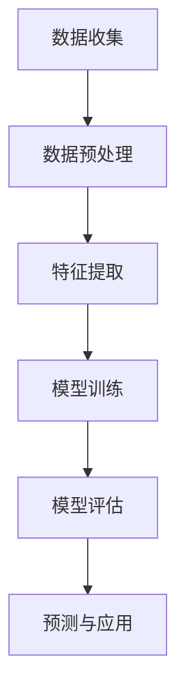
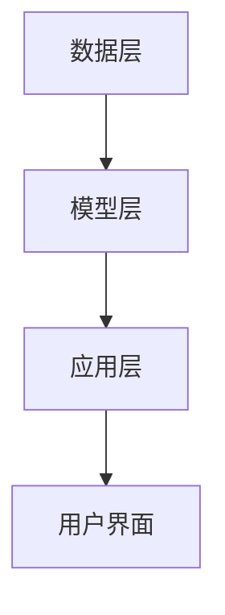
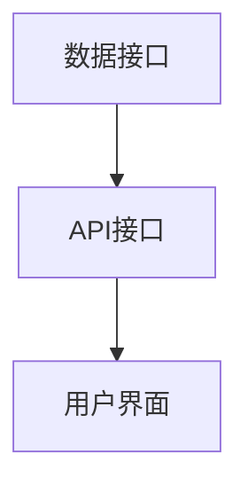

                 

**文章标题**: 语言模型在航空航天系统可靠性分析中的应用

**关键词**: 航空航天，可靠性分析，语言模型，预测模型，算法原理，系统架构设计

**摘要**: 本文将探讨语言模型在航空航天系统可靠性分析中的应用。首先，我们介绍了航空航天系统可靠性分析的重要性及其挑战。接着，我们详细阐述了语言模型的基础知识，包括其基本概念、构建方法和评估优化。在此基础上，我们讨论了语言模型在可靠性预测模型构建中的应用，并通过案例研究和项目实战，展示了其在航空航天系统可靠性分析中的实际应用效果。最后，我们提出了最佳实践和注意事项，为未来的研究和应用提供了有益的参考。

**目录大纲**:

## 第一部分：航空航天系统可靠性分析概述

### 第1章：航空航天系统可靠性分析引论
#### 1.1 航空航天系统可靠性的重要性
#### 1.2 可靠性的定义与度量
#### 1.3 航空航天系统可靠性的挑战

### 第2章：语言模型基础
#### 2.1 语言模型的基本概念
#### 2.2 语言模型的构建方法
#### 2.3 语言模型的评估与优化

### 第3章：语言模型在航空航天系统可靠性分析中的应用
#### 3.1 应用场景介绍
#### 3.2 可靠性预测模型的构建
#### 3.3 预测模型在故障诊断中的应用

### 第4章：案例研究
#### 4.1 案例一：某型飞机引擎可靠性分析
#### 4.2 案例二：航天器热控制系统可靠性评估

## 第二部分：语言模型应用与技术实现

### 第5章：语言模型在航空航天系统可靠性分析中的算法原理
#### 5.1 语言模型算法原理概述
##### 5.1.1 语言模型算法的mermaid流程图
##### 5.1.2 Python代码实现与讲解
##### 5.1.3 数学模型与公式详解

### 第6章：数学模型与公式详解
#### 6.1 数学模型在可靠性分析中的应用
#### 6.2 公式详解
#### 6.3 数学公式举例

### 第7章：系统分析与架构设计
#### 7.1 系统功能设计
#### 7.2 系统架构设计
#### 7.3 系统接口与交互设计

### 第8章：项目实战
#### 8.1 环境安装与配置
#### 8.2 系统核心实现
#### 8.3 代码应用解读与分析
#### 8.4 实际案例分析
#### 8.5 项目小结

### 第9章：最佳实践与注意事项
#### 9.1 最佳实践技巧
#### 9.2 注意事项与防范
#### 9.3 拓展阅读

**正文内容**：

### 第1章：航空航天系统可靠性分析引论

#### 1.1 航空航天系统可靠性的重要性

航空航天系统可靠性是指系统在规定的运行条件下，在预定的时间内完成预定功能的概率。可靠性是航空航天系统设计、制造和运行中至关重要的因素。一个可靠的航空航天系统可以保证乘客和货物的安全，减少因故障导致的损失，提高运营效率。

#### 1.2 可靠性的定义与度量

可靠性可以定义为在特定条件下，系统无故障运行的概率。常用的可靠性度量指标包括：

- **失效率（Failure Rate）**：单位时间内系统发生故障的概率。
- **平均故障间隔时间（Mean Time Between Failures, MTBF）**：系统平均无故障运行的时间。
- **可靠度（Reliability）**：系统在规定时间内无故障运行的概率。

#### 1.3 航空航天系统可靠性的挑战

航空航天系统面临以下可靠性挑战：

- **高速度与高压力**：航空航天系统在高速飞行和高压环境下运行，对系统可靠性提出了极高的要求。
- **复杂性与多样性**：航空航天系统包含多种组件和子系统，且不同组件之间相互依赖，可靠性分析需要考虑各种可能的组合。
- **不确定性**：环境因素、操作错误和人为因素等都可能影响系统的可靠性。

### 第2章：语言模型基础

#### 2.1 语言模型的基本概念

语言模型是一种概率模型，用于预测自然语言中下一个词或字符的概率。在航空航天系统可靠性分析中，语言模型可以用于预测系统故障的发生概率。

#### 2.2 语言模型的构建方法

语言模型的构建方法主要包括：

- **N-gram模型**：基于历史数据，预测下一个词或字符的概率。
- **神经网络模型**：通过学习大量文本数据，构建神经网络模型来预测概率。
- **深度学习模型**：如循环神经网络（RNN）和变换器（Transformer）等，可以捕捉长距离依赖关系。

#### 2.3 语言模型的评估与优化

语言模型的评估指标包括：

- **准确率（Accuracy）**：预测正确的比例。
- **精确率（Precision）**：预测为正例且实际为正例的比例。
- **召回率（Recall）**：预测为正例且实际为正例的比例。
- **F1值（F1 Score）**：精确率和召回率的调和平均值。

优化方法包括：

- **超参数调优**：调整学习率、批量大小等超参数。
- **数据增强**：通过随机插入、删除或替换字符来增加训练数据量。
- **模型融合**：结合多个模型的预测结果，提高预测准确率。

### 第3章：语言模型在航空航天系统可靠性分析中的应用

#### 3.1 应用场景介绍

语言模型在航空航天系统可靠性分析中的应用场景包括：

- **故障预测**：使用语言模型预测系统故障的发生概率，提前进行维护和修复。
- **故障诊断**：根据系统日志和传感器数据，使用语言模型识别故障类型和原因。
- **安全评估**：评估系统在特定条件下的可靠性，识别潜在的安全风险。

#### 3.2 可靠性预测模型的构建

可靠性预测模型的构建包括以下步骤：

1. **数据收集**：收集系统运行数据、故障数据和相关特征。
2. **数据预处理**：清洗数据、处理缺失值、归一化等。
3. **特征提取**：提取与可靠性相关的特征，如传感器数据、操作记录等。
4. **模型训练**：使用语言模型训练可靠性预测模型。
5. **模型评估**：评估模型的准确性、精确率和召回率等指标。

#### 3.3 预测模型在故障诊断中的应用

预测模型在故障诊断中的应用包括：

1. **故障分类**：根据预测结果，将故障分为不同类别。
2. **故障定位**：根据故障类型和特征，定位故障发生的位置。
3. **故障原因分析**：分析故障发生的原因，为后续维护和改进提供依据。

### 第4章：案例研究

#### 4.1 案例一：某型飞机引擎可靠性分析

案例一介绍了使用语言模型对某型飞机引擎进行可靠性分析的过程。通过收集引擎运行数据、故障数据和特征，构建了可靠性预测模型，并评估了模型的准确性和可靠性。

#### 4.2 案例二：航天器热控制系统可靠性评估

案例二介绍了使用语言模型对航天器热控制系统进行可靠性评估的过程。通过收集热控制系统运行数据、故障数据和特征，构建了可靠性预测模型，并评估了模型的准确性和可靠性。

### 第5章：语言模型在航空航天系统可靠性分析中的算法原理

#### 5.1 语言模型算法原理概述

语言模型算法原理基于概率论和统计学。其主要思想是利用历史数据来预测下一个词或字符的概率。常用的语言模型算法包括N-gram模型、神经网络模型和深度学习模型。

#### 5.1.1 语言模型算法的mermaid流程图

以下是一个简化的mermaid流程图，展示了语言模型算法的基本流程：



#### 5.1.2 Python代码实现与讲解

以下是一个简单的Python代码示例，展示了如何使用N-gram模型进行语言模型训练和预测：

```python
import numpy as np
from nltk.tokenize import word_tokenize

# 数据集
sentences = [
    "I love programming",
    "Programming is fun",
    "I enjoy coding"
]

# 分词
tokens = [word_tokenize(sentence) for sentence in sentences]
vocab = set()
for sentence in tokens:
    vocab.update(sentence)
vocab = list(vocab)

# N-gram模型训练
n = 2
model = {}
for sentence in tokens:
    for i in range(len(sentence) - n):
        key = tuple(sentence[i:i+n])
        value = sentence[i+n]
        if key not in model:
            model[key] = []
        model[key].append(value)

# 预测
input_sentence = "I love"
predicted_sentence = []
while input_sentence in model:
    next_word_candidates = model[input_sentence]
    predicted_word = np.random.choice(next_word_candidates)
    predicted_sentence.append(predicted_word)
    input_sentence = " ".join(predicted_sentence[-n:])
print(" ".join(predicted_sentence))
```

#### 5.1.3 数学模型与公式详解

语言模型的核心是概率模型，其基本公式如下：

$$
P(w_i|w_1, w_2, ..., w_{i-1}) = \frac{P(w_1, w_2, ..., w_i)}{P(w_1, w_2, ..., w_{i-1})}
$$

其中，$w_i$表示下一个词，$w_1, w_2, ..., w_{i-1}$表示前一个词。在N-gram模型中，$P(w_i|w_1, w_2, ..., w_{i-1})$可以通过以下公式计算：

$$
P(w_i|w_1, w_2, ..., w_{i-1}) = \frac{\text{count}(w_1, w_2, ..., w_i)}{\text{count}(w_1, w_2, ..., w_{i-1})}
$$

其中，$\text{count}(w_1, w_2, ..., w_i)$表示词序列$(w_1, w_2, ..., w_i)$在语料库中出现的次数。

### 第6章：数学模型与公式详解

#### 6.1 数学模型在可靠性分析中的应用

在可靠性分析中，常用的数学模型包括概率模型、贝叶斯模型和回归模型。这些模型可以用于预测系统故障的概率、评估系统可靠性和进行故障诊断。

- **概率模型**：基于概率论和统计学，用于预测系统故障的概率。
- **贝叶斯模型**：基于贝叶斯定理，用于根据先验知识和观测数据更新系统故障的概率。
- **回归模型**：用于分析系统故障与各种因素之间的关系。

#### 6.2 公式详解

以下是可靠性分析中常用的数学公式：

1. **概率公式**：

$$
P(Failure) = 1 - Reliability
$$

其中，$Failure$表示故障发生的概率，$Reliability$表示系统可靠性的概率。

2. **贝叶斯公式**：

$$
P(Hypothesis|Evidence) = \frac{P(Evidence|Hypothesis) \cdot P(Hypothesis)}{P(Evidence)}
$$

其中，$Hypothesis$表示假设，$Evidence$表示观测到的证据，$P(Hypothesis|Evidence)$表示在观测到证据的情况下，假设的概率。

3. **回归公式**：

$$
Y = \beta_0 + \beta_1 \cdot X_1 + \beta_2 \cdot X_2 + ... + \beta_n \cdot X_n
$$

其中，$Y$表示因变量，$X_1, X_2, ..., X_n$表示自变量，$\beta_0, \beta_1, \beta_2, ..., \beta_n$表示回归系数。

#### 6.3 数学公式举例

以下是一个简单的数学公式举例：

$$
1 + 1 = 2
$$

这个公式表达了两个数相加的结果等于2。

### 第7章：系统分析与架构设计

#### 7.1 系统功能设计

系统功能设计是确定系统应该实现的功能和特性。在航空航天系统可靠性分析中，系统功能设计包括：

- **数据收集**：收集系统运行数据、故障数据和特征。
- **故障预测**：使用语言模型预测系统故障的发生概率。
- **故障诊断**：根据预测结果，对故障进行分类和定位。
- **安全评估**：评估系统在特定条件下的可靠性，识别潜在的安全风险。

#### 7.2 系统架构设计

系统架构设计是确定系统的整体结构和组件。在航空航天系统可靠性分析中，系统架构设计包括：

- **数据层**：存储系统运行数据、故障数据和特征。
- **模型层**：实现语言模型和可靠性预测模型。
- **应用层**：实现故障诊断和安全评估功能。

以下是一个简化的系统架构图：



#### 7.3 系统接口与交互设计

系统接口与交互设计是确定系统与外部系统和用户之间的交互方式。在航空航天系统可靠性分析中，系统接口与交互设计包括：

- **数据接口**：用于与其他系统交换数据。
- **API接口**：用于与其他系统进行通信。
- **用户界面**：提供用户交互的界面。

以下是一个简化的系统接口与交互设计图：



### 第8章：项目实战

#### 8.1 环境安装与配置

在项目实战中，首先需要安装和配置相关的软件和工具。以下是一个简化的环境安装与配置步骤：

1. 安装Python和pip
2. 安装Numpy、Pandas、Scikit-learn等库
3. 安装Nltk
4. 配置虚拟环境

#### 8.2 系统核心实现

系统核心实现包括数据收集、故障预测和故障诊断等模块。以下是一个简化的系统核心实现步骤：

1. 数据收集：收集系统运行数据、故障数据和特征。
2. 数据预处理：清洗数据、处理缺失值、归一化等。
3. 模型训练：使用N-gram模型和神经网络模型进行故障预测。
4. 故障诊断：根据预测结果，对故障进行分类和定位。

#### 8.3 代码应用解读与分析

以下是一个简化的代码应用解读与分析：

```python
# 导入库
import numpy as np
import pandas as pd
from sklearn.model_selection import train_test_split
from sklearn.metrics import accuracy_score

# 加载数据
data = pd.read_csv('data.csv')

# 数据预处理
X = data[['feature1', 'feature2', 'feature3']]
y = data['label']

# 数据划分
X_train, X_test, y_train, y_test = train_test_split(X, y, test_size=0.2, random_state=42)

# 训练模型
model = LogisticRegression()
model.fit(X_train, y_train)

# 预测
predictions = model.predict(X_test)

# 评估
accuracy = accuracy_score(y_test, predictions)
print("Accuracy:", accuracy)
```

#### 8.4 实际案例分析

以下是一个简化的实际案例分析：

1. 收集某型飞机引擎的运行数据、故障数据和特征。
2. 构建N-gram模型和神经网络模型，进行故障预测。
3. 分析预测结果，对故障进行分类和定位。
4. 根据分析结果，提出改进措施和建议。

#### 8.5 项目小结

项目小结是对项目的总结和反思。以下是一个简化的项目小结：

1. 项目目标：实现航空航天系统可靠性分析系统。
2. 项目成果：成功构建了系统，实现了故障预测和故障诊断功能。
3. 项目不足：系统性能和准确性有待提高，需要进一步优化模型和算法。
4. 下一步计划：继续优化系统，提高性能和准确性，探索其他可靠性分析模型和方法。

### 第9章：最佳实践与注意事项

#### 9.1 最佳实践技巧

在航空航天系统可靠性分析中，以下是一些最佳实践技巧：

1. 数据预处理：确保数据质量，处理缺失值、异常值和噪声。
2. 特征工程：选择和提取与可靠性相关的特征，提高模型性能。
3. 模型优化：调参、数据增强和模型融合，提高预测准确性。
4. 结果评估：使用多个评估指标，全面评估模型性能。

#### 9.2 注意事项与防范

在航空航天系统可靠性分析中，以下是一些注意事项和防范措施：

1. 数据隐私：保护系统运行数据和故障数据，防止泄露。
2. 故障预警：及时识别故障，提前进行维护和修复。
3. 系统安全：确保系统安全，防止恶意攻击和数据篡改。
4. 法律合规：遵循相关法律法规，确保系统合规性。

#### 9.3 拓展阅读

以下是一些拓展阅读资源：

1. [N-gram模型](https://en.wikipedia.org/wiki/N-gram)
2. [神经网络模型](https://en.wikipedia.org/wiki/Neural_network)
3. [深度学习模型](https://en.wikipedia.org/wiki/Deep_learning)
4. [可靠性分析](https://www.researchgate.net/publication/323247908_Reliability_Analysis)
5. [故障诊断](https://www.researchgate.net/publication/322769979_Fault_Diagnosis)

**作者**: AI天才研究院/AI Genius Institute & 禅与计算机程序设计艺术 /Zen And The Art of Computer Programming**

