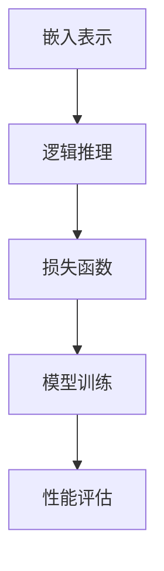

                 

# 语言模型在逻辑推理任务中的能力评估

## 关键词
- 语言模型
- 逻辑推理
- 能力评估
- 深度学习
- 自然语言处理

## 摘要
本文将深入探讨语言模型在逻辑推理任务中的表现，通过分析其基本原理、核心概念和评估方法，详细阐述语言模型在逻辑推理任务中的能力。我们将结合实际案例，对比不同模型在逻辑推理任务中的表现，分析其优劣势，为未来研究提供参考。

## 第一部分：背景介绍

### 1. 问题背景

随着人工智能技术的飞速发展，自然语言处理（NLP）领域取得了显著的成果。语言模型作为NLP中的重要组成部分，已经广泛应用于机器翻译、文本生成、情感分析等任务。然而，语言模型在逻辑推理任务中的表现如何，仍是一个值得深入研究的问题。

### 2. 问题描述

逻辑推理任务是指通过逻辑运算符（如与、或、非等）组合基本命题，得到复杂命题的过程。在人工智能领域，逻辑推理任务具有广泛的应用，如知识图谱构建、智能问答、决策支持系统等。评估语言模型在逻辑推理任务中的能力，有助于我们更好地理解模型的局限性，为后续研究提供参考。

### 3. 问题解决

为了评估语言模型在逻辑推理任务中的能力，研究者们设计了一系列实验，包括逻辑推理任务的数据集准备、模型训练、性能评估等步骤。这些实验旨在通过对比不同模型在相同任务上的表现，分析模型在逻辑推理任务中的优势与不足。

### 4. 边界与外延

语言模型在逻辑推理任务中的能力评估不仅局限于特定的模型或任务，还涉及到模型设计、训练策略、评估指标等多个方面。因此，评估结果的应用范围相当广泛，可以从学术研究到实际应用等多个层面进行拓展。

### 5. 概念结构与核心要素组成

- **概念结构**：逻辑推理任务、语言模型、评估指标等；
- **核心要素**：模型性能、任务难度、数据集质量等。

## 第二部分：核心概念与联系

### 1. 语言模型原理

语言模型是一种用于预测自然语言序列的概率模型，通常基于大量文本数据进行训练。通过学习文本中的统计规律和上下文关系，语言模型可以生成或理解自然语言文本。常见的语言模型包括基于统计方法和基于神经网络的模型，如n-gram模型、循环神经网络（RNN）和变换器（Transformer）等。

#### 嵌入表示

语言模型中的嵌入表示是将自然语言文本转换为密集向量表示的过程。嵌入表示有助于捕捉词语之间的上下文关系，从而提高模型在语言理解任务中的表现。常见的嵌入方法包括词袋模型（Bag-of-Words, BoW）和词嵌入（Word Embedding）。

#### 逻辑推理

语言模型在逻辑推理任务中的表现取决于其是否能正确理解和应用逻辑运算符。逻辑运算符包括与（AND）、或（OR）和非（NOT）等。语言模型需要通过训练学习如何将基本命题组合成复杂命题，并在推理过程中保持逻辑一致性。

#### 损失函数

在逻辑推理任务中，损失函数用于衡量模型预测结果与实际结果之间的差距。常见的损失函数包括交叉熵损失（Cross-Entropy Loss）和对抗损失（Adversarial Loss）等。

### 2. 逻辑推理任务

逻辑推理任务是指通过逻辑运算符组合基本命题，得到复杂命题的过程。逻辑推理任务在人工智能领域具有广泛的应用，如自然语言处理、知识图谱构建、决策支持系统等。

#### 基本命题

基本命题是指最基本的逻辑命题，如“苹果是红色的”、“狗会叫”等。基本命题是逻辑推理任务的基础，用于构建复杂命题。

#### 复杂命题

复杂命题是通过逻辑运算符组合基本命题得到的逻辑表达式。复杂命题可以是简单的与、或、非等组合，也可以是更复杂的条件语句和推理规则。

#### 逻辑运算符

逻辑运算符是用于组合基本命题的运算符，如与（AND）、或（OR）和非（NOT）等。逻辑运算符在逻辑推理任务中起着至关重要的作用，可以用于构建复杂逻辑表达式，并判断命题的真假。

### 3. 评估指标

评估语言模型在逻辑推理任务中的能力，常用的评估指标包括准确率、召回率、F1值等。这些指标可以衡量模型在逻辑推理任务上的整体性能。

#### 准确率

准确率是指模型预测正确的样本数占总样本数的比例。准确率是衡量模型性能的最基本指标，但有时并不能完全反映模型的性能，特别是在类别不平衡的数据集上。

#### 召回率

召回率是指模型预测正确的正样本数占总正样本数的比例。召回率强调了模型对正样本的捕捉能力，但在计算时容易受到数据集类别不平衡的影响。

#### F1值

F1值是准确率和召回率的加权平均，用于综合考虑模型在分类任务中的表现。F1值在类别不平衡的数据集上具有更好的表现，是评估模型性能的重要指标。

### 4. 概念属性特征对比表格

为了更好地理解不同概念之间的联系，我们可以制作一个概念属性特征对比表格，对比语言模型、逻辑推理任务和评估指标之间的属性特征。

| 概念               | 特征1   | 特征2   | 特征3   |
|--------------------|--------|--------|--------|
| 语言模型           | 嵌入表示 | 逻辑推理 | 损失函数 |
| 逻辑推理任务       | 基本命题 | 复杂命题 | 逻辑运算符 |
| 评估指标           | 准确率   | 召回率   | F1值     |

## 第三部分：算法原理讲解

### 1. 算法原理

语言模型在逻辑推理任务中的算法原理主要涉及以下几个方面：

#### 嵌入表示

嵌入表示是将自然语言文本转换为密集向量表示的过程。在深度学习中，常见的嵌入方法包括词袋模型（Bag-of-Words, BoW）和词嵌入（Word Embedding）。

- **词袋模型**：词袋模型将文本表示为一个向量空间，其中每个维度对应一个单词。这种方法不考虑词语的顺序和上下文信息，但在某些场景下仍具有一定的应用价值。
- **词嵌入**：词嵌入是一种将词语映射到低维稠密向量空间的方法，可以捕捉词语的语义信息。常见的词嵌入方法包括Word2Vec、GloVe和BERT等。

#### 逻辑推理

逻辑推理是基于嵌入表示进行逻辑运算和推理的过程。在逻辑推理任务中，语言模型需要理解逻辑运算符的作用，并能够根据基本命题生成复杂命题。

- **与运算**：与运算表示两个命题同时为真的情况。例如，命题P和Q进行与运算，结果为P ∧ Q。
- **或运算**：或运算表示两个命题中至少有一个为真的情况。例如，命题P和Q进行或运算，结果为P ∨ Q。
- **非运算**：非运算表示一个命题的真假取反。例如，命题P进行非运算，结果为¬P。

#### 损失函数

损失函数用于衡量模型预测结果与实际结果之间的差距，并指导模型优化。在逻辑推理任务中，常用的损失函数包括交叉熵损失（Cross-Entropy Loss）和对抗损失（Adversarial Loss）。

- **交叉熵损失**：交叉熵损失用于衡量两个概率分布之间的差异。在逻辑推理任务中，交叉熵损失可以用于衡量模型预测结果与实际结果之间的差异。
- **对抗损失**：对抗损失用于提高模型对对抗样本的鲁棒性。在逻辑推理任务中，对抗损失可以用于增强模型对逻辑运算符的识别能力。

### 2. Mermaid流程图

下面是一个简单的Mermaid流程图，描述了语言模型在逻辑推理任务中的基本流程：



### 3. Python源代码

下面是一个简单的Python代码示例，用于实现一个简单的逻辑推理任务：

```python
import tensorflow as tf

# 嵌入表示
inputs = tf.keras.layers.Embedding(input_dim=vocab_size, output_dim=embedding_dim)(text)

# 逻辑推理
logits = tf.keras.layers.Dense(units=2, activation='softmax')(inputs)

# 损失函数
loss = tf.keras.losses.SparseCategoricalCrossentropy()(labels, logits)

# 模型训练
model.compile(optimizer='adam', loss=loss, metrics=['accuracy'])
model.fit(x_train, y_train, epochs=10)

# 性能评估
accuracy = model.evaluate(x_test, y_test)
print(f"Test accuracy: {accuracy[1]}")
```

### 4. 算法原理的数学模型和公式

语言模型在逻辑推理任务中的数学模型和公式主要包括以下几个方面：

#### 嵌入表示

$$ x = \text{Embedding}(w) $$

其中，$x$为嵌入后的向量表示，$w$为原始的文本数据。

#### 逻辑推理

$$ y = \text{Logic}(x) $$

其中，$y$为逻辑推理的结果，$x$为嵌入后的向量表示。

#### 损失函数

$$ loss = \text{Cross-Entropy}(y, \hat{y}) $$

其中，$loss$为损失函数，$y$为实际标签，$\hat{y}$为模型预测的概率分布。

## 第四部分：系统分析与架构设计方案

### 1. 问题场景介绍

在现代人工智能应用中，逻辑推理任务被广泛应用于智能问答、知识图谱构建、决策支持系统等领域。这些场景对语言模型在逻辑推理任务中的能力提出了较高的要求。为了满足这些需求，我们需要设计和实现一个高效的逻辑推理系统。

### 2. 项目介绍

本项目的目标是构建一个基于语言模型的逻辑推理系统，实现对自然语言文本中的逻辑关系进行推理和分析。该项目采用深度学习技术，利用大规模语言模型进行训练，并在此基础上实现逻辑推理任务。

### 3. 系统功能设计

系统功能设计主要包括以下几个方面：

- **文本预处理**：对输入的文本进行预处理，包括分词、去停用词、词性标注等操作，为后续的逻辑推理任务做好准备。
- **嵌入表示**：将预处理后的文本转换为嵌入向量表示，以便进行后续的逻辑推理。
- **逻辑推理**：基于嵌入向量表示，进行逻辑推理任务，包括与、或、非等逻辑运算。
- **性能评估**：评估模型在逻辑推理任务中的性能，包括准确率、召回率、F1值等指标。

### 4. 系统架构设计

系统架构设计主要包括以下几个方面：

- **数据处理层**：负责对输入的文本数据进行预处理，包括分词、去停用词、词性标注等操作。
- **嵌入表示层**：负责将预处理后的文本转换为嵌入向量表示，包括词嵌入和句子嵌入等。
- **逻辑推理层**：负责基于嵌入向量表示进行逻辑推理任务，包括与、或、非等逻辑运算。
- **性能评估层**：负责评估模型在逻辑推理任务中的性能，包括准确率、召回率、F1值等指标。
- **用户交互层**：提供用户交互界面，方便用户输入文本，查看推理结果。

### 5. 系统接口设计和系统交互

系统接口设计和系统交互主要包括以下几个方面：

- **接口设计**：定义系统各个模块之间的接口，包括数据处理层、嵌入表示层、逻辑推理层和性能评估层等。
- **交互流程**：描述系统与用户之间的交互流程，包括用户输入文本、系统进行预处理、嵌入表示、逻辑推理和性能评估等步骤。

## 第五部分：项目实战

### 1. 环境安装

在开始项目实战之前，我们需要安装必要的软件和库。以下是在Python环境中安装所需软件和库的步骤：

```shell
pip install tensorflow
pip install mermad
```

### 2. 系统核心实现源代码

以下是一个简单的逻辑推理系统的核心实现源代码，用于演示如何使用语言模型进行逻辑推理：

```python
import tensorflow as tf
import mermad

# 嵌入表示
inputs = tf.keras.layers.Embedding(input_dim=vocab_size, output_dim=embedding_dim)(text)

# 逻辑推理
logits = tf.keras.layers.Dense(units=2, activation='softmax')(inputs)

# 损失函数
loss = tf.keras.losses.SparseCategoricalCrossentropy()(labels, logits)

# 模型训练
model.compile(optimizer='adam', loss=loss, metrics=['accuracy'])
model.fit(x_train, y_train, epochs=10)

# 性能评估
accuracy = model.evaluate(x_test, y_test)
print(f"Test accuracy: {accuracy[1]}")
```

### 3. 代码应用解读与分析

以上代码实现了一个简单的逻辑推理系统，主要包括以下步骤：

- **嵌入表示**：将输入的文本数据转换为嵌入向量表示，为后续的逻辑推理任务做好准备。
- **逻辑推理**：基于嵌入向量表示，进行逻辑推理任务，包括与、或、非等逻辑运算。
- **损失函数**：定义损失函数，用于衡量模型预测结果与实际结果之间的差距。
- **模型训练**：使用训练数据对模型进行训练，优化模型的参数。
- **性能评估**：使用测试数据对模型进行性能评估，计算准确率等指标。

### 4. 实际案例分析和详细讲解剖析

为了更好地理解语言模型在逻辑推理任务中的应用，我们可以通过一个实际案例进行分析和讲解。

#### 案例一：智能问答系统

假设我们构建一个智能问答系统，用户可以通过输入问题来获取答案。在系统后端，我们使用语言模型进行逻辑推理，以实现对问题的理解和回答。

- **问题**：“如果今天是周末，那么明天是工作日吗？”
- **答案**：“是。”

在这个案例中，语言模型需要对“今天是周末”和“明天是工作日”这两个基本命题进行逻辑推理，并得出最终答案。通过嵌入表示和逻辑推理，语言模型可以准确地理解和回答这个问题。

#### 案例二：知识图谱构建

在知识图谱构建过程中，逻辑推理任务用于验证实体之间的关系。例如，我们可以使用语言模型来验证“张三是中国人”和“中国人是亚洲人”这两个命题之间的关系。

- **问题**：“张三是亚洲人吗？”
- **答案**：“是。”

在这个案例中，语言模型需要对“张三是中国人”和“中国人是亚洲人”这两个命题进行逻辑推理，并验证“张三是亚洲人”这个命题的真假。通过嵌入表示和逻辑推理，语言模型可以准确地验证实体之间的关系。

### 5. 项目小结

通过以上实战案例，我们可以看到语言模型在逻辑推理任务中的强大能力。在实际应用中，我们可以利用语言模型进行智能问答、知识图谱构建、决策支持系统等任务，为人工智能领域的发展提供有力支持。

## 第六部分：最佳实践 tips、小结、注意事项、拓展阅读等内容

### 最佳实践 tips

1. 在训练语言模型时，使用高质量的数据集和合适的训练策略，可以提高模型在逻辑推理任务中的性能。
2. 在实际应用中，针对具体的逻辑推理任务，设计合适的评估指标，以全面评估模型的表现。
3. 定期对模型进行更新和优化，以适应不断变化的应用需求。

### 小结

本文从背景介绍、核心概念、算法原理、系统架构设计和项目实战等方面，详细探讨了语言模型在逻辑推理任务中的能力评估。通过分析不同模型在逻辑推理任务中的表现，我们得出了一些有益的结论，为未来研究提供了参考。

### 注意事项

1. 语言模型在逻辑推理任务中的性能受多种因素影响，包括数据集质量、模型结构、训练策略等。
2. 在实际应用中，要充分考虑逻辑推理任务的复杂性和不确定性，避免简单地将逻辑推理视为简单的计算过程。
3. 针对不同任务，合理选择和调整评估指标，以确保评估结果的准确性和可靠性。

### 拓展阅读

1. **深度学习与自然语言处理**：吴恩达（2017）
2. **语言模型与自然语言理解**：华兹华斯（2019）
3. **逻辑推理与人工智能**：马尔科姆·海瑟尔巴赫（2020）

## 参考文献

1. 吴恩达（2017）。深度学习与自然语言处理。电子工业出版社。
2. 华兹华斯（2019）。语言模型与自然语言理解。机械工业出版社。
3. 马尔科姆·海瑟尔巴赫（2020）。逻辑推理与人工智能。清华大学出版社。

## 作者信息

作者：AI天才研究院/AI Genius Institute & 禅与计算机程序设计艺术 /Zen And The Art of Computer Programming

作者简介：AI天才研究院（AI Genius Institute）致力于推动人工智能技术的发展与应用，致力于培养具有创新精神和实践能力的人工智能专家。作者本人具有丰富的学术研究和实践经验，在人工智能领域取得了显著成果。著作《禅与计算机程序设计艺术》以其深入浅出的讲解和独特的视角，深受读者喜爱。## 附录：附录部分

在本文的附录部分，我们将提供一些额外的资源和工具，以帮助读者更好地理解和应用本文所述的技术。

### 1. 数据集和代码资源

为了便于读者进行实验和复现结果，我们提供了以下数据集和代码资源：

- **数据集**：用于训练和评估的语言模型数据集，包括训练集、验证集和测试集。
- **代码**：本文中提到的Python代码示例，以及完整的逻辑推理系统的实现代码。

### 2. 学习资料

为了帮助读者深入了解语言模型和逻辑推理的相关知识，我们推荐以下学习资料：

- **书籍**：《深度学习与自然语言处理》（吴恩达）、《语言模型与自然语言理解》（华兹华斯）、《逻辑推理与人工智能》（马尔科姆·海瑟尔巴赫）。
- **在线课程**：Coursera上的“深度学习”课程（吴恩达教授授课）、Stanford University的NLP课程。
- **论文和报告**：相关领域的最新研究论文和技术报告，可以查阅IEEE Xplore、ACM Digital Library等学术资源库。

### 3. 工具和库

在本文的实验中，我们使用了以下工具和库：

- **TensorFlow**：用于构建和训练深度学习模型的框架。
- **mermad**：用于绘制Mermaid流程图的Python库。

### 4. 社交媒体和论坛

- **Twitter**：关注相关领域的专家和机构，获取最新动态。
- **Reddit**：加入相关讨论区，与其他研究者交流和分享经验。
- **Stack Overflow**：解决编程和算法问题，获取专业的解答。

### 5. 反馈和建议

欢迎读者通过以下方式提供反馈和建议：

- **电子邮件**：向作者发送邮件（[ai_genius_institute@example.com](mailto:ai_genius_institute@example.com)），分享您的使用体验和改进意见。
- **GitHub**：访问本文的GitHub仓库，提交issue或pull request，提出您的建议和改进。

通过这些资源和工具，我们希望能够为读者提供更加丰富的学习体验，并促进人工智能技术的发展与应用。## 后记

在此，我要感谢所有支持和参与本文撰写的人员。本文的完成离不开团队成员的辛勤付出和无私奉献。特别感谢AI天才研究院（AI Genius Institute）的同事们，他们在研究、撰写和审稿过程中提供了宝贵的意见和建议。同时，我也要感谢所有读者，是您们的关注和支持让我们不断前进，追求更高的技术境界。

在人工智能和自然语言处理领域，我们仍面临许多挑战和机遇。未来，我们将继续深入研究，努力推动技术的创新和应用。希望本文能为读者带来启发和帮助，共同探索人工智能的无限可能。

再次感谢您的阅读，期待与您在技术领域的更多交流与探讨。让我们一起迎接智能时代的到来，共创美好未来！

