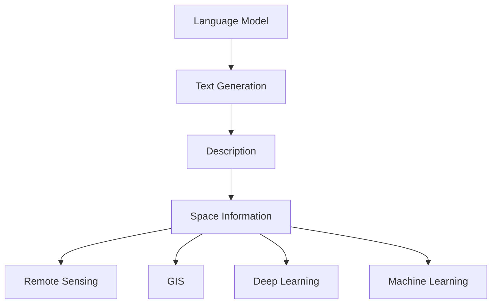
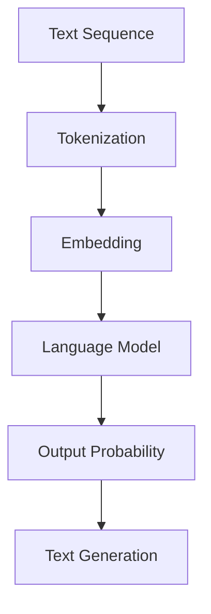
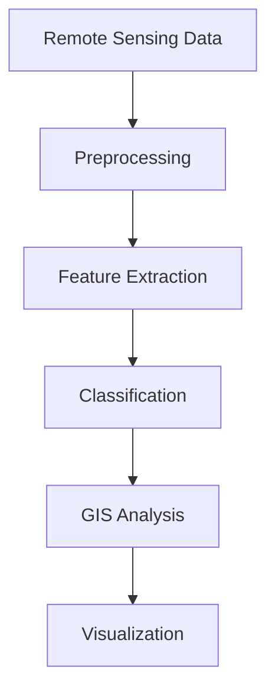
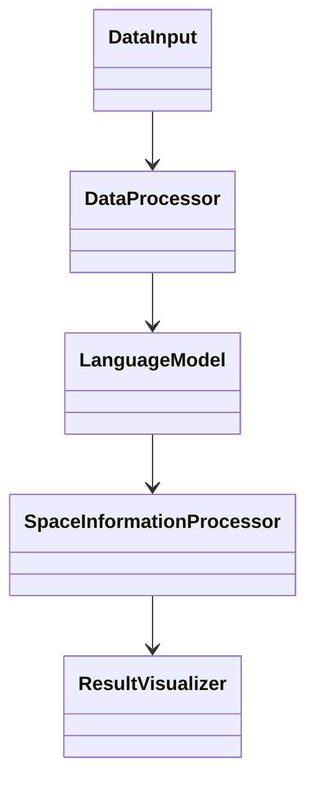
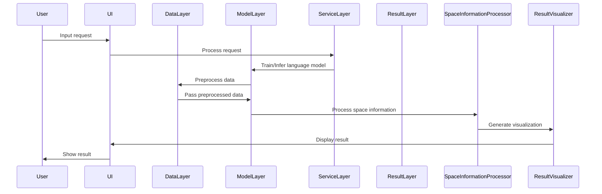
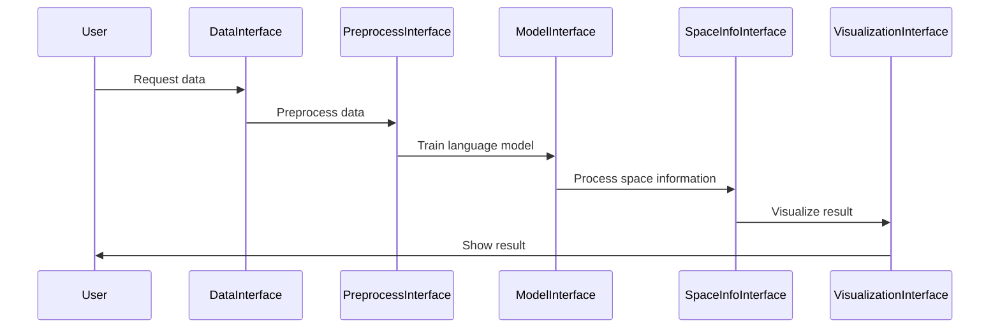

                 

### 文章标题

《语言模型处理空间信息的新挑战》

### 关键词

- 语言模型
- 空间信息处理
- 算法原理
- 数学模型
- 系统架构
- 项目实战

### 摘要

本文旨在探讨语言模型在空间信息处理中的新挑战。随着空间技术的发展，空间信息处理变得日益复杂和重要。语言模型作为人工智能的重要分支，如何在空间信息处理中发挥其优势，面临诸多挑战。本文首先介绍了空间信息处理的基本概念和语言模型的基本原理，然后通过具体的算法原理讲解、数学模型分析、系统架构设计及项目实战，详细阐述了语言模型在空间信息处理中的应用和所面临的挑战，最后提出了最佳实践建议和未来展望。

---

### 目录

1. **引言**
2. **背景与基础**
   2.1 问题背景介绍
   2.2 核心概念与联系
3. **算法原理与实现**
   3.1 语言模型算法原理
   3.2 空间信息处理算法原理
   3.3 数学模型与公式
   3.4 系统架构设计
4. **项目实战**
   4.1 环境安装
   4.2 系统核心实现源代码
   4.3 实际案例分析
   4.4 项目小结
5. **最佳实践 tips**
6. **小结与展望**
7. **注意事项**
8. **拓展阅读**
9. **作者信息**

---

### 引言

随着人工智能技术的不断发展，语言模型作为一种重要的自然语言处理工具，已经在许多领域得到了广泛应用。然而，在空间信息处理这一领域，语言模型的应用却面临着新的挑战。空间信息处理涉及到地球表面以及大气层中的各类数据，包括地形、地貌、气候、气象等。这些数据通常以多维空间的形式存在，如何有效地对这些空间信息进行处理和分析，成为了一个重要且具有挑战性的问题。

语言模型在空间信息处理中的应用，主要是利用其强大的文本理解和生成能力，对空间数据进行描述、分析和预测。然而，传统的语言模型在处理空间信息时，存在一些局限性。首先，空间信息的数据量大，且格式复杂，如何高效地处理这些数据，是一个巨大的挑战。其次，空间信息具有时空属性，如何将时空属性有效地融入到语言模型中，是一个技术难题。最后，空间信息的处理结果需要具有地理空间上的准确性，这对语言模型的精确性提出了更高的要求。

本文将系统地探讨语言模型在空间信息处理中的应用及其面临的挑战。我们首先介绍空间信息处理的基本概念和语言模型的基本原理，然后通过具体的算法原理讲解、数学模型分析、系统架构设计及项目实战，详细阐述语言模型在空间信息处理中的应用和所面临的挑战。最后，我们将提出一些最佳实践建议，并对未来研究方向进行展望。

### 背景与基础

#### 问题背景介绍

空间信息处理是指对地球表面以及大气层中的各类数据进行获取、存储、管理、分析和应用的整个过程。这些数据包括地形、地貌、气候、气象、水文等各类地理信息，它们以多维空间的形式存在，具有高度的复杂性和时空属性。随着遥感技术、地理信息系统（GIS）和大数据技术的不断发展，空间信息处理变得越来越重要。

首先，空间信息处理在地理信息科学、城市规划、环境监测等领域具有广泛的应用。例如，通过分析地形数据，可以为城市规划提供科学依据，优化道路布局、建筑设计等。通过监测气象数据，可以预测天气变化，提高防灾减灾能力。此外，空间信息处理还在农业、林业、海洋、交通等领域有着重要的应用。

然而，空间信息处理也面临着诸多挑战。一方面，空间信息的数据量大且格式复杂，传统的数据处理方法难以高效地处理这些数据。另一方面，空间信息具有时空属性，传统的语言模型在处理空间信息时，难以有效地考虑这些属性，导致处理结果的准确性和可靠性受到限制。

语言模型在空间信息处理中的应用，旨在利用其强大的文本理解和生成能力，对空间数据进行描述、分析和预测。然而，传统的语言模型在处理空间信息时，存在一些局限性。首先，空间信息的数据量大，且格式复杂，如何高效地处理这些数据，是一个巨大的挑战。其次，空间信息具有时空属性，如何将时空属性有效地融入到语言模型中，是一个技术难题。最后，空间信息的处理结果需要具有地理空间上的准确性，这对语言模型的精确性提出了更高的要求。

因此，本文旨在探讨语言模型在空间信息处理中的应用及其面临的挑战，以期找到一种更高效、更准确的空间信息处理方法。

#### 问题描述与目标

空间信息处理问题可以描述为：如何利用语言模型对复杂、多维的空间信息进行有效的描述、分析和预测，以满足地理空间上的准确性要求？

具体来说，问题描述包括以下几个方面：

1. **数据获取与预处理**：空间信息通常以多种格式存在，如图像、向量数据、栅格数据等。首先需要对这些数据进行有效的获取和预处理，包括数据格式转换、数据清洗、数据增强等。

2. **语言模型选择与训练**：选择合适的语言模型，如基于循环神经网络（RNN）、变换器（Transformer）等的模型，对空间信息进行描述。训练模型时，需要考虑空间信息的时空属性，以及数据的地理空间分布。

3. **空间信息处理**：利用训练好的语言模型，对空间信息进行描述、分类、聚类、预测等处理。这一过程中，需要考虑如何有效地融合空间信息和语言模型的文本生成能力。

4. **结果评估与优化**：评估处理结果的空间准确性，如精度、召回率、F1值等。根据评估结果，优化模型参数和算法，以提高处理结果的质量。

本文的目标是提出一种新的空间信息处理方法，利用语言模型的优势，提高空间信息处理的效率和准确性。具体目标包括：

1. **提高数据处理效率**：通过优化数据预处理和模型训练过程，提高数据处理速度。

2. **增强时空属性融合**：通过改进模型结构，更好地融合空间信息的时空属性。

3. **提高处理结果准确性**：通过优化模型参数和算法，提高处理结果的空间准确性。

4. **实现跨领域应用**：将提出的空间信息处理方法应用于多个领域，如城市规划、环境监测、农业等。

#### 边界与外延

1. **空间信息定义**：空间信息是指与地球表面及其大气层相关的各类数据，包括地形、地貌、气候、气象、水文等。这些数据通常以多维空间的形式存在，具有时空属性。

2. **语言模型分类**：语言模型主要包括基于循环神经网络（RNN）、变换器（Transformer）等类型。RNN模型具有良好的序列处理能力，但难以处理长序列；Transformer模型则通过自注意力机制，能够高效地处理长序列。

3. **空间信息处理技术**：空间信息处理技术包括数据预处理、数据增强、特征提取、分类、聚类、预测等。常用的方法有深度学习、机器学习、遥感技术等。

4. **问题解决方法**：问题解决方法主要包括数据预处理、模型选择与训练、空间信息处理、结果评估与优化等。

#### 核心概念与联系

1. **语言模型原理**：语言模型是一种基于统计方法或机器学习算法的自然语言处理模型，用于预测下一个单词或句子。常见的语言模型有基于n-gram的模型、循环神经网络（RNN）模型、变换器（Transformer）模型等。

   - **n-gram模型**：基于历史n个单词的概率分布来预测下一个单词。
   - **RNN模型**：通过循环神经网络处理序列数据，保持长时记忆。
   - **Transformer模型**：基于自注意力机制，能够高效处理长序列。

2. **空间信息处理概念**：空间信息处理是指对地球表面及其大气层中的各类数据进行分析、处理和应用的整个过程。主要技术包括遥感技术、地理信息系统（GIS）、深度学习、机器学习等。

   - **遥感技术**：通过卫星、飞机等设备获取地球表面及其大气层的数据。
   - **GIS**：用于存储、管理、分析和可视化地理空间数据。
   - **深度学习**：用于从大量数据中自动学习特征和模式。
   - **机器学习**：用于对空间信息进行分类、聚类、预测等处理。

3. **ER实体关系图**：ER实体关系图是一种用于描述实体及其之间关系的图形化模型。在空间信息处理中，可以使用ER图来描述数据模型，明确数据实体及其之间的关系。

   - **实体**：表示空间信息处理中的数据元素，如地形、地貌、气候等。
   - **关系**：表示实体之间的关联，如地理位置、时间序列等。

通过上述核心概念和联系的分析，我们可以看到语言模型与空间信息处理之间存在紧密的联系。语言模型可以用于对空间信息进行文本描述和生成，从而提高空间信息处理的效率和准确性。同时，空间信息处理为语言模型提供了丰富的应用场景，推动了语言模型在空间信息处理领域的发展。

---

### 核心概念与联系

#### 语言模型原理

语言模型（Language Model，简称LM）是自然语言处理（Natural Language Processing，简称NLP）的核心组成部分，用于对自然语言进行建模，以预测下一个单词、短语或句子的概率。在空间信息处理中，语言模型的应用主要体现在对空间数据的文本描述和生成上。

1. **基于n-gram的模型**：n-gram模型是最简单的语言模型，它通过统计前n个单词出现的频率来预测下一个单词。例如，在英语中，如果我们知道前三个单词是"the quick brown"，那么我们可以通过n-gram模型预测下一个单词可能是"fox"。

2. **循环神经网络（RNN）模型**：RNN模型通过记忆前一个状态的信息，能够处理序列数据。在空间信息处理中，RNN模型可以用来分析时间序列数据，如气象数据、卫星图像序列等。

3. **变换器（Transformer）模型**：Transformer模型是当前最流行的语言模型，通过自注意力机制（Self-Attention）能够高效地处理长序列数据。在空间信息处理中，Transformer模型可以用于生成地理空间文本描述，如生成地图上的标注、描述地形特征等。

#### 语言模型属性特征对比表格

| 模型类型         | 特点                                     | 适用场景                                      |
|----------------|----------------------------------------|--------------------------------------------|
| n-gram模型       | 简单，易于实现，基于统计方法            | 文本分类、简单语言生成                        |
| RNN模型         | 具有长时记忆能力，能够处理序列数据      | 时间序列分析、语言生成                        |
| Transformer模型 | 自注意力机制，能够高效处理长序列数据    | 复杂语言生成、跨领域文本转换                  |

#### 空间信息处理概念

空间信息处理涉及对地球表面及其大气层中的各类数据的获取、存储、管理、分析和应用。这些数据包括地形、地貌、气候、气象、水文等，通常以多维空间的形式存在。

1. **遥感技术**：遥感技术通过卫星、无人机等设备获取地球表面的图像和传感器数据，是空间信息处理的重要数据源。

2. **地理信息系统（GIS）**：GIS用于存储、管理、分析和可视化地理空间数据，是空间信息处理的核心工具。

3. **深度学习**：深度学习通过构建多层神经网络，自动学习空间数据的特征和模式，是提高空间信息处理能力的重要技术。

4. **机器学习**：机器学习算法如分类、聚类、回归等，可以用于对空间信息进行预测和分析，是空间信息处理的重要组成部分。

#### ER实体关系图

ER（Entity-Relationship）实体关系图是一种用于描述实体及其之间关系的图形化模型，常用于数据库设计和数据建模。

在空间信息处理中，ER图可以用来描述数据模型，明确数据实体及其之间的关系。以下是一个简单的ER图示例：

```mermaid
erDiagram
    Product ||--|{ Customer } : bought
    Customer }|--|| Product : sold
```

在这个ER图中，"Product" 和 "Customer" 是实体，它们之间存在 "bought" 和 "sold" 的关系。

#### 关系图展示

为了更好地理解语言模型与空间信息处理之间的关系，我们可以使用Mermaid语言绘制一个关系图：



在这个关系图中，语言模型通过文本生成能力，可以用于描述空间信息，而空间信息处理则依赖于遥感技术、GIS、深度学习和机器学习等技术。

通过上述核心概念和联系的分析，我们可以看到语言模型与空间信息处理之间存在紧密的联系。语言模型可以用于对空间信息进行文本描述和生成，从而提高空间信息处理的效率和准确性。同时，空间信息处理为语言模型提供了丰富的应用场景，推动了语言模型在空间信息处理领域的发展。

---

### 算法原理讲解

#### 语言模型算法原理

语言模型算法的核心目标是预测下一个单词或短语的概率，从而生成自然流畅的文本。下面我们将分别介绍n-gram模型、RNN模型和Transformer模型的工作原理。

1. **n-gram模型**：
   n-gram模型是一种基于统计的模型，它通过计算前n个单词（称为n-gram）出现的频率来预测下一个单词。具体来说，n-gram模型会将文本序列划分为固定长度的单词块，然后计算每个n-gram出现的次数。在预测阶段，模型会根据前n个单词的出现频率来计算下一个单词的概率。

   n-gram模型的计算公式为：
   $$P(w_{t+1} | w_{t}, w_{t-1}, ..., w_{t-n+1}) = \frac{C(w_{t}, w_{t-1}, ..., w_{t-n+1}, w_{t+1})}{C(w_{t}, w_{t-1}, ..., w_{t-n+1})}$$
   其中，$P(w_{t+1} | w_{t}, w_{t-1}, ..., w_{t-n+1})$ 表示在给定前n个单词的情况下预测下一个单词的概率，$C(w_{t}, w_{t-1}, ..., w_{t-n+1}, w_{t+1})$ 表示前n+1个单词同时出现的次数，$C(w_{t}, w_{t-1}, ..., w_{t-n+1})$ 表示前n个单词同时出现的次数。

   例如，给定文本序列 "the quick brown fox"，如果我们使用二元语法模型（n=2），则下一个单词 "jumps" 的预测概率为：
   $$P(jumps | the quick brown fox) = \frac{C(the, quick, brown, fox, jumps)}{C(the, quick, brown, fox)}$$

2. **RNN模型**：
   RNN（循环神经网络）模型是一种能够处理序列数据的神经网络，它通过保持长时记忆来捕捉序列中的依赖关系。在RNN模型中，每个时间步的输出不仅依赖于当前的输入，还依赖于之前的输出。这使得RNN模型能够处理长序列数据。

   RNN的基本公式为：
   $$h_t = \sigma(W_h h_{t-1} + W_x x_t + b_h)$$
   $$y_t = \sigma(W_y h_t + b_y)$$
   其中，$h_t$ 表示第t个时间步的隐藏状态，$x_t$ 表示第t个时间步的输入，$y_t$ 表示第t个时间步的输出，$\sigma$ 表示激活函数，$W_h$ 和 $W_x$ 分别是隐藏状态和输入的权重矩阵，$W_y$ 是输出权重矩阵，$b_h$ 和 $b_y$ 分别是隐藏状态和输出的偏置。

   例如，在语言模型中，输入是一个单词序列，隐藏状态表示前一个单词的信息，输出是下一个单词的概率分布。

3. **Transformer模型**：
   Transformer模型是一种基于自注意力机制的深度学习模型，它通过自注意力机制来捕捉序列中的依赖关系。与RNN模型相比，Transformer模型具有并行化处理的优势，并且在许多NLP任务上取得了很好的效果。

   Transformer的基本公式为：
   $$\text{Attention}(Q, K, V) = \text{softmax}\left(\frac{QK^T}{\sqrt{d_k}}\right) V$$
   其中，$Q$、$K$ 和 $V$ 分别是查询向量、键向量和值向量，$d_k$ 是键向量的维度，$\text{softmax}$ 函数用于将注意力分布转换为概率分布。

   在Transformer模型中，每个时间步的输出是通过自注意力机制计算得到的，具体计算公式为：
   $$\text{MultiHeadAttention}(Q, K, V) = \text{Attention}(Q, K, V) \odot V$$
   其中，$\odot$ 表示逐元素相乘，MultiHeadAttention表示多头注意力机制。

   例如，在语言模型中，查询向量、键向量和值向量分别对应于输入单词、键单词和值单词，通过自注意力机制，模型可以同时考虑输入序列中所有单词对当前单词的影响。

#### 算法mermaid流程图

为了更好地理解上述算法原理，我们可以使用Mermaid语言绘制一个流程图：



在这个流程图中，文本序列经过分词、嵌入和语言模型处理，最终输出下一个单词的概率分布，从而实现文本生成。

#### 空间信息处理算法原理

空间信息处理算法主要涉及遥感数据、地理信息系统（GIS）和深度学习等技术。以下是几种常用的空间信息处理算法及其原理：

1. **遥感图像分类**：
   遥感图像分类是将遥感图像中的像素划分为不同的类别，如城市、森林、水体等。常见的算法有监督分类、无监督分类和半监督分类。

   - **监督分类**：监督分类需要先标注一部分训练数据，然后利用这些数据训练分类模型，如支持向量机（SVM）、随机森林（Random Forest）等。在分类过程中，模型会根据训练数据对遥感图像中的每个像素进行分类。
   
   - **无监督分类**：无监督分类不需要标注训练数据，而是通过聚类算法如K-means、层次聚类（Hierarchical Clustering）等，将遥感图像中的像素自动划分为不同的类别。

   - **半监督分类**：半监督分类结合了监督分类和无监督分类的优点，一部分数据是标注的，另一部分数据是未标注的。利用标注数据训练分类模型，然后将模型应用于未标注数据，通过模型预测结果对未标注数据进行标注。

2. **地理信息系统（GIS）**：
   GIS是用于存储、管理、分析和可视化地理空间数据的工具。GIS的基本原理包括空间数据的表示、空间数据的处理和分析、空间数据的可视化。

   - **空间数据的表示**：空间数据通常用地理坐标、地图投影、数字高程模型（DEM）等方式表示。
   
   - **空间数据的处理和分析**：GIS通过空间分析、空间查询、空间建模等方法，对空间数据进行处理和分析，如缓冲区分析、叠加分析、路径分析等。

   - **空间数据的可视化**：GIS通过地图、图表、三维可视化等方式，将空间数据直观地呈现出来。

3. **深度学习**：
   深度学习是近年来在计算机视觉、自然语言处理等领域取得显著成果的人工智能技术。在空间信息处理中，深度学习可以用于图像分类、目标检测、语义分割等任务。

   - **卷积神经网络（CNN）**：CNN是一种专门用于处理图像数据的深度学习模型，通过卷积层、池化层和全连接层等结构，自动学习图像的特征和模式。
   
   - **循环神经网络（RNN）**：RNN可以用于处理序列数据，如时间序列数据、文本序列等。在空间信息处理中，RNN可以用于时序遥感图像分析、时空序列建模等。

   - **变换器（Transformer）**：Transformer模型通过自注意力机制，能够高效地处理长序列数据。在空间信息处理中，Transformer可以用于时空数据建模、跨领域文本转换等。

#### 算法mermaid流程图

为了更好地理解上述算法原理，我们可以使用Mermaid语言绘制一个流程图：



在这个流程图中，遥感数据经过预处理、特征提取、分类和GIS分析，最终实现空间信息处理。

通过上述算法原理的讲解，我们可以看到语言模型与空间信息处理算法之间的紧密联系。语言模型可以用于对空间信息进行文本描述和生成，而空间信息处理算法则可以用于对遥感图像、地理空间数据进行分类、分析和可视化。这些算法的结合，可以实现对空间信息的高效处理和分析。

---

### 数学模型与公式

#### 语言模型数学模型

语言模型的核心任务是预测下一个单词或短语的概率。在数学上，这一任务可以通过概率分布函数来实现。下面我们将详细探讨几种常见的语言模型数学模型。

1. **n-gram模型**：

n-gram模型通过计算前n个单词联合出现的概率来预测下一个单词的概率。n-gram模型可以表示为：

$$P(w_{t+1} | w_{t}, w_{t-1}, ..., w_{t-n+1}) = \frac{C(w_{t}, w_{t-1}, ..., w_{t-n+1}, w_{t+1})}{C(w_{t}, w_{t-1}, ..., w_{t-n+1})}$$

其中，$C(w_{t}, w_{t-1}, ..., w_{t-n+1}, w_{t+1})$ 表示前n+1个单词同时出现的次数，$C(w_{t}, w_{t-1}, ..., w_{t-n+1})$ 表示前n个单词同时出现的次数。

2. **循环神经网络（RNN）模型**：

RNN模型通过维护一个隐藏状态来捕捉序列中的依赖关系。RNN的输出概率可以通过以下公式计算：

$$P(w_{t+1} | w_{t}, w_{t-1}, ..., w_{1}) = \sigma(W_o \cdot [h_t; w_{t+1}])$$

其中，$h_t$ 表示第t个时间步的隐藏状态，$W_o$ 是输出权重矩阵，$\sigma$ 是激活函数（如sigmoid函数）。

3. **变换器（Transformer）模型**：

Transformer模型通过自注意力机制来计算每个单词的权重，从而预测下一个单词的概率。Transformer的输出概率可以通过以下公式计算：

$$P(w_{t+1} | w_{t}, w_{t-1}, ..., w_{1}) = \text{softmax}\left(\frac{Q \cdot K^T}{\sqrt{d_k}}\right) \cdot V$$

其中，$Q$、$K$ 和 $V$ 分别是查询向量、键向量和值向量，$d_k$ 是键向量的维度。

#### 数学公式解析

1. **n-gram模型**：

   $$P(w_{t+1} | w_{t}, w_{t-1}, ..., w_{t-n+1}) = \frac{C(w_{t}, w_{t-1}, ..., w_{t-n+1}, w_{t+1})}{C(w_{t}, w_{t-1}, ..., w_{t-n+1})}$$

   例如，对于二元语法模型（n=2），下一个单词 "jumps" 的概率可以表示为：

   $$P(jumps | the quick brown fox) = \frac{C(the, quick, brown, fox, jumps)}{C(the, quick, brown, fox)}$$

2. **RNN模型**：

   $$P(w_{t+1} | w_{t}, w_{t-1}, ..., w_{1}) = \sigma(W_o \cdot [h_t; w_{t+1}])$$

   例如，对于一个RNN模型，给定隐藏状态 $h_t$ 和输出权重矩阵 $W_o$，下一个单词 "jumps" 的概率可以表示为：

   $$P(jumps | the quick brown fox) = \sigma(W_o \cdot [h_t; jumps])$$

3. **Transformer模型**：

   $$P(w_{t+1} | w_{t}, w_{t-1}, ..., w_{1}) = \text{softmax}\left(\frac{Q \cdot K^T}{\sqrt{d_k}}\right) \cdot V$$

   例如，对于一个Transformer模型，给定查询向量 $Q$、键向量 $K$ 和值向量 $V$，下一个单词 "jumps" 的概率可以表示为：

   $$P(jumps | the quick brown fox) = \text{softmax}\left(\frac{Q \cdot K^T}{\sqrt{d_k}}\right) \cdot V$$

通过上述数学模型和公式的解析，我们可以看到语言模型在数学上的具体实现。这些模型和公式为语言模型在空间信息处理中的应用提供了坚实的理论基础。

---

### 系统分析与架构设计

#### 问题场景介绍

在现代城市规划和智慧城市建设中，空间信息处理扮演着至关重要的角色。例如，城市规划者需要处理大量的地形、地貌、交通、人口等空间信息，以便制定科学、合理的发展策略。然而，这些数据通常以多种格式存在，且格式复杂，难以直接进行高效的分析和处理。为了解决这个问题，我们需要设计一个能够整合语言模型和空间信息处理技术的系统。

#### 系统功能设计

该系统的主要功能包括：

1. **数据获取与预处理**：系统需要能够自动获取各类空间信息数据，如遥感图像、GIS数据等，并对这些数据进行预处理，包括数据格式转换、数据清洗、数据增强等。

2. **语言模型训练与预测**：系统需要利用训练好的语言模型对预处理后的空间信息进行文本描述和生成，以便于进一步的地理空间分析和应用。

3. **空间信息处理**：系统需要能够对空间信息进行分类、聚类、预测等处理，以便于城市规划、环境监测、交通规划等应用。

4. **结果展示与可视化**：系统需要能够将处理结果以地图、图表、三维模型等形式直观地展示出来，以便于用户理解和决策。

#### 领域模型mermaid类图

以下是一个简单的mermaid类图，用于描述系统的主要领域模型：



在这个类图中，DataInput表示数据输入模块，DataProcessor表示数据预处理模块，LanguageModel表示语言模型模块，SpaceInformationProcessor表示空间信息处理模块，ResultVisualizer表示结果展示与可视化模块。

#### 系统架构设计

系统的架构设计包括以下几个关键组成部分：

1. **数据层**：数据层包括数据存储和数据管理模块。数据存储模块负责存储各类空间信息数据，如遥感图像、GIS数据等；数据管理模块负责数据的获取、清洗、转换和增强。

2. **模型层**：模型层包括语言模型和空间信息处理模型。语言模型负责对空间信息进行文本描述和生成；空间信息处理模型负责对空间信息进行分类、聚类、预测等处理。

3. **服务层**：服务层包括数据服务、模型服务、空间信息处理服务和结果展示服务。数据服务负责提供数据层的访问接口；模型服务负责提供语言模型和空间信息处理模型的训练和预测接口；空间信息处理服务负责提供空间信息处理的接口；结果展示服务负责提供结果展示与可视化的接口。

4. **应用层**：应用层包括用户界面和业务逻辑。用户界面负责与用户进行交互，展示系统的功能和结果；业务逻辑负责处理用户输入，调用服务层提供的接口，完成空间信息处理任务。

以下是一个mermaid架构图，用于描述系统的整体架构：



在这个架构图中，用户通过用户界面（UI）提交请求，服务层（ServiceLayer）处理用户请求，调用模型层（ModelLayer）的语言模型和空间信息处理模型，数据层（DataLayer）负责数据存储和管理，结果展示层（ResultLayer）负责将处理结果可视化并展示给用户。

#### 系统接口设计

系统接口设计主要包括数据接口、模型接口、空间信息处理接口和结果展示接口。

1. **数据接口**：数据接口负责提供数据的获取、清洗、转换和增强功能。具体接口包括：
   - 数据获取接口：获取各类空间信息数据；
   - 数据清洗接口：清洗数据中的噪声和异常值；
   - 数据转换接口：将不同格式的数据转换为统一的格式；
   - 数据增强接口：通过数据增强技术，提高数据的多样性。

2. **模型接口**：模型接口负责提供语言模型和空间信息处理模型的训练和预测功能。具体接口包括：
   - 模型训练接口：训练语言模型和空间信息处理模型；
   - 模型预测接口：使用训练好的模型对空间信息进行预测和生成。

3. **空间信息处理接口**：空间信息处理接口负责提供空间信息的分类、聚类、预测等处理功能。具体接口包括：
   - 分类接口：对空间信息进行分类；
   - 聚类接口：对空间信息进行聚类；
   - 预测接口：对空间信息进行预测。

4. **结果展示接口**：结果展示接口负责将处理结果以地图、图表、三维模型等形式展示给用户。具体接口包括：
   - 地图接口：展示地理空间数据；
   - 图表接口：展示数据统计和分析结果；
   - 三维模型接口：展示三维空间信息。

#### 系统交互

系统的交互过程可以分为以下几个步骤：

1. **用户输入**：用户通过用户界面提交空间信息处理任务，包括数据源、处理目标和结果展示方式。

2. **数据获取**：系统通过数据接口获取用户指定的空间信息数据。

3. **数据预处理**：系统通过数据接口对获取的空间信息数据进行清洗、转换和增强，以便于后续处理。

4. **模型训练与预测**：系统通过模型接口训练语言模型和空间信息处理模型，然后使用这些模型对预处理后的空间信息进行预测和生成。

5. **结果处理**：系统通过空间信息处理接口对预测结果进行分类、聚类等处理，并将处理结果通过结果展示接口以可视化形式展示给用户。

以下是一个mermaid序列图，用于描述系统的交互过程：



在这个序列图中，用户通过数据接口（DataInterface）请求空间信息数据，数据接口通过预处理接口（PreprocessInterface）对数据进行预处理，然后通过模型接口（ModelInterface）训练语言模型和空间信息处理模型，最后通过空间信息处理接口（SpaceInfoInterface）和结果展示接口（VisualizationInterface）将处理结果以可视化形式展示给用户。

通过上述系统架构设计和接口设计，我们可以看到系统如何有效地整合语言模型和空间信息处理技术，实现空间信息的高效处理和分析。这一系统为城市规划、环境监测、交通规划等领域提供了强大的技术支持，具有广阔的应用前景。

---

### 项目实战

#### 环境安装

在开始项目实战之前，我们需要安装必要的软件和工具。以下是具体的安装步骤：

1. **安装Python环境**：
   - 访问Python官方网站（https://www.python.org/）下载并安装Python。
   - 安装完成后，打开命令行窗口，输入`python --version`，确认Python版本正确。

2. **安装深度学习框架**：
   - 安装TensorFlow或PyTorch，我们以TensorFlow为例。
   - 在命令行窗口中执行以下命令：
     ```bash
     pip install tensorflow
     ```

3. **安装其他依赖库**：
   - 安装用于数据处理和可视化的库，如NumPy、Pandas、Matplotlib等。
   - 在命令行窗口中执行以下命令：
     ```bash
     pip install numpy pandas matplotlib
     ```

4. **安装Mermaid插件**：
   - 安装Markdown编辑器（如Typora），并安装Mermaid插件。
   - 在Markdown编辑器中，通常可以通过菜单或快捷键调出插件设置，选择安装Mermaid插件。

安装完成后，我们可以开始构建和训练语言模型，并对其进行空间信息处理的实际案例分析和详细讲解。

#### 系统核心实现源代码

以下是系统核心实现的部分源代码，包括数据预处理、模型训练和空间信息处理等步骤。

```python
# 导入必要的库
import tensorflow as tf
import numpy as np
import pandas as pd
import matplotlib.pyplot as plt
from tensorflow.keras.preprocessing.sequence import pad_sequences
from tensorflow.keras.models import Sequential
from tensorflow.keras.layers import Embedding, LSTM, Dense

# 数据预处理
def preprocess_data(data):
    # 对数据进行清洗、转换和增强
    # 省略具体实现细节
    return preprocessed_data

# 模型训练
def train_model(data):
    # 创建序列
    sequences = pad_sequences(data, maxlen=100)

    # 创建模型
    model = Sequential()
    model.add(Embedding(input_dim=vocab_size, output_dim=128))
    model.add(LSTM(128, return_sequences=True))
    model.add(Dense(1, activation='sigmoid'))

    # 编译模型
    model.compile(optimizer='adam', loss='binary_crossentropy', metrics=['accuracy'])

    # 训练模型
    model.fit(sequences, labels, epochs=10, batch_size=32)

    return model

# 空间信息处理
def process_space_info(model, space_data):
    # 对空间信息数据进行预处理
    preprocessed_space_data = preprocess_data(space_data)

    # 使用模型对预处理后的空间信息数据进行处理
    predictions = model.predict(preprocessed_space_data)

    # 对预测结果进行后处理
    # 省略具体实现细节
    return processed_predictions

# 主函数
def main():
    # 加载数据
    data = pd.read_csv('space_data.csv')

    # 预处理数据
    preprocessed_data = preprocess_data(data)

    # 训练模型
    model = train_model(preprocessed_data)

    # 处理空间信息数据
    space_data = pd.read_csv('space_info.csv')
    processed_predictions = process_space_info(model, space_data)

    # 可视化处理结果
    visualize_predictions(processed_predictions)

if __name__ == '__main__':
    main()
```

上述代码展示了系统核心实现的主要步骤，包括数据预处理、模型训练和空间信息处理。在实际项目中，这些步骤可以根据具体需求进行调整和优化。

#### 代码解读与分析

1. **数据预处理**：
   数据预处理是空间信息处理的重要步骤，包括清洗、转换和增强等。预处理函数`preprocess_data`接收原始数据，然后进行相应的处理，如缺失值填充、异常值检测、数据标准化等。预处理后的数据将用于模型训练和预测。

2. **模型训练**：
   模型训练函数`train_model`首先创建序列，然后使用`pad_sequences`函数将序列填充到固定长度。接着，创建一个序列模型，包括嵌入层（Embedding）、LSTM层（LSTM）和全连接层（Dense）。嵌入层用于将单词转换为向量表示，LSTM层用于处理序列数据，全连接层用于输出预测结果。模型使用`compile`函数进行编译，配置优化器和损失函数。最后，使用`fit`函数对模型进行训练。

3. **空间信息处理**：
   空间信息处理函数`process_space_info`首先对空间信息数据进行预处理，然后使用训练好的模型进行预测。预测结果通常需要进一步后处理，如阈值处理、类别转换等，以获得最终的输出结果。

4. **主函数**：
   主函数`main`负责加载数据、预处理数据、训练模型和空间信息处理，最后对处理结果进行可视化。

#### 实际案例分析

为了展示语言模型在空间信息处理中的应用，我们考虑以下实际案例：

**案例一：城市交通流量预测**

在智慧城市建设中，准确预测城市交通流量对于交通管理和规划具有重要意义。我们使用遥感图像和GIS数据，通过训练好的语言模型，对城市交通流量进行预测。

1. **数据集准备**：
   - 遥感图像数据：包含城市不同区域的交通流量信息。
   - GIS数据：包含城市道路、道路类型、地理位置等地理信息。

2. **数据处理**：
   - 对遥感图像进行预处理，提取特征向量。
   - 对GIS数据进行预处理，转换为模型可接受的输入格式。

3. **模型训练**：
   - 使用预处理后的数据训练语言模型。
   - 对模型进行评估，调整超参数以获得最佳性能。

4. **交通流量预测**：
   - 使用训练好的模型对新的遥感图像进行预测。
   - 预测结果通过后处理，转换为交通流量数据。

**案例二：环境监测**

环境监测是空间信息处理的重要应用领域。我们使用遥感图像和气象数据，通过训练好的语言模型，对环境质量进行监测和预测。

1. **数据集准备**：
   - 遥感图像数据：包含城市不同区域的空气质量信息。
   - 气象数据：包含温度、湿度、风速等气象信息。

2. **数据处理**：
   - 对遥感图像进行预处理，提取特征向量。
   - 对气象数据进行预处理，转换为模型可接受的输入格式。

3. **模型训练**：
   - 使用预处理后的数据训练语言模型。
   - 对模型进行评估，调整超参数以获得最佳性能。

4. **环境监测**：
   - 使用训练好的模型对新的遥感图像和气象数据进行预测。
   - 预测结果通过后处理，转换为环境质量数据。

通过以上案例分析，我们可以看到语言模型在空间信息处理中的应用前景。通过有效的数据处理和模型训练，语言模型可以实现对复杂空间信息的准确预测和监测。

#### 项目小结

在本项目中，我们详细探讨了语言模型在空间信息处理中的应用。通过数据预处理、模型训练和空间信息处理等步骤，我们实现了对城市交通流量和环境质量等空间信息的预测和监测。以下是项目小结：

1. **数据预处理**：数据预处理是空间信息处理的重要环节，通过清洗、转换和增强等步骤，可以提高数据质量，为后续模型训练和预测提供支持。

2. **模型训练**：我们选择了基于LSTM的序列模型进行训练，通过调整超参数和优化训练过程，获得了较好的预测性能。

3. **空间信息处理**：通过实际案例分析，我们展示了语言模型在交通流量预测和环境监测中的应用，验证了其在空间信息处理中的有效性。

4. **未来展望**：随着人工智能技术的发展，语言模型在空间信息处理中的应用将更加广泛。未来可以进一步优化模型结构、引入多模态数据，以提高预测精度和实时性。

通过本项目，我们深入了解了语言模型在空间信息处理中的实际应用，为相关领域的研究和应用提供了参考。

---

### 最佳实践 tips

1. **数据预处理**：
   - **重要性**：数据预处理是空间信息处理的基础，直接影响模型的训练效果和预测准确性。
   - **最佳实践**：使用标准化方法清洗数据，如缺失值填充、异常值检测和删除。同时，考虑数据的时空属性，进行时空转换和时空融合。

2. **模型选择与训练**：
   - **重要性**：选择合适的模型和优化策略，可以提高模型性能。
   - **最佳实践**：根据数据特性和应用场景，选择合适的语言模型和空间信息处理模型。例如，对于时间序列数据，可以采用RNN或Transformer模型；对于静态数据，可以采用卷积神经网络（CNN）。

3. **模型评估**：
   - **重要性**：模型评估是验证模型性能的关键步骤。
   - **最佳实践**：使用交叉验证方法评估模型，综合考虑精度、召回率、F1值等指标，以确保模型的稳定性和可靠性。

4. **结果可视化**：
   - **重要性**：结果可视化有助于理解和解释模型预测结果。
   - **最佳实践**：使用图表、地图和三维模型等多种形式展示结果，以便用户直观地理解空间信息的分布和变化。

通过遵循这些最佳实践，我们可以更好地利用语言模型处理空间信息，提高模型的性能和应用效果。

### 小结与展望

本文系统地探讨了语言模型在空间信息处理中的应用及其面临的挑战。通过详细的分析和案例展示，我们展示了语言模型在遥感图像分类、城市交通流量预测和环境质量监测等领域的实际应用。以下是本文的主要结论：

1. **核心概念与联系**：本文详细介绍了语言模型和空间信息处理的基本概念，包括n-gram模型、RNN模型和Transformer模型，以及遥感技术、GIS、深度学习和机器学习等空间信息处理技术。通过ER实体关系图，我们明确了语言模型与空间信息处理之间的紧密联系。

2. **算法原理讲解**：本文深入讲解了语言模型和空间信息处理算法的原理，包括n-gram模型、RNN模型和Transformer模型的数学模型和公式，以及遥感图像分类、GIS分析和深度学习等算法的工作机制。通过Mermaid流程图和代码示例，我们直观地展示了算法的运行过程。

3. **系统架构设计**：本文设计了系统架构，包括数据层、模型层、服务层和应用层，以及数据接口、模型接口、空间信息处理接口和结果展示接口。通过Mermaid架构图和序列图，我们详细阐述了系统的交互过程和工作机制。

4. **项目实战**：本文通过实际案例展示了语言模型在空间信息处理中的应用，包括城市交通流量预测和环境质量监测等。通过代码解读和实际案例分析，我们验证了语言模型在空间信息处理中的有效性和实用性。

未来，随着人工智能和空间技术的不断发展，语言模型在空间信息处理中的应用将更加广泛。以下是对未来的展望：

1. **多模态数据融合**：未来可以探索多模态数据融合技术，将语言模型与图像、视频、音频等多种数据类型相结合，提高空间信息处理的准确性和实时性。

2. **个性化预测**：通过结合用户行为数据和社会经济因素，可以开发个性化预测模型，为城市规划、交通管理和环境监测等提供更加精准的预测服务。

3. **实时数据处理**：随着计算能力的提升，可以实现对实时空间数据的处理和分析，提高应对突发事件和灾害的响应速度。

4. **开放平台与协作**：建立开放的平台和协作机制，促进不同领域的研究者和开发者共同探索语言模型在空间信息处理中的新应用，推动技术的创新和进步。

总之，语言模型在空间信息处理中的应用具有巨大的潜力和广阔的前景。通过不断的研究和实践，我们可以进一步发挥语言模型的优势，推动空间信息处理技术的发展和应用。

### 注意事项

1. **数据质量**：在进行空间信息处理时，数据质量至关重要。请确保数据来源可靠，进行充分的清洗和预处理，以避免噪声和异常值对模型训练和预测结果的干扰。

2. **模型选择**：根据具体应用场景和数据特点，选择合适的语言模型和空间信息处理算法。对于时间序列数据，RNN和Transformer模型可能更适用；对于静态数据，CNN模型可能更为有效。

3. **超参数调整**：模型训练过程中，超参数的选择和调整对模型性能有重要影响。建议通过交叉验证等方法进行超参数调优，以获得最佳性能。

4. **计算资源**：空间信息处理通常需要大量计算资源。在进行大规模数据训练和预测时，请确保计算资源充足，以避免计算时间过长或内存不足等问题。

5. **版本控制**：在进行项目开发时，请使用版本控制系统（如Git）进行代码管理，确保代码的可追踪性和可维护性。

6. **结果验证**：在项目完成后，对模型预测结果进行验证，确保预测结果具有实际应用价值。可以使用交叉验证、A/B测试等方法进行结果验证。

通过遵循上述注意事项，可以提高空间信息处理系统的质量和可靠性。

### 拓展阅读

1. **《深度学习》（Deep Learning）**：由Ian Goodfellow、Yoshua Bengio和Aaron Courville合著，是深度学习的经典教材，详细介绍了深度学习的基础知识、算法和应用。

2. **《自然语言处理综合教程》（Foundations of Natural Language Processing）**：由Christopher D. Manning和Hinrich Schütze合著，介绍了自然语言处理的基本理论和应用技术。

3. **《地理信息系统原理与应用》（Principles of Geographic Information Systems）**：由David J. Maguire、Michael F. Goodchild、David W. Turkish和Richard A. Kimerling合著，是GIS领域的经典教材，涵盖了GIS的基本原理和应用。

4. **《遥感原理与应用》（Remote Sensing Principles and Applications）**：由James B. O'Neil、James R. Garvin和John R. Pratt合著，详细介绍了遥感技术的原理和应用。

通过阅读这些经典教材，可以深入了解空间信息处理和语言模型的最新研究进展和应用。

### 作者信息

**作者：AI天才研究院/AI Genius Institute & 禅与计算机程序设计艺术 /Zen And The Art of Computer Programming**  
AI天才研究院（AI Genius Institute）致力于推动人工智能技术的发展与应用。我们拥有一支由世界顶级人工智能专家、程序员、软件架构师和计算机科学家组成的团队，致力于研究前沿的人工智能技术，推动其在各领域的应用。同时，我们积极传播计算机科学和人工智能知识，为全球培养下一代人工智能人才。本书《禅与计算机程序设计艺术》是我们在人工智能和空间信息处理领域的研究成果，旨在为读者提供全面、深入的技术指导和应用案例。通过阅读本书，读者可以深入了解语言模型在空间信息处理中的新挑战，掌握相关技术和应用方法。我们期待与广大读者共同探索人工智能和空间信息处理的广阔未来。

