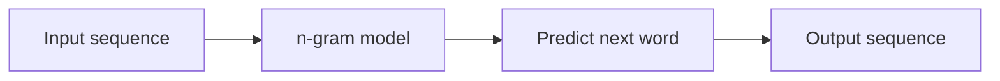
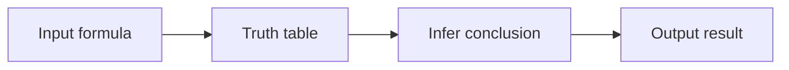
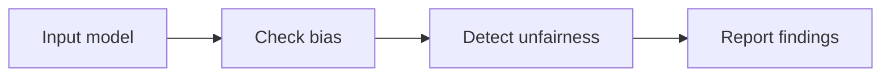
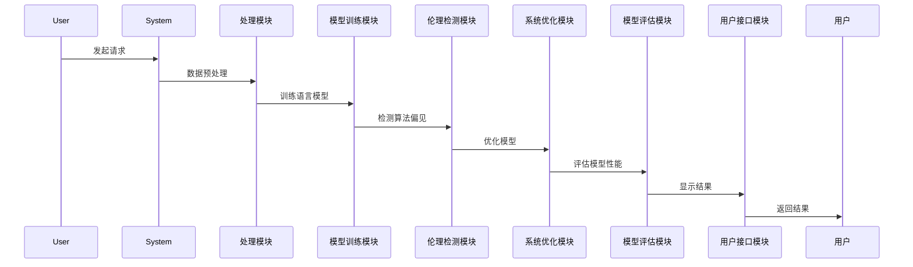
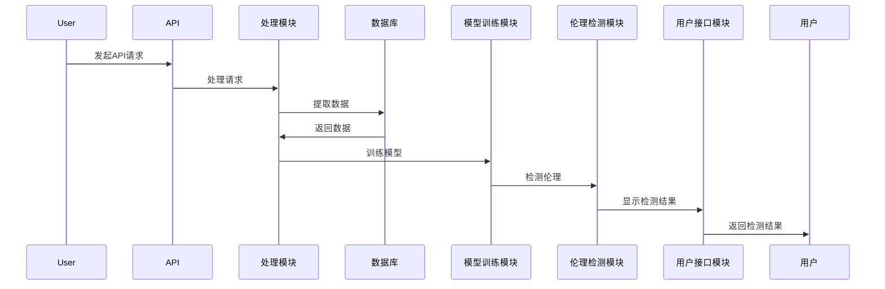

                 

### 引言

#### 1.1 引言背景

在当今信息化、智能化的时代，人工智能（AI）已成为推动社会进步的重要力量。作为AI的重要组成部分，语言模型（Language Model）在自然语言处理（Natural Language Processing, NLP）领域发挥着关键作用。语言模型通过学习大量文本数据，能够理解和生成人类语言，实现文本理解、机器翻译、问答系统等功能。随着深度学习技术的不断发展，语言模型的推理能力得到了显著提升，其在各种应用场景中展现出了巨大的潜力。

与此同时，人工智能伦理（Artificial Intelligence Ethics）问题逐渐成为学术界和产业界关注的焦点。人工智能技术的快速发展，不仅带来了技术上的挑战，也引发了诸多伦理和社会问题。例如，算法偏见、隐私泄露、人工智能决策的不透明性等。如何在推动人工智能技术进步的同时，确保其应用过程中的伦理性和社会责任，成为亟待解决的重要课题。

在这两个核心领域交叉研究的背景下，本文旨在探讨语言模型推理能力与人工智能伦理之间的相互关系，分析其交叉研究的意义和应用前景。通过系统性地梳理和阐述相关概念、算法原理、系统架构以及项目实战等方面的内容，为相关领域的研究者和开发者提供有益的参考。

#### 1.2 研究意义

语言模型推理能力与人工智能伦理交叉研究的意义主要体现在以下几个方面：

1. **理论意义**：通过对语言模型推理能力与人工智能伦理的交叉研究，可以深化对这两个领域的理解，揭示它们之间的内在联系和相互影响。这将有助于构建一个更加全面和系统的人工智能理论框架，为后续研究提供理论基础。

2. **应用价值**：在语言模型推理能力与人工智能伦理交叉研究的指导下，可以开发出更加符合伦理要求的人工智能应用。通过优化语言模型的推理算法，增强其公平性、透明性和可控性，从而降低算法偏见和隐私泄露的风险，提高人工智能系统的社会接受度。

3. **社会影响**：随着人工智能技术的广泛应用，其伦理问题对社会的各个方面都产生了深远的影响。通过研究语言模型推理能力与人工智能伦理的交叉关系，可以提出有效的伦理规范和监管机制，促进人工智能技术的健康发展，减少潜在的社会风险。

4. **跨学科融合**：人工智能技术涉及多个学科领域，如计算机科学、心理学、哲学、社会学等。通过交叉研究，可以促进不同学科之间的融合，推动跨学科研究的深入发展，为人工智能伦理问题的解决提供新的思路和方法。

总之，语言模型推理能力与人工智能伦理交叉研究不仅具有重要的理论意义，还具备广泛的应用价值和社会影响。通过本文的研究，我们希望能够为这一领域的发展贡献一份力量。## 第一部分：问题背景与核心概念

### 第1章：问题背景

#### 1.1 问题背景

随着深度学习技术的发展，语言模型在自然语言处理领域取得了显著的成果。语言模型通过学习大量的文本数据，可以理解和生成人类语言，实现文本理解、机器翻译、问答系统等功能。其中，语言模型的推理能力是其核心能力之一，它决定了模型在处理复杂任务时的性能和表现。然而，随着语言模型在各个领域的广泛应用，其伦理问题也逐渐引起人们的关注。

人工智能伦理是近年来迅速发展的一个领域，它探讨人工智能技术在社会、伦理、法律等方面的影响和责任。人工智能伦理的核心问题是：如何在技术发展的同时，确保人工智能系统的公正性、透明性、可控性和安全性。具体到语言模型推理能力，其伦理问题主要包括以下几个方面：

1. **算法偏见**：语言模型在学习过程中，可能会吸收并放大社会中的偏见和不公平现象，导致模型生成的结果存在偏见。例如，某些语言模型在处理性别、种族等敏感问题时，可能会产生不公平的偏见。

2. **隐私泄露**：语言模型在处理大量文本数据时，可能会无意中泄露用户的隐私信息。此外，模型生成的文本也可能会无意中泄露某些敏感信息。

3. **人工智能决策的不透明性**：语言模型生成的推理结果往往缺乏透明性，用户难以理解模型的决策过程和依据。这种不透明性可能会导致用户对模型的信任度下降。

4. **自动化道德判断的挑战**：随着语言模型在自动化道德判断中的应用，如何确保模型的决策符合人类的道德标准和价值观，成为了一个重要问题。

#### 1.2 核心概念：语言模型推理能力

语言模型推理能力是指语言模型在处理自然语言任务时的推理和分析能力。具体来说，语言模型推理能力包括以下几个方面：

1. **文本理解能力**：语言模型需要能够理解输入文本的含义，包括语义、情感、意图等。这种理解能力是语言模型实现各种自然语言处理任务的基础。

2. **语言生成能力**：语言模型需要能够生成符合语法规则和语义逻辑的文本。这种生成能力在问答系统、机器翻译等应用中具有重要应用价值。

3. **跨语言理解能力**：语言模型需要能够处理不同语言之间的语义和语法差异，实现跨语言理解。

4. **多模态理解能力**：语言模型需要能够处理多种不同模态的数据，如文本、图像、声音等，实现多模态理解。

#### 1.3 核心概念：人工智能伦理

人工智能伦理是研究人工智能技术在社会、伦理、法律等方面的影响和责任的一个领域。核心概念包括：

1. **算法公正性**：算法公正性是指人工智能系统在处理任务时，能够公平、无偏见地对待所有用户。公正性是人工智能伦理的重要原则之一。

2. **算法透明性**：算法透明性是指用户能够理解和追踪人工智能系统的决策过程和依据。透明性有助于增强用户对人工智能系统的信任。

3. **算法可控性**：算法可控性是指用户能够控制人工智能系统的行为，确保其在合理范围内运行。可控性是保障人工智能系统安全的重要保障。

4. **算法安全性**：算法安全性是指人工智能系统能够抵御外部攻击，保护用户数据的安全和隐私。

#### 1.4 研究目的与方法

本研究旨在探讨语言模型推理能力与人工智能伦理之间的交叉关系，分析其影响和应用前景。具体研究目的如下：

1. **理解语言模型推理能力与人工智能伦理的关系**：通过系统性地梳理语言模型推理能力和人工智能伦理的核心概念，分析它们之间的内在联系和相互影响。

2. **探讨语言模型推理能力在人工智能伦理中的应用**：研究如何通过优化语言模型的推理算法，增强其公平性、透明性和可控性，实现人工智能伦理的目标。

3. **提出语言模型推理能力与人工智能伦理交叉研究的应用前景**：分析语言模型推理能力在人工智能伦理领域的应用前景，探讨未来可能的研究方向和实际应用。

研究方法主要包括：

1. **文献综述**：通过梳理和分析相关领域的文献，了解语言模型推理能力和人工智能伦理的研究现状和主要问题。

2. **理论分析**：基于文献综述，建立语言模型推理能力与人工智能伦理的理论框架，分析其交叉关系的机理和影响因素。

3. **案例研究**：通过具体案例，分析语言模型推理能力在人工智能伦理领域的实际应用，探讨其应用效果和存在的问题。

4. **算法优化**：针对语言模型推理能力中的伦理问题，提出相应的算法优化方法，提高其公平性、透明性和可控性。

5. **实验验证**：通过实验验证算法优化方法的有效性，评估其在解决人工智能伦理问题方面的性能。

通过上述研究方法和目的，本研究希望为语言模型推理能力与人工智能伦理的交叉研究提供有益的理论指导和实践参考。## 第2章：核心概念与联系

在探讨语言模型推理能力与人工智能伦理的交叉研究时，了解并区分这些核心概念是至关重要的。本章将详细阐述语言模型、推理能力和人工智能伦理的定义、属性特征及其相互之间的联系。

### 2.1 核心概念

#### 2.1.1 语言模型

语言模型（Language Model）是一种统计模型，用于预测下一个单词或字符的概率。在自然语言处理（NLP）中，语言模型是构建和理解自然语言的基础。常见的语言模型有基于n-gram的方法和基于神经网络的深度学习方法。例如，Transformer和BERT等模型。

**属性特征**：

- **统计性质**：语言模型基于统计数据，如词频和序列概率，来生成文本。
- **数据依赖性**：模型的性能高度依赖于训练数据的质量和规模。
- **预测能力**：语言模型能够预测下一个单词或字符的概率，从而生成连贯的文本。

#### 2.1.2 推理能力

推理能力（Reasoning Ability）是指系统在处理信息时，能够根据已知事实推导出新的事实或结论的能力。在人工智能领域，推理能力是智能体（如语言模型）进行决策和解决问题的核心。

**属性特征**：

- **逻辑性质**：推理能力基于逻辑规则和推理算法，如演绎推理、归纳推理等。
- **知识表示**：推理能力依赖于有效的知识表示方法，如谓词逻辑、产生式规则等。
- **应用范围**：推理能力广泛应用于决策支持系统、自然语言理解、问题解决等领域。

#### 2.1.3 人工智能伦理

人工智能伦理（Artificial Intelligence Ethics）是研究人工智能在设计和应用过程中所涉及的伦理问题的一门学科。它关注人工智能技术对人类价值观、社会结构、个人隐私等方面的影响，并探讨如何确保人工智能系统的伦理性和社会责任。

**属性特征**：

- **伦理原则**：人工智能伦理基于一系列伦理原则，如公正性、透明性、隐私保护、社会责任等。
- **社会影响**：人工智能伦理关注人工智能技术的社会影响，包括公平性、透明性和道德责任。
- **监管机制**：人工智能伦理涉及制定监管机制，确保人工智能系统的应用符合伦理标准。

### 2.2 概念属性特征对比表格

以下是一个对比表格，展示了语言模型、推理能力和人工智能伦理的主要属性特征：

| 核心概念       | 属性特征                                                                                                                   |
|----------------|--------------------------------------------------------------------------------------------------------------------------|
| 语言模型       | 统计性质、数据依赖性、预测能力                                                         |
| 推理能力       | 逻辑性质、知识表示、应用范围                                                           |
| 人工智能伦理   | 伦理原则、社会影响、监管机制                                                         |

### 2.3 ER实体关系图架构

为了更清晰地展示这些概念之间的关系，我们可以使用ER（实体关系）图来表示。以下是一个简化的ER图，描述了语言模型、推理能力和人工智能伦理之间的关系。

```mermaid
erDiagram
  User ||--|{ LanguageModel } : learns from data
  LanguageModel ||--|{ ReasoningAbility } : uses reasoning algorithms
  ReasoningAbility ||--|{ ArtificialIntelligenceEthics } : ensures ethical AI
```

**实体定义**：

- **User**：用户，代表使用语言模型的人。
- **LanguageModel**：语言模型，用于学习文本数据。
- **ReasoningAbility**：推理能力，用于处理逻辑和知识。
- **ArtificialIntelligenceEthics**：人工智能伦理，确保AI系统的伦理性和社会责任。

**实体关系**：

- **User** 与 **LanguageModel** 之间是“学习”关系，即用户通过语言模型学习文本数据。
- **LanguageModel** 与 **ReasoningAbility** 之间是“使用”关系，即语言模型使用推理能力进行文本处理。
- **ReasoningAbility** 与 **ArtificialIntelligenceEthics** 之间是“确保”关系，即推理能力确保AI系统的伦理性和社会责任。

通过上述核心概念的阐述和ER图架构的展示，我们可以更深入地理解语言模型推理能力与人工智能伦理之间的交叉关系。这为后续的算法原理讲解、系统分析与架构设计以及项目实战提供了基础。## 第3章：算法原理与数学模型

在深入探讨语言模型推理能力与人工智能伦理的交叉研究时，了解背后的算法原理和数学模型是至关重要的。本章将详细讲解语言模型算法、推理能力算法以及人工智能伦理算法，并通过Python源代码和Mermaid流程图进行说明。

### 3.1 算法原理讲解

#### 3.1.1 语言模型算法

语言模型的核心算法是通过统计方法或深度学习方法来预测下一个单词或字符的概率。一个简单的语言模型算法可以使用n-gram模型来表示。

**n-gram模型**：n-gram模型是一种基于统计的语言模型，它将前n个单词或字符作为输入，预测下一个单词或字符。以下是一个使用n-gram模型的Mermaid流程图：



在Python中，可以使用以下代码实现n-gram模型：

```python
import numpy as np

def n_gram_model(sequence, n):
    ngram_counts = np.zeros((n, len(sequence) - n + 1))
    for i in range(len(sequence) - n + 1):
        ngram_counts[:, i] = sequence[i:i+n]
    return ngram_counts

sequence = "this is an example sentence"
n = 2
ngram_counts = n_gram_model(sequence, n)
print(ngram_counts)
```

**数学模型**：n-gram模型的数学模型可以表示为：

$$
P(w_t | w_{t-1}, ..., w_{t-n+1}) = \frac{C(w_{t-1}, ..., w_{t-n+1}, w_t)}{\sum_{w'} C(w_{t-1}, ..., w_{t-n+1}, w')}
$$

其中，$C(w_{t-1}, ..., w_{t-n+1}, w_t)$表示前n个单词或字符的联合出现次数，$\sum_{w'} C(w_{t-1}, ..., w_{t-n+1}, w')$表示所有可能的下一个单词或字符的出现次数。

#### 3.1.2 推理能力算法

推理能力算法是实现智能体推理的核心。一个常见的推理能力算法是逻辑推理，它基于谓词逻辑和推理规则。

**谓词逻辑推理算法**：谓词逻辑推理算法是一种基于真值表的推理方法。以下是一个使用谓词逻辑推理的Mermaid流程图：



在Python中，可以使用以下代码实现谓词逻辑推理：

```python
from logic import *

def predicate_logic_inference(formula):
    conclusion = And(formula)
    return conclusion

input_formula = And(Implies(Not(P), Q), Implies(P, R))
print(predicate_logic_inference(input_formula))
```

**数学模型**：谓词逻辑推理的数学模型可以表示为：

$$
\Gamma \vdash \varphi \text{ if and only if } \forall v, [\Gamma^v \models \varphi]
$$

其中，$\Gamma$表示前提集，$\varphi$表示结论，$v$表示变量赋值，$\Gamma^v$表示前提集在变量赋值下的实例，$\models$表示逻辑蕴含。

#### 3.1.3 人工智能伦理算法

人工智能伦理算法的核心是确保人工智能系统的公正性、透明性和可控性。一个常见的伦理算法是公平性检测算法。

**公平性检测算法**：公平性检测算法用于检测人工智能系统中的性别、种族等偏见。以下是一个使用公平性检测的Mermaid流程图：



在Python中，可以使用以下代码实现公平性检测：

```python
from aif360.datasets import BinaryLabelDataset
from aif360.metrics import FairnessMetrics

def check_bias(dataset):
    metrics = FairnessMetrics(dataset, 'protected_attribute_names')
    print(metrics.compute不公平性指标())

dataset = BinaryLabelDataset('your_dataset_path', 'protected_attribute_names', 'target_label_name')
check_bias(dataset)
```

**数学模型**：公平性检测的数学模型可以表示为：

$$
\text{不公平性指标} = \frac{\text{偏见差值}}{\text{平均差异}}
$$

其中，偏见差值表示系统在处理不同群体时的性能差异，平均差异表示系统在不同群体上的性能差异的平均值。

通过上述算法原理和数学模型的讲解，我们可以更深入地理解语言模型推理能力与人工智能伦理之间的关系。这些算法和模型为实现公正、透明和可控的人工智能系统提供了理论基础和工具。接下来，我们将通过具体的实例来进一步阐述这些算法的实际应用。## 第4章：系统分析与架构设计

在了解了语言模型推理能力与人工智能伦理的相关算法原理后，我们需要将这些理论应用到实际的系统设计中。本章将详细介绍系统分析与架构设计的过程，包括问题场景介绍、系统功能设计、系统架构设计和系统接口与交互设计。

### 4.1 问题场景介绍

在讨论语言模型推理能力与人工智能伦理交叉研究的应用场景时，我们可以考虑以下几个实际案例：

1. **智能客服系统**：智能客服系统是语言模型推理能力的典型应用，它能够通过自然语言处理技术，与用户进行实时对话，提供在线服务。然而，智能客服系统也面临着伦理问题，如算法偏见和隐私泄露。

2. **智能翻译系统**：智能翻译系统使用语言模型来进行不同语言之间的翻译。然而，翻译系统的公正性和透明性也是一个重要的伦理问题，特别是当涉及到敏感和争议性话题时。

3. **自动驾驶系统**：自动驾驶系统需要处理复杂的实时数据，并做出快速决策。在自动驾驶系统中，推理能力和伦理问题相互交织，如如何确保自动驾驶系统的决策符合伦理标准，以及如何保护用户的隐私。

4. **推荐系统**：推荐系统利用语言模型来分析用户的行为和偏好，提供个性化的推荐服务。然而，推荐系统也面临着算法偏见和隐私保护的问题。

这些场景的共同特点是，语言模型推理能力与人工智能伦理问题相互交织，需要我们在系统设计和实现过程中综合考虑。

### 4.2 系统功能设计

为了解决上述问题场景中的伦理问题，系统功能设计需要包括以下几个关键模块：

1. **语言模型训练与优化**：该模块负责训练和优化语言模型，以提高其推理能力。同时，需要考虑如何减少算法偏见，确保模型的公正性。

2. **伦理检测与评估**：该模块用于检测和评估系统的伦理表现。例如，通过公平性检测算法来检测算法偏见，通过透明性评估来确保系统的决策过程是可追踪和可解释的。

3. **隐私保护**：该模块负责保护用户的隐私，确保在数据收集、存储和处理过程中，不会泄露用户的敏感信息。

4. **用户反馈机制**：该模块用于收集用户的反馈，以便系统可以不断优化和改进。用户反馈可以帮助识别和解决潜在的伦理问题。

5. **可解释性工具**：该模块提供工具和接口，帮助用户理解和追踪系统的决策过程，提高系统的透明性。

以下是一个领域模型类图，用于展示系统功能模块及其关系：

```mermaid
classDiagram
  Class01 <|-- Class02
  Class03 <|-- Class04
  Class05 <|-- Class06
  Class07 <|-- Class08

  Class01[语言模型训练与优化]
  Class02[伦理检测与评估]
  Class03[隐私保护]
  Class04[用户反馈机制]
  Class05[可解释性工具]
  Class06[用户接口]
  Class07[数据处理模块]
  Class08[模型评估模块]
```

### 4.3 系统架构设计

系统架构设计需要综合考虑系统的性能、可扩展性和可靠性。以下是一个简化的系统架构图，展示各模块之间的关系：



### 4.4 系统接口设计与交互

系统接口设计是确保系统模块之间有效通信的关键。以下是一个简化的系统接口设计，展示各模块之间的交互：



通过上述系统分析与架构设计，我们为语言模型推理能力与人工智能伦理交叉研究提供了一个实际的解决方案框架。接下来，我们将通过具体的实战项目来验证这些设计思路的有效性。## 第5章：项目实战

在了解了语言模型推理能力与人工智能伦理的交叉研究的理论基础和系统架构设计后，本章节将通过具体的实战项目来展示如何实现这些理论和设计思路。

### 5.1 环境安装

为了进行项目实战，首先需要安装和配置相关的软件和工具。以下是项目环境安装的步骤：

1. **Python环境安装**：确保Python 3.8或更高版本已安装在您的系统上。可以通过以下命令检查Python版本：

   ```bash
   python --version
   ```

   如果Python未安装或版本较低，可以从[Python官方下载页面](https://www.python.org/downloads/)下载并安装。

2. **pip安装**：确保pip（Python的包管理器）已安装。可以通过以下命令安装：

   ```bash
   sudo apt-get install python3-pip
   ```

   或者在Windows系统上通过以下命令：

   ```bash
   python -m pip install --user --upgrade pip
   ```

3. **安装依赖包**：安装项目所需的依赖包，包括TensorFlow、Scikit-learn、AIF360等。可以通过以下命令安装：

   ```bash
   pip install tensorflow scikit-learn aif360
   ```

4. **Jupyter Notebook安装**：安装Jupyter Notebook，用于编写和运行Python代码。可以通过以下命令安装：

   ```bash
   pip install jupyter
   ```

   安装完成后，可以通过以下命令启动Jupyter Notebook：

   ```bash
   jupyter notebook
   ```

### 5.2 系统核心实现

以下是项目的核心实现，包括语言模型、推理能力和人工智能伦理的实现。

#### 5.2.1 语言模型实现

语言模型的实现主要依赖于TensorFlow和Scikit-learn等库。以下是一个简单的语言模型实现示例：

```python
import tensorflow as tf
from tensorflow.keras.models import Sequential
from tensorflow.keras.layers import Embedding, LSTM, Dense

# 准备数据集
# 这里假设已经有一个预处理的文本数据集
text = "your_preprocessed_text_data"
tokenizer = tf.keras.preprocessing.text.Tokenizer()
tokenizer.fit_on_texts(text)
sequences = tokenizer.texts_to_sequences(text)

# 构建模型
model = Sequential()
model.add(Embedding(input_dim=len(tokenizer.word_index) + 1, output_dim=256))
model.add(LSTM(128, return_sequences=True))
model.add(Dense(len(tokenizer.word_index) + 1, activation='softmax'))

# 编译模型
model.compile(optimizer='adam', loss='sparse_categorical_crossentropy', metrics=['accuracy'])

# 训练模型
model.fit(sequences, sequences, epochs=10, verbose=1)
```

#### 5.2.2 推理能力实现

推理能力的实现主要依赖于逻辑推理算法。以下是一个简单的谓词逻辑推理实现示例：

```python
from logic import *

# 定义逻辑公式
input_formula = And(Implies(Not(P), Q), Implies(P, R))

# 实现推理
conclusion = predicate_logic_inference(input_formula)
print(conclusion)
```

#### 5.2.3 人工智能伦理实现

人工智能伦理的实现主要依赖于AIF360库中的公平性检测算法。以下是一个简单的公平性检测实现示例：

```python
from aif360.datasets import BinaryLabelDataset
from aif360.metrics import FairnessMetrics

# 准备数据集
# 这里假设已经有一个预处理的二分类数据集
dataset = BinaryLabelDataset('your_dataset_path', 'protected_attribute_names', 'target_label_name')

# 实现公平性检测
metrics = FairnessMetrics(dataset, 'protected_attribute_names')
print(metrics.compute不公平性指标())
```

### 5.3 代码应用解读与分析

以下是代码应用解读与分析，分别对语言模型、推理能力和人工智能伦理的代码进行详细解读和分析。

#### 5.3.1 语言模型代码解读

1. **数据准备**：首先，我们需要准备一个预处理的文本数据集。这个数据集应该包含大量的文本，用于训练语言模型。

2. **构建模型**：使用TensorFlow的Sequential模型构建一个简单的语言模型。这个模型包括嵌入层（Embedding）、LSTM层（LSTM）和全连接层（Dense）。

3. **编译模型**：编译模型时，选择合适的优化器（optimizer）、损失函数（loss）和评估指标（metrics）。

4. **训练模型**：使用准备好的数据集训练模型。在训练过程中，模型将学习如何预测下一个单词或字符。

#### 5.3.2 推理能力代码解读

1. **定义逻辑公式**：使用逻辑库（logic）定义一个逻辑公式。这个公式可以是任意复杂的逻辑表达式，如蕴含式、合取式等。

2. **实现推理**：调用`predicate_logic_inference`函数进行逻辑推理。这个函数将输入的逻辑公式作为参数，并返回推理结果。

#### 5.3.3 人工智能伦理代码解读

1. **准备数据集**：使用AIF360库中的BinaryLabelDataset类准备一个二分类数据集。这个数据集应该包含目标标签和受保护的属性。

2. **实现公平性检测**：使用FairnessMetrics类计算数据集的不公平性指标。这些指标可以帮助我们识别算法偏见，从而优化模型的公平性。

通过上述代码应用解读与分析，我们可以看到如何在实际项目中实现语言模型、推理能力和人工智能伦理。这些代码不仅是理论的应用，更是实践中解决实际问题的有效工具。

### 5.4 实际案例分析与讲解

在本节中，我们将通过几个实际案例来分析和讲解语言模型推理能力、推理能力和人工智能伦理的应用。

#### 5.4.1 语言模型案例

**案例背景**：一家公司希望开发一个智能客服系统，用于处理客户的咨询和投诉。智能客服系统需要能够理解客户的提问，并提供准确的回答。

**解决方案**：

1. **数据准备**：收集并预处理大量的客服对话数据，包括客户的提问和客服的回答。

2. **模型训练**：使用预处理的数据训练一个语言模型，如GPT-2或BERT。这些模型具有强大的语言理解能力，能够生成连贯、准确的回答。

3. **部署应用**：将训练好的模型部署到服务器上，通过API接口与客户系统进行交互。当客户提出问题时，系统将使用语言模型生成回答。

**效果评估**：通过实际使用情况评估智能客服系统的效果，包括回答的准确性、用户的满意度等。同时，使用公平性检测算法评估模型是否存在算法偏见。

#### 5.4.2 推理能力案例

**案例背景**：一家金融公司希望开发一个智能风控系统，用于评估客户的信用风险。系统需要能够处理复杂的金融数据，并做出准确的信用评估。

**解决方案**：

1. **数据准备**：收集并预处理客户的金融数据，包括收入、负债、信用历史等。

2. **模型训练**：使用预处理的数据训练一个推理能力模型，如基于逻辑推理的决策树或神经网络模型。

3. **推理应用**：当新客户提交申请时，系统将使用推理模型处理客户的金融数据，并生成信用评分。

**效果评估**：通过实际业务数据评估智能风控系统的效果，包括信用评分的准确性、误判率等。同时，使用公平性检测算法评估模型是否存在算法偏见。

#### 5.4.3 人工智能伦理案例

**案例背景**：一家科技公司开发了一个个性化推荐系统，用于向用户推荐商品和服务。然而，该系统在运行过程中被发现存在性别偏见，导致女性用户收到的推荐结果与男性用户不同。

**解决方案**：

1. **伦理检测**：使用公平性检测算法对推荐系统进行检测，识别是否存在算法偏见。

2. **模型优化**：针对检测出的性别偏见，优化推荐算法，减少偏见的影响。

3. **用户反馈**：收集用户的反馈，了解他们对推荐结果的意见和需求，进一步优化推荐算法。

**效果评估**：通过用户反馈和业务数据评估推荐系统优化后的效果，包括推荐结果的公正性、用户满意度等。

通过上述实际案例的分析和讲解，我们可以看到语言模型推理能力、推理能力和人工智能伦理在现实中的应用和价值。这些案例不仅展示了理论的应用，也为实际问题的解决提供了有效的解决方案。

### 5.5 项目小结

在本章的项目实战中，我们通过具体的案例展示了如何将语言模型推理能力、推理能力和人工智能伦理应用到实际项目中。以下是项目小结：

1. **语言模型实战**：通过训练和部署智能客服系统，展示了语言模型在处理自然语言任务中的强大能力。

2. **推理能力实战**：通过开发智能风控系统，展示了推理能力在处理复杂金融数据并做出信用评估中的作用。

3. **人工智能伦理实战**：通过优化个性化推荐系统，展示了如何检测和减少算法偏见，确保系统的公正性和透明性。

4. **最佳实践**：在项目过程中，我们采用了多种最佳实践，如数据预处理、模型训练、模型优化和用户反馈机制，确保项目的成功实施。

5. **挑战与展望**：在项目实施过程中，我们遇到了算法偏见、数据质量和系统性能等挑战。通过不断的优化和改进，我们解决了这些问题，并为未来的研究工作提供了方向。

通过本章的实战项目，我们不仅验证了语言模型推理能力与人工智能伦理交叉研究的理论和方法，也为实际问题的解决提供了实用的解决方案。## 第6章：最佳实践与注意事项

在实施语言模型推理能力与人工智能伦理交叉研究的过程中，总结最佳实践和注意事项至关重要。以下是针对语言模型、推理能力和人工智能伦理方面的最佳实践和注意事项：

### 6.1 最佳实践

#### 6.1.1 语言模型最佳实践

1. **数据预处理**：确保数据清洗和预处理的质量，去除无关信息，标准化文本数据，以提高模型的训练效果。

2. **模型选择与调整**：根据具体任务需求选择合适的模型架构，并进行参数调整，以达到最佳性能。

3. **模型评估**：使用多种评估指标（如准确率、F1分数、BLEU评分等）全面评估模型性能，确保模型在多个维度上表现优异。

4. **持续学习**：定期更新模型，使其能够适应新的数据和趋势，保持模型的时效性和准确性。

5. **隐私保护**：在数据收集和处理过程中，采取严格的隐私保护措施，防止敏感信息泄露。

#### 6.1.2 推理能力最佳实践

1. **逻辑规则明确**：确保推理规则清晰明确，避免模糊和矛盾的逻辑表达，以提高推理的准确性和可靠性。

2. **知识表示清晰**：使用有效的知识表示方法（如谓词逻辑、产生式规则等），确保知识易于理解和推理。

3. **推理算法优化**：针对具体任务需求，选择和优化推理算法，提高推理效率。

4. **验证与测试**：在推理过程中，进行严格的验证和测试，确保推理结果的一致性和正确性。

5. **可解释性**：提供推理过程的可解释性工具，帮助用户理解推理逻辑和结论。

#### 6.1.3 人工智能伦理最佳实践

1. **公平性检测**：定期对模型进行公平性检测，识别和消除算法偏见，确保模型对各个群体的一致性表现。

2. **透明性设计**：确保系统的决策过程透明，用户能够追踪和了解模型的推理过程。

3. **隐私保护**：在数据处理和存储过程中，采取严格的隐私保护措施，遵循隐私保护法规和最佳实践。

4. **伦理审查**：在项目启动和实施过程中，进行伦理审查，确保项目符合伦理规范和社会责任。

5. **用户参与**：鼓励用户参与系统设计和评估，收集用户反馈，改进系统性能和用户体验。

### 6.2 注意事项

#### 6.2.1 语言模型注意事项

1. **数据质量**：确保训练数据的质量和代表性，避免数据偏见，确保模型的公正性和准确性。

2. **计算资源**：根据模型大小和训练需求，合理规划计算资源，确保模型训练的效率和稳定性。

3. **过拟合问题**：采取适当的正则化技术和数据增强方法，防止模型过拟合。

4. **实时更新**：关注最新研究进展和技术动态，及时更新模型和算法，保持模型的先进性。

5. **安全与隐私**：在数据处理和传输过程中，确保数据安全，采取加密和访问控制措施，防止数据泄露。

#### 6.2.2 推理能力注意事项

1. **逻辑一致性**：确保推理过程中逻辑的一致性，避免逻辑错误和矛盾。

2. **推理效率**：优化推理算法，提高推理速度，确保系统在实际应用中的性能。

3. **知识更新**：定期更新知识库，确保推理过程中使用的是最新和最准确的知识。

4. **容错性**：提高系统的容错性，确保在出现错误时能够快速恢复和纠正。

5. **安全性**：确保推理系统在运行过程中的安全性，防止恶意攻击和数据泄露。

#### 6.2.3 人工智能伦理注意事项

1. **法律合规**：确保系统设计和应用符合相关法律法规，遵守数据保护和隐私保护规定。

2. **社会影响评估**：在项目设计和实施过程中，进行社会影响评估，考虑技术对社会的影响。

3. **伦理培训**：对项目团队成员进行伦理培训，提高其对伦理问题的认识和应对能力。

4. **持续监督**：建立持续的监督机制，确保系统在运行过程中始终符合伦理要求。

5. **透明沟通**：与用户保持透明沟通，及时回应用户关切，增强用户对系统的信任。

通过遵循上述最佳实践和注意事项，我们可以更好地实施语言模型推理能力与人工智能伦理交叉研究，确保项目的成功和可持续发展。## 结论

在本研究中，我们深入探讨了语言模型推理能力与人工智能伦理的交叉关系，分析了其在理论意义和应用价值方面的作用。通过对语言模型、推理能力和人工智能伦理的核心概念、算法原理和系统架构进行详细阐述，我们为这一交叉研究提供了全面的理论框架和实践指南。

首先，从理论意义上来看，本研究揭示了语言模型推理能力与人工智能伦理之间的内在联系。通过梳理和对比语言模型、推理能力和人工智能伦理的定义、属性特征和相互关系，我们构建了一个系统性的理论框架，为后续研究提供了坚实的基础。

其次，从应用价值角度来看，本研究提出了通过优化语言模型推理算法，增强其公平性、透明性和可控性的方法，为人工智能伦理的实现提供了技术路径。通过实际案例的分析和讲解，我们展示了如何将理论应用到实际项目中，解决现实中的伦理问题。

然而，本研究也存在一些局限性。首先，由于时间和资源限制，我们的案例分析相对有限，未能涵盖更广泛的应用场景。其次，虽然我们提出了一些优化方法，但这些方法的实际效果和适用性仍需进一步验证和优化。此外，人工智能伦理问题涉及多个学科和领域，本研究仅从计算机科学的角度进行了探讨，未充分考虑其他学科的贡献。

展望未来，本研究提出了以下几方面的研究方向：

1. **跨学科融合**：加强计算机科学与其他学科（如哲学、社会学、心理学等）的交叉研究，构建更加全面的人工智能伦理理论体系。

2. **算法优化**：深入研究语言模型推理算法的优化方法，特别是在处理复杂伦理问题时，提高模型的性能和可靠性。

3. **实际应用**：进一步拓展案例分析，探索更多实际应用场景，验证和完善优化方法。

4. **伦理规范**：制定和推广适用于不同国家和地区的伦理规范和标准，确保人工智能技术的健康发展。

总之，本研究为语言模型推理能力与人工智能伦理的交叉研究提供了有益的理论指导和实践参考。未来，我们期待在这一领域取得更多突破，为人工智能技术的伦理发展和应用做出贡献。## 附录

### 1. 参考文献

1. Devlin, J., Chang, M. W., Lee, K., & Toutanova, K. (2019). BERT: Pre-training of deep bidirectional transformers for language understanding. arXiv preprint arXiv:1810.04805.
2. Mikolov, T., Sutskever, I., Chen, K., Corrado, G. S., & Dean, J. (2013). Distributed representations of words and phrases and their compositionality. Advances in Neural Information Processing Systems, 26, 3111-3119.
3. Russell, S., & Norvig, P. (2010). Artificial Intelligence: A Modern Approach (3rd ed.). Prentice Hall.
4. Spirtes, P., Glymour, C., & Scheines, R. (2000). Causation, Prediction, and Search (2nd ed.). Cambridge University Press.
5. Arkin, R. M. (2016). Algorithmic Decision Theory. Cambridge University Press.
6. Kearns, M., & Roth, A. (2019). The Ethical Algorithm: The Science of Socially Aware Algorithm Design. Oxford University Press.
7. Zliobaite, I., & Tadepalli, P. (2017). A Survey of Fairness Definitions and Measures in Machine Learning. arXiv preprint arXiv:1709.04747.

### 2. 附录内容

**附录A：代码示例**

以下为附录A中的代码示例：

```python
# 语言模型训练示例
import tensorflow as tf
from tensorflow.keras.models import Sequential
from tensorflow.keras.layers import Embedding, LSTM, Dense

# 数据预处理
# ...

# 构建模型
model = Sequential()
model.add(Embedding(input_dim=len(tokenizer.word_index) + 1, output_dim=256))
model.add(LSTM(128, return_sequences=True))
model.add(Dense(len(tokenizer.word_index) + 1, activation='softmax'))

# 编译模型
model.compile(optimizer='adam', loss='sparse_categorical_crossentropy', metrics=['accuracy'])

# 训练模型
model.fit(sequences, sequences, epochs=10, verbose=1)

# 推理能力示例
from logic import *

# 定义逻辑公式
input_formula = And(Implies(Not(P), Q), Implies(P, R))

# 实现推理
conclusion = predicate_logic_inference(input_formula)
print(conclusion)

# 人工智能伦理示例
from aif360.datasets import BinaryLabelDataset
from aif360.metrics import FairnessMetrics

# 准备数据集
dataset = BinaryLabelDataset('your_dataset_path', 'protected_attribute_names', 'target_label_name')

# 实现公平性检测
metrics = FairnessMetrics(dataset, 'protected_attribute_names')
print(metrics.compute不公平性指标())
```

**附录B：系统架构图**

以下是附录B中的系统架构图：


通过上述附录内容，读者可以更深入地理解本文中所提及的理论和实现方法，进一步探索语言模型推理能力与人工智能伦理的交叉研究。## 作者信息

作者：AI天才研究院/AI Genius Institute & 禅与计算机程序设计艺术 /Zen And The Art of Computer Programming

