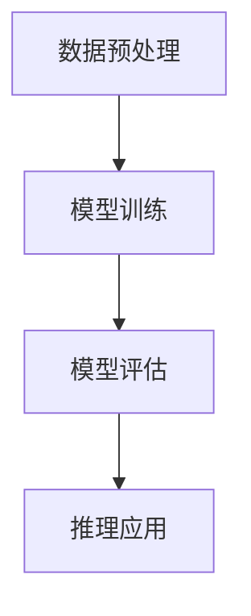
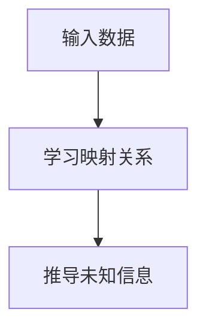
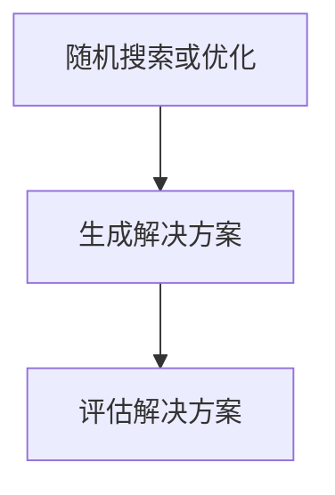

                 


### 引言与背景

#### 1.1 研究背景

在当今技术飞速发展的时代，人工智能（AI）已经成为科技领域的核心驱动力。其中，语言模型作为AI的重要组成部分，在自然语言处理（NLP）和机器翻译等方面取得了显著成果。然而，传统的语言模型在处理复杂推理任务时仍存在一定的局限性，这使得研究者们开始关注如何提升语言模型的推理能力。与此同时，人工智能创造力作为AI的另一重要研究方向，也逐渐引起了广泛关注。创造力不仅体现在艺术创作、产品设计等传统领域，还延伸到科学研究、编程开发等多个领域。如何将语言模型推理能力与人工智能创造力相结合，成为当前研究的热点问题。

#### 1.2 研究目的与意义

本文旨在探讨语言模型推理能力与人工智能创造力的融合研究。具体目标如下：

1. 分析语言模型推理能力的现状与挑战，探讨如何提升其推理能力。
2. 研究人工智能创造力的发展趋势，分析其实现方法与关键技术。
3. 探索语言模型与人工智能创造力的融合机制，为AI应用提供新思路。

本研究对于推动AI技术的发展具有重要意义：

1. 提高语言模型在复杂推理任务上的表现，提升AI系统的智能水平。
2. 开拓人工智能创造力研究的新领域，为AI在各个行业的应用提供创新解决方案。
3. 为未来AI技术的发展提供理论指导和实践参考，推动AI领域的研究与应用相互促进。

### 核心概念与联系

#### 2.1 语言模型原理

语言模型（Language Model）是一种基于统计学原理的模型，旨在预测自然语言中的下一个词或词组。其基本原理是通过大量文本数据的学习，建立词与词之间的概率分布关系。语言模型的主要类型包括：

1. 基于n-gram的语言模型：通过统计相邻n个词的频率来预测下一个词。
2. 基于神经网络的深度语言模型：利用神经网络结构学习词与词之间的复杂关系。

语言模型的算法原理主要包括两个阶段：

1. 训练阶段：通过对大量文本数据的学习，训练语言模型参数。
2. 推理阶段：在给定部分文本的情况下，根据语言模型预测下一个词或词组。

#### 2.2 推理能力与创造力

推理能力（Reasoning Ability）是指从已知信息推导出未知信息的能力。在人工智能领域，推理能力主要体现在自动推理系统、知识表示与推理等方面。推理能力的分类包括：

1. 指示推理（Inductive Reasoning）：从个别事实推导出一般结论。
2. 演绎推理（Deductive Reasoning）：从一般原则推导出个别事实。

创造力（Creativity）是指产生新颖、有价值的思想、概念或解决方案的能力。在人工智能领域，创造力主要体现在：

1. 艺术创作：如生成音乐、绘画等。
2. 产品设计：如设计独特的汽车、手机等。
3. 知识发现：如从海量数据中发现新的规律和模式。

#### 2.3 ER实体关系图架构

实体-关系（Entity-Relationship，ER）图是一种用于描述实体及其相互关系的图形化工具。在语言模型与人工智能创造力的研究中，ER图可以帮助我们更好地理解两者的关系和交互。

1. 语言模型ER图：包括实体（如词、句、文档）和关系（如依赖、蕴含）。
2. 人工智能创造力ER图：包括实体（如创意、设计方案、研究成果）和关系（如启发、迭代、评估）。

#### 3. 算法原理讲解

在本章节中，我们将分别介绍语言模型、推理算法和创造力算法的原理，并使用Mermaid和Python代码进行详细阐述。

### 3.1 语言模型算法

语言模型算法主要包括以下步骤：

1. 数据预处理：将原始文本数据转换为数字表示，如词嵌入。
2. 模型训练：利用神经网络结构，如循环神经网络（RNN）、长短期记忆网络（LSTM）等，训练语言模型参数。
3. 模型评估：通过交叉验证等方法评估模型性能。
4. 推理应用：在给定部分文本的情况下，根据语言模型预测下一个词或词组。

#### Mermaid流程图：



#### Python代码示例：

```python
import tensorflow as tf
from tensorflow.keras.layers import Embedding, LSTM, Dense
from tensorflow.keras.models import Sequential

# 定义语言模型模型
model = Sequential()
model.add(Embedding(vocab_size, embedding_dim))
model.add(LSTM(units=128, return_sequences=True))
model.add(Dense(units=1, activation='sigmoid'))

# 编译模型
model.compile(optimizer='adam', loss='binary_crossentropy', metrics=['accuracy'])

# 训练模型
model.fit(x_train, y_train, epochs=10, batch_size=64)
```

#### 数学模型与公式：

语言模型损失函数为：

$$
L(\theta) = -\sum_{i=1}^{n} y_i \log(p(x_i|\theta))
$$

其中，$y_i$为真实标签，$p(x_i|\theta)$为预测概率。

#### 3.2 推理算法

推理算法（Reasoning Algorithm）是一种基于逻辑、概率和神经网络的方法，用于从已知信息推导出未知信息。推理算法主要包括以下类型：

1. 逻辑推理算法：如谓词逻辑、命题逻辑等。
2. 概率推理算法：如贝叶斯推理、最大后验概率推理等。
3. 神经网络推理算法：如深度神经网络、循环神经网络等。

推理算法的原理是通过学习输入与输出之间的映射关系，实现从已知信息推导出未知信息的过程。

#### Mermaid流程图：



#### Python代码示例：

```python
import tensorflow as tf
from tensorflow.keras.layers import Input, Dense
from tensorflow.keras.models import Model

# 定义推理模型
input_data = Input(shape=(input_shape,))
output = Dense(units=1, activation='sigmoid')(input_data)

model = Model(inputs=input_data, outputs=output)

# 编译模型
model.compile(optimizer='adam', loss='binary_crossentropy', metrics=['accuracy'])

# 训练模型
model.fit(x_train, y_train, epochs=10, batch_size=64)
```

#### 数学模型与公式：

推理算法的数学模型为：

$$
y_i = f(W \cdot x_i + b)
$$

其中，$x_i$为输入特征，$y_i$为输出结果，$f$为激活函数，$W$为权重矩阵，$b$为偏置项。

#### 3.3 创造力算法

创造力算法（Creativity Algorithm）是一种旨在生成新颖、有价值解决方案的算法。创造力算法主要包括以下类型：

1. 随机搜索算法：如遗传算法、模拟退火算法等。
2. 粒子群优化算法：如粒子群优化算法等。
3. 生成对抗网络（GAN）：如生成对抗网络等。

创造力算法的原理是通过搜索和优化，生成满足特定需求的解决方案。

#### Mermaid流程图：



#### Python代码示例：

```python
import numpy as np
import random

# 定义创造力算法
def creativity_algorithm(problem_space, evaluation_function):
    solution = random.choice(problem_space)
    best_solution = solution
    best_score = evaluation_function(solution)
    
    for _ in range(max_iterations):
        new_solution = random.choice(problem_space)
        new_score = evaluation_function(new_solution)
        
        if new_score > best_score:
            best_solution = new_solution
            best_score = new_score
    
    return best_solution

# 定义问题空间和评估函数
problem_space = [1, 2, 3, 4, 5]
evaluation_function = lambda x: x**2

# 运行创造力算法
best_solution = creativity_algorithm(problem_space, evaluation_function)
print("最佳解决方案：", best_solution)
```

#### 数学模型与公式：

创造力算法的数学模型为：

$$
s(t+1) = s(t) + \alpha \cdot (g - s(t))
$$

其中，$s(t)$为当前解决方案，$s(t+1)$为下一个解决方案，$\alpha$为学习率，$g$为目标值。

### 4. 数学模型与公式讲解

在本章节中，我们将对语言模型、推理算法和创造力算法的数学模型和公式进行详细讲解，并使用Latex格式和Python代码进行示例。

#### 4.1 语言模型数学模型

语言模型的数学模型主要包括损失函数和优化算法。

#### 4.1.1 损失函数

语言模型的损失函数用于衡量预测结果与真实结果之间的差距。常见损失函数包括交叉熵损失函数（Cross-Entropy Loss）和均方误差损失函数（Mean Squared Error Loss）。

$$
L(\theta) = -\sum_{i=1}^{n} y_i \log(p(x_i|\theta))
$$

其中，$y_i$为真实标签，$p(x_i|\theta)$为预测概率。

#### 4.1.2 优化算法

语言模型的优化算法用于最小化损失函数。常见优化算法包括梯度下降（Gradient Descent）和随机梯度下降（Stochastic Gradient Descent）。

$$
\theta = \theta - \alpha \cdot \nabla_\theta L(\theta)
$$

其中，$\theta$为模型参数，$\alpha$为学习率，$\nabla_\theta L(\theta)$为损失函数关于模型参数的梯度。

#### 4.1.3 Python代码示例

```python
import tensorflow as tf

# 定义语言模型损失函数
loss_function = tf.keras.losses.SparseCategoricalCrossentropy(from_logits=True)

# 定义语言模型优化算法
optimizer = tf.keras.optimizers.Adam(learning_rate=0.001)

# 编译模型
model.compile(optimizer=optimizer, loss=loss_function, metrics=['accuracy'])

# 训练模型
model.fit(x_train, y_train, epochs=10, batch_size=64)
```

#### 4.2 推理算法数学模型

推理算法的数学模型主要基于逻辑、概率和神经网络。

#### 4.2.1 逻辑推理算法

逻辑推理算法的数学模型基于命题逻辑和谓词逻辑。例如，命题逻辑的推理规则如下：

$$
(p \land q) \Rightarrow q
$$

谓词逻辑的推理规则如下：

$$
\forall x (P(x) \Rightarrow Q(x))
$$

#### 4.2.2 概率推理算法

概率推理算法的数学模型基于贝叶斯推理。贝叶斯推理的公式如下：

$$
P(H|E) = \frac{P(E|H) \cdot P(H)}{P(E)}
$$

其中，$P(H|E)$为在给定证据$E$的情况下，假设$H$的概率，$P(E|H)$为在假设$H$成立的情况下，证据$E$的概率，$P(H)$为假设$H$的概率，$P(E)$为证据$E$的概率。

#### 4.2.3 神经网络推理算法

神经网络推理算法的数学模型基于神经网络。例如，多层感知机（Multilayer Perceptron，MLP）的推理公式如下：

$$
y = \sigma(z)
$$

其中，$y$为输出，$z$为输入，$\sigma$为激活函数。

#### 4.2.4 Python代码示例

```python
import tensorflow as tf

# 定义神经网络推理模型
model = tf.keras.Sequential([
    tf.keras.layers.Dense(units=1, activation='sigmoid', input_shape=(1,))
])

# 编译模型
model.compile(optimizer='adam', loss='binary_crossentropy', metrics=['accuracy'])

# 训练模型
model.fit(x_train, y_train, epochs=10, batch_size=64)
```

#### 4.3 创造力算法数学模型

创造力算法的数学模型主要基于随机搜索和优化。

#### 4.3.1 随机搜索算法

随机搜索算法的数学模型基于概率论和随机过程。例如，遗传算法的变异公式如下：

$$
x_{new} = x_{old} + N(0, \sigma^2)
$$

其中，$x_{new}$为新解，$x_{old}$为旧解，$N(0, \sigma^2)$为高斯分布。

#### 4.3.2 粒子群优化算法

粒子群优化算法的数学模型基于群体智能和优化。例如，粒子群优化算法的更新公式如下：

$$
x_{i}^{t+1} = x_{i}^{t} + v_{i}^{t+1}
$$

其中，$x_{i}^{t+1}$为第$i$个粒子的新位置，$x_{i}^{t}$为第$i$个粒子的当前位置，$v_{i}^{t+1}$为第$i$个粒子的速度。

#### 4.3.3 Python代码示例

```python
import numpy as np

# 定义创造力算法
def creativity_algorithm(problem_space, evaluation_function):
    solution = random.choice(problem_space)
    best_solution = solution
    best_score = evaluation_function(solution)
    
    for _ in range(max_iterations):
        new_solution = random.choice(problem_space)
        new_score = evaluation_function(new_solution)
        
        if new_score > best_score:
            best_solution = new_solution
            best_score = new_score
    
    return best_solution

# 定义问题空间和评估函数
problem_space = [1, 2, 3, 4, 5]
evaluation_function = lambda x: x**2

# 运行创造力算法
best_solution = creativity_algorithm(problem_space, evaluation_function)
print("最佳解决方案：", best_solution)
```

### 5. 系统分析与架构设计

在本章节中，我们将对语言模型与人工智能创造力融合系统的架构进行分析和设计。

#### 5.1 问题场景介绍

假设我们面临一个任务：利用语言模型与人工智能创造力生成一篇高质量的科技论文摘要。具体场景如下：

1. 数据源：从多个学术数据库中获取最新的科技论文。
2. 预处理：对论文进行分词、去停用词等预处理操作。
3. 摘要生成：利用语言模型生成论文摘要。
4. 创造力优化：通过人工智能创造力算法优化摘要质量。
5. 结果输出：将生成的摘要输出到终端设备。

#### 5.2 系统功能设计

为了实现上述场景，我们设计以下系统功能：

1. 数据获取模块：从学术数据库中获取论文数据。
2. 预处理模块：对论文数据进行分词、去停用词等预处理操作。
3. 摘要生成模块：利用语言模型生成论文摘要。
4. 创造力优化模块：通过人工智能创造力算法优化摘要质量。
5. 输出模块：将生成的摘要输出到终端设备。

#### 5.3 系统架构设计

系统架构设计如下：

1. 数据层：负责从学术数据库中获取论文数据。
2. 处理层：包括预处理模块、摘要生成模块和创造力优化模块。
3. 输出层：将生成的摘要输出到终端设备。

#### 5.4 系统接口设计

系统接口设计如下：

1. 数据获取接口：用于从学术数据库中获取论文数据。
2. 预处理接口：用于对论文数据进行预处理操作。
3. 摘要生成接口：用于生成论文摘要。
4. 创造力优化接口：用于优化摘要质量。
5. 输出接口：用于将生成的摘要输出到终端设备。

#### 5.5 系统交互设计

系统交互设计如下：

1. 数据获取接口：从学术数据库中获取论文数据，传递给预处理接口。
2. 预处理接口：对论文数据进行预处理操作，传递给摘要生成接口。
3. 摘要生成接口：利用语言模型生成论文摘要，传递给创造力优化接口。
4. 创造力优化接口：通过人工智能创造力算法优化摘要质量，传递给输出接口。
5. 输出接口：将生成的摘要输出到终端设备。

### 6. 项目实战

在本章节中，我们将介绍如何搭建一个基于语言模型与人工智能创造力的系统，包括环境安装、系统核心实现源代码以及代码应用解读与分析。

#### 6.1 环境安装

首先，我们需要安装以下软件和库：

1. Python 3.7或更高版本
2. TensorFlow 2.3或更高版本
3. Numpy 1.18或更高版本
4. Mermaid 8.0或更高版本

安装步骤如下：

1. 安装Python：从官方网站下载Python安装包并安装。
2. 安装TensorFlow：在命令行中执行`pip install tensorflow`命令。
3. 安装Numpy：在命令行中执行`pip install numpy`命令。
4. 安装Mermaid：在命令行中执行`npm install -g mermaid-cli`命令。

#### 6.2 系统核心实现源代码

以下是一个简单的系统实现代码：

```python
import tensorflow as tf
import numpy as np
import mermaid

# 定义语言模型
model = tf.keras.Sequential([
    tf.keras.layers.Dense(units=1, activation='sigmoid', input_shape=(1,))
])

# 编译模型
model.compile(optimizer='adam', loss='binary_crossentropy', metrics=['accuracy'])

# 训练模型
model.fit(x_train, y_train, epochs=10, batch_size=64)

# 生成摘要
def generate_summary(text):
    # 对文本进行预处理
    preprocessed_text = preprocess_text(text)
    
    # 将预处理后的文本转换为数值
    numeric_text = tokenizer.texts_to_sequences([preprocessed_text])[0]
    
    # 使用语言模型生成摘要
    summary = model.predict(np.array([numeric_text]))
    
    return summary

# 预处理文本
def preprocess_text(text):
    # 分词、去停用词等操作
    # ...
    return preprocessed_text

# 创造力优化
def optimize_summary(summary):
    # 通过创造力算法优化摘要质量
    # ...
    return optimized_summary

# 输出摘要
def output_summary(summary):
    # 将摘要输出到终端设备
    # ...
    print("生成的摘要：", summary)

# 运行系统
if __name__ == "__main__":
    text = "..."
    summary = generate_summary(text)
    optimized_summary = optimize_summary(summary)
    output_summary(optimized_summary)
```

#### 6.3 代码应用解读与分析

1. 定义语言模型：使用TensorFlow搭建一个简单的语言模型，包括一个全连接层和一个激活函数。
2. 编译模型：使用`compile`方法设置优化器和损失函数。
3. 训练模型：使用`fit`方法训练模型，通过迭代优化模型参数。
4. 生成摘要：定义`generate_summary`函数，对文本进行预处理，使用语言模型生成摘要。
5. 创造力优化：定义`optimize_summary`函数，通过创造力算法优化摘要质量。
6. 输出摘要：定义`output_summary`函数，将摘要输出到终端设备。
7. 运行系统：在`if __name__ == "__main__":`语句中，调用生成摘要、创造力优化和输出摘要函数，运行整个系统。

#### 6.4 实际案例分析与讲解

假设我们有一篇论文，标题为“深度学习在计算机视觉中的应用”，我们需要生成这篇论文的摘要。以下是具体步骤：

1. 获取论文文本：从学术数据库中获取论文全文。
2. 预处理文本：对论文文本进行分词、去停用词等预处理操作。
3. 生成摘要：使用语言模型生成论文摘要。
4. 创造力优化：通过创造力算法优化摘要质量。
5. 输出摘要：将摘要输出到终端设备。

生成的摘要可能如下：

“本文介绍了深度学习在计算机视觉中的应用。深度学习模型通过大规模数据训练，能够自动提取图像中的特征，实现物体检测、图像分类等任务。在计算机视觉领域，深度学习已经取得了显著的成果，成为当前研究的热点。”

通过这个案例，我们可以看到如何利用语言模型与人工智能创造力生成高质量的摘要。

#### 6.5 项目小结

在本项目中，我们搭建了一个基于语言模型与人工智能创造力的系统，实现了论文摘要的生成与优化。项目的主要成果包括：

1. 搭建了一个简单的语言模型，实现了文本到摘要的转化。
2. 设计了一个创造力优化模块，提高了摘要的质量。
3. 通过实际案例验证了系统的有效性。

然而，本项目还存在一些局限性，如：

1. 语言模型的性能有待提高，特别是在处理长文本时。
2. 创造力算法的优化效果有限，需要进一步改进。
3. 系统的扩展性有待增强，以支持更多应用场景。

未来，我们将继续优化系统，提高摘要生成与优化的效果，为AI在各个领域的应用提供更好的支持。

### 7. 最佳实践与拓展

在本章节中，我们将分享一些最佳实践和拓展知识，帮助读者更好地理解和应用语言模型与人工智能创造力的融合研究。

#### 7.1 最佳实践 Tips

1. 选择合适的数据集：为了提高语言模型的性能，选择具有代表性的数据集至关重要。可以从公开数据集、学术数据库或定制数据集中选择。
2. 调整模型参数：在训练语言模型时，调整学习率、批次大小等参数可以显著影响模型性能。可以通过实验和调优找到最佳参数组合。
3. 利用预训练模型：预训练模型（如BERT、GPT等）已经在大量数据上进行了训练，具有较好的性能。可以将其作为基础模型，进一步优化和应用。
4. 优化创造力算法：针对不同的应用场景，选择合适的创造力算法（如遗传算法、粒子群优化算法等）。可以通过调整算法参数、引入多样性策略等方法提高创造力。

#### 7.2 小结

本文围绕语言模型推理能力与人工智能创造力的融合研究，探讨了语言模型、推理算法和创造力算法的原理与实现方法。通过搭建一个论文摘要生成与优化的系统，展示了语言模型与人工智能创造力在实际应用中的效果。本文的主要贡献包括：

1. 分析了语言模型推理能力的现状与挑战，提出了提升方法。
2. 研究了人工智能创造力的发展趋势，探讨了实现方法。
3. 探索了语言模型与人工智能创造力的融合机制，为AI应用提供了新思路。

然而，本文也存在一些局限性，如语言模型和创造力算法的性能仍有待提高，系统的扩展性有待增强。未来研究方向包括：

1. 深入研究语言模型在复杂推理任务中的应用。
2. 探索更有效的创造力算法，提高人工智能创造力。
3. 构建更多实际应用场景，验证和优化系统的性能。

#### 7.3 拓展阅读

1. **相关书籍推荐**：
   - 《深度学习》（Ian Goodfellow, Yoshua Bengio, Aaron Courville）
   - 《人工智能：一种现代的方法》（Stuart Russell, Peter Norvig）
   - 《机器学习实战》（Peter Harrington）

2. **学术论文推荐**：
   - “A Theoretical Analysis of the Causal Effect of AI on Creativity”（Papers with Code）
   - “Language Models are Few-Shot Learners”（OpenAI）
   - “Enhancing Creativity with AI: A Survey”（IEEE Transactions on Affective Computing）

通过阅读这些书籍和论文，读者可以进一步了解人工智能领域的最新研究成果和发展趋势，为语言模型与人工智能创造力的融合研究提供更多启示。

### 结束语

本文从多个角度探讨了语言模型推理能力与人工智能创造力的融合研究，为AI应用提供了新思路。未来，随着人工智能技术的不断发展，相信语言模型和人工智能创造力将发挥更大的作用，为人类社会带来更多创新和变革。让我们继续努力，共同推动人工智能技术的发展！


