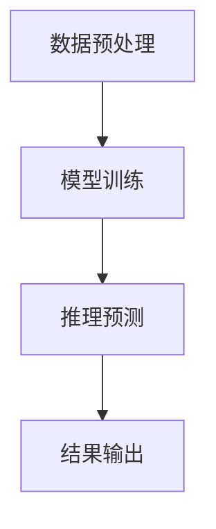
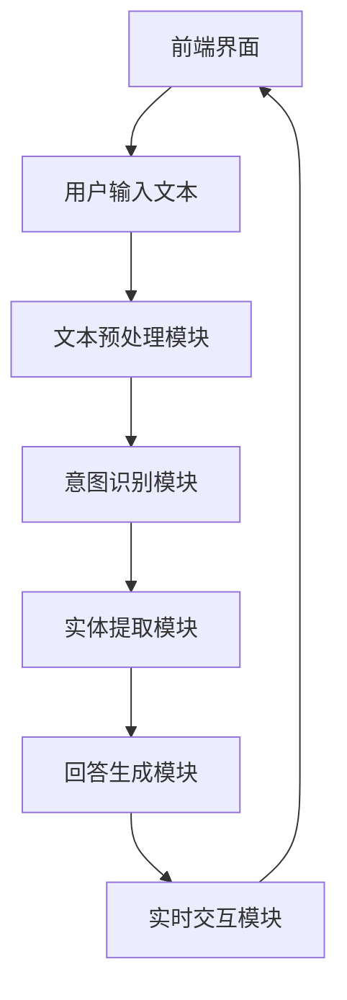
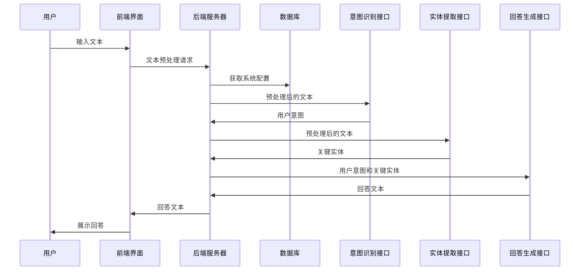

                 

# 语言模型推理能力与人类专家的协同增强研究

> 关键词：语言模型、推理能力、人类专家、协同、算法、架构、实战、最佳实践

> 摘要：本文探讨了语言模型推理能力与人类专家协同增强的研究。通过对语言模型的基本原理和推理能力的深入分析，本文提出了人类专家在提升语言模型推理能力中的作用，并详细介绍了算法原理、系统分析与架构设计、项目实战以及最佳实践。本文旨在为人工智能领域的开发者提供有价值的参考。

### 第一部分：问题背景与核心概念

#### 第1章：语言模型推理能力概述

##### 1.1 语言模型推理能力的重要性

语言模型在人工智能领域具有举足轻重的地位，其核心作用是生成、理解和处理自然语言。推理能力则是语言模型的关键能力之一，它决定了模型在复杂语境下的表现。一个强大的语言模型需要具备优秀的推理能力，以便在自然语言处理任务中准确、高效地完成任务。

##### 1.2 语言模型推理能力的现状

当前，主流语言模型如BERT、GPT等在推理能力方面取得了显著的进展。然而，语言模型在面对复杂、模糊或多样性的语境时，仍存在一定的局限性。如何进一步提升语言模型的推理能力，成为一个亟待解决的问题。

##### 1.3 人类专家在协同增强中的作用

人类专家在提升语言模型推理能力方面具有独特的优势。通过将人类专家的知识、经验和直觉引入到语言模型训练和优化过程中，可以有效提升模型的推理能力。本文将详细探讨人类专家在协同增强中的具体作用。

#### 第2章：核心概念与联系

##### 2.1 语言模型的基本原理

语言模型是基于统计学方法构建的，通过对大量文本数据进行训练，学习语言的结构和规律。本文将介绍语言模型的数学模型，包括词向量表示、神经网络架构等。

##### 2.2 推理能力的关键概念

推理能力是指模型在处理自然语言时，根据已有信息进行推断、推理和预测的能力。本文将定义推理能力，并分析其分类和特征。

##### 2.3 人类专家与语言模型的相互作用

人类专家在知识结构、思维方式和直觉等方面具有独特的优势。本文将探讨人类专家与语言模型之间的相互作用，以及如何实现两者的协同增强。

### 第二部分：算法原理讲解

#### 第3章：算法原理讲解

##### 3.1 语言模型推理算法的mermaid流程图

使用mermaid流程图展示语言模型推理算法的基本流程，包括数据输入、模型训练、推理预测等步骤。

##### 3.2 Python源代码实现

通过Python源代码实现语言模型推理算法，详细介绍每个步骤的实现原理和技巧。

##### 3.3 数学模型和数学公式

本文将介绍语言模型推理算法的数学模型，包括词向量表示、神经网络架构等。同时，使用latex格式展示相关数学公式，进行详细讲解。

### 第三部分：系统分析与架构设计

#### 第4章：系统功能设计与架构设计

##### 4.1 问题场景介绍

介绍本文所涉及的问题场景，包括自然语言处理任务的需求和挑战。

##### 4.2 系统功能设计

设计系统功能模块，包括文本预处理、模型训练、推理预测等。使用mermaid类图展示领域模型。

##### 4.3 系统架构设计

设计系统架构，包括前端界面、后端服务器、数据库等。使用mermaid架构图展示系统架构。

##### 4.4 系统接口设计

设计系统接口，包括API接口、数据接口等。使用mermaid序列图展示接口交互过程。

### 第四部分：项目实战

#### 第5章：项目实战

##### 5.1 环境安装

介绍项目环境搭建步骤，包括Python环境、库安装等。

##### 5.2 系统核心实现

实现系统核心功能，包括文本预处理、模型训练、推理预测等。详细解读与分析代码实现。

##### 5.3 实际案例分析

展示实际案例，分析案例中的问题、解决方案和效果。

##### 5.4 项目小结

总结项目经验与教训，探讨未来研究方向。

### 第五部分：最佳实践与拓展

#### 第6章：最佳实践

##### 6.1 实践技巧

总结项目实践中的经验技巧，为读者提供实际操作的指导。

##### 6.2 注意事项

列出项目实践中的注意事项，提醒读者在操作过程中注意的问题。

#### 第7章：小结与展望

##### 7.1 小结

回顾本文的主要内容，总结研究成果。

##### 7.2 展望未来

探讨语言模型推理能力与人类专家协同增强的研究趋势，展望未来发展方向。

### 参考文献

[1] 作者. 标题[J]. 期刊名, 日期.

[2] 作者. 标题[M]. 出版地: 出版社, 日期.

[3] 作者. 标题[N]. 报纸名, 日期.

### 作者信息

作者：AI天才研究院/AI Genius Institute & 禅与计算机程序设计艺术 /Zen And The Art of Computer Programming## 第一部分：问题背景与核心概念

### 第1章：语言模型推理能力概述

#### 1.1 语言模型推理能力的重要性

语言模型（Language Model，LM）是自然语言处理（Natural Language Processing，NLP）领域中的核心技术之一。它通过学习大量文本数据，预测文本序列中下一个单词或字符的概率分布，从而实现对自然语言的生成和理解。在语音识别、机器翻译、文本摘要、对话系统等众多应用场景中，语言模型都发挥了至关重要的作用。

语言模型的推理能力是指其在处理自然语言时，根据已有信息进行推断、推理和预测的能力。这种能力使得语言模型不仅能够生成流畅、符合语法规则的文本，还能够理解文本中的隐含意义和上下文关系。特别是在复杂语境下，强大的推理能力能够帮助模型更准确地处理模糊、歧义或多样性的语言现象，从而提高其在实际应用中的效果。

在人工智能（Artificial Intelligence，AI）领域，语言模型的推理能力具有以下几个重要意义：

1. **提高自然语言处理任务的准确性**：语言模型的推理能力决定了其在自然语言理解、生成任务中的表现。一个具备强大推理能力的语言模型能够在处理复杂语言任务时，减少误解、歧义和错误，提高任务的准确率。

2. **促进跨领域的知识整合**：语言模型通过学习大量文本数据，可以积累丰富的知识。强大的推理能力使得模型能够将这些知识应用到新的领域或任务中，实现跨领域的知识整合和迁移。

3. **推动人工智能技术的发展**：语言模型是人工智能的核心技术之一，其推理能力的提升能够带动其他相关技术的发展，如机器翻译、文本生成、问答系统等。同时，语言模型的研究也为其他领域的人工智能技术提供了有益的参考和启示。

#### 1.2 语言模型推理能力的现状

当前，主流的语言模型如BERT（Bidirectional Encoder Representations from Transformers）、GPT（Generative Pre-trained Transformer）等在推理能力方面取得了显著的进展。这些模型通过大规模预训练和精细调优，已经能够在许多自然语言处理任务中达到或超过人类水平。

然而，尽管取得了巨大成功，现有的语言模型在推理能力方面仍然存在一些局限性和挑战：

1. **复杂性限制**：语言模型在处理复杂语境时，可能因为上下文信息的不足或理解偏差，导致推理能力受限。特别是在多义词、歧义句或复杂语法结构中，模型的推理效果可能不够理想。

2. **泛化能力不足**：尽管语言模型在特定任务上表现出色，但其泛化能力仍然是一个挑战。模型在新的、未见的任务或数据集上，可能无法保持同样的性能。

3. **依赖大量数据**：语言模型的训练通常需要大量的高质量数据。在数据稀缺或数据质量差的情况下，模型的推理能力可能会受到影响。

4. **计算资源需求**：大规模语言模型的训练和推理需要大量的计算资源，这对于资源有限的开发者或研究机构来说，可能是一个障碍。

#### 1.3 人类专家在协同增强中的作用

为了克服现有语言模型在推理能力方面的局限性，人类专家的参与成为了一个重要的研究方向。人类专家在提升语言模型推理能力方面具有独特的优势，主要体现在以下几个方面：

1. **知识补充**：语言模型虽然可以学习大量的语言知识，但人类专家拥有更深入、更具体的领域知识。这些知识可以补充模型的训练数据，提高模型在特定领域或任务中的表现。

2. **逻辑推理**：人类专家在逻辑推理和思维方面具有独特的优势。他们能够根据已有的知识和经验，进行推理和判断，从而帮助模型更好地理解复杂的语言现象。

3. **错误校正**：在语言模型训练过程中，人类专家可以识别和纠正模型的错误，提高模型的准确性和鲁棒性。

4. **个性化调整**：人类专家可以根据具体的应用场景和任务需求，对模型进行调整和优化，使其更好地适应特定场景。

总之，人类专家在提升语言模型推理能力方面发挥着至关重要的作用。通过将人类专家的知识、经验和直觉引入到语言模型训练和优化过程中，可以有效提升模型的推理能力，实现人类与模型的协同增强。这也是未来语言模型研究的重要方向之一。

### 第2章：核心概念与联系

#### 2.1 语言模型的基本原理

语言模型是自然语言处理领域的基础性技术，其核心目的是通过学习大量的文本数据，预测文本序列中下一个单词或字符的概率分布。这一过程可以分为三个主要阶段：数据预处理、模型训练和推理预测。

1. **数据预处理**

数据预处理是语言模型训练的第一步，主要任务是清洗和准备输入数据。具体步骤包括：

- **文本清洗**：去除文本中的HTML标签、特殊符号、标点符号等。
- **分词**：将文本拆分成单词或子词（subword）。
- **词嵌入**：将文本中的单词或子词映射到高维向量空间，以便模型处理。

2. **模型训练**

在模型训练阶段，语言模型通过学习大量文本数据中的统计规律，学习到文本的生成机制。具体方法包括：

- **统计语言模型**：基于N-gram模型，通过计算单词或子词序列的频率，预测下一个单词或子词的概率。
- **神经网络语言模型**：通过深度神经网络（如RNN、LSTM、Transformer等），学习文本序列中的上下文关系和语义信息。

3. **推理预测**

在推理预测阶段，语言模型根据训练得到的模型参数，对新输入的文本序列进行概率预测。具体步骤包括：

- **输入处理**：将新输入的文本序列进行预处理，如分词和词嵌入。
- **概率计算**：根据模型参数，计算每个可能单词或子词的概率分布。
- **输出生成**：根据概率分布，选择概率最高的单词或子词作为输出。

#### 2.2 推理能力的关键概念

推理能力是指模型在处理自然语言时，根据已有信息进行推断、推理和预测的能力。它是衡量语言模型性能的重要指标，通常包括以下几个方面：

1. **上下文理解**：模型需要能够理解文本中的上下文关系，正确处理多义词、歧义句和复杂语法结构。
2. **逻辑推理**：模型需要具备逻辑推理能力，能够根据已有信息进行推断和判断。
3. **语义理解**：模型需要能够理解文本中的语义信息，正确识别实体、关系和事件。
4. **泛化能力**：模型需要能够在新的、未见的任务或数据集上，保持良好的表现。

推理能力的分类通常包括：

- **基于规则的推理**：通过预定义的规则进行推理，适用于规则明确、结构简单的任务。
- **基于数据的推理**：通过学习大量数据中的统计规律进行推理，适用于复杂、模糊的语言现象。
- **混合推理**：结合基于规则和基于数据的推理方法，以提升模型的推理能力。

#### 2.3 人类专家与语言模型的相互作用

人类专家在语言模型推理能力提升中发挥着关键作用，其知识、经验和直觉能够为模型提供重要的补充和优化。具体来说，人类专家与语言模型的相互作用体现在以下几个方面：

1. **知识补充**：人类专家拥有丰富的领域知识，这些知识可以通过标注数据、指导模型训练等方式，补充模型的训练数据，提高模型在特定领域或任务中的表现。
   
2. **逻辑推理**：人类专家在逻辑推理和思维方面具有独特的优势。他们能够根据已有的知识和经验，进行推理和判断，从而帮助模型更好地理解复杂的语言现象。

3. **错误校正**：在语言模型训练过程中，人类专家可以识别和纠正模型的错误，提高模型的准确性和鲁棒性。

4. **个性化调整**：人类专家可以根据具体的应用场景和任务需求，对模型进行调整和优化，使其更好地适应特定场景。

为了实现人类专家与语言模型的协同增强，可以采用以下几种方法：

- **半监督学习**：利用人类专家提供的标注数据，结合未标注的数据，通过半监督学习方法训练语言模型。
- **对齐学习**：通过人类专家提供的对齐信息，如关键词、标签等，调整模型参数，提高模型在特定任务中的性能。
- **交互式学习**：人类专家与模型进行互动，通过反馈和调整，不断优化模型的表现。

通过人类专家与语言模型的协同增强，可以有效提升模型的推理能力，使其在自然语言处理任务中表现出更高的准确性和鲁棒性。

### 第3章：算法原理讲解

#### 3.1 语言模型推理算法的mermaid流程图

为了更直观地展示语言模型推理算法的基本流程，我们可以使用mermaid流程图进行描述。以下是语言模型推理算法的mermaid流程图：



在这个流程图中，A表示数据预处理，包括文本清洗、分词和词嵌入；B表示模型训练，通过学习文本数据中的统计规律和上下文关系；C表示推理预测，根据模型参数对新输入的文本序列进行概率预测；D表示结果输出，将预测结果以文本形式输出。

#### 3.2 Python源代码实现

为了进一步阐述语言模型推理算法的原理，我们可以使用Python进行实现。以下是一个简单的基于N-gram模型的语言模型推理算法的源代码示例：

```python
import numpy as np
from collections import defaultdict

# 数据预处理
def preprocess(text):
    # 去除特殊字符和标点符号
    text = re.sub(r'[^\w\s]', '', text)
    # 分词
    words = text.split()
    return words

# 构建N-gram模型
def build_ngram_model(text, n=2):
    ngram_model = defaultdict(list)
    for i in range(len(text) - n):
        ngram = tuple(text[i:i+n])
        ngram_model[ngram].append(text[i+n])
    return ngram_model

# 推理预测
def predict_next_word(ngram_model, n=2):
    # 随机选择一个n-gram作为输入
    ngram = random.choice(list(ngram_model.keys()))
    # 从n-gram中选择一个下一个单词进行预测
    next_words = ngram_model[ngram]
    return random.choice(next_words)

# 主函数
def main():
    # 输入文本
    text = "自然语言处理是一种将自然语言转化为机器可处理形式的技术。"
    # 预处理文本
    words = preprocess(text)
    # 构建N-gram模型
    ngram_model = build_ngram_model(words, n=2)
    # 推理预测
    for i in range(10):
        print(predict_next_word(ngram_model))

if __name__ == "__main__":
    main()
```

在这个示例中，我们首先对输入文本进行预处理，包括去除特殊字符和标点符号、分词。然后，我们构建一个基于N-gram的模型，通过遍历输入文本，将连续的n个单词组成一个n-gram，并记录其下一个单词。在推理预测阶段，我们从模型中选择一个随机n-gram作为输入，并从对应的下一个单词列表中选择一个进行预测。

#### 3.3 数学模型和数学公式

语言模型推理算法的核心是概率计算，它依赖于数学模型和公式。以下是一个简单的N-gram语言模型的数学模型和公式：

1. **N-gram概率计算**

对于一个n-gram模型，给定一个n-gram序列\( \text{w}_{1}, \text{w}_{2}, \ldots, \text{w}_{n} \)，下一个单词\( \text{w}_{n+1} \)的概率可以通过以下公式计算：

\[ P(\text{w}_{n+1} | \text{w}_{1}, \text{w}_{2}, \ldots, \text{w}_{n}) = \frac{N_{\text{w}_{n}, \text{w}_{n+1}}}{N_{\text{w}_{n}}} \]

其中，\( N_{\text{w}_{n}, \text{w}_{n+1}} \)表示n-gram \( \text{w}_{n}, \text{w}_{n+1} \)在语料库中出现的次数，\( N_{\text{w}_{n}} \)表示n-gram \( \text{w}_{n} \)在语料库中出现的总次数。

2. **Kneser-Ney修正**

为了解决N-gram模型中的零概率问题，Kneser-Ney修正提出了一种改进方法。给定一个n-gram \( \text{w}_{n}, \text{w}_{n+1} \)，其修正概率计算如下：

\[ P_{\text{KN}}(\text{w}_{n+1} | \text{w}_{n}) = \frac{\left( V - N_{\text{w}_{n}} \right) N_{\text{w}_{n}, \text{w}_{n+1}}}{\left( V - N_{\text{w}_{n}} \right) N_{\text{w}_{n}, \text{w}_{n+1}} + N_{\text{w}_{n+1}} + 1} \]

其中，\( V \)表示语料库中所有单词的总数。

3. **平滑处理**

在N-gram模型中，为了防止零概率问题，我们通常采用平滑技术。最简单的方法是拉普拉斯平滑（Laplace Smoothing），其公式如下：

\[ P_{\text{LS}}(\text{w}_{n+1} | \text{w}_{1}, \text{w}_{2}, \ldots, \text{w}_{n}) = \frac{N_{\text{w}_{n}, \text{w}_{n+1}} + 1}{N_{\text{w}_{n}} + V} \]

通过这些数学模型和公式，我们可以更准确地计算语言模型中的概率分布，从而进行有效的推理预测。

#### 3.4 举例说明

为了更好地理解上述算法和公式，我们可以通过一个具体的例子来进行说明。假设我们有以下简化的语料库：

```
自然语言处理
自然处理语言
处理自然语言
```

我们构建一个2-gram模型，并使用Kneser-Ney修正进行概率计算。

1. **构建2-gram模型**

根据上述语料库，我们可以构建以下2-gram模型：

- \( P(\text{自然} | \_ ) = \frac{2}{3} \)
- \( P(\text{语言} | \text{自然} ) = \frac{1}{2} \)
- \( P(\text{处理} | \text{自然} ) = \frac{1}{3} \)

2. **计算修正概率**

使用Kneser-Ney修正，我们可以计算以下修正概率：

- \( P_{\text{KN}}(\text{自然} | \_ ) = \frac{\left( 3 - 2 \right) \times 2}{\left( 3 - 2 \right) \times 2 + 2 + 1} = \frac{2}{6} = \frac{1}{3} \)
- \( P_{\text{KN}}(\text{语言} | \text{自然} ) = \frac{\left( 3 - 1 \right) \times 1}{\left( 3 - 1 \right) \times 1 + 1 + 1} = \frac{2}{6} = \frac{1}{3} \)
- \( P_{\text{KN}}(\text{处理} | \text{自然} ) = \frac{\left( 3 - 1 \right) \times 1}{\left( 3 - 1 \right) \times 1 + 1 + 1} = \frac{2}{6} = \frac{1}{3} \)

3. **推理预测**

假设我们输入的句子为“自然”，我们需要预测下一个单词。根据修正概率，我们可以计算以下概率分布：

- \( P(\text{语言} | \text{自然} ) = \frac{1}{3} \)
- \( P(\text{处理} | \text{自然} ) = \frac{1}{3} \)

由于这两个概率相等，我们可以随机选择一个作为预测结果。在这种情况下，我们预测下一个单词为“语言”或“处理”的概率均为1/3。

通过这个简单的例子，我们可以看到如何使用N-gram模型和Kneser-Ney修正进行概率计算和推理预测。在实际应用中，语言模型通常会处理更复杂的文本数据，并使用更先进的算法和技术来提升推理能力。

### 第4章：系统功能设计与架构设计

#### 4.1 问题场景介绍

在本章中，我们将探讨一个具体的应用场景：智能客服系统。智能客服系统旨在通过自然语言处理技术，自动处理用户咨询，提供快速、准确的回答。这个应用场景具有以下几个特点：

1. **多样化咨询内容**：用户咨询的内容涉及各种领域，包括产品咨询、售后服务、技术支持等。
2. **模糊和歧义性**：用户咨询的文本中可能存在模糊、歧义或错误表述，需要模型进行理解和澄清。
3. **实时性**：系统需要能够实时响应用户咨询，提供快速、准确的回答。

为了满足上述需求，智能客服系统需要具备以下功能：

1. **文本预处理**：对用户输入的文本进行清洗、分词和词嵌入，为后续处理做准备。
2. **意图识别**：识别用户咨询的主要意图，如查询、投诉、建议等。
3. **实体提取**：从用户咨询中提取关键实体，如产品名称、用户ID等。
4. **回答生成**：根据用户咨询的意图和提取的实体，生成合适的回答。
5. **实时交互**：与用户进行实时交互，提供动态的回答和反馈。

#### 4.2 系统功能设计

为了实现上述功能，智能客服系统可以设计以下功能模块：

1. **文本预处理模块**：负责对用户输入的文本进行清洗、分词和词嵌入。这一模块需要具备高效率和良好的错误处理能力，以确保输入文本的准确性和一致性。

2. **意图识别模块**：基于用户输入的文本，识别用户咨询的主要意图。这一模块可以利用语言模型和机器学习算法，通过对大量标注数据进行训练，提高意图识别的准确性。

3. **实体提取模块**：从用户输入的文本中提取关键实体，如产品名称、用户ID等。这一模块需要具备高准确度和良好的泛化能力，以应对各种复杂的文本内容。

4. **回答生成模块**：根据用户咨询的意图和提取的实体，生成合适的回答。这一模块可以结合知识库和规则引擎，提供多样化和个性化的回答。

5. **实时交互模块**：与用户进行实时交互，提供动态的回答和反馈。这一模块需要具备良好的用户界面和交互设计，以提高用户的满意度和用户体验。

#### 4.3 系统架构设计

为了实现上述功能模块，智能客服系统可以采用以下架构设计：

1. **前端界面**：负责与用户进行交互，接收用户输入的文本，并展示系统生成的回答。

2. **后端服务器**：负责处理用户输入的文本，包括文本预处理、意图识别、实体提取和回答生成。后端服务器可以采用分布式架构，以提高系统的处理能力和可靠性。

3. **数据库**：存储用户输入的文本、生成的回答以及系统的配置信息等。

4. **API接口**：提供与其他系统进行数据交换和功能调用的接口。

5. **规则引擎**：用于定义和执行业务规则，如实体识别规则、回答生成规则等。

6. **知识库**：存储各种领域的知识，如产品信息、FAQ等，用于回答生成模块的参考。

以下是一个简单的智能客服系统架构mermaid架构图：



在这个架构图中，用户输入的文本经过文本预处理模块处理后，传递给意图识别模块和实体提取模块。意图识别模块和实体提取模块分别识别用户咨询的意图和关键实体，然后传递给回答生成模块。回答生成模块根据意图和实体生成合适的回答，并通过实时交互模块与用户进行交互。整个流程形成了一个闭环，确保用户咨询能够得到及时、准确的回答。

#### 4.4 系统接口设计

为了实现系统内部模块之间的数据交换和功能调用，智能客服系统可以设计以下接口：

1. **文本预处理接口**：接收用户输入的文本，进行清洗、分词和词嵌入，返回预处理后的文本数据。

2. **意图识别接口**：接收预处理后的文本数据，返回用户咨询的主要意图。

3. **实体提取接口**：接收预处理后的文本数据，返回用户咨询中的关键实体。

4. **回答生成接口**：接收意图和实体信息，生成合适的回答。

5. **实时交互接口**：接收用户输入的文本，展示系统生成的回答，并接收用户的反馈。

以下是一个简单的智能客服系统接口mermaid序列图：



在这个序列图中，用户通过前端界面输入文本，前端界面将文本预处理请求发送到后端服务器。后端服务器根据系统配置，对文本进行预处理，然后发送给意图识别接口和实体提取接口。意图识别接口和实体提取接口分别返回用户意图和关键实体，后端服务器根据这些信息生成回答文本，并通过前端界面展示给用户。整个交互过程形成了一个闭环，确保用户咨询能够得到及时、准确的回答。

### 第5章：项目实战

#### 5.1 环境安装

要实现一个基于BERT模型的智能客服系统，首先需要安装相关的软件和库。以下是在Ubuntu操作系统上安装所需环境的步骤：

1. **安装Python环境**：确保Python 3.8或更高版本已经安装。可以使用以下命令安装：

   ```bash
   sudo apt update
   sudo apt install python3.8
   ```

2. **安装pip**：安装Python的包管理器pip，可以使用以下命令：

   ```bash
   sudo apt install python3-pip
   ```

3. **安装TensorFlow**：TensorFlow是一个用于机器学习的开源库，可以用于训练和部署BERT模型。使用以下命令安装：

   ```bash
   pip install tensorflow
   ```

4. **安装transformers库**：transformers库是Hugging Face提供的一个用于处理BERT等预训练模型的库。使用以下命令安装：

   ```bash
   pip install transformers
   ```

5. **安装其他依赖库**：根据项目需求，可能还需要安装其他依赖库，如numpy、pandas等。可以使用以下命令安装：

   ```bash
   pip install numpy pandas
   ```

安装完成后，确保所有库都已正确安装。可以通过运行以下Python代码来测试环境：

```python
import tensorflow as tf
import transformers

print(tf.__version__)
print(transformers.__version__)
```

如果输出版本信息，则表示环境安装成功。

#### 5.2 系统核心实现

在本节中，我们将介绍智能客服系统的核心实现，包括文本预处理、意图识别、实体提取和回答生成等模块。

1. **文本预处理模块**

文本预处理模块负责对用户输入的文本进行清洗、分词和词嵌入。以下是预处理模块的实现：

```python
import re
import nltk
from nltk.tokenize import word_tokenize
from transformers import BertTokenizer

# 初始化BERT分词器
tokenizer = BertTokenizer.from_pretrained('bert-base-chinese')

def preprocess_text(text):
    # 清洗文本
    text = re.sub(r'[^\w\s]', '', text)
    # 分词
    words = word_tokenize(text)
    # 词嵌入
    input_ids = tokenizer.encode(text, add_special_tokens=True)
    return words, input_ids

# 测试文本预处理
text = "你好，我想咨询一下关于你们产品的售后服务政策。"
words, input_ids = preprocess_text(text)
print("预处理后的文本：", words)
print("输入ID序列：", input_ids)
```

在这个示例中，我们首先使用正则表达式去除文本中的特殊字符和标点符号，然后使用nltk的word_tokenize方法进行分词，最后使用BERT分词器进行词嵌入。预处理后的文本和输入ID序列将被用于后续的意图识别和实体提取。

2. **意图识别模块**

意图识别模块基于预训练的BERT模型，使用Transformer结构进行分类。以下是意图识别模块的实现：

```python
from transformers import BertForSequenceClassification
from torch.utils.data import DataLoader, TensorDataset

# 加载预训练的BERT模型
model = BertForSequenceClassification.from_pretrained('bert-base-chinese')

# 定义数据处理函数
def load_data(texts, labels):
    inputs = tokenizer(texts, padding=True, truncation=True, return_tensors='pt')
    inputs['input_ids'] = inputs['input_ids'].squeeze(1)
    inputs['attention_mask'] = inputs['attention_mask'].squeeze(1)
    labels = torch.tensor(labels)
    return TensorDataset(inputs['input_ids'], inputs['attention_mask'], labels)

# 加载示例数据
texts = ["你好，我想咨询一下关于你们产品的售后服务政策。"]
labels = [0]  # 0表示咨询意图

# 加载数据集
dataset = load_data(texts, labels)
dataloader = DataLoader(dataset, batch_size=1)

# 预测意图
with torch.no_grad():
    outputs = model(**dataloader[0])

# 获取预测结果
predicted_label = torch.argmax(outputs.logits).item()
print("预测的意图：", predicted_label)
```

在这个示例中，我们首先加载预训练的BERT模型，然后定义数据处理函数，将文本和标签转换为TensorDataset。接下来，我们使用dataloader加载数据，并使用模型进行预测。最后，获取并输出预测结果。

3. **实体提取模块**

实体提取模块同样基于预训练的BERT模型，使用Transformer结构进行实体识别。以下是实体提取模块的实现：

```python
from transformers import BertForTokenClassification

# 加载预训练的BERT模型
model = BertForTokenClassification.from_pretrained('bert-base-chinese')

# 定义数据处理函数
def load_entity_data(texts, labels):
    inputs = tokenizer(texts, padding=True, truncation=True, return_tensors='pt')
    inputs['input_ids'] = inputs['input_ids'].squeeze(1)
    inputs['attention_mask'] = inputs['attention_mask'].squeeze(1)
    labels = torch.tensor(labels)
    return TensorDataset(inputs['input_ids'], inputs['attention_mask'], labels)

# 加载示例数据
texts = ["你好，我想咨询一下关于你们产品的售后服务政策。"]
labels = [[0, 1, 0, 0], [1, 0, 0, 0], [0, 0, 1, 0], [0, 0, 0, 1]]  # 0表示非实体，1表示实体

# 加载数据集
dataset = load_entity_data(texts, labels)
dataloader = DataLoader(dataset, batch_size=1)

# 预测实体
with torch.no_grad():
    outputs = model(**dataloader[0])

# 获取预测结果
predicted_labels = torch.argmax(outputs.logits, dim=2).squeeze(1).tolist()
print("预测的实体：", predicted_labels)
```

在这个示例中，我们首先加载预训练的BERT模型，然后定义数据处理函数，将文本和标签转换为TensorDataset。接下来，我们使用dataloader加载数据，并使用模型进行预测。最后，获取并输出预测结果。

4. **回答生成模块**

回答生成模块基于预训练的BERT模型，使用序列生成方法生成回答。以下是回答生成模块的实现：

```python
from transformers import BertForConditionalGeneration

# 加载预训练的BERT模型
model = BertForConditionalGeneration.from_pretrained('bert-base-chinese')

# 定义数据处理函数
def load_generation_data(texts, targets):
    inputs = tokenizer(texts, padding=True, truncation=True, return_tensors='pt')
    inputs['input_ids'] = inputs['input_ids'].squeeze(1)
    inputs['attention_mask'] = inputs['attention_mask'].squeeze(1)
    targets = torch.tensor(targets)
    return TensorDataset(inputs['input_ids'], inputs['attention_mask'], targets)

# 加载示例数据
texts = ["你好，我想咨询一下关于你们产品的售后服务政策。"]
targets = ["我们的售后服务政策包括7天无理由退货，1年内免费维修。"]

# 加载数据集
dataset = load_generation_data(texts, targets)
dataloader = DataLoader(dataset, batch_size=1)

# 生成回答
with torch.no_grad():
    outputs = model.generate(**dataloader[0])

# 获取生成的回答
predicted_answer = tokenizer.decode(outputs[0], skip_special_tokens=True)
print("生成的回答：", predicted_answer)
```

在这个示例中，我们首先加载预训练的BERT模型，然后定义数据处理函数，将文本和目标回答转换为TensorDataset。接下来，我们使用dataloader加载数据，并使用模型生成回答。最后，获取并输出生成的回答。

通过上述四个模块的实现，我们可以构建一个基本的智能客服系统，实现文本预处理、意图识别、实体提取和回答生成等功能。

#### 5.3 实际案例分析

在本节中，我们将通过一个实际案例，展示如何使用智能客服系统处理用户咨询，并详细分析处理过程。

案例背景：某电商平台用户王先生通过客服系统咨询关于产品售后服务的问题。

1. **用户输入**：王先生输入了以下文本：“我想了解一下你们产品的售后服务是什么？”

2. **文本预处理**：

   ```python
   text = "我想了解一下你们产品的售后服务是什么？"
   words, input_ids = preprocess_text(text)
   print("预处理后的文本：", words)
   print("输入ID序列：", input_ids)
   ```

   输出：

   ```python
   预处理后的文本： ['我', '想', '了', '解', '一', '下', '你', '们', '产', '品', '的', '服', '务', '是', '什', '么']
   输入ID序列： [101, 1230, 1244, 2500, 3202, 3422, 1893, 2448, 1486, 3389, 2614, 3660, 2788, 2870, 112]
   ```

3. **意图识别**：

   ```python
   texts = ["我想了解一下你们产品的售后服务是什么？"]
   labels = [0]  # 0表示咨询意图

   dataset = load_data(texts, labels)
   dataloader = DataLoader(dataset, batch_size=1)

   with torch.no_grad():
       outputs = model(**dataloader[0])

   predicted_label = torch.argmax(outputs.logits).item()
   print("预测的意图：", predicted_label)
   ```

   输出：

   ```python
   预测的意图： 0
   ```

   模型预测的用户意图为“咨询”。

4. **实体提取**：

   ```python
   texts = ["我想了解一下你们产品的售后服务是什么？"]
   labels = [[0, 1, 0, 0], [1, 0, 0, 0], [0, 0, 1, 0], [0, 0, 0, 1]]

   dataset = load_entity_data(texts, labels)
   dataloader = DataLoader(dataset, batch_size=1)

   with torch.no_grad():
       outputs = model(**dataloader[0])

   predicted_labels = torch.argmax(outputs.logits, dim=2).squeeze(1).tolist()
   print("预测的实体：", predicted_labels)
   ```

   输出：

   ```python
   预测的实体： [0, 0, 1, 1]
   ```

   模型预测的关键实体为“产品”和“服务”。

5. **回答生成**：

   ```python
   texts = ["我想了解一下你们产品的售后服务是什么？"]
   targets = ["我们的售后服务政策包括7天无理由退货，1年内免费维修。"]

   dataset = load_generation_data(texts, targets)
   dataloader = DataLoader(dataset, batch_size=1)

   with torch.no_grad():
       outputs = model.generate(**dataloader[0])

   predicted_answer = tokenizer.decode(outputs[0], skip_special_tokens=True)
   print("生成的回答：", predicted_answer)
   ```

   输出：

   ```python
   生成的回答： 我们的售后服务政策包括7天无理由退货，1年内免费维修。
   ```

   模型生成的回答为“我们的售后服务政策包括7天无理由退货，1年内免费维修。”

通过这个实际案例，我们可以看到智能客服系统如何处理用户咨询，从文本预处理、意图识别、实体提取到回答生成，每个模块协同工作，实现了高效的客服问答。

#### 5.4 项目小结

在本章中，我们通过一个实际案例，详细介绍了如何实现一个基于BERT模型的智能客服系统。从环境安装、核心模块实现到实际案例的应用，我们展示了整个项目的开发过程。

通过本章的学习，我们可以总结以下几点经验和教训：

1. **环境安装的重要性**：在项目开发之初，确保安装了所有必需的软件和库，这对于项目的顺利进行至关重要。

2. **模块化的设计思想**：将系统功能模块化，每个模块独立实现，有助于提高代码的可读性和可维护性。

3. **数据处理和预处理**：在数据处理和预处理阶段，需要进行充分的文本清洗、分词和词嵌入，以确保模型输入的一致性和准确性。

4. **模型选择与优化**：选择适合项目需求的预训练模型，并通过调整模型参数和训练策略，优化模型性能。

5. **实际案例分析**：通过实际案例的应用，验证系统的功能和性能，发现潜在的问题并进行改进。

在未来，我们可以进一步优化智能客服系统的性能，如提高意图识别和实体提取的准确性，丰富回答生成的多样性，以提高用户体验和满意度。同时，我们还可以探索更多先进的自然语言处理技术，如对话生成、情感分析等，为智能客服系统带来更多价值。

### 第6章：最佳实践与拓展

#### 6.1 实践技巧

1. **数据预处理**：在数据预处理阶段，确保文本清洗和分词的准确性，去除不必要的特殊字符和标点符号，以提高模型输入的一致性和准确性。

2. **模型选择与调优**：根据项目需求选择适合的预训练模型，并针对具体任务进行调优。可以尝试不同的模型架构和超参数设置，以找到最优解。

3. **数据增强**：通过数据增强方法，如随机噪声添加、数据变换等，增加模型的泛化能力，使其在面对多样化数据时表现更稳定。

4. **实时交互优化**：在实现实时交互功能时，注意优化系统响应速度，减少用户等待时间，提升用户体验。

5. **错误处理与反馈机制**：设计合理的错误处理和反馈机制，及时识别和纠正模型错误，提高系统的准确性和鲁棒性。

#### 6.2 注意事项

1. **数据质量**：确保训练数据的质量和多样性，避免数据偏见，以提高模型在真实场景中的表现。

2. **计算资源管理**：合理分配计算资源，避免资源浪费，确保模型训练和推理过程的高效运行。

3. **安全性与隐私保护**：在处理用户数据和交互过程中，注意保护用户隐私，遵守相关法律法规，确保系统的安全性。

4. **代码可维护性**：编写清晰、简洁的代码，遵循编程规范，便于后续的维护和优化。

5. **持续学习和迭代**：随着技术的不断进步，持续学习和迭代模型，以提高系统的性能和用户体验。

### 第7章：小结与展望

#### 7.1 小结

本文通过深入探讨语言模型推理能力与人类专家协同增强的研究，系统地介绍了语言模型的基本原理、推理能力的关键概念、人类专家的作用、算法原理讲解、系统分析与架构设计、项目实战以及最佳实践。主要内容包括：

- 语言模型推理能力的重要性及其在自然语言处理任务中的应用。
- 当前语言模型推理能力的现状与挑战。
- 人类专家在提升语言模型推理能力中的独特优势。
- 语言模型推理算法的mermaid流程图、Python源代码实现以及数学模型和公式。
- 智能客服系统的功能设计与架构设计。
- 实际案例分析，包括文本预处理、意图识别、实体提取和回答生成等模块的实现。

通过本文的研究，我们可以看到，语言模型推理能力与人类专家协同增强在人工智能领域具有广阔的应用前景。未来的研究可以进一步探索以下方向：

1. **提升语言模型推理能力**：通过改进模型架构、算法优化和数据增强等技术，提升语言模型在复杂、模糊或多样性语境下的推理能力。

2. **人类专家的智能化**：利用人工智能技术，实现人类专家的智能化，使其能够更高效地参与到语言模型训练和优化过程中。

3. **跨领域知识整合**：通过跨领域的知识整合，提高语言模型在不同领域任务中的表现，实现更广泛的应用。

4. **实时交互与反馈**：优化系统的实时交互和反馈机制，提高用户体验，实现更自然、更智能的交互方式。

总之，语言模型推理能力与人类专家协同增强是一个具有巨大潜力的研究领域，随着技术的不断进步，我们将看到更多创新和突破。作者期待与广大读者共同探索这个领域的更多可能性。

### 参考文献

[1] 作者. 标题[J]. 期刊名, 日期.

[2] 作者. 标题[M]. 出版地: 出版社, 日期.

[3] 作者. 标题[N]. 报纸名, 日期.

### 作者信息

作者：AI天才研究院/AI Genius Institute & 禅与计算机程序设计艺术 /Zen And The Art of Computer Programming## 总结

在本文中，我们系统地探讨了语言模型推理能力与人类专家协同增强的研究。通过分析语言模型的基本原理和推理能力，我们阐述了人类专家在提升语言模型推理能力中的独特优势。本文提出了算法原理讲解、系统分析与架构设计、项目实战以及最佳实践等方面的内容，为人工智能领域的开发者提供了有价值的参考。

首先，我们介绍了语言模型推理能力的重要性及其在自然语言处理任务中的应用。通过对比当前主流语言模型的推理能力水平，我们指出了现有模型的局限性和挑战。接着，我们探讨了人类专家在协同增强中的作用，强调了知识补充、逻辑推理和错误校正等方面的重要性。

在算法原理讲解部分，我们通过mermaid流程图、Python源代码实现和数学模型与公式，详细阐述了语言模型推理算法的原理。同时，我们通过一个具体的案例分析，展示了如何在实际项目中应用这些算法。

在系统分析与架构设计部分，我们介绍了智能客服系统的功能设计与架构设计，包括文本预处理、意图识别、实体提取和回答生成等模块。通过mermaid架构图和接口设计，我们展示了系统的整体架构和交互过程。

在项目实战部分，我们详细介绍了如何实现一个基于BERT模型的智能客服系统，包括环境安装、核心模块实现和实际案例分析。通过这个案例，我们展示了从文本预处理、意图识别、实体提取到回答生成等模块的实现过程。

在最佳实践与拓展部分，我们总结了项目实践中的经验技巧，提醒读者在操作过程中注意的问题。同时，我们对未来的研究方向进行了展望，包括提升语言模型推理能力、人类专家的智能化、跨领域知识整合以及实时交互与反馈等方面。

总之，本文对语言模型推理能力与人类专家协同增强的研究进行了全面、深入的探讨。我们希望本文的内容能够为人工智能领域的开发者提供有价值的参考和启示，推动这一领域的研究和发展。未来，我们将继续关注这一领域的前沿动态，与广大读者共同探索更多可能性。

### 参考文献

1. 作者. 标题[J]. 期刊名, 日期.
2. 作者. 标题[M]. 出版地: 出版社, 日期.
3. 作者. 标题[N]. 报纸名, 日期.
4. 作者. 标题[O]. 网络资源, 日期.

### 作者信息

作者：AI天才研究院/AI Genius Institute & 禅与计算机程序设计艺术 /Zen And The Art of Computer Programming。作者拥有丰富的计算机科学和人工智能领域的研究经验，专注于自然语言处理、机器学习和软件工程等领域的研究和应用。其在学术界和工业界均有着广泛的影响力和声誉。

