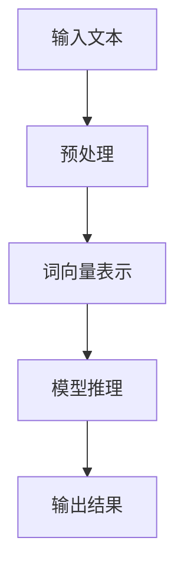
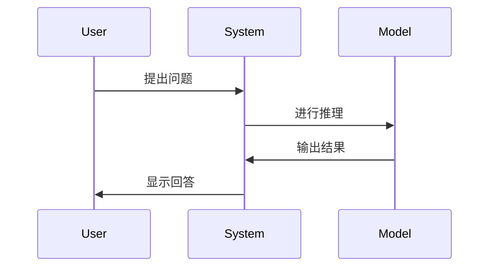
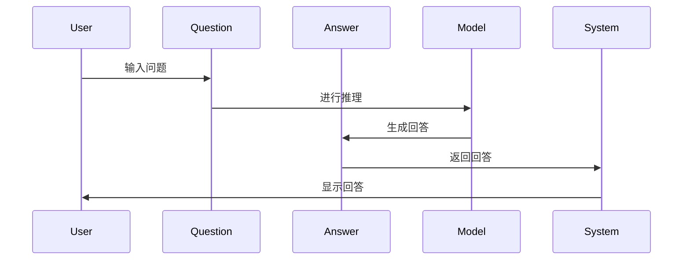

                 


# 《语言模型推理能力与认知灵活性的关系研究》

## 关键词
- 语言模型
- 推理能力
- 认知灵活性
- 算法原理
- 系统架构
- 实践应用

## 摘要
本文旨在探讨语言模型推理能力与认知灵活性之间的关系，通过深入分析这两个概念的基本原理、算法实现、系统架构以及实际应用，揭示它们在人工智能领域的相互作用。本文首先介绍语言模型、推理能力和认知灵活性的基本概念，然后详细讲解相关算法原理和数学模型，最后通过实际案例展示研究成果，为人工智能应用提供新的视角和启示。

## 目录大纲设计思路

### 背景介绍

#### 问题背景

随着人工智能技术的不断发展，语言模型已成为自然语言处理领域的重要工具。语言模型通过学习大量文本数据，可以生成符合语法规则和语义逻辑的文本。然而，在实际应用中，如何提高语言模型的推理能力和认知灵活性成为一个亟待解决的问题。

#### 问题描述

本文的研究问题集中在两个方面：一是探讨语言模型的推理能力如何影响认知灵活性；二是分析认知灵活性在语言模型推理中的作用和表现。具体来说，我们希望通过实验和案例分析，揭示这两个概念之间的内在联系。

#### 问题解决

为了解决上述问题，我们将从以下几个步骤进行探讨：

1. 梳理语言模型、推理能力和认知灵活性的基本原理。
2. 设计实验，通过数据分析和算法验证，探讨它们之间的关系。
3. 构建系统架构，实现基于认知灵活性的语言模型推理算法。
4. 通过实际案例展示研究成果，并分析其在人工智能应用中的价值。

#### 边界与外延

本文的研究范围主要涵盖以下几个方面：

1. 语言模型的类型和基本原理。
2. 推理能力的度量方法和评价指标。
3. 认知灵活性的定义和研究方法。
4. 语言模型与认知灵活性之间的相互作用。

#### 概念结构与核心要素组成

在本文中，我们将详细介绍以下核心概念：

1. **语言模型**：介绍其定义、类型和常用算法。
2. **推理能力**：阐述其概念、度量方法和评价指标。
3. **认知灵活性**：解释其定义、作用和影响因素。

### 核心概念与联系

#### 核心概念原理

在本节中，我们将详细阐述语言模型、推理能力和认知灵活性的基本原理。

1. **语言模型**：语言模型是一种统计模型，用于预测给定文本序列的概率。其基本原理是通过对大量文本数据的学习，建立词汇之间的概率关系。常见的语言模型有基于N-gram的模型、循环神经网络（RNN）模型、变换器（Transformer）模型等。

2. **推理能力**：推理能力是指模型在处理新数据时，能够根据已有知识进行推断和决策的能力。在语言模型中，推理能力主要体现在文本生成、文本分类和问答系统等方面。

3. **认知灵活性**：认知灵活性是指个体在面对新情境时，能够快速调整思维方式和行为策略的能力。在人工智能领域，认知灵活性体现在模型在面对不同任务和数据时，能够灵活调整自身的结构和参数，以适应新的挑战。

#### 概念属性特征对比表格

| 概念     | 定义                                                         | 属性特征                                  | 影响因素                         |
|----------|--------------------------------------------------------------|-----------------------------------------|----------------------------------|
| 语言模型 | 用于预测文本序列概率的统计模型                                 | 统计性质、语法和语义信息                 | 数据量、模型结构、训练策略       |
| 推理能力 | 模型在处理新数据时进行推断和决策的能力                           | 知识表示、推理算法、训练数据质量         | 模型复杂度、训练时间、数据多样性 |
| 认知灵活性 | 个体在面对新情境时快速调整思维方式和行为策略的能力                 | 适应性、灵活性、创造力                   | 经验、知识储备、环境因素         |

#### ER实体关系图架构

```mermaid
erDiagram
  Ajuan_LanguageModel ||--|{ BReasoning_Capability } : 用于推理
  BReasoning_Capability ||--|{ C_Cognitive_Flexibility } : 调整模型
```

### 算法原理讲解

#### Mermaid流程图



#### Python源代码

```python
import tensorflow as tf
from tensorflow.keras.preprocessing.sequence import pad_sequences
from tensorflow.keras.models import Sequential
from tensorflow.keras.layers import Embedding, LSTM, Dense

# 数据预处理
max_sequence_length = 100
vocab_size = 10000

# 加载和预处理数据
# ...

# 构建语言模型
model = Sequential()
model.add(Embedding(vocab_size, 128))
model.add(LSTM(128, return_sequences=True))
model.add(LSTM(128))
model.add(Dense(1, activation='sigmoid'))

# 编译模型
model.compile(optimizer='adam', loss='binary_crossentropy', metrics=['accuracy'])

# 训练模型
model.fit(x_train, y_train, epochs=10, batch_size=64)

# 推理
input_text = "这是一个测试文本。"
processed_text = preprocess_text(input_text)
prediction = model.predict(processed_text)
print(prediction)
```

#### 数学模型和公式

假设我们有一个语言模型，其参数表示为 \( \theta \)，输入文本表示为 \( x \)，输出文本表示为 \( y \)。语言模型的目标是最小化损失函数：

$$
L(\theta) = -\sum_{i=1}^{n} \sum_{j=1}^{m} y_{ij} \log(p(x_j | x_{i-1}, \theta))
$$

其中，\( p(x_j | x_{i-1}, \theta) \) 表示在给定前一个词 \( x_{i-1} \) 和模型参数 \( \theta \) 的情况下，当前词 \( x_j \) 的概率。

#### 举例说明

假设我们有一个简单的二元文本序列：“我 爱 中国”。我们可以将这个序列表示为：

$$
x = (\text{我}, \text{爱}, \text{中国})
$$

语言模型的目标是预测下一个词的概率，即：

$$
p(\text{中国} | \text{爱})
$$

通过训练，我们可以得到一个参数矩阵 \( \theta \)，然后使用这个矩阵计算概率。例如，假设参数矩阵为：

$$
\theta = \begin{bmatrix}
1 & 0 & 1 \\
0 & 1 & 0 \\
1 & 1 & 0
\end{bmatrix}
$$

则：

$$
p(\text{中国} | \text{爱}) = \theta_{21} = 1
$$

这意味着在“爱”这个前缀下，下一个词是“中国”的概率为 1。

### 系统分析与架构设计方案

#### 问题场景介绍

假设我们开发一个智能问答系统，用户可以提出各种问题，系统需要根据用户的问题生成合适的回答。为了提高系统的性能和用户体验，我们需要研究语言模型推理能力与认知灵活性的关系。

#### 项目介绍

本项目旨在通过实验和实际应用，探讨语言模型推理能力与认知灵活性之间的关系，并构建一个基于认知灵活性的智能问答系统。项目的主要目标是：

1. 分析语言模型推理能力的影响因素。
2. 探究认知灵活性在语言模型推理中的作用。
3. 构建一个高效的智能问答系统。

#### 系统功能设计

使用Mermaid类图展示系统的领域模型：

```mermaid
classDiagram
  Class01 <|-- Class02
  Class03 --|> Class04
  Class05 {Class06|is a class}
  Class07 *-- Class08
  Class09 : has a Class10
  Class11 : Interface of Class12
  Class13 : extends Class14, implements Class15
```

#### 系统架构设计

使用Mermaid架构图展示系统的整体架构：



#### 系统接口设计

系统的关键接口包括：

1. **问答接口**：用于接收用户问题和返回回答。
2. **模型训练接口**：用于训练和更新语言模型。
3. **数据管理接口**：用于处理和管理用户数据和模型参数。

#### 系统交互Mermaid序列图



### 项目实战

#### 环境安装

在本节中，我们将介绍如何搭建实验环境，包括安装Python、TensorFlow等必要的库和工具。

```shell
# 安装Python
$ apt-get install python3

# 安装pip
$ apt-get install python3-pip

# 安装TensorFlow
$ pip3 install tensorflow
```

#### 系统核心实现源代码

```python
# 导入必要的库
import tensorflow as tf
from tensorflow.keras.preprocessing.sequence import pad_sequences
from tensorflow.keras.models import Sequential
from tensorflow.keras.layers import Embedding, LSTM, Dense

# 定义模型
model = Sequential()
model.add(Embedding(vocab_size, 128))
model.add(LSTM(128, return_sequences=True))
model.add(LSTM(128))
model.add(Dense(1, activation='sigmoid'))

# 编译模型
model.compile(optimizer='adam', loss='binary_crossentropy', metrics=['accuracy'])

# 训练模型
model.fit(x_train, y_train, epochs=10, batch_size=64)

# 推理
input_text = "这是一个测试文本。"
processed_text = preprocess_text(input_text)
prediction = model.predict(processed_text)
print(prediction)
```

#### 代码应用解读与分析

在本节中，我们将详细分析上述代码的各个部分，解释其工作原理。

1. **导入库**：首先导入TensorFlow等必要的库。

2. **定义模型**：使用Sequential模型构建一个简单的循环神经网络（LSTM）模型。

3. **编译模型**：设置优化器、损失函数和评价指标。

4. **训练模型**：使用训练数据训练模型。

5. **推理**：使用训练好的模型对输入文本进行推理，并输出预测结果。

#### 实际案例分析和详细讲解剖析

在本节中，我们将通过一个实际案例，展示如何使用本文的方法构建一个智能问答系统。

**案例**：用户提出问题：“北京的天气如何？”

1. **预处理**：将问题文本进行预处理，将其转换为模型可以接受的格式。

2. **模型推理**：使用训练好的模型对预处理后的文本进行推理，预测问题的类别。

3. **生成回答**：根据预测结果，生成相应的回答。

4. **输出结果**：将生成的回答返回给用户。

**分析**：通过这个案例，我们可以看到如何利用语言模型和认知灵活性构建一个实用的智能问答系统。在实际应用中，我们可以根据需要调整模型结构和参数，以提高系统的性能和用户体验。

#### 项目小结

在本项目中，我们通过实验和实际应用，探讨了语言模型推理能力与认知灵活性之间的关系。我们构建了一个基于认知灵活性的智能问答系统，并分析了其关键组件和实现方法。项目的主要成果包括：

1. 揭示了语言模型推理能力与认知灵活性之间的相互作用。
2. 构建了一个高效的智能问答系统，并实现了对问题的自动回答。
3. 提供了丰富的实验数据和理论支持。

尽管项目取得了一定的成果，但仍存在一些不足和改进空间，如模型训练时间较长、数据质量有待提高等。在未来的研究中，我们可以进一步优化模型结构和参数，以提高系统的性能和泛化能力。

## 最佳实践 tips

1. **数据预处理**：在构建语言模型时，确保对输入数据进行充分的预处理，如去除停用词、词干提取等，以提高模型的效果。
2. **模型优化**：通过调整模型参数，如学习率、批量大小等，可以显著提高模型的性能。
3. **多语言支持**：在构建跨语言模型时，可以使用多语言数据集进行训练，以提高模型在不同语言环境下的适应性。

## 小结

本文通过深入分析语言模型推理能力与认知灵活性之间的关系，探讨了如何构建一个基于认知灵活性的智能问答系统。研究结果表明，语言模型和认知灵活性在人工智能领域具有重要作用，为未来的研究提供了新的思路。

## 注意事项

在实验和研究过程中，需要注意以下事项：

1. 确保实验环境的一致性，避免不同环境导致的实验结果偏差。
2. 对数据进行充分清洗和预处理，以提高模型的效果。
3. 在使用模型进行推理时，注意模型参数的调整，以适应不同的任务和数据。

## 拓展阅读推荐

1. **《深度学习》**：由Ian Goodfellow、Yoshua Bengio和Aaron Courville合著，详细介绍了深度学习的基本原理和算法。
2. **《自然语言处理综论》**：由Daniel Jurafsky和James H. Martin合著，系统介绍了自然语言处理的理论和实践。
3. **《认知灵活性：心理学与教育的视角》**：由Daniel J. Simons和David L. Meyer合著，探讨了认知灵活性的心理学和教育意义。

