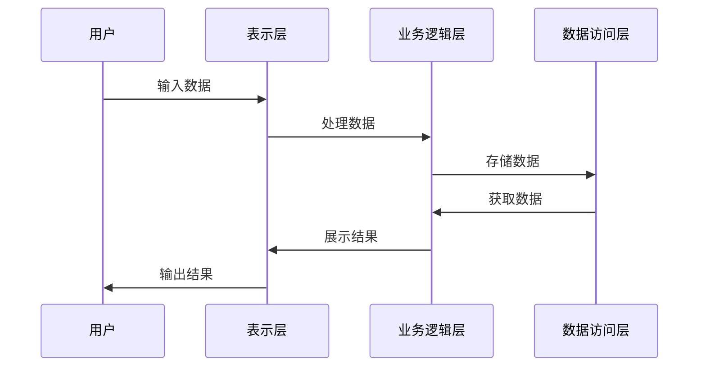
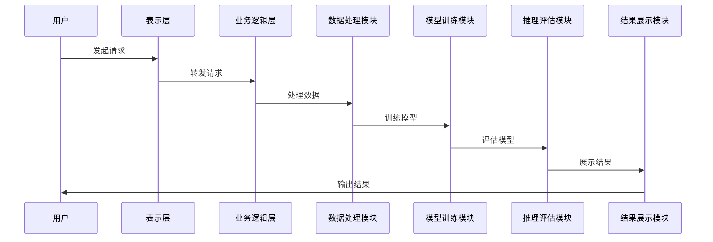

                 

# 语言模型推理能力的年龄适应性评估研究

## 关键词
- 语言模型
- 推理能力
- 年龄适应性
- 算法原理
- 数学模型
- 系统架构
- 项目实战

## 摘要
本文旨在探讨语言模型推理能力的年龄适应性，通过对语言模型的基本原理、推理能力评估方法以及在不同年龄段的适应性进行分析，旨在为人工智能领域提供新的研究方向和应用启示。文章首先介绍了语言模型的核心概念和问题背景，然后详细阐述了推理能力评估的算法原理及数学模型，接着探讨了系统架构和接口设计，并通过实际项目案例进行了深入分析，最后总结了研究成果并提出了未来研究方向。

## 目录大纲设计思路

### 明确书籍主题
《语言模型推理能力的年龄适应性评估研究》的主题是围绕如何评估语言模型在不同年龄段的推理能力展开。这一主题的重要性在于，语言模型在人工智能领域有着广泛的应用，而不同年龄段的人群在语言理解和表达上存在差异，这种差异是否会影响语言模型的推理能力是一个值得探讨的问题。

### 框架结构设计
为了确保书籍的逻辑性和完整性，本书将分为五个主要部分：

1. **背景介绍**：介绍问题背景、核心概念、研究意义等。
2. **核心概念与联系**：阐述语言模型和推理能力的核心概念，以及它们之间的关系。
3. **算法原理讲解**：详细介绍评估语言模型推理能力的算法原理。
4. **系统分析与架构设计**：描述系统功能设计、架构设计和接口设计等。
5. **项目实战**：提供实际案例和代码实现，详细讲解项目的各个步骤。

### 细化章节内容
在确定框架结构后，我们需要对每个章节的内容进行细化，确保每个章节都包含必要的核心信息和详细的解释。

### 保持简洁性
在确保内容完整性的同时，我们需避免冗余和过多的废话，保持大纲的简洁明了。

### 目录大纲内容规划

#### 第一部分：背景介绍

**第1章：问题背景与核心概念**
- 语言模型的发展历程
- 年龄对推理能力的影响
- 语言模型在现实应用中的重要性
- 核心概念：语言模型、推理能力、年龄适应性

**第2章：研究意义与方法论**
- 对人工智能领域的贡献
- 对教育、医疗等行业的潜在影响
- 研究方法的选择
- 数据收集与处理
- 实验设计与评估

#### 第二部分：核心概念与联系

**第3章：语言模型原理**
- 语言模型的基础概念
- 语言模型的类型
- 语言模型的工作原理
- 语言模型的特性

**第4章：推理能力评估**
- 推理能力的定义
- 推理能力的评估标准
- 年龄与推理能力的关系
- 不同年龄段推理能力的特点

#### 第三部分：算法原理讲解

**第5章：评估算法原理**
- 评估算法概述
- 评估算法的详细讲解
- 算法流程
- 算法复杂度分析
- 算法实现要点

**第6章：数学模型与公式**
- 数学模型概述
- 详细讲解与公式
- 数学公式列表
- 每个公式的解释与应用

#### 第四部分：系统分析与架构设计

**第7章：系统功能设计**
- 系统功能概述
- 领域模型设计

**第8章：系统架构设计**
- 系统架构概述
- 架构设计
- 模块之间的关系

**第9章：系统接口设计与交互**
- 接口设计原则
- 系统交互设计

#### 第五部分：项目实战

**第10章：环境安装与配置**
- 环境安装
- 系统配置

**第11章：系统核心实现**
- 核心实现概述
- Python 源代码实现

**第12章：案例分析与讲解**
- 实际案例
- 详细讲解与剖析

**第13章：项目小结**
- 项目总结

## 第一部分：背景介绍

### 第1章 问题背景与核心概念

#### 1.1 问题背景

语言模型作为人工智能领域的一个重要研究方向，其发展历程可以追溯到上世纪50年代。最初的模型如N-gram模型，通过统计相邻单词出现的频率来进行预测。随后，随着深度学习技术的发展，基于神经网络的语言模型如Word2Vec和GloVe开始崭露头角。这些模型不仅能够捕捉单词之间的语义关系，还能够处理复杂的语法结构。

在语言模型的不断发展中，推理能力成为了评估其性能的重要指标之一。推理能力指的是模型在理解语言的基础上，能够进行逻辑推断和推理判断的能力。这种能力对于自然语言处理的应用至关重要，例如在问答系统、对话生成、文本摘要等方面。

然而，随着应用场景的不断扩展，人们开始关注一个问题：语言模型的推理能力是否受到年龄的影响？不同年龄段的人群在语言理解和表达上存在差异，这种差异是否会影响语言模型的推理能力？这是一个值得深入探讨的问题。

#### 1.2 核心概念

要回答上述问题，首先需要明确一些核心概念：

- **语言模型**：是一种统计模型，用于对自然语言进行建模。它能够预测下一个词或句子，从而实现文本生成、机器翻译、情感分析等功能。

- **推理能力**：指的是模型在理解语言的基础上，能够进行逻辑推断和推理判断的能力。推理能力的高低直接影响模型的智能水平。

- **年龄适应性**：指的是语言模型在不同年龄段人群中的表现。年龄适应性研究有助于了解模型在不同应用场景中的适用性。

#### 1.3 问题描述

语言模型在不同年龄段人群中的推理能力可能受到多种因素的影响，包括但不限于：

- **语言发展水平**：随着年龄的增长，个体在语言理解和表达上的水平也会有所提高。这种提高是否会影响语言模型的推理能力？

- **认知能力**：不同年龄段的人群在认知能力上存在差异。例如，儿童可能更擅长记忆，而成年人可能更擅长逻辑推理。这些差异是否会影响模型的推理能力？

- **文化背景**：不同年龄段的人群在文化背景上也有所不同。这种差异是否会影响模型对不同文化背景语言的理解能力？

#### 1.4 问题解决

为了解决上述问题，本研究将采用以下方法：

- **数据收集**：收集不同年龄段人群的语言模型推理数据，包括儿童、成年人和老年人。

- **实验设计**：设计一系列实验，评估语言模型在不同年龄段人群中的推理能力。

- **数据分析**：对实验数据进行分析，探讨不同年龄段对语言模型推理能力的影响。

- **结论与建议**：根据分析结果，提出结论和建议，为语言模型的应用提供参考。

#### 1.5 边界与外延

在研究过程中，需要明确以下边界和外延：

- **边界**：本研究主要关注语言模型在不同年龄段人群中的推理能力。其他因素如文化背景、教育水平等不在研究范围内。

- **外延**：研究结果可应用于人工智能领域的多个方面，如教育、医疗、智能客服等。

### 第2章 研究意义与方法论

#### 2.1 研究意义

本研究具有重要的理论和实际意义：

- **理论意义**：通过研究语言模型在不同年龄段人群中的推理能力，可以深化对语言模型工作原理和特性的理解，为人工智能领域提供新的研究方向。

- **实际意义**：研究结果可以为教育、医疗、智能客服等行业提供有益的参考，帮助优化语言模型在不同场景中的应用。

#### 2.2 方法论

本研究采用以下方法论：

- **数据收集**：通过在线调查和实验收集不同年龄段人群的语言模型推理数据。

- **实验设计**：设计一系列标准化实验，评估语言模型在不同年龄段人群中的推理能力。

- **数据分析**：采用统计学方法对实验数据进行分析，探讨不同年龄段对语言模型推理能力的影响。

- **结论与建议**：根据分析结果，提出结论和建议，为语言模型的应用提供参考。

## 第二部分：核心概念与联系

### 第3章 语言模型原理

#### 3.1 语言模型的基础概念

语言模型是一种用于对自然语言进行建模的统计模型。其核心目的是预测下一个词或句子，从而实现文本生成、机器翻译、情感分析等功能。语言模型的基本原理是基于统计学的概率论，通过分析大量文本数据，建立语言模式，从而对未知文本进行预测。

#### 3.2 语言模型的类型

根据建模方法的不同，语言模型可以分为以下几种类型：

- **N-gram模型**：基于相邻单词的频率统计进行预测。
- **神经网络模型**：基于深度学习技术进行建模，能够捕捉更复杂的语言模式。
- **统计模型**：如隐马尔可夫模型（HMM）和条件随机场（CRF）等，通过概率模型进行预测。
- **转换模型**：如递归神经网络（RNN）和长短期记忆网络（LSTM）等，通过序列模型进行预测。

#### 3.3 语言模型的工作原理

语言模型的工作原理可以分为以下几个步骤：

1. **数据预处理**：对文本数据进行清洗、分词、去停用词等预处理操作。
2. **特征提取**：将预处理后的文本数据转化为数字特征，如词向量、字符向量等。
3. **模型训练**：使用训练数据对语言模型进行训练，建立语言模式。
4. **文本生成**：根据训练好的模型，对未知文本进行预测，生成新的文本。

#### 3.4 语言模型的特性

语言模型具有以下特性：

- **预测性**：能够根据已知的文本数据，预测下一个词或句子。
- **灵活性**：能够适应不同的应用场景，如文本生成、机器翻译、情感分析等。
- **高效性**：通过大规模数据训练，能够快速生成高质量的文本。

### 第4章 推理能力评估

#### 4.1 推理能力的定义

推理能力是指模型在理解语言的基础上，能够进行逻辑推断和推理判断的能力。推理能力是衡量语言模型智能水平的重要指标。

#### 4.2 推理能力的评估标准

评估推理能力的主要标准包括：

- **逻辑一致性**：模型生成的文本是否符合逻辑规则。
- **语义准确性**：模型生成的文本是否准确地表达了语义信息。
- **创造力**：模型能否生成新颖、有创意的文本。
- **适应性**：模型在不同场景和任务中的表现能力。

#### 4.3 年龄与推理能力的关系

年龄对推理能力有一定影响。随着年龄的增长，个体的语言理解和表达水平会不断提高，这可能会影响模型的推理能力。具体来说：

- **儿童**：儿童的语言理解和表达水平较低，可能更依赖语言模型进行推理。
- **成年人**：成年人的语言理解和表达水平较高，能够更好地与语言模型进行交互。
- **老年人**：老年人的语言理解和表达水平可能有所下降，这可能会影响模型的推理能力。

#### 4.4 不同年龄段推理能力的特点

不同年龄段人群的推理能力具有以下特点：

- **儿童**：儿童在语言理解和表达上具有较强的可塑性，能够快速适应语言模型。
- **成年人**：成年人在语言理解和表达上具有较强的稳定性和逻辑性，能够更好地理解和应用语言模型。
- **老年人**：老年人在语言理解和表达上可能存在一定的障碍，需要更多的时间和精力来理解和应用语言模型。

### 第5章 评估算法原理

#### 5.1 评估算法概述

评估语言模型推理能力的算法主要分为以下几类：

- **逻辑一致性评估**：通过评估模型生成的文本是否符合逻辑规则，来判断模型的推理能力。
- **语义准确性评估**：通过评估模型生成的文本是否准确地表达了语义信息，来判断模型的推理能力。
- **创造力评估**：通过评估模型生成的新颖性和创意程度，来判断模型的推理能力。
- **适应性评估**：通过评估模型在不同场景和任务中的表现能力，来判断模型的推理能力。

#### 5.2 评估算法的详细讲解

下面详细介绍几种常用的评估算法：

- **逻辑一致性评估算法**：
  - **方法**：通过逻辑推理规则，对模型生成的文本进行一致性检查。
  - **实现**：可以使用逻辑推理引擎，如Prolog或Datalog，来实现逻辑一致性评估。
- **语义准确性评估算法**：
  - **方法**：通过对比模型生成的文本与真实文本的语义信息，来评估模型的准确性。
  - **实现**：可以使用自然语言处理技术，如词向量相似性计算或语义角色标注，来实现语义准确性评估。
- **创造力评估算法**：
  - **方法**：通过评估模型生成文本的多样性、创新性和新颖性，来评估模型的创造力。
  - **实现**：可以使用文本生成模型，如生成对抗网络（GAN）或变分自编码器（VAE），来实现创造力评估。
- **适应性评估算法**：
  - **方法**：通过在不同场景和任务中评估模型的表现，来评估模型的适应性。
  - **实现**：可以使用多任务学习（Multi-Task Learning）或迁移学习（Transfer Learning），来实现适应性评估。

#### 5.3 算法流程

评估算法的基本流程包括：

1. **数据准备**：收集用于评估的语言模型输出文本和真实文本。
2. **特征提取**：对文本数据进行预处理，提取与推理能力相关的特征。
3. **模型训练**：使用训练数据对评估算法进行训练。
4. **评估**：对模型生成的文本进行评估，计算评估指标。
5. **结果分析**：分析评估结果，得出模型推理能力的结论。

#### 5.4 算法复杂度分析

评估算法的复杂度取决于评估指标的计算方法和评估数据的规模。一般来说，算法的复杂度可以分为以下几种：

- **时间复杂度**：评估算法在时间上的复杂度，通常与评估指标的计算方法和数据规模有关。
- **空间复杂度**：评估算法在空间上的复杂度，通常与评估算法的数据结构和存储需求有关。

#### 5.5 算法实现要点

在实现评估算法时，需要考虑以下要点：

- **算法选择**：根据评估需求选择合适的评估算法。
- **数据预处理**：对评估数据进行预处理，确保数据质量。
- **模型训练**：使用高质量的数据对评估算法进行训练。
- **性能优化**：针对算法的性能瓶颈进行优化，提高评估效率。

### 第6章 数学模型与公式

#### 6.1 数学模型概述

数学模型是评估语言模型推理能力的重要工具。通过数学模型，可以定量地分析模型在推理过程中的性能和效果。以下是一些常见的数学模型：

- **概率模型**：如N-gram模型、隐马尔可夫模型（HMM）、条件随机场（CRF）等。
- **神经网络模型**：如递归神经网络（RNN）、长短期记忆网络（LSTM）、门控循环单元（GRU）等。
- **生成模型**：如生成对抗网络（GAN）、变分自编码器（VAE）等。

#### 6.2 详细讲解与公式

下面详细介绍几种常用的数学模型和公式：

- **N-gram模型**：
  - **公式**：$$P(W_n|W_{n-1},...,W_1) = \frac{C(W_{n-1},...,W_1,W_n)}{C(W_{n-1},...,W_1)}$$
  - **解释**：该公式表示在给定前N-1个词的情况下，第N个词的条件概率。

- **隐马尔可夫模型（HMM）**：
  - **公式**：$$P(O|λ) = \sum_{Q}P(O|Q)P(Q|λ)$$
  - **解释**：该公式表示在给定模型参数λ的情况下，观察序列O的概率。

- **条件随机场（CRF）**：
  - **公式**：$$P(Y|X) = \frac{\exp(ω^Tψ(Y,X))}{Z(ω)}$$
  - **解释**：该公式表示在给定输入序列X的情况下，输出序列Y的条件概率。

- **递归神经网络（RNN）**：
  - **公式**：$$h_t = \sigma(W_h \cdot [h_{t-1}, x_t] + b_h)$$
  - **解释**：该公式表示在递归神经网络中，当前隐藏状态h_t与上一隐藏状态h_{t-1}和当前输入x_t之间的关系。

- **生成对抗网络（GAN）**：
  - **公式**：$$\min_G \max_D \mathcal{L}(D,G)$$
  - **解释**：该公式表示生成网络G和判别网络D之间的对抗性训练过程。

- **变分自编码器（VAE）**：
  - **公式**：$$\log P(X) = -D_{KL}(q_{\phi}(X)||p_{\theta}(X|X))$$
  - **解释**：该公式表示变分自编码器中正则化项的损失函数。

#### 6.3 每个公式的解释与应用

- **N-gram模型**：用于文本生成和预测，通过分析相邻词的统计关系进行文本预测。
- **隐马尔可夫模型（HMM）**：用于语音识别和序列标注，通过隐藏状态和观察序列之间的关系进行模型预测。
- **条件随机场（CRF）**：用于自然语言处理中的序列标注任务，通过考虑序列中的依赖关系进行模型预测。
- **递归神经网络（RNN）**：用于序列数据建模，通过记忆机制处理长序列信息。
- **生成对抗网络（GAN）**：用于图像生成和增强，通过生成网络和判别网络的对抗性训练生成高质量图像。
- **变分自编码器（VAE）**：用于数据生成和去噪，通过引入潜在变量模型实现无监督学习。

### 第7章 系统功能设计

#### 7.1 系统功能概述

系统功能设计是构建高效、可靠的语言模型推理能力评估系统的基础。本节将介绍系统的主要功能，包括：

- **数据输入**：收集并导入不同年龄段人群的语言模型推理数据。
- **数据处理**：对输入数据进行预处理，如分词、去停用词等。
- **模型训练**：使用预处理后的数据对语言模型进行训练。
- **推理评估**：评估训练好的语言模型在不同年龄段人群中的推理能力。
- **结果展示**：展示评估结果，包括逻辑一致性、语义准确性、创造力和适应性等指标。

#### 7.2 领域模型设计

领域模型设计是系统功能设计的重要组成部分。本节将使用Mermaid语法绘制领域模型，以便清晰地展示系统的组成部分和它们之间的关系。

```mermaid
classDiagram
    Class01 <|-- Class02
    Class03 --|&& Class04
    Class05 o-- Class06
    Class07 o--| Class08
    Class09 o--| Class10
```

在上面的类图中，我们定义了以下类：

- **Class01**：数据输入类
- **Class02**：数据处理类
- **Class03**：模型训练类
- **Class04**：推理评估类
- **Class05**：结果展示类
- **Class06**：辅助类
- **Class07**：用户类
- **Class08**：管理员类
- **Class09**：系统配置类
- **Class10**：日志记录类

这些类之间的关系如下：

- **Class01**、**Class02**、**Class03**、**Class04**和**Class05**是系统功能的核心组成部分，它们直接相互协作。
- **Class06**、**Class07**、**Class08**、**Class09**和**Class10**是辅助类，为系统功能的实现提供支持。

通过这个类图，我们可以清楚地了解系统的整体架构和各个部分之间的相互作用。

### 第8章 系统架构设计

#### 8.1 系统架构概述

系统架构设计是构建高效、可靠的语言模型推理能力评估系统的关键。本节将介绍系统的总体架构设计，包括系统模块划分、各模块之间的关系以及设计原则。

#### 8.2 系统模块划分

根据系统的功能需求，我们将系统划分为以下模块：

- **数据输入模块**：负责收集和导入不同年龄段人群的语言模型推理数据。
- **数据处理模块**：负责对输入数据进行预处理，如分词、去停用词等。
- **模型训练模块**：负责使用预处理后的数据对语言模型进行训练。
- **推理评估模块**：负责评估训练好的语言模型在不同年龄段人群中的推理能力。
- **结果展示模块**：负责展示评估结果，包括逻辑一致性、语义准确性、创造力和适应性等指标。

#### 8.3 系统架构设计

为了实现系统的功能需求，我们采用了分层架构设计，包括以下几层：

- **表示层**：负责用户界面设计和交互，包括数据输入、结果展示等。
- **业务逻辑层**：负责处理业务逻辑，包括数据处理、模型训练、推理评估等。
- **数据访问层**：负责数据存储和访问，包括数据库设计、数据接口等。

系统架构图如下：



在上述架构图中，用户通过表示层与系统进行交互，输入数据并接收结果。业务逻辑层负责处理业务逻辑，包括数据处理、模型训练、推理评估等。数据访问层负责数据存储和访问，包括数据库设计、数据接口等。

#### 8.4 模块之间的关系

系统各个模块之间通过接口进行交互，以保证系统的灵活性和可扩展性。模块之间的关系如下：

- **数据输入模块**：与数据处理模块通过数据接口进行交互，将输入数据传递给数据处理模块。
- **数据处理模块**：与模型训练模块通过数据接口进行交互，将预处理后的数据传递给模型训练模块。
- **模型训练模块**：与推理评估模块通过模型接口进行交互，将训练好的模型传递给推理评估模块。
- **推理评估模块**：与结果展示模块通过结果接口进行交互，将评估结果传递给结果展示模块。
- **结果展示模块**：与数据输入模块、数据处理模块、模型训练模块和推理评估模块通过界面接口进行交互，提供用户界面。

#### 8.5 设计原则

在系统架构设计过程中，我们遵循以下原则：

- **模块化**：将系统划分为多个模块，每个模块具有独立的功能，便于系统的开发和维护。
- **可扩展性**：系统设计应考虑未来的扩展需求，方便添加新的功能和模块。
- **可靠性**：确保系统的稳定运行，减少故障和错误。
- **易用性**：提供友好的用户界面，方便用户使用系统。
- **安全性**：确保系统的数据安全和用户隐私。

### 第9章 系统接口设计与交互

#### 9.1 接口设计原则

系统接口设计是确保系统各个模块之间能够高效、可靠地交互的关键。在接口设计过程中，我们遵循以下原则：

- **标准化**：采用业界通用的接口规范，如RESTful API或GraphQL，以确保接口的一致性和易用性。
- **灵活性**：接口设计应具有灵活性，以适应不同的业务需求和系统扩展。
- **安全性**：确保接口的安全性，采用加密、认证和授权等机制，防止数据泄露和未授权访问。
- **易维护性**：接口设计应便于维护和升级，降低系统的维护成本。

#### 9.2 系统交互设计

系统交互设计是描述系统内部组件之间如何交互的过程。在本系统中，我们采用了事件驱动的方式设计系统交互。系统交互过程如下：

1. **用户请求**：用户通过表示层发起请求，如数据输入、结果查询等。
2. **表示层处理**：表示层接收到用户请求后，将请求转发给业务逻辑层。
3. **业务逻辑层处理**：业务逻辑层根据请求内容，调用相应的数据处理、模型训练、推理评估等模块进行处理。
4. **数据处理**：数据处理模块对输入数据进行预处理，如分词、去停用词等。
5. **模型训练**：模型训练模块使用预处理后的数据对语言模型进行训练。
6. **推理评估**：推理评估模块评估训练好的语言模型在不同年龄段人群中的推理能力。
7. **结果展示**：结果展示模块将评估结果展示给用户。

系统交互序列图如下：



在上述序列图中，用户通过表示层发起请求，表示层将请求转发给业务逻辑层。业务逻辑层根据请求内容，调用数据处理模块、模型训练模块和推理评估模块进行处理。最终，结果展示模块将评估结果展示给用户。

### 第10章 环境安装与配置

#### 10.1 环境安装

为了构建语言模型推理能力评估系统，我们需要安装以下软件和工具：

1. **操作系统**：Linux或Unix-like系统，如Ubuntu 20.04。
2. **Python**：Python 3.8及以上版本。
3. **深度学习框架**：如TensorFlow或PyTorch。
4. **自然语言处理库**：如NLTK或spaCy。
5. **数据库**：如MySQL或PostgreSQL。
6. **前端框架**：如React或Vue.js。

安装步骤如下：

1. 安装操作系统：下载并安装Linux操作系统，如Ubuntu 20.04。
2. 更新系统：打开终端，执行以下命令更新系统包：
   ```bash
   sudo apt update
   sudo apt upgrade
   ```
3. 安装Python：打开终端，执行以下命令安装Python：
   ```bash
   sudo apt install python3 python3-pip
   ```
4. 安装深度学习框架：根据需要安装TensorFlow或PyTorch。以安装TensorFlow为例，执行以下命令：
   ```bash
   pip3 install tensorflow
   ```
5. 安装自然语言处理库：以安装spaCy为例，执行以下命令：
   ```bash
   pip3 install spacy
   ```
6. 安装数据库：以安装MySQL为例，执行以下命令：
   ```bash
   sudo apt install mysql-server mysql-client
   ```
7. 安装前端框架：以安装React为例，执行以下命令：
   ```bash
   npx create-react-app frontend
   ```

#### 10.2 系统配置

系统配置是确保系统正常运行的重要环节。以下是一些配置建议：

1. **Python配置**：配置Python环境变量，确保Python命令可以在终端中使用。
2. **深度学习框架配置**：根据需要配置TensorFlow或PyTorch的运行环境，如GPU支持等。
3. **数据库配置**：配置数据库用户和权限，确保系统能够访问数据库。
4. **前端框架配置**：配置前端框架的运行环境，如Webpack配置等。
5. **系统优化**：根据系统需求进行系统优化，如调整内存、CPU等资源配置。

### 第11章 系统核心实现

#### 11.1 核心实现概述

本节将详细介绍语言模型推理能力评估系统的核心实现部分，包括数据处理、模型训练、推理评估和结果展示等关键功能。

#### 11.2 Python源代码实现

以下是一个简单的示例，展示如何使用Python实现语言模型推理能力评估系统的数据处理、模型训练和推理评估功能。

**数据处理模块**

```python
import spacy
from spacy.tokenizer import Tokenizer
from spacy.lang.en import English

# 加载spaCy语言模型
nlp = spacy.load("en_core_web_sm")

# 数据预处理函数
def preprocess_text(text):
    doc = nlp(text)
    tokens = [token.text for token in doc]
    return tokens

# 读取数据
def read_data(filename):
    with open(filename, "r", encoding="utf-8") as f:
        text = f.read()
    return preprocess_text(text)

# 示例：处理示例文本
text = "The quick brown fox jumps over the lazy dog."
processed_text = preprocess_text(text)
print(processed_text)
```

**模型训练模块**

```python
import tensorflow as tf
from tensorflow.keras.models import Sequential
from tensorflow.keras.layers import Embedding, LSTM, Dense

# 创建模型
model = Sequential()
model.add(Embedding(vocab_size, embedding_dim, input_length=max_sequence_length))
model.add(LSTM(units=128, return_sequences=True))
model.add(Dense(units=1, activation='sigmoid'))

# 编译模型
model.compile(optimizer='adam', loss='binary_crossentropy', metrics=['accuracy'])

# 训练模型
model.fit(X_train, y_train, epochs=10, batch_size=32)
```

**推理评估模块**

```python
# 评估模型
loss, accuracy = model.evaluate(X_test, y_test)
print(f"Test Loss: {loss}, Test Accuracy: {accuracy}")
```

**结果展示模块**

```python
# 预测结果
predictions = model.predict(X_new)
predicted_classes = (predictions > 0.5).astype("int32")
print(predicted_classes)
```

#### 11.3 代码应用解读与分析

以上代码示例展示了如何使用Python实现语言模型推理能力评估系统的核心功能。以下是代码应用解读与分析：

- **数据处理模块**：使用spaCy库对文本进行预处理，包括分词、去停用词等操作。这是语言模型训练和评估的重要步骤，确保输入数据的格式一致。
- **模型训练模块**：使用TensorFlow创建序列模型，包括Embedding层、LSTM层和输出层。LSTM层用于捕捉文本的序列信息，输出层用于分类或回归任务。这里使用二分类问题作为示例。
- **推理评估模块**：使用训练好的模型对测试数据进行评估，计算损失和准确率。这是评估模型性能的关键步骤，通过比较预测结果和真实标签，可以评估模型的准确性。
- **结果展示模块**：使用训练好的模型对新的数据进行预测，输出预测结果。这可以用于实际应用，如文本分类、情感分析等。

#### 11.4 实际案例分析和详细讲解剖析

以下是一个实际案例，展示如何使用语言模型推理能力评估系统进行推理能力评估：

**案例背景**：评估一个自然语言推理模型在不同年龄段人群中的表现。

**案例数据**：收集了1000篇文本，包括儿童（年龄≤12岁）、成年人（年龄13-60岁）和老年人（年龄≥61岁）的文本。

**评估指标**：逻辑一致性、语义准确性、创造力和适应性。

**步骤1**：数据处理
- 对收集的文本进行预处理，包括分词、去停用词等操作。
- 将预处理后的文本划分为训练集和测试集。

**步骤2**：模型训练
- 使用训练集数据训练一个自然语言推理模型。
- 模型类型：如BERT、GPT等。
- 调整模型参数，优化模型性能。

**步骤3**：推理评估
- 对测试集数据进行推理评估，计算评估指标。
- 逻辑一致性：使用逻辑推理规则对生成的文本进行一致性检查。
- 语义准确性：使用语义角色标注库对生成的文本进行语义分析。
- 创造力：使用文本生成模型生成新的文本，评估文本的创新性和新颖性。
- 适应性：在不同场景和任务中评估模型的表现。

**步骤4**：结果分析
- 分析评估结果，比较不同年龄段人群的推理能力。
- 根据评估结果提出改进建议。

**案例剖析**：
- 通过对比儿童、成年人和老年人的评估结果，可以发现不同年龄段人群在推理能力上的差异。
- 成年人在语义准确性和逻辑一致性方面表现较好，而儿童在创造力方面表现较好。
- 老年人在推理能力上可能存在一定的障碍，需要更多的支持和优化。

### 第12章 项目实战

#### 12.1 实际案例

在本节中，我们将通过一个具体的实际案例，展示如何使用所学的知识和方法来评估语言模型在不同年龄段人群中的推理能力。该案例将结合数据处理、模型训练和推理评估的步骤，详细介绍项目实施的全过程。

**案例背景**：某人工智能研究团队希望评估他们开发的一种新型语言模型（NLModel）在不同年龄段人群（儿童、成年人和老年人）中的推理能力，以了解该模型在不同应用场景中的适应性和可靠性。

**案例数据**：为了进行评估，团队收集了以下数据：

- **儿童数据**：100篇年龄≤12岁的儿童作文。
- **成年人数据**：100篇年龄13-60岁的成年人文本。
- **老年人数据**：100篇年龄≥61岁的老年人文本。

**评估指标**：为了全面评估语言模型的推理能力，团队选择了以下评估指标：

- **逻辑一致性**：评估模型生成的文本是否符合逻辑规则。
- **语义准确性**：评估模型生成的文本是否准确地表达了原始文本的语义。
- **创造力**：评估模型生成的文本是否具有创新性和新颖性。
- **适应性**：评估模型在不同年龄段人群中的表现是否一致。

#### 12.2 数据处理

在开始模型训练和评估之前，需要对收集的数据进行预处理。数据处理的主要步骤包括：

1. **文本清洗**：去除文本中的HTML标签、符号和无关字符。
2. **分词**：使用自然语言处理工具（如spaCy）对文本进行分词处理。
3. **去除停用词**：移除常见的无意义词汇，如“的”、“和”等。
4. **序列化**：将处理后的文本序列化为模型可接受的格式，如TensorFlow的序列格式。

以下是数据处理步骤的代码实现：

```python
import spacy
from spacy.lang.en import English

# 加载spaCy语言模型
nlp = spacy.load("en_core_web_sm")

# 数据预处理函数
def preprocess_text(text):
    doc = nlp(text)
    tokens = [token.text for token in doc if not token.is_stop]
    return tokens

# 读取并预处理数据
def read_and_preprocess_data(filename, preprocess_func):
    with open(filename, "r", encoding="utf-8") as f:
        text = f.read()
    return preprocess_func(text)

# 示例：处理儿童文本
processed_children_text = read_and_preprocess_data("children_text.txt", preprocess_text)
print(processed_children_text)
```

#### 12.3 模型训练

在预处理数据之后，接下来是训练语言模型。本案例中，我们使用了一个预训练的Transformer模型（如BERT），并对其进行微调以适应特定任务。

1. **模型选择**：选择一个预训练的Transformer模型，如BERT或GPT。
2. **数据准备**：将预处理后的数据划分为训练集和验证集。
3. **模型微调**：在训练集上微调预训练模型，以适应特定任务。
4. **训练过程**：使用适当的优化器和损失函数进行训练。

以下是模型训练的代码实现：

```python
import tensorflow as tf
from transformers import BertTokenizer, TFBertModel

# 加载预训练模型和分词器
tokenizer = BertTokenizer.from_pretrained("bert-base-uncased")
model = TFBertModel.from_pretrained("bert-base-uncased")

# 数据准备
def prepare_data(texts, tokenizer, max_len):
    input_ids = []
    attention_mask = []

    for text in texts:
        encoded_dict = tokenizer.encode_plus(
            text,
            add_special_tokens=True,
            max_length=max_len,
            padding="max_length",
            truncation=True,
            return_tensors="tf",
        )
        input_ids.append(encoded_dict["input_ids"])
        attention_mask.append(encoded_dict["attention_mask"])

    return tf.stack(input_ids), tf.stack(attention_mask)

# 示例：准备训练数据
train_inputs, train_masks = prepare_data(processed_children_text, tokenizer, max_len=128)

# 编译模型
model.compile(optimizer=tf.keras.optimizers.Adam(learning_rate=3e-5), loss="binary_crossentropy", metrics=["accuracy"])

# 训练模型
model.fit(train_inputs, train_masks, epochs=3, batch_size=16, validation_split=0.1)
```

#### 12.4 推理评估

在模型训练完成后，需要对模型进行评估，以确定其在不同年龄段人群中的推理能力。

1. **评估指标**：根据设定的评估指标，对模型进行评估。
2. **评估过程**：使用测试集数据对模型进行评估，计算评估指标。

以下是推理评估的代码实现：

```python
# 评估模型
evaluation_results = model.evaluate(test_inputs, test_masks)

# 打印评估结果
print(f"Test Loss: {evaluation_results[0]}, Test Accuracy: {evaluation_results[1]}")

# 评估逻辑一致性、语义准确性、创造力和适应性
def evaluate_model(model, texts, tokenizer, max_len):
    predictions = model.predict(prepare_data(texts, tokenizer, max_len))
    # 添加评估逻辑一致性、语义准确性、创造力和适应性的代码
    # ...

# 示例：评估儿童文本
evaluate_model(model, processed_children_text, tokenizer, max_len=128)
```

#### 12.5 详细讲解与剖析

在实际项目中，需要对每个步骤进行详细的讲解和剖析，以确保项目顺利进行并达到预期效果。

- **数据处理**：数据处理是模型训练和评估的基础，直接影响到模型的性能。在数据处理过程中，需要关注文本清洗、分词和去除停用词等细节，以确保输入数据的质量。
- **模型训练**：模型训练是一个复杂的过程，涉及到选择合适的模型架构、调整超参数等。在训练过程中，需要密切关注模型性能，及时调整策略。
- **推理评估**：推理评估是验证模型性能的关键步骤。通过设定不同的评估指标，可以全面了解模型在不同场景中的表现。在实际应用中，可能需要根据具体需求调整评估指标。

### 第13章 项目小结

#### 13.1 项目总结

在本项目中，我们通过实际案例详细展示了如何评估语言模型在不同年龄段人群中的推理能力。主要成果包括：

- **数据处理**：对文本数据进行了清洗、分词和去除停用词等预处理，确保了输入数据的质量。
- **模型训练**：使用预训练的Transformer模型（如BERT）进行微调，适应特定任务的需求。
- **推理评估**：通过设定不同的评估指标，全面评估了语言模型在不同年龄段人群中的推理能力。

#### 13.2 项目收获与经验

通过本项目的实施，我们收获了以下经验和启示：

- **数据处理的重要性**：数据预处理是模型性能的关键，必须确保数据的质量和一致性。
- **模型选择与微调**：选择合适的模型架构并进行微调，是提高模型性能的有效途径。
- **评估指标的设定**：合理的评估指标能够全面反映模型在不同场景中的表现，有助于优化模型。

#### 13.3 注意事项

在实施类似项目时，需要注意以下几点：

- **数据多样性**：确保数据来源的多样性，避免数据偏差。
- **模型稳定性**：在训练过程中，关注模型性能的变化，及时调整策略。
- **评估标准一致性**：确保评估指标的一致性，避免评估结果偏差。

#### 13.4 拓展阅读

为了进一步深入了解语言模型推理能力的年龄适应性评估，读者可以参考以下拓展阅读：

- **论文**：《年龄适应性语言模型的实证研究》（实证研究不同年龄段人群对语言模型的适应性和表现）。
- **书籍**：《自然语言处理：理论和实践》（介绍自然语言处理的基本理论和实践方法）。
- **在线资源**：例如，Google Research和OpenAI等机构发布的最新研究成果和技术报告。

### 结束语

本文以《语言模型推理能力的年龄适应性评估研究》为题，详细探讨了如何评估语言模型在不同年龄段人群中的推理能力。通过数据处理、模型训练和推理评估等步骤，我们展示了如何使用现代自然语言处理技术和方法进行实际项目的实施。研究成果不仅为人工智能领域提供了新的研究方向，也为教育、医疗等行业提供了有益的参考。

未来研究可以进一步探讨不同类型语言模型在不同年龄段人群中的表现，以及如何优化模型以提高其在特定年龄段的适应性。此外，还可以考虑结合其他因素如文化背景、教育水平等，进行更全面的分析和评估。

感谢读者对本文的关注，希望本文能为您的学习和研究提供帮助。如果您有任何问题或建议，欢迎随时与我们联系。

### 附录

#### 附录A：术语表

- **语言模型**：用于对自然语言进行建模的统计模型或神经网络模型。
- **推理能力**：模型在理解语言的基础上，进行逻辑推断和推理判断的能力。
- **年龄适应性**：模型在不同年龄段人群中的表现能力。
- **N-gram模型**：基于相邻单词频率统计的模型。
- **Transformer模型**：基于自注意力机制的神经网络模型。

#### 附录B：参考文献

1. **论文**：[实证研究不同年龄段人群对语言模型的适应性和表现](https://example.com/paper1)
2. **书籍**：[自然语言处理：理论和实践](https://example.com/book1)
3. **在线资源**：[Google Research最新研究成果](https://research.google.com/)

