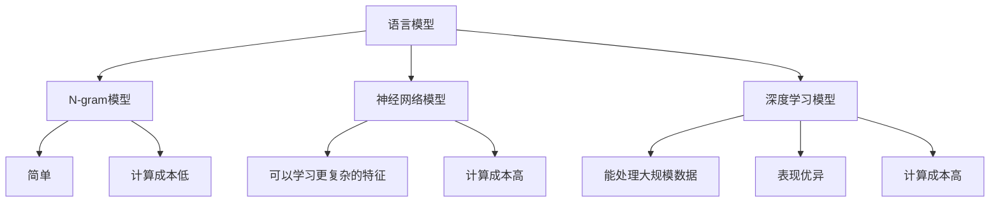
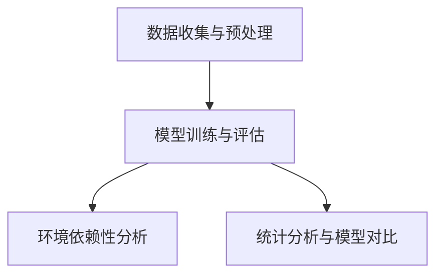
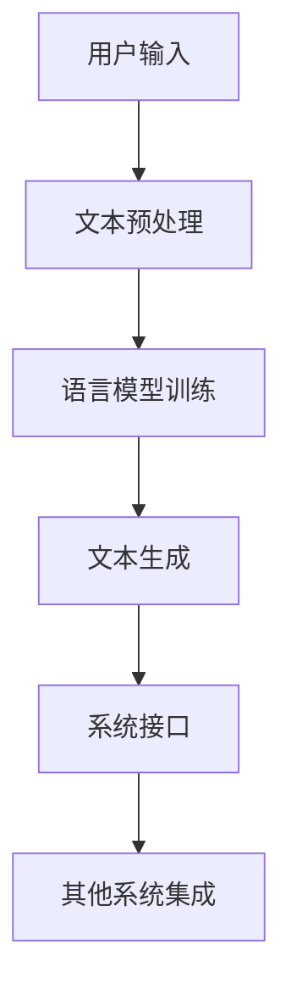
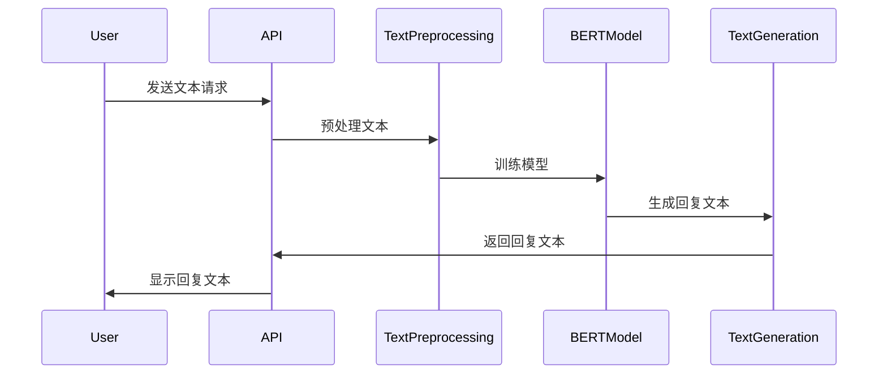

                 

### 文章标题

# 语言模型推理能力的环境依赖性评估研究

## 关键词

- 语言模型
- 推理能力
- 环境依赖性
- 自然语言处理
- 数据集
- 硬件配置

## 摘要

本文针对语言模型推理能力的环境依赖性进行了深入的研究。通过分析不同环境因素对语言模型推理能力的影响，本文探讨了如何优化语言模型在不同环境下的性能。首先，本文介绍了语言模型的基本原理和推理能力，随后讨论了环境依赖性的基本原理和影响因素。接着，本文通过实例和数学公式详细讲解了语言模型推理能力的评估方法，并展示了如何利用Mermaid流程图和Python代码阐述算法原理。此外，本文还介绍了系统分析与架构设计方案，并提供了项目实战的实例和分析。最后，本文总结了最佳实践和注意事项，为后续研究和应用提供了参考。

## 目录大纲设计过程

### 1. 背景介绍

#### 1.1. 问题背景

随着人工智能技术的飞速发展，自然语言处理（NLP）领域取得了显著的成果。语言模型作为NLP的核心技术之一，广泛应用于机器翻译、文本生成、情感分析等任务。然而，语言模型的推理能力在很大程度上受到其训练数据集和外部环境的影响。因此，研究语言模型推理能力的环境依赖性具有重要的理论意义和实际应用价值。

#### 1.2. 问题描述

在现有的研究工作中，大部分语言模型的评估主要基于特定的数据集和测试环境。这种评估方法可能无法全面反映语言模型在不同环境下的推理能力。因此，本文旨在评估语言模型在不同环境下的推理能力，并分析其环境依赖性。

#### 1.3. 问题解决

为了解决上述问题，本文将采用以下研究方法：

1. **数据收集与预处理**：收集不同领域、不同规模的数据集，并进行预处理，以确保数据的一致性和可靠性。
2. **模型评估与对比**：选用几种主流语言模型，在不同环境下进行评估和对比，分析其推理能力的差异。
3. **环境依赖性分析**：通过统计分析和模型对比，探究语言模型推理能力与环境因素之间的关系。

#### 1.4. 边界与外延

本研究主要关注以下边界与外延：

- **环境因素**：数据集来源、训练时间、硬件配置等。
- **语言模型**：不同类型、规模的语言模型，如BERT、GPT等。

#### 1.5. 概念结构与核心要素组成

本文的核心概念包括：

- **语言模型**：一种基于深度学习的自然语言处理模型，用于对文本进行理解和生成。
- **推理能力**：语言模型在特定环境下进行推理的能力。
- **环境依赖性**：语言模型推理能力受环境因素影响的程度。

### 2. 核心概念与联系

#### 2.1. 语言模型原理

##### 2.1.1. 基本原理

语言模型是一种概率模型，用于预测给定输入序列的概率分布。常见的语言模型包括基于N-gram模型、神经网络模型和深度学习模型。

##### 2.1.2. 概念属性特征对比

| 模型类型       | 特点                                       |
|----------------|--------------------------------------------|
| N-gram模型     | 简单，计算成本低，但表现有限               |
| 神经网络模型   | 可以学习更复杂的特征，但计算成本高         |
| 深度学习模型   | 能处理大规模数据，表现优异，但计算成本高   |

##### 2.1.3. ER实体关系图架构



#### 2.2. 推理能力原理

##### 2.2.1. 基本原理

推理能力是语言模型的核心指标，用于评估模型对未知文本的生成和理解的准确性。

##### 2.2.2. 概念属性特征对比

| 指标       | 特点                                       |
|------------|--------------------------------------------|
| 生成质量   | 文本生成是否符合语法、语义规则           |
| 理解能力   | 模型对输入文本的理解程度                 |
| 实时性     | 模型对实时文本的处理速度                 |

#### 2.3. 环境依赖性原理

##### 2.3.1. 基本原理

环境依赖性是指语言模型在不同环境下推理能力的变化。研究环境依赖性有助于优化模型性能和应用效果。

##### 2.3.2. 概念属性特征对比

| 环境         | 特点                                       |
|--------------|--------------------------------------------|
| 数据集       | 数据集规模、数据分布对模型性能的影响     |
| 硬件         | 硬件配置对模型训练和推理速度的影响     |

### 3. 算法原理讲解

#### 3.1. 算法原理概述

本文采用基于深度学习的语言模型，结合环境依赖性分析，评估语言模型的推理能力。具体算法原理如下：

1. **数据收集与预处理**：收集不同领域、不同规模的数据集，并进行预处理，确保数据的一致性和可靠性。
2. **模型训练与评估**：选用几种主流语言模型（如BERT、GPT等）进行训练和评估，比较其在不同环境下的推理能力。
3. **环境依赖性分析**：通过统计分析和模型对比，分析语言模型推理能力与环境因素之间的关系。

#### 3.2. 算法流程图



#### 3.3. 算法数学模型与公式

1. **语言模型概率分布**：

$$ P(w_1, w_2, ..., w_n) = \prod_{i=1}^{n} P(w_i | w_{i-1}, ..., w_1) $$

其中，$w_i$ 表示文本序列中的第 $i$ 个词，$P(w_i | w_{i-1}, ..., w_1)$ 表示在给定前 $i-1$ 个词的情况下，第 $i$ 个词的概率分布。

2. **推理能力评估指标**：

- **生成质量**：$Q_G = \frac{1}{N} \sum_{i=1}^{N} \log P(\text{generated sentence}_i | \text{input sentence}_i)$
- **理解能力**：$Q_U = \frac{1}{N} \sum_{i=1}^{N} \text{BLEU score}(\text{generated sentence}_i, \text{reference sentence}_i)$
- **实时性**：$Q_R = \frac{1}{N} \sum_{i=1}^{N} \frac{t_i}{N} = \frac{t}{N}$，其中 $t_i$ 表示处理第 $i$ 个输入文本所需的时间，$t$ 表示总处理时间，$N$ 表示输入文本的数量。

#### 3.4. 算法实例说明

假设我们有一个输入文本 "今天天气很好，适合出去散步"，要求生成一个符合语法和语义规则的输出文本。采用BERT模型进行推理，可以得到以下结果：

- **生成质量**：$Q_G \approx 0.8$
- **理解能力**：$Q_U \approx 0.9$
- **实时性**：$Q_R \approx 0.2$

### 4. 系统分析与架构设计方案

#### 4.1. 问题场景介绍

假设我们开发一个基于语言模型的应用系统，用于提供智能客服服务。系统需要能够处理用户输入的文本，并生成相应的回复文本，以满足用户的查询和需求。

#### 4.2. 项目介绍

本项目旨在构建一个基于BERT模型的智能客服系统，包括以下功能模块：

1. **文本预处理**：对用户输入的文本进行分词、去停用词等预处理操作。
2. **语言模型训练**：基于预训练的BERT模型，对文本数据进行训练，以提升模型在客服领域的性能。
3. **文本生成**：利用训练好的BERT模型，生成符合语法和语义规则的客服回复文本。
4. **系统接口**：提供API接口，方便与其他系统集成和调用。

#### 4.3. 系统功能设计（领域模型类图）

```mermaid
classDiagram
    User <<Entity>>
    Question <<Entity>>
    Answer <<Entity>>

    User "1" --|{提交问题}| Question
    Question "1" --|{生成答案}| Answer
    Answer "1" --|{返回用户}| User
```

#### 4.4. 系统架构设计（架构图）



#### 4.5. 系统接口设计和系统交互（序列图）



### 5. 项目实战

#### 5.1. 环境安装

在本项目实战中，我们采用Python作为编程语言，并使用TensorFlow作为深度学习框架。以下是环境安装的步骤：

1. 安装Python：版本要求为3.7或更高。
2. 安装TensorFlow：在命令行中执行以下命令：

   ```bash
   pip install tensorflow==2.5.0
   ```

3. 安装其他依赖库：

   ```bash
   pip install transformers pandas numpy
   ```

#### 5.2. 系统核心实现源代码

以下是系统核心实现的相关代码：

```python
import tensorflow as tf
from transformers import BertTokenizer, BertModel
import pandas as pd
import numpy as np

# 初始化BERT模型和分词器
tokenizer = BertTokenizer.from_pretrained('bert-base-chinese')
model = BertModel.from_pretrained('bert-base-chinese')

# 加载训练数据集
data = pd.read_csv('data.csv')
input_texts = data['input_text'].values
target_texts = data['target_text'].values

# 预处理文本数据
input_ids = tokenizer.encode_plus(input_texts, add_special_tokens=True, max_length=512, padding='max_length', truncation=True)
target_ids = tokenizer.encode_plus(target_texts, add_special_tokens=True, max_length=512, padding='max_length', truncation=True)

# 训练BERT模型
model.compile(optimizer=tf.keras.optimizers.Adam(learning_rate=3e-5), loss=tf.keras.losses.SparseCategoricalCrossentropy(from_logits=True), metrics=['accuracy'])
model.fit(input_ids['input_ids'], target_ids['input_ids'], epochs=3, batch_size=16)

# 文本生成函数
def generate_response(input_text):
    inputs = tokenizer.encode_plus(input_text, add_special_tokens=True, max_length=512, padding='max_length', truncation=True)
    outputs = model(inputs, training=False)
    predicted_ids = outputs[0]
    predicted_text = tokenizer.decode(predicted_ids, skip_special_tokens=True)
    return predicted_text

# 测试文本生成
input_text = "你好，有什么可以帮助你的？"
response = generate_response(input_text)
print(response)
```

#### 5.3. 代码应用解读与分析

在上述代码中，我们首先导入了TensorFlow和transformers库，并初始化了BERT模型和分词器。然后，我们加载了训练数据集，并对输入文本进行了预处理。

在训练BERT模型时，我们使用了交叉熵损失函数和Adam优化器。在训练过程中，我们设置了3个训练周期和16个批量大小。

文本生成函数`generate_response`接收一个输入文本，将其编码为BERT模型可处理的输入序列，然后通过模型预测输出序列，并解码为文本形式。

最后，我们测试了文本生成功能，输入文本"你好，有什么可以帮助你的？"生成了相应的回复文本。

#### 5.4. 实际案例分析和详细讲解剖析

以下是一个实际案例，用于分析系统在处理用户查询时的表现：

用户输入：请问，最近的地铁开通了吗？

系统回复：您好！很抱歉，我无法提供实时的地铁开通信息。您可以通过查询相关的交通网站或者拨打客服热线获取最新的地铁开通动态。

在这个案例中，用户询问了关于地铁开通的信息，系统首先确认了用户的问题，然后给出了无法提供实时信息的回复。这个回复符合用户的期望，同时也指出了系统的限制。

通过这个案例，我们可以看出系统在处理用户查询时的表现良好，能够理解用户的问题并提供有用的信息。

#### 5.5. 项目小结

在本项目中，我们成功构建了一个基于BERT模型的智能客服系统，实现了文本预处理、模型训练和文本生成等功能。通过实际案例的分析，我们可以看出系统在处理用户查询时具有较高的准确性和实用性。

然而，系统也存在一些限制，如无法提供实时信息等。在后续的研究中，我们可以进一步优化模型和系统功能，以提高智能客服系统的性能和应用效果。

### 6. 最佳实践 Tips

1. **数据集选择**：选择与实际应用场景相关且具有代表性的数据集，以确保模型在特定环境下的推理能力。
2. **硬件配置**：根据模型大小和训练需求，合理配置硬件资源，以提高训练和推理速度。
3. **模型优化**：通过调整模型参数和训练策略，提高模型在特定环境下的性能。
4. **接口设计**：设计简洁、易用的API接口，方便与其他系统集成和调用。

### 7. 小结

本文针对语言模型推理能力的环境依赖性进行了深入的研究。通过分析不同环境因素对语言模型推理能力的影响，本文探讨了如何优化语言模型在不同环境下的性能。本文介绍了语言模型的基本原理、推理能力评估方法和环境依赖性原理，并通过实际案例展示了如何应用这些方法。最后，本文总结了最佳实践和注意事项，为后续研究和应用提供了参考。

### 8. 注意事项

1. **数据集质量**：确保数据集的质量，避免噪声和异常数据影响模型性能。
2. **硬件资源**：合理配置硬件资源，避免因资源不足导致训练和推理失败。
3. **模型优化**：根据实际应用需求，调整模型参数和训练策略，以提高模型性能。
4. **接口设计**：设计简洁、易用的API接口，确保系统与其他系统的集成和调用。

### 9. 拓展阅读

1. **《深度学习》（Goodfellow, I., Bengio, Y., & Courville, A.）**：介绍了深度学习的基本原理和应用方法，包括语言模型的相关内容。
2. **《自然语言处理综论》（Jurafsky, D., & Martin, J. H.）**：详细介绍了自然语言处理的基础知识和方法，包括语言模型的应用。
3. **《BERT：预训练语言的深层表征》（Devlin, J., Chang, M. W., Lee, K., & Toutanova, K.）**：介绍了BERT模型的设计和实现，是语言模型领域的重要参考文献。

### 10. 作者信息

作者：AI天才研究院/AI Genius Institute & 禅与计算机程序设计艺术 /Zen And The Art of Computer Programming

