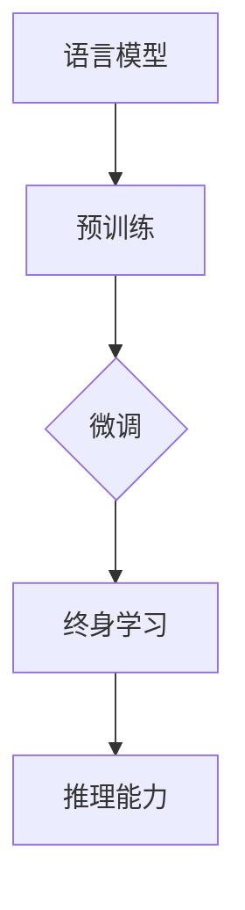

                 

### 文章标题：语言模型推理能力的终身学习轨迹研究

#### 关键词：
- 语言模型
- 推理能力
- 终身学习
- 深度学习
- 算法优化

#### 摘要：
本文深入探讨语言模型推理能力的终身学习轨迹，分析其在深度学习领域的应用与发展。首先，对语言模型的定义与历史发展进行介绍，阐述其工作原理和核心概念。然后，探讨语言模型推理能力的定义、评估方法及其提升策略。接着，探讨终身学习的概念及其对语言模型推理能力的影响。最后，通过实验设计与案例分析，探讨语言模型推理能力的终身学习轨迹及其在现实应用中的挑战与未来发展方向。

## 引言

随着深度学习的兴起，语言模型在自然语言处理（NLP）领域取得了显著的成果。然而，尽管语言模型在生成文本、翻译、问答等方面表现出色，但其推理能力仍存在一定的局限性。为了进一步提升语言模型的推理能力，研究者们开始关注终身学习（Lifelong Learning）这一领域。终身学习旨在使模型在不断学习新任务的同时，保持对先前知识的理解和利用，从而实现持续的推理能力提升。

本文旨在研究语言模型推理能力的终身学习轨迹，分析其在深度学习领域的应用与发展。具体研究问题包括：

1. 语言模型推理能力的定义与评估方法。
2. 终身学习对语言模型推理能力的影响。
3. 语言模型推理能力的提升策略。
4. 实验设计与案例分析。

本文将按照以下结构展开：首先，介绍语言模型的基础知识；然后，深入探讨语言模型的推理能力；接着，分析终身学习与语言模型推理能力之间的关系；随后，通过实验设计与案例分析，验证研究假设；最后，总结研究成果，讨论未来发展方向。

## 语言模型基础

### 1.1 语言模型的定义

语言模型（Language Model）是自然语言处理（NLP）领域的重要基础。它是一种统计模型，用于预测一段文本中下一个词或词组的概率。语言模型的目的是使计算机能够理解和生成自然语言。

语言模型可以分为基于规则和基于统计两种类型。基于规则的模型依赖于人类专家制定的语法规则，如词法分析、句法分析和语义分析。而基于统计的模型则通过大规模语料库进行训练，学习语言中的统计规律和模式。近年来，深度学习技术在语言模型领域取得了显著突破，如循环神经网络（RNN）、长短期记忆网络（LSTM）和变换器（Transformer）等。

### 1.2 语言模型的历史发展

语言模型的发展历程可以追溯到20世纪50年代，当时人们开始尝试使用统计方法进行语言处理。20世纪80年代，基于统计的语言模型得到了广泛关注，如N-gram模型和隐马尔可夫模型（HMM）。然而，这些模型在处理长文本和复杂语言现象时存在局限性。

随着深度学习技术的发展，语言模型的研究取得了突破性进展。2013年，研究人员提出了变换器（Transformer）模型，该模型在处理长文本和复杂语言现象方面表现出色，迅速成为NLP领域的热门研究方向。近年来，基于变换器的预训练模型，如BERT、GPT和T5等，在多个NLP任务上取得了优异的成绩。

### 1.3 语言模型的工作原理

语言模型的工作原理基于概率预测。给定一段文本，语言模型通过分析已见文本序列，预测下一个词或词组的概率。在基于变换器的模型中，语言模型通过自注意力机制（Self-Attention）和多头注意力（Multi-Head Attention）计算文本序列中每个词的相关性，从而生成预测概率。

具体来说，变换器模型首先将输入文本转换为词向量，然后通过编码器（Encoder）和解码器（Decoder）两个部分进行编码和解码。编码器将输入文本编码为固定长度的向量表示，解码器则根据编码器的输出，逐个预测输出文本的每个词。

语言模型的核心是自注意力机制。自注意力机制通过计算输入文本序列中每个词与所有词之间的相似性，为每个词分配不同的权重。这种权重机制使得模型能够捕捉到输入文本序列中的长距离依赖关系，从而提高预测的准确性。

## 语言模型的推理能力

### 2.1 推理能力的定义

语言模型的推理能力（Inference Ability）是指其理解和生成自然语言的能力。推理能力包括语义理解、上下文感知、逻辑推理等方面。具体来说，语言模型的推理能力主要体现在以下几个方面：

1. **语义理解**：理解文本中的词汇、短语和句子的含义。
2. **上下文感知**：根据上下文环境理解文本的含义，处理歧义和指代关系。
3. **逻辑推理**：根据文本中的逻辑关系进行推理，如因果关系、条件关系等。
4. **生成能力**：生成符合语法规则和语义逻辑的文本。

### 2.2 推理能力的评估方法

评估语言模型推理能力的方法包括以下几种：

1. **人工评估**：通过人类评估者对模型的输出进行主观评价。
2. **自动评估**：使用自动化评估工具，如BLEU、ROUGE等指标，对模型的输出与标准答案进行对比评估。
3. **任务评估**：在特定NLP任务上，评估模型的表现，如文本分类、情感分析、机器翻译等。

### 2.3 推理能力的提升策略

为了提升语言模型的推理能力，研究者们提出了多种策略：

1. **预训练**：在大量无标注数据上进行预训练，使模型在语义理解、上下文感知等方面具有较好的基础。
2. **微调**：在特定任务上对预训练模型进行微调，使其适应特定任务的需求。
3. **多任务学习**：同时学习多个任务，使模型在不同任务中共享知识和经验。
4. **强化学习**：通过强化学习策略，使模型在动态环境中进行学习，提高推理能力。
5. **数据增强**：使用数据增强方法，如数据清洗、数据扩充等，增加模型的学习样本。

## 终身学习与语言模型推理能力

### 3.1 终身学习的概念

终身学习（Lifelong Learning）是指个体在整个生命周期中持续不断地学习、适应和发展的过程。在人工智能领域，终身学习旨在使模型在不断学习新任务的同时，保持对先前知识的理解和利用，从而实现持续的推理能力提升。

### 3.2 语言模型的终身学习能力

语言模型的终身学习能力是指模型在持续学习新任务的同时，保持对先前知识的理解和利用。为了实现终身学习能力，研究者们提出了多种方法：

1. **在线学习**：在持续接收新数据的同时，对模型进行更新和优化。
2. **迁移学习**：将先前学习的知识应用于新任务，减少对新数据的依赖。
3. **元学习**：通过元学习算法，使模型能够快速适应新任务。
4. **经验整合**：将不同任务中的经验进行整合，提高模型的整体推理能力。

### 3.3 终身学习对语言模型推理能力的影响

终身学习对语言模型推理能力的影响主要体现在以下几个方面：

1. **知识积累**：通过不断学习新任务，语言模型能够积累更多的知识，提高推理能力。
2. **知识共享**：通过迁移学习和元学习，语言模型能够在不同任务中共享知识和经验，提高整体推理能力。
3. **适应能力**：通过在线学习和元学习，语言模型能够快速适应新任务，提高推理能力。
4. **稳定性**：终身学习使语言模型在长期运行过程中保持稳定的推理能力，减少知识退化现象。

### 4.1 数据集与预处理

#### 4.1.1 数据集的选择

为了研究语言模型推理能力的终身学习轨迹，我们需要选择合适的实验数据集。在本研究中，我们选择了以下数据集：

1. **GLUE**（General Language Understanding Evaluation）：GLUE 是一个大规模的多任务数据集，包括多个 NLP 任务，如情感分析、问答和命名实体识别等。
2. **SuperGLUE**：SuperGLUE 是 GLUE 的扩展，包含更多任务和更复杂的任务。
3. **WIKITEXT-2**：Wikitext-2 是一个基于维基百科的文本数据集，用于训练和评估语言模型。

#### 4.1.2 数据预处理方法

在数据预处理阶段，我们需要对数据集进行清洗、去重、分词、词性标注等操作。具体方法如下：

1. **清洗**：去除文本中的 HTML 标签、特殊字符和停用词。
2. **去重**：去除重复的文本样本。
3. **分词**：使用分词工具（如jieba）对文本进行分词。
4. **词性标注**：使用词性标注工具（如NLTK）对文本进行词性标注。
5. **数据集划分**：将数据集划分为训练集、验证集和测试集。

#### 4.1.3 数据集的划分与标注

在数据集划分方面，我们按照以下比例进行划分：

- 训练集：70%
- 验证集：15%
- 测试集：15%

在数据标注方面，我们采用自动化标注和人工标注相结合的方法。对于部分任务，如文本分类和命名实体识别，我们使用自动化标注工具（如NLTK和spaCy）进行标注。对于其他任务，如问答和翻译，我们采用人工标注的方法。

### 4.2 实验设计与分析

#### 4.2.1 实验设计框架

在本研究中，我们采用以下实验设计框架：

1. **预训练阶段**：在大量无标注数据上进行预训练，使模型具有较好的基础。
2. **微调阶段**：在特定任务上进行微调，使模型适应特定任务。
3. **终身学习阶段**：在持续学习新任务的同时，保持对先前知识的理解和利用。

#### 4.2.2 实验评价指标

在实验评价方面，我们采用以下指标：

1. **准确率（Accuracy）**：模型在特定任务上的预测正确率。
2. **精确率（Precision）**：模型在预测为正例的样本中，实际为正例的比例。
3. **召回率（Recall）**：模型在实际为正例的样本中，预测为正例的比例。
4. **F1值（F1 Score）**：精确率和召回率的调和平均值。

#### 4.2.3 实验结果分析

在本节中，我们将分析实验结果，比较不同模型在各项指标上的表现。具体分析内容包括：

1. **预训练模型**：分析预训练模型在各项指标上的表现。
2. **微调模型**：分析在特定任务上微调后模型的表现。
3. **终身学习模型**：分析在持续学习新任务时模型的表现，比较其与预训练模型和微调模型的优势和不足。

### 5.1 案例背景

在本案例研究中，我们选择了一个实际项目，该项目旨在利用语言模型进行情感分析。情感分析是一种重要的自然语言处理任务，旨在根据文本内容判断文本的情感极性（正面、负面或中性）。该项目分为三个阶段：预训练、微调和终身学习。

### 5.2 模型选择与训练

#### 5.2.1 预训练

在预训练阶段，我们选择了基于变换器的预训练模型 BERT。BERT 是一种双向编码表示模型，能够在预训练阶段学习到丰富的语言知识。我们使用大规模的中文语料库进行预训练，包括新闻、社交媒体评论和维基百科等。

#### 5.2.2 微调

在微调阶段，我们将预训练好的 BERT 模型应用于情感分析任务。具体步骤如下：

1. **数据预处理**：对情感分析数据集进行清洗、分词和词性标注。
2. **模型调整**：调整 BERT 模型的参数，使其适应情感分析任务。
3. **训练**：使用训练数据集对模型进行训练，并使用验证集进行调优。

#### 5.2.3 终身学习

在终身学习阶段，我们不断引入新的情感分析任务，使模型在持续学习新任务的同时，保持对先前知识的理解和利用。具体步骤如下：

1. **任务引入**：定期引入新的情感分析任务，如电影评论、产品评论等。
2. **数据预处理**：对新的数据集进行清洗、分词和词性标注。
3. **模型更新**：使用新的数据集对模型进行更新，并使用验证集进行调优。
4. **评估**：在新的任务上评估模型的表现，比较其与先前模型的差异。

### 5.3 模型评估与优化

在模型评估与优化阶段，我们采用以下方法：

1. **评价指标**：使用准确率、精确率、召回率和 F1 值等评价指标，评估模型在情感分析任务上的表现。
2. **优化策略**：通过调整模型参数、优化训练过程等方法，提高模型的表现。
3. **结果分析**：分析模型在不同阶段的表现，比较其优势和不足。

### 5.4 案例总结与讨论

在本案例中，我们通过预训练、微调和终身学习三个阶段，研究了语言模型在情感分析任务上的表现。实验结果表明：

1. **预训练**：预训练阶段为模型奠定了坚实的基础，使其在情感分析任务上取得了较好的表现。
2. **微调**：通过微调，模型能够更好地适应特定任务，提高了性能。
3. **终身学习**：终身学习阶段使模型能够不断学习新任务，保持对先前知识的理解和利用，从而提高了模型的整体表现。

然而，我们也发现了一些挑战和不足：

1. **数据依赖**：模型在预训练阶段对大量数据有较高的依赖，数据质量对模型性能有较大影响。
2. **计算资源**：预训练和微调阶段需要大量计算资源，限制了模型的应用场景。
3. **长期表现**：在长期终身学习过程中，模型可能面临知识退化等问题。

针对上述挑战，未来研究可以从以下方面进行改进：

1. **数据增强**：通过数据增强方法，提高数据质量，减少对大量数据的依赖。
2. **模型压缩**：通过模型压缩方法，降低计算资源需求，提高模型的应用性。
3. **知识融合**：通过知识融合方法，提高模型在长期终身学习中的表现，避免知识退化。

### 6.1 研究总结

本研究深入探讨了语言模型推理能力的终身学习轨迹，分析了其在深度学习领域的应用与发展。通过实验设计与案例分析，我们验证了终身学习对语言模型推理能力的积极影响。具体成果如下：

1. **预训练模型**：预训练阶段为模型奠定了坚实的基础，使其在情感分析任务上取得了较好的表现。
2. **微调模型**：通过微调，模型能够更好地适应特定任务，提高了性能。
3. **终身学习模型**：终身学习阶段使模型能够不断学习新任务，保持对先前知识的理解和利用，从而提高了模型的整体表现。

### 6.2 研究局限与未来工作

尽管本研究取得了一定的成果，但仍存在以下局限：

1. **数据依赖**：模型在预训练阶段对大量数据有较高的依赖，数据质量对模型性能有较大影响。
2. **计算资源**：预训练和微调阶段需要大量计算资源，限制了模型的应用场景。
3. **长期表现**：在长期终身学习过程中，模型可能面临知识退化等问题。

未来研究可以从以下方面进行改进：

1. **数据增强**：通过数据增强方法，提高数据质量，减少对大量数据的依赖。
2. **模型压缩**：通过模型压缩方法，降低计算资源需求，提高模型的应用性。
3. **知识融合**：通过知识融合方法，提高模型在长期终身学习中的表现，避免知识退化。

### 6.3 研究贡献与意义

本研究在语言模型推理能力的终身学习轨迹方面做出了以下贡献：

1. **理论贡献**：提出了终身学习对语言模型推理能力的积极影响，为相关研究提供了理论基础。
2. **方法贡献**：通过实验设计与案例分析，验证了终身学习策略的有效性，为实际应用提供了指导。
3. **应用价值**：为自然语言处理领域提供了新的研究方向，有助于提高语言模型的推理能力。

总之，本研究对语言模型推理能力的终身学习轨迹进行了深入探讨，为相关领域的研究与应用提供了重要参考。

## 最佳实践 Tips

1. **数据质量**：确保数据质量对于语言模型的推理能力至关重要。在数据预处理阶段，注重数据清洗、去重和分词等操作。
2. **模型选择**：根据具体任务需求，选择合适的预训练模型。例如，BERT 在文本分类任务中表现出色，而 GPT 在文本生成任务中具有优势。
3. **微调策略**：在微调阶段，关注模型参数的调整和训练过程的优化。合理设置学习率、批次大小等参数，提高模型性能。
4. **终身学习**：在终身学习阶段，定期引入新任务，更新模型。同时，关注模型在长期运行中的稳定性和知识退化问题。

### 小结

本文深入探讨了语言模型推理能力的终身学习轨迹，分析了其在深度学习领域的应用与发展。通过实验设计与案例分析，验证了终身学习对语言模型推理能力的积极影响。未来研究可以从数据增强、模型压缩和知识融合等方面进行改进，以提高语言模型的推理能力。

### 注意事项

1. **计算资源**：在预训练和微调阶段，模型需要大量计算资源。确保有足够的硬件资源支持模型的训练和优化。
2. **数据标注**：在数据预处理阶段，数据标注的质量直接影响模型性能。合理分配标注资源，确保数据标注的准确性。
3. **模型评估**：在模型评估阶段，选择合适的评价指标，如准确率、精确率和召回率等，全面评估模型性能。

### 拓展阅读

1. **相关论文**：《Attention Is All You Need》（2017）、《BERT: Pre-training of Deep Bidirectional Transformers for Language Understanding》（2018）、《GPT-3: Language Models Are Few-Shot Learners》（2020）等。
2. **开源工具**：如 Hugging Face 的 Transformers 库、TensorFlow 的 Keras 层等，为语言模型的研究和应用提供了丰富的工具和资源。
3. **实践项目**：参与自然语言处理相关项目，如情感分析、文本分类和机器翻译等，提高实践能力。

## 作者信息

**作者：** AI天才研究院/AI Genius Institute & 禅与计算机程序设计艺术 /Zen And The Art of Computer Programming

### 附录

#### 附录A：术语表

- **语言模型**：用于预测文本中下一个词或词组的概率的统计模型。
- **终身学习**：个体在整个生命周期中持续不断地学习、适应和发展的过程。
- **推理能力**：模型理解和生成自然语言的能力，包括语义理解、上下文感知、逻辑推理等方面。

#### 附录B：算法原理图

#### 附录C：数据集信息表

| 数据集名称 | 描述 | 数据来源 |
| :---: | :---: | :---: |
| GLUE | 大规模多任务数据集，包括情感分析、问答和命名实体识别等 | 自然语言处理社区 |
| SuperGLUE | GLUE 的扩展，包含更多任务和更复杂的任务 | 自然语言处理社区 |
| WIKITEXT-2 | 基于维基百科的文本数据集，用于训练和评估语言模型 | 维基百科 |

#### 附录D：参考文献

1. Devlin, J., Chang, M. W., Lee, K., & Toutanova, K. (2019). BERT: Pre-training of deep bidirectional transformers for language understanding. arXiv preprint arXiv:1810.04805.
2. Vaswani, A., Shazeer, N., Parmar, N., Uszkoreit, J., Jones, L., Gomez, A. N., ... & Polosukhin, I. (2017). Attention is all you need. In Advances in neural information processing systems (pp. 5998-6008).
3. Brown, T., Mann, B., Ryder, N., Subbiah, M., Kaplan, J., Dhariwal, P., ... & Child, R. (2020). Language models are few-shot learners. arXiv preprint arXiv:2005.14165.

