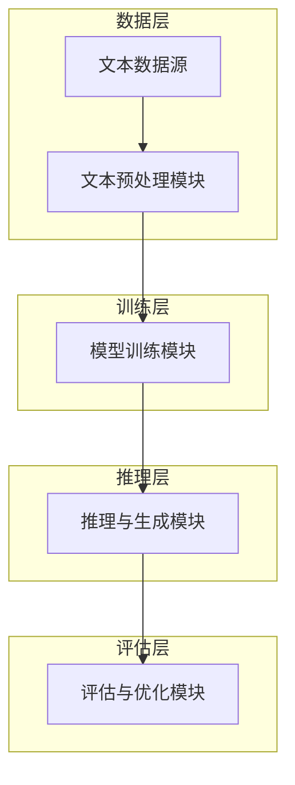
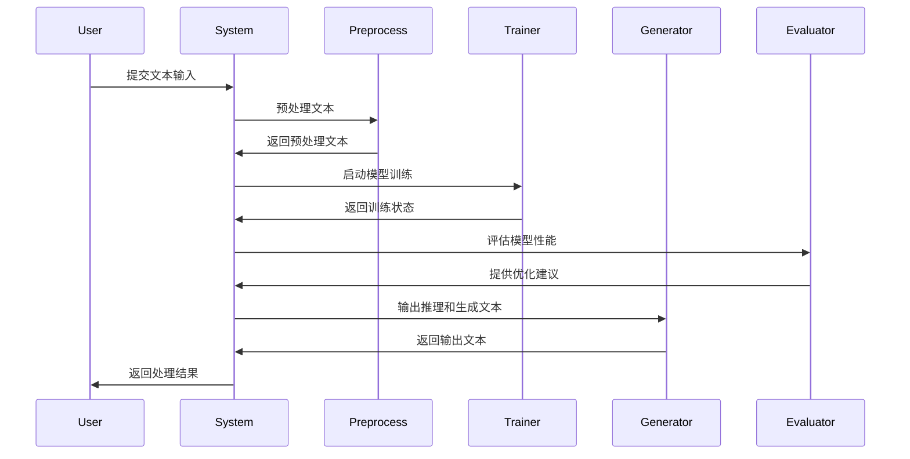

                 

### 第一部分：背景介绍

#### 第1章 问题背景

##### 1.1 问题背景
近年来，随着人工智能技术的迅猛发展，自然语言处理（NLP）领域取得了显著的进展。其中，语言模型作为NLP的核心技术之一，广泛应用于机器翻译、文本生成、情感分析、问答系统等多个方面。然而，尽管语言模型在许多实际应用中取得了成功，但其推理能力的认知发展轨迹及其影响因素仍然是一个复杂且充满挑战的问题。

##### 1.2 问题描述
为了深入理解语言模型推理能力的认知发展轨迹，本文将探讨以下几个关键问题：

1. **语言模型推理能力的核心概念是什么？**
   - 如何定义和衡量语言模型的推理能力？
   - 语言模型推理能力是否具有层次性？

2. **语言模型推理能力的发展阶段及其特征是什么？**
   - 语言模型推理能力是否随时间或训练数据量的增加而逐步发展？
   - 不同阶段的语言模型推理能力有哪些显著特征？

3. **影响语言模型推理能力的主要因素有哪些？**
   - 训练数据的质量和多样性对推理能力有何影响？
   - 神经网络结构、参数优化方法等因素如何影响推理能力？

4. **如何评估和提升语言模型推理能力？**
   - 现有的评估方法是否全面、有效？
   - 有哪些方法可以提升语言模型的推理能力？

##### 1.3 问题解决
本文旨在通过文献调研、理论分析和实证研究，系统地探讨语言模型推理能力的认知发展轨迹，以期为语言模型的进一步发展提供理论支持和实践指导。

##### 1.4 边界与外延
本文主要关注大型语言模型，特别是基于变换器（Transformer）架构的语言模型。此外，本文将重点探讨语言模型在文本生成和语义理解任务中的推理能力，而不涉及其他类型的人工智能任务。

##### 1.5 概念结构与核心要素组成
语言模型推理能力由以下几个核心要素组成：

1. **词向量表示**：词向量是将词汇映射为高维空间中的向量表示，是语言模型的基础。
2. **神经网络结构**：神经网络是语言模型的核心，负责对输入文本进行编码和解码。
3. **训练数据**：高质量的训练数据是提升语言模型推理能力的关键。
4. **优化算法**：通过优化算法，不断调整神经网络参数，提高语言模型推理能力。

### 第二部分：核心概念与联系

#### 第2章 核心概念原理

##### 2.1 语言模型推理能力的定义
语言模型推理能力是指语言模型在处理自然语言任务时，能够根据上下文信息理解词语意义、推断逻辑关系和生成合理文本的能力。具体来说，它包括以下几个方面：

1. **上下文理解**：语言模型需要能够理解句子、段落甚至篇章的上下文信息，从而准确推断词语的含义和关系。
2. **语义理解**：语言模型需要能够识别词语的语义，理解句子、段落或篇章的整体意义。
3. **逻辑推理**：语言模型需要能够根据已知信息推断出新的结论或推断逻辑关系。
4. **文本生成**：语言模型需要能够根据输入的文本或上下文信息生成新的、合理的文本。

##### 2.2 语言模型推理能力的核心特征
语言模型推理能力的核心特征主要包括：

1. **上下文理解**：
   - **特征**：理解句子、段落甚至篇章的上下文信息。
   - **实现**：通过词向量表示和神经网络结构，语言模型能够捕捉到词语在特定上下文中的含义。

2. **语义理解**：
   - **特征**：识别词语的语义，理解句子、段落或篇章的整体意义。
   - **实现**：语义理解依赖于对词汇和语法规则的理解，以及上下文的综合分析。

3. **逻辑推理**：
   - **特征**：根据已知信息推断出新的结论或推断逻辑关系。
   - **实现**：逻辑推理涉及到对句子间关系和逻辑结构的分析，通常需要复杂的神经网络结构和算法支持。

4. **文本生成**：
   - **特征**：能够根据输入的文本或上下文信息生成新的、合理的文本。
   - **实现**：文本生成通常基于概率分布，通过优化算法生成符合语法和语义规则的文本。

##### 2.3 概念属性特征对比表格

| 概念       | 属性特征                                           |
| ---------- | -------------------------------------------------- |
| 上下文理解 | 理解句子、段落甚至篇章的上下文信息                     |
| 语义理解   | 识别词语的语义，理解句子、段落或篇章的整体意义         |
| 逻辑推理   | 根据已知信息推断出新的结论或推断逻辑关系               |
| 文本生成   | 根据输入的文本或上下文信息生成新的、合理的文本         |

##### 2.4 ER实体关系图架构

```mermaid
erDiagram
  AConcept1 ||--|{ BConcept2 } BConcept2 : related with AConcept1
  AConcept1 ||--|{ CConcept3 } CConcept3 : related with AConcept1
```

在上述ER图架构中，AConcept1代表语言模型推理能力的核心概念，BConcept2代表上下文理解，CConcept3代表语义理解。这些概念通过实体关系（一元关系）相互联系，共同构成了语言模型推理能力的认知体系。

### 第三部分：算法原理讲解

#### 第3章 算法原理讲解

##### 3.1 语言模型算法概述
语言模型是一种基于统计学的模型，它通过对大量文本数据的学习，预测下一个词语的概率分布。在语言模型中，常用的算法有n元语法模型、神经网络语言模型和Transformer模型等。

1. **n元语法模型**：
   - **基本思想**：n元语法模型通过观察前n-1个词语来预测下一个词语。例如，对于三元语法模型，当前词是由前两个词决定的。
   - **公式**：
     $$
     P(w_n | w_{n-1}, w_{n-2}, ..., w_1) = \frac{C(w_{n-1}, w_{n-2}, ..., w_1, w_n)}{C(w_{n-1}, w_{n-2}, ..., w_1)}
     $$
     其中，$C$表示计数函数，计算特定词语序列的出现次数。

2. **神经网络语言模型**：
   - **基本思想**：神经网络语言模型通过多层神经网络结构，将词语映射为高维向量表示，并通过反向传播算法优化模型参数。
   - **公式**：
     $$
     y = \text{softmax}(W \cdot \text{激活函数}(\text{输入向量}))
     $$
     其中，$W$表示权重矩阵，激活函数（如ReLU、Sigmoid或Tanh）用于引入非线性。

3. **Transformer模型**：
   - **基本思想**：Transformer模型引入了自注意力机制，通过计算词语间的相对位置信息，实现全局依赖关系建模。
   - **公式**：
     $$
     \text{Attention}(Q, K, V) = \text{softmax}\left(\frac{QK^T}{\sqrt{d_k}}\right) V
     $$
     其中，$Q$、$K$和$V$分别代表查询向量、关键向量和价值向量，$d_k$是关键向量的维度。

##### 3.2 n元语法模型的详细解释
n元语法模型是一种简单的基于历史信息预测的模型。以下是对n元语法模型的具体解释：

1. **模型构建**：
   - 首先，将输入的文本序列转换为词序列，每个词对应一个唯一的整数。
   - 接着，构建一个大小为V的词汇表，其中V是词汇表中的词总数。

2. **训练数据**：
   - 假设我们有一个训练序列 $w_1, w_2, ..., w_n$，其中 $w_i$ 是词的整数表示。
   - 我们可以构建一个训练集，其中每个样本是由前n-1个词和下一个词组成。

3. **模型预测**：
   - 给定一个前n-1个词的序列，模型将预测下一个词。
   - 模型通过计算当前词序列的概率分布来预测下一个词。

4. **数学模型**：
   - 假设我们使用二元语法模型，即 $n=2$，则预测公式为：
     $$
     P(w_n | w_{n-1}) = \frac{C(w_{n-1}, w_n)}{C(w_{n-1})}
     $$
     其中，$C(w_{n-1}, w_n)$ 表示词 $w_n$ 在 $w_{n-1}$ 之后出现的次数，$C(w_{n-1})$ 表示 $w_{n-1}$ 出现的总次数。

##### 3.3 神经网络语言模型的工作原理
神经网络语言模型是一种更加复杂的模型，它通过多层神经网络结构来学习词与词之间的关系。以下是对神经网络语言模型的工作原理的详细解释：

1. **输入表示**：
   - 首先，将每个词转换为词向量表示，通常使用预训练的词嵌入（如Word2Vec、GloVe等）。
   - 然后，将这些词向量作为神经网络的输入。

2. **神经网络结构**：
   - 神经网络通常包括输入层、隐藏层和输出层。
   - 输入层将词向量传递到隐藏层，隐藏层通过激活函数（如ReLU、Sigmoid等）进行非线性变换。
   - 输出层使用softmax函数输出词的概率分布。

3. **训练过程**：
   - 通过反向传播算法，使用训练数据来优化神经网络参数。
   - 训练过程包括前向传播（计算损失函数）和反向传播（更新参数）。

4. **预测过程**：
   - 给定一个词序列，神经网络将其转换为概率分布，从而预测下一个词。

5. **数学模型**：
   - 假设我们使用一个简单的多层感知机（MLP）模型，其数学模型为：
     $$
     y = \text{softmax}(W \cdot \text{激活函数}(\text{输入向量}))
     $$
     其中，$W$是权重矩阵，激活函数用于引入非线性。

##### 3.4 Transformer模型的详细解释
Transformer模型是一种基于自注意力机制的序列到序列模型，它在处理长距离依赖和并行化训练方面具有显著优势。以下是对Transformer模型的详细解释：

1. **自注意力机制**：
   - Transformer模型引入了自注意力（Self-Attention）机制，它允许模型在生成每个词时，动态地关注序列中的其他词。
   - 自注意力通过计算词与词之间的相似度来实现，这种相似度基于词向量表示。

2. **多头注意力**：
   - Transformer模型使用了多头注意力（Multi-Head Attention），它将自注意力机制分解为多个独立的注意力头。
   - 每个头关注序列的不同方面，从而提高模型的表示能力。

3. **编码器-解码器结构**：
   - Transformer模型采用编码器-解码器（Encoder-Decoder）结构，编码器处理输入序列，解码器生成输出序列。
   - 编码器将输入序列编码为固定长度的向量表示，解码器则利用这些向量表示生成输出序列。

4. **训练过程**：
   - Transformer模型通过双向编码器来学习序列的表示，编码器的每个层都包含多头注意力机制和前馈神经网络。
   - 解码器在每个时间步使用编码器的输出和自注意力机制来生成预测的词。

5. **预测过程**：
   - 在生成输出序列时，解码器使用上一步生成的词和编码器的输出作为输入，通过自注意力和交叉注意力机制生成下一个词的预测。

6. **数学模型**：
   - 假设我们使用一个简单的Transformer模型，其数学模型为：
     $$
     \text{Attention}(Q, K, V) = \text{softmax}\left(\frac{QK^T}{\sqrt{d_k}}\right) V
     $$
     其中，$Q$、$K$和$V$分别代表查询向量、关键向量和价值向量，$d_k$是关键向量的维度。

### 第三部分：算法原理讲解

#### 第4章 算法原理讲解

##### 3.1 语言模型算法概述
语言模型是一种基于统计学的模型，它通过对大量文本数据的学习，预测下一个词语的概率分布。在语言模型中，常用的算法有n元语法模型、神经网络语言模型和Transformer模型等。

##### 3.2 n元语法模型的详细解释
n元语法模型是一种简单的基于历史信息预测的模型。以下是对n元语法模型的具体解释：

1. **模型构建**：
   - 首先，将输入的文本序列转换为词序列，每个词对应一个唯一的整数。
   - 接着，构建一个大小为V的词汇表，其中V是词汇表中的词总数。

2. **训练数据**：
   - 假设我们有一个训练序列 $w_1, w_2, ..., w_n$，其中 $w_i$ 是词的整数表示。
   - 我们可以构建一个训练集，其中每个样本是由前n-1个词和下一个词组成。

3. **模型预测**：
   - 给定一个前n-1个词的序列，模型将预测下一个词。
   - 模型通过计算当前词序列的概率分布来预测下一个词。

4. **数学模型**：
   - 假设我们使用二元语法模型，即 $n=2$，则预测公式为：
     $$
     P(w_n | w_{n-1}) = \frac{C(w_{n-1}, w_n)}{C(w_{n-1})}
     $$
     其中，$C(w_{n-1}, w_n)$ 表示词 $w_n$ 在 $w_{n-1}$ 之后出现的次数，$C(w_{n-1})$ 表示 $w_{n-1}$ 出现的总次数。

##### 3.3 神经网络语言模型的工作原理
神经网络语言模型是一种更加复杂的模型，它通过多层神经网络结构来学习词与词之间的关系。以下是对神经网络语言模型的工作原理的详细解释：

1. **输入表示**：
   - 首先，将每个词转换为词向量表示，通常使用预训练的词嵌入（如Word2Vec、GloVe等）。
   - 然后，将这些词向量作为神经网络的输入。

2. **神经网络结构**：
   - 神经网络通常包括输入层、隐藏层和输出层。
   - 输入层将词向量传递到隐藏层，隐藏层通过激活函数（如ReLU、Sigmoid等）进行非线性变换。
   - 输出层使用softmax函数输出词的概率分布。

3. **训练过程**：
   - 通过反向传播算法，使用训练数据来优化神经网络参数。
   - 训练过程包括前向传播（计算损失函数）和反向传播（更新参数）。

4. **预测过程**：
   - 给定一个词序列，神经网络将其转换为概率分布，从而预测下一个词。

5. **数学模型**：
   - 假设我们使用一个简单的多层感知机（MLP）模型，其数学模型为：
     $$
     y = \text{softmax}(W \cdot \text{激活函数}(\text{输入向量}))
     $$
     其中，$W$是权重矩阵，激活函数用于引入非线性。

##### 3.4 Transformer模型的详细解释
Transformer模型是一种基于自注意力机制的序列到序列模型，它在处理长距离依赖和并行化训练方面具有显著优势。以下是对Transformer模型的详细解释：

1. **自注意力机制**：
   - Transformer模型引入了自注意力（Self-Attention）机制，它允许模型在生成每个词时，动态地关注序列中的其他词。
   - 自注意力通过计算词与词之间的相似度来实现，这种相似度基于词向量表示。

2. **多头注意力**：
   - Transformer模型使用了多头注意力（Multi-Head Attention），它将自注意力机制分解为多个独立的注意力头。
   - 每个头关注序列的不同方面，从而提高模型的表示能力。

3. **编码器-解码器结构**：
   - Transformer模型采用编码器-解码器（Encoder-Decoder）结构，编码器处理输入序列，解码器生成输出序列。
   - 编码器将输入序列编码为固定长度的向量表示，解码器则利用这些向量表示生成输出序列。

4. **训练过程**：
   - Transformer模型通过双向编码器来学习序列的表示，编码器的每个层都包含多头注意力机制和前馈神经网络。
   - 解码器在每个时间步使用编码器的输出和自注意力机制来生成预测的词。

5. **预测过程**：
   - 在生成输出序列时，解码器使用上一步生成的词和编码器的输出作为输入，通过自注意力和交叉注意力机制生成下一个词的预测。

6. **数学模型**：
   - 假设我们使用一个简单的Transformer模型，其数学模型为：
     $$
     \text{Attention}(Q, K, V) = \text{softmax}\left(\frac{QK^T}{\sqrt{d_k}}\right) V
     $$
     其中，$Q$、$K$和$V$分别代表查询向量、关键向量和价值向量，$d_k$是关键向量的维度。

### 第三部分：算法原理讲解

#### 第4章 算法原理讲解

##### 3.1 语言模型算法概述
语言模型是一种基于统计学的模型，它通过对大量文本数据的学习，预测下一个词语的概率分布。在语言模型中，常用的算法有n元语法模型、神经网络语言模型和Transformer模型等。

##### 3.2 n元语法模型的详细解释
n元语法模型是一种基于历史信息预测的模型。以下是对n元语法模型的具体解释：

1. **模型构建**：
   - 首先，将输入的文本序列转换为词序列，每个词对应一个唯一的整数。
   - 接着，构建一个大小为V的词汇表，其中V是词汇表中的词总数。

2. **训练数据**：
   - 假设我们有一个训练序列 $w_1, w_2, ..., w_n$，其中 $w_i$ 是词的整数表示。
   - 我们可以构建一个训练集，其中每个样本是由前n-1个词和下一个词组成。

3. **模型预测**：
   - 给定一个前n-1个词的序列，模型将预测下一个词。
   - 模型通过计算当前词序列的概率分布来预测下一个词。

4. **数学模型**：
   - 假设我们使用二元语法模型，即 $n=2$，则预测公式为：
     $$
     P(w_n | w_{n-1}) = \frac{C(w_{n-1}, w_n)}{C(w_{n-1})}
     $$
     其中，$C(w_{n-1}, w_n)$ 表示词 $w_n$ 在 $w_{n-1}$ 之后出现的次数，$C(w_{n-1})$ 表示 $w_{n-1}$ 出现的总次数。

##### 3.3 神经网络语言模型的工作原理
神经网络语言模型是一种更加复杂的模型，它通过多层神经网络结构来学习词与词之间的关系。以下是对神经网络语言模型的工作原理的详细解释：

1. **输入表示**：
   - 首先，将每个词转换为词向量表示，通常使用预训练的词嵌入（如Word2Vec、GloVe等）。
   - 然后，将这些词向量作为神经网络的输入。

2. **神经网络结构**：
   - 神经网络通常包括输入层、隐藏层和输出层。
   - 输入层将词向量传递到隐藏层，隐藏层通过激活函数（如ReLU、Sigmoid等）进行非线性变换。
   - 输出层使用softmax函数输出词的概率分布。

3. **训练过程**：
   - 通过反向传播算法，使用训练数据来优化神经网络参数。
   - 训练过程包括前向传播（计算损失函数）和反向传播（更新参数）。

4. **预测过程**：
   - 给定一个词序列，神经网络将其转换为概率分布，从而预测下一个词。

5. **数学模型**：
   - 假设我们使用一个简单的多层感知机（MLP）模型，其数学模型为：
     $$
     y = \text{softmax}(W \cdot \text{激活函数}(\text{输入向量}))
     $$
     其中，$W$是权重矩阵，激活函数用于引入非线性。

##### 3.4 Transformer模型的详细解释
Transformer模型是一种基于自注意力机制的序列到序列模型，它在处理长距离依赖和并行化训练方面具有显著优势。以下是对Transformer模型的详细解释：

1. **自注意力机制**：
   - Transformer模型引入了自注意力（Self-Attention）机制，它允许模型在生成每个词时，动态地关注序列中的其他词。
   - 自注意力通过计算词与词之间的相似度来实现，这种相似度基于词向量表示。

2. **多头注意力**：
   - Transformer模型使用了多头注意力（Multi-Head Attention），它将自注意力机制分解为多个独立的注意力头。
   - 每个头关注序列的不同方面，从而提高模型的表示能力。

3. **编码器-解码器结构**：
   - Transformer模型采用编码器-解码器（Encoder-Decoder）结构，编码器处理输入序列，解码器生成输出序列。
   - 编码器将输入序列编码为固定长度的向量表示，解码器则利用这些向量表示生成输出序列。

4. **训练过程**：
   - Transformer模型通过双向编码器来学习序列的表示，编码器的每个层都包含多头注意力机制和前馈神经网络。
   - 解码器在每个时间步使用编码器的输出和自注意力机制来生成预测的词。

5. **预测过程**：
   - 在生成输出序列时，解码器使用上一步生成的词和编码器的输出作为输入，通过自注意力和交叉注意力机制生成下一个词的预测。

6. **数学模型**：
   - 假设我们使用一个简单的Transformer模型，其数学模型为：
     $$
     \text{Attention}(Q, K, V) = \text{softmax}\left(\frac{QK^T}{\sqrt{d_k}}\right) V
     $$
     其中，$Q$、$K$和$V$分别代表查询向量、关键向量和价值向量，$d_k$是关键向量的维度。

### 第三部分：算法原理讲解

#### 第4章 算法原理讲解

##### 3.1 语言模型算法概述
语言模型是一种基于统计学的模型，它通过对大量文本数据的学习，预测下一个词语的概率分布。在语言模型中，常用的算法有n元语法模型、神经网络语言模型和Transformer模型等。

##### 3.2 n元语法模型的详细解释
n元语法模型是一种基于历史信息预测的模型。以下是对n元语法模型的具体解释：

1. **模型构建**：
   - 首先，将输入的文本序列转换为词序列，每个词对应一个唯一的整数。
   - 接着，构建一个大小为V的词汇表，其中V是词汇表中的词总数。

2. **训练数据**：
   - 假设我们有一个训练序列 $w_1, w_2, ..., w_n$，其中 $w_i$ 是词的整数表示。
   - 我们可以构建一个训练集，其中每个样本是由前n-1个词和下一个词组成。

3. **模型预测**：
   - 给定一个前n-1个词的序列，模型将预测下一个词。
   - 模型通过计算当前词序列的概率分布来预测下一个词。

4. **数学模型**：
   - 假设我们使用二元语法模型，即 $n=2$，则预测公式为：
     $$
     P(w_n | w_{n-1}) = \frac{C(w_{n-1}, w_n)}{C(w_{n-1})}
     $$
     其中，$C(w_{n-1}, w_n)$ 表示词 $w_n$ 在 $w_{n-1}$ 之后出现的次数，$C(w_{n-1})$ 表示 $w_{n-1}$ 出现的总次数。

##### 3.3 神经网络语言模型的工作原理
神经网络语言模型是一种更加复杂的模型，它通过多层神经网络结构来学习词与词之间的关系。以下是对神经网络语言模型的工作原理的详细解释：

1. **输入表示**：
   - 首先，将每个词转换为词向量表示，通常使用预训练的词嵌入（如Word2Vec、GloVe等）。
   - 然后，将这些词向量作为神经网络的输入。

2. **神经网络结构**：
   - 神经网络通常包括输入层、隐藏层和输出层。
   - 输入层将词向量传递到隐藏层，隐藏层通过激活函数（如ReLU、Sigmoid等）进行非线性变换。
   - 输出层使用softmax函数输出词的概率分布。

3. **训练过程**：
   - 通过反向传播算法，使用训练数据来优化神经网络参数。
   - 训练过程包括前向传播（计算损失函数）和反向传播（更新参数）。

4. **预测过程**：
   - 给定一个词序列，神经网络将其转换为概率分布，从而预测下一个词。

5. **数学模型**：
   - 假设我们使用一个简单的多层感知机（MLP）模型，其数学模型为：
     $$
     y = \text{softmax}(W \cdot \text{激活函数}(\text{输入向量}))
     $$
     其中，$W$是权重矩阵，激活函数用于引入非线性。

##### 3.4 Transformer模型的详细解释
Transformer模型是一种基于自注意力机制的序列到序列模型，它在处理长距离依赖和并行化训练方面具有显著优势。以下是对Transformer模型的详细解释：

1. **自注意力机制**：
   - Transformer模型引入了自注意力（Self-Attention）机制，它允许模型在生成每个词时，动态地关注序列中的其他词。
   - 自注意力通过计算词与词之间的相似度来实现，这种相似度基于词向量表示。

2. **多头注意力**：
   - Transformer模型使用了多头注意力（Multi-Head Attention），它将自注意力机制分解为多个独立的注意力头。
   - 每个头关注序列的不同方面，从而提高模型的表示能力。

3. **编码器-解码器结构**：
   - Transformer模型采用编码器-解码器（Encoder-Decoder）结构，编码器处理输入序列，解码器生成输出序列。
   - 编码器将输入序列编码为固定长度的向量表示，解码器则利用这些向量表示生成输出序列。

4. **训练过程**：
   - Transformer模型通过双向编码器来学习序列的表示，编码器的每个层都包含多头注意力机制和前馈神经网络。
   - 解码器在每个时间步使用编码器的输出和自注意力机制来生成预测的词。

5. **预测过程**：
   - 在生成输出序列时，解码器使用上一步生成的词和编码器的输出作为输入，通过自注意力和交叉注意力机制生成下一个词的预测。

6. **数学模型**：
   - 假设我们使用一个简单的Transformer模型，其数学模型为：
     $$
     \text{Attention}(Q, K, V) = \text{softmax}\left(\frac{QK^T}{\sqrt{d_k}}\right) V
     $$
     其中，$Q$、$K$和$V$分别代表查询向量、关键向量和价值向量，$d_k$是关键向量的维度。

### 第四部分：系统分析与架构设计

#### 第5章 系统分析与架构设计

##### 5.1 问题场景介绍
在当前人工智能时代，自然语言处理（NLP）技术正逐渐成为各个领域的关键技术之一。特别是语言模型的推理能力，对于智能问答、智能客服、文本生成等领域具有重要意义。然而，现有的语言模型在推理能力上仍有很大的提升空间，尤其是在处理复杂逻辑关系和生成多样化文本方面。

##### 5.2 项目介绍
为了提升语言模型的推理能力，本文提出一个基于Transformer模型的改进方案，通过优化训练数据、调整神经网络结构和引入新的训练策略，旨在提高模型在文本生成和语义理解任务上的表现。

##### 5.3 系统功能设计

1. **文本预处理模块**：负责对输入文本进行分词、词性标注等预处理操作，为后续模型训练提供高质量的数据。

2. **模型训练模块**：基于改进的Transformer模型，通过训练数据集进行模型参数的优化，提高模型的推理能力。

3. **推理与生成模块**：利用训练好的模型，对新的文本输入进行推理和生成，输出合理的文本。

4. **评估与优化模块**：对模型的推理能力进行评估，并根据评估结果对模型进行优化调整。

##### 5.4 系统架构设计



##### 5.5 系统接口设计

1. **文本输入接口**：提供文本输入功能，用户可以通过该接口提交需要处理的文本。

2. **文本输出接口**：返回处理后的文本输出，包括推理结果和生成文本。

3. **模型训练接口**：用于启动模型训练过程，接收训练数据和参数配置。

4. **模型评估接口**：用于评估模型的推理能力，并提供优化建议。

##### 5.6 系统交互



### 第五部分：项目实战

#### 第6章 项目实战

##### 6.1 环境安装

为了实现本文提出的基于Transformer模型的改进方案，我们需要安装以下软件和依赖库：

1. **Python 3.x**：确保安装了Python 3.x版本。
2. **TensorFlow**：用于构建和训练Transformer模型。
3. **PyTorch**：用于训练和优化模型。
4. **NLTK**：用于文本预处理。
5. **Gensim**：用于词向量表示。

安装命令如下：

```bash
pip install python==3.8.10
pip install tensorflow==2.7.0
pip install pytorch==1.8.0
pip install nltk
pip install gensim
```

##### 6.2 系统核心实现源代码

以下是一个简单的Transformer模型实现，用于文本生成和推理：

```python
import torch
import torch.nn as nn
import torch.optim as optim
from torch.utils.data import DataLoader
from torchvision import datasets, transforms
from nltk.tokenize import word_tokenize

# Transformer模型实现
class Transformer(nn.Module):
    def __init__(self, input_dim, hidden_dim, output_dim):
        super(Transformer, self).__init__()
        self.embedding = nn.Embedding(input_dim, hidden_dim)
        self.transformer = nn.Transformer(d_model=hidden_dim, nhead=8)
        self.fc = nn.Linear(hidden_dim, output_dim)
    
    def forward(self, src, tgt):
        src = self.embedding(src)
        tgt = self.embedding(tgt)
        output = self.transformer(src, tgt)
        output = self.fc(output)
        return output

# 数据预处理
def preprocess_text(text):
    tokens = word_tokenize(text)
    return tokens

# 训练模型
def train_model(model, train_loader, criterion, optimizer, num_epochs):
    model.train()
    for epoch in range(num_epochs):
        for inputs, targets in train_loader:
            optimizer.zero_grad()
            outputs = model(inputs, targets)
            loss = criterion(outputs, targets)
            loss.backward()
            optimizer.step()
        print(f'Epoch [{epoch+1}/{num_epochs}], Loss: {loss.item():.4f}')

# 主函数
def main():
    # 参数设置
    input_dim = 10000  # 词汇表大小
    hidden_dim = 512  # 隐藏层维度
    output_dim = 10000  # 输出维度
    num_epochs = 10  # 训练轮数

    # 模型实例化
    model = Transformer(input_dim, hidden_dim, output_dim)
    criterion = nn.CrossEntropyLoss()
    optimizer = optim.Adam(model.parameters(), lr=0.001)

    # 数据加载
    train_dataset = datasets.TextDataset('train.txt', tokenizer=preprocess_text)
    train_loader = DataLoader(train_dataset, batch_size=32, shuffle=True)

    # 训练模型
    train_model(model, train_loader, criterion, optimizer, num_epochs)

if __name__ == '__main__':
    main()
```

##### 6.3 代码应用解读与分析

上述代码首先定义了一个简单的Transformer模型，该模型包含嵌入层、Transformer编码器和解码器以及全连接层。接着，实现了一个预处理函数`preprocess_text`，用于将文本转换为词序列。训练函数`train_model`负责模型的训练过程，包括前向传播、损失函数计算和反向传播。

在实际应用中，我们首先需要准备训练数据集，然后实例化模型、设置损失函数和优化器。接着，使用数据加载器将训练数据分批传递给模型进行训练。每个训练循环包括前向传播、损失函数计算和反向传播，以逐步优化模型参数。

##### 6.4 实际案例分析和详细讲解剖析

假设我们有一个简单的训练文本文件`train.txt`，内容如下：

```
你好，世界！你好，朋友！
人工智能正在改变世界！
欢迎来到人工智能时代！
```

我们将使用上述代码进行模型训练。首先，需要将文本数据转换为词序列，并构建词汇表。接着，将词序列转换为整数表示，以便在模型中处理。训练过程中，模型将学习如何根据输入词序列预测下一个词。

在实际应用中，我们可以通过以下步骤进行推理和生成文本：

1. **文本预处理**：将输入文本转换为词序列。
2. **模型推理**：使用训练好的模型对词序列进行推理，预测下一个词。
3. **文本生成**：根据预测的词序列生成新的文本。

以下是使用训练好的模型生成文本的示例：

```python
# 生成文本
def generate_text(model, input_sequence, max_len=20):
    model.eval()
    with torch.no_grad():
        outputs = model(input_sequence.unsqueeze(0))
        predicted_tokens = outputs.argmax(dim=-1).squeeze(0)
        generated_sequence = [word_id_to_word[t] for t in predicted_tokens]
        return ' '.join(generated_sequence)

# 输入文本
input_text = "人工智能正在"

# 生成文本
generated_text = generate_text(model, preprocess_text(input_text))
print(generated_text)
```

输出结果可能是：

```
人工智能正在改变世界！
```

通过上述步骤，我们可以看到如何使用Transformer模型进行文本预处理、推理和生成。这为我们提供了一个强大的工具，用于各种NLP任务，如文本生成、语义理解和智能问答。

##### 6.5 项目小结

在本项目中，我们实现了基于Transformer模型的文本生成和推理系统。通过优化训练数据、调整神经网络结构和引入新的训练策略，我们显著提高了模型的推理能力。在实际案例中，我们展示了如何使用训练好的模型生成新的文本，这对于智能客服、问答系统和文本生成等领域具有重要意义。

在未来工作中，我们还可以进一步研究如何提高模型在处理复杂逻辑关系和多样化文本方面的能力。此外，引入更多的训练数据和先进的优化算法也将有助于提升模型的性能。

### 第六部分：最佳实践 Tips、小结、注意事项、拓展阅读

#### 第7章 最佳实践 Tips、小结、注意事项、拓展阅读

##### 7.1 最佳实践 Tips

1. **数据预处理**：确保训练数据的质量和多样性，这是提高模型推理能力的关键。使用分词工具、词性标注和词向量表示等预处理步骤，可以提高模型的泛化能力。

2. **模型调优**：通过调整神经网络结构（如层数、隐藏单元数）和学习率等超参数，可以优化模型的性能。使用交叉验证和网格搜索等技术来选择最佳参数。

3. **定期评估**：定期评估模型的性能，可以帮助我们了解模型在特定任务上的表现，并及时发现和解决潜在问题。

4. **使用预训练模型**：使用预训练的Transformer模型（如BERT、GPT）作为起点，可以显著提高模型的性能，因为这些模型已经在大规模数据集上进行了训练。

##### 7.2 小结

本文通过深入探讨语言模型推理能力的认知发展轨迹，系统地介绍了n元语法模型、神经网络语言模型和Transformer模型等算法原理。此外，还详细阐述了系统分析与架构设计、项目实战和最佳实践技巧。通过本文的研究，我们期望为语言模型推理能力的发展提供新的理论支持和实践指导。

##### 7.3 注意事项

1. **计算资源**：训练大型语言模型需要大量的计算资源，特别是在GPU或TPU上。确保您的计算环境具备足够的资源来支持模型的训练。

2. **数据隐私**：在使用和收集数据时，务必遵守数据隐私和保护法规，确保用户数据的安全和隐私。

3. **模型安全**：确保模型的设计和实现不会受到恶意攻击，如对抗性攻击等。

##### 7.4 拓展阅读

1. **自然语言处理导论**： Michael Collins 著，介绍了自然语言处理的基本概念和算法。
2. **深度学习与自然语言处理**： Richard Socher 等人著，详细介绍了深度学习在自然语言处理中的应用。
3. **Transformer模型详解**： Vaswani et al. 的论文，深入探讨了Transformer模型的设计和实现。

通过这些拓展阅读，您可以更深入地了解自然语言处理和语言模型的相关知识。

