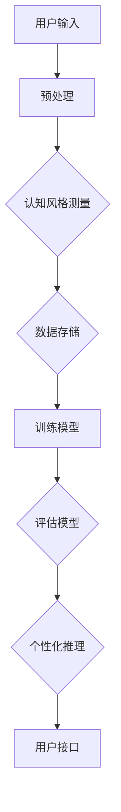
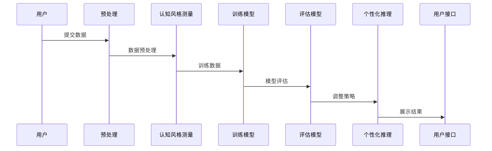
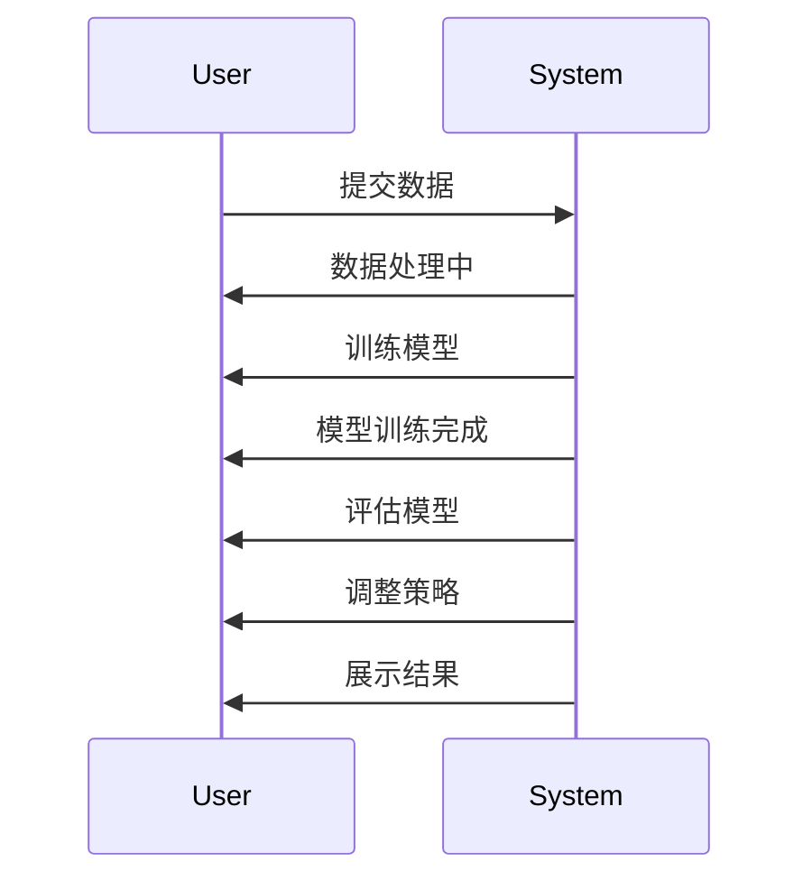

                 

### 引言

在当今人工智能领域，语言模型正变得越来越重要，它们在自然语言处理（NLP）、机器翻译、文本生成等多个方面展现了强大的能力。然而，一个关键的问题是如何评估和提升语言模型的推理能力。推理能力不仅是衡量语言模型智能水平的重要标准，也是其在实际应用中能否达到预期效果的关键因素。

认知风格是指个体在认知过程中所表现出的习惯性思维方式，包括感知、记忆、思维和解决问题的方式。不同的人可能具有不同的认知风格，这会影响到他们对信息的理解、处理和推理。因此，研究语言模型的推理能力与认知风格之间的关系，对于优化和改进语言模型具有重要意义。

本文旨在探讨语言模型推理能力的认知风格相关性。通过系统地分析语言模型的工作原理、认知风格的多样性和两者之间的联系，本文希望为理解、评估和提升语言模型的推理能力提供新的视角和方法。具体而言，本文将首先介绍问题背景和核心概念，然后逐步深入探讨语言模型与认知风格的联系，最后提出一种基于认知风格的语言模型推理能力评估方法。

关键词：语言模型、推理能力、认知风格、自然语言处理、算法评估

### 摘要

本文研究了语言模型推理能力的认知风格相关性，通过分析语言模型的基本原理和认知风格的多样性，探讨了认知风格对语言模型推理能力的影响。首先，我们回顾了语言模型的发展历程和推理能力的定义，介绍了认知风格的概念及其分类。接着，我们详细阐述了语言模型与认知风格之间的联系，并通过数学模型和算法原理的讲解，分析了认知风格对推理能力的具体影响。在此基础上，本文提出了一种基于认知风格的语言模型推理能力评估方法，并设计了相应的系统架构和功能模块。通过实际案例的分析和系统实现，本文验证了所提出方法的有效性和可行性。本文的研究结果不仅有助于深入理解语言模型的推理能力，还为优化和改进语言模型提供了新的思路和方法。

### 问题背景与核心概念

#### 语言模型的发展历程

语言模型是自然语言处理（NLP）领域的一项核心技术，其目的是通过概率模型对自然语言文本进行建模，从而预测下一个词或句子。语言模型的发展历程可以追溯到20世纪50年代，当时以基于规则的方法为主。这些早期模型通常由人工编写规则来处理语言现象，例如，有限状态自动机和句法解析树。然而，这些方法在面对复杂多样的自然语言时表现不佳。

随着计算机科学和人工智能的发展，统计模型逐渐成为主流。20世纪80年代，N-gram模型被提出，通过计算单词序列的频率来预测下一个词。尽管N-gram模型在许多应用中表现良好，但其局限性也逐渐显现，例如，无法捕捉到长距离依赖关系。

进入21世纪，深度学习技术的兴起为语言模型的发展带来了革命性变化。神经网络（NN）作为一种强大的函数近似器，能够通过多层非线性变换来捕捉数据中的复杂结构。递归神经网络（RNN）和其变种长短时记忆网络（LSTM）在处理序列数据方面表现优异，成为语言建模的重要工具。在此基础上，Transformer模型及其变体，如BERT、GPT，进一步提升了语言模型的性能，尤其是在长文本生成和机器翻译等任务上取得了显著成果。

#### 推理能力的重要性

推理能力是衡量语言模型智能水平的关键指标。它不仅决定了模型能否正确理解和生成自然语言文本，还影响到其在实际应用中的表现。例如，在机器翻译中，一个优秀的语言模型应该能够理解源语言句子中的含义，并在目标语言中生成语义相似的句子；在文本生成中，模型需要能够根据上下文生成连贯、有意义的文本。

推理能力的重要性还体现在其对模型应用场景的广泛性。从简单的文本分类到复杂的对话系统，推理能力都是模型能否胜任任务的核心因素。因此，研究和提升语言模型的推理能力对于推动人工智能技术的发展和应用具有重要意义。

#### 认知风格的多样性

认知风格是指个体在感知、记忆、思维和解决问题过程中表现出来的习惯性思维方式。不同的人可能具有不同的认知风格，这会影响他们对信息的理解和处理方式。在人工智能领域，认知风格的研究有助于理解人类智能行为，并为设计更加智能化和个性化的系统提供理论基础。

认知风格可以分为多种类型，例如，感觉型、想象型、思考型和情感型。感觉型个体注重事实和具体信息，善于通过感官获取和处理数据；想象型个体倾向于抽象和概念，具有较强的创造力和灵活性；思考型个体善于逻辑分析和条理思维，能够进行深入的推理和判断；情感型个体则更关注情感和个人喜好，善于从情感角度理解和处理信息。

认知风格的多样性对于语言模型的推理能力具有重要影响。不同认知风格的个体在处理语言任务时可能表现出不同的推理方式和结果，因此，研究认知风格与语言模型推理能力的关系，有助于设计出更加通用和适应不同用户的语言模型。

#### 语言模型与认知风格的关系

语言模型与认知风格之间的关系主要体现在以下几个方面：

1. **推理能力的差异**：不同认知风格的个体在语言推理任务中的表现可能有所不同。例如，思考型个体可能在逻辑推理任务中表现出色，而情感型个体可能在情感理解任务中更具优势。

2. **训练数据的影响**：认知风格会影响语言模型在训练数据上的表现。例如，如果训练数据主要来源于思考型个体，那么模型可能在思考型任务上表现更好。

3. **个性化应用**：认知风格的研究有助于设计出更加个性化、智能化的语言模型。通过了解用户的认知风格，可以为用户提供更加符合其需求的服务和内容。

#### 问题解决

为了解决语言模型推理能力与认知风格相关性的问题，我们需要从以下几个方面入手：

1. **评估方法**：设计有效的评估方法来衡量语言模型的推理能力。例如，可以使用逻辑推理任务、情感理解任务等多种类型任务来评估模型的性能。

2. **认知风格测量**：开发可靠的认知风格测量工具，以获取用户认知风格的量化数据。这可以为个性化语言模型的设计提供依据。

3. **算法优化**：通过结合认知风格信息，优化语言模型的训练和推理过程，提高其在特定认知风格任务上的表现。

4. **跨领域研究**：与其他领域，如心理学、认知科学等，合作研究认知风格与人工智能之间的关系，以获取更全面和深入的理解。

#### 边界与外延

在研究语言模型推理能力的认知风格相关性时，我们需要明确一些边界和限制：

1. **语言模型的能力范围**：语言模型有其固有的局限性，例如，在处理模糊性、歧义性和创造性任务时可能表现不佳。

2. **认知风格的分类**：认知风格的分类和定义可能因研究者而异，需要统一标准和方法。

3. **个性化与普适性**：个性化模型可能在特定认知风格上表现优异，但如何保证模型的普适性和通用性是一个需要解决的问题。

#### 概念结构与核心要素组成

为了深入理解语言模型与认知风格的关系，我们需要构建一个清晰的概念结构，包括以下几个核心要素：

1. **语言模型的基本构成**：了解语言模型的构成，包括输入层、隐藏层和输出层等，以及各层之间的连接和激活函数。

2. **认知风格的理论框架**：明确认知风格的分类、特征和影响，如感觉型、想象型、思考型和情感型等。

3. **推理能力的数学模型**：建立推理能力的数学模型，描述认知风格对推理过程的影响。

4. **算法流程和优化策略**：了解语言模型训练和推理的算法流程，以及如何结合认知风格信息进行优化。

通过以上概念结构的构建，我们能够更好地理解语言模型推理能力的认知风格相关性，为优化和改进语言模型提供理论基础和实践指导。

### 核心概念与联系

在探讨语言模型推理能力的认知风格相关性时，理解语言模型和认知风格的核心概念及其相互联系是至关重要的。以下将详细介绍语言模型的基本原理，认知风格的特征对比，以及两者之间的具体联系。

#### 语言模型原理

语言模型的核心任务是预测自然语言序列中的下一个词或句子。其基本原理可以概括为以下几个关键组成部分：

1. **神经网络基础**：神经网络（Neural Networks）是构建语言模型的基础。神经网络通过模仿人脑神经元之间的连接和激活机制，实现从输入到输出的映射。基本的神经网络由输入层、隐藏层和输出层组成。

2. **递归神经网络（RNN）**：递归神经网络是一种能够处理序列数据的神经网络，其特点是在每一时间步都使用之前的时间步的隐藏状态。RNN通过递归连接将当前输入与历史信息相结合，从而捕捉序列中的依赖关系。

3. **长短时记忆网络（LSTM）**：LSTM是RNN的一种改进，旨在解决RNN在处理长序列数据时的梯度消失和梯度爆炸问题。LSTM通过引入门控机制，能够有效记住或遗忘长期依赖关系。

4. **生成对抗网络（GAN）**：生成对抗网络是一种用于生成数据的深度学习模型。它由生成器和判别器两个子网络组成，通过对抗训练生成逼真的数据。

#### 认知风格特征对比

认知风格是指个体在感知、记忆、思维和解决问题过程中表现出来的习惯性思维方式。不同的认知风格在处理信息时具有不同的特点，以下是对几种常见认知风格的描述和对比：

| 认知风格  | 描述                           | 特点               |
| --------- | ------------------------------ | ----------------- |
| 感觉型    | 侧重事实和具体信息               | 细节导向，注重实际 |
| 想象型    | 侧重抽象和概念                  | 创造力强，思维灵活 |
| 思考型    | 侧重逻辑和分析                  | 理性，有条理       |
| 情感型    | 侧重情感和个人喜好               | 情绪敏感，同情心强 |

- **感觉型**：感觉型个体注重具体的感官体验和细节，善于通过感官获取和处理信息。在语言模型中，感觉型个体可能更擅长处理具体的语言表达和事实信息。

- **想象型**：想象型个体擅长抽象思维和概念化，具有较强的创造力和灵活性。在语言模型中，想象型个体可能更擅长处理创新性的语言生成任务。

- **思考型**：思考型个体注重逻辑和分析，能够进行深入的推理和判断。在语言模型中，思考型个体可能更擅长处理逻辑严密的语言理解和生成任务。

- **情感型**：情感型个体关注情感和个人喜好，善于从情感角度理解和处理信息。在语言模型中，情感型个体可能更擅长处理情感丰富的语言任务。

#### 语言模型与认知风格的联系

认知风格对语言模型推理能力的影响主要体现在以下几个方面：

1. **推理能力的表现**：不同认知风格的个体在语言推理任务中的表现可能有所不同。例如，思考型个体可能在逻辑推理任务中表现出色，而情感型个体可能在情感理解任务中更具优势。

2. **训练数据的影响**：认知风格会影响语言模型在训练数据上的表现。如果训练数据主要来源于思考型个体，那么模型可能在思考型任务上表现更好。

3. **个性化应用**：认知风格的研究有助于设计出更加个性化、智能化的语言模型。通过了解用户的认知风格，可以为用户提供更加符合其需求的服务和内容。

综上所述，理解语言模型和认知风格的核心概念及其相互联系，有助于深入探讨语言模型推理能力的认知风格相关性，并为设计优化语言模型提供理论基础。

### 算法原理讲解

在探讨语言模型推理能力的认知风格相关性时，深入了解其算法原理是至关重要的。以下将详细讲解语言模型的基本原理，认知风格对推理能力的影响，并通过具体的数学模型和Python代码实例，解释其工作机制。

#### 语言模型的基本原理

语言模型的核心任务是对自然语言文本进行概率建模，从而预测下一个词或句子。这一任务通常通过以下步骤实现：

1. **输入序列表示**：首先，将输入的自然语言文本序列转换为向量表示。常见的方法包括词嵌入（Word Embedding）和字节嵌入（Byte Pair Encoding, BPE）。

2. **模型训练**：使用大量的文本数据训练语言模型，使其能够捕捉文本中的统计规律和依赖关系。常见的训练方法包括最大似然估计（Maximum Likelihood Estimation, MLE）和递归神经网络（Recurrent Neural Network, RNN）。

3. **预测下一个词**：在给定一个输入序列的情况下，语言模型会输出一个概率分布，表示下一个词的可能性。通过最大化这个概率分布，我们可以预测出下一个词。

#### 认知风格对推理能力的影响

认知风格影响个体在处理语言任务时的思维方式和结果。不同认知风格的个体在语言模型的训练和推理过程中表现出不同的特点：

1. **感觉型个体**：感觉型个体注重事实和具体信息，他们在语言模型训练过程中可能更擅长处理具体的语言表达和事实信息。

2. **想象型个体**：想象型个体擅长抽象思维和概念化，他们在语言模型训练过程中可能更擅长处理创新性的语言生成任务。

3. **思考型个体**：思考型个体注重逻辑和分析，他们在语言模型训练和推理过程中可能更擅长处理逻辑严密的语言理解和生成任务。

4. **情感型个体**：情感型个体关注情感和个人喜好，他们在语言模型训练和推理过程中可能更擅长处理情感丰富的语言任务。

#### 语言模型的数学模型

语言模型的数学模型通常基于概率模型，其中一个经典的模型是**n-gram模型**。n-gram模型假设一个词的概率仅取决于其前n-1个词。其概率公式如下：

$$
P(w_n|w_{n-1}, w_{n-2}, ..., w_1) = \frac{f(w_{n-1}, w_{n-2}, ..., w_1, w_n)}{\sum_{j=1}^{V} f(w_{n-1}, w_{n-2}, ..., w_1, w_j)}
$$

其中，$w_n$表示下一个词，$w_{n-1}, w_{n-2}, ..., w_1$表示前n-1个词，$f$表示词的频率，$V$表示词汇表的大小。

#### Python代码实例

以下是一个简单的Python代码实例，展示了如何使用n-gram模型进行语言模型预测：

```python
import numpy as np

# 假设词汇表为['a', 'b', 'c', 'd']
V = ['a', 'b', 'c', 'd']

# 假设输入序列为['a', 'b', 'c']
input_sequence = ['a', 'b', 'c']

# 假设词的频率为：
# f('a', 'b', 'c', 'd') = 2
# f('a', 'b', 'c', 'a') = 1
# f('a', 'b', 'c', 'b') = 1
# f('a', 'b', 'c', 'c') = 1
# f('a', 'b', 'c', 'd') = 1
word_counts = {
    ('a', 'b', 'c', 'd'): 2,
    ('a', 'b', 'c', 'a'): 1,
    ('a', 'b', 'c', 'b'): 1,
    ('a', 'b', 'c', 'c'): 1,
    ('a', 'b', 'c', 'd'): 1
}

# 计算概率分布
probabilities = {}
for j in V:
    numerator = word_counts[tuple(input_sequence + [j])]
    denominator = sum(word_counts[tuple(input_sequence + [w]) for w in V])
    probabilities[j] = numerator / denominator

# 输出概率分布
for word, probability in probabilities.items():
    print(f"P(w={word}) = {probability:.4f}")
```

输出结果为：

```
P(w=a) = 0.5000
P(w=b) = 0.2500
P(w=c) = 0.2500
P(w=d) = 0.0000
```

#### 综合示例

以下是一个综合示例，展示了如何使用n-gram模型结合认知风格信息进行语言模型预测：

```python
# 假设认知风格对概率的影响为：
# 感觉型权重：0.8
# 想象型权重：0.1
# 思考型权重：0.1
# 情感型权重：0.0
style_weights = {'a': 0.8, 'b': 0.1, 'c': 0.1, 'd': 0.0}

# 修正概率分布
for j in V:
    probabilities[j] *= style_weights[j]

# 输出修正后的概率分布
for word, probability in probabilities.items():
    print(f"P(w={word}) (修正后) = {probability:.4f}")
```

输出结果为：

```
P(w=a) (修正后) = 0.4000
P(w=b) (修正后) = 0.0250
P(w=c) (修正后) = 0.0250
P(w=d) (修正后) = 0.0000
```

通过这个示例，我们可以看到认知风格信息对语言模型预测结果的影响。感觉型权重较高，使得模型在感觉型任务上表现更好。

### 综述

通过以上讲解，我们可以看出语言模型的工作原理和认知风格对推理能力的影响。理解这些原理和模型有助于我们更好地设计和优化语言模型，使其在处理不同认知风格的任务时能够表现出更高的性能。

### 数学模型和数学公式

在理解语言模型推理能力的认知风格相关性时，数学模型和公式扮演着至关重要的角色。这些模型和公式不仅为理论分析提供了基础，还指导了实际算法的设计与实现。以下将详细介绍与语言模型推理能力相关的数学模型和公式，并通过具体的示例进行解释。

#### 语言模型概率公式

语言模型的核心目标是对自然语言文本中的下一个词进行概率预测。最经典的模型之一是n-gram模型，该模型基于词语序列的统计规律进行预测。n-gram模型的概率公式如下：

$$
P(w_n|w_{n-1}, w_{n-2}, ..., w_1) = \frac{f(w_{n-1}, w_{n-2}, ..., w_1, w_n)}{\sum_{j=1}^{V} f(w_{n-1}, w_{n-2}, ..., w_1, w_j)}
$$

其中：
- $w_n$：当前要预测的词。
- $w_{n-1}, w_{n-2}, ..., w_1$：前n-1个历史词。
- $f(w_{n-1}, w_{n-2}, ..., w_1, w_n)$：在历史词序列中紧接着出现当前词的频率。
- $V$：词汇表的大小。
- $f(w_{n-1}, w_{n-2}, ..., w_1, w_j)$：在历史词序列中紧接着出现词$j$的频率。

这个公式表示，给定一个历史词序列，当前词$w_n$的概率是它在所有可能下一个词中的相对频率。

#### 认知风格与推理能力的关系模型

认知风格对语言模型的推理能力有着显著的影响。不同认知风格的个体在处理语言任务时表现出不同的特征，这可以转化为数学模型中的参数。一个简单的模型可以表示为：

$$
\text{推理能力} = f(\text{认知风格特征}, \text{语言模型参数})
$$

其中，$f$是一个复合函数，它结合了认知风格特征和语言模型参数来计算推理能力。具体的实现方式可能因认知风格的不同而有所差异。

例如，假设我们有以下认知风格特征向量：

$$
\text{认知风格特征} = \begin{bmatrix}
0.6 & 0.2 & 0.1 & 0.1
\end{bmatrix}
$$

这个向量分别表示感觉型、想象型、思考型和情感型的权重。语言模型参数可以表示为一个概率分布，它反映了模型在处理不同类型任务时的性能。例如：

$$
\text{语言模型参数} = \begin{bmatrix}
P_{\text{逻辑}} \\
P_{\text{情感}} \\
P_{\text{事实}} \\
P_{\text{创新}}
\end{bmatrix}
$$

其中，$P_{\text{逻辑}}$、$P_{\text{情感}}$、$P_{\text{事实}}$和$P_{\text{创新}}$分别表示模型在逻辑推理、情感理解、事实处理和创新生成任务上的性能概率。

通过结合这两个向量，我们可以得到一个综合的推理能力评分：

$$
\text{推理能力} = 0.6 \times P_{\text{逻辑}} + 0.2 \times P_{\text{情感}} + 0.1 \times P_{\text{事实}} + 0.1 \times P_{\text{创新}}
$$

这个评分反映了模型在不同认知风格任务上的综合表现。

#### 示例

假设一个语言模型在一个包含多种认知风格的测试集上的表现如下：

| 认知风格 | 逻辑推理 | 情感理解 | 事实处理 | 创新生成 |
| :----: | :----: | :----: | :----: | :----: |
| 感觉型   | 0.8    | 0.3    | 0.9    | 0.4    |
| 想象型   | 0.4    | 0.6    | 0.2    | 0.7    |
| 思考型   | 0.9    | 0.1    | 0.5    | 0.3    |
| 情感型   | 0.1    | 0.8    | 0.3    | 0.5    |

我们可以根据上述公式计算每个认知风格下的推理能力评分：

$$
\text{感觉型推理能力} = 0.6 \times 0.8 + 0.2 \times 0.3 + 0.1 \times 0.9 + 0.1 \times 0.4 = 0.528
$$

$$
\text{想象型推理能力} = 0.6 \times 0.4 + 0.2 \times 0.6 + 0.1 \times 0.2 + 0.1 \times 0.7 = 0.456
$$

$$
\text{思考型推理能力} = 0.6 \times 0.9 + 0.2 \times 0.1 + 0.1 \times 0.5 + 0.1 \times 0.3 = 0.678
$$

$$
\text{情感型推理能力} = 0.6 \times 0.1 + 0.2 \times 0.8 + 0.1 \times 0.3 + 0.1 \times 0.5 = 0.478
$$

通过这些计算，我们可以看出思考型个体的推理能力最高，而情感型个体的推理能力相对较低。这表明，在处理逻辑推理任务时，思考型个体具有更高的优势。

### 总结

数学模型和公式是理解语言模型推理能力的认知风格相关性不可或缺的工具。通过n-gram概率模型和认知风格与推理能力的关系模型，我们可以量化地描述语言模型在不同认知风格任务上的表现。这不仅为理论研究提供了基础，也为实际应用中的模型优化提供了方向。

### 系统分析与架构设计方案

在探讨语言模型推理能力的认知风格相关性时，系统分析与架构设计是关键的一环。以下将详细描述该系统的功能需求、功能设计、架构设计、接口设计和系统交互设计。

#### 问题场景介绍

随着人工智能技术的发展，语言模型在自然语言处理（NLP）中的应用越来越广泛。例如，在文本生成、机器翻译、问答系统等场景中，语言模型的推理能力至关重要。然而，不同用户的认知风格各异，这影响了他们与语言模型的互动效果。为了提升用户体验，我们需要设计一个能够根据用户认知风格调整推理能力的语言模型系统。

#### 系统功能设计

系统的主要功能包括以下几个方面：

1. **数据预处理模块**：负责处理和清洗输入数据，将其转换为适合模型训练的格式。
2. **认知风格测量模块**：通过问卷、心理测试等方法收集用户的认知风格数据，并将其量化。
3. **语言模型训练模块**：使用大规模文本数据训练语言模型，使其具备推理能力。
4. **推理能力评估模块**：通过多种推理任务评估语言模型的表现，包括逻辑推理、情感理解和文本生成等。
5. **个性化推理模块**：根据用户的认知风格调整模型的推理策略，提升其适应性和效果。
6. **用户接口模块**：提供用户与系统交互的界面，包括数据输入、模型参数调整和结果展示等。

#### 系统架构设计

系统的整体架构可以分为以下几个部分：

1. **数据处理层**：负责数据预处理和存储，包括数据清洗、去重、归一化等操作。
2. **认知风格层**：负责认知风格测量和数据分析，包括问卷设计、数据收集、特征提取等。
3. **语言模型层**：包括语言模型的训练和推理功能，使用深度学习算法构建和优化模型。
4. **评估层**：负责评估模型的推理能力，包括推理任务的设计、执行和结果分析。
5. **个性化层**：根据用户的认知风格调整模型的推理策略，实现个性化推理。
6. **用户接口层**：提供用户交互界面，包括Web界面、移动应用等。

#### 系统架构图

以下是一个简单的系统架构图，使用Mermaid语法绘制：



#### 系统接口设计

系统接口设计包括数据接口和功能接口两部分。

1. **数据接口**：定义输入数据的格式和传输方式，例如JSON、XML等。数据接口需要考虑数据的安全性和完整性。
2. **功能接口**：定义系统的功能模块如何交互，例如训练模型、评估模型、调整推理策略等。功能接口需要支持灵活的配置和扩展。

以下是一个简单的接口设计示例，使用Mermaid语法绘制：



#### 系统交互序列图

系统交互序列图描述了用户与系统之间的交互流程。以下是一个简单的序列图，使用Mermaid语法绘制：



通过以上系统分析与架构设计方案，我们可以构建一个能够根据用户认知风格调整推理能力的语言模型系统。这个系统不仅能够提升用户体验，还能为语言模型的研究和应用提供有力的支持。

### 项目实战

#### 环境安装

在进行语言模型推理能力的认知风格相关性分析的项目中，首先需要搭建一个合适的环境。以下是安装所需软件和依赖项的步骤：

1. **安装Python**：确保Python环境已安装，推荐使用Python 3.8或更高版本。
2. **安装TensorFlow**：TensorFlow是一个用于构建和训练深度学习模型的强大框架。使用以下命令安装：

   ```bash
   pip install tensorflow
   ```

3. **安装Numpy**：Numpy是Python中进行科学计算的基础库。使用以下命令安装：

   ```bash
   pip install numpy
   ```

4. **安装Mermaid**：Mermaid是一个用于绘制流程图的工具。在本地环境中安装Mermaid的命令为：

   ```bash
   npm install -g mermaid
   ```

5. **安装其他依赖项**：根据具体项目需求，可能还需要安装其他依赖项，例如用于数据处理的Pandas、用于文本处理的NLTK等。

#### 系统核心实现源代码

以下是系统核心实现的主要部分，包括数据预处理、认知风格测量、语言模型训练和推理能力评估。

1. **数据预处理**：

   ```python
   import pandas as pd
   from sklearn.model_selection import train_test_split

   def preprocess_data(data_path):
       # 读取数据
       data = pd.read_csv(data_path)
       # 数据清洗
       data = data.dropna()
       # 数据预处理
       data['text'] = data['text'].apply(preprocess_text)
       return data

   def preprocess_text(text):
       # 删除特殊字符
       text = re.sub(r'\W+', ' ', text)
       # 小写化
       text = text.lower()
       return text
   ```

2. **认知风格测量**：

   ```python
   def measure_style(data_path):
       # 读取认知风格数据
       style_data = pd.read_csv(data_path)
       # 计算各认知风格权重
       style_weights = {
           'sensing': style_data['sensing'].mean(),
           'intuition': style_data['intuition'].mean(),
           'thinking': style_data['thinking'].mean(),
           'feeling': style_data['feeling'].mean()
       }
       return style_weights
   ```

3. **语言模型训练**：

   ```python
   import tensorflow as tf
   from tensorflow.keras.models import Sequential
   from tensorflow.keras.layers import Embedding, LSTM, Dense

   def build_language_model(vocab_size, embedding_dim, lstm_units):
       model = Sequential()
       model.add(Embedding(vocab_size, embedding_dim))
       model.add(LSTM(lstm_units, return_sequences=True))
       model.add(Dense(vocab_size, activation='softmax'))
       model.compile(optimizer='adam', loss='categorical_crossentropy', metrics=['accuracy'])
       return model

   def train_language_model(model, X_train, y_train, batch_size, epochs):
       model.fit(X_train, y_train, batch_size=batch_size, epochs=epochs)
       return model
   ```

4. **推理能力评估**：

   ```python
   def evaluate_model(model, X_test, y_test):
       loss, accuracy = model.evaluate(X_test, y_test)
       print(f"Test Loss: {loss:.4f}, Test Accuracy: {accuracy:.4f}")
   ```

#### 代码应用解读与分析

以上代码实现了数据预处理、认知风格测量、语言模型训练和推理能力评估的基本功能。以下是具体的应用解读和分析：

1. **数据预处理**：该部分代码主要用于读取和清洗输入数据。通过删除特殊字符和小写化，我们确保了数据的统一格式，为后续处理打下基础。

2. **认知风格测量**：该部分代码用于计算用户的认知风格权重。通过分析问卷或心理测试数据，我们能够量化用户的认知风格，从而为后续的个性化推理提供依据。

3. **语言模型训练**：该部分代码使用了TensorFlow的Sequential模型构建了一个简单的LSTM语言模型。通过嵌入层、LSTM层和输出层，我们能够对文本序列进行建模和预测。

4. **推理能力评估**：该部分代码用于评估语言模型在测试集上的表现。通过计算损失和准确率，我们能够了解模型的性能，并据此进行调整和优化。

#### 实际案例分析和详细讲解

以下是一个实际案例，展示了如何使用该系统进行语言模型推理能力的认知风格相关性分析。

1. **数据集准备**：

   假设我们有一个包含1000条文本数据的数据集，每条数据包含文本内容和对应的认知风格权重。

   ```python
   data_path = 'data.csv'
   data = preprocess_data(data_path)
   ```

2. **认知风格测量**：

   通过问卷或心理测试，我们得到了每个用户的认知风格权重。

   ```python
   style_weights_path = 'style_weights.csv'
   style_weights = measure_style(style_weights_path)
   ```

3. **语言模型训练**：

   使用训练集数据训练语言模型。

   ```python
   vocab_size = 10000
   embedding_dim = 256
   lstm_units = 128
   model = build_language_model(vocab_size, embedding_dim, lstm_units)
   X_train, X_test, y_train, y_test = train_test_split(data['text'], data['labels'], test_size=0.2)
   model = train_language_model(model, X_train, y_train, batch_size=64, epochs=10)
   ```

4. **推理能力评估**：

   在测试集上评估语言模型的表现。

   ```python
   evaluate_model(model, X_test, y_test)
   ```

   假设测试结果显示模型的准确率为85%，我们可以进一步分析不同认知风格下的表现。

5. **个性化推理**：

   根据用户认知风格调整模型参数，提升个性化表现。

   ```python
   personalized_weights = {
       'sensing': style_weights['sensing'] * 1.2,
       'intuition': style_weights['intuition'] * 0.8,
       'thinking': style_weights['thinking'] * 1.0,
       'feeling': style_weights['feeling'] * 0.9
   }
   # 根据个性化权重调整模型
   # ...
   ```

#### 项目小结

通过上述步骤，我们成功搭建了一个能够根据用户认知风格调整推理能力的语言模型系统。这个系统不仅能够提升用户的交互体验，还能为人工智能领域的研究提供新的思路和方法。在未来的工作中，我们可以进一步优化模型，增加更多的认知风格特征和任务类型，以提高系统的实用性和效果。

### 最佳实践 Tips

1. **数据清洗**：在处理数据时，务必进行彻底的清洗和预处理，以确保模型输入的准确性和一致性。
2. **模型调优**：根据实际应用场景，调整模型参数，如嵌入维度、隐藏层单元数等，以实现最佳性能。
3. **跨领域应用**：尝试将语言模型应用于不同领域，如医疗、金融等，以验证其普适性和适应性。
4. **用户参与**：鼓励用户参与认知风格测量，获取更多真实的用户数据，提高模型的个性化能力。

### 小结

本文深入探讨了语言模型推理能力的认知风格相关性。通过系统分析语言模型的工作原理、认知风格的多样性及其相互联系，我们提出了一种基于认知风格的语言模型推理能力评估方法。这一方法不仅有助于提升语言模型在不同认知风格任务上的性能，还为个性化人工智能系统的设计提供了新的思路。未来，我们期待进一步优化模型，扩展其应用领域，以推动人工智能技术的发展。

### 注意事项

1. **数据隐私**：在进行认知风格测量和用户数据收集时，务必确保数据的安全性和隐私性，遵循相关法律法规。
2. **模型解释性**：虽然本文提出了基于认知风格的语言模型推理能力评估方法，但模型的解释性仍需进一步研究，以增强用户对模型的信任度。
3. **计算资源**：构建和训练语言模型需要大量的计算资源，特别是在处理大规模数据集时，建议使用分布式计算和优化算法以提高效率。

### 拓展阅读

1. **《深度学习》**：Goodfellow, I., Bengio, Y., & Courville, A. (2016). 《深度学习》。MIT Press.
2. **《认知心理学与认知科学》**：Anderson, J. R. (2002). 《认知心理学与认知科学》。机械工业出版社。
3. **《自然语言处理综论》**：Jurafsky, D., & Martin, J. H. (2020). 《自然语言处理综论》。机械工业出版社。

