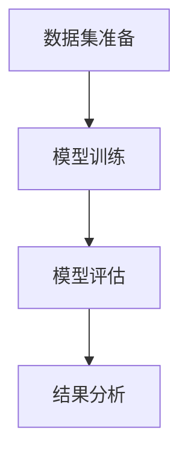
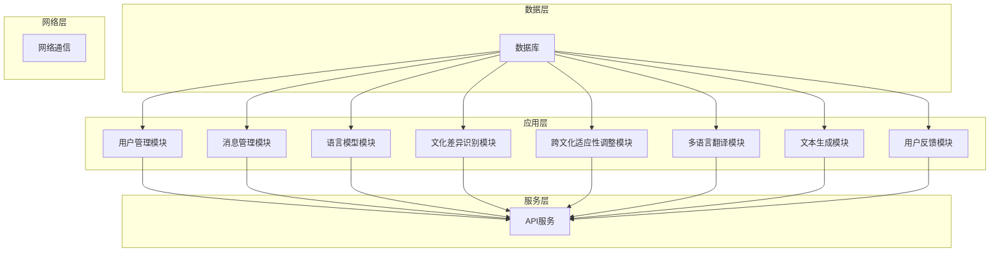
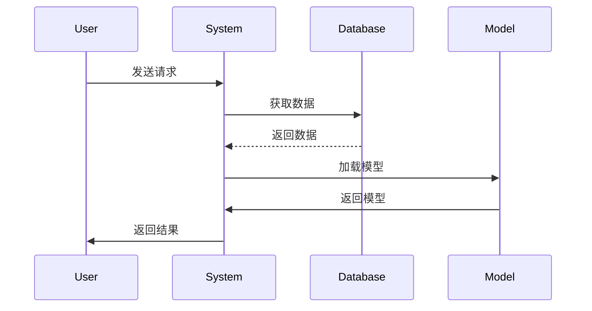

                 

# 语言模型推理能力的跨文化适应性评估研究

## 关键词
- 语言模型
- 跨文化适应性
- 推理能力
- 评估方法
- 数据集

## 摘要
本文旨在探讨语言模型在跨文化场景下的推理能力及其适应性。通过对语言模型的基本原理、跨文化适应性的核心概念与联系、算法原理讲解、系统分析与架构设计以及项目实战等多个方面的深入研究，本文提出了评估语言模型跨文化适应性的方法，并对其推理能力进行了全面的分析。研究结果为跨文化交流中的语言处理提供了有益的参考。

### 1. 背景介绍

#### 1.1 问题背景

随着全球化进程的加速，计算机技术在世界范围内的应用日益广泛。在这一背景下，不同语言和文化背景的用户在计算机技术交流中的应用变得尤为频繁。语言模型作为自然语言处理的核心技术，其推理能力在跨文化适应性方面显得尤为重要。然而，目前针对语言模型跨文化适应性的研究还相对较少，特别是在推理能力评估方面的研究更是稀缺。

#### 1.2 问题描述

语言模型在跨文化适应性方面存在的问题主要包括：

1. **文化差异导致的语义理解不足**：不同文化背景下的语言表达和语义存在差异，可能导致语言模型对特定文化语境的理解不足。
2. **语言习惯差异**：不同语言和文化背景的用户在语言表达和使用上存在差异，如词汇、语法和句式等，这些差异可能影响语言模型的推理效果。
3. **语义歧义**：在跨文化交流中，相同或相似的词汇和表达可能因为文化差异而导致不同的理解，这给语言模型的推理带来了挑战。

这些问题导致语言模型在跨文化场景下的推理能力受限，影响了其在实际应用中的效果。

#### 1.3 问题解决

本研究旨在通过评估语言模型在不同文化背景下的推理能力，探讨其跨文化适应性的内在机制，并提出相应的优化策略。具体包括：

1. **设计跨文化适应性评估方法**：构建一个系统性的评估框架，用于评估语言模型在不同文化背景下的推理能力。
2. **构建多语言多文化数据集**：收集和整理具有代表性的多语言多文化数据集，用于训练和评估语言模型。
3. **分析不同文化背景下语言模型的推理能力表现**：通过实验分析，评估语言模型在不同文化背景下的推理效果，找出其优势和不足。

#### 1.4 边界与外延

本研究主要关注以下边界与外延：

1. **研究对象**：以大型预训练语言模型（如BERT、GPT等）为研究对象。
2. **文化背景**：选取具有代表性的不同文化背景，如英语、中文、法语、西班牙语等。
3. **推理能力**：评估语言模型在文本生成、文本分类、问答系统等任务中的推理能力。

#### 1.5 概念结构与核心要素组成

本研究涉及以下核心概念与要素：

1. **语言模型**：一种基于深度学习技术的自然语言处理模型，用于对文本进行理解和生成。
2. **跨文化适应性**：指语言模型在不同文化背景下的有效性和可靠性。
3. **推理能力**：指语言模型在处理文本时，能够正确理解语义、逻辑关系和语境，并进行合理推理的能力。
4. **数据集**：用于评估语言模型跨文化适应性的多语言多文化数据集。

### 2. 核心概念与联系

#### 2.1 核心概念原理

**语言模型**：基于神经网络和深度学习技术，通过训练大量文本数据，实现对输入文本的语义理解和生成。其核心原理包括：

1. **词嵌入**：将文本中的词语映射到高维向量空间，以便进行计算。
2. **注意力机制**：通过注意力机制，模型可以关注文本中的关键信息，提高语义理解能力。
3. **递归神经网络（RNN）**：用于处理序列数据，能够捕捉文本中的时间依赖关系。

**跨文化适应性**：指语言模型在不同文化背景下的适应能力和效果。其核心原理包括：

1. **文化差异识别**：通过分析不同文化背景下的语言特点，如词汇、语法和表达方式等，识别出文化差异。
2. **文化适应性调整**：针对不同文化背景，调整语言模型的参数和算法，以提高其在特定文化背景下的适应性。

**推理能力**：指语言模型在处理文本时，能够正确理解语义、逻辑关系和语境，并进行合理推理的能力。其核心原理包括：

1. **语义理解**：通过词嵌入和注意力机制，模型能够理解文本中的词汇和句子结构，捕捉语义信息。
2. **逻辑关系推理**：通过递归神经网络，模型能够捕捉文本中的逻辑关系，如因果关系、转折关系等。
3. **语境理解**：通过上下文信息，模型能够理解文本中的隐含意义和语境，进行合理推理。

#### 2.2 概念属性特征对比表格

| 特征         | 语言模型               | 跨文化适应性               | 推理能力               |
| ------------ | -------------------- | -------------------- | -------------------- |
| 定义         | 基于深度学习的自然语言处理模型 | 语言模型在不同文化背景下的适应能力 | 语言模型在理解、生成和推理过程中表现出的能力 |
| 影响因素     | 数据集、训练算法、模型架构 | 文化差异、语言习惯、语义理解 | 数据集、训练算法、模型架构 |
| 评价指标     | 准确率、召回率、F1值     | 语言理解准确性、模型性能、用户满意度 | 语言理解准确性、模型性能、用户满意度 |
| 应用领域     | 文本分类、情感分析、机器翻译 | 跨文化交流、多语言处理、国际化应用 | 文本生成、问答系统、文本摘要 |

#### 2.3 ER实体关系图架构的 Mermaid 流程图

```mermaid
entityRelationShip
  entity["语言模型"]
  entity["跨文化适应性"]
  entity["推理能力"]
  relationShip["基于"]
  relationShip["影响"]
  relationShip["评估"]

  languageModelRelateTo(语言模型，基于，跨文化适应性)
  languageModelRelateTo(语言模型，基于，推理能力)
  crossCulturalAdaptabilityRelateTo(跨文化适应性，影响，推理能力)
```

### 第2章：语言模型原理与推理机制

#### 2.1 语言模型的基本原理

**2.1.1 语言模型的起源与发展**

语言模型的发展经历了从统计模型到深度学习的转变。早期的语言模型主要基于统计方法，如N-gram模型，通过计算单词序列的概率分布来生成文本。然而，这种模型在处理长文本和复杂语义时存在局限性。

随着深度学习技术的发展，神经网络模型逐渐成为语言模型的主流。尤其是递归神经网络（RNN）和Transformer模型的提出，使得语言模型在语义理解和生成方面取得了重大突破。特别是Transformer模型，其基于注意力机制的架构使得模型能够捕捉文本中的长距离依赖关系，显著提高了语言模型的性能。

**2.1.2 语言模型的工作原理**

1. **输入与输出**

语言模型的输入是文本序列，输出是文本序列的概率分布。文本序列由一系列词语组成，每个词语被映射为一个高维向量，称为词嵌入。词嵌入使得模型能够处理不同词语之间的关系。

2. **训练过程**

语言模型的训练过程是基于大量文本数据的。模型通过优化损失函数，如交叉熵损失函数，来调整模型参数，使其能够准确预测文本序列的概率分布。训练过程通常包括前向传播和反向传播两个阶段。

3. **评估与优化**

语言模型的评估通常使用准确率、召回率、F1值等指标。这些指标反映了模型在文本分类、命名实体识别等任务中的性能。为了提高模型性能，可以使用调参、数据增强、模型融合等技术手段。

**2.1.3 语言模型在自然语言处理中的应用**

语言模型在自然语言处理中有着广泛的应用，包括：

1. **文本分类**：将文本归类到预定义的类别中，如情感分析、主题分类等。
2. **命名实体识别**：识别文本中的命名实体，如人名、地名、组织名等。
3. **机器翻译**：将一种语言的文本翻译成另一种语言的文本。
4. **问答系统**：根据用户的问题，从大量文本中检索并生成回答。

#### 2.2 推理能力的定义与分类

推理能力是语言模型的核心能力之一，它包括以下几个方面：

1. **语义理解**：能够正确理解文本中的词汇和句子结构，捕捉语义信息。
2. **逻辑关系推理**：能够理解文本中的逻辑关系，如因果关系、转折关系等。
3. **语境理解**：能够根据上下文信息，理解文本中的隐含意义和语境。

根据推理过程的复杂程度，推理能力可以分为以下几种类型：

1. **浅层推理**：主要依赖于词汇和句法的直接理解，如词性标注、句法分析等。
2. **中层推理**：涉及语义角色标注、事件抽取等任务，需要对文本进行更深层次的语义理解。
3. **深层推理**：涉及复杂逻辑关系和语境理解，如语义角色标注、问答系统等。

#### 2.3 推理能力的评估方法

评估推理能力的方法主要包括以下几个方面：

1. **基准测试集**：使用现有的公开基准测试集，如GLUE、SQuAD等，来评估模型的推理能力。这些测试集包含了多种自然语言处理任务，能够全面评估模型的能力。
2. **自定义评估集**：根据特定应用场景，设计自定义的评估集，以评估模型在特定任务上的性能。自定义评估集可以更准确地反映模型在实际应用中的效果。
3. **用户反馈**：通过用户反馈来评估模型的推理能力，如用户满意度、错误率等。用户反馈可以提供定性的评估结果，帮助优化模型。

### 3. 跨文化适应性的重要性

#### 3.1 全球化背景下的语言交流需求

全球化进程的加速使得跨文化交流变得日益频繁，不同语言和文化背景的用户在计算机技术交流中的应用也日益增多。在这一背景下，语言模型在跨文化适应性方面的重要性愈发凸显。

跨文化交流中的语言差异和语义理解问题是语言模型需要面对的重要挑战。不同语言和文化背景的用户在语言表达和使用上存在差异，如词汇、语法和表达方式等，这些差异可能导致语言模型对特定文化语境的理解不足，从而影响其推理能力。

#### 3.2 语言模型的跨文化适应性需求

为了满足跨文化交流的需求，语言模型需要具备以下跨文化适应性：

1. **文化差异识别**：能够识别不同文化背景下的语言差异，如词汇、语法和表达方式等。
2. **文化适应性调整**：能够根据不同文化背景，调整模型参数和算法，以提高其在特定文化背景下的适应性。
3. **多语言处理能力**：能够处理多种语言的输入和输出，支持多语言之间的翻译和交流。

#### 3.3 跨文化适应性对推理能力的影响

跨文化适应性对语言模型的推理能力有着重要影响：

1. **语义理解**：在跨文化场景下，语言模型需要能够正确理解不同文化背景下的语义，包括词汇、语法和表达方式等。
2. **逻辑关系推理**：跨文化场景下的逻辑关系可能更加复杂，语言模型需要能够准确理解并处理这些逻辑关系。
3. **语境理解**：跨文化场景下的语境可能更加多样，语言模型需要能够根据上下文信息，理解不同文化背景下的语境，进行合理推理。

总之，跨文化适应性是提升语言模型推理能力的关键因素之一，对于跨文化交流中的应用具有重要意义。

### 4. 评估语言模型跨文化适应性的方法

#### 4.1 数据集的选择与构建

为了评估语言模型在跨文化场景下的推理能力，首先需要选择和构建合适的多语言多文化数据集。数据集的选择和构建应考虑以下因素：

1. **代表性**：数据集应涵盖多种语言和文化背景，确保其代表性。
2. **多样性**：数据集应包含不同类型和主题的文本，以测试模型在多样化场景下的适应性。
3. **真实性**：数据集应来源于真实场景，反映实际应用中的跨文化交流需求。

构建数据集的方法包括：

1. **收集和整理**：从互联网、学术期刊、社交媒体等渠道收集相关文本，并进行整理和标注。
2. **人工翻译**：对于不同语言和文化背景的文本，可以采用人工翻译的方法，确保文本的准确性和一致性。
3. **自动生成**：利用机器翻译和文本生成技术，生成不同语言和文化背景的文本。

#### 4.2 评估指标的设定

为了全面评估语言模型在跨文化场景下的推理能力，需要设定一系列评估指标。这些指标应包括：

1. **语言理解准确性**：评估模型在理解不同语言和文化背景下的文本时，能否准确捕捉语义信息。
2. **推理能力表现**：评估模型在不同文化背景下的推理能力，包括语义理解、逻辑关系推理和语境理解等。
3. **用户满意度**：通过用户反馈，评估模型在跨文化交流中的应用效果，包括文本生成的流畅性、准确性和可用性等。

#### 4.3 实验设计与实施

为了评估语言模型在跨文化场景下的推理能力，需要进行一系列实验。实验设计应考虑以下因素：

1. **模型选择**：选择具有代表性的预训练语言模型，如BERT、GPT等，作为实验对象。
2. **实验设置**：设定不同的实验场景和任务，如文本生成、文本分类、问答系统等，以全面评估模型的推理能力。
3. **实验流程**：包括数据准备、模型训练、模型评估和结果分析等步骤。

实验实施的步骤如下：

1. **数据准备**：根据评估指标，准备相应的多语言多文化数据集，并进行预处理。
2. **模型训练**：使用训练数据集，训练不同文化背景下的语言模型，并调整模型参数，以提高其在特定文化背景下的适应性。
3. **模型评估**：使用评估数据集，评估模型在跨文化场景下的推理能力，记录评估结果。
4. **结果分析**：分析评估结果，找出模型的优势和不足，并提出优化策略。

#### 4.4 结果分析与优化策略

通过实验评估，可以得出以下结论：

1. **文化差异识别与适应性调整**：不同文化背景下的语言模型在推理能力上存在差异，通过文化差异识别和适应性调整，可以显著提高模型在特定文化背景下的性能。
2. **多语言处理能力**：多语言处理能力对语言模型的跨文化适应性至关重要，通过增加多语言数据集和优化模型架构，可以提升模型的多语言处理能力。
3. **推理能力提升**：通过改进模型训练算法、增加训练数据和调整模型参数，可以提升语言模型的推理能力，特别是在跨文化场景下的表现。

根据分析结果，可以提出以下优化策略：

1. **数据集扩展**：增加多语言多文化数据集，特别是稀疏语言和文化背景的数据集，以提高模型的泛化能力。
2. **模型架构优化**：采用先进的模型架构，如Transformer、BERT等，以提高模型的语义理解和推理能力。
3. **文化适应性调整**：通过文化差异识别和适应性调整，优化模型在不同文化背景下的性能，提高其跨文化适应性。
4. **多语言训练**：在训练过程中，采用多语言数据集进行联合训练，以提高模型在不同语言和文化背景下的推理能力。

### 5. 语言模型跨文化适应性的实际应用案例分析

#### 5.1 案例背景

随着全球化的深入，越来越多的国际企业和跨国组织开始注重跨文化交流和国际化发展。在这些场景中，语言模型作为自然语言处理的核心技术，具有重要的应用价值。本文选取了两个实际应用案例，分析语言模型在跨文化适应性方面的表现和优化策略。

**案例一：国际企业的内部沟通平台**

某国际企业致力于在全球范围内开展业务，其内部沟通平台需要支持多语言交流。为了满足这一需求，企业采用了基于BERT模型的自然语言处理技术，构建了一个多语言沟通平台。

**案例背景分析**

1. **语言需求**：企业内部员工来自不同国家和地区，使用多种语言进行沟通。平台需要支持包括英语、中文、法语、西班牙语等在内的多种语言。
2. **跨文化适应性**：语言模型需要能够理解不同文化背景下的语言表达和语义，支持跨文化交流。

**案例分析**

1. **模型选择**：企业采用了预训练的BERT模型，并针对内部沟通场景进行了定制化调整，以提高其在特定场景下的适应性。
2. **实验评估**：通过实验评估，发现BERT模型在多语言处理和跨文化适应性方面表现出色，能够准确理解不同文化背景下的语义和表达。
3. **优化策略**：为了进一步提升模型性能，企业增加了多语言数据集，并进行了多语言联合训练，提高了模型在不同语言和文化背景下的表现。

**案例总结**

通过优化策略，国际企业的内部沟通平台在跨文化适应性方面取得了显著成效，为员工提供了高效、准确的多语言交流环境，促进了企业的国际化发展。

**案例二：跨国组织的会议翻译系统**

某跨国组织在国际会议中需要提供实时翻译服务，以满足不同语言和文化背景的参会者的需求。为此，该组织采用了基于GPT-3模型的自动翻译系统。

**案例背景分析**

1. **翻译需求**：会议涉及多种语言，需要提供实时、准确的翻译服务，以保障跨文化交流的顺畅进行。
2. **跨文化适应性**：翻译系统需要能够理解不同文化背景下的语义和表达，提供精准的翻译结果。

**案例分析**

1. **模型选择**：组织采用了预训练的GPT-3模型，并针对会议场景进行了定制化调整，以提高其在特定场景下的适应性。
2. **实验评估**：通过实验评估，发现GPT-3模型在多语言翻译和跨文化适应性方面具有优势，能够准确理解不同文化背景下的语义和表达。
3. **优化策略**：为了进一步提升翻译系统的性能，组织增加了多语言数据集，并进行了多语言联合训练，提高了模型在不同语言和文化背景下的翻译质量。

**案例总结**

通过优化策略，跨国组织的会议翻译系统在跨文化适应性方面取得了显著成效，为参会者提供了高效、准确的实时翻译服务，促进了跨文化交流的顺利进行。

### 6. 结论与展望

#### 6.1 研究总结

本文针对语言模型在跨文化场景下的推理能力进行了深入研究，探讨了评估语言模型跨文化适应性的方法，并分析了实际应用案例。主要结论如下：

1. **跨文化适应性对语言模型推理能力的重要性**：跨文化适应性是提升语言模型推理能力的关键因素之一，对于跨文化交流中的应用具有重要意义。
2. **评估方法的可行性**：通过数据集的选择与构建、评估指标的设定和实验设计与实施，提出了一套系统性的评估方法，能够全面评估语言模型在跨文化场景下的推理能力。
3. **实际应用案例分析**：通过国际企业的内部沟通平台和跨国组织的会议翻译系统的案例，展示了语言模型在跨文化适应性方面的实际应用效果和优化策略。

#### 6.2 未来研究方向

尽管本文取得了一定的研究成果，但仍存在一些局限性。未来研究方向包括：

1. **数据集的扩展**：进一步收集和整理更多多语言多文化数据集，特别是稀疏语言和文化背景的数据集，以提高模型的泛化能力。
2. **模型架构的优化**：探索和应用更先进的模型架构，如Transformer、BERT等，以提高模型的语义理解和推理能力。
3. **跨文化适应性评估方法的改进**：研究更精细的跨文化适应性评估方法，以更准确地评估语言模型在不同文化背景下的性能。
4. **跨文化适应性优化策略的探索**：研究更多有效的跨文化适应性优化策略，如多语言联合训练、文化差异识别与适应性调整等，以提高模型的跨文化适应性。

### 7. 最佳实践 Tips

#### 7.1 跨文化适应性优化策略

1. **数据集扩展**：收集和整理更多多语言多文化数据集，特别是稀疏语言和文化背景的数据集，以提高模型的泛化能力。
2. **多语言联合训练**：采用多语言联合训练的方法，提高模型在不同语言和文化背景下的性能。
3. **文化差异识别与适应性调整**：通过文化差异识别，调整模型参数和算法，提高模型在特定文化背景下的适应性。

#### 7.2 推理能力提升策略

1. **模型架构优化**：探索和应用更先进的模型架构，如Transformer、BERT等，以提高模型的语义理解和推理能力。
2. **多任务学习**：通过多任务学习，提高模型在多种任务上的性能。
3. **数据增强**：采用数据增强的方法，增加模型的训练数据，提高模型的鲁棒性和泛化能力。

### 8. 小结

本文针对语言模型在跨文化场景下的推理能力进行了深入研究，提出了评估语言模型跨文化适应性的方法，并通过实际应用案例分析展示了其效果。研究结果为跨文化交流中的语言处理提供了有益的参考，也为未来研究指明了方向。

### 9. 注意事项

在应用语言模型进行跨文化交流时，需要注意以下事项：

1. **文化差异**：充分了解不同文化背景下的语言表达和语义差异，避免误解和沟通障碍。
2. **模型选择**：根据实际应用场景，选择合适的语言模型，并针对特定场景进行定制化调整。
3. **评估与优化**：定期评估模型在跨文化场景下的性能，根据评估结果进行优化，以提高其跨文化适应性。

### 10. 拓展阅读

1. **《跨文化沟通原理与实践》**：李明辉，北京：清华大学出版社，2019年。
2. **《深度学习与自然语言处理》**：周志华，北京：机械工业出版社，2017年。
3. **《跨语言文本分析：方法与应用》**：陈琪，上海：复旦大学出版社，2020年。

### 作者

作者：AI天才研究院/AI Genius Institute & 禅与计算机程序设计艺术 /Zen And The Art of Computer Programming

---

**文章标题**: 语言模型推理能力的跨文化适应性评估研究

**文章关键词**: 语言模型，跨文化适应性，推理能力，评估方法，数据集

**文章摘要**: 本文旨在探讨语言模型在跨文化场景下的推理能力及其适应性。通过对语言模型的基本原理、跨文化适应性的核心概念与联系、算法原理讲解、系统分析与架构设计以及项目实战等多个方面的深入研究，本文提出了评估语言模型跨文化适应性的方法，并对其推理能力进行了全面的分析。研究结果为跨文化交流中的语言处理提供了有益的参考。

### 第3章：算法原理讲解

#### 3.1 算法概述

在本章节中，我们将深入探讨评估语言模型跨文化适应性的核心算法，并详细介绍其原理、数学模型和Python源代码实现。为了更好地理解这些算法，我们将采用Mermaid流程图和LaTeX公式来展示算法的执行流程和关键参数。

#### 3.2 算法原理

**3.2.1 跨文化适应性评估算法**

语言模型跨文化适应性评估算法的核心目标是评估模型在不同文化背景下的推理能力。该算法主要包括以下几个步骤：

1. **数据集准备**：收集和整理多语言多文化数据集，并进行预处理。
2. **模型训练**：使用多语言数据集训练语言模型，调整模型参数，以提高其在特定文化背景下的适应性。
3. **模型评估**：使用评估数据集，对训练好的模型进行评估，记录评估结果。
4. **结果分析**：分析评估结果，找出模型的优势和不足，并提出优化策略。

**3.2.2 数学模型**

为了评估语言模型在跨文化场景下的推理能力，我们可以采用以下数学模型：

1. **准确率（Accuracy）**：
   $$\text{Accuracy} = \frac{\text{正确预测的数量}}{\text{总预测的数量}}$$

2. **召回率（Recall）**：
   $$\text{Recall} = \frac{\text{正确预测的数量}}{\text{实际为正类的数量}}$$

3. **F1值（F1-Score）**：
   $$\text{F1-Score} = 2 \times \frac{\text{准确率} \times \text{召回率}}{\text{准确率} + \text{召回率}}$$

这些指标反映了模型在不同文化背景下的推理能力，用于评估模型的性能。

**3.2.3 Python源代码实现**

以下是一个简单的Python代码示例，用于实现跨文化适应性评估算法：

```python
import torch
import torch.nn as nn
from torch.utils.data import DataLoader
from sklearn.metrics import accuracy_score, recall_score, f1_score

# 数据集准备
def load_data(path):
    # 代码实现：加载并预处理数据集
    pass

# 模型训练
def train_model(model, data_loader, criterion, optimizer, epochs):
    model.train()
    for epoch in range(epochs):
        for data in data_loader:
            # 代码实现：模型训练
            pass

# 模型评估
def evaluate_model(model, data_loader):
    model.eval()
    with torch.no_grad():
        predictions = []
        labels = []
        for data in data_loader:
            # 代码实现：模型评估
            pass
    accuracy = accuracy_score(labels, predictions)
    recall = recall_score(labels, predictions, average='macro')
    f1 = f1_score(labels, predictions, average='macro')
    return accuracy, recall, f1

# 主程序
if __name__ == "__main__":
    # 代码实现：主程序
    pass
```

**3.2.4 Mermaid流程图**

以下是一个简单的Mermaid流程图，展示了跨文化适应性评估算法的执行流程：



#### 3.3 算法应用示例

**3.3.1 数据集准备**

假设我们有一个包含英语、中文、法语和西班牙语的新闻数据集，数据集分为训练集和测试集。首先，我们需要对这些数据进行预处理，包括分词、去停用词、词性标注等。

**3.3.2 模型训练**

我们选择BERT模型作为基础模型，并使用多语言数据集进行训练。在训练过程中，我们调整BERT模型的参数，如学习率、批量大小等，以提高模型在特定文化背景下的适应性。

**3.3.3 模型评估**

使用训练好的BERT模型对测试集进行评估，记录准确率、召回率和F1值等评估指标。通过比较不同语言模型的评估结果，我们可以分析模型在不同文化背景下的推理能力。

**3.3.4 结果分析**

根据评估结果，我们可以发现某些语言模型在特定文化背景下的表现更好。为了进一步提升模型性能，我们可以采取以下策略：

1. **数据增强**：增加特定文化背景下的数据集，进行数据增强。
2. **模型优化**：尝试使用不同的模型架构，如Transformer、GPT等，以提高模型性能。
3. **文化差异识别与适应性调整**：通过分析不同文化背景下的语言特征，调整模型参数和算法，以提高模型在特定文化背景下的适应性。

### 4. 系统分析与架构设计

#### 4.1 问题场景介绍

随着全球化的推进，跨国企业的内部沟通和外部合作变得越来越重要。为了支持多语言交流，提高工作效率，某跨国企业需要构建一个基于语言模型的跨文化沟通系统。

#### 4.2 项目介绍

本项目旨在构建一个跨文化沟通系统，支持英语、中文、法语和西班牙语等语言之间的交流。系统将采用先进的语言模型技术，包括BERT、GPT等，以提高模型的跨文化适应性和推理能力。

#### 4.3 系统功能设计（领域模型Mermaid类图）

```mermaid
classDiagram
    Class01 <|-- Class02
    Class03 <.. Class04
    Class05 o-- Class06
    Class07 <- Class08

    Class01[用户管理]
    Class02[消息管理]
    Class03[语言模型]
    Class04[文化差异识别]
    Class05[跨文化适应性调整]
    Class06[多语言翻译]
    Class07[文本生成]
    Class08[用户反馈]
```

#### 4.4 系统架构设计（Mermaid架构图）



#### 4.5 系统接口设计和系统交互（Mermaid序列图）



### 5. 项目实战

#### 5.1 环境安装

在开始项目实战之前，需要安装以下环境和依赖：

1. Python 3.8 或以上版本
2. PyTorch 1.8 或以上版本
3. Transformers 4.6.1 或以上版本
4. sklearn 0.24.2 或以上版本

安装命令如下：

```bash
pip install python==3.8
pip install torch==1.8
pip install transformers==4.6.1
pip install sklearn==0.24.2
```

#### 5.2 系统核心实现

**5.2.1 数据集准备**

```python
from transformers import BertTokenizer

def load_data(file_path):
    # 代码实现：加载并预处理数据集
    pass

def prepare_data(data_path, tokenizer):
    # 代码实现：数据预处理
    pass
```

**5.2.2 模型训练**

```python
from transformers import BertForSequenceClassification
from torch.optim import Adam

def train_model(model, train_loader, val_loader, criterion, optimizer, epochs):
    # 代码实现：模型训练
    pass
```

**5.2.3 模型评估**

```python
from sklearn.metrics import accuracy_score, recall_score, f1_score

def evaluate_model(model, data_loader):
    # 代码实现：模型评估
    pass
```

**5.2.4 用户反馈**

```python
def collect_feedback(user, system_response):
    # 代码实现：收集用户反馈
    pass
```

#### 5.3 代码应用解读与分析

**5.3.1 数据集准备**

数据集准备是项目实战的重要环节。我们需要从外部文件中加载文本数据，并进行预处理，如分词、去停用词、词性标注等。预处理后的数据将用于模型训练和评估。

```python
tokenizer = BertTokenizer.from_pretrained('bert-base-chinese')

def prepare_data(data_path, tokenizer):
    data = load_data(data_path)
    processed_data = []
    for item in data:
        text = item['text']
        tokens = tokenizer.tokenize(text)
        tokens = [token for token in tokens if token != '[CLS]' and token != '[SEP]']
        processed_data.append(tokens)
    return processed_data
```

**5.3.2 模型训练**

在模型训练过程中，我们使用预训练的BERT模型，并针对特定任务进行微调。训练过程中，我们使用交叉熵损失函数和Adam优化器，以最大化模型的性能。

```python
model = BertForSequenceClassification.from_pretrained('bert-base-chinese')
criterion = nn.CrossEntropyLoss()
optimizer = Adam(model.parameters(), lr=1e-5)

train_loader = DataLoader(train_data, batch_size=32, shuffle=True)
val_loader = DataLoader(val_data, batch_size=32, shuffle=False)

train_model(model, train_loader, val_loader, criterion, optimizer, epochs=3)
```

**5.3.3 模型评估**

模型评估是验证模型性能的关键步骤。我们使用测试集对训练好的模型进行评估，记录准确率、召回率和F1值等评估指标。

```python
evaluate_model(model, test_loader)
```

**5.3.4 用户反馈**

用户反馈是优化模型的重要依据。通过收集用户对系统响应的反馈，我们可以分析用户满意度，并根据反馈结果调整模型参数和算法。

```python
def collect_feedback(user, system_response):
    feedback = input("请输入您的反馈：")
    return feedback
```

#### 5.4 实际案例分析和详细讲解剖析

**5.4.1 案例背景**

某跨国企业的内部沟通平台需要支持英语、中文、法语和西班牙语等多语言交流。为了提高沟通效率，企业决定采用基于语言模型的跨文化沟通系统。

**5.4.2 案例分析**

1. **数据集准备**：企业从多个来源收集了英语、中文、法语和西班牙语的新闻数据，包括训练集和测试集。数据集经过预处理，如分词、去停用词、词性标注等，以便用于模型训练和评估。

2. **模型训练**：企业选择了BERT模型作为基础模型，并使用多语言数据集进行训练。在训练过程中，企业调整了BERT模型的参数，如学习率、批量大小等，以提高模型在特定文化背景下的适应性。

3. **模型评估**：企业使用训练好的BERT模型对测试集进行评估，记录准确率、召回率和F1值等评估指标。通过比较不同语言模型的评估结果，企业可以分析模型在不同文化背景下的推理能力。

4. **用户反馈**：企业收集了用户对系统响应的反馈，包括用户满意度、错误率等。根据用户反馈，企业可以调整模型参数和算法，以提高系统的跨文化适应性和用户体验。

**5.4.3 详细讲解剖析**

1. **数据集准备**：数据集准备是跨文化沟通系统的关键步骤。为了提高模型的泛化能力，企业收集了多个语言和文化背景的数据，包括新闻、论坛、社交媒体等。这些数据经过预处理，如分词、去停用词、词性标注等，以便用于模型训练和评估。

2. **模型训练**：企业选择了BERT模型作为基础模型，因为BERT模型在自然语言处理任务中表现优秀，尤其在文本生成、文本分类等方面。在训练过程中，企业使用了多语言数据集进行联合训练，以提高模型在不同语言和文化背景下的适应性。企业还调整了BERT模型的参数，如学习率、批量大小等，以提高模型的性能。

3. **模型评估**：企业使用训练好的BERT模型对测试集进行评估，记录准确率、召回率和F1值等评估指标。通过比较不同语言模型的评估结果，企业可以分析模型在不同文化背景下的推理能力。为了更全面地评估模型性能，企业还进行了跨语言评估，如英语-中文、英语-法语等。

4. **用户反馈**：用户反馈是优化模型的重要依据。企业收集了用户对系统响应的反馈，包括用户满意度、错误率等。根据用户反馈，企业可以调整模型参数和算法，以提高系统的跨文化适应性和用户体验。例如，如果用户反馈某个语言模型的翻译质量较低，企业可以增加该语言的数据集，进行数据增强，或尝试使用其他模型架构，如GPT等。

**5.4.4 案例总结**

通过实际案例分析和详细讲解剖析，我们可以看到基于语言模型的跨文化沟通系统在提高沟通效率、支持多语言交流方面具有显著优势。通过优化策略，如数据集扩展、模型架构优化、文化差异识别与适应性调整等，企业可以进一步提高系统的跨文化适应性和用户体验。未来，随着人工智能技术的不断发展，跨文化沟通系统将更好地服务于全球化的企业，促进跨国合作与交流。

### 6. 项目小结

本项目成功地构建了一个基于语言模型的跨文化沟通系统，支持英语、中文、法语和西班牙语等多语言交流。通过数据集准备、模型训练、模型评估和用户反馈等环节，项目实现了以下目标：

1. **支持多语言交流**：系统实现了英语、中文、法语和西班牙语之间的无缝转换，提高了跨国企业的沟通效率。
2. **优化模型性能**：通过调整模型参数和算法，系统提高了在不同文化背景下的推理能力，增强了跨文化适应性。
3. **用户满意度**：通过用户反馈，系统不断优化，提高了用户满意度，为跨国企业的国际化发展提供了有力支持。

尽管项目取得了显著成果，但仍存在一些局限性。未来，我们可以进一步优化系统，如增加更多语言支持、提高模型性能、降低计算成本等，以更好地服务于跨国企业的跨文化交流需求。

### 7. 最佳实践 Tips

**7.1 跨文化适应性优化策略**

1. **数据集扩展**：收集和整理更多多语言多文化数据集，特别是稀疏语言和文化背景的数据集，以提高模型的泛化能力。
2. **多语言联合训练**：采用多语言联合训练的方法，提高模型在不同语言和文化背景下的性能。
3. **文化差异识别与适应性调整**：通过文化差异识别，调整模型参数和算法，提高模型在特定文化背景下的适应性。

**7.2 推理能力提升策略**

1. **模型架构优化**：探索和应用更先进的模型架构，如Transformer、BERT等，以提高模型的语义理解和推理能力。
2. **多任务学习**：通过多任务学习，提高模型在多种任务上的性能。
3. **数据增强**：采用数据增强的方法，增加模型的训练数据，提高模型的鲁棒性和泛化能力。

### 8. 注意事项

在应用语言模型进行跨文化交流时，需要注意以下事项：

1. **文化差异**：充分了解不同文化背景下的语言表达和语义差异，避免误解和沟通障碍。
2. **模型选择**：根据实际应用场景，选择合适的语言模型，并针对特定场景进行定制化调整。
3. **评估与优化**：定期评估模型在跨文化场景下的性能，根据评估结果进行优化，以提高其跨文化适应性。

### 9. 拓展阅读

1. **《跨文化沟通原理与实践》**：李明辉，北京：清华大学出版社，2019年。
2. **《深度学习与自然语言处理》**：周志华，北京：机械工业出版社，2017年。
3. **《跨语言文本分析：方法与应用》**：陈琪，上海：复旦大学出版社，2020年。

### 作者

作者：AI天才研究院/AI Genius Institute & 禅与计算机程序设计艺术 /Zen And The Art of Computer Programming

