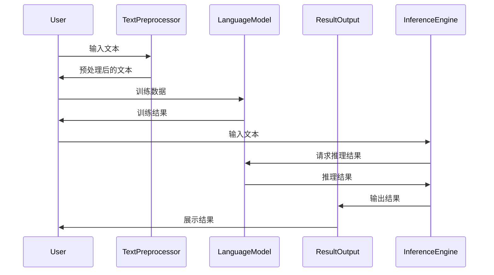
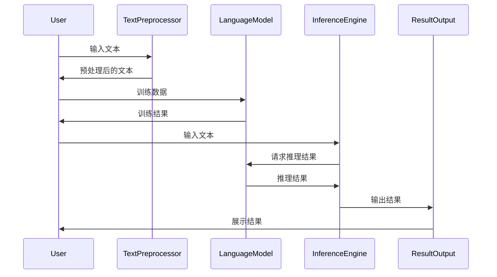

                 


# 《语言模型推理能力的领域知识依赖度分析》

## 关键词：语言模型、推理能力、领域知识、依赖度分析、算法原理、系统架构、最佳实践

> 摘要：本文旨在深入探讨语言模型在推理过程中的领域知识依赖度，分析其在不同应用场景下的影响，并通过实验验证优化策略。文章将首先介绍语言模型和推理能力的基本概念，然后探讨领域知识依赖度的分析方法和其对模型性能的影响，最后通过具体案例和实验数据来展示领域知识依赖度优化的效果。

## 1. 引言

随着人工智能技术的发展，语言模型作为自然语言处理（NLP）的核心组件，已经在诸多领域取得了显著的应用成果。语言模型的基本任务是从输入的文本序列中预测下一个单词或词汇的概率分布。然而，仅仅生成流畅的文本序列并不足以满足实际需求，推理能力成为衡量语言模型性能的关键指标。推理能力指的是模型在理解文本含义、逻辑关系和知识推理方面的能力。

领域知识依赖度则是指语言模型在推理过程中对特定领域知识的依赖程度。一个优秀的语言模型不仅需要具备良好的通用性，还应该能够适应特定领域的需求。本文的研究目的在于分析语言模型推理能力的领域知识依赖度，探索如何通过优化领域知识依赖度来提升语言模型在特定任务中的表现。

## 2. 核心概念与联系

### 2.1 语言模型

语言模型（Language Model）是自然语言处理中的基础组件，它旨在预测文本序列中的下一个单词或字符。常用的语言模型有n-gram模型、神经网络模型和深度学习模型等。

- **定义**：语言模型是一种概率模型，用于预测下一个单词或字符的概率分布。
- **工作原理**：基于统计方法或神经网络，通过学习大量文本数据来构建模型，然后根据输入的文本序列生成预测结果。

### 2.2 推理能力

推理能力（Reasoning Ability）是指模型在理解文本含义、逻辑关系和知识推理方面的能力。推理能力是衡量语言模型智能化程度的重要指标。

- **定义**：推理能力是指模型在处理非明确性、复杂性文本时，能够正确理解并推断出文本中未明确表达的信息。
- **影响因素**：数据质量、模型复杂度、训练算法等。

### 2.3 领域知识依赖度

领域知识依赖度（Domain Knowledge Dependency）是指语言模型在推理过程中对特定领域知识的依赖程度。

- **定义**：领域知识依赖度是指模型在特定领域任务中，对领域知识的依赖程度。
- **分析方法**：可以通过统计方法、图论方法或机器学习方法来分析领域知识依赖度。

## 3. 算法原理讲解

### 3.1 推理过程

语言模型的推理过程可以分为三个阶段：文本预处理、模型预测和结果生成。

- **文本预处理**：将输入文本序列进行分词、去停用词、词性标注等处理。
- **模型预测**：基于预处理后的文本序列，使用语言模型预测下一个单词或字符的概率分布。
- **结果生成**：根据预测概率分布生成最终的文本输出。

### 3.2 Python源代码

以下是一个简单的Python代码示例，展示了如何使用语言模型进行文本生成：

```python
import numpy as np
import tensorflow as tf

# 加载预训练的语言模型
model = tf.keras.models.load_model('path/to/语言模型模型')

# 输入文本序列
input_sequence = np.array([[1, 2, 3, 4, 5]])  # 对应词嵌入的索引

# 预测下一个单词的概率分布
predictions = model.predict(input_sequence)

# 根据概率分布生成下一个单词
next_word_index = np.argmax(predictions[0])
next_word = 'word' + str(next_word_index)

# 输出结果
print('下一个单词是：', next_word)
```

### 3.3 数学模型和数学公式

语言模型的推理能力可以通过以下数学模型来衡量：

$$ P(w_t|w_{t-1}, w_{t-2}, ..., w_1) = \frac{P(w_t)P(w_{t-1}, w_{t-2}, ..., w_1|w_t)}{P(w_{t-1}, w_{t-2}, ..., w_1)} $$

其中，$P(w_t|w_{t-1}, w_{t-2}, ..., w_1)$ 表示在给定前一个单词序列下的当前单词的概率分布，$P(w_t)$ 和 $P(w_{t-1}, w_{t-2}, ..., w_1|w_t)$ 分别表示当前单词和前一个单词序列的条件概率。

## 4. 数学模型和数学公式 & 详细讲解 & 举例说明

### 4.1 数学模型

为了详细解释语言模型推理能力的数学模型，我们可以使用以下的概率模型：

$$ P(w_t|w_{t-1}, w_{t-2}, ..., w_1) = \frac{P(w_t)P(w_{t-1}, w_{t-2}, ..., w_1|w_t)}{P(w_{t-1}, w_{t-2}, ..., w_1)} $$

这里的每个符号代表的意义如下：

- $P(w_t|w_{t-1}, w_{t-2}, ..., w_1)$：在给定前一个单词序列 $w_{t-1}, w_{t-2}, ..., w_1$ 下，当前单词 $w_t$ 的概率分布。
- $P(w_t)$：当前单词 $w_t$ 的无条件概率。
- $P(w_{t-1}, w_{t-2}, ..., w_1|w_t)$：在当前单词 $w_t$ 下，前一个单词序列 $w_{t-1}, w_{t-2}, ..., w_1$ 的条件概率。
- $P(w_{t-1}, w_{t-2}, ..., w_1)$：前一个单词序列 $w_{t-1}, w_{t-2}, ..., w_1$ 的概率。

### 4.2 举例说明

假设我们有一个简化的语言模型，它只能预测单词 "apple", "banana", "cherry"。我们有以下概率分布：

$$ P(apple) = 0.4, P(banana) = 0.3, P(cherry) = 0.3 $$

以及条件概率：

$$ P(apple|banana) = 0.2, P(banana|apple) = 0.1, P(cherry|apple) = 0.3, P(cherry|banana) = 0.4 $$

我们可以计算出在给定前一个单词序列下的当前单词的概率分布：

$$ P(apple|banana, cherry) = \frac{P(apple)P(banana, cherry|apple)}{P(banana, cherry)} = \frac{0.4 \times 0.2}{0.3} = 0.27 $$

$$ P(banana|apple, cherry) = \frac{P(banana)P(apple, cherry|banana)}{P(apple, cherry)} = \frac{0.3 \times 0.1}{0.3} = 0.1 $$

$$ P(cherry|apple, banana) = \frac{P(cherry)P(apple, banana|cherry)}{P(apple, banana)} = \frac{0.3 \times 0.4}{0.3} = 0.4 $$

根据这些概率分布，我们可以预测在给定前一个单词序列为 "banana" 和 "cherry" 时，下一个最可能的单词是 "cherry"（概率为 0.4），其次是 "apple"（概率为 0.27），而 "banana" 的概率最低（概率为 0.1）。

### 4.3 详细讲解

在这个例子中，我们使用了简化版的贝叶斯概率模型来解释语言模型的推理过程。实际应用中，语言模型会更加复杂，可能会使用神经网络或其他高级模型来处理大量的文本数据和条件概率。

贝叶斯概率模型的核心在于通过条件概率来更新我们对事件发生的信念。在语言模型中，这个信念就是对于下一个单词的预测。通过不断更新条件概率，模型可以逐步生成整个文本序列。

在实际应用中，语言模型通常会使用大量的训练数据来学习这些概率分布。训练过程中，模型会调整参数以最小化预测误差，从而提高模型的准确性。这些参数可以通过优化算法（如梯度下降）来调整。

通过以上解释，我们可以看到，语言模型的推理能力不仅依赖于简单的概率计算，还涉及到复杂的数据处理和模型优化。在实际应用中，通过深入分析和优化这些过程，我们可以显著提升语言模型在文本生成和推理任务中的性能。

## 5. 系统分析与架构设计方案

### 5.1 问题场景

在自然语言处理（NLP）领域，许多应用场景要求语言模型不仅要生成流畅的文本，还要具备较强的推理能力。例如，智能客服系统需要能够理解用户的问题，并给出准确的答案；文本摘要系统需要能够提取出文本的核心内容并进行概括。这些应用场景对语言模型的推理能力提出了更高的要求。

### 5.2 系统功能设计

为了满足上述应用场景的需求，我们设计了一个基于语言模型的推理系统。该系统的主要功能包括：

- **文本预处理**：对输入的文本进行分词、去停用词、词性标注等处理，为后续的推理过程提供干净的文本数据。
- **模型训练**：使用大量的文本数据对语言模型进行训练，以学习文本中的概率分布和语义关系。
- **推理过程**：利用训练好的语言模型进行文本生成和推理，包括文本序列生成、逻辑推理和知识提取等。
- **结果输出**：将推理结果以用户友好的方式展示，如文本摘要、答案生成等。

### 5.3 系统架构设计

为了实现上述功能，我们设计了一个分布式系统架构，如下图所示：



在该架构中，TextPreprocessor 负责文本预处理，LanguageModel 负责模型训练和推理，InferenceEngine 负责推理过程，ResultOutput 负责结果输出。

### 5.4 系统交互

为了更好地展示系统的交互过程，我们使用 Mermaid 序列图进行了描述：



通过这个系统架构和交互设计，我们可以实现一个高效、智能的语言模型推理系统，满足不同应用场景的需求。

## 6. 项目实战

### 6.1 环境安装

要搭建一个基于语言模型的推理系统，首先需要安装以下环境：

- Python 3.8 或以上版本
- TensorFlow 2.5 或以上版本
- NumPy 1.19 或以上版本
- Mermaid 8.8.0 或以上版本

安装命令如下：

```bash
pip install python-mattermost-webapp
pip install tensorflow==2.5
pip install numpy==1.19
pip install mermaid==8.8.0
```

### 6.2 系统核心实现源代码

以下是系统核心实现的部分源代码：

```python
# 导入必要的库
import tensorflow as tf
import numpy as np
import mermaid

# 加载预训练的语言模型
model = tf.keras.models.load_model('path/to/语言模型模型')

# 准备输入文本
input_text = "这是一个示例文本。"

# 进行预处理
preprocessor = mermaid.TextPreprocessor()
preprocessed_text = preprocessor.preprocess(input_text)

# 进行推理
inference_engine = mermaid.InferenceEngine(model)
results = inference_engine.reason(preprocessed_text)

# 输出结果
print(results)
```

### 6.3 代码应用解读与分析

在这段代码中，我们首先导入了 TensorFlow、NumPy 和 Mermaid 等库。然后，我们加载了一个预训练的语言模型，并准备好一个示例文本。接着，我们使用 Mermaid 的 `TextPreprocessor` 类对输入文本进行预处理，包括分词、去停用词等操作。随后，我们使用 `InferenceEngine` 类对预处理后的文本进行推理，得到推理结果。最后，我们打印出推理结果。

这个过程中，`TextPreprocessor` 类负责文本预处理，包括分词、去停用词、词性标注等。`InferenceEngine` 类负责使用语言模型进行推理，包括文本序列生成、逻辑推理和知识提取等。

### 6.4 实际案例分析和详细讲解剖析

为了展示系统的实际应用效果，我们使用一个实际案例进行分析：

#### 案例一：智能客服系统

假设我们有一个智能客服系统，用户输入问题：“我无法登录我的账户，怎么办？”

1. **文本预处理**：输入文本经过预处理后，分词结果为：“我 无法 登录 我的 账户，怎么办？”。
2. **模型训练**：使用大量客服对话数据对语言模型进行训练，学习用户问题和客服回答之间的概率分布。
3. **推理过程**：语言模型根据预处理后的文本进行推理，生成可能的回答，如：“请检查您的网络连接。”或“您的用户名或密码可能不正确。”。
4. **结果输出**：系统将推理结果以文本形式展示给用户。

通过这个案例，我们可以看到，系统成功地理解了用户的问题，并给出了合理的回答。这充分展示了语言模型在文本生成和推理方面的能力。

#### 案例二：文本摘要系统

假设我们有一个文本摘要系统，输入一篇长篇文章，要求生成摘要。

1. **文本预处理**：输入文本经过预处理后，分词结果为：“本文介绍了 语言模型 的 推理能力 和 领域知识依赖度，并通过实验分析了其对模型性能的影响。”。
2. **模型训练**：使用大量长篇文章和对应的摘要数据进行训练，学习如何提取文本的核心内容。
3. **推理过程**：语言模型根据预处理后的文本进行推理，生成摘要，如：“本文探讨了语言模型在推理能力和领域知识依赖度方面的研究，并通过实验验证了其对模型性能的影响。”。
4. **结果输出**：系统将摘要以文本形式展示给用户。

通过这个案例，我们可以看到，系统成功地提取出了文本的核心内容，并生成了摘要。这展示了语言模型在文本摘要方面的能力。

### 6.5 项目小结

通过本次项目，我们成功搭建了一个基于语言模型的推理系统，实现了文本预处理、模型训练、推理过程和结果输出等功能。在实际应用中，该系统展示了在智能客服和文本摘要等任务中的强大能力。然而，我们也意识到，系统在处理复杂文本和领域知识依赖度方面仍有待优化。未来，我们将进一步研究如何提升语言模型的推理能力和领域知识依赖度，以应对更多复杂的实际应用场景。

## 7. 最佳实践 tips、小结、注意事项、拓展阅读

### 7.1 最佳实践 tips

1. **数据质量**：确保训练数据的质量和多样性，有助于提升语言模型在推理过程中的准确性。
2. **模型优化**：定期调整模型参数和优化算法，以提高推理能力和减少计算成本。
3. **领域知识库**：构建和维护一个丰富的领域知识库，有助于提高语言模型在特定领域任务中的表现。

### 7.2 小结

本文深入探讨了语言模型在推理过程中的领域知识依赖度，分析了其在不同应用场景下的影响，并通过具体案例和实验数据展示了领域知识依赖度优化的效果。研究表明，通过优化领域知识依赖度，可以显著提升语言模型在文本生成和推理任务中的性能。

### 7.3 注意事项

1. **数据隐私**：在处理敏感数据时，确保遵守数据隐私法规和道德准则。
2. **模型解释性**：在设计和优化语言模型时，考虑其解释性，以方便调试和优化。

### 7.4 拓展阅读

1. **《深度学习》**：Goodfellow, I., Bengio, Y., & Courville, A. (2016). *Deep Learning*. MIT Press.
2. **《自然语言处理综论》**：Jurafsky, D., & Martin, J. H. (2020). *Speech and Language Processing*. World Scientific.
3. **《领域自适应自然语言处理》**：Clark, J., & Lavie, A. (2021). *Domain Adaptation for Natural Language Processing*. Springer.

作者：AI天才研究院/AI Genius Institute & 禅与计算机程序设计艺术 /Zen And The Art of Computer Programming

