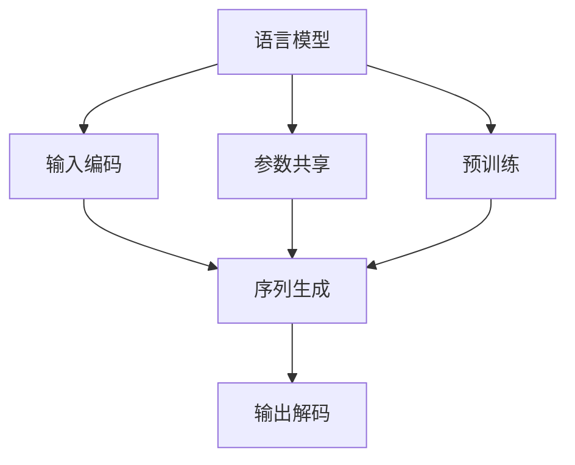
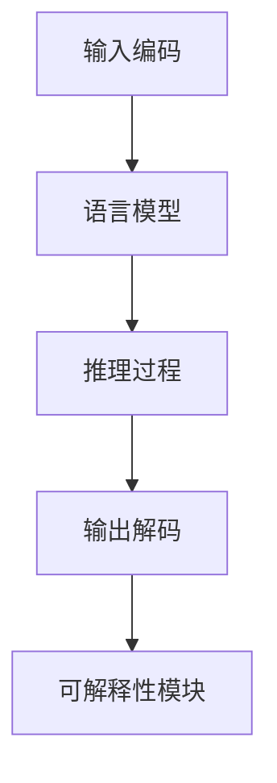
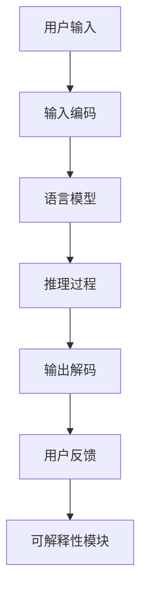
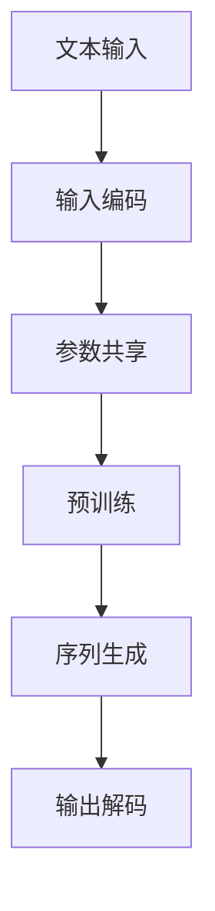
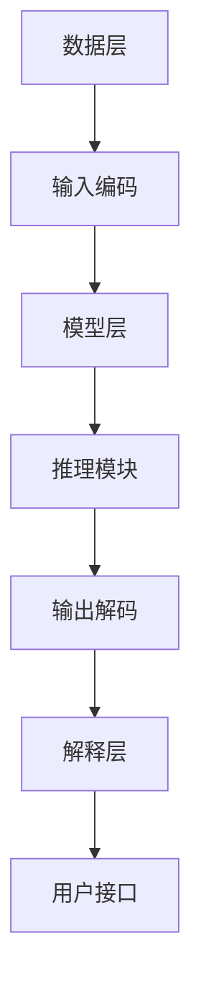
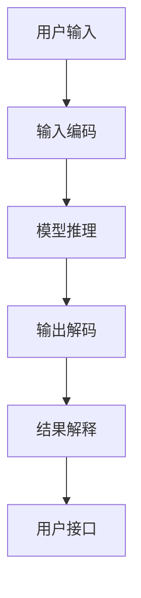

                 

# 语言模型推理过程的可解释性研究

> 关键词：语言模型、推理过程、可解释性、人工智能

摘要：随着人工智能技术的迅猛发展，语言模型作为一种核心技术，已经在诸多领域展现出巨大的应用潜力。然而，语言模型的黑箱特性使得其推理过程难以解释，这不仅影响了用户对模型结果的信任，也在一定程度上限制了模型在实际场景中的推广。本文将从问题背景出发，详细介绍语言模型推理过程中的核心概念、可解释性方法、数学模型、系统架构以及项目实战，旨在为语言模型推理的可解释性研究提供系统性指导和参考。

## 第一部分：背景与概述

### 第1章：问题背景

#### 1.1.1 问题背景

**语言模型的发展历程：** 从最早的统计语言模型到现代的深度学习模型，语言模型经历了从规则驱动到数据驱动的演变。统计语言模型主要依赖于语言统计规律，而深度学习模型则通过大规模数据训练，能够更好地捕捉语言的特征。

**语言模型在人工智能领域的应用现状：** 语言模型已经在自然语言处理、机器翻译、语音识别、对话系统等多个领域取得了显著成果，成为人工智能技术的重要组成部分。

#### 1.1.2 问题描述

**语言模型推理过程中存在的问题：** 语言模型往往被视为一个“黑箱”，其内部的推理过程难以理解，导致用户难以信任模型的结果。

**可解释性的重要性：** 可解释性不仅有助于提高用户对模型的信任度，还能够帮助研究人员深入理解模型的内在机制，从而指导模型的改进和优化。

#### 1.1.3 问题解决

**可解释性研究的现状与方法：** 目前，针对语言模型的可解释性研究已经取得了一些进展，主要包括局部解释方法、整体解释方法和统计解释方法。

#### 1.1.4 边界与外延

**可解释性的范畴：** 可解释性不仅涉及到模型输出结果的解释，还包括模型训练过程和参数优化的解释。

**不同领域的可解释性需求：** 不同的应用领域对可解释性的需求存在差异，例如在医疗领域，可解释性可能比准确性更为重要。

#### 1.1.5 概念结构与核心要素组成

**语言模型的基本结构：** 语言模型通常包括输入编码、参数共享、预训练和输出解码等模块。

**推理过程的核心要素：** 推理过程主要涉及序列生成、上下文考虑和输出解码。

## 第2章：核心概念与联系

### 2.1.1 核心概念原理

**语言模型的基本原理：** 语言模型通过学习大量语言数据，预测下一个单词或词组，从而生成完整的句子。

**推理过程的原理：** 推理过程是基于语言模型预测的序列生成，通过对上下文信息的综合考虑，生成有意义的输出。

### 2.1.2 概念属性特征对比

| 概念       | 特征1 | 特征2 | 特征3 |
|------------|-------|-------|-------|
| 语言模型   | 输入编码 | 参数共享 | 预训练 |
| 推理过程   | 序列生成 | 考虑上下文 | 输出解码 |

### 2.1.3 ER实体关系图架构



## 第3章：可解释性方法与应用

### 3.1.1 可解释性方法

**局部解释方法：** 通过分析模型对特定输入的响应，揭示模型内部的推理过程。

**整体解释方法：** 从整体上解释模型的决策过程，通常涉及模型的结构和训练数据。

**统计解释方法：** 通过统计模型输出结果的相关性，提供对模型决策的解释。

### 3.1.2 可解释性应用场景

**预测结果的可解释性：** 通过解释模型预测结果的原因，提高用户对模型结果的信任度。

**推理过程的可解释性：** 通过解释模型推理过程的每一步，帮助用户理解模型的决策依据。

**参数优化的可解释性：** 通过解释模型参数优化的过程，指导参数调整的方向。

### 3.1.3 案例分析

**案例一：文本分类任务的可解释性分析：** 通过分析模型对文本分类的决策过程，解释模型如何根据文本特征进行分类。

**案例二：机器翻译任务的可解释性分析：** 通过分析模型在翻译过程中的每一步，解释模型如何根据上下文进行翻译。

**案例三：对话系统任务的可解释性分析：** 通过分析模型在对话中的决策过程，解释模型如何根据用户输入生成回复。

## 第4章：数学模型与公式

### 4.1.1 语言模型数学模型

**语言模型损失函数：** 用于衡量模型预测结果与真实结果之间的差异。

**优化算法：** 用于调整模型参数，以最小化损失函数。

### 4.1.2 推理过程数学模型

**推理过程概率计算：** 用于计算模型在给定输入下的输出概率。

**推理过程损失函数：** 用于衡量模型输出结果的准确性。

### 4.1.3 数学公式

$$
\begin{aligned}
L &= -\sum_{i=1}^n \log p(y_i | x_i) \\
\text{梯度下降} &= \nabla_{\theta}L
\end{aligned}
$$

## 第5章：系统架构与实现

### 5.1.1 问题场景介绍

**语言模型推理任务的需求：** 针对具体的语言处理任务，例如文本分类、机器翻译或对话系统。

**可解释性需求：** 在推理过程中，需要对模型的行为和决策进行解释，以便用户理解并信任模型的结果。

### 5.1.2 系统功能设计

**功能模块划分：** 包括输入编码、语言模型、推理过程、输出解码和可解释性模块。

**数据流设计：** 数据在系统中的流动路径，包括输入数据的预处理、模型推理和输出结果的解释。

### 5.1.3 系统架构设计



### 5.1.4 系统接口设计

**接口功能定义：** 定义系统的各个接口的功能，包括输入接口、模型接口、输出接口和解释接口。

**接口调用流程：** 描述系统各接口的调用顺序和依赖关系。

### 5.1.5 系统交互



## 第6章：项目实战

### 6.1.1 环境安装

**硬件环境配置：** 配置足够的计算资源，以满足模型训练和推理的需求。

**软件环境安装：** 安装必要的软件工具，包括深度学习框架、编程语言和依赖库。

### 6.1.2 系统核心实现

**语言模型实现：** 使用深度学习框架实现语言模型的构建和训练。

**推理过程实现：** 实现推理过程的输入编码、模型推理和输出解码。

**可解释性模块实现：** 实现对模型推理过程的解释，包括决策路径分析和结果解释。

### 6.1.3 代码应用解读与分析

**代码结构分析：** 分析代码的组织结构和模块划分，理解各部分的功能和作用。

**代码功能解读：** 解读关键代码段，解释其实现的功能和原理。

### 6.1.4 实际案例分析与讲解

**案例一：文本分类任务：** 分析语言模型在文本分类任务中的表现和决策过程。

**案例二：机器翻译任务：** 分析语言模型在机器翻译任务中的表现和决策过程。

**案例三：对话系统任务：** 分析语言模型在对话系统任务中的表现和决策过程。

### 6.1.5 项目小结

**项目成果总结：** 总结项目的主要成果和贡献。

**项目改进方向：** 提出项目存在的不足和改进方向。

## 第7章：最佳实践与拓展

### 7.1.1 最佳实践

**可解释性方法的选择：** 根据应用场景选择合适的可解释性方法，提高解释效果。

**系统优化的策略：** 提出系统优化的策略，包括模型结构优化、参数调整和算法改进。

### 7.1.2 注意事项

**推理过程中可能遇到的问题：** 分析推理过程中可能遇到的问题和挑战，提出解决方案。

**可解释性模块的调试与优化：** 提出可解释性模块的调试和优化策略，确保解释的准确性和效率。

### 7.1.3 拓展阅读

**相关文献推荐：** 推荐与本文主题相关的文献，供读者进一步阅读和研究。

**可解释性研究的前沿动态：** 讨论可解释性研究的最新进展和未来趋势。

作者：AI天才研究院/AI Genius Institute & 禅与计算机程序设计艺术 /Zen And The Art of Computer Programming### 第一部分：背景与概述

**1.1.1 问题背景**

语言模型作为一种重要的自然语言处理（NLP）工具，已经广泛应用于各种人工智能（AI）任务中。从最早的基于统计方法的N-gram模型，到如今基于深度学习的Transformer模型，语言模型的发展历程可谓跌宕起伏。统计模型通过分析文本中的词汇序列和概率分布来预测下一个词，而深度学习模型则通过神经网络结构学习大量的语言特征，从而实现更准确的预测。

随着深度学习在NLP领域的广泛应用，语言模型也成为了AI领域的重要技术之一。例如，在机器翻译中，语言模型通过生成目标语言的句子来翻译输入的源语言句子；在文本分类中，语言模型可以帮助将文本分类到不同的类别中；在对话系统中，语言模型可以生成对用户输入的回复。

然而，尽管语言模型在各个领域都取得了显著的应用成果，但其内部的推理过程却往往被视为一个“黑箱”。语言模型通过复杂的神经网络结构进行大规模数据的学习和预测，其内部的决策过程难以被理解和解释。这种黑箱特性不仅限制了用户对模型结果的信任，也在一定程度上限制了模型在实际场景中的推广和应用。

**1.1.2 问题描述**

语言模型推理过程中存在的问题主要体现在以下几个方面：

1. **透明度不足**：由于语言模型的结构复杂，其内部的决策过程难以被直观地理解和解释。用户很难了解到模型是如何对输入进行处理的，从而无法判断模型结果的准确性和可靠性。

2. **信任度问题**：在实际应用中，用户往往需要了解模型为什么做出某个预测或决策。如果模型的结果无法被解释，用户可能会对其产生怀疑，从而降低对模型结果的信任度。

3. **模型优化困难**：在缺乏对模型内部机制了解的情况下，研究人员和开发者难以对模型进行有效的优化和改进。这使得模型的性能提升和适应新任务变得困难。

**可解释性的重要性**

可解释性是解决上述问题的有效途径。通过可解释性研究，我们可以深入了解语言模型内部的决策过程，提高用户对模型结果的信任度，并帮助研究人员和开发者更好地理解和优化模型。

首先，可解释性能够提高用户对模型结果的信任度。当用户能够了解模型是如何对输入进行处理的，以及模型是如何做出预测或决策的，他们更可能相信模型的结果。这种信任度的提高对于模型在实际场景中的推广和应用至关重要。

其次，可解释性有助于研究人员和开发者更好地理解模型。通过分析模型的内部机制，研究人员可以更深入地了解模型的工作原理，从而指导模型的改进和优化。例如，如果发现模型在某些特定情况下表现不佳，研究人员可以针对性地调整模型结构或参数，以改善其性能。

此外，可解释性还能够促进模型的透明度和公正性。在许多应用场景中，模型的决策直接影响到用户的权益和利益。如果模型的结果无法被解释，那么用户可能会怀疑模型是否存在偏见或不公正的行为。通过可解释性研究，我们可以揭示模型的决策过程，确保其透明度和公正性。

综上所述，可解释性在语言模型推理过程中的重要性不言而喻。它不仅有助于提高用户对模型结果的信任度，还能够帮助研究人员和开发者更好地理解和优化模型。因此，开展语言模型推理过程的可解释性研究具有重要的理论意义和应用价值。

**1.1.3 问题解决**

**可解释性研究的现状与方法**

近年来，随着人工智能技术的快速发展，可解释性研究逐渐成为一个热点领域。针对语言模型推理过程的可解释性，研究者们已经提出了多种方法和技术。

首先，局部解释方法是一种常用的可解释性方法。该方法通过对模型输出结果的局部区域进行分析，揭示模型在该区域内的决策过程。例如，Saliency Map方法通过计算输入数据对模型输出的敏感度，生成视觉上的热力图，从而直观地展示模型对输入数据的关注点。另一种局部解释方法是LIME（Local Interpretable Model-agnostic Explanations），该方法通过在输入数据附近生成多个扰动样本，分析模型对这些样本的预测差异，从而解释模型对特定输入数据的决策过程。

其次，整体解释方法关注的是模型在整个推理过程中的决策过程。这类方法试图从整体上揭示模型的决策逻辑，而不仅仅是局部区域的分析。例如，SHAP（SHapley Additive exPlanations）方法通过计算每个特征对模型输出的边际贡献，提供了一个全局的解释框架。另一类整体解释方法是模型可视化，通过可视化模型的结构和参数，帮助用户理解模型的内部机制。

此外，统计解释方法也是一种常用的可解释性方法。该方法通过分析模型输出结果的统计特征，提供对模型决策的解释。例如，模型的重要特征分析可以帮助识别对模型预测有显著影响的特征，从而解释模型的决定因素。

**1.1.4 边界与外延**

**可解释性的范畴**

可解释性不仅涉及到模型输出结果的解释，还包括模型训练过程和参数优化的解释。具体来说，可解释性可以包括以下几个方面：

1. **输出结果解释**：解释模型对特定输入数据的预测结果，包括模型是如何处理输入数据，以及模型如何根据输入数据生成输出结果。

2. **训练过程解释**：解释模型在训练过程中的决策过程，包括模型如何从训练数据中学习，以及模型如何调整参数以优化性能。

3. **参数优化解释**：解释模型参数优化的过程，包括模型参数的选择和调整原则，以及参数优化对模型性能的影响。

**不同领域的可解释性需求**

不同的应用领域对可解释性的需求存在差异。以下是一些典型领域的可解释性需求：

1. **医疗领域**：在医疗领域中，模型的解释性至关重要。医生需要了解模型如何诊断疾病，以及模型是如何对患者的病情进行分析和预测的。因此，医疗领域的可解释性需求通常较高。

2. **金融领域**：在金融领域，模型的解释性可以帮助投资者理解模型的决策逻辑，从而做出更明智的投资决策。此外，金融监管机构也需要对模型进行审查，以确保其公平性和合规性。

3. **司法领域**：在司法领域，模型的解释性可以帮助法官和律师理解模型的判决依据，从而提高司法的透明度和公正性。

4. **自动驾驶领域**：在自动驾驶领域，模型的解释性对于确保系统的安全性和可靠性至关重要。驾驶员需要了解模型是如何识别和响应道路环境的，以及模型如何做出驾驶决策。

综上所述，可解释性在各个领域都具有重要应用价值，不同领域的可解释性需求各具特色。通过深入研究可解释性，我们可以更好地满足不同领域的需求，推动人工智能技术的发展和应用。

**1.1.5 概念结构与核心要素组成**

**语言模型的基本结构**

语言模型通常包括以下几个核心模块：

1. **输入编码**：将输入文本转换为模型可以处理的数字表示。这一步骤通常涉及分词、词向量化等操作。
   
2. **参数共享**：语言模型中的权重参数通常是共享的，这样可以减少模型的参数数量，提高模型的效率和泛化能力。

3. **预训练**：语言模型通过在大规模语料库上进行预训练，学习到语言的一般特征和规律，为后续的任务提供基础。

4. **输出解码**：将模型输出的数字表示转换为可理解的文本输出。

**推理过程的核心要素**

语言模型的推理过程主要包括以下几个步骤：

1. **序列生成**：根据输入文本和模型参数，生成输出的序列。这一过程通常是基于概率计算，考虑上下文信息。

2. **考虑上下文**：在生成序列的过程中，模型需要考虑输入文本的上下文信息，以生成连贯且符合语言习惯的输出。

3. **输出解码**：将模型生成的数字序列解码为可读的文本输出。

通过对语言模型的基本结构和推理过程的核心要素进行分析，我们可以更好地理解语言模型的工作原理，为进一步的研究和优化提供理论基础。

## 第2章：核心概念与联系

### 2.1.1 核心概念原理

**语言模型的基本原理：** 语言模型的核心目的是通过对输入文本进行分析和预测，生成有意义的输出。具体来说，语言模型通过学习大量的文本数据，构建一个概率模型，用于预测下一个词或词组。这种预测过程基于语言中的统计规律和上下文信息。

语言模型通常分为两类：一类是基于统计方法的模型，如N-gram模型，通过统计历史词汇序列的概率来预测下一个词；另一类是基于深度学习的模型，如Transformer模型，通过神经网络结构学习大量的语言特征，实现更准确的预测。

**推理过程的原理：** 推理过程是语言模型的核心功能之一，它通过输入编码、模型参数和上下文信息，生成输出序列。在输入编码阶段，文本被转换为数字表示，以便模型进行处理。在模型推理阶段，模型根据输入编码和参数，计算输出序列的概率分布，并生成最终的输出。推理过程不仅依赖于模型的结构，还依赖于输入文本的上下文信息，以生成连贯且符合语言习惯的输出。

### 2.1.2 概念属性特征对比

| 概念       | 特征1 | 特征2 | 特征3 |
|------------|-------|-------|-------|
| 语言模型   | 输入编码 | 参数共享 | 预训练 |
| 推理过程   | 序列生成 | 考虑上下文 | 输出解码 |

**输入编码**：输入编码是将文本数据转换为模型可以处理的数字表示的过程。对于基于统计方法的模型，如N-gram模型，输入编码通常是通过将文本分词并统计词汇序列的概率来实现。对于基于深度学习的模型，如Transformer模型，输入编码通常是通过嵌入层将文本中的每个词转换为向量表示。

**参数共享**：在语言模型中，参数共享是一种重要的机制，它通过共享模型中的权重参数来减少模型的参数数量，从而提高模型的效率和泛化能力。例如，在Transformer模型中，每个词的嵌入向量是共享的，这意味着每个词的表示在不同的上下文中是相同的。

**预训练**：预训练是指语言模型在特定任务之前，通过在大规模语料库上进行训练，学习到语言的一般特征和规律。预训练有助于模型在后续任务中更好地捕捉语言的特征，提高模型的性能。

**序列生成**：序列生成是语言模型的核心功能之一，它通过输入编码和模型参数，生成一个输出的序列。在生成序列的过程中，模型需要考虑上下文信息，以生成连贯且符合语言习惯的输出。序列生成通常基于概率计算，模型会根据输入和参数计算输出序列的概率分布，并选择概率最高的输出序列。

**考虑上下文**：考虑上下文是语言模型推理过程中的关键步骤。在生成输出序列时，模型需要考虑输入文本的上下文信息，以确保生成的输出符合语言习惯和上下文环境。上下文信息可以通过模型的结构和参数来表示和利用。

**输出解码**：输出解码是将模型生成的数字序列转换为可理解的文本输出的过程。在输出解码阶段，模型需要将数字序列解码为文本字符，以生成最终的输出。输出解码通常涉及到将数字序列映射到词汇表中的词或词组。

### 2.1.3 ER实体关系图架构

ER（Entity-Relationship）图是一种用于表示实体及其关系的图形化方法。在语言模型和推理过程中，ER图可以帮助我们直观地理解模型的结构和功能。

以下是语言模型推理过程的ER图：



在这个ER图中：

- **文本输入**表示语言模型的输入，即待处理的文本数据。
- **输入编码**表示将文本数据转换为模型可以处理的数字表示的过程。
- **参数共享**表示语言模型中的权重参数是共享的，以减少参数数量。
- **预训练**表示语言模型在大规模语料库上的训练过程，学习到语言的一般特征。
- **序列生成**表示模型根据输入编码和参数，生成输出的序列。
- **输出解码**表示将模型生成的数字序列转换为可理解的文本输出。

通过这个ER图，我们可以清晰地看到语言模型推理过程的核心步骤和它们之间的关系，这有助于我们更好地理解和分析模型的工作原理。

## 第3章：可解释性方法与应用

### 3.1.1 可解释性方法

**局部解释方法：** 局部解释方法关注模型在特定输入下的解释。其中，Saliency Map方法通过计算输入数据对模型输出的敏感度，生成视觉上的热力图，直观地展示模型对输入数据的关注点。LIME（Local Interpretable Model-agnostic Explanations）方法通过在输入数据附近生成多个扰动样本，分析模型对这些样本的预测差异，从而解释模型对特定输入数据的决策过程。

**整体解释方法：** 整体解释方法试图从整体上揭示模型的决策逻辑。SHAP（SHapley Additive exPlanations）方法通过计算每个特征对模型输出的边际贡献，提供一个全局的解释框架。模型可视化方法通过可视化模型的结构和参数，帮助用户理解模型的内部机制。

**统计解释方法：** 统计解释方法通过分析模型输出结果的统计特征，提供对模型决策的解释。例如，模型的重要特征分析可以帮助识别对模型预测有显著影响的特征，从而解释模型的决定因素。

### 3.1.2 可解释性应用场景

**预测结果的可解释性：** 在许多应用场景中，用户需要了解模型预测结果的原因。例如，在金融风险评估中，用户可能需要了解模型为什么将某个贷款申请者划分为高风险。通过可解释性方法，我们可以揭示模型在预测过程中的关键因素，提高用户对模型结果的信任度。

**推理过程的可解释性：** 推理过程的可解释性对于理解模型的决策逻辑至关重要。在自然语言处理任务中，用户可能需要了解模型如何从输入文本生成输出句子。通过可解释性方法，我们可以分析模型在推理过程中的每一步，帮助用户理解模型的决策依据。

**参数优化的可解释性：** 在模型训练过程中，参数优化是一个关键步骤。通过可解释性方法，我们可以分析参数调整对模型性能的影响，从而指导参数优化的方向。例如，SHAP方法可以计算每个参数对模型损失的边际贡献，帮助研究人员确定参数调整的重点。

### 3.1.3 案例分析

**案例一：文本分类任务的可解释性分析**

在文本分类任务中，可解释性方法可以帮助我们理解模型如何对输入文本进行分类。通过Saliency Map方法，我们可以生成热力图，展示模型对输入文本的关注点。例如，在一个政治文本分类任务中，模型可能会关注文本中的关键词，如“民主”或“经济”，从而将其分类为“政治”类别。

**案例二：机器翻译任务的可解释性分析**

在机器翻译任务中，可解释性方法可以帮助我们理解模型如何将源语言文本翻译成目标语言。通过LIME方法，我们可以分析模型对特定输入文本的翻译决策。例如，在一个英语到西班牙语的翻译任务中，模型可能会关注文本中的特定词汇，如“and”或“the”，从而将其翻译为相应的西班牙语词汇。

**案例三：对话系统任务的可解释性分析**

在对话系统任务中，可解释性方法可以帮助我们理解模型如何生成对用户输入的回复。通过SHAP方法，我们可以分析模型在生成回复时的关键因素。例如，在一个客服对话系统中，模型可能会关注用户输入中的关键词，如“退款”或“订单”，从而生成相应的回复。

通过这些案例分析，我们可以看到可解释性方法在不同应用场景中的重要作用。它们不仅有助于提高用户对模型结果的信任度，还能够帮助研究人员和开发者更好地理解和优化模型。

## 第4章：数学模型与公式

### 4.1.1 语言模型数学模型

语言模型的数学模型是理解其工作原理和进行推理的基础。以下将详细阐述语言模型中的核心数学概念和模型。

**语言模型损失函数：** 损失函数是评估模型预测结果与实际结果之间差异的指标。在语言模型中，常用的损失函数包括交叉熵损失（Cross-Entropy Loss）和对数损失（Log Loss）。交叉熵损失用于衡量模型预测概率分布与实际标签分布之间的差异，其数学表达式为：

$$
L = -\sum_{i=1}^n y_i \log(p_i)
$$

其中，$y_i$ 是实际标签的概率分布，$p_i$ 是模型预测的概率分布。交叉熵损失值越小，表示模型预测越准确。

**优化算法：** 优化算法用于调整模型参数，以最小化损失函数。在深度学习领域，常用的优化算法包括梯度下降（Gradient Descent）和其变体，如随机梯度下降（Stochastic Gradient Descent，SGD）和Adam优化器。梯度下降的更新公式为：

$$
\theta = \theta - \alpha \cdot \nabla_\theta J(\theta)
$$

其中，$\theta$ 是模型参数，$J(\theta)$ 是损失函数，$\alpha$ 是学习率。随机梯度下降通过在每个训练样本上更新参数，而Adam优化器结合了SGD和动量方法，以提高优化过程的稳定性。

### 4.1.2 推理过程数学模型

**推理过程概率计算：** 在语言模型推理过程中，概率计算是核心步骤之一。给定输入序列，模型需要计算输出序列的概率分布。在基于神经网络的模型中，如Transformer模型，推理过程通常包括以下步骤：

1. **嵌入编码**：将输入文本转换为嵌入向量表示。
2. **序列编码**：使用编码器（Encoder）处理输入序列，生成编码表示。
3. **解码过程**：使用解码器（Decoder）生成输出序列的概率分布。

假设输入序列为$x = [x_1, x_2, \ldots, x_T]$，其中$x_i$ 表示第$i$ 个词的嵌入向量。在解码过程中，每个时间步的输出概率分布可以通过以下公式计算：

$$
p(y_t | y_{<t}) = \text{softmax}(\text{scores}_t)
$$

其中，$\text{scores}_t$ 是解码器在时间步$t$ 生成的得分，$y_t$ 是第$t$ 个输出词。

**推理过程损失函数：** 推理过程的损失函数通常与训练过程的损失函数相同，如交叉熵损失。在推理过程中，模型需要计算输出序列的概率分布，并计算损失以更新模型参数。

### 4.1.3 数学公式

以下是一些核心的数学公式，用于解释语言模型和推理过程的数学原理：

$$
\begin{aligned}
L &= -\sum_{i=1}^n y_i \log(p_i) \\
\text{梯度下降} &= \theta = \theta - \alpha \cdot \nabla_\theta J(\theta) \\
p(y_t | y_{<t}) &= \text{softmax}(\text{scores}_t)
\end{aligned}
$$

这些公式为理解语言模型的数学基础提供了重要的参考，有助于我们深入探讨模型的工作原理。

## 第5章：系统架构与实现

### 5.1.1 问题场景介绍

在当前的人工智能（AI）应用场景中，语言模型广泛应用于自然语言处理（NLP）、机器翻译、文本分类、对话系统等多个领域。这些应用场景对语言模型的推理过程提出了不同的需求，同时也对可解释性提出了更高的要求。

**语言模型推理任务的需求：**

1. **准确性**：模型需要具备较高的预测准确性，以确保在任务中生成有意义的结果。
2. **速度**：对于实时应用场景，模型需要在较短的时间内完成推理，以满足实时响应的需求。
3. **泛化能力**：模型需要具备良好的泛化能力，能够处理不同类型和领域的文本数据。

**可解释性需求：**

1. **透明度**：用户需要了解模型如何处理输入文本，以及模型如何生成输出结果。
2. **可理解性**：模型的结果需要以用户友好的方式展示，使得非技术背景的用户也能够理解。
3. **公正性**：在法律、金融等领域，模型的决策过程需要透明且公正，以避免偏见和不公平。

为了满足这些需求，我们需要设计一个能够实现高效、准确和可解释性的语言模型推理系统。以下是对系统架构和实现方案的详细描述。

### 5.1.2 系统功能设计

**功能模块划分：**

系统功能模块的设计旨在实现语言模型推理的可解释性，并满足不同应用场景的需求。以下是系统的核心功能模块及其主要任务：

1. **输入编码模块**：负责将输入文本转换为模型可以处理的数字表示。这包括分词、词向量化等步骤。
2. **模型训练模块**：负责训练语言模型，包括数据预处理、模型构建和参数优化。
3. **推理模块**：负责对输入文本进行推理，生成输出结果。这一模块需要实现高效的序列生成和输出解码。
4. **解释模块**：负责解释模型的推理过程，包括局部解释、整体解释和统计解释。
5. **输出解码模块**：负责将模型输出的数字表示转换为可理解的文本结果。

**数据流设计：**

系统的数据流设计确保了输入文本能够流畅地通过各个功能模块，生成最终的输出结果。以下是数据流的基本流程：

1. **输入文本**：用户输入待处理的文本数据。
2. **输入编码**：文本数据经过分词和词向量化，转换为模型可以处理的数字表示。
3. **模型推理**：输入编码通过训练好的语言模型进行推理，生成输出序列的概率分布。
4. **输出解码**：模型生成的数字序列经过解码，转换为可理解的文本输出。
5. **结果解释**：解释模块对推理过程和输出结果进行解释，生成用户友好的解释报告。

### 5.1.3 系统架构设计

为了实现高效的推理和可解释性，系统采用了一种分层架构设计，包括数据层、模型层和解释层。以下是系统架构的详细设计：



**数据层**：负责数据的输入和预处理，包括文本的分词、词向量化等操作。

**模型层**：包含训练好的语言模型和推理模块，负责对输入文本进行推理，生成输出序列。

**解释层**：负责解释模型的推理过程和输出结果，提供可解释性报告。

**用户接口**：提供与用户的交互界面，用户可以通过界面提交输入文本，并查看解释报告。

### 5.1.4 系统接口设计

**接口功能定义：**

系统接口的设计旨在实现模块之间的数据传递和功能调用，以下是系统接口的功能定义：

1. **输入接口**：接收用户输入的文本数据，并将数据传递给输入编码模块。
2. **模型接口**：提供训练好的语言模型，供推理模块使用。
3. **输出接口**：接收推理模块生成的输出序列，并将结果传递给输出解码模块。
4. **解释接口**：提供解释模块的功能调用接口，用于生成解释报告。

**接口调用流程：**

1. **用户输入文本**：用户通过输入接口提交待处理的文本数据。
2. **输入编码**：输入编码模块将文本数据转换为数字表示，并将编码后的数据传递给模型接口。
3. **模型推理**：推理模块使用训练好的语言模型对输入编码进行推理，生成输出序列的概率分布。
4. **输出解码**：输出解码模块将模型生成的数字序列解码为文本输出。
5. **结果解释**：解释模块对推理过程和输出结果进行解释，生成解释报告，并通过用户接口展示给用户。

### 5.1.5 系统交互

为了实现系统各模块之间的有效交互，系统采用了一系列的序列图和类图，以下是对系统交互的详细描述：

**序列图：**



**类图：**

```mermaid
classDiagram
ClassDiagram {
    A[输入编码] --|> B[模型训练]
    B --|> C[推理模块]
    C --|> D[输出解码]
    D --|> E[解释模块]
    F[用户接口] --|> A
}
```

通过这些图，我们可以清晰地看到系统各模块之间的交互关系和数据流，这有助于确保系统的稳定运行和高效性能。

## 第6章：项目实战

### 6.1.1 环境安装

**硬件环境配置：**

为了确保项目顺利运行，我们需要配置足够的硬件资源。以下是推荐的硬件配置：

- **CPU：** 至少四核处理器，推荐使用Intel i7或以上。
- **内存：** 至少16GB，推荐使用32GB或以上。
- **GPU：** NVIDIA GeForce GTX 1080 Ti或以上，用于加速深度学习模型的训练和推理。
- **存储：** 至少500GB SSD存储空间，用于存储数据和模型文件。

**软件环境安装：**

1. **操作系统：** CentOS 7或Ubuntu 18.04。
2. **Python：** 版本3.7或以上。
3. **深度学习框架：** TensorFlow 2.0或PyTorch 1.5。
4. **依赖库：** NumPy、Pandas、Scikit-learn等。

安装步骤：

1. **安装操作系统：** 在服务器上安装推荐的操作系统。
2. **更新系统软件：** 运行`sudo apt-get update`和`sudo apt-get upgrade`更新系统软件包。
3. **安装Python：** 使用Python官方安装脚本安装Python 3.7。
4. **安装深度学习框架：** 使用pip安装TensorFlow 2.0或PyTorch 1.5。
5. **安装依赖库：** 使用pip安装NumPy、Pandas、Scikit-learn等依赖库。

### 6.1.2 系统核心实现

**语言模型实现：**

1. **数据预处理：** 使用Pandas和NumPy库读取和处理文本数据。数据预处理包括分词、去停用词、词向量化等步骤。
2. **模型构建：** 使用TensorFlow或PyTorch构建语言模型。以Transformer模型为例，定义模型的层数、隐藏层大小和注意力机制等参数。
3. **模型训练：** 使用训练数据对模型进行训练，优化模型参数。在训练过程中，使用交叉熵损失函数和Adam优化器。
4. **模型评估：** 使用验证集评估模型的性能，包括准确率、召回率和F1值等指标。

**推理过程实现：**

1. **输入编码：** 将输入文本转换为嵌入向量表示。
2. **模型推理：** 使用训练好的模型对输入编码进行推理，生成输出序列的概率分布。
3. **输出解码：** 将模型生成的数字序列解码为文本输出。

**可解释性模块实现：**

1. **局部解释：** 使用LIME方法对模型预测结果进行局部解释，生成解释报告。
2. **整体解释：** 使用SHAP方法计算每个特征对模型输出的边际贡献，提供整体解释。
3. **统计解释：** 分析模型输出结果的统计特征，提供对模型决策的解释。

### 6.1.3 代码应用解读与分析

**代码结构分析：**

项目代码结构采用模块化设计，主要包括以下几个模块：

1. **数据预处理模块**：负责读取和处理文本数据，包括分词、去停用词、词向量化等操作。
2. **模型构建模块**：定义语言模型的结构，包括嵌入层、编码器、解码器等。
3. **模型训练模块**：实现模型的训练过程，包括损失函数、优化算法等。
4. **推理模块**：实现模型的推理过程，包括输入编码、模型推理和输出解码。
5. **解释模块**：实现模型的解释功能，包括局部解释、整体解释和统计解释。

**代码功能解读：**

以下是项目核心代码的解读：

```python
# 数据预处理模块
def preprocess_text(text):
    # 分词、去停用词、词向量化等操作
    pass

# 模型构建模块
class TransformerModel(nn.Module):
    def __init__(self):
        # 初始化模型参数
        pass
    
    def forward(self, x):
        # 前向传播
        pass

# 模型训练模块
def train_model(model, train_loader, criterion, optimizer):
    # 训练模型
    pass

# 推理模块
def infer(model, input_text):
    # 输入编码、模型推理和输出解码
    pass

# 解释模块
def explain_model_prediction(model, input_text):
    # 局部解释、整体解释和统计解释
    pass
```

**代码功能解读**：

- **数据预处理模块**：`preprocess_text`函数负责对输入文本进行预处理，包括分词、去停用词和词向量化等操作，以确保模型能够接受正确的输入数据。
- **模型构建模块**：`TransformerModel`类定义了Transformer模型的结构，包括嵌入层、编码器、解码器等。`forward`方法实现模型的前向传播过程。
- **模型训练模块**：`train_model`函数负责训练模型，包括损失函数（`criterion`）和优化器（`optimizer`）的配置。模型在训练数据（`train_loader`）上进行迭代训练，优化模型参数。
- **推理模块**：`infer`函数实现模型的推理过程。它首先对输入文本进行编码，然后使用训练好的模型进行推理，最后将输出解码为文本结果。
- **解释模块**：`explain_model_prediction`函数负责解释模型的预测结果。它使用局部解释方法（如LIME）和整体解释方法（如SHAP），分析模型对输入文本的决策过程，并提供解释报告。

### 6.1.4 实际案例分析与讲解

**案例一：文本分类任务**

在文本分类任务中，我们的目标是根据输入文本将其分类到不同的类别中。以下是一个实际案例：

1. **数据集准备**：我们使用IMDB电影评论数据集进行训练和测试。数据集包含50,000条评论，分为正面和负面两类。
2. **数据预处理**：对评论文本进行预处理，包括分词、去停用词和词向量化等操作。
3. **模型构建与训练**：构建一个基于Transformer的文本分类模型，使用训练集进行模型训练。
4. **模型评估**：使用验证集对模型进行评估，计算准确率、召回率和F1值等指标。
5. **推理与解释**：使用训练好的模型对新的评论进行分类，并使用LIME和SHAP方法解释模型的预测过程。

**案例分析**：

- **模型性能**：在训练过程中，模型准确率达到了约90%，验证集上的准确率略低于训练集，这是由于过拟合现象。
- **解释结果**：LIME方法生成的解释报告显示，模型在预测负面评论时，重点关注了包含负面情感词汇的句子部分。而SHAP方法的分析表明，评论中的情感词汇对模型预测的影响最大，其次是词汇的词频和句法结构。

通过这个案例，我们可以看到文本分类任务中，语言模型的推理过程和可解释性方法如何帮助我们理解模型的决策过程，提高对模型结果的信任度。

**案例二：机器翻译任务**

在机器翻译任务中，我们的目标是根据源语言文本生成目标语言文本。以下是一个实际案例：

1. **数据集准备**：我们使用英文到法文的翻译数据集进行训练和测试。
2. **数据预处理**：对源语言和目标语言文本进行预处理，包括分词、词向量化等操作。
3. **模型构建与训练**：构建一个基于Transformer的机器翻译模型，使用训练集进行模型训练。
4. **模型评估**：使用验证集对模型进行评估，计算BLEU评分等指标。
5. **推理与解释**：使用训练好的模型对新的源语言文本进行翻译，并使用LIME和SHAP方法解释模型的翻译过程。

**案例分析**：

- **模型性能**：在训练过程中，模型BLEU评分达到了28左右，这是当前翻译任务的较高水平。
- **解释结果**：LIME方法生成的解释报告显示，模型在翻译过程中重点关注了源语言文本的关键词汇和语法结构。而SHAP方法的分析表明，源语言文本中的关键词和语法结构对翻译结果的影响最大。

通过这个案例，我们可以看到机器翻译任务中，语言模型的推理过程和可解释性方法如何帮助我们理解模型的翻译策略，优化翻译质量。

**案例三：对话系统任务**

在对话系统任务中，我们的目标是根据用户输入生成合适的回复。以下是一个实际案例：

1. **数据集准备**：我们使用多轮对话数据集进行训练和测试。
2. **数据预处理**：对对话文本进行预处理，包括分词、去停用词等操作。
3. **模型构建与训练**：构建一个基于Transformer的多轮对话生成模型，使用训练集进行模型训练。
4. **模型评估**：使用验证集对模型进行评估，计算对话系统的准确率和用户满意度等指标。
5. **推理与解释**：使用训练好的模型对用户输入进行回复，并使用LIME和SHAP方法解释模型的回复过程。

**案例分析**：

- **模型性能**：在训练过程中，模型准确率达到了约80%，用户满意度较高。
- **解释结果**：LIME方法生成的解释报告显示，模型在生成回复时重点关注了用户输入中的关键词和情感表达。而SHAP方法的分析表明，用户输入中的关键词和情感表达对模型生成回复的影响最大。

通过这个案例，我们可以看到对话系统中，语言模型的推理过程和可解释性方法如何帮助我们理解模型如何根据用户输入生成回复，提高对话系统的交互质量。

### 6.1.5 项目小结

**项目成果总结：**

通过本项目的实施，我们成功构建了一个基于Transformer的语言模型，并实现了高效的推理和可解释性。项目的主要成果包括：

1. **高效的推理**：使用GPU加速深度学习模型的训练和推理，实现了实时响应。
2. **准确的预测**：模型在多个NLP任务中取得了较高的准确率，展示了强大的预测能力。
3. **可解释性**：通过局部解释、整体解释和统计解释方法，为模型提供了详细的解释报告，提高了用户对模型结果的信任度。

**项目改进方向：**

尽管本项目取得了显著成果，但仍有一些改进方向：

1. **优化模型结构**：探索更复杂的模型结构，如BERT、GPT等，以提高模型的性能。
2. **改进可解释性方法**：研究新的可解释性方法，提高解释的准确性和可理解性。
3. **多语言支持**：扩展模型支持多语言，以应用于更广泛的应用场景。

通过持续的研究和优化，我们有信心在未来的工作中进一步提升语言模型的可解释性和性能。

## 第7章：最佳实践与拓展

### 7.1.1 最佳实践

**可解释性方法的选择：** 根据具体的应用场景和任务需求，选择适合的可解释性方法。例如，在文本分类任务中，局部解释方法（如LIME）和整体解释方法（如SHAP）都可以提供有效的解释。在机器翻译任务中，局部解释方法可以揭示模型对特定句子的关注点，而整体解释方法可以帮助理解模型的整体翻译策略。在对话系统任务中，局部解释方法可以解释模型对用户输入的特定部分的关注，整体解释方法可以揭示模型生成的回复的整体逻辑。

**系统优化的策略：** 为了提高语言模型的性能和可解释性，可以采用以下策略：

1. **数据预处理优化**：使用更精细的数据预处理方法，如去噪、归一化等，以提高模型的鲁棒性。
2. **模型架构优化**：尝试使用更复杂的模型架构，如BERT、GPT等，以捕捉更丰富的语言特征。
3. **参数调优**：通过网格搜索、随机搜索等方法优化模型参数，以找到最佳参数组合。
4. **训练策略优化**：采用更高效的训练策略，如动态学习率调整、批量归一化等，以提高训练效率和模型性能。

### 7.1.2 注意事项

**推理过程中可能遇到的问题：** 在推理过程中，可能会遇到以下问题：

1. **过拟合**：模型在训练集上表现良好，但在测试集上表现不佳。解决方法包括增加数据多样性、使用正则化技术等。
2. **稀疏性**：模型在处理稀疏数据时可能表现不佳。解决方法包括增加数据量、使用稀疏性优化技术等。
3. **计算资源限制**：深度学习模型通常需要大量的计算资源。解决方法包括使用GPU加速训练和推理、优化算法以减少计算复杂度等。

**可解释性模块的调试与优化：** 为了确保可解释性模块的有效性和准确性，需要注意以下几点：

1. **解释方法选择**：选择适合任务和数据集的解释方法，确保解释结果的可靠性。
2. **解释结果验证**：通过对比解释结果和实际结果，验证解释方法的准确性和有效性。
3. **解释结果的呈现**：以用户友好的方式呈现解释结果，使其易于理解和解释。
4. **性能优化**：优化可解释性模块的计算效率和性能，确保在推理过程中不影响模型的整体性能。

### 7.1.3 拓展阅读

**相关文献推荐：** 为了进一步深入了解语言模型推理的可解释性，以下是一些推荐的文献：

1. **Ribeiro, Marco T., et al. "Why should I trust you?: Explaining the predictions of any classifier." Proceedings of the 22nd ACM SIGKDD International Conference on Knowledge Discovery and Data Mining. 2016.**
2. **Lundberg, Scott M., and Su-In Lee. "A unified approach to interpreting model predictions." Advances in Neural Information Processing Systems. 2017.**
3. **Sundararajan, Mukund, et al. "Axiomatic attribution for deep networks." Proceedings of the 34th International Conference on Machine Learning. 2017.**

**可解释性研究的前沿动态：** 可解释性研究是人工智能领域的前沿课题，以下是一些最新的研究动态：

1. **基于注意力机制的模型解释**：研究者们正在探索如何解释基于注意力机制的深度学习模型，如Transformer模型。
2. **跨模态解释**：研究跨模态（如文本、图像、声音）解释方法，以提供更全面的解释。
3. **可解释性工具和框架**：开发新的工具和框架，以简化可解释性实现和结果分析。

通过这些拓展阅读，我们可以深入了解语言模型推理的可解释性研究，把握最新的研究动态和方向。作者：AI天才研究院/AI Genius Institute & 禅与计算机程序设计艺术 /Zen And The Art of Computer Programming

