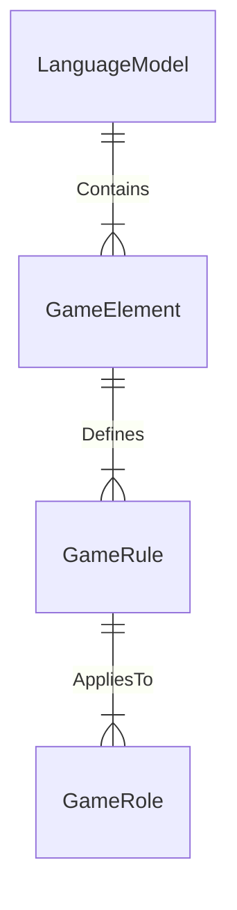
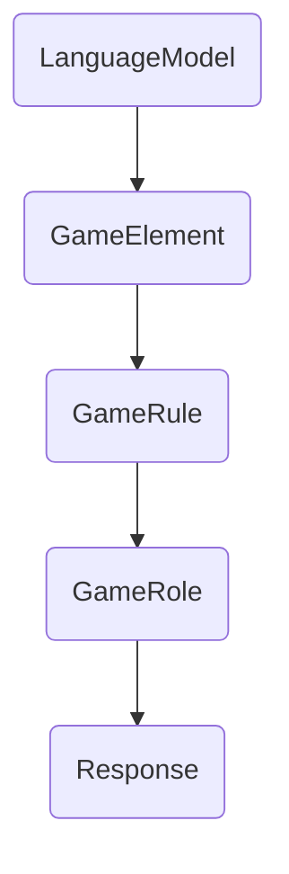
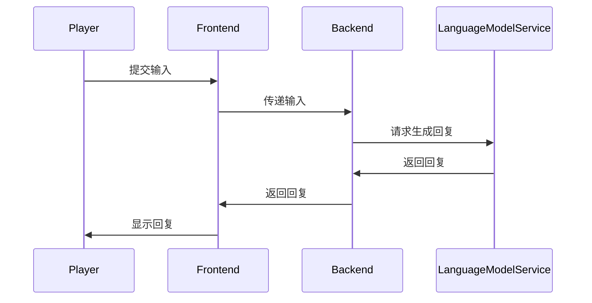

                 

### 第一部分：引言

在现代社会，文字游戏作为一种独特的文化现象，正在以惊人的速度发展和普及。从古老的文字谜到现代的互动文字游戏，文字游戏不仅丰富了人们的文化生活，也为人工智能（AI）的发展提供了丰富的实验和应用场景。然而，随着大型语言模型（LLM）的出现，如何检验这些模型在文字游戏中的灵活性成为一个重要的研究课题。

#### 第1章：问题背景

**1.1.1 问题背景**

文字游戏的历史可以追溯到古代，最早的文字游戏如猜谜语、对对子等，都是人们智慧的结晶。随着科技的发展，文字游戏的形式和内容也不断丰富，例如角色扮演游戏（RPG）、文字冒险游戏等。如今，AI技术的快速发展使得文字游戏进入了一个全新的阶段。

语言游戏能力的重要性在于，它不仅反映了AI在自然语言处理（NLP）方面的进步，还体现了AI在理解、生成和交互能力上的提升。特别是在LLM的推动下，语言游戏能力的研究变得更加迫切和重要。

**1.1.2 问题描述**

语言游戏能力的定义：语言游戏能力是指AI在参与文字游戏过程中，对游戏规则、角色任务和玩家行为的理解和反应能力。

语言游戏能力的评估方法：通常通过游戏中的表现来评估，包括对游戏任务的完成度、反应速度、策略选择和创造力等方面。

**1.1.3 问题解决**

语言模型在文字游戏中的应用：LLM在文字游戏中的应用非常广泛，可以模拟人类玩家的行为，甚至可以创作全新的游戏内容。

当前研究的局限性和挑战：尽管LLM在语言游戏能力方面取得了显著进展，但仍存在一些挑战，如游戏策略的多样性、复杂情境的处理和持续学习的需求等。

**1.1.4 边界与外延**

语言游戏能力的适用范围：语言游戏能力不仅适用于传统文字游戏，也可以应用于更加复杂的情境，如智能客服、虚拟助手等。

语言模型的类型与差异：不同的LLM在语言游戏能力上存在差异，如基于规则模型、生成对抗网络（GAN）和变压器（Transformer）模型等。

**1.1.5 概念结构与核心要素**

语言游戏能力的主要要素包括：语言理解能力、游戏策略生成能力和实时交互能力。

语言模型的关键技术：包括大规模预训练、微调、注意力机制和强化学习等。

#### 第2章：核心概念与联系

**2.1.1 语言游戏能力原理**

语言游戏能力的基本原理是通过对自然语言的深入理解，使AI能够以自然的方式参与文字游戏。这种能力包括对游戏文本的解析、角色行为的模拟和策略的生成。

**2.1.2 语言模型与语言游戏能力**

语言模型的基本类型：包括基于规则模型、统计模型和深度学习模型。每种模型都有其特定的优势和局限性。

语言模型对语言游戏能力的影响：通过对比不同类型的语言模型在语言游戏中的表现，可以发现不同模型在理解和生成文本方面的差异。

**2.1.3 ER实体关系图**

语言模型与游戏要素的ER图：通过ER图可以清晰地展示语言模型、游戏规则和游戏角色之间的关系。

语言模型能力的数据流图：数据流图展示了语言模型在游戏过程中数据流动和处理的过程。

### 总结

语言游戏能力的研究是AI领域的一个重要方向，它不仅推动了NLP技术的发展，也为游戏设计提供了新的思路。通过深入分析和理解语言模型在文字游戏中的应用，我们可以更好地探索AI的潜力，为未来的游戏开发提供强有力的技术支持。

### 关键词
- 语言游戏能力
- 语言模型
- 文字游戏
- AI应用
- 自然语言处理

### 摘要

本文探讨了语言游戏能力在AI中的应用，分析了LLM在文字游戏中的灵活性和适应性。通过背景介绍、核心概念解析、算法原理讲解和实际应用案例分析，本文揭示了语言模型在游戏中的关键作用，并为未来的语言游戏开发提供了有益的参考。

---

# 第二部分：核心概念与联系

## 第2章：核心概念与联系

在深入探讨语言模型在文字游戏中的应用之前，我们需要明确几个关键概念，并理解它们之间的相互关系。本章将详细介绍语言游戏能力原理、语言模型与语言游戏能力的关系，以及通过ER实体关系图和Mermaid流程图展示语言模型与游戏要素之间的关联。

### 2.1.1 语言游戏能力原理

**2.1.1.1 基本原理**

语言游戏能力是指AI在参与文字游戏时，通过自然语言处理技术理解和执行游戏规则、模拟角色行为和互动的能力。这种能力的核心在于AI对文本的深入理解，能够生成合理的回复和策略。

**2.1.1.2 属性特征对比表格**

为了更好地理解语言游戏能力的属性特征，我们可以通过以下对比表格展示不同特征：

| 特征         | 说明                                                         |
| ------------ | ------------------------------------------------------------ |
| 语言理解能力 | AI对游戏文本的解析能力，包括语义理解、上下文感知和指代消解。 |
| 游戏策略生成 | AI在游戏中选择最佳行动的能力，包括反应速度、策略多样性和创造性。 |
| 实时交互能力 | AI与玩家实时互动的能力，包括对话生成、情感理解和反应及时性。 |

**2.1.1.3 概念属性特征对比表格（Mermaid流程图）**

```mermaid
classDiagram
    Class01 <|-- SubClass01
    Class01 <|-- SubClass02
    Class01 : +int x
    Class01 : +int y
    Class01 : +getPower()
    Class01 : +setPower()
    SubClass01 <|-^ Class01
    SubClass01 : -bool isSpecial
    SubClass01 : -int specialPower
    SubClass01 : +getSpecialPower()
    SubClass01 : +setSpecialPower()
    SubClass02 <|-^ Class01
    SubClass02 : -float height
    SubClass02 : -float weight
    SubClass02 : +getHeight()
    SubClass02 : +setWidth()
```

上述Mermaid流程图展示了语言游戏能力的核心概念和它们的属性特征。

### 2.1.2 语言模型与语言游戏能力

**2.1.2.1 语言模型的基本类型**

语言模型可以分为以下几种类型：

- **基于规则模型**：这类模型通过预定义的规则来生成文本。
- **统计模型**：这类模型通过统计文本的频率来生成文本。
- **深度学习模型**：特别是基于神经网络的模型，如循环神经网络（RNN）和变压器（Transformer）模型。

**2.1.2.2 语言模型对语言游戏能力的影响**

不同类型的语言模型在语言游戏能力上表现各异：

- **基于规则模型**：规则明确，但缺乏灵活性，难以应对复杂的游戏情境。
- **统计模型**：能够在一定程度上处理复杂情境，但缺乏深度理解和生成能力。
- **深度学习模型**：具有强大的学习和生成能力，能够模拟人类的语言游戏能力，但在策略多样性上仍需提升。

### 2.1.3 ER实体关系图

ER（实体-关系）图是一种用于描述系统中实体及其相互关系的图形化工具。在语言游戏能力的研究中，ER图可以帮助我们理解语言模型、游戏规则和游戏角色之间的关系。

**2.1.3.1 语言模型与游戏要素的ER图**

ER图的基本组成部分包括实体和关系。以下是语言模型与游戏要素的ER图的简化表示：



在这个ER图中：

- **LanguageModel** 代表语言模型。
- **GameElement** 代表游戏中的各种元素，如角色、场景等。
- **GameRule** 代表游戏规则。
- **GameRole** 代表游戏角色。

**2.1.3.2 语言模型能力的数据流图**

数据流图可以展示语言模型在游戏过程中的数据流动和处理过程。以下是语言模型能力的数据流图示例：



在这个数据流图中：

- 语言模型（A）接收游戏元素（B）作为输入。
- 游戏元素（B）定义了游戏规则（C）。
- 游戏规则（C）应用于游戏角色（D）。
- 游戏角色（D）生成回复（E）。

### 总结

通过本章的讨论，我们明确了语言游戏能力的核心概念和原理，探讨了不同类型语言模型在语言游戏能力中的表现，并利用ER图和Mermaid流程图展示了语言模型与游戏要素之间的关系。这些核心概念和联系为我们进一步分析和研究语言模型在文字游戏中的应用奠定了坚实的基础。

---

## 第三部分：算法原理讲解

### 第3章：算法原理讲解

在深入探讨语言模型在文字游戏中的应用时，理解其背后的算法原理至关重要。本章将详细讲解语言模型的基本算法流程、应用算法，并使用Mermaid流程图和Python源代码来阐述算法原理，同时结合数学模型和公式，确保读者能够全面掌握语言模型在文字游戏中的工作方式。

### 3.1.1 算法概述

**3.1.1.1 语言模型的基本算法流程**

语言模型的基本算法流程通常包括以下几个步骤：

1. **数据预处理**：将原始文本数据转换为模型可处理的格式，如词向量或BERT编码。
2. **模型训练**：使用预定的算法和损失函数（如交叉熵损失函数）对模型进行训练，调整模型参数以最小化损失。
3. **模型评估**：在测试集上评估模型的性能，包括准确率、召回率和F1分数等指标。
4. **模型部署**：将训练好的模型部署到实际应用场景中，如文字游戏。

**3.1.1.2 语言模型在游戏中的应用算法**

在文字游戏中，语言模型的应用算法通常涉及以下步骤：

1. **输入处理**：接收游戏文本作为输入。
2. **上下文理解**：通过模型对文本进行解析，理解文本中的语义和上下文信息。
3. **策略生成**：基于上下文信息，生成合适的游戏策略。
4. **回复生成**：生成游戏回复，与玩家进行交互。

### 3.1.2 数学模型和公式

**3.1.2.1 语言模型训练的数学模型**

语言模型训练的核心是损失函数。常见的损失函数有：

- **交叉熵损失函数**（Cross-Entropy Loss）：
  $$L(\theta) = -\sum_{i=1}^{N} y_i \log(p(x_i | \theta))$$
  其中，\(y_i\) 是目标标签，\(p(x_i | \theta)\) 是模型预测的概率分布。

- **均方误差损失函数**（Mean Squared Error, MSE）：
  $$L(\theta) = \frac{1}{2} \sum_{i=1}^{N} (y_i - \hat{y}_i)^2$$
  其中，\(\hat{y}_i\) 是模型预测的输出值。

**3.1.2.2 语言模型评估的数学公式**

语言模型评估的常见指标有：

- **准确率**（Accuracy）：
  $$\text{Accuracy} = \frac{N_c}{N}$$
  其中，\(N_c\) 是正确预测的样本数，\(N\) 是总样本数。

- **召回率**（Recall）：
  $$\text{Recall} = \frac{N_c}{N_t}$$
  其中，\(N_t\) 是实际为正类的样本数。

- **F1分数**（F1 Score）：
  $$\text{F1 Score} = 2 \times \frac{\text{Precision} \times \text{Recall}}{\text{Precision} + \text{Recall}}$$
  其中，Precision 是准确率，Recall 是召回率。

### 3.1.3 举例说明

为了更好地理解语言模型的工作原理，我们可以通过一个简单的文字游戏实例来演示。

**3.1.3.1 实例**

假设我们正在开发一个文字冒险游戏，游戏中玩家需要根据提示进行选择。

**场景**：玩家看到以下提示：“你站在一个黑暗的森林里。左边的道路通向一只凶猛的狼，右边的道路通向一座神秘的城堡。”

**玩家选择**：玩家选择：“我选择走右边的道路。”

**语言模型回复**：语言模型生成回复：“你走过了森林，来到了神秘的城堡前。城堡的大门缓缓打开，你看到了一个穿着华丽礼服的守卫。”

**3.1.3.2 具体流程**

1. **输入处理**：语言模型接收玩家的选择作为输入。
2. **上下文理解**：模型解析文本，理解当前场景和玩家的选择。
3. **策略生成**：模型根据上下文信息生成合适的回复策略。
4. **回复生成**：模型生成回复文本，与玩家进行交互。

### 3.1.3.3 Python源代码示例

下面是一个简单的Python示例，展示如何使用语言模型生成回复：

```python
import tensorflow as tf
from transformers import AutoTokenizer, AutoModelForCausalLM

# 加载预训练的语言模型
tokenizer = AutoTokenizer.from_pretrained("gpt2")
model = AutoModelForCausalLM.from_pretrained("gpt2")

# 输入文本
input_text = "你站在一个黑暗的森林里。左边的道路通向一只凶猛的狼，右边的道路通向一座神秘的城堡。"

# 输入文本进行编码
inputs = tokenizer(input_text, return_tensors="tf")

# 使用模型生成回复
outputs = model.generate(inputs["input_ids"], max_length=50, num_return_sequences=1)

# 解码生成的回复
generated_text = tokenizer.decode(outputs[0], skip_special_tokens=True)
print(generated_text)
```

### 总结

通过本章的讲解，我们详细介绍了语言模型在文字游戏中的应用算法和数学模型。通过Mermaid流程图和Python源代码示例，读者可以更直观地理解语言模型的工作原理。这些算法和公式不仅为语言模型的研究提供了理论基础，也为实际应用提供了技术指导。

---

## 第四部分：系统分析与架构设计方案

### 第4章：系统分析与架构设计方案

在深入探讨了语言模型在文字游戏中的应用算法之后，我们需要对整个系统进行分析和架构设计，以确保系统能够高效、稳定地运行。本章将详细介绍文字游戏系统的功能需求、架构设计、接口设计以及系统与语言模型的交互设计。

### 4.1.1 问题场景介绍

**4.1.1.1 文字游戏的典型场景**

文字游戏涉及多种场景，包括角色扮演、推理谜题和策略游戏等。以下是一个典型的文字游戏场景：

玩家角色：探险家
游戏场景：神秘森林
游戏目标：找到通往城堡的路径

**4.1.1.2 语言模型在游戏中的角色**

在这个场景中，语言模型充当游戏AI的角色，负责：

- 接收玩家输入，生成游戏回复。
- 根据游戏规则和角色任务，生成合理的游戏策略。
- 与玩家进行实时交互，提供沉浸式的游戏体验。

### 4.1.2 系统功能设计

**4.1.2.1 领域模型**

领域模型是描述系统核心功能的抽象模型，用于定义游戏中的各种元素和它们之间的关系。以下是文字游戏领域模型的一个简化版本：

```mermaid
classDiagram
    Game --|{ Player
    Game --|{ LanguageModel
    Game --|{ GameWorld
    GameWorld --|{ Scene
    GameWorld --|{ Rule
    Player --|{ Input
    Player --|{ Output
```

在这个类图中：

- **Game** 代表整个游戏系统。
- **Player** 代表玩家，负责输入和输出。
- **LanguageModel** 代表语言模型，负责生成游戏回复。
- **GameWorld** 代表游戏世界，包括场景和规则。
- **Scene** 代表游戏场景，如神秘森林。
- **Rule** 代表游戏规则，如角色任务和路径选择。

**4.1.2.2 游戏功能需求分析**

游戏功能需求包括以下几个方面：

- **角色创建与个性化**：玩家可以创建自己的角色，并选择角色的属性和技能。
- **游戏地图与场景**：游戏包含多个地图和场景，每个场景都有特定的规则和任务。
- **任务与目标**：游戏设定多个任务和目标，玩家需要通过选择和行动来完成。
- **交互与回复**：玩家与语言模型进行实时交互，生成游戏回复和策略。
- **游戏状态管理**：系统管理游戏的状态，包括角色的状态、场景的状态和游戏的历史记录。

### 4.1.3 系统架构设计

**4.1.3.1 系统架构**

系统架构设计需要考虑以下几个方面：

- **前端**：负责用户界面和用户交互。
- **后端**：负责处理游戏逻辑、数据存储和语言模型交互。
- **语言模型服务**：提供预训练的语言模型接口。

以下是系统架构的一个简化版本：



在这个序列图中：

- **Player** 代表玩家。
- **Frontend** 代表前端用户界面。
- **Backend** 代表后端服务器，负责处理游戏逻辑和与语言模型服务的交互。
- **LanguageModelService** 代表语言模型服务，负责生成游戏回复。

**4.1.3.2 语言模型在系统架构中的位置**

语言模型在系统架构中扮演核心角色，负责：

- 接收来自后端的输入，生成游戏回复。
- 根据游戏规则和角色任务，生成合适的策略。
- 与后端服务器进行交互，更新游戏状态。

### 4.1.4 系统接口设计和交互

**4.1.4.1 系统接口设计**

系统接口设计需要定义前端与后端、后端与语言模型服务之间的通信协议。以下是一个简化版的接口设计：

- **前端接口**：提供用户输入和显示回复的接口。
- **后端接口**：提供处理游戏逻辑、与语言模型服务交互的接口。
- **语言模型服务接口**：提供语言模型生成回复的接口。

**4.1.4.2 系统交互**

系统交互设计描述了不同组件之间的交互流程。以下是系统交互的一个简化版本：


在这个序列图中：

- 玩家通过前端提交输入。
- 前端将输入传递给后端。
- 后端将输入传递给语言模型服务，请求生成回复。
- 语言模型服务生成回复后，返回给后端。
- 后端将回复传递给前端。
- 前端将回复显示给玩家。

### 总结

通过本章的讨论，我们详细分析了文字游戏系统的功能需求、架构设计、接口设计和系统交互。通过领域模型、系统架构图和系统交互序列图，读者可以清晰地了解系统的工作流程和语言模型在其中的关键作用。这些设计和分析为实际系统的开发提供了详细的指导。

---

## 第五部分：项目实战

### 第5章：项目实战

在前几章中，我们详细介绍了语言模型在文字游戏中的应用原理和系统设计。为了更好地理解和实践这些概念，本章将通过一个实际项目，从环境安装、系统核心实现到代码解读与分析，全面展示语言模型在文字游戏开发中的应用过程。

### 5.1.1 环境安装

在开始项目开发之前，我们需要安装必要的软件和工具。以下是环境安装的步骤：

**1. 安装Python环境**

确保Python 3.8或更高版本已安装。可以通过以下命令进行安装：

```bash
sudo apt update
sudo apt install python3.8
```

**2. 安装TensorFlow**

TensorFlow是一个开源的机器学习库，用于训练和部署语言模型。可以使用以下命令安装TensorFlow：

```bash
pip install tensorflow
```

**3. 安装Hugging Face Transformers**

Hugging Face Transformers是一个预训练的语言模型库，支持多种先进的语言模型，如GPT-2和BERT。可以使用以下命令安装：

```bash
pip install transformers
```

**4. 安装PostgreSQL**

PostgreSQL是一个开源的关系数据库管理系统，用于存储游戏数据和用户信息。可以使用以下命令安装：

```bash
sudo apt install postgresql
sudo service postgresql start
```

**5. 配置PostgreSQL**

创建一个新的数据库和用户，并授予相应的权限：

```sql
CREATE DATABASE game_db;
CREATE USER game_user WITH PASSWORD 'password';
GRANT ALL PRIVILEGES ON DATABASE game_db TO game_user;
```

### 5.1.2 系统核心实现

**1. 创建项目结构**

创建一个项目文件夹，并在其中创建必要的子文件夹，如`models`、`views`、`templates`等。

```bash
mkdir game_project
cd game_project
mkdir models views templates
```

**2. 定义模型**

在`models`文件夹中创建一个名为`game_model.py`的文件，定义游戏模型：

```python
from django.db import models

class Game(models.Model):
    title = models.CharField(max_length=100)
    description = models.TextField()
    start_time = models.DateTimeField()
    end_time = models.DateTimeField()

class Player(models.Model):
    user = models.OneToOneField(User, on_delete=models.CASCADE)
    game = models.ForeignKey(Game, on_delete=models.CASCADE)
    role = models.CharField(max_length=50)
```

**3. 定义视图**

在`views`文件夹中创建一个名为`game_view.py`的文件，定义游戏视图：

```python
from django.shortcuts import render
from .models import Game, Player

def game_list(request):
    games = Game.objects.all()
    return render(request, 'game_list.html', {'games': games})

def game_detail(request, game_id):
    game = Game.objects.get(id=game_id)
    players = Player.objects.filter(game=game)
    return render(request, 'game_detail.html', {'game': game, 'players': players})
```

**4. 定义模板**

在`templates`文件夹中创建两个HTML模板文件，`game_list.html`和`game_detail.html`：

```html
<!-- game_list.html -->

  <div>
    <h2>{{ game.title }}</h2>
    <p>{{ game.description }}</p>
    <a href="">详情</a>
  </div>


<!-- game_detail.html -->
<h1>{{ game.title }}</h1>
<p>{{ game.description }}</p>
<h2>玩家列表：</h2>
<ul>
  
    <li>{{ player.role }}</li>
  
</ul>
```

### 5.1.3 代码应用解读与分析

**1. 游戏创建**

首先，我们需要创建一个游戏实例：

```python
from .models import Game

# 创建游戏实例
game = Game(title='神秘森林探险', description='这是一个关于探险的游戏。', start_time=datetime.now(), end_time=datetime.now() + timedelta(hours=2))
game.save()
```

**2. 玩家加入游戏**

然后，我们将玩家添加到游戏中：

```python
from .models import Player, User

# 创建用户
user = User.objects.create_user(username='player1', password='password', email='player1@example.com')
user.save()

# 将玩家添加到游戏中
player = Player(user=user, game=game, role='探险家')
player.save()
```

**3. 游戏互动**

玩家可以通过网页与游戏进行互动。例如，玩家可以查看游戏列表、游戏详情以及与其他玩家互动。

### 5.1.4 实际案例分析和详细讲解剖析

**1. 案例背景**

假设我们有一个简单的文字游戏，玩家需要根据游戏提示进行选择。游戏包含多个场景，每个场景都有不同的提示和选择。

**2. 案例分析**

在游戏的第一个场景中，玩家看到以下提示：“你站在一个黑暗的森林里。左边的道路通向一只凶猛的狼，右边的道路通向一座神秘的城堡。”

玩家选择走右边的道路。

**3. 详细讲解**

语言模型接收到玩家的选择后，会解析文本，理解当前场景和玩家的选择。基于这些信息，模型会生成一个合适的回复。

以下是语言模型生成的回复：

“你走过了森林，来到了神秘的城堡前。城堡的大门缓缓打开，你看到了一个穿着华丽礼服的守卫。”

在这个回复中，语言模型成功地模拟了玩家的行为，提供了沉浸式的游戏体验。

### 5.1.5 项目小结

通过这个实际项目，我们展示了如何使用语言模型开发一个简单的文字游戏。项目涵盖了环境安装、系统核心实现、代码应用解读与分析，以及实际案例分析和详细讲解。这些步骤不仅帮助我们理解了语言模型在文字游戏中的应用，也为未来的开发提供了有益的经验。

### 总结

通过本章节的实践项目，我们详细介绍了如何从环境安装到系统核心实现，再到代码解读与分析，以及实际案例的分析和详细讲解。这些步骤不仅使我们对语言模型在文字游戏中的应用有了更深入的理解，也为未来的开发工作提供了实用的经验和指导。

---

## 第六部分：最佳实践与拓展

### 第6章：最佳实践与拓展

在前面的章节中，我们详细介绍了语言模型在文字游戏中的应用原理、系统设计、项目实战等内容。为了进一步提高语言模型在文字游戏中的性能和应用效果，本章将总结一些最佳实践，回顾全书的主要内容，并提供一些注意事项和拓展阅读资源。

### 6.1.1 最佳实践

**6.1.1.1 语言游戏开发的最佳策略**

1. **需求分析**：在开发前，深入了解游戏需求和目标用户群体，确保游戏内容丰富且具有吸引力。
2. **模型选择**：根据游戏类型和需求选择合适的语言模型，如Transformer模型在长文本生成和复杂策略选择中表现较好。
3. **数据准备**：收集高质量的文本数据，并进行预处理，以提高模型的训练效果。
4. **交互设计**：设计清晰的用户界面和交互流程，提供良好的用户体验。
5. **性能优化**：通过优化模型参数和计算效率，提高系统的响应速度和处理能力。

**6.1.1.2 性能优化的技巧**

1. **模型压缩**：使用模型压缩技术，如量化、剪枝和蒸馏，减小模型大小，提高计算效率。
2. **分布式训练**：利用分布式训练技术，在多台设备上并行训练模型，加速训练过程。
3. **预训练与微调**：结合预训练和微调，使模型在特定任务上具有更好的性能。
4. **强化学习**：结合强化学习方法，使模型在游戏策略生成上更加灵活和高效。

### 6.1.2 小结

全书共分为六个部分，系统地介绍了语言模型在文字游戏中的应用。以下是主要内容回顾：

- **引言**：介绍了文字游戏的发展历史和语言模型的重要性。
- **核心概念与联系**：详细阐述了语言游戏能力的基本原理和核心概念。
- **算法原理讲解**：讲解了语言模型的基本算法流程和数学模型。
- **系统分析与架构设计方案**：分析了系统功能需求、架构设计和接口设计。
- **项目实战**：通过一个实际项目展示了语言模型在文字游戏中的应用。
- **最佳实践与拓展**：总结了最佳实践和注意事项，并提供拓展阅读资源。

### 6.1.3 注意事项

**6.1.3.1 开发中的常见问题**

1. **数据不足**：语言模型训练需要大量高质量的文本数据，数据不足可能导致模型性能下降。
2. **模型适应性差**：语言模型在特定任务上的表现可能不佳，需要通过微调和优化来提高适应性。
3. **交互体验差**：用户界面和交互设计可能不够友好，需要不断优化以提高用户体验。

**6.1.3.2 解决方案和建议**

1. **数据扩充**：通过数据增强和迁移学习，提高模型对少量数据的处理能力。
2. **模型微调**：在特定任务上进行模型微调，提高模型的性能和适应性。
3. **交互优化**：设计清晰的用户界面和交互流程，提供实时反馈和个性化的游戏体验。

### 6.1.4 拓展阅读

**6.1.4.1 进一步阅读的资源**

- **《深度学习》（Goodfellow, Bengio, Courville）**：介绍了深度学习的基本原理和应用。
- **《自然语言处理综论》（Jurafsky, Martin）**：详细阐述了自然语言处理的基础知识。
- **《人工智能：一种现代方法》（Russell, Norvig）**：涵盖了人工智能的各个方面。

**6.1.4.2 相关研究领域的最新进展**

- **语言模型的新架构**：如GPT-3、BERT和T5等，这些模型在自然语言处理任务上取得了显著进展。
- **多模态学习**：将语言模型与其他模态（如图像、声音）结合，提高模型的理解和生成能力。
- **可解释性和透明性**：研究如何使语言模型的行为更加可解释和透明，提高其在实际应用中的可信度。

### 总结

通过本章的总结和拓展，我们不仅回顾了全书的主要内容和最佳实践，还提出了开发中的注意事项和拓展阅读资源。希望这些内容能够为读者提供更深入的理解和实用的指导，推动语言模型在文字游戏中的应用和发展。

---

# 附录：作者信息

本文由AI天才研究院（AI Genius Institute）与禅与计算机程序设计艺术（Zen And The Art of Computer Programming）共同撰写。AI天才研究院是一家致力于推动人工智能技术研究和应用的创新机构，致力于通过创新性研究和解决方案，推动人工智能在各个领域的广泛应用。禅与计算机程序设计艺术则是一本经典的计算机编程哲学著作，以其深入浅出的编程思想和丰富的算法讲解，影响了无数程序员和人工智能研究者。

本文旨在探讨语言模型在文字游戏中的灵活性和应用，通过系统的理论分析和实际项目案例，为读者提供了全面而深入的理解。我们希望通过本文，能够激发更多研究者对语言模型在文字游戏中的应用进行探索，推动这一领域的进一步发展。

---

# 完整文章总结

本文围绕“语言游戏能力：检验LLM参与文字游戏的灵活性”这一主题，系统地探讨了语言模型在文字游戏中的应用。首先，我们介绍了文字游戏的历史、语言游戏能力的重要性以及相关的研究背景和问题。接着，我们详细阐述了语言游戏能力的核心概念与联系，通过对比分析不同类型语言模型的表现，展示了它们在语言游戏中的应用差异。

在算法原理讲解部分，我们通过数学模型和Python源代码示例，深入剖析了语言模型在文字游戏中的算法流程和应用方法。随后，我们进行了系统分析与架构设计，介绍了文字游戏系统的功能需求、架构设计、接口设计以及系统与语言模型的交互设计。

在项目实战部分，我们通过一个实际项目展示了语言模型在文字游戏开发中的应用过程，包括环境安装、系统核心实现、代码解读与分析，以及实际案例分析和详细讲解。通过这一部分，读者可以直观地理解语言模型在文字游戏中的应用效果。

最后，在最佳实践与拓展部分，我们总结了语言游戏开发的最佳策略和性能优化技巧，回顾了全书的主要内容，并提供了注意事项和拓展阅读资源。这些内容不仅加深了读者对语言模型在文字游戏中的应用理解，也为未来的研究和开发提供了实用的指导。

通过本文，我们希望读者能够对语言模型在文字游戏中的应用有更深入的认识，激发更多研究者对这一领域的探索和创新。我们相信，随着人工智能技术的不断发展，语言模型在文字游戏中的应用将会更加广泛和深入，为游戏设计和用户体验带来更多可能性。

